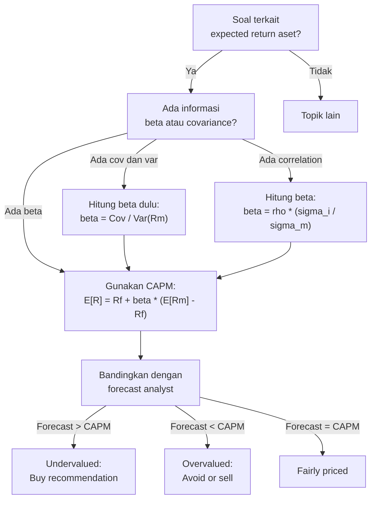

# 📘 7.1 — CAPM and Factor Models

> [!ABSTRACT] Ringkasan Cepat
> **Topik:** CAPM & Factor Models | **Bobot:** ~5–15% | **Difficulty:** Medium
> **Ref:** Ross et al. Bab 12–13 | **Prereq:** [[1.5 NPV, IRR, DWRR, TWRR]]

## Section 0 — Pemetaan Topik

| Topik CF1 | Sub-topik ID | Skill Diuji | Bobot | Difficulty | Prerequisite | Connected Topics | Referensi |
|-----------|--------------|-------------|-------|------------|--------------|------------------|-----------|
| Topik 7: Matematika Keuangan untuk Portofolio | 7.1 | Menghitung expected return menggunakan CAPM; menghitung beta dari covariance dan variance; memahami Security Market Line (SML); interpretasi systematic vs unsystematic risk; single-factor dan multi-factor models; arbitrage pricing theory (APT) basic | 5–15% | Medium | [[1.5 NPV, IRR, DWRR, TWRR]] | [[7.2 Mean-Variance Portfolio Theory]], [[3.1 Spot Rates and Forward Rates]] | Ross Bab 12–13 |

## Section 1 — Intuisi

Bayangkan kamu punya Rp 100 juta yang ingin diinvestasikan di saham. Ada saham teknologi berisiko tinggi dan saham consumer goods stabil. Berapa return yang wajar kamu harapkan dari saham teknologi untuk mengkompensasi risiko ekstra? **Capital Asset Pricing Model (CAPM)** memberikan framework matematis untuk menjawab pertanyaan ini dengan prinsip sederhana: **return yang diharapkan harus sebanding dengan risiko yang ditanggung**.

CAPM membedakan dua jenis risiko: **systematic risk** (risiko pasar yang tidak bisa dihilangkan dengan diversifikasi—seperti resesi ekonomi) dan **unsystematic risk** (risiko spesifik perusahaan yang bisa dihilangkan dengan diversifikasi—seperti skandal CEO satu perusahaan). Investor **hanya dikompensasi** untuk systematic risk, karena unsystematic risk bisa dihilangkan gratis dengan diversifikasi.

**Beta ($\beta$)** adalah ukuran systematic risk: seberapa sensitif return saham terhadap pergerakan pasar. Saham dengan $\beta = 1$ bergerak sejalan dengan pasar. $\beta = 1.5$ berarti saham 50% lebih volatile dari pasar (jika pasar naik 10%, saham ini expected naik 15%). $\beta = 0.5$ berarti saham lebih stabil (separuh volatilitas pasar).

Formula CAPM mengatakan: expected return saham = risk-free rate + beta × market risk premium. Jika risk-free rate 5%, market return 12% (risk premium 7%), maka saham dengan $\beta = 1.5$ harus memberikan expected return $5\% + 1.5 \times 7\% = 15.5\%$ untuk menarik investor. Jika saham ini hanya menawarkan 10%, investor rasional tidak akan beli—lebih baik beli kombinasi risk-free asset dan market portfolio.

**Factor models** adalah generalisasi CAPM yang mengakui bahwa systematic risk bisa berasal dari berbagai sumber, bukan hanya "market risk". Misalnya: company size, value vs growth, momentum. Multi-factor models (seperti Fama-French 3-factor) menambahkan faktor-faktor ini untuk menjelaskan cross-section expected returns lebih baik.

## Section 2 — Definisi Formal

> [!NOTE] Definisi Matematis
> **Capital Asset Pricing Model (CAPM):**
> $$
> E[R_i] = R_f + \beta_i (E[R_m] - R_f)
> $$
> di mana:
> - $E[R_i]$ = Expected return aset $i$
> - $R_f$ = Risk-free rate
> - $\beta_i$ = Beta aset $i$ (systematic risk)
> - $E[R_m]$ = Expected return market portfolio
> - $E[R_m] - R_f$ = Market risk premium (excess return pasar)
>
> **Beta:**
> $$
> \beta_i = \frac{\text{Cov}(R_i, R_m)}{\text{Var}(R_m)} = \frac{\sigma_{i,m}}{\sigma_m^2}
> $$
>
> **Security Market Line (SML):**
> $$
> E[R_i] = R_f + \beta_i \times \text{Market Risk Premium}
> $$
> (garis linear di grafik expected return vs beta)

### Variabel & Parameter

| Simbol | Makna | Unit / Range |
|--------|-------|--------------|
| $R_i$ | Return aktual aset $i$ (realized return) | Decimal atau persen |
| $E[R_i]$ | Expected return aset $i$ (ex-ante) | Decimal atau persen |
| $R_f$ | Risk-free rate (e.g., Treasury rate) | Decimal atau persen, $R_f \geq 0$ |
| $R_m$ | Return market portfolio (realized) | Decimal atau persen |
| $E[R_m]$ | Expected return market portfolio | Decimal atau persen |
| $\beta_i$ | Beta aset $i$ (systematic risk) | Real number, bisa negatif tetapi jarang |
| $\sigma_{i,m}$ | Covariance antara return $i$ dan market | (return unit)$^2$ |
| $\sigma_m^2$ | Variance return market | (return unit)$^2$ |
| $\sigma_i^2$ | Variance return aset $i$ (total risk) | (return unit)$^2$ |
| $\epsilon_i$ | Idiosyncratic error (unsystematic risk) | Decimal, $E[\epsilon_i] = 0$ |

### Rumus Utama

$$
E[R_i] = R_f + \beta_i (E[R_m] - R_f)
$$
**Label:** CAPM formula untuk expected return (equilibrium pricing).

$$
\beta_i = \frac{\text{Cov}(R_i, R_m)}{\text{Var}(R_m)}
$$
**Label:** Beta sebagai normalized covariance dengan market.

$$
\beta_i = \rho_{i,m} \frac{\sigma_i}{\sigma_m}
$$
**Label:** Beta dalam bentuk correlation coefficient $\rho_{i,m}$ dan standard deviations.

$$
R_i = \alpha_i + \beta_i R_m + \epsilon_i
$$
**Label:** Single-factor model (market model). $\alpha_i$ adalah intercept (Jensen's alpha), $\epsilon_i$ adalah unsystematic risk.

$$
E[R_i] = R_f + \beta_{i,1} \lambda_1 + \beta_{i,2} \lambda_2 + \cdots + \beta_{i,k} \lambda_k
$$
**Label:** Multi-factor model. $\lambda_j$ adalah risk premium untuk factor $j$, $\beta_{i,j}$ adalah factor loading.

$$
\text{Total Risk} = \text{Systematic Risk} + \text{Unsystematic Risk}
$$
$$
\sigma_i^2 = \beta_i^2 \sigma_m^2 + \sigma^2(\epsilon_i)
$$
**Label:** Decomposition total variance menjadi systematic dan unsystematic components.

### Asumsi Eksplisit

- **Efficient Markets:** Semua investor punya informasi sama dan markets efficient.
- **Homogeneous Expectations:** Semua investor punya beliefs sama tentang expected returns, variances, covariances.
- **Single-Period Model:** Investors optimize untuk satu periode holding saja.
- **Frictionless Markets:** Tidak ada taxes, transaction costs, atau short-selling constraints.
- **Mean-Variance Optimization:** Investors hanya peduli mean dan variance return (atau returns normally distributed).
- **Complete Diversification:** Investors hold market portfolio untuk systematic risk exposure.
- **Risk-Free Asset Exists:** Ada aset dengan return pasti $R_f$ yang bisa dipinjam/dipinjamkan unlimited tanpa limit.

## Section 3 — Jembatan Logika

> [!TIP] Dari Time Diagram ke Equation of Value
> CAPM formula $E[R_i] = R_f + \beta_i (E[R_m] - R_f)$ muncul dari **no-arbitrage pricing** dengan linear risk-return trade-off:
>
> - **Investor rasional** hanya peduli dengan **expected return** dan **risk**.
> - Dengan diversifikasi, unsystematic risk bisa dihilangkan tanpa cost (hold banyak saham uncorrelated).
> - Yang tersisa adalah **systematic risk** (risk yang tidak bisa di-diversify karena comovement dengan market).
> - **Beta** mengukur seberapa banyak systematic risk yang ditanggung aset $i$: $\beta_i = \text{Cov}(R_i, R_m) / \text{Var}(R_m)$.
> - **Kompensasi** untuk systematic risk adalah linear: jika pasar memberikan risk premium $E[R_m] - R_f$, maka aset dengan $\beta = 2$ harus memberikan risk premium $2 \times (E[R_m] - R_f)$.
>
> **Makna ekonomi $R_f$:** Ini adalah "baseline return" yang bisa didapat tanpa risk. Semua aset riskier harus beat ini.
>
> **Makna ekonomi $\beta_i (E[R_m] - R_f)$:** Ini adalah **compensation for systematic risk**—premium yang diminta investor untuk exposure ke market risk.

> [!IMPORTANT] Focal Date
> CAPM adalah model **ex-ante** (forward-looking): kita prediksi expected return di masa depan. Tidak ada focal date dalam pengertian time value of money—ini adalah model cross-sectional pricing (comparing expected returns across different assets at same time point).

**Derivasi Beta:**

Kita ingin mengukur seberapa sensitif return aset $i$ terhadap return market $m$. Regress return $R_i$ terhadap return market $R_m$:

$$
R_i = \alpha + \beta_i R_m + \epsilon_i
$$

di mana $\epsilon_i$ adalah error term uncorrelated dengan $R_m$ (by construction dari OLS).

Minimize sum of squared errors (OLS):
$$
\min_{\beta_i} \sum (R_i - \alpha - \beta_i R_m)^2
$$

First-order condition (FOC):
$$
\frac{\partial}{\partial \beta_i} \sum (R_i - \alpha - \beta_i R_m)^2 = 0
$$

$$
\sum 2(R_i - \alpha - \beta_i R_m)(-R_m) = 0
$$

$$
\sum R_i R_m = \alpha \sum R_m + \beta_i \sum R_m^2
$$

Dengan mean-centering (subtract means), kita dapat:
$$
\text{Cov}(R_i, R_m) = \beta_i \text{Var}(R_m)
$$

Jadi:
$$
\beta_i = \frac{\text{Cov}(R_i, R_m)}{\text{Var}(R_m)}
$$

**Derivasi CAPM (Simplified):**

Dari portfolio theory (Topik 7.2), kita tahu bahwa **market portfolio** adalah tangency portfolio di efficient frontier. Semua investor rasional hold kombinasi risk-free asset dan market portfolio (two-fund separation).

Expected return any asset harus memenuhi:
$$
E[R_i] = R_f + \frac{E[R_m] - R_f}{\sigma_m^2} \text{Cov}(R_i, R_m)
$$

(dari marginal condition di efficient frontier)

Substitute $\beta_i = \text{Cov}(R_i, R_m) / \sigma_m^2$:
$$
E[R_i] = R_f + \beta_i (E[R_m] - R_f)
$$

Ini adalah **CAPM equation**.

**Systematic vs Unsystematic Risk:**

Total variance aset $i$:
$$
\text{Var}(R_i) = \text{Var}(\beta_i R_m + \epsilon_i)
$$

Karena $\epsilon_i$ uncorrelated dengan $R_m$ (by assumption):
$$
\text{Var}(R_i) = \beta_i^2 \text{Var}(R_m) + \text{Var}(\epsilon_i)
$$

- **Systematic risk:** $\beta_i^2 \sigma_m^2$ (cannot be diversified away)
- **Unsystematic risk:** $\text{Var}(\epsilon_i)$ (can be diversified away)

Dalam portfolio besar, unsystematic risk → 0 (law of large numbers). Hanya systematic risk yang tersisa dan dikompensasi.

> [!DANGER] Dilarang
> 1. **Menggunakan realized return sebagai expected return tanpa justifikasi:** $E[R_i] \neq R_i$ (historical). Expected return adalah forward-looking prediction, bukan backward-looking average.
> 2. **Mencampur total risk dan systematic risk:** CAPM hanya compensate **systematic risk** (beta). Total volatility $\sigma_i$ tidak relevan jika bisa di-diversify.
> 3. **Menggunakan CAPM untuk short-term trading:** CAPM adalah model equilibrium long-run. Tidak valid untuk predicting day-to-day price movements (pasar bisa inefficient short-term).

## Section 4 — Contoh Soal

### Soal A — Fundamental

Risk-free rate adalah $R_f = 4\%$ per tahun. Expected return market portfolio adalah $E[R_m] = 12\%$ per tahun. Saham XYZ memiliki beta $\beta_{\text{XYZ}} = 1.3$. Hitunglah:
(a) Expected return saham XYZ menurut CAPM
(b) Jika investor expect saham XYZ return 15%, apakah saham ini undervalued, overvalued, atau fairly priced?

**Data yang diberikan:**
- $R_f = 0.04$ (4%)
- $E[R_m] = 0.12$ (12%)
- $\beta_{\text{XYZ}} = 1.3$

> [!SUCCESS] Solusi Soal A
> 
> **1. Identifikasi Variabel**
> - $R_f = 0.04$
> - $E[R_m] = 0.12$
> - $\beta_{\text{XYZ}} = 1.3$
> - Dicari: (a) $E[R_{\text{XYZ}}]$ dari CAPM, (b) Valuation assessment
> 
> **2. Time Diagram**
> 
> Tidak ada time diagram untuk CAPM (cross-sectional model, bukan time series). Kita bandingkan expected return dengan required return dari CAPM.
> 
> **3. Equation of Value** *(CAPM Pricing)*
> 
> $$
> E[R_i] = R_f + \beta_i (E[R_m] - R_f)
> $$
> 
> **4. Eksekusi Aljabar**
> 
> **(a) Expected Return dari CAPM:**
> 
> Market risk premium:
> $$
> E[R_m] - R_f = 0.12 - 0.04 = 0.08 \quad (8\%)
> $$
> 
> Expected return XYZ:
> $$
> E[R_{\text{XYZ}}] = R_f + \beta_{\text{XYZ}} (E[R_m] - R_f)
> $$
> 
> $$
> E[R_{\text{XYZ}}] = 0.04 + 1.3 \times 0.08 = 0.04 + 0.104 = 0.144
> $$
> 
> Expected return = **14.4%**
> 
> **(b) Valuation Assessment:**
> 
> CAPM required return: **14.4%**
> Investor's expected return: **15%**
> 
> Karena investor expect **15%** > required **14.4%**, saham ini **undervalued** (offering excess return → good buy).
> 
> **5. Verification**
> 
> Cek logic: Beta 1.3 > 1 (market), jadi expected return harus > market return 12%. 14.4% > 12% ✓
> 
> Logika finansial: Saham dengan beta 1.3 adalah 30% lebih risky dari market (systematic risk). Kompensasi: $0.04 + 1.3 \times 0.08 = 14.4\%$. Jika pasar expect 15% (lebih tinggi), harga saat ini terlalu rendah (underpriced) → akan naik hingga expected return turun ke 14.4%.

> [!WARNING] Exam Tips — Soal A
> **Target waktu:** 2–2.5 menit. **Common trap:** Lupa bahwa beta > 1 berarti expected return harus > market return. Jika $\beta = 1.3$ tetapi $E[R_i] < E[R_m]$, ada error. **Shortcut:** Undervalued jika expected return from forecast > CAPM required return.

---

### Soal B — Exam-Typical

Saham ABC memiliki variance return $\sigma_{\text{ABC}}^2 = 0.09$ (9%). Correlation dengan market adalah $\rho_{\text{ABC},m} = 0.6$. Variance market return adalah $\sigma_m^2 = 0.04$ (4%). Risk-free rate $R_f = 5\%$, expected market return $E[R_m] = 13\%$. Hitunglah:
(a) Beta saham ABC
(b) Expected return saham ABC menurut CAPM
(c) Proportion systematic risk dari total risk saham ABC

**Data yang diberikan:**
- $\sigma_{\text{ABC}}^2 = 0.09$ → $\sigma_{\text{ABC}} = 0.3$ (30%)
- $\sigma_m^2 = 0.04$ → $\sigma_m = 0.2$ (20%)
- $\rho_{\text{ABC},m} = 0.6$
- $R_f = 0.05$, $E[R_m] = 0.13$

> [!SUCCESS] Solusi Soal B
> 
> **1. Identifikasi Variabel**
> - $\sigma_{\text{ABC}} = 0.3$
> - $\sigma_m = 0.2$
> - $\rho_{\text{ABC},m} = 0.6$
> - $R_f = 0.05$, $E[R_m] = 0.13$
> - Dicari: (a) $\beta_{\text{ABC}}$, (b) $E[R_{\text{ABC}}]$, (c) Proportion systematic risk
> 
> **2. Time Diagram**
> 
> N/A (cross-sectional risk-return model)
> 
> **3. Equation of Value**
> 
> Beta dari correlation:
> $$
> \beta_i = \rho_{i,m} \frac{\sigma_i}{\sigma_m}
> $$
> 
> Systematic risk:
> $$
> \text{Systematic Variance} = \beta_i^2 \sigma_m^2
> $$
> 
> CAPM:
> $$
> E[R_i] = R_f + \beta_i (E[R_m] - R_f)
> $$
> 
> **4. Eksekusi Aljabar**
> 
> **(a) Beta saham ABC:**
> 
> $$
> \beta_{\text{ABC}} = \rho_{\text{ABC},m} \frac{\sigma_{\text{ABC}}}{\sigma_m} = 0.6 \times \frac{0.3}{0.2} = 0.6 \times 1.5 = 0.9
> $$
> 
> Beta = **0.9**
> 
> **(b) Expected Return:**
> 
> Market risk premium:
> $$
> E[R_m] - R_f = 0.13 - 0.05 = 0.08 \quad (8\%)
> $$
> 
> Expected return:
> $$
> E[R_{\text{ABC}}] = 0.05 + 0.9 \times 0.08 = 0.05 + 0.072 = 0.122
> $$
> 
> Expected return = **12.2%**
> 
> **(c) Proportion Systematic Risk:**
> 
> Total variance: $\sigma_{\text{ABC}}^2 = 0.09$
> 
> Systematic variance:
> $$
> \beta_{\text{ABC}}^2 \sigma_m^2 = (0.9)^2 \times 0.04 = 0.81 \times 0.04 = 0.0324
> $$
> 
> Proportion:
> $$
> \frac{\text{Systematic Variance}}{\text{Total Variance}} = \frac{0.0324}{0.09} = 0.36 \quad (36\%)
> $$
> 
> Unsystematic risk proportion: $1 - 0.36 = 0.64$ (64%)
> 
> **5. Verification**
> 
> Cek beta: $0.9 < 1$ (defensive stock) → expected return harus antara $R_f$ dan $E[R_m]$: $5\% < 12.2\% < 13\%$ ✓
> 
> Logika finansial: Saham ABC punya correlation 0.6 dengan market (moderate), total volatility 30% (cukup tinggi). Tetapi hanya 36% dari volatility ini adalah systematic (market-related). Sisanya 64% adalah idiosyncratic (specific firm risk) yang bisa di-diversify. Investor hanya dikompensasi untuk 36% systematic portion → expected return 12.2% (antara risk-free 5% dan market 13%).

> [!WARNING] Exam Tips — Soal B
> **Target waktu:** 3.5–4 menit. **Common trap:** Menggunakan total volatility $\sigma_i$ langsung untuk pricing—CAPM hanya pakai beta (systematic component). **Shortcut:** Systematic risk proportion = $R^2$ dari regression (di sini $\rho^2 = 0.36$).

---

### Soal C — Challenging

Portfolio kamu terdiri dari tiga aset dengan weights dan betas sebagai berikut:

| Aset | Weight | Beta |
|------|--------|------|
| Saham A | 40% | 1.2 |
| Saham B | 30% | 0.8 |
| Saham C | 30% | 1.5 |

Risk-free rate $R_f = 6\%$. Market risk premium $E[R_m] - R_f = 7\%$. Hitunglah:
(a) Beta portfolio
(b) Expected return portfolio menurut CAPM
(c) Jika kamu ingin target expected return portfolio 13.5%, berapa weight saham A yang harus kamu adjust (assume weights B dan C tetap dalam ratio 30:30 = 1:1, dan sisanya di A)?

**Data yang diberikan:**
- Weights: $w_A = 0.4$, $w_B = 0.3$, $w_C = 0.3$
- Betas: $\beta_A = 1.2$, $\beta_B = 0.8$, $\beta_C = 1.5$
- $R_f = 0.06$, market risk premium = $0.07$

> [!SUCCESS] Solusi Soal C
> 
> **1. Identifikasi Variabel**
> - $w_A = 0.4$, $w_B = 0.3$, $w_C = 0.3$
> - $\beta_A = 1.2$, $\beta_B = 0.8$, $\beta_C = 1.5$
> - $R_f = 0.06$, $E[R_m] - R_f = 0.07$
> - Dicari: (a) $\beta_p$, (b) $E[R_p]$, (c) New $w_A$ untuk $E[R_p] = 0.135$
> 
> **2. Time Diagram**
> 
> N/A
> 
> **3. Equation of Value**
> 
> Portfolio beta (weighted average):
> $$
> \beta_p = \sum_i w_i \beta_i
> $$
> 
> Portfolio expected return:
> $$
> E[R_p] = R_f + \beta_p (E[R_m] - R_f)
> $$
> 
> **4. Eksekusi Aljabar**
> 
> **(a) Beta Portfolio:**
> 
> $$
> \beta_p = w_A \beta_A + w_B \beta_B + w_C \beta_C
> $$
> 
> $$
> \beta_p = 0.4 \times 1.2 + 0.3 \times 0.8 + 0.3 \times 1.5
> $$
> 
> $$
> \beta_p = 0.48 + 0.24 + 0.45 = 1.17
> $$
> 
> Portfolio beta = **1.17**
> 
> **(b) Expected Return Portfolio:**
> 
> $$
> E[R_p] = R_f + \beta_p (E[R_m] - R_f)
> $$
> 
> $$
> E[R_p] = 0.06 + 1.17 \times 0.07 = 0.06 + 0.0819 = 0.1419
> $$
> 
> Expected return = **14.19%**
> 
> **(c) New Weight untuk Target Return 13.5%:**
> 
> Target: $E[R_p] = 0.135$
> 
> Dari CAPM, target beta:
> $$
> 0.135 = 0.06 + \beta_p^{\text{new}} \times 0.07
> $$
> 
> $$
> \beta_p^{\text{new}} = \frac{0.135 - 0.06}{0.07} = \frac{0.075}{0.07} = 1.071
> $$
> 
> Weights constraint: $w_B = w_C$ (equal), dan $w_A + w_B + w_C = 1$.
> 
> Let $w_B = w_C = x$, maka $w_A = 1 - 2x$.
> 
> Portfolio beta:
> $$
> \beta_p^{\text{new}} = (1 - 2x) \times 1.2 + x \times 0.8 + x \times 1.5
> $$
> 
> $$
> 1.071 = 1.2 - 2.4x + 0.8x + 1.5x
> $$
> 
> $$
> 1.071 = 1.2 - 0.1x
> $$
> 
> $$
> 0.1x = 1.2 - 1.071 = 0.129
> $$
> 
> $$
> x = 1.29
> $$
> 
> **Error:** $x > 1$ tidak mungkin (weight tidak bisa > 100% total, kecuali leverage).
> 
> **Reinterpretasi:**
> 
> Hitung ulang. Jika target beta = 1.071 < current beta = 1.17, kita perlu **reduce exposure** ke high-beta assets (A dan C), increase exposure ke low-beta asset B.
> 
> Let $w_A = w$ (unknown), $w_B = w_C = (1-w)/2$ (equal split sisanya).
> 
> $$
> \beta_p = w \times 1.2 + \frac{1-w}{2} \times 0.8 + \frac{1-w}{2} \times 1.5
> $$
> 
> $$
> 1.071 = 1.2w + \frac{1-w}{2}(0.8 + 1.5)
> $$
> 
> $$
> 1.071 = 1.2w + \frac{1-w}{2} \times 2.3
> $$
> 
> $$
> 1.071 = 1.2w + 1.15(1-w)
> $$
> 
> $$
> 1.071 = 1.2w + 1.15 - 1.15w
> $$
> 
> $$
> 1.071 = 1.15 + 0.05w
> $$
> 
> $$
> 0.05w = 1.071 - 1.15 = -0.079
> $$
> 
> $$
> w = \frac{-0.079}{0.05} = -1.58
> $$
> 
> **Error lagi:** Negative weight (short selling A).
> 
> **Alternative interpretation:** Target return 13.5% < current 14.19% → perlu **reduce beta**. Jika tidak allow short selling dan must keep B = C, problem might be infeasible with given constraints, OR kita bisa invest portion di risk-free asset.
> 
> **Revised approach (allow risk-free):**
> 
> Let $w_{\text{risky}} = $ weight di current portfolio (beta 1.17, ER 14.19%), dan $1 - w_{\text{risky}}$ di risk-free.
> 
> $$
> E[R_p] = w_{\text{risky}} \times 0.1419 + (1 - w_{\text{risky}}) \times 0.06
> $$
> 
> Set = 0.135:
> $$
> 0.135 = w_{\text{risky}} \times 0.1419 + 0.06 - 0.06 w_{\text{risky}}
> $$
> 
> $$
> 0.135 = 0.06 + w_{\text{risky}} (0.1419 - 0.06)
> $$
> 
> $$
> 0.075 = w_{\text{risky}} \times 0.0819
> $$
> 
> $$
> w_{\text{risky}} = \frac{0.075}{0.0819} \approx 0.9157
> $$
> 
> Weight in stocks: 91.57%, weight in risk-free: 8.43%.
> 
> Within risky portion, keep original proportions:
> - Saham A: $0.9157 \times 0.4 = 0.3663$ (36.63%)
> - Saham B: $0.9157 \times 0.3 = 0.2747$ (27.47%)
> - Saham C: $0.9157 \times 0.3 = 0.2747$ (27.47%)
> - Risk-free: 8.43%
> 
> **5. Verification**
> 
> Portfolio beta (including risk-free):
> $$
> \beta_p = 0.9157 \times 1.17 + 0.0843 \times 0 = 1.071
> $$
> 
> Expected return:
> $$
> E[R_p] = 0.06 + 1.071 \times 0.07 = 0.135 \quad (13.5\%)
> $$
> ✓
> 
> Logika finansial: Current portfolio terlalu aggressive (beta 1.17, ER 14.19%). Untuk turunkan ke target 13.5%, kita invest ~8.4% di risk-free (beta 0) dan sisanya di risky portfolio asli. Ini menurunkan beta portfolio ke 1.071 dan ER ke 13.5%.

> [!WARNING] Exam Tips — Soal C
> **Target waktu:** 5–6 menit. **Common trap:** Lupa bahwa portfolio beta adalah **weighted average** beta individual assets. **Shortcut:** Jika target ER antara $R_f$ dan current ER, solve dengan mix risky portfolio + risk-free.

## Section 5 — Verifikasi & Sanity Check

> [!CHECK] Beta Bounds
> 1. **Beta market portfolio = 1:** $\beta_m = \text{Cov}(R_m, R_m) / \text{Var}(R_m) = \sigma_m^2 / \sigma_m^2 = 1$.
> 2. **Beta risk-free = 0:** $\beta_f = \text{Cov}(R_f, R_m) / \text{Var}(R_m) = 0$ (risk-free tidak covariate dengan market).
> 3. **Typical range:** Most stocks $0.5 < \beta < 2$. Negative beta sangat jarang (gold stocks sometimes).

> [!CHECK] Expected Return Consistency
> 1. **If $\beta > 1$:** $E[R_i] > E[R_m]$. Aggressive stocks harus beat market expected return.
> 2. **If $\beta < 1$:** $R_f < E[R_i] < E[R_m]$. Defensive stocks antara risk-free dan market.
> 3. **If $\beta = 0$:** $E[R_i] = R_f$. No systematic risk → no risk premium.

> [!CHECK] Portfolio Beta
> 1. **Weighted average:** $\beta_p = \sum w_i \beta_i$. Portfolio beta adalah linear combination.
> 2. **Diversification effect:** Portfolio beta tidak turun dengan diversification (hanya unsystematic risk yang turun). Systematic risk tetap determined by weighted beta.

### Metode Alternatif

**Estimasi Beta dari Historical Data:**

Jika historical returns tersedia, estimate beta dengan **OLS regression**:
$$
R_{i,t} - R_{f,t} = \alpha_i + \beta_i (R_{m,t} - R_{f,t}) + \epsilon_{i,t}
$$

Slope $\beta_i$ dari regression adalah beta estimate. Intercept $\alpha_i$ (Jensen's alpha) mengukur excess return beyond CAPM prediction.

**Multi-Factor Models:**

Fama-French 3-Factor Model:
$$
E[R_i] - R_f = \beta_{i,m} (E[R_m] - R_f) + \beta_{i,\text{SMB}} E[\text{SMB}] + \beta_{i,\text{HML}} E[\text{HML}]
$$

di mana:
- SMB = Small Minus Big (size premium)
- HML = High Minus Low (value premium)

Arbitrage Pricing Theory (APT) meng-generalize ke $k$ factors arbitrary.

## Section 6 — Visualisasi Mental

**Security Market Line (SML):**

Grafik dengan **sumbu X = beta ($\beta$)**, **sumbu Y = expected return ($E[R]$)**.

SML adalah **garis lurus**:
- Intercept: $(0, R_f)$ (beta = 0 → expected return = risk-free rate)
- Slope: Market risk premium $E[R_m] - R_f$
- Point $(1, E[R_m])$: Market portfolio (beta = 1, expected return = market expected return)

Semua assets yang **fairly priced** terletak **on the line**. Assets **above the line** are undervalued (offering excess return for given beta). Assets **below the line** are overvalued (insufficient return for risk).

**Characteristic Line (Regression of $R_i$ vs $R_m$):**

Grafik dengan **sumbu X = market return ($R_m$)**, **sumbu Y = asset return ($R_i$)**.

Regression line $R_i = \alpha + \beta R_m + \epsilon$:
- Slope = beta (sensitivity to market)
- Intercept = alpha (Jensen's alpha, should be ~0 if CAPM holds)
- Scatter points around line represent historical returns

**Steeper slope** = higher beta (more sensitive to market). **Flatter slope** = lower beta (defensive).

### Hubungan Visual ↔ Rumus

**Slope SML:**
$$
\frac{dE[R]}{d\beta} = E[R_m] - R_f
$$

Setiap unit increase beta → increase expected return by market risk premium.

**Scatter dari characteristic line** represent unsystematic risk $\epsilon_i$ (deviations from regression line). Tighter scatter (higher $R^2$) → lebih banyak variance explained by market (higher systematic risk proportion).

## Section 7 — Jebakan Umum

> [!BUG] Kesalahan Unit Waktu
> **Contoh Salah:** Risk-free rate annual 5%, tetapi pakai monthly historical returns untuk estimate beta tanpa adjust.
>
> **Benar:** Pastikan semua rates dalam **same frequency** (annual vs monthly). Jika estimate beta dari monthly returns, market risk premium juga harus monthly, atau convert hasil ke annual.

> [!BUG] Kesalahan Konseptual
> 1. **Total risk vs systematic risk:** CAPM hanya compensate **beta** (systematic risk), bukan total volatility $\sigma_i$. High $\sigma_i$ tetapi low $\beta$ tidak justify high expected return.
> 2. **Expected return vs required return:** $E[R_i]$ dari CAPM adalah **required return** (what investors demand). Actual forecast bisa berbeda → mispricing.
> 3. **Historical beta = future beta:** Beta estimate dari historical data mungkin tidak stable. Perlu adjust untuk mean reversion atau fundamental changes.
> 4. **Alpha = skill:** Positive alpha bisa dari luck, bukan skill. Perlu statistical test (t-stat) untuk verify signifikansi.

> [!BUG] Kesalahan Interpretasi Soal
> **Ambiguitas:** Soal mengatakan "expected return 12%" tanpa jelas apakah itu forecast atau CAPM required return.
>
> **Klarifikasi:** "Expected return **dari CAPM**" = required return (output dari model). "Expected return" saja biasanya berarti forecast dari analyst.

> [!CAUTION] Red Flags
> - **"Negative beta":** Sangat jarang, perlu double-check data. Biasanya beta $\geq 0$ untuk most assets.
> - **"Beta >> 2":** Extremely aggressive stock atau leveraged ETF. Verify ini intentional.
> - **"Alpha significantly positive":** Jika persistent, bisa market inefficiency atau measurement error. CAPM assumes alpha = 0 in equilibrium.
> - **"Use total variance for pricing":** Red flag—CAPM tidak menggunakan total variance, hanya systematic (beta).

## Section 8 — Ringkasan Eksekutif

> [!SUMMARY] Must-Remember
> 1. **CAPM formula:**
>    $$
>    E[R_i] = R_f + \beta_i (E[R_m] - R_f)
>    $$
> 2. **Beta definition:**
>    $$
>    \beta_i = \frac{\text{Cov}(R_i, R_m)}{\text{Var}(R_m)} = \rho_{i,m} \frac{\sigma_i}{\sigma_m}
>    $$
> 3. **Portfolio beta:**
>    $$
>    \beta_p = \sum_{i} w_i \beta_i
>    $$
> 4. **Variance decomposition:**
>    $$
>    \sigma_i^2 = \beta_i^2 \sigma_m^2 + \sigma^2(\epsilon_i)
>    $$
> 5. **Market portfolio beta:**
>    $$
>    \beta_m = 1, \quad \beta_f = 0
>    $$

### Kapan Digunakan

- **Trigger keywords:** "CAPM," "beta," "systematic risk," "market risk premium," "Security Market Line," "expected return," "required return," "factor model."
- **Tipe skenario soal:**
  - Hitung expected return given beta dan market parameters.
  - Estimate beta dari covariance, correlation, atau regression.
  - Determine undervalued/overvalued stocks (compare forecast vs CAPM required return).
  - Calculate portfolio beta dan expected return.
  - Decompose total risk into systematic vs unsystematic.

### Kapan TIDAK Boleh Digunakan

- **Jika aset tidak tradable:** CAPM assume aset bisa held in portfolio. Non-tradable assets (human capital, private equity) perlu adjustment.
- **Jika pasar tidak efficient:** CAPM assume efficient markets. Di emerging markets atau crisis periods, CAPM mungkin tidak hold.
- **Untuk short-term trading:** CAPM adalah long-run equilibrium model, bukan short-term prediction tool.

### Quick Decision Tree

---

> [!QUOTE] Follow-up Options
> 1. *"Berikan contoh soal variasi multi-factor model (Fama-French)"*
> 2. *"Jelaskan hubungan [[7.1 CAPM and Factor Models]] dengan [[7.2 Mean-Variance Portfolio Theory]]"*
> 3. *"Buat flashcard 1-halaman untuk topik ini"*

*📖 Ref: Ross et al. Bab 12–13 | 🗓️ 2026-02-17 | #CF1 #CAPM #Beta #Portfolio*
