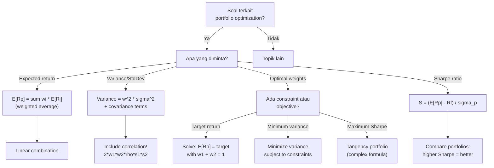

# 📘 7.2 — Mean-Variance Portfolio Theory

> [!ABSTRACT] Ringkasan Cepat
> **Topik:** Mean-Variance Portfolio Theory | **Bobot:** ~5–15% | **Difficulty:** Medium
> **Ref:** Ross et al. Bab 12–13 | **Prereq:** [[7.1 CAPM and Factor Models]]

## Section 0 — Pemetaan Topik

| Topik CF1 | Sub-topik ID | Skill Diuji | Bobot | Difficulty | Prerequisite | Connected Topics | Referensi |
|-----------|--------------|-------------|-------|------------|--------------|------------------|-----------|
| Topik 7: Matematika Keuangan untuk Portofolio | 7.2 | Menghitung expected return dan variance portfolio; memahami diversifikasi; memahami efficient frontier; Capital Market Line (CML); Sharpe ratio; menghitung optimal portfolio weights; interpretasi risk-return trade-off | 5–15% | Medium | [[7.1 CAPM and Factor Models]] | [[1.5 NPV, IRR, DWRR, TWRR]], [[3.1 Spot Rates and Forward Rates]] | Ross Bab 12–13 |

## Section 1 — Intuisi

Bayangkan kamu punya Rp 100 juta untuk investasi. Kamu bisa taruh semua di satu saham teknologi (return tinggi tetapi risiko besar), atau split ke 10 saham berbeda sektor. Intuisi mengatakan diversifikasi lebih aman—jika satu saham jatuh, yang lain mungkin naik. **Mean-Variance Portfolio Theory** mengkuantifikasi intuisi ini dengan matematis presisi: berapa optimal mix aset untuk maximize return given level risk yang bisa ditoleransi, atau minimize risk given target return?

**Harry Markowitz** (Nobel Prize 1990) membuktikan bahwa dengan diversifikasi cerdas, kamu bisa reduce total risk portfolio **tanpa sacrifice expected return**—ini adalah konsep "free lunch" dalam finance. Jika dua saham tidak bergerak perfectly together (correlation < 1), menggabungkan mereka bisa menurunkan volatilitas portfolio di bawah weighted average volatilitas individual assets. Ini karena saat satu saham down, yang lain mungkin up atau stabil, sehingga fluktuasi saling cancel out.

**Efficient frontier** adalah kurva yang menunjukkan semua kombinasi portfolio optimal: untuk setiap level risk (standard deviation), ini adalah portfolio dengan maximum expected return. Tidak ada portfolio yang bisa beat efficient frontier—kalau ada portfolio di atas kurva, itu free lunch (terlalu bagus untuk benar). Portfolio di bawah kurva adalah inefficient (bisa improve return tanpa add risk, atau reduce risk tanpa sacrifice return).

**Capital Market Line (CML)** adalah upgrade efficient frontier dengan tambahan risk-free asset. Investor bisa combine risk-free asset (Treasury bills) dengan **market portfolio** (tangency point di efficient frontier) untuk create linear risk-return profile yang lebih baik. Dengan borrowing/lending di risk-free rate, semua investor rasional akan choose mix antara risk-free asset dan satu risky portfolio yang sama (market portfolio)—ini adalah **two-fund separation theorem**.

**Sharpe Ratio** mengukur "kualitas" return: berapa excess return yang didapat per unit risk yang ditanggung. Portfolio dengan Sharpe ratio tertinggi adalah yang paling efficient—offering best risk-adjusted return. Di ujian CF1, kamu akan calculate portfolio variance dari weights + covariance matrix, plot efficient frontier conceptually, dan calculate Sharpe ratio.

## Section 2 — Definisi Formal

> [!NOTE] Definisi Matematis
> **Portfolio Expected Return (Linear):**
> $$
> E[R_p] = \sum_{i=1}^{n} w_i E[R_i]
> $$
>
> **Portfolio Variance (dengan Covariances):**
> $$
> \sigma_p^2 = \sum_{i=1}^{n} \sum_{j=1}^{n} w_i w_j \text{Cov}(R_i, R_j)
> $$
> atau dalam bentuk matrix:
> $$
> \sigma_p^2 = \mathbf{w}^T \boldsymbol{\Sigma} \mathbf{w}
> $$
>
> **Two-Asset Portfolio Variance:**
> $$
> \sigma_p^2 = w_1^2 \sigma_1^2 + w_2^2 \sigma_2^2 + 2 w_1 w_2 \text{Cov}(R_1, R_2)
> $$
> $$
> = w_1^2 \sigma_1^2 + w_2^2 \sigma_2^2 + 2 w_1 w_2 \rho_{12} \sigma_1 \sigma_2
> $$
>
> **Sharpe Ratio:**
> $$
> S = \frac{E[R_p] - R_f}{\sigma_p}
> $$
> (excess return per unit total risk)

### Variabel & Parameter

| Simbol | Makna | Unit / Range |
|--------|-------|--------------|
| $w_i$ | Weight aset $i$ dalam portfolio | Decimal, $\sum w_i = 1$ |
| $E[R_i]$ | Expected return aset $i$ | Decimal atau persen |
| $E[R_p]$ | Expected return portfolio | Decimal atau persen |
| $\sigma_i$ | Standard deviation return aset $i$ | Decimal atau persen, $\sigma_i \geq 0$ |
| $\sigma_p$ | Standard deviation return portfolio | Decimal atau persen, $\sigma_p \geq 0$ |
| $\sigma_i^2$ | Variance return aset $i$ | (return unit)$^2$ |
| $\sigma_p^2$ | Variance return portfolio | (return unit)$^2$ |
| $\text{Cov}(R_i, R_j)$ | Covariance antara return $i$ dan $j$ | (return unit)$^2$ |
| $\rho_{ij}$ | Correlation coefficient antara $i$ dan $j$ | $-1 \leq \rho_{ij} \leq 1$ |
| $R_f$ | Risk-free rate | Decimal atau persen |
| $S$ | Sharpe ratio | Dimensionless |

### Rumus Utama

$$
E[R_p] = \sum_{i=1}^{n} w_i E[R_i]
$$
**Label:** Portfolio expected return sebagai weighted average (linear property of expectation).

$$
\sigma_p^2 = \sum_{i=1}^{n} w_i^2 \sigma_i^2 + \sum_{i \neq j} w_i w_j \text{Cov}(R_i, R_j)
$$
**Label:** Portfolio variance dengan covariance terms (captures diversification benefit).

$$
\text{Cov}(R_i, R_j) = \rho_{ij} \sigma_i \sigma_j
$$
**Label:** Covariance dalam bentuk correlation dan standard deviations.

$$
\sigma_p^2 = w_1^2 \sigma_1^2 + (1-w_1)^2 \sigma_2^2 + 2 w_1 (1-w_1) \rho_{12} \sigma_1 \sigma_2
$$
**Label:** Two-asset portfolio variance (dengan constraint $w_2 = 1 - w_1$).

$$
S_p = \frac{E[R_p] - R_f}{\sigma_p}
$$
**Label:** Sharpe ratio (reward-to-volatility ratio).

$$
w_1^* = \frac{(E[R_1] - R_f) \sigma_2^2 - (E[R_2] - R_f) \rho_{12} \sigma_1 \sigma_2}{(E[R_1] - R_f) \sigma_2^2 + (E[R_2] - R_f) \sigma_1^2 - (E[R_1] - R_f + E[R_2] - R_f) \rho_{12} \sigma_1 \sigma_2}
$$
**Label [BEYOND CF1]:** Optimal risky portfolio weight untuk tangency portfolio (derivasi advanced, biasanya tidak diuji formula lengkap).

### Asumsi Eksplisit

- **Mean-Variance Preferences:** Investors hanya peduli mean dan variance return (atau returns normally distributed).
- **Single-Period Model:** Optimization untuk satu periode holding.
- **Known Parameters:** Expected returns, variances, covariances diasumsikan known (or estimable).
- **No Transaction Costs:** Rebalancing portfolio tanpa cost.
- **Divisible Assets:** Bisa beli fractional shares.
- **No Short-Selling Constraints (unless stated):** Bisa short selling (negative weights) kecuali soal explisit melarang.

## Section 3 — Jembatan Logika

> [!TIP] Dari Time Diagram ke Equation of Value
> Portfolio theory tidak menggunakan time diagram seperti interest theory, tetapi **mean-variance space** (risk-return plot).
>
> **Expected return portfolio** adalah weighted average karena linearity of expectation:
> $$
> E\left[\sum w_i R_i\right] = \sum w_i E[R_i]
> $$
>
> **Variance portfolio** BUKAN weighted average, karena variance tidak linear:
> $$
> \text{Var}\left(\sum w_i R_i\right) = \sum w_i^2 \text{Var}(R_i) + \sum_{i \neq j} w_i w_j \text{Cov}(R_i, R_j)
> $$
>
> **Diversification benefit** muncul dari covariance terms: jika $\rho_{ij} < 1$, portfolio variance < weighted average individual variances. Jika $\rho_{ij} = -1$ (perfect negative correlation), possible to eliminate risk entirely dengan right weights!
>
> **Makna ekonomi covariance:** Jika dua aset move together ($\rho > 0$), combining them tidak reduce risk banyak. Jika move opposite ($\rho < 0$), gains dari satu offset losses dari lain → risk reduction besar.

> [!IMPORTANT] Focal Date
> Tidak ada focal date dalam pengertian tradisional. Optimization adalah cross-sectional (across different portfolio combinations) untuk single future period return.

**Derivasi Two-Asset Portfolio Variance:**

Kita punya portfolio dengan weights $w_1$ dan $w_2 = 1 - w_1$:

$$
R_p = w_1 R_1 + w_2 R_2
$$

Variance:
$$
\sigma_p^2 = \text{Var}(w_1 R_1 + w_2 R_2)
$$

Gunakan property variance:
$$
\text{Var}(aX + bY) = a^2 \text{Var}(X) + b^2 \text{Var}(Y) + 2ab \text{Cov}(X, Y)
$$

Substitute:
$$
\sigma_p^2 = w_1^2 \sigma_1^2 + w_2^2 \sigma_2^2 + 2 w_1 w_2 \text{Cov}(R_1, R_2)
$$

Gunakan $\text{Cov}(R_1, R_2) = \rho_{12} \sigma_1 \sigma_2$:
$$
\sigma_p^2 = w_1^2 \sigma_1^2 + w_2^2 \sigma_2^2 + 2 w_1 w_2 \rho_{12} \sigma_1 \sigma_2
$$

**Diversification Illustration:**

Assume $w_1 = w_2 = 0.5$ (equal weights), $\sigma_1 = \sigma_2 = \sigma$ (equal volatilities), dan correlation $\rho$.

Portfolio variance:
$$
\sigma_p^2 = 0.25 \sigma^2 + 0.25 \sigma^2 + 2 \times 0.5 \times 0.5 \times \rho \sigma^2
$$
$$
\sigma_p^2 = 0.5 \sigma^2 + 0.5 \rho \sigma^2 = 0.5 \sigma^2 (1 + \rho)
$$

Portfolio std dev:
$$
\sigma_p = \sigma \sqrt{0.5(1 + \rho)}
$$

**Cases:**
- If $\rho = 1$: $\sigma_p = \sigma$ (no diversification benefit)
- If $\rho = 0$: $\sigma_p = \sigma / \sqrt{2} \approx 0.707 \sigma$ (29% risk reduction!)
- If $\rho = -1$: $\sigma_p = 0$ (perfect diversification, zero risk)

**Sharpe Ratio dan Efficient Frontier:**

Sharpe ratio mengukur slope dari origin ke portfolio di mean-variance space:
$$
S = \frac{E[R_p] - R_f}{\sigma_p} = \frac{\text{Excess Return}}{\text{Risk}}
$$

Portfolio dengan Sharpe ratio tertinggi adalah **tangency portfolio** (tangent dari risk-free rate ke efficient frontier). Ini adalah market portfolio di CAPM.

> [!DANGER] Dilarang
> 1. **Menggunakan weighted average untuk variance:** $\sigma_p^2 \neq \sum w_i \sigma_i^2$ (missing covariance terms!).
> 2. **Mengasumsikan diversifikasi selalu reduce risk ke nol:** Jika semua aset perfectly correlated ($\rho = 1$), tidak ada diversification benefit.
> 3. **Lupa constraint $\sum w_i = 1$:** Weights harus sum to 100% (atau 1 dalam decimal), kecuali allow leverage.

## Section 4 — Contoh Soal

### Soal A — Fundamental

Portfolio terdiri dari dua saham:
- Saham A: $E[R_A] = 12\%$, $\sigma_A = 20\%$, weight $w_A = 60\%$
- Saham B: $E[R_B] = 8\%$, $\sigma_B = 15\%$, weight $w_B = 40\%$
- Correlation $\rho_{AB} = 0.3$

Hitunglah:
(a) Expected return portfolio
(b) Variance portfolio
(c) Standard deviation portfolio

**Data yang diberikan:**
- $E[R_A] = 0.12$, $\sigma_A = 0.20$, $w_A = 0.6$
- $E[R_B] = 0.08$, $\sigma_B = 0.15$, $w_B = 0.4$
- $\rho_{AB} = 0.3$

> [!SUCCESS] Solusi Soal A
> 
> **1. Identifikasi Variabel**
> - $E[R_A] = 0.12$, $E[R_B] = 0.08$
> - $\sigma_A = 0.20$, $\sigma_B = 0.15$
> - $w_A = 0.6$, $w_B = 0.4$
> - $\rho_{AB} = 0.3$
> - Dicari: (a) $E[R_p]$, (b) $\sigma_p^2$, (c) $\sigma_p$
> 
> **2. Time Diagram**
> 
> N/A (portfolio theory, bukan time series)
> 
> **3. Equation of Value**
> 
> Portfolio expected return:
> $$
> E[R_p] = w_A E[R_A] + w_B E[R_B]
> $$
> 
> Portfolio variance:
> $$
> \sigma_p^2 = w_A^2 \sigma_A^2 + w_B^2 \sigma_B^2 + 2 w_A w_B \rho_{AB} \sigma_A \sigma_B
> $$
> 
> **4. Eksekusi Aljabar**
> 
> **(a) Expected Return:**
> 
> $$
> E[R_p] = 0.6 \times 0.12 + 0.4 \times 0.08
> $$
> $$
> E[R_p] = 0.072 + 0.032 = 0.104 \quad (10.4\%)
> $$
> 
> **(b) Portfolio Variance:**
> 
> Hitung setiap term:
> 
> Term 1:
> $$
> w_A^2 \sigma_A^2 = (0.6)^2 \times (0.20)^2 = 0.36 \times 0.04 = 0.0144
> $$
> 
> Term 2:
> $$
> w_B^2 \sigma_B^2 = (0.4)^2 \times (0.15)^2 = 0.16 \times 0.0225 = 0.0036
> $$
> 
> Term 3 (covariance):
> $$
> 2 w_A w_B \rho_{AB} \sigma_A \sigma_B = 2 \times 0.6 \times 0.4 \times 0.3 \times 0.20 \times 0.15
> $$
> $$
> = 2 \times 0.6 \times 0.4 \times 0.3 \times 0.03 = 2 \times 0.0216 = 0.00432
> $$
> 
> Total variance:
> $$
> \sigma_p^2 = 0.0144 + 0.0036 + 0.00432 = 0.02232
> $$
> 
> **(c) Standard Deviation:**
> 
> $$
> \sigma_p = \sqrt{0.02232} \approx 0.1494 \quad (14.94\%)
> $$
> 
> **5. Verification**
> 
> Cek expected return: weighted average $0.6 \times 12\% + 0.4 \times 8\% = 10.4\%$ ✓
> 
> Cek diversification: Portfolio std dev 14.94% < weighted average $(0.6 \times 20\% + 0.4 \times 15\% = 18\%)$ ✓
> 
> Logika finansial: Expected return portfolio adalah weighted average (10.4%). Standard deviation portfolio (14.94%) lebih rendah dari weighted average individual std devs (18%) karena correlation 0.3 < 1 → diversification benefit ~17% risk reduction.

> [!WARNING] Exam Tips — Soal A
> **Target waktu:** 3–4 menit. **Common trap:** Lupa term $2 w_1 w_2 \rho \sigma_1 \sigma_2$ (covariance term) dalam variance calculation. **Shortcut:** Cek bahwa $\sigma_p < w_A \sigma_A + w_B \sigma_B$ jika $\rho < 1$.

---

### Soal B — Exam-Typical

Kamu ingin membuat portfolio dengan expected return 11%. Kamu punya akses ke:
- Saham X: $E[R_X] = 14\%$, $\sigma_X = 25\%$
- Saham Y: $E[R_Y] = 8\%$, $\sigma_Y = 12\%$
- Correlation $\rho_{XY} = 0.4$

Hitunglah:
(a) Weight saham X dan Y untuk achieve target expected return 11%
(b) Standard deviation portfolio ini
(c) Jika risk-free rate $R_f = 5\%$, hitunglah Sharpe ratio portfolio

**Data yang diberikan:**
- $E[R_X] = 0.14$, $\sigma_X = 0.25$
- $E[R_Y] = 0.08$, $\sigma_Y = 0.12$
- $\rho_{XY} = 0.4$
- Target: $E[R_p] = 0.11$
- $R_f = 0.05$

> [!SUCCESS] Solusi Soal B
> 
> **1. Identifikasi Variabel**
> - $E[R_X] = 0.14$, $E[R_Y] = 0.08$
> - $\sigma_X = 0.25$, $\sigma_Y = 0.12$
> - $\rho_{XY} = 0.4$
> - Target $E[R_p] = 0.11$
> - $R_f = 0.05$
> - Dicari: (a) $w_X, w_Y$, (b) $\sigma_p$, (c) Sharpe ratio
> 
> **2. Time Diagram**
> 
> N/A
> 
> **3. Equation of Value**
> 
> Constraint:
> $$
> E[R_p] = w_X E[R_X] + w_Y E[R_Y] = 0.11
> $$
> $$
> w_X + w_Y = 1
> $$
> 
> Variance:
> $$
> \sigma_p^2 = w_X^2 \sigma_X^2 + w_Y^2 \sigma_Y^2 + 2 w_X w_Y \rho_{XY} \sigma_X \sigma_Y
> $$
> 
> Sharpe:
> $$
> S = \frac{E[R_p] - R_f}{\sigma_p}
> $$
> 
> **4. Eksekusi Aljabar**
> 
> **(a) Solve Weights:**
> 
> Dari constraint:
> $$
> w_X \times 0.14 + w_Y \times 0.08 = 0.11
> $$
> 
> Gunakan $w_Y = 1 - w_X$:
> $$
> w_X \times 0.14 + (1 - w_X) \times 0.08 = 0.11
> $$
> $$
> 0.14 w_X + 0.08 - 0.08 w_X = 0.11
> $$
> $$
> 0.06 w_X = 0.11 - 0.08 = 0.03
> $$
> $$
> w_X = \frac{0.03}{0.06} = 0.5
> $$
> 
> $$
> w_Y = 1 - 0.5 = 0.5
> $$
> 
> Weights: **50% X, 50% Y**
> 
> **(b) Standard Deviation:**
> 
> Hitung variance:
> 
> $$
> \sigma_p^2 = (0.5)^2 (0.25)^2 + (0.5)^2 (0.12)^2 + 2(0.5)(0.5)(0.4)(0.25)(0.12)
> $$
> 
> $$
> = 0.25 \times 0.0625 + 0.25 \times 0.0144 + 2 \times 0.25 \times 0.4 \times 0.03
> $$
> 
> $$
> = 0.015625 + 0.0036 + 0.006 = 0.025225
> $$
> 
> Standard deviation:
> $$
> \sigma_p = \sqrt{0.025225} \approx 0.1588 \quad (15.88\%)
> $$
> 
> **(c) Sharpe Ratio:**
> 
> $$
> S = \frac{0.11 - 0.05}{0.1588} = \frac{0.06}{0.1588} \approx 0.378
> $$
> 
> **5. Verification**
> 
> Cek expected return: $0.5 \times 14\% + 0.5 \times 8\% = 11\%$ ✓
> 
> Logika finansial: Equal weights di X dan Y memberikan expected return 11% (midpoint antara 14% dan 8%). Portfolio std dev 15.88% < weighted average $(0.5 \times 25\% + 0.5 \times 12\% = 18.5\%)$ karena diversification. Sharpe ratio 0.378 berarti setiap 1% risk menghasilkan 0.378% excess return.

> [!WARNING] Exam Tips — Soal B
> **Target waktu:** 4–5 menit. **Common trap:** Solve weights tanpa constraint $w_X + w_Y = 1$. **Shortcut:** Jika target return adalah midpoint dua assets, weights pasti equal (50-50).

---

### Soal C — Challenging

Kamu punya portfolio current dengan 70% saham A dan 30% bonds B:
- Saham A: $E[R_A] = 13\%$, $\sigma_A = 22\%$
- Bonds B: $E[R_B] = 6\%$, $\sigma_B = 8\%$
- $\rho_{AB} = -0.2$ (negative correlation)
- Risk-free rate $R_f = 4\%$

Hitunglah:
(a) Expected return dan standard deviation portfolio current
(b) Sharpe ratio portfolio current
(c) Jika kamu ingin Sharpe ratio yang sama tetapi dengan lower risk (lower $\sigma_p$), kamu bisa invest sebagian di risk-free asset. Berapa proportion portfolio risky vs risk-free untuk achieve same Sharpe ratio tetapi $\sigma_p = 10\%$?

**Data yang diberikan:**
- $w_A = 0.7$, $w_B = 0.3$
- $E[R_A] = 0.13$, $\sigma_A = 0.22$
- $E[R_B] = 0.06$, $\sigma_B = 0.08$
- $\rho_{AB} = -0.2$
- $R_f = 0.04$

> [!SUCCESS] Solusi Soal C
> 
> **1. Identifikasi Variabel**
> - Current weights: $w_A = 0.7$, $w_B = 0.3$
> - $E[R_A] = 0.13$, $E[R_B] = 0.06$
> - $\sigma_A = 0.22$, $\sigma_B = 0.08$
> - $\rho_{AB} = -0.2$
> - $R_f = 0.04$
> - Dicari: (a) $E[R_p], \sigma_p$, (b) Sharpe, (c) Weight risk-free untuk $\sigma_p = 0.10$ with same Sharpe
> 
> **2. Time Diagram**
> 
> N/A
> 
> **3. Equation of Value**
> 
> Current portfolio:
> $$
> E[R_p] = w_A E[R_A] + w_B E[R_B]
> $$
> $$
> \sigma_p^2 = w_A^2 \sigma_A^2 + w_B^2 \sigma_B^2 + 2 w_A w_B \rho_{AB} \sigma_A \sigma_B
> $$
> 
> With risk-free asset (weight $w_f$ in risk-free, $1-w_f$ in risky portfolio):
> $$
> E[R_{\text{new}}] = w_f R_f + (1-w_f) E[R_p]
> $$
> $$
> \sigma_{\text{new}} = (1-w_f) \sigma_p
> $$
> 
> **4. Eksekusi Aljabar**
> 
> **(a) Current Portfolio:**
> 
> Expected return:
> $$
> E[R_p] = 0.7 \times 0.13 + 0.3 \times 0.06 = 0.091 + 0.018 = 0.109 \quad (10.9\%)
> $$
> 
> Variance:
> $$
> \sigma_p^2 = (0.7)^2 (0.22)^2 + (0.3)^2 (0.08)^2 + 2(0.7)(0.3)(-0.2)(0.22)(0.08)
> $$
> 
> $$
> = 0.49 \times 0.0484 + 0.09 \times 0.0064 + 2 \times 0.21 \times (-0.2) \times 0.0176
> $$
> 
> $$
> = 0.023716 + 0.000576 - 0.0014784 = 0.0228136
> $$
> 
> Standard deviation:
> $$
> \sigma_p = \sqrt{0.0228136} \approx 0.1510 \quad (15.10\%)
> $$
> 
> **(b) Sharpe Ratio:**
> 
> $$
> S = \frac{0.109 - 0.04}{0.1510} = \frac{0.069}{0.1510} \approx 0.457
> $$
> 
> **(c) Mix with Risk-Free for $\sigma = 10\%$:**
> 
> Jika invest weight $w_f$ di risk-free dan $(1-w_f)$ di risky portfolio current:
> 
> $$
> \sigma_{\text{new}} = (1 - w_f) \times \sigma_p
> $$
> 
> Set $\sigma_{\text{new}} = 0.10$:
> $$
> 0.10 = (1 - w_f) \times 0.1510
> $$
> $$
> 1 - w_f = \frac{0.10}{0.1510} = 0.6623
> $$
> $$
> w_f = 1 - 0.6623 = 0.3377 \quad (33.77\%)
> $$
> 
> Weight in risky portfolio: $1 - w_f = 66.23\%$
> 
> Expected return dengan mix ini:
> $$
> E[R_{\text{new}}] = 0.3377 \times 0.04 + 0.6623 \times 0.109
> $$
> $$
> = 0.0135 + 0.0722 = 0.0857 \quad (8.57\%)
> $$
> 
> Verify Sharpe ratio:
> $$
> S_{\text{new}} = \frac{0.0857 - 0.04}{0.10} = \frac{0.0457}{0.10} = 0.457
> $$
> 
> Same Sharpe ratio ✓
> 
> **5. Verification**
> 
> Cek negative correlation benefit: Portfolio std dev (15.10%) jauh lebih rendah dari weighted average $(0.7 \times 22\% + 0.3 \times 8\% = 17.8\%)$ ✓
> 
> Logika finansial: Current portfolio punya Sharpe 0.457. Untuk reduce risk dari 15.10% ke 10% dengan same Sharpe, kita invest ~34% di risk-free (4%) dan ~66% di risky portfolio (10.9% ER). Hasilnya: lower risk (10%) tetapi juga lower expected return (8.57%), tetapi Sharpe ratio tetap sama—efficient trade-off.

> [!WARNING] Exam Tips — Soal C
> **Target waktu:** 6–7 menit. **Common trap:** Lupa bahwa mixing dengan risk-free **tidak change Sharpe ratio** (Capital Market Line linear). **Shortcut:** $\sigma_{\text{new}} = (1-w_f) \sigma_p$ karena risk-free punya $\sigma = 0$.

## Section 5 — Verifikasi & Sanity Check

> [!CHECK] Portfolio Variance Bounds
> 1. **Minimum variance:** Jika $\rho_{ij} = -1$ (perfect negative correlation) dan optimal weights, bisa achieve $\sigma_p = 0$.
> 2. **Maximum variance:** Jika semua weights di satu asset $w_i = 1$, $\sigma_p = \sigma_i$.
> 3. **Diversification check:** Untuk $\rho < 1$, $\sigma_p < \sum w_i \sigma_i$ (portfolio std dev < weighted average).

> [!CHECK] Expected Return Consistency
> 1. **Linear property:** $E[R_p]$ selalu antara min dan max $E[R_i]$ jika no short-selling.
> 2. **With risk-free:** Jika mix risky portfolio dengan risk-free, $R_f \leq E[R_{\text{new}}] \leq E[R_p]$.

> [!CHECK] Sharpe Ratio
> 1. **CML property:** Semua efficient portfolios pada Capital Market Line punya Sharpe ratio sama.
> 2. **Tangency portfolio:** Portfolio dengan maximum Sharpe ratio adalah market portfolio (tangency point).
> 3. **Non-negative:** Sharpe ratio < 0 berarti expected return < risk-free rate (inefficient, avoid).

### Metode Alternatif

**Matrix Formulation (for multi-asset):**

Untuk $n$ assets dengan weight vector $\mathbf{w} = [w_1, w_2, \ldots, w_n]^T$ dan covariance matrix $\boldsymbol{\Sigma}$:

$$
\sigma_p^2 = \mathbf{w}^T \boldsymbol{\Sigma} \mathbf{w}
$$

**Minimum Variance Portfolio (MVPortfolio):**

Untuk two assets:
$$
w_1^{\text{MVP}} = \frac{\sigma_2^2 - \rho_{12} \sigma_1 \sigma_2}{\sigma_1^2 + \sigma_2^2 - 2 \rho_{12} \sigma_1 \sigma_2}
$$

**Optimal Risky Portfolio (Tangency):**

For two risky assets + risk-free, optimal weight di asset 1:
$$
w_1 = \frac{(E[R_1] - R_f) \sigma_2^2 - (E[R_2] - R_f) \rho \sigma_1 \sigma_2}{(E[R_1] - R_f) \sigma_2^2 + (E[R_2] - R_f) \sigma_1^2 - (E[R_1] - R_f + E[R_2] - R_f) \rho \sigma_1 \sigma_2}
$$

(Complex, usually not asked explicitly di CF1)

## Section 6 — Visualisasi Mental

**Efficient Frontier:**

Grafik dengan **sumbu X = portfolio risk ($\sigma_p$)**, **sumbu Y = portfolio expected return ($E[R_p]$)**.

Efficient frontier adalah **kurva concave** (melengkung ke kiri):
- **Left boundary:** Minimum variance portfolio (lowest $\sigma_p$ achievable)
- **Upward slope:** Higher expected return membutuhkan higher risk
- **Concavity:** Diversification benefit—adding more assets expands possibility set

Portfolios **on the frontier** are efficient (maximum return for given risk). Portfolios **below** are inefficient (dapat improve). **Above** impossible (violates market equilibrium).

**Capital Market Line (CML):**

Tambahkan risk-free asset → CML adalah **garis lurus** dari $(0, R_f)$ (zero risk, risk-free return) yang tangent ke efficient frontier.

- **Tangency point:** Market portfolio $M$ (optimal risky portfolio)
- **Slope CML:** Sharpe ratio of market = $\frac{E[R_m] - R_f}{\sigma_m}$
- **Left of $M$:** Mix risk-free + market (lending)
- **Right of $M$:** Leverage (borrowing at $R_f$ to invest more in market)

Semua investor rasional choose portfolio **on CML**, tidak on original efficient frontier (kecuali tepat di tangency point).

**Two-Asset Portfolio Frontier:**

Untuk dua aset, efficient frontier (portion) adalah **hyperbola** di risk-return space. Bentuknya depends on correlation:
- $\rho = 1$: Straight line (no curvature, no diversification)
- $\rho = 0$: Moderate curvature (some diversification)
- $\rho = -1$: Sharp bend, potentially reaching $\sigma_p = 0$ (perfect diversification)

### Hubungan Visual ↔ Rumus

**Slope efficient frontier:**
$$
\frac{dE[R_p]}{d\sigma_p} \quad \text{(reward-to-risk ratio)}
$$

Di tangency point (market portfolio), slope = Sharpe ratio maximum.

**CML slope:**
$$
\text{Slope CML} = \frac{E[R_m] - R_f}{\sigma_m} = S_m \quad \text{(Sharpe ratio market)}
$$

Semua portfolios on CML punya same Sharpe ratio (property of linear mixing with risk-free).

## Section 7 — Jebakan Umum

> [!BUG] Kesalahan Unit Waktu
> **Contoh Salah:** Expected returns annual tetapi covariance matrix dari monthly returns tanpa adjust.
>
> **Benar:** Pastikan semua parameters dalam **same frequency** (annual vs monthly). Variance scales linearly dengan time jika returns i.i.d.: $\sigma_{\text{annual}}^2 = 12 \times \sigma_{\text{monthly}}^2$.

> [!BUG] Kesalahan Konseptual
> 1. **Portfolio variance = weighted average variance:** SALAH! Harus include covariance terms.
> 2. **Higher correlation → better diversification:** SALAH! Lower (atau negative) correlation → better diversification.
> 3. **Sharpe ratio = return / risk:** SALAH! Sharpe = **(excess return)** / risk, harus kurangi risk-free rate.
> 4. **Efficient frontier fixed across time:** SALAH! Efficient frontier berubah jika expected returns, variances, covariances berubah.

> [!BUG] Kesalahan Interpretasi Soal
> **Ambiguitas:** Soal mengatakan "optimal portfolio" tanpa jelas apakah minimum variance atau maximum Sharpe.
>
> **Klarifikasi:** "Optimal" biasanya berarti **maximum Sharpe** (tangency portfolio). "Minimum variance" harus explisit disebutkan.

> [!CAUTION] Red Flags
> - **"Negative weights":** Ini berarti short-selling. Periksa apakah soal allow short-selling (biasanya default allow kecuali stated otherwise).
> - **"Correlation > 1 atau < -1":** Impossible, ada error di data atau calculation.
- **"Portfolio variance > all individual variances":** Unusual, terjadi hanya jika extreme negative weights atau calculation error.
> - **"Risk-free rate > expected return beberapa assets":** Possible tetapi unusual—assets ini dominated by risk-free, tidak boleh di portfolio optimal.

## Section 8 — Ringkasan Eksekutif

> [!SUMMARY] Must-Remember
> 1. **Portfolio expected return:**
>    $$
>    E[R_p] = \sum_{i} w_i E[R_i]
>    $$
> 2. **Portfolio variance (two-asset):**
>    $$
>    \sigma_p^2 = w_1^2 \sigma_1^2 + w_2^2 \sigma_2^2 + 2 w_1 w_2 \rho_{12} \sigma_1 \sigma_2
>    $$
> 3. **Sharpe ratio:**
>    $$
>    S = \frac{E[R_p] - R_f}{\sigma_p}
>    $$
> 4. **Diversification benefit:**
>    $$
>    \sigma_p < \sum_{i} w_i \sigma_i \quad \text{if } \rho_{ij} < 1
>    $$
> 5. **CML mix:**
>    $$
>    E[R] = R_f + w_m (E[R_m] - R_f), \quad \sigma = w_m \sigma_m
>    $$

### Kapan Digunakan

- **Trigger keywords:** "portfolio," "diversification," "efficient frontier," "Sharpe ratio," "correlation," "covariance," "risk-return trade-off," "optimal weights," "Capital Market Line."
- **Tipe skenario soal:**
  - Calculate portfolio expected return dan variance given weights.
  - Determine optimal weights untuk target return atau minimum variance.
  - Calculate Sharpe ratio dan compare portfolios.
  - Mix risky portfolio dengan risk-free untuk achieve target risk.
  - Interpret efficient frontier dan CML graphically.

### Kapan TIDAK Boleh Digunakan

- **Jika aset non-marketable:** Mean-variance theory assume tradable assets. Human capital atau non-financial assets butuh adjustment.
- **Jika returns non-normal dan extreme skewness:** Mean-variance optimization ignore higher moments (skewness, kurtosis).
- **Untuk short-term tactical trading:** Portfolio theory untuk long-run strategic allocation, bukan day trading.

### Quick Decision Tree

---

> [!QUOTE] Follow-up Options
> 1. *"Berikan contoh soal variasi three-asset portfolio"*
> 2. *"Jelaskan hubungan [[7.2 Mean-Variance Portfolio Theory]] dengan [[7.1 CAPM and Factor Models]]"*
> 3. *"Buat flashcard 1-halaman untuk topik ini"*

*📖 Ref: Ross et al. Bab 12–13 | 🗓️ 2026-02-17 | #CF1 #Portfolio #Diversification #EfficientFrontier*
