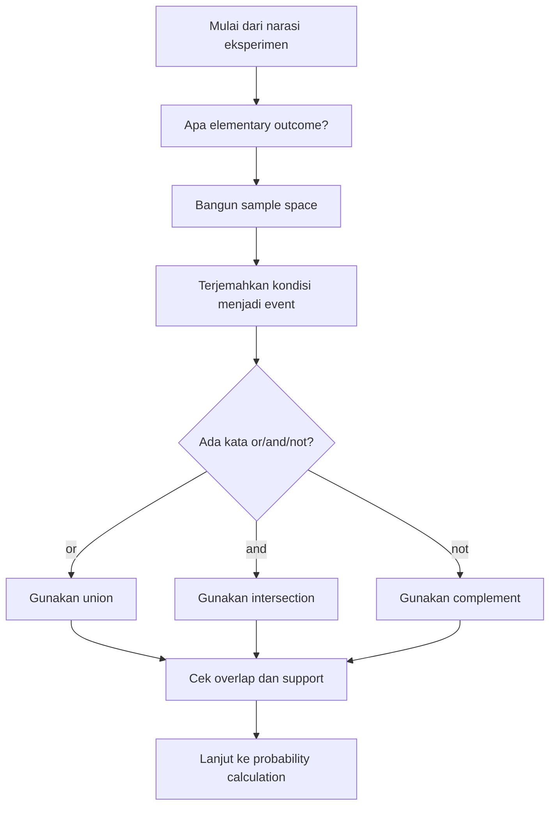

# 📊 1.1 — Eksperimen Acak dan Ruang Sampel

> [!ABSTRACT] Ringkasan Cepat
> **Topik:** Eksperimen Acak dan Ruang Sampel  
> **Bobot Parent Topic:** 15–25%  
> **Exam Priority:** High  
> **Difficulty:** Concept-Intensive  
> **Primary Skill:** Mixed  
> **Ref:** Hogg, Tanis & Zimmerman Ch. 1.1; Miller, Miller & Freund Ch. 2 §§2–3

## Section 0 — Pemetaan Silabus & Exam Scope

| Field | Isi |
|---|---|
| Topik CF2 | Topik 1 — Dasar-Dasar Probabilitas |
| Subtopik | 1.1 Eksperimen Acak dan Ruang Sampel |
| Learning Outcome | Memahami eksperimen acak, kejadian, ruang sampel, aljabar himpunan, dan diagram Venn sebagai fondasi perhitungan probabilitas |
| Skill Diuji | Menerjemahkan narasi menjadi sample space dan event; mengoperasikan union, intersection, complement; mengenali mutually exclusive dan exhaustive events; membaca Venn diagram |
| Bobot Parent Topic | 15–25% |
| Exam Priority | High |
| Prerequisite | Notasi himpunan dasar; ordered pair; logika “dan/atau/tidak” |
| Connected Topics | [[1.2 Aksioma dan Perhitungan Probabilitas]], [[1.3 Metode Enumerasi]], [[1.4 Probabilitas Bersyarat]], [[1.5 Kejadian Independen]], [[1.6 Teorema Bayes dan Hukum Probabilitas Total]] |
| Referensi | Hogg, Tanis & Zimmerman Ch. 1.1; Miller, Miller & Freund Ch. 2 §§2–3 |

> [!IMPORTANT] Scope Boundary
> Subtopik ini berfokus pada **random experiment → outcomes → sample space → events → set algebra → Venn diagrams → mutually exclusive/exhaustive relationships**. Definisi formal aksioma probabilitas dan konsekuensi numeriknya dibahas di [[1.2 Aksioma dan Perhitungan Probabilitas]]. Counting rules, permutation, dan combination dibahas di [[1.3 Metode Enumerasi]]. Conditional probability, independence, dan Bayes belum menjadi materi inti di sini. Hogg membahas relative frequency dan probability set function masih dalam Section 1.1, tetapi bagian tersebut diperlakukan sebagai jembatan menuju Topik 1.2, bukan fokus utama note ini.

---

## Section 1 — Intuisi & Big Picture

Probabilitas tidak dimulai dari rumus $P(A)$, tetapi dari pertanyaan yang lebih dasar: **“Apa sebenarnya eksperimennya, apa saja hasil yang mungkin, dan event mana yang sedang dibicarakan?”** Hogg mendefinisikan *random experiment* sebagai eksperimen yang hasil spesifiknya tidak dapat diprediksi dengan kepastian sebelum dilakukan, walaupun kumpulan semua hasil yang mungkin dapat diketahui atau dideskripsikan. Miller menggunakan istilah *experiment* secara luas untuk proses observasi atau pengukuran; hasil akhirnya disebut *outcome*.

Fondasi pengerjaan soal CF2 adalah membangun representasi matematis yang tepat. Jika sebuah dadu dilempar, sample space paling informatif adalah hasil muka $1$ sampai $6$. Jika dua dadu berbeda warna dilempar, outcome harus ditulis sebagai **ordered pair**, karena $(2,5)$ dan $(5,2)$ mewakili hasil yang berbeda ketika identitas dadu dibedakan. Setelah sample space ditentukan, sebuah *event* hanyalah **subset** dari sample space tersebut. Jadi frasa seperti “jumlahnya 7”, “hasilnya genap”, atau “minimal satu sukses” harus diterjemahkan dulu menjadi kumpulan outcome yang tepat.

Kesalahan intuitif paling berbahaya adalah melompat langsung ke probabilitas sebelum sample space dan event benar. Salah memilih granularity sample space, mengabaikan urutan, atau menerjemahkan “atau”, “dan”, dan “tidak” secara keliru dapat membuat seluruh perhitungan berikutnya salah meskipun rumus probabilitasnya benar.

---

## Section 2 — Definisi, Support & Core Formulas

### Definisi Formal

> [!NOTE] Definisi Formal
> **Random experiment** adalah eksperimen yang outcome spesifiknya tidak dapat diprediksi dengan kepastian sebelum eksperimen dilakukan, tetapi kumpulan seluruh outcome yang mungkin dapat diketahui atau dideskripsikan.
>
> **Outcome** adalah satu hasil yang diperoleh dari eksperimen.
>
> **Sample space** adalah himpunan seluruh outcome yang mungkin dari eksperimen.
>
> **Event** adalah subset dari sample space. Event $A$ terjadi jika outcome aktual eksperimen termasuk dalam $A$.

### Convention Notasi

Prompt CF2 menggunakan $\Omega$ untuk sample space. Kedua textbook utama dalam Topik 1 menggunakan $S$ sebagai notasi sample space. Di note ini dipakai:

$$
\Omega = \text{sample space},
$$

sedangkan $S$ dianggap notasi ekuivalen yang mungkin muncul pada textbook atau soal.

### Terminologi & Simbol Penting

| Istilah / Simbol | Definisi | Support / Domain | Exam Note |
|---|---|---|---|
| Random experiment | Proses dengan outcome tidak pasti sebelum dilakukan | Situasi dengan kumpulan outcome yang dapat dideskripsikan | Bedakan dari outcome-nya |
| $\omega$ | Satu sample point / outcome | $\omega\in\Omega$ | Satu outcome, bukan event besar |
| $\Omega$ | Sample space | Seluruh outcome yang mungkin | Harus cukup rinci untuk membedakan outcome yang relevan |
| $A,B,C$ | Events | $A,B,C\subseteq\Omega$ | Event = kumpulan outcome |
| $\varnothing$ | Empty event / empty set | Tidak memiliki elemen | Event mustahil |
| $A^c$ | Complement of $A$ | Semua outcome di $\Omega$ yang tidak berada di $A$ | “not $A$” |
| $A\cup B$ | Union | Outcome berada di $A$, di $B$, atau keduanya | “$A$ or $B$” dalam inclusive sense |
| $A\cap B$ | Intersection | Outcome berada di $A$ dan $B$ sekaligus | “$A$ and $B$” |
| $A\subseteq B$ | $A$ subset dari $B$ | Setiap elemen $A$ juga elemen $B$ | Jika $A$ terjadi, $B$ pasti terjadi |
| Mutually exclusive | Dua/lebih event tidak dapat terjadi bersamaan | Untuk dua event: $A\cap B=\varnothing$ | Jangan samakan dengan independence |
| Exhaustive | Gabungan event mencakup seluruh sample space | $\bigcup_i A_i=\Omega$ | Minimal satu event pasti terjadi |

### 2.1 Sample Space: Granularity Harus Sesuai Masalah

Miller menekankan bahwa **eksperimen yang sama dapat dideskripsikan oleh sample space berbeda**, tergantung informasi yang ingin dipertahankan.

Satu lemparan dadu dapat ditulis sebagai

$$
\Omega_1=\{1,2,3,4,5,6\},
$$

atau, bila hanya paritas yang penting,

$$
\Omega_2=\{\text{even},\text{odd}\}.
$$

Namun untuk probabilitas dan analisis lebih lanjut, sample space yang mempertahankan outcome lebih elementer biasanya lebih aman karena tidak membuang informasi terlalu dini.

Untuk dua dadu berbeda warna,

$$
\Omega=\{(x,y):x=1,\ldots,6;\ y=1,\ldots,6\}.
$$

Terdapat $36$ ordered outcomes. Sample space berupa total saja,

$$
\{2,3,\ldots,12\},
$$

lebih ringkas tetapi kehilangan informasi tentang pasangan dadu yang menghasilkan total tertentu.

> [!TIP] Exam Rule
> Jika beberapa outcome agregat memiliki jumlah elementary outcomes yang berbeda, jangan menganggap outcome agregat tersebut automatically equally likely. Menulis sample space yang lebih elementer sering mencegah kesalahan ini.

### 2.2 Discrete vs Continuous Sample Space

Miller mengklasifikasikan sample space berdasarkan jumlah elemen:

- **Finite**: jumlah outcome terbatas.
- **Countably infinite**: tak hingga tetapi dapat dipasangkan satu-satu dengan bilangan bulat positif.
- **Discrete sample space**: finite atau countably infinite.
- **Continuous sample space**: outcome membentuk continuum dan tidak countable.

Contoh coin tossed until first head:

$$
\Omega=\{H,TH,TTH,TTTH,\ldots\}.
$$

Ini infinite tetapi countable, sehingga discrete.

Untuk lifetime komponen elektronik $T$ dalam tahun:

$$
\Omega=\{t:t\ge 0\}=[0,\infty),
$$

sehingga sample space continuous.

> [!IMPORTANT] Important Distinction
> **Discrete/continuous sample space** menjelaskan struktur outcome eksperimen. Jangan otomatis menyamakan pembahasan ini dengan **discrete/continuous random variable** pada Topik 2; random variable adalah fungsi dari sample space menuju bilangan real dan dibahas kemudian.

### 2.3 Event sebagai Subset

Jika dua dadu berbeda dilempar dan $B$ adalah event “jumlah mata dadu 7”, maka

$$
B=\{(1,6),(2,5),(3,4),(4,3),(5,2),(6,1)\}.
$$

Jika lifetime komponen $T$ memiliki sample space $[0,\infty)$ dan event $F$ adalah “gagal sebelum akhir tahun ke-6”, maka

$$
F=\{t:0\le t<6\}=[0,6).
$$

Kedua contoh menunjukkan pola yang sama:

> narasi verbal $\rightarrow$ subset matematis dari sample space.

### 2.4 Operasi Himpunan untuk Event

#### Union

$$
A\cup B=\{\omega\in\Omega:\omega\in A\text{ atau }\omega\in B\}.
$$

Dalam probabilitas, “or” biasanya **inclusive or**, jadi outcome yang berada pada $A\cap B$ tetap termasuk $A\cup B$.

#### Intersection

$$
A\cap B=\{\omega\in\Omega:\omega\in A\text{ dan }\omega\in B\}.
$$

#### Complement

$$
A^c=\{\omega\in\Omega:\omega\notin A\}.
$$

Complement selalu didefinisikan relatif terhadap sample space $\Omega$.

### 2.5 Hukum Aljabar Himpunan

Untuk events $A,B,C\subseteq\Omega$:

**Commutative laws**

$$
A\cup B=B\cup A,
$$

$$
A\cap B=B\cap A.
$$

**Associative laws**

$$
(A\cup B)\cup C=A\cup(B\cup C),
$$

$$
(A\cap B)\cap C=A\cap(B\cap C).
$$

**Distributive laws**

$$
A\cap(B\cup C)=(A\cap B)\cup(A\cap C),
$$

$$
A\cup(B\cap C)=(A\cup B)\cap(A\cup C).
$$

**De Morgan's laws**

$$
(A\cup B)^c=A^c\cap B^c,
$$

$$
(A\cap B)^c=A^c\cup B^c.
$$

De Morgan sangat penting untuk menerjemahkan kalimat seperti:

- “neither $A$ nor $B$” $\rightarrow (A\cup B)^c=A^c\cap B^c$;
- “not both $A$ and $B$” $\rightarrow (A\cap B)^c=A^c\cup B^c$.

### 2.6 Mutually Exclusive dan Exhaustive Events

Dua event $A$ dan $B$ mutually exclusive jika

$$
A\cap B=\varnothing.
$$

Untuk $A_1,\ldots,A_k$ mutually exclusive secara pairwise:

$$
A_i\cap A_j=\varnothing,\qquad i\ne j.
$$

Events exhaustive jika

$$
A_1\cup A_2\cup\cdots\cup A_k=\Omega.
$$

Jika event-event sekaligus mutually exclusive dan exhaustive, sample space terbagi menjadi bagian-bagian yang tidak overlap dan secara bersama mencakup seluruh outcome.

> [!DANGER] Terminology Trap
> **Mutually exclusive** berarti tidak dapat terjadi bersamaan. **Independent** adalah konsep probabilistik tentang apakah terjadinya satu event mengubah probabilitas event lain. Keduanya bukan sinonim. Independence dibahas formal pada [[1.5 Kejadian Independen]].

### Recognition Clues

| Narasi / Mechanism | Struktur yang Dipikirkan | Pembeda Kritis |
|---|---|---|
| “all possible outcomes” | Sample space $\Omega$ | Pastikan tidak ada outcome yang hilang |
| “either A or B” | $A\cup B$ | Inclusive unless wording explicitly excludes overlap |
| “both A and B” | $A\cap B$ | Harus memenuhi dua event sekaligus |
| “not A” | $A^c$ | Complement terhadap seluruh $\Omega$ |
| “neither A nor B” | $(A\cup B)^c=A^c\cap B^c$ | De Morgan |
| “not both” | $(A\cap B)^c=A^c\cup B^c$ | Berbeda dari “neither” |
| “cannot happen together” | Mutually exclusive | Intersection kosong |
| “one of these cases must occur” | Exhaustive | Union = $\Omega$ |
| Measurement seperti lifetime/time/distance | Continuous sample space | Outcome berupa continuum |
| Repeat until first success | Countably infinite sample space | Tak hingga, tetapi discrete |

---

## Section 3 — How It Works

### Basic Probability Foundation

```text
Narrative
↓
Identify the random experiment
↓
Choose elementary outcomes at useful granularity
↓
Construct sample space Ω
↓
Translate verbal condition into event subset(s)
↓
Use union / intersection / complement / subset relations
↓
Check whether event is actually contained in Ω
↓
Only then move to probability calculation
```

### Step 1 — Identify Experiment, Not the Event

Contoh: “Dua dadu, satu merah dan satu hijau, dilempar. Cari event jumlahnya 8.”

- **Experiment**: melempar dua dadu distinct.
- **Outcome**: ordered pair $(x,y)$.
- **Sample space**: seluruh $36$ ordered pairs.
- **Event**: subset yang jumlah koordinatnya 8.

Jangan menulis “sample space = jumlah 8”. Itu adalah event, bukan seluruh ruang outcome.

### Step 2 — Decide Whether Order/Identity Matters

Jika objek berbeda identitas, outcome biasanya harus mempertahankan identitas tersebut. Untuk dadu merah dan hijau,

$$
(2,5)\ne(5,2).
$$

Jika informasi hanya berupa jumlah, kedua outcome tersebut dapat dipetakan ke nilai yang sama, tetapi mapping tersebut adalah penggabungan informasi dan harus dilakukan dengan sadar.

### Step 3 — Translate Language into Set Operations

Misalkan:

- $A$ = polis mengalami klaim kebakaran,
- $B$ = polis mengalami klaim banjir.

Maka:

- “kebakaran atau banjir” $\rightarrow A\cup B$;
- “kebakaran dan banjir” $\rightarrow A\cap B$;
- “tidak ada kebakaran” $\rightarrow A^c$;
- “tidak ada kebakaran maupun banjir” $\rightarrow A^c\cap B^c$;
- “tidak mengalami keduanya sekaligus” $\rightarrow (A\cap B)^c$.

Perhatikan dua kalimat terakhir **tidak sama**.

> [!TIP] Cara Berpikir Cepat
> Untuk frasa negatif yang kompleks, pertama tulis event positifnya, lalu ambil complement. Misalnya “tidak ada minimal satu dari A atau B” lebih aman diproses sebagai complement dari $A\cup B$, lalu gunakan De Morgan bila perlu.

> [!DANGER] Jangan Salah Pikir
> 1. **Event bukan outcome tunggal secara wajib.** Event dapat berisi satu, banyak, atau bahkan continuum outcomes.
> 2. **Union bukan exclusive-or.** $A\cup B$ tetap mencakup intersection kecuali soal mengatakan “A atau B tetapi tidak keduanya”.
> 3. **Complement bergantung pada sample space.** $A^c$ berubah jika universe/sample space yang dipakai berubah.
> 4. **Sample space terlalu kasar dapat menyembunyikan multiplicity.** Total dua dadu $\{2,3,\ldots,12}$ bukan kumpulan equally likely elementary outcomes.

### Derivasi Minimum yang Berguna — De Morgan dari Logika Keanggotaan

Ambil outcome $\omega\in\Omega$. Outcome berada pada $(A\cup B)^c$ jika dan hanya jika $\omega$ **tidak berada dalam union**, artinya:

$$
\omega\notin A \quad\text{dan}\quad \omega\notin B.
$$

Ini ekuivalen dengan

$$
\omega\in A^c\cap B^c.
$$

Maka

$$
(A\cup B)^c=A^c\cap B^c.
$$

Argumen yang sama menghasilkan

$$
(A\cap B)^c=A^c\cup B^c.
$$

Derivasi ini membantu karena De Morgan bukan sekadar formula hafalan; ia adalah aturan perubahan **“not (or)” menjadi “and not”** dan **“not (and)” menjadi “or not”**.

---

## Section 4 — Worked Examples & Exam Cases

### Case A — Fundamental

**Soal**

Satu dadu fair dilempar sekali. Bentuk sample space. Definisikan:

- $A$: hasil genap;
- $B$: hasil lebih besar dari 3.

Tentukan $A\cup B$, $A\cap B$, dan $A^c$.

> [!SUCCESS] Pembahasan
>
> **1. Parse Narasi & Target**  
> Eksperimen menghasilkan satu muka dadu. Target adalah membangun event dan melakukan operasi himpunan, bukan menghitung probabilitas.
>
> **2. Identify Structure**  
> Sample space finite dan discrete.
>
> **3. Support / Domain**  
> $$
> \Omega=\{1,2,3,4,5,6\}.
> $$
> Event genap:
> $$
> A=\{2,4,6\}.
> $$
> Event hasil lebih besar dari 3:
> $$
> B=\{4,5,6\}.
> $$
>
> **4. Setup**  
> Union = semua elemen yang berada minimal di salah satu event.  
> Intersection = elemen yang berada di keduanya.  
> Complement = elemen $\Omega$ yang tidak berada di event.
>
> **5. Calculation**  
> $$
> A\cup B=\{2,4,5,6\},
> $$
> $$
> A\cap B=\{4,6\},
> $$
> $$
> A^c=\{1,3,5\}.
> $$
>
> **6. Interpretation**  
> $A\cup B$ mencakup hasil yang genap atau lebih besar dari 3. $A\cap B$ hanya hasil yang memenuhi kedua syarat.
>
> **7. Verification**  
> Semua elemen hasil tetap berada di $\Omega$. $A$ dan $A^c$ tidak overlap dan union-nya kembali menjadi seluruh $\Omega$.

> [!WARNING] Exam Trap — Case A
> - **Trap:** menulis $A\cup B=\{2,5\}$ karena menganggap “or” harus eksklusif.
> - **Mengapa distractor terlihat benar:** pembaca bahasa sehari-hari kadang memahami “atau” sebagai “salah satu saja”.
> - **Cara menghindari:** union matematika adalah inclusive-or.
> - **Shortcut aman:** tulis semua anggota $A$, lalu tambahkan anggota $B$ yang belum ada.
> - **Target waktu:** < 1 menit.

### Case B — Exam-Typical

**Soal**

Dua dadu berbeda warna dilempar. Misalkan

- $A$: jumlah kedua dadu adalah 7;
- $B$: dadu merah menunjukkan angka 3.

Tuliskan $\Omega$, $A$, $B$, $A\cap B$, dan tentukan apakah $A$ dan $B$ mutually exclusive.

> [!SUCCESS] Pembahasan
>
> **1. Parse Narasi & Target**  
> Karena dadu berbeda warna, identitas dadu harus dipertahankan. Outcome adalah ordered pair $(r,g)$.
>
> **2. Identify Structure**  
> Finite discrete sample space dengan $36$ ordered outcomes.
>
> **3. Support / Domain**  
> $$
> \Omega=\{(r,g):r,g\in\{1,2,3,4,5,6\}\}.
> $$
>
> Event jumlah 7:
> $$
> A=\{(1,6),(2,5),(3,4),(4,3),(5,2),(6,1)\}.
> $$
>
> Event dadu merah = 3:
> $$
> B=\{(3,1),(3,2),(3,3),(3,4),(3,5),(3,6)\}.
> $$
>
> **4. Setup**  
> Untuk mutually exclusive, cek apakah intersection kosong.
>
> **5. Calculation**  
> Satu-satunya outcome yang memenuhi kedua event adalah
> $$
> A\cap B=\{(3,4)\}.
> $$
>
> Karena
> $$
> A\cap B\ne\varnothing,
> $$
> maka $A$ dan $B$ **tidak mutually exclusive**.
>
> **6. Interpretation**  
> Kedua event dapat terjadi bersamaan ketika dadu merah 3 dan dadu hijau 4.
>
> **7. Verification**  
> $(3,4)$ memang memiliki jumlah 7 dan komponen pertama 3.

> [!WARNING] Exam Trap — Case B
> - **Trap:** menulis sample space sebagai $\{2,3,\ldots,12\}$ lalu kehilangan informasi warna dadu.
> - **Mengapa distractor terlihat benar:** total memang cukup untuk mendeskripsikan event $A$, tetapi tidak cukup untuk event $B$.
> - **Cara menghindari:** pilih sample space yang cukup kaya untuk **semua event yang relevan**.
> - **Shortcut aman:** jika soal membedakan objek (red/green, first/second, policy A/B), gunakan ordered outcome kecuali terbukti tidak perlu.
> - **Target waktu:** 1–2 menit.

### Case C — Challenging / Integrated

**Soal**

Sebuah perusahaan memantau dua jenis insiden selama satu tahun:

- $A$: terjadi minimal satu klaim kebakaran;
- $B$: terjadi minimal satu klaim banjir.

Nyatakan secara set notation event berikut:

1. terjadi setidaknya salah satu dari kedua jenis insiden;
2. terjadi keduanya;
3. tidak terjadi keduanya sekaligus;
4. tidak terjadi satupun;
5. terjadi tepat satu jenis insiden.

> [!SUCCESS] Pembahasan
>
> **1. Parse Narasi & Target**  
> Tidak ada kebutuhan mendefinisikan distribution atau menghitung probability. Fokusnya menerjemahkan natural language ke set algebra.
>
> **2. Identify Structure**  
> Dua events $A$ dan $B$ dalam sample space $\Omega$.
>
> **3. Support / Domain**  
> Setiap outcome tahunan dapat berada pada salah satu region Venn: hanya $A$, hanya $B$, keduanya, atau neither.
>
> **4. Setup & Calculation**
>
> 1. **Setidaknya salah satu:**
> $$
> A\cup B.
> $$
>
> 2. **Keduanya:**
> $$
> A\cap B.
> $$
>
> 3. **Tidak terjadi keduanya sekaligus:**
> $$
> (A\cap B)^c=A^c\cup B^c.
> $$
>
> 4. **Tidak terjadi satupun:**
> $$
> (A\cup B)^c=A^c\cap B^c.
> $$
>
> 5. **Tepat satu jenis:**
> $$
> (A\cap B^c)\cup(A^c\cap B).
> $$
>
> **6. Interpretation**  
> Nomor 3 dan 4 sangat berbeda. “Not both” masih membolehkan tepat satu event terjadi; “neither” tidak membolehkan keduanya maupun salah satunya.
>
> **7. Verification**  
> Untuk “exactly one”, dua region $(A\cap B^c)$ dan $(A^c\cap B)$ disjoint, dan region $A\cap B$ tidak termasuk.

> [!WARNING] Exam Trap — Case C
> - **Trap:** menyamakan “not both” dengan “neither”.
> - **Mengapa distractor terlihat benar:** kedua kalimat sama-sama mengandung negasi atas dua event.
> - **Cara menghindari:** tulis event positif yang dinafikan dahulu, lalu ambil complement.
> - **Shortcut aman:** “neither” langsung pikirkan complement of union; “not both” langsung pikirkan complement of intersection.
> - **Target waktu:** 1–2 menit.

---

## Section 5 — Verification & Sanity Check

> [!CHECK] Sanity Check
> 1. **Completeness:** sample space harus mencakup semua outcome yang mungkin dan tidak mencakup outcome yang mustahil.
> 2. **Event containment:** setiap event harus merupakan subset dari sample space, $A\subseteq\Omega$.
> 3. **Complement check:** $A\cap A^c=\varnothing$ dan $A\cup A^c=\Omega$.
> 4. **Mutual exclusivity check:** jika dua event disebut mutually exclusive, pastikan benar-benar $A\cap B=\varnothing$.
> 5. **Exhaustiveness check:** jika events disebut exhaustive, pastikan union-nya benar-benar seluruh $\Omega$.
> 6. **De Morgan back-check:** uji dengan satu outcome hipotetis; “not in either” harus berarti “not in A and not in B”.

### Metode Alternatif

#### Listing vs Rule-Based Description

Untuk sample space kecil, listing eksplisit aman:

$$
\Omega=\{H,T\}.
$$

Untuk sample space besar atau infinite, gunakan rule/set-builder notation:

$$
\Omega=\{t:t\ge0\}.
$$

**Pilih listing** bila membantu melihat semua outcome dan overlap event. **Pilih rule-based description** bila listing panjang atau tidak mungkin dilakukan.

#### Venn Diagram vs Algebra

- **Venn diagram** cepat untuk memahami region dan memeriksa De Morgan.
- **Set algebra** lebih compact dan lebih aman ketika soal memiliki banyak kondisi.

Keduanya merepresentasikan objek yang sama; diagram bukan pengganti definisi matematis.

---

## Section 6 — Connections & Mental Model

Pikirkan sample space sebagai **universe** dari semua hasil yang mungkin. Event hanyalah region di dalam universe tersebut.

```text
Random experiment
      ↓
Elementary outcomes
      ↓
Sample space Ω
      ↓
Events as subsets
      ↓
Set algebra / Venn regions
      ↓
Probability assigned to events
      ↓
[[1.2 Aksioma dan Perhitungan Probabilitas]]
```

### Hubungan ke Counting

Ketika outcomes elementary dianggap equally likely, langkah berikutnya sering menjadi counting:

```text
Define Ω and event A
      ↓
Count outcomes in Ω and A
      ↓
Apply probability rule
      ↓
[[1.3 Metode Enumerasi]]
```

Namun counting ratio tidak boleh digunakan hanya karena sample space dapat ditulis sebagai himpunan; perlu justifikasi bahwa elementary outcomes memiliki probabilitas yang sama.

### Hubungan ke Conditional Probability

Conditional probability pada Topik 1.4 pada dasarnya **mengubah universe efektif** dari $\Omega$ menjadi conditioning event $B$. Karena itu, pemahaman event sebagai subset dan intersection $A\cap B$ sangat penting sebelum mempelajari

$$
P(A\mid B).
$$

### Hubungan Visual ↔ Rumus

Pada Venn diagram:

- rectangle = $\Omega$;
- circle/region = event;
- overlap = intersection;
- seluruh area dari dua region = union;
- area di luar event tetapi masih di rectangle = complement;
- dua region tanpa overlap = mutually exclusive;
- kumpulan region yang menutupi rectangle = exhaustive.

Hogg Figure 1.1-1 menggunakan shaded regions untuk menunjukkan complement, union, intersection, dan union tiga events. Figure 1.1-2 menunjukkan secara visual De Morgan: region $(A\cup B)^c$ sama dengan $A^c\cap B^c$. Miller juga menggunakan Venn diagrams untuk menunjukkan event, complement, union, intersection, mutually exclusive events, dan subset relationships.

---

## Section 7 — Exam Traps & Misconceptions

### Support / Domain Trap

> [!BUG] Support Trap
> **Salah:** membuat event dengan outcome yang tidak mungkin menurut sample space.  
> Jika $\Omega=\{1,2,3,4,5,6\}$, maka $A=\{2,4,8\}$ tidak valid sebagai event karena $8\notin\Omega$.
>
> **Benar:**
> $$
> A\subseteq\Omega.
> $$

### Event Translation Trap

> [!BUG] Event Translation Trap
> **“A or B”** berarti $A\cup B$, bukan “A atau B tetapi tidak keduanya”.  
> **“Neither A nor B”** berarti $A^c\cap B^c$.  
> **“Not both A and B”** berarti $A^c\cup B^c$.

### Sample-Space Granularity Trap

> [!BUG] Sample Space Trap
> Untuk dua dadu distinct, sample space $\{2,3,\ldots,12\}$ mungkin terlalu kasar jika soal juga menanyakan hasil salah satu dadu. Gunakan ordered pairs ketika identitas outcome perlu dipertahankan.

### Mutual Exclusivity Trap

> [!BUG] Relationship Trap
> Mutually exclusive bukan berarti “tidak berhubungan”. Definisinya sangat spesifik:
> $$
> A\cap B=\varnothing.
> $$
> Jangan menyimpulkan atau membahas independence di sini tanpa menggunakan definisi probabilistik pada Topik 1.5.

### De Morgan Trap

> [!BUG] Logic Trap
> **Salah**
> $$
> (A\cup B)^c=A^c\cup B^c.
> $$
>
> **Benar**
> $$
> (A\cup B)^c=A^c\cap B^c.
> $$
>
> Negating an OR changes it into an AND of negations.

### Red Flags

> [!CAUTION] Red Flags

| Keyword / Condition | Apa yang Harus Dipikirkan |
|---|---|
| “all possible outcomes” | Bangun $\Omega$ terlebih dahulu |
| “or” | Union; biasanya inclusive |
| “and / both” | Intersection |
| “not” | Complement |
| “neither ... nor ...” | Complement of union / De Morgan |
| “not both” | Complement of intersection |
| “cannot occur together” | Mutually exclusive; intersection kosong |
| “collectively cover all cases” | Exhaustive; union = $\Omega$ |
| “first/second”, “red/green”, objek berlabel | Ordered outcomes mungkin diperlukan |
| “until first ...” | Sample space dapat countably infinite |
| lifetime / distance / time measured continuously | Continuous sample space |

---

## Section 8 — Executive Summary

### Must Remember

> [!SUMMARY] Must Remember
> 1. Random experiment: outcome spesifik tidak pasti sebelum eksperimen, tetapi semua kemungkinan outcome dapat dideskripsikan.
> 2. Sample space $\Omega$ = himpunan semua outcomes yang mungkin.
> 3. Event $A$ = subset dari $\Omega$.
> 4. Pilih sample space dengan granularity yang cukup untuk semua pertanyaan dalam soal.
> 5. $A\cup B$ = A atau B atau keduanya; $A\cap B$ = A dan B.
> 6. $A^c$ selalu relatif terhadap sample space yang sedang dipakai.
> 7. De Morgan: $(A\cup B)^c=A^c\cap B^c$ dan $(A\cap B)^c=A^c\cup B^c$.
> 8. Mutually exclusive berarti intersection kosong.
> 9. Exhaustive berarti union mencakup seluruh sample space.
> 10. Finite dan countably infinite sample spaces termasuk discrete; continuum sample space disebut continuous.
> 11. Jangan mulai menghitung probability sebelum event dan sample space benar.

### Formula Map / Comparison Table

| Kondisi | Model / Rule | Support / Assumption | Common Trap |
|---|---|---|---|
| “A or B” | $A\cup B$ | $A,B\subseteq\Omega$ | Menganggap exclusive-or |
| “A and B” | $A\cap B$ | $A,B\subseteq\Omega$ | Mengambil union |
| “not A” | $A^c$ | Universe = $\Omega$ | Lupa universe |
| “neither A nor B” | $(A\cup B)^c=A^c\cap B^c$ | De Morgan | Salah operator setelah negasi |
| “not both” | $(A\cap B)^c=A^c\cup B^c$ | De Morgan | Disamakan dengan “neither” |
| Mutually exclusive | $A\cap B=\varnothing$ | Tidak dapat terjadi bersamaan | Disamakan dengan independence |
| Exhaustive | $\bigcup_i A_i=\Omega$ | Mencakup semua cases | Mengira harus disjoint |

### Trigger Keywords

| Jika soal mengatakan... | Pikirkan... |
|---|---|
| “describe/list all outcomes” | Sample space |
| “event that...” | Subset dari sample space |
| “either/or” | Union |
| “both” | Intersection |
| “none/neither” | Complement + De Morgan |
| “distinct dice / first and second trial” | Ordered outcomes |
| “measurement can take any real value in range” | Continuous sample space |

### Kapan Digunakan

Set framework ini digunakan **sebelum hampir semua perhitungan probabilitas**: mendefinisikan universe, outcome, dan event yang benar adalah prerequisite untuk counting, conditional probability, independence, Bayes, serta random variables.

### Kapan TIDAK Boleh Digunakan

- Jangan menggunakan counting ratio $|A|/|\Omega|$ hanya karena event sudah didefinisikan; equiprobability harus dibenarkan di Topik 1.2/1.3.
- Jangan menggunakan “mutually exclusive” sebagai sinonim “independent”.
- Jangan mereduksi sample space terlalu dini jika pengurangan tersebut membuang informasi yang diperlukan oleh event lain.

### Quick Decision Tree



---

## Section 9 — Active Recall Check

1. Apa perbedaan **random experiment**, **outcome**, **sample space**, dan **event**?
2. Dua dadu berbeda warna dilempar. Mengapa sample space ordered pairs lebih informatif daripada sample space berupa total 2–12?
3. Berikan contoh sample space yang finite, countably infinite, dan continuous.
4. Jika $A$ berarti “klaim kebakaran” dan $B$ berarti “klaim banjir”, tuliskan event “tidak terjadi satupun”.
5. Tuliskan event “tepat satu dari $A$ dan $B$ terjadi” menggunakan union, intersection, dan complement.
6. Apa perbedaan logis antara $(A\cup B)^c$ dan $(A\cap B)^c$?
7. Bagaimana cara memeriksa bahwa dua event mutually exclusive tanpa menghitung probabilitas?
8. Apakah event-event exhaustive harus mutually exclusive? Jelaskan struktur set yang perlu dicek.
9. Jika sample space adalah $\Omega=[0,\infty)$ untuk lifetime $T$, bagaimana menulis event “lifetime minimal 5 tahun tetapi kurang dari 10 tahun”?
10. Untuk frasa “not both A and B”, metode mental tercepat apa yang dapat dipakai untuk menghindari salah De Morgan?
11. Tanpa menghitung probability, sanity check apa yang memastikan sebuah event valid terhadap sample space?
12. Mengapa sample space yang terlalu kasar dapat menyebabkan kesalahan ketika kemudian melakukan counting atau probability assignment?

---

## Section 10 — Exam Pattern Map

`[TEXTBOOK-BASED EXPECTATION]` — pola berikut diturunkan dari learning outcome silabus dan mekanik yang dibangun textbook; tidak ada klaim frekuensi past exam karena past exam tidak digunakan pada note ini.

| Narasi Soal | Keyword | Struktur/Distribusi | Setup / Formula | Langkah | Trap | Shortcut |
|---|---|---|---|---|---|---|
| Minta semua kemungkinan hasil eksperimen | “possible outcomes”, “sample space” | Sample space | $\Omega=\{\text{all outcomes}\}$ | Tentukan elementary outcome lalu list/rule | Sample space terlalu kasar/terlalu sempit | Pertahankan labels/order bila objek distinct |
| Minta event dari kondisi verbal | “event that...” | Subset | $A\subseteq\Omega$ | Filter outcome yang memenuhi kondisi | Memasukkan outcome di luar $\Omega$ | Tulis condition sebagai rule bila listing panjang |
| Gabungan dua kondisi | “A or B” | Union | $A\cup B$ | Ambil semua elemen dari kedua event tanpa duplikasi | Menghapus overlap karena salah memahami “or” | Venn mental: shade both circles |
| Kedua kondisi bersamaan | “A and B”, “both” | Intersection | $A\cap B$ | Ambil hanya elemen yang memenuhi keduanya | Tertukar dengan union | Cek setiap candidate harus lolos dua syarat |
| Negasi gabungan | “neither”, “not both” | Complement + De Morgan | $(A\cup B)^c$ atau $(A\cap B)^c$ | Identifikasi event positif yang dinafikan lalu complement | Salah menukar union/intersection | “not OR → AND not”; “not AND → OR not” |
| Hubungan event | “cannot occur together”, “cover all cases” | Mutually exclusive / exhaustive | $A\cap B=\varnothing$ atau $\cup_iA_i=\Omega$ | Cek overlap / coverage | Menganggap exhaustive berarti disjoint | Venn diagram cepat |

---

## Source Traceability

| Materi | Sumber |
|---|---|
| Random experiment, outcome space/sample space, event sebagai subset | Hogg, Tanis & Zimmerman, Chapter 1.1 |
| Set notation: empty set, subset, union, intersection, complement | Hogg, Tanis & Zimmerman, Chapter 1.1 |
| Mutually exclusive dan exhaustive events | Hogg, Tanis & Zimmerman, Chapter 1.1 |
| Commutative, associative, distributive, dan De Morgan laws | Hogg, Tanis & Zimmerman, Chapter 1.1 |
| Venn diagrams untuk set algebra dan De Morgan | Hogg, Tanis & Zimmerman, Chapter 1.1, Figures 1.1-1 dan 1.1-2 |
| Definisi experiment, outcome, sample space/sample point | Miller, Miller & Freund, Chapter 2, Section 2 |
| Sample-space granularity dan contoh dua dadu distinct | Miller, Miller & Freund, Chapter 2, Section 2 |
| Finite, countably infinite/discrete, dan continuous sample spaces | Miller, Miller & Freund, Chapter 2, Section 2 |
| Event sebagai subset; contoh total dua dadu, hit/miss, lifetime | Miller, Miller & Freund, Chapter 2, Section 3 |
| Venn diagrams, union, intersection, complement, mutually exclusive | Miller, Miller & Freund, Chapter 2, Section 3 |
| Scope dan learning outcome Topik 1.1 | Silabus CF2 — Topik 1 Dasar-Dasar Probabilitas |

---

> [!QUOTE] Follow-up Options
> 1. *"Uji saya dengan Active Recall dari topik ini"*
> 2. *"Buat 10 soal exam-style calculation untuk topik ini"*
> 3. *"Jelaskan hubungan topik ini dengan topik CF2 terkait"*

*📖 Ref: Hogg, Tanis & Zimmerman Ch. 1.1; Miller, Miller & Freund Ch. 2 §§2–3 | 🗓️ 2026-08-29 | #CF2 #Probabilitas #Statistika*
