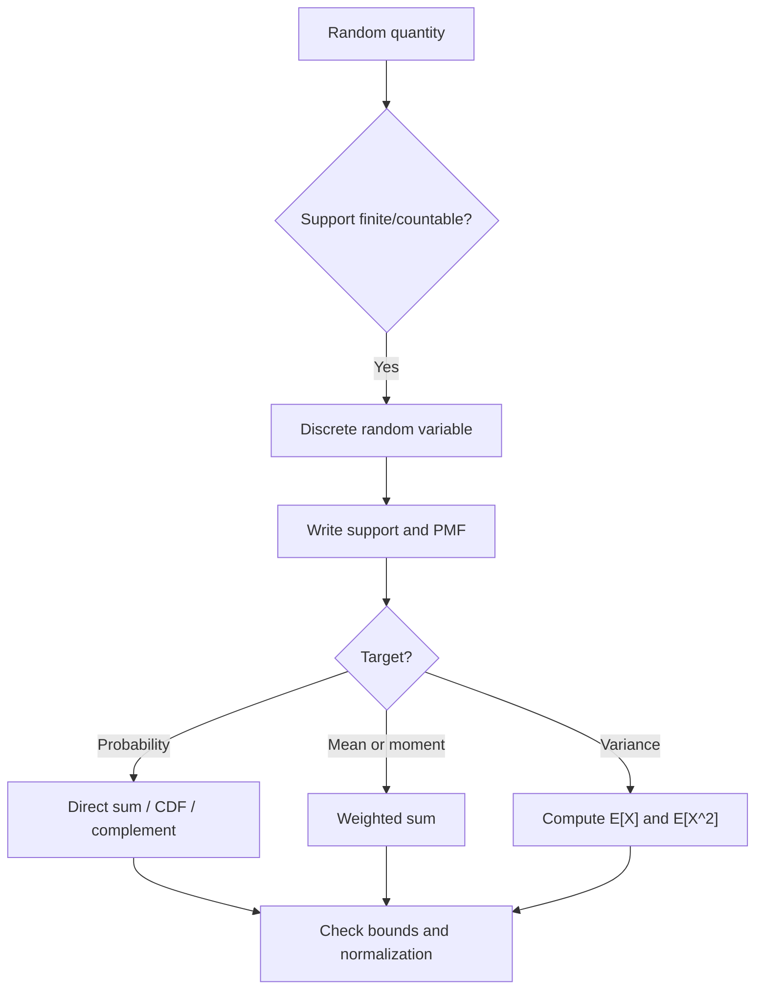

# 📊 2.1 — Variabel Acak Diskrit

> [!ABSTRACT] Ringkasan Cepat
> **Topik:** Variabel Acak Diskrit  
> **Bobot Parent Topic:** 25–35%  
> **Exam Priority:** Very High  
> **Difficulty:** Calculation-Intensive  
> **Primary Skill:** Mixed — structure recognition + calculation  
> **Ref:** Hogg, Tanis & Zimmerman Ch. 2; Hogg, McKean & Craig §§1.6, 1.9; Miller, Miller & Freund §§3.1–3.2 dan bagian expectation/moments yang relevan di Ch. 4

## Section 0 — Pemetaan Silabus & Exam Scope

| Field | Isi |
|---|---|
| Topik CF2 | Topik 2 — Variabel Acak Univariat |
| Subtopik | 2.1 Variabel Acak Diskrit |
| Learning Outcome | Menjelaskan variabel acak diskrit, PMF, CDF, mean, variansi, dan momen ke-$k$; menghitung probabilitas, probabilitas kumulatif, nilai harapan, dan variansi |
| Skill Diuji | Menerjemahkan eksperimen ke random variable, menentukan support, membangun/menggunakan PMF dan CDF, menghitung probability/expectation/variance/moments |
| Bobot Parent Topic | 25–35% |
| Exam Priority | Very High |
| Prerequisite | Sample space, event, probability law, counting |
| Connected Topics | [[2.3 Fungsi Pembangkit]], [[2.4 Transformasi Variabel Acak Univariat]], [[2.5 Distribusi Diskrit Umum]], [[3.1 Distribusi Gabungan (Joint Distribution)]] |
| Referensi | Hogg, Tanis & Zimmerman Ch. 2; Hogg, McKean & Craig §§1.6, 1.9; Miller §§3.1–3.2, Ch. 4 discrete expectation/moments |

> [!IMPORTANT] Scope Boundary
> Fokus subtopik ini adalah **fondasi univariate discrete random variable**: definisi random variable, discrete support, PMF, CDF, probability calculation, expectation/mean, variance, dan moments. Distribusi Bernoulli, Binomial, Poisson, Geometric, Hypergeometric, dan Negative Binomial dibahas sistematis di [[2.5 Distribusi Diskrit Umum]], walaupun beberapa textbook memperkenalkannya sebagai contoh pada chapter yang sama. PGF/MGF dibahas di [[2.3 Fungsi Pembangkit]], sedangkan transformasi formal random variable dibahas di [[2.4 Transformasi Variabel Acak Univariat]].

## Section 1 — Intuisi & Big Picture

Sebuah **random experiment** menghasilkan outcome $s$ di sample space $S$. Sering kali kita tidak membutuhkan seluruh detail outcome; kita hanya membutuhkan sebuah angka yang merangkum aspek yang relevan. Random variable $X$ adalah aturan yang memetakan setiap outcome menjadi satu bilangan real. Jika kita melempar dua dadu, outcome lengkapnya dapat berupa $(3,5)$, tetapi jika yang relevan adalah jumlah kedua dadu, kita mendefinisikan $X(3,5)=8$.

Untuk **discrete random variable**, nilai yang mungkin diambil $X$ membentuk himpunan berhingga atau countably infinite. Karena probability mass terkonsentrasi pada titik-titik tersebut, perhitungan probabilitas dilakukan dengan **menjumlahkan mass**, bukan mengintegralkan area. Struktur dasar yang harus selalu terlihat adalah:

$$
\text{experiment} \longrightarrow X \longrightarrow S_X \longrightarrow p_X(x) \longrightarrow F_X(x).
$$

Kesalahan intuitif paling umum adalah langsung memasukkan angka ke formula tanpa terlebih dahulu menentukan **support**. Di CF2, support menentukan batas summation, bentuk CDF, apakah suatu PMF valid, dan apakah event seperti $X>3$ berarti $x=4,5,\ldots$ atau sesuatu yang berbeda. Mental rule utama:

> **Support first, calculation second.**

## Section 2 — Definisi, Support & Core Formulas

### Definisi Formal

> [!NOTE] Definisi Formal
> Misalkan $S$ adalah sample space dari suatu random experiment. Suatu fungsi real-valued $X$ yang menetapkan tepat satu bilangan real $X(s)=x$ kepada setiap $s\in S$ disebut **random variable**.

Dengan notation yang konsisten:

- $S$ = sample space eksperimen;
- $s\in S$ = outcome eksperimen;
- $X$ = random variable;
- $x$ = realized value / possible value dari $X$;
- $S_X$ atau $D_X$ = space/support dari $X$.

> [!NOTE] Discrete Random Variable
> Random variable $X$ disebut **diskrit** apabila support-nya berhingga atau countably infinite.

Contoh support diskrit:

$$
S_X=\{0,1,2,3\},
$$

atau

$$
S_X=\{1,2,3,\ldots\}.
$$

### Terminologi & Simbol Penting

| Istilah / Simbol | Definisi | Support / Domain | Exam Note |
|---|---|---|---|
| $X$ | Random variable | Fungsi dari sample space ke $\mathbb{R}$ | Jangan disamakan dengan outcome $s$ |
| $x$ | Nilai/realization dari $X$ | $x\in S_X$ | Huruf kecil biasanya nilai yang mungkin/terobservasi |
| $S_X$ / $D_X$ | Support/space $X$ | Finite atau countably infinite | Tentukan sebelum sum |
| $p_X(x)$ atau $f(x)$ | PMF | Positif pada support, $0$ di luar support | Nilainya adalah probability mass |
| $F_X(x)$ | CDF | Didefinisikan untuk semua $x\in\mathbb{R}$ | Step function pada kasus diskrit |
| $\mu=E[X]$ | Mean | Jika expectation exist | Weighted average dari support |
| $\sigma^2=\operatorname{Var}(X)$ | Variance | Jika finite | Ukuran spread kuadrat dari mean |
| $\mu'_k=E[X^k]$ | Momen ke-$k$ tentang origin | Jika finite | Raw moment |
| $\mu_k=E[(X-\mu)^k]$ | Central moment ke-$k$ | Jika finite | $\mu_2=\sigma^2$ |

### PMF — Probability Mass Function

Untuk discrete random variable $X$, PMF didefinisikan sebagai

$$
p_X(x)=P(X=x), \qquad x\in S_X,
$$

dan secara konvensi

$$
p_X(x)=0, \qquad x\notin S_X.
$$

Agar suatu fungsi dapat menjadi PMF, dua syarat fundamental harus dipenuhi:

$$
p_X(x)\ge 0 \qquad \text{untuk semua }x,
$$

serta

$$
\sum_{x\in S_X}p_X(x)=1.
$$

Untuk event $A\subseteq S_X$,

$$
P(X\in A)=\sum_{x\in A}p_X(x).
$$

Jika event berbentuk interval integer, misalnya $a\le X\le b$,

$$
P(a\le X\le b)=\sum_{\substack{x\in S_X\\a\le x\le b}}p_X(x).
$$

> [!IMPORTANT] Support
> Batas sum harus mengikuti nilai yang **benar-benar dapat diambil** oleh $X$. Menulis $\sum_{x=a}^{b}$ hanya valid bila seluruh integer pada range tersebut memang sesuai support atau PMF telah didefinisikan $0$ di luar support.

### CDF — Cumulative Distribution Function

CDF didefinisikan untuk setiap real $x$ sebagai

$$
F_X(x)=P(X\le x).
$$

Untuk random variable diskrit,

$$
F_X(x)=\sum_{t\in S_X,\,t\le x}p_X(t).
$$

CDF diskrit adalah **step function**. Pada setiap titik support $x_i$, CDF meloncat sebesar mass di titik tersebut:

$$
P(X=x_i)=F_X(x_i)-F_X(x_i^-),
$$

dengan $F_X(x_i^-)$ menyatakan limit dari kiri.

Properties yang wajib dikenali:

$$
0\le F_X(x)\le 1,
$$

$$
x_1<x_2 \implies F_X(x_1)\le F_X(x_2),
$$

$$
\lim_{x\to-\infty}F_X(x)=0,
\qquad
\lim_{x\to\infty}F_X(x)=1.
$$

Untuk event umum:

$$
P(X\le b)=F_X(b),
$$

$$
P(X>b)=1-F_X(b),
$$

serta untuk $a<b$,

$$
P(a<X\le b)=F_X(b)-F_X(a).
$$

Untuk endpoint diskrit, selalu cek apakah inequality strict atau inclusive. Misalnya:

$$
P(a\le X\le b)=F_X(b)-F_X(a^-).
$$

Jika support integer, bentuk ini sering dapat ditulis sebagai

$$
P(a\le X\le b)=F_X(b)-F_X(a-1),
$$

**hanya jika** $a$ integer dan support berjalan pada integer steps yang sesuai.

### Mathematical Expectation / Mean

Untuk discrete $X$ dengan PMF $p_X(x)$,

$$
E[X]=\sum_{x\in S_X}x\,p_X(x),
$$

bila sum tersebut exist.

Mean dilambangkan

$$
\mu=E[X].
$$

Interpretasi textbook: mean adalah **weighted average** dari nilai-nilai support, dengan probability sebagai weight.

Lebih umum, untuk fungsi $g(X)$,

$$
E[g(X)]
=\sum_{x\in S_X}g(x)p_X(x),
$$

selama expectation exists. Ini adalah bentuk yang sangat penting karena kita tidak perlu selalu menemukan PMF dari $Y=g(X)$ terlebih dahulu hanya untuk menghitung $E[g(X)]$.

Linearity of expectation:

$$
E[aX+b]=aE[X]+b.
$$

Lebih umum,

$$
E\!\left[\sum_{i=1}^{m}c_i g_i(X)\right]
=\sum_{i=1}^{m}c_iE[g_i(X)].
$$

### Moments

Momen ke-$k$ tentang origin atau **raw moment** adalah

$$
\mu'_k=E[X^k]
=\sum_{x\in S_X}x^k p_X(x).
$$

Khusus:

$$
\mu'_1=E[X]=\mu,
$$

$$
\mu'_2=E[X^2].
$$

Central moment ke-$k$ adalah

$$
\mu_k=E[(X-\mu)^k].
$$

Khusus:

$$
\mu_1=0,
$$

$$
\mu_2=E[(X-\mu)^2]=\operatorname{Var}(X).
$$

### Variance dan Standard Deviation

Variance didefinisikan sebagai

$$
\operatorname{Var}(X)
=E[(X-\mu)^2].
$$

Untuk discrete $X$:

$$
\operatorname{Var}(X)
=\sum_{x\in S_X}(x-\mu)^2p_X(x).
$$

Identity yang biasanya lebih cepat:

$$
\boxed{\operatorname{Var}(X)=E[X^2]-\{E[X]\}^2}
$$

atau

$$
\boxed{\sigma^2=\mu'_2-\mu^2}.
$$

Derivasi minimum:

$$
\begin{aligned}
\operatorname{Var}(X)
&=E[(X-\mu)^2]\\
&=E[X^2-2\mu X+\mu^2]\\
&=E[X^2]-2\mu E[X]+\mu^2\\
&=E[X^2]-\mu^2.
\end{aligned}
$$

Standard deviation:

$$
\sigma=\sqrt{\operatorname{Var}(X)}.
$$

Untuk linear transformation,

$$
E[aX+b]=a\mu+b,
$$

sedangkan

$$
\operatorname{Var}(aX+b)=a^2\operatorname{Var}(X).
$$

Karena shift $b$ hanya menggeser seluruh distribution tanpa mengubah spread:

$$
\operatorname{Var}(X+b)=\operatorname{Var}(X).
$$

### Recognition Clues

| Narasi / Mechanism | Model yang Dipikirkan | Pembeda Kritis |
|---|---|---|
| “jumlah klaim”, “jumlah sukses”, “jumlah item cacat” | Discrete count random variable | Support biasanya integer nonnegative |
| “nilai tertinggi dari dua lemparan dadu” | Discrete RV sebagai fungsi outcome | Harus map sample-space outcomes ke nilai $X$ |
| “diberikan PMF $p(x)=c h(x)$” | Normalization problem | Cari $c$ dari $\sum p(x)=1$ |
| “at most $k$” | CDF/direct cumulative sum | $P(X\le k)=F(k)$ |
| “more than $k$” | Complement | $1-F(k)$ |
| “mean / expected value” | Weighted sum | $\sum x p(x)$ |
| “variance” | Second raw moment shortcut | $E[X^2]-E[X]^2$ |
| “$k$th moment” | Raw/central moment | Pastikan yang diminta moment about origin atau about mean |

## Section 3 — How It Works

```text
Random experiment
↓
Define the numerical measurement X
↓
Determine discrete support S_X
↓
Construct / read PMF p_X(x)
↓
Translate the requested event into support values
↓
Use direct sum, CDF, or complement
↓
If needed: compute E[X], E[X^2], moments
↓
Compute variance / interpretation
↓
Verify normalization and probability bounds
```

### 3.1 Dari Sample Space ke Random Variable

Random variable bukan “hasil acak” dalam arti informal; ia adalah **fungsi**. Beberapa sample-space outcomes dapat dipetakan ke nilai random variable yang sama.

Misalnya dua dadu fair dilempar dan $X$ adalah jumlah mata dadu. Outcome $(1,6)$ dan $(4,3)$ berbeda di sample space, tetapi keduanya menghasilkan $X=7$. Maka

$$
P(X=7)
=\sum_{s:\,X(s)=7}P(\{s\}).
$$

Jika 36 ordered outcomes equally likely, ada 6 outcome yang menghasilkan 7, sehingga

$$
P(X=7)=\frac{6}{36}=\frac16.
$$

Ini menjelaskan dari mana PMF muncul: ia mengagregasi probability seluruh outcome yang dipetakan ke nilai $x$ yang sama.

### 3.2 Validasi PMF sebelum Menggunakannya

Jika soal memberi

$$
p_X(x)=c(x+1),\qquad x=0,1,2,3,
$$

jangan langsung menghitung probability target. Normalisasi dahulu:

$$
\sum_{x=0}^{3}c(x+1)=1.
$$

Karena

$$
1+2+3+4=10,
$$

maka

$$
c=\frac1{10}.
$$

Baru setelah PMF valid, probability seperti $P(X\ge2)$ dapat dihitung.

### 3.3 Direct Sum vs CDF vs Complement

Untuk probability diskrit, tiga route utama adalah:

**Direct sum**

$$
P(X\in A)=\sum_{x\in A}p_X(x).
$$

**CDF**

$$
P(X\le k)=F_X(k).
$$

**Complement**

$$
P(X>k)=1-F_X(k).
$$

Aturan cepat:

- sedikit terms → direct sum;
- CDF sudah diberikan → gunakan CDF;
- event berupa “at least one”, “more than”, atau tail panjang → cek complement.

> [!TIP] Cara Berpikir Cepat
> Sebelum melakukan summation panjang, tanyakan: **apakah complement membuat event menjadi satu CDF lookup/satu short sum?**

### 3.4 Expectation sebagai Weighted Average

Jika support $S_X=\{x_1,x_2,\ldots\}$, maka

$$
E[X]=x_1p_1+x_2p_2+\cdots.
$$

Untuk fungsi $g(X)$, gunakan langsung

$$
E[g(X)]=\sum g(x)p_X(x).
$$

Misalnya jika diminta $E[3X^2-2X+4]$, route cepat adalah

$$
E[3X^2-2X+4]
=3E[X^2]-2E[X]+4.
$$

Tidak perlu mencari distribution dari $3X^2-2X+4$.

### 3.5 Variance: Jangan Menghitung Deviasi bila Tidak Perlu

Direct definition:

$$
\operatorname{Var}(X)=\sum (x-\mu)^2p_X(x)
$$

selalu valid jika finite, tetapi sering lebih lambat. Exam route yang biasanya lebih efisien:

1. hitung $E[X]$;
2. hitung $E[X^2]$;
3. gunakan

$$
\operatorname{Var}(X)=E[X^2]-E[X]^2.
$$

### 3.6 CDF Diskrit: Baca Jump, Bukan Slope

Untuk random variable diskrit, probability di satu titik bukan luas atau derivative CDF, melainkan **besar loncatan**:

$$
P(X=x)=F_X(x)-F_X(x^-).
$$

Jika CDF piecewise diberikan, pertama identifikasi titik jump, kemudian ambil selisih level sebelum dan sesudah titik tersebut.

> [!DANGER] Jangan Salah Pikir
> 1. Jangan memperlakukan PMF sebagai PDF: pada discrete RV, $P(X=x)$ dapat positif.
> 2. Jangan menganggap CDF hanya didefinisikan pada support. $F_X(x)$ didefinisikan untuk seluruh real $x$.
> 3. Jangan menghitung variance sebagai $E[X^2]-E[X]$; yang benar adalah $E[X^2]-E[X]^2$.
> 4. Jangan mengabaikan mass pada endpoint saat inequality menggunakan $\le$ atau $\ge$.
> 5. Jangan memakai formula mean/variance sebelum memastikan PMF valid dan support benar.

### Derivasi Minimum yang Berguna

#### Mengapa PMF harus menjumlah ke 1?

Karena event bahwa $X$ mengambil **salah satu** nilai support adalah sure event:

$$
P(X\in S_X)=1.
$$

Karena event $\{X=x\}$ untuk distinct support points mutually exclusive,

$$
P(X\in S_X)
=\sum_{x\in S_X}P(X=x)
=\sum_{x\in S_X}p_X(x)
=1.
$$

#### Mengapa CDF merupakan cumulative sum?

Event $\{X\le x\}$ adalah union mutually exclusive dari semua point-events pada support yang tidak melebihi $x$:

$$
\{X\le x\}=\bigcup_{t\in S_X,\,t\le x}\{X=t\}.
$$

Maka

$$
F_X(x)=\sum_{t\le x}p_X(t).
$$

#### Mengapa $\operatorname{Var}(aX+b)=a^2\operatorname{Var}(X)$?

Karena

$$
E[aX+b]=a\mu+b,
$$

sehingga

$$
(aX+b)-(a\mu+b)=a(X-\mu).
$$

Akibatnya

$$
\operatorname{Var}(aX+b)
=E[a^2(X-\mu)^2]
=a^2\operatorname{Var}(X).
$$

## Section 4 — Worked Examples & Exam Cases

### Case A — Fundamental

**Soal**

Diberikan random variable diskrit $X$ dengan PMF

$$
p_X(x)=c(x+1),\qquad x=0,1,2,3,
$$

dan $p_X(x)=0$ di luar support. Tentukan:

1. konstanta $c$;
2. $P(X\ge2)$;
3. $E[X]$;
4. $\operatorname{Var}(X)$.

> [!SUCCESS] Pembahasan
>
> **1. Parse Narasi & Target**  
> PMF diberikan sampai constant $c$. Kita harus normalisasi terlebih dahulu, kemudian menghitung tail probability, mean, dan variance.
>
> **2. Identify Structure / Distribution**  
> Ini adalah generic discrete PMF; tidak perlu memaksakan nama distribution tertentu.
>
> **3. Support / Domain / Region**  
> $$S_X=\{0,1,2,3\}.$$
>
> **4. Setup — Normalization**  
> $$\sum_{x=0}^{3}p_X(x)=1.$$
>
> Maka
> $$c\sum_{x=0}^{3}(x+1)=1.$$
>
> **5. Calculation**  
> Karena $1+2+3+4=10$,
> $$c=\frac1{10}.$$
>
> Jadi PMF-nya
> $$p_X(x)=\frac{x+1}{10},\qquad x=0,1,2,3.$$
>
> Tail probability:
> $$P(X\ge2)=p_X(2)+p_X(3)=\frac3{10}+\frac4{10}=\frac7{10}.$$
>
> Mean:
> $$\begin{aligned}
> E[X]
> &=\sum_{x=0}^{3}x\frac{x+1}{10}\\
> &=\frac{0+2+6+12}{10}\\
> &=2.
> \end{aligned}$$
>
> Second raw moment:
> $$\begin{aligned}
> E[X^2]
> &=\sum_{x=0}^{3}x^2\frac{x+1}{10}\\
> &=\frac{0+2+12+36}{10}\\
> &=5.
> \end{aligned}$$
>
> Variance:
> $$\operatorname{Var}(X)=5-2^2=1.$$
>
> **6. Interpretation**  
> Distribution berpusat pada mean $2$ dengan variance $1$.
>
> **7. Verification**  
> Semua probability nonnegative; total mass $=1$; $P(X\ge2)=0.7\in[0,1]$; variance nonnegative.

> [!WARNING] Exam Trap — Case A
> - **Trap:** memakai $c=1/4$ karena ada empat support points.
> - **Mengapa distractor terlihat benar:** mengira setiap point memiliki probability sama.
> - **Cara menghindari:** jika PMF proportional terhadap $(x+1)$, probabilities tidak uniform.
> - **Shortcut aman:** normalization constant selalu dari reciprocal total unnormalized mass.
> - **Target waktu:** sekitar 2–3 menit setelah setup dikenali.

### Case B — Exam-Typical

**Soal**

CDF dari random variable diskrit $X$ adalah

$$
F_X(x)=
\begin{cases}
0, & x<0,\\
0.10, & 0\le x<1,\\
0.35, & 1\le x<2,\\
0.70, & 2\le x<4,\\
1, & x\ge4.
\end{cases}
$$

Tentukan:

1. PMF dari $X$;
2. $P(1<X\le4)$;
3. $E[X]$;
4. $\operatorname{Var}(X)$.

> [!SUCCESS] Pembahasan
>
> **1. Parse Narasi & Target**  
> CDF diberikan sebagai step function. PMF diperoleh dari jump sizes.
>
> **2. Identify Structure / Distribution**  
> Titik support adalah lokasi CDF meloncat: $0,1,2,4$.
>
> **3. Support**  
> $$S_X=\{0,1,2,4\}.$$
>
> **4. Setup — Jump Size**  
> $$p_X(x_i)=F_X(x_i)-F_X(x_i^-).$$
>
> **5. Calculation**  
> $$p_X(0)=0.10-0=0.10,$$
> $$p_X(1)=0.35-0.10=0.25,$$
> $$p_X(2)=0.70-0.35=0.35,$$
> $$p_X(4)=1-0.70=0.30.$$
>
> Check:
> $$0.10+0.25+0.35+0.30=1.$$
>
> Event $1<X\le4$ berarti $X\in\{2,4\}$:
> $$P(1<X\le4)=0.35+0.30=0.65.$$
>
> Bisa juga langsung dari CDF:
> $$P(1<X\le4)=F_X(4)-F_X(1)=1-0.35=0.65.$$
>
> Mean:
> $$E[X]=0(0.10)+1(0.25)+2(0.35)+4(0.30)=2.15.$$
>
> Second moment:
> $$E[X^2]=0+1(0.25)+4(0.35)+16(0.30)=6.45.$$
>
> Variance:
> $$\operatorname{Var}(X)=6.45-(2.15)^2=1.8275.$$
>
> **6. Interpretation**  
> CDF mengandung seluruh probability information; PMF diperoleh dari jumps.
>
> **7. Verification**  
> PMF sums to 1; CDF nondecreasing; variance positive.

> [!WARNING] Exam Trap — Case B
> - **Trap:** menganggap support juga mencakup $3$ karena interval CDF adalah $2\le x<4$.
> - **Mengapa distractor terlihat benar:** interval CDF dibaca sebagai range nilai $X$.
> - **Cara menghindari:** support diskrit ada pada **jump locations**, bukan setiap real number tempat CDF constant.
> - **Shortcut aman:** ambil successive differences pada CDF levels.
> - **Target waktu:** 2–3 menit.

### Case C — Challenging / Integrated

**Soal**

Sebuah random variable $X$ memiliki PMF

$$
p_X(x)=k\,2^{-x},\qquad x=1,2,3,\ldots
$$

Tentukan:

1. $k$;
2. $P(X\ge4)$;
3. $E[X]$;
4. $E[X^2]$;
5. $\operatorname{Var}(X)$.

> [!SUCCESS] Pembahasan
>
> **1. Parse Narasi & Target**  
> Support countably infinite. Kita perlu normalization dan infinite-series identities.
>
> **2. Identify Structure**  
> Generic geometric-form PMF, tetapi untuk subtopik ini kita cukup bekerja dari PMF tanpa bergantung pada hafalan named-distribution formula.
>
> **3. Support**  
> $$S_X=\{1,2,3,\ldots\}.$$
>
> **4. Setup — Normalization**  
> $$\sum_{x=1}^{\infty}k2^{-x}=1.$$
>
> Karena
> $$\sum_{x=1}^{\infty}r^x=\frac{r}{1-r},\qquad |r|<1,$$
> dengan $r=1/2$,
> $$\sum_{x=1}^{\infty}2^{-x}=1.$$
> Jadi
> $$k=1.$$
>
> **5. Tail Probability**  
> $$\begin{aligned}
> P(X\ge4)
> &=\sum_{x=4}^{\infty}2^{-x}\\
> &=\frac{2^{-4}}{1-1/2}\\
> &=\frac18.
> \end{aligned}$$
>
> Untuk mean, gunakan identity
> $$\sum_{x=1}^{\infty}xr^x=\frac{r}{(1-r)^2},\qquad |r|<1.$$
> Maka
> $$E[X]=\sum_{x=1}^{\infty}x2^{-x}=2.$$
>
> Untuk second moment, gunakan
> $$\sum_{x=1}^{\infty}x^2r^x=\frac{r(1+r)}{(1-r)^3},\qquad |r|<1.$$
> Maka
> $$E[X^2]=\frac{(1/2)(3/2)}{(1/2)^3}=6.$$
>
> Variance:
> $$\operatorname{Var}(X)=6-2^2=2.$$
>
> **6. Interpretation**  
> Infinite support tidak berarti probability tail besar; mass turun geometrically.
>
> **7. Verification**  
> Normalization converges karena $|1/2|<1$; tail probability $1/8$ valid; variance positive.

> [!WARNING] Exam Trap — Case C
> - **Trap:** mengakhiri normalization sum pada nilai tertentu karena terbiasa finite support.
> - **Mengapa distractor terlihat benar:** notation $x=1,2,3,\ldots$ mudah terbaca sekilas sebagai contoh values saja.
> - **Cara menghindari:** identifikasi apakah support finite atau countably infinite sebelum menulis sum.
> - **Shortcut aman:** gunakan known convergent geometric-series identities jika tersedia dan justified.
> - **Target waktu:** 3–5 menit, tergantung familiarity dengan series.

## Section 5 — Verification & Sanity Check

> [!CHECK] Sanity Check
> 1. **Normalization:** $\sum_{x\in S_X}p_X(x)=1$.
> 2. **Non-negativity:** $p_X(x)\ge0$ untuk seluruh support.
> 3. **Probability bound:** setiap probability result harus berada di $[0,1]$.
> 4. **CDF shape:** nondecreasing, level awal $0$, level akhir $1$.
> 5. **CDF jump:** jump size tidak boleh negatif dan total seluruh jumps harus $1$.
> 6. **Mean location:** untuk finite support $[a,b]$, mean harus berada di convex range $[a,b]$.
> 7. **Variance:** harus $\ge0$.
> 8. **Linear transform:** shift tidak mengubah variance; multiplication by $a$ mengalikan variance dengan $a^2$.

### Metode Alternatif

#### Direct sum vs complement

Jika target

$$
P(X\ge k),
$$

bandingkan:

$$
\sum_{x\ge k}p_X(x)
$$

versus

$$
1-P(X\le k-1).
$$

Jika lower tail jauh lebih pendek atau CDF tersedia, complement lebih cepat.

#### PMF vs CDF

Jika PMF diberikan dan target interval sempit, direct sum biasanya cepat. Jika CDF diberikan, hindari membangun seluruh PMF kecuali memang diperlukan untuk expectation.

#### Direct variance vs raw-moment shortcut

Direct:

$$
\sum(x-\mu)^2p(x)
$$

Shortcut:

$$
E[X^2]-E[X]^2.
$$

Untuk tabel PMF, shortcut hampir selalu lebih efisien karena cukup menambahkan kolom $x p(x)$ dan $x^2p(x)$.

#### Direct distribution of $g(X)$ vs LOTUS-style expectation

Jika hanya diminta $E[g(X)]$, gunakan

$$
E[g(X)]=\sum g(x)p_X(x),
$$

daripada mencari PMF $Y=g(X)$, terutama bila $g$ many-to-one.

## Section 6 — Connections & Mental Model

### 6.1 Random Experiment → Random Variable → Distribution

```text
Outcome s in sample space S
        ↓ X(s)
Numeric value x
        ↓
Probability mass p_X(x)
        ↓ cumulative sum
CDF F_X(x)
        ↓ weighted sums
Mean / moments / variance
```

Random variable berfungsi sebagai **numerical lens** terhadap sample space. Satu experiment dapat memiliki banyak random variables tergantung apa yang ingin diukur.

### 6.2 PMF dan CDF membawa informasi yang sama

Untuk discrete RV:

$$
F_X(x)=\sum_{t\le x}p_X(t),
$$

sedangkan PMF dapat dipulihkan dari jumps CDF. Jadi PMF dan CDF bukan dua distribution berbeda; keduanya adalah representasi berbeda dari probability distribution yang sama.

### 6.3 Mean dan Moments adalah summaries dari distribution

PMF/CDF menjawab **bagaimana probability didistribusikan**. Mean, variance, dan moments meringkas bentuk tersebut:

- $E[X]$ → location/weighted center;
- $E[X^2]$ → raw second-order magnitude;
- $\operatorname{Var}(X)$ → spread around mean;
- higher moments → higher-order structure yang menjadi dasar untuk topik generating functions.

Connection:

[[2.1 Variabel Acak Diskrit]] → [[2.3 Fungsi Pembangkit]]

karena generating functions digunakan untuk menghasilkan moments secara sistematis.

### 6.4 Dari Generic Discrete RV ke Named Distributions

[[2.1 Variabel Acak Diskrit]] memberi generic machinery. [[2.5 Distribusi Diskrit Umum]] memberi standardized PMFs untuk mechanisms tertentu. Urutan berpikirnya tetap sama:

```text
Narrative mechanism
↓
Recognize named distribution
↓
Declare support + parameterization
↓
Use PMF/CDF
↓
Compute probability / expectation / variance
```

### Hubungan Visual ↔ Rumus

Pada probability histogram diskrit, tinggi/area bar merepresentasikan mass $p_X(x)$. CDF mengakumulasi mass dari kiri ke kanan. Maka setiap kali histogram memiliki bar di $x_i$, CDF memiliki jump sebesar

$$
p_X(x_i).
$$

Ini adalah mental picture paling berguna untuk membedakan PMF dan CDF.

## Section 7 — Exam Traps & Misconceptions

### Support / Domain Trap

> [!BUG] Support Trap
> **Salah:** langsung menulis $\sum_{x=0}^{10}$ hanya karena target berbunyi “$X\le10$”.  
> **Benar:** intersect event dengan support dahulu:
> $$\{x\in S_X:x\le10\}.$$

Support menentukan:

- titik PMF yang positive;
- batas sum;
- lokasi CDF jumps;
- possible values dari $g(X)$.

### PMF vs CDF Trap

> [!BUG] PMF/CDF Trap
> PMF adalah **point mass**:
> $$p_X(x)=P(X=x).$$
> CDF adalah **cumulative probability**:
> $$F_X(x)=P(X\le x).$$

Tidak benar menulis $p_X(x)=F_X(x)$ kecuali kebetulan pada suatu nilai tertentu.

### Endpoint / Event Translation Trap

> [!BUG] Event Translation Trap
> Untuk discrete $X$:
> - “at most $k$” → $X\le k$;
> - “less than $k$” → $X<k$;
> - “at least $k$” → $X\ge k$;
> - “more than $k$” → $X>k$.

Jika $X$ integer-valued:

$$
P(X<k)=P(X\le k-1),
$$

namun equivalence ini bergantung pada integer support.

### Expectation Trap

> [!BUG] Expectation Trap
> Secara umum,
> $$E[g(X)]\ne g(E[X]).$$

Contoh:

$$
E[X^2]\ne E[X]^2
$$

kecuali variance $0$.

### Variance Trap

> [!BUG] Variance Trap
> **Salah**
> $$\operatorname{Var}(X)=E[X^2]-E[X].$$
>
> **Benar**
> $$\operatorname{Var}(X)=E[X^2]-E[X]^2.$$

Juga:

$$
\operatorname{Var}(aX+b)\ne a\operatorname{Var}(X)+b.
$$

Yang benar:

$$
\operatorname{Var}(aX+b)=a^2\operatorname{Var}(X).
$$

### CDF Step Trap

> [!BUG] CDF Jump Trap
> Jika CDF constant pada $2\le x<4$, itu **tidak** berarti $X$ dapat mengambil setiap nilai antara 2 dan 4. Justru tidak ada probability mass di interior interval tempat CDF tidak berubah.

### Red Flags

> [!CAUTION] Red Flags

| Keyword / Condition | Apa yang Harus Dipikirkan |
|---|---|
| “discrete” | support finite/countable, probability via sum |
| “PMF proportional to ...” | cari normalizing constant |
| “at most” | CDF / cumulative sum |
| “more than” | complement $1-F(k)$ |
| “exactly” | point mass $p_X(k)$ |
| “CDF given” | identify jump locations dan jump sizes |
| “expected value” | weighted sum $\sum xp(x)$ |
| “expected value of $g(X)$” | $\sum g(x)p(x)$ |
| “variance” | compute $E[X]$ dan $E[X^2]$ |
| “$k$th moment” | clarify raw vs central moment |
| infinite support | convergence dan correct infinite bounds |

## Section 8 — Executive Summary

### Must Remember

> [!SUMMARY] Must Remember
> 1. Random variable adalah fungsi $X:S\to\mathbb{R}$, bukan sekadar outcome eksperimen.
> 2. Discrete RV memiliki finite/countably infinite support.
> 3. PMF: $p_X(x)=P(X=x)$ pada support dan total mass harus $1$.
> 4. Probability event: jumlahkan PMF hanya atas support points yang memenuhi event.
> 5. CDF: $F_X(x)=P(X\le x)$ dan untuk discrete RV berbentuk step function.
> 6. Jump CDF pada $x$ sama dengan $P(X=x)$.
> 7. Mean: $E[X]=\sum xp_X(x)$.
> 8. Untuk fungsi: $E[g(X)]=\sum g(x)p_X(x)$.
> 9. Raw $k$th moment: $E[X^k]$; central $k$th moment: $E[(X-\mu)^k]$.
> 10. Variance: $\operatorname{Var}(X)=E[X^2]-E[X]^2$.
> 11. $E[aX+b]=aE[X]+b$, tetapi $\operatorname{Var}(aX+b)=a^2\operatorname{Var}(X)$.
> 12. Support dan endpoint harus ditentukan sebelum sum/CDF/complement.

### Formula Map / Comparison Table

| Kondisi | Model / Formula / Rule | Support / Assumption | Common Trap |
|---|---|---|---|
| PMF valid | $p(x)\ge0$, total mass $=1$ | Discrete support | lupa normalisasi |
| Probability event | sum PMF pada event | event intersect support | summing outside support |
| CDF | $F(x)=P(X\le x)$ | semua real $x$ | mengira hanya di support |
| Point mass from CDF | jump size | discontinuity point | memakai slope |
| Mean | $E[X]=\sum xp(x)$ | expectation exists | probability dan value tertukar |
| Function expectation | $E[g(X)]=\sum g(x)p(x)$ | exists | memakai $g(E[X])$ |
| Raw moment | $E[X^k]$ | finite if needed | tertukar central moment |
| Variance | $E[X^2]-E[X]^2$ | finite second moment | lupa square mean |
| Linear transform mean | $a\mu+b$ | constants $a,b$ | — |
| Linear transform variance | $a^2\sigma^2$ | constants $a,b$ | menambahkan $b$ ke variance |

### Trigger Keywords

| Jika soal mengatakan... | Pikirkan... |
|---|---|
| “number of ...” | kemungkinan discrete count RV |
| “PMF” | support + normalization |
| “cumulative probability” | CDF |
| “at least / more than” | check complement |
| “mean / expected” | weighted sum |
| “variance” | first and second moments |
| “moment of order $k$” | $E[X^k]$ atau central moment sesuai wording |
| “CDF jumps” | PMF recovery |

### Kapan Digunakan

Gunakan machinery subtopik ini bila random quantity mengambil finite/countable values dan targetnya probability, cumulative probability, expectation, variance, atau moments.

### Kapan TIDAK Boleh Digunakan

Jangan menggunakan PMF-summation mechanics bila random variable continuous dan probability direpresentasikan oleh density/integral; lihat [[2.2 Variabel Acak Kontinu]]. Jangan memakai named-distribution mean/variance tanpa memastikan mechanism, support, dan parameterization; lihat [[2.5 Distribusi Diskrit Umum]].

### Quick Decision Tree



## Section 9 — Active Recall Check

1. Apa perbedaan fundamental antara sample-space outcome $s$ dan random variable value $x$?
2. Apa dua syarat yang harus dipenuhi sebuah PMF?
3. Sebuah PMF diberikan sebagai $p(x)=c(2x+1)$ untuk $x=0,1,2,3$. Susun equation untuk mencari $c$ tanpa menyelesaikannya.
4. Jika $S_X=\{0,2,5,7\}$, tuliskan setup untuk $P(1<X\le6)$.
5. Jika CDF meloncat dari $0.42$ menjadi $0.67$ pada $x=3$, berapa struktur perhitungan untuk $P(X=3)$?
6. Bagaimana menulis $P(a<X\le b)$ menggunakan CDF?
7. Mengapa $E[g(X)]$ tidak perlu dihitung dengan terlebih dahulu mencari PMF dari $g(X)$?
8. Susun formula untuk raw moment ke-$k$ dan central moment ke-$k$.
9. Jika $E[X]=4$ dan $E[X^2]=21$, apa setup untuk variance dan sanity check apa yang harus dilakukan?
10. Mana yang lebih cepat untuk menghitung $P(X\ge8)$ ketika CDF $F(7)$ tersedia: direct upper-tail sum atau complement? Jelaskan tanpa menghitung.
11. Jika $Y=3X-5$, bagaimana mean dan variance $Y$ berkaitan dengan mean dan variance $X$?
12. Sebuah CDF constant pada interval $(2,5)$. Apa yang dapat disimpulkan tentang probability mass di interior interval tersebut?

## Section 10 — Exam Pattern Map

`[TEXTBOOK-BASED EXPECTATION]` — pola di bawah diturunkan dari scope silabus dan mechanics yang ditekankan textbook; bukan klaim frekuensi past exam.

| Narasi Soal | Keyword | Struktur/Distribusi | Setup / Formula | Langkah | Trap | Shortcut |
|---|---|---|---|---|---|---|
| PMF dengan unknown constant | “$p(x)=c h(x)$” | Generic discrete PMF | normalisasi total mass | tentukan support → sum → solve $c$ | salah bounds | reciprocal unnormalized total mass |
| Probability range | “at most”, “between” | PMF/CDF | cumulative sum/CDF difference | translate event → intersect support → calculate | endpoint | CDF jika tersedia |
| Upper-tail probability | “more than”, “at least” | discrete tail | complement | cari lower-tail CDF → $1-$ | off-by-one | use integer support relation carefully |
| Recover PMF from CDF | stepwise CDF | jump process | successive differences | identify jumps → subtract levels | support includes flat intervals | jump locations only |
| Mean / expected payoff | “expected”, “average in long run” | weighted sum | $\sum xp(x)$ | support → multiply → sum | forget probability weights | table columns $x,p,xp$ |
| Expectation of function | “expected $g(X)$” | LOTUS-style discrete expectation | $\sum g(x)p(x)$ | evaluate $g(x)$ → weight → sum | use $g(E[X])$ | avoid deriving distribution of $g(X)$ |
| Variance | “spread”, “variance” | first + second raw moments | $E[X^2]-E[X]^2$ | compute two moments → subtract | wrong square | raw-moment shortcut |
| kth moment | “moment about origin/mean” | moment calculation | $E[X^k]$ or $E[(X-\mu)^k]$ | identify type → sum | raw vs central confusion | define requested center first |

## Source Traceability

| Materi | Sumber |
|---|---|
| Random variable sebagai real-valued function pada outcome/sample space | Hogg, Tanis & Zimmerman, Ch. 2 §2.1; Miller, Ch. 3 §3.1 |
| Discrete support finite/countably infinite | Hogg, Tanis & Zimmerman, Ch. 2 §2.1; Hogg, McKean & Craig, §1.6 |
| PMF definition, non-negativity, normalization, event probability by summation | Hogg, Tanis & Zimmerman, §2.1; Hogg, McKean & Craig, §1.6; Miller, §3.2 |
| CDF definition dan cumulative-sum interpretation | Hogg, Tanis & Zimmerman, §2.1; Miller, §3.2 |
| Mean / expectation sebagai weighted average | Hogg, Tanis & Zimmerman, §2.2; Hogg, McKean & Craig, §1.9; Miller, Ch. 4 |
| Expectation of function $E[g(X)]$ | Hogg, Tanis & Zimmerman, §2.2; Miller, Ch. 4 |
| Raw moments dan central moments | Hogg, Tanis & Zimmerman, §2.3; Hogg, McKean & Craig, §1.9; Miller, Ch. 4 §3 |
| Variance definition dan identity $E[X^2]-E[X]^2$ | Hogg, Tanis & Zimmerman, §2.3; Hogg, McKean & Craig, §1.9; Miller, Ch. 4 |
| Linear expectation dan variance under $aX+b$ | Hogg, Tanis & Zimmerman, §§2.2–2.3; Hogg, McKean & Craig, §1.9; Miller, Ch. 4 |
| Worked examples dan exam framing | Sintesis exam-oriented dari mechanics yang didukung referensi resmi di atas |

---

> [!INFO] CF2 Study Note
> **Next:** [[2.2 Variabel Acak Kontinu]]  
> **Related:** [[2.3 Fungsi Pembangkit]] · [[2.5 Distribusi Diskrit Umum]]
