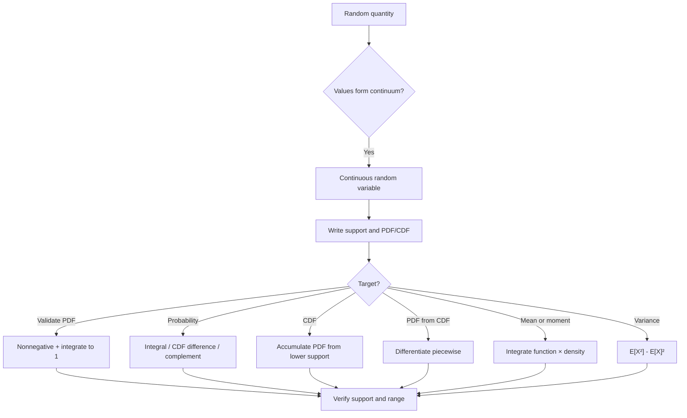

# 📊 2.2 — Variabel Acak Kontinu

> [!ABSTRACT] Ringkasan Cepat
> **Topik:** Variabel Acak Kontinu  
> **Bobot Parent Topic:** 25–35%  
> **Exam Priority:** Very High  
> **Difficulty:** Calculation-Intensive  
> **Primary Skill:** Mixed — support recognition + calculus + interpretation  
> **Ref:** Hogg, Tanis & Zimmerman Ch. 3; Hogg, McKean & Craig §§1.7, 1.9; Miller, Miller & Freund §§3.3–3.4 dan bagian expectation/moments kontinu yang relevan di Ch. 4

## Section 0 — Pemetaan Silabus & Exam Scope

| Field | Isi |
|---|---|
| Topik CF2 | Topik 2 — Variabel Acak Univariat |
| Subtopik | 2.2 Variabel Acak Kontinu |
| Learning Outcome | Menjelaskan variabel acak kontinu, PDF, CDF, mean, variansi, dan momen ke-$k$; menghitung probabilitas, probabilitas kumulatif, nilai harapan, dan variansi |
| Skill Diuji | Menentukan support, memvalidasi PDF, membentuk CDF, menghitung probability dengan integral/CDF, menghitung expectation/variance/moments, membaca hubungan geometris PDF–CDF |
| Bobot Parent Topic | 25–35% |
| Exam Priority | Very High |
| Prerequisite | Random variable, CDF, probability laws, integral dan derivative dasar |
| Connected Topics | [[2.3 Fungsi Pembangkit]], [[2.4 Transformasi Variabel Acak Univariat]], [[2.6 Distribusi Kontinu Umum]], [[3.1 Distribusi Gabungan (Joint Distribution)]] |
| Referensi | Hogg, Tanis & Zimmerman Ch. 3; Hogg, McKean & Craig §§1.7, 1.9; Miller §§3.3–3.4 dan Ch. 4 bagian kontinu |

> [!IMPORTANT] Scope Boundary
> Fokus subtopik ini adalah **generic continuous random variable**: continuous support, PDF, CDF, probability sebagai area, expectation, variance, dan moments. Named distributions seperti Uniform, Exponential, Gamma, dan Normal dibahas sistematis di [[2.6 Distribusi Kontinu Umum]]. MGF/CGF dibahas di [[2.3 Fungsi Pembangkit]], sedangkan teknik formal mencari distribusi dari $Y=g(X)$ dibahas di [[2.4 Transformasi Variabel Acak Univariat]].

---

## Section 1 — Intuisi & Big Picture

Pada random variable diskrit, probability berada sebagai **mass pada titik**. Pada random variable kontinu, probability tersebar sepanjang interval atau region kontinu. Karena itu, objek utama bukan lagi PMF, melainkan **probability density function (PDF)**.

Mental model utama:

$$
\text{support}
\longrightarrow
f_X(x)\;\text{(density)}
\longrightarrow
\text{area over interval}
\longrightarrow
F_X(x)\;\text{(accumulated area)}.
$$

Hal yang paling penting untuk tidak tertukar:

> **PDF value bukan probability. Probability diperoleh dari area/integral PDF.**

Untuk continuous random variable,

$$
P(X=x)=0
$$

untuk setiap titik individual $x$. Karena endpoint tunggal membawa zero probability, maka

$$
P(a<X<b)
=P(a\le X<b)
=P(a<X\le b)
=P(a\le X\le b).
$$

Inilah salah satu perbedaan mekanis terbesar dibanding [[2.1 Variabel Acak Diskrit]]. Pada kasus diskrit, strict/inclusive endpoints dapat mengubah hasil; pada kasus kontinu murni, tidak.

> [!TIP] Mental Rule
> **Support → bounds → integral.** Jangan pernah mulai mengintegralkan sebelum support dan event interval sudah jelas.

---

## Section 2 — Definisi, Support & Core Formulas

### Definisi Continuous Random Variable

Hogg, McKean & Craig mendefinisikan continuous random variable melalui CDF yang kontinu. Dalam praktik textbook CF2, sebagian besar model kontinu yang digunakan adalah **absolutely continuous**, sehingga terdapat fungsi $f_X$ yang memenuhi

$$
F_X(x)=\int_{-\infty}^{x} f_X(t)\,dt.
$$

Jika $F_X$ differentiable di $x$, maka

$$
f_X(x)=\frac{d}{dx}F_X(x).
$$

### PDF — Probability Density Function

Sebuah fungsi $f_X(x)$ dapat berfungsi sebagai PDF bila

$$
f_X(x)\ge 0
$$

untuk seluruh $x$, dan

$$
\int_{-\infty}^{\infty} f_X(x)\,dx=1.
$$

Jika support adalah $S_X$, sering lebih efisien menulis

$$
\int_{S_X} f_X(x)\,dx=1.
$$

Untuk event $A$,

$$
P(X\in A)=\int_A f_X(x)\,dx.
$$

Untuk interval $a<b$,

$$
P(a<X\le b)=\int_a^b f_X(x)\,dx.
$$

> [!DANGER] Density Trap
> Tidak ada syarat bahwa $f_X(x)\le 1$. Density dapat lebih besar dari $1$ pada sebagian support selama total area tetap $1$. Yang harus berada pada $[0,1]$ adalah **probability**, bukan nilai PDF.

### Support

Support kontinu biasanya berupa interval atau gabungan interval. Secara praktis, support adalah region tempat density positif.

Contoh:

$$
f_X(x)=cx^2,\qquad 0<x<2,
$$

maka support adalah

$$
S_X=(0,2).
$$

Di luar support,

$$
f_X(x)=0.
$$

> [!IMPORTANT] Support Is Part of the Formula
> Menulis hanya $f_X(x)=cx^2$ tanpa $0<x<2$ tidak cukup untuk calculation. Normalizing constant, CDF, probability, mean, dan variance semuanya bergantung pada bounds support.

### CDF — Cumulative Distribution Function

CDF didefinisikan untuk seluruh real $x$ sebagai

$$
F_X(x)=P(X\le x).
$$

Untuk continuous RV dengan PDF,

$$
F_X(x)=\int_{-\infty}^{x}f_X(t)\,dt.
$$

Properties utama:

$$
0\le F_X(x)\le 1,
$$

$$
x_1<x_2\implies F_X(x_1)\le F_X(x_2),
$$

$$
\lim_{x\to-\infty}F_X(x)=0,
\qquad
\lim_{x\to\infty}F_X(x)=1.
$$

Untuk $a<b$,

$$
P(a<X\le b)=F_X(b)-F_X(a).
$$

Karena tidak ada point mass,

$$
P(a\le X\le b)=F_X(b)-F_X(a)
$$

juga valid.

### PDF dari CDF

Jika CDF differentiable,

$$
f_X(x)=F_X'(x).
$$

Namun bila CDF piecewise, derivative harus dihitung **per interval** dan support tetap harus diperhatikan.

> [!NOTE] Important Distinction
> CDF selalu merupakan probability dan nilainya berada dalam $[0,1]$. PDF adalah density dan dapat memiliki nilai di atas $1$. PDF adalah slope CDF di titik differentiable; CDF adalah accumulated area PDF.

### Mathematical Expectation / Mean

Untuk continuous random variable $X$ dengan PDF $f_X(x)$,

$$
E[X]
=\int_{-\infty}^{\infty}x f_X(x)\,dx,
$$

bila integral tersebut exists.

Jika support terbatas $a<x<b$,

$$
E[X]
=\int_a^b x f_X(x)\,dx.
$$

Lebih umum, untuk fungsi $g$,

$$
E[g(X)]
=\int_{-\infty}^{\infty}g(x)f_X(x)\,dx,
$$

bila expectation exists.

Ini memungkinkan perhitungan $E[g(X)]$ tanpa terlebih dahulu mencari distribusi dari $Y=g(X)$.

### Moments

Raw moment ke-$k$:

$$
\mu_k'=E[X^k]
=\int_{-\infty}^{\infty}x^k f_X(x)\,dx.
$$

Central moment ke-$k$:

$$
\mu_k=E[(X-\mu)^k]
=\int_{-\infty}^{\infty}(x-\mu)^k f_X(x)\,dx.
$$

Khusus,

$$
\mu_1'=E[X]=\mu,
$$

sementara central moment kedua adalah variance.

### Variance dan Standard Deviation

Definisi:

$$
\operatorname{Var}(X)
=E[(X-\mu)^2].
$$

Bentuk integral:

$$
\operatorname{Var}(X)
=\int_{-\infty}^{\infty}(x-\mu)^2 f_X(x)\,dx.
$$

Shortcut yang biasanya lebih cepat:

$$
\operatorname{Var}(X)
=E[X^2]-\{E[X]\}^2.
$$

Standard deviation:

$$
\sigma=\sqrt{\operatorname{Var}(X)}.
$$

Untuk transformasi linear $Y=aX+b$,

$$
E[Y]=aE[X]+b,
$$

$$
\operatorname{Var}(Y)=a^2\operatorname{Var}(X).
$$

### Terminologi & Simbol Penting

| Simbol | Arti | Exam Note |
|---|---|---|
| $X$ | Continuous random variable | Jangan disamakan dengan nilai $x$ |
| $x$ | Possible/realized value | Biasanya berada pada interval support |
| $S_X$ | Support | Tentukan sebelum integral |
| $f_X(x)$ | PDF | Density, bukan point probability |
| $F_X(x)$ | CDF | Accumulated probability sampai $x$ |
| $\mu=E[X]$ | Mean | Integral $x f_X(x)$ |
| $\sigma^2$ | Variance | $E[X^2]-\mu^2$ sering tercepat |
| $\mu_k'$ | Raw moment | $E[X^k]$ |
| $\mu_k$ | Central moment | $E[(X-\mu)^k]$ |

### Recognition Clues

| Narasi / Bentuk Soal | Struktur yang Dipikirkan | Pembeda Kritis |
|---|---|---|
| time, lifetime, distance, length, proportion pada interval | Continuous RV | support berupa continuum |
| “density” / “PDF” | Integral area | $f(x)$ sendiri bukan probability |
| “find constant $c$” | Normalize PDF | integral seluruh support $=1$ |
| “between $a$ and $b$” | Interval probability | integrate dari $a$ ke $b$ |
| “CDF given” | Difference / derivative | probability via CDF; PDF via derivative |
| “expected value” | Weighted integral | $\int x f(x)dx$ |
| “variance” | First + second moment | $E[X^2]-E[X]^2$ |
| open vs closed endpoint | Same probability | hanya untuk continuous RV |

---

## Section 3 — How It Works

### 3.1 Validasi PDF sebelum Calculation

Jika

$$
f_X(x)=c h(x),\qquad a<x<b,
$$

maka gunakan dua tahap:

1. **Non-negativity check** pada support.
2. **Normalization**:

$$
\int_a^b c h(x)\,dx=1.
$$

Sehingga

$$
c=\frac{1}{\int_a^b h(x)\,dx},
$$

selama denominator positif dan finite.

> [!TIP] Exam Shortcut
> Bila $c$ hanya multiplicative constant, jangan menghitung target probability dulu. Cari $c$ dari total area $1$, baru gunakan PDF lengkap.

### 3.2 Dari PDF ke Probability

Template:

$$
P(a<X<b)
=\int_a^b f_X(x)\,dx,
$$

setelah interval dipotong terhadap support jika perlu.

Jika target melampaui support, gunakan intersection secara mental. Misalnya support $0<x<4$:

$$
P(-2<X<1)=P(0<X<1).
$$

### 3.3 Dari PDF ke CDF

Misalkan support $a<x<b$. Maka CDF biasanya piecewise:

$$
F_X(x)=
\begin{cases}
0, & x\le a,\\
\displaystyle\int_a^x f_X(t)\,dt, & a<x<b,\\
1, & x\ge b.
\end{cases}
$$

Jangan menulis hanya bagian tengah. Untuk soal exam, piecewise ranges penting karena menentukan nilai CDF di luar support.

### 3.4 Dari CDF ke PDF

Jika diberikan CDF piecewise, differentiate bagian yang smooth:

$$
f_X(x)=\frac{d}{dx}F_X(x).
$$

Lalu tulis $0$ di luar interval tempat CDF meningkat.

Jika $F_X$ constant pada suatu interval, maka

$$
f_X(x)=0
$$

pada interior interval tersebut bila differentiable.

### 3.5 PDF Integral vs CDF Difference

Jika CDF sudah tersedia:

$$
P(a<X\le b)=F_X(b)-F_X(a)
$$

biasanya lebih cepat daripada mengintegralkan ulang PDF.

Jika CDF belum tersedia tetapi PDF sederhana, direct integral biasanya lebih cepat.

### 3.6 Expectation sebagai Weighted Area

Untuk mean,

$$
E[X]=\int x f_X(x)\,dx.
$$

Interpretasi: setiap possible value $x$ diberi weight berdasarkan density di sekitarnya. Ini adalah analog kontinu dari weighted sum pada discrete RV.

Untuk nonlinear function:

$$
E[g(X)]=\int g(x)f_X(x)\,dx.
$$

Jangan mengganti dengan $g(E[X])$ kecuali ada alasan khusus.

### 3.7 Variance: Gunakan Raw-Moment Shortcut

Daripada langsung menghitung

$$
\int (x-\mu)^2f_X(x)\,dx,
$$

sering lebih cepat menghitung

$$
E[X],\qquad E[X^2],
$$

lalu

$$
\operatorname{Var}(X)=E[X^2]-E[X]^2.
$$

### Derivasi Minimum yang Berguna

#### Mengapa point probability nol?

Untuk continuous RV,

$$
P(X=x)=F_X(x)-F_X(x^-).
$$

Karena CDF continuous,

$$
F_X(x)=F_X(x^-),
$$

maka

$$
P(X=x)=0.
$$

#### Mengapa endpoint tidak mengubah interval probability?

Karena

$$
P(X=a)=P(X=b)=0,
$$

menambahkan atau menghapus endpoint tidak menambah probability.

#### Mengapa CDF difference sama dengan area interval?

$$
F_X(b)-F_X(a)
=\int_{-\infty}^{b}f_X(t)dt-\int_{-\infty}^{a}f_X(t)dt
=\int_a^b f_X(t)dt.
$$

---

## Section 4 — Worked Examples & Exam Cases

### Case A — Fundamental: Menentukan Normalizing Constant

Diberikan

$$
f_X(x)=
\begin{cases}
cx, & 0<x<2,\\
0, & \text{elsewhere}.
\end{cases}
$$

Cari $c$.

**Structure / Support**

$$
S_X=(0,2).
$$

**Setup**

PDF harus integrate ke $1$:

$$
\int_0^2 cx\,dx=1.
$$

**Calculation**

$$
c\left[\frac{x^2}{2}\right]_0^2=1,
$$

$$
2c=1,
$$

sehingga

$$
\boxed{c=\frac12}.
$$

**Check**

Density nonnegative pada support dan total area adalah $1$.

---

### Case B — Exam-Typical: PDF → CDF → Probability

Gunakan PDF

$$
f_X(x)=
\begin{cases}
3e^{-3x}, & x>0,\\
0, & x\le 0.
\end{cases}
$$

Untuk $x>0$,

$$
F_X(x)
=\int_0^x 3e^{-3t}\,dt
=1-e^{-3x}.
$$

Maka

$$
F_X(x)=
\begin{cases}
0, & x\le 0,\\
1-e^{-3x}, & x>0.
\end{cases}
$$

Untuk probability interval,

$$
P(0.5<X\le 1)
=F_X(1)-F_X(0.5).
$$

Sehingga

$$
P(0.5<X\le 1)
=(1-e^{-3})-(1-e^{-1.5})
=e^{-1.5}-e^{-3}
\approx 0.173.
$$

> [!CHECK] Sanity Check
> Probability positif dan kurang dari $1$. Hasil sama dengan direct integral $\int_{0.5}^{1}3e^{-3x}dx$.

---

### Case C — Challenging / Integrated: Normalization + CDF + Mean + Variance

Diberikan

$$
f_X(x)=
\begin{cases}
cx^2, & 0<x<1,\\
0, & \text{elsewhere}.
\end{cases}
$$

#### Step 1 — Normalization

$$
\int_0^1 cx^2\,dx=1,
$$

$$
\frac{c}{3}=1,
$$

sehingga

$$
c=3.
$$

Jadi

$$
f_X(x)=3x^2,\qquad 0<x<1.
$$

#### Step 2 — CDF

Untuk $0<x<1$,

$$
F_X(x)=\int_0^x 3t^2\,dt=x^3.
$$

Maka

$$
F_X(x)=
\begin{cases}
0, & x\le0,\\
x^3, & 0<x<1,\\
1, & x\ge1.
\end{cases}
$$

#### Step 3 — Mean

$$
E[X]
=\int_0^1 x(3x^2)\,dx
=3\int_0^1x^3dx
=\frac34.
$$

#### Step 4 — Second Moment

$$
E[X^2]
=\int_0^1x^2(3x^2)\,dx
=3\int_0^1x^4dx
=\frac35.
$$

#### Step 5 — Variance

$$
\operatorname{Var}(X)
=\frac35-\left(\frac34\right)^2
=\frac{3}{80}.
$$

> [!CHECK] Integrated Check
> Karena support $0<X<1$, mean $3/4$ berada di dalam support. Variance positif. CDF bergerak dari $0$ ke $1$ dan derivative bagian tengahnya adalah $3x^2$, sama dengan PDF.

---

## Section 5 — Verification & Sanity Check

> [!CHECK] Sanity Check
> 1. **PDF nonnegative:** $f_X(x)\ge0$ pada support.
> 2. **Normalization:** $\int_{S_X}f_X(x)dx=1$.
> 3. **Probability range:** setiap hasil probability harus di $[0,1]$.
> 4. **CDF limits:** $F(-\infty)=0$ dan $F(\infty)=1$.
> 5. **CDF monotonic:** tidak boleh menurun.
> 6. **PDF–CDF link:** bila differentiable, $F'(x)=f(x)$.
> 7. **Continuous endpoint check:** open/closed endpoint tidak mengubah probability.
> 8. **Variance:** harus $\ge0$.
> 9. **Support check:** mean tidak wajib berada di titik density tertinggi, tetapi untuk bounded support harus berada dalam convex range support.

### Metode Alternatif

#### PDF Integral vs CDF Difference

Direct PDF:

$$
P(a<X<b)=\int_a^b f(x)dx.
$$

CDF:

$$
P(a<X<b)=F(b)-F(a).
$$

Gunakan CDF bila sudah diberikan atau digunakan untuk beberapa probability sekaligus.

#### Direct Mean vs Distribution of $g(X)$

Untuk $E[g(X)]$, lebih cepat:

$$
E[g(X)]=\int g(x)f_X(x)dx
$$

ketimbang mencari PDF $Y=g(X)$ terlebih dahulu, kecuali soal memang meminta distribusi $Y$.

#### Direct Variance vs Raw Moments

Direct:

$$
\int (x-\mu)^2f(x)dx.
$$

Shortcut:

$$
E[X^2]-E[X]^2.
$$

Untuk polinomial density, shortcut hampir selalu lebih ringkas.

---

## Section 6 — Connections & Mental Model

### 6.1 PDF = Local Density, Probability = Area

Secara visual, PDF digambar sebagai curve di atas sumbu $x$. Probability interval adalah area di bawah curve:

$$
P(a<X<b)=\text{area under }f_X(x)\text{ from }a\text{ to }b.
$$

Nilai $f_X(x_0)$ sendiri bukan area dan bukan probability.

### 6.2 CDF = Accumulated Area

CDF pada $x$ adalah seluruh area di sebelah kiri $x$:

$$
F_X(x)=\int_{-\infty}^{x}f_X(t)dt.
$$

Karena PDF nonnegative, accumulated area tidak dapat berkurang; maka CDF non-decreasing.

### 6.3 Diskrit vs Kontinu

| Fitur | Diskrit | Kontinu |
|---|---|---|
| Probability object | PMF | PDF |
| Point probability | Dapat positif | $0$ |
| Probability interval | Sum | Integral |
| CDF shape | Step function | Continuous curve untuk continuous type |
| Recover primitive object | Jump size | Derivative |
| Endpoint inclusion | Dapat penting | Tidak memengaruhi probability |

### 6.4 Mean dan Variance sebagai Distribution Summaries

PDF/CDF menyimpan distribution lengkap. Mean dan variance merangkum center dan spread:

$$
f_X/F_X
\longrightarrow
E[X],\ E[X^2]
\longrightarrow
\operatorname{Var}(X).
$$

### 6.5 Hubungan dengan Named Continuous Distributions

Generic machinery ini menjadi fondasi untuk [[2.6 Distribusi Kontinu Umum]]. Ketika PDF dikenali sebagai Uniform, Exponential, Gamma, atau Normal, formula khusus dapat mempercepat perhitungan — tetapi support dan parameterization tetap harus diperiksa terlebih dahulu.

### Hubungan Visual ↔ Rumus

```text
PDF curve
  ↓ area from -∞ to x
CDF F(x)
  ↓ slope where differentiable
PDF f(x)

Interval [a,b]
  ↓
Area under PDF
  = F(b)-F(a)
  = probability
```

---

## Section 7 — Exam Traps & Misconceptions

### Density = Probability Trap

Salah:

$$
P(X=x)=f_X(x).
$$

Untuk continuous RV:

$$
P(X=x)=0.
$$

### PDF Must Be ≤ 1 Trap

PDF dapat melebihi $1$. Yang wajib adalah total area $1$.

### Bounds Trap

Jika support $0<x<2$ tetapi soal meminta $P(-1<X<0.5)$, integral yang benar adalah

$$
\int_0^{0.5}f(x)dx,
$$

bukan dari $-1$.

### Endpoint Trap

Untuk continuous RV,

$$
P(X<a)=P(X\le a).
$$

Jangan membuat off-by-one style adjustment seperti pada discrete integer support.

### CDF Piecewise Trap

CDF harus didefinisikan untuk seluruh real line. Untuk bounded support, jangan lupa bagian $0$ di bawah lower support dan bagian $1$ di atas upper support.

### Differentiation Trap

Jika mencari PDF dari CDF, differentiate piecewise. Jangan differentiate konstanta batas secara salah atau mengabaikan interval tempat CDF flat.

### Expectation Trap

Secara umum,

$$
E[g(X)]\ne g(E[X]).
$$

### Variance Trap

$$
\operatorname{Var}(X)=E[X^2]-E[X]^2,
$$

bukan

$$
E[X^2]-E[X^2].
$$

### Units Trap

Jika $X$ berdimensi waktu, PDF memiliki unit inverse-time, sedangkan probability dimensionless. Ini membantu menjelaskan mengapa density bukan probability.

### Red Flags

- Menulis $f(x)$ sebagai probability titik.
- Integral tanpa support/bounds.
- PDF tidak dinormalisasi.
- CDF menurun atau keluar dari $[0,1]$.
- CDF tidak mencapai $1$ di upper tail.
- Menganggap open/closed endpoint mengubah continuous probability.
- Menggunakan named-distribution shortcut tanpa memastikan bentuk PDF/parameterization.

---

## Section 8 — Executive Summary

### Must Remember

> [!SUMMARY] Must Remember
> 1. Continuous RV dalam framework source memiliki CDF kontinu; model yang digunakan umumnya absolutely continuous dengan PDF.
> 2. PDF memenuhi $f(x)\ge0$ dan total area $1$.
> 3. **PDF value bukan probability**.
> 4. Probability interval diperoleh dari integral PDF.
> 5. Untuk continuous RV, $P(X=x)=0$.
> 6. Karena point probability nol, inclusion/exclusion endpoint tidak mengubah interval probability.
> 7. CDF: $F(x)=\int_{-\infty}^{x}f(t)dt$.
> 8. Jika differentiable, $f(x)=F'(x)$.
> 9. $P(a<X\le b)=F(b)-F(a)$.
> 10. Mean: $E[X]=\int x f(x)dx$.
> 11. $E[g(X)]=\int g(x)f(x)dx$.
> 12. Variance: $E[X^2]-E[X]^2$.
> 13. Support menentukan seluruh integration bounds.
> 14. PDF dapat lebih besar dari $1$; probability tidak.

### Formula Map / Comparison Table

| Kondisi | Formula / Rule | Support / Assumption | Common Trap |
|---|---|---|---|
| PDF valid | $f(x)\ge0$, total area $=1$ | continuous support | mengharuskan $f(x)\le1$ |
| Probability interval | $\int_a^b f(x)dx$ | intersect dengan support | salah bounds |
| CDF | $F(x)=\int_{-\infty}^x f(t)dt$ | seluruh real $x$ | lupa piecewise tails |
| CDF difference | $F(b)-F(a)$ | $a<b$ | endpoint concern yang tidak perlu |
| PDF from CDF | $F'(x)$ | where derivative exists | derivative tanpa piecewise support |
| Point probability | $P(X=x)=0$ | continuous RV | menyamakan dengan $f(x)$ |
| Mean | $\int xf(x)dx$ | expectation exists | lupa density weight |
| Function expectation | $\int g(x)f(x)dx$ | exists | memakai $g(E[X])$ |
| Raw moment | $\int x^k f(x)dx$ | finite if needed | tertukar central moment |
| Variance | $E[X^2]-E[X]^2$ | second moment finite | salah square |

### Trigger Keywords

| Jika soal mengatakan... | Pikirkan... |
|---|---|
| “density”, “PDF” | support + integral |
| “find $c$” | normalize total area |
| “at most / less than” | CDF or integral |
| “between” | interval area / CDF difference |
| “CDF” | accumulated area |
| “find PDF from CDF” | derivative piecewise |
| “expected” | $\int xf(x)dx$ |
| “moment” | $\int x^k f(x)dx$ |
| “variance” | $E[X^2]-E[X]^2$ |
| strict vs inclusive endpoints | same probability for continuous |

### Kapan Digunakan

Gunakan machinery ini bila random quantity mengambil nilai pada continuum dan target adalah normalization, probability, CDF/PDF conversion, expectation, variance, atau moments.

### Kapan TIDAK Boleh Digunakan

Jangan menggunakan integral-PDF mechanics untuk discrete random variable; lihat [[2.1 Variabel Acak Diskrit]]. Jangan langsung memakai distribution-specific formula tanpa mengidentifikasi model dan parameterization; lihat [[2.6 Distribusi Kontinu Umum]]. Jangan menggunakan Jacobian/transformation rule formal jika hanya diminta expectation dari $g(X)$; lihat [[2.4 Transformasi Variabel Acak Univariat]] bila distribution transform memang diminta.

### Quick Decision Tree



---

## Section 9 — Active Recall Check

1. Apa perbedaan fundamental antara PMF dan PDF?
2. Mengapa $f_X(x)=1.4$ pada suatu titik tidak otomatis invalid untuk continuous RV?
3. Apa dua conditions utama agar suatu function menjadi PDF?
4. Jika $f(x)=cx^3$ untuk $0<x<2$, tuliskan equation untuk mencari $c$.
5. Bagaimana menulis $P(a<X<b)$ dari PDF?
6. Bagaimana menulis probability yang sama dari CDF?
7. Mengapa $P(X=a)=0$ untuk continuous random variable?
8. Apakah $P(a<X<b)$ berbeda dari $P(a\le X\le b)$? Jelaskan.
9. Jika support $0<x<5$, bagaimana bounds untuk $P(-2<X<3)$?
10. Jika CDF diberikan, bagaimana mendapatkan PDF?
11. Apa bentuk piecewise umum CDF jika support adalah $a<x<b$?
12. Tuliskan formula $E[g(X)]$.
13. Tuliskan raw moment ke-$k$ dan central moment ke-$k$.
14. Jika $E[X]=2$ dan $E[X^2]=7$, bagaimana menghitung variance dan apa sanity check-nya?
15. Mengapa CDF harus non-decreasing?
16. Jika CDF flat pada interval $(2,4)$, apa implikasinya terhadap PDF di interval tersebut jika differentiable?

---

## Section 10 — Exam Pattern Map

`[TEXTBOOK-BASED EXPECTATION]` — pola berikut diturunkan dari learning outcome silabus dan mechanics yang ditekankan textbook; bukan klaim frekuensi past exam.

| Narasi Soal | Keyword | Struktur / Model | Setup / Formula | Langkah | Trap | Shortcut |
|---|---|---|---|---|---|---|
| PDF dengan unknown constant | “find $c$” | Generic continuous PDF | total area $=1$ | support → integrate → solve $c$ | wrong bounds | factor out $c$ |
| Probability interval | “between”, “within” | Continuous probability | interval integral | intersect support → integrate | treat density as probability | CDF if available |
| Tail probability | “greater than”, “at least” | Upper tail | complement or tail integral | find CDF/lower area → subtract from $1$ | endpoint obsession | endpoints irrelevant |
| Build CDF from PDF | “find distribution function” | Accumulated area | piecewise integral | identify support → integrate to $x$ → add tails | omit $0/1$ pieces | derive only middle then complete |
| Recover PDF from CDF | “find density” | Derivative | $f=F'$ | differentiate each smooth interval | ignore support | constant CDF pieces give zero density |
| Mean | “expected”, “average” | Weighted integral | $\int xf(x)dx$ | support → integrate | forget $f(x)$ | simplify integrand first |
| Expected function | “expected $g(X)$” | LOTUS-style expectation | $\int g(x)f(x)dx$ | evaluate product → integrate | use $g(E[X])$ | no transformed PDF needed |
| Variance | “variance”, “spread” | First + second moments | $E[X^2]-E[X]^2$ | compute two integrals → subtract | square error | raw-moment shortcut |
| CDF probability | “given $F(x)$” | CDF difference | $F(b)-F(a)$ | map event → evaluate endpoints | integrate unnecessarily | direct subtraction |
| Endpoint wording | $<$ vs $\le$ | Continuous point mass zero | same interval probability | recognize continuity | discrete-style correction | ignore single endpoints |

---

## Source Traceability

| Materi | Sumber |
|---|---|
| Continuous random variable, continuity of CDF, no point mass | Hogg, McKean & Craig, §1.7 |
| PDF representation $F(x)=\int_{-\infty}^x f(t)dt$ dan derivative relation | Hogg, McKean & Craig, §1.7; Miller, Ch. 3 §§3–4 |
| PDF non-negativity dan total area $1$ | Hogg, McKean & Craig, §1.7; Hogg, Tanis & Zimmerman, Ch. 3; Miller, Ch. 3 |
| Probability interval sebagai area/integral dan equivalence of endpoint variants | Hogg, McKean & Craig, §1.7; Miller, Ch. 3 |
| CDF properties dan $P(a<X\le b)=F(b)-F(a)$ | Miller, Ch. 3 §4; Hogg, Tanis & Zimmerman, Ch. 3 |
| Density dapat melebihi $1$; CDF continuous untuk continuous type | Hogg, Tanis & Zimmerman, Ch. 3 |
| Expected value continuous $E[X]=\int xf(x)dx$ | Miller, Ch. 4 §2; Hogg, Tanis & Zimmerman, Ch. 3 |
| Expectation of functions, moments, variance identity | Hogg, Tanis & Zimmerman, Ch. 3; Hogg, McKean & Craig, §1.9; Miller, Ch. 4 |
| Worked exponential-style PDF/CDF example | Miller, Ch. 3, Examples 9–10 |
| Scope dan learning outcome Topik 2.2 | Silabus CF2 — Topik 2 Variabel Acak Univariat |

---

> [!INFO] CF2 Study Note
> **Previous:** [[2.1 Variabel Acak Diskrit]]  
> **Next:** [[2.3 Fungsi Pembangkit]]  
> **Related:** [[2.4 Transformasi Variabel Acak Univariat]] · [[2.6 Distribusi Kontinu Umum]]

> [!QUOTE] Follow-up Options
> 1. *"Uji saya dengan Active Recall dari topik ini"*
> 2. *"Buat 10 soal exam-style calculation untuk topik ini"*
> 3. *"Continue chapter 2.3"*

*📖 Ref: Hogg, Tanis & Zimmerman Ch. 3; Hogg, McKean & Craig §§1.7, 1.9; Miller, Miller & Freund Ch. 3 §§3–4 & Ch. 4 relevant continuous sections | 🗓️ 2026-08-29 | #CF2 #Probabilitas #Statistika*
