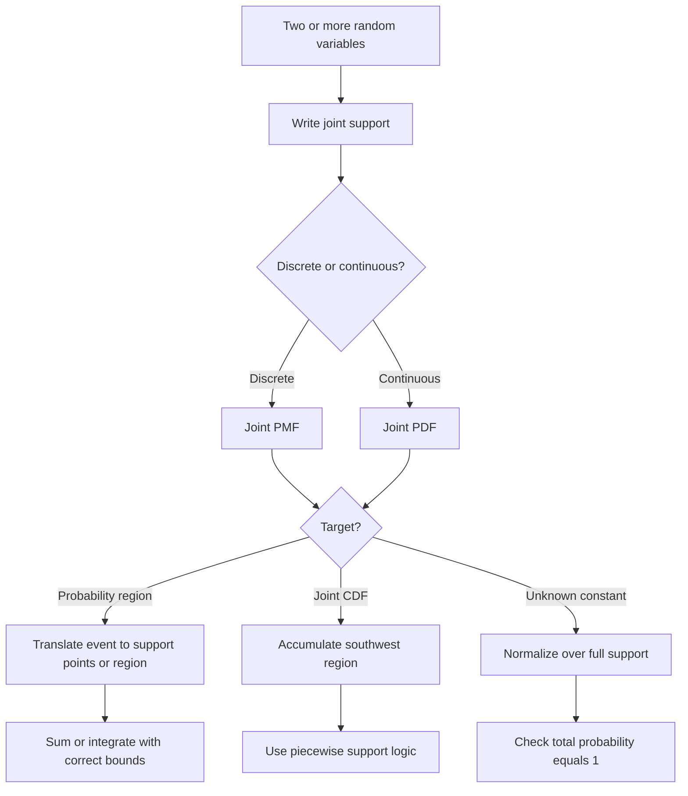

# 📊 3.1 — Distribusi Gabungan (Joint Distribution)

> [!ABSTRACT] Ringkasan Cepat
> **Topik:** Distribusi Gabungan (Joint Distribution)  
> **Bobot Parent Topic:** 20–30%  
> **Exam Priority:** Very High  
> **Difficulty:** Calculation-Intensive  
> **Primary Skill:** Mixed — region recognition + setup + calculation  
> **Ref:** Hogg, Tanis & Zimmerman §§4.1, 4.4; Hogg, McKean & Craig §§2.1, 2.6; Miller, Miller & Freund §§3.5–3.8

## Section 0 — Pemetaan Silabus & Exam Scope

| Field | Isi |
|---|---|
| Topik CF2 | Topik 3 — Variabel Acak Multivariat |
| Subtopik | 3.1 Distribusi Gabungan (Joint Distribution) |
| Learning Outcome | Menjelaskan dan menerapkan distribusi probabilitas gabungan dan CDF gabungan untuk random variables diskrit maupun kontinu |
| Skill Diuji | Mengidentifikasi random vector, menentukan joint support, memvalidasi joint PMF/PDF, menghitung probabilitas suatu region, membangun/menggunakan joint CDF, dan menerjemahkan inequality ke bounds sum/integral |
| Bobot Parent Topic | 20–30% |
| Exam Priority | Very High |
| Prerequisite | PMF/PDF/CDF univariat, probability of events, summation, double integration |
| Connected Topics | [[3.2 Distribusi Marginal]], [[3.3 Distribusi Bersyarat (Conditional Distribution)]], [[3.5 Independensi dan Korelasi]], [[3.8 Transformasi Variabel Acak Gabungan]] |
| Referensi | Hogg, Tanis & Zimmerman §§4.1, 4.4; Hogg, McKean & Craig §§2.1, 2.6; Miller §§3.5–3.8 |

> [!IMPORTANT] Scope Boundary
> Fokus subtopik ini adalah **joint distribution itu sendiri**: random vector, joint support, joint PMF/joint PDF, joint probability atas suatu subset/region, serta joint CDF. **Marginal distribution** dibahas sistematis di [[3.2 Distribusi Marginal]], **conditional distribution** di [[3.3 Distribusi Bersyarat (Conditional Distribution)]], dan independence/covariance di [[3.5 Independensi dan Korelasi]]. Konsep tersebut boleh disebut sebagai connection, tetapi bukan fokus utama note ini.

---

## Section 1 — Intuisi & Big Picture

Pada Topik 2 kita menggambarkan satu outcome numerik dengan satu random variable, misalnya $X$. Dalam banyak eksperimen, satu outcome menghasilkan **dua atau lebih pengukuran sekaligus**. Misalnya:

- dari satu mahasiswa kita mengamati tinggi $X$ dan berat $Y$;
- dari dua dadu kita mendefinisikan $X=$ nilai terkecil dan $Y=$ nilai terbesar;
- dari suatu objek kita mengamati dua karakteristik yang saling terkait.

Objek probabilistiknya sekarang bukan lagi satu titik pada garis bilangan, tetapi **pasangan terurut**

$$
(X,Y).
$$

Pasangan ini disebut **random vector** dua dimensi. Nilai yang mungkin muncul adalah titik-titik $(x,y)$ pada bidang. Karena itu, hal terpenting sebelum melakukan perhitungan adalah memahami **joint support**:

$$
S_{X,Y}=\{(x,y): (x,y)\text{ dapat terjadi}\}.
$$

Struktur mental utama:

$$
\text{experiment}
\longrightarrow (X,Y)
\longrightarrow S_{X,Y}
\longrightarrow p_{X,Y}(x,y)\text{ atau }f_{X,Y}(x,y)
\longrightarrow F_{X,Y}(x,y).
$$

Untuk joint distribution, probabilitas bukan lagi sekadar "mass pada satu nilai" atau "area di bawah density pada interval". Kita bekerja pada **region dua dimensi**:

- discrete: jumlahkan probability mass pada titik-titik yang termasuk event;
- continuous: integralkan density di atas region event.

> [!TIP] Mental Rule Utama
> **Joint support first. Bounds second. Calculation third.**  
> Jika region salah, integral/sum yang secara aljabar sempurna tetap menghasilkan jawaban yang salah.

### Dari interval ke region

Univariat:

$$
P(a<X\le b)
$$

berarti interval pada garis bilangan.

Bivariat:

$$
P((X,Y)\in A)
$$

berarti suatu region $A$ pada bidang $x$-$y$. Contohnya:

$$
P(X<Y),
$$

berarti seluruh titik support yang berada di sisi $x<y$ dari garis $y=x$.

Inilah sumber utama kompleksitas joint distribution: **menerjemahkan narasi/event menjadi region yang benar**.

---

## Section 2 — Definisi, Support & Core Formulas

### 2.1 Random Vector

Misalkan $X$ dan $Y$ adalah dua random variables yang didefinisikan pada eksperimen yang sama. Pasangan

$$
(X,Y)
$$

merupakan random vector dua dimensi, dan realizasinya adalah pasangan numerik $(x,y)$.

Dalam notasi Hogg, McKean & Craig, random vector dapat ditulis

$$
\mathbf X=(X_1,X_2)^{\mathsf T},
$$

atau secara lebih umum

$$
\mathbf X=(X_1,\ldots,X_n)^{\mathsf T}.
$$

Untuk CF2 Topik 3.1, pemahaman kasus dua variabel adalah fondasi utama; generalisasi ke $n$ variabel mengikuti struktur yang sama.

### 2.2 Joint Support

Joint support adalah himpunan semua pasangan $(x,y)$ yang memiliki probability mass positif pada kasus diskrit atau berada pada region tempat density dapat bernilai positif pada kasus kontinu.

Contoh rectangular support:

$$
S=\{(x,y):0<x<1,\;0<y<2\}.
$$

Contoh triangular/non-rectangular support:

$$
S=\{(x,y):0<x<y<1\}.
$$

Pada rectangular support, bounds satu variabel dapat konstan terhadap variabel lain. Pada triangular support, bounds salah satu variabel **bergantung pada** variabel lainnya.

> [!IMPORTANT] Support Geometry
> Untuk
> $$
> 0<x<y<1,
> $$
> dua bentuk integral yang ekuivalen adalah
> $$
> \int_0^1\int_0^y(\cdots)\,dx\,dy
> $$
> atau
> $$
> \int_0^1\int_x^1(\cdots)\,dy\,dx.
> $$
> Batas tidak boleh diganti menjadi $0<x<1,0<y<1$ karena itu memasukkan setengah persegi yang sebenarnya tidak ada dalam support.

### 2.3 Joint PMF — Kasus Diskrit

Untuk random variables diskrit $X$ dan $Y$, joint PMF didefinisikan sebagai

$$
p_{X,Y}(x,y)=P(X=x,Y=y).
$$

Hogg, Tanis & Zimmerman menggunakan notation $f(x,y)$ untuk joint PMF, tetapi dalam note ini digunakan $p_{X,Y}(x,y)$ untuk menjaga perbedaan eksplisit antara PMF diskrit dan PDF kontinu.

Syarat joint PMF:

$$
p_{X,Y}(x,y)\ge0,
$$

serta

$$
\sum\sum_{(x,y)\in S_{X,Y}}p_{X,Y}(x,y)=1.
$$

Untuk event $A\subseteq S_{X,Y}$,

$$
P((X,Y)\in A)
=
\sum\sum_{(x,y)\in A}p_{X,Y}(x,y).
$$

Jika event berupa inequality, misalnya

$$
P(X+Y\ge3),
$$

langkah pertama bukan menjumlah secara otomatis, melainkan menentukan titik support mana yang memenuhi $x+y\ge3$.

### 2.4 Joint PDF — Kasus Kontinu

Untuk continuous random variables $X$ dan $Y$, joint PDF $f_{X,Y}(x,y)$ memenuhi

$$
f_{X,Y}(x,y)\ge0,
$$

serta

$$
\int_{-\infty}^{\infty}\int_{-\infty}^{\infty}
f_{X,Y}(x,y)\,dx\,dy=1.
$$

Secara praktis, integral hanya perlu dilakukan pada joint support karena density di luar support dianggap $0$.

Untuk region $A$,

$$
P((X,Y)\in A)
=
\iint_A f_{X,Y}(x,y)\,dA.
$$

Textbook Hogg, Tanis menggambarkan probabilitas ini sebagai **volume** di bawah surface

$$
z=f_{X,Y}(x,y)
$$

di atas region $A$ pada bidang $x$-$y$.

> [!IMPORTANT] Continuous Point Probability
> Untuk model jointly continuous,
> $$
> P(X=x,Y=y)=0.
> $$
> Nilai $f_{X,Y}(x,y)$ adalah density height, bukan probability mass pada satu titik.

### 2.5 Normalization Constant

Jika diberikan

$$
f_{X,Y}(x,y)=c\,g(x,y),\qquad (x,y)\in S,
$$

maka $c$ ditentukan dari

$$
\iint_S c\,g(x,y)\,dA=1
$$

untuk kasus kontinu, atau

$$
\sum\sum_S c\,g(x,y)=1
$$

untuk kasus diskrit.

Perhatikan bahwa **region $S$ adalah bagian dari formula**. Kesalahan bounds menghasilkan constant $c$ yang salah dan seluruh perhitungan berikutnya ikut salah.

### 2.6 Joint CDF

Joint cumulative distribution function didefinisikan sebagai

$$
F_{X,Y}(x,y)
=
P(X\le x,Y\le y).
$$

Ini adalah probability dari region "south-west" relatif terhadap titik $(x,y)$.

#### Kasus Diskrit

$$
F_{X,Y}(x,y)
=
\sum_{u\le x}\sum_{v\le y}p_{X,Y}(u,v),
$$

dengan sum hanya atas titik support yang valid.

#### Kasus Kontinu

$$
F_{X,Y}(x,y)
=
\int_{-\infty}^{y}\int_{-\infty}^{x}
f_{X,Y}(u,v)\,du\,dv.
$$

Order integral dapat ditukar jika region dan regularity memungkinkan, tetapi bounds tetap harus menggambarkan region yang sama.

### 2.7 Recovering Joint PDF from Joint CDF

Untuk jointly continuous variables, pada titik tempat mixed partial derivative ada,

$$
f_{X,Y}(x,y)
=
\frac{\partial^2}{\partial x\,\partial y}F_{X,Y}(x,y).
$$

Generalization ke $n$ variables dari Hogg, McKean & Craig:

$$
F_{\mathbf X}(\mathbf x)
=
P(X_1\le x_1,\ldots,X_n\le x_n),
$$

serta untuk continuous case,

$$
f_{\mathbf X}(\mathbf x)
=
\frac{\partial^n}{\partial x_1\cdots\partial x_n}
F_{\mathbf X}(\mathbf x),
$$

pada titik di mana derivative relevan ada.

### 2.8 Rectangle Probability dari Joint CDF

Untuk rectangle

$$
a<X\le b,
\qquad
c<Y\le d,
$$

inclusion-exclusion pada joint CDF memberi

$$
\begin{aligned}
P(a<X\le b,\;c<Y\le d)
={}&F_{X,Y}(b,d)-F_{X,Y}(a,d)\\
&-F_{X,Y}(b,c)+F_{X,Y}(a,c).
\end{aligned}
$$

Ini adalah analog dua dimensi dari

$$
P(a<X\le b)=F_X(b)-F_X(a).
$$

Mental model: ambil rectangle besar sampai $(b,d)$, lalu kurangi dua strip yang tidak diinginkan, kemudian tambahkan kembali overlap yang terkurangi dua kali.

### 2.9 Properties Dasar Joint CDF

Joint CDF selalu memenuhi batas probabilistik:

$$
0\le F_{X,Y}(x,y)\le1.
$$

Jika salah satu coordinate menuju $-\infty$, probability menuju $0$:

$$
\lim_{x\to-\infty}F_{X,Y}(x,y)=0,
\qquad
\lim_{y\to-\infty}F_{X,Y}(x,y)=0.
$$

Dan

$$
\lim_{x\to\infty,\,y\to\infty}F_{X,Y}(x,y)=1.
$$

Selain itu, probability rectangle yang diperoleh dari four-corner difference harus non-negative.

---

## Section 3 — How It Works

### 3.1 Workflow Utama Joint Distribution

```text
Identify X and Y
↓
Write / sketch joint support
↓
Identify discrete or continuous
↓
Translate target event into points/region
↓
Choose joint PMF sum, joint PDF integral, or joint CDF
↓
Set bounds from geometry
↓
Calculate
↓
Verify probability, normalization, and support
```

### 3.2 Region Before Integral

Misalkan

$$
f_{X,Y}(x,y)=2,
\qquad 0\le x\le y\le1.
$$

Target:

$$
P\left(X\le\frac12,\,Y\le\frac12\right).
$$

Event tidak berarti seluruh square $[0,1/2]^2$, karena support juga mengharuskan $x\le y$. Maka region valid adalah

$$
0\le y\le\frac12,
\qquad
0\le x\le y.
$$

Setup:

$$
P\left(X\le\frac12,Y\le\frac12\right)
=
\int_0^{1/2}\int_0^y 2\,dx\,dy.
$$

Textbook Hogg, Tanis secara eksplisit menyarankan menggambar support dan shading region sebelum mengintegralkan pada tipe masalah seperti ini.

### 3.3 Event Inequality sebagai Geometry

Beberapa bentuk yang sering muncul:

#### $X<Y$

Region berada di satu sisi garis

$$
y=x.
$$

#### $X+Y\le c$

Region berada pada atau di bawah garis

$$
y=c-x.
$$

#### $a<X<b,\;c<Y<d$

Rectangle yang kemudian harus di-intersect dengan joint support.

#### $Y\le X/2$

Region berada di bawah garis

$$
y=\frac{x}{2},
$$

tetapi tetap dibatasi oleh support asli.

> [!TIP] Cara Berpikir Cepat
> Untuk event dua dimensi, buat dua lapis constraint:
> 1. **support constraint**;
> 2. **event constraint**.
>
> Probability dihitung pada intersection keduanya.

### 3.4 Memilih Order Integrasi

Jika support

$$
0<x<y<1,
$$

maka dua pilihan:

**Integrate $x$ first**

$$
\int_{y=0}^{1}\int_{x=0}^{y}(\cdots)\,dx\,dy.
$$

**Integrate $y$ first**

$$
\int_{x=0}^{1}\int_{y=x}^{1}(\cdots)\,dy\,dx.
$$

Pilih order yang membuat bounds paling sederhana setelah event tambahan dimasukkan.

### 3.5 Building Joint CDF Piecewise

Jika density support terbatas, joint CDF hampir selalu piecewise karena bentuk accumulated region berubah saat $(x,y)$ bergerak melewati batas support.

Contoh dari Miller:

$$
f_{X,Y}(x,y)=x+y,
\qquad 0<x<1,\;0<y<1.
$$

Untuk $0<x<1,0<y<1$,

$$
F_{X,Y}(x,y)
=
\int_0^y\int_0^x(s+t)\,ds\,dt
=
\frac12xy(x+y).
$$

Tetapi jika $x\ge1$ dan $0<y<1$, accumulation dalam arah $x$ berhenti pada support boundary $1$:

$$
F_{X,Y}(x,y)
=
\int_0^y\int_0^1(s+t)\,ds\,dt
=
\frac12y(y+1).
$$

Jika $x\ge1,y\ge1$,

$$
F_{X,Y}(x,y)=1.
$$

Jadi, ketika membuat CDF dari PDF:

1. gambar support;
2. tentukan posisi $(x,y)$ relatif terhadap support;
3. accumulated region adalah support yang juga memenuhi $X\le x,Y\le y$;
4. bentuk piecewise mengikuti perubahan geometry tersebut.

> [!DANGER] Jangan Salah Pikir
> 1. Jangan menganggap joint support otomatis rectangular.
> 2. Jangan mengintegralkan seluruh rectangle jika event harus di-intersect dengan support berbentuk triangular/curved.
> 3. Jangan menyamakan joint PDF value dengan point probability.
> 4. Jangan membangun joint CDF hanya untuk $(x,y)$ di dalam support; CDF didefinisikan untuk seluruh $\mathbb R^2$.
> 5. Jangan lupa bahwa joint CDF pada finite support menjadi $1$ setelah kedua upper limits melewati seluruh support.

### 3.6 Derivasi Minimum — Mengapa Four-Corner Formula Bekerja?

Mulai dari

$$
F(b,d)=P(X\le b,Y\le d).
$$

Untuk menyisakan rectangle

$$
a<X\le b,\qquad c<Y\le d,
$$

kurangi region $X\le a,Y\le d$ dan $X\le b,Y\le c$. Namun overlap

$$
X\le a,Y\le c
$$

terkurangi dua kali, sehingga harus ditambahkan kembali:

$$
\boxed{
P(a<X\le b,c<Y\le d)
=F(b,d)-F(a,d)-F(b,c)+F(a,c)
}.
$$

Pattern tanda yang aman:

$$
+\; -\; -\; +.
$$

---

## Section 4 — Worked Examples & Exam Cases

### Case A — Fundamental: Joint PMF Diskrit

**Soal**

Diberikan joint PMF

$$
p_{X,Y}(x,y)=c(x+y),
$$

untuk

$$
x\in\{1,2\},\qquad y\in\{1,2,3\},
$$

dan $0$ di luar support. Tentukan:

1. $c$;
2. $P(X+Y\ge4)$;
3. $F_{X,Y}(1,2)$.

> [!SUCCESS] Pembahasan
>
> **1. Parse Narasi & Target**  
> Joint PMF diberikan sampai constant $c$. Kita harus normalisasi, lalu menghitung probability atas subset support dan satu nilai joint CDF.
>
> **2. Identify Structure / Distribution**  
> Generic discrete joint PMF; tidak perlu memaksakan named distribution.
>
> **3. Support / Domain / Region**  
> $$
> S=\{1,2\}\times\{1,2,3\}.
> $$
>
> **4. Setup — Normalization**  
> $$
> \sum_{x=1}^{2}\sum_{y=1}^{3}c(x+y)=1.
> $$
>
> Hitung total coefficient:
> $$
> (2+3+4)+(3+4+5)=9+12=21.
> $$
>
> Maka
> $$
> c=\frac1{21}.
> $$
>
> **5. Calculation — $P(X+Y\ge4)$**  
> Titik support yang memenuhi adalah
> $$
> (1,3),(2,2),(2,3).
> $$
> Maka
> $$
> P(X+Y\ge4)
> =\frac{4+4+5}{21}
> =\frac{13}{21}.
> $$
>
> **6. Calculation — Joint CDF**  
> $$
> F_{X,Y}(1,2)=P(X\le1,Y\le2).
> $$
> Titik yang termasuk hanya $(1,1)$ dan $(1,2)$:
> $$
> F_{X,Y}(1,2)
> =\frac{2+3}{21}
> =\frac5{21}.
> $$
>
> **7. Verification**  
> $c>0$, seluruh mass menjumlah ke $1$, dan kedua probability berada dalam $[0,1]$.

> [!WARNING] Exam Trap — Case A
> - **Trap:** menjumlah semua pasangan dengan $x+y>4$ dan menghilangkan pasangan $x+y=4$.
> - **Mengapa distractor terlihat benar:** wording inequality mudah terlewat saat fokus pada tabel.
> - **Cara menghindari:** tulis kembali event numerik sebelum menjumlah.
> - **Shortcut aman:** list hanya titik support yang memenuhi inequality; support kecil tidak perlu formula sum rumit.
> - **Target waktu:** sekitar 2–3 menit.

---

### Case B — Exam-Typical: Unknown Constant + Triangular Support

**Soal**

Joint PDF dari $X$ dan $Y$ diberikan oleh

$$
f_{X,Y}(x,y)=c(x+y),
\qquad 0<x<y<1,
$$

dan $0$ di luar support. Tentukan:

1. $c$;
2. $P\left(Y<\frac12\right)$;
3. $P(X+Y<1)$.

> [!SUCCESS] Pembahasan
>
> **1. Parse Narasi & Target**  
> Continuous joint PDF pada triangular support. Semua bounds harus berasal dari $0<x<y<1$.
>
> **2. Identify Structure / Distribution**  
> Generic jointly continuous model.
>
> **3. Support / Region**  
> $$
> S=\{(x,y):0<x<y<1\}.
> $$
> Dengan order $dx\,dy$:
> $$
> 0<y<1,\qquad 0<x<y.
> $$
>
> **4. Setup — Normalization**  
> $$
> 1=
> \int_0^1\int_0^y c(x+y)\,dx\,dy.
> $$
>
> **5. Calculation — $c$**  
> Inner integral:
> $$
> \int_0^y(x+y)\,dx
> =\left[\frac{x^2}{2}+yx\right]_0^y
> =\frac{3y^2}{2}.
> $$
> Maka
> $$
> 1=c\int_0^1\frac{3y^2}{2}\,dy
> =c\cdot\frac12,
> $$
> sehingga
> $$
> \boxed{c=2}.
> $$
>
> **6. $P(Y<1/2)$**  
> Karena support tetap $0<x<y$,
> $$
> P\left(Y<\frac12\right)
> =\int_0^{1/2}\int_0^y2(x+y)\,dx\,dy.
> $$
> Dari hasil inner integral sebelumnya dengan $c=2$:
> $$
> \int_0^y2(x+y)\,dx=3y^2.
> $$
> Maka
> $$
> P\left(Y<\frac12\right)
> =\int_0^{1/2}3y^2\,dy
> =\left[y^3\right]_0^{1/2}
> =\boxed{\frac18}.
> $$
>
> **7. $P(X+Y<1)$**  
> Event menambahkan constraint
> $$
> x<1-y.
> $$
> Kita sudah punya $x<y$, sehingga upper bound untuk $x$ adalah
> $$
> \min(y,1-y).
> $$
> Boundary berubah ketika
> $$
> y=1-y
> \Rightarrow y=\frac12.
> $$
> Maka integral harus dipecah:
> $$
> \begin{aligned}
> P(X+Y<1)
> ={}&\int_0^{1/2}\int_0^y2(x+y)\,dx\,dy\\
> &+\int_{1/2}^{1}\int_0^{1-y}2(x+y)\,dx\,dy.
> \end{aligned}
> $$
> Bagian pertama sudah bernilai $1/8$.
>
> Untuk bagian kedua,
> $$
> \int_0^{1-y}2(x+y)\,dx
> =\left[x^2+2yx\right]_0^{1-y}
> =1-y^2.
> $$
> Maka
> $$
> \int_{1/2}^{1}(1-y^2)\,dy
> =\left[y-\frac{y^3}{3}\right]_{1/2}^{1}
> =\frac{5}{24}.
> $$
> Sehingga
> $$
> P(X+Y<1)
> =\frac18+\frac5{24}
> =\boxed{\frac13}.
> $$
>
> **8. Verification**  
> Semua probability berada dalam $[0,1]$. Nilai $1/8$ masuk akal karena $Y<1/2$ hanya mencakup triangular region kecil dekat origin. Untuk event $X+Y<1$, perlu split bounds karena garis $x=1-y$ berpotongan dengan boundary $x=y$ pada $y=1/2$.

> [!WARNING] Exam Trap — Case B
> - **Trap:** memakai $0<x<1-y$ untuk seluruh $0<y<1$ tanpa mempertahankan constraint $x<y$.
> - **Mengapa distractor terlihat benar:** inequality target $x+y<1$ tampak seperti satu-satunya boundary yang relevan.
> - **Cara menghindari:** tulis **support constraints + event constraints** lalu ambil intersection.
> - **Shortcut aman:** cari titik potong boundary $y=1-y$ sebelum mengintegralkan.
> - **Target waktu:** sekitar 5–7 menit.

---

### Case C — Challenging / Integrated: Joint CDF Piecewise dan Rectangle Probability

**Soal**

Joint PDF diberikan oleh

$$
f_{X,Y}(x,y)=x+y,
\qquad 0<x<1,\;0<y<1,
$$

dan $0$ di luar support.

1. Tentukan $F_{X,Y}(x,y)$ untuk seluruh $(x,y)$.
2. Gunakan joint CDF untuk menghitung
   $$
   P\left(\frac14<X\le\frac34,\;\frac12<Y\le1\right).
   $$

> [!SUCCESS] Pembahasan
>
> **1. Parse Narasi & Target**  
> Support adalah unit square. Joint CDF berubah bentuk bergantung pada apakah $x$ dan $y$ berada di bawah, di dalam, atau di atas support.
>
> **2. Identify Structure / Distribution**  
> Jointly continuous density pada rectangular support.
>
> **3. Support / Domain / Region**  
> $$
> S=(0,1)\times(0,1).
> $$
>
> **4. Setup dan Calculation — Joint CDF**
>
> Jika $x\le0$ atau $y\le0$,
> $$
> F_{X,Y}(x,y)=0.
> $$
>
> Jika $0<x<1,0<y<1$,
> $$
> F_{X,Y}(x,y)
> =\int_0^y\int_0^x(s+t)\,ds\,dt
> =\frac12xy(x+y).
> $$
>
> Jika $x\ge1,0<y<1$,
> $$
> F_{X,Y}(x,y)
> =\int_0^y\int_0^1(s+t)\,ds\,dt
> =\frac12y(y+1).
> $$
>
> Jika $0<x<1,y\ge1$,
> $$
> F_{X,Y}(x,y)
> =\int_0^1\int_0^x(s+t)\,ds\,dt
> =\frac12x(x+1).
> $$
>
> Jika $x\ge1,y\ge1$,
> $$
> F_{X,Y}(x,y)=1.
> $$
>
> Maka
> $$
> F_{X,Y}(x,y)=
> \begin{cases}
> 0, & x\le0\text{ atau }y\le0,\\[4pt]
> \frac12xy(x+y), & 0<x<1,\;0<y<1,\\[4pt]
> \frac12y(y+1), & x\ge1,\;0<y<1,\\[4pt]
> \frac12x(x+1), & 0<x<1,\;y\ge1,\\[4pt]
> 1, & x\ge1,\;y\ge1.
> \end{cases}
> $$
>
> **5. Rectangle Probability via Four-Corner Formula**  
> Set
> $$
> a=\frac14,
> \quad b=\frac34,
> \quad c=\frac12,
> \quad d=1.
> $$
> Maka
> $$
> P(a<X\le b,c<Y\le d)
> =F(b,d)-F(a,d)-F(b,c)+F(a,c).
> $$
>
> Karena $d=1$ sudah mencapai upper support boundary,
> $$
> F\left(\frac34,1\right)
> =\frac12\left(\frac34\right)\left(\frac74\right)
> =\frac{21}{32},
> $$
> $$
> F\left(\frac14,1\right)
> =\frac12\left(\frac14\right)\left(\frac54\right)
> =\frac5{32}.
> $$
>
> Untuk $(3/4,1/2)$,
> $$
> F\left(\frac34,\frac12\right)
> =\frac12\left(\frac34\right)\left(\frac12\right)\left(\frac54\right)
> =\frac{15}{64}.
> $$
>
> Untuk $(1/4,1/2)$,
> $$
> F\left(\frac14,\frac12\right)
> =\frac12\left(\frac14\right)\left(\frac12\right)\left(\frac34\right)
> =\frac3{64}.
> $$
>
> Jadi
> $$
> \begin{aligned}
> P
> &=\frac{21}{32}-\frac5{32}-\frac{15}{64}+\frac3{64}\\
> &=\frac{32}{64}-\frac{12}{64}\\
> &=\boxed{\frac5{16}}.
> \end{aligned}
> $$
>
> **6. Interpretation**  
> Joint CDF memberikan probability rectangle melalui empat evaluasi, tanpa perlu membuat integral baru.
>
> **7. Verification**  
> $F$ meningkat ketika $x$ atau $y$ bertambah, bernilai $0$ di bawah support, dan menjadi $1$ ketika kedua coordinates melampaui support. Probability rectangle $5/16$ berada dalam $[0,1]$.

> [!WARNING] Exam Trap — Case C
> - **Trap:** menggunakan interior formula $\frac12xy(x+y)$ untuk $y=1$ tanpa menyadari bahwa formula piecewise harus mengikuti support boundary.
> - **Mengapa distractor terlihat benar:** expression interior tampak sederhana dan sering dihafal tanpa domain.
> - **Cara menghindari:** setiap piece CDF harus dibaca bersama domainnya.
> - **Shortcut aman:** untuk $x\ge1$ atau $y\ge1$, "cap" integration limit pada upper support boundary.
> - **Target waktu:** sekitar 5–6 menit setelah CDF tersedia.

---

## Section 5 — Verification & Sanity Check

> [!CHECK] Sanity Check
> 1. **Normalization:** joint PMF harus menjumlah ke $1$; joint PDF harus integrate ke $1$ di seluruh support.
> 2. **Probability bounds:** setiap probability yang dihitung harus berada dalam $[0,1]$.
> 3. **Support intersection:** region event harus di-intersect dengan joint support; jangan menghitung area/mass di luar support.
> 4. **CDF limits:** $F_{X,Y}(x,y)\to0$ bila salah satu coordinate menuju $-\infty$; $F_{X,Y}(x,y)\to1$ bila keduanya menuju $+\infty$.
> 5. **CDF monotonicity:** memperbesar $x$ atau $y$ tidak boleh menurunkan joint CDF.
> 6. **Rectangle increment:**
>    $$
>    F(b,d)-F(a,d)-F(b,c)+F(a,c)\ge0.
>    $$
> 7. **Continuous point check:** pada jointly continuous model, $P(X=x,Y=y)=0$ walaupun $f_{X,Y}(x,y)>0$.
> 8. **Units/geometry check:** double integral atas constant density sama dengan density dikali area region; ini dapat dipakai sebagai quick check.

### Metode Alternatif

#### Direct Integral vs Joint CDF

Jika PDF diketahui dan event adalah rectangle sederhana, direct integral sering cepat:

$$
\int_c^d\int_a^b f(x,y)\,dx\,dy.
$$

Jika joint CDF sudah diberikan, four-corner formula biasanya lebih cepat:

$$
F(b,d)-F(a,d)-F(b,c)+F(a,c).
$$

#### Order $dx\,dy$ vs $dy\,dx$

Keduanya valid bila menggambarkan region yang sama. Pilih order yang membuat bounds tidak perlu dipecah, atau paling sedikit piecewise.

#### Direct Region vs Complement

Untuk event yang merupakan hampir seluruh support, complement dapat lebih pendek:

$$
P((X,Y)\in A)=1-P((X,Y)\in A^c).
$$

Gunakan hanya jika $A^c$ mempunyai geometry lebih sederhana.

---

## Section 6 — Connections & Mental Model

### 6.1 Joint Distribution sebagai "Master Distribution"

Joint distribution menyimpan informasi probabilistik tentang pasangan $(X,Y)$. Dari sinilah topik berikutnya dibangun:

```text
Joint distribution
      ↓
Marginal distributions
      ↓
Conditional distributions
      ↓
Conditional expectation / variance
      ↓
Independence, covariance, correlation
      ↓
Transformations / compound structures
```

Karena itu [[3.1 Distribusi Gabungan (Joint Distribution)]] adalah fondasi seluruh Topik 3.

### 6.2 Visual ↔ Formula

| Visual / Geometry | Rumus Probabilistik |
|---|---|
| Titik pada support diskrit | $p_{X,Y}(x,y)$ |
| Kumpulan titik | double summation |
| Surface $z=f_{X,Y}(x,y)$ | joint density |
| Region di bidang $x$-$y$ | domain double integral |
| Volume di bawah surface di atas region | probability |
| Rectangle dari $(-\infty,-\infty)$ sampai $(x,y)$ | $F_{X,Y}(x,y)$ |
| Garis $x+y=c$ | boundary event sum |
| Garis $x=y$ | boundary event order/comparison |

### 6.3 Hubungan dengan Marginalization

[[3.2 Distribusi Marginal]] mengambil joint distribution dan "menghilangkan" variabel yang tidak dibutuhkan melalui summation/integration. Secara geometry, marginalization dapat dipikirkan sebagai mengakumulasi seluruh slice sepanjang satu axis.

### 6.4 Hubungan dengan Conditional Distribution

[[3.3 Distribusi Bersyarat (Conditional Distribution)]] menggunakan joint structure tetapi menahan salah satu variabel pada nilai tertentu dan menormalisasi slice tersebut.

### 6.5 Hubungan dengan Transformasi

Pada [[3.8 Transformasi Variabel Acak Gabungan]], region joint support dipetakan ke coordinate system baru. Kemampuan membaca support pada Topik 3.1 menjadi prerequisite untuk menentukan transformed support dan Jacobian bounds.

---

## Section 7 — Exam Traps & Misconceptions

### Support / Domain Trap

> [!BUG] Support Trap
> **Salah** — untuk
> $$
> 0<x<y<1,
> $$
> menulis
> $$
> \int_0^1\int_0^1 f(x,y)\,dx\,dy.
> $$
>
> **Benar**
> $$
> \int_0^1\int_0^y f(x,y)\,dx\,dy
> $$
> atau equivalently
> $$
> \int_0^1\int_x^1 f(x,y)\,dy\,dx.
> $$

### Bounds & Calculation Trap

> [!BUG] Bounds Trap
> Event
> $$
> X+Y<1
> $$
> tidak otomatis berarti $0<x<1-y$ untuk seluruh range $y$. Bounds itu masih harus di-intersect dengan joint support.

### PMF vs PDF Trap

> [!BUG] Discrete vs Continuous Trap
> - Diskrit: $p_{X,Y}(x,y)=P(X=x,Y=y)$ dapat positif.
> - Kontinu: $f_{X,Y}(x,y)$ bukan point probability dan $P(X=x,Y=y)=0$.

### CDF Domain Trap

> [!BUG] CDF Trap
> Joint CDF didefinisikan untuk **semua** $(x,y)\in\mathbb R^2$, bukan hanya di support. Di luar support, formula berubah karena accumulated probability sudah mencapai boundary tertentu atau menjadi $0/1$.

### Four-Corner Sign Trap

> [!BUG] Inclusion–Exclusion Trap
> Untuk rectangle,
> $$
> P(a<X\le b,c<Y\le d)
> $$
> pattern tanda yang benar adalah
> $$
> +F(b,d)-F(a,d)-F(b,c)+F(a,c).
> $$
> Bukan empat terms dengan tanda bergantian berdasarkan urutan arbitrary.

### Normalization Trap

> [!BUG] Constant Trap
> Jika density diberikan sebagai $c\,g(x,y)$, cari $c$ **sebelum** menghitung probability lain. Menggunakan constant yang belum ternormalisasi akan menggeser seluruh hasil.

### Red Flags

> [!CAUTION] Red Flags

| Keyword / Condition | Apa yang Harus Dipikirkan |
|---|---|
| "joint PMF" | support points + total mass = 1 |
| "joint PDF" | support region + total integral = 1 |
| "find $c$" | normalization over exact joint support |
| "$X<Y$" | line $y=x$ + choose one side |
| "$X+Y<c$" | line $y=c-x$ + possible split bounds |
| "joint CDF" | southwest accumulated region |
| "rectangle probability" | direct integral/sum or four-corner CDF |
| triangular/curved support | dependent bounds; draw region |
| "for all $x,y$" | piecewise CDF outside support too |
| continuous model | probability comes from area/volume, not point density |

---

## Section 8 — Executive Summary

### Must Remember

> [!SUMMARY] Must Remember
> 1. Random vector $(X,Y)$ mencatat dua random quantities dari eksperimen yang sama.
> 2. Joint support $S_{X,Y}$ adalah **bagian dari distribution**, bukan catatan tambahan.
> 3. Discrete joint PMF:
>    $$
>    p_{X,Y}(x,y)=P(X=x,Y=y),
>    \qquad \sum\sum p_{X,Y}=1.
>    $$
> 4. Continuous joint PDF harus non-negative dan integrate ke $1$ di seluruh support.
> 5. Probability event bivariat = double sum atau double integral pada **intersection antara event dan support**.
> 6. Untuk continuous model, $f_{X,Y}(x,y)$ adalah density height; point probability adalah $0$.
> 7. Joint CDF:
>    $$
>    F_{X,Y}(x,y)=P(X\le x,Y\le y).
>    $$
> 8. Continuous joint CDF diperoleh dengan mengintegralkan density dari lower tails sampai $(x,y)$, dengan batas efektif mengikuti support.
> 9. Jika differentiable,
>    $$
>    f_{X,Y}(x,y)=\frac{\partial^2}{\partial x\partial y}F_{X,Y}(x,y).
>    $$
> 10. Rectangle probability dari CDF menggunakan pattern
>     $$
>     +\,-\,-\,+.
>     $$
> 11. Triangular/curved support hampir selalu berarti bounds bergantung pada variabel lain.
> 12. Sebelum menghitung: **sketch support → shade event → choose bounds**.

### Formula Map / Comparison Table

| Target | Diskrit | Kontinu | Critical Check |
|---|---|---|---|
| Joint object | $p_{X,Y}(x,y)$ | $f_{X,Y}(x,y)$ | support jelas |
| Normalization | $\sum\sum_S p=1$ | $\iint_S f=1$ | bounds = support |
| Probability region $A$ | $\sum\sum_A p$ | $\iint_A f\,dA$ | $A$ di-intersect support |
| Joint CDF | $\sum_{u\le x}\sum_{v\le y}p(u,v)$ | $\int_{-\infty}^y\int_{-\infty}^x f(u,v)\,du\,dv$ | may be piecewise |
| Recover density | jump/mass structure | mixed derivative | differentiability |
| Rectangle probability | sum of masses or CDF | integral or CDF | four-corner signs |

### Trigger Keywords

| Jika soal mengatakan... | Pikirkan... |
|---|---|
| "joint distribution" | random vector + support |
| "possible pairs" | discrete joint support |
| "region where density is positive" | continuous joint support |
| "find normalizing constant" | integrate/sum over entire support |
| "probability $X<Y$" | geometry relative to $y=x$ |
| "probability $X+Y<c$" | geometry relative to $y=c-x$ |
| "joint CDF" | southwest accumulation |
| "between two values for both variables" | rectangle probability |
| "density from CDF" | mixed partial derivative |

### Kapan Digunakan

Gunakan framework ini ketika pertanyaan melibatkan **dua atau lebih random variables secara simultan** dan target berupa joint probability, validasi joint distribution, support, atau joint CDF.

### Kapan TIDAK Boleh Digunakan

Jika target hanya distribusi $X$ saja atau $Y$ saja, biasanya Anda perlu [[3.2 Distribusi Marginal]]. Jika target berbunyi "given $Y=y$", gunakan [[3.3 Distribusi Bersyarat (Conditional Distribution)]]. Jika target adalah distribusi fungsi baru seperti $U=X+Y$ atau $(U,V)=T(X,Y)$, masuk ke [[3.8 Transformasi Variabel Acak Gabungan]].

### Quick Decision Tree



---

## Section 9 — Active Recall Check

1. Apa perbedaan antara support univariat $S_X$ dan joint support $S_{X,Y}$?
2. Tuliskan dua syarat agar suatu fungsi dapat menjadi joint PMF.
3. Tuliskan dua syarat agar suatu fungsi dapat menjadi joint PDF.
4. Jika support adalah $0<x<y<2$, tuliskan dua order integral berbeda yang mencakup seluruh support.
5. Diberikan $f(x,y)=cxy$ pada $0<x<y<1$. Susun integral untuk menentukan $c$ tanpa menyelesaikannya.
6. Untuk support yang sama, susun integral untuk $P(X+Y<1)$ dan jelaskan mengapa bounds mungkin perlu dipecah.
7. Apa interpretasi geometric dari $F_{X,Y}(x,y)$?
8. Tuliskan formula untuk $P(a<X\le b,c<Y\le d)$ menggunakan joint CDF.
9. Mengapa $f_{X,Y}(2,3)=0.4$ tidak berarti $P(X=2,Y=3)=0.4$ pada continuous model?
10. Jika joint CDF sudah tersedia dan soal meminta probability rectangle, mana yang biasanya lebih cepat: direct double integration atau four-corner CDF? Jelaskan.
11. Sebuah calculated rectangle increment dari CDF bernilai $-0.03$. Sanity check apa yang gagal dan apa yang harus diperiksa?
12. Mengapa menuliskan support sebelum integral merupakan langkah lebih penting pada joint distribution daripada sekadar menghafal formula double integral?

---

## Section 10 — Exam Pattern Map

`[TEXTBOOK-BASED EXPECTATION]` — pola berikut diturunkan dari learning outcome silabus dan mechanics yang ditekankan textbook; tidak ada klaim frekuensi past exam karena past exam tidak digunakan pada note ini.

| Narasi Soal | Keyword | Struktur/Distribusi | Setup / Formula | Langkah | Trap | Shortcut |
|---|---|---|---|---|---|---|
| Joint PMF dengan unknown constant | "$p(x,y)=c g(x,y)$" | Generic discrete joint PMF | $\sum\sum_S p=1$ | enumerate support → normalize → solve $c$ | missing support point | table/structured sum |
| Joint PDF dengan unknown constant | "$f(x,y)=c g(x,y)$" | Generic continuous joint PDF | $\iint_S f=1$ | sketch support → bounds → integrate | rectangularizing triangular support | choose simpler integration order |
| Probability inequality | "$X<Y$", "$X+Y<c$" | Region probability | $\iint_{S\cap A}f$ | draw boundary → intersect → set bounds | ignoring support | solve boundary intersection first |
| Joint CDF from PDF | "$F(x,y)$" | accumulated joint probability | integrate lower-left region | partition plane by support boundaries | one formula for all $x,y$ | cap limits at support edges |
| Joint PDF from CDF | "differentiate joint CDF" | mixed derivative | $\partial^2F/(\partial x\partial y)$ | select correct CDF piece → differentiate | derivative outside valid region | keep piecewise domains |
| Rectangle probability from CDF | "between", "both variables" | inclusion-exclusion | $F(b,d)-F(a,d)-F(b,c)+F(a,c)$ | identify four corners → substitute | sign/order error | remember $+ - - +$ |
| Discrete CDF lookup | "$P(X\le x,Y\le y)$" | cumulative mass | sum all support points southwest | filter points → add masses | include points outside support | draw/tabel support |
| Continuous probability with constant density | constant $f(x,y)$ | geometry + density | density $\times$ area if density constant | identify region area | using whole support area | geometric shortcut |

---

## Source Traceability

| Materi | Sumber |
|---|---|
| Scope Topik 3.1: joint discrete/continuous distribution dan joint CDF | Silabus CF2 — Topik 3 |
| Joint PMF, support dua dimensi, probability sebagai double summation | Hogg, Tanis & Zimmerman, Chapter 4.1 |
| Contoh dua dadu: $X=$ minimum dan $Y=$ maximum; joint support dan joint PMF | Hogg, Tanis & Zimmerman, Chapter 4.1 |
| Joint PDF continuous, normalization, probability sebagai double integral/volume | Hogg, Tanis & Zimmerman, Chapter 4.4 |
| Triangular support $0\le x\le y\le1$ dan importance of drawing the region | Hogg, Tanis & Zimmerman, Example 4.4-3 |
| Random vector, joint CDF, rectangle probability via four-corner difference | Hogg, McKean & Craig, Chapter 2.1 |
| Discrete joint PMF characterization | Hogg, McKean & Craig, Chapter 2.1 |
| Extension joint CDF/PMF/PDF ke $n$ random variables | Hogg, McKean & Craig, Chapter 2.6 |
| Joint distribution function dan mixed partial derivative relationship | Miller, Miller & Freund, Chapter 3, multivariate sections |
| Piecewise joint CDF example untuk $f(x,y)=x+y$ pada unit square | Miller, Miller & Freund, Chapter 3, Example 16 |
| Probability suatu rectangular region dari joint density | Miller, Miller & Freund, Chapter 3, Example 15 |

---

> [!QUOTE] Follow-up Options
> 1. *"Uji saya dengan Active Recall dari topik ini"*
> 2. *"Buat 10 soal exam-style calculation untuk topik ini"*
> 3. *"Jelaskan hubungan topik ini dengan topik CF2 terkait"*

*📖 Ref: Hogg, Tanis & Zimmerman §§4.1, 4.4; Hogg, McKean & Craig §§2.1, 2.6; Miller, Miller & Freund §§3.5–3.8 | 🗓️ 2026-08-29 | #CF2 #Probabilitas #Statistika*
