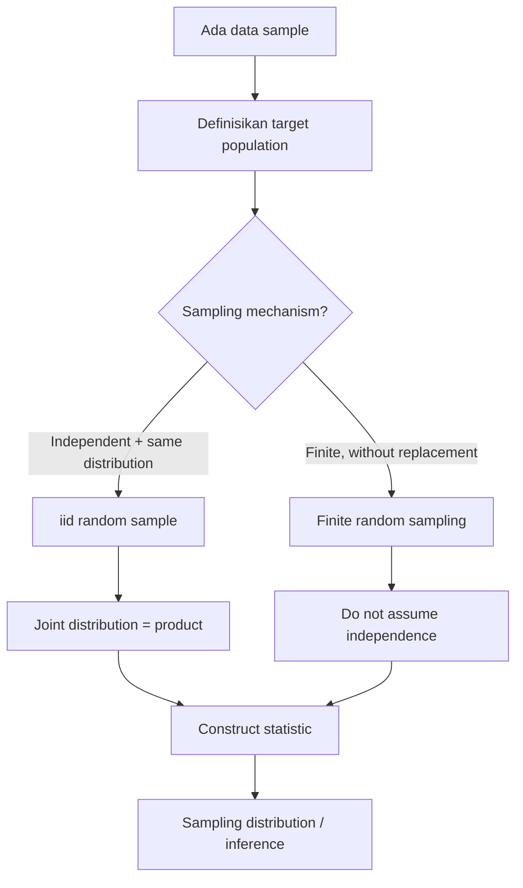

# 📊 4.1 — Penarikan Sampel Acak

> [!ABSTRACT] Ringkasan Cepat
> **Topik:** Penarikan Sampel Acak  
> **Bobot Parent Topic:** 20–30%  
> **Exam Priority:** Very High  
> **Difficulty:** Concept-Intensive  
> **Primary Skill:** Concept  
> **Ref:** Miller, Miller & Freund Ch. 8; Walpole et al. Ch. 8.1; Hogg, Tanis & Zimmerman Ch. 5.5–5.6, 5.8 sebagai konteks lanjutan

## Section 0 — Pemetaan Silabus & Exam Scope

| Field | Isi |
|---|---|
| Topik CF2 | Topik 4 — Inferensi Statistik |
| Subtopik | 4.1 Penarikan Sampel Acak |
| Learning Outcome | Menjelaskan konsep penarikan sampel acak dan inferensi statistik |
| Skill Diuji | Mengidentifikasi population, sample, random sample, parameter, statistic, serta assumptions yang membuat inferensi valid |
| Bobot Parent Topic | 20–30% |
| Exam Priority | Very High |
| Prerequisite | Random variable, joint distribution, independence, expectation/variance |
| Connected Topics | [[4.2 Distribusi Sampel]], [[4.3 Teorema Limit Pusat (CLT)]], [[4.4 Hukum Bilangan Besar (LLN)]], [[4.5 Estimasi Parameter]], [[4.7 Selang Kepercayaan]], [[4.8 Uji Hipotesis]] |
| Referensi | Miller Ch. 8; Walpole Ch. 8.1; Hogg, Tanis & Zimmerman Ch. 5.5–5.6, 5.8 untuk penggunaan random sample pada hasil lanjutan |

> [!IMPORTANT] Scope Boundary
> `[CORE CF2]` Topik 4.1 berfokus pada **population → random sample → statistic → inference** dan assumptions dasar di balik random sampling. Di sini perlu memahami perbedaan population dengan sample, arti **independent and identically distributed (iid)** untuk random sample dari population distribution, joint distribution dari sample iid, serta perbedaan parameter dengan statistic/observed value.  
> Distribusi sampling spesifik untuk $\bar X$, $S^2$, selisih mean, $\chi^2$, $t$, dan $F$ dibahas di [[4.2 Distribusi Sampel]]. CLT dan LLN dibahas terpisah di [[4.3 Teorema Limit Pusat (CLT)]] dan [[4.4 Hukum Bilangan Besar (LLN)]]. Estimation, confidence interval, dan hypothesis testing juga bukan materi inti section ini.

## Section 1 — Intuisi & Big Picture

Statistical inference muncul ketika kita ingin mengetahui sesuatu tentang **population** tetapi hanya dapat mengamati sebagian darinya. Misalnya, kita ingin mengetahui rata-rata besar klaim seluruh polis dalam suatu portfolio, tetapi yang tersedia hanya sejumlah observasi klaim. Nilai population seperti mean $\mu$, variance $\sigma^2$, atau proportion $p$ adalah **parameter**; parameter bersifat tetap untuk model population tetapi nilainya dapat tidak diketahui. Kita lalu mengambil sample dan menghitung fungsi dari sample tersebut—misalnya $\bar X$, $S^2$, atau sample proportion—untuk memperoleh informasi tentang parameter.

Kunci matematisnya adalah bahwa sample tidak diperlakukan sekadar sebagai daftar angka. Sebelum data direalisasikan, sample ditulis sebagai random variables

$$
X_1,X_2,\ldots,X_n.
$$

Untuk random sample dari population distribution yang diperlakukan infinite, Miller mendefinisikannya sebagai random variables yang **independent dan identically distributed**. Independence membuat satu observasi tidak mengubah distribution observasi lain; identically distributed berarti setiap $X_i$ berasal dari population distribution yang sama. Struktur ini kemudian memungkinkan joint PMF/PDF memfaktor menjadi product, yang merupakan fondasi bagi sampling distribution dan inferensi berikutnya.

Kesalahan intuitif paling umum adalah menganggap bahwa setiap kumpulan data otomatis merupakan random sample. Tidak demikian. Jika cara pemilihan membuat observasi tidak representatif atau assumptions sampling tidak sesuai, inference dari sample ke population dapat menyesatkan. Selain itu, sampling **without replacement** dari finite population membutuhkan treatment berbeda: sample elements umumnya tidak independent walaupun setiap posisi sampling memiliki marginal distribution yang sama.

## Section 2 — Definisi, Support & Core Formulas

### Definisi Formal

> [!NOTE] Definisi Formal — Population
> **Population** adalah himpunan nilai/observasi yang menjadi sumber sample. Distribusi dari nilai-nilai population disebut **population distribution**. Population dapat finite ataupun diperlakukan sebagai infinite distribution, tergantung setting model.

> [!NOTE] Definisi Formal — Random Sample dari Infinite Population
> Jika
> $$
> X_1,X_2,\ldots,X_n
> $$
> adalah random variables yang **independent and identically distributed**, maka mereka membentuk **random sample of size $n$** dari common population distribution tersebut.

Dengan common PMF/PDF $f(x)$ dan common support $\mathcal X$, random sample memiliki support

$$
\mathcal X^n
=
\underbrace{\mathcal X\times\cdots\times\mathcal X}_{n\text{ kali}}
$$

serta joint PMF/PDF

$$
\boxed{
f_{X_1,\ldots,X_n}(x_1,\ldots,x_n)
=
\prod_{i=1}^{n} f(x_i)
}
$$

untuk $(x_1,\ldots,x_n)\in\mathcal X^n$.

> [!IMPORTANT] Assumptions
> Factorization di atas membutuhkan **independence**. Common factor $f$ yang sama untuk setiap $i$ membutuhkan **identically distributed**. Jangan menulis product iid secara otomatis hanya karena terdapat $n$ observasi.

> [!NOTE] Definisi Formal — Statistic
> **Statistic** adalah random variable yang merupakan fungsi dari random sample dan tidak memasukkan unknown population parameter sebagai input bebas. Sebelum observasi direalisasikan, statistic tetap random karena bergantung pada $X_1,\ldots,X_n$.

Dua statistic dasar yang digunakan Miller adalah

$$
\boxed{
\bar X=\frac1n\sum_{i=1}^{n}X_i
}
$$

serta

$$
\boxed{
S^2=\frac1{n-1}\sum_{i=1}^{n}(X_i-\bar X)^2
}
$$

Untuk observed values $x_1,\ldots,x_n$, realisasinya adalah

$$
\bar x=\frac1n\sum_{i=1}^{n}x_i,
$$

$$
s^2=\frac1{n-1}\sum_{i=1}^{n}(x_i-\bar x)^2.
$$

### Terminologi & Simbol Penting

| Istilah / Simbol | Definisi | Support / Domain | Exam Note |
|---|---|---|---|
| Population | Seluruh nilai/observasi yang menjadi target inference | Finite set atau distribution | Jangan disamakan dengan sample yang diamati |
| Population distribution $f(x)$ | Distribution dari satu observation population | Support $\mathcal X$ | Menentukan distribution masing-masing $X_i$ pada iid sample |
| $X_i$ | Random variable untuk observasi sample ke-$i$ | $x_i\in\mathcal X$ | Uppercase = random variable |
| $x_i$ | Observed realization dari $X_i$ | Nilai tertentu dalam $\mathcal X$ | Lowercase = data yang sudah diamati |
| Random sample | $X_1,\ldots,X_n$ yang iid dalam infinite-population model | $\mathcal X^n$ | Cek independence **dan** identical distribution |
| $n$ | Sample size | Positive integer | Ukuran sample, bukan population size |
| $N$ | Finite population size bila relevan | Positive integer, $N\ge n$ | Bedakan dari $n$ |
| Parameter $\theta$ | Fixed characteristic dari population model | Parameter space $\Theta$ | Tetap tetapi dapat unknown |
| Statistic $T(X_1,\ldots,X_n)$ | Fungsi random sample | Ditentukan oleh sample support | Memiliki sampling distribution |
| Estimate $T(x_1,\ldots,x_n)$ | Nilai numerik statistic setelah data diamati | Fixed observed number | Jangan tertukar dengan statistic random |
| $\bar X$ / $\bar x$ | Sample mean statistic / observed sample mean | Tergantung population support | Sampling distribution dibahas di Topik 4.2 |
| $S^2$ / $s^2$ | Sample variance statistic / observed sample variance | $S^2\ge0$ | Denominator source: $n-1$ |

### Core Relationship 1 — iid Joint Distribution

Jika $X_1,\ldots,X_n$ iid dengan common PMF/PDF $f$, maka

$$
P(X_1\in A_1,\ldots,X_n\in A_n)
=
\prod_{i=1}^{n}P(X_i\in A_i)
$$

untuk event yang sesuai, dan pada PMF/PDF level

$$
f(x_1,\ldots,x_n)=\prod_{i=1}^{n}f(x_i).
$$

Ini adalah mathematical signature random sample yang paling penting untuk section ini.

### Core Relationship 2 — Sampling with Replacement dari Finite Population

Miller menyatakan bahwa definisi iid di atas juga berlaku untuk sampling **with replacement** dari finite population: setelah setiap draw, unit dikembalikan sehingga distribution draw berikutnya sama dan independence dapat dipertahankan di bawah mekanisme random selection yang sama.

### Core Relationship 3 — Sampling without Replacement dari Finite Population

Untuk finite population

$$
\{c_1,c_2,\ldots,c_N\}
$$

dan sampling tanpa replacement, Miller mendefinisikan random sample ukuran $n$ melalui equal probability untuk setiap ordered $n$-tuple yang mungkin:

$$
\boxed{
P(X_1=x_1,\ldots,X_n=x_n)
=
\frac{1}{N(N-1)\cdots(N-n+1)}
}
$$

untuk ordered tuple berisi elemen distinct yang valid dari population.

Jika order diabaikan, setiap subset ukuran $n$ memiliki probability

$$
\boxed{
\frac{1}{\binom{N}{n}}
}
$$

sehingga seluruh possible samples ukuran $n$ sama mungkin.

Namun, berbeda dari iid sampling,

> [!DANGER] Finite-Sampling Dependence
> Dalam sampling **without replacement**, $X_1,\ldots,X_n$ umumnya **tidak independent**, karena hasil draw sebelumnya mengubah himpunan nilai yang tersedia untuk draw berikutnya.

### Recognition Clues

| Narasi / Mechanism | Struktur yang Dipikirkan | Pembeda Kritis |
|---|---|---|
| “independent observations from the same distribution” | iid random sample | Independence + common distribution |
| “repeat experiment $n$ times under essentially same conditions” | Random sample model | Setiap $X_i$ memiliki distribution yang sama; independence harus justified |
| “sample with replacement” dari finite population | iid-style sampling | Population composition reset setiap draw |
| “sample without replacement” dari finite population | Finite random sampling | Draws dependent; equal-probability sample subsets bila selection random |
| “estimate population mean/proportion” | Statistic digunakan untuk inference | Parameter fixed; statistic random sebelum data diamati |
| “observed average is ...” | Estimate $\bar x$ | Jangan menyebut observed number sebagai random quantity |

## Section 3 — How It Works

Untuk Topik 4.1, framework utama adalah:

```text
Define target population
↓
Identify population parameter of interest
↓
Represent sample as X1,...,Xn
↓
Check sampling mechanism
↓
Are observations iid?
↓
Construct statistic T(X1,...,Xn)
↓
Observe data x1,...,xn → compute t
↓
Use sampling theory for inference
```

### 3.1 Dari Population ke Random Sample

Misalkan population distribution mempunyai PMF/PDF $f(x;\theta)$ dengan unknown parameter $\theta$. Jika $X_1,\ldots,X_n$ merupakan iid random sample, maka

$$
f(x_1,\ldots,x_n;\theta)
=
\prod_{i=1}^{n}f(x_i;\theta).
$$

Ini bukan sekadar convenience algebra. Product structure datang langsung dari independence; common functional form datang dari identical distribution. Pada Topik 4.5, struktur ini menjadi basis likelihood. Pada Topik 4.2, fungsi sample seperti $\bar X$ dan $S^2$ memperoleh sampling distribution dari joint/random-sample structure ini.

### 3.2 Statistic adalah Random Variable

Sebelum data diambil,

$$
T=T(X_1,\ldots,X_n)
$$

bervariasi dari sample ke sample. Karena itu $T$ memiliki probability distribution sendiri, yang kemudian disebut **sampling distribution**.

Setelah data diamati,

$$
(X_1,\ldots,X_n)=(x_1,\ldots,x_n),
$$

maka

$$
t=T(x_1,\ldots,x_n)
$$

adalah satu nilai numerik. Perbedaan ini sangat penting untuk membedakan statistic/estimator dari estimate.

### 3.3 Sampling without Replacement Mengubah Dependence

Jika population finite dan sampling tanpa replacement, misalnya $X_1$ telah mengambil nilai tertentu, nilai tersebut tidak lagi tersedia bagi $X_2$. Maka secara umum

$$
P(X_2=x\mid X_1=y)
\neq
P(X_2=x).
$$

Jadi jangan memaksakan factorization iid. Source Miller memberikan finite-population definition terpisah untuk situasi ini.

> [!TIP] Cara Berpikir Cepat
> Saat melihat soal sampling, tanyakan tiga hal sebelum formula apa pun:  
> **(1)** apa population-nya?  
> **(2)** with replacement atau without replacement?  
> **(3)** apakah observations benar-benar independent dan identically distributed?  
> Jika jawabannya iid, product joint distribution biasanya menjadi langkah pertama. Jika without replacement dari finite population, jangan gunakan iid product secara otomatis.

> [!DANGER] Jangan Salah Pikir
> 1. **Random sample ≠ sekadar sample yang “dipilih secara acak” dalam bahasa sehari-hari.** Dalam model infinite-population Miller, random sample berarti iid random variables.
> 2. **Identically distributed ≠ independent.** Semua $X_i$ dapat memiliki marginal distribution sama tetapi tetap dependent.
> 3. **Statistic ≠ parameter.** $\bar X$ berubah dari sample ke sample; $\mu$ adalah population parameter yang tetap dalam model.
> 4. **Observed estimate ≠ estimator as random variable.** $\bar X$ adalah statistic; $\bar x$ adalah nilai yang sudah dihitung dari data.
> 5. **Without replacement ≠ iid.** Finite random sampling tanpa replacement memerlukan dependence structure yang berbeda.

### Derivasi Minimum yang Berguna — Mengapa Joint Density Menjadi Product?

Untuk dua observations independent,

$$
f_{X_1,X_2}(x_1,x_2)=f_{X_1}(x_1)f_{X_2}(x_2).
$$

Jika juga identically distributed,

$$
f_{X_1}(x)=f_{X_2}(x)=f(x).
$$

Maka

$$
f_{X_1,X_2}(x_1,x_2)=f(x_1)f(x_2).
$$

Mengulang argument yang sama untuk $n$ observations menghasilkan

$$
\boxed{
f_{X_1,\ldots,X_n}(x_1,\ldots,x_n)
=
\prod_{i=1}^{n}f(x_i)
}.
$$

Derivasi singkat ini penting karena formula product nantinya muncul berulang pada sampling distributions dan likelihood.

## Section 4 — Worked Examples & Exam Cases

### Case A — Fundamental: Parameter, Statistic, dan Estimate

**Soal**

Suatu portfolio memiliki population claim amount dengan unknown mean $\mu$. Diambil random sample lima claim amounts:

$$
80,
120,
100,
140,
60.
$$

Identifikasi population parameter, statistic yang natural untuk mengestimasi mean, dan observed estimate-nya.

> [!SUCCESS] Pembahasan
>
> **1. Parse Narasi & Target**  
> Target adalah population mean, yaitu parameter $\mu$. Data adalah satu realization dari random sample $X_1,\ldots,X_5$.
>
> **2. Identify Structure / Distribution**  
> Untuk Topik 4.1 kita tidak perlu memilih distribution khusus. Struktur yang relevan adalah random sample dan statistic.
>
> **3. Support / Domain / Region**  
> Claim amount secara natural berada pada nilai nonnegative; tetapi exact population support tidak diperlukan untuk menghitung sample mean.
>
> **4. Setup**
> $$
> \bar X=\frac15\sum_{i=1}^{5}X_i.
> $$
> Setelah data diamati,
> $$
> \bar x=\frac15\sum_{i=1}^{5}x_i.
> $$
>
> **5. Calculation**
> $$
> \bar x
> =\frac{80+120+100+140+60}{5}
> =\frac{500}{5}
> =100.
> $$
>
> **6. Interpretation**  
> $\mu$ adalah unknown population parameter. $\bar X$ adalah statistic yang random sebelum sampling. Nilai $\bar x=100$ adalah observed sample mean yang dapat digunakan sebagai estimate untuk $\mu$.
>
> **7. Verification**  
> Sample mean harus berada di antara minimum dan maksimum sample, yaitu antara $60$ dan $140$. Nilai $100$ memenuhi check tersebut.

> [!WARNING] Exam Trap — Case A
> - **Trap:** menulis $\mu=100$ karena sample mean bernilai $100$.
> - **Mengapa distractor terlihat benar:** sample mean memang digunakan untuk belajar tentang population mean.
> - **Cara menghindari:** bedakan parameter $\mu$ dari estimate $\bar x$.
> - **Shortcut aman:** uppercase = random statistic, lowercase = realized numerical value.
> - **Target waktu:** 30–45 detik.

### Case B — Exam-Typical: Cek Struktur iid dan Joint PMF

**Soal**

Untuk lima polis yang dipilih berdasarkan mekanisme random sample, definisikan

$$
X_i=
\begin{cases}
1, & \text{jika polis ke-}i\text{ mengalami klaim},\\
0, & \text{jika tidak}.
\end{cases}
$$

Asumsikan $X_1,\ldots,X_5$ independent dan masing-masing mempunyai Bernoulli PMF dengan parameter $p$. Untuk observed sample

$$
(1,0,1,1,0),
$$

tuliskan joint probability dan sample proportion.

> [!SUCCESS] Pembahasan
>
> **1. Parse Narasi & Target**  
> Kita diminta menggunakan iid sample structure, bukan melakukan inference terhadap $p$ lebih lanjut.
>
> **2. Identify Structure / Distribution**  
> Setiap $X_i$ memiliki PMF
> $$
> P(X_i=x_i)=p^{x_i}(1-p)^{1-x_i},\qquad x_i\in\{0,1\}.
> $$
> Independence memungkinkan joint PMF menjadi product.
>
> **3. Support / Domain / Region**
> $$
> (x_1,\ldots,x_5)\in\{0,1\}^5,
> \qquad 0\le p\le1.
> $$
>
> **4. Setup**
> $$
> P(X_1=x_1,\ldots,X_5=x_5)
> =\prod_{i=1}^{5}p^{x_i}(1-p)^{1-x_i}.
> $$
>
> **5. Calculation**  
> Untuk $(1,0,1,1,0)$, terdapat tiga nilai $1$ dan dua nilai $0$:
> $$
> P(1,0,1,1,0)=p^3(1-p)^2.
> $$
> Sample proportion adalah
> $$
> \hat p=\bar x
> =\frac{1+0+1+1+0}{5}
> =\frac35
> =0.6.
> $$
>
> **6. Interpretation**  
> $p$ tetap sebagai unknown population proportion. Nilai $0.6$ adalah sample-based estimate, bukan bukti bahwa $p$ pasti sama dengan $0.6$.
>
> **7. Verification**  
> Joint probability berbentuk product lima Bernoulli terms dan tetap berada pada $[0,1]$ untuk $0\le p\le1$. Sample proportion juga berada dalam $[0,1]$.

> [!WARNING] Exam Trap — Case B
> - **Trap:** menulis $p=0.6$ sebagai identity.
> - **Mengapa distractor terlihat benar:** $\hat p=0.6$ adalah observed proportion.
> - **Cara menghindari:** $p$ = population parameter; $\hat p$ = statistic/estimate tergantung konteks.
> - **Shortcut aman:** untuk Bernoulli iid sample, product collapses menjadi $p^{\#1}(1-p)^{\#0}$.
> - **Target waktu:** 45–60 detik.

### Case C — Challenging / Integrated: Finite Sampling without Replacement

**Soal**

Sebuah finite population terdiri dari empat nilai

$$
\{10,20,30,40\}.
$$

Dua nilai dipilih secara acak **tanpa replacement**. $X_1$ adalah draw pertama dan $X_2$ draw kedua.

1. Tentukan probability untuk setiap ordered pair yang valid.
2. Tentukan probability setiap unordered sample berukuran dua.
3. Apakah $X_1$ dan $X_2$ independent?

> [!SUCCESS] Pembahasan
>
> **1. Parse Narasi & Target**  
> Ini finite random sampling without replacement dengan $N=4$ dan $n=2$.
>
> **2. Identify Structure / Distribution**  
> Sesuai finite-population random-sample definition Miller, setiap ordered tuple distinct mempunyai probability sama.
>
> **3. Support / Domain / Region**  
> Ordered support terdiri dari
> $$
> 4\times3=12
> $$
> pasangan $(x_1,x_2)$ dengan $x_1\neq x_2$.
>
> **4. Setup**
> $$
> P(X_1=x_1,X_2=x_2)
> =\frac1{4(3)}
> =\frac1{12}
> $$
> untuk $x_1\neq x_2$ yang berada dalam population.
>
> Untuk unordered sample, jumlah possible subsets adalah
> $$
> \binom42=6,
> $$
> sehingga setiap subset mempunyai probability
> $$
> \frac1{\binom42}=\frac16.
> $$
>
> **5. Calculation — Independence Check**  
> Marginal probability bahwa draw kedua bernilai $20$ adalah
> $$
> P(X_2=20)=\frac14.
> $$
> Namun jika draw pertama adalah $10$,
> $$
> P(X_2=20\mid X_1=10)=\frac13.
> $$
> Karena
> $$
> \frac13\neq\frac14,
> $$
> maka $X_1$ dan $X_2$ tidak independent.
>
> **6. Interpretation**  
> Random selection tidak selalu berarti iid. Tanpa replacement, draw sebelumnya mengubah possible outcomes draw berikutnya.
>
> **7. Verification**  
> Total joint mass:
> $$
> 12\left(\frac1{12}\right)=1.
> $$
> Total unordered sample probability:
> $$
> 6\left(\frac16\right)=1.
> $$

> [!WARNING] Exam Trap — Case C
> - **Trap:** menggunakan $P(X_1=x_1,X_2=x_2)=1/4^2=1/16$.
> - **Mengapa distractor terlihat benar:** $1/4^2$ benar jika dua draws independent with replacement.
> - **Cara menghindari:** keyword **without replacement** berarti pilihan kedua tinggal $N-1$.
> - **Shortcut aman:** ordered sample count $=N(N-1)\cdots(N-n+1)$.
> - **Target waktu:** 60–90 detik.

## Section 5 — Verification & Sanity Check

> [!CHECK] Sanity Check
> 1. **iid check:** apakah independence dan identical distribution keduanya benar-benar diberikan/terjustifikasi?
> 2. **Joint support check:** untuk iid sample, support harus berupa $\mathcal X^n$; untuk without replacement, tuples dengan repeated finite-population elements tidak valid.
> 3. **Joint probability/density check:** product factorization hanya digunakan jika independence berlaku.
> 4. **Finite sampling check:** jika setiap unordered subset ukuran $n$ equally likely, total probability harus
>    $$
>    \binom Nn\cdot\frac1{\binom Nn}=1.
>    $$
> 5. **Statistic check:** statistic harus merupakan fungsi sample; setelah observed data dimasukkan, hasil berubah menjadi fixed numerical value.
> 6. **Parameter vs statistic check:** parameter seperti $\mu$, $\sigma^2$, atau $p$ tidak berubah dari sample ke sample dalam model; $\bar X$, $S^2$, dan $\hat p$ dapat berubah.

### Metode Alternatif

Untuk mengecek independence pada finite sampling, dua cara sama-sama valid:

**Metode 1 — Conditional probability**

Bandingkan

$$
P(X_2=x\mid X_1=y)
$$

dengan

$$
P(X_2=x).
$$

Jika berbeda untuk suatu pasangan valid, variables dependent.

**Metode 2 — Joint-product criterion**

Bandingkan

$$
P(X_1=x_1,X_2=x_2)
$$

dengan

$$
P(X_1=x_1)P(X_2=x_2).
$$

Untuk soal pendek, conditional probability biasanya lebih cepat karena efek without replacement langsung terlihat.

## Section 6 — Connections & Mental Model

### Population → Sample → Statistic → Inference

```text
Population distribution
(parameters such as μ, σ², p, θ)
        ↓ random sampling
X1, X2, ..., Xn
        ↓ function of sample
Statistic T(X1,...,Xn)
        ↓ repeated samples
Sampling distribution of T
        ↓
Inference about population parameter
```

Mental model yang paling penting adalah **dua level randomness**:

1. Population distribution menjelaskan variability individual observation $X$.
2. Sampling distribution menjelaskan variability suatu statistic $T(X_1,\ldots,X_n)$ dari sample ke sample.

Level kedua baru dibahas formal di [[4.2 Distribusi Sampel]], tetapi tidak dapat dipahami tanpa definisi random sample pada topik ini.

### Hubungan ke [[4.2 Distribusi Sampel]]

Begitu sample $X_1,\ldots,X_n$ ditetapkan, statistic seperti

$$
\bar X=\frac1n\sum X_i
$$

menjadi random variable. Distribution dari $\bar X$ adalah **sampling distribution of the mean**. Hal serupa berlaku untuk $S^2$ dan statistic lainnya.

### Hubungan ke [[4.5 Estimasi Parameter]]

Estimator adalah statistic yang dirancang untuk mengestimasi parameter. Contohnya:

$$
\bar X \quad\text{untuk }\mu,
$$

atau sample proportion untuk population proportion $p$. Kualitas estimator baru dinilai lebih lanjut melalui properties di [[4.6 Sifat-Sifat Estimator]].

### Hubungan ke [[4.7 Selang Kepercayaan]] dan [[4.8 Uji Hipotesis]]

Confidence interval dan hypothesis test tidak bekerja langsung dari raw sample saja; keduanya membutuhkan statistic dengan known atau approximated sampling distribution. Karena itu random-sample assumptions adalah bagian dari **validity conditions** inferensi, bukan formalitas.

### Hubungan Visual ↔ Rumus

Bayangkan banyak repeated random samples berukuran sama dari population yang sama. Setiap sample menghasilkan satu nilai statistic, misalnya $\bar x$. Kumpulan nilai $\bar x$ yang terbentuk dari pengulangan itu membentuk sampling distribution. Dengan demikian:

- **population distribution** → variation antar individual observations;
- **random sampling mechanism** → bagaimana data dipilih;
- **statistic** → merangkum sample;
- **sampling distribution** → variation antar nilai statistic dari sample yang berbeda.

## Section 7 — Exam Traps & Misconceptions

### Sampling Assumption Trap

> [!BUG] iid Trap
> **Salah:** “Semua observasi punya distribution sama, jadi sample iid.”  
> **Benar:** iid membutuhkan dua properties sekaligus:
> $$
> \text{independent} + \text{identically distributed}.
> $$

### Replacement Trap

> [!BUG] Replacement Trap
> **With replacement:** observation berikutnya dapat memiliki distribution sama dan independence dapat dipertahankan.  
> **Without replacement:** draw berikutnya dipengaruhi draw sebelumnya, sehingga iid factorization umumnya gagal.

### Parameter vs Statistic Trap

> [!BUG] Inference Trap
> **Parameter:** $\mu$, $\sigma^2$, $p$, $\theta$ — fixed characteristic dari population model.  
> **Statistic:** $\bar X$, $S^2$, $\hat p$ — fungsi random sample.  
> **Estimate:** observed value seperti $\bar x=100$ atau $\hat p=0.60$.

### Random Sample vs Observed Data Trap

> [!BUG] Notation Trap
> Sebelum observasi:
> $$
> X_1,\ldots,X_n
> $$
> adalah random variables.  
> Setelah observasi:
> $$
> x_1,\ldots,x_n
> $$
> adalah fixed data values.  
> Soal inferensi sering berpindah dari uppercase ke lowercase; jangan kehilangan distinction tersebut.

### Red Flags

> [!CAUTION] Red Flags

| Keyword / Condition | Apa yang Harus Dipikirkan |
|---|---|
| “random sample” | cek apakah konteks memakai iid definition |
| “independent observations” | joint distribution dapat factorize |
| “same distribution” | identical distribution saja belum cukup untuk iid |
| “with replacement” | independence lebih plausible; distribution reset |
| “without replacement” | finite-population dependence |
| “population mean/proportion” | parameter |
| “sample mean/proportion” | statistic atau observed estimate |
| “from repeated samples” | sampling distribution, bukan population distribution |

## Section 8 — Executive Summary

### Must Remember

> [!SUMMARY] Must Remember
> 1. Statistical inference menggunakan sample untuk belajar tentang population.
> 2. Population parameter seperti $\mu$, $\sigma^2$, dan $p$ tetap dalam model tetapi dapat unknown.
> 3. Random sample dari infinite population dalam Miller adalah $X_1,\ldots,X_n$ yang **iid**.
> 4. iid = **independent + identically distributed**; salah satu saja tidak cukup.
> 5. Jika common PMF/PDF adalah $f$, maka iid joint distribution adalah
>    $$
>    \prod_{i=1}^n f(x_i).
>    $$
> 6. Statistic adalah fungsi random sample dan karenanya merupakan random variable sebelum data diamati.
> 7. $\bar X$ dan $S^2$ adalah examples utama statistic; $\bar x$ dan $s^2$ adalah observed values.
> 8. Sampling with replacement dari finite population dapat mengikuti iid-style structure.
> 9. Sampling without replacement dari finite population umumnya menghasilkan dependent observations.
> 10. Dalam finite random sampling tanpa replacement, setiap ordered valid $n$-tuple mempunyai probability $1/[N(N-1)\cdots(N-n+1)]$; setiap unordered subset ukuran $n$ mempunyai probability $1/\binom Nn$.
> 11. Distribution dari statistic disebut sampling distribution dan menjadi jembatan menuju seluruh inferensi Topik 4.

### Formula Map / Comparison Table

| Kondisi | Model / Formula / Rule | Support / Assumption | Common Trap |
|---|---|---|---|
| iid sample | $f(x_1,\ldots,x_n)=\prod_i f(x_i)$ | Independence + common distribution | Product dipakai tanpa independence |
| Sample mean | $\bar X=n^{-1}\sum_iX_i$ | Random sample/statistic context | Disamakan dengan $\mu$ |
| Sample variance | $S^2=(n-1)^{-1}\sum_i(X_i-\bar X)^2$ | Source definition | Salah denominator |
| Finite without replacement, ordered | $1/[N(N-1)\cdots(N-n+1)]$ | Valid tuples, no repeated selected unit | Gunakan $1/N^n$ |
| Finite without replacement, unordered | $1/\binom Nn$ | Equal-probability subsets | Count permutations instead of subsets |
| Observed statistic | $t=T(x_1,\ldots,x_n)$ | Data already observed | Masih memperlakukan $t$ sebagai random |

### Trigger Keywords

| Jika soal mengatakan... | Pikirkan... |
|---|---|
| “from the same population distribution” | identical distribution |
| “independent random variables” | factorization |
| “random sample of size $n$” | iid unless finite-without-replacement context says otherwise |
| “without replacement” | dependence / finite population |
| “sample mean” | statistic $\bar X$; observed value $\bar x$ |
| “population mean” | parameter $\mu$ |
| “probability distribution of a statistic” | sampling distribution |

### Kapan Digunakan

Framework random sampling digunakan sebelum:

- menentukan sampling distribution;
- menjalankan CLT/LLN;
- membangun likelihood dan estimator;
- menghitung confidence interval;
- menjalankan hypothesis test.

Jika assumptions sample salah, formula inferensi lanjutan dapat kehilangan validity.

### Kapan TIDAK Boleh Digunakan

Jangan menggunakan iid product

$$
\prod_i f(x_i)
$$

ketika independence tidak ada atau ketika distributions observations berbeda. Jangan pula memperlakukan sampling without replacement dari finite population sebagai iid hanya karena setiap unit dipilih “secara acak”.

### Quick Decision Tree



## Section 9 — Active Recall Check

1. Apa perbedaan population, sample, dan random sample dalam mathematical-statistics context?
2. Apa dua syarat yang harus dipenuhi agar $X_1,\ldots,X_n$ disebut iid?
3. Jika $X_1,\ldots,X_n$ iid dengan common PDF $f$, tuliskan support joint dan joint PDF-nya.
4. Mengapa “identically distributed” tidak otomatis berarti independent?
5. Apa perbedaan $\mu$, $\bar X$, dan $\bar x$?
6. Apa perbedaan statistic, estimator, dan estimate dalam konteks random sampling?
7. Untuk finite population size $N$, bagaimana probability sebuah ordered sample ukuran $n$ tanpa replacement ditulis?
8. Mengapa sampling without replacement umumnya membuat $X_1$ dan $X_2$ dependent? Tulis satu independence check yang dapat digunakan.
9. Jika suatu soal menyebut “randomly selected observations” tetapi juga “without replacement”, apakah Anda boleh langsung menulis $\prod_i f(x_i)$? Jelaskan setup yang harus dicek dahulu.
10. Susun mathematical pathway dari population parameter menuju observed estimate menggunakan notation $X_i$ dan $x_i$.
11. Mana yang lebih cepat untuk mengecek dependence pada sampling without replacement: joint-product criterion atau conditional-probability criterion? Jelaskan kapan Anda memilih masing-masing.
12. Tanpa menghitung penuh, sanity check apa yang memastikan equal-probability formula $1/\binom Nn$ valid untuk unordered finite samples?

## Section 10 — Exam Pattern Map

`[TEXTBOOK-BASED EXPECTATION]` — patterns berikut berasal dari learning outcome silabus dan mechanics textbook; bukan klaim frekuensi past exam.

| Narasi Soal | Keyword | Struktur/Distribusi | Setup / Formula | Langkah | Trap | Shortcut |
|---|---|---|---|---|---|---|
| Identify random sample | “independent”, “same distribution” | iid sample | $X_1,\ldots,X_n$ iid | verify both properties | identical only | checklist: I + ID |
| Joint PMF/PDF of sample | “random sample from $f$” | product joint law | $\prod_i f(x_i)$ | write support → multiply | ignore support/independence | product immediately after assumptions |
| Parameter vs statistic | “population mean” vs “sample mean” | inference notation | $\mu$ vs $\bar X$ | identify fixed vs random | set them equal | uppercase/lowercase discipline |
| Statistic vs observed value | “sample observed...” | realization | $T(X)$ vs $T(x)$ | compute after data given | treat estimate as random | random before, fixed after |
| Finite sample with replacement | “replace each selected item” | iid-like finite sampling | probability per draw resets | apply product if selection independent | choices incorrectly decrease | reset denominator $N$ |
| Finite sample without replacement | “without replacement” | dependent draws | ordered probability $1/[N(N-1)\cdots]$ | reduce choices each draw | use $1/N^n$ | denominator falls each draw |
| Equal-probability unordered finite samples | “choose $n$ of $N$ randomly” | subset sampling | $1/\binom Nn$ | count possible subsets | count order twice | combination denominator |
| Link sample to inference | “estimate population parameter” | statistic as bridge | choose $T(X_1,\ldots,X_n)$ | parameter → statistic → observed estimate | parameter confused with data summary | name all three objects first |

## Source Traceability

| Materi | Sumber |
|---|---|
| Scope 4.1: random sampling dan statistical inference | Silabus CF2 — Topik 4 |
| Population dan population distribution | Miller, Miller & Freund, Chapter 8 §1 |
| Random sample dari infinite population sebagai iid random variables | Miller, Miller & Freund, Chapter 8 §1 |
| Joint distribution dari iid random sample sebagai product | Miller, Miller & Freund, Chapter 8 §1 |
| Sample mean dan sample variance sebagai statistics | Miller, Miller & Freund, Chapter 8 §1 |
| Uppercase random variables/statistics vs lowercase observed values | Miller, Miller & Freund, Chapter 8 §1 |
| Finite-population random sampling tanpa replacement; equal-probability ordered tuples dan subsets | Miller, Miller & Freund, Chapter 8 §3 |
| Population dan sample; random sample melalui repeated independent measurements under same conditions | Walpole et al., Chapter 8.1 |
| Random sample joint PMF/PDF factorization | Walpole et al., Chapter 8.1 |
| Statistic sebagai fungsi random sample dan perannya dalam inference | Walpole et al., Chapter 8.1–8.2 sebagai conceptual continuation |
| Random sample digunakan sebagai assumption dalam sampling-distribution results | Hogg, Tanis & Zimmerman, Chapter 5.5–5.6 |
| Exam framing, examples, traps, dan shortcuts | Sintesis exam-oriented dari mechanics yang didukung referensi resmi di atas |

---

> [!INFO] CF2 Study Note
> **Previous:** [[3.8 Transformasi Variabel Acak Gabungan]]  
> **Next:** [[4.2 Distribusi Sampel]]  
> **Related:** [[4.3 Teorema Limit Pusat (CLT)]] · [[4.5 Estimasi Parameter]] · [[4.7 Selang Kepercayaan]] · [[4.8 Uji Hipotesis]]

> [!QUOTE] Follow-up Options
> 1. *"Uji saya dengan Active Recall dari topik ini"*
> 2. *"Buat 10 soal exam-style calculation untuk topik ini"*
> 3. *"Jelaskan hubungan topik ini dengan topik CF2 terkait"*

*📖 Ref: Miller, Miller & Freund Ch. 8; Walpole et al. Ch. 8.1; Hogg, Tanis & Zimmerman Ch. 5.5–5.6, 5.8 | 🗓️ 2026-08-29 | #CF2 #Probabilitas #Statistika*
