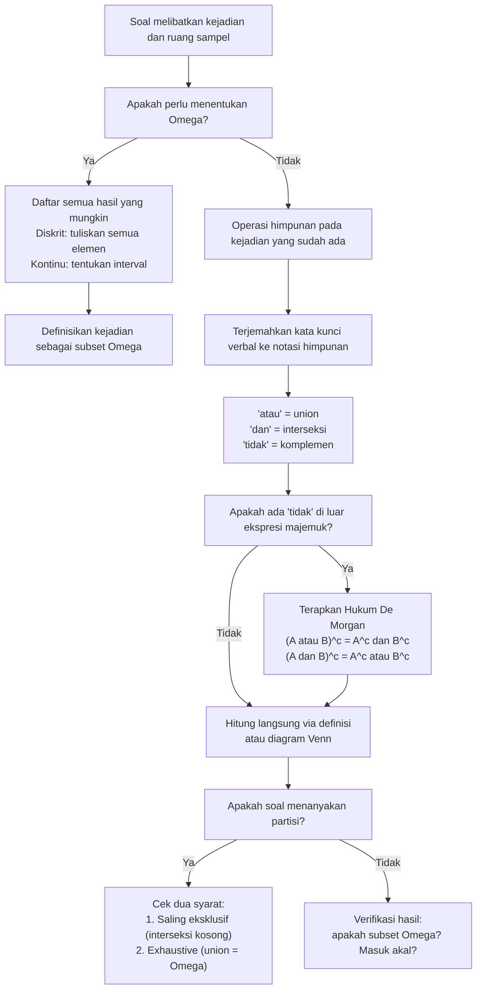

# 📊 1.1 — Eksperimen Acak dan Ruang Sampel

> [!ABSTRACT] Ringkasan Cepat
> **Topik:** Eksperimen Acak dan Ruang Sampel | **Bobot:** ~15–25% | **Difficulty:** Easy
> **Ref:** Hogg-Tanis-Zimm (2015) Bab 1.1; Miller et al. (2014) Bab 1–2 | **Prereq:** Himpunan dasar (SMA)

## Section 0 — Pemetaan Topik

| Topik CF2 | Sub-topik ID | Skill Diuji | Bobot | Difficulty | Prerequisite | Connected Topics | Referensi |
|-----------|--------------|-------------|-------|------------|--------------|------------------|-----------|
| Topik 1: Dasar-Dasar Probabilitas | 1.1 | Mendefinisikan eksperimen acak, ruang sampel $\Omega$, titik sampel, dan kejadian; melakukan operasi himpunan (union, interseksi, komplemen, selisih); mengidentifikasi kejadian mutually exclusive; menggambar dan menginterpretasikan diagram Venn; mengekspresikan kejadian majemuk dalam notasi himpunan | 15–25% | Easy | Himpunan dasar (SMA) | [[1.2 Aksioma dan Perhitungan Probabilitas]], [[1.3 Metode Enumerasi]], [[1.4 Probabilitas Bersyarat]], [[1.5 Kejadian Independen]], [[1.6 Teorema Bayes dan Hukum Probabilitas Total]] | Hogg-Tanis-Zimm (2015) Bab 1.1; Miller et al. (2014) Bab 1–2 |

## Section 1 — Intuisi

Setiap kali kita belum tahu apa yang akan terjadi tetapi tetap bisa membayangkan semua kemungkinannya, kita sedang berhadapan dengan **eksperimen acak**. Seorang aktuaris yang mengamati berapa banyak klaim mobil masuk hari ini tidak tahu angka pastinya — bisa nol, bisa lima, bisa dua puluh — namun ia bisa mendaftar semua kemungkinan tersebut. Kumpulan seluruh hasil yang mungkin inilah yang disebut **ruang sampel**: peta lengkap semua skenario yang bisa terjadi. Tanpa peta ini, kita tidak bisa bicara tentang probabilitas sama sekali, persis seperti tidak bisa menghitung peluang menang undian tanpa tahu berapa banyak pesertanya.

Setelah ruang sampel terdefinisi, kita sering tidak peduli pada satu hasil spesifik, melainkan pada **kelompok hasil** yang memenuhi syarat tertentu — inilah **kejadian**. Misalnya, aktuaris tersebut mungkin hanya peduli apakah jumlah klaim "lebih dari sepuluh" atau "antara tiga dan tujuh". Setiap kejadian adalah himpunan bagian dari ruang sampel, dan pertanyaan probabilitas selalu bisa diterjemahkan menjadi: "seberapa besar potongan ruang sampel yang diwakili kejadian ini?" Cara kejadian-kejadian itu berinteraksi — saling tumpang tindih, saling mengecualikan, atau mencakup seluruh ruang — ditangkap oleh **aljabar himpunan**, bahasa matematika yang menghubungkan logika sehari-hari dengan perhitungan formal probabilitas.

Dalam konteks aktuaria, fondasi ini bukan sekadar formalitas akademis. Ketika seorang aktuaris merancang polis asuransi dengan klausul "klaim dibayar jika kejadian $A$ atau $B$ terjadi, tetapi tidak keduanya sekaligus", ia sedang mengoperasikan aljabar himpunan secara langsung. Kesalahan mendefinisikan ruang sampel atau kejadian akan menghasilkan probabilitas yang salah, premi yang keliru, dan cadangan teknis yang tidak memadai. Topik ini adalah bahasa ibu dari seluruh teori probabilitas.

## Section 2 — Definisi Formal

> [!NOTE] Definisi Matematis
> **Eksperimen Acak** adalah suatu proses atau prosedur yang:
> 1. Dapat diulangi (setidaknya secara konseptual) dalam kondisi yang sama.
> 2. Hasilnya tidak dapat diprediksi dengan pasti sebelum dilaksanakan.
> 3. Himpunan semua hasil yang mungkin dapat dideskripsikan sepenuhnya.
>
> **Ruang Sampel** $\Omega$ adalah himpunan semua hasil (*outcomes*) yang mungkin dari suatu eksperimen acak:
> $$
> \Omega = \{\omega : \omega \text{ adalah hasil yang mungkin dari eksperimen}\}
> $$
>
> **Titik Sampel** (*sample point*) $\omega$ adalah satu anggota dari $\Omega$, yaitu satu hasil spesifik.
>
> **Kejadian** (*event*) $A$ adalah himpunan bagian dari $\Omega$:
> $$
> A \subseteq \Omega
> $$
>
> Kejadian $A$ dikatakan **terjadi** jika dan hanya jika hasil eksperimen $\omega \in A$.

### Variabel & Parameter

| Simbol | Makna | Catatan |
|--------|-------|---------|
| $\Omega$ | Ruang sampel | Himpunan universal untuk seluruh eksperimen |
| $\omega$ | Titik sampel (satu hasil spesifik) | $\omega \in \Omega$ |
| $A, B, C$ | Kejadian (events) | $A \subseteq \Omega$; bisa berupa himpunan hingga atau tak hingga |
| $\emptyset$ | Kejadian mustahil (*impossible event*) | $P(\emptyset) = 0$ |
| $\Omega$ | Kejadian pasti (*certain event*) | $P(\Omega) = 1$ |
| $A^c$ atau $A'$ | Komplemen $A$: semua hasil di $\Omega$ yang bukan di $A$ | $A^c = \Omega \setminus A$ |
| $A \cup B$ | Union (gabungan): hasil di $A$ atau $B$ atau keduanya | "$A$ atau $B$" |
| $A \cap B$ | Interseksi (irisan): hasil di $A$ dan $B$ sekaligus | "$A$ dan $B$" |
| $A \setminus B$ | Selisih himpunan: hasil di $A$ tetapi tidak di $B$ | $A \setminus B = A \cap B^c$ |
| $A \triangle B$ | Selisih simetris: hasil di $A$ atau $B$ tetapi tidak keduanya | $(A \setminus B) \cup (B \setminus A)$ |

### Rumus Utama

$$
A^c = \Omega \setminus A = \{\omega \in \Omega : \omega \notin A\}
$$
**Label: Komplemen** — semua titik sampel yang tidak termasuk dalam $A$; $(A^c)^c = A$.

$$
A \cup B = \{\omega \in \Omega : \omega \in A \text{ atau } \omega \in B\}
$$
**Label: Union (Gabungan)** — operator OR dalam logika probabilitas; $A \cup B = B \cup A$ (komutatif).

$$
A \cap B = \{\omega \in \Omega : \omega \in A \text{ dan } \omega \in B\}
$$
**Label: Interseksi (Irisan)** — operator AND; $A \cap B = \emptyset$ berarti $A$ dan $B$ saling eksklusif (*mutually exclusive*).

$$
(A \cup B)^c = A^c \cap B^c \qquad \text{dan} \qquad (A \cap B)^c = A^c \cup B^c
$$
**Label: Hukum De Morgan** — menghubungkan komplemen dengan union/interseksi; sangat sering diuji di soal CF2.

$$
A \cup B = (A \setminus B) \cup (A \cap B) \cup (B \setminus A)
$$
**Label: Partisi Union** — $A \cup B$ dapat dipartisi menjadi tiga bagian saling eksklusif; berguna untuk menghitung probabilitas tanpa double-counting.

$$
A = (A \cap B) \cup (A \cap B^c)
$$
**Label: Partisi Kejadian** — setiap kejadian $A$ dapat dibagi berdasarkan apakah $B$ terjadi atau tidak; fondasi dari [[1.6 Teorema Bayes dan Hukum Probabilitas Total]].

### Asumsi Eksplisit

- **Ruang sampel terdefinisi dengan baik:** Setiap hasil eksperimen harus jatuh tepat di satu titik sampel $\omega \in \Omega$ — tidak ada ambiguitas atau tumpang tindih dalam definisi $\Omega$.
- **Koleksi kejadian:** Untuk bisa menetapkan probabilitas, koleksi kejadian yang dipertimbangkan harus membentuk *$\sigma$-algebra* (tertutup terhadap komplemen dan union terhitung). Di CF2, ini diasumsikan terpenuhi tanpa perlu dibuktikan secara eksplisit. `[BEYOND CF2]`
- **Hasil vs. Kejadian:** Satu titik sampel $\omega$ adalah kejadian **singleton** $\{\omega\}$ — beda dengan $\omega$ sendiri (elemen, bukan himpunan).

## Section 3 — Jembatan Logika

> [!TIP] Dari Definisi ke Rumus
> Mengapa kita memerlukan seluruh aparatus himpunan ini? Karena **probabilitas adalah fungsi dari kejadian, bukan dari hasil tunggal**. Ketika kita ingin menghitung $P(A \cup B)$, kita perlu tahu persis mana titik sampel yang masuk ke $A \cup B$ — dan untuk itu kita butuh definisi yang presisi. Operasi himpunan (union, interseksi, komplemen) adalah cara kita mengekspresikan pernyataan logis ("atau", "dan", "tidak") dalam bahasa matematika yang bisa dihitung. Hukum De Morgan, misalnya, bukan sekadar identitas aljabar — ia menyatakan bahwa "tidak ($A$ atau $B$)" identik dengan "tidak $A$ DAN tidak $B$", sebuah fakta logika yang memungkinkan kita menyederhanakan ekspresi probabilitas kompleks.

> [!IMPORTANT] Support dan Domain
> - **Ruang sampel diskrit** (*discrete*): $\Omega$ terhitung, baik hingga (e.g., $\{1,2,3,4,5,6\}$) maupun tak hingga terhitung (e.g., $\{0,1,2,\ldots\}$). Kejadian adalah sembarang himpunan bagian.
> - **Ruang sampel kontinu** (*continuous*): $\Omega$ tidak terhitung (e.g., $\Omega = [0,\infty)$ untuk waktu tunggu klaim). Kejadian umumnya berupa interval atau gabungan interval.
> - Ruang sampel **tidak perlu** memuat semua bilangan real — ia hanya perlu memuat semua hasil yang secara fisik/praktis mungkin terjadi.

**Verifikasi Hukum De Morgan dari Definisi:**

Kita buktikan $(A \cup B)^c = A^c \cap B^c$. Ambil sembarang $\omega$:

$$
\omega \in (A \cup B)^c \iff \omega \notin A \cup B \iff \omega \notin A \text{ dan } \omega \notin B
$$

$$
\iff \omega \in A^c \text{ dan } \omega \in A^c \iff \omega \in A^c \cap B^c \quad \blacksquare
$$

**Derivasi Partisi $A = (A \cap B) \cup (A \cap B^c)$:**

Karena $B$ dan $B^c$ adalah partisi dari $\Omega$ (setiap $\omega$ masuk ke salah satu), maka:

$$
A = A \cap \Omega = A \cap (B \cup B^c) = (A \cap B) \cup (A \cap B^c)
$$

dengan $(A \cap B) \cap (A \cap B^c) = A \cap B \cap B^c = A \cap \emptyset = \emptyset$.

Jadi $(A \cap B)$ dan $(A \cap B^c)$ adalah **partisi dari $A$**: dua bagian yang saling eksklusif dan gabungannya adalah $A$ sendiri. Ini adalah langkah kunci dalam membuktikan Hukum Total Probabilitas di [[1.6 Teorema Bayes dan Hukum Probabilitas Total]].

**Tabel Identitas Aljabar Himpunan Penting:**

| Hukum | Identitas |
|-------|-----------|
| Idempoten | $A \cup A = A$; $\quad A \cap A = A$ |
| Identitas | $A \cup \emptyset = A$; $\quad A \cap \Omega = A$ |
| Komplemen | $A \cup A^c = \Omega$; $\quad A \cap A^c = \emptyset$ |
| Komutatif | $A \cup B = B \cup A$; $\quad A \cap B = B \cap A$ |
| Asosiatif | $(A \cup B) \cup C = A \cup (B \cup C)$ |
| Distributif | $A \cap (B \cup C) = (A \cap B) \cup (A \cap C)$ |
| De Morgan | $(A \cup B)^c = A^c \cap B^c$; $\quad (A \cap B)^c = A^c \cup B^c$ |
| Absorpsi | $A \cup (A \cap B) = A$; $\quad A \cap (A \cup B) = A$ |

> [!DANGER] Dilarang
> 1. **Dilarang mendefinisikan kejadian yang "keluar" dari ruang sampel.** Setiap kejadian $A$ harus memenuhi $A \subseteq \Omega$. Mendefinisikan kejadian berdasarkan nilai di luar domain $\Omega$ menghasilkan $A = \emptyset$ atau ketidakkonsistenan logis.
> 2. **Dilarang menyamakan "mutually exclusive" dengan "independen".** $A \cap B = \emptyset$ (mutually exclusive) berbeda total dengan independensi $P(A \cap B) = P(A)P(B)$ — keduanya adalah konsep yang sepenuhnya berbeda dan akan dibahas di [[1.5 Kejadian Independen]].
> 3. **Dilarang menggunakan $A - B$ sebagai selisih probabilitas** $P(A) - P(B)$ **dalam konteks operasi himpunan.** Notasi $A \setminus B$ atau $A - B$ dalam teori himpunan berarti himpunan selisih $\{\omega \in A : \omega \notin B\}$, bukan pengurangan angka.

## Section 4 — Contoh Soal

### Soal A — Fundamental

Sebuah perusahaan asuransi jiwa mencatat status klaim dari dua nasabah dalam sehari. Setiap nasabah hanya bisa berstatus "Klaim" (K) atau "Tidak Klaim" (T). Definisikan eksperimen acaknya sebagai pengamatan status kedua nasabah. Tuliskan ruang sampel $\Omega$. Definisikan kejadian $A$ = "tepat satu nasabah mengajukan klaim" dan $B$ = "nasabah pertama mengajukan klaim". Tentukan: (a) $A$, (b) $B$, (c) $A \cap B$, (d) $A \cup B$, (e) $A^c$, (f) $B^c$, (g) apakah $A$ dan $B$ saling eksklusif?

> [!SUCCESS] Solusi Soal A
>
> **1. Identifikasi Variabel**
> - Eksperimen: mengamati status klaim dua nasabah
> - Setiap nasabah: $\{K, T\}$; sepasang nasabah: ordered pair
> - Kejadian $A$: tepat satu K di antara dua nasabah
> - Kejadian $B$: nasabah pertama (komponen pertama) adalah K
>
> **2. Identifikasi Distribusi / Model**
> - Ruang sampel hingga (*finite*) dan diskrit: semua pasangan terurut $(x_1, x_2)$ dengan $x_i \in \{K, T\}$.
> - Gunakan aljabar himpunan langsung.
>
> **3. Setup Persamaan**
>
> $$
> \Omega = \{(K,K),\; (K,T),\; (T,K),\; (T,T)\}
> $$
>
> **4. Eksekusi Aljabar**
>
> (a) $A = \{(K,T),\; (T,K)\}$ — tepat satu komponen adalah K.
>
> (b) $B = \{(K,K),\; (K,T)\}$ — komponen pertama adalah K.
>
> (c) $A \cap B = \{(K,T),\; (T,K)\} \cap \{(K,K),\; (K,T)\} = \{(K,T)\}$
>
> (d) $A \cup B = \{(K,T),\; (T,K)\} \cup \{(K,K),\; (K,T)\} = \{(K,K),\; (K,T),\; (T,K)\}$
>
> (e) $A^c = \Omega \setminus A = \{(K,K),\; (T,T)\}$ — nol atau dua nasabah klaim.
>
> (f) $B^c = \Omega \setminus B = \{(T,K),\; (T,T)\}$ — nasabah pertama tidak klaim.
>
> (g) $A \cap B = \{(K,T)\} \neq \emptyset$, sehingga $A$ dan $B$ **tidak saling eksklusif**.
>
> **5. Verification**
>
> Cek: $A \cup A^c = \{(K,T),(T,K)\} \cup \{(K,K),(T,T)\} = \Omega$ $\checkmark$
>
> Cek: $A \cap A^c = \emptyset$ $\checkmark$
>
> Cek $|A \cup B|$: dengan inklusi-ekslkusi, $|A \cup B| = |A| + |B| - |A \cap B| = 2 + 2 - 1 = 3$ $\checkmark$ (ada 3 elemen).

> [!WARNING] Exam Tips — Soal A
> - **Target waktu:** 5–7 menit.
> - **Common trap:** Mengacaukan "tepat satu" dengan "setidaknya satu". "Tepat satu K" $= \{(K,T),(T,K)\}$; "setidaknya satu K" $= \{(K,K),(K,T),(T,K)\}$.
> - **Shortcut:** Untuk ruang sampel kecil, selalu tuliskan semua elemen $\Omega$ secara eksplisit terlebih dahulu — ini menghindari kesalahan saat menghitung interseksi/union.

### Soal B — Exam-Typical

Dalam suatu portofolio asuransi, setiap polis diklasifikasikan berdasarkan dua atribut: jenis kelamin pemegang polis (Pria = P, Wanita = W) dan status klaim tahun lalu (Klaim = K, Tidak Klaim = T). Ruang sampel adalah $\Omega = \{PK, PT, WK, WT\}$. Didefinisikan kejadian:
- $A$ = "pemegang polis adalah Pria" $= \{PK, PT\}$
- $B$ = "pemegang polis pernah klaim" $= \{PK, WK\}$
- $C$ = "pemegang polis adalah Wanita yang tidak pernah klaim" $= \{WT\}$

Tentukan: (a) $(A \cup B)^c$, (b) $A^c \cap B^c$, (c) $A \cap B^c$, (d) $(A \cap B) \cup C$, (e) apakah $B$ dan $C$ saling eksklusif? (f) apakah $\{A, A^c\}$ membentuk partisi dari $\Omega$?

> [!SUCCESS] Solusi Soal B
>
> **1. Identifikasi Variabel**
> - $\Omega = \{PK, PT, WK, WT\}$, $|\Omega| = 4$
> - $A = \{PK, PT\}$, $B = \{PK, WK\}$, $C = \{WT\}$
>
> **2. Identifikasi Distribusi / Model**
> - Operasi aljabar himpunan; soal menguji Hukum De Morgan secara langsung via (a) dan (b).
>
> **3. Setup Persamaan**
>
> Hitung komplemen terlebih dahulu:
> $$
> A^c = \{WK, WT\}, \qquad B^c = \{PT, WT\}, \qquad C^c = \{PK, PT, WK\}
> $$
>
> **4. Eksekusi Aljabar**
>
> (a) $A \cup B = \{PK, PT\} \cup \{PK, WK\} = \{PK, PT, WK\}$
>
> $$(A \cup B)^c = \Omega \setminus \{PK, PT, WK\} = \{WT\}$$
>
> (b) $A^c \cap B^c = \{WK, WT\} \cap \{PT, WT\} = \{WT\}$
>
> Terkonfirmasi: $(A \cup B)^c = A^c \cap B^c = \{WT\}$ — **Hukum De Morgan terbukti** $\checkmark$
>
> (c) $A \cap B^c = \{PK, PT\} \cap \{PT, WT\} = \{PT\}$
>
> Interpretasi: pria yang tidak pernah klaim.
>
> (d) $A \cap B = \{PK, PT\} \cap \{PK, WK\} = \{PK\}$
>
> $$(A \cap B) \cup C = \{PK\} \cup \{WT\} = \{PK, WT\}$$
>
> (e) $B \cap C = \{PK, WK\} \cap \{WT\} = \emptyset$, sehingga $B$ dan $C$ **saling eksklusif** (*mutually exclusive*).
>
> (f) $A \cap A^c = \{PK,PT\} \cap \{WK,WT\} = \emptyset$ dan $A \cup A^c = \{PK,PT,WK,WT\} = \Omega$, jadi $\{A, A^c\}$ **membentuk partisi dari $\Omega$** $\checkmark$.
>
> **5. Verification**
>
> Cek (d): $|\{PK,WT\}| = 2$. Logis: "pria yang pernah klaim ATAU wanita yang tidak pernah klaim" — dua kategori berbeda yang tidak tumpang tindih $\checkmark$.
>
> Cek total via partisi: $\{A \cap B,\; A \cap B^c,\; A^c \cap B,\; A^c \cap B^c\} = \{\{PK\}, \{PT\}, \{WK\}, \{WT\}\}$ — empat sel, masing-masing satu elemen, gabungannya $\Omega$ $\checkmark$.

> [!WARNING] Exam Tips — Soal B
> - **Target waktu:** 8–10 menit.
> - **Common trap:** Pada soal (a) dan (b), banyak kandidat yang menghitung langsung tanpa menyadari bahwa ini adalah Hukum De Morgan. Kenali pola $(A \cup B)^c$ — **langsung tuliskan** $A^c \cap B^c$ sebagai identitas, lalu hitung salah satu yang lebih mudah.
> - **Shortcut:** Untuk ruang sampel kecil, cara paling aman adalah hitung $A \cup B$ dulu lalu ambil komplemen, daripada menghitung $A^c \cap B^c$ secara terpisah dan berisiko error.
> - **Exam pattern:** Soal yang menguji Hukum De Morgan sering dikombinasikan dengan ekspresi verbal ("bukan $A$ dan bukan $B$") — terjemahkan dulu ke notasi himpunan, baru operasikan.

### Soal C — Challenging

Suatu eksperimen mencatat waktu (dalam jam) hingga klaim pertama masuk ke pusat layanan asuransi sejak pukul 08.00 pagi. Waktu ini bisa berapa saja antara 0 hingga 8 jam (jam kerja). Ruang sampelnya adalah $\Omega = [0, 8]$.

Definisikan kejadian:
- $A$ = "klaim masuk dalam 2 jam pertama" $= [0, 2]$
- $B$ = "klaim masuk antara jam ke-1 dan jam ke-5" $= [1, 5]$
- $C$ = "klaim masuk setelah jam ke-4" $= (4, 8]$

Tentukan: (a) $A \cap B$, (b) $A \cup C$, (c) $A^c$, (d) $B \cap C$, (e) $(A \cup B) \cap C^c$, (f) apakah $A$ dan $C$ saling eksklusif? (g) apakah $\{A, B^c\}$ adalah partisi dari $\Omega$? Jika tidak, tentukan partisi yang benar menggunakan $A$ dan $A^c$.

> [!SUCCESS] Solusi Soal C
>
> **1. Identifikasi Variabel**
> - $\Omega = [0, 8]$ (kontinu); titik sampel $\omega$ adalah bilangan real di $[0, 8]$
> - $A = [0, 2]$, $B = [1, 5]$, $C = (4, 8]$
> - Operasi himpunan pada interval real
>
> **2. Identifikasi Distribusi / Model**
> - Ruang sampel kontinu; operasi himpunan tetap berlaku dengan aturan yang sama.
> - Interseksi interval = interval tumpang tindih; union interval = gabungan interval.
>
> **3. Setup Persamaan**
>
> Komplemen relatif terhadap $\Omega = [0,8]$:
> $$
> A^c = (2, 8], \qquad B^c = [0, 1) \cup (5, 8], \qquad C^c = [0, 4]
> $$
>
> **4. Eksekusi Aljabar**
>
> (a) $A \cap B = [0,2] \cap [1,5] = [1, 2]$
>
> Interpretasi: klaim masuk antara jam ke-1 dan jam ke-2.
>
> (b) $A \cup C = [0,2] \cup (4,8]$
>
> Ini adalah union dua interval yang tidak tumpang tindih (ada gap di $(2, 4]$) — tidak bisa disederhanakan menjadi satu interval.
>
> (c) $A^c = \Omega \setminus [0,2] = (2, 8]$
>
> Klaim masuk setelah jam ke-2.
>
> (d) $B \cap C = [1,5] \cap (4,8] = (4, 5]$
>
> Klaim masuk antara jam ke-4 (eksklusif) dan jam ke-5 (inklusif).
>
> (e) $A \cup B = [0,2] \cup [1,5] = [0,5]$
>
> $$(A \cup B) \cap C^c = [0,5] \cap [0,4] = [0,4]$$
>
> Interpretasi: klaim masuk sebelum atau tepat jam ke-5 DAN sebelum atau tepat jam ke-4, yaitu dalam 4 jam pertama.
>
> (f) $A \cap C = [0,2] \cap (4,8] = \emptyset$ karena $2 < 4$, kedua interval tidak tumpang tindih.
>
> Jadi $A$ dan $C$ **saling eksklusif** (*mutually exclusive*).
>
> (g) Periksa $\{A, B^c\}$:
> $$
> A \cup B^c = [0,2] \cup \bigl([0,1) \cup (5,8]\bigr) = [0,2] \cup (5,8]
> $$
>
> Karena $A \cup B^c \neq \Omega = [0,8]$ (region $(2,5]$ tidak tercakup), $\{A, B^c\}$ **bukan partisi dari $\Omega$**.
>
> Partisi yang benar menggunakan $A$ dan $A^c$:
> $$
> \{A, A^c\} = \{[0,2],\; (2,8]\}
> $$
>
> Verifikasi: $A \cap A^c = \emptyset$ $\checkmark$ dan $A \cup A^c = [0,2] \cup (2,8] = [0,8] = \Omega$ $\checkmark$.
>
> **5. Verification**
>
> Cek (e) dengan cara lain menggunakan De Morgan: $(A \cup B) \cap C^c = (A \cup B) \cap [0,4]$. Karena $A \cup B = [0,5]$, interseksi dengan $[0,4]$ memberikan $[0,4]$ $\checkmark$.
>
> Cek (d): $(4,5] \subset B$ karena $1 \leq (4,5] \leq 5$ $\checkmark$; $(4,5] \subset C$ karena $4 < (4,5] \leq 8$ $\checkmark$.

> [!WARNING] Exam Tips — Soal C
> - **Target waktu:** 12–15 menit.
> - **Common trap 1:** Kebingungan antara endpoint inklusif `[` dan eksklusif `(` saat mengambil komplemen. $A = [0,2]$ berarti $A^c = (2,8]$ — titik 2 masuk ke $A$, tidak ke $A^c$.
> - **Common trap 2:** Union interval tidak tumpang tindih seperti $[0,2] \cup (4,8]$ tidak bisa ditulis $[0,8]$ — gap $(2,4]$ tidak termasuk. Soal CF2 sering mengecoh di sini dengan opsi jawaban yang tampak rapi.
> - **Common trap 3:** Menyimpulkan $\{A, B^c\}$ adalah partisi hanya karena $A \cap B^c = \emptyset$ — perlu juga cek bahwa $A \cup B^c = \Omega$. Keduanya harus dipenuhi.
> - **Shortcut:** Untuk mengecek partisi, gunakan: (i) $A \cap B^c \overset{?}{=} \emptyset$ dan (ii) $|A| + |B^c| \overset{?}{=} |\Omega|$ jika diskrit, atau cek union secara geometris jika kontinu.

## Section 5 — Verifikasi & Sanity Check

> [!CHECK] Validasi Ruang Sampel
> 1. Setiap hasil eksperimen yang mungkin harus terwakili oleh tepat satu $\omega \in \Omega$ — tidak ada hasil yang "jatuh di luar" $\Omega$ dan tidak ada yang terhitung dua kali.
> 2. Jika $\Omega$ diskrit hingga dengan $n$ elemen dan terdiri dari pasangan terurut $k$-tuple dari himpunan berukuran $m$, maka $|\Omega| = m^k$ (jika sampling dengan pengembalian).

> [!CHECK] Validasi Kejadian dan Partisi
> 1. $A$ adalah kejadian yang valid jika dan hanya jika $A \subseteq \Omega$.
> 2. $\{A_1, A_2, \ldots, A_n\}$ adalah partisi dari $\Omega$ jika dan hanya jika: (i) $A_i \cap A_j = \emptyset$ untuk semua $i \neq j$, dan (ii) $A_1 \cup A_2 \cup \cdots \cup A_n = \Omega$.
> 3. Untuk setiap kejadian $A$: $A \cup A^c = \Omega$, $A \cap A^c = \emptyset$, $(A^c)^c = A$.

> [!CHECK] Verifikasi Hukum De Morgan
> Untuk setiap kejadian $A$ dan $B$:
> 1. $(A \cup B)^c \overset{?}{=} A^c \cap B^c$ — hitung kedua sisi secara terpisah dan bandingkan.
> 2. $(A \cap B)^c \overset{?}{=} A^c \cup B^c$ — berlaku untuk union sembarang banyak kejadian.

> [!CHECK] Sanity Check Himpunan
> 1. $|A \cup B| = |A| + |B| - |A \cap B|$ (prinsip inklusi-ekslusi untuk dua himpunan).
> 2. $|A^c| = |\Omega| - |A|$ untuk ruang sampel diskrit hingga.
> 3. Jika $A \subseteq B$, maka $A \cap B = A$ dan $A \cup B = B$.

### Metode Alternatif

Untuk mengecek kebenaran operasi himpunan, gunakan **tabel keanggotaan** (*truth table*):

| $\omega$ | $\omega \in A$? | $\omega \in B$? | $\omega \in A \cup B$? | $\omega \in A \cap B$? | $\omega \in A^c$? |
|----------|-----------------|-----------------|------------------------|------------------------|-------------------|
| $\omega_1$ | Ya | Ya | Ya | Ya | Tidak |
| $\omega_2$ | Ya | Tidak | Ya | Tidak | Tidak |
| $\omega_3$ | Tidak | Ya | Ya | Tidak | Ya |
| $\omega_4$ | Tidak | Tidak | Tidak | Tidak | Ya |

Tabel ini juga berlaku sebagai bukti Hukum De Morgan: kolom $A \cup B$ yang dikomplementasi sama persis dengan kolom $A^c$ diinterseksikan dengan $B^c$.

## Section 6 — Visualisasi Mental

**Diagram Venn — Dua Kejadian:**

Bayangkan sebuah persegi panjang besar yang mewakili $\Omega$ (seluruh ruang sampel). Di dalamnya, gambarkan dua lingkaran yang saling tumpang tindih: lingkaran kiri untuk $A$ dan lingkaran kanan untuk $B$. Empat region yang terbentuk adalah:

- **Hanya $A$** (kiri, tidak tumpang tindih): $A \cap B^c$ — terjadi $A$ tetapi bukan $B$.
- **Tumpang tindih** (tengah): $A \cap B$ — terjadi $A$ dan $B$ sekaligus.
- **Hanya $B$** (kanan, tidak tumpang tindih): $A^c \cap B$ — terjadi $B$ tetapi bukan $A$.
- **Luar kedua lingkaran** (sudut persegi panjang): $A^c \cap B^c = (A \cup B)^c$ — tidak terjadi $A$ maupun $B$.

Setiap operasi himpunan dapat divisualisasikan sebagai **pewarnaan region**:
- $A \cup B$: warnai tiga region pertama (semua kecuali sudut luar).
- $A \cap B$: warnai hanya region tumpang tindih.
- $A^c$: warnai tiga region kecuali lingkaran kiri.
- $(A \cup B)^c$: warnai hanya sudut luar — identik dengan $A^c \cap B^c$ (De Morgan).

**Diagram Venn — Tiga Kejadian:**

Dengan tiga lingkaran $A$, $B$, $C$ yang saling tumpang tindih, terbentuk $2^3 = 8$ region:

$$
A \cap B \cap C, \quad A \cap B \cap C^c, \quad A \cap B^c \cap C, \quad A^c \cap B \cap C,
$$
$$
A \cap B^c \cap C^c, \quad A^c \cap B \cap C^c, \quad A^c \cap B^c \cap C, \quad A^c \cap B^c \cap C^c
$$

Kedelapan region ini membentuk **partisi dari $\Omega$** — setiap titik sampel masuk ke tepat satu region.

### Hubungan Visual ↔ Rumus

Setiap **region diagram Venn** berkorespondensi dengan satu **suku dalam ekspresi himpunan**:

$$
A = (A \cap B) \cup (A \cap B^c) \longleftrightarrow \text{tumpang tindih} \cup \text{hanya-}A
$$

$$
\Omega = (A \cap B) \cup (A \cap B^c) \cup (A^c \cap B) \cup (A^c \cap B^c) \longleftrightarrow \text{4 region}
$$

Hukum De Morgan secara visual jelas: komplemen dari "area yang tercakup dua lingkaran" $= (A \cup B)^c$ adalah persis area yang tidak tercakup keduanya $= A^c \cap B^c$.

## Section 7 — Jebakan Umum

> [!BUG] Kesalahan Parametrisasi
> **Kesalahan 1 — Ruang Sampel Tidak Lengkap:** Mendefinisikan $\Omega$ tanpa mencantumkan semua kemungkinan. Misalnya, untuk lemparan satu koin, $\Omega = \{H\}$ (hanya sisi kepala) adalah salah — $\Omega = \{H, T\}$.
>
> **Kesalahan 2 — Ruang Sampel Dengan Duplikasi:** Untuk dua lemparan koin, mendefinisikan $\Omega = \{HH, HT, TH, TT, \text{keduanya berbeda}\}$ salah karena "keduanya berbeda" sudah tercakup oleh $HT$ dan $TH$.

> [!BUG] Kesalahan Konseptual
> 1. **"Mutually exclusive" dikacaukan dengan "independen".** Dua kejadian saling eksklusif ($A \cap B = \emptyset$) justru cenderung *tidak* independen karena jika $A$ terjadi, pasti $B$ tidak terjadi (informasi tentang $A$ memengaruhi probabilitas $B$). Lihat [[1.5 Kejadian Independen]] untuk detail.
> 2. **Mengira $A^c$ adalah "kebalikan numerik"** dari $A$. Untuk $A = \{X > 3\}$, komplemen adalah $A^c = \{X \leq 3\}$, bukan $A^c = \{X < -3\}$ atau hal serupa.
> 3. **Mengabaikan endpoint pada ruang sampel kontinu.** Pada $\Omega = [0,8]$, $\{X = 3\}$ adalah kejadian yang valid (meskipun probabilitasnya 0 untuk distribusi kontinu). $A = [0,2]$ berbeda dari $A = (0,2)$ dalam teori himpunan, meskipun probabilitasnya sama untuk distribusi kontinu.
> 4. **Menganggap $A \subseteq B$ berarti $A$ "lebih kecil" secara probabilitas.** Ini benar ($P(A) \leq P(B)$ jika $A \subseteq B$), tetapi perlu bukti via aksioma probabilitas — bukan langsung dari definisi himpunan.

> [!BUG] Kesalahan Interpretasi Soal
> - **"Paling tidak satu"** $\leftrightarrow$ $A \cup B$ (union), **bukan** $A \cap B$.
> - **"Keduanya terjadi"** $\leftrightarrow$ $A \cap B$ (interseksi), **bukan** $A \cup B$.
> - **"Hanya $A$ yang terjadi"** $\leftrightarrow$ $A \cap B^c$, **bukan** $A$ saja — frasa "hanya" menyiratkan $B$ tidak terjadi.
> - **"Tidak keduanya terjadi"** $\leftrightarrow$ $(A \cap B)^c = A^c \cup B^c$ (De Morgan) — berbeda dengan "keduanya tidak terjadi" yang berarti $A^c \cap B^c = (A \cup B)^c$.

> [!CAUTION] Red Flags
> - **Frasa "atau" dalam soal:** Di matematika/logika, "atau" bersifat inklusif ($A \cup B$ mencakup kasus keduanya terjadi). Jika soal bermaksud eksklusif ("salah satu tetapi bukan keduanya"), notasinya adalah $A \triangle B = (A \cup B) \setminus (A \cap B)$.
> - **Kata "tidak" di depan ekspresi majemuk:** "Tidak ($A$ atau $B$)" $\neq$ "tidak $A$ atau tidak $B$". Yang pertama adalah $(A \cup B)^c = A^c \cap B^c$; yang kedua adalah $A^c \cup B^c = (A \cap B)^c$. Terapkan De Morgan sebelum menyimpulkan.
> - **"Partisi" dalam soal:** Jika soal menyebut partisi, langsung verifikasi dua kondisi: saling eksklusif DAN exhaustive ($= \Omega$). Cukup satu yang gagal, bukan partisi.
> - **Ruang sampel tak hingga:** Jika $\Omega$ berupa interval atau $\mathbb{R}$, operasi himpunan tetap sama secara definisi, tetapi penentuan batas interval (inklusif vs eksklusif) harus sangat teliti.

## Section 8 — Ringkasan Eksekutif

> [!SUMMARY] Must-Remember
> 1. **Definisi kejadian dan ruang sampel:**
>    $$
>    A \subseteq \Omega; \quad \Omega = \text{semua hasil yang mungkin}
>    $$
> 2. **Hukum De Morgan (wajib hafal):**
>    $$
>    (A \cup B)^c = A^c \cap B^c \qquad \text{dan} \qquad (A \cap B)^c = A^c \cup B^c
>    $$
> 3. **Partisi kejadian $A$ oleh kejadian $B$:**
>    $$
>    A = (A \cap B) \cup (A \cap B^c), \quad (A \cap B) \cap (A \cap B^c) = \emptyset
>    $$
> 4. **Mutually exclusive:** $A$ dan $B$ saling eksklusif $\iff$ $A \cap B = \emptyset$
> 5. **Partisi $\Omega$:** $\{A_1, \ldots, A_n\}$ adalah partisi $\iff$ $A_i \cap A_j = \emptyset$ ($i \neq j$) dan $\bigcup_{i=1}^n A_i = \Omega$

### Kapan Digunakan

- **Trigger keywords:** "ruang sampel", "kejadian", "hasil yang mungkin", "saling eksklusif", "atau/dan/tidak", "partisi", "gabungan", "irisan", "komplemen".
- **Tipe skenario soal:**
  - Tentukan $\Omega$ dari deskripsi eksperimen (diskrit atau kontinu).
  - Ekspresikan pernyataan verbal ("paling tidak satu", "keduanya", "hanya $A$") ke notasi himpunan.
  - Lakukan operasi himpunan dan verifikasi dengan diagram Venn.
  - Tentukan apakah suatu koleksi kejadian merupakan partisi.
  - Sederhanakan ekspresi himpunan kompleks menggunakan De Morgan dan identitas aljabar.

### Kapan TIDAK Boleh Digunakan

- **Jangan gunakan konsep ini untuk menghitung probabilitas numerik** tanpa terlebih dahulu menetapkan model probabilitas (aksioma, fungsi probabilitas) — itu adalah domain [[1.2 Aksioma dan Perhitungan Probabilitas]].
- **Operasi himpunan pada variabel acak** (e.g., $P(X \in A)$) memerlukan definisi variabel acak terlebih dahulu — lihat [[2.1 Variabel Acak Diskrit]] dan [[2.2 Variabel Acak Kontinu]].
- **Jangan asumsikan kejadian saling eksklusif dari tampilan diagram** tanpa memverifikasi $A \cap B = \emptyset$ secara eksplisit.

### Quick Decision Tree

---

> [!QUOTE] Follow-up Options
> 1. *"Berikan contoh soal yang menguji Hukum De Morgan dalam konteks tiga kejadian sekaligus"*
> 2. *"Jelaskan hubungan [[1.1 Eksperimen Acak dan Ruang Sampel]] dengan [[1.2 Aksioma dan Perhitungan Probabilitas]] — bagaimana ruang sampel menjadi fondasi aksioma Kolmogorov"*
> 3. *"Buat flashcard 1-halaman untuk topik ini"*

*📖 Ref: Hogg-Tanis-Zimm (2015) Bab 1.1; Miller et al. (2014) Bab 1–2 | 🗓️ 2026-02-21 | #CF2 #Probabilitas #EksperimenAcak #RuangSampel #AljabarHimpunan #DiagramVenn #DeMorgan*
