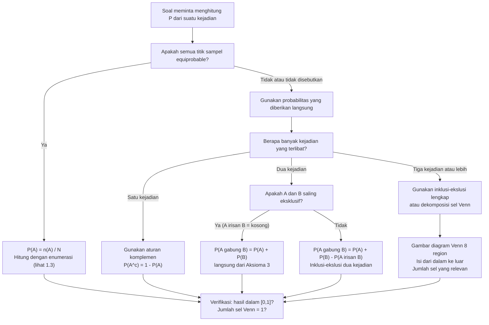

# 📊 1.2 — Aksioma dan Perhitungan Probabilitas

> [!ABSTRACT] Ringkasan Cepat
> **Topik:** Aksioma dan Perhitungan Probabilitas | **Bobot:** ~15–25% | **Difficulty:** Easy
> **Ref:** Hogg-Tanis-Zimm (2015) Bab 1.1–1.2; Miller et al. (2014) Bab 2.1–2.3 | **Prereq:** [[1.1 Eksperimen Acak dan Ruang Sampel]]

## Section 0 — Pemetaan Topik

| Topik CF2 | Sub-topik ID | Skill Diuji | Bobot | Difficulty | Prerequisite | Connected Topics | Referensi |
|-----------|--------------|-------------|-------|------------|--------------|------------------|-----------|
| Topik 1: Dasar-Dasar Probabilitas | 1.2 | Menyatakan dan menerapkan tiga aksioma Kolmogorov; menurunkan sifat-sifat probabilitas dari aksioma; menghitung $P(A^c)$, $P(A \cup B)$, $P(A \setminus B)$; menerapkan prinsip inklusi-ekslusi untuk dua dan tiga kejadian; menentukan probabilitas dari ruang sampel seragam (*equally likely outcomes*); menginterpretasikan frekuensi relatif sebagai estimasi probabilitas | 15–25% | Easy | [[1.1 Eksperimen Acak dan Ruang Sampel]] | [[1.3 Metode Enumerasi]], [[1.4 Probabilitas Bersyarat]], [[1.5 Kejadian Independen]], [[1.6 Teorema Bayes dan Hukum Probabilitas Total]], [[2.1 Variabel Acak Diskrit]] | Hogg-Tanis-Zimm (2015) Bab 1.1–1.2; Miller et al. (2014) Bab 2.1–2.3 |

## Section 1 — Intuisi

Ketika seseorang berkata "peluang hujan besok 70%", apa yang sesungguhnya ia maksud? Apakah probabilitas adalah frekuensi relatif dari kejadian serupa di masa lalu? Apakah ia mencerminkan derajat keyakinan subjektif? Perdebatan filosofis ini sudah berlangsung berabad-abad. Andrei Kolmogorov pada tahun 1933 mengakhiri kebingungan tersebut dengan cara yang elegan: ia tidak mendefinisikan *apa itu* probabilitas secara filosofis, melainkan menentukan *aturan perilaku* yang harus dipatuhi oleh bilangan manapun yang ingin kita sebut sebagai "probabilitas". Tiga aturan sederhana — yang kini dikenal sebagai **aksioma Kolmogorov** — ternyata cukup untuk menurunkan seluruh teori probabilitas modern yang digunakan aktuaris setiap harinya.

Intuisi di balik ketiga aksioma itu sangat natural. Pertama, probabilitas tidak boleh negatif — tidak ada makna "peluang $-20\%$". Kedua, sesuatu pasti terjadi dari antara semua kemungkinan yang ada, sehingga probabilitas total seluruh ruang sampel adalah 1 (atau 100%). Ketiga, jika dua kejadian tidak bisa terjadi bersamaan (*mutually exclusive*), probabilitas salah satunya terjadi adalah jumlah dari probabilitas masing-masing. Ketiga aksioma ini terdengar sederhana, bahkan trivial — namun dari ketiganya saja, semua rumus probabilitas yang lebih kompleks dapat *diturunkan* secara matematis, bukan sekadar "diasumsikan benar".

Dalam praktik aktuaria, pemahaman mendalam tentang aturan perhitungan probabilitas ini sangat kritis. Seorang aktuaris yang menghitung probabilitas bahwa polis asuransi jiwa atau kesehatan terklaim dalam setahun harus mahir menggabungkan probabilitas dari kejadian-kejadian yang mungkin tumpang tindih tanpa melakukan *double-counting*. Prinsip **inklusi-ekslusi** — yang merupakan turunan langsung dari aksioma — adalah alat utama untuk ini. Kesalahan kecil dalam menerapkan prinsip ini bisa menghasilkan estimasi premi yang meleset secara sistematis.

## Section 2 — Definisi Formal

> [!NOTE] Definisi Matematis — Aksioma Kolmogorov
> Misalkan $\Omega$ adalah ruang sampel dari suatu eksperimen acak. Suatu **fungsi probabilitas** $P$ adalah fungsi yang memetakan setiap kejadian $A \subseteq \Omega$ ke bilangan real, yang memenuhi tiga aksioma berikut:
>
> **Aksioma 1 (Non-negatif):**
> $$P(A) \geq 0 \quad \text{untuk setiap kejadian } A \subseteq \Omega$$
>
> **Aksioma 2 (Normalisasi):**
> $$P(\Omega) = 1$$
>
> **Aksioma 3 (Aditivitas untuk Mutually Exclusive):**
> $$\text{Jika } A \cap B = \emptyset, \text{ maka } P(A \cup B) = P(A) + P(B)$$
>
> Untuk koleksi kejadian saling eksklusif yang terhitung banyaknya $\{A_1, A_2, A_3, \ldots\}$ dengan $A_i \cap A_j = \emptyset$ untuk $i \neq j$:
> $$P\!\left(\bigcup_{i=1}^{\infty} A_i\right) = \sum_{i=1}^{\infty} P(A_i)$$

### Variabel & Parameter

| Simbol | Makna | Catatan |
|--------|-------|---------|
| $P(A)$ | Probabilitas kejadian $A$ | Bilangan real dalam $[0, 1]$ |
| $\Omega$ | Ruang sampel (certain event) | $P(\Omega) = 1$ selalu |
| $\emptyset$ | Kejadian mustahil (impossible event) | $P(\emptyset) = 0$ selalu |
| $A^c$ | Komplemen $A$ | $P(A^c) = 1 - P(A)$ |
| $A \cup B$ | Union $A$ dan $B$ | $P(A \cup B) = P(A) + P(B) - P(A \cap B)$ |
| $A \cap B$ | Interseksi $A$ dan $B$ | $P(A \cap B) \leq \min\{P(A), P(B)\}$ |
| $A \setminus B$ | Selisih: $A$ terjadi, $B$ tidak | $P(A \setminus B) = P(A) - P(A \cap B)$ |
| $n(A)$ | Kardinalitas kejadian $A$ (jumlah elemen) | Untuk ruang sampel diskrit hingga |
| $N = n(\Omega)$ | Jumlah total titik sampel | Untuk model *equally likely outcomes* |

### Rumus Utama

$$
P(A^c) = 1 - P(A)
$$
**Label: Aturan Komplemen** — diturunkan dari Aksioma 2 dan 3; salah satu rumus paling sering digunakan di CF2 karena menghitung $P(A^c)$ seringkali lebih mudah daripada $P(A)$ langsung.

$$
P(\emptyset) = 0
$$
**Label: Probabilitas Kejadian Mustahil** — diturunkan dari $P(\Omega) = P(\Omega \cup \emptyset) = P(\Omega) + P(\emptyset)$, sehingga $P(\emptyset) = 0$.

$$
P(A \cup B) = P(A) + P(B) - P(A \cap B)
$$
**Label: Prinsip Inklusi-Ekslusi untuk Dua Kejadian** — berlaku untuk *semua* pasangan kejadian; Aksioma 3 adalah kasus khusus ketika $P(A \cap B) = 0$.

$$
P(A \cup B \cup C) = P(A) + P(B) + P(C) - P(A \cap B) - P(A \cap C) - P(B \cap C) + P(A \cap B \cap C)
$$
**Label: Prinsip Inklusi-Ekslusi untuk Tiga Kejadian** — pola berganti tanda: tambah individual, kurang pasangan, tambah kembali tripel.

$$
P(A \setminus B) = P(A \cap B^c) = P(A) - P(A \cap B)
$$
**Label: Probabilitas Selisih Kejadian** — $A$ terjadi tetapi $B$ tidak; berguna ketika $A \subseteq B$ (maka $P(A \setminus B) = 0$) atau sebaliknya.

$$
\text{Jika } A \subseteq B, \text{ maka } P(A) \leq P(B)
$$
**Label: Monotonisitas Probabilitas** — kejadian yang lebih "kecil" (sebagai himpunan) memiliki probabilitas tidak lebih besar; diturunkan dari Aksioma 1 dan 3.

$$
P(A) = \frac{n(A)}{N} = \frac{\text{jumlah outcomes di }A}{\text{jumlah total outcomes}}
$$
**Label: Model Ruang Sampel Seragam (*Classical/Equally Likely*)** — berlaku hanya jika setiap titik sampel memiliki probabilitas yang sama; memerlukan [[1.3 Metode Enumerasi]] untuk menghitung $n(A)$ dan $N$.

### Asumsi Eksplisit

- **Aksioma 3 (versi terhitung tak hingga):** Versi lengkap aksioma aditivitas berlaku untuk *countably infinite* banyak kejadian saling eksklusif. Ini mensyaratkan $\sigma$-aditivitas (*countable additivity*), yang merupakan asumsi lebih kuat dari aditivitas hingga saja. `[BEYOND CF2 — diasumsikan terpenuhi]`
- **Model equally likely:** Rumus $P(A) = n(A)/N$ hanya valid jika **semua titik sampel equiprobable** — asumsi ini harus diverifikasi dari konteks soal, tidak boleh diasumsikan secara default.
- **Fungsi probabilitas terdefinisi untuk semua kejadian yang relevan:** Di CF2, diasumsikan bahwa $P(A)$ selalu terdefinisi untuk semua kejadian yang dibicarakan dalam soal.

## Section 3 — Jembatan Logika

> [!TIP] Dari Definisi ke Rumus
> Semua sifat dan rumus probabilitas di topik ini adalah **teorema yang diturunkan dari tiga aksioma** — bukan aturan tambahan yang harus dihafal secara terpisah. Memahami rantai derivasi ini penting karena: (1) membantu mengingat rumus dengan benar karena ada alasan logisnya, dan (2) memungkinkan kita memverifikasi rumus yang ragu di tengah ujian dari prinsip pertama. Aturan komplemen misalnya: karena $A$ dan $A^c$ saling eksklusif (Aksioma 3) dan $A \cup A^c = \Omega$ (Aksioma 2), maka $P(A) + P(A^c) = P(\Omega) = 1$. Tidak ada yang perlu "dihafal" — cukup ikuti logikanya.

> [!IMPORTANT] Support dan Domain
> - $P(A) \in [0, 1]$ untuk setiap kejadian $A$ — ini adalah **konsekuensi** aksioma, bukan aksioma itu sendiri.
> - Fungsi probabilitas $P$ bukan didefinisikan pada titik sampel $\omega$, melainkan pada **kejadian** (himpunan bagian dari $\Omega$). Untuk ruang sampel diskrit dengan titik sampel equiprobable, $P(\{\omega\}) = 1/N$ untuk setiap $\omega$.
> - Pada ruang sampel kontinu, $P(\{\omega\}) = 0$ untuk setiap titik tunggal $\omega$ — probabilitas hanya bermakna untuk interval atau himpunan yang memiliki "ukuran" positif.

**Derivasi Aturan Komplemen dari Aksioma:**

$$
\Omega = A \cup A^c \quad \text{dan} \quad A \cap A^c = \emptyset
$$

Terapkan Aksioma 3 (karena $A \cap A^c = \emptyset$):

$$
P(\Omega) = P(A \cup A^c) = P(A) + P(A^c)
$$

Terapkan Aksioma 2 ($P(\Omega) = 1$):

$$
1 = P(A) + P(A^c) \implies \boxed{P(A^c) = 1 - P(A)} \quad \blacksquare
$$

**Derivasi Prinsip Inklusi-Ekslusi dari Aksioma:**

Partisi $A \cup B$ menjadi tiga bagian saling eksklusif (lihat [[1.1 Eksperimen Acak dan Ruang Sampel]]):

$$
A \cup B = (A \cap B^c) \cup (A \cap B) \cup (A^c \cap B)
$$

Terapkan Aksioma 3 tiga kali:

$$
P(A \cup B) = P(A \cap B^c) + P(A \cap B) + P(A^c \cap B) \quad \cdots (*)
$$

Partisi $A = (A \cap B^c) \cup (A \cap B)$ dan $B = (A^c \cap B) \cup (A \cap B)$, keduanya saling eksklusif:

$$
P(A) = P(A \cap B^c) + P(A \cap B) \implies P(A \cap B^c) = P(A) - P(A \cap B)
$$

$$
P(B) = P(A^c \cap B) + P(A \cap B) \implies P(A^c \cap B) = P(B) - P(A \cap B)
$$

Substitusikan ke $(*)$:

$$
P(A \cup B) = \bigl[P(A) - P(A \cap B)\bigr] + P(A \cap B) + \bigl[P(B) - P(A \cap B)\bigr]
$$

$$
\boxed{P(A \cup B) = P(A) + P(B) - P(A \cap B)} \quad \blacksquare
$$

**Batas Probabilitas (Boole's Inequality / Union Bound):** `[ADVANCED — berguna untuk intuisi]`

Untuk kejadian $A_1, A_2, \ldots, A_n$ yang *tidak* harus saling eksklusif:

$$
P\!\left(\bigcup_{i=1}^n A_i\right) \leq \sum_{i=1}^n P(A_i)
$$

Ini adalah batas atas yang berguna ketika $P(A_i \cap A_j)$ sulit dihitung.

> [!DANGER] Dilarang
> 1. **Dilarang menjumlahkan probabilitas kejadian yang tidak saling eksklusif** tanpa mengurangi probabilitas interseksinya. $P(A \cup B) = P(A) + P(B)$ hanya benar jika $A \cap B = \emptyset$; dalam kasus umum, double-counting harus dikurangi via inklusi-ekslusi.
> 2. **Dilarang menggunakan model equally likely** $P(A) = n(A)/N$ **tanpa memverifikasi bahwa semua titik sampel equiprobable.** Pada banyak soal CF2, titik-titik sampel memiliki probabilitas berbeda (misalnya, kartu yang diambil dari dua dek berbeda ukuran) — formula ini tidak berlaku.
> 3. **Dilarang menulis $P(A) > 1$ atau $P(A) < 0$** dalam jawaban apapun. Jika hasil perhitungan menunjukkan ini, ada kesalahan di suatu langkah sebelumnya — wajib diperiksa ulang sebelum lanjut.

## Section 4 — Contoh Soal

### Soal A — Fundamental

Dalam sebuah survei terhadap 200 nasabah asuransi, diketahui: 120 nasabah memiliki polis jiwa (kejadian $J$), 90 nasabah memiliki polis kesehatan (kejadian $K$), dan 50 nasabah memiliki keduanya. Satu nasabah dipilih secara acak. Tentukan: (a) $P(J)$, (b) $P(K)$, (c) $P(J \cap K)$, (d) $P(J \cup K)$, (e) $P(J^c \cap K^c)$, (f) $P(J \cap K^c)$.

> [!SUCCESS] Solusi Soal A
>
> **1. Identifikasi Variabel**
> - Total nasabah: $N = 200$
> - $n(J) = 120$, $n(K) = 90$, $n(J \cap K) = 50$
> - Model: ruang sampel seragam (satu nasabah dipilih acak, semua equiprobable)
>
> **2. Identifikasi Distribusi / Model**
> - Ruang sampel diskrit hingga, equally likely outcomes
> - $P(A) = n(A)/N$ berlaku langsung
>
> **3. Setup Persamaan**
>
> $$
> P(A) = \frac{n(A)}{200} \quad \text{untuk setiap kejadian } A
> $$
>
> **4. Eksekusi Aljabar**
>
> (a) $P(J) = \dfrac{120}{200} = 0.6$
>
> (b) $P(K) = \dfrac{90}{200} = 0.45$
>
> (c) $P(J \cap K) = \dfrac{50}{200} = 0.25$
>
> (d) Inklusi-ekslusi:
> $$
> P(J \cup K) = P(J) + P(K) - P(J \cap K) = 0.6 + 0.45 - 0.25 = 0.80
> $$
>
> (e) De Morgan: $J^c \cap K^c = (J \cup K)^c$
> $$
> P(J^c \cap K^c) = 1 - P(J \cup K) = 1 - 0.80 = 0.20
> $$
>
> (f) $J \cap K^c$: punya jiwa tetapi tidak punya kesehatan
> $$
> P(J \cap K^c) = P(J) - P(J \cap K) = 0.6 - 0.25 = 0.35
> $$
>
> **5. Verification**
>
> Partisi $\Omega$ menjadi empat sel saling eksklusif:
>
> | Sel | Himpunan | Probabilitas |
> |-----|----------|-------------|
> | Keduanya | $J \cap K$ | $0.25$ |
> | Hanya $J$ | $J \cap K^c$ | $0.35$ |
> | Hanya $K$ | $J^c \cap K$ | $P(K) - P(J \cap K) = 0.45 - 0.25 = 0.20$ |
> | Tidak keduanya | $J^c \cap K^c$ | $0.20$ |
> | **Total** | $\Omega$ | $0.25 + 0.35 + 0.20 + 0.20 = \mathbf{1.00}$ $\checkmark$ |

> [!WARNING] Exam Tips — Soal A
> - **Target waktu:** 6–8 menit.
> - **Common trap:** Menghitung $P(J \cup K) = P(J) + P(K) = 0.6 + 0.45 = 1.05$ — melupakan pengurangan $P(J \cap K)$. Hasil $> 1$ adalah sinyal pasti ada kesalahan.
> - **Shortcut verifikasi:** Setelah menghitung empat sel Venn, jumlahkan — harus tepat 1. Ini adalah sanity check paling cepat dan paling andal untuk soal tipe ini.
> - **Shortcut (e):** Langsung kenali $J^c \cap K^c = (J \cup K)^c$ via De Morgan, lalu gunakan aturan komplemen. Ini jauh lebih cepat daripada menghitung $P(J^c \cap K^c)$ dari $n(J^c \cap K^c)/200$.

### Soal B — Exam-Typical

Sebuah perusahaan reasuransi menganalisis portofolionya. Diketahui probabilitas suatu polis mengalami klaim kebakaran adalah $P(F) = 0.15$, klaim banjir $P(B) = 0.10$, dan klaim angin topan $P(T) = 0.08$. Probabilitas klaim kebakaran **dan** banjir adalah $P(F \cap B) = 0.04$, klaim kebakaran **dan** angin adalah $P(F \cap T) = 0.03$, serta klaim banjir **dan** angin adalah $P(B \cap T) = 0.02$. Probabilitas ketiga klaim terjadi sekaligus adalah $P(F \cap B \cap T) = 0.01$.

Tentukan: (a) $P(F \cup B \cup T)$, (b) $P\bigl((F \cup B \cup T)^c\bigr)$, (c) $P(F \cap B^c \cap T^c)$, (d) probabilitas polis mengalami **tepat satu** jenis klaim.

> [!SUCCESS] Solusi Soal B
>
> **1. Identifikasi Variabel**
> - $P(F) = 0.15$, $P(B) = 0.10$, $P(T) = 0.08$
> - $P(F \cap B) = 0.04$, $P(F \cap T) = 0.03$, $P(B \cap T) = 0.02$
> - $P(F \cap B \cap T) = 0.01$
>
> **2. Identifikasi Distribusi / Model**
> - Probabilitas diberikan langsung (tidak perlu model equally likely)
> - Gunakan inklusi-ekslusi tiga kejadian dan dekomposisi partisi sel Venn
>
> **3. Setup Persamaan**
>
> $$
> P(F \cup B \cup T) = P(F) + P(B) + P(T) - P(F \cap B) - P(F \cap T) - P(B \cap T) + P(F \cap B \cap T)
> $$
>
> **4. Eksekusi Aljabar**
>
> (a) Inklusi-ekslusi tiga kejadian:
>
> $$
> P(F \cup B \cup T) = 0.15 + 0.10 + 0.08 - 0.04 - 0.03 - 0.02 + 0.01 = 0.25
> $$
>
> (b) Komplemen:
> $$
> P\bigl((F \cup B \cup T)^c\bigr) = 1 - 0.25 = 0.75
> $$
>
> (c) Hanya klaim kebakaran (tanpa banjir dan angin):
> $$
> P(F \cap B^c \cap T^c) = P(F) - P(F \cap B) - P(F \cap T) + P(F \cap B \cap T)
> $$
> $$
> = 0.15 - 0.04 - 0.03 + 0.01 = 0.09
> $$
>
> (d) Hitung semua sel dari diagram Venn tiga kejadian:
>
> | Sel | Rumus | Nilai |
> |-----|-------|-------|
> | Hanya $F$: $F \cap B^c \cap T^c$ | $P(F) - P(F \cap B) - P(F \cap T) + P(F \cap B \cap T)$ | $0.15 - 0.04 - 0.03 + 0.01 = 0.09$ |
> | Hanya $B$: $F^c \cap B \cap T^c$ | $P(B) - P(F \cap B) - P(B \cap T) + P(F \cap B \cap T)$ | $0.10 - 0.04 - 0.02 + 0.01 = 0.05$ |
> | Hanya $T$: $F^c \cap B^c \cap T$ | $P(T) - P(F \cap T) - P(B \cap T) + P(F \cap B \cap T)$ | $0.08 - 0.03 - 0.02 + 0.01 = 0.04$ |
>
> Probabilitas tepat satu klaim:
> $$
> P(\text{tepat satu}) = 0.09 + 0.05 + 0.04 = 0.18
> $$
>
> **5. Verification**
>
> Hitung semua tujuh sel Venn dan verifikasi totalnya:
>
> | Sel | Nilai |
> |-----|-------|
> | Hanya $F$ | $0.09$ |
> | Hanya $B$ | $0.05$ |
> | Hanya $T$ | $0.04$ |
> | $F \cap B$ saja (tanpa $T$): $P(F \cap B) - P(F \cap B \cap T) = 0.04 - 0.01$ | $0.03$ |
> | $F \cap T$ saja (tanpa $B$): $0.03 - 0.01$ | $0.02$ |
> | $B \cap T$ saja (tanpa $F$): $0.02 - 0.01$ | $0.01$ |
> | $F \cap B \cap T$ | $0.01$ |
> | Tidak ada klaim: $(F \cup B \cup T)^c$ | $0.75$ |
> | **Total** | $0.09+0.05+0.04+0.03+0.02+0.01+0.01+0.75 = \mathbf{1.00}$ $\checkmark$ |

> [!WARNING] Exam Tips — Soal B
> - **Target waktu:** 12–15 menit.
> - **Common trap terbesar:** Menghitung sel "hanya $F$" sebagai $P(F) - P(F \cap B) - P(F \cap T)$ tanpa menambahkan kembali $P(F \cap B \cap T)$. Ini adalah kesalahan inklusi-ekslusi berlapis — $P(F \cap B \cap T)$ dikurangi dua kali (sekali dalam $P(F \cap B)$, sekali dalam $P(F \cap T)$), sehingga harus ditambah kembali satu kali.
> - **Strategi:** Untuk soal tiga kejadian, **selalu gambar diagram Venn dengan 8 region** dan isi dari dalam ke luar (mulai dari $F \cap B \cap T$, lalu irisan dua-dua, lalu yang hanya satu, lalu sisanya). Ini mencegah hampir semua kesalahan double-counting.
> - **Hafal pola:** Inklusi-ekslusi selalu berganti tanda: $+ \text{individual} - \text{pasangan} + \text{tripel} - \text{kuadrupel} + \ldots$

### Soal C — Challenging

Misalkan $P(A) = 0.5$, $P(B) = 0.4$, dan $P(A \cup B) = 0.7$.

(a) Tentukan $P(A \cap B)$.

(b) Tentukan $P(A^c \cup B^c)$.

(c) Tentukan $P(A^c \cap B)$.

(d) Apakah mungkin $P(A \cup B) = 0.95$ jika $P(A) = 0.5$ dan $P(B) = 0.4$? Jika ya, tentukan $P(A \cap B)$-nya. Jika tidak, jelaskan mengapa tidak dengan mengacu pada aksioma.

(e) Tentukan batas (*bounds*) yang mungkin untuk $P(A \cap B)$ jika hanya diketahui $P(A) = 0.5$ dan $P(B) = 0.4$, tanpa informasi $P(A \cup B)$.

> [!SUCCESS] Solusi Soal C
>
> **1. Identifikasi Variabel**
> - $P(A) = 0.5$, $P(B) = 0.4$, $P(A \cup B) = 0.7$
> - Cari berbagai ekspresi probabilitas dan analisis batas
>
> **2. Identifikasi Distribusi / Model**
> - Probabilitas diberikan langsung; terapkan aksioma dan sifat-sifat turunannya
> - Bagian (e) memerlukan argumen batas (*bounds*) menggunakan aksioma non-negatif dan monotonisitas
>
> **3. Setup Persamaan**
>
> Gunakan: $P(A \cup B) = P(A) + P(B) - P(A \cap B)$
>
> **4. Eksekusi Aljabar**
>
> (a) Dari inklusi-ekslusi:
> $$
> P(A \cap B) = P(A) + P(B) - P(A \cup B) = 0.5 + 0.4 - 0.7 = 0.2
> $$
>
> (b) Terapkan De Morgan: $A^c \cup B^c = (A \cap B)^c$
> $$
> P(A^c \cup B^c) = 1 - P(A \cap B) = 1 - 0.2 = 0.8
> $$
>
> (c) $A^c \cap B$: terjadi $B$ tetapi bukan $A$
> $$
> P(A^c \cap B) = P(B) - P(A \cap B) = 0.4 - 0.2 = 0.2
> $$
>
> (d) Jika $P(A \cup B) = 0.95$:
> $$
> P(A \cap B) = 0.5 + 0.4 - 0.95 = -0.05
> $$
>
> Karena $P(A \cap B) = -0.05 < 0$, ini **melanggar Aksioma 1** ($P \geq 0$ untuk setiap kejadian). Oleh karena itu, $P(A \cup B) = 0.95$ dengan $P(A) = 0.5$ dan $P(B) = 0.4$ adalah **tidak mungkin**.
>
> Secara umum, batas atas $P(A \cup B)$ adalah $P(A) + P(B) = 0.9$ (ketika $A \cap B = \emptyset$), dan batas atas mutlak dari Aksioma 2 adalah 1.
>
> (e) Batas untuk $P(A \cap B)$:
>
> **Batas bawah:** Dari Aksioma 1, $P(A \cap B) \geq 0$. Selain itu, karena $A \cup B \subseteq \Omega$, maka $P(A \cup B) \leq 1$:
> $$
> P(A) + P(B) - P(A \cap B) \leq 1 \implies P(A \cap B) \geq P(A) + P(B) - 1 = 0.5 + 0.4 - 1 = -0.1
> $$
>
> Karena $P(A \cap B) \geq 0$ (Aksioma 1) dan $P(A \cap B) \geq -0.1$ (dari atas), batas bawah yang mengikat adalah:
> $$
> P(A \cap B) \geq \max\{0,\; P(A) + P(B) - 1\} = \max\{0,\; -0.1\} = 0
> $$
>
> **Batas atas:** Karena $A \cap B \subseteq A$ dan $A \cap B \subseteq B$, dari monotonisitas:
> $$
> P(A \cap B) \leq \min\{P(A), P(B)\} = \min\{0.5,\; 0.4\} = 0.4
> $$
>
> Jadi:
> $$
> \boxed{0 \leq P(A \cap B) \leq 0.4}
> $$
>
> **5. Verification**
>
> Cek konsistensi batas: jika $P(A \cap B) = 0$, maka $P(A \cup B) = 0.9 \leq 1$ $\checkmark$. Jika $P(A \cap B) = 0.4$ (artinya $B \subseteq A$), maka $P(A \cup B) = P(A) = 0.5 \geq 0.4 = P(B)$ $\checkmark$.
>
> Cek (d): $P(A) + P(B) = 0.9 < 0.95$, sehingga bahkan dengan $P(A \cap B) = 0$ pun $P(A \cup B)$ maksimal hanya $0.9$ — konfirmasi bahwa $0.95$ mustahil $\checkmark$.

> [!WARNING] Exam Tips — Soal C
> - **Target waktu:** 15–18 menit.
> - **Common trap (d):** Banyak kandidat yang hanya menyatakan "tidak mungkin karena $> 1$" tanpa menjelaskan secara tepat aksioma mana yang dilanggar. Di CF2, justifikasi berbasis aksioma lebih dinilai.
> - **Common trap (e):** Melupakan constraint $P(A \cap B) \geq P(A) + P(B) - 1$ yang berasal dari $P(A \cup B) \leq 1$. Batas ini dikenal sebagai **Fréchet lower bound** dan sangat sering muncul dalam soal batas probabilitas. `[ADVANCED — label untuk referensi]`
> - **Pola soal (e):** Kapanpun soal menanya "batas yang mungkin untuk $P(A \cap B)$", gunakan dua constraint: (i) $P(A \cap B) \geq 0$, (ii) $P(A \cap B) \geq P(A) + P(B) - 1$, (iii) $P(A \cap B) \leq P(A)$, (iv) $P(A \cap B) \leq P(B)$.

## Section 5 — Verifikasi & Sanity Check

> [!CHECK] Validasi Fungsi Probabilitas
> Setiap solusi harus memenuhi:
> 1. $0 \leq P(A) \leq 1$ untuk setiap kejadian $A$ — jika ada yang keluar dari $[0,1]$, ada kesalahan.
> 2. Jumlah probabilitas semua sel partisi Venn harus tepat $= 1$.
> 3. $P(A \cup B) \geq \max\{P(A), P(B)\}$ — union tidak boleh lebih kecil dari anggotanya.
> 4. $P(A \cap B) \leq \min\{P(A), P(B)\}$ — interseksi tidak boleh lebih besar dari anggotanya.

> [!CHECK] Verifikasi Inklusi-Ekslusi
> 1. Untuk dua kejadian: $P(A \cup B) = P(A) + P(B) - P(A \cap B)$ harus menghasilkan nilai $\in [0,1]$.
> 2. Untuk tiga kejadian: jumlah semua delapan sel Venn ($2^3 = 8$ region) harus tepat $= 1$.
> 3. Jika $A$ dan $B$ saling eksklusif, $P(A \cap B) = 0$ sehingga $P(A \cup B) = P(A) + P(B) \leq 1$ wajib terpenuhi.

> [!CHECK] Verifikasi Model Equally Likely
> 1. Pastikan konteks soal menyatakan atau menyiratkan bahwa semua titik sampel memiliki probabilitas sama (e.g., "dipilih secara acak", "dadu adil", "kartu dikocok").
> 2. $P(A) = n(A)/N$ memberikan $P(\Omega) = N/N = 1$ $\checkmark$ dan $P(A) \geq 0$ karena $n(A) \geq 0$ $\checkmark$.

### Metode Alternatif

Untuk soal yang melibatkan **tiga kejadian**, ada dua strategi ekivalen:

**Strategi 1 — Formula Langsung (Inklusi-Ekslusi):**
$$
P(A \cup B \cup C) = P(A) + P(B) + P(C) - P(A \cap B) - P(A \cap C) - P(B \cap C) + P(A \cap B \cap C)
$$

**Strategi 2 — Dekomposisi Sel Venn (lebih visual, lebih aman untuk soal multi-bagian):**

Isi diagram Venn dari dalam ke luar dengan tujuh nilai:

$$
p_7 = P(A \cap B \cap C)
$$
$$
p_4 = P(A \cap B) - p_7, \quad p_5 = P(A \cap C) - p_7, \quad p_6 = P(B \cap C) - p_7
$$
$$
p_1 = P(A) - p_4 - p_5 - p_7, \quad p_2 = P(B) - p_4 - p_6 - p_7, \quad p_3 = P(C) - p_5 - p_6 - p_7
$$
$$
p_0 = 1 - (p_1 + p_2 + p_3 + p_4 + p_5 + p_6 + p_7)
$$

Setiap pertanyaan kemudian dijawab dengan menjumlahkan sel-sel yang relevan.

## Section 6 — Visualisasi Mental

**Diagram Venn sebagai "Neraca Probabilitas":**

Bayangkan ruang sampel $\Omega$ sebagai kotak dengan total luas = 1 (mewakili probabilitas 1). Setiap kejadian $A$ adalah suatu daerah di dalam kotak — luasnya proporsional dengan $P(A)$. Dua lingkaran yang tumpang tindih untuk $A$ dan $B$ membagi kotak menjadi empat daerah:

- **Hanya $A$** (luas = $P(A \cap B^c)$): bagian lingkaran $A$ yang tidak tumpang tindih dengan $B$.
- **Tumpang tindih** (luas = $P(A \cap B)$): area irisan kedua lingkaran.
- **Hanya $B$** (luas = $P(A^c \cap B)$): bagian lingkaran $B$ yang tidak tumpang tindih dengan $A$.
- **Di luar keduanya** (luas = $P(A^c \cap B^c)$): sisa kotak.

**Mengapa inklusi-ekslusi benar secara visual:** Ketika kita menjumlahkan luas lingkaran $A$ dan luas lingkaran $B$, area tumpang tindih dihitung **dua kali**. Mengurangi $P(A \cap B)$ satu kali mengkoreksi double-counting ini, menghasilkan luas $A \cup B$ yang tepat.

**Aturan Komplemen secara Visual:**

$A^c$ adalah segala sesuatu di kotak yang **bukan** di lingkaran $A$. Karena total luas kotak = 1:

$$
\text{Luas}(A) + \text{Luas}(A^c) = 1 \implies P(A) + P(A^c) = 1
$$

### Hubungan Visual ↔ Rumus

Setiap **area yang bisa diberi warna di diagram Venn** berkorespondensi tepat dengan satu ekspresi himpunan dan satu rumus probabilitas:

$$
\text{Luas tumpang tindih} = P(A \cap B) \longleftrightarrow \text{bagian yang dikurangi dalam inklusi-ekslusi}
$$

$$
\text{Total luas dua lingkaran} - \text{tumpang tindih} = P(A \cup B) \longleftrightarrow P(A) + P(B) - P(A \cap B)
$$

$$
\text{Luar kotak minus dua lingkaran} = P\bigl((A \cup B)^c\bigr) = 1 - P(A \cup B)
$$

## Section 7 — Jebakan Umum

> [!BUG] Kesalahan Parametrisasi
> **Kesalahan 1 — $P(A \cup B) = P(A) + P(B)$ tanpa syarat:** Formula ini hanya benar jika $A \cap B = \emptyset$. Tanpa kondisi ini, harus menggunakan inklusi-ekslusi lengkap.
>
> **Salah:** $P(J \cup K) = P(J) + P(K) = 0.6 + 0.45 = 1.05$
>
> **Benar:** $P(J \cup K) = P(J) + P(K) - P(J \cap K) = 0.6 + 0.45 - 0.25 = 0.80$

> [!BUG] Kesalahan Konseptual
> 1. **Menggunakan $P(A) = n(A)/N$ untuk ruang sampel yang tidak equiprobable.** Misalnya, jika dua koin dilempar — satu koin adil dan satu koin bias — maka $P(\{HH\}) \neq P(\{HT\}) \neq P(\{TH\}) \neq P(\{TT\})$ dan formula klasik tidak berlaku.
> 2. **Mengira aksioma aditivitas berlaku tanpa syarat mutually exclusive.** Aksioma 3 hanya berlaku untuk $A \cap B = \emptyset$; untuk kasus umum, wajib gunakan inklusi-ekslusi.
> 3. **Tidak menggunakan aturan komplemen saat lebih efisien.** Jika soal meminta $P(A^c)$ dan $P(A)$ mudah dihitung, jangan hitung $P(A^c)$ secara langsung — gunakan $1 - P(A)$.
> 4. **Lupa tanda positif di inklusi-ekslusi tiga kejadian.** Rumus tiga kejadian memiliki tanda: $+P(A)+P(B)+P(C)-P(A\cap B)-P(A\cap C)-P(B\cap C)+P(A\cap B\cap C)$. Tanda $+$ di suku terakhir sering dilupakan atau dibalik.

> [!BUG] Kesalahan Interpretasi Soal
> - **"Paling tidak satu dari $A$, $B$, $C$ terjadi"** $\leftrightarrow$ $P(A \cup B \cup C)$ — gunakan inklusi-ekslusi tiga kejadian.
> - **"Tidak satupun terjadi"** $\leftrightarrow$ $P(A^c \cap B^c \cap C^c) = P\bigl((A \cup B \cup C)^c\bigr) = 1 - P(A \cup B \cup C)$.
> - **"Tepat satu terjadi"** $\leftrightarrow$ jumlah sel "hanya $A$", "hanya $B$", "hanya $C$" dari diagram Venn — **bukan** $P(A) + P(B) + P(C)$.
> - **"Paling banyak satu terjadi"** $\leftrightarrow$ P(tepat satu) + P(tidak satupun) — sering dikira sama dengan "tepat satu".

> [!CAUTION] Red Flags
> - **Hasil $P > 1$ atau $P < 0$:** Pasti ada kesalahan; wajib periksa ulang sebelum lanjut.
> - **Soal memberikan banyak probabilitas interseksi tanpa menyebut "mutually exclusive":** Wajib gunakan inklusi-ekslusi penuh; jangan pernah langsung menjumlahkan.
> - **"Dipilih secara acak" dalam soal:** Ini adalah sinyal model equally likely — $P(A) = n(A)/N$ berlaku; siapkan untuk menggunakan teknik enumerasi [[1.3 Metode Enumerasi]].
> - **Soal meminta probabilitas "tepat $k$" kejadian dari beberapa kejadian:** Harus hitung sel-sel Venn yang bersesuaian, bukan gunakan formula inklusi-ekslusi langsung.

## Section 8 — Ringkasan Eksekutif

> [!SUMMARY] Must-Remember
> 1. **Tiga Aksioma Kolmogorov:**
>    $$P(A) \geq 0; \quad P(\Omega) = 1; \quad P(A \cup B) = P(A) + P(B) \text{ jika } A \cap B = \emptyset$$
> 2. **Aturan Komplemen:**
>    $$P(A^c) = 1 - P(A)$$
> 3. **Inklusi-Ekslusi dua kejadian:**
>    $$P(A \cup B) = P(A) + P(B) - P(A \cap B)$$
> 4. **Inklusi-Ekslusi tiga kejadian:**
>    $$P(A \cup B \cup C) = P(A)+P(B)+P(C)-P(A\cap B)-P(A\cap C)-P(B\cap C)+P(A\cap B\cap C)$$
> 5. **Batas $P(A \cap B)$ tanpa informasi tambahan:**
>    $$\max\{0,\; P(A)+P(B)-1\} \leq P(A \cap B) \leq \min\{P(A),\; P(B)\}$$

### Kapan Digunakan

- **Trigger keywords:** "probabilitas", "peluang", "berapa kemungkinan", "paling tidak satu", "tidak satupun", "keduanya", "tepat satu", "dipilih acak".
- **Tipe skenario soal:**
  - Diberikan beberapa $P(A)$, $P(B)$, $P(A \cap B)$ — hitung $P(A \cup B)$, $P(A^c)$, $P(A \cap B^c)$, dll.
  - Diberikan data frekuensi (tabel, survei) — hitung probabilitas menggunakan model equally likely.
  - Verifikasi apakah sekumpulan nilai probabilitas konsisten dengan aksioma Kolmogorov.
  - Tentukan batas yang mungkin untuk probabilitas yang tidak diketahui.
  - Hitung probabilitas "tepat $k$" atau "paling tidak $k$" kejadian dari $n$ kejadian.

### Kapan TIDAK Boleh Digunakan

- **Model equally likely $P(A) = n(A)/N$ tidak berlaku** jika titik-titik sampel tidak equiprobable — verifikasi konteks selalu.
- **Inklusi-ekslusi tidak diperlukan** jika kejadian sudah dinyatakan saling eksklusif ($A \cap B = \emptyset$) — Aksioma 3 langsung berlaku tanpa koreksi.
- **Jika melibatkan probabilitas bersyarat:** Beralih ke [[1.4 Probabilitas Bersyarat]] — perhitungan $P(A|B) = P(A \cap B)/P(B)$ adalah domain yang berbeda.

### Quick Decision Tree

---

> [!QUOTE] Follow-up Options
> 1. *"Berikan contoh soal yang menguji batas Fréchet untuk $P(A \cap B)$ dalam konteks portofolio asuransi"*
> 2. *"Jelaskan hubungan [[1.2 Aksioma dan Perhitungan Probabilitas]] dengan [[1.4 Probabilitas Bersyarat]] — bagaimana aksioma menjadi fondasi definisi probabilitas bersyarat"*
> 3. *"Buat flashcard 1-halaman untuk topik ini"*

*📖 Ref: Hogg-Tanis-Zimm (2015) Bab 1.1–1.2; Miller et al. (2014) Bab 2.1–2.3 | 🗓️ 2026-02-21 | #CF2 #Probabilitas #Aksioma #Kolmogorov #InklusiEkslusi #KomplemEn #SifatProbabilitas*
