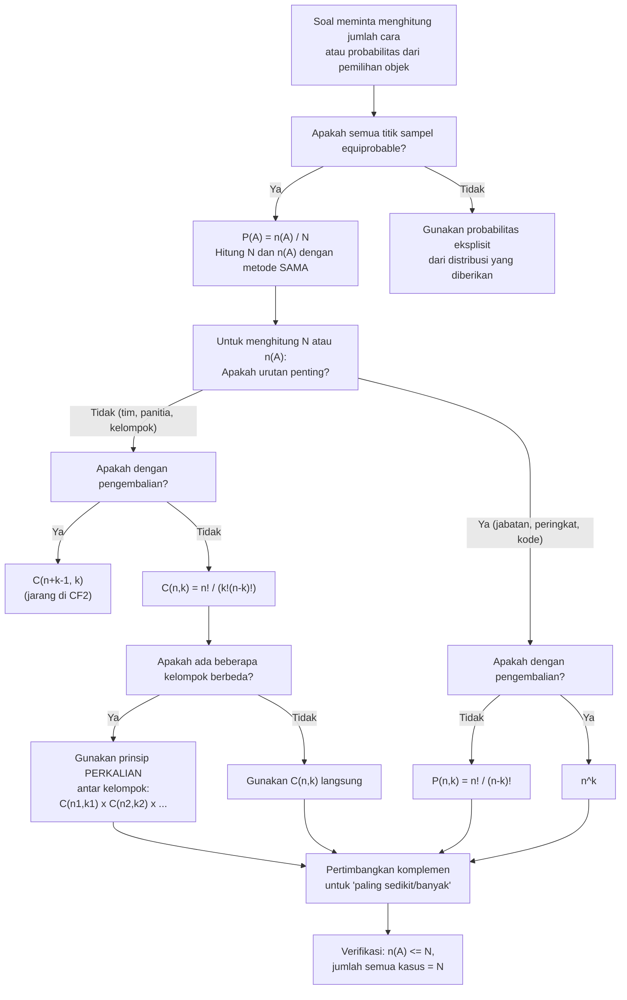

# 📊 1.3 — Metode Enumerasi

> [!ABSTRACT] Ringkasan Cepat
> **Topik:** Metode Enumerasi | **Bobot:** ~15–25% | **Difficulty:** Medium
> **Ref:** Hogg-Tanis-Zimm (2015) Bab 1.3; Miller et al. (2014) Bab 2.4–2.6 | **Prereq:** [[1.1 Eksperimen Acak dan Ruang Sampel]], [[1.2 Aksioma dan Perhitungan Probabilitas]]

## Section 0 — Pemetaan Topik

| Topik CF2 | Sub-topik ID | Skill Diuji | Bobot | Difficulty | Prerequisite | Connected Topics | Referensi |
|-----------|--------------|-------------|-------|------------|--------------|------------------|-----------|
| Topik 1: Dasar-Dasar Probabilitas | 1.3 | Menerapkan prinsip perkalian dan penjumlahan untuk menghitung $\|\Omega\|$ dan $n(A)$; membedakan pengambilan dengan dan tanpa pengembalian; membedakan urutan penting vs tidak penting; menghitung permutasi $P(n,k)$ dan kombinasi $\binom{n}{k}$; menerapkan koefisien multinomial; menghitung probabilitas dari model equally likely menggunakan $P(A) = n(A)/N$ | 15–25% | Medium | [[1.1 Eksperimen Acak dan Ruang Sampel]], [[1.2 Aksioma dan Perhitungan Probabilitas]] | [[1.4 Probabilitas Bersyarat]], [[1.5 Kejadian Independen]], [[2.5 Distribusi Diskrit Umum]] (Binomial, Hipergeometrik) | Hogg-Tanis-Zimm (2015) Bab 1.3; Miller et al. (2014) Bab 2.4–2.6 |

## Section 1 — Intuisi

Misalkan sebuah perusahaan asuransi ingin mengetahui berapa besar kemungkinan bahwa dari 5 nasabah yang dipilih secara acak dari daftar 100 orang, tepat 2 di antaranya pernah mengajukan klaim. Untuk menjawab pertanyaan ini menggunakan rumus $P(A) = n(A)/N$ dari [[1.2 Aksioma dan Perhitungan Probabilitas]], kita perlu menghitung dua angka: $N$ = berapa cara memilih 5 orang dari 100, dan $n(A)$ = berapa cara memilih tepat 2 klaimer dari antara mereka. Kedua angka ini bisa sangat besar — ratusan juta — sehingga mendaftarnya satu per satu tidak praktis. **Metode enumerasi** adalah kumpulan teknik matematika yang memungkinkan kita menghitung $N$ dan $n(A)$ secara sistematis dan efisien tanpa harus mendaftar setiap kemungkinan secara eksplisit.

Kunci dari seluruh metode enumerasi adalah dua prinsip dasar yang terdengar sederhana namun sangat powerful. **Prinsip perkalian**: jika suatu proses terdiri dari beberapa tahap yang independen, jumlah total cara melakukannya adalah hasil kali jumlah cara di setiap tahap. Memilih baju (5 pilihan) lalu memilih celana (3 pilihan) menghasilkan $5 \times 3 = 15$ kombinasi pakaian — kita tidak perlu mendaftar semuanya. **Prinsip penjumlahan**: jika suatu tujuan bisa dicapai melalui beberapa cara yang saling eksklusif, jumlah total caranya adalah jumlah dari masing-masing. Kedua prinsip ini adalah "aksioma" dari kombinatorika, seperti halnya aksioma Kolmogorov adalah fondasi probabilitas.

Yang membuat metode enumerasi menarik sekaligus menantang adalah keharusan mengidentifikasi dengan tepat dua dimensi penting sebelum memilih formula: **apakah urutan objek yang dipilih penting atau tidak?** dan **apakah objek yang sudah dipilih boleh dipilih lagi (dengan pengembalian) atau tidak?** Salah mengidentifikasi kedua dimensi ini adalah sumber kesalahan paling umum di soal CF2. Memilih anggota tim (urutan tidak penting, tanpa pengembalian) membutuhkan formula berbeda dari menyusun kode PIN (urutan penting, tanpa pengembalian) atau melempar dadu beberapa kali (urutan penting, dengan pengembalian).

## Section 2 — Definisi Formal

> [!NOTE] Definisi Matematis
> **Prinsip Perkalian:** Jika suatu eksperimen terdiri dari $k$ tahap yang independen, di mana tahap ke-$i$ memiliki $n_i$ cara yang mungkin ($i = 1, 2, \ldots, k$), maka jumlah total cara melakukan seluruh eksperimen adalah:
> $$
> n_1 \times n_2 \times \cdots \times n_k = \prod_{i=1}^{k} n_i
> $$
>
> **Prinsip Penjumlahan:** Jika suatu tujuan dapat dicapai dengan cara $A_1$ **atau** $A_2$ **atau** $\ldots$ **atau** $A_k$, di mana cara-cara tersebut saling eksklusif (tidak bisa dilakukan bersamaan), maka jumlah total cara mencapai tujuan tersebut adalah:
> $$
> n(A_1) + n(A_2) + \cdots + n(A_k) = \sum_{i=1}^{k} n(A_i)
> $$
>
> **Permutasi** $k$ objek dari $n$ objek berbeda (urutan **penting**, tanpa pengembalian):
> $$
> P(n, k) = \frac{n!}{(n-k)!}, \quad 0 \leq k \leq n
> $$
>
> **Kombinasi** $k$ objek dari $n$ objek berbeda (urutan **tidak penting**, tanpa pengembalian):
> $$
> \binom{n}{k} = \frac{n!}{k!\,(n-k)!}, \quad 0 \leq k \leq n
> $$

### Variabel & Parameter

| Simbol | Makna | Catatan |
|--------|-------|---------|
| $n$ | Jumlah total objek yang tersedia | $n \in \mathbb{Z}^+$ |
| $k$ | Jumlah objek yang dipilih atau disusun | $0 \leq k \leq n$ |
| $n!$ | Faktorial: $n! = n \times (n-1) \times \cdots \times 2 \times 1$ | $0! = 1$ per konvensi |
| $P(n, k)$ | Permutasi: susunan $k$ dari $n$, urutan penting | $P(n,k) = n!/(n-k)!$ |
| $\binom{n}{k}$ | Kombinasi ($n$ pilih $k$): urutan tidak penting | $\binom{n}{k} = n!/[k!(n-k)!]$ |
| $\binom{n}{k_1, k_2, \ldots, k_r}$ | Koefisien multinomial | $n = k_1 + k_2 + \cdots + k_r$ |
| $N$ | Total titik sampel: $\|\Omega\|$ | Denominator dalam $P(A) = n(A)/N$ |
| $n(A)$ | Jumlah titik sampel di kejadian $A$ | Numerator dalam $P(A) = n(A)/N$ |

### Rumus Utama

$$
n! = n \times (n-1) \times (n-2) \times \cdots \times 2 \times 1, \quad 0! = 1
$$
**Label: Faktorial** — jumlah cara menyusun $n$ objek berbeda dalam satu baris; landasan semua formula permutasi dan kombinasi.

$$
P(n, k) = \frac{n!}{(n-k)!} = n(n-1)(n-2)\cdots(n-k+1)
$$
**Label: Permutasi** — memilih $k$ dari $n$ objek di mana **urutan penting** dan **tanpa pengembalian**; ada $k$ faktor berurutan mulai dari $n$.

$$
\binom{n}{k} = \frac{n!}{k!\,(n-k)!} = \frac{P(n,k)}{k!}
$$
**Label: Kombinasi (Koefisien Binomial)** — memilih $k$ dari $n$ objek di mana **urutan tidak penting** dan **tanpa pengembalian**; membagi $P(n,k)$ dengan $k!$ untuk menghilangkan duplikasi urutan.

$$
\binom{n}{k} = \binom{n}{n-k}
$$
**Label: Simetri Kombinasi** — memilih $k$ objek yang masuk ekivalen dengan memilih $n-k$ objek yang tidak masuk.

$$
\binom{n}{k_1, k_2, \ldots, k_r} = \frac{n!}{k_1!\, k_2!\, \cdots\, k_r!}, \quad \sum_{i=1}^r k_i = n
$$
**Label: Koefisien Multinomial** — jumlah cara membagi $n$ objek berbeda ke dalam $r$ kelompok berukuran $k_1, k_2, \ldots, k_r$; generalisasi koefisien binomial untuk $r > 2$ kelompok.

$$
\text{Pengambilan } k \text{ dari } n \textbf{ dengan pengembalian, urutan penting}: \quad n^k
$$
**Label: Sampling Dengan Pengembalian Berurutan** — setiap dari $k$ pengambilan independen memiliki $n$ pilihan; prinsip perkalian langsung.

$$
\binom{n+k-1}{k}
$$
**Label: Sampling Dengan Pengembalian, Urutan Tidak Penting** — jumlah cara memilih $k$ objek dari $n$ jenis dengan pengembalian di mana urutan tidak penting (*multiset coefficient*). `[ADVANCED — jarang diuji langsung di CF2]`

### Asumsi Eksplisit

- **Formula permutasi dan kombinasi standar** mengasumsikan semua objek **berbeda satu sama lain** (*distinguishable*). Jika ada objek yang identik, formula harus dimodifikasi (koefisien multinomial).
- **"Tanpa pengembalian"** berarti objek yang sudah dipilih tidak bisa dipilih lagi; **"dengan pengembalian"** berarti bisa.
- **Model equally likely** ($P(A) = n(A)/N$) diasumsikan berlaku kecuali dinyatakan sebaliknya — semua cara pengambilan memiliki probabilitas yang sama.
- **Koefisien multinomial** mengasumsikan $k_1 + k_2 + \cdots + k_r = n$ tepat (partisi sempurna dari $n$ objek).

## Section 3 — Jembatan Logika

> [!TIP] Dari Definisi ke Rumus
> Hubungan antara permutasi dan kombinasi sangat elegan: $\binom{n}{k} = P(n,k) / k!$. Mengapa dibagi $k!$? Karena ketika urutan tidak penting, setiap kumpulan $k$ objek yang sama dihitung $k!$ kali dalam $P(n,k)$ (satu kali untuk setiap susunan berbeda dari $k$ objek tersebut). Membagi dengan $k!$ menghilangkan duplikasi ini. Analogi sederhana: memilih tim beranggotakan 3 orang dari 10 kandidat berbeda dengan memilih siapa yang menjadi Ketua, Sekretaris, dan Bendahara — dalam kasus tim (urutan tidak penting), kita bagi $P(10,3) = 720$ dengan $3! = 6$, menghasilkan $\binom{10}{3} = 120$ tim berbeda.

> [!IMPORTANT] Support dan Domain
> - $P(n,k)$ dan $\binom{n}{k}$ hanya terdefinisi untuk $k \leq n$ dalam konteks tanpa pengembalian. Jika $k > n$, tidak ada cara memilih $k$ objek berbeda dari $n < k$ objek — hasilnya adalah 0.
> - $\binom{n}{0} = 1$ dan $\binom{n}{n} = 1$ untuk semua $n \geq 0$ — ada tepat satu cara memilih 0 objek (tidak memilih apapun) dan satu cara memilih semua objek.
> - Untuk pengambilan **dengan pengembalian**, tidak ada batasan $k \leq n$ — karena objek bisa diambil berulang kali.

**Derivasi Formula Permutasi dari Prinsip Perkalian:**

Susun $k$ objek dari $n$ objek berbeda secara berurutan (tanpa pengembalian):

- Posisi 1: ada $n$ pilihan
- Posisi 2: sisa $n-1$ pilihan (satu sudah dipakai)
- Posisi 3: sisa $n-2$ pilihan
- $\vdots$
- Posisi $k$: sisa $n-k+1$ pilihan

Terapkan prinsip perkalian:

$$
P(n,k) = n \cdot (n-1) \cdot (n-2) \cdots (n-k+1) = \frac{n!}{(n-k)!} \quad \blacksquare
$$

**Derivasi Formula Kombinasi dari Permutasi:**

Setiap pemilihan $k$ objek (tanpa urutan) dapat disusun dalam $k!$ urutan berbeda. Maka:

$$
\underbrace{P(n,k)}_{\text{semua susunan}} = \underbrace{\binom{n}{k}}_{\text{pilihan tanpa urutan}} \times \underbrace{k!}_{\text{susunan tiap pilihan}}
$$

$$
\implies \binom{n}{k} = \frac{P(n,k)}{k!} = \frac{n!}{k!\,(n-k)!} \quad \blacksquare
$$

**Peta Keputusan Empat Kasus Enumerasi:**

| Urutan Penting? | Pengembalian? | Formula | Contoh |
|-----------------|---------------|---------|--------|
| Ya | Ya | $n^k$ | Kode PIN 4 digit (0–9) |
| Ya | Tidak | $P(n,k) = \dfrac{n!}{(n-k)!}$ | Juara 1, 2, 3 dari $n$ peserta |
| Tidak | Tidak | $\binom{n}{k} = \dfrac{n!}{k!(n-k)!}$ | Pilih $k$ anggota tim dari $n$ kandidat |
| Tidak | Ya | $\binom{n+k-1}{k}$ | Pilih $k$ item dari $n$ jenis di toko `[ADVANCED]` |

**Identitas Kombinatorik Penting:**

$$
\sum_{k=0}^{n} \binom{n}{k} = 2^n
$$
Jumlah semua subset (termasuk kosong dan penuh) dari himpunan $n$ elemen adalah $2^n$; ini adalah teorema binomial dengan $x = y = 1$.

$$
\binom{n}{k} = \binom{n-1}{k-1} + \binom{n-1}{k}
$$
**Identitas Pascal** — dasar dari segitiga Pascal; berguna untuk menghitung $\binom{n}{k}$ secara rekursif tanpa faktorial besar.

> [!DANGER] Dilarang
> 1. **Dilarang menggunakan $\binom{n}{k}$ ketika urutan penting.** Jika soal menanyakan "berapa cara menyusun" atau memilih posisi yang berbeda (ketua, sekretaris, dll.), wajib gunakan $P(n,k)$, bukan $\binom{n}{k}$.
> 2. **Dilarang mengasumsikan "tanpa pengembalian" secara default.** Selalu baca soal dengan cermat: apakah objek dikembalikan setelah dipilih? Pengambilan koin berulang kali adalah "dengan pengembalian"; pemilihan nasabah dari daftar biasanya "tanpa pengembalian".
> 3. **Dilarang menghitung $N$ dan $n(A)$ dengan metode yang berbeda** (misalnya $N$ dihitung dengan memperhatikan urutan tetapi $n(A)$ dihitung tanpa urutan). Konsistensi metode antara pembilang dan penyebut adalah syarat mutlak agar rasio $n(A)/N$ valid.

## Section 4 — Contoh Soal

### Soal A — Fundamental

Sebuah perusahaan asuransi memiliki 8 agen penjualan. Perusahaan ingin membentuk sebuah panitia yang terdiri dari 3 agen untuk menghadiri konferensi nasional. Berapa banyak panitia berbeda yang bisa dibentuk? Jika satu agen bernama Budi pasti harus ikut dalam panitia, berapa banyak pilihan panitia yang tersisa?

> [!SUCCESS] Solusi Soal A
>
> **1. Identifikasi Variabel**
> - Total agen: $n = 8$
> - Ukuran panitia: $k = 3$
> - Pertanyaan (a): semua panitia 3 orang dari 8 agen
> - Pertanyaan (b): Budi sudah fix, pilih 2 dari 7 agen tersisa
>
> **2. Identifikasi Distribusi / Model**
> - Membentuk panitia: **urutan tidak penting** (anggota panitia setara), **tanpa pengembalian** (satu agen tidak bisa menjadi dua anggota) — gunakan kombinasi $\binom{n}{k}$.
>
> **3. Setup Persamaan**
>
> (a) Total panitia:
> $$
> N = \binom{8}{3} = \frac{8!}{3!\,5!}
> $$
>
> (b) Budi sudah terpilih; sisa 2 kursi dari 7 agen lainnya:
> $$
> n(A) = \binom{7}{2} = \frac{7!}{2!\,5!}
> $$
>
> **4. Eksekusi Aljabar**
>
> (a):
> $$
> \binom{8}{3} = \frac{8 \times 7 \times 6}{3 \times 2 \times 1} = \frac{336}{6} = 56
> $$
>
> (b):
> $$
> \binom{7}{2} = \frac{7 \times 6}{2 \times 1} = \frac{42}{2} = 21
> $$
>
> Probabilitas panitia terpilih memuat Budi (jika pemilihan acak equiprobable):
> $$
> P(\text{Budi terpilih}) = \frac{n(A)}{N} = \frac{21}{56} = \frac{3}{8} = 0.375
> $$
>
> **5. Verification**
>
> Cek simetri: $P(\text{Budi terpilih}) = 3/8$ masuk akal karena dari 8 agen, setiap agen memiliki probabilitas $3/8$ masuk panitia berukuran 3 (setiap agen "duduki" $3$ dari $8$ kursi). ✓
>
> Cek alternatif: $\binom{8}{3} = \binom{8}{5} = 56$ (simetri kombinasi, memilih 3 masuk $=$ memilih 5 tidak masuk). ✓
>
> Cek: $P(\text{Budi terpilih}) = k/n = 3/8$ — untuk model equally likely, probabilitas satu individu spesifik masuk dalam sampel ukuran $k$ dari $n$ selalu $k/n$. ✓

> [!WARNING] Exam Tips — Soal A
> - **Target waktu:** 5–7 menit.
> - **Common trap:** Menggunakan permutasi $P(8,3) = 336$ alih-alih $\binom{8}{3} = 56$ karena "lupa" bahwa panitia tidak punya hierarki. Ini menghasilkan $N$ enam kali lebih besar dari seharusnya.
> - **Shortcut:** Untuk menghitung $\binom{n}{k}$ dengan cepat: tulis $k$ faktor menurun dari $n$ di pembilang, dan $k!$ di penyebut. Misalnya $\binom{8}{3} = (8 \times 7 \times 6)/(3 \times 2 \times 1)$. Jangan expand faktorial penuh.
> - **Shortcut probabilitas:** $P(\text{satu individu spesifik masuk sampel acak ukuran } k \text{ dari } n) = k/n$ — hafal pola ini, langsung tanpa hitung.

### Soal B — Exam-Typical

Sebuah kantor cabang asuransi memiliki 5 analis klaim pria dan 4 analis klaim wanita. Manajemen ingin membentuk tim kerja beranggotakan 4 orang. Tentukan probabilitas bahwa tim terpilih terdiri dari: (a) tepat 2 pria dan 2 wanita, (b) paling sedikit 3 pria, (c) semua anggota berjenis kelamin sama.

> [!SUCCESS] Solusi Soal B
>
> **1. Identifikasi Variabel**
> - 5 pria ($P$), 4 wanita ($W$), total $n = 9$
> - Tim berukuran $k = 4$; urutan tidak penting, tanpa pengembalian
> - Total cara memilih tim: $N = \binom{9}{4}$
>
> **2. Identifikasi Distribusi / Model**
> - Model equally likely; gunakan kombinasi untuk menghitung $n(A)$ tiap kasus.
> - Ini adalah situasi sampling hipergeometrik (terhubung ke [[2.5 Distribusi Diskrit Umum]]).
>
> **3. Setup Persamaan**
>
> $$
> N = \binom{9}{4} = \frac{9!}{4!\,5!}
> $$
>
> (a) Tepat 2 pria dan 2 wanita: pilih 2 dari 5 pria DAN 2 dari 4 wanita (prinsip perkalian):
> $$
> n(A_a) = \binom{5}{2} \times \binom{4}{2}
> $$
>
> (b) Paling sedikit 3 pria: tepat 3 pria + tepat 4 pria (prinsip penjumlahan, saling eksklusif):
> $$
> n(A_b) = \binom{5}{3}\binom{4}{1} + \binom{5}{4}\binom{4}{0}
> $$
>
> (c) Semua sama: semua 4 pria ATAU semua 4 wanita:
> $$
> n(A_c) = \binom{5}{4}\binom{4}{0} + \binom{5}{0}\binom{4}{4}
> $$
>
> **4. Eksekusi Aljabar**
>
> $$
> N = \binom{9}{4} = \frac{9 \times 8 \times 7 \times 6}{4 \times 3 \times 2 \times 1} = \frac{3024}{24} = 126
> $$
>
> (a):
> $$
> n(A_a) = \binom{5}{2} \times \binom{4}{2} = 10 \times 6 = 60
> $$
> $$
> P(A_a) = \frac{60}{126} = \frac{10}{21} \approx 0.476
> $$
>
> (b):
> $$
> \binom{5}{3}\binom{4}{1} = 10 \times 4 = 40
> $$
> $$
> \binom{5}{4}\binom{4}{0} = 5 \times 1 = 5
> $$
> $$
> n(A_b) = 40 + 5 = 45, \quad P(A_b) = \frac{45}{126} = \frac{5}{14} \approx 0.357
> $$
>
> (c):
> $$
> \binom{5}{4}\binom{4}{0} = 5 \times 1 = 5, \quad \binom{5}{0}\binom{4}{4} = 1 \times 1 = 1
> $$
> $$
> n(A_c) = 5 + 1 = 6, \quad P(A_c) = \frac{6}{126} = \frac{1}{21} \approx 0.048
> $$
>
> **5. Verification**
>
> Hitung semua kemungkinan komposisi gender (0P+4W, 1P+3W, 2P+2W, 3P+1W, 4P+0W) dan verifikasi total:
>
> | Komposisi | Cara | Nilai |
> |-----------|------|-------|
> | 0P + 4W | $\binom{5}{0}\binom{4}{4}$ | $1$ |
> | 1P + 3W | $\binom{5}{1}\binom{4}{3}$ | $5 \times 4 = 20$ |
> | 2P + 2W | $\binom{5}{2}\binom{4}{2}$ | $10 \times 6 = 60$ |
> | 3P + 1W | $\binom{5}{3}\binom{4}{1}$ | $10 \times 4 = 40$ |
> | 4P + 0W | $\binom{5}{4}\binom{4}{0}$ | $5 \times 1 = 5$ |
> | **Total** | | $1+20+60+40+5 = \mathbf{126}$ $\checkmark$ |

> [!WARNING] Exam Tips — Soal B
> - **Target waktu:** 10–12 menit.
> - **Common trap (b):** Menghitung "paling sedikit 3 pria" sebagai $1 - P(\text{paling banyak 2 pria})$ menggunakan komplemen — valid tapi lebih panjang. Lebih cepat langsung jumlahkan kasus 3P dan 4P.
> - **Common trap:** Menggunakan prinsip penjumlahan untuk (a) padahal seharusnya prinsip perkalian. "2 pria **dan** 2 wanita" berarti dua keputusan yang dilakukan **bersama** (perkalian), bukan dua alternatif yang saling eksklusif (penjumlahan).
> - **Kunci verifikasi:** Tabel semua komposisi gender dengan totalnya harus $= N = 126$. Ini adalah sanity check paling kuat dan hanya butuh 1–2 menit ekstra.

### Soal C — Challenging

Sebuah perusahaan reasuransi memiliki 12 kontrak yang terdiri dari 5 kontrak jenis Properti (P), 4 kontrak jenis Jiwa (J), dan 3 kontrak jenis Marine (M). Seorang auditor memilih 5 kontrak secara acak untuk diperiksa.

(a) Berapa probabilitas tepat 2 kontrak Properti, 2 kontrak Jiwa, dan 1 kontrak Marine terpilih?

(b) Berapa probabilitas paling sedikit 1 kontrak Marine terpilih?

(c) Misalkan dari 5 kontrak yang terpilih, auditor secara acak memilih 2 di antaranya untuk diperiksa secara mendalam (*deep audit*). Jika diketahui semua 5 kontrak yang lolos seleksi pertama adalah dari jenis Properti atau Jiwa (tidak ada Marine), berapa probabilitas kedua kontrak yang dipilih untuk *deep audit* berasal dari jenis yang sama?

> [!SUCCESS] Solusi Soal C
>
> **1. Identifikasi Variabel**
> - 5 kontrak P, 4 kontrak J, 3 kontrak M; total $n = 12$
> - Sampel pertama: $k = 5$; model equally likely, tanpa pengembalian
> - Total cara: $N = \binom{12}{5}$
>
> **2. Identifikasi Distribusi / Model**
> - (a) dan (b): kombinasi multi-kelompok (hipergeometrik multivariat)
> - (b): komplemen lebih efisien ($1 - P(\text{tidak ada Marine})$)
> - (c): probabilitas bersyarat yang dihitung via enumerasi langsung (preview [[1.4 Probabilitas Bersyarat]])
>
> **3. Setup Persamaan**
>
> $$
> N = \binom{12}{5} = \frac{12!}{5!\,7!}
> $$
>
> (a) Tepat 2P, 2J, 1M: pilih dari masing-masing kelompok (prinsip perkalian):
> $$
> n(A_a) = \binom{5}{2}\binom{4}{2}\binom{3}{1}
> $$
>
> (b) Gunakan komplemen — "paling sedikit 1M" $= 1 -$ "tidak ada M":
> $$
> n(A_b^c) = \binom{5+4}{5}\binom{3}{0} = \binom{9}{5}\binom{3}{0}
> $$
>
> (c) Kondisi: 5 kontrak terpilih semua dari P dan J (tidak ada M). Ada $\binom{9}{5} = 126$ cara. Dari 5 terpilih (campuran P dan J), pilih 2 untuk *deep audit*; hitung $P(\text{keduanya jenis sama})$.
>
> **4. Eksekusi Aljabar**
>
> $$
> N = \binom{12}{5} = \frac{12 \times 11 \times 10 \times 9 \times 8}{5 \times 4 \times 3 \times 2 \times 1} = \frac{95040}{120} = 792
> $$
>
> (a):
> $$
> n(A_a) = \binom{5}{2}\binom{4}{2}\binom{3}{1} = 10 \times 6 \times 3 = 180
> $$
> $$
> P(A_a) = \frac{180}{792} = \frac{5}{22} \approx 0.227
> $$
>
> (b):
> $$
> n(A_b^c) = \binom{9}{5} = \frac{9 \times 8 \times 7 \times 6}{4 \times 3 \times 2 \times 1} = \frac{3024}{24} = 126
> $$
> $$
> P(A_b) = 1 - \frac{126}{792} = 1 - \frac{7}{44} = \frac{37}{44} \approx 0.841
> $$
>
> (c) Kondisi: 5 terpilih adalah campuran P dan J saja. Misalkan $p$ kontrak Properti dan $5-p$ kontrak Jiwa, di mana $p \in \{1,2,3,4,5\}$ (karena ada 5P dan 4J, maka $5-p \leq 4 \implies p \geq 1$; juga $p \leq 5$).
>
> Namun soal (c) meminta probabilitas **bersyarat** — diberikan bahwa 5 yang terpilih sudah diketahui (tidak ada M) tetapi komposisi P vs J-nya tidak ditetapkan. Kita perlu merata-ratakan atas semua komposisi P-J yang mungkin.
>
> Total cara 5 kontrak dari P∪J (9 kontrak): $\binom{9}{5} = 126$.
>
> Untuk tiap komposisi $p$ Properti dan $(5-p)$ Jiwa: cara memilih = $\binom{5}{p}\binom{4}{5-p}$.
>
> Cara valid ($5-p \leq 4 \implies p \geq 1$, dan $p \leq 5$): $p \in \{1,2,3,4,5\}$.
>
> Untuk *deep audit*: pilih 2 dari 5; total cara = $\binom{5}{2} = 10$.
>
> Cara keduanya jenis sama = $\binom{p}{2} + \binom{5-p}{2}$.
>
> Probabilitas bersyarat keduanya sama **diberikan** komposisi $p$:
> $$
> q(p) = \frac{\binom{p}{2} + \binom{5-p}{2}}{\binom{5}{2}} = \frac{\binom{p}{2} + \binom{5-p}{2}}{10}
> $$
>
> Probabilitas tak-bersyarat (rata-ratakan atas komposisi):
>
> | $p$ | $\binom{5}{p}\binom{4}{5-p}$ | $\binom{p}{2}+\binom{5-p}{2}$ |
> |-----|-------------------------------|-------------------------------|
> | 1 | $\binom{5}{1}\binom{4}{4} = 5$ | $0 + 6 = 6$ |
> | 2 | $\binom{5}{2}\binom{4}{3} = 40$ | $1 + 3 = 4$ |
> | 3 | $\binom{5}{3}\binom{4}{2} = 60$ | $3 + 1 = 4$ |
> | 4 | $\binom{5}{4}\binom{4}{1} = 20$ | $6 + 0 = 6$ |
> | 5 | $\binom{5}{5}\binom{4}{0} = 1$ | $10 + 0 = 10$ |
> | **Total** | $126$ | — |
>
> Probabilitas gabungan (kedua tahap acak):
> $$
> P(\text{same type} \mid \text{no Marine}) = \frac{5 \times 6 + 40 \times 4 + 60 \times 4 + 20 \times 6 + 1 \times 10}{126 \times 10}
> $$
> $$
> = \frac{30 + 160 + 240 + 120 + 10}{1260} = \frac{560}{1260} = \frac{4}{9} \approx 0.444
> $$
>
> **5. Verification**
>
> Cek total komposisi: $5 + 40 + 60 + 20 + 1 = 126 = \binom{9}{5}$ ✓
>
> Cek batas: $P \in [0,1]$, $4/9 \approx 0.444$ masuk akal untuk probabilitas "keduanya sama" dari campuran dua jenis. ✓
>
> Cek kasus ekstrem: jika semua 5 adalah P ($p=5$), probabilitas sama $= \binom{5}{2}/\binom{5}{2} = 1$ ✓; dikontribusikan dengan bobot $1/126$ yang kecil, konsisten dengan peran kecilnya di rata-rata. ✓

> [!WARNING] Exam Tips — Soal C
> - **Target waktu:** 18–22 menit.
> - **Common trap (b):** Mencoba menghitung langsung $P(\text{paling sedikit 1M})$ dengan menjumlahkan kasus 1M, 2M, 3M secara terpisah — ini 3 kali lebih lama dari menggunakan komplemen. **Selalu pertimbangkan komplemen untuk "paling sedikit" atau "paling banyak"**.
> - **Common trap (c):** Menganggap komposisi P-J dalam 5 yang terpilih sudah diketahui padahal tidak — soal hanya menyatakan tidak ada M, bukan berapa P dan berapa J. Harus merata-ratakan atas semua komposisi yang mungkin menggunakan bobot proporsional.
> - **Strategi (c):** Kenali ini sebagai **hukum ekspektasi total** yang diterapkan pada enumerasi (preview [[1.6 Teorema Bayes dan Hukum Probabilitas Total]]): rata-ratakan probabilitas bersyarat atas semua partisi yang mungkin.
> - **Manajemen waktu:** Pada soal bertingkat seperti ini, jika waktu mepet, prioritaskan (a) dan (b) — keduanya lebih standar dan masing-masing bernilai lebih per menit dibanding (c).

## Section 5 — Verifikasi & Sanity Check

> [!CHECK] Konsistensi Metode N dan n(A)
> Pastikan $N$ dan $n(A)$ dihitung dengan **metode yang sama** (keduanya berurutan atau keduanya tidak berurutan):
> 1. Jika $N = \binom{n}{k}$ (tanpa urutan), maka $n(A)$ juga harus dihitung tanpa urutan menggunakan kombinasi.
> 2. Jika $N = P(n,k)$ (dengan urutan), maka $n(A)$ juga harus dihitung dengan memperhatikan urutan.
> 3. Cek: $n(A) \leq N$ selalu (hasil probabilitas tidak mungkin $> 1$).

> [!CHECK] Validasi Pembagian Kasus (Prinsip Penjumlahan)
> Ketika $n(A)$ dihitung dengan membagi ke beberapa sub-kasus:
> 1. Sub-kasus harus **saling eksklusif** (tidak ada komposisi yang dihitung dua kali).
> 2. Sub-kasus harus **exhaustive** (mencakup semua kemungkinan di $A$).
> 3. Jumlah **semua** sub-kasus (termasuk yang bukan di $A$) harus $= N$ — gunakan ini sebagai sanity check.

> [!CHECK] Verifikasi Numerik Kombinasi
> 1. $\binom{n}{k} = \binom{n}{n-k}$ — jika $k > n/2$, hitung $\binom{n}{n-k}$ yang lebih kecil.
> 2. $\binom{n}{1} = n$ dan $\binom{n}{0} = \binom{n}{n} = 1$ — gunakan untuk cek kasus tepi.
> 3. Koefisien multinomial: $\binom{n}{k_1,\ldots,k_r} \times k_1! \times \cdots \times k_r! = n!$ — verifikasi self-consistency.

### Metode Alternatif

**Pendekatan "Slot" untuk Permutasi:**

Untuk $P(n,k)$, bayangkan $k$ "slot" kosong. Slot pertama punya $n$ pilihan, slot kedua $n-1$, dst. Kalikan semua pilihan. Ini lebih intuitif daripada mengingat rumus faktorial langsung.

**Pendekatan Komplemen:**

Untuk "paling sedikit satu" atau "paling banyak $m$", sering lebih mudah menghitung komplemen:
$$
P(\text{paling sedikit 1 dari jenis X}) = 1 - P(\text{tidak ada dari jenis X})
$$
$$
P(\text{paling banyak } m \text{ dari jenis X}) = 1 - P(\text{lebih dari } m \text{ dari jenis X})
$$

**Identitas Vandermonde** (untuk soal multi-kelompok): `[ADVANCED]`
$$
\binom{m+n}{r} = \sum_{k=0}^{r} \binom{m}{k}\binom{n}{r-k}
$$
Berguna untuk memverifikasi total dari tabel komposisi multi-kelompok.

## Section 6 — Visualisasi Mental

**Pohon Keputusan (Decision Tree) untuk Prinsip Perkalian:**

Bayangkan sebuah pohon dengan akar di kiri. Dari akar, ada $n_1$ cabang (pilihan tahap 1). Dari setiap cabang, tumbuh $n_2$ cabang lagi (pilihan tahap 2). Total **daun** pohon (ujung-ujung cabang) adalah $n_1 \times n_2$. Untuk $k$ tahap, pohon memiliki kedalaman $k$ dan total daun $n_1 \times n_2 \times \cdots \times n_k$.

Permutasi $P(n,k)$ adalah pohon dengan kedalaman $k$ di mana level pertama punya $n$ cabang, level kedua $n-1$ (satu objek sudah dipakai), dst. Total daun = $n(n-1)\cdots(n-k+1)$.

**Tabel Dua Dimensi untuk Dua Kelompok:**

Untuk memilih dari dua kelompok (misal $r$ pria dan $s$ wanita, pilih total $k$), bayangkan tabel dengan baris = jumlah pria yang dipilih ($0$ sampai $\min(r,k)$) dan kolom = jumlah wanita ($k - \text{baris}$, harus $\leq s$). Setiap sel memiliki nilai $\binom{r}{i}\binom{s}{k-i}$. Jumlah semua sel = $\binom{r+s}{k}$ (identitas Vandermonde).

**Diagram Kotak untuk Kombinasi vs Permutasi:**

Untuk memilih 3 dari $\{A, B, C, D\}$:
- **Permutasi**: setiap kotak terurut adalah baris berbeda → $P(4,3) = 24$ baris.
- **Kombinasi**: setiap kelompok 3 huruf yang sama (terlepas urutannya) adalah satu baris → $\binom{4}{3} = 4$ kelompok.
- Rasio: $24/4 = 6 = 3!$ (jumlah susunan 3 objek yang dianggap identik dalam kombinasi).

### Hubungan Visual ↔ Rumus

Setiap **cabang pohon** di level $i$ berkorespondensi dengan satu **faktor dalam prinsip perkalian**:

$$
\text{Jumlah daun} = n_1 \times n_2 \times \cdots \times n_k \longleftrightarrow \prod_{i=1}^k n_i
$$

Pembagian dengan $k!$ dalam $\binom{n}{k} = P(n,k)/k!$ berkorespondensi dengan **penggabungan daun** yang merepresentasikan kumpulan objek yang sama dalam urutan berbeda menjadi satu:

$$
k! \text{ daun pohon yang "identik"} \longrightarrow 1 \text{ kombinasi unik}
$$

## Section 7 — Jebakan Umum

> [!BUG] Kesalahan Parametrisasi
> **Kesalahan 1 — Permutasi vs Kombinasi:** Menggunakan $\binom{n}{k}$ (kombinasi) untuk soal yang membutuhkan $P(n,k)$ (permutasi), atau sebaliknya.
>
> **Salah:** "Berapa cara memilih Ketua, Sekretaris, dan Bendahara dari 10 orang?" → $\binom{10}{3} = 120$
>
> **Benar:** Jabatan berbeda = urutan penting → $P(10,3) = 10 \times 9 \times 8 = 720$
>
> **Kesalahan 2 — $0! = 0$ bukan $1$:** Banyak kandidat salah menghitung $\binom{n}{n} = n!/(n! \cdot 0!) = 1/(0!) = ?$ karena mengira $0! = 0$. Konvensi wajib: $0! = 1$.

> [!BUG] Kesalahan Konseptual
> 1. **Mencampur prinsip perkalian dan penjumlahan.** Prinsip perkalian untuk tahap yang dilakukan **bersama** (AND); prinsip penjumlahan untuk alternatif yang saling eksklusif (OR). Salah memilih menghasilkan angka yang jauh meleset.
> 2. **Tidak memperhatikan asumsi "dengan/tanpa pengembalian".** Melempar dadu dua kali: $N = 6^2 = 36$ (dengan pengembalian, urutan penting). Memilih 2 orang dari 6: $N = \binom{6}{2} = 15$ (tanpa pengembalian, urutan tidak penting). Keduanya "memilih 2 dari 6" tetapi formula berbeda total.
> 3. **Menghitung $N$ dan $n(A)$ dengan metode berbeda.** Misalnya, $N$ dihitung dengan urutan (permutasi) tetapi $n(A)$ dihitung tanpa urutan (kombinasi). Rasio $n(A)/N$ akan salah karena "satuan" berbeda.
> 4. **Mengabaikan constraint domain saat menghitung sub-kasus.** Dalam soal Soal C bagian (c), $p$ harus memenuhi $5-p \leq 4$ (tidak lebih dari 4 Jiwa). Mengabaikan ini menghasilkan kasus mustahil seperti $\binom{4}{5} = 0$ yang — meskipun akhirnya 0 — menunjukkan ada kekeliruan logika.

> [!BUG] Kesalahan Interpretasi Soal
> - **"Disusun" atau "diatur"** $\leftrightarrow$ urutan penting → gunakan permutasi $P(n,k)$.
> - **"Dipilih" atau "dibentuk" atau "kelompok"** $\leftrightarrow$ urutan tidak penting → gunakan kombinasi $\binom{n}{k}$.
> - **"Berbeda" (distinct outcomes)** dalam soal: pastikan beda di sini berarti urutan dianggap — misal, "4 digit berbeda" bisa berarti permutasi.
> - **"Setidaknya satu"** atau **"paling sedikit"** $\leftrightarrow$ hampir selalu lebih mudah dengan komplemen.
> - **"Tepat $k$"** $\leftrightarrow$ hitung langsung kasus tersebut dengan kombinasi multi-kelompok, jangan pakai komplemen.

> [!CAUTION] Red Flags
> - **Kata "jabatan", "posisi", "peringkat", "urutan":** Ini berarti objek yang dipilih punya peran berbeda → **urutan penting** → permutasi.
> - **Kata "tim", "panitia", "komite", "kelompok", "himpunan":** Anggota setara → **urutan tidak penting** → kombinasi.
> - **Soal multi-kelompok** (pria/wanita, jenis A/B/C): Selalu gunakan prinsip perkalian untuk memilih dari masing-masing kelompok secara independen, lalu kalikan.
> - **Angka sangat besar di pembilang atau penyebut:** Pertimbangkan menyederhanakan dengan memfaktorkan sebelum mengalikan penuh — mencegah overflow dan kesalahan aritmetika.
> - **Hasil $P(A) > 1$:** Pasti ada inkonsistensi metode antara $n(A)$ dan $N$ (satu berurutan, satu tidak). Cek ulang keduanya.

## Section 8 — Ringkasan Eksekutif

> [!SUMMARY] Must-Remember
> 1. **Empat kasus dasar:**
>    $$\text{Urutan penting, tanpa pengembalian:}\quad P(n,k) = \frac{n!}{(n-k)!}$$
>    $$\text{Urutan tidak penting, tanpa pengembalian:}\quad \binom{n}{k} = \frac{n!}{k!\,(n-k)!}$$
>    $$\text{Urutan penting, dengan pengembalian:}\quad n^k$$
> 2. **Hubungan permutasi–kombinasi:**
>    $$\binom{n}{k} = \frac{P(n,k)}{k!}$$
> 3. **Koefisien multinomial:**
>    $$\binom{n}{k_1, k_2, \ldots, k_r} = \frac{n!}{k_1!\,k_2!\,\cdots\,k_r!}, \quad \sum k_i = n$$
> 4. **Probabilitas model equally likely:**
>    $$P(A) = \frac{n(A)}{N}; \quad N \text{ dan } n(A) \text{ wajib dihitung dengan metode yang sama}$$
> 5. **Komplemen untuk "paling sedikit/banyak":**
>    $$P(\text{paling sedikit 1}) = 1 - P(\text{tidak ada})$$

### Kapan Digunakan

- **Trigger keywords:** "berapa cara", "berapa banyak", "dipilih secara acak", "disusun", "dibentuk", "tepat $k$", "paling sedikit", "paling banyak", "komite", "tim", "kode", "urutan", "peringkat".
- **Tipe skenario soal:**
  - Hitung $N$ (ruang sampel) dan $n(A)$ (ukuran kejadian) lalu bentuk rasio probabilitas.
  - Tentukan apakah situasi membutuhkan permutasi atau kombinasi berdasarkan deskripsi verbal.
  - Multi-kelompok: pilih dari beberapa kategori berbeda menggunakan prinsip perkalian antar kelompok.
  - Soal "tepat $k$" dari populasi campuran — inti distribusi Hipergeometrik ([[2.5 Distribusi Diskrit Umum]]).

### Kapan TIDAK Boleh Digunakan

- **Jangan gunakan formula kombinasi** ketika probabilitas tiap titik sampel tidak sama — model equally likely tidak berlaku, dan $n(A)/N$ memberi hasil yang salah.
- **Jangan gunakan prinsip perkalian** ketika tahap-tahap tidak independen tanpa mengadjust jumlah pilihan di setiap tahap (itulah mengapa permutasi tanpa pengembalian menggunakan $n, n-1, n-2, \ldots$ bukan $n, n, n, \ldots$).
- **Jika distribusi eksplisit diberikan** (bukan model equally likely): beralih ke teknik distribusi langsung di [[2.1 Variabel Acak Diskrit]] atau [[2.5 Distribusi Diskrit Umum]].

### Quick Decision Tree

---

> [!QUOTE] Follow-up Options
> 1. *"Berikan contoh soal variasi koefisien multinomial dalam konteks distribusi klaim multi-lini asuransi"*
> 2. *"Jelaskan hubungan [[1.3 Metode Enumerasi]] dengan [[2.5 Distribusi Diskrit Umum]] — bagaimana kombinasi menjadi fondasi distribusi Binomial dan Hipergeometrik"*
> 3. *"Buat flashcard 1-halaman untuk topik ini"*

*📖 Ref: Hogg-Tanis-Zimm (2015) Bab 1.3; Miller et al. (2014) Bab 2.4–2.6 | 🗓️ 2026-02-21 | #CF2 #Probabilitas #Enumerasi #Permutasi #Kombinasi #PrinsipPerkalian #KoefisienBinomial*
