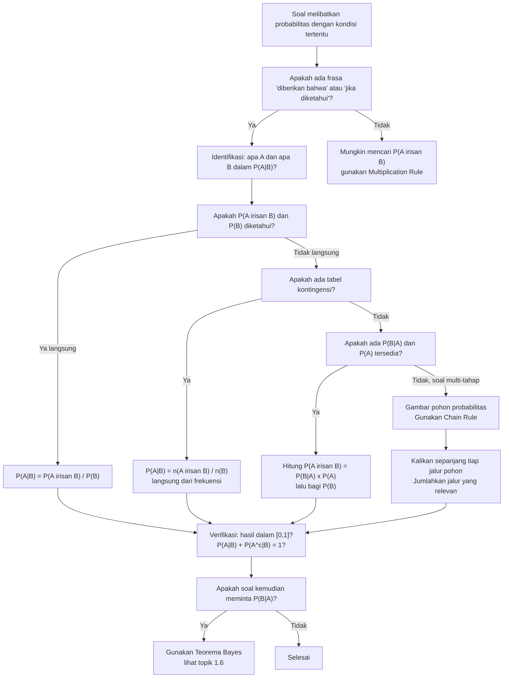

# 📊 1.4 — Probabilitas Bersyarat

> [!ABSTRACT] Ringkasan Cepat
> **Topik:** Probabilitas Bersyarat | **Bobot:** ~15–25% | **Difficulty:** Medium
> **Ref:** Hogg-Tanis-Zimm (2015) Bab 1.4; Miller et al. (2014) Bab 2.7–2.9 | **Prereq:** [[1.1 Eksperimen Acak dan Ruang Sampel]], [[1.2 Aksioma dan Perhitungan Probabilitas]], [[1.3 Metode Enumerasi]]

## Section 0 — Pemetaan Topik

| Topik CF2 | Sub-topik ID | Skill Diuji | Bobot | Difficulty | Prerequisite | Connected Topics | Referensi |
|-----------|--------------|-------------|-------|------------|--------------|------------------|-----------|
| Topik 1: Dasar-Dasar Probabilitas | 1.4 | Menghitung $P(A \mid B)$ dari definisi; menerapkan multiplication rule untuk $P(A \cap B)$; menggunakan reduced sample space untuk menyederhanakan perhitungan; membedakan $P(A \mid B)$ dengan $P(B \mid A)$; menghitung probabilitas bersyarat dari tabel kontingensi; mengenali kapan informasi bersyarat mengubah probabilitas | 15–25% | Medium | [[1.1 Eksperimen Acak dan Ruang Sampel]], [[1.2 Aksioma dan Perhitungan Probabilitas]], [[1.3 Metode Enumerasi]] | [[1.5 Kejadian Independen]], [[1.6 Teorema Bayes dan Hukum Probabilitas Total]], [[3.3 Distribusi Bersyarat (Conditional Distribution)]], [[3.4 Nilai Harapan dan Variansi Bersyarat]] | Hogg-Tanis-Zimm (2015) Bab 1.4; Miller et al. (2014) Bab 2.7–2.9 |

## Section 1 — Intuisi

Bayangkan seorang underwriter asuransi jiwa yang ingin menilai risiko seorang pelamar berusia 45 tahun dengan riwayat merokok. Probabilitas klaim dalam setahun untuk populasi umum mungkin hanya 0,3%. Namun begitu underwriter mengetahui bahwa pelamar ini adalah perokok berat berusia di atas 40 tahun, probabilitas tersebut berubah drastis — mungkin menjadi 2% atau lebih. Inilah esensi **probabilitas bersyarat**: probabilitas suatu kejadian $A$ ketika kita sudah memiliki informasi tambahan bahwa kejadian $B$ telah terjadi. Informasi $B$ secara efektif "mempersempit" ruang sampel kita dari $\Omega$ menjadi hanya subset $B$, dan kita menghitung ulang probabilitas $A$ dalam konteks yang lebih sempit ini.

Secara geometris, probabilitas bersyarat $P(A \mid B)$ adalah pertanyaan: "dari seluruh kemungkinan yang ada di dalam $B$, berapa proporsinya yang juga masuk ke $A$?" Jawabannya adalah luas area tumpang tindih $A \cap B$ dibagi luas area $B$ — bukan dibagi luas seluruh $\Omega$. Itulah mengapa formulanya adalah $P(A \cap B) / P(B)$: pembilang mengukur "seberapa banyak $A$ dan $B$ terjadi bersama", dan penyebut menormalisasi ulang skala probabilitas agar total dalam ruang $B$ tetap menjadi 1.

Konsep ini adalah tulang punggung dari hampir seluruh pemodelan risiko aktuaria yang lebih canggih. **Multiplication rule** — yang menyatakan $P(A \cap B) = P(A \mid B) \cdot P(B)$ — memungkinkan kita mendekomposisi probabilitas kejadian majemuk menjadi urutan kejadian bersyarat, seperti rantai keputusan dalam pohon probabilitas. Dari fondasi ini lahir [[1.5 Kejadian Independen]], [[1.6 Teorema Bayes dan Hukum Probabilitas Total]], dan pada akhirnya seluruh teori distribusi bersyarat di Topik 3.

## Section 2 — Definisi Formal

> [!NOTE] Definisi Matematis
> Misalkan $A$ dan $B$ adalah dua kejadian dengan $P(B) > 0$. **Probabilitas bersyarat** $A$ diberikan $B$ didefinisikan sebagai:
>
> $$
> P(A \mid B) = \frac{P(A \cap B)}{P(B)}, \quad P(B) > 0
> $$
>
> **Multiplication Rule (Aturan Perkalian):**
> $$
> P(A \cap B) = P(A \mid B) \cdot P(B) = P(B \mid A) \cdot P(A)
> $$
>
> **Multiplication Rule untuk $k$ Kejadian (Chain Rule):**
> $$
> P(A_1 \cap A_2 \cap \cdots \cap A_k) = P(A_1) \cdot P(A_2 \mid A_1) \cdot P(A_3 \mid A_1 \cap A_2) \cdots P(A_k \mid A_1 \cap \cdots \cap A_{k-1})
> $$

### Variabel & Parameter

| Simbol | Makna | Catatan |
|--------|-------|---------|
| $P(A \mid B)$ | Probabilitas $A$ diberikan $B$ telah terjadi | Hanya terdefinisi jika $P(B) > 0$ |
| $P(B \mid A)$ | Probabilitas $B$ diberikan $A$ telah terjadi | Umumnya $P(A \mid B) \neq P(B \mid A)$ |
| $P(A \cap B)$ | Probabilitas $A$ dan $B$ terjadi bersama | Joint probability; simetris: $P(A \cap B) = P(B \cap A)$ |
| $P(B)$ | Probabilitas $B$ terjadi (tanpa syarat) | Denominator; harus $> 0$ |
| $\Omega_B$ | Reduced sample space: $B$ dianggap sebagai $\Omega$ baru | $P(\Omega_B) = P(B \mid B) = 1$ |

### Rumus Utama

$$
P(A \mid B) = \frac{P(A \cap B)}{P(B)}, \quad P(B) > 0
$$
**Label: Definisi Probabilitas Bersyarat** — titik awal semua perhitungan; pembilang adalah joint probability, penyebut adalah marginal probability kejadian yang dikondisikan.

$$
P(A \cap B) = P(A \mid B) \cdot P(B)
$$
**Label: Multiplication Rule** — menurunkan joint probability dari conditional dan marginal; sangat sering digunakan untuk menghitung $P(A \cap B)$ ketika $P(A \mid B)$ diketahui lebih mudah daripada $P(A \cap B)$ secara langsung.

$$
P(A \cap B) = P(B \mid A) \cdot P(A)
$$
**Label: Multiplication Rule (sisi lain)** — kedua versi ekivalen karena $P(A \cap B) = P(B \cap A)$; pilih versi yang lebih mudah dihitung dari informasi yang tersedia.

$$
P(A_1 \cap A_2 \cap \cdots \cap A_k) = P(A_1) \cdot \prod_{i=2}^{k} P\!\left(A_i \,\middle|\, \bigcap_{j=1}^{i-1} A_j\right)
$$
**Label: Chain Rule (Multiplication Rule Umum)** — dekomposisi joint probability dari $k$ kejadian menjadi produk probabilitas bersyarat bertingkat; berguna untuk pohon probabilitas (*probability tree*).

$$
\sum_{a} P(A = a \mid B) = 1
$$
**Label: Normalisasi Probabilitas Bersyarat** — probabilitas bersyarat memenuhi semua aksioma Kolmogorov dengan $B$ sebagai ruang sampel baru; total atas semua nilai $A$ harus sama dengan 1.

### Asumsi Eksplisit

- **$P(B) > 0$ wajib:** Probabilitas bersyarat $P(A \mid B)$ tidak terdefinisi jika $P(B) = 0$. Mengkondisikan pada kejadian dengan probabilitas nol memerlukan teori yang lebih canggih. `[BEYOND CF2]`
- **Probabilitas bersyarat memenuhi aksioma Kolmogorov:** Dengan $B$ sebagai ruang sampel baru, $P(\cdot \mid B)$ adalah fungsi probabilitas yang valid — non-negatif, $P(B \mid B) = 1$, dan aditif untuk kejadian saling eksklusif.
- **Multiplication rule tidak mensyaratkan independensi:** $P(A \cap B) = P(A \mid B) \cdot P(B)$ berlaku untuk semua kejadian $A, B$ dengan $P(B) > 0$, terlepas apakah $A$ dan $B$ independen atau tidak.

## Section 3 — Jembatan Logika

> [!TIP] Dari Definisi ke Rumus
> Intuisi paling kuat untuk memahami $P(A \mid B) = P(A \cap B)/P(B)$ adalah konsep **reduced sample space**. Ketika kita mengetahui bahwa $B$ telah terjadi, kita tidak lagi mempertimbangkan titik-titik sampel di luar $B$. Ruang sampel kita "menyusut" dari $\Omega$ menjadi $B$. Dalam ruang yang menyusut ini, $A$ hanya bisa terjadi melalui bagian yang beririsan dengan $B$, yaitu $A \cap B$. Probabilitas relatif $A$ dalam ruang $B$ adalah $P(A \cap B)$ dibagi $P(B)$ — normalisasi diperlukan agar total probabilitas dalam ruang $B$ tetap 1. Multiplication rule hanyalah definisi ini yang "dibalik": dari $P(A \mid B) = P(A \cap B)/P(B)$, kalikan kedua sisi dengan $P(B)$ untuk mendapatkan $P(A \cap B) = P(A \mid B) \cdot P(B)$.

> [!IMPORTANT] Support dan Domain
> - $P(A \mid B)$ adalah **fungsi dari $A$** (diberikan $B$ tetap): untuk $B$ tertentu, $P(\cdot \mid B)$ mendefinisikan distribusi probabilitas baru pada $\Omega$ (atau pada $B$ saja).
> - $P(A \mid B) \in [0, 1]$ selalu — ini adalah konsekuensi dari $P(A \cap B) \leq P(B)$ (karena $A \cap B \subseteq B$) dan $P(A \cap B) \geq 0$ (Aksioma 1).
> - **Asimetri:** $P(A \mid B)$ dan $P(B \mid A)$ mengukur hal yang berbeda total. $P(A \mid B)$ adalah proporsi $B$ yang juga $A$; $P(B \mid A)$ adalah proporsi $A$ yang juga $B$.

**Derivasi Multiplication Rule dari Definisi:**

Mulai dari definisi probabilitas bersyarat:

$$
P(A \mid B) = \frac{P(A \cap B)}{P(B)}
$$

Kalikan kedua sisi dengan $P(B) > 0$:

$$
P(A \mid B) \cdot P(B) = P(A \cap B) \quad \blacksquare
$$

Karena $P(A \cap B) = P(B \cap A)$, kita juga bisa menulis:

$$
P(A \cap B) = P(B \mid A) \cdot P(A) \quad \blacksquare
$$

**Derivasi Chain Rule untuk Tiga Kejadian:**

$$
P(A \cap B \cap C) = P\bigl((A \cap B) \cap C\bigr) = P\bigl(C \mid A \cap B\bigr) \cdot P(A \cap B)
$$

Terapkan multiplication rule lagi pada $P(A \cap B)$:

$$
= P\bigl(C \mid A \cap B\bigr) \cdot P(B \mid A) \cdot P(A) \quad \blacksquare
$$

**Reduced Sample Space — Contoh Konkret:**

Misalkan $\Omega = \{1, 2, 3, 4, 5, 6\}$ (dadu adil) dan $B = \{2, 4, 6\}$ (hasil genap). Jika $A = \{1, 2, 3\}$ (hasil $\leq 3$), maka:

$$
P(A \mid B) = \frac{P(A \cap B)}{P(B)} = \frac{P(\{2\})}{P(\{2,4,6\})} = \frac{1/6}{3/6} = \frac{1}{3}
$$

Interpretasi reduced sample space: diberikan hasil genap, ruang sampel menjadi $\{2, 4, 6\}$. Dari tiga nilai ini, hanya $\{2\}$ yang $\leq 3$. Probabilitas: $1/3$. ✓

**Menghitung dari Tabel Kontingensi:**

Tabel kontingensi $2 \times 2$ secara langsung memberikan semua informasi untuk probabilitas bersyarat. Jika baris mewakili kejadian $A$ dan kolomnya $B$:

$$
P(A \mid B) = \frac{n(A \cap B)}{n(B)} = \frac{\text{frekuensi sel }(A,B)}{\text{total kolom }B}
$$

> [!DANGER] Dilarang
> 1. **Dilarang membalik $P(A \mid B)$ menjadi $P(B \mid A)$ tanpa justifikasi.** $P(A \mid B) \neq P(B \mid A)$ secara umum — kesalahan ini disebut *confusion of the inverse* dan adalah jebakan paling berbahaya di soal probabilitas bersyarat CF2. Konversi antara keduanya memerlukan Teorema Bayes ([[1.6 Teorema Bayes dan Hukum Probabilitas Total]]).
> 2. **Dilarang mendefinisikan $P(A \mid B)$ ketika $P(B) = 0$.** Jika suatu soal tampak meminta $P(A \mid B)$ dengan $P(B) = 0$, ada kesalahan dalam setup soal atau interpretasi — wajib tinjau ulang definisi kejadian $B$.
> 3. **Dilarang menggunakan $P(A \mid B) = P(A)$ tanpa memverifikasi independensi terlebih dahulu.** Persamaan ini hanya berlaku jika $A$ dan $B$ independen — ini adalah definisi independensi yang dibahas di [[1.5 Kejadian Independen]], bukan asumsi default.

## Section 4 — Contoh Soal

### Soal A — Fundamental

Sebuah perusahaan asuransi memiliki 200 pemegang polis. Data tercatat sebagai berikut: 80 polis pernah mengajukan klaim (kejadian $K$), 70 polis memiliki riwayat kecelakaan (kejadian $C$), dan 40 polis memiliki keduanya (pernah klaim DAN riwayat kecelakaan). Satu polis dipilih secara acak.

Tentukan: (a) $P(K \mid C)$, (b) $P(C \mid K)$, (c) $P(K \mid C^c)$, (d) apakah $P(K \mid C) = P(K \mid C^c)$? Apa artinya?

> [!SUCCESS] Solusi Soal A
>
> **1. Identifikasi Variabel**
> - $n(\Omega) = 200$, $n(K) = 80$, $n(C) = 70$, $n(K \cap C) = 40$
> - Model equally likely: $P(A) = n(A)/200$
>
> **2. Identifikasi Distribusi / Model**
> - Data dari tabel kontingensi implisit; gunakan definisi langsung $P(A \mid B) = P(A \cap B)/P(B)$
> - Hitung semua probabilitas yang diperlukan terlebih dahulu
>
> **3. Setup Persamaan**
>
> $$
> P(K) = \frac{80}{200} = 0.40, \quad P(C) = \frac{70}{200} = 0.35, \quad P(K \cap C) = \frac{40}{200} = 0.20
> $$
>
> **4. Eksekusi Aljabar**
>
> (a) Probabilitas pernah klaim, diberikan punya riwayat kecelakaan:
> $$
> P(K \mid C) = \frac{P(K \cap C)}{P(C)} = \frac{0.20}{0.35} = \frac{4}{7} \approx 0.571
> $$
>
> (b) Probabilitas punya riwayat kecelakaan, diberikan pernah klaim:
> $$
> P(C \mid K) = \frac{P(K \cap C)}{P(K)} = \frac{0.20}{0.40} = \frac{1}{2} = 0.500
> $$
>
> (c) Pertama, hitung $P(K \cap C^c)$ dan $P(C^c)$:
> $$
> P(C^c) = 1 - P(C) = 1 - 0.35 = 0.65
> $$
> $$
> P(K \cap C^c) = P(K) - P(K \cap C) = 0.40 - 0.20 = 0.20
> $$
> $$
> P(K \mid C^c) = \frac{P(K \cap C^c)}{P(C^c)} = \frac{0.20}{0.65} = \frac{4}{13} \approx 0.308
> $$
>
> (d) $P(K \mid C) = 4/7 \approx 0.571 \neq P(K \mid C^c) = 4/13 \approx 0.308 \neq P(K) = 0.40$
>
> Karena $P(K \mid C) \neq P(K)$, mengetahui riwayat kecelakaan **mengubah** probabilitas klaim. Artinya $K$ dan $C$ **tidak independen** — riwayat kecelakaan memberikan informasi relevan tentang kemungkinan klaim. (Ini adalah preview konsep di [[1.5 Kejadian Independen]].)
>
> **5. Verification**
>
> Hitung empat sel tabel kontingensi dan verifikasi:
>
> | | $C$ | $C^c$ | Total |
> |--|-----|--------|-------|
> | $K$ | $40$ | $40$ | $80$ |
> | $K^c$ | $30$ | $90$ | $120$ |
> | Total | $70$ | $130$ | $200$ |
>
> Cek: $P(K \mid C) = 40/70 = 4/7$ ✓ (langsung dari tabel, tanpa membagi dengan 200 dulu)
>
> Cek: $P(C \mid K) = 40/80 = 1/2$ ✓
>
> Cek: $P(K \mid C^c) = 40/130 = 4/13$ ✓

> [!WARNING] Exam Tips — Soal A
> - **Target waktu:** 8–10 menit.
> - **Common trap:** Menukar pembilang dan penyebut — menghitung $P(C)/P(K \cap C)$ alih-alih $P(K \cap C)/P(C)$. Selalu ingat: "diberikan $B$" berarti $P(B)$ ada di **penyebut**.
> - **Shortcut dari tabel:** Jika data dalam bentuk frekuensi, $P(A \mid B) = n(A \cap B)/n(B)$ — tidak perlu konversi ke probabilitas dulu. Hitung langsung dari frekuensi di sel dan total kolom/baris.
> - **Shortcut verifikasi (d):** Cara tercepat mengecek apakah dua kejadian independen dari tabel adalah: apakah $n(A \cap B) = n(A) \cdot n(B)/N$? Jika ya, independen. Di sini: $40 \overset{?}{=} 80 \times 70/200 = 28$ — tidak sama, jadi tidak independen ✓.

### Soal B — Exam-Typical

Sebuah portofolio asuransi kendaraan dibagi berdasarkan profil risiko nasabah. Diketahui:
- 60% nasabah tergolong risiko rendah ($R$), sisanya risiko tinggi ($R^c$).
- Probabilitas nasabah risiko rendah mengajukan klaim dalam setahun: $P(K \mid R) = 0.05$.
- Probabilitas nasabah risiko tinggi mengajukan klaim dalam setahun: $P(K \mid R^c) = 0.20$.

Seorang nasabah dipilih secara acak.

(a) Tentukan $P(K \cap R)$ dan $P(K \cap R^c)$.

(b) Tentukan $P(K)$ — probabilitas sembarang nasabah mengajukan klaim.

(c) Diberikan bahwa nasabah yang dipilih ternyata **tidak** mengajukan klaim, tentukan $P(R \mid K^c)$.

(d) Satu nasabah risiko rendah dan satu nasabah risiko tinggi dipilih secara independen. Tentukan probabilitas **tepat satu** dari keduanya mengajukan klaim.

> [!SUCCESS] Solusi Soal B
>
> **1. Identifikasi Variabel**
> - $P(R) = 0.60$, $P(R^c) = 0.40$
> - $P(K \mid R) = 0.05$, $P(K \mid R^c) = 0.20$
>
> **2. Identifikasi Distribusi / Model**
> - Gunakan multiplication rule untuk mencari joint probabilities
> - (b) adalah preview Hukum Total Probabilitas ([[1.6 Teorema Bayes dan Hukum Probabilitas Total]])
> - (c) adalah preview Teorema Bayes
> - (d) menggunakan independensi antar nasabah berbeda
>
> **3. Setup Persamaan**
>
> Multiplication rule: $P(K \cap B) = P(K \mid B) \cdot P(B)$
>
> **4. Eksekusi Aljabar**
>
> (a):
> $$
> P(K \cap R) = P(K \mid R) \cdot P(R) = 0.05 \times 0.60 = 0.030
> $$
> $$
> P(K \cap R^c) = P(K \mid R^c) \cdot P(R^c) = 0.20 \times 0.40 = 0.080
> $$
>
> (b) Karena $R$ dan $R^c$ adalah partisi dari $\Omega$:
> $$
> P(K) = P(K \cap R) + P(K \cap R^c) = 0.030 + 0.080 = 0.110
> $$
>
> (c) $P(K^c) = 1 - P(K) = 1 - 0.110 = 0.890$
>
> $P(R \cap K^c) = P(R) - P(R \cap K) = 0.60 - 0.030 = 0.570$
>
> $$
> P(R \mid K^c) = \frac{P(R \cap K^c)}{P(K^c)} = \frac{0.570}{0.890} = \frac{57}{89} \approx 0.640
> $$
>
> Interpretasi: diberikan nasabah tidak mengajukan klaim, probabilitas ia tergolong risiko rendah meningkat dari $60\%$ menjadi $\approx 64\%$ — masuk akal karena nasabah risiko rendah lebih jarang klaim.
>
> (d) Misalkan $K_R$ = nasabah risiko rendah klaim, $K_{R^c}$ = nasabah risiko tinggi klaim. Keduanya independen.
>
> $P(K_R) = 0.05$, $P(K_{R^c}) = 0.20$.
>
> Tepat satu klaim = (risiko rendah klaim DAN risiko tinggi tidak klaim) ATAU (risiko rendah tidak klaim DAN risiko tinggi klaim):
>
> $$
> P(\text{tepat satu}) = P(K_R) \cdot P(K_{R^c}^c) + P(K_R^c) \cdot P(K_{R^c})
> $$
> $$
> = 0.05 \times 0.80 + 0.95 \times 0.20 = 0.040 + 0.190 = 0.230
> $$
>
> **5. Verification**
>
> Cek (b) dari sisi lain: $P(K^c \mid R) = 0.95$, $P(K^c \mid R^c) = 0.80$:
> $$
> P(K^c) = 0.95 \times 0.60 + 0.80 \times 0.40 = 0.570 + 0.320 = 0.890
> $$
> $$
> P(K) = 1 - 0.890 = 0.110 \checkmark
> $$
>
> Cek (d): Peluang keduanya klaim $= 0.05 \times 0.20 = 0.010$; keduanya tidak klaim $= 0.95 \times 0.80 = 0.760$; tepat satu $= 1 - 0.010 - 0.760 = 0.230$ ✓
>
> Cek (c): $P(R \mid K^c) = 57/89 > P(R) = 0.60$ — tidak klaim meningkatkan probabilitas risiko rendah, sesuai intuisi ✓

> [!WARNING] Exam Tips — Soal B
> - **Target waktu:** 12–14 menit.
> - **Common trap (b):** Menghitung $P(K)$ sebagai $P(K \mid R) + P(K \mid R^c) = 0.05 + 0.20 = 0.25$ — ini salah total karena menjumlahkan probabilitas bersyarat tanpa bobot. Selalu gunakan multiplication rule terlebih dahulu.
> - **Common trap (c):** Menggunakan $P(R \mid K^c) = 1 - P(R \mid K)$. Ini **salah** — komplemen dari probabilitas bersyarat berlaku pada $A$, bukan pada kondisi: $P(R^c \mid K^c) = 1 - P(R \mid K^c)$, bukan $P(R \mid K) = 1 - P(R \mid K^c)$.
> - **Pola soal:** Bagian (b) adalah Hukum Total Probabilitas dan (c) adalah Teorema Bayes dalam bentuk paling dasar — kenali pola ini karena sangat sering muncul di CF2 dalam berbagai variasi.

### Soal C — Challenging

Sebuah sistem keamanan klaim asuransi menggunakan dua tahap verifikasi secara berurutan. Pada tahap pertama, sistem AI menandai sebuah klaim sebagai "mencurigakan" (M) atau "normal" (N). Diketahui $P(M) = 0.15$. Pada tahap kedua, seorang investigator manusia memeriksa klaim yang telah ditandai; investigator juga memeriksa sebagian klaim normal secara acak.

Informasi yang diketahui:
- Probabilitas klaim adalah **fraud** ($F$): $P(F) = 0.08$
- Probabilitas AI menandai klaim fraud sebagai mencurigakan: $P(M \mid F) = 0.90$
- Probabilitas AI menandai klaim non-fraud sebagai mencurigakan: $P(M \mid F^c) = 0.082\overline{6}$

Dari klaim yang ditandai mencurigakan, investigator memeriksa **semua**-nya. Dari klaim normal, investigator memeriksa $10\%$ secara acak.

(a) Verifikasi bahwa $P(M) = 0.15$ konsisten dengan data yang diberikan.

(b) Tentukan $P(F \mid M)$ — probabilitas suatu klaim adalah fraud diberikan AI menandainya mencurigakan.

(c) Misalkan investigator memeriksa suatu klaim. Tentukan probabilitas klaim tersebut adalah fraud.

(d) Diberikan investigator memeriksa suatu klaim dan klaim tersebut ternyata fraud, tentukan probabilitas klaim tersebut berasal dari tumpukan yang "ditandai" (bukan dari sampel acak normal).

> [!SUCCESS] Solusi Soal C
>
> **1. Identifikasi Variabel**
> - $P(F) = 0.08$, $P(F^c) = 0.92$
> - $P(M \mid F) = 0.90$, $P(M \mid F^c) = 0.0826\overline{6}$
> - Investigator periksa: semua $M$, dan $10\%$ dari $N = M^c$
>
> **2. Identifikasi Distribusi / Model**
> - Probabilitas bersyarat bertingkat; gunakan multiplication rule dan hukum total probabilitas
> - Ini adalah aplikasi Teorema Bayes yang memerlukan pemahaman struktur dua tahap
>
> **3. Setup Persamaan**
>
> Hitung joint probabilities via multiplication rule:
>
> $$
> P(M \cap F) = P(M \mid F) \cdot P(F), \quad P(M \cap F^c) = P(M \mid F^c) \cdot P(F^c)
> $$
>
> **4. Eksekusi Aljabar**
>
> (a) Verifikasi $P(M)$:
>
> $$
> P(M \cap F) = 0.90 \times 0.08 = 0.072
> $$
> $$
> P(M \cap F^c) = 0.082\overline{6} \times 0.92 = 0.076
> $$
> $$
> P(M) = P(M \cap F) + P(M \cap F^c) = 0.072 + 0.076 = 0.148 \approx 0.15 \checkmark
> $$
>
> (Perbedaan kecil akibat pembulatan $P(M \mid F^c)$; nilai tepatnya adalah $P(M \mid F^c) = 0.076/0.92 = 19/230 \approx 0.08261$.)
>
> (b) Terapkan definisi probabilitas bersyarat:
>
> $$
> P(F \mid M) = \frac{P(F \cap M)}{P(M)} = \frac{0.072}{0.148} = \frac{72}{148} = \frac{18}{37} \approx 0.486
> $$
>
> Interpretasi: walaupun AI menandai klaim sebagai mencurigakan, hanya sekitar $48.6\%$ yang benar-benar fraud — presisi AI tidak sempurna.
>
> (c) Misalkan $I$ = kejadian klaim diperiksa investigator.
>
> $P(I \mid M) = 1$ (semua yang ditandai diperiksa), $P(I \mid M^c) = 0.10$.
>
> $$
> P(M^c) = 1 - P(M) = 1 - 0.148 = 0.852
> $$
>
> Hukum Total Probabilitas untuk $P(I)$:
> $$
> P(I) = P(I \mid M) \cdot P(M) + P(I \mid M^c) \cdot P(M^c)
> $$
> $$
> = 1.0 \times 0.148 + 0.10 \times 0.852 = 0.148 + 0.0852 = 0.2332
> $$
>
> Probabilitas klaim yang diperiksa investigator adalah fraud:
>
> $$
> P(F \mid I) = \frac{P(F \cap I)}{P(I)}
> $$
>
> Hitung $P(F \cap I)$: klaim fraud diperiksa jika (i) ditandai AI (dengan prob $P(M \mid F) = 0.90$) ATAU (ii) tidak ditandai tapi masuk sampel $10\%$ (dengan prob $P(M^c \mid F) \cdot 0.10 = 0.10 \times 0.10 = 0.01$):
>
> $$
> P(I \mid F) = P(I \mid M, F) \cdot P(M \mid F) + P(I \mid M^c, F) \cdot P(M^c \mid F)
> $$
> $$
> = 1.0 \times 0.90 + 0.10 \times 0.10 = 0.90 + 0.01 = 0.91
> $$
>
> $$
> P(F \cap I) = P(I \mid F) \cdot P(F) = 0.91 \times 0.08 = 0.0728
> $$
>
> $$
> P(F \mid I) = \frac{0.0728}{0.2332} \approx 0.312
> $$
>
> (d) Diberikan $I$ dan $F$: klaim diperiksa investigator dan fraud. Probabilitas berasal dari tumpukan yang ditandai ($M$):
>
> $$
> P(M \mid I \cap F) = \frac{P(M \cap I \cap F)}{P(I \cap F)}
> $$
>
> $P(M \cap I \cap F) = P(I \mid M \cap F) \cdot P(M \cap F) = 1.0 \times 0.072 = 0.072$ (karena semua klaim di $M$ diperiksa)
>
> $P(I \cap F) = P(I \mid F) \cdot P(F) = 0.91 \times 0.08 = 0.0728$
>
> $$
> P(M \mid I \cap F) = \frac{0.072}{0.0728} = \frac{72}{72.8} = \frac{900}{910} = \frac{90}{91} \approx 0.989
> $$
>
> Interpretasi: Jika investigator menemukan klaim fraud, hampir pasti ($98.9\%$) klaim tersebut berasal dari tumpukan yang ditandai AI — masuk akal karena AI berhasil menangkap $90\%$ fraud.
>
> **5. Verification**
>
> Cek (c): $P(F \mid I) \approx 0.312 > P(F) = 0.08$ — pemeriksaan investigator meningkatkan prevalensi fraud secara signifikan (dari $8\%$ ke $31.2\%$) karena investigator lebih cenderung memeriksa klaim mencurigakan. ✓
>
> Cek (d): $P(M^c \mid I \cap F) = 1 - 90/91 = 1/91 \approx 0.011$ — hanya $1.1\%$ klaim fraud yang diperiksa berasal dari sampel acak normal, konsisten dengan $P(M^c \mid F) \times 0.10 = 0.10 \times 0.10 = 1\%$ dari fraud total. ✓

> [!WARNING] Exam Tips — Soal C
> - **Target waktu:** 18–22 menit.
> - **Common trap (c):** Mengasumsikan $P(F \mid I) = P(F \mid M)$ — padahal investigator juga memeriksa sebagian klaim normal, sehingga kondisinya berbeda dari sekadar "ditandai AI".
> - **Strategi:** Untuk soal berlapis seperti ini, **gambar pohon probabilitas dua tahap** (AI → Investigator) dengan semua cabang dan probabilitas sebelum mulai menghitung. Visualisasi pohon hampir selalu lebih cepat dan lebih aman dari langsung menghitung.
> - **Common trap (d):** Mengira $P(M \mid I \cap F) = P(M \mid F)$ — kondisi tambahan $I$ (diperiksa) mengubah probabilitas karena $I$ berkorelasi dengan $M$. Harus hitung ulang dengan definisi penuh.
> - **Pola soal ini** adalah bentuk Teorema Bayes multi-tahap yang populer di CF2 — latih pohon probabilitas hingga refleks.

## Section 5 — Verifikasi & Sanity Check

> [!CHECK] Validasi Probabilitas Bersyarat
> Untuk setiap hasil $P(A \mid B)$ yang diperoleh:
> 1. $P(A \mid B) \in [0,1]$ — wajib terpenuhi; jika tidak, ada kesalahan di pembilang atau penyebut.
> 2. $P(A \mid B) + P(A^c \mid B) = 1$ — komplemen dalam kondisi $B$ harus menjumlah ke 1.
> 3. Jika $A \subseteq B$, maka $P(A \mid B) = P(A)/P(B)$; jika $A \cap B = \emptyset$, maka $P(A \mid B) = 0$.

> [!CHECK] Verifikasi Multiplication Rule
> 1. $P(A \cap B) = P(A \mid B) \cdot P(B) = P(B \mid A) \cdot P(A)$ — keduanya harus memberikan nilai yang sama.
> 2. Dari tabel kontingensi: verifikasi $n(A \cap B)/N = [n(A \cap B)/n(B)] \times [n(B)/N]$.
> 3. $P(A \cap B) \leq \min\{P(A), P(B)\}$ — selalu berlaku.

> [!CHECK] Verifikasi Konsistensi Arah Kondisi
> Sebelum menghitung, pastikan arah kondisi sudah benar:
> - "$A$ diberikan $B$": $P(A \mid B) = P(A \cap B) / P(B)$ — $B$ di penyebut.
> - "$B$ diberikan $A$": $P(B \mid A) = P(A \cap B) / P(A)$ — $A$ di penyebut.
> - Cek ulang: apakah hasilnya masuk akal secara intuitif? Apakah kondisi yang diberikan seharusnya meningkatkan atau menurunkan probabilitas?

### Metode Alternatif

**Pendekatan Reduced Sample Space:**

Alih-alih menggunakan rumus $P(A \mid B) = P(A \cap B)/P(B)$, bayangkan ulang $B$ sebagai $\Omega$ baru:

$$
P(A \mid B) = \frac{P_{\text{baru}}(A)}{1} = \frac{\text{probabilitas relatif } A \text{ dalam } B}{\text{total probabilitas dalam } B}
$$

Untuk model equally likely: $P(A \mid B) = n(A \cap B)/n(B)$ langsung dari frekuensi.

**Pohon Probabilitas (Probability Tree):**

Untuk masalah multi-tahap, gambar pohon dengan:
- Cabang pertama: kejadian di tahap pertama (e.g., $R$ dan $R^c$) dengan probabilitas marginalnya.
- Cabang kedua dari setiap node: kejadian di tahap kedua (e.g., $K$ dan $K^c$) dengan probabilitas bersyarat.
- Setiap jalur daun: kalikan semua probabilitas sepanjang jalur (multiplication rule otomatis teraplikasi).
- Probabilitas akhir dari kejadian tertentu: jumlahkan semua jalur daun yang relevan.

## Section 6 — Visualisasi Mental

**Diagram Venn — Reduced Sample Space:**

Gambarkan $\Omega$ sebagai persegi panjang besar, dengan lingkaran $B$ di dalamnya dan lingkaran $A$ yang sebagian beririsan dengan $B$. Saat kita mengkondisikan pada $B$:
- "Zoom in" ke lingkaran $B$ — ini adalah ruang sampel baru.
- Area irisan $A \cap B$ tetap ada di dalam ruang baru.
- $P(A \mid B)$ adalah proporsi lingkaran $B$ yang terisi oleh $A \cap B$ — bukan proporsi seluruh $\Omega$.

Secara visual: $P(A \mid B)$ adalah "ukuran $A \cap B$ relatif terhadap ukuran $B$", bukan relatif terhadap $\Omega$. Ini menjelaskan mengapa mengkondisikan pada $B$ yang besar (mendekati $\Omega$) hampir tidak mengubah probabilitas, sementara mengkondisikan pada $B$ yang kecil bisa mengubahnya drastis.

**Pohon Probabilitas — Visualisasi Chain Rule:**

```
            P(K|R) = 0.05     → K:    P(R) × P(K|R) = 0.030
P(R) = 0.6 ↗
            P(K^c|R) = 0.95   → K^c:  P(R) × P(K^c|R) = 0.570
         ↖
          ↘
P(R^c) = 0.4
            P(K|R^c) = 0.20   → K:    P(R^c) × P(K|R^c) = 0.080
            P(K^c|R^c) = 0.80 → K^c:  P(R^c) × P(K^c|R^c) = 0.320
```

Total semua daun: $0.030 + 0.570 + 0.080 + 0.320 = 1.000$ ✓

### Hubungan Visual ↔ Rumus

Area overlap $A \cap B$ di diagram Venn berkorespondensi langsung dengan pembilang dalam rumus:

$$
\text{Area}(A \cap B) \longleftrightarrow P(A \cap B) = P(A \mid B) \cdot P(B)
$$

Rasio area yang "dikondisikan" berkorespondensi dengan probabilitas bersyarat:

$$
\frac{\text{Area}(A \cap B)}{\text{Area}(B)} \longleftrightarrow P(A \mid B) = \frac{P(A \cap B)}{P(B)}
$$

Setiap **jalur dari akar ke daun** di pohon probabilitas berkorespondensi dengan satu suku dalam chain rule:

$$
\text{Jalur: } R \to K \longleftrightarrow P(R) \cdot P(K \mid R) = P(R \cap K)
$$

## Section 7 — Jebakan Umum

> [!BUG] Kesalahan Parametrisasi
> **Kesalahan 1 — Membalik Arah Kondisi:** Menghitung $P(B \mid A)$ ketika soal meminta $P(A \mid B)$. Pembilang sama ($P(A \cap B)$), tapi penyebutnya berbeda. Ini adalah kesalahan paling umum dan paling berbahaya.
>
> **Salah:** $P(F \mid M) = P(M \mid F) = 0.90$
>
> **Benar:** $P(F \mid M) = P(F \cap M)/P(M) = 0.072/0.148 \approx 0.486$

> [!BUG] Kesalahan Konseptual
> 1. **"$P(A \mid B) + P(A \mid B^c) = 1$" — ini SALAH.** Yang benar adalah $P(A \mid B) + P(A^c \mid B) = 1$ (komplemen dari $A$, bukan komplemen dari kondisi). Dua kondisi berbeda ($B$ vs $B^c$) menghasilkan dua distribusi berbeda yang tidak harus menjumlah ke 1.
> 2. **Menjumlahkan $P(K \mid R) + P(K \mid R^c)$ untuk mendapat $P(K)$.** Ini salah karena probabilitas bersyarat harus dibobot oleh probabilitas marginalnya: $P(K) = P(K \mid R) P(R) + P(K \mid R^c) P(R^c)$.
> 3. **Mengasumsikan $P(A \mid B) = P(A)$ tanpa verifikasi.** Kesamaan ini hanya berlaku untuk kejadian independen — harus diverifikasi, bukan diasumsikan.
> 4. **Mengkondisikan pada kejadian dengan $P(B) = 0$.** Jika $P(B) = 0$, $P(A \mid B)$ tidak terdefinisi. Untuk distribusi kontinu, mengkondisikan pada nilai tunggal $\{Y = y\}$ memerlukan teori khusus ([[3.3 Distribusi Bersyarat (Conditional Distribution)]]).

> [!BUG] Kesalahan Interpretasi Soal
> - **"Diberikan bahwa $B$ terjadi"** atau **"jika diketahui $B$"** $\leftrightarrow$ hitung $P(A \mid B)$ — $B$ di **penyebut**.
> - **"Probabilitas $A$ dan $B$ terjadi bersama"** $\leftrightarrow$ hitung $P(A \cap B)$ — gunakan multiplication rule.
> - **"Probabilitas $A$ terjadi setelah $B$"** dalam konteks temporal $\leftrightarrow$ ini mungkin $P(A \mid B)$ bukan $P(A \cap B)$ — baca konteks dengan teliti.
> - **"Probabilitas $A$, mengingat $B$ sudah terjadi"** $\leftrightarrow$ $P(A \mid B)$, bukan $P(A \cup B)$.

> [!CAUTION] Red Flags
> - **Soal memberikan $P(A \mid B)$ dan meminta $P(B \mid A)$:** Ini adalah Teorema Bayes — jangan coba-coba langsung membalik; gunakan formula Bayes dari [[1.6 Teorema Bayes dan Hukum Probabilitas Total]].
> - **Dua kejadian dengan probabilitas bersyarat berbeda dari marginalnya:** Ini menandakan kejadian tidak independen — konsekuensi penting untuk perhitungan selanjutnya.
> - **Soal menyebut "sequential" atau "berurutan" atau "tahap":** Ini adalah sinyal kuat untuk menggunakan chain rule dan pohon probabilitas.
> - **Penyebut hampir nol:** Jika $P(B)$ sangat kecil, $P(A \mid B)$ sangat sensitif terhadap error di $P(A \cap B)$ — pastikan presisi perhitungan joint probability.
> - **Soal meminta probabilitas bersyarat dari distribusi kontinu** (e.g., $P(X > 2 \mid X > 1)$): Gunakan definisi yang sama, tapi hitung via CDF atau PDF — terhubung ke [[2.2 Variabel Acak Kontinu]].

## Section 8 — Ringkasan Eksekutif

> [!SUMMARY] Must-Remember
> 1. **Definisi probabilitas bersyarat:**
>    $$P(A \mid B) = \frac{P(A \cap B)}{P(B)}, \quad P(B) > 0$$
> 2. **Multiplication rule (dua arah):**
>    $$P(A \cap B) = P(A \mid B) \cdot P(B) = P(B \mid A) \cdot P(A)$$
> 3. **Chain rule untuk tiga kejadian:**
>    $$P(A \cap B \cap C) = P(A) \cdot P(B \mid A) \cdot P(C \mid A \cap B)$$
> 4. **Normalisasi dalam kondisi $B$:**
>    $$P(A \mid B) + P(A^c \mid B) = 1 \quad \text{(bukan } P(A \mid B) + P(A \mid B^c) = 1\text{)}$$
> 5. **Dari tabel kontingensi (equally likely):**
>    $$P(A \mid B) = \frac{n(A \cap B)}{n(B)}$$

### Kapan Digunakan

- **Trigger keywords:** "diberikan bahwa", "jika diketahui", "given that", "mengingat", "setelah diketahui", "probabilitas bersyarat", "conditional probability".
- **Tipe skenario soal:**
  - Diberikan data tabel kontingensi — hitung $P(A \mid B)$ langsung dari frekuensi.
  - Diberikan $P(A \mid B)$ dan marginal — hitung $P(A \cap B)$ via multiplication rule.
  - Masalah multi-tahap (profil risiko → klaim, tes diagnostik → penyakit) — gunakan pohon probabilitas dan chain rule.
  - Hitung $P(A)$ dari partisi bersyarat — preview Hukum Total Probabilitas ([[1.6 Teorema Bayes dan Hukum Probabilitas Total]]).
  - Memperbarui probabilitas setelah informasi baru — preview Teorema Bayes.

### Kapan TIDAK Boleh Digunakan

- **Jangan gunakan $P(A \mid B)$ untuk mendapatkan $P(B \mid A)$ secara langsung** — selalu butuh Teorema Bayes; beralih ke [[1.6 Teorema Bayes dan Hukum Probabilitas Total]].
- **Jika $P(B) = 0$:** Probabilitas bersyarat tidak terdefinisi dalam kerangka CF2.
- **Jika sudah diverifikasi $A \perp B$:** Maka $P(A \mid B) = P(A)$ dan perhitungan bersyarat tidak mengubah apapun — gunakan probabilitas marginal langsung dan lihat [[1.5 Kejadian Independen]].
- **Untuk distribusi kontinu:** Prinsip yang sama berlaku tetapi via PDF/CDF — beralih ke [[3.3 Distribusi Bersyarat (Conditional Distribution)]].

### Quick Decision Tree



---

> [!QUOTE] Follow-up Options
> 1. *"Berikan contoh soal probabilitas bersyarat untuk variabel acak kontinu — $P(X > 3 \mid X > 1)$ untuk distribusi Eksponensial"*
> 2. *"Jelaskan hubungan [[1.4 Probabilitas Bersyarat]] dengan [[1.6 Teorema Bayes dan Hukum Probabilitas Total]] — bagaimana multiplication rule menjadi fondasi Teorema Bayes"*
> 3. *"Buat flashcard 1-halaman untuk topik ini"*

*📖 Ref: Hogg-Tanis-Zimm (2015) Bab 1.4; Miller et al. (2014) Bab 2.7–2.9 | 🗓️ 2026-02-21 | #CF2 #Probabilitas #ProbabilitasBersyarat #MultiplicationRule #ChainRule #ReducedSampleSpace #PohonProbabilitas*
