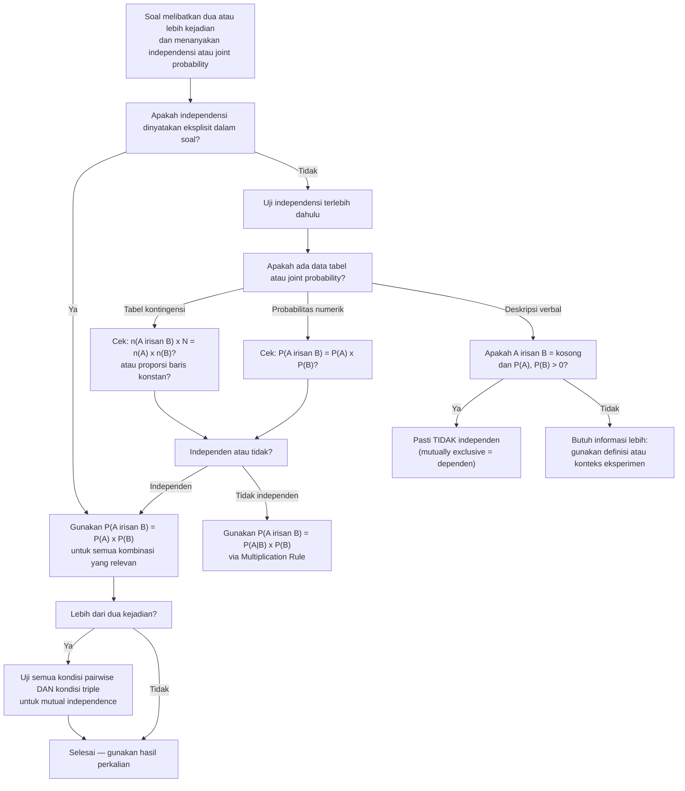

# 📊 1.5 — Kejadian Independen

> [!ABSTRACT] Ringkasan Cepat
> **Topik:** Kejadian Independen | **Bobot:** ~15–25% | **Difficulty:** Medium
> **Ref:** Hogg-Tanis-Zimm (2015) Bab 1.4–1.5; Miller et al. (2014) Bab 2.9–2.10 | **Prereq:** [[1.1 Eksperimen Acak dan Ruang Sampel]], [[1.2 Aksioma dan Perhitungan Probabilitas]], [[1.4 Probabilitas Bersyarat]]

## Section 0 — Pemetaan Topik

| Topik CF2 | Sub-topik ID | Skill Diuji | Bobot | Difficulty | Prerequisite | Connected Topics | Referensi |
|-----------|--------------|-------------|-------|------------|--------------|------------------|-----------|
| Topik 1: Dasar-Dasar Probabilitas | 1.5 | Mendefinisikan dan memverifikasi independensi dua kejadian via $P(A \cap B) = P(A)P(B)$; membedakan independensi dengan mutually exclusive; menguji independensi dari tabel kontingensi; mendefinisikan independensi mutual untuk $k$ kejadian; membedakan independensi pairwise dari independensi mutual; menghitung probabilitas gabungan untuk kejadian independen; mengidentifikasi sumber independensi dari struktur eksperimen | 15–25% | Medium | [[1.1 Eksperimen Acak dan Ruang Sampel]], [[1.2 Aksioma dan Perhitungan Probabilitas]], [[1.4 Probabilitas Bersyarat]] | [[1.6 Teorema Bayes dan Hukum Probabilitas Total]], [[2.5 Distribusi Diskrit Umum]] (Binomial, Geometrik), [[3.5 Independensi dan Korelasi]], [[4.1 Penarikan Sampel Acak]] | Hogg-Tanis-Zimm (2015) Bab 1.4–1.5; Miller et al. (2014) Bab 2.9–2.10 |

## Section 1 — Intuisi

Seorang aktuaris yang memodelkan risiko bencana alam untuk dua gedung di kota berbeda mungkin layak mengasumsikan bahwa klaim dari gedung pertama tidak memberikan informasi apapun tentang kemungkinan klaim dari gedung kedua. Inilah esensi **independensi**: mengetahui bahwa $B$ terjadi tidak mengubah probabilitas $A$ sama sekali. Secara matematis, $P(A \mid B) = P(A)$ — kondisi $B$ "tidak relevan" terhadap $A$. Namun, dua gedung di kota yang sama yang terancam banjir yang sama tentu saja **tidak** independen: klaim dari satu gedung memberi informasi kuat bahwa gedung lainnya juga mungkin klaim. Kemampuan mengidentifikasi apakah independensi layak diasumsikan adalah salah satu keterampilan paling kritis seorang aktuaris.

Penting untuk sejak awal memisahkan dua konsep yang sering dikacaukan: **independensi** dan **mutually exclusive**. Dua kejadian yang saling eksklusif ($A \cap B = \emptyset$) justru cenderung *sangat dependen* satu sama lain: jika $A$ terjadi, kita tahu pasti $B$ tidak terjadi, sehingga mengetahui $A$ mengubah probabilitas $B$ secara dramatis (menjadi 0). Satu-satunya pengecualian trivial: jika $P(A) = 0$ atau $P(B) = 0$, dua kejadian bisa sekaligus mutually exclusive dan independen — tetapi kasus ini tidak ada nilai praktisnya. Dalam semua kasus non-trivial, mutually exclusive berarti dependen, bukan independen.

Untuk lebih dari dua kejadian, independensi menjadi lebih halus. **Independensi pairwise** — setiap pasang kejadian independen satu sama lain — ternyata tidak cukup untuk menjamin **independensi mutual** — di mana setiap subhimpunan kejadian juga independen. Perbedaan ini penting dalam pemodelan risiko kompleks di mana beberapa faktor risiko mungkin tidak berinteraksi secara berpasangan tetapi berinteraksi secara kolektif. Di CF2, perbedaan ini diuji melalui contoh counterintuitive yang menunjukkan bahwa pairwise independence $\not\Rightarrow$ mutual independence.

## Section 2 — Definisi Formal

> [!NOTE] Definisi Matematis
> **Independensi Dua Kejadian:** Kejadian $A$ dan $B$ dikatakan **independen** jika dan hanya jika:
> $$
> P(A \cap B) = P(A) \cdot P(B)
> $$
>
> **Definisi Ekivalen via Probabilitas Bersyarat** (jika $P(B) > 0$):
> $$
> A \text{ dan } B \text{ independen} \iff P(A \mid B) = P(A)
> $$
>
> **Independensi Mutual untuk $k$ Kejadian:** Kejadian $A_1, A_2, \ldots, A_k$ dikatakan **mutually independent** (independen secara mutual) jika dan hanya jika untuk **setiap** subhimpunan $\{A_{i_1}, A_{i_2}, \ldots, A_{i_m}\}$ dengan $2 \leq m \leq k$:
> $$
> P(A_{i_1} \cap A_{i_2} \cap \cdots \cap A_{i_m}) = P(A_{i_1}) \cdot P(A_{i_2}) \cdots P(A_{i_m})
> $$
>
> **Untuk tiga kejadian $A$, $B$, $C$ — wajib terpenuhi semua empat kondisi:**
> $$
> P(A \cap B) = P(A)P(B)
> $$
> $$
> P(A \cap C) = P(A)P(C)
> $$
> $$
> P(B \cap C) = P(B)P(C)
> $$
> $$
> P(A \cap B \cap C) = P(A)P(B)P(C)
> $$

### Variabel & Parameter

| Simbol | Makna | Catatan |
|--------|-------|---------|
| $A \perp B$ | $A$ dan $B$ independen | Notasi standar untuk independensi |
| $P(A \cap B)$ | Probabilitas gabungan $A$ dan $B$ | $= P(A)P(B)$ jika dan hanya jika independen |
| $P(A \mid B)$ | Probabilitas bersyarat $A$ given $B$ | $= P(A)$ jika dan hanya jika $A \perp B$ (dan $P(B)>0$) |
| $A \cap B = \emptyset$ | $A$ dan $B$ mutually exclusive | **Bukan** independen (kecuali kasus trivial) |

### Rumus Utama

$$
A \perp B \iff P(A \cap B) = P(A) \cdot P(B)
$$
**Label: Definisi Independensi (Rumus Utama)** — satu-satunya definisi formal yang berlaku tanpa syarat tambahan ($P(B) > 0$ tidak diperlukan); ini adalah definisi yang digunakan di seluruh CF2.

$$
A \perp B \iff P(A \mid B) = P(A), \quad P(B) > 0
$$
**Label: Ekivalensi via Probabilitas Bersyarat** — secara intuitif paling jelas: mengetahui $B$ tidak mengubah probabilitas $A$; ekivalen dengan definisi utama jika $P(B) > 0$.

$$
A \perp B \iff P(B \mid A) = P(B), \quad P(A) > 0
$$
**Label: Simetri Independensi** — independensi bersifat simetris: jika $A$ tidak memberikan informasi tentang $B$, maka $B$ juga tidak memberikan informasi tentang $A$.

$$
A \perp B \implies A^c \perp B, \quad A \perp B^c, \quad A^c \perp B^c
$$
**Label: Independensi Komplemen** — jika $A$ dan $B$ independen, maka semua kombinasi komplemen juga independen; berguna untuk menyederhanakan perhitungan.

$$
\text{Jika } A_1, \ldots, A_k \text{ mutual independent: } P\!\left(\bigcap_{i=1}^k A_i\right) = \prod_{i=1}^k P(A_i)
$$
**Label: Probabilitas Gabungan untuk Mutual Independent** — perluasan langsung dari definisi; berlaku untuk semua $k$ dan semua subhimpunan.

### Asumsi Eksplisit

- **Definisi formal menggunakan $P(A \cap B) = P(A)P(B)$**, bukan $P(A \mid B) = P(A)$, karena definisi via produk berlaku bahkan ketika $P(A) = 0$ atau $P(B) = 0$.
- **Independensi mutual $\not\Leftarrow$ independensi pairwise:** Tiga kejadian yang pairwise independen belum tentu mutually independent — ini adalah fakta penting yang sering diuji di CF2 (lihat Soal C).
- **Independensi adalah properti model probabilitas**, bukan properti fisik objek. Independensi diasumsikan atau diverifikasi dari data — tidak bisa "dilihat" langsung dari definisi kejadian.
- **Independensi berbeda dari tidak berkorelasi:** Untuk variabel acak umum, tidak berkorelasi ($\text{Cov}(X,Y) = 0$) tidak mengimplikasikan independensi — kecuali untuk distribusi Normal. Ini dibahas di [[3.5 Independensi dan Korelasi]].

## Section 3 — Jembatan Logika

> [!TIP] Dari Definisi ke Rumus
> Mengapa $P(A \cap B) = P(A)P(B)$ adalah definisi independensi yang tepat? Mulai dari multiplication rule: $P(A \cap B) = P(A \mid B) \cdot P(B)$. Jika $A$ benar-benar "tidak terpengaruh" oleh $B$, maka $P(A \mid B)$ seharusnya sama dengan $P(A)$ — mengetahui $B$ tidak mengubah apapun. Substitusikan $P(A \mid B) = P(A)$ ke multiplication rule: $P(A \cap B) = P(A) \cdot P(B)$. Inilah yang menjadi definisi formal. Arahnya bisa dibalik: jika $P(A \cap B) = P(A)P(B)$ dan $P(B) > 0$, maka $P(A \mid B) = P(A \cap B)/P(B) = P(A)P(B)/P(B) = P(A)$ — terbukti ekivalen. Definisi via produk dipilih karena lebih umum (tidak memerlukan $P(B) > 0$).

> [!IMPORTANT] Support dan Domain
> - Independensi **tidak memiliki "support"** dalam arti geometris — ini adalah properti aljabar dari fungsi probabilitas $P$, bukan properti geometris himpunan $A$ dan $B$.
> - Independensi bisa terjadi untuk sembarang kejadian $A, B \subseteq \Omega$, terlepas dari apakah $A$ dan $B$ tumpang tindih, subset satu sama lain, atau disjoint.
> - Secara eksperimental: independensi sering dihasilkan dari **replikasi eksperimen yang terpisah** — dua lemparan koin, dua nasabah yang dipilih dari populasi berbeda, dll.

**Bukti Bahwa Mutually Exclusive $\not\Rightarrow$ Independen (untuk kejadian non-trivial):**

Misalkan $A \cap B = \emptyset$ (mutually exclusive) dengan $P(A) > 0$ dan $P(B) > 0$.

Jika $A$ dan $B$ independen, maka $P(A \cap B) = P(A) \cdot P(B) > 0$.

Namun $A \cap B = \emptyset \implies P(A \cap B) = 0$.

Kontradiksi: $0 = P(A \cap B) = P(A) \cdot P(B) > 0$.

Jadi $A$ dan $B$ **tidak bisa sekaligus mutually exclusive dan independen** jika keduanya memiliki probabilitas positif. $\blacksquare$

**Bukti Simetri Independensi:**

Misalkan $P(A \cap B) = P(A)P(B)$. Maka:

$$
P(B \mid A) = \frac{P(A \cap B)}{P(A)} = \frac{P(A) \cdot P(B)}{P(A)} = P(B) \quad \blacksquare
$$

**Bukti Independensi Komplemen ($A \perp B \implies A^c \perp B$):**

$$
P(A^c \cap B) = P(B) - P(A \cap B) = P(B) - P(A)P(B) = P(B)[1 - P(A)] = P(B) \cdot P(A^c)
$$

Jadi $P(A^c \cap B) = P(A^c) \cdot P(B)$, artinya $A^c \perp B$. $\blacksquare$

Dengan argumen serupa, $A^c \perp B^c$ dan $A \perp B^c$ juga terbukti.

**Cara Menguji Independensi dari Tabel Kontingensi:**

Untuk model equally likely dengan tabel $2 \times 2$, $A$ dan $B$ independen jika dan hanya jika:

$$
\frac{n(A \cap B)}{n(\Omega)} = \frac{n(A)}{n(\Omega)} \cdot \frac{n(B)}{n(\Omega)} \iff n(A \cap B) \cdot n(\Omega) = n(A) \cdot n(B)
$$

Ini ekivalen dengan kondisi bahwa **odds ratio** tabel sama dengan 1, atau bahwa **rasio baris konstan** di setiap kolom.

> [!DANGER] Dilarang
> 1. **Dilarang menyimpulkan independensi dari mutually exclusive.** "Karena $A$ dan $B$ tidak bisa terjadi bersamaan, mereka pasti tidak saling mempengaruhi" adalah penalaran yang sepenuhnya keliru. Mutually exclusive dengan probabilitas positif berarti **dependen** maksimal: terjadi satu memastikan yang lain tidak terjadi.
> 2. **Dilarang menyimpulkan independensi mutual hanya dari independensi pairwise.** Memverifikasi bahwa $P(A \cap B) = P(A)P(B)$, $P(A \cap C) = P(A)P(C)$, dan $P(B \cap C) = P(B)P(C)$ **tidak cukup** untuk menyimpulkan $P(A \cap B \cap C) = P(A)P(B)P(C)$. Kondisi keempat harus diverifikasi secara terpisah.
> 3. **Dilarang menggunakan $P(A \cup B) = P(A) + P(B)$ sebagai syarat independensi.** Formula ini adalah syarat mutually exclusive ($A \cap B = \emptyset$), bukan independensi. Untuk kejadian independen, $P(A \cup B) = P(A) + P(B) - P(A)P(B) \neq P(A) + P(B)$ kecuali salah satu probabilitas nol.

## Section 4 — Contoh Soal

### Soal A — Fundamental

Sebuah perusahaan asuransi memiliki 500 polis. Data tercatat: 300 polis dari nasabah pria ($P$), 250 polis mengalami klaim ($K$), dan 150 polis adalah pria yang mengalami klaim ($P \cap K$). Satu polis dipilih secara acak.

(a) Apakah kejadian $P$ dan $K$ independen? Tunjukkan dengan dua cara: via definisi produk dan via probabilitas bersyarat.

(b) Jika sekarang diubah sehingga $n(P \cap K) = 120$, apakah $P$ dan $K$ independen? Jika tidak, apakah klaim lebih mungkin terjadi pada pria atau wanita?

(c) Untuk kasus (a), hitung $P(P \cup K)$ dan verifikasi bahwa hasilnya konsisten dengan independensi.

> [!SUCCESS] Solusi Soal A
>
> **1. Identifikasi Variabel**
> - $n(\Omega) = 500$, $n(P) = 300$, $n(K) = 250$
> - (a) $n(P \cap K) = 150$; (b) $n(P \cap K) = 120$
>
> **2. Identifikasi Distribusi / Model**
> - Model equally likely; uji independensi via $P(A \cap B) \overset{?}{=} P(A) \cdot P(B)$
>
> **3. Setup Persamaan**
>
> $$
> P(P) = \frac{300}{500} = 0.60, \quad P(K) = \frac{250}{500} = 0.50
> $$
>
> Syarat independensi: $P(P \cap K) \overset{?}{=} P(P) \cdot P(K) = 0.60 \times 0.50 = 0.30$
>
> **4. Eksekusi Aljabar**
>
> **(a) $n(P \cap K) = 150$:**
>
> $$
> P(P \cap K) = \frac{150}{500} = 0.30
> $$
>
> Via definisi produk: $P(P \cap K) = 0.30 = 0.60 \times 0.50 = P(P) \cdot P(K)$ ✓ → **Independen**
>
> Via probabilitas bersyarat:
> $$
> P(K \mid P) = \frac{P(K \cap P)}{P(P)} = \frac{0.30}{0.60} = 0.50 = P(K) \checkmark \quad \to \textbf{Independen}
> $$
>
> **(b) $n(P \cap K) = 120$:**
>
> $$
> P(P \cap K) = \frac{120}{500} = 0.24
> $$
>
> $P(P) \cdot P(K) = 0.60 \times 0.50 = 0.30 \neq 0.24$ → **Tidak Independen**
>
> Bandingkan probabilitas klaim per gender:
> $$
> P(K \mid P) = \frac{0.24}{0.60} = 0.40 < P(K) = 0.50
> $$
> $$
> P(K \mid P^c) = \frac{P(K \cap P^c)}{P(P^c)} = \frac{P(K) - P(K \cap P)}{1 - P(P)} = \frac{0.50 - 0.24}{0.40} = \frac{0.26}{0.40} = 0.65
> $$
>
> $P(K \mid P^c) = 0.65 > P(K \mid P) = 0.40$ → klaim **lebih mungkin terjadi pada wanita**.
>
> **(c) Untuk kasus (a) (independen):**
> $$
> P(P \cup K) = P(P) + P(K) - P(P \cap K) = 0.60 + 0.50 - 0.30 = 0.80
> $$
>
> Verifikasi via independensi:
> $$
> P(P \cup K) = 1 - P(P^c \cap K^c) = 1 - P(P^c) \cdot P(K^c) = 1 - 0.40 \times 0.50 = 1 - 0.20 = 0.80 \checkmark
> $$
>
> (Langkah ini valid karena $P^c \perp K^c$ mengikuti dari $P \perp K$.)
>
> **5. Verification**
>
> Tabel kontingensi kasus (a):
>
> | | $K$ | $K^c$ | Total |
> |--|-----|--------|-------|
> | $P$ | $150$ | $150$ | $300$ |
> | $P^c$ | $100$ | $100$ | $200$ |
> | Total | $250$ | $250$ | $500$ |
>
> Cek: rasio $P(K \mid P) = 150/300 = 0.50 = P(K \mid P^c) = 100/200 = 0.50$ — proporsi klaim sama di setiap baris ✓ (tanda independensi dari tabel).

> [!WARNING] Exam Tips — Soal A
> - **Target waktu:** 8–10 menit.
> - **Common trap:** Di kasus (b), menghitung hanya $P(K \mid P)$ dan membandingkan dengan $P(K)$ — lupa bahwa soal juga meminta dibandingkan terhadap $P(K \mid P^c)$ untuk menentukan kelompok mana lebih tinggi risikonya.
> - **Shortcut uji independensi dari tabel:** Cek apakah $n(A \cap B) \times n(\Omega) = n(A) \times n(B)$. Untuk (a): $150 \times 500 = 75000 = 300 \times 250$ ✓. Untuk (b): $120 \times 500 = 60000 \neq 300 \times 250 = 75000$ — tidak independen.
> - **Shortcut visual dari tabel:** Jika rasio baris (proporsi $K$ di baris $P$ vs baris $P^c$) sama, kejadian independen. Ini cara tercepat untuk soal tabel.

### Soal B — Exam-Typical

Tiga mesin produksi di sebuah pabrik beroperasi secara independen. Probabilitas mesin 1, 2, dan 3 mengalami kerusakan dalam satu hari masing-masing adalah $p_1 = 0.05$, $p_2 = 0.08$, $p_3 = 0.10$. Misalkan $F_i$ = kejadian mesin $i$ rusak.

(a) Hitung probabilitas ketiga mesin semuanya beroperasi normal dalam satu hari.

(b) Hitung probabilitas paling sedikit satu mesin rusak.

(c) Hitung probabilitas tepat satu mesin rusak.

(d) Hitung probabilitas mesin 1 rusak **diberikan** paling sedikit satu mesin rusak. Apakah $F_1$ dan kejadian "paling sedikit satu mesin rusak" independen?

> [!SUCCESS] Solusi Soal B
>
> **1. Identifikasi Variabel**
> - $P(F_1) = 0.05$, $P(F_2) = 0.08$, $P(F_3) = 0.10$
> - $F_1, F_2, F_3$ mutually independent (dinyatakan dalam soal)
> - $P(F_i^c) = 1 - P(F_i)$: $P(F_1^c) = 0.95$, $P(F_2^c) = 0.92$, $P(F_3^c) = 0.90$
>
> **2. Identifikasi Distribusi / Model**
> - Independensi mutual: gunakan perkalian langsung untuk joint probability
> - Komplemen efisien untuk "paling sedikit satu"
>
> **3. Setup Persamaan**
>
> Karena $F_1^c, F_2^c, F_3^c$ juga mutually independent (komplemen dari kejadian independen tetap independen):
> $$
> P(F_1^c \cap F_2^c \cap F_3^c) = P(F_1^c) \cdot P(F_2^c) \cdot P(F_3^c)
> $$
>
> **4. Eksekusi Aljabar**
>
> **(a)** Semua normal:
> $$
> P(F_1^c \cap F_2^c \cap F_3^c) = 0.95 \times 0.92 \times 0.90 = 0.7866
> $$
>
> **(b)** Paling sedikit satu rusak — gunakan komplemen:
> $$
> P(F_1 \cup F_2 \cup F_3) = 1 - P(F_1^c \cap F_2^c \cap F_3^c) = 1 - 0.7866 = 0.2134
> $$
>
> **(c)** Tepat satu mesin rusak — tiga kasus saling eksklusif:
>
> Tepat $F_1$ rusak (dan 2, 3 normal):
> $$
> P(F_1 \cap F_2^c \cap F_3^c) = 0.05 \times 0.92 \times 0.90 = 0.0414
> $$
>
> Tepat $F_2$ rusak:
> $$
> P(F_1^c \cap F_2 \cap F_3^c) = 0.95 \times 0.08 \times 0.90 = 0.0684
> $$
>
> Tepat $F_3$ rusak:
> $$
> P(F_1^c \cap F_2^c \cap F_3) = 0.95 \times 0.92 \times 0.10 = 0.0874
> $$
>
> Total tepat satu:
> $$
> P(\text{tepat satu}) = 0.0414 + 0.0684 + 0.0874 = 0.1972
> $$
>
> **(d)** Misalkan $D = F_1 \cup F_2 \cup F_3$ (paling sedikit satu rusak), $P(D) = 0.2134$.
>
> $$
> P(F_1 \mid D) = \frac{P(F_1 \cap D)}{P(D)}
> $$
>
> Karena $F_1 \subseteq D$ (jika mesin 1 rusak, pasti paling sedikit satu rusak):
> $$
> P(F_1 \cap D) = P(F_1) = 0.05
> $$
>
> $$
> P(F_1 \mid D) = \frac{0.05}{0.2134} \approx 0.2344
> $$
>
> Uji independensi $F_1$ dengan $D$:
> $$
> P(F_1 \mid D) = 0.2344 \neq P(F_1) = 0.05
> $$
>
> Jadi $F_1$ dan $D$ **tidak independen** — meskipun $F_1, F_2, F_3$ saling independen, gabungannya $D = F_1 \cup F_2 \cup F_3$ **tidak independen** dengan $F_1$.
>
> **5. Verification**
>
> Hitung semua delapan sel (kombinasi rusak/normal tiap mesin) dan cek total:
>
> | Kejadian | Probabilitas |
> |----------|-------------|
> | Tidak ada rusak | $0.7866$ |
> | Tepat $F_1$ | $0.0414$ |
> | Tepat $F_2$ | $0.0684$ |
> | Tepat $F_3$ | $0.0874$ |
> | $F_1$ dan $F_2$ (bukan $F_3$) | $0.05 \times 0.08 \times 0.90 = 0.0036$ |
> | $F_1$ dan $F_3$ (bukan $F_2$) | $0.05 \times 0.92 \times 0.10 = 0.0046$ |
> | $F_2$ dan $F_3$ (bukan $F_1$) | $0.95 \times 0.08 \times 0.10 = 0.0076$ |
> | Semua rusak | $0.05 \times 0.08 \times 0.10 = 0.0004$ |
> | **Total** | $0.7866+0.0414+0.0684+0.0874+0.0036+0.0046+0.0076+0.0004 = \mathbf{1.0000}$ ✓ |

> [!WARNING] Exam Tips — Soal B
> - **Target waktu:** 12–14 menit.
> - **Common trap (b):** Menghitung $P(F_1 \cup F_2 \cup F_3)$ via inklusi-ekslusi penuh alih-alih komplemen. Komplemen jauh lebih efisien: satu perkalian vs tujuh operasi. Untuk soal independen multi-komponen, **komplemen selalu lebih cepat** untuk "paling sedikit satu".
> - **Common trap (d):** Mengira bahwa karena $F_1, F_2, F_3$ saling independen, maka $F_1$ juga independen dari **setiap** fungsi dari $\{F_1, F_2, F_3\}$. Ini salah — $F_1$ tidak independen dari $D = F_1 \cup F_2 \cup F_3$ karena $F_1 \subseteq D$ secara himpunan.
> - **Hafal:** Untuk $k$ komponen independen dengan probabilitas kerusakan $p_i$, $P(\text{semua normal}) = \prod(1-p_i)$ dan $P(\text{paling sedikit satu rusak}) = 1 - \prod(1-p_i)$.

### Soal C — Challenging

Misalkan $\Omega = \{1, 2, 3, 4\}$ dengan setiap titik sampel equiprobable ($P(\{\omega\}) = 1/4$). Definisikan tiga kejadian:
$$
A = \{1, 2\}, \quad B = \{1, 3\}, \quad C = \{1, 4\}
$$

(a) Tunjukkan bahwa $A$, $B$, $C$ bersifat **pairwise independent** (setiap pasang independen satu sama lain).

(b) Tunjukkan bahwa $A$, $B$, $C$ **tidak mutually independent**.

(c) Berikan interpretasi probabilistik mengapa pairwise independence tidak menjamin mutual independence dalam konteks ini.

(d) Misalkan kita menambahkan kejadian $D = \{2, 3, 4\}$. Apakah $A$ dan $D$ independen? Apakah $A$ dan $D$ mutually exclusive?

> [!SUCCESS] Solusi Soal C
>
> **1. Identifikasi Variabel**
> - $\Omega = \{1,2,3,4\}$, tiap elemen prob $1/4$
> - $A = \{1,2\}$, $B = \{1,3\}$, $C = \{1,4\}$
> - $P(A) = P(B) = P(C) = 2/4 = 1/2$
>
> **2. Identifikasi Distribusi / Model**
> - Ruang sampel diskrit hingga, equally likely
> - Uji independensi: bandingkan $P(\text{irisan})$ dengan produk probabilitas marginal
>
> **3. Setup Persamaan**
>
> Hitung semua irisan:
> $$
> A \cap B = \{1\},\; P(A \cap B) = 1/4
> $$
> $$
> A \cap C = \{1\},\; P(A \cap C) = 1/4
> $$
> $$
> B \cap C = \{1\},\; P(B \cap C) = 1/4
> $$
> $$
> A \cap B \cap C = \{1\},\; P(A \cap B \cap C) = 1/4
> $$
>
> **4. Eksekusi Aljabar**
>
> **(a) Uji pairwise independence:**
>
> $P(A) \cdot P(B) = \dfrac{1}{2} \cdot \dfrac{1}{2} = \dfrac{1}{4} = P(A \cap B)$ ✓ → $A \perp B$
>
> $P(A) \cdot P(C) = \dfrac{1}{2} \cdot \dfrac{1}{2} = \dfrac{1}{4} = P(A \cap C)$ ✓ → $A \perp C$
>
> $P(B) \cdot P(C) = \dfrac{1}{2} \cdot \dfrac{1}{2} = \dfrac{1}{4} = P(B \cap C)$ ✓ → $B \perp C$
>
> Ketiga pasang independen. $A$, $B$, $C$ **pairwise independent**. $\blacksquare$
>
> **(b) Uji mutual independence — cek kondisi keempat:**
>
> $$
> P(A) \cdot P(B) \cdot P(C) = \frac{1}{2} \cdot \frac{1}{2} \cdot \frac{1}{2} = \frac{1}{8}
> $$
>
> $$
> P(A \cap B \cap C) = P(\{1\}) = \frac{1}{4} \neq \frac{1}{8}
> $$
>
> Kondisi keempat **tidak terpenuhi**, sehingga $A$, $B$, $C$ **tidak mutually independent**. $\blacksquare$
>
> **(c) Interpretasi probabilistik:**
>
> Secara pairwise, mengetahui $A$ saja tidak memberikan informasi tentang $B$ (dan sebaliknya). Namun mengetahui **sekaligus** bahwa $A$ dan $B$ terjadi (artinya $\omega = 1$, satu-satunya elemen di $A \cap B$) **sepenuhnya menentukan** $\omega$ — dan otomatis memastikan $C$ terjadi (karena $1 \in C$). Dengan kata lain:
>
> $$
> P(C \mid A \cap B) = \frac{P(A \cap B \cap C)}{P(A \cap B)} = \frac{1/4}{1/4} = 1 \neq \frac{1}{2} = P(C)
> $$
>
> Mengetahui $A$ dan $B$ bersama-sama memberikan informasi sempurna tentang $C$, meskipun mengetahui $A$ saja atau $B$ saja tidak. Inilah mengapa pairwise independence tidak menjamin mutual independence: interaksi antar lebih dari dua kejadian bisa mengandung dependensi yang tidak terdeteksi secara berpasangan.
>
> **(d) Kejadian $D = \{2,3,4\}$:**
>
> $P(D) = 3/4$, $A \cap D = \{1,2\} \cap \{2,3,4\} = \{2\}$, $P(A \cap D) = 1/4$.
>
> Uji independensi: $P(A) \cdot P(D) = (1/2)(3/4) = 3/8 \neq 1/4 = P(A \cap D)$ → $A$ dan $D$ **tidak independen**.
>
> Uji mutually exclusive: $A \cap D = \{2\} \neq \emptyset$ → $A$ dan $D$ **tidak mutually exclusive**.
>
> Jadi $A$ dan $D$ bukan independen **dan** bukan mutually exclusive — dua konsep yang keduanya tidak terpenuhi.
>
> **5. Verification**
>
> Cek (c) secara langsung:
> $$
> P(C \mid A \cap B) = \frac{P(A \cap B \cap C)}{P(A \cap B)} = \frac{1/4}{1/4} = 1 \neq P(C) = 1/2
> $$
>
> Konfirmasi: mengetahui $A \cap B = \{1\}$ terjadi berarti $\omega = 1$, yang pasti ada di $C = \{1,4\}$, jadi $P(C \mid A \cap B) = 1$. ✓

> [!WARNING] Exam Tips — Soal C
> - **Target waktu:** 15–18 menit.
> - **Common trap:** Setelah membuktikan pairwise independence di (a), langsung menyimpulkan mutual independence tanpa mengecek kondisi keempat ($P(A \cap B \cap C) = P(A)P(B)P(C)$). Kondisi ini **wajib dicek secara terpisah**.
> - **Hafal counterexample ini:** Tipe soal "tunjukkan pairwise independent tapi tidak mutually independent" adalah soal klasik CF2. Pola $\Omega = \{1,2,3,4\}$ equiprobable dengan $A = \{1,2\}$, $B = \{1,3\}$, $C = \{1,4\}$ adalah counterexample standar yang wajib dikuasai.
> - **Kunci interpretasi (c):** Kata kuncinya adalah "mengetahui dua kejadian sekaligus memberikan lebih banyak informasi daripada mengetahui masing-masing secara terpisah" — ini adalah inti perbedaan pairwise vs mutual independence.

## Section 5 — Verifikasi & Sanity Check

> [!CHECK] Uji Independensi Dua Kejadian
> Gunakan tepat satu dari tiga cara ekivalen berikut (pilih yang paling efisien berdasarkan data yang tersedia):
> 1. **Via produk:** $P(A \cap B) \overset{?}{=} P(A) \cdot P(B)$
> 2. **Via bersyarat:** $P(A \mid B) \overset{?}{=} P(A)$ (hanya jika $P(B) > 0$)
> 3. **Via tabel:** Proporsi baris konstan di setiap kolom, atau $n(A \cap B) \cdot N \overset{?}{=} n(A) \cdot n(B)$

> [!CHECK] Uji Independensi Mutual Tiga Kejadian
> Untuk $A$, $B$, $C$ mutual independent, **semua empat kondisi** harus terpenuhi:
> 1. $P(A \cap B) = P(A)P(B)$
> 2. $P(A \cap C) = P(A)P(C)$
> 3. $P(B \cap C) = P(B)P(C)$
> 4. $P(A \cap B \cap C) = P(A)P(B)P(C)$
>
> Jika salah satu gagal, tidak mutually independent — meskipun tiga lainnya terpenuhi.

> [!CHECK] Sanity Check Independensi
> 1. Jika $A \cap B = \emptyset$ dan $P(A) > 0$ dan $P(B) > 0$: **pasti tidak independen** — stop, tidak perlu cek lebih lanjut.
> 2. Jika $A \subseteq B$: $P(A \mid B) = P(A)/P(B) \neq P(A)$ kecuali $P(B) = 1$ — umumnya tidak independen.
> 3. Jika $P(A) = 0$ atau $P(B) = 0$: $P(A \cap B) = 0 = P(A)P(B)$ — trivially independent tetapi tidak berguna secara praktis.

### Metode Alternatif

**Uji Independensi via Odds Ratio (untuk tabel $2 \times 2$):**

Definisikan odds ratio dari tabel $2 \times 2$:

$$
\text{OR} = \frac{n(A \cap B) \cdot n(A^c \cap B^c)}{n(A \cap B^c) \cdot n(A^c \cap B)}
$$

$A$ dan $B$ independen $\iff$ $\text{OR} = 1$.

Ini ekivalen dengan uji $n(A \cap B) \cdot N = n(A) \cdot n(B)$, tapi lebih eksplisit menampilkan rasio antar sel.

**Penggunaan Simetri Independensi:**

Jika diketahui $A \perp B$, gunakan properti ini untuk menyederhanakan perhitungan:
$$
P(A \cap B) = P(A)P(B), \quad P(A \cup B) = 1 - P(A^c)P(B^c)
$$
$$
P(A \cap B^c) = P(A)P(B^c) = P(A)[1-P(B)]
$$

## Section 6 — Visualisasi Mental

**Diagram Venn — Independensi vs Mutually Exclusive:**

Bayangkan persegi panjang $\Omega$ dengan dua lingkaran $A$ dan $B$.

- **Mutually Exclusive:** Dua lingkaran **tidak bersentuhan sama sekali** — area tumpang tindih nol. Mengetahui $A$ terjadi langsung "mengecilkan" probabilitas $B$ menjadi 0.

- **Independen:** Dua lingkaran **tumpang tindih proporsional** — area irisan tepat $P(A) \times P(B)$ dari total area $\Omega$. Secara visual, jika kita "zoom in" ke $A$, proporsi $B$ yang terlihat tetap sama dengan proporsi $B$ di $\Omega$ secara keseluruhan. Lingkaran $B$ "memotong" lingkaran $A$ dengan proporsi yang sama persis dengan proporsi $B$ memotong $A^c$.

**Tabel Kontingensi — Independensi:**

Untuk dua kejadian independen, tabel $2 \times 2$ memiliki sifat: **setiap sel adalah produk dari total baris dan total kolom dibagi $N$**. Secara visual, distribusi di setiap baris identik (hanya berbeda skala).

| | $B$ | $B^c$ | Total |
|--|-----|--------|-------|
| $A$ | $P(A)P(B)$ | $P(A)P(B^c)$ | $P(A)$ |
| $A^c$ | $P(A^c)P(B)$ | $P(A^c)P(B^c)$ | $P(A^c)$ |
| Total | $P(B)$ | $P(B^c)$ | $1$ |

Setiap sel adalah produk margin baris dan margin kolom — inilah "tanda" independensi di tabel.

### Hubungan Visual ↔ Rumus

Overlap proporsional di diagram Venn berkorespondensi dengan definisi:

$$
\frac{\text{Area}(A \cap B)}{\text{Area}(\Omega)} = \frac{\text{Area}(A)}{\text{Area}(\Omega)} \times \frac{\text{Area}(B)}{\text{Area}(\Omega)} \longleftrightarrow P(A \cap B) = P(A) \cdot P(B)
$$

Proporsi baris yang konstan di tabel kontingensi berkorespondensi dengan:

$$
\frac{P(A \cap B)}{P(B)} = P(A) \longleftrightarrow P(A \mid B) = P(A)
$$

## Section 7 — Jebakan Umum

> [!BUG] Kesalahan Parametrisasi
> **Kesalahan 1 — Independen $\iff$ Mutually Exclusive:** Mengira bahwa "tidak bisa terjadi bersamaan" berarti "tidak saling mempengaruhi". Justru sebaliknya: mutually exclusive berarti sangat dependen (mengetahui satu langsung memastikan yang lain tidak terjadi).
>
> **Salah:** "Klaim jiwa dan klaim kesehatan tidak bisa terjadi bersamaan, jadi independen."
>
> **Benar:** Jika $A \cap B = \emptyset$ dan $P(A), P(B) > 0$, maka pasti **tidak independen** karena $P(A \cap B) = 0 \neq P(A)P(B) > 0$.

> [!BUG] Kesalahan Konseptual
> 1. **Pairwise independence $\implies$ mutual independence.** Ini adalah kesalahan logika yang sangat umum. Tiga kondisi pairwise tidak mencakup kondisi triple $P(A \cap B \cap C) = P(A)P(B)P(C)$ — ini harus dicek secara independen.
> 2. **Independensi dari fisik objek vs independensi probabilistik.** Dua variabel yang "secara fisik tidak berhubungan" belum tentu independen secara probabilistik jika ada variabel pengganggu (*confounding variable*) yang mempengaruhi keduanya. Sebaliknya, dua variabel bisa independen secara probabilistik meskipun ada hubungan fisik jika konfounding dikontrol.
> 3. **Menggunakan $P(A \cup B) = P(A) + P(B) - P(A)P(B)$ untuk sembarang kejadian.** Formula ini hanya berlaku untuk $A \perp B$. Untuk kasus umum, tetap butuh $P(A \cap B)$ yang eksplisit.
> 4. **Mengira $P(A \mid B) = P(A \mid B^c)$ adalah syarat independensi.** Persamaan ini memang mengimplikasikan $P(A \mid B) = P(A)$ (via total probability), tetapi verifikasi langsung $P(A \mid B) = P(A)$ lebih mudah dan lebih sering dipakai.

> [!BUG] Kesalahan Interpretasi Soal
> - **"Dua eksperimen dilakukan secara terpisah"** atau **"secara independen"** → kejadian dari eksperimen berbeda adalah independen secara struktural — gunakan perkalian langsung.
> - **"Dengan pengembalian"** dalam sampling → pengambilan independen; **"tanpa pengembalian"** → tidak independen (distribusi Hipergeometrik, bukan Binomial).
> - **"Tidak berkorelasi"** → $\text{Cov}(X,Y) = 0$ — ini **tidak sama** dengan independensi untuk distribusi umum (hanya ekivalen untuk Normal bersama). Jangan asumsikan independensi dari tidak berkorelasi.
> - **"Kejadian $A$ dan $B$ tidak mempengaruhi satu sama lain"** → ini adalah pernyataan verbal tentang independensi; terjemahkan ke $P(A \cap B) = P(A)P(B)$ dan verifikasi secara matematis.

> [!CAUTION] Red Flags
> - **Soal menyebut "sampling without replacement":** Pengambilan berikutnya **tidak** independen dari sebelumnya — probabilitas berubah setelah setiap pengambilan. Gunakan kombinasi (Hipergeometrik) bukan perpangkatan.
> - **Tiga atau lebih kejadian dan soal menanyakan "apakah independen?":** Jangan hanya cek pairwise — wajib cek kondisi triple (dan lebih tinggi untuk $k > 3$).
> - **Soal memberikan $P(A \mid B) \neq P(A)$ lalu meminta probabilitas gabungan:** Gunakan multiplication rule $P(A \cap B) = P(A \mid B)P(B)$, bukan $P(A)P(B)$.
> - **Kata "redundant system" atau "system in parallel":** Komponen biasanya diasumsikan independen — gunakan $P(\text{semua gagal}) = \prod P(F_i)$ dan $P(\text{sistem gagal}) = P(\text{semua gagal})$ untuk sistem paralel.

## Section 8 — Ringkasan Eksekutif

> [!SUMMARY] Must-Remember
> 1. **Definisi independensi (dua kejadian):**
>    $$A \perp B \iff P(A \cap B) = P(A) \cdot P(B)$$
> 2. **Ekivalensi via probabilitas bersyarat:**
>    $$A \perp B \iff P(A \mid B) = P(A) \quad (P(B) > 0)$$
> 3. **Independensi komplemen:**
>    $$A \perp B \implies A^c \perp B,\; A \perp B^c,\; A^c \perp B^c$$
> 4. **Mutual independence — empat kondisi untuk tiga kejadian:**
>    $$P(A \cap B) = P(A)P(B),\; P(A \cap C) = P(A)P(C),\; P(B \cap C) = P(B)P(C),\; P(A \cap B \cap C) = P(A)P(B)P(C)$$
> 5. **Paling sedikit satu dari $k$ kejadian independen:**
>    $$P\!\left(\bigcup_{i=1}^k A_i\right) = 1 - \prod_{i=1}^k \bigl[1 - P(A_i)\bigr]$$

### Kapan Digunakan

- **Trigger keywords:** "independen", "beroperasi secara terpisah", "tidak saling mempengaruhi", "sampling dengan pengembalian", "dua eksperimen terpisah", "komponen sistem yang independen".
- **Tipe skenario soal:**
  - Diberikan $P(A)$, $P(B)$, $P(A \cap B)$ — verifikasi apakah independen.
  - Diberikan bahwa komponen/kejadian independen — hitung joint probability via perkalian.
  - Multi-komponen: hitung $P(\text{paling sedikit satu}) = 1 - \prod(1 - p_i)$.
  - Verifikasi pairwise vs mutual independence dari ruang sampel eksplisit.
  - Membedakan sampling dengan pengembalian (independen, Binomial) vs tanpa pengembalian (dependen, Hipergeometrik).

### Kapan TIDAK Boleh Digunakan

- **Jangan gunakan $P(A \cap B) = P(A)P(B)$ tanpa verifikasi independensi** — selalu periksa apakah konteks soal menjamin independensi (eksperimen terpisah, sampling dengan pengembalian, dll.).
- **Jangan asumsikan independensi dari mutually exclusive** — ini adalah kesalahan paling umum dan paling serius di topik ini.
- **Sampling tanpa pengembalian:** Pengambilan berikutnya tidak independen — gunakan formula kombinasi dan distribusi Hipergeometrik ([[2.5 Distribusi Diskrit Umum]]).
- **Untuk variabel acak kontinu:** Independensi dibahas via joint PDF yang difaktorisasi di [[3.5 Independensi dan Korelasi]].

### Quick Decision Tree

---

> [!QUOTE] Follow-up Options
> 1. *"Berikan contoh soal yang membedakan sampling dengan pengembalian (Binomial, independen) vs tanpa pengembalian (Hipergeometrik, dependen) dalam konteks portofolio klaim"*
> 2. *"Jelaskan hubungan [[1.5 Kejadian Independen]] dengan [[3.5 Independensi dan Korelasi]] — bagaimana independensi kejadian digeneralisasi ke independensi variabel acak via faktorisasi joint PDF"*
> 3. *"Buat flashcard 1-halaman untuk topik ini"*

*📖 Ref: Hogg-Tanis-Zimm (2015) Bab 1.4–1.5; Miller et al. (2014) Bab 2.9–2.10 | 🗓️ 2026-02-21 | #CF2 #Probabilitas #Independensi #MutuallyExclusive #PairwiseIndependence #MutualIndependence #Komplemen*
