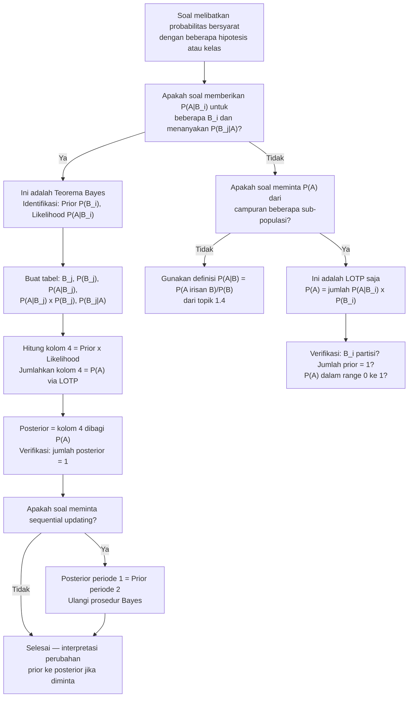

# 📊 1.6 — Teorema Bayes dan Hukum Probabilitas Total

> [!ABSTRACT] Ringkasan Cepat
> **Topik:** Teorema Bayes dan Hukum Probabilitas Total | **Bobot:** ~15–25% | **Difficulty:** Medium
> **Ref:** Hogg-Tanis-Zimm (2015) Bab 1.4; Miller et al. (2014) Bab 2.10–2.11 | **Prereq:** [[1.1 Eksperimen Acak dan Ruang Sampel]], [[1.2 Aksioma dan Perhitungan Probabilitas]], [[1.4 Probabilitas Bersyarat]], [[1.5 Kejadian Independen]]

## Section 0 — Pemetaan Topik

| Topik CF2 | Sub-topik ID | Skill Diuji | Bobot | Difficulty | Prerequisite | Connected Topics | Referensi |
|-----------|--------------|-------------|-------|------------|--------------|------------------|-----------|
| Topik 1: Dasar-Dasar Probabilitas | 1.6 | Mendefinisikan partisi $\Omega$ dan memverifikasi syaratnya; menerapkan Hukum Total Probabilitas (Law of Total Probability / LOTP) untuk menghitung probabilitas marginal; menerapkan Teorema Bayes untuk memperbarui probabilitas; membedakan probabilitas prior dan posterior; menghitung probabilitas posterior dari data diagnosis atau klasifikasi risiko; menyusun dan membaca pohon probabilitas dua tahap | 15–25% | Medium | [[1.1 Eksperimen Acak dan Ruang Sampel]], [[1.2 Aksioma dan Perhitungan Probabilitas]], [[1.4 Probabilitas Bersyarat]], [[1.5 Kejadian Independen]] | [[3.3 Distribusi Bersyarat (Conditional Distribution)]], [[3.4 Nilai Harapan dan Variansi Bersyarat]], [[4.5 Estimasi Parameter]] (Bayesian), [[3.7 Distribusi Majemuk (Compound Distribution)]] | Hogg-Tanis-Zimm (2015) Bab 1.4; Miller et al. (2014) Bab 2.10–2.11 |

## Section 1 — Intuisi

Bayangkan seorang dokter yang sedang menginterpretasikan hasil tes diagnostik seorang pasien. Tes tersebut menunjukkan hasil positif untuk suatu penyakit langka. Pertanyaannya bukan "seberapa akurat tesnya?" — melainkan "mengingat tes positif ini, seberapa besar kemungkinan pasien benar-benar sakit?" Jawaban atas pertanyaan ini memerlukan dua informasi: (1) seberapa umum penyakit tersebut di populasi (*prior probability*), dan (2) seberapa baik tes mendeteksi penyakit dan membedakannya dari orang sehat (*likelihood*). **Teorema Bayes** adalah mesin matematika yang menggabungkan kedua informasi ini menjadi jawaban yang tepat — disebut *posterior probability*.

Dalam konteks aktuaria, mekanisme yang sama digunakan setiap hari. Seorang aktuaris mengetahui proporsi nasabah dalam berbagai kelas risiko (*prior*), dan mengetahui probabilitas klaim dari setiap kelas (*likelihood*). Ketika seorang nasabah tertentu mengajukan klaim, Teorema Bayes menjawab: "mengingat klaim ini terjadi, seberapa besar kemungkinan nasabah ini termasuk kelas risiko tinggi?" Jawaban ini — probabilitas *posterior* — digunakan untuk memperbarui penilaian risiko dan menetapkan premi yang lebih akurat. Inilah fondasi dari *credibility theory* yang menjadi tulang punggung penetapan premi aktuaria modern.

**Hukum Probabilitas Total (LOTP)** adalah batu loncatan menuju Teorema Bayes. Sebelum bisa memperbarui probabilitas dengan Bayes, kita perlu menghitung probabilitas *marginal* dari suatu kejadian yang bisa terjadi melalui beberapa jalur berbeda. LOTP menjawab ini dengan menjumlahkan kontribusi dari setiap jalur — seperti menghitung total kemacetan di kota dengan menjumlahkan kemacetan dari tiap ruas jalan. Bersama-sama, LOTP dan Teorema Bayes membentuk sistem yang paling powerful dalam seluruh Topik 1, dan pemahaman mendalam tentang keduanya membuka pintu menuju distribusi bersyarat di Topik 3 dan estimasi Bayesian di Topik 4.

## Section 2 — Definisi Formal

> [!NOTE] Definisi Matematis
> **Partisi Ruang Sampel:** Koleksi kejadian $\{B_1, B_2, \ldots, B_k\}$ merupakan **partisi** dari $\Omega$ jika:
> $$
> B_i \cap B_j = \emptyset \quad \text{untuk semua } i \neq j \quad \text{(saling eksklusif)}
> $$
> $$
> \bigcup_{i=1}^{k} B_i = \Omega \quad \text{(exhaustive)}
> $$
> $$
> P(B_i) > 0 \quad \text{untuk semua } i \quad \text{(non-trivial)}
> $$
>
> **Hukum Probabilitas Total (Law of Total Probability — LOTP):**
>
> Misalkan $\{B_1, B_2, \ldots, B_k\}$ adalah partisi dari $\Omega$ dengan $P(B_i) > 0$ untuk semua $i$. Maka untuk sembarang kejadian $A$:
> $$
> P(A) = \sum_{i=1}^{k} P(A \mid B_i) \cdot P(B_i)
> $$
>
> **Teorema Bayes:**
>
> Dengan asumsi yang sama di atas, untuk setiap $j = 1, 2, \ldots, k$:
> $$
> P(B_j \mid A) = \frac{P(A \mid B_j) \cdot P(B_j)}{\displaystyle\sum_{i=1}^{k} P(A \mid B_i) \cdot P(B_i)} = \frac{P(A \mid B_j) \cdot P(B_j)}{P(A)}
> $$

### Variabel & Parameter

| Simbol | Makna | Catatan |
|--------|-------|---------|
| $\{B_1, \ldots, B_k\}$ | Partisi dari $\Omega$ | Saling eksklusif, exhaustive, $P(B_i) > 0$ |
| $P(B_i)$ | Probabilitas **prior** (*prior probability*) kejadian $B_i$ | Diketahui sebelum mengamati $A$ |
| $P(A \mid B_i)$ | **Likelihood**: probabilitas $A$ terjadi diberikan $B_i$ | Mendeskripsikan mekanisme pembangkitan $A$ |
| $P(A)$ | Probabilitas marginal $A$ | Dihitung via LOTP: $\sum_i P(A \mid B_i)P(B_i)$ |
| $P(B_j \mid A)$ | Probabilitas **posterior** (*posterior probability*) $B_j$ | Diperbaharui setelah mengamati $A$ |

### Rumus Utama

$$
P(A) = \sum_{i=1}^{k} P(A \mid B_i) \cdot P(B_i)
$$
**Label: Hukum Probabilitas Total (LOTP)** — probabilitas marginal $A$ dihitung sebagai rata-rata tertimbang dari likelihood $P(A \mid B_i)$, dengan bobot $P(B_i)$ yang merupakan probabilitas prior setiap partisi.

$$
P(B_j \mid A) = \frac{P(A \mid B_j) \cdot P(B_j)}{P(A)}
$$
**Label: Teorema Bayes (Bentuk Kompak)** — posterior proporsional terhadap likelihood dikali prior; penyebut $P(A)$ adalah konstanta normalisasi yang menjamin total posterior $= 1$.

$$
P(B_j \mid A) = \frac{P(A \mid B_j) \cdot P(B_j)}{\displaystyle\sum_{i=1}^{k} P(A \mid B_i) \cdot P(B_i)}
$$
**Label: Teorema Bayes (Bentuk Ekspansi)** — penyebut dieksplisitkan via LOTP; ini adalah bentuk yang digunakan dalam perhitungan aktual.

$$
P(B_j \mid A) \propto P(A \mid B_j) \cdot P(B_j)
$$
**Label: Bentuk Proporsional Bayes** — karena penyebut $P(A)$ sama untuk semua $j$, posterior proporsional terhadap produk likelihood dan prior; berguna untuk membandingkan posterior relatif antar hipotesis tanpa menghitung $P(A)$.

$$
\sum_{j=1}^{k} P(B_j \mid A) = 1
$$
**Label: Normalisasi Posterior** — posterior membentuk distribusi probabilitas yang valid atas partisi $\{B_j\}$; dapat digunakan sebagai sanity check.

### Asumsi Eksplisit

- **Partisi $\{B_i\}$ harus exhaustive dan saling eksklusif:** Jika $\{B_i\}$ bukan partisi sempurna (ada overlap atau gap), LOTP tidak berlaku secara langsung.
- **$P(B_i) > 0$ untuk semua $i$:** Partisi dengan $P(B_i) = 0$ tidak berkontribusi ke LOTP dan tidak relevan di Teorema Bayes (probabilitas posterior dari $B_i$ dengan prior nol tetap nol, apapun observasinya).
- **$P(A) > 0$:** Teorema Bayes membutuhkan $P(A) > 0$ di penyebut — mengkondisikan pada kejadian yang mustahil tidak terdefinisi.
- **Likelihood $P(A \mid B_i)$ diketahui atau dapat diestimasikan:** Teorema Bayes "membalik" kondisi dari $P(A \mid B_i)$ menjadi $P(B_i \mid A)$; keakuratan hasilnya bergantung pada keakuratan likelihood yang diinput.

## Section 3 — Jembatan Logika

> [!TIP] Dari Definisi ke Rumus
> LOTP dan Teorema Bayes keduanya berakar dari satu langkah sederhana: **partisi kejadian $A$ menggunakan partisi $\{B_i\}$ dari $\Omega$**. Karena $\{B_i\}$ exhaustive, $A$ dapat ditulis sebagai:
> $$A = (A \cap B_1) \cup (A \cap B_2) \cup \cdots \cup (A \cap B_k)$$
> Karena $B_i$ saling eksklusif, $\{A \cap B_i\}$ juga saling eksklusif. Terapkan Aksioma 3 ([[1.2 Aksioma dan Perhitungan Probabilitas]]):
> $$P(A) = \sum_{i=1}^k P(A \cap B_i) = \sum_{i=1}^k P(A \mid B_i) P(B_i)$$
> Ini adalah LOTP. Teorema Bayes hanyalah definisi probabilitas bersyarat ([[1.4 Probabilitas Bersyarat]]) yang dikombinasikan dengan LOTP di penyebutnya:
> $$P(B_j \mid A) = \frac{P(A \cap B_j)}{P(A)} = \frac{P(A \mid B_j)P(B_j)}{\sum_i P(A \mid B_i)P(B_i)}$$
> Tidak ada yang baru secara matematis — hanya penggabungan cerdas dari dua alat yang sudah dikuasai.

> [!IMPORTANT] Support dan Domain
> - **LOTP berlaku untuk sembarang partisi** — dua partisi berbeda (berbeda jumlah atau definisi $B_i$) akan memberikan hasil $P(A)$ yang sama (karena $P(A)$ adalah nilai tunggal).
> - **Posterior $P(B_j \mid A)$ bergantung pada pilihan partisi** — nilai ini bermakna hanya dalam konteks partisi $\{B_i\}$ yang dipilih.
> - Untuk **kasus dua partisi** ($k = 2$, yaitu $B$ dan $B^c$): LOTP menjadi $P(A) = P(A \mid B)P(B) + P(A \mid B^c)P(B^c)$, dan Teorema Bayes menjadi $P(B \mid A) = P(A \mid B)P(B) / [P(A \mid B)P(B) + P(A \mid B^c)P(B^c)]$.

**Derivasi LOTP dari Aksioma:**

Karena $\{B_1, \ldots, B_k\}$ adalah partisi dari $\Omega$:

$$
A = A \cap \Omega = A \cap \bigcup_{i=1}^k B_i = \bigcup_{i=1}^k (A \cap B_i)
$$

Karena $B_i \cap B_j = \emptyset$ untuk $i \neq j$, maka $(A \cap B_i) \cap (A \cap B_j) = A \cap B_i \cap B_j = A \cap \emptyset = \emptyset$.

Jadi $\{A \cap B_i\}$ juga saling eksklusif. Terapkan aditivitas (Aksioma 3):

$$
P(A) = \sum_{i=1}^k P(A \cap B_i) = \sum_{i=1}^k P(A \mid B_i) \cdot P(B_i) \quad \blacksquare
$$

**Derivasi Teorema Bayes dari Definisi dan LOTP:**

$$
P(B_j \mid A) = \frac{P(A \cap B_j)}{P(A)} \quad \text{(definisi probabilitas bersyarat)}
$$

$$
= \frac{P(A \mid B_j) \cdot P(B_j)}{P(A)} \quad \text{(multiplication rule)}
$$

$$
= \frac{P(A \mid B_j) \cdot P(B_j)}{\displaystyle\sum_{i=1}^k P(A \mid B_i) \cdot P(B_i)} \quad \text{(LOTP di penyebut)} \quad \blacksquare
$$

**Mnemonic — "Prior $\times$ Likelihood $\div$ Evidence":**

$$
\underbrace{P(B_j \mid A)}_{\text{Posterior}} = \frac{\overbrace{P(A \mid B_j)}^{\text{Likelihood}} \times \overbrace{P(B_j)}^{\text{Prior}}}{\underbrace{P(A)}_{\text{Evidence (Normalisasi)}}}
$$

Posterior $\propto$ Likelihood $\times$ Prior — penyebut hanya normalisasi agar total menjadi 1.

**Pohon Probabilitas Dua Tahap — Struktur Umum:**

```
Tahap 1 (Prior)         Tahap 2 (Likelihood)       Daun (Joint)
B_1: P(B_1)     ─→  A | B_1: P(A|B_1)     ─→  P(B_1)·P(A|B_1)  = P(A∩B_1)
                └─→  A^c| B_1: P(A^c|B_1)  ─→  P(B_1)·P(A^c|B_1)

B_2: P(B_2)     ─→  A | B_2: P(A|B_2)     ─→  P(B_2)·P(A|B_2)  = P(A∩B_2)
                └─→  A^c| B_2: P(A^c|B_2)  ─→  P(B_2)·P(A^c|B_2)

   ⋮                        ⋮                         ⋮
```

$P(A)$ = jumlah daun dengan label $A$ = $\sum_i P(B_i) \cdot P(A \mid B_i)$

$P(B_j \mid A)$ = daun $(B_j, A)$ dibagi $P(A)$

> [!DANGER] Dilarang
> 1. **Dilarang membalik likelihood menjadi posterior secara langsung:** $P(B_j \mid A) \neq P(A \mid B_j)$. Ini adalah *confusion of the inverse* — kesalahan yang sudah disinggung di [[1.4 Probabilitas Bersyarat]] dan secara formal diselesaikan oleh Teorema Bayes. Selalu sertakan prior $P(B_j)$ dan normalisasi $P(A)$.
> 2. **Dilarang menggunakan LOTP jika $\{B_i\}$ bukan partisi sejati:** Jika ada overlap ($B_i \cap B_j \neq \emptyset$) atau gap (ada bagian $\Omega$ tidak tercakup), penjumlahan $\sum_i P(A \mid B_i)P(B_i)$ tidak menghasilkan $P(A)$ yang benar. Selalu verifikasi bahwa $\{B_i\}$ saling eksklusif dan exhaustive sebelum menggunakan LOTP.
> 3. **Dilarang menjumlahkan posterior dari partisi yang berbeda:** $\sum_j P(B_j \mid A) = 1$ hanya berlaku untuk satu partisi yang konsisten. Mencampur posterior dari dua set partisi berbeda dan menjumlahkan hasilnya adalah nonsense matematis.

## Section 4 — Contoh Soal

### Soal A — Fundamental

Sebuah perusahaan asuransi kendaraan mengklasifikasikan pengemudi menjadi dua kelompok: risiko rendah ($R$) sebanyak 70% dari portofolio, dan risiko tinggi ($T$) sebanyak 30%. Probabilitas klaim dalam setahun: $P(K \mid R) = 0.10$ dan $P(K \mid T) = 0.30$.

(a) Hitung $P(K)$ — probabilitas sembarang nasabah mengajukan klaim.

(b) Seorang nasabah ternyata mengajukan klaim. Hitung $P(R \mid K)$ dan $P(T \mid K)$.

(c) Verifikasi bahwa $P(R \mid K) + P(T \mid K) = 1$.

(d) Interpretasikan perubahan dari prior ke posterior: apakah informasi klaim mengubah penilaian risiko nasabah?

> [!SUCCESS] Solusi Soal A
>
> **1. Identifikasi Variabel**
> - $P(R) = 0.70$, $P(T) = 0.30$ (prior; partisi karena $R \cup T = \Omega$ dan $R \cap T = \emptyset$)
> - $P(K \mid R) = 0.10$, $P(K \mid T) = 0.30$ (likelihood)
> - Cari: $P(K)$ via LOTP, lalu $P(R \mid K)$ dan $P(T \mid K)$ via Bayes
>
> **2. Identifikasi Distribusi / Model**
> - Dua partisi: $\{R, T\}$; terapkan LOTP lalu Teorema Bayes
> - Pohon probabilitas dua tahap: Tahap 1 = profil risiko, Tahap 2 = klaim
>
> **3. Setup Persamaan**
>
> $$
> P(K) = P(K \mid R) \cdot P(R) + P(K \mid T) \cdot P(T)
> $$
>
> $$
> P(R \mid K) = \frac{P(K \mid R) \cdot P(R)}{P(K)}, \quad P(T \mid K) = \frac{P(K \mid T) \cdot P(T)}{P(K)}
> $$
>
> **4. Eksekusi Aljabar**
>
> (a) LOTP:
> $$
> P(K) = 0.10 \times 0.70 + 0.30 \times 0.30 = 0.070 + 0.090 = 0.160
> $$
>
> (b) Teorema Bayes:
> $$
> P(R \mid K) = \frac{0.10 \times 0.70}{0.160} = \frac{0.070}{0.160} = \frac{7}{16} = 0.4375
> $$
>
> $$
> P(T \mid K) = \frac{0.30 \times 0.30}{0.160} = \frac{0.090}{0.160} = \frac{9}{16} = 0.5625
> $$
>
> (c) $P(R \mid K) + P(T \mid K) = 7/16 + 9/16 = 16/16 = 1$ ✓
>
> (d) Interpretasi perubahan prior → posterior:
>
> | Kelompok | Prior | Posterior (given Klaim) | Perubahan |
> |----------|-------|------------------------|-----------|
> | $R$ (Risiko Rendah) | $0.70$ | $0.4375$ | Turun $\downarrow$ |
> | $T$ (Risiko Tinggi) | $0.30$ | $0.5625$ | Naik $\uparrow$ |
>
> Informasi bahwa nasabah mengajukan klaim **memperbarui** penilaian risiko secara signifikan: probabilitas bahwa nasabah termasuk risiko tinggi meningkat dari 30% (prior) menjadi 56.25% (posterior). Ini masuk akal — klaim lebih sering datang dari kelompok risiko tinggi, sehingga observasi klaim "menggeser" keyakinan ke arah risiko tinggi.
>
> **5. Verification**
>
> Pohon probabilitas — verifikasi semua empat daun menjumlah ke 1:
>
> | Jalur | Probabilitas Daun |
> |-------|-------------------|
> | $R \to K$ | $0.70 \times 0.10 = 0.070$ |
> | $R \to K^c$ | $0.70 \times 0.90 = 0.630$ |
> | $T \to K$ | $0.30 \times 0.30 = 0.090$ |
> | $T \to K^c$ | $0.30 \times 0.70 = 0.210$ |
> | **Total** | $0.070 + 0.630 + 0.090 + 0.210 = \mathbf{1.000}$ ✓ |
>
> $P(K) = 0.070 + 0.090 = 0.160$ ✓ (jumlah daun dengan label $K$)

> [!WARNING] Exam Tips — Soal A
> - **Target waktu:** 8–10 menit.
> - **Common trap:** Menghitung $P(K) = P(K \mid R) + P(K \mid T) = 0.10 + 0.30 = 0.40$ — menjumlahkan likelihood tanpa bobot prior. Ini melanggar LOTP; prior **harus** menjadi bobot.
> - **Shortcut:** Buat tabel dua kolom: (i) $P(B_i)$ dan (ii) $P(A \mid B_i) \times P(B_i)$. Jumlah kolom (ii) = $P(A)$. Posterior tiap $B_i$ = nilai di baris (ii) dibagi total (ii). Ini adalah metode tabular yang paling cepat dan aman.
> - **Interpretasi wajib:** Soal CF2 sering meminta interpretasi perubahan prior → posterior. Selalu nyatakan: arah perubahan (naik/turun) dan mengapa perubahan itu masuk akal secara probabilistik.

### Soal B — Exam-Typical

Sebuah laboratorium diagnostik mengembangkan tes untuk mendeteksi penyakit langka $D$. Diketahui:
- Prevalensi penyakit di populasi: $P(D) = 0.02$ (2%)
- Sensitivitas tes (true positive rate): $P(+ \mid D) = 0.95$
- Spesifisitas tes (true negative rate): $P(- \mid D^c) = 0.90$, sehingga $P(+ \mid D^c) = 0.10$

Sebuah polis asuransi kesehatan mensyaratkan tes ini, dan hasilnya digunakan untuk penyesuaian premi.

(a) Hitung $P(+)$ — probabilitas hasil tes positif dari populasi umum.

(b) Hitung $P(D \mid +)$ — probabilitas seseorang benar-benar sakit diberikan tes positif (*positive predictive value*).

(c) Hitung $P(D^c \mid -)$ — probabilitas seseorang benar-benar sehat diberikan tes negatif (*negative predictive value*).

(d) Seorang aktuaris berargumen bahwa tes ini tidak layak digunakan untuk penyesuaian premi karena "bahkan dengan tes positif, mayoritas orang masih sehat." Verifikasi atau bantah argumen ini secara kuantitatif.

> [!SUCCESS] Solusi Soal B
>
> **1. Identifikasi Variabel**
> - $P(D) = 0.02$, $P(D^c) = 0.98$
> - $P(+ \mid D) = 0.95$, $P(+ \mid D^c) = 0.10$
> - $P(- \mid D) = 0.05$, $P(- \mid D^c) = 0.90$
> - Partisi: $\{D, D^c\}$
>
> **2. Identifikasi Distribusi / Model**
> - LOTP untuk $P(+)$, lalu Teorema Bayes dua arah: $P(D \mid +)$ dan $P(D^c \mid -)$
>
> **3. Setup Persamaan**
>
> $$P(+) = P(+ \mid D) \cdot P(D) + P(+ \mid D^c) \cdot P(D^c)$$
>
> $$P(D \mid +) = \frac{P(+ \mid D) \cdot P(D)}{P(+)}$$
>
> $$P(D^c \mid -) = \frac{P(- \mid D^c) \cdot P(D^c)}{P(-)} = \frac{P(- \mid D^c) \cdot P(D^c)}{1 - P(+)}$$
>
> **4. Eksekusi Aljabar**
>
> (a) LOTP:
> $$
> P(+) = 0.95 \times 0.02 + 0.10 \times 0.98 = 0.019 + 0.098 = 0.117
> $$
>
> (b) Positive Predictive Value:
> $$
> P(D \mid +) = \frac{0.95 \times 0.02}{0.117} = \frac{0.019}{0.117} \approx 0.1624 \approx 16.2\%
> $$
>
> (c) $P(-) = 1 - P(+) = 1 - 0.117 = 0.883$
>
> Negative Predictive Value:
> $$
> P(D^c \mid -) = \frac{0.90 \times 0.98}{0.883} = \frac{0.882}{0.883} \approx 0.9989 \approx 99.9\%
> $$
>
> (d) Verifikasi argumen aktuaris:
>
> $P(D \mid +) \approx 16.2\%$, artinya **84%** orang dengan tes positif sebenarnya sehat.
>
> Argumen aktuaris **terbukti benar secara kuantitatif**: mayoritas (84%) dari mereka yang tes positif memang sehat. Fenomena ini terjadi karena **prevalensi penyakit sangat rendah** ($2\%$): meskipun tes spesifisitasnya $90\%$, populasi sehat yang besar ($98\%$) menghasilkan banyak false positive secara absolut ($0.10 \times 0.98 = 9.8\%$) yang jauh melebihi true positive ($0.95 \times 0.02 = 1.9\%$).
>
> Ini adalah **base rate fallacy** — kesalahan mengabaikan prior rendah saat menginterpretasikan tes diagnostik. Tes ini mungkin berguna sebagai tes skrining (karena negative predictive value-nya sangat tinggi: $99.9\%$), tetapi tidak layak untuk langsung menyesuaikan premi tanpa konfirmasi lebih lanjut.
>
> **5. Verification**
>
> Tabel kontigensi per 10.000 orang:
>
> | | $D$ (200 orang) | $D^c$ (9.800 orang) | Total |
> |--|-----------------|---------------------|-------|
> | $+$ | $0.95 \times 200 = 190$ | $0.10 \times 9800 = 980$ | $1.170$ |
> | $-$ | $0.05 \times 200 = 10$ | $0.90 \times 9800 = 8.820$ | $8.830$ |
> | Total | $200$ | $9.800$ | $10.000$ |
>
> $P(D \mid +) = 190/1170 \approx 0.1624$ ✓
>
> $P(D^c \mid -) = 8820/8830 \approx 0.9989$ ✓

> [!WARNING] Exam Tips — Soal B
> - **Target waktu:** 12–15 menit.
> - **Common trap:** Menginterpretasikan $P(+ \mid D) = 0.95$ sebagai $P(D \mid +) = 0.95$ — ini adalah *confusion of the inverse* yang paling klasik dalam Teorema Bayes. Probabilitas bersyarat tidak simetris.
> - **Insight kritis:** Untuk penyakit langka, bahkan tes dengan sensitivitas dan spesifisitas tinggi bisa memiliki *positive predictive value* yang mengecewakan. Ini adalah implikasi matematis dari prior yang sangat rendah — wajib dipahami untuk soal diagnostik/aktuaria.
> - **Shortcut tabel:** Untuk soal dengan dua hipotesis ($D$ dan $D^c$), tabel kontingensi per 1.000 atau 10.000 orang adalah cara paling cepat dan bebas error untuk menghitung Teorema Bayes — semua angka menjadi frekuensi yang intuitif.
> - **Shortcut (d):** Kenali pola $P(D \mid +)$ rendah untuk penyakit langka — semakin kecil $P(D)$, semakin kecil $P(D \mid +)$ meskipun akurasi tes tetap sama. Ini adalah konsekuensi langsung dari bobot prior dalam LOTP.

### Soal C — Challenging

Sebuah perusahaan asuransi jiwa memiliki tiga kelas nasabah berdasarkan profil kesehatan: Sehat ($S$) 50%, Berisiko Sedang ($M$) 30%, dan Berisiko Tinggi ($T$) 20%. Probabilitas klaim jiwa dalam 5 tahun:
- $P(K \mid S) = 0.01$
- $P(K \mid M) = 0.05$
- $P(K \mid T) = 0.20$

(a) Hitung $P(K)$ — probabilitas klaim dari nasabah acak dalam 5 tahun.

(b) Seorang nasabah **tidak** mengajukan klaim dalam 5 tahun. Hitung probabilitas posterior $P(S \mid K^c)$, $P(M \mid K^c)$, $P(T \mid K^c)$.

(c) Misalkan perusahaan kemudian memperbarui polis nasabah yang tidak klaim di periode pertama untuk periode kedua (5 tahun berikutnya), menggunakan **posterior dari periode pertama sebagai prior untuk periode kedua**. Dengan asumsi likelihood $P(K \mid \cdot)$ tetap sama, hitung $P(K_2)$ — probabilitas klaim di periode kedua untuk nasabah yang tidak klaim di periode pertama.

(d) Bandingkan $P(K_2)$ dengan $P(K)$. Mengapa $P(K_2) < P(K)$? Apa implikasi aktuarialnya?

> [!SUCCESS] Solusi Soal C
>
> **1. Identifikasi Variabel**
> - Prior: $P(S) = 0.50$, $P(M) = 0.30$, $P(T) = 0.20$
> - Likelihood: $P(K \mid S) = 0.01$, $P(K \mid M) = 0.05$, $P(K \mid T) = 0.20$
> - Tiga partisi: $\{S, M, T\}$
>
> **2. Identifikasi Distribusi / Model**
> - LOTP untuk tiga partisi, lalu Teorema Bayes tiga hipotesis
> - Bagian (c): aplikasi Bayes berulang (*sequential Bayesian updating*)
>
> **3. Setup Persamaan**
>
> $$
> P(K) = P(K \mid S)P(S) + P(K \mid M)P(M) + P(K \mid T)P(T)
> $$
>
> $$
> P(B_j \mid K^c) = \frac{P(K^c \mid B_j) \cdot P(B_j)}{P(K^c)}, \quad B_j \in \{S, M, T\}
> $$
>
> **4. Eksekusi Aljabar**
>
> **(a)** LOTP:
> $$
> P(K) = 0.01 \times 0.50 + 0.05 \times 0.30 + 0.20 \times 0.20
> $$
> $$
> = 0.005 + 0.015 + 0.040 = 0.060
> $$
>
> **(b)** Bayes dengan kondisi $K^c$:
>
> $P(K^c) = 1 - P(K) = 0.940$
>
> Hitung $P(K^c \mid B_j) \cdot P(B_j)$ untuk setiap $j$:
>
> | Kelas $B_j$ | $P(B_j)$ | $P(K^c \mid B_j)$ | $P(K^c \mid B_j) \cdot P(B_j)$ | $P(B_j \mid K^c)$ |
> |------------|----------|-------------------|--------------------------------|-------------------|
> | $S$ | $0.50$ | $0.99$ | $0.4950$ | $0.4950/0.940 = 0.5266$ |
> | $M$ | $0.30$ | $0.95$ | $0.2850$ | $0.2850/0.940 = 0.3032$ |
> | $T$ | $0.20$ | $0.80$ | $0.1600$ | $0.1600/0.940 = 0.1702$ |
> | **Total** | $1.00$ | — | $\mathbf{0.9400}$ ✓ | $\mathbf{1.0000}$ ✓ |
>
> Posterior setelah tidak klaim:
> $$
> P(S \mid K^c) \approx 0.5266, \quad P(M \mid K^c) \approx 0.3032, \quad P(T \mid K^c) \approx 0.1702
> $$
>
> **(c)** Gunakan posterior (b) sebagai prior baru untuk periode kedua:
>
> $$
> P(K_2) = P(K \mid S) \cdot P(S \mid K^c) + P(K \mid M) \cdot P(M \mid K^c) + P(K \mid T) \cdot P(T \mid K^c)
> $$
> $$
> = 0.01 \times 0.5266 + 0.05 \times 0.3032 + 0.20 \times 0.1702
> $$
> $$
> = 0.005266 + 0.015160 + 0.034040 = 0.054466 \approx 0.0545
> $$
>
> **(d)** Perbandingan:
>
> $$
> P(K_2) \approx 0.0545 < P(K) = 0.060
> $$
>
> **Mengapa $P(K_2) < P(K)$?**
>
> Nasabah yang tidak klaim di periode pertama adalah sampel yang secara probabilistik "tersaring" — lebih mungkin berasal dari kelompok risiko rendah ($S$). Posterior menunjukkan peningkatan bobot kelompok $S$ (dari $50\%$ ke $52.7\%$) dan penurunan bobot kelompok $T$ (dari $20\%$ ke $17\%$). Karena kelompok $S$ memiliki probabilitas klaim lebih rendah, rata-rata tertimbang (= $P(K_2)$) menjadi lebih kecil.
>
> **Implikasi aktuarial:** Nasabah dengan riwayat tidak klaim seharusnya mendapat premi yang lebih rendah di periode berikutnya — ini adalah dasar matematis dari *experience rating* dan *no-claims discount* dalam penetapan premi. Teorema Bayes memberikan justifikasi formal mengapa "riwayat bersih" merupakan sinyal risiko yang lebih rendah.
>
> **5. Verification**
>
> Cek bahwa posterior (b) menjumlah ke 1: $0.5266 + 0.3032 + 0.1702 = 1.0000$ ✓
>
> Cek bahwa pergeseran logis: $P(S \mid K^c) > P(S)$ ✓, $P(T \mid K^c) < P(T)$ ✓ — tidak klaim meningkatkan probabilitas kelas rendah dan menurunkan kelas tinggi, konsisten dengan intuisi.
>
> Cek $P(K_2)$: harus berada antara $P(K \mid S) = 0.01$ (minimum jika semua orang kelas $S$) dan $P(K \mid T) = 0.20$ (maksimum jika semua orang kelas $T$). $0.0545$ berada dalam rentang ini ✓.

> [!WARNING] Exam Tips — Soal C
> - **Target waktu:** 18–22 menit.
> - **Common trap (b):** Mengkondisikan pada $K^c$ tapi menggunakan $P(K \mid B_j)$ alih-alih $P(K^c \mid B_j) = 1 - P(K \mid B_j)$ di pembilang. Pastikan likelihood yang digunakan sesuai dengan kondisi yang diobservasi.
> - **Common trap (c):** Menggunakan prior awal lagi untuk periode kedua, bukan posterior dari (b). *Sequential Bayesian updating* mengharuskan posterior menjadi prior baru — ini adalah inti dari pendekatan Bayesian.
> - **Strategi tabel:** Untuk tiga atau lebih hipotesis, **selalu gunakan tabel** dengan kolom: $B_j$, $P(B_j)$, $P(A \mid B_j)$, $P(A \mid B_j) \times P(B_j)$, dan $P(B_j \mid A)$. Baris terakhir adalah normalisasi. Ini mencegah hampir semua kesalahan aritmetika.
> - **Nilai soal (d):** Interpretasi aktuarial dari *experience rating* sering dinilai tinggi di CF2 — latih kemampuan menjelaskan "mengapa" dari angka yang diperoleh, bukan sekadar "berapa".

## Section 5 — Verifikasi & Sanity Check

> [!CHECK] Validasi LOTP
> 1. Pastikan $\{B_i\}$ adalah partisi sejati: $\sum_i P(B_i) = 1$ dan $B_i \cap B_j = \emptyset$.
> 2. Setelah menghitung $P(A)$ via LOTP, verifikasi $P(A) \in [0,1]$.
> 3. Cara alternatif: hitung $P(A^c) = \sum_i P(A^c \mid B_i) P(B_i)$ dan pastikan $P(A) + P(A^c) = 1$.

> [!CHECK] Validasi Posterior Teorema Bayes
> 1. $\sum_j P(B_j \mid A) = 1$ — posterior harus menjumlah ke 1 atas seluruh partisi.
> 2. $P(B_j \mid A) \in [0,1]$ untuk setiap $j$.
> 3. Logika arah: jika $P(A \mid B_j)$ tinggi relatif terhadap $P(A)$, maka $P(B_j \mid A) > P(B_j)$ (observasi $A$ meningkatkan posterior $B_j$). Sebaliknya jika $P(A \mid B_j)$ rendah.
> 4. Cek ekstrem: jika $P(A \mid B_j) = 0$, maka $P(B_j \mid A) = 0$ — observasi $A$ mengeliminasi hipotesis $B_j$.

> [!CHECK] Verifikasi via Pohon Probabilitas
> Dari pohon probabilitas: jumlah semua daun harus $= 1$. Nilai $P(A)$ dari LOTP harus sama dengan jumlah daun yang berakhir di $A$. Nilai $P(B_j \mid A)$ = probabilitas daun $(B_j, A)$ dibagi $P(A)$.

### Metode Alternatif

**Metode Tabular (paling direkomendasikan untuk exam CF2):**

| $B_j$ | $P(B_j)$ | $P(A \mid B_j)$ | $P(A \mid B_j) \times P(B_j)$ | $P(B_j \mid A)$ |
|-------|----------|-----------------|-------------------------------|-----------------|
| $B_1$ | $p_1$ | $\ell_1$ | $p_1 \ell_1$ | $p_1\ell_1 / P(A)$ |
| $B_2$ | $p_2$ | $\ell_2$ | $p_2 \ell_2$ | $p_2\ell_2 / P(A)$ |
| $\vdots$ | $\vdots$ | $\vdots$ | $\vdots$ | $\vdots$ |
| **Total** | $1$ | — | $P(A)$ | $1$ |

$P(A) =$ jumlah kolom ke-4; posterior = tiap nilai kolom ke-4 dibagi $P(A)$.

**Metode Proporsional (untuk perbandingan cepat antar posterior):**

Karena $P(B_j \mid A) \propto P(A \mid B_j) \cdot P(B_j)$, hitung dulu "skor" proporsional:

$$
s_j = P(A \mid B_j) \cdot P(B_j)
$$

Kemudian normalisasi: $P(B_j \mid A) = s_j / \sum_i s_i$.

Metode ini berguna ketika hanya perlu membandingkan dua posterior (mana yang lebih besar) tanpa menghitung nilai eksak — sering lebih cepat di soal pilihan ganda.

## Section 6 — Visualisasi Mental

**Pohon Probabilitas — Visualisasi Paling Kuat:**

Bayangkan pohon dengan dua level. Di level pertama, cabang-cabang merepresentasikan partisi $\{B_i\}$ — lebar setiap cabang proporsional dengan prior $P(B_i)$. Di level kedua, dari setiap node $B_i$, tumbuh cabang-cabang untuk $A$ dan $A^c$ dengan lebar proporsional terhadap $P(A \mid B_i)$ dan $P(A^c \mid B_i)$.

Luas setiap daun = panjang jalur = probabilitas jalur itu. **LOTP** menjumlahkan semua daun berlabel $A$ dari kiri. **Teorema Bayes** "membalik" arah pandang: diberikan daun $A$, berapa proporsi yang berasal dari cabang $B_j$?

**Diagram "Area Berbobot":**

Bayangkan persegi panjang dengan lebar total 1. Bagi secara vertikal sesuai prior: lebar $B_1 = P(B_1)$, lebar $B_2 = P(B_2)$, dst. Lalu di setiap bagian vertikal, arsir bagian bawah setinggi $P(A \mid B_i)$ — ini adalah area $A \cap B_i$. LOTP = total area yang diarsir. Bayes = "diberikan kita berada di area yang diarsir, berapa proporsinya yang berasal dari kolom $B_j$?"

### Hubungan Visual ↔ Rumus

Lebar kolom ke-$j$ dalam diagram area berkorespondensi dengan prior:

$$
\text{Lebar kolom } j = P(B_j) \longleftrightarrow \text{prior}
$$

Tinggi arsiran di kolom ke-$j$ berkorespondensi dengan likelihood:

$$
\text{Tinggi arsiran di kolom } j = P(A \mid B_j) \longleftrightarrow \text{likelihood}
$$

Area arsiran di kolom ke-$j$ berkorespondensi dengan joint probability:

$$
\text{Area arsiran di kolom } j = P(B_j) \cdot P(A \mid B_j) = P(A \cap B_j) \longleftrightarrow \text{joint probability}
$$

Proporsi arsiran dari kolom $j$ terhadap total arsiran berkorespondensi dengan posterior:

$$
\frac{\text{Area arsiran kolom } j}{\text{Total area arsiran}} = \frac{P(A \cap B_j)}{P(A)} = P(B_j \mid A) \longleftrightarrow \text{posterior}
$$

## Section 7 — Jebakan Umum

> [!BUG] Kesalahan Parametrisasi
> **Kesalahan 1 — Membalik Likelihood menjadi Posterior:** Menggunakan $P(A \mid B_j)$ langsung sebagai $P(B_j \mid A)$ tanpa koreksi prior dan normalisasi.
>
> **Salah:** $P(D \mid +) = P(+ \mid D) = 0.95$
>
> **Benar:** $P(D \mid +) = P(+ \mid D) \times P(D) / P(+) = 0.95 \times 0.02 / 0.117 \approx 0.162$
>
> **Kesalahan 2 — LOTP tanpa bobot prior:** Menghitung $P(A) = \frac{1}{k}\sum_i P(A \mid B_i)$ (rata-rata aritmetika biasa) alih-alih $\sum_i P(A \mid B_i) P(B_i)$ (rata-rata tertimbang). Ini hanya benar jika semua $P(B_i) = 1/k$.

> [!BUG] Kesalahan Konseptual
> 1. **$\{B_i\}$ tidak diverifikasi sebagai partisi.** Menggunakan LOTP tanpa memastikan $\{B_i\}$ exhaustive dan saling eksklusif menghasilkan $P(A)$ yang salah. Jika ada overlap, LOTP akan menghitung beberapa bagian double-counting.
> 2. **Posterior tidak dinormalisasi.** Menghitung $P(A \mid B_j) \cdot P(B_j)$ untuk satu $j$ dan menyebutnya posterior — ini hanyalah joint probability $P(A \cap B_j)$, bukan posterior. Harus dibagi $P(A)$.
> 3. **Sequential Bayes: tidak memperbarui prior.** Dalam masalah multi-periode, posterior dari periode pertama harus menjadi prior untuk periode kedua. Menggunakan prior awal terus-menerus mengabaikan informasi yang sudah diperoleh.
> 4. **Mengira $P(B_j \mid A)$ tidak bergantung pada pilihan partisi lain.** Menambah atau menghapus salah satu $B_i$ dari partisi akan mengubah $P(A)$ (LOTP) dan dengan itu mengubah **semua** posterior, termasuk $P(B_j \mid A)$.

> [!BUG] Kesalahan Interpretasi Soal
> - **"Probabilitas penyakit diberikan tes positif"** $\leftrightarrow$ $P(D \mid +)$ — posterior, bukan $P(+ \mid D)$ yang adalah sensitivitas.
> - **"Probabilitas tes positif diberikan sakit"** $\leftrightarrow$ $P(+ \mid D)$ — likelihood/sensitivitas, bukan posterior.
> - **"Prevalensi" atau "proporsi populasi"** $\leftrightarrow$ prior $P(B_i)$ — bukan posterior.
> - **"Frekuensi relatif dari kelas $B_j$ di antara mereka yang mengalami $A$"** $\leftrightarrow$ posterior $P(B_j \mid A)$ — ini adalah cara verbal yang paling umum untuk mengekspresikan permintaan Teorema Bayes.

> [!CAUTION] Red Flags
> - **Soal memberikan $P(A \mid B_i)$ untuk beberapa $i$ dan menanyakan $P(B_j \mid A)$:** Ini adalah Teorema Bayes secara definitif — langsung setup LOTP di penyebut.
> - **Kata "prior", "posterior", "update", "revise":** Secara eksplisit menunjukkan konteks Bayesian — gunakan Teorema Bayes.
> - **Jumlah posterior tidak sama dengan 1 setelah dihitung:** Pasti ada kesalahan di LOTP (penyebut salah) atau pembulatan yang tidak konsisten — periksa ulang tabel.
> - **$P(A)$ yang dihitung via LOTP memberikan hasil $> 1$ atau $< 0$:** Prior atau likelihood ada yang salah — mungkin likelihood tidak konsisten (misalnya $P(A \mid B_i) > 1$) atau prior tidak menjumlah ke 1.
> - **Soal menyebut "sensitivitas" dan "spesifisitas":** Ini adalah soal tes diagnostik — langsung identifikasi $P(+ \mid D)$ = sensitivitas dan $P(- \mid D^c)$ = spesifisitas, dan ingat $P(+ \mid D^c) = 1 - \text{spesifisitas}$.

## Section 8 — Ringkasan Eksekutif

> [!SUMMARY] Must-Remember
> 1. **Hukum Probabilitas Total (LOTP):**
>    $$P(A) = \sum_{i=1}^{k} P(A \mid B_i) \cdot P(B_i), \quad \{B_i\} \text{ partisi } \Omega$$
> 2. **Teorema Bayes (bentuk operasional):**
>    $$P(B_j \mid A) = \frac{P(A \mid B_j) \cdot P(B_j)}{\displaystyle\sum_{i=1}^{k} P(A \mid B_i) \cdot P(B_i)}$$
> 3. **Prior $\times$ Likelihood $\propto$ Posterior:**
>    $$P(B_j \mid A) \propto P(A \mid B_j) \cdot P(B_j)$$
> 4. **Normalisasi posterior:**
>    $$\sum_{j=1}^{k} P(B_j \mid A) = 1$$
> 5. **Kasus dua partisi ($B$ dan $B^c$):**
>    $$P(B \mid A) = \frac{P(A \mid B)\,P(B)}{P(A \mid B)\,P(B) + P(A \mid B^c)\,P(B^c)}$$

### Kapan Digunakan

- **Trigger keywords:** "probabilitas posterior", "diberikan hasil tes", "mengingat kejadian terjadi — apa probabilitas kelas/tipe?", "perbarui probabilitas", "sensitivitas dan spesifisitas", "false positive", "experience rating", "prevalensi".
- **Tipe skenario soal:**
  - Klasifikasi risiko: diberikan prior per kelas dan likelihood klaim per kelas — hitung posterior kelas setelah observasi klaim.
  - Tes diagnostik: diberikan prevalensi, sensitivitas, spesifisitas — hitung positive/negative predictive value.
  - Sequential updating: posterior periode pertama menjadi prior periode kedua.
  - Hitung $P(A)$ marginal dari campuran populasi via LOTP sebagai langkah awal.

### Kapan TIDAK Boleh Digunakan

- **Jika $\{B_i\}$ bukan partisi:** LOTP memerlukan partisi sejati — jika $B_i$ overlap atau tidak exhaustive, LOTP tidak berlaku tanpa modifikasi.
- **Jika mencari $P(A \mid B_j)$ dan sudah tersedia langsung:** Tidak perlu Teorema Bayes — gunakan langsung nilai yang diberikan.
- **Jika variabel acak kontinu:** LOTP dan Bayes tetap berlaku tetapi dalam bentuk integral — ini dibahas di [[3.3 Distribusi Bersyarat (Conditional Distribution)]] dan [[3.4 Nilai Harapan dan Variansi Bersyarat]].
- **Untuk estimasi parameter Bayesian formal** (prior distribusi, bukan prior kejadian): beralih ke [[4.5 Estimasi Parameter]] sub-topik Bayesian estimation.

### Quick Decision Tree



---

> [!QUOTE] Follow-up Options
> 1. *"Berikan contoh soal Teorema Bayes dengan tiga hipotesis dalam konteks underwriting asuransi jiwa dengan data mortalitas"*
> 2. *"Jelaskan hubungan [[1.6 Teorema Bayes dan Hukum Probabilitas Total]] dengan [[3.4 Nilai Harapan dan Variansi Bersyarat]] — bagaimana LOTP digeneralisasi menjadi Law of Total Expectation $E[X] = E[E[X \mid Y]]$"*
> 3. *"Buat flashcard 1-halaman untuk topik ini"*

*📖 Ref: Hogg-Tanis-Zimm (2015) Bab 1.4; Miller et al. (2014) Bab 2.10–2.11 | 🗓️ 2026-02-21 | #CF2 #Probabilitas #TeoremaBAyes #LOTP #Prior #Posterior #Likelihood #Partisi #ExperienceRating*
