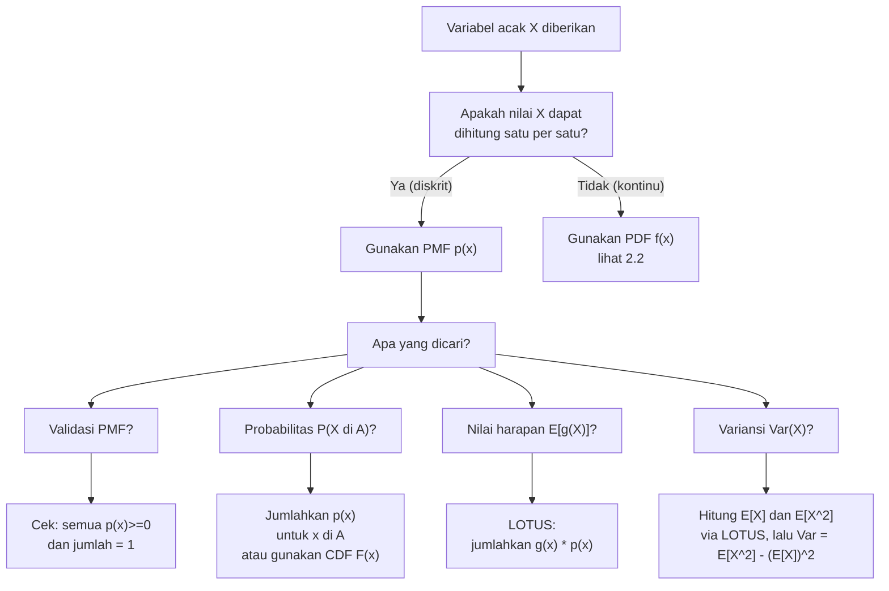

# 📊 2.1 — Variabel Acak Diskrit

> [!ABSTRACT] Ringkasan Cepat
> **Topik:** Variabel Acak Diskrit | **Bobot:** ~25–35% | **Difficulty:** Medium
> **Ref:** Hogg-Tanis-Zimm Bab 2.1–2.2; Miller Bab 3.1–3.4, 4.1 | **Prereq:** [[1.1 Eksperimen Acak dan Ruang Sampel]], [[1.2 Aksioma dan Perhitungan Probabilitas]]

## Section 0 — Pemetaan Topik

| Topik CF2 | Sub-topik ID | Skill Diuji | Bobot | Difficulty | Prerequisite | Connected Topics | Referensi |
|-----------|--------------|-------------|-------|------------|--------------|------------------|-----------|
| Topik 2: Variabel Acak Univariat | 2.1 | Mendefinisikan PMF dan CDF diskrit; menghitung $E[X]$, $\text{Var}(X)$, momen ke-$k$; menerapkan LOTUS; menentukan distribusi fungsi dari variabel acak diskrit | 25–35% | Medium | [[1.1 Eksperimen Acak dan Ruang Sampel]], [[1.2 Aksioma dan Perhitungan Probabilitas]] | [[2.2 Variabel Acak Kontinu]], [[2.3 Fungsi Pembangkit]], [[2.4 Transformasi Variabel Acak Univariat]], [[2.5 Distribusi Diskrit Umum]], [[3.1 Distribusi Gabungan (Joint Distribution)]] | Hogg-Tanis-Zimm (2015) Bab 2.1–2.2; Miller et al. (2014) Bab 3.1–3.4, 4.1 |

## Section 1 — Intuisi

Bayangkan seorang aktuaris yang menganalisis klaim harian sebuah perusahaan asuransi. Dalam satu hari, bisa saja terdapat 0 klaim, 1 klaim, 2 klaim, dan seterusnya — tetapi tidak mungkin ada 1,5 klaim. Hasil yang bisa dihitung satu per satu seperti inilah yang memotivasi konsep **variabel acak diskrit**: sebuah variabel yang hanya mengambil nilai-nilai terhitung (countable), seperti bilangan bulat non-negatif. Tidak ada nilai "di antara" yang mungkin terjadi.

Untuk bisa bekerja dengan variabel acak ini secara matematis, kita perlu cara untuk mendeskripsikan *seberapa sering* setiap nilai muncul. Inilah peran **fungsi massa probabilitas (PMF)**: ia menetapkan probabilitas untuk setiap nilai yang mungkin. Misalnya, jika peluang mendapat 0 klaim adalah 40%, 1 klaim adalah 35%, dan 2 klaim adalah 25%, maka PMF tersebut secara lengkap mendeskripsikan ketidakpastian dalam sistem. Selanjutnya, **fungsi distribusi kumulatif (CDF)** menjawab pertanyaan berbeda: "berapa peluang mendapat *paling banyak* $k$ klaim?" — yakni dengan menjumlahkan semua probabilitas dari 0 hingga $k$.

Yang paling penting secara praktis adalah ukuran ringkas: **nilai harapan (mean)** yang memberitahu kita angka klaim *rata-rata* per hari, dan **variansi** yang mengukur seberapa berfluktuasi angka klaim tersebut di sekitar rata-rata. Dua angka ini — $E[X]$ dan $\text{Var}(X)$ — adalah fondasi untuk penentuan premi, cadangan teknis, dan hampir seluruh pemodelan risiko aktuaria. Menguasai cara menghitung dan menginterpretasikannya dari PMF adalah keterampilan paling fundamental di seluruh Topik 2.

## Section 2 — Definisi Formal

> [!NOTE] Definisi Matematis
> Suatu **variabel acak diskrit** $X$ adalah fungsi $X: \Omega \to \mathbb{R}$ sedemikian sehingga himpunan nilainya $\mathcal{X} = \{x_1, x_2, x_3, \ldots\}$ bersifat terhitung (*countable*).
>
> **Fungsi Massa Probabilitas (PMF):**
> $$
> p(x) = p_X(x) = P(X = x), \quad x \in \mathcal{X}
> $$
>
> **Fungsi Distribusi Kumulatif (CDF):**
> $$
> F(x) = F_X(x) = P(X \leq x) = \sum_{t \leq x,\, t \in \mathcal{X}} p(t)
> $$
>
> **Nilai Harapan (Mean):**
> $$
> E[X] = \mu = \sum_{x \in \mathcal{X}} x \cdot p(x)
> $$
>
> **Variansi:**
> $$
> \text{Var}(X) = \sigma^2 = E\!\left[(X - \mu)^2\right] = \sum_{x \in \mathcal{X}} (x - \mu)^2 \cdot p(x)
> $$

### Variabel & Parameter

| Simbol | Makna | Catatan |
|--------|-------|---------|
| $X$ | Variabel acak diskrit | Fungsi dari $\Omega$ ke $\mathbb{R}$ |
| $\mathcal{X}$ | Support: himpunan semua nilai yang mungkin dari $X$ | Harus terhitung (*countable*) |
| $p(x)$ atau $p_X(x)$ | Fungsi massa probabilitas (PMF) | $p(x) \geq 0$ untuk semua $x$; $\sum_x p(x) = 1$ |
| $F(x)$ atau $F_X(x)$ | Fungsi distribusi kumulatif (CDF) | Non-decreasing; right-continuous; $\lim_{x\to -\infty} F(x) = 0$; $\lim_{x\to\infty} F(x) = 1$ |
| $E[X]$ atau $\mu$ | Nilai harapan (mean) | Pusat distribusi secara rata-rata |
| $E[X^k] = \mu_k'$ | Momen ke-$k$ tentang nol (*raw moment*) | $\mu_1' = E[X] = \mu$ |
| $E[(X-\mu)^k] = \mu_k$ | Momen ke-$k$ sentral (*central moment*) | $\mu_2 = \text{Var}(X)$ |
| $\text{Var}(X)$ atau $\sigma^2$ | Variansi | Mengukur penyebaran di sekitar $\mu$ |
| $\sigma$ | Standar deviasi $= \sqrt{\text{Var}(X)}$ | Satuan sama dengan $X$ |
| $g(X)$ | Fungsi dari variabel acak $X$ | Digunakan dalam LOTUS |

### Rumus Utama

$$
\sum_{x \in \mathcal{X}} p(x) = 1
$$
**Label: Syarat Normalisasi PMF** — jumlah seluruh probabilitas harus tepat sama dengan 1; ini adalah syarat perlu dan cukup bagi suatu fungsi non-negatif untuk menjadi PMF yang valid.

$$
F(x) = \sum_{t \leq x,\, t \in \mathcal{X}} p(t)
$$
**Label: CDF dari PMF** — CDF diperoleh dengan menjumlahkan (bukan mengintegrasikan) PMF dari nilai terkecil hingga $x$.

$$
P(a < X \leq b) = F(b) - F(a)
$$
**Label: Probabilitas Interval dari CDF** — untuk $a < b$; perhatikan tanda $<$ di sisi kiri (eksklusif) dan $\leq$ di sisi kanan (inklusif) untuk variabel diskrit.

$$
E[g(X)] = \sum_{x \in \mathcal{X}} g(x) \cdot p(x)
$$
**Label: LOTUS (Law of the Unconscious Statistician)** — nilai harapan dari fungsi $g(X)$ dihitung langsung dari PMF $X$ tanpa perlu menentukan distribusi $g(X)$ terlebih dahulu.

$$
\text{Var}(X) = E[X^2] - (E[X])^2 = \mu_2' - \mu^2
$$
**Label: Rumus Komputasional Variansi** — lebih efisien secara komputasi dibanding definisi langsung; berlaku selalu.

$$
\text{Var}(aX + b) = a^2 \,\text{Var}(X)
$$
**Label: Sifat Variansi terhadap Transformasi Linear** — konstanta aditif $b$ tidak memengaruhi variansi; konstanta multiplikatif $a$ dikuadratkan.

$$
E[aX + b] = a\,E[X] + b
$$
**Label: Linieritas Nilai Harapan** — berlaku untuk semua variabel acak (diskrit maupun kontinu), tidak memerlukan independensi.

### Asumsi Eksplisit

- **Support terhitung:** $\mathcal{X}$ adalah himpunan terhitung (bisa hingga maupun tak hingga terhitung seperti $\{0, 1, 2, \ldots\}$).
- **Existensi nilai harapan:** $E[X]$ terdefinisi jika dan hanya jika $\sum_{x \in \mathcal{X}} |x| \cdot p(x) < \infty$.
- **Existensi variansi:** $\text{Var}(X)$ terdefinisi jika dan hanya jika $E[X^2] < \infty$, yang mengimplikasikan $E[X]$ juga terdefinisi.
- **PMF non-negatif:** $p(x) \geq 0$ untuk semua $x \in \mathcal{X}$, dan $p(x) = 0$ untuk $x \notin \mathcal{X}$.

## Section 3 — Jembatan Logika

> [!TIP] Dari Definisi ke Rumus
> PMF adalah titik awal segalanya. Dari PMF, semua ukuran ringkas dapat diturunkan. **CDF** hanyalah "akumulasi" PMF dari kiri: $F(x) = \sum_{t \leq x} p(t)$ — bayangkan menumpuk batang-batang histogram dari kiri ke kanan. **Nilai harapan** $E[X] = \sum x \cdot p(x)$ adalah rata-rata tertimbang dari semua nilai yang mungkin, di mana bobotnya adalah probabilitasnya sendiri — ini persis analogi dengan rata-rata tertimbang yang kita kenal dari statistika deskriptif. **Variansi** $\text{Var}(X) = E[(X-\mu)^2]$ adalah nilai harapan dari "jarak kuadrat" ke mean — LOTUS langsung memberikan $\sum (x-\mu)^2 p(x)$.

> [!IMPORTANT] Support dan Domain
> - **Support $\mathcal{X}$:** himpunan semua $x$ dengan $p(x) > 0$. Di luar support, $p(x) = 0$.
> - Support bisa **hingga** (e.g., $\{1, 2, 3, 4, 5, 6\}$ untuk dadu) atau **tak hingga terhitung** (e.g., $\{0, 1, 2, \ldots\}$ untuk distribusi Poisson).
> - CDF untuk variabel diskrit adalah **fungsi tangga** (*step function*): konstan di antara nilai-nilai support, melompat sebesar $p(x_k)$ tepat di setiap $x_k \in \mathcal{X}$.
> - $F$ bersifat *right-continuous*: $F(x) = P(X \leq x)$, bukan $P(X < x)$.

**Derivasi Rumus Komputasional Variansi:**

Mulai dari definisi:
$$
\text{Var}(X) = E\!\left[(X-\mu)^2\right]
$$

Ekspansi kuadrat:
$$
= E\!\left[X^2 - 2\mu X + \mu^2\right]
$$

Terapkan linieritas nilai harapan:
$$
= E[X^2] - 2\mu\, E[X] + \mu^2
$$

Substitusi $E[X] = \mu$:
$$
= E[X^2] - 2\mu^2 + \mu^2 = E[X^2] - \mu^2
$$

Sehingga:
$$
\text{Var}(X) = E[X^2] - (E[X])^2
$$

**Derivasi LOTUS:**

Misalkan $g: \mathcal{X} \to \mathbb{R}$ dan $Y = g(X)$. Untuk setiap nilai $y$ yang mungkin diambil $Y$, $P(Y = y) = \sum_{x: g(x) = y} p_X(x)$. Maka:

$$
E[Y] = \sum_y y \cdot P(Y = y) = \sum_y y \sum_{x:\, g(x)=y} p_X(x) = \sum_{x \in \mathcal{X}} g(x)\, p_X(x)
$$

Langkah terakhir menggunakan fakta bahwa setiap $x \in \mathcal{X}$ berkontribusi tepat sekali dalam penjumlahan ganda tersebut.

> [!DANGER] Dilarang
> 1. **Dilarang** menggunakan integral $\int$ untuk menghitung $E[X]$ atau $\text{Var}(X)$ dari variabel acak diskrit — variabel diskrit menggunakan $\sum$, bukan $\int$. Integral hanya untuk variabel kontinu.
> 2. **Dilarang** menghitung $P(a \leq X \leq b)$ sebagai $F(b) - F(a)$ untuk variabel diskrit ketika batas bawah inklusif — rumus yang benar adalah $F(b) - F(a-1)$ jika $a$ adalah bilangan bulat, atau lebih aman: $\sum_{x=a}^{b} p(x)$ langsung dari PMF.
> 3. **Dilarang** menyimpulkan bahwa $\text{Var}(X) = 0$ hanya karena $E[X] = 0$ — variansi nol berarti $X$ adalah konstanta hampir pasti, bukan karena meannya nol.

## Section 4 — Contoh Soal

### Soal A — Fundamental

Sebuah dadu tidak imbang (*biased die*) memiliki enam sisi dengan nilai 1 hingga 6. PMF-nya didefinisikan sebagai $p(x) = cx$ untuk $x = 1, 2, 3, 4, 5, 6$, di mana $c$ adalah konstanta. Tentukan: (a) nilai $c$, (b) $P(X \leq 3)$, (c) $E[X]$, dan (d) $\text{Var}(X)$.

> [!SUCCESS] Solusi Soal A
>
> **1. Identifikasi Variabel**
> - Variabel acak: $X =$ nilai yang muncul pada satu lemparan dadu tidak imbang
> - Support: $\mathcal{X} = \{1, 2, 3, 4, 5, 6\}$
> - PMF: $p(x) = cx$, parameter tidak diketahui $c > 0$
>
> **2. Identifikasi Distribusi / Model**
> - Variabel acak diskrit dengan support hingga
> - Syarat normalisasi digunakan untuk menentukan $c$
>
> **3. Setup Persamaan**
>
> Dari syarat normalisasi:
> $$
> \sum_{x=1}^{6} p(x) = 1 \implies c \sum_{x=1}^{6} x = 1
> $$
>
> **4. Eksekusi Aljabar**
>
> **(a) Menentukan $c$:**
> $$
> c(1 + 2 + 3 + 4 + 5 + 6) = c \cdot 21 = 1 \implies c = \frac{1}{21}
> $$
> Maka $p(x) = \dfrac{x}{21}$ untuk $x = 1, 2, 3, 4, 5, 6$.
>
> **(b) $P(X \leq 3) = F(3)$:**
> $$
> P(X \leq 3) = p(1) + p(2) + p(3) = \frac{1}{21} + \frac{2}{21} + \frac{3}{21} = \frac{6}{21} = \frac{2}{7}
> $$
>
> **(c) $E[X]$:**
> $$
> E[X] = \sum_{x=1}^{6} x \cdot \frac{x}{21} = \frac{1}{21}\sum_{x=1}^{6} x^2 = \frac{1}{21}(1 + 4 + 9 + 16 + 25 + 36) = \frac{91}{21} = \frac{13}{3} \approx 4.333
> $$
>
> **(d) $\text{Var}(X)$:**
>
> Pertama hitung $E[X^2]$:
> $$
> E[X^2] = \sum_{x=1}^{6} x^2 \cdot \frac{x}{21} = \frac{1}{21}\sum_{x=1}^{6} x^3 = \frac{1}{21}(1 + 8 + 27 + 64 + 125 + 216) = \frac{441}{21} = 21
> $$
>
> Kemudian:
> $$
> \text{Var}(X) = E[X^2] - (E[X])^2 = 21 - \left(\frac{13}{3}\right)^2 = 21 - \frac{169}{9} = \frac{189 - 169}{9} = \frac{20}{9} \approx 2.222
> $$
>
> **5. Verification**
> - $c = 1/21 > 0$ ✓ dan $\sum p(x) = 21/21 = 1$ ✓
> - $P(X \leq 3) = 2/7 \approx 0.286$: masuk akal karena dadu condong ke nilai besar (nilai kecil dapat probabilitas kecil), sehingga $P(X \leq 3) < 0.5$ ✓
> - $E[X] = 13/3 \approx 4.33 > 3.5$ (mean dadu seimbang): konsisten karena sisi besar lebih "berat" ✓
> - $\text{Var}(X) = 20/9 > 0$ ✓

> [!WARNING] Exam Tips — Soal A
> - **Target waktu:** 4–5 menit
> - **Common trap:** Menghitung $\sum_{x=1}^{6} x^2$ untuk $E[X]$ dan lupa bahwa $p(x) = x/21$, bukan $1/6$. Langkah paling rentan error: pastikan kamu mengalikan $x$ dengan $p(x) = x/21$, sehingga suku-suku menjadi $x^2/21$.
> - **Shortcut $\sum x^3$:** Gunakan formula $\left(\frac{n(n+1)}{2}\right)^2$ untuk $\sum_{x=1}^n x^3$. Di sini $n=6$: $\left(\frac{6 \cdot 7}{2}\right)^2 = 21^2 = 441$ ✓

---

### Soal B — Exam-Typical

Seorang manajer risiko memodelkan jumlah kecelakaan kerja per minggu di suatu pabrik dengan variabel acak $X$ yang memiliki PMF:

$$
p(x) = \frac{k}{x(x+1)}, \quad x = 1, 2, 3, \ldots
$$

(a) Tentukan nilai $k$ sehingga $p(x)$ valid sebagai PMF. (b) Hitung $P(X \geq 3)$. (c) Hitung $E[X]$, atau tentukan apakah $E[X]$ terdefinisi. (d) Tentukan CDF $F(x)$ dalam bentuk ekspresi tertutup.

> [!SUCCESS] Solusi Soal B
>
> **1. Identifikasi Variabel**
> - Variabel acak: $X =$ jumlah kecelakaan kerja per minggu
> - Support: $\mathcal{X} = \{1, 2, 3, \ldots\}$ (tak hingga terhitung)
> - PMF: $p(x) = k/[x(x+1)]$, parameter $k$ tidak diketahui
>
> **2. Identifikasi Distribusi / Model**
> - Variabel acak diskrit dengan support tak hingga
> - Kunci: gunakan dekomposisi pecahan parsial $\frac{1}{x(x+1)} = \frac{1}{x} - \frac{1}{x+1}$ (deret teleskopik)
>
> **3. Setup Persamaan**
>
> Syarat normalisasi:
> $$
> k \sum_{x=1}^{\infty} \frac{1}{x(x+1)} = 1
> $$
>
> **4. Eksekusi Aljabar**
>
> **(a) Menentukan $k$:**
>
> Dekomposisi parsial: $\dfrac{1}{x(x+1)} = \dfrac{1}{x} - \dfrac{1}{x+1}$
>
> $$
> \sum_{x=1}^{\infty} \left(\frac{1}{x} - \frac{1}{x+1}\right) = \lim_{n\to\infty}\left(1 - \frac{1}{n+1}\right) = 1
> $$
>
> Maka $k \cdot 1 = 1$, sehingga $k = 1$.
>
> PMF valid: $p(x) = \dfrac{1}{x(x+1)}$ untuk $x = 1, 2, 3, \ldots$
>
> **(b) $P(X \geq 3)$:**
> $$
> P(X \geq 3) = 1 - P(X \leq 2) = 1 - p(1) - p(2)
> $$
> $$
> p(1) = \frac{1}{1 \cdot 2} = \frac{1}{2}, \quad p(2) = \frac{1}{2 \cdot 3} = \frac{1}{6}
> $$
> $$
> P(X \geq 3) = 1 - \frac{1}{2} - \frac{1}{6} = 1 - \frac{3}{6} - \frac{1}{6} = \frac{2}{6} = \frac{1}{3}
> $$
>
> **(c) $E[X]$:**
> $$
> E[X] = \sum_{x=1}^{\infty} x \cdot \frac{1}{x(x+1)} = \sum_{x=1}^{\infty} \frac{1}{x+1} = \frac{1}{2} + \frac{1}{3} + \frac{1}{4} + \cdots
> $$
>
> Deret ini adalah **deret harmonik yang divergen** ($\sum_{x=2}^{\infty} 1/x = \infty$). Dengan demikian, $E[X]$ **tidak terdefinisi (tidak hingga)**.
>
> **(d) CDF $F(x)$ untuk $x \in \{1, 2, 3, \ldots\}$:**
> $$
> F(n) = \sum_{x=1}^{n} \frac{1}{x(x+1)} = \sum_{x=1}^{n}\left(\frac{1}{x} - \frac{1}{x+1}\right) = 1 - \frac{1}{n+1} = \frac{n}{n+1}
> $$
>
> Jadi: $F(x) = \dfrac{\lfloor x \rfloor}{\lfloor x \rfloor + 1}$ untuk $x \geq 1$, dan $F(x) = 0$ untuk $x < 1$.
>
> **5. Verification**
> - $\sum p(x) = F(\infty) = \lim_{n\to\infty} n/(n+1) = 1$ ✓
> - $F$ non-decreasing dan $F(x) \to 1$ saat $x \to \infty$ ✓
> - $P(X \geq 3) = 1 - F(2) = 1 - 2/3 = 1/3$ ✓ (konsisten dengan hasil di atas)
> - $E[X]$ tidak terdefinisi: konsisten karena ekor distribusi cukup berat ($p(x) \sim 1/x^2$ yang *borderline*)

> [!WARNING] Exam Tips — Soal B
> - **Target waktu:** 8–10 menit
> - **Common trap 1:** Langsung mencoba menghitung $\sum_{x=1}^{\infty} x \cdot p(x)$ numerik tanpa menguji konvergensinya — selalu cek dulu apakah deret $\sum |x| \cdot p(x)$ konvergen sebelum menyimpulkan $E[X]$ terdefinisi.
> - **Common trap 2:** Tidak mengenali deret teleskopik. Jika PMF berbentuk $p(x) \propto 1/[x(x+1)]$, segera gunakan dekomposisi parsial.
> - **Shortcut CDF teleskopik:** Untuk support $\{1, 2, 3, \ldots\}$ dengan PMF bentuk teleskopik, CDF hampir selalu punya ekspresi tertutup sederhana.

---

### Soal C — Challenging

Suatu perusahaan asuransi menggunakan variabel acak $X$ untuk memodelkan jumlah klaim pada suatu polis dalam satu tahun, dengan PMF:

$$
p(x) = \frac{1}{3}\left(\frac{2}{3}\right)^x, \quad x = 0, 1, 2, \ldots
$$

Didefinisikan variabel acak baru $Y = \min(X, 2)$ (yang merepresentasikan jumlah klaim yang *dibayar* perusahaan, karena polis hanya menanggung maksimal 2 klaim). (a) Tentukan PMF dari $Y$. (b) Hitung $E[Y]$ dan $\text{Var}(Y)$. (c) Hitung $E[Y^2]$ menggunakan LOTUS langsung dari PMF $X$. (d) Verifikasi konsistensi antara hasil (b) dan (c).

> [!SUCCESS] Solusi Soal C
>
> **1. Identifikasi Variabel**
> - $X \sim \text{Geom}(p)$ dalam parametrisasi jumlah kegagalan sebelum sukses pertama, dengan $p = 1/3$ (peluang "sukses" = polis tidak klaim). PMF: $p_X(x) = (1/3)(2/3)^x$ untuk $x = 0, 1, 2, \ldots$
> - $Y = \min(X, 2)$: support $\mathcal{Y} = \{0, 1, 2\}$
>
> **2. Identifikasi Distribusi / Model**
> - Transformasi variabel acak diskrit melalui fungsi $g(x) = \min(x, 2)$
> - Distribusi $Y$ diperoleh dengan mengelompokkan semua $x \geq 2$ ke nilai $Y = 2$
>
> **3. Setup Persamaan**
>
> $$
> p_Y(y) = P(Y = y) = P(\min(X,2) = y)
> $$
>
> **4. Eksekusi Aljabar**
>
> **(a) PMF dari $Y$:**
>
> $P(Y = 0) = P(X = 0) = \dfrac{1}{3}$
>
> $P(Y = 1) = P(X = 1) = \dfrac{1}{3} \cdot \dfrac{2}{3} = \dfrac{2}{9}$
>
> $P(Y = 2) = P(X \geq 2) = 1 - P(X = 0) - P(X = 1) = 1 - \dfrac{1}{3} - \dfrac{2}{9} = 1 - \dfrac{3}{9} - \dfrac{2}{9} = \dfrac{4}{9}$
>
> Verifikasi: $1/3 + 2/9 + 4/9 = 3/9 + 2/9 + 4/9 = 9/9 = 1$ ✓
>
> PMF $Y$:
>
> | $y$ | 0 | 1 | 2 |
> |-----|---|---|---|
> | $p_Y(y)$ | $3/9$ | $2/9$ | $4/9$ |
>
> **(b) $E[Y]$ dan $\text{Var}(Y)$:**
>
> $$
> E[Y] = 0 \cdot \frac{3}{9} + 1 \cdot \frac{2}{9} + 2 \cdot \frac{4}{9} = 0 + \frac{2}{9} + \frac{8}{9} = \frac{10}{9}
> $$
>
> $$
> E[Y^2] = 0^2 \cdot \frac{3}{9} + 1^2 \cdot \frac{2}{9} + 2^2 \cdot \frac{4}{9} = 0 + \frac{2}{9} + \frac{16}{9} = \frac{18}{9} = 2
> $$
>
> $$
> \text{Var}(Y) = E[Y^2] - (E[Y])^2 = 2 - \left(\frac{10}{9}\right)^2 = 2 - \frac{100}{81} = \frac{162 - 100}{81} = \frac{62}{81} \approx 0.765
> $$
>
> **(c) $E[Y^2]$ langsung via LOTUS dari PMF $X$:**
>
> Karena $Y = \min(X, 2)$, maka $Y^2 = [\min(X,2)]^2$. Terapkan LOTUS pada $X$:
>
> $$
> E[Y^2] = E\!\left[(\min(X,2))^2\right] = \sum_{x=0}^{\infty} (\min(x,2))^2 \cdot p_X(x)
> $$
>
> Pecah berdasarkan nilai $g(x) = (\min(x,2))^2$:
>
> $$
> = 0^2 \cdot p_X(0) + 1^2 \cdot p_X(1) + \sum_{x=2}^{\infty} 2^2 \cdot p_X(x)
> $$
>
> $$
> = 0 \cdot \frac{1}{3} + 1 \cdot \frac{2}{9} + 4 \cdot P(X \geq 2)
> $$
>
> $P(X \geq 2) = (2/3)^2 = 4/9$ (sifat distribusi geometrik: $P(X \geq k) = (2/3)^k$)
>
> $$
> = \frac{2}{9} + 4 \cdot \frac{4}{9} = \frac{2}{9} + \frac{16}{9} = \frac{18}{9} = 2
> $$
>
> **(d) Verifikasi Konsistensi:**
>
> Hasil (b): $E[Y^2] = 2$ (dari PMF $Y$ langsung)
> Hasil (c): $E[Y^2] = 2$ (dari LOTUS pada PMF $X$) ✓
>
> Kedua metode memberikan hasil yang sama, mengkonfirmasi kebenaran perhitungan.
>
> **5. Verification**
> - $E[Y] = 10/9 \approx 1.11$: berada antara 0 dan 2 (batas support $Y$), masuk akal ✓
> - $\text{Var}(Y) = 62/81 > 0$ ✓
> - $\text{Var}(Y) < E[Y^2] = 2$: konsisten karena $\text{Var}(Y) = E[Y^2] - (E[Y])^2 \leq E[Y^2]$ ✓

> [!WARNING] Exam Tips — Soal C
> - **Target waktu:** 12–15 menit
> - **Common trap 1 (Transformasi $\min$):** Mengabaikan bahwa $P(Y = 2) = P(X \geq 2)$, bukan $P(X = 2)$. Nilai $Y = 2$ "menampung" semua $x \geq 2$.
> - **Common trap 2 (LOTUS vs distribusi baru):** Banyak kandidat menghabiskan waktu menentukan distribusi $Y^2$ terpisah, padahal LOTUS memungkinkan langsung menghitung $E[g(X)]$ dari PMF asal.
> - **Shortcut geometrik:** Untuk $X \sim \text{Geom}(p)$ dengan parametrisasi ini, $P(X \geq k) = (1-p)^k = (2/3)^k$ — hafalkan untuk komputasi cepat.

## Section 5 — Verifikasi & Sanity Check

> [!CHECK] Validasi PMF
> 1. **Non-negativitas:** $p(x) \geq 0$ untuk semua $x \in \mathcal{X}$. Jika ada satu nilai $p(x) < 0$, fungsi tersebut **bukan** PMF valid.
> 2. **Normalisasi:** $\sum_{x \in \mathcal{X}} p(x) = 1$ (tepat, bukan $\approx 1$). Jika hasilnya $\neq 1$, cek kembali apakah support $\mathcal{X}$ sudah lengkap atau ada suku yang terlewat.
> 3. **Batas:** $0 \leq p(x) \leq 1$ untuk setiap $x$ secara individu.

> [!CHECK] Validasi CDF Diskrit
> 1. **Non-decreasing:** $F(x_1) \leq F(x_2)$ jika $x_1 < x_2$. CDF diskrit berbentuk tangga yang tidak pernah turun.
> 2. **Batas kiri dan kanan:** $\lim_{x \to -\infty} F(x) = 0$ dan $\lim_{x \to \infty} F(x) = 1$.
> 3. **Konsistensi dengan PMF:** Lompatan di $x = x_k$ tepat sebesar $p(x_k)$, yaitu $p(x_k) = F(x_k) - F(x_k^-)$.
> 4. **Probabilitas interval:** $P(a \leq X \leq b) = F(b) - F(a-1)$ untuk $a, b$ bilangan bulat.

> [!CHECK] Validasi $E[X]$ dan $\text{Var}(X)$
> 1. **$E[X]$ berada dalam rentang support:** Jika $\mathcal{X} \subseteq [a, b]$, maka $a \leq E[X] \leq b$. Jika $E[X]$ keluar dari rentang ini, ada kesalahan perhitungan.
> 2. **$\text{Var}(X) \geq 0$ selalu.** Hasil negatif pasti salah. Variansi nol $\iff$ $X$ adalah konstanta hampir pasti.
> 3. **Cek batas:** $\text{Var}(X) \leq (b-a)^2/4$ untuk variabel dengan support $[a, b]$ (batas Popoviciu).
> 4. **Konsistensi rumus:** $\text{Var}(X) = E[X^2] - (E[X])^2 \geq 0 \implies E[X^2] \geq (E[X])^2$ (selalu benar, analogous dengan $\sigma^2 \geq 0$).

### Metode Alternatif

**Metode Langsung vs Metode Komputasional untuk $\text{Var}(X)$:**

*Metode Langsung (definisi):*
$$
\text{Var}(X) = \sum_{x \in \mathcal{X}} (x - \mu)^2\, p(x)
$$
Lebih intuitif, tetapi perlu menghitung $\mu$ terlebih dahulu dan melibatkan kuadrat dari selisih. Lebih rentan kesalahan aritmetik.

*Metode Komputasional:*
$$
\text{Var}(X) = E[X^2] - (E[X])^2
$$
Lebih cepat: hitung $E[X]$ dan $E[X^2]$ secara terpisah, lalu kurangkan. Pada ujian, ini biasanya lebih efisien.

**Menggunakan PGF untuk $E[X]$ dan $\text{Var}(X)$ [terhubung ke [[2.3 Fungsi Pembangkit]]]:**

Jika $G_X(t) = E[t^X]$ adalah fungsi pembangkit probabilitas, maka:
$$
E[X] = G_X'(1), \qquad \text{Var}(X) = G_X''(1) + G_X'(1) - [G_X'(1)]^2
$$

## Section 6 — Visualisasi Mental

**Histogram PMF:**

Bayangkan grafik batang (*bar chart*) dengan **sumbu X = nilai-nilai support $\mathcal{X}$** dan **sumbu Y = probabilitas $p(x)$**. Setiap batang berdiri tepat di bilangan bulat (atau nilai diskrit lainnya) — tidak ada batang di antara nilai-nilai tersebut. Tinggi batang di $x = k$ tepat sama dengan $P(X = k)$. Total luas (tinggi semua batang dijumlah, karena lebar = 1) sama dengan 1. Mean $\mu$ adalah titik keseimbangan (*balance point*) dari histogram ini — bayangkan histogram sebagai papan jungkit dan $\mu$ adalah titik tumpunya.

**Grafik CDF sebagai Fungsi Tangga:**

Grafik dengan **sumbu X = nilai real** dan **sumbu Y = $F(x) = P(X \leq x)$**, berkisar dari 0 hingga 1. Fungsi ini berupa garis-garis horizontal yang melompat ke atas setiap kali melewati nilai support $\mathcal{X}$. Tinggi lompatan di $x = x_k$ tepat sebesar $p(x_k)$. Di antara dua nilai support yang berurutan, $F$ **konstan** (tidak berubah). Fungsi ini *right-continuous*: nilai di titik lompatan menggunakan nilai setelah lompatan (kurva "menutup" ke kanan).

### Hubungan Visual ↔ Rumus

Setiap **batang histogram** di $x = k$ dengan tinggi $p(k)$ berkontribusi satu suku dalam penjumlahan:

$$
E[X] = \sum_{x \in \mathcal{X}} x \cdot p(x) \longleftrightarrow \text{(posisi batang)} \times \text{(tinggi batang)}
$$

Setiap **lompatan di CDF** di titik $x = x_k$ berukuran tepat $p(x_k)$:

$$
p(x_k) = F(x_k) - F(x_k^-) \longleftrightarrow \text{tinggi lompatan tangga}
$$

**Variansi** adalah ukuran "penyebaran" histogram: distribusi yang tersebar lebar (banyak batang jauh dari mean) memiliki variansi besar; distribusi yang terkonsentrasi di sekitar mean memiliki variansi kecil.

## Section 7 — Jebakan Umum

> [!BUG] Kesalahan Parametrisasi
> **Kesalahan 1 — PMF vs PDF:** Menggunakan $f(x) = \int p(t)\,dt$ (integral) alih-alih $F(x) = \sum_{t \leq x} p(t)$ (penjumlahan) untuk menghitung CDF dari variabel diskrit.
>
> **Salah:** $F(3) = \int_0^3 p(t)\,dt$
>
> **Benar:** $F(3) = \sum_{t \leq 3,\, t \in \mathcal{X}} p(t)$
>
> **Kesalahan 2 — Parametrisasi Geometrik:** Distribusi Geometrik memiliki dua parametrisasi umum: $P(X = x) = (1-p)^{x-1}p$ untuk $x = 1, 2, \ldots$ (jumlah percobaan hingga sukses pertama) dan $P(X = x) = (1-p)^x p$ untuk $x = 0, 1, 2, \ldots$ (jumlah kegagalan sebelum sukses pertama). Keduanya "Geometrik" tetapi $E[X]$ berbeda ($1/p$ vs $(1-p)/p$). Selalu periksa support sebelum menggunakan formula.

> [!BUG] Kesalahan Konseptual
> 1. **$P(a \leq X \leq b) \neq F(b) - F(a)$ untuk variabel diskrit ketika batas bawah inklusif.** Rumus yang benar jika $a \in \mathcal{X}$ adalah $F(b) - F(a) + p(a) = F(b) - P(X < a)$. Paling aman: hitung langsung $\sum_{x=a}^{b} p(x)$ atau gunakan $F(b) - F(a-1)$ jika $a$ adalah bilangan bulat.
> 2. **Mengasumsikan $E[g(X)] = g(E[X])$ secara umum.** Ini hanya benar jika $g$ adalah fungsi linear. Untuk fungsi non-linear (seperti $g(x) = x^2$ atau $g(x) = 1/x$), harus gunakan LOTUS.
> 3. **Menyamakan support terhitung (*countable*) dengan support hingga (*finite*).** Support bisa terhitung tak hingga (e.g., $\{0, 1, 2, \ldots\}$) — PMF tetap valid selama $\sum p(x) = 1$ konvergen.
> 4. **Lupa memeriksa existensi $E[X]$ sebelum menghitung.** Jika $\sum_{x} |x| p(x) = \infty$, maka $E[X]$ tidak terdefinisi — kesimpulan numerik apapun tidak valid.

> [!BUG] Kesalahan Interpretasi Soal
> - **"Paling banyak $k$"** $\leftrightarrow$ $P(X \leq k) = F(k)$ — gunakan CDF langsung.
> - **"Lebih dari $k$"** $\leftrightarrow$ $P(X > k) = 1 - F(k)$ — komplemen, bukan $1 - F(k+1)$.
> - **"Tepat $k$"** $\leftrightarrow$ $P(X = k) = p(k)$ — ambil langsung dari PMF.
> - **"Paling sedikit $k$"** $\leftrightarrow$ $P(X \geq k) = 1 - F(k-1)$ — perhatikan $k-1$, bukan $k$.
> - Kebingungan antara $P(X > k) = 1 - F(k)$ dan $P(X \geq k) = 1 - F(k-1)$ adalah salah satu jebakan paling sering di soal CF2.

> [!CAUTION] Red Flags
> - **PMF berbentuk $p(x) = cx^r$ atau $p(x) = c/f(x)$:** Selalu cek normalisasi dulu untuk menentukan $c$; jangan asumsikan nilai $c$ atau langsung menghitung momen.
> - **Support tak hingga $\{0, 1, 2, \ldots\}$:** Hati-hati memeriksa konvergensi $\sum |x| p(x)$ sebelum menyimpulkan $E[X]$ ada.
> - **Soal meminta $E[g(X)]$ di mana $g$ non-linear:** Jangan pernah substitusi $E[X]$ ke dalam $g$; wajib gunakan LOTUS.
> - **Kata "terdefinisi" (*defined*) atau "ada" (*exists*):** Soal sedang menguji apakah kamu memeriksa konvergensi, bukan langsung menghitung.
> - **PMF diberikan hingga konstanta $c$ atau $k$:** Langkah pertama **selalu** tentukan konstanta dari syarat normalisasi sebelum melanjutkan ke bagian lain.

## Section 8 — Ringkasan Eksekutif

> [!SUMMARY] Must-Remember
> 1. **PMF valid jika dan hanya jika:**
>    $$
>    p(x) \geq 0 \;\forall x, \quad \sum_{x \in \mathcal{X}} p(x) = 1
>    $$
> 2. **CDF dari PMF (penjumlahan, bukan integral):**
>    $$
>    F(x) = \sum_{t \leq x,\, t \in \mathcal{X}} p(t)
>    $$
> 3. **Nilai harapan (rata-rata tertimbang):**
>    $$
>    E[X] = \sum_{x \in \mathcal{X}} x\, p(x)
>    $$
> 4. **Rumus komputasional variansi (lebih efisien):**
>    $$
>    \text{Var}(X) = E[X^2] - (E[X])^2
>    $$
> 5. **LOTUS — nilai harapan fungsi dari variabel acak:**
>    $$
>    E[g(X)] = \sum_{x \in \mathcal{X}} g(x)\, p(x)
>    $$

### Kapan Digunakan

- **Trigger keywords:** "jumlah", "frekuensi", "berapa banyak", "probabilitas distribusi", "PMF", "fungsi massa", "nilai harapan", "rata-rata", "variansi", "momen ke-$k$".
- **Tipe skenario soal:**
  - Diberikan PMF (eksplisit atau hingga konstanta), hitung $P$, $E[X]$, $\text{Var}(X)$.
  - Tentukan apakah fungsi yang diberikan adalah PMF valid.
  - Hitung $E[g(X)]$ untuk fungsi $g$ tertentu menggunakan LOTUS.
  - Tentukan PMF dari transformasi $Y = g(X)$ dan hitung momennya.
  - Interpretasikan CDF diskrit (fungsi tangga).

### Kapan TIDAK Boleh Digunakan

- **Jika variabel acak bersifat kontinu** (misalnya "waktu", "berat", "tinggi"): gunakan [[2.2 Variabel Acak Kontinu]] dengan PDF dan integral, bukan PMF dan penjumlahan.
- **Jika soal meminta MGF:** Walaupun $M_X(t) = E[e^{tX}]$ tetap menggunakan definisi yang sama, penanganan MGF dan sifat-sifatnya dibahas di [[2.3 Fungsi Pembangkit]].
- **Jika distribusi gabungan dua variabel acak atau lebih dibutuhkan:** Beralih ke [[3.1 Distribusi Gabungan (Joint Distribution)]].

### Quick Decision Tree

---

> [!QUOTE] Follow-up Options
> 1. *"Berikan contoh soal variasi PMF dengan support tak hingga dan uji konvergensi momen"*
> 2. *"Jelaskan hubungan [[2.1 Variabel Acak Diskrit]] dengan [[2.3 Fungsi Pembangkit]] (PGF dan MGF)"*
> 3. *"Buat flashcard 1-halaman untuk topik ini"*

*📖 Ref: Hogg-Tanis-Zimm (2015) Bab 2.1–2.2; Miller et al. (2014) Bab 3.1–3.4, 4.1 | 🗓️ 2026-02-21 | #CF2 #VariabelAcak #Diskrit #PMF #CDF #ExpectedValue #Variansi*
