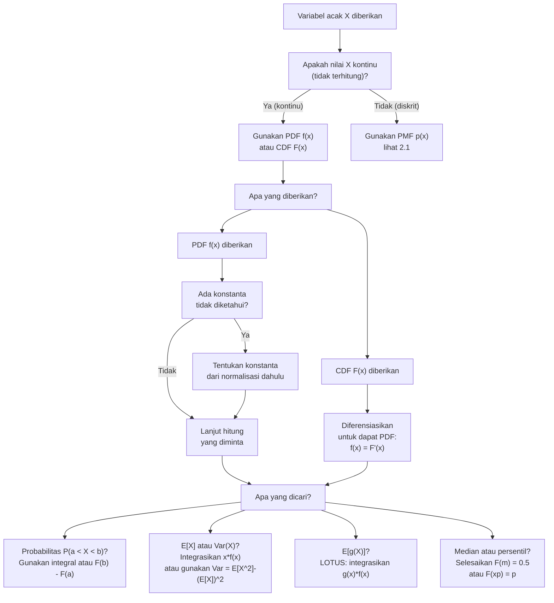

# 📊 2.2 — Variabel Acak Kontinu

> [!ABSTRACT] Ringkasan Cepat
> **Topik:** Variabel Acak Kontinu | **Bobot:** ~25–35% | **Difficulty:** Medium
> **Ref:** Hogg-Tanis-Zimm (2015) Bab 2.3–2.4; Miller et al. (2014) Bab 4.1–4.5, 5.1 | **Prereq:** [[2.1 Variabel Acak Diskrit]], [[1.2 Aksioma dan Perhitungan Probabilitas]]

## Section 0 — Pemetaan Topik

| Topik CF2 | Sub-topik ID | Skill Diuji | Bobot | Difficulty | Prerequisite | Connected Topics | Referensi |
|-----------|--------------|-------------|-------|------------|--------------|------------------|-----------|
| Topik 2: Variabel Acak Univariat | 2.2 | Mendefinisikan PDF dan CDF kontinu; memverifikasi validitas PDF; menghitung $P(a \leq X \leq b)$ via integral; menghitung $E[X]$, $\text{Var}(X)$, momen ke-$k$; menerapkan LOTUS untuk fungsi kontinu; menentukan median, persentil, dan modus dari PDF | 25–35% | Medium | [[2.1 Variabel Acak Diskrit]], [[1.2 Aksioma dan Perhitungan Probabilitas]] | [[2.3 Fungsi Pembangkit]], [[2.4 Transformasi Variabel Acak Univariat]], [[2.6 Distribusi Kontinu Umum]], [[3.1 Distribusi Gabungan (Joint Distribution)]] | Hogg-Tanis-Zimm (2015) Bab 2.3–2.4; Miller et al. (2014) Bab 4.1–4.5, 5.1 |

## Section 1 — Intuisi

Bayangkan seorang aktuaris sedang memodelkan **waktu hingga klaim pertama** dari pemegang polis asuransi jiwa. Berbeda dengan jumlah klaim yang selalu bilangan bulat (0, 1, 2, ...), waktu adalah besaran yang bisa mengambil nilai *berapa saja* dalam suatu rentang — misalnya 2,347 tahun atau 15,00001 tahun. Tidak ada "jarak minimum" antara dua nilai yang mungkin. Inilah esensi **variabel acak kontinu**: variabelnya mengambil nilai dalam suatu interval (atau gabungan interval) tanpa celah, sehingga tidak masuk akal bertanya "berapa peluang waktunya tepat 5 tahun?" — probabilitas di satu titik tunggal selalu nol.

Karena probabilitas di titik tunggal selalu nol, kita tidak bisa lagi bekerja dengan "massa" di setiap titik seperti pada kasus diskrit. Yang kita butuhkan adalah konsep **kerapatan probabilitas** (*probability density*): seberapa "padat" probabilitas di sekitar suatu titik. Fungsi kerapatan ini, disebut **PDF** (*probability density function*), tidak langsung memberikan probabilitas — ia memberikan *tingkat* probabilitas per unit panjang. Probabilitas pada suatu interval diperoleh dengan mengintegrasikan PDF di atas interval tersebut, persis seperti menghitung luas di bawah kurva. Inilah mengapa kalkulus integral — yang pada kasus diskrit digantikan oleh penjumlahan — menjadi alat utama untuk variabel acak kontinu.

Secara aktuaria, distribusi kontinu ada di mana-mana: waktu hidup (*lifetime*) diasumsikan Eksponensial atau Gamma, jumlah kerugian (*loss severity*) sering dimodelkan dengan distribusi Log-Normal atau Pareto, dan skor risiko nasabah dimodelkan Normal. Memahami cara membaca PDF, menghitung probabilitas dari integral, serta menghitung mean dan variansi secara langsung dari PDF adalah keterampilan yang diuji berulang kali di Exam CF2 dan menjadi fondasi seluruh pemodelan risiko aktuaria yang lebih lanjut.

## Section 2 — Definisi Formal

> [!NOTE] Definisi Matematis
> Suatu **variabel acak kontinu** $X$ adalah variabel acak yang CDF-nya $F_X(x) = P(X \leq x)$ bersifat kontinu dan dapat dinyatakan sebagai:
> $$
> F(x) = F_X(x) = \int_{-\infty}^{x} f(t)\, dt
> $$
> untuk suatu fungsi $f: \mathbb{R} \to [0, \infty)$ yang disebut **fungsi kepadatan probabilitas (PDF)**, yang memenuhi:
> $$
> f(x) \geq 0 \;\forall x \in \mathbb{R}, \qquad \int_{-\infty}^{\infty} f(x)\, dx = 1
> $$
>
> **Probabilitas pada Interval:**
> $$
> P(a \leq X \leq b) = \int_{a}^{b} f(x)\, dx = F(b) - F(a)
> $$
>
> **Nilai Harapan (Mean):**
> $$
> E[X] = \mu = \int_{-\infty}^{\infty} x\, f(x)\, dx
> $$
>
> **Variansi:**
> $$
> \text{Var}(X) = \sigma^2 = E\!\left[(X - \mu)^2\right] = \int_{-\infty}^{\infty} (x - \mu)^2\, f(x)\, dx
> $$

### Variabel & Parameter

| Simbol | Makna | Catatan |
|--------|-------|---------|
| $X$ | Variabel acak kontinu | CDF-nya kontinu; $P(X = x) = 0$ untuk setiap $x$ |
| $\mathcal{X}$ | Support: himpunan $\{x : f(x) > 0\}$ | Biasanya interval $(a, b)$, $(0, \infty)$, atau $(-\infty, \infty)$ |
| $f(x)$ atau $f_X(x)$ | Fungsi kepadatan probabilitas (PDF) | $f(x) \geq 0$; $\int_{-\infty}^\infty f(x)\,dx = 1$; **bukan** probabilitas, bisa $> 1$ |
| $F(x)$ atau $F_X(x)$ | Fungsi distribusi kumulatif (CDF) | Kontinu; non-decreasing; $F(-\infty)=0$; $F(\infty)=1$ |
| $E[X]$ atau $\mu$ | Nilai harapan (mean) | Pusat distribusi secara rata-rata tertimbang |
| $E[X^k] = \mu_k'$ | Momen ke-$k$ tentang nol (*raw moment*) | $\mu_1' = E[X] = \mu$ |
| $E[(X-\mu)^k] = \mu_k$ | Momen ke-$k$ sentral (*central moment*) | $\mu_2 = \text{Var}(X)$ |
| $\text{Var}(X)$ atau $\sigma^2$ | Variansi | $= E[X^2] - (E[X])^2$; selalu $\geq 0$ |
| $\sigma$ | Standar deviasi | $= \sqrt{\text{Var}(X)}$; satuan sama dengan $X$ |
| $m$ | Median | $F(m) = 0.5$, yaitu $\int_{-\infty}^m f(x)\,dx = 0.5$ |
| $x_p$ | Persentil ke-$p$ | $F(x_p) = p$, yaitu $P(X \leq x_p) = p$ |
| $g(X)$ | Fungsi dari variabel acak $X$ | Digunakan dalam LOTUS kontinu |

### Rumus Utama

$$
\int_{-\infty}^{\infty} f(x)\, dx = 1
$$
**Label: Syarat Normalisasi PDF** — luas total di bawah kurva PDF harus tepat 1; syarat perlu dan cukup (bersama $f(x) \geq 0$) agar suatu fungsi menjadi PDF yang valid.

$$
P(a \leq X \leq b) = \int_{a}^{b} f(x)\, dx = F(b) - F(a)
$$
**Label: Probabilitas Interval** — untuk variabel kontinu, tidak ada bedanya apakah batas inklusif atau eksklusif karena $P(X = a) = P(X = b) = 0$; sehingga $P(a < X < b) = P(a \leq X \leq b)$.

$$
f(x) = \frac{d}{dx} F(x)
$$
**Label: PDF sebagai Turunan CDF** — berlaku di setiap titik $x$ di mana $F$ terdiferensialkan; hubungan invers antara PDF dan CDF via Teorema Dasar Kalkulus.

$$
E[g(X)] = \int_{-\infty}^{\infty} g(x)\, f(x)\, dx
$$
**Label: LOTUS Kontinu** — nilai harapan dari fungsi $g(X)$ dihitung langsung dari PDF $X$ tanpa perlu menentukan distribusi $g(X)$ terlebih dahulu.

$$
\text{Var}(X) = E[X^2] - (E[X])^2 = \mu_2' - \mu^2
$$
**Label: Rumus Komputasional Variansi** — bentuk yang lebih efisien; hitung $E[X^2] = \int x^2 f(x)\,dx$ dan $E[X] = \int x f(x)\,dx$ secara terpisah.

$$
E[aX + b] = a\, E[X] + b
$$
**Label: Linieritas Nilai Harapan** — berlaku untuk semua variabel acak (diskrit maupun kontinu), tidak memerlukan independensi antar variabel.

$$
\text{Var}(aX + b) = a^2\, \text{Var}(X)
$$
**Label: Sifat Variansi terhadap Transformasi Linear** — konstanta aditif $b$ tidak memengaruhi variansi; konstanta multiplikatif $a$ dikuadratkan.

$$
\mu_k' = E[X^k] = \int_{-\infty}^{\infty} x^k\, f(x)\, dx
$$
**Label: Momen ke-$k$ tentang Nol** — kasus khusus LOTUS dengan $g(x) = x^k$; digunakan untuk menghitung momen-momen yang diperlukan MGF atau kumulan.

### Asumsi Eksplisit

- **Kontinuitas CDF:** $F_X(x)$ harus kontinu di semua titik — inilah definisi variabel acak kontinu; tidak ada lompatan (*jump*) seperti pada CDF diskrit.
- **Existensi nilai harapan:** $E[X]$ terdefinisi jika dan hanya jika $\int_{-\infty}^{\infty} |x|\, f(x)\, dx < \infty$.
- **Existensi variansi:** $\text{Var}(X)$ terdefinisi jika dan hanya jika $E[X^2] < \infty$, yang mengimplikasikan $E[X]$ juga terdefinisi.
- **PDF non-negatif:** $f(x) \geq 0$ untuk semua $x$; $f(x) = 0$ untuk $x \notin \mathcal{X}$ (di luar support).
- **PDF bukan probabilitas:** $f(x)$ sendiri bisa bernilai lebih dari 1; yang harus $\leq 1$ adalah hasil integral $\int_a^b f(x)\,dx$ untuk setiap interval $(a,b)$.

## Section 3 — Jembatan Logika

> [!TIP] Dari Definisi ke Rumus
> Analogi terbaik: PMF diskrit → PDF kontinu seperti "jumlah koin" → "massa kontinu logam". PMF memberikan probabilitas di *titik*; PDF memberikan *kerapatan* probabilitas per satuan panjang. Karena setiap titik tunggal memiliki "lebar nol", probabilitasnya nol — probabilitas hanya muncul saat kita mengintegrasikan PDF di atas suatu *interval* dengan lebar positif. CDF diperoleh dengan mengintegrasikan PDF dari $-\infty$ hingga $x$, dan sebaliknya PDF adalah *turunan* CDF — ini adalah Teorema Dasar Kalkulus yang diterapkan ke distribusi probabilitas. Nilai harapan $E[X] = \int x\, f(x)\, dx$ adalah analog persis dari $\sum x\, p(x)$: penjumlahan diskrit menjadi integral kontinu, PMF menjadi PDF.

> [!IMPORTANT] Support dan Domain
> - **Support $\mathcal{X} = \{x : f(x) > 0\}$:** di luar support, $f(x) = 0$ dan probabilitas tidak terakumulasi.
> - Support umum yang diuji di CF2: $(0, \infty)$ (Eksponensial, Gamma), $(-\infty, \infty)$ (Normal), $(a, b)$ (Uniform), dan $(0, 1)$ (Beta).
> - **Batas integral:** selalu sesuaikan batas integral dengan support aktual — bukan selalu $-\infty$ hingga $\infty$; jika $f(x) = 0$ di luar $(a,b)$, tulis $\int_a^b$ bukan $\int_{-\infty}^\infty$.
> - **Probabilitas di titik tunggal:** $P(X = c) = \int_c^c f(x)\,dx = 0$ untuk semua $c$; ini konsekuensi langsung dari sifat integral.

**Derivasi Rumus Komputasional Variansi:**

Mulai dari definisi sentral:
$$
\text{Var}(X) = E\!\left[(X - \mu)^2\right] = \int_{-\infty}^{\infty} (x - \mu)^2 f(x)\, dx
$$

Ekspansi kuadrat:
$$
= \int_{-\infty}^{\infty} \left(x^2 - 2\mu x + \mu^2\right) f(x)\, dx
$$

Distribusikan integral (linearitas integral):
$$
= \int_{-\infty}^{\infty} x^2 f(x)\, dx - 2\mu \int_{-\infty}^{\infty} x\, f(x)\, dx + \mu^2 \int_{-\infty}^{\infty} f(x)\, dx
$$

Substitusi definisi ($E[X^2]$, $E[X] = \mu$, normalisasi PDF $= 1$):
$$
= E[X^2] - 2\mu \cdot \mu + \mu^2 \cdot 1 = E[X^2] - 2\mu^2 + \mu^2
$$

Sederhanakan:
$$
\boxed{\text{Var}(X) = E[X^2] - \mu^2 = E[X^2] - (E[X])^2}
$$

**Derivasi Hubungan PDF–CDF via FTC:**

Dari definisi CDF:
$$
F(x) = \int_{-\infty}^{x} f(t)\, dt
$$

Diferensiasikan kedua sisi terhadap $x$ (Teorema Dasar Kalkulus, bagian 1):
$$
\frac{d}{dx} F(x) = f(x)
$$

Ini berlaku di setiap titik $x$ di mana $f$ kontinu. Sebaliknya, untuk mendapat CDF dari PDF: integrasikan. Untuk mendapat PDF dari CDF: diferensiasikan.

> [!DANGER] Dilarang
> 1. **Dilarang** menafsirkan $f(x)$ sebagai $P(X = x)$. Probabilitas di satu titik selalu nol; $f(x)$ hanyalah kerapatan (*density*), bukan probabilitas. Menulis $P(X = 2{,}5) = f(2{,}5)$ adalah kesalahan fundamental.
> 2. **Dilarang** menggunakan $P(a \leq X \leq b) = F(b) - F(a-1)$ seperti pada kasus diskrit. Untuk variabel kontinu, $P(a \leq X \leq b) = F(b) - F(a)$ karena tidak ada "penyesuaian batas" yang diperlukan.
> 3. **Dilarang** mengasumsikan $f(x) \leq 1$ secara umum. PDF bisa bernilai lebih dari 1 asalkan luas total tetap 1 — misalnya $f(x) = 2x$ pada $(0,1)$ memiliki nilai hingga 2 pada $x$ mendekati 1.

## Section 4 — Contoh Soal

### Soal A — Fundamental

Diberikan variabel acak kontinu $X$ dengan PDF:
$$
f(x) = \begin{cases} cx^2 & 0 < x < 3 \\ 0 & \text{lainnya} \end{cases}
$$
(a) Tentukan nilai konstanta $c$. (b) Hitung $P(1 < X < 2)$. (c) Hitung $E[X]$ dan $\text{Var}(X)$.

> [!SUCCESS] Solusi Soal A
>
> **1. Identifikasi Variabel**
> - PDF: $f(x) = cx^2$ pada support $(0, 3)$
> - Konstanta $c$ yang belum diketahui
> - Target: $c$, $P(1 < X < 2)$, $E[X]$, $\text{Var}(X)$
>
> **2. Identifikasi Distribusi / Model**
> Ini adalah distribusi kontinu dengan PDF berbentuk polinomial sederhana di atas support terbatas $(0, 3)$. Tidak ada nama distribusi standar — ini soal "distribusi umum" yang menguji teknik dasar integral.
>
> **3. Setup Persamaan**
>
> Syarat normalisasi:
> $$\int_{0}^{3} cx^2\, dx = 1$$
>
> Probabilitas interval:
> $$P(1 < X < 2) = \int_{1}^{2} cx^2\, dx$$
>
> Nilai harapan:
> $$E[X] = \int_{0}^{3} x \cdot cx^2\, dx = c\int_{0}^{3} x^3\, dx$$
>
> Momen kedua:
> $$E[X^2] = \int_{0}^{3} x^2 \cdot cx^2\, dx = c\int_{0}^{3} x^4\, dx$$
>
> **4. Eksekusi Aljabar**
>
> **(a) Menentukan $c$:**
> $$c\int_{0}^{3} x^2\, dx = c \cdot \left[\frac{x^3}{3}\right]_0^3 = c \cdot \frac{27}{3} = 9c = 1 \implies c = \frac{1}{9}$$
>
> **(b) Menghitung $P(1 < X < 2)$:**
> $$P(1 < X < 2) = \frac{1}{9}\int_{1}^{2} x^2\, dx = \frac{1}{9}\left[\frac{x^3}{3}\right]_1^2 = \frac{1}{9} \cdot \frac{8 - 1}{3} = \frac{7}{27}$$
>
> **(c) Menghitung $E[X]$:**
> $$E[X] = \frac{1}{9}\int_{0}^{3} x^3\, dx = \frac{1}{9}\left[\frac{x^4}{4}\right]_0^3 = \frac{1}{9} \cdot \frac{81}{4} = \frac{9}{4} = 2{,}25$$
>
> Menghitung $E[X^2]$:
> $$E[X^2] = \frac{1}{9}\int_{0}^{3} x^4\, dx = \frac{1}{9}\left[\frac{x^5}{5}\right]_0^3 = \frac{1}{9} \cdot \frac{243}{5} = \frac{27}{5} = 5{,}4$$
>
> Menghitung $\text{Var}(X)$:
> $$\text{Var}(X) = E[X^2] - (E[X])^2 = \frac{27}{5} - \left(\frac{9}{4}\right)^2 = \frac{27}{5} - \frac{81}{16} = \frac{432}{80} - \frac{405}{80} = \frac{27}{80} = 0{,}3375$$
>
> **5. Verification**
> - $c = 1/9 > 0$ ✓
> - $P(1 < X < 2) = 7/27 \approx 0{,}259$ — masuk akal karena interval $(1,2)$ memiliki panjang 1 dari total 3, dan PDF semakin berat ke kanan, sehingga probabilitas lebih besar dari $1/3$ untuk interval di tengah-atas. Cek: $7/27 < 1$ ✓
> - $E[X] = 9/4 = 2{,}25 > 3/2 = 1{,}5$ — benar karena PDF berbentuk $x^2$ miring ke kanan, sehingga mean harus lebih besar dari midpoint support $(3/2)$ ✓
> - $\text{Var}(X) = 27/80 > 0$ ✓

> [!WARNING] Exam Tips — Soal A
> **Target waktu:** 5–7 menit
> **Common trap:** Lupa menyesuaikan batas integral dengan support. Jika soal menanyakan $P(1 < X < 4)$ namun support hanya sampai 3, maka batas atas integral adalah 3, bukan 4.
> **Shortcut:** Setelah mendapat $c$, langsung substitusi ke semua integral berikutnya — jangan hitung $c$ berulang kali.

### Soal B — Exam-Typical

Variabel acak kontinu $X$ memiliki CDF:
$$
F(x) = \begin{cases} 0 & x < 0 \\ 1 - e^{-3x} & x \geq 0 \end{cases}
$$
(a) Tentukan PDF $f(x)$. (b) Hitung $P(0{,}5 < X < 1)$. (c) Tentukan median $m$ dari distribusi ini. (d) Hitung $E[X]$ dan $\text{Var}(X)$.

> [!SUCCESS] Solusi Soal B
>
> **1. Identifikasi Variabel**
> - CDF diberikan: $F(x) = 1 - e^{-3x}$ untuk $x \geq 0$
> - Target: PDF, $P(0{,}5 < X < 1)$, median, $E[X]$, $\text{Var}(X)$
>
> **2. Identifikasi Distribusi / Model**
> Bentuk $F(x) = 1 - e^{-\lambda x}$ untuk $x \geq 0$ adalah CDF distribusi **Eksponensial** dengan parameter laju $\lambda = 3$. Jadi $X \sim \text{Exp}(3)$. Meskipun soal bisa diselesaikan langsung dari rumus distribusi, kita tunjukkan derivasi penuh.
>
> **3. Setup Persamaan**
>
> PDF dari turunan CDF:
> $$f(x) = \frac{d}{dx} F(x)$$
>
> Probabilitas interval dari CDF:
> $$P(0{,}5 < X < 1) = F(1) - F(0{,}5)$$
>
> Median dari definisi:
> $$F(m) = 0{,}5 \implies 1 - e^{-3m} = 0{,}5$$
>
> Nilai harapan via integral:
> $$E[X] = \int_0^\infty x \cdot f(x)\, dx$$
>
> **4. Eksekusi Aljabar**
>
> **(a) PDF:**
> $$f(x) = \frac{d}{dx}\left(1 - e^{-3x}\right) = 3e^{-3x}, \quad x > 0$$
>
> **(b) $P(0{,}5 < X < 1)$:**
> $$P(0{,}5 < X < 1) = F(1) - F(0{,}5) = \left(1 - e^{-3}\right) - \left(1 - e^{-1{,}5}\right) = e^{-1{,}5} - e^{-3}$$
> $$= 0{,}2231 - 0{,}0498 = 0{,}1733$$
>
> **(c) Median $m$:**
> $$1 - e^{-3m} = 0{,}5 \implies e^{-3m} = 0{,}5 \implies -3m = \ln(0{,}5) \implies m = \frac{\ln 2}{3} \approx \frac{0{,}6931}{3} \approx 0{,}2310$$
>
> **(d) $E[X]$ dan $\text{Var}(X)$:**
>
> Gunakan integrasi per bagian pada $\int_0^\infty x \cdot 3e^{-3x}\,dx$ (atau formula distribusi Eksponensial: $E[X] = 1/\lambda$):
> $$E[X] = \frac{1}{3}$$
>
> $$E[X^2] = \int_0^\infty x^2 \cdot 3e^{-3x}\, dx = \frac{2}{\lambda^2} = \frac{2}{9}$$
>
> $$\text{Var}(X) = E[X^2] - (E[X])^2 = \frac{2}{9} - \frac{1}{9} = \frac{1}{9}$$
>
> (Atau langsung: $\text{Var}(X) = 1/\lambda^2 = 1/9$ untuk distribusi Eksponensial.)
>
> **5. Verification**
> - PDF $f(x) = 3e^{-3x} \geq 0$ ✓; $\int_0^\infty 3e^{-3x}\,dx = 1$ ✓
> - $P(0{,}5 < X < 1) \approx 0{,}173$ — masuk akal; distribusi Eksponensial sangat miring ke kanan, probabilitas di area ini relatif kecil ✓
> - Median $m = \ln 2 / 3 \approx 0{,}231 < E[X] = 1/3 \approx 0{,}333$ — konsisten: untuk distribusi right-skewed, median < mean ✓
> - $\text{Var}(X) = 1/9 > 0$ ✓

> [!WARNING] Exam Tips — Soal B
> **Target waktu:** 7–9 menit
> **Common trap 1:** Untuk median, jangan cari $x$ di mana $f(x)$ maksimum (itu modus) — median adalah $x$ di mana $F(x) = 0{,}5$.
> **Common trap 2:** Menggunakan formula $E[X] = 1/\lambda$ hanya valid jika kamu sudah mengidentifikasi distribusinya sebagai Eksponensial dengan benar. Soal mungkin memberikan parametrisasi yang berbeda — selalu verifikasi.
> **Shortcut:** Begitu CDF dikenali sebagai Eksponensial $(\lambda)$, langsung gunakan $E[X] = 1/\lambda$ dan $\text{Var}(X) = 1/\lambda^2$ tanpa perlu mengintegrasikan ulang.

### Soal C — Challenging

Variabel acak kontinu $X$ memiliki PDF:
$$
f(x) = \begin{cases} k(1 - x^2) & -1 < x < 1 \\ 0 & \text{lainnya} \end{cases}
$$
(a) Tentukan $k$. (b) Tentukan CDF $F(x)$ secara lengkap untuk semua $x \in \mathbb{R}$. (c) Hitung $E[X]$, $E[X^2]$, dan $\text{Var}(X)$. (d) Tentukan $P\!\left(|X| > \frac{1}{2}\right)$ menggunakan CDF. (e) Misalkan $Y = X^2$. Hitung $E[Y]$ menggunakan LOTUS.

> [!SUCCESS] Solusi Soal C
>
> **1. Identifikasi Variabel**
> - PDF: $f(x) = k(1-x^2)$ pada $(-1, 1)$
> - Konstanta $k$ belum diketahui; support $\mathcal{X} = (-1, 1)$
> - Target: $k$, $F(x)$ lengkap, $E[X]$, $E[X^2]$, $\text{Var}(X)$, $P(|X| > 1/2)$, $E[Y]$ dengan $Y = X^2$
>
> **2. Identifikasi Distribusi / Model**
> Distribusi dengan PDF berbentuk parabola terbalik di $(-1, 1)$ — distribusi kontinu umum (tidak ada nama standar di CF2). Distribusi ini simetris terhadap $x = 0$, sehingga $E[X] = 0$ dapat diprediksi sebelum menghitung.
>
> **3. Setup Persamaan**
>
> Normalisasi: $\int_{-1}^{1} k(1-x^2)\,dx = 1$
>
> CDF: $F(x) = \int_{-1}^{x} k(1-t^2)\,dt$ untuk $-1 \leq x \leq 1$
>
> Nilai harapan: $E[X] = \int_{-1}^{1} x \cdot k(1-x^2)\,dx$
>
> **4. Eksekusi Aljabar**
>
> **(a) Menentukan $k$:**
> $$\int_{-1}^{1} k(1-x^2)\,dx = k\left[x - \frac{x^3}{3}\right]_{-1}^{1} = k\left[\left(1 - \frac{1}{3}\right) - \left(-1 + \frac{1}{3}\right)\right] = k\left[\frac{2}{3} + \frac{2}{3}\right] = \frac{4k}{3} = 1$$
> $$\implies k = \frac{3}{4}$$
>
> **(b) CDF $F(x)$ lengkap:**
>
> Untuk $x < -1$: $F(x) = 0$
>
> Untuk $-1 \leq x \leq 1$:
> $$F(x) = \frac{3}{4}\int_{-1}^{x}(1-t^2)\,dt = \frac{3}{4}\left[t - \frac{t^3}{3}\right]_{-1}^{x} = \frac{3}{4}\left[\left(x - \frac{x^3}{3}\right) - \left(-1 + \frac{1}{3}\right)\right]$$
> $$= \frac{3}{4}\left[x - \frac{x^3}{3} + \frac{2}{3}\right] = \frac{3}{4}x - \frac{x^3}{4} + \frac{1}{2}$$
>
> Untuk $x > 1$: $F(x) = 1$
>
> Jadi:
> $$F(x) = \begin{cases} 0 & x < -1 \\ \dfrac{1}{2} + \dfrac{3x}{4} - \dfrac{x^3}{4} & -1 \leq x \leq 1 \\ 1 & x > 1 \end{cases}$$
>
> **(c) $E[X]$, $E[X^2]$, $\text{Var}(X)$:**
>
> $E[X]$: karena $f(x)$ simetris terhadap 0 dan $x$ adalah fungsi ganjil:
> $$E[X] = \int_{-1}^{1} x \cdot \frac{3}{4}(1-x^2)\,dx = 0 \quad \text{(integran fungsi ganjil di interval simetris)}$$
>
> $E[X^2]$:
> $$E[X^2] = \frac{3}{4}\int_{-1}^{1} x^2(1-x^2)\,dx = \frac{3}{4}\int_{-1}^{1}(x^2 - x^4)\,dx$$
> $$= \frac{3}{4} \cdot 2\int_{0}^{1}(x^2 - x^4)\,dx = \frac{3}{2}\left[\frac{x^3}{3} - \frac{x^5}{5}\right]_0^1 = \frac{3}{2}\left(\frac{1}{3} - \frac{1}{5}\right) = \frac{3}{2} \cdot \frac{2}{15} = \frac{1}{5}$$
>
> $\text{Var}(X)$:
> $$\text{Var}(X) = E[X^2] - (E[X])^2 = \frac{1}{5} - 0 = \frac{1}{5}$$
>
> **(d) $P(|X| > 1/2)$:**
>
> $P(|X| > 1/2) = P(X < -1/2) + P(X > 1/2) = 1 - P(-1/2 \leq X \leq 1/2) = 1 - [F(1/2) - F(-1/2)]$
>
> $$F\!\left(\frac{1}{2}\right) = \frac{1}{2} + \frac{3}{8} - \frac{1}{32} = \frac{16}{32} + \frac{12}{32} - \frac{1}{32} = \frac{27}{32}$$
>
> $$F\!\left(-\frac{1}{2}\right) = \frac{1}{2} - \frac{3}{8} + \frac{1}{32} = \frac{16}{32} - \frac{12}{32} + \frac{1}{32} = \frac{5}{32}$$
>
> (Alternatif: simetri distribusi → $F(-1/2) = 1 - F(1/2) = 5/32$ ✓)
>
> $$P(|X| > 1/2) = 1 - \left(\frac{27}{32} - \frac{5}{32}\right) = 1 - \frac{22}{32} = \frac{10}{32} = \frac{5}{16}$$
>
> **(e) $E[Y]$ dengan $Y = X^2$ via LOTUS:**
> $$E[Y] = E[X^2] = \int_{-1}^{1} x^2 \cdot \frac{3}{4}(1-x^2)\, dx = \frac{1}{5}$$
>
> (Langsung dari hasil bagian (c) — LOTUS memungkinkan penggunaan PDF $X$ tanpa perlu menentukan distribusi $Y = X^2$ terlebih dahulu.)
>
> **5. Verification**
> - $k = 3/4 > 0$ ✓; $f(x) = \frac{3}{4}(1-x^2) \geq 0$ untuk $x \in (-1,1)$ karena $1-x^2 \geq 0$ ✓
> - $F(-1) = 1/2 - 3/4 + 1/4 = 0$ ✓; $F(1) = 1/2 + 3/4 - 1/4 = 1$ ✓
> - $E[X] = 0$ konsisten dengan simetri distribusi ✓
> - $P(|X| > 1/2) = 5/16 \approx 0{,}3125$; nilai ini masuk akal — sekitar 31% probabilitas berada di ekor distribusi ✓
> - $E[Y] = 1/5 = \text{Var}(X)$ — konsisten karena $E[X] = 0$ sehingga $\text{Var}(X) = E[X^2] = E[Y]$ ✓

> [!WARNING] Exam Tips — Soal C
> **Target waktu:** 12–15 menit
> **Common trap 1:** Untuk menghitung $F(x)$ pada support interior, batas bawah integral harus sesuai dengan batas bawah support ($-1$), bukan $0$ atau $-\infty$.
> **Common trap 2:** Pada bagian (d), $P(|X|>1/2) \neq 1 - F(1/2)$ — harus gunakan komplemen lengkap: $1 - P(|X| \leq 1/2) = 1 - [F(1/2) - F(-1/2)]$.
> **Shortcut:** Kenali simetri distribusi sejak awal. Jika $f(x)$ simetris terhadap 0, maka $E[X] = 0$ langsung, dan $F(-a) = 1 - F(a)$ sehingga perhitungan di bagian (d) bisa disederhanakan.

## Section 5 — Verifikasi & Sanity Check

> [!CHECK] Validasi PDF
> Sebelum menggunakan $f(x)$ apapun, verifikasi dua syarat:
> 1. $f(x) \geq 0$ untuk semua $x$ (terutama di dalam support): substitusi nilai-nilai ekstrem di dalam support dan periksa tandanya.
> 2. $\int_{\text{support}} f(x)\,dx = 1$: jika soal memberikan konstanta $c$ atau $k$, tentukan nilainya dari syarat ini sebelum melanjutkan.

> [!CHECK] Validasi CDF
> Setiap CDF yang diturunkan harus memenuhi:
> 1. $F(x) \to 0$ saat $x$ mendekati batas bawah support (atau $-\infty$) ✓
> 2. $F(x) \to 1$ saat $x$ mendekati batas atas support (atau $+\infty$) ✓
> 3. $F$ non-decreasing di seluruh $\mathbb{R}$: turunannya ($= f(x)$) harus $\geq 0$ ✓
> 4. Untuk $x$ di luar support: $F(x) = 0$ (di bawah) atau $F(x) = 1$ (di atas) ✓

> [!CHECK] Validasi Mean dan Variansi
> Setelah menghitung $E[X]$ dan $\text{Var}(X)$:
> 1. $\text{Var}(X) \geq 0$ selalu. Jika hasil negatif, ada kesalahan aritmatika.
> 2. Untuk distribusi dengan support terbatas $(a, b)$: $a < E[X] < b$ harus terpenuhi.
> 3. Untuk distribusi simetris terhadap titik $c$: $E[X] = c$ (cek tanpa integral).

> [!CHECK] Validasi Probabilitas Interval
> Setiap probabilitas yang dihitung harus:
> 1. Berada dalam $[0, 1]$ ✓
> 2. Konsisten secara komplementer: $P(X > a) = 1 - P(X \leq a) = 1 - F(a)$ ✓
> 3. Untuk interval simetris di distribusi simetris: $P(-a < X < a) = 2F(a) - 1$ ✓

### Metode Alternatif

Untuk menghitung $E[X]$ dan $\text{Var}(X)$ dari distribusi kontinu yang dikenali sebagai distribusi standar (Eksponensial, Gamma, Normal, Uniform), gunakan **tabel formula distribusi** secara langsung — jauh lebih cepat daripada menghitung integral dari nol. Kunci: identifikasi distribusi dan parameternya terlebih dahulu, kemudian substitusi ke formula.

Untuk $P(a < X < b)$, jika CDF sudah tersedia secara eksplisit, gunakan $F(b) - F(a)$ langsung — hindari integrasi PDF berulang. Untuk distribusi Normal, gunakan transformasi ke distribusi Normal standar dan tabel $z$: $P(a < X < b) = \Phi\!\left(\frac{b-\mu}{\sigma}\right) - \Phi\!\left(\frac{a-\mu}{\sigma}\right)$.

## Section 6 — Visualisasi Mental

**Grafik PDF sebagai Kurva Kerapatan:**

Bayangkan grafik dengan **sumbu X = nilai variabel acak $X$** dan **sumbu Y = kerapatan $f(x)$**. Kurva PDF tidak pernah negatif (selalu di atas atau menyentuh sumbu X) dan total luas di bawah kurva **tepat sama dengan 1**. Probabilitas $P(a < X < b)$ adalah **luas daerah di bawah kurva** antara $x = a$ dan $x = b$ — secara visual seperti irisan di bawah grafik. Titik-titik penting: **modus** adalah nilai $x$ di mana kurva mencapai puncak tertinggi; **mean $\mu$** adalah titik keseimbangan (*balance point*) dari kurva (bayangkan kurva sebagai papan tipis yang ditopang di satu titik, titik keseimbangan itulah mean); **median $m$** adalah titik yang membagi luas menjadi dua bagian sama besar (masing-masing 0,5).

**Grafik CDF sebagai Fungsi Kumulatif Kontinu:**

Grafik dengan **sumbu X = nilai $x$** dan **sumbu Y = $F(x)$ dari 0 hingga 1**. Berbeda dengan CDF diskrit yang berbentuk tangga, CDF kontinu adalah kurva **mulus dan tidak pernah menurun**. Kurva naik perlahan di daerah "berat" distribusi dan lebih cepat naik di daerah probabilitas tinggi. Titik di mana kurva CDF menyentuh $y = 0{,}5$ adalah **median**. Kemiringan (*slope*) kurva CDF di setiap titik $x$ adalah nilai PDF di titik tersebut: $f(x) = F'(x)$.

### Hubungan Visual ↔ Rumus

Luas irisan di bawah PDF antara $a$ dan $b$ berkorespondensi dengan:
$$
P(a < X < b) = \int_a^b f(x)\, dx \longleftrightarrow \text{luas di bawah kurva}
$$

Kemiringan lokal kurva CDF berkorespondensi dengan:
$$
f(x) = \frac{d}{dx}F(x) \longleftrightarrow \text{slope kurva CDF}
$$

Titik keseimbangan kurva PDF berkorespondensi dengan:
$$
E[X] = \int_{-\infty}^{\infty} x\, f(x)\, dx \longleftrightarrow \text{pusat massa distribusi}
$$

Lebar "penyebaran" kurva PDF berkorespondensi dengan:
$$
\text{Var}(X) = E[(X - \mu)^2] \longleftrightarrow \text{momen inersia kurva terhadap mean}
$$

## Section 7 — Jebakan Umum

> [!BUG] Kesalahan Parametrisasi
> **Kesalahan utama — Salah menafsirkan $f(x)$ sebagai probabilitas:**
> - **Salah:** $P(X = 1{,}5) = f(1{,}5) = 0{,}3$ — ini tidak valid untuk variabel kontinu; probabilitas di titik tunggal selalu 0.
> - **Benar:** $P(1 < X < 2) = \int_1^2 f(x)\,dx$ — selalu gunakan integral untuk probabilitas.
>
> **Kesalahan kedua — Kesalahan batas integral untuk CDF interior:**
> - **Salah:** $F(x) = \int_0^x f(t)\,dt$ jika support dimulai dari $-\infty$ atau $a \neq 0$.
> - **Benar:** $F(x) = \int_a^x f(t)\,dt$ di mana $a$ adalah batas bawah support aktual (bisa $-\infty$, 0, atau nilai lain).

> [!BUG] Kesalahan Konseptual
> 1. **Mengasumsikan $f(x) \leq 1$ secara umum.** PDF *bisa* bernilai lebih dari 1 dan tetap valid. Yang harus $\leq 1$ adalah *probabilitas* (hasil integral), bukan nilai PDF. Contoh: $f(x) = 5$ pada $(0, 0{,}2)$ adalah PDF valid karena $\int_0^{0.2} 5\,dx = 1$.
> 2. **Tidak membedakan $P(a < X < b)$ dan $P(a \leq X \leq b)$ untuk variabel kontinu.** Keduanya identik karena probabilitas di titik tunggal nol — tidak perlu penyesuaian batas seperti pada kasus diskrit.
> 3. **Menggunakan LOTUS dengan substitusi langsung: $E[g(X)] = g(E[X])$.** Ini hanya benar untuk $g$ linear. Untuk $g(x) = x^2$, $g(x) = e^x$, atau fungsi non-linear lainnya, wajib gunakan $E[g(X)] = \int g(x) f(x)\,dx$.
> 4. **Lupa menentukan konstanta normalisasi sebelum menghitung momen.** Semua integral untuk $E[X]$, $E[X^2]$, dll. menggunakan PDF yang *sudah ternormalisasi* — pastikan konstanta $c$ sudah ditentukan terlebih dahulu.

> [!BUG] Kesalahan Interpretasi Soal
> - **"Kerapatan"** atau **"densitas"** dalam soal $\to$ PDF, bukan probabilitas langsung; harus diintegrasikan.
> - **"Median"** $\to$ selesaikan $F(m) = 0{,}5$, bukan titik maksimum PDF (itu modus).
> - **"Persentil ke-90"** $\to$ selesaikan $F(x_{0{,}9}) = 0{,}9$; jangan keliru dengan $P(X > x_{0{,}9}) = 0{,}9$ (itu adalah persentil ke-10).
> - **"Rata-rata"** selalu berarti $E[X]$; berbeda dari "modus" (puncak PDF) dan "median" (titik tengah CDF).

> [!CAUTION] Red Flags
> - **PDF diberikan dengan konstanta $c$, $k$, atau $\lambda$ yang belum diketahui:** Langkah pertama **selalu** tentukan konstanta dari syarat normalisasi $\int f(x)\,dx = 1$ sebelum apapun.
> - **Batas integral melibatkan $|X|$, $X^2$, atau ekspresi absolut:** Pecah menjadi kasus-kasus terpisah (e.g., $P(|X| > a) = P(X < -a) + P(X > a)$).
> - **Soal meminta $E[g(X)]$ untuk $g$ non-linear:** Jangan pernah substitusi $E[X]$ ke dalam $g$ — wajib gunakan LOTUS.
> - **CDF diberikan (bukan PDF):** Diferensiasikan untuk mendapat PDF ($f(x) = F'(x)$) *atau* langsung gunakan $F$ untuk probabilitas interval ($P(a < X < b) = F(b) - F(a)$) — pilih yang paling efisien.
> - **Kata "ada" (*exists*) atau "terdefinisi":** Soal menguji konvergensi integral; periksa apakah $\int |x| f(x)\,dx < \infty$ sebelum mengklaim $E[X]$ ada.

## Section 8 — Ringkasan Eksekutif

> [!SUMMARY] Must-Remember
> 1. **PDF valid jika dan hanya jika:**
>    $$f(x) \geq 0 \;\forall x, \quad \int_{-\infty}^{\infty} f(x)\, dx = 1$$
> 2. **Probabilitas interval (integral, bukan penjumlahan):**
>    $$P(a \leq X \leq b) = \int_{a}^{b} f(x)\, dx = F(b) - F(a)$$
> 3. **Hubungan PDF–CDF (saling invers via kalkulus):**
>    $$F(x) = \int_{-\infty}^{x} f(t)\, dt \qquad \Longleftrightarrow \qquad f(x) = \frac{d}{dx}F(x)$$
> 4. **Nilai harapan dan rumus komputasional variansi:**
>    $$E[X] = \int_{-\infty}^{\infty} x\, f(x)\, dx, \qquad \text{Var}(X) = E[X^2] - (E[X])^2$$
> 5. **LOTUS Kontinu — nilai harapan fungsi dari variabel acak:**
>    $$E[g(X)] = \int_{-\infty}^{\infty} g(x)\, f(x)\, dx$$

### Kapan Digunakan

- **Trigger keywords:** "waktu", "lama", "berat", "tinggi", "suhu", "kerugian", "kerapatan", "densitas", "PDF", "kontinu", "persentil", "median", "rata-rata kontinu".
- **Tipe skenario soal:**
  - Diberikan PDF (eksplisit atau hingga konstanta), hitung $P$, $E[X]$, $\text{Var}(X)$, median, persentil.
  - Diberikan CDF, tentukan PDF dengan diferensiasi, lalu hitung momen.
  - Tentukan apakah fungsi yang diberikan adalah PDF valid (cek non-negativitas dan normalisasi).
  - Hitung $E[g(X)]$ untuk fungsi $g$ tertentu menggunakan LOTUS.
  - Bandingkan mean, median, dan modus untuk menentukan kemiringan distribusi.

### Kapan TIDAK Boleh Digunakan

- **Jika variabel acak bersifat diskrit** (nilai dapat dihitung satu per satu: jumlah klaim, jumlah nasabah, dll.): gunakan [[2.1 Variabel Acak Diskrit]] dengan PMF dan penjumlahan, bukan PDF dan integral.
- **Jika soal meminta MGF atau PGF secara spesifik:** Walaupun definisi $M_X(t) = E[e^{tX}]$ tetap menggunakan integral yang sama, penanganan MGF dan sifat-sifatnya dibahas di [[2.3 Fungsi Pembangkit]].
- **Jika distribusi gabungan dua variabel acak atau lebih dibutuhkan:** Beralih ke [[3.1 Distribusi Gabungan (Joint Distribution)]].
- **Jika distribusi sudah dikenali sebagai distribusi standar** (Eksponensial, Normal, Gamma, Uniform): pertimbangkan menggunakan formula ringkas dari [[2.6 Distribusi Kontinu Umum]] daripada menghitung dari awal.

### Quick Decision Tree

---

> [!QUOTE] Follow-up Options
> 1. *"Berikan contoh soal variasi transformasi $Y = g(X)$ untuk variabel acak kontinu menggunakan teknik CDF"*
> 2. *"Jelaskan hubungan [[2.2 Variabel Acak Kontinu]] dengan [[2.6 Distribusi Kontinu Umum]] (Eksponensial, Gamma, Normal, Uniform)"*
> 3. *"Buat flashcard 1-halaman untuk topik ini"*

*📖 Ref: Hogg-Tanis-Zimm (2015) Bab 2.3–2.4; Miller et al. (2014) Bab 4.1–4.5, 5.1 | 🗓️ 2026-02-21 | #CF2 #VariabelAcak #Kontinu #PDF #CDF #ExpectedValue #Variansi #LOTUS*
