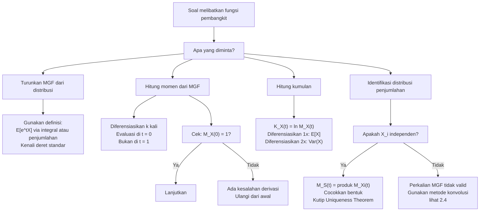

# 📊 2.3 — Fungsi Pembangkit

> [!ABSTRACT] Ringkasan Cepat
> **Topik:** Fungsi Pembangkit (PGF, MGF, Fungsi Pembangkit Kumulan) | **Bobot:** ~25–35% | **Difficulty:** Hard
> **Ref:** Hogg-Tanis-Zimm (2015) Bab 2.4–2.5; Hogg-McKean-Craig (2019) Bab 1.7, 1.9; Miller et al. (2014) Bab 4.5, 5.7, 6.5 | **Prereq:** [[2.1 Variabel Acak Diskrit]], [[2.2 Variabel Acak Kontinu]]

## Section 0 — Pemetaan Topik

| Topik CF2 | Sub-topik ID | Skill Diuji | Bobot | Difficulty | Prerequisite | Connected Topics | Referensi |
|-----------|--------------|-------------|-------|------------|--------------|------------------|-----------|
| Topik 2: Variabel Acak Univariat | 2.3 | Mendefinisikan dan menghitung PGF $G_X(t)$ serta MGF $M_X(t)$; menurunkan momen ke-$k$ dari MGF via diferensiasi; mengidentifikasi distribusi dari bentuk MGF; menggunakan sifat MGF untuk distribusi penjumlahan variabel acak independen; memahami fungsi pembangkit kumulan dan hubungannya dengan momen sentral | 25–35% | Hard | [[2.1 Variabel Acak Diskrit]], [[2.2 Variabel Acak Kontinu]] | [[2.4 Transformasi Variabel Acak Univariat]], [[2.5 Distribusi Diskrit Umum]], [[2.6 Distribusi Kontinu Umum]], [[3.5 Independensi dan Korelasi]], [[3.7 Distribusi Majemuk (Compound Distribution)]] | Hogg-Tanis-Zimm (2015) Bab 2.4–2.5; Hogg-McKean-Craig (2019) Bab 1.7, 1.9; Miller et al. (2014) Bab 4.5, 5.7, 6.5 |

## Section 1 — Intuisi

Bayangkan kamu diminta menghitung rata-rata, variansi, dan momen ketiga dari suatu distribusi yang rumit secara langsung — setiap kali harus mengerjakan integral atau penjumlahan dari nol. Ini bisa sangat melelahkan. **Fungsi Pembangkit Momen (MGF)** adalah semacam "mesin pabrik momen": kamu cukup membangun mesin ini sekali dari distribusinya, kemudian setiap kali perlu momen ke-$k$, kamu cukup menekan tombol (mendifferensiasikan sebanyak $k$ kali dan evaluasi di nol) — momen ke-$k$ langsung keluar tanpa integral baru. Analogi lebih konkret: MGF adalah versi "transformasi" distribusi ke domain $t$ yang mengemas seluruh informasi tentang momen distribusi tersebut.

Selain sebagai mesin pabrik momen, MGF memiliki kekuatan yang lebih mendasar: ia **mengidentifikasi distribusi secara unik**. Artinya, jika dua variabel acak memiliki MGF yang sama, distribusinya pasti identik — ini disebut *uniqueness theorem*. Dalam praktik aktuaria, ini sangat berguna saat menganalisis distribusi penjumlahan klaim independen: MGF dari jumlah variabel acak independen adalah *perkalian* MGF masing-masingnya. Menemukan bahwa hasil perkalian MGF tersebut cocok dengan MGF distribusi yang sudah dikenal langsung memberitahu kita distribusi total klaim tanpa perlu konvolusi yang rumit.

**Fungsi Pembangkit Probabilitas (PGF)** adalah sepupu MGF yang khusus dirancang untuk variabel acak diskrit non-negatif — ia mengemas seluruh PMF dalam satu fungsi polinom atau deret pangkat. Sementara **fungsi pembangkit kumulan** (logaritma alami dari MGF) menghasilkan *kumulan*: besaran-besaran yang lebih "murni" daripada momen biasa karena kumulan dari penjumlahan variabel independen bersifat aditif. Dalam pemodelan risiko, kumulan pertama adalah mean, kedua adalah variansi, ketiga berkaitan dengan kemiringan (*skewness*) — ketiganya langsung tersedia begitu kita punya fungsi pembangkit kumulan.

## Section 2 — Definisi Formal

> [!NOTE] Definisi Matematis
>
> **Fungsi Pembangkit Momen (MGF):**
> $$
> M_X(t) = E\!\left[e^{tX}\right] = \begin{cases} \displaystyle\sum_{x \in \mathcal{X}} e^{tx}\, p(x) & \text{(diskrit)} \\[8pt] \displaystyle\int_{-\infty}^{\infty} e^{tx}\, f(x)\, dx & \text{(kontinu)} \end{cases}
> $$
> terdefinisi untuk semua $t$ dalam suatu interval terbuka $(-h, h)$ dengan $h > 0$.
>
> **Fungsi Pembangkit Probabilitas (PGF):**
> $$
> G_X(t) = E\!\left[t^X\right] = \sum_{x=0}^{\infty} t^x\, p(x), \quad |t| \leq 1
> $$
> khusus untuk variabel acak diskrit dengan support $\{0, 1, 2, \ldots\}$.
>
> **Fungsi Pembangkit Kumulan:**
> $$
> K_X(t) = \ln M_X(t) = \ln E\!\left[e^{tX}\right]
> $$

### Variabel & Parameter

| Simbol | Makna | Catatan |
|--------|-------|---------|
| $M_X(t)$ | Fungsi pembangkit momen (MGF) | $E[e^{tX}]$; terdefinisi pada $t \in (-h, h)$ |
| $G_X(t)$ | Fungsi pembangkit probabilitas (PGF) | $E[t^X]$; khusus diskrit non-negatif; $|t| \leq 1$ |
| $K_X(t)$ | Fungsi pembangkit kumulan | $\ln M_X(t)$ |
| $t$ | Variabel parameter fungsi pembangkit | *Bukan* variabel acak; $t$ adalah variabel real bebas |
| $\mu_k'$ | Momen ke-$k$ tentang nol | $E[X^k] = M_X^{(k)}(0)$ |
| $\kappa_r$ | Kumulan ke-$r$ | $\kappa_r = K_X^{(r)}(0)$ |
| $\kappa_1$ | Kumulan pertama | $= E[X] = \mu$ |
| $\kappa_2$ | Kumulan kedua | $= \text{Var}(X) = \sigma^2$ |
| $\kappa_3$ | Kumulan ketiga | $= \mu_3$ (momen sentral ke-3) |
| $h$ | Radius konvergensi MGF | MGF terdefinisi pada $|t| < h$ |

### Rumus Utama

$$
E[X^k] = \mu_k' = M_X^{(k)}(0) = \left.\frac{d^k}{dt^k} M_X(t)\right|_{t=0}
$$
**Label: Ekstraksi Momen dari MGF** — turunkan MGF sebanyak $k$ kali terhadap $t$, kemudian evaluasi di $t = 0$; menghasilkan momen ke-$k$ tentang nol.

$$
M_X(t) = \sum_{k=0}^{\infty} \frac{\mu_k'}{k!}\, t^k = 1 + \mu t + \frac{E[X^2]}{2!}t^2 + \frac{E[X^3]}{3!}t^3 + \cdots
$$
**Label: Ekspansi Deret Taylor MGF** — koefisien $t^k$ adalah $\mu_k' / k!$; berguna untuk mengidentifikasi momen dari bentuk deret MGF yang diberikan.

$$
M_{aX+b}(t) = e^{bt}\, M_X(at)
$$
**Label: MGF Transformasi Linear** — untuk $Y = aX + b$; berguna untuk standarisasi dan transformasi afin.

$$
M_{X_1 + X_2 + \cdots + X_n}(t) = \prod_{i=1}^{n} M_{X_i}(t), \quad X_1, X_2, \ldots, X_n \text{ independen}
$$
**Label: MGF Penjumlahan Independen** — MGF dari jumlah variabel acak independen adalah perkalian MGF individual; hanya berlaku jika independen.

$$
G_X'(1) = E[X], \qquad G_X''(1) = E[X(X-1)]
$$
**Label: Momen dari PGF** — turunan pertama PGF di $t=1$ menghasilkan $E[X]$; turunan kedua di $t=1$ menghasilkan momen faktorial $E[X(X-1)]$, sehingga $\text{Var}(X) = G_X''(1) + G_X'(1) - [G_X'(1)]^2$.

$$
\kappa_1 = K_X'(0) = E[X], \qquad \kappa_2 = K_X''(0) = \text{Var}(X)
$$
**Label: Kumulan Pertama dan Kedua** — kumulan pertama adalah mean; kumulan kedua adalah variansi; lebih mudah dihitung untuk distribusi tertentu dibanding momen sentral langsung.

$$
K_{X_1 + X_2}(t) = K_{X_1}(t) + K_{X_2}(t), \quad X_1, X_2 \text{ independen}
$$
**Label: Aditivitas Kumulan** — kumulan dari penjumlahan variabel independen bersifat aditif; ini tidak berlaku untuk momen biasa.

### Asumsi Eksplisit

- **Existensi MGF:** $M_X(t)$ terdefinisi (bernilai hingga) jika dan hanya jika $E[e^{tX}] < \infty$ untuk semua $t$ dalam suatu interval terbuka di sekitar 0. Tidak semua distribusi memiliki MGF yang terdefinisi di sekitar $t = 0$ (contoh: distribusi Cauchy tidak memiliki MGF).
- **Keunikan MGF:** Jika $M_X(t) = M_Y(t)$ untuk semua $t \in (-h, h)$ dengan $h > 0$, maka $X$ dan $Y$ memiliki distribusi yang sama (*Uniqueness Theorem*).
- **PGF hanya untuk diskrit non-negatif:** $G_X(t) = E[t^X]$ hanya terdefinisi dengan baik untuk variabel acak diskrit dengan support $\{0, 1, 2, \ldots\}$.
- **Independensi untuk perkalian MGF:** Sifat $M_{X+Y}(t) = M_X(t) \cdot M_Y(t)$ hanya berlaku jika $X$ dan $Y$ **independen** — ini syarat yang sering dilupakan.

## Section 3 — Jembatan Logika

> [!TIP] Dari Definisi ke Rumus
> Mengapa $e^{tX}$? Kunci ada pada ekspansi deret Taylor dari fungsi eksponensial:
> $$e^{tX} = \sum_{k=0}^{\infty} \frac{(tX)^k}{k!} = 1 + tX + \frac{t^2 X^2}{2!} + \frac{t^3 X^3}{3!} + \cdots$$
> Ambil nilai harapan dari kedua sisi (dengan asumsi pertukaran $E$ dan $\sum$ diizinkan):
> $$M_X(t) = E[e^{tX}] = \sum_{k=0}^{\infty} \frac{E[X^k]}{k!}\, t^k = \sum_{k=0}^{\infty} \frac{\mu_k'}{k!}\, t^k$$
> Ini adalah deret pangkat dalam $t$ di mana koefisien $t^k$ tepat sama dengan $\mu_k' / k!$. Diferensiasikan $k$ kali terhadap $t$ dan evaluasi di $t = 0$ → koefisien lainnya hilang dan tersisa $\mu_k'$. Inilah mengapa diferensiasi MGF di $t = 0$ menghasilkan momen. Untuk PGF: ganti $e^t$ dengan $t$ saja — jadilah $G_X(t) = E[t^X] = \sum p(x) t^x$, deret pembangkit koefisien yang tepat adalah PMF $p(x)$.

> [!IMPORTANT] Support dan Domain
> - **MGF:** $t$ adalah bilangan real pada interval $(-h, h)$ untuk suatu $h > 0$ — bukan variabel acak. Nilai $M_X(0) = E[e^0] = E[1] = 1$ **selalu berlaku** untuk distribusi apapun.
> - **PGF:** $|t| \leq 1$; nilai $G_X(1) = E[1^X] = \sum p(x) = 1$ **selalu berlaku**. Nilai $G_X(0) = P(X = 0) = p(0)$.
> - **Radius konvergensi:** MGF mungkin tidak terdefinisi untuk $|t|$ terlalu besar. Untuk distribusi dengan ekor berat (heavy-tailed), MGF mungkin hanya terdefinisi di $t = 0$ saja.

**Derivasi Rumus Ekstraksi Momen dari MGF:**

Mulai dari deret Taylor MGF:
$$
M_X(t) = \sum_{k=0}^{\infty} \frac{\mu_k'}{k!}\, t^k = \mu_0' + \mu_1' t + \frac{\mu_2'}{2!} t^2 + \frac{\mu_3'}{3!} t^3 + \cdots
$$

Diferensiasikan sekali terhadap $t$:
$$
M_X'(t) = \mu_1' + \mu_2' t + \frac{\mu_3'}{2!} t^2 + \cdots
$$

Evaluasi di $t = 0$:
$$
M_X'(0) = \mu_1' = E[X]
$$

Diferensiasikan dua kali:
$$
M_X''(t) = \mu_2' + \mu_3' t + \cdots \implies M_X''(0) = \mu_2' = E[X^2]
$$

Secara umum, diferensiasi ke-$k$ dan evaluasi di $t = 0$:
$$
\boxed{M_X^{(k)}(0) = \mu_k' = E[X^k]}
$$

**Derivasi Sifat MGF untuk Penjumlahan Independen:**

Misalkan $X_1$ dan $X_2$ independen. Definisikan $S = X_1 + X_2$.
$$
M_S(t) = E[e^{tS}] = E[e^{t(X_1 + X_2)}] = E[e^{tX_1} \cdot e^{tX_2}]
$$

Karena $X_1$ dan $X_2$ independen, $e^{tX_1}$ dan $e^{tX_2}$ juga independen, sehingga:
$$
E[e^{tX_1} \cdot e^{tX_2}] = E[e^{tX_1}] \cdot E[e^{tX_2}] = M_{X_1}(t) \cdot M_{X_2}(t)
$$

Ini hanya valid karena independensi memungkinkan faktorisasi nilai harapan produk.

**Hubungan Kumulan dengan Momen:**

Dari $K_X(t) = \ln M_X(t)$, ekspansi deret Taylor:
$$
K_X(t) = \kappa_1 t + \frac{\kappa_2}{2!} t^2 + \frac{\kappa_3}{3!} t^3 + \cdots
$$

Diferensiasi $r$ kali dan evaluasi di $t = 0$ menghasilkan kumulan ke-$r$: $\kappa_r = K_X^{(r)}(0)$.

Hubungan kumulan dengan momen sentral:
$$
\kappa_1 = \mu, \quad \kappa_2 = \sigma^2, \quad \kappa_3 = \mu_3 = E[(X-\mu)^3]
$$

> [!DANGER] Dilarang
> 1. **Dilarang** menggunakan sifat $M_{X+Y}(t) = M_X(t) \cdot M_Y(t)$ tanpa terlebih dahulu memverifikasi bahwa $X$ dan $Y$ **independen**. Untuk variabel yang tidak independen, sifat ini tidak berlaku dan akan menghasilkan distribusi yang salah.
> 2. **Dilarang** mengidentifikasi distribusi hanya dari satu atau dua momen saja. Dua distribusi berbeda bisa memiliki mean dan variansi yang sama — identifikasi distribusi dari keseluruhan bentuk MGF menggunakan *Uniqueness Theorem*.
> 3. **Dilarang** mengasumsikan MGF selalu terdefinisi. Beberapa distribusi (seperti distribusi Cauchy atau Log-Normal ekor berat tertentu) tidak memiliki MGF yang terdefinisi untuk $t \neq 0$. Selalu periksa apakah $E[e^{tX}] < \infty$ sebelum menggunakan MGF.

## Section 4 — Contoh Soal

### Soal A — Fundamental

Variabel acak diskrit $X$ memiliki PMF:
$$
p(x) = \frac{e^{-2} \cdot 2^x}{x!}, \quad x = 0, 1, 2, \ldots
$$
(a) Tentukan MGF $M_X(t)$. (b) Gunakan MGF untuk menghitung $E[X]$ dan $\text{Var}(X)$. (c) Tentukan nilai $M_X(0)$ dan berikan interpretasinya.

> [!SUCCESS] Solusi Soal A
>
> **1. Identifikasi Variabel**
> - PMF: $p(x) = e^{-2} \cdot 2^x / x!$ untuk $x = 0, 1, 2, \ldots$
> - Ini adalah PMF distribusi Poisson dengan $\lambda = 2$, sehingga $X \sim \text{Poisson}(2)$
> - Target: $M_X(t)$, $E[X]$, $\text{Var}(X)$, interpretasi $M_X(0)$
>
> **2. Identifikasi Distribusi / Model**
> $X \sim \text{Poisson}(\lambda)$ dengan $\lambda = 2$. Derivasi MGF dilakukan dari definisi untuk menunjukkan proses umumnya, sekaligus memverifikasi formula baku.
>
> **3. Setup Persamaan**
>
> MGF dari definisi:
> $$M_X(t) = E[e^{tX}] = \sum_{x=0}^{\infty} e^{tx} \cdot \frac{e^{-2} \cdot 2^x}{x!}$$
>
> Turunan pertama dan kedua untuk momen:
> $$E[X] = M_X'(0), \qquad E[X^2] = M_X''(0)$$
>
> **4. Eksekusi Aljabar**
>
> **(a) Menurunkan $M_X(t)$:**
> $$M_X(t) = \sum_{x=0}^{\infty} e^{tx} \cdot \frac{e^{-2} \cdot 2^x}{x!} = e^{-2} \sum_{x=0}^{\infty} \frac{(e^t \cdot 2)^x}{x!} = e^{-2} \sum_{x=0}^{\infty} \frac{(2e^t)^x}{x!}$$
>
> Kenali deret: $\sum_{x=0}^{\infty} \frac{u^x}{x!} = e^u$ dengan $u = 2e^t$:
> $$M_X(t) = e^{-2} \cdot e^{2e^t} = e^{2e^t - 2} = e^{2(e^t - 1)}$$
>
> Ini adalah bentuk MGF Poisson baku: $M_X(t) = e^{\lambda(e^t - 1)}$ dengan $\lambda = 2$. ✓
>
> **(b) Menghitung $E[X]$ dan $\text{Var}(X)$:**
>
> Turunan pertama:
> $$M_X'(t) = e^{2(e^t - 1)} \cdot 2e^t$$
>
> Evaluasi di $t = 0$:
> $$E[X] = M_X'(0) = e^{2(1-1)} \cdot 2e^0 = 1 \cdot 2 = 2$$
>
> Turunan kedua (gunakan aturan perkalian pada $M_X'(t) = 2e^t \cdot e^{2(e^t-1)}$):
> $$M_X''(t) = 2e^t \cdot e^{2(e^t-1)} + 2e^t \cdot e^{2(e^t-1)} \cdot 2e^t = e^{2(e^t-1)}(2e^t + 4e^{2t})$$
>
> Evaluasi di $t = 0$:
> $$E[X^2] = M_X''(0) = e^0(2 \cdot 1 + 4 \cdot 1) = 6$$
>
> Variansi:
> $$\text{Var}(X) = E[X^2] - (E[X])^2 = 6 - 4 = 2$$
>
> **(c) Interpretasi $M_X(0)$:**
> $$M_X(0) = e^{2(e^0 - 1)} = e^{2(1-1)} = e^0 = 1$$
> Ini **selalu berlaku** untuk setiap distribusi: $M_X(0) = E[e^{0 \cdot X}] = E[1] = 1$. Nilai ini adalah syarat normalisasi — menjadi cara cepat untuk memverifikasi bahwa MGF yang diturunkan benar.
>
> **5. Verification**
> - $M_X(0) = 1$ ✓ (syarat universal)
> - $E[X] = 2 = \lambda$ dan $\text{Var}(X) = 2 = \lambda$: konsisten dengan properti distribusi Poisson ($E[X] = \text{Var}(X) = \lambda$) ✓
> - MGF berbentuk $e^{\lambda(e^t - 1)}$: cocok dengan MGF Poisson standar ✓

> [!WARNING] Exam Tips — Soal A
> **Target waktu:** 6–8 menit
> **Common trap:** Lupa memfaktorkan $e^{-\lambda}$ keluar dari penjumlahan sebelum mengenali deret $e^u$. Jika terlupa, penjumlahan tampak tidak dapat dikenali.
> **Shortcut:** Jika PMF dikenali sebagai distribusi standar (Poisson, Binomial, Eksponensial, dll.), langsung gunakan MGF baku dari tabel — tidak perlu menurunkan dari deret setiap kali. Namun untuk soal pembuktian, derivasi penuh tetap diperlukan.

### Soal B — Exam-Typical

Misalkan $X_1 \sim \text{Poisson}(3)$ dan $X_2 \sim \text{Poisson}(5)$, keduanya independen. Definisikan $S = X_1 + X_2$.
(a) Gunakan MGF untuk menentukan distribusi $S$.
(b) Hitung $P(S = 0)$ dan $E[S]$.
(c) Misalkan $Y = 2X_1 - 3$. Tentukan $M_Y(t)$ dan gunakan untuk menghitung $E[Y]$ dan $\text{Var}(Y)$.

> [!SUCCESS] Solusi Soal B
>
> **1. Identifikasi Variabel**
> - $X_1 \sim \text{Poisson}(3)$, $X_2 \sim \text{Poisson}(5)$, independen
> - $S = X_1 + X_2$; $Y = 2X_1 - 3$
> - MGF Poisson baku: $M_{X_i}(t) = e^{\lambda_i(e^t - 1)}$
>
> **2. Identifikasi Distribusi / Model**
> Menggunakan dua properti MGF: (1) perkalian MGF untuk penjumlahan independen, dan (2) MGF transformasi linear. Dengan *Uniqueness Theorem*, bentuk MGF yang cocok dengan distribusi dikenal mengidentifikasi distribusinya.
>
> **3. Setup Persamaan**
>
> MGF penjumlahan:
> $$M_S(t) = M_{X_1}(t) \cdot M_{X_2}(t)$$
>
> MGF transformasi linear $Y = aX + b$:
> $$M_Y(t) = e^{bt} M_X(at)$$
>
> **4. Eksekusi Aljabar**
>
> **(a) Distribusi $S$:**
> $$M_S(t) = M_{X_1}(t) \cdot M_{X_2}(t) = e^{3(e^t - 1)} \cdot e^{5(e^t - 1)} = e^{(3+5)(e^t - 1)} = e^{8(e^t - 1)}$$
>
> Ini adalah MGF distribusi $\text{Poisson}(8)$. Oleh *Uniqueness Theorem*:
> $$\boxed{S = X_1 + X_2 \sim \text{Poisson}(8)}$$
>
> **(b) $P(S = 0)$ dan $E[S]$:**
> $$P(S = 0) = \frac{e^{-8} \cdot 8^0}{0!} = e^{-8} \approx 0{,}000335$$
>
> $$E[S] = \lambda_S = 8 = E[X_1] + E[X_2] = 3 + 5$$
>
> **(c) $M_Y(t)$ untuk $Y = 2X_1 - 3$:**
>
> Gunakan $M_{aX+b}(t) = e^{bt} M_X(at)$ dengan $a = 2$, $b = -3$, $X = X_1$:
> $$M_Y(t) = e^{-3t} \cdot M_{X_1}(2t) = e^{-3t} \cdot e^{3(e^{2t} - 1)} = e^{-3t + 3e^{2t} - 3} = e^{3e^{2t} - 3t - 3}$$
>
> Turunan pertama:
> $$M_Y'(t) = e^{3e^{2t} - 3t - 3} \cdot (6e^{2t} - 3)$$
>
> Evaluasi di $t = 0$:
> $$E[Y] = M_Y'(0) = e^{3-0-3}(6 \cdot 1 - 3) = e^0 \cdot 3 = 3$$
>
> Verifikasi via linieritas: $E[Y] = 2E[X_1] - 3 = 2(3) - 3 = 3$ ✓
>
> Turunan kedua (diferensiasikan $M_Y'(t) = (6e^{2t} - 3) \cdot e^{3e^{2t} - 3t - 3}$):
> $$M_Y''(t) = 12e^{2t} \cdot e^{3e^{2t}-3t-3} + (6e^{2t}-3)^2 \cdot e^{3e^{2t}-3t-3}$$
>
> Evaluasi di $t = 0$:
> $$E[Y^2] = M_Y''(0) = e^0[12 + (6-3)^2] = 12 + 9 = 21$$
>
> $$\text{Var}(Y) = E[Y^2] - (E[Y])^2 = 21 - 9 = 12$$
>
> Verifikasi: $\text{Var}(Y) = \text{Var}(2X_1 - 3) = 4\,\text{Var}(X_1) = 4 \times 3 = 12$ ✓
>
> **5. Verification**
> - $M_S(0) = e^{8(1-1)} = 1$ ✓
> - $S \sim \text{Poisson}(8)$: penjumlahan dua Poisson independen adalah Poisson dengan parameter jumlah — ini adalah properti baku yang harus diingat ✓
> - $E[Y] = 3$ dan $\text{Var}(Y) = 12$ konsisten dengan sifat transformasi linear ✓

> [!WARNING] Exam Tips — Soal B
> **Target waktu:** 9–12 menit
> **Common trap 1:** Lupa menyebutkan bahwa identifikasi distribusi $S$ menggunakan *Uniqueness Theorem* — di soal proof-based, langkah ini harus eksplisit disebutkan.
> **Common trap 2:** Pada bagian (c), menggunakan $M_Y(t) = M_{X_1}(2t - 3)$ — ini salah. Formula yang benar adalah $M_{aX+b}(t) = e^{bt} M_X(at)$: argumen $t$ di dalam $M_X$ dikalikan $a$, dan $e^{bt}$ dikali dari luar.
> **Shortcut:** Untuk $E[Y]$ dan $\text{Var}(Y)$ dari transformasi linear $Y = aX + b$, gunakan langsung $E[Y] = aE[X] + b$ dan $\text{Var}(Y) = a^2 \text{Var}(X)$ — lebih cepat daripada menurunkan $M_Y$ dua kali. MGF transformasi berguna jika diminta bentuk $M_Y(t)$ eksplisit atau untuk distribusi $Y$.

### Soal C — Challenging

Misalkan $X_1, X_2, \ldots, X_n$ adalah variabel acak **independen dan identik terdistribusi** (i.i.d.) dengan $X_i \sim \text{Exp}(\lambda)$, di mana MGF-nya adalah $M_X(t) = \dfrac{\lambda}{\lambda - t}$ untuk $t < \lambda$.

Definisikan $S_n = X_1 + X_2 + \cdots + X_n$.

(a) Tentukan $M_{S_n}(t)$ dan identifikasi distribusi $S_n$.
(b) Gunakan MGF untuk menghitung $E[S_n]$ dan $\text{Var}(S_n)$ langsung dari $M_{S_n}(t)$.
(c) Definisikan $\bar{X} = S_n / n$. Tentukan $M_{\bar{X}}(t)$ dan hitung $E[\bar{X}]$ serta $\text{Var}(\bar{X})$.
(d) Tentukan fungsi pembangkit kumulan $K_{S_n}(t)$ dan gunakan untuk mengkonfirmasi $E[S_n]$ dan $\text{Var}(S_n)$.

> [!SUCCESS] Solusi Soal C
>
> **1. Identifikasi Variabel**
> - $X_i \sim \text{Exp}(\lambda)$ i.i.d.; MGF: $M_X(t) = \lambda/(\lambda - t)$, $t < \lambda$
> - $S_n = \sum_{i=1}^n X_i$; $\bar{X} = S_n/n$
> - Target: $M_{S_n}$, distribusi $S_n$, $E[S_n]$, $\text{Var}(S_n)$, $M_{\bar{X}}$, $K_{S_n}$
>
> **2. Identifikasi Distribusi / Model**
> Penjumlahan variabel Eksponensial i.i.d. — diharapkan menghasilkan distribusi Gamma. Ini adalah aplikasi klasik *Uniqueness Theorem* MGF.
>
> **3. Setup Persamaan**
>
> MGF penjumlahan i.i.d.:
> $$M_{S_n}(t) = \left[M_X(t)\right]^n$$
>
> MGF rata-rata $\bar{X} = S_n/n = (1/n) S_n$:
> $$M_{\bar{X}}(t) = M_{S_n}(t/n) = \left[M_X(t/n)\right]^n$$
>
> Fungsi pembangkit kumulan:
> $$K_{S_n}(t) = \ln M_{S_n}(t)$$
>
> **4. Eksekusi Aljabar**
>
> **(a) $M_{S_n}(t)$ dan distribusi $S_n$:**
> $$M_{S_n}(t) = \left[M_X(t)\right]^n = \left(\frac{\lambda}{\lambda - t}\right)^n = \frac{\lambda^n}{(\lambda - t)^n}, \quad t < \lambda$$
>
> MGF distribusi Gamma $\Gamma(\alpha, \beta)$ (dengan parametrisasi skala $\beta = 1/\lambda$, laju $\lambda$):
> $$M_{\Gamma(\alpha, 1/\lambda)}(t) = \left(\frac{\lambda}{\lambda - t}\right)^\alpha, \quad t < \lambda$$
>
> Cocokkan: $\alpha = n$. Oleh *Uniqueness Theorem*:
> $$\boxed{S_n \sim \Gamma(n, 1/\lambda)}$$
> (Distribusi Gamma dengan parameter bentuk $\alpha = n$ dan parameter skala $\beta = 1/\lambda$, atau ekuivalen parameter laju $\lambda$.)
>
> **(b) $E[S_n]$ dan $\text{Var}(S_n)$ dari $M_{S_n}(t)$:**
>
> Tulis $M_{S_n}(t) = \lambda^n (\lambda - t)^{-n}$.
>
> Turunan pertama:
> $$M_{S_n}'(t) = \lambda^n \cdot (-n)(\lambda - t)^{-n-1} \cdot (-1) = n\lambda^n (\lambda - t)^{-n-1}$$
>
> Evaluasi di $t = 0$:
> $$E[S_n] = M_{S_n}'(0) = n\lambda^n \cdot \lambda^{-n-1} = n\lambda^n \cdot \frac{1}{\lambda^{n+1}} = \frac{n}{\lambda}$$
>
> Turunan kedua:
> $$M_{S_n}''(t) = n\lambda^n \cdot (-(n+1))(\lambda-t)^{-n-2} \cdot (-1) = n(n+1)\lambda^n(\lambda-t)^{-n-2}$$
>
> Evaluasi di $t = 0$:
> $$E[S_n^2] = M_{S_n}''(0) = n(n+1)\lambda^n \cdot \lambda^{-n-2} = \frac{n(n+1)}{\lambda^2}$$
>
> Variansi:
> $$\text{Var}(S_n) = E[S_n^2] - (E[S_n])^2 = \frac{n(n+1)}{\lambda^2} - \frac{n^2}{\lambda^2} = \frac{n^2 + n - n^2}{\lambda^2} = \frac{n}{\lambda^2}$$
>
> **(c) $M_{\bar{X}}(t)$, $E[\bar{X}]$, $\text{Var}(\bar{X})$:**
>
> $\bar{X} = S_n/n = (1/n)S_n$, gunakan $M_{aX}(t) = M_X(at)$ dengan $a = 1/n$:
> $$M_{\bar{X}}(t) = M_{S_n}(t/n) = \left(\frac{\lambda}{\lambda - t/n}\right)^n = \left(\frac{n\lambda}{n\lambda - t}\right)^n$$
>
> Untuk momen, gunakan sifat transformasi linear langsung (lebih efisien):
> $$E[\bar{X}] = \frac{1}{n} E[S_n] = \frac{1}{n} \cdot \frac{n}{\lambda} = \frac{1}{\lambda}$$
>
> $$\text{Var}(\bar{X}) = \frac{1}{n^2}\,\text{Var}(S_n) = \frac{1}{n^2} \cdot \frac{n}{\lambda^2} = \frac{1}{n\lambda^2}$$
>
> **(d) Fungsi pembangkit kumulan $K_{S_n}(t)$:**
> $$K_{S_n}(t) = \ln M_{S_n}(t) = \ln\!\left[\left(\frac{\lambda}{\lambda - t}\right)^n\right] = n\ln\lambda - n\ln(\lambda - t)$$
>
> Turunan pertama:
> $$K_{S_n}'(t) = -n \cdot \frac{-1}{\lambda - t} = \frac{n}{\lambda - t}$$
>
> Kumulan pertama:
> $$\kappa_1 = K_{S_n}'(0) = \frac{n}{\lambda} = E[S_n] \quad \checkmark$$
>
> Turunan kedua:
> $$K_{S_n}''(t) = \frac{n}{(\lambda - t)^2}$$
>
> Kumulan kedua:
> $$\kappa_2 = K_{S_n}''(0) = \frac{n}{\lambda^2} = \text{Var}(S_n) \quad \checkmark$$
>
> **5. Verification**
> - $M_{S_n}(0) = (\lambda/\lambda)^n = 1$ ✓
> - $E[S_n] = n/\lambda = n \cdot E[X_i]$: konsisten dengan linieritas nilai harapan (tidak memerlukan independensi) ✓
> - $\text{Var}(S_n) = n/\lambda^2 = n \cdot \text{Var}(X_i)$: konsisten dengan aditivitas variansi untuk variabel i.i.d. ✓
> - $E[\bar{X}] = 1/\lambda = E[X_i]$: mean sampel adalah estimator tak-bias dari mean populasi ✓ (preview [[4.6 Sifat-Sifat Estimator]])
> - $\text{Var}(\bar{X}) = 1/(n\lambda^2)$: variansi mengecil seiring $n$ bertambah ✓
> - Hasil kumulan dari $K_{S_n}$ mengkonfirmasi $E$ dan $\text{Var}$ ✓

> [!WARNING] Exam Tips — Soal C
> **Target waktu:** 15–18 menit
> **Common trap 1:** Parametrisasi Gamma. $\Gamma(\alpha, \beta)$ di beberapa buku menggunakan $\beta$ sebagai *skala* ($\beta = 1/\lambda$), di buku lain sebagai *laju* ($\beta = \lambda$). Selalu nyatakan secara eksplisit MGF mana yang digunakan dan parametrisasi mana yang dicocokkan.
> **Common trap 2:** Untuk $M_{\bar{X}}(t)$, kuncinya adalah $\bar{X} = (1/n) S_n$, sehingga $M_{\bar{X}}(t) = M_{S_n}(t/n)$ — bukan $[M_X(t)]^n / n$ atau bentuk salah lainnya.
> **Common trap 3:** Radius konvergensi: $M_X(t)$ hanya valid untuk $t < \lambda$. Saat menyatakan MGF, selalu sertakan syarat konvergensi.
> **Shortcut:** Kumulan jauh lebih mudah dihitung daripada momen sentral melalui $K_{S_n}(t) = \ln M_{S_n}(t)$ — diferensiasi logaritma seringkali lebih sederhana daripada diferensiasi pangkat tinggi dari MGF langsung.

## Section 5 — Verifikasi & Sanity Check

> [!CHECK] Validasi MGF
> Setiap MGF yang diturunkan harus memenuhi:
> 1. $M_X(0) = 1$ **selalu berlaku** tanpa pengecualian — jika tidak, ada kesalahan derivasi.
> 2. $M_X'(0) = E[X]$ harus konsisten dengan nilai harapan yang diketahui dari distribusinya.
> 3. Untuk distribusi non-negatif (support $\geq 0$): $M_X(t)$ harus meningkat seiring $t$ meningkat (karena $e^{tX}$ membesar untuk $X \geq 0$ dan $t > 0$).

> [!CHECK] Validasi Identifikasi Distribusi
> Saat mengidentifikasi distribusi dari MGF:
> 1. Pastikan **seluruh bentuk** MGF cocok, bukan hanya koefisien atau satu parameter saja.
> 2. Sebutkan secara eksplisit *Uniqueness Theorem* sebagai dasar identifikasi.
> 3. Periksa bahwa domain konvergensi MGF konsisten: MGF yang ditemukan harus terdefinisi pada interval terbuka yang sama.

> [!CHECK] Validasi Momen dari MGF
> Sebelum menyimpulkan nilai momen dari MGF:
> 1. Diferensiasikan MGF $k$ kali dan evaluasi di $t = 0$ — bukan di $t = 1$ atau nilai lain.
> 2. Bandingkan $E[X]$ dari MGF dengan nilai harapan yang dihitung langsung dari PMF/PDF — keduanya harus sama.
> 3. Variansi dari MGF: $\text{Var}(X) = M''(0) - [M'(0)]^2 \geq 0$ — jika negatif, ada kesalahan diferensiasi.

> [!CHECK] Validasi Aditivitas untuk Penjumlahan
> Untuk $S = X_1 + X_2 + \cdots + X_n$ dengan $X_i$ i.i.d.:
> 1. $E[S] = n \cdot E[X_i]$ (linieritas, tidak perlu independensi)
> 2. $\text{Var}(S) = n \cdot \text{Var}(X_i)$ (aditivitas, perlu independensi)
> 3. MGF: $M_S(t) = [M_X(t)]^n$ (perlu independensi)

### Metode Alternatif

Untuk menghitung $E[X]$ dan $\text{Var}(X)$ dari distribusi yang sudah dikenal, menggunakan **tabel momen distribusi standar** jauh lebih efisien daripada menurunkan MGF dan mendiferensiasikannya. MGF paling berguna ketika: (1) diminta eksplisit dalam soal, (2) digunakan untuk mengidentifikasi distribusi penjumlahan, atau (3) distribusinya tidak langsung dikenali.

Untuk menghitung kumulan, diferensiasikan $K_X(t) = \ln M_X(t)$ langsung — ini seringkali menghasilkan ekspresi yang lebih sederhana daripada diferensiasi $M_X(t)$ berkali-kali, terutama untuk $n$ besar.

## Section 6 — Visualisasi Mental

**MGF sebagai Transformasi Domain:**

Bayangkan distribusi $X$ sebagai "profil ketinggian" di sepanjang sumbu nilai $x$ (PMF atau PDF). MGF $M_X(t)$ adalah semacam "foto" distribusi tersebut dari sudut pandang berbeda — domain $t$ — yang mengompresi seluruh informasi momen ke dalam satu fungsi. Pada $t = 0$: foto menunjukkan nilai 1 (normalisasi). Untuk $t$ kecil positif: nilai MGF mulai naik, kecepatan naiknya ditentukan oleh mean $E[X]$. Kelengkungan kurva $M_X(t)$ di $t = 0$ (turunan kedua) ditentukan oleh $E[X^2]$. Semakin "lebar" distribusinya (variansi besar), semakin curam kurva MGF naik untuk $t > 0$.

**PGF sebagai Deret Pembangkit PMF:**

Bayangkan PGF $G_X(t) = \sum_{x=0}^\infty p(x) t^x$ sebagai polinomial (atau deret pangkat) di mana **koefisien $t^x$ tepat sama dengan $P(X = x) = p(x)$**. Grafik PGF: sumbu X adalah $t \in [0, 1]$, sumbu Y adalah $G_X(t)$. Di $t = 0$: $G_X(0) = p(0) = P(X = 0)$ — tinggi PGF di nol langsung memberikan probabilitas $P(X = 0)$. Di $t = 1$: $G_X(1) = \sum p(x) = 1$ — selalu 1. Kemiringan kurva PGF di $t = 1$ adalah $E[X]$.

### Hubungan Visual ↔ Rumus

Tinggi lekukan (*curvature*) kurva $M_X(t)$ di $t = 0$ berkorespondensi dengan:
$$
M_X''(0) = E[X^2] \longleftrightarrow \text{kelengkungan MGF di origin}
$$

Tinggi PGF di $t = 0$ berkorespondensi langsung dengan:
$$
G_X(0) = p(0) = P(X = 0) \longleftrightarrow \text{tinggi kurva PGF di origin}
$$

Kemiringan $\ln M_X(t)$ (fungsi pembangkit kumulan) di $t = 0$ berkorespondensi dengan:
$$
K_X'(0) = \kappa_1 = E[X] \longleftrightarrow \text{slope awal log-MGF}
$$

Kelengkungan $\ln M_X(t)$ di $t = 0$ berkorespondensi dengan:
$$
K_X''(0) = \kappa_2 = \text{Var}(X) \longleftrightarrow \text{curvature log-MGF di origin}
$$

## Section 7 — Jebakan Umum

> [!BUG] Kesalahan Parametrisasi
> **Kesalahan utama — Salah parametrisasi distribusi Gamma saat mencocokkan MGF:**
> - MGF Gamma dengan parameter bentuk $\alpha$ dan laju $\lambda$ (parametrisasi laju): $M(t) = \left(\frac{\lambda}{\lambda - t}\right)^\alpha$
> - MGF Gamma dengan parameter bentuk $\alpha$ dan skala $\beta = 1/\lambda$ (parametrisasi skala): $M(t) = (1 - \beta t)^{-\alpha}$
> - **Salah:** Mencocokkan $\left(\frac{3}{3-t}\right)^5$ dengan $\Gamma(3, 5)$ — ini keliru; yang benar adalah $\Gamma(\alpha=5, \lambda=3)$ atau $\Gamma(\alpha=5, \beta=1/3)$.
> - **Benar:** Identifikasi $\alpha$ sebagai eksponen dan $\lambda$ sebagai "angka di atas" — lalu nyatakan parametrisasi yang digunakan.
>
> **Kesalahan kedua — Formulasi MGF transformasi linear:**
> - **Salah:** $M_{aX+b}(t) = M_X(at + b)$ — ini salah; $b$ tidak dimasukkan ke argumen $M_X$.
> - **Benar:** $M_{aX+b}(t) = e^{bt} \cdot M_X(at)$ — faktor $e^{bt}$ perkalian dari luar, argumen $M_X$ adalah $at$.

> [!BUG] Kesalahan Konseptual
> 1. **Menggunakan $M_{X+Y}(t) = M_X(t) \cdot M_Y(t)$ tanpa memeriksa independensi.** Sifat ini hanya berlaku untuk variabel acak **independen**. Untuk yang tidak independen, harus gunakan MGF gabungan atau pendekatan lain.
> 2. **Mengidentifikasi distribusi hanya dari satu atau dua momen.** Dua distribusi berbeda bisa memiliki mean dan variansi yang sama. Identifikasi distribusi dari **seluruh bentuk MGF**, bukan sebagian parameternya saja, kemudian kutip *Uniqueness Theorem*.
> 3. **Mengira MGF selalu ada untuk semua distribusi.** Distribusi Cauchy tidak memiliki MGF. Distribusi Log-Normal memiliki semua momen terdefinisi tetapi MGF-nya tidak terdefinisi untuk $t > 0$. Selalu periksa existensi sebelum menggunakan MGF.
> 4. **Mengevaluasi turunan MGF di $t = 1$ bukan di $t = 0$** untuk mendapat momen. Momen ke-$k$ adalah $M_X^{(k)}(0)$ — evaluasi di **nol**, bukan di satu. (PGF adalah pengecualian: untuk momen dari PGF, evaluasi di $t = 1$.)

> [!BUG] Kesalahan Interpretasi Soal
> - **"Fungsi pembangkit"** tanpa kualifikasi: periksa konteks — apakah PGF (untuk diskrit non-negatif, "menghasilkan probabilitas") atau MGF (untuk semua variabel acak, "menghasilkan momen"). Keduanya berbeda.
> - **"Tentukan distribusi $S = X_1 + X_2$"**: soal ini *hampir pasti* meminta penggunaan MGF + *Uniqueness Theorem* — bukan konvolusi PMF/PDF secara langsung (yang jauh lebih kompleks).
> - **"Gunakan MGF untuk menghitung variansi"**: harus hitung $M''(0) - [M'(0)]^2$, bukan $M''(0)$ saja. Kesalahan ini sangat umum di bawah tekanan waktu ujian.

> [!CAUTION] Red Flags
> - **Soal menyebutkan penjumlahan variabel acak independen dan meminta distribusi:** Langsung pikirkan MGF — ini sinyal kuat bahwa perkalian MGF dan *Uniqueness Theorem* adalah pendekatan yang dimaksud.
> - **MGF diberikan dalam bentuk $e^{f(t)}$ atau $(\text{sesuatu})^n$:** Ini sering merupakan MGF distribusi Poisson atau Gamma — kenali bentuk baku ini segera.
> - **Soal meminta $E[X^k]$ untuk $k \geq 3$:** MGF seringkali lebih efisien daripada integral/penjumlahan langsung untuk momen orde tinggi.
> - **Domain konvergensi disebut di soal (e.g., "untuk $t < \lambda$"):** Syarat ini penting — jangan menggunakan MGF di luar domain konvergensinya.
> - **Kata "unik" atau "uniqueness":** Soal sedang menguji apakah kamu tahu *Uniqueness Theorem* — kutip dan gunakan secara eksplisit.

## Section 8 — Ringkasan Eksekutif

> [!SUMMARY] Must-Remember
> 1. **Definisi MGF dan selalu $M_X(0) = 1$:**
>    $$M_X(t) = E[e^{tX}], \qquad M_X(0) = 1 \text{ (universal)}$$
> 2. **Ekstraksi momen dari MGF (diferensiasikan dan evaluasi di nol):**
>    $$E[X^k] = M_X^{(k)}(0) = \left.\frac{d^k}{dt^k}M_X(t)\right|_{t=0}$$
> 3. **MGF penjumlahan independen adalah perkalian MGF (wajib independen):**
>    $$M_{X_1 + \cdots + X_n}(t) = \prod_{i=1}^{n} M_{X_i}(t), \quad X_i \text{ independen}$$
> 4. **MGF transformasi linear:**
>    $$M_{aX+b}(t) = e^{bt}\, M_X(at)$$
> 5. **Kumulan dari fungsi pembangkit kumulan (mean dan variansi langsung):**
>    $$K_X(t) = \ln M_X(t), \qquad \kappa_1 = K_X'(0) = E[X], \quad \kappa_2 = K_X''(0) = \text{Var}(X)$$

### Kapan Digunakan

- **Trigger keywords:** "fungsi pembangkit momen", "MGF", "PGF", "momen ke-$k$", "distribusi penjumlahan", "identifikasi distribusi", "variabel acak independen dijumlahkan", "kumulan", "uniqueness".
- **Tipe skenario soal:**
  - Turunkan MGF dari PMF/PDF distribusi yang diberikan (Poisson, Binomial, Eksponensial, Normal, Gamma).
  - Hitung momen ke-$k$ dari MGF yang diberikan via diferensiasi.
  - Identifikasi distribusi penjumlahan variabel i.i.d. menggunakan perkalian MGF dan *Uniqueness Theorem*.
  - Tentukan MGF dari transformasi linear $Y = aX + b$.
  - Hitung kumulan pertama dan kedua dari $K_X(t) = \ln M_X(t)$.

### Kapan TIDAK Boleh Digunakan

- **Jika distribusi tidak memiliki MGF yang terdefinisi** (misalnya distribusi Cauchy, atau distribusi ekor sangat berat): gunakan metode langsung (integral/penjumlahan) atau fungsi karakteristik `[BEYOND CF2]`.
- **Jika hanya $E[X]$ dan $\text{Var}(X)$ diperlukan dari distribusi yang sudah dikenal:** lebih efisien menggunakan tabel formula dari [[2.5 Distribusi Diskrit Umum]] atau [[2.6 Distribusi Kontinu Umum]] secara langsung.
- **Jika variabel acak tidak independen dan diminta distribusi penjumlahan:** perkalian MGF tidak berlaku; gunakan metode konvolusi dari [[2.4 Transformasi Variabel Acak Univariat]] atau distribusi gabungan dari [[3.1 Distribusi Gabungan (Joint Distribution)]].
- **Jika diminta PMF/PDF spesifik dari penjumlahan** (bukan hanya identifikasi distribusi): setelah identifikasi via MGF, gunakan distribusi yang teridentifikasi untuk menghitung PMF/PDF dengan formula baku.

### Quick Decision Tree

---

> [!QUOTE] Follow-up Options
> 1. *"Berikan tabel MGF lengkap untuk semua distribusi diskrit dan kontinu di silabus CF2"*
> 2. *"Jelaskan hubungan [[2.3 Fungsi Pembangkit]] dengan [[2.4 Transformasi Variabel Acak Univariat]] menggunakan teknik MGF"*
> 3. *"Buat flashcard 1-halaman untuk topik ini"*

*📖 Ref: Hogg-Tanis-Zimm (2015) Bab 2.4–2.5; Hogg-McKean-Craig (2019) Bab 1.7, 1.9; Miller et al. (2014) Bab 4.5, 5.7, 6.5 | 🗓️ 2026-02-21 | #CF2 #VariabelAcak #FungsiPembangkit #MGF #PGF #Kumulan #MomenGenerating*
