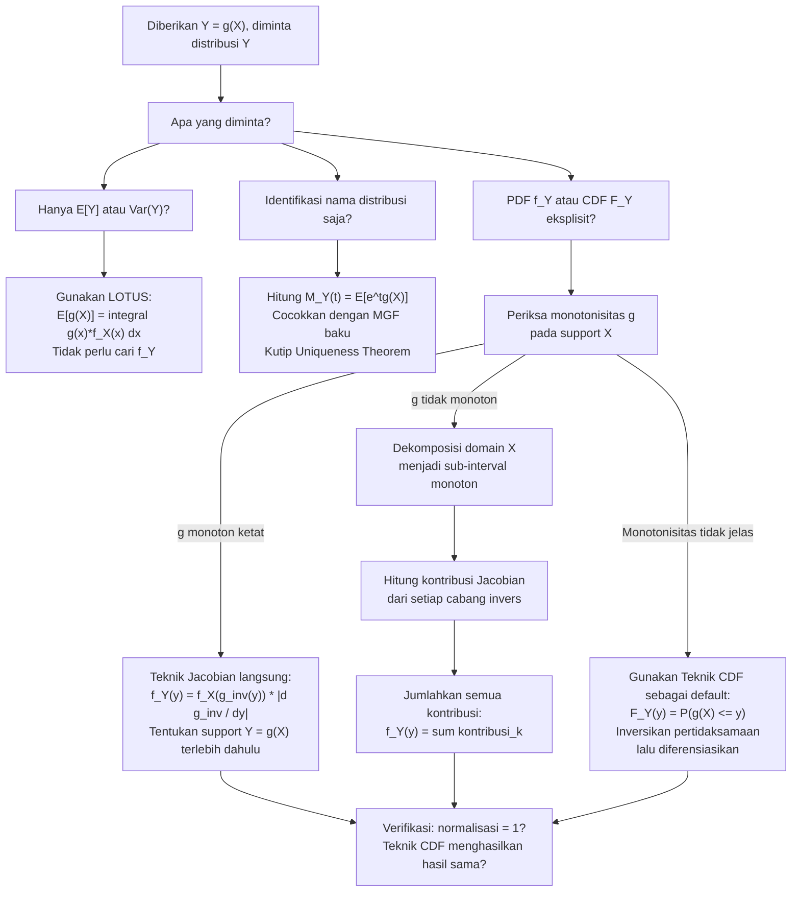

# 📊 2.4 — Transformasi Variabel Acak Univariat

> [!ABSTRACT] Ringkasan Cepat
> **Topik:** Transformasi Variabel Acak Univariat | **Bobot:** ~25–35% | **Difficulty:** Hard
> **Ref:** Hogg-Tanis-Zimm (2015) Bab 2.6–2.7; Hogg-McKean-Craig (2019) Bab 1.7; Miller et al. (2014) Bab 5.8–5.10, 7.4 | **Prereq:** [[2.1 Variabel Acak Diskrit]], [[2.2 Variabel Acak Kontinu]], [[2.3 Fungsi Pembangkit]]

## Section 0 — Pemetaan Topik

| Topik CF2 | Sub-topik ID | Skill Diuji | Bobot | Difficulty | Prerequisite | Connected Topics | Referensi |
|-----------|--------------|-------------|-------|------------|--------------|------------------|-----------|
| Topik 2: Variabel Acak Univariat | 2.4 | Menentukan PMF/PDF dari transformasi $Y = g(X)$ menggunakan teknik CDF; mengaplikasikan teknik Jacobian (change-of-variables) untuk transformasi monoton; menggunakan teknik MGF untuk mengidentifikasi distribusi hasil transformasi; menangani transformasi non-monoton dengan dekomposisi interval; menentukan support $Y$ yang benar setelah transformasi | 25–35% | Hard | [[2.1 Variabel Acak Diskrit]], [[2.2 Variabel Acak Kontinu]], [[2.3 Fungsi Pembangkit]] | [[2.5 Distribusi Diskrit Umum]], [[2.6 Distribusi Kontinu Umum]], [[3.8 Transformasi Variabel Acak Gabungan]], [[4.2 Distribusi Sampel]] | Hogg-Tanis-Zimm (2015) Bab 2.6–2.7; Hogg-McKean-Craig (2019) Bab 1.7; Miller et al. (2014) Bab 5.8–5.10, 7.4 |

## Section 1 — Intuisi

Seorang aktuaris seringkali tidak langsung mengobservasi besaran yang diinginkan, melainkan suatu fungsi darinya. Misalnya, kerugian asuransi $X$ mungkin mengikuti distribusi Eksponensial, tetapi yang dikenakan kepada nasabah adalah *kerugian setelah deductible dan kap manfaat* — yaitu $Y = \min(\max(X - d, 0), u)$ yang merupakan fungsi dari $X$. Pertanyaan kritis: *jika kita tahu distribusi $X$, bagaimana mendapatkan distribusi $Y$?* Inilah pertanyaan inti dari **transformasi variabel acak**: mengubah distribusi satu variabel menjadi distribusi variabel lain yang merupakan fungsinya.

Ada tiga senjata utama untuk menjawab pertanyaan ini. **Teknik CDF** adalah yang paling universal dan aman: cari dulu $F_Y(y) = P(Y \leq y) = P(g(X) \leq y)$, ekspresikan ini dalam CDF $X$ yang sudah diketahui, lalu diferensiasikan untuk mendapat $f_Y(y)$. **Teknik Jacobian** adalah jalan pintas elegan yang hanya berlaku ketika transformasi $g$ bersifat *monoton* (naik atau turun secara ketat) — ia menggunakan "rasio perubahan" antara domain $X$ dan $Y$ untuk langsung mengonversi PDF. **Teknik MGF** memanfaatkan keunikan MGF: jika MGF dari $Y = g(X)$ dapat dihitung dan bentuknya cocok dengan MGF distribusi yang dikenal, distribusi $Y$ teridentifikasi tanpa perlu mencari PDF secara eksplisit.

Pemilihan teknik yang tepat adalah kunci efisiensi di exam. Teknik CDF selalu bisa digunakan namun kadang panjang. Teknik Jacobian sangat cepat tetapi mensyaratkan monotonisitas — jika transformasi tidak monoton (misalnya $Y = X^2$ untuk $X$ yang bisa negatif), harus dipakai dekomposisi interval sebelum Jacobian diterapkan di setiap bagian. Teknik MGF paling cepat tetapi hanya mengidentifikasi distribusi tanpa memberikan bentuk PDF eksplisit. Mengetahui kapan menggunakan masing-masing teknik adalah pembeda antara kandidat yang kehabisan waktu dan yang bisa menyelesaikan soal dengan mulus.

## Section 2 — Definisi Formal

> [!NOTE] Definisi Matematis
>
> Diberikan variabel acak $X$ dengan PDF $f_X(x)$ dan CDF $F_X(x)$. Misalkan $Y = g(X)$ untuk suatu fungsi $g: \mathbb{R} \to \mathbb{R}$.
>
> **Teknik CDF (Universal):**
> $$F_Y(y) = P(Y \leq y) = P(g(X) \leq y)
> $$
> kemudian $f_Y(y) = \dfrac{d}{dy} F_Y(y)$ di setiap titik $y$ di mana $F_Y$ terdiferensialkan.
>
> **Teknik Jacobian (Transformasi Monoton Naik, $g$ strictly increasing):**
> $$f_Y(y) = f_X\!\left(g^{-1}(y)\right) \cdot \left|\frac{d}{dy} g^{-1}(y)\right|
> $$
>
> **Teknik Jacobian (Transformasi Monoton Turun, $g$ strictly decreasing):**
> $$f_Y(y) = f_X\!\left(g^{-1}(y)\right) \cdot \left|\frac{d}{dy} g^{-1}(y)\right|
> $$
>
> (Formula identik — nilai absolut dari Jacobian membuat tanda tidak masalah.)
>
> **Teknik MGF:**
> $$M_Y(t) = E[e^{tY}] = E[e^{t\,g(X)}] = \int_{-\infty}^{\infty} e^{t\,g(x)}\, f_X(x)\, dx
> $$
> Jika $M_Y(t)$ cocok dengan MGF distribusi yang dikenal, gunakan *Uniqueness Theorem*.

### Variabel & Parameter

| Simbol | Makna | Catatan |
|--------|-------|---------|
| $X$ | Variabel acak asal | PDF: $f_X(x)$, CDF: $F_X(x)$, support: $\mathcal{X}$ |
| $Y = g(X)$ | Variabel acak hasil transformasi | PDF: $f_Y(y)$, CDF: $F_Y(y)$, support: $\mathcal{Y}$ |
| $g$ | Fungsi transformasi | Harus terukur (*measurable*); untuk Jacobian, harus monoton |
| $g^{-1}$ | Fungsi invers dari $g$ | Hanya ada jika $g$ bijektif (monoton ketat) pada support $X$ |
| $\left\|\dfrac{d}{dy}g^{-1}(y)\right\|$ | Jacobian (nilai absolut turunan invers) | Faktor koreksi "rasio perubahan" dalam change-of-variables |
| $\mathcal{X}$ | Support variabel asal $X$ | $\{x : f_X(x) > 0\}$ |
| $\mathcal{Y}$ | Support variabel hasil $Y$ | $\{y : \exists\, x \in \mathcal{X},\; g(x) = y\} = g(\mathcal{X})$ |

### Rumus Utama

$$
F_Y(y) = P(g(X) \leq y) = \int_{\{x\,:\,g(x)\leq y\}} f_X(x)\, dx
$$
**Label: CDF Teknik CDF** — set integrasi $\{x : g(x) \leq y\}$ bergantung pada bentuk $g$; untuk $g$ monoton naik ini adalah $(-\infty, g^{-1}(y)]$, untuk monoton turun adalah $[g^{-1}(y), \infty)$.

$$
f_Y(y) = f_X\!\left(g^{-1}(y)\right) \cdot \left|\frac{d\,g^{-1}(y)}{dy}\right|, \quad y \in \mathcal{Y}
$$
**Label: Formula Jacobian Univariat** — berlaku jika dan hanya jika $g$ monoton ketat (*strictly monotone*) pada $\mathcal{X}$; Jacobian $|d g^{-1}/dy|$ adalah faktor koreksi volume/panjang akibat perubahan variabel.

$$
f_Y(y) = \sum_{k} f_X(x_k) \cdot \left|\frac{d\,g^{-1}_k(y)}{dy}\right|, \quad y \in \mathcal{Y}
$$
**Label: Jacobian untuk Transformasi Non-Monoton** — jika $g$ non-monoton, bagi $\mathcal{X}$ menjadi sub-interval $\mathcal{X}_1, \mathcal{X}_2, \ldots$ di mana $g$ monoton ketat di setiap sub-interval; $g^{-1}_k$ adalah invers $g$ pada sub-interval ke-$k$; jumlahkan kontribusi dari semua inversnya.

$$
\mathcal{Y} = g(\mathcal{X}) = \{g(x) : x \in \mathcal{X}\}
$$
**Label: Support Variabel Hasil** — support $Y$ adalah *image* dari support $X$ di bawah $g$; selalu tentukan ini sebelum menuliskan $f_Y(y)$.

### Asumsi Eksplisit

- **Teknik CDF:** Tidak ada asumsi khusus tentang $g$ — paling umum dan selalu dapat diterapkan. Diferensiabilitas $F_Y$ diperlukan untuk mendapat $f_Y$ via diferensiasi.
- **Teknik Jacobian:** $g$ harus *strictly monotone* (naik atau turun) pada seluruh support $\mathcal{X}$. Jika tidak, dekomposisi interval wajib dilakukan terlebih dahulu.
- **Teknik MGF:** $M_Y(t)$ harus terdefinisi pada interval terbuka di sekitar $t = 0$. Hanya mengidentifikasi distribusi $Y$ — tidak memberikan bentuk $f_Y$ secara eksplisit kecuali dari tabel distribusi.
- **Transformasi diskrit:** Untuk $X$ diskrit dengan $Y = g(X)$, PMF $Y$ diperoleh langsung dengan menjumlahkan probabilitas semua nilai $x$ yang memetakan ke $y$ yang sama: $p_Y(y) = \sum_{\{x:\,g(x)=y\}} p_X(x)$.

## Section 3 — Jembatan Logika

> [!TIP] Dari Definisi ke Rumus
> **Mengapa teknik CDF bekerja?** Mulai dari definisi CDF: $F_Y(y) = P(Y \leq y) = P(g(X) \leq y)$. Pertidaksamaan $g(X) \leq y$ mendefinisikan suatu himpunan nilai $x$ yang memenuhinya — himpunan ini adalah $\{x : g(x) \leq y\}$. Dengan mengintegrasikan $f_X$ di atas himpunan ini, kita mendapat $F_Y(y)$. Lalu diferensiasi terhadap $y$ menghasilkan $f_Y(y)$. Kunci: pertidaksamaan $g(x) \leq y$ harus diinversikan dengan hati-hati — untuk $g$ monoton naik menjadi $x \leq g^{-1}(y)$, untuk $g$ monoton turun menjadi $x \geq g^{-1}(y)$ (tanda berubah!).
>
> **Mengapa formula Jacobian berbentuk seperti itu?** Ini adalah Teorema Substitusi dari kalkulus yang diterapkan ke probabilitas. Dalam integrasi biasa: jika $y = g(x)$, maka $dy = g'(x)\,dx$, sehingga $dx = dy / g'(x) = (dg^{-1}/dy)\,dy$. Secara probabilistik: "panjang" interval infinitesimal $[x, x+dx]$ di domain $X$ harus sama dengan "panjang" probabilitas yang setara di domain $Y$:
> $$f_X(x)\,|dx| = f_Y(y)\,|dy| \implies f_Y(y) = f_X(x) \cdot \left|\frac{dx}{dy}\right| = f_X(g^{-1}(y)) \cdot \left|\frac{dg^{-1}}{dy}\right|$$

> [!IMPORTANT] Support dan Domain
> - **Support $\mathcal{Y}$ wajib ditentukan sebelum menuliskan $f_Y(y)$.** Support $\mathcal{Y} = g(\mathcal{X})$ — image dari support asal di bawah $g$. Kesalahan support adalah kesalahan paling umum di soal transformasi.
> - **Contoh kritis:** Jika $X \sim \text{Exp}(\lambda)$ (support $x > 0$) dan $Y = X^2$, maka $\mathcal{Y} = \{x^2 : x > 0\} = (0, \infty)$. Tetapi jika $X \sim N(0,1)$ (support $(-\infty, \infty)$) dan $Y = X^2$, maka $\mathcal{Y} = [0, \infty)$ — dan transformasi non-monoton sehingga perlu dekomposisi.
> - **Batas support berubah:** Transformasi linear $Y = aX + b$ menggeser support: jika $X \in (c, d)$, maka $Y \in (ac+b, ad+b)$ untuk $a > 0$, atau $Y \in (ad+b, ac+b)$ untuk $a < 0$.

**Derivasi Formula Jacobian dari Teknik CDF (untuk $g$ monoton naik):**

Mulai dari teknik CDF:
$$
F_Y(y) = P(Y \leq y) = P(g(X) \leq y)
$$

Karena $g$ monoton naik, $g(X) \leq y \iff X \leq g^{-1}(y)$:
$$
F_Y(y) = P(X \leq g^{-1}(y)) = F_X(g^{-1}(y))
$$

Diferensiasikan terhadap $y$ (aturan rantai):
$$
f_Y(y) = \frac{d}{dy} F_X(g^{-1}(y)) = f_X(g^{-1}(y)) \cdot \frac{d\,g^{-1}(y)}{dy}
$$

Karena $g$ monoton naik, $g^{-1}$ juga monoton naik sehingga $dg^{-1}/dy > 0$, dan nilai absolut tidak mengubah apapun:
$$
\boxed{f_Y(y) = f_X(g^{-1}(y)) \cdot \left|\frac{d\,g^{-1}(y)}{dy}\right|}
$$

**Derivasi untuk $g$ monoton turun:**

Karena $g$ monoton turun, $g(X) \leq y \iff X \geq g^{-1}(y)$:
$$
F_Y(y) = P(X \geq g^{-1}(y)) = 1 - F_X(g^{-1}(y))
$$

Diferensiasikan terhadap $y$:
$$
f_Y(y) = -f_X(g^{-1}(y)) \cdot \frac{d\,g^{-1}(y)}{dy}
$$

Karena $g$ monoton turun, $dg^{-1}/dy < 0$, sehingga $-dg^{-1}/dy > 0$:
$$
f_Y(y) = f_X(g^{-1}(y)) \cdot \left|\frac{d\,g^{-1}(y)}{dy}\right|
$$

Formula identik — nilai absolut Jacobian menyatukan kedua kasus.

> [!DANGER] Dilarang
> 1. **Dilarang** mengaplikasikan formula Jacobian langsung pada transformasi non-monoton (misalnya $Y = X^2$ untuk $X \in (-\infty, \infty)$) tanpa terlebih dahulu membagi domain $X$ menjadi sub-interval di mana $g$ monoton ketat. Mengabaikan dekomposisi akan menghasilkan PDF yang tidak valid (tidak terintegrasi ke 1).
> 2. **Dilarang** melupakan menentukan support $\mathcal{Y}$ sebelum menuliskan $f_Y(y)$. Menuliskan rumus $f_Y(y)$ yang benar tetapi dengan domain yang salah adalah jawaban yang salah — nilai probabilitas akan keliru jika diintegrasi di luar support yang benar.
> 3. **Dilarang** mengabaikan perubahan tanda pertidaksamaan saat menginversikan transformasi monoton turun. Jika $g$ monoton turun, maka $g(X) \leq y \iff X \geq g^{-1}(y)$ — tanda $\leq$ berubah menjadi $\geq$. Mengabaikan ini menyebabkan $F_Y(y) = F_X(g^{-1}(y))$ (salah) alih-alih $1 - F_X(g^{-1}(y))$ (benar).

## Section 4 — Contoh Soal

### Soal A — Fundamental

Misalkan $X \sim U(0, 1)$, yaitu $f_X(x) = 1$ untuk $0 < x < 1$.

Definisikan $Y = -\ln X$.

(a) Tentukan support $\mathcal{Y}$.
(b) Gunakan **teknik CDF** untuk mendapatkan $f_Y(y)$.
(c) Identifikasi distribusi $Y$.
(d) Hitung $E[Y]$ dan $\text{Var}(Y)$ langsung dari distribusi yang teridentifikasi.

> [!SUCCESS] Solusi Soal A
>
> **1. Identifikasi Variabel**
> - $X \sim U(0,1)$: $f_X(x) = 1$, $F_X(x) = x$ untuk $x \in (0,1)$
> - Transformasi: $g(x) = -\ln x$, monoton turun pada $(0,1)$ karena $g'(x) = -1/x < 0$
> - Target: support $\mathcal{Y}$, $f_Y(y)$, identifikasi distribusi, $E[Y]$, $\text{Var}(Y)$
>
> **2. Identifikasi Distribusi / Model**
> Transformasi $Y = -\ln X$ dari Uniform adalah teknik klasik yang menghasilkan distribusi Eksponensial — ini adalah hasil yang sangat penting dan sering diuji di CF2.
>
> **3. Setup Persamaan**
>
> CDF dari definisi:
> $$F_Y(y) = P(Y \leq y) = P(-\ln X \leq y)$$
>
> Inversikan pertidaksamaan untuk mendapat batas integrasi dalam $X$.
>
> **4. Eksekusi Aljabar**
>
> **(a) Support $\mathcal{Y}$:**
>
> Ketika $x \to 0^+$: $-\ln x \to +\infty$. Ketika $x \to 1^-$: $-\ln x \to 0^+$.
> $$\mathcal{Y} = \{-\ln x : x \in (0,1)\} = (0, +\infty)$$
>
> **(b) PDF via teknik CDF:**
>
> $$P(-\ln X \leq y) = P(\ln X \geq -y) = P(X \geq e^{-y})$$
>
> Karena $F_X(x) = x$ pada $(0,1)$ dan $e^{-y} \in (0,1)$ untuk $y > 0$:
> $$F_Y(y) = 1 - F_X(e^{-y}) = 1 - e^{-y}$$
>
> Diferensiasikan:
> $$f_Y(y) = \frac{d}{dy}(1 - e^{-y}) = e^{-y}, \quad y > 0$$
>
> **(c) Identifikasi distribusi:**
>
> $f_Y(y) = e^{-y}$ untuk $y > 0$ adalah PDF distribusi $\text{Exp}(\lambda = 1)$.
>
> $$\boxed{Y = -\ln X \sim \text{Exp}(1)}$$
>
> **(d) $E[Y]$ dan $\text{Var}(Y)$:**
>
> Dari properti $\text{Exp}(\lambda)$: $E[Y] = 1/\lambda = 1$ dan $\text{Var}(Y) = 1/\lambda^2 = 1$.
>
> **5. Verification**
> - $F_Y(0) = 1 - e^0 = 0$ ✓; $\lim_{y\to\infty} F_Y(y) = 1$ ✓
> - $f_Y(y) = e^{-y} > 0$ untuk $y > 0$ ✓; $\int_0^\infty e^{-y}\,dy = 1$ ✓
> - Langkah inversi: $-\ln X \leq y \iff \ln X \geq -y \iff X \geq e^{-y}$ — tanda pertidaksamaan berubah dua kali (sekali karena perkalian $-1$, sekali karena $\ln$ monoton naik), hasil akhir tanda $\geq$ ✓
> - Hasil $Y \sim \text{Exp}(1)$ adalah hasil baku yang benar — transformasi invers dari $\text{Exp}$ ke $U(0,1)$ (yaitu $X = e^{-Y}$) digunakan dalam *inverse transform method* untuk simulasi ✓

> [!WARNING] Exam Tips — Soal A
> **Target waktu:** 6–8 menit
> **Common trap:** Melupakan perubahan tanda pertidaksamaan. $P(-\ln X \leq y)$ harus diinversikan menjadi $P(X \geq e^{-y})$, bukan $P(X \leq e^{-y})$. Satu kesalahan tanda di sini membalik seluruh jawaban: $F_Y(y) = e^{-y}$ (salah) vs $1 - e^{-y}$ (benar).
> **Shortcut:** Begitu $F_Y(y) = 1 - e^{-y}$ ditemukan, langsung kenali sebagai CDF $\text{Exp}(1)$ — tidak perlu menghitung integral normalisasi ulang.

---

### Soal B — Exam-Typical

Misalkan $X$ memiliki PDF $f_X(x) = 3x^2$ untuk $0 < x < 1$.

Definisikan $Y = X^2$.

(a) Tentukan support $\mathcal{Y}$.
(b) Gunakan **teknik Jacobian** untuk mendapatkan $f_Y(y)$.
(c) Verifikasi hasil menggunakan teknik CDF.
(d) Hitung $E[Y]$ langsung dari $f_Y(y)$.

> [!SUCCESS] Solusi Soal B
>
> **1. Identifikasi Variabel**
> - $f_X(x) = 3x^2$ pada $(0,1)$; $F_X(x) = x^3$ pada $(0,1)$
> - Transformasi: $g(x) = x^2$
> - Periksa monotonisitas: $g'(x) = 2x > 0$ untuk $x \in (0,1)$ — **monoton naik** ✓
> - Target: support $\mathcal{Y}$, $f_Y(y)$ via Jacobian, verifikasi via CDF, $E[Y]$
>
> **2. Identifikasi Distribusi / Model**
> Karena $g(x) = x^2$ monoton naik pada support $(0,1)$ (tidak ada masalah dengan $x < 0$), teknik Jacobian dapat langsung diterapkan tanpa dekomposisi. Perhatikan: ini berbeda dengan $X \in (-1,1)$ di mana $x^2$ non-monoton.
>
> **3. Setup Persamaan**
>
> Invers transformasi: $y = x^2 \implies x = \sqrt{y}$ (ambil akar positif karena $x > 0$):
> $$g^{-1}(y) = \sqrt{y}$$
>
> Turunan invers (Jacobian):
> $$\frac{d}{dy} g^{-1}(y) = \frac{d}{dy}\sqrt{y} = \frac{1}{2\sqrt{y}}$$
>
> **4. Eksekusi Aljabar**
>
> **(a) Support $\mathcal{Y}$:**
> $$\mathcal{Y} = \{x^2 : x \in (0,1)\} = (0, 1)$$
>
> **(b) PDF via Jacobian:**
>
> $$f_Y(y) = f_X(g^{-1}(y)) \cdot \left|\frac{d\,g^{-1}(y)}{dy}\right| = f_X(\sqrt{y}) \cdot \frac{1}{2\sqrt{y}}$$
>
> Substitusi $f_X(\sqrt{y}) = 3(\sqrt{y})^2 = 3y$:
>
> $$f_Y(y) = 3y \cdot \frac{1}{2\sqrt{y}} = \frac{3\sqrt{y}}{2} = \frac{3}{2} y^{1/2}, \quad 0 < y < 1$$
>
> **(c) Verifikasi via teknik CDF:**
>
> Karena $g$ monoton naik pada $(0,1)$:
> $$F_Y(y) = P(X^2 \leq y) = P(X \leq \sqrt{y}) = F_X(\sqrt{y}) = (\sqrt{y})^3 = y^{3/2}$$
>
> Diferensiasikan:
> $$f_Y(y) = \frac{d}{dy} y^{3/2} = \frac{3}{2} y^{1/2} \quad \checkmark$$
>
> Hasil identik — verifikasi berhasil.
>
> **(d) $E[Y]$:**
>
> $$E[Y] = \int_0^1 y \cdot \frac{3}{2} y^{1/2}\, dy = \frac{3}{2} \int_0^1 y^{3/2}\, dy = \frac{3}{2} \cdot \left[\frac{y^{5/2}}{5/2}\right]_0^1 = \frac{3}{2} \cdot \frac{2}{5} = \frac{3}{5}$$
>
> Verifikasi via LOTUS pada $X$:
> $$E[Y] = E[X^2] = \int_0^1 x^2 \cdot 3x^2\, dx = 3\int_0^1 x^4\, dx = 3 \cdot \frac{1}{5} = \frac{3}{5} \quad \checkmark$$
>
> **5. Verification**
> - $f_Y(y) = \frac{3}{2}y^{1/2} > 0$ untuk $y \in (0,1)$ ✓
> - $\int_0^1 \frac{3}{2} y^{1/2}\, dy = \frac{3}{2} \cdot \frac{2}{3} = 1$ ✓
> - $E[Y] = 3/5$; dibandingkan $E[X] = \int_0^1 3x^3\,dx = 3/4$; karena $x^2 < x$ untuk $x \in (0,1)$, wajar $E[X^2] < E[X]$ ✓
> - Teknik Jacobian dan CDF menghasilkan hasil identik ✓

> [!WARNING] Exam Tips — Soal B
> **Target waktu:** 8–10 menit
> **Common trap 1:** Menggunakan Jacobian untuk $Y = X^2$ tanpa memeriksa support $X$. Jika support mencakup nilai negatif (misalnya $X \in (-1,1)$), maka $g(x) = x^2$ tidak monoton dan teknik Jacobian langsung **tidak bisa** digunakan — harus dekomposisi.
> **Common trap 2:** Lupa mensubstitusi $f_X$ dengan benar: $f_X(\sqrt{y}) = 3(\sqrt{y})^2 = 3y$, bukan $3\sqrt{y}$ atau $3y^2$.
> **Shortcut:** Selalu gunakan teknik CDF untuk verifikasi silang hasil Jacobian — jika keduanya cocok, confidence tinggi. Ini layak dilakukan dalam 2 menit tambahan.

---

### Soal C — Challenging

Misalkan $X$ memiliki PDF $f_X(x) = \frac{1}{\sqrt{2\pi}} e^{-x^2/2}$ untuk $x \in (-\infty, \infty)$, yaitu $X \sim N(0,1)$.

Definisikan $Y = X^2$.

(a) Jelaskan mengapa teknik Jacobian tidak bisa langsung diterapkan, dan tentukan dekomposisi domain yang tepat.
(b) Gunakan **teknik Jacobian dengan dekomposisi** untuk mendapatkan $f_Y(y)$.
(c) Identifikasi distribusi $Y$ dan nyatakan parameternya.
(d) Gunakan teknik MGF untuk mengkonfirmasi identifikasi distribusi $Y$.

> [!SUCCESS] Solusi Soal C
>
> **1. Identifikasi Variabel**
> - $X \sim N(0,1)$: $f_X(x) = \frac{1}{\sqrt{2\pi}} e^{-x^2/2}$, support $\mathcal{X} = (-\infty, \infty)$
> - Transformasi: $g(x) = x^2$
> - $g'(x) = 2x$: positif untuk $x > 0$, negatif untuk $x < 0$ → **non-monoton** pada $\mathcal{X}$
> - Target: justifikasi dekomposisi, $f_Y(y)$ via Jacobian dengan dekomposisi, identifikasi distribusi, konfirmasi via MGF
>
> **2. Identifikasi Distribusi / Model**
> $Y = X^2$ di mana $X \sim N(0,1)$ adalah transformasi klasik yang menghasilkan distribusi **Chi-Kuadrat dengan 1 derajat kebebasan**, $\chi^2(1)$. Ini adalah hasil paling fundamental yang menghubungkan distribusi Normal dan Chi-Kuadrat di seluruh statistika matematika.
>
> **3. Setup Persamaan**
>
> Dekomposisi domain: bagi $\mathcal{X} = (-\infty, 0) \cup (0, \infty)$ menjadi dua sub-interval di mana $g$ monoton.
>
> Pada $\mathcal{X}_1 = (0, \infty)$: $g$ monoton naik; invers $g_1^{-1}(y) = \sqrt{y}$
>
> Pada $\mathcal{X}_2 = (-\infty, 0)$: $g$ monoton turun; invers $g_2^{-1}(y) = -\sqrt{y}$
>
> **4. Eksekusi Aljabar**
>
> **(a) Mengapa Jacobian langsung tidak bisa diterapkan:**
>
> $g(x) = x^2$ tidak monoton pada $(-\infty, \infty)$: untuk setiap $y > 0$, terdapat **dua** nilai $x$ yang memetakan ke $y$, yaitu $x = \sqrt{y}$ dan $x = -\sqrt{y}$. Fungsi $g$ tidak bijektif sehingga invers tunggal $g^{-1}$ tidak ada. Formula Jacobian tunggal hanya berlaku untuk transformasi bijektif (monoton ketat).
>
> Dekomposisi: $\mathcal{X}_1 = (0, \infty)$ di mana $g_1(x) = x^2$ monoton naik, dan $\mathcal{X}_2 = (-\infty, 0)$ di mana $g_2(x) = x^2$ monoton turun.
>
> Support hasil: $\mathcal{Y} = g(\mathcal{X}) = \{x^2 : x \in \mathbb{R}\} = (0, \infty)$.
>
> **(b) PDF via Jacobian dengan dekomposisi:**
>
> Kontribusi dari $\mathcal{X}_1 = (0, \infty)$ (monoton naik, $g_1^{-1}(y) = \sqrt{y}$):
> $$\frac{d\,g_1^{-1}}{dy} = \frac{1}{2\sqrt{y}} > 0$$
> $$\text{Kontribusi}_1 = f_X(\sqrt{y}) \cdot \frac{1}{2\sqrt{y}} = \frac{1}{\sqrt{2\pi}} e^{-y/2} \cdot \frac{1}{2\sqrt{y}}$$
>
> Kontribusi dari $\mathcal{X}_2 = (-\infty, 0)$ (monoton turun, $g_2^{-1}(y) = -\sqrt{y}$):
> $$\frac{d\,g_2^{-1}}{dy} = -\frac{1}{2\sqrt{y}} < 0, \quad \left|\frac{d\,g_2^{-1}}{dy}\right| = \frac{1}{2\sqrt{y}}$$
> $$\text{Kontribusi}_2 = f_X(-\sqrt{y}) \cdot \frac{1}{2\sqrt{y}} = \frac{1}{\sqrt{2\pi}} e^{-(-\sqrt{y})^2/2} \cdot \frac{1}{2\sqrt{y}} = \frac{1}{\sqrt{2\pi}} e^{-y/2} \cdot \frac{1}{2\sqrt{y}}$$
>
> Catatan: kedua kontribusi sama karena $f_X$ simetris terhadap 0 ($f_X(-\sqrt{y}) = f_X(\sqrt{y})$).
>
> Jumlahkan:
> $$f_Y(y) = \text{Kontribusi}_1 + \text{Kontribusi}_2 = 2 \cdot \frac{1}{\sqrt{2\pi}} e^{-y/2} \cdot \frac{1}{2\sqrt{y}}$$
>
> $$f_Y(y) = \frac{1}{\sqrt{2\pi}} \cdot \frac{1}{\sqrt{y}} \cdot e^{-y/2} = \frac{1}{\sqrt{2\pi}} \cdot y^{-1/2} \cdot e^{-y/2}, \quad y > 0$$
>
> Susun ulang:
> $$f_Y(y) = \frac{1}{2^{1/2}\,\Gamma(1/2)}\, y^{1/2 - 1}\, e^{-y/2}, \quad y > 0$$
>
> (menggunakan $\Gamma(1/2) = \sqrt{\pi}$ sehingga $\sqrt{2\pi} = 2^{1/2} \cdot \sqrt{\pi} = 2^{1/2}\,\Gamma(1/2)$).
>
> **(c) Identifikasi distribusi:**
>
> PDF distribusi Gamma $\Gamma(\alpha, \beta)$ dengan parametrisasi skala $\beta$:
> $$f(y) = \frac{1}{\beta^\alpha\,\Gamma(\alpha)}\, y^{\alpha-1}\, e^{-y/\beta}, \quad y > 0$$
>
> Cocokkan: $\alpha - 1 = -1/2 \implies \alpha = 1/2$ dan $\beta = 2$.
>
> Distribusi $\Gamma(1/2, 2)$ adalah definisi dari **Chi-Kuadrat dengan 1 derajat kebebasan**:
> $$\boxed{Y = X^2 \sim \chi^2(1)}$$
>
> **(d) Konfirmasi via teknik MGF:**
>
> MGF distribusi $\chi^2(\nu)$ adalah $(1 - 2t)^{-\nu/2}$ untuk $t < 1/2$. Untuk $\nu = 1$: $M_Y(t) = (1-2t)^{-1/2}$.
>
> Hitung langsung dari definisi menggunakan $f_X$:
> $$M_Y(t) = E[e^{tX^2}] = \int_{-\infty}^{\infty} e^{tx^2} \cdot \frac{1}{\sqrt{2\pi}} e^{-x^2/2}\, dx = \frac{1}{\sqrt{2\pi}} \int_{-\infty}^{\infty} e^{-x^2(1-2t)/2}\, dx$$
>
> Kenali sebagai integral Gaussian dengan variansi $\sigma^2 = 1/(1-2t)$, valid untuk $t < 1/2$:
> $$= \frac{1}{\sqrt{2\pi}} \cdot \sqrt{\frac{2\pi}{1-2t}} = \frac{1}{\sqrt{1-2t}} = (1-2t)^{-1/2}$$
>
> Ini tepat MGF $\chi^2(1)$. Oleh *Uniqueness Theorem*: $Y \sim \chi^2(1)$ ✓
>
> **5. Verification**
> - $f_Y(y) > 0$ untuk $y > 0$ ✓
> - Normalisasi: $\int_0^\infty \frac{1}{\sqrt{2\pi}} y^{-1/2} e^{-y/2}\,dy = 1$ (dapat diverifikasi via substitusi $u = y/2$, menghasilkan $\Gamma(1/2)/\sqrt{\pi} = 1$) ✓
> - MGF $M_Y(t) = (1-2t)^{-1/2}$ cocok dengan MGF $\chi^2(1)$ baku ✓
> - Faktor 2 dalam jumlah kontribusi Jacobian muncul karena simetri $f_X$ — untuk distribusi non-simetris, kedua kontribusi umumnya berbeda dan harus dijumlahkan secara terpisah ✓

> [!WARNING] Exam Tips — Soal C
> **Target waktu:** 15–18 menit
> **Common trap 1:** Hanya mengambil satu cabang inversi ($x = \sqrt{y}$ saja) dan melupakan $x = -\sqrt{y}$. Ini menghasilkan PDF yang hanya setengahnya dan tidak terintegrasi ke 1.
> **Common trap 2:** Tidak mencocokkan konstanta normalisasi $\chi^2$ dengan benar. Ingat: $\chi^2(\nu) = \Gamma(\nu/2, 2)$, bukan $\Gamma(\nu, 2)$ atau $\Gamma(\nu/2, 1/2)$.
> **Common trap 3:** Dalam integral MGF untuk $E[e^{tX^2}]$, integral Gaussian konvergen hanya untuk $t < 1/2$ — wajib sebutkan syarat ini.
> **Shortcut:** Untuk soal transformasi $Y = X^2$ dari distribusi simetris, kedua kontribusi Jacobian **pasti sama** — jumlahkan dengan mengalikan dua. Untuk distribusi non-simetris, hitung keduanya secara terpisah.

## Section 5 — Verifikasi & Sanity Check

> [!CHECK] Validasi PDF Hasil Transformasi
> Setiap $f_Y(y)$ yang diperoleh harus memenuhi:
> 1. $f_Y(y) \geq 0$ untuk semua $y \in \mathcal{Y}$ — periksa tanda ekspresi di dalam support.
> 2. $\int_{\mathcal{Y}} f_Y(y)\, dy = 1$ — jika memungkinkan, verifikasi normalisasi secara analitik.
> 3. Support $\mathcal{Y}$ dinyatakan secara eksplisit dan konsisten dengan $g(\mathcal{X})$.

> [!CHECK] Validasi Teknik CDF
> Saat menggunakan teknik CDF:
> 1. $F_Y(y) \to 0$ saat $y$ mendekati batas bawah $\mathcal{Y}$ ✓
> 2. $F_Y(y) \to 1$ saat $y$ mendekati batas atas $\mathcal{Y}$ ✓
> 3. Diferensiasi $F_Y$ menghasilkan $f_Y \geq 0$ — jika hasilnya negatif di suatu titik, ada kesalahan pada saat menginversikan pertidaksamaan.

> [!CHECK] Validasi Teknik Jacobian
> Sebelum mengaplikasikan Jacobian:
> 1. Verifikasi monotonisitas $g$ pada support $\mathcal{X}$ dengan memeriksa tanda $g'(x)$ ✓
> 2. Jika $g$ tidak monoton pada seluruh $\mathcal{X}$: dekomposisi domain wajib dilakukan ✓
> 3. Jumlah kontribusi dari semua cabang inversi harus terintegrasi ke 1 ✓

> [!CHECK] Konsistensi Dua Teknik
> Jika waktu memungkinkan, verifikasi silang antara teknik CDF dan Jacobian:
> 1. Hitung $F_Y(y)$ dari teknik CDF, lalu diferensiasikan → harus sama dengan hasil Jacobian.
> 2. Integrasikan $f_Y(y)$ dari Jacobian → harus menghasilkan $F_Y(y)$ yang konsisten.
> 3. $E[Y]$ dari $f_Y(y)$ harus sama dengan $E[g(X)]$ yang dihitung via LOTUS dari $f_X(x)$.

### Metode Alternatif

**LOTUS sebagai pengganti transformasi penuh:** Jika soal hanya meminta $E[Y]$ atau $\text{Var}(Y)$ (bukan PDF $f_Y$), gunakan LOTUS langsung:
$$E[Y] = E[g(X)] = \int_{\mathcal{X}} g(x)\, f_X(x)\, dx$$
Ini jauh lebih efisien daripada menurunkan $f_Y$ terlebih dahulu kemudian mengintegrasikannya. Teknik transformasi penuh hanya diperlukan jika $f_Y$ atau $F_Y$ diminta secara eksplisit, atau jika distribusi $Y$ perlu diidentifikasi.

**Teknik MGF sebagai identifikasi cepat:** Jika bentuk $f_Y$ tidak diperlukan dan soal hanya meminta identifikasi distribusi, hitung $M_Y(t) = E[e^{tg(X)}]$ langsung dari $f_X$ dan cocokkan dengan tabel MGF standar. Ini seringkali lebih cepat dari teknik CDF atau Jacobian jika integral Gaussiannya dikenali.

## Section 6 — Visualisasi Mental

**Visualisasi Teknik CDF — Memetakan Himpunan Level:**

Bayangkan garis bilangan $\mathbb{R}$ untuk $X$ (sumbu bawah) dan garis bilangan $\mathbb{R}$ untuk $Y$ (sumbu atas), dihubungkan oleh kurva $y = g(x)$. Untuk menghitung $F_Y(y_0) = P(Y \leq y_0)$: tarik garis horizontal $y = y_0$ pada sumbu $Y$, tentukan semua nilai $x$ di sumbu $X$ yang memetakan ke nilai $y \leq y_0$ (himpunan level set), lalu integrasikan $f_X$ di atas himpunan tersebut. Untuk $g$ monoton naik: himpunan tersebut adalah $(-\infty, g^{-1}(y_0)]$ — setengah kiri. Untuk $g$ monoton turun: himpunan adalah $[g^{-1}(y_0), \infty)$ — setengah kanan (tanda berubah!). Untuk $g = x^2$: himpunan adalah $[-\sqrt{y_0}, \sqrt{y_0}]$ — interval simetris di sekitar nol.

**Visualisasi Teknik Jacobian — "Peregangan" Interval:**

Bayangkan interval infinitesimal $[x, x+dx]$ di domain $X$ yang "diregangkan" atau "dikompres" menjadi interval $[y, y+dy]$ di domain $Y$ oleh transformasi $g$. Lebar $|dx|$ di domain $X$ berkorespondensi dengan lebar $|dy| = |g'(x)|\,|dx|$ di domain $Y$. Karena massa probabilitas harus konservatif: $f_X(x)|dx| = f_Y(y)|dy|$, sehingga $f_Y(y) = f_X(x)/|g'(x)|$. Dinyatakan dalam $y$: $f_Y(y) = f_X(g^{-1}(y)) \cdot |dg^{-1}/dy|$. Jika $g$ "meregangkan" interval (Jacobian kecil $< 1$), maka $f_Y < f_X$ — kerapatan menurun. Jika $g$ "mengkompres" (Jacobian besar $> 1$), maka $f_Y > f_X$ — kerapatan meningkat.

### Hubungan Visual ↔ Rumus

Perubahan lebar interval infinitesimal berkorespondensi dengan Jacobian:
$$
f_Y(y)\,|dy| = f_X(x)\,|dx| \longleftrightarrow f_Y(y) = f_X(g^{-1}(y)) \cdot \left|\frac{dg^{-1}}{dy}\right|
$$

Himpunan level set untuk CDF berkorespondensi dengan:
$$
F_Y(y) = \int_{\{x:\,g(x)\leq y\}} f_X(x)\,dx \longleftrightarrow \text{luas di bawah } f_X \text{ pada level set}
$$

Dua cabang untuk $Y = X^2$ ($X \in \mathbb{R}$) berkorespondensi dengan:
$$
f_Y(y) = f_X(\sqrt{y}) \cdot \frac{1}{2\sqrt{y}} + f_X(-\sqrt{y}) \cdot \frac{1}{2\sqrt{y}} \longleftrightarrow \text{kontribusi cabang kanan + kiri}
$$

## Section 7 — Jebakan Umum

> [!BUG] Kesalahan Parametrisasi
> **Kesalahan utama — Mengabaikan bahwa $\chi^2(\nu) = \Gamma(\nu/2, 2)$, bukan $\Gamma(\nu, 2)$:**
> - **Salah:** $Y \sim \chi^2(1)$ memiliki PDF $\Gamma(\alpha=1, \beta=2)$
> - **Benar:** $Y \sim \chi^2(1)$ memiliki PDF $\Gamma(\alpha=1/2, \beta=2)$
> - Koreksi: selalu konversikan derajat kebebasan $\nu$ ke parameter Gamma via $\alpha = \nu/2$, bukan $\alpha = \nu$.
>
> **Kesalahan kedua — Menggunakan $|g'(x)|$ alih-alih $|dg^{-1}/dy|$ dalam formula Jacobian:**
> - Formula Jacobian univariat adalah $f_Y(y) = f_X(g^{-1}(y)) \cdot |dg^{-1}(y)/dy|$
> - Ekuivalen: $f_Y(y) = f_X(x) / |g'(x)|$ di mana $x = g^{-1}(y)$
> - **Salah:** Menulis $f_Y(y) = f_X(g^{-1}(y)) \cdot |g'(y)|$ — menggunakan $g'$ bukan $|dg^{-1}/dy|$

> [!BUG] Kesalahan Konseptual
> 1. **Menerapkan Jacobian pada transformasi non-monoton tanpa dekomposisi.** $Y = X^2$ untuk $X \in (-\infty,\infty)$ tidak bisa ditangani dengan satu invers — jika hanya mengambil $x = \sqrt{y}$ dan melupakan $x = -\sqrt{y}$, hasil PDF tidak ternormalisasi ($\int f_Y\,dy = 1/2$, bukan 1).
> 2. **Tidak memperbarui support $\mathcal{Y}$ setelah transformasi.** Menuliskan $f_Y(y)$ dengan support $\mathcal{X}$ (support $X$) alih-alih $g(\mathcal{X})$ (support $Y$) — ini kesalahan fatal yang sering tidak disadari.
> 3. **Menukar antara $g'(x)$ dan $dg^{-1}/dy$.** Keduanya berhubungan via $dg^{-1}/dy = 1/g'(g^{-1}(y))$, tetapi mensubstitusi satu ke tempat lain tanpa konversi menghasilkan jawaban salah. Untuk menghindari kebingungan: selalu ekspresikan invers $g^{-1}(y)$ secara eksplisit, lalu diferensiasikan hasilnya terhadap $y$.
> 4. **Menggunakan LOTUS ketika $f_Y$ diminta, bukan $E[Y]$.** LOTUS memberikan nilai harapan, bukan PDF. Jika soal meminta $f_Y(y)$ atau $F_Y(y)$, harus gunakan teknik CDF atau Jacobian.

> [!BUG] Kesalahan Interpretasi Soal
> - **"Tentukan distribusi $Y$"** bisa berarti dua hal: (a) identifikasi nama dan parameter distribusi, atau (b) berikan $f_Y(y)$ secara eksplisit. Lihat konteks — jika soal minta "distribusi", cukup sebutkan nama dan parameter; jika minta "PDF", berikan ekspresi lengkap.
> - **"Transformasi monoton"** — soal mungkin tidak menyebutkan ini secara eksplisit; kandidat harus **sendiri memeriksa** tanda $g'(x)$ sebelum memilih teknik. Jangan asumsikan monoton.
> - **Notasi $g^{-1}$** — dalam konteks transformasi variabel acak, $g^{-1}(y)$ adalah invers fungsi (nilai $x$ sehingga $g(x) = y$), bukan $1/g(y)$. Kebingungan notasi ini cukup sering terjadi.

> [!CAUTION] Red Flags
> - **Transformasi berbentuk $Y = X^2$, $Y = |X|$, $Y = \sin X$:** Segera periksa monotonisitas. Semua contoh ini non-monoton pada domain penuh bilangan real — dekomposisi domain hampir pasti diperlukan.
> - **Support $X$ mencakup nilai positif dan negatif, transformasi genap ($g(-x) = g(x)$):** Selalu ada dua cabang invers yang harus dijumlahkan.
> - **Soal meminta $f_Y$ tanpa petunjuk teknik mana yang digunakan:** Pilih teknik CDF sebagai *default* yang paling aman, lalu pertimbangkan Jacobian jika transformasi jelas monoton dan invers mudah dihitung.
> - **Soal menyebutkan "identifikasi distribusi":** Pertimbangkan teknik MGF — mungkin lebih cepat daripada menurunkan $f_Y$ penuh.
> - **Batas support berbentuk fungsi dari parameter:** Jika $\mathcal{X} = (0, \theta)$ dan $Y = g(X)$, maka $\mathcal{Y}$ bergantung pada $\theta$ — pastikan batas support $\mathcal{Y}$ dinyatakan dalam $\theta$.

## Section 8 — Ringkasan Eksekutif

> [!SUMMARY] Must-Remember
> 1. **Teknik CDF — universal, selalu bisa digunakan:**
>    $$F_Y(y) = P(g(X) \leq y) \longrightarrow f_Y(y) = \frac{d}{dy}F_Y(y)$$
> 2. **Teknik Jacobian — hanya untuk $g$ monoton ketat pada $\mathcal{X}$:**
>    $$f_Y(y) = f_X\!\left(g^{-1}(y)\right) \cdot \left|\frac{d\,g^{-1}(y)}{dy}\right|, \quad y \in g(\mathcal{X})$$
> 3. **Teknik Jacobian dengan dekomposisi — untuk $g$ non-monoton:**
>    $$f_Y(y) = \sum_{k} f_X(x_k) \cdot \left|\frac{d\,g_k^{-1}(y)}{dy}\right|, \quad \text{jumlahkan semua cabang invers}$$
> 4. **Perubahan tanda pertidaksamaan untuk $g$ monoton turun:**
>    $$g(X) \leq y \;\text{ dan }\; g \text{ monoton turun} \implies X \geq g^{-1}(y)$$
> 5. **Support $\mathcal{Y}$ wajib ditentukan sebelum menuliskan $f_Y$:**
>    $$\mathcal{Y} = g(\mathcal{X}) = \{g(x) : x \in \mathcal{X}\}$$

### Kapan Digunakan

- **Trigger keywords:** "distribusi dari $Y = g(X)$", "PDF dari transformasi", "tentukan distribusi", "transformasi variabel acak", "ubah variabel", "change of variable".
- **Tipe skenario soal:**
  - Diberikan $f_X$ dan transformasi $Y = g(X)$; diminta $f_Y$ atau $F_Y$ secara eksplisit.
  - Identifikasi distribusi $Y$ dari penjumlahan, perkalian, atau fungsi lain dari variabel acak dikenal.
  - Menurunkan distribusi Chi-Kuadrat, $t$, atau $F$ dari Normal melalui transformasi.
  - Menentukan distribusi rata-rata sampel atau statistik sampel dari distribusi dasar.

### Kapan TIDAK Boleh Digunakan

- **Jika hanya $E[Y]$ atau $\text{Var}(Y)$ yang diminta:** Gunakan LOTUS dari [[2.2 Variabel Acak Kontinu]] — lebih efisien daripada menurunkan $f_Y$ penuh terlebih dahulu.
- **Jika $Y$ adalah penjumlahan variabel acak independen:** Pertimbangkan teknik MGF dari [[2.3 Fungsi Pembangkit]] sebagai alternatif yang lebih cepat.
- **Jika transformasi melibatkan dua atau lebih variabel acak** (misalnya $Y = X_1/X_2$ atau $Y = X_1 + X_2$): gunakan teknik transformasi multivariat dengan Jacobian matriks dari [[3.8 Transformasi Variabel Acak Gabungan]].

### Quick Decision Tree

---

> [!QUOTE] Follow-up Options
> 1. *"Berikan contoh soal variasi transformasi non-monoton lainnya, misalnya $Y = |X|$ atau $Y = \sin X$ pada interval tertentu"*
> 2. *"Jelaskan hubungan [[2.4 Transformasi Variabel Acak Univariat]] dengan [[3.8 Transformasi Variabel Acak Gabungan]] untuk kasus dua variabel"*
> 3. *"Buat flashcard 1-halaman untuk topik ini"*

*📖 Ref: Hogg-Tanis-Zimm (2015) Bab 2.6–2.7; Hogg-McKean-Craig (2019) Bab 1.7; Miller et al. (2014) Bab 5.8–5.10, 7.4 | 🗓️ 2026-02-21 | #CF2 #VariabelAcak #Transformasi #TeknikCDF #Jacobian #TeknikMGF #Univariat*
