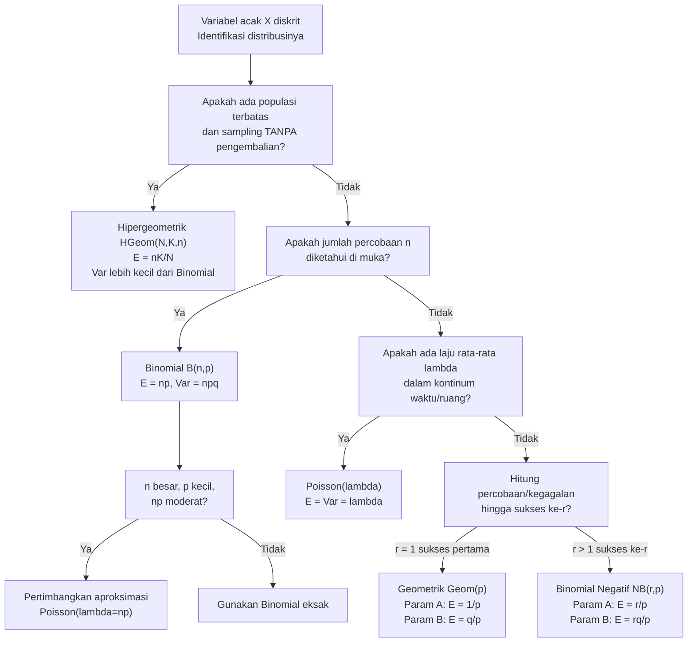

# 📊 2.5 — Distribusi Diskrit Umum

> [!ABSTRACT] Ringkasan Cepat
> **Topik:** Distribusi Diskrit Umum (Bernoulli, Binomial, Poisson, Geometrik, Hipergeometrik, Binomial Negatif) | **Bobot:** ~25–35% | **Difficulty:** Calculation-Intensive
> **Ref:** Hogg-Tanis-Zimm (2015) Bab 2.2–2.5, 3.1–3.3; Miller et al. (2014) Bab 5.1–5.7, 6.1–6.5, 7.1–7.3 | **Prereq:** [[2.1 Variabel Acak Diskrit]], [[2.3 Fungsi Pembangkit]], [[1.3 Metode Enumerasi]]

## Section 0 — Pemetaan Topik

| Topik CF2 | Sub-topik ID | Skill Diuji | Bobot | Difficulty | Prerequisite | Connected Topics | Referensi |
|-----------|--------------|-------------|-------|------------|--------------|------------------|-----------|
| Topik 2: Variabel Acak Univariat | 2.5 | Mengidentifikasi distribusi yang tepat dari deskripsi soal; menghitung PMF, CDF, $E[X]$, $\text{Var}(X)$ untuk enam distribusi diskrit; menurunkan dan menggunakan MGF/PGF masing-masing distribusi; mengenali hubungan antar-distribusi (Bernoulli↔Binomial, Geometrik↔Binomial Negatif, Binomial↔Poisson); menangani dua parametrisasi Geometrik dan Binomial Negatif | 25–35% | Calculation-Intensive | [[2.1 Variabel Acak Diskrit]], [[2.3 Fungsi Pembangkit]], [[1.3 Metode Enumerasi]] | [[2.3 Fungsi Pembangkit]], [[2.4 Transformasi Variabel Acak Univariat]], [[3.5 Independensi dan Korelasi]], [[3.7 Distribusi Majemuk (Compound Distribution)]], [[4.5 Estimasi Parameter]] | Hogg-Tanis-Zimm (2015) Bab 2.2–2.5, 3.1–3.3; Miller et al. (2014) Bab 5.1–5.7, 6.1–6.5, 7.1–7.3 |

## Section 1 — Intuisi

Di dunia aktuaria, hampir semua kejadian diskrit yang dapat dihitung — jumlah klaim dalam sebulan, jumlah nasabah yang gagal bayar, jumlah kecelakaan di suatu ruas jalan — mengikuti pola probabilistik yang sudah sangat dipelajari. Keenam distribusi diskrit di topik ini bukan sekadar formula hafalan; masing-masing lahir dari **mekanisme pembangkit kejadian** yang berbeda dan memiliki konteks yang khas. Memahami *mengapa* suatu mekanisme menghasilkan distribusi tertentu adalah kunci untuk mengidentifikasi distribusi yang tepat dalam soal — jauh lebih andal daripada sekadar mengenali kata kunci.

Bayangkan sebuah eksperimen dasar: lempar koin sekali, sukses atau gagal. Ini adalah **Bernoulli** — sel darah merah paling sederhana dari statistika diskrit. Lakukan eksperimen Bernoulli ini $n$ kali secara independen dan hitung total sukses: lahirlah **Binomial**. Kini bayangkan populasi terbatas (misalnya 20 nasabah, 8 di antaranya berisiko tinggi) dan kita menarik sampel tanpa pengembalian — tidak bisa diasumsikan independen lagi: inilah **Hipergeometrik**. Sekarang alih-alih menentukan jumlah percobaan di muka, kita tanya: "berapa percobaan sampai sukses pertama?" — jawabannya **Geometrik**; generalkan ke sukses ke-$r$: **Binomial Negatif**. Terakhir, jika kejadian terjadi secara acak dalam kontinum waktu atau ruang dengan laju rata-rata $\lambda$ dan kita menghitung berapa kejadian dalam interval tertentu — itulah **Poisson**, distribusi yang muncul sebagai limit Binomial ketika $n \to \infty$, $p \to 0$, $np \to \lambda$.

Keenam distribusi ini saling terhubung: Bernoulli adalah kasus khusus Binomial ($n=1$); penjumlahan Bernoulli independen menghasilkan Binomial; penjumlahan Geometrik independen menghasilkan Binomial Negatif; Binomial mendekati Poisson dalam limit tertentu. Memahami jaring hubungan ini memungkinkan identifikasi distribusi yang cepat, penggunaan MGF untuk verifikasi, dan penalaran tentang distribusi penjumlahan — ketiganya sangat sering diuji di CF2.

## Section 2 — Definisi Formal

> [!NOTE] Ringkasan Enam Distribusi Diskrit
>
> Tabel master — semua formula PMF, mean, variansi, dan MGF untuk referensi cepat.

### Tabel Master Distribusi Diskrit

| Distribusi | Notasi | PMF $p(x)$ | Support $\mathcal{X}$ | $E[X]$ | $\text{Var}(X)$ | $M_X(t)$ |
|------------|--------|-----------|----------------------|--------|-----------------|----------|
| Bernoulli | $\text{Bern}(p)$ | $p^x(1-p)^{1-x}$ | $\{0,1\}$ | $p$ | $p(1-p)$ | $1-p+pe^t$ |
| Binomial | $B(n,p)$ | $\binom{n}{x}p^x(1-p)^{n-x}$ | $\{0,1,\ldots,n\}$ | $np$ | $np(1-p)$ | $(1-p+pe^t)^n$ |
| Poisson | $\text{Poisson}(\lambda)$ | $\dfrac{e^{-\lambda}\lambda^x}{x!}$ | $\{0,1,2,\ldots\}$ | $\lambda$ | $\lambda$ | $e^{\lambda(e^t-1)}$ |
| Geometrik (A) | $\text{Geom}(p)$ | $(1-p)^{x-1}p$ | $\{1,2,3,\ldots\}$ | $\dfrac{1}{p}$ | $\dfrac{1-p}{p^2}$ | $\dfrac{pe^t}{1-(1-p)e^t}$ |
| Geometrik (B) | $\text{Geom}_0(p)$ | $(1-p)^x p$ | $\{0,1,2,\ldots\}$ | $\dfrac{1-p}{p}$ | $\dfrac{1-p}{p^2}$ | $\dfrac{p}{1-(1-p)e^t}$ |
| Hipergeometrik | $\text{HGeom}(N,K,n)$ | $\dfrac{\binom{K}{x}\binom{N-K}{n-x}}{\binom{N}{n}}$ | $\{\max(0,n+K-N),\ldots,\min(n,K)\}$ | $\dfrac{nK}{N}$ | $\dfrac{nK(N-K)(N-n)}{N^2(N-1)}$ | Tidak ada bentuk sederhana |
| Bin. Negatif (A) | $\text{NB}(r,p)$ | $\binom{x-1}{r-1}p^r(1-p)^{x-r}$ | $\{r,r+1,\ldots\}$ | $\dfrac{r}{p}$ | $\dfrac{r(1-p)}{p^2}$ | $\left(\dfrac{pe^t}{1-(1-p)e^t}\right)^r$ |
| Bin. Negatif (B) | $\text{NB}_0(r,p)$ | $\binom{x+r-1}{x}p^r(1-p)^x$ | $\{0,1,2,\ldots\}$ | $\dfrac{r(1-p)}{p}$ | $\dfrac{r(1-p)}{p^2}$ | $\left(\dfrac{p}{1-(1-p)e^t}\right)^r$ |

### Variabel & Parameter

| Simbol | Makna | Rentang Valid |
|--------|-------|---------------|
| $p$ | Probabilitas sukses dalam satu percobaan Bernoulli | $p \in (0,1)$ |
| $q = 1-p$ | Probabilitas gagal | $q \in (0,1)$ |
| $n$ | Jumlah percobaan (Binomial) atau ukuran sampel (Hipergeometrik) | $n \in \mathbb{Z}^+$ |
| $\lambda$ | Laju rata-rata kejadian (Poisson) | $\lambda > 0$ |
| $N$ | Ukuran populasi (Hipergeometrik) | $N \in \mathbb{Z}^+$ |
| $K$ | Jumlah elemen "sukses" di populasi (Hipergeometrik) | $K \in \{0,1,\ldots,N\}$ |
| $r$ | Jumlah sukses yang ditarget (Binomial Negatif) atau jumlah sukses total (Binomial Negatif) | $r \in \mathbb{Z}^+$ |

### Rumus Utama per Distribusi

---

#### Bernoulli$(p)$

$$
p(x) = p^x(1-p)^{1-x}, \quad x \in \{0,1\}
$$
$$
E[X] = p, \qquad \text{Var}(X) = p(1-p) = pq, \qquad M_X(t) = q + pe^t
$$

---

#### Binomial $B(n,p)$

$$
p(x) = \binom{n}{x} p^x (1-p)^{n-x}, \quad x \in \{0,1,\ldots,n\}
$$
$$
E[X] = np, \qquad \text{Var}(X) = np(1-p) = npq, \qquad M_X(t) = (q + pe^t)^n
$$

**Hubungan dengan Bernoulli:** Jika $X_1, X_2, \ldots, X_n \overset{\text{iid}}{\sim} \text{Bern}(p)$, maka $S = \sum_{i=1}^n X_i \sim B(n,p)$.

**Sifat aditif:** Jika $X \sim B(n_1, p)$ dan $Y \sim B(n_2, p)$ independen, maka $X + Y \sim B(n_1+n_2, p)$.

**Aproksimasi Poisson:** Jika $n \to \infty$, $p \to 0$, dan $np \to \lambda$, maka $B(n,p) \approx \text{Poisson}(\lambda)$.

---

#### Poisson$(\lambda)$

$$
p(x) = \frac{e^{-\lambda}\lambda^x}{x!}, \quad x \in \{0,1,2,\ldots\}
$$
$$
E[X] = \lambda, \qquad \text{Var}(X) = \lambda, \qquad M_X(t) = e^{\lambda(e^t - 1)}
$$

**Sifat khas:** $E[X] = \text{Var}(X) = \lambda$ — kesamaan mean dan variansi adalah penanda distribusi Poisson.

**Sifat aditif:** Jika $X \sim \text{Poisson}(\lambda_1)$ dan $Y \sim \text{Poisson}(\lambda_2)$ independen, maka $X + Y \sim \text{Poisson}(\lambda_1 + \lambda_2)$.

---

#### Geometrik

**Parametrisasi A** — $X$ = jumlah percobaan hingga sukses pertama (inklusif):
$$
p(x) = (1-p)^{x-1}p, \quad x \in \{1,2,3,\ldots\}
$$
$$
E[X] = \frac{1}{p}, \qquad \text{Var}(X) = \frac{1-p}{p^2}, \qquad M_X(t) = \frac{pe^t}{1-(1-p)e^t}, \quad t < -\ln(1-p)
$$

**Parametrisasi B** — $X$ = jumlah kegagalan sebelum sukses pertama:
$$
p(x) = (1-p)^x p, \quad x \in \{0,1,2,\ldots\}
$$
$$
E[X] = \frac{1-p}{p} = \frac{q}{p}, \qquad \text{Var}(X) = \frac{1-p}{p^2}, \qquad M_X(t) = \frac{p}{1-(1-p)e^t}
$$

**Sifat memoryless (tanpa ingatan):**
$$
P(X > m+n \mid X > m) = P(X > n) \quad \text{untuk semua } m,n \geq 0
$$
Ini adalah satu-satunya distribusi diskrit yang memiliki sifat memoryless.

---

#### Hipergeometrik $\text{HGeom}(N,K,n)$

$$
p(x) = \frac{\binom{K}{x}\binom{N-K}{n-x}}{\binom{N}{n}}, \quad x \in \{\max(0,\, n+K-N),\, \ldots,\, \min(n,K)\}
$$
$$
E[X] = \frac{nK}{N}, \qquad \text{Var}(X) = \frac{nK(N-K)(N-n)}{N^2(N-1)}
$$

**Faktor koreksi populasi terbatas (FPC):**
$$
\text{Var}(X)_{\text{HGeom}} = \underbrace{\frac{nK}{N}\cdot\frac{N-K}{N}}_{\approx\,\text{Var Binomial}} \cdot \underbrace{\frac{N-n}{N-1}}_{\text{FPC}}
$$

Perhatikan: $\text{FPC} = (N-n)/(N-1) < 1$ selalu, sehingga variansi Hipergeometrik **selalu lebih kecil** dari variansi Binomial dengan $p = K/N$.

**Hubungan dengan Binomial:** Ketika $N \to \infty$ dengan $K/N \to p$, maka $\text{HGeom}(N,K,n) \to B(n,p)$.

---

#### Binomial Negatif $\text{NB}(r,p)$

**Parametrisasi A** — $X$ = jumlah percobaan hingga sukses ke-$r$ (inklusif):
$$
p(x) = \binom{x-1}{r-1} p^r (1-p)^{x-r}, \quad x \in \{r, r+1, r+2, \ldots\}
$$
$$
E[X] = \frac{r}{p}, \qquad \text{Var}(X) = \frac{r(1-p)}{p^2}, \qquad M_X(t) = \left(\frac{pe^t}{1-(1-p)e^t}\right)^r
$$

**Parametrisasi B** — $X$ = jumlah kegagalan sebelum sukses ke-$r$:
$$
p(x) = \binom{x+r-1}{x} p^r (1-p)^x, \quad x \in \{0,1,2,\ldots\}
$$
$$
E[X] = \frac{r(1-p)}{p}, \qquad \text{Var}(X) = \frac{r(1-p)}{p^2}
$$

**Hubungan dengan Geometrik:** Jika $X_1,\ldots,X_r \overset{\text{iid}}{\sim} \text{Geom}(p)$ (Parametrisasi A), maka $S = \sum_{i=1}^r X_i \sim \text{NB}(r,p)$ (Parametrisasi A).

**Kasus khusus:** $\text{NB}(1,p) = \text{Geom}(p)$ pada Parametrisasi A.

### Asumsi Eksplisit

- **Bernoulli & Binomial:** Setiap percobaan independen, probabilitas sukses $p$ **konstan** di setiap percobaan, hanya dua outcome (sukses/gagal).
- **Poisson:** Kejadian terjadi secara independen; laju $\lambda$ konstan; probabilitas lebih dari satu kejadian dalam interval infinitesimal adalah $o(\Delta t)$ (dapat diabaikan).
- **Geometrik & Binomial Negatif:** Percobaan independen, $p$ konstan, percobaan dilanjutkan hingga sukses ke-$r$.
- **Hipergeometrik:** Pengambilan **tanpa pengembalian** dari populasi terbatas — percobaan **tidak independen**. Ini adalah perbedaan kritis dengan Binomial.

## Section 3 — Jembatan Logika

> [!TIP] Dari Mekanisme ke Formula
> Setiap distribusi lahir dari **cara kita menghitung kejadian**. Kunci identifikasi:
>
> — *"$n$ percobaan independen, hitung sukses"* → **Binomial** (jumlah sukses diketahui di muka, percobaan diketahui di muka).
>
> — *"Hitung sampai sukses pertama / ke-$r$"* → **Geometrik / Binomial Negatif** (jumlah percobaan yang tidak diketahui di muka — percobaan berlanjut sampai target terpenuhi).
>
> — *"Populasi terbatas, sampel tanpa pengembalian"* → **Hipergeometrik** (tidak ada independensi antar percobaan).
>
> — *"Kejadian acak dalam waktu/ruang, laju $\lambda$"* → **Poisson** (tidak ada konsep "jumlah percobaan" — kontinum waktu/ruang).

> [!IMPORTANT] Support dan Domain
> Support yang salah adalah kesalahan paling sering dalam soal CF2 distribusi diskrit:
>
> - **Binomial:** $x \in \{0, 1, \ldots, n\}$ — bisa nol sukses, maksimal $n$ sukses.
> - **Poisson:** $x \in \{0, 1, 2, \ldots\}$ — tak terbatas atas, bisa nol.
> - **Geometrik (Param A):** $x \in \{1, 2, 3, \ldots\}$ — dimulai dari 1 (minimal 1 percobaan).
> - **Geometrik (Param B):** $x \in \{0, 1, 2, \ldots\}$ — dimulai dari 0 (bisa nol kegagalan).
> - **Hipergeometrik:** $x \in \{\max(0, n+K-N), \ldots, \min(n, K)\}$ — batas bawah tidak selalu 0!
> - **Binomial Negatif (Param A):** $x \in \{r, r+1, \ldots\}$ — minimal $r$ percobaan (satu per sukses).
> - **Binomial Negatif (Param B):** $x \in \{0, 1, 2, \ldots\}$ — bisa nol kegagalan.

**Derivasi PMF Binomial dari Prinsip Dasar:**

Dalam $n$ percobaan independen, kita ingin tepat $x$ sukses. Pilih posisi mana dari $n$ yang menjadi sukses: ada $\binom{n}{x}$ cara. Untuk setiap susunan tersebut, probabilitasnya adalah $p^x$ (untuk $x$ sukses) dikali $(1-p)^{n-x}$ (untuk $n-x$ gagal):
$$
p(x) = \binom{n}{x} p^x (1-p)^{n-x}
$$

**Derivasi PMF Poisson dari Limit Binomial:**

Dalam $n$ interval kecil, setiap interval ada kejadian dengan probabilitas $p = \lambda/n$. Maka $X \sim B(n, \lambda/n)$:
$$
p(x) = \binom{n}{x}\left(\frac{\lambda}{n}\right)^x\left(1-\frac{\lambda}{n}\right)^{n-x}
$$

Ambil $n \to \infty$: $\binom{n}{x}(\lambda/n)^x \to \lambda^x/x!$ dan $(1-\lambda/n)^n \to e^{-\lambda}$, sehingga:
$$
\lim_{n\to\infty} p(x) = \frac{e^{-\lambda}\lambda^x}{x!}
$$

**Derivasi Sifat Memoryless Geometrik:**

Untuk Parametrisasi B, $P(X = k) = (1-p)^k p$:
$$
P(X > m+n \mid X > m) = \frac{P(X > m+n)}{P(X > m)} = \frac{(1-p)^{m+n+1} \cdot \frac{1}{p}}{(1-p)^{m+1} \cdot \frac{1}{p}} = (1-p)^n = P(X > n)
$$

(Menggunakan ekor Geometrik: $P(X > k) = (1-p)^{k+1}$ untuk Param B.)

**Jaring Hubungan Antar-Distribusi:**

$$
\text{Bern}(p) \xrightarrow{\text{jumlah } n \text{ iid}} B(n,p) \xrightarrow{n\to\infty,\, p\to 0,\, np=\lambda} \text{Poisson}(\lambda)
$$
$$
\text{Geom}(p) \xrightarrow{\text{jumlah } r \text{ iid}} \text{NB}(r,p)
$$
$$
\text{HGeom}(N,K,n) \xrightarrow{N\to\infty,\, K/N\to p} B(n,p)
$$

> [!DANGER] Dilarang
> 1. **Dilarang** menggunakan formula Binomial untuk sampling **tanpa pengembalian** dari populasi terbatas. Binomial mengasumsikan independensi antar percobaan — tanpa pengembalian melanggar ini. Gunakan Hipergeometrik jika populasi terbatas dan sampling tanpa pengembalian.
> 2. **Dilarang** mencampur parametrisasi Geometrik dan Binomial Negatif dalam satu perhitungan tanpa konsistensi. Parametrisasi A ($x$ = jumlah percobaan, support mulai 1 atau $r$) memiliki mean $1/p$ atau $r/p$; Parametrisasi B ($x$ = jumlah kegagalan, support mulai 0) memiliki mean $q/p$ atau $rq/p$. Mencampur keduanya menghasilkan answer yang salah satu unit.
> 3. **Dilarang** mengaplikasikan aproksimasi Poisson untuk Binomial secara sembarangan. Aproksimasi hanya valid jika $n$ besar ($n \geq 30$), $p$ kecil ($p \leq 0.05$), dan $\lambda = np$ moderat ($\lambda \leq 10$). Di luar rentang ini, gunakan Binomial eksak.

## Section 4 — Contoh Soal

### Soal A — Fundamental

Sebuah perusahaan asuransi mengetahui bahwa probabilitas seorang nasabah mengajukan klaim dalam satu tahun adalah $0{,}15$. Perusahaan memiliki **12 nasabah independen**.

(a) Berapa probabilitas tepat 2 nasabah mengajukan klaim?
(b) Berapa probabilitas paling banyak 1 nasabah mengajukan klaim?
(c) Hitung $E[X]$ dan $\text{Var}(X)$.
(d) Berapa probabilitas sedikitnya 2 nasabah mengajukan klaim?

> [!SUCCESS] Solusi Soal A
>
> **1. Identifikasi Variabel**
> - $n = 12$ nasabah independen
> - $p = 0{,}15$ (probabilitas klaim per nasabah)
> - $q = 1 - 0{,}15 = 0{,}85$
> - $X$ = jumlah nasabah yang mengajukan klaim
>
> **2. Identifikasi Distribusi / Model**
> $n$ percobaan independen, $p$ konstan, hitung sukses → **Binomial**: $X \sim B(12,\, 0{,}15)$.
>
> **3. Setup Persamaan**
>
> $$p(x) = \binom{12}{x}(0{,}15)^x(0{,}85)^{12-x}, \quad x \in \{0,1,\ldots,12\}$$
>
> **4. Eksekusi Aljabar**
>
> **(a) $P(X = 2)$:**
> $$P(X=2) = \binom{12}{2}(0{,}15)^2(0{,}85)^{10} = 66 \times 0{,}0225 \times (0{,}85)^{10}$$
> $$(0{,}85)^{10} = 0{,}19687$$
> $$P(X=2) = 66 \times 0{,}0225 \times 0{,}19687 = 66 \times 0{,}004430 = 0{,}2924$$
>
> **(b) $P(X \leq 1)$:**
> $$P(X=0) = \binom{12}{0}(0{,}15)^0(0{,}85)^{12} = (0{,}85)^{12} = 0{,}1422$$
> $$P(X=1) = \binom{12}{1}(0{,}15)^1(0{,}85)^{11} = 12 \times 0{,}15 \times (0{,}85)^{11}$$
> $$(0{,}85)^{11} = 0{,}16735 \implies P(X=1) = 12 \times 0{,}15 \times 0{,}16735 = 0{,}3012$$
> $$P(X \leq 1) = 0{,}1422 + 0{,}3012 = 0{,}4434$$
>
> **(c) $E[X]$ dan $\text{Var}(X)$:**
> $$E[X] = np = 12 \times 0{,}15 = 1{,}8$$
> $$\text{Var}(X) = np(1-p) = 12 \times 0{,}15 \times 0{,}85 = 1{,}53$$
>
> **(d) $P(X \geq 2)$:**
> $$P(X \geq 2) = 1 - P(X \leq 1) = 1 - 0{,}4434 = 0{,}5566$$
>
> **5. Verification**
> - $E[X] = 1{,}8$: dari 12 nasabah dengan $p=0{,}15$, rata-rata 1–2 klaim masuk akal ✓
> - $P(X=2) = 0{,}2924$: nilai tertinggi di sekitar mean ($E[X] = 1{,}8$), wajar jika $P(2)$ besar ✓
> - $P(X \leq 1) + P(X \geq 2) = 0{,}4434 + 0{,}5566 = 1{,}000$ ✓
> - $\text{Var}(X) = 1{,}53 < E[X] = 1{,}8$: untuk Binomial selalu $\text{Var} < E[X]$ karena $\text{Var} = E[X](1-p)$ ✓

> [!WARNING] Exam Tips — Soal A
> **Target waktu:** 7–9 menit
> **Common trap:** Menghitung $P(X \geq 2)$ dengan menjumlahkan $P(2)+P(3)+\ldots+P(12)$ — ini memakan waktu lama. Selalu gunakan komplemen: $1 - P(X \leq 1)$.
> **Shortcut:** Hafal bahwa $\text{Var}(X) = E[X] \cdot (1-p)$ untuk Binomial — lebih cepat dari $np(1-p)$ jika $E[X] = np$ sudah dihitung.

---

### Soal B — Exam-Typical

Sebuah call center menerima panggilan darurat rata-rata **4 panggilan per jam** secara acak dan independen. Anggap distribusi Poisson berlaku.

(a) Berapa probabilitas tepat 6 panggilan dalam satu jam?
(b) Berapa probabilitas paling sedikit 1 panggilan dalam 30 menit?
(c) Seorang operator baru mulai bertugas. Berapa probabilitas panggilan ke-3 yang ia terima adalah panggilan darurat ke-1 yang ia tangani, jika probabilitas sebuah panggilan adalah "darurat" (bukan rutin) adalah $0{,}3$? Gunakan distribusi yang tepat.
(d) Hitung $E[X]$ dan $\text{Var}(X)$ untuk jumlah panggilan dalam 45 menit.

> [!SUCCESS] Solusi Soal B
>
> **1. Identifikasi Variabel**
> - Laju: $\lambda = 4$ panggilan/jam
> - Target (a): $X$ = panggilan dalam 1 jam → $X \sim \text{Poisson}(4)$
> - Target (b): $Y$ = panggilan dalam 30 menit → $Y \sim \text{Poisson}(2)$ (laju proporsional)
> - Target (c): $Z$ = percobaan hingga "darurat" pertama, $p = 0{,}3$ → Geometrik
> - Target (d): $W$ = panggilan dalam 45 menit → $W \sim \text{Poisson}(3)$
>
> **2. Identifikasi Distribusi / Model**
> Bagian (a), (b), (d): Poisson dengan laju yang disesuaikan proporsional dengan interval waktu. Bagian (c): percobaan independen hingga sukses pertama → **Geometrik Parametrisasi A** ($p = 0{,}3$, $X$ = panggilan ke-$k$ adalah darurat pertama).
>
> **3. Setup Persamaan**
>
> Sifat Poisson: jika $X \sim \text{Poisson}(\lambda)$ per satuan waktu, maka dalam interval $t$ satuan: $X_t \sim \text{Poisson}(\lambda t)$.
>
> **4. Eksekusi Aljabar**
>
> **(a) $P(X = 6)$, $\lambda = 4$:**
> $$P(X=6) = \frac{e^{-4} \cdot 4^6}{6!} = \frac{e^{-4} \times 4096}{720} = \frac{0{,}018316 \times 4096}{720} = \frac{75{,}02}{720} = 0{,}1042$$
>
> **(b) $P(Y \geq 1)$ dalam 30 menit, $\lambda_{30} = 4 \times 0{,}5 = 2$:**
> $$P(Y \geq 1) = 1 - P(Y=0) = 1 - \frac{e^{-2} \cdot 2^0}{0!} = 1 - e^{-2} = 1 - 0{,}1353 = 0{,}8647$$
>
> **(c) $P(Z = 3)$ dengan $Z \sim \text{Geom}(0{,}3)$ Param A:**
>
> "Panggilan ke-3 adalah darurat pertama" berarti dua pertama bukan darurat, ketiga adalah darurat:
> $$P(Z=3) = (1-0{,}3)^{3-1} \times 0{,}3 = (0{,}7)^2 \times 0{,}3 = 0{,}49 \times 0{,}3 = 0{,}147$$
>
> **(d) $E[W]$ dan $\text{Var}(W)$ dalam 45 menit, $\lambda_{45} = 4 \times 0{,}75 = 3$:**
> $$E[W] = \lambda_{45} = 3 \quad \text{panggilan}$$
> $$\text{Var}(W) = \lambda_{45} = 3$$
>
> **5. Verification**
> - Untuk Poisson: $E = \text{Var} = \lambda$ — selalu periksa kesamaan ini ✓
> - $P(X=6) = 0{,}1042$: modus Poisson(4) ada di $x=3$ dan $x=4$; $P(6)$ lebih kecil dari $P(4)$, masuk akal ✓
> - $P(Y \geq 1) = 0{,}8647$: dengan rata-rata 2 panggilan per 30 menit, probabilitas minimal 1 panggilan harusnya tinggi ✓
> - $P(Z=3) = 0{,}147$: dua kegagalan berturut-turut sebelum sukses dengan $p=0{,}3$, probabilitas moderat ✓

> [!WARNING] Exam Tips — Soal B
> **Target waktu:** 10–12 menit
> **Common trap 1:** Lupa menskalakan $\lambda$ proporsional saat interval waktu berubah. Untuk 30 menit dari laju 4/jam: $\lambda_{30} = 4 \times (30/60) = 2$, bukan $4$.
> **Common trap 2:** Untuk bagian (c), $P(Z=3)$ artinya percobaan ke-3 sukses — gunakan $p(3) = (1-p)^{3-1}p$, **bukan** $p(3) = (1-p)^3 p$ (itu Parametrisasi B dengan support berbeda).
> **Shortcut:** Untuk $P(\text{Poisson} \geq 1)$: selalu gunakan komplemen $1 - e^{-\lambda}$ — ini lebih cepat dari menjumlahkan deret.

---

### Soal C — Challenging

Dari populasi 20 polis asuransi, diketahui 8 polis berisiko tinggi (*high-risk*) dan 12 polis berisiko rendah (*low-risk*). Seorang auditor memilih **5 polis secara acak tanpa pengembalian** untuk diperiksa.

(a) Tentukan distribusi $X$ (jumlah polis high-risk yang terpilih) beserta PMF lengkapnya.
(b) Hitung $E[X]$ dan $\text{Var}(X)$.
(c) Berapa probabilitas tepat 2 polis high-risk terpilih?
(d) Bandingkan $\text{Var}(X)$ dengan variansi Binomial $B(5, 8/20)$ dan jelaskan perbedaannya secara intuitif.
(e) Misalkan auditor **mengembalikan** setiap polis sebelum mengambil yang berikutnya. Distribusi apa yang berlaku, dan berapa probabilitas tepat 2 polis high-risk terpilih? Bandingkan dengan hasil (c).

> [!SUCCESS] Solusi Soal C
>
> **1. Identifikasi Variabel**
> - $N = 20$ (populasi), $K = 8$ (high-risk), $n = 5$ (sampel)
> - Tanpa pengembalian → **Hipergeometrik**: $X \sim \text{HGeom}(20, 8, 5)$
> - Support: $x \in \{\max(0, 5+8-20), \ldots, \min(5,8)\} = \{\max(0,-7), \ldots, 5\} = \{0,1,2,3,4,5\}$
>
> **2. Identifikasi Distribusi / Model**
> Bagian (a)–(d): Hipergeometrik (tanpa pengembalian, populasi terbatas). Bagian (e): Binomial $B(5, 0{,}4)$ (dengan pengembalian → independen, $p$ konstan).
>
> **3. Setup Persamaan**
>
> PMF Hipergeometrik:
> $$p(x) = \frac{\binom{8}{x}\binom{12}{5-x}}{\binom{20}{5}}, \quad x \in \{0,1,2,3,4,5\}$$
>
> **4. Eksekusi Aljabar**
>
> Hitung $\binom{20}{5} = \dfrac{20!}{5!\cdot 15!} = 15504$.
>
> **(a) PMF lengkap:**
>
> | $x$ | $\binom{8}{x}$ | $\binom{12}{5-x}$ | $p(x) = \frac{\binom{8}{x}\binom{12}{5-x}}{15504}$ |
> |-----|----------------|-------------------|------------------------------------------------------|
> | 0 | 1 | 792 | $792/15504 = 0{,}0511$ |
> | 1 | 8 | 495 | $3960/15504 = 0{,}2554$ |
> | 2 | 28 | 220 | $6160/15504 = 0{,}3973$ |
> | 3 | 56 | 66 | $3696/15504 = 0{,}2384$ |
> | 4 | 70 | 12 | $840/15504 = 0{,}0542$ |
> | 5 | 56 | 1 | $56/15504 = 0{,}0036$ |
>
> Cek: $792+3960+6160+3696+840+56 = 15504$ ✓, sehingga $\sum p(x) = 1$ ✓
>
> **(b) $E[X]$ dan $\text{Var}(X)$:**
> $$E[X] = \frac{nK}{N} = \frac{5 \times 8}{20} = 2$$
>
> $$\text{Var}(X) = \frac{nK(N-K)(N-n)}{N^2(N-1)} = \frac{5 \times 8 \times 12 \times 15}{400 \times 19} = \frac{7200}{7600} = \frac{18}{19} \approx 0{,}9474$$
>
> **(c) $P(X = 2)$:**
> $$P(X=2) = \frac{\binom{8}{2}\binom{12}{3}}{\binom{20}{5}} = \frac{28 \times 220}{15504} = \frac{6160}{15504} \approx 0{,}3973$$
>
> **(d) Perbandingan dengan Variansi Binomial:**
>
> Binomial $B(5, 8/20)$ dengan $p = 0{,}4$:
> $$\text{Var}_{\text{Binom}} = np(1-p) = 5 \times 0{,}4 \times 0{,}6 = 1{,}200$$
>
> Hipergeometrik:
> $$\text{Var}_{\text{HGeom}} = 1{,}200 \times \underbrace{\frac{N-n}{N-1}}_{\text{FPC}} = 1{,}200 \times \frac{15}{19} = \frac{18}{19} \approx 0{,}9474$$
>
> $\text{Var}_{\text{HGeom}} < \text{Var}_{\text{Binom}}$ karena FPC $= 15/19 < 1$.
>
> **Intuisi:** Tanpa pengembalian, jika sudah memilih banyak polis high-risk, probabilitas memilih high-risk lagi pada draw berikutnya *menurun* — ada mekanisme "auto-koreksi" yang mengurangi fluktuasi. Sebaliknya, sampling dengan pengembalian (Binomial) tidak "mengingat" apa yang sudah dipilih, sehingga variabilitasnya lebih tinggi.
>
> **(e) Dengan pengembalian — Binomial $B(5, 0{,}4)$:**
> $$P(X=2) = \binom{5}{2}(0{,}4)^2(0{,}6)^3 = 10 \times 0{,}16 \times 0{,}216 = 0{,}3456$$
>
> Perbandingan: $P_{\text{HGeom}}(X=2) = 0{,}3973$ vs $P_{\text{Binom}}(X=2) = 0{,}3456$.
>
> Hipergeometrik menghasilkan probabilitas lebih tinggi di $x = E[X] = 2$ karena variansinya lebih kecil (distribusi lebih terkonsentrasi di sekitar mean).
>
> **5. Verification**
> - $\sum p(x) = 1$ (sudah dicek dari numerator: $792+3960+6160+3696+840+56 = 15504$) ✓
> - $E[X] = 2$: dari 5 pilihan, proporsi high-risk $= 8/20 = 0{,}4$, sehingga $E = 5 \times 0{,}4 = 2$ ✓
> - $\text{Var}_{\text{HGeom}} < \text{Var}_{\text{Binom}}$: selalu berlaku untuk Hipergeometrik ✓
> - Mode PMF ada di $x=2$ (probabilitas tertinggi $0{,}3973$), konsisten dengan $E[X] = 2$ ✓

> [!WARNING] Exam Tips — Soal C
> **Target waktu:** 14–16 menit
> **Common trap 1:** Support Hipergeometrik tidak selalu mulai dari 0. Gunakan $\max(0, n+K-N)$ sebagai batas bawah. Di sini $\max(0, 5+8-20) = \max(0,-7) = 0$, jadi kebetulan mulai 0 — tetapi ini tidak selalu demikian.
> **Common trap 2:** Menghitung $\binom{20}{5}$ dengan kalkulator salah (angka besar, rawan salah ketik). Verifikasi: $\binom{20}{5} = \frac{20 \times 19 \times 18 \times 17 \times 16}{5!} = \frac{1860480}{120} = 15504$.
> **Shortcut FPC:** $\text{Var}_{\text{HGeom}} = \text{Var}_{\text{Binom}} \times \frac{N-n}{N-1}$ — jauh lebih cepat daripada formula panjang jika $\text{Var}_{\text{Binom}}$ sudah diketahui.

## Section 5 — Verifikasi & Sanity Check

> [!CHECK] Validasi PMF
> Untuk semua distribusi diskrit, sebelum menggunakan PMF:
> 1. $p(x) \geq 0$ untuk semua $x \in \mathcal{X}$ — periksa parameter valid ($p \in (0,1)$, $\lambda > 0$, dll.) ✓
> 2. $\sum_{x \in \mathcal{X}} p(x) = 1$ — untuk distribusi standar ini dijamin oleh definisi; untuk PMF yang diberikan eksplisit, verifikasi selalu ✓
> 3. Support $\mathcal{X}$ sesuai tabel — terutama batas bawah Geometrik dan Hipergeometrik ✓

> [!CHECK] Validasi Mean dan Variansi
> Quick-check konsistensi setelah menghitung:
> 1. **Binomial:** $\text{Var}(X) = E[X] \cdot (1-p) < E[X]$ selalu ✓
> 2. **Poisson:** $E[X] = \text{Var}(X) = \lambda$ — kesamaan ini adalah penanda wajib ✓
> 3. **HGeom vs Binom:** $\text{Var}_{\text{HGeom}} < \text{Var}_{\text{Binom}}$ selalu karena FPC $< 1$ ✓
> 4. **Geometrik:** $\text{Var}(X) = E[X]^2 \cdot (1-p)$ untuk Param A — periksa rasio $\text{Var}/E^2 = 1-p$ ✓

> [!CHECK] Identifikasi Distribusi yang Tepat
> Dua pertanyaan diagnostik sebelum memilih distribusi:
> 1. **Apakah populasi terbatas dan sampling tanpa pengembalian?** → Hipergeometrik (bukan Binomial)
> 2. **Apakah jumlah percobaan diketahui di muka atau tidak?** → Diketahui: Binomial/Hipergeometrik; Tidak diketahui (hitung sampai sukses ke-$r$): Geometrik/Binomial Negatif

### Metode Alternatif

**MGF untuk identifikasi distribusi penjumlahan:** Jika soal meminta distribusi penjumlahan variabel i.i.d., kalikan MGF individual dan cocokkan bentuknya:
- $(q+pe^t)^n$ → Binomial $B(n,p)$
- $e^{\lambda(e^t-1)}$ → Poisson$(\lambda)$
- $\left(\frac{pe^t}{1-(1-p)e^t}\right)^r$ → NB$(r,p)$ Param A

**Aproksimasi Poisson untuk Binomial:** Jika $n \geq 30$, $p \leq 0{,}05$, gunakan $\text{Poisson}(\lambda = np)$ sebagai aproksimasi — perhitungan lebih cepat karena tidak ada $\binom{n}{x}$ besar.

## Section 6 — Visualisasi Mental

**PMF Binomial — Kurva Lonceng Diskrit:**

Bayangkan histogram batang di atas bilangan bulat $\{0, 1, \ldots, n\}$. Untuk $p = 0{,}5$: histogram **simetris**, puncak di $x = n/2$. Untuk $p < 0{,}5$: histogram **miring kanan** (*right-skewed*), puncak di sekitar $np$, ekor kanan lebih panjang. Untuk $p > 0{,}5$: histogram **miring kiri**. Semakin besar $n$ (dengan $p$ tetap), histogram mendekati kurva Normal $N(np, npq)$ — ini adalah *CLT untuk Binomial*.

**PMF Poisson — Batang Menurun dengan Ekor Kanan:**

Histogram di atas $\{0, 1, 2, \ldots\}$, tidak terbatas ke kanan. Modus ada di $\lfloor\lambda\rfloor$ (dan $\lambda - 1$ jika $\lambda$ bulat). Untuk $\lambda$ kecil ($\lambda < 1$): modus di $x=0$, batang terbesar paling kiri. Untuk $\lambda$ besar: histogram mendekati Normal $N(\lambda, \lambda)$ — menjadi semakin simetris.

**PMF Geometrik — Monoton Menurun:**

Histogram di atas $\{1, 2, 3, \ldots\}$ (Param A): batang **monoton menurun** — probabilitas tertinggi di $x=1$ (sukses langsung pada percobaan pertama), lalu turun eksponensial. Ini adalah manifestasi visual dari sifat memoryless: distribusi "selalu terlihat sama" dari titik manapun, seperti grafik yang hanya bergeser.

### Hubungan Visual ↔ Rumus

Simetri PMF Binomial berkorespondensi dengan:
$$
p(x; n, p) = p(n-x; n, 1-p) \longleftrightarrow \text{refleksi histogram saat } p \leftrightarrow 1-p
$$

Puncak histogram Poisson di modus $\lfloor\lambda\rfloor$ berkorespondensi dengan:
$$
\frac{p(x)}{p(x-1)} = \frac{\lambda}{x} \begin{cases} > 1 & x < \lambda \\ = 1 & x = \lambda \\ < 1 & x > \lambda \end{cases} \longleftrightarrow \text{PMF naik lalu turun di sekitar } \lambda
$$

Penurunan eksponensial PMF Geometrik berkorespondensi dengan:
$$
p(x) = (1-p)^{x-1}p = p \cdot [(1-p)^{x-1}] \longleftrightarrow \text{deret geometri dengan rasio } (1-p)
$$

## Section 7 — Jebakan Umum

> [!BUG] Kesalahan Parametrisasi
> **Kesalahan utama — Dua parametrisasi Geometrik dan Binomial Negatif:**
>
> | | Parametrisasi A | Parametrisasi B |
> |--|-----------------|-----------------|
> | **Geometrik** | $X$ = jumlah percobaan (support $\{1,2,\ldots\}$) | $X$ = jumlah kegagalan (support $\{0,1,\ldots\}$) |
> | **Mean** | $1/p$ | $(1-p)/p$ |
> | **Binomial Negatif** | $X$ = jumlah percobaan (support $\{r,r+1,\ldots\}$) | $X$ = jumlah kegagalan (support $\{0,1,\ldots\}$) |
> | **Mean** | $r/p$ | $r(1-p)/p$ |
>
> **Salah:** Menggunakan mean $1/p$ padahal soal mendefinisikan $X$ sebagai jumlah kegagalan (seharusnya mean $q/p$).
>
> **Benar:** Selalu baca definisi $X$ di soal sebelum menggunakan formula — bukan sekadar "nama distribusi".

> [!BUG] Kesalahan Konseptual
> 1. **Menggunakan Binomial untuk sampling tanpa pengembalian.** Kata kunci "tanpa pengembalian" (*without replacement*) dari populasi terbatas → Hipergeometrik. Binomial mengasumsikan setiap percobaan independen dengan $p$ konstan — ini tidak terpenuhi tanpa pengembalian.
> 2. **Mengasumsikan Poisson hanya untuk waktu.** Poisson berlaku untuk kejadian dalam *ruang*, *area*, *volume*, atau *waktu* — tidak terbatas pada konteks temporal. "Jumlah cacat per meter kain" dan "jumlah bintang per derajat persegi" keduanya bisa Poisson.
> 3. **Mengira mode Poisson selalu di $\lambda$.** Untuk $\lambda$ non-bulat, modus adalah $\lfloor\lambda\rfloor$. Untuk $\lambda$ bulat, ada dua modus: $\lambda$ dan $\lambda-1$ (karena $p(\lambda) = p(\lambda-1)$).
> 4. **Salah menghitung batas bawah support Hipergeometrik.** Support bawah adalah $\max(0, n+K-N)$, bukan selalu 0. Jika $n+K > N$ (lebih banyak yang diambil dari yang tersedia), batas bawah positif. Contoh: $N=10$, $K=7$, $n=5$ → batas bawah $= \max(0, 5+7-10) = 2$.

> [!BUG] Kesalahan Interpretasi Soal
> - **"Rata-rata $\lambda$ kejadian per satuan waktu"** → Poisson, bukan Binomial. Tidak ada jumlah percobaan $n$ yang eksplisit — ini adalah ciri khas Poisson.
> - **"Hitung percobaan hingga sukses ke-$r$"** → Binomial Negatif, **bukan** Binomial. Di Binomial, $n$ tetap dan $x$ (sukses) acak; di Binomial Negatif, $r$ tetap dan $x$ (percobaan atau kegagalan) acak.
> - **"Tanpa pengembalian"** (*without replacement*) → Hipergeometrik. Jika kata ini tidak ada, default ke Binomial untuk percobaan independen dengan $p$ konstan.
> - **"Sukses pertama"** → Geometrik. **"Sukses ke-$r$"** ($r > 1$) → Binomial Negatif. Keduanya sering dikira sama.

> [!CAUTION] Red Flags
> - **Soal menyebut "tanpa pengembalian" atau "dari populasi $N$":** Langsung evaluasi Hipergeometrik. Pastikan $N$, $K$, $n$ teridentifikasi dengan jelas.
> - **Soal menyebut "rata-rata $\lambda$ per [satuan]":** Hampir pasti Poisson. Periksa apakah interval waktu/ruang berbeda dari yang diberikan — jika ya, skalakan $\lambda$ proporsional.
> - **Soal menyebut "pertama kali", "hingga", "sampai":** Geometrik atau Binomial Negatif. Tentukan apakah $X$ dihitung sebagai percobaan atau kegagalan untuk memilih parametrisasi.
> - **Soal memberikan $E[X] = \text{Var}(X)$:** Ini adalah penanda Poisson yang sangat kuat — jika dua nilai ini sama, distribusi hampir pasti Poisson.
> - **Soal menyebut "independen" secara eksplisit untuk sampling:** Ini petunjuk Binomial (bukan Hipergeometrik); "tanpa pengembalian" → Hipergeometrik.

## Section 8 — Ringkasan Eksekutif

> [!SUMMARY] Must-Remember
> 1. **Binomial** — $n$ percobaan independen, hitung sukses:
>    $$X \sim B(n,p):\quad E[X] = np,\quad \text{Var}(X) = npq,\quad M_X(t) = (q+pe^t)^n$$
> 2. **Poisson** — kejadian acak dalam kontinum, $E = \text{Var} = \lambda$:
>    $$X \sim \text{Poisson}(\lambda):\quad p(x) = \frac{e^{-\lambda}\lambda^x}{x!},\quad M_X(t) = e^{\lambda(e^t-1)}$$
> 3. **Geometrik** — hitung percobaan/kegagalan hingga sukses pertama (dua parametrisasi!):
>    $$\text{Param A: } E[X] = \frac{1}{p},\quad \text{Param B: } E[X] = \frac{q}{p},\quad \text{Var sama: } \frac{q}{p^2}$$
> 4. **Hipergeometrik** — sampling *tanpa* pengembalian dari populasi terbatas, variansi lebih kecil dari Binomial:
>    $$E[X] = \frac{nK}{N},\quad \text{Var}(X) = \frac{nK(N-K)(N-n)}{N^2(N-1)} = \text{Var}_{\text{Binom}} \times \frac{N-n}{N-1}$$
> 5. **Binomial Negatif** — penjumlahan $r$ Geometrik i.i.d., mean dan variansi $r$ kali Geometrik:
>    $$\text{NB}(r,p):\quad E[X] = \frac{r}{p} \text{ (Param A)},\quad \text{Var}(X) = \frac{rq}{p^2}$$

### Kapan Digunakan

- **Binomial:** "$n$ percobaan independen", "$p$ konstan", "dengan pengembalian", jumlah percobaan **diketahui di muka**.
- **Poisson:** "rata-rata $\lambda$ per satuan", "kejadian acak dalam waktu/ruang/area", tidak ada jumlah percobaan eksplisit.
- **Geometrik:** "hingga sukses **pertama**", "percobaan pertama yang berhasil", "waktu tunggu pertama".
- **Hipergeometrik:** "**tanpa pengembalian**", "dari populasi $N$", "$K$ elemen sukses di populasi".
- **Binomial Negatif:** "hingga sukses **ke-$r$**" ($r > 1$), "penjumlahan $r$ waktu tunggu Geometrik".

### Kapan TIDAK Boleh Digunakan

- **Jangan Binomial** jika sampling tanpa pengembalian → gunakan Hipergeometrik.
- **Jangan Geometrik Param A** jika soal mendefinisikan $X$ sebagai jumlah kegagalan → gunakan Param B.
- **Jangan Poisson** untuk aproksimasi Binomial jika $n$ kecil atau $p$ tidak mendekati 0 — gunakan Binomial eksak.
- **Jangan Binomial Negatif** jika jumlah percobaan $n$ sudah ditetapkan di muka → gunakan Binomial.
- Untuk distribusi **penjumlahan** variabel i.i.d. dari distribusi di atas, pertimbangkan [[2.3 Fungsi Pembangkit]] (MGF) untuk identifikasi distribusi hasil.

### Quick Decision Tree

---

> [!QUOTE] Follow-up Options
> 1. *"Berikan soal variasi: identifikasi distribusi dari deskripsi naratif soal aktuaria tanpa petunjuk eksplisit"*
> 2. *"Jelaskan hubungan [[2.5 Distribusi Diskrit Umum]] dengan [[3.7 Distribusi Majemuk (Compound Distribution)]] dalam konteks pemodelan klaim agregat"*
> 3. *"Buat flashcard 1-halaman untuk topik ini"*

*📖 Ref: Hogg-Tanis-Zimm (2015) Bab 2.2–2.5, 3.1–3.3; Miller et al. (2014) Bab 5.1–5.7, 6.1–6.5, 7.1–7.3 | 🗓️ 2026-02-21 | #CF2 #VariabelAcak #Diskrit #Bernoulli #Binomial #Poisson #Geometrik #Hipergeometrik #BinomialNegatif*
