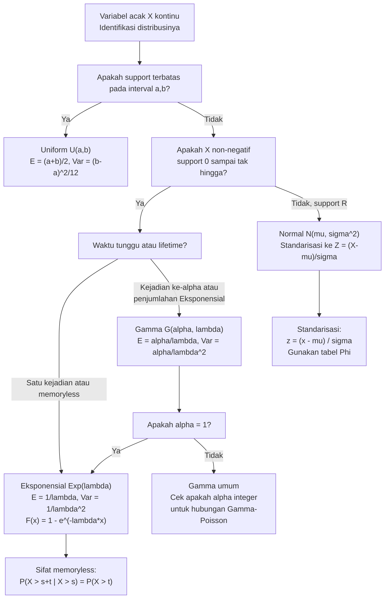

# 📊 2.6 — Distribusi Kontinu Umum

> [!ABSTRACT] Ringkasan Cepat
> **Topik:** Distribusi Kontinu Umum (Uniform, Eksponensial, Gamma, Normal) | **Bobot:** ~25–35% | **Difficulty:** Calculation-Intensive
> **Ref:** Hogg-Tanis-Zimm (2015) Bab 3.1–3.4; Hogg-McKean-Craig (2019) Bab 1.6–1.7; Miller et al. (2014) Bab 6.1–6.5, 7.1–7.3, 7.5–7.6 | **Prereq:** [[2.2 Variabel Acak Kontinu]], [[2.3 Fungsi Pembangkit]], [[2.4 Transformasi Variabel Acak Univariat]]

## Section 0 — Pemetaan Topik

| Topik CF2 | Sub-topik ID | Skill Diuji | Bobot | Difficulty | Prerequisite | Connected Topics | Referensi |
|-----------|--------------|-------------|-------|------------|--------------|------------------|-----------|
| Topik 2: Variabel Acak Univariat | 2.6 | Mengidentifikasi dan menggunakan distribusi Uniform, Eksponensial, Gamma, dan Normal; menghitung PDF, CDF, $E[X]$, $\text{Var}(X)$ untuk keempat distribusi; menggunakan sifat memoryless Eksponensial; menurunkan distribusi Gamma dari penjumlahan Eksponensial i.i.d.; menerapkan transformasi standarisasi Normal dan tabel $\Phi$; mengenali hubungan antar-distribusi (Eksponensial↔Gamma, Normal↔Chi-Kuadrat); menangani dua parametrisasi Gamma (laju vs skala) | 25–35% | Calculation-Intensive | [[2.2 Variabel Acak Kontinu]], [[2.3 Fungsi Pembangkit]], [[2.4 Transformasi Variabel Acak Univariat]] | [[2.4 Transformasi Variabel Acak Univariat]], [[3.5 Independensi dan Korelasi]], [[4.2 Distribusi Sampel]], [[4.3 Teorema Limit Pusat (CLT)]] | Hogg-Tanis-Zimm (2015) Bab 3.1–3.4; Hogg-McKean-Craig (2019) Bab 1.6–1.7; Miller et al. (2014) Bab 6.1–6.5, 7.1–7.3, 7.5–7.6 |

## Section 1 — Intuisi

Dunia aktuaria dipenuhi dengan besaran kontinu — waktu tunggu hingga klaim, besarnya kerugian, skor kredit, tingkat imbal hasil aset. Keempat distribusi di topik ini bukan sekadar formula: masing-masing adalah **model matematika dari mekanisme alam yang berbeda**, dan memahami mekanismenya memudahkan identifikasi dan penggunaan yang tepat.

**Uniform** adalah distribusi "tidak tahu apa-apa" — semua nilai dalam interval $(a,b)$ sama-sama mungkin, tanpa informasi tambahan apapun. **Eksponensial** adalah distribusi waktu tunggu antara kejadian yang terjadi secara acak dengan laju konstan — ia adalah padanan kontinu dari distribusi Geometrik diskrit, dan seperti Geometrik, memiliki sifat *memoryless* yang istimewa: jika mesin belum rusak setelah $t$ jam, distribusi waktu hingga kerusakan berikutnya persis sama seolah mesin baru saja dinyalakan. **Gamma** menggeneralisasi Eksponensial: ia memodelkan waktu tunggu hingga kejadian ke-$\alpha$ (dengan $\alpha$ integer) atau, secara umum, jumlah dari variabel Eksponensial i.i.d. — sangat berguna untuk memodelkan aggregate claims atau loss severity. **Normal** adalah distribusi paling universal: ia muncul sebagai limit penjumlahan variabel acak i.i.d. apapun (Teorema Limit Pusat), membuat hampir seluruh statistika inferensial berpusat padanya.

Hubungan antar-distribusi ini bukan sekadar trivia — ia adalah alat kerja aktif di exam. Eksponensial adalah kasus khusus Gamma ($\alpha=1$). Penjumlahan $n$ Eksponensial i.i.d. adalah Gamma($n$, $\beta$). Kuadrat Normal standar adalah Chi-Kuadrat(1). Penjumlahan kuadrat $n$ Normal standar independen adalah Chi-Kuadrat($n$). Menguasai jaring hubungan ini memungkinkan identifikasi distribusi penjumlahan menggunakan MGF tanpa derivasi panjang — dan ini persis yang sering diuji di CF2.

## Section 2 — Definisi Formal

> [!NOTE] Ringkasan Empat Distribusi Kontinu
> Tabel master — semua formula PDF, CDF, mean, variansi, dan MGF untuk referensi cepat.

### Tabel Master Distribusi Kontinu

| Distribusi | Notasi | PDF $f(x)$ | Support | $E[X]$ | $\text{Var}(X)$ | $M_X(t)$ |
|------------|--------|-----------|---------|--------|-----------------|----------|
| Uniform | $U(a,b)$ | $\dfrac{1}{b-a}$ | $(a,b)$ | $\dfrac{a+b}{2}$ | $\dfrac{(b-a)^2}{12}$ | $\dfrac{e^{tb}-e^{ta}}{t(b-a)}$, $t\neq 0$ |
| Eksponensial (laju $\lambda$) | $\text{Exp}(\lambda)$ | $\lambda e^{-\lambda x}$ | $(0,\infty)$ | $\dfrac{1}{\lambda}$ | $\dfrac{1}{\lambda^2}$ | $\dfrac{\lambda}{\lambda-t}$, $t<\lambda$ |
| Eksponensial (skala $\beta$) | $\text{Exp}(\beta)$ | $\dfrac{1}{\beta}e^{-x/\beta}$ | $(0,\infty)$ | $\beta$ | $\beta^2$ | $\dfrac{1}{1-\beta t}$, $t<1/\beta$ |
| Gamma (laju $\lambda$) | $\Gamma(\alpha,\lambda)$ | $\dfrac{\lambda^\alpha}{\Gamma(\alpha)}x^{\alpha-1}e^{-\lambda x}$ | $(0,\infty)$ | $\dfrac{\alpha}{\lambda}$ | $\dfrac{\alpha}{\lambda^2}$ | $\left(\dfrac{\lambda}{\lambda-t}\right)^\alpha$, $t<\lambda$ |
| Gamma (skala $\beta$) | $\Gamma(\alpha,\beta)$ | $\dfrac{1}{\beta^\alpha\Gamma(\alpha)}x^{\alpha-1}e^{-x/\beta}$ | $(0,\infty)$ | $\alpha\beta$ | $\alpha\beta^2$ | $(1-\beta t)^{-\alpha}$, $t<1/\beta$ |
| Normal | $N(\mu,\sigma^2)$ | $\dfrac{1}{\sigma\sqrt{2\pi}}e^{-(x-\mu)^2/(2\sigma^2)}$ | $(-\infty,\infty)$ | $\mu$ | $\sigma^2$ | $e^{\mu t + \sigma^2 t^2/2}$ |

### Variabel & Parameter

| Simbol | Makna | Rentang Valid |
|--------|-------|---------------|
| $a, b$ | Batas bawah dan atas distribusi Uniform | $a < b$, keduanya real |
| $\lambda$ | Parameter laju (*rate*) Eksponensial/Gamma | $\lambda > 0$ |
| $\beta$ | Parameter skala (*scale*) Eksponensial/Gamma; $\beta = 1/\lambda$ | $\beta > 0$ |
| $\alpha$ | Parameter bentuk (*shape*) Gamma | $\alpha > 0$; untuk $\alpha \in \mathbb{Z}^+$ disebut Erlang |
| $\mu$ | Mean (parameter lokasi) Normal | $\mu \in \mathbb{R}$ |
| $\sigma^2$ | Variansi (parameter skala) Normal | $\sigma^2 > 0$ |
| $\sigma$ | Standar deviasi Normal | $\sigma > 0$ |
| $\Gamma(\alpha)$ | Fungsi Gamma: $\int_0^\infty t^{\alpha-1}e^{-t}\,dt$ | $\alpha > 0$ |
| $Z$ | Variabel Normal standar: $Z \sim N(0,1)$ | Hasil standarisasi $Z = (X-\mu)/\sigma$ |
| $\Phi(z)$ | CDF Normal standar: $P(Z \leq z)$ | Dibaca dari tabel atau dihitung |
| $z_\alpha$ | Persentil ke-$(1-\alpha)$ dari $N(0,1)$ | $P(Z > z_\alpha) = \alpha$ |

### Rumus Utama per Distribusi

---

#### Uniform $U(a,b)$

$$
f(x) = \frac{1}{b-a}, \quad a < x < b
$$

$$
F(x) = \frac{x-a}{b-a}, \quad a \leq x \leq b
$$

$$
E[X] = \frac{a+b}{2}, \qquad \text{Var}(X) = \frac{(b-a)^2}{12}, \qquad M_X(t) = \frac{e^{tb}-e^{ta}}{t(b-a)},\; t \neq 0
$$

**Persentil ke-$p$:** $x_p = a + p(b-a)$

---

#### Eksponensial

Dua parametrisasi yang digunakan di silabus CF2:

**Parametrisasi Laju ($\lambda$)** — digunakan di Hogg-Tanis-Zimm:
$$
f(x) = \lambda e^{-\lambda x}, \quad x > 0
$$
$$
F(x) = 1 - e^{-\lambda x}, \quad x > 0
$$
$$
E[X] = \frac{1}{\lambda}, \qquad \text{Var}(X) = \frac{1}{\lambda^2}, \qquad M_X(t) = \frac{\lambda}{\lambda - t},\; t < \lambda
$$

**Parametrisasi Skala ($\beta = 1/\lambda$)** — digunakan di Miller:
$$
f(x) = \frac{1}{\beta}e^{-x/\beta}, \quad x > 0
$$
$$
F(x) = 1 - e^{-x/\beta}, \quad x > 0
$$
$$
E[X] = \beta, \qquad \text{Var}(X) = \beta^2, \qquad M_X(t) = \frac{1}{1 - \beta t},\; t < \frac{1}{\beta}
$$

**Sifat Memoryless (Tanpa Ingatan):**
$$
P(X > s + t \mid X > s) = P(X > t) \quad \text{untuk semua } s, t \geq 0
$$

Ekuivalen: $P(X > s+t) = P(X > s) \cdot P(X > t)$. Ini adalah **satu-satunya** distribusi kontinu yang bersifat memoryless.

**Sifat Aditif (via MGF):** Jika $X_1, \ldots, X_n \overset{\text{iid}}{\sim} \text{Exp}(\lambda)$, maka $\sum_{i=1}^n X_i \sim \Gamma(n, \lambda)$.

---

#### Gamma $\Gamma(\alpha, \lambda)$

**Parametrisasi Laju ($\lambda$):**
$$
f(x) = \frac{\lambda^\alpha}{\Gamma(\alpha)}\, x^{\alpha-1} e^{-\lambda x}, \quad x > 0
$$
$$
E[X] = \frac{\alpha}{\lambda}, \qquad \text{Var}(X) = \frac{\alpha}{\lambda^2}, \qquad M_X(t) = \left(\frac{\lambda}{\lambda-t}\right)^\alpha,\; t < \lambda
$$

**Parametrisasi Skala ($\beta = 1/\lambda$):**
$$
f(x) = \frac{1}{\beta^\alpha \Gamma(\alpha)}\, x^{\alpha-1} e^{-x/\beta}, \quad x > 0
$$
$$
E[X] = \alpha\beta, \qquad \text{Var}(X) = \alpha\beta^2, \qquad M_X(t) = (1-\beta t)^{-\alpha},\; t < \frac{1}{\beta}
$$

**Sifat Aditif:** Jika $X \sim \Gamma(\alpha_1, \lambda)$ dan $Y \sim \Gamma(\alpha_2, \lambda)$ independen (**parameter $\lambda$ harus sama**), maka:
$$
X + Y \sim \Gamma(\alpha_1 + \alpha_2,\, \lambda)
$$

**Kasus Khusus:**
- $\Gamma(1, \lambda) = \text{Exp}(\lambda)$
- $\Gamma(n, \lambda)$ dengan $n \in \mathbb{Z}^+$ disebut **distribusi Erlang**
- $\Gamma(\nu/2, 1/2)$ dengan parametrisasi skala $\beta=2$ adalah **Chi-Kuadrat** $\chi^2(\nu)$

**Fungsi Gamma — Sifat Kunci:**
$$
\Gamma(\alpha) = \int_0^\infty t^{\alpha-1} e^{-t}\, dt
$$
$$
\Gamma(\alpha+1) = \alpha\,\Gamma(\alpha) \quad \text{(sifat rekursi)}
$$
$$
\Gamma(n) = (n-1)! \quad \text{untuk } n \in \mathbb{Z}^+
$$
$$
\Gamma\!\left(\tfrac{1}{2}\right) = \sqrt{\pi}
$$

---

#### Normal $N(\mu, \sigma^2)$

$$
f(x) = \frac{1}{\sigma\sqrt{2\pi}}\, \exp\!\left(-\frac{(x-\mu)^2}{2\sigma^2}\right), \quad x \in \mathbb{R}
$$
$$
E[X] = \mu, \qquad \text{Var}(X) = \sigma^2, \qquad M_X(t) = \exp\!\left(\mu t + \frac{\sigma^2 t^2}{2}\right)
$$

**Standarisasi:**
$$
Z = \frac{X - \mu}{\sigma} \sim N(0,1)
$$

**Probabilitas via tabel $\Phi$:**
$$
P(X \leq x) = P\!\left(Z \leq \frac{x-\mu}{\sigma}\right) = \Phi\!\left(\frac{x-\mu}{\sigma}\right)
$$
$$
P(a \leq X \leq b) = \Phi\!\left(\frac{b-\mu}{\sigma}\right) - \Phi\!\left(\frac{a-\mu}{\sigma}\right)
$$

**Simetri $\Phi$:**
$$
\Phi(-z) = 1 - \Phi(z)
$$

**Sifat Aditif:** Jika $X \sim N(\mu_1, \sigma_1^2)$ dan $Y \sim N(\mu_2, \sigma_2^2)$ independen, maka:
$$
X + Y \sim N(\mu_1 + \mu_2,\; \sigma_1^2 + \sigma_2^2)
$$

**Transformasi Linear:** Jika $X \sim N(\mu, \sigma^2)$ dan $Y = aX + b$, maka:
$$
Y \sim N(a\mu + b,\; a^2\sigma^2)
$$

**Aturan Empiris:**
$$
P(\mu - \sigma < X < \mu + \sigma) \approx 0{,}6827
$$
$$
P(\mu - 2\sigma < X < \mu + 2\sigma) \approx 0{,}9545
$$
$$
P(\mu - 3\sigma < X < \mu + 3\sigma) \approx 0{,}9973
$$

### Asumsi Eksplisit

- **Uniform:** Semua nilai dalam $(a,b)$ sama-sama mungkin — tidak ada kecenderungan ke nilai tertentu. PDF konstan.
- **Eksponensial:** Kejadian terjadi dengan laju konstan $\lambda$; waktu antar-kejadian independen. Sifat memoryless adalah konsekuensi dari asumsi laju konstan ini.
- **Gamma:** Penjumlahan $\alpha$ waktu tunggu Eksponensial i.i.d. dengan laju $\lambda$ (interpretasi untuk $\alpha \in \mathbb{Z}^+$); untuk $\alpha > 0$ real, definisi diberikan via PDF dengan fungsi Gamma.
- **Normal:** Tidak ada asumsi mekanistik khusus — universalitasnya dijamin oleh CLT. PDF simetris, unimodal, dengan ekor yang menurun lebih cepat dari distribusi lainnya.

## Section 3 — Jembatan Logika

> [!TIP] Dari Definisi ke Rumus
> **Mengapa $E[\text{Exp}(\lambda)] = 1/\lambda$?** Intuisinya: jika rata-rata 3 kejadian per jam ($\lambda=3$), waktu rata-rata antar-kejadian adalah $1/3$ jam. Secara formal:
> $$E[X] = \int_0^\infty x \cdot \lambda e^{-\lambda x}\,dx = \lambda \int_0^\infty x e^{-\lambda x}\,dx$$
> Integrasi per bagian ($u=x$, $dv=\lambda e^{-\lambda x}dx$) menghasilkan $1/\lambda$.
>
> **Mengapa Gamma adalah penjumlahan Eksponensial?** MGF $\text{Exp}(\lambda)$ adalah $\lambda/(\lambda-t)$. Untuk penjumlahan $\alpha$ buah Eksponensial i.i.d.: $[\lambda/(\lambda-t)]^\alpha$ — ini persis MGF $\Gamma(\alpha,\lambda)$. *Uniqueness Theorem* memastikan distribusinya adalah Gamma.
>
> **Mengapa Normal memiliki MGF $e^{\mu t + \sigma^2 t^2/2}$?** Ini diturunkan dari integral Gaussian: $\int_{-\infty}^\infty e^{tx} \cdot \frac{1}{\sigma\sqrt{2\pi}}e^{-(x-\mu)^2/(2\sigma^2)}dx$. Lengkapkan kuadrat di eksponen: $tx - (x-\mu)^2/(2\sigma^2) = -\frac{(x-\mu-\sigma^2 t)^2}{2\sigma^2} + \mu t + \frac{\sigma^2 t^2}{2}$. Faktor $e^{\mu t + \sigma^2 t^2/2}$ keluar dari integral; sisa integral adalah PDF Normal yang terintegrasi ke 1.

> [!IMPORTANT] Support dan Domain
> - **Uniform $U(a,b)$:** Support terbatas $(a,b)$; PDF $= 0$ di luar. Persentil ke-$p$ adalah $a + p(b-a)$ — rumus linear sederhana.
> - **Eksponensial dan Gamma:** Support $(0,\infty)$; tidak mungkin bernilai negatif — cocok untuk waktu, biaya, kerugian. PDF dimulai dari $f(0^+) = \lambda$ (Eksponensial) atau $0$ (Gamma dengan $\alpha > 1$) atau $\infty$ (Gamma dengan $\alpha < 1$).
> - **Normal:** Support $(-\infty,\infty)$; bisa negatif — tidak cocok untuk besaran yang harus non-negatif (waktu, kerugian) kecuali sebagai aproksimasi jika $\mu \gg \sigma$.
> - **Konvergensi MGF:** Eksponensial dan Gamma hanya konvergen untuk $t < \lambda$ (atau $t < 1/\beta$); Normal konvergen untuk semua $t \in \mathbb{R}$.

**Derivasi Sifat Memoryless Eksponensial:**

$$
P(X > s+t \mid X > s) = \frac{P(X > s+t)}{P(X > s)} = \frac{e^{-\lambda(s+t)}}{e^{-\lambda s}} = e^{-\lambda t} = P(X > t)
$$

Jadi kondisional tidak bergantung pada $s$ — "mesin tidak mengingat sudah beroperasi selama $s$ jam".

**Derivasi Sifat Aditif Gamma via MGF:**

Untuk $X \sim \Gamma(\alpha_1, \lambda)$ dan $Y \sim \Gamma(\alpha_2, \lambda)$ independen:
$$
M_{X+Y}(t) = M_X(t) \cdot M_Y(t) = \left(\frac{\lambda}{\lambda-t}\right)^{\alpha_1} \cdot \left(\frac{\lambda}{\lambda-t}\right)^{\alpha_2} = \left(\frac{\lambda}{\lambda-t}\right)^{\alpha_1+\alpha_2}
$$

Ini adalah MGF $\Gamma(\alpha_1+\alpha_2, \lambda)$. Oleh *Uniqueness Theorem*: $X+Y \sim \Gamma(\alpha_1+\alpha_2, \lambda)$.

**Catatan kritis:** Sifat aditif hanya berlaku jika **parameter $\lambda$ (atau $\beta$) identik**. $\Gamma(2,3) + \Gamma(4,3) = \Gamma(6,3)$ ✓, tetapi $\Gamma(2,3) + \Gamma(4,5) \neq \Gamma(6,\cdot)$ ✗.

**Derivasi Standarisasi Normal:**

Jika $X \sim N(\mu,\sigma^2)$ dan $Z = (X-\mu)/\sigma$, maka via MGF transformasi linear $Y = aX+b$ dengan $a=1/\sigma$, $b=-\mu/\sigma$:
$$
M_Z(t) = e^{-(\mu/\sigma)t} \cdot M_X(t/\sigma) = e^{-\mu t/\sigma} \cdot e^{\mu(t/\sigma) + \sigma^2(t/\sigma)^2/2} = e^{t^2/2}
$$

Ini adalah MGF $N(0,1)$ — maka $Z \sim N(0,1)$ oleh *Uniqueness Theorem*.

**Jaring Hubungan Antar-Distribusi:**

$$
\text{Exp}(\lambda) = \Gamma(1,\lambda) \xrightarrow{\text{jumlah } n \text{ iid}} \Gamma(n,\lambda)
$$
$$
N(0,1) \xrightarrow{X^2} \chi^2(1) = \Gamma\!\left(\tfrac{1}{2},\, 2\right) \xrightarrow{\text{jumlah } n \text{ iid}} \chi^2(n) = \Gamma\!\left(\tfrac{n}{2},\, 2\right)
$$
$$
N(\mu,\sigma^2) \xrightarrow{(X-\mu)/\sigma} N(0,1) \xrightarrow{\text{CLT}} \text{limit penjumlahan iid apapun}
$$

> [!DANGER] Dilarang
> 1. **Dilarang** mencampur parametrisasi laju ($\lambda$) dan skala ($\beta = 1/\lambda$) dalam satu perhitungan tanpa konversi eksplisit. Menulis $E[X] = \lambda$ untuk Eksponensial dengan parametrisasi laju adalah kesalahan — yang benar $E[X] = 1/\lambda$. Selalu nyatakan parametrisasi yang digunakan di awal solusi.
> 2. **Dilarang** menerapkan sifat aditif Gamma untuk variabel dengan **parameter $\lambda$ (atau $\beta$) yang berbeda**. $\Gamma(\alpha_1,\lambda_1) + \Gamma(\alpha_2,\lambda_2)$ tidak terdistribusi Gamma jika $\lambda_1 \neq \lambda_2$ — distribusi penjumlahannya tidak memiliki bentuk tertutup yang sederhana.
> 3. **Dilarang** menggunakan $\Phi(z)$ tanpa standarisasi terlebih dahulu. Untuk $X \sim N(\mu,\sigma^2)$, $P(X \leq x) \neq \Phi(x)$ — harus dikonversi ke $\Phi\!\left(\frac{x-\mu}{\sigma}\right)$. Lupa membagi dengan $\sigma$ adalah kesalahan paling sering di soal Normal.

## Section 4 — Contoh Soal

### Soal A — Fundamental

Waktu pelayanan seorang nasabah di loket asuransi berdistribusi **Eksponensial** dengan rata-rata **5 menit**.

(a) Tentukan PDF dan CDF dengan parametrisasi laju $\lambda$.
(b) Hitung probabilitas pelayanan selesai dalam 3 menit pertama.
(c) Diketahui pelayanan sudah berlangsung 3 menit. Berapa probabilitas pelayanan akan selesai dalam 2 menit ke depan? Gunakan sifat memoryless.
(d) Hitung median dan persentil ke-90 dari waktu pelayanan.
(e) Hitung $E[X]$, $\text{Var}(X)$, dan $\text{SD}(X)$.

> [!SUCCESS] Solusi Soal A
>
> **1. Identifikasi Variabel**
> - $E[X] = 5$ menit → parametrisasi laju: $\lambda = 1/5 = 0{,}2$ per menit
> - $X$ = waktu pelayanan (menit)
>
> **2. Identifikasi Distribusi / Model**
> Waktu tunggu dengan laju konstan → $X \sim \text{Exp}(\lambda = 0{,}2)$.
>
> **3. Setup Persamaan**
>
> PDF: $f(x) = \lambda e^{-\lambda x}$
>
> CDF: $F(x) = 1 - e^{-\lambda x}$
>
> Median: $F(m) = 0{,}5 \implies 1 - e^{-\lambda m} = 0{,}5$
>
> **4. Eksekusi Aljabar**
>
> **(a) PDF dan CDF:**
> $$f(x) = 0{,}2\, e^{-0{,}2x}, \quad x > 0$$
> $$F(x) = 1 - e^{-0{,}2x}, \quad x > 0$$
>
> **(b) $P(X \leq 3)$:**
> $$P(X \leq 3) = F(3) = 1 - e^{-0{,}2 \times 3} = 1 - e^{-0{,}6} = 1 - 0{,}5488 = 0{,}4512$$
>
> **(c) Sifat memoryless — $P(X \leq 5 \mid X > 3)$:**
>
> "Selesai dalam 2 menit ke depan" = $P(X \leq 3+2 \mid X > 3) = P(X \leq 2)$ (memoryless):
> $$P(X \leq 2) = 1 - e^{-0{,}2 \times 2} = 1 - e^{-0{,}4} = 1 - 0{,}6703 = 0{,}3297$$
>
> Verifikasi langsung:
> $$P(X \leq 5 \mid X > 3) = \frac{P(3 < X \leq 5)}{P(X > 3)} = \frac{F(5)-F(3)}{1-F(3)} = \frac{(1-e^{-1})-(1-e^{-0{,}6})}{e^{-0{,}6}} = \frac{e^{-0{,}6}-e^{-1}}{e^{-0{,}6}} = 1 - e^{-0{,}4} \;\checkmark$$
>
> **(d) Median dan persentil ke-90:**
>
> Median ($p = 0{,}5$):
> $$1 - e^{-0{,}2m} = 0{,}5 \implies e^{-0{,}2m} = 0{,}5 \implies m = \frac{\ln 2}{0{,}2} = \frac{0{,}6931}{0{,}2} = 3{,}466 \text{ menit}$$
>
> Persentil ke-90 ($p = 0{,}9$):
> $$1 - e^{-0{,}2 x_{0{,}9}} = 0{,}9 \implies e^{-0{,}2 x_{0{,}9}} = 0{,}1 \implies x_{0{,}9} = \frac{\ln 10}{0{,}2} = \frac{2{,}3026}{0{,}2} = 11{,}51 \text{ menit}$$
>
> **Rumus umum persentil Eksponensial (laju $\lambda$):**
> $$x_p = -\frac{\ln(1-p)}{\lambda}$$
>
> **(e) $E[X]$, $\text{Var}(X)$, $\text{SD}(X)$:**
> $$E[X] = \frac{1}{\lambda} = \frac{1}{0{,}2} = 5 \text{ menit}$$
> $$\text{Var}(X) = \frac{1}{\lambda^2} = \frac{1}{0{,}04} = 25 \text{ menit}^2$$
> $$\text{SD}(X) = \sqrt{25} = 5 \text{ menit}$$
>
> **5. Verification**
> - $E[X] = \text{SD}(X) = 5$ menit: untuk Eksponensial, $\text{SD}(X) = E[X]$ selalu — koefisien variasi = 1 ✓
> - Median $= 3{,}466 < E[X] = 5$: untuk distribusi right-skewed, median $<$ mean ✓
> - $P(X \leq 3) = 0{,}451$: kurang dari setengah, konsisten dengan median $> 3$ ✓
> - Persentil ke-90 $= 11{,}51 > E[X] = 5$: ekor kanan Eksponensial memang panjang ✓

> [!WARNING] Exam Tips — Soal A
> **Target waktu:** 8–10 menit
> **Common trap 1:** Menukar $\lambda$ dan $E[X]$. Jika diberikan "rata-rata 5 menit", maka $E[X] = 5$ dan $\lambda = 1/5$ — **bukan** $\lambda = 5$.
> **Common trap 2:** Untuk memoryless, $P(X \leq s+t \mid X > s) = P(X \leq t)$ — yang penting adalah **increment** $t$ yang digunakan, bukan nilai absolut $s+t$.
> **Shortcut persentil:** $x_p = -\ln(1-p)/\lambda$ — hafalkan formula ini; lebih cepat dari menyelesaikan $F(x) = p$ setiap kali.

---

### Soal B — Exam-Typical

Kerugian total (dalam juta rupiah) dari sebuah portofolio asuransi dalam satu kuartal mengikuti distribusi **Gamma** dengan parameter bentuk $\alpha = 4$ dan parameter skala $\beta = 2$ (yaitu $\Gamma(4, \beta=2)$).

(a) Tentukan PDF, $E[X]$, dan $\text{Var}(X)$.
(b) Interpretasikan distribusi ini sebagai penjumlahan variabel Eksponensial.
(c) Tunjukkan menggunakan MGF bahwa $X$ dapat dinyatakan sebagai penjumlahan 4 variabel Eksponensial i.i.d. dengan rata-rata 2.
(d) Jika $Y \sim \Gamma(3, \beta=2)$ independen dari $X$, tentukan distribusi $X + Y$.
(e) Hitung $P(X > 10)$ menggunakan fakta bahwa CDF Gamma untuk $\alpha \in \mathbb{Z}^+$ dapat diekspresikan dalam bentuk tertutup via Poisson:
$$P(X > x) = P\!\left(\text{Poisson}\!\left(\frac{x}{\beta}\right) < \alpha\right) = \sum_{k=0}^{\alpha-1} \frac{e^{-x/\beta}(x/\beta)^k}{k!}$$

> [!SUCCESS] Solusi Soal B
>
> **1. Identifikasi Variabel**
> - $X \sim \Gamma(\alpha=4, \beta=2)$ (parametrisasi skala)
> - $\lambda = 1/\beta = 0{,}5$ (parametrisasi laju ekuivalen)
> - $Y \sim \Gamma(3, \beta=2)$, independen dari $X$
>
> **2. Identifikasi Distribusi / Model**
> Gamma dengan $\alpha$ integer (distribusi Erlang). Sifat aditif berlaku karena $Y$ memiliki $\beta$ yang sama.
>
> **3. Setup Persamaan**
>
> PDF parametrisasi skala: $f(x) = \frac{1}{\beta^\alpha \Gamma(\alpha)} x^{\alpha-1} e^{-x/\beta}$
>
> MGF parametrisasi skala: $M_X(t) = (1-\beta t)^{-\alpha}$
>
> **4. Eksekusi Aljabar**
>
> **(a) PDF, $E[X]$, $\text{Var}(X)$:**
> $$f(x) = \frac{1}{2^4 \cdot \Gamma(4)}\, x^{3}\, e^{-x/2} = \frac{1}{16 \cdot 6}\, x^3\, e^{-x/2} = \frac{x^3 e^{-x/2}}{96}, \quad x > 0$$
>
> (menggunakan $\Gamma(4) = 3! = 6$)
>
> $$E[X] = \alpha\beta = 4 \times 2 = 8 \text{ juta rupiah}$$
> $$\text{Var}(X) = \alpha\beta^2 = 4 \times 4 = 16 \text{ juta rupiah}^2, \quad \text{SD}(X) = 4$$
>
> **(b) Interpretasi sebagai penjumlahan Eksponensial:**
>
> $\Gamma(4, \beta=2)$ adalah distribusi penjumlahan $\alpha = 4$ variabel Eksponensial i.i.d. dengan parameter skala $\beta = 2$ (yaitu rata-rata 2 per variabel). Secara konkret: jika $X_1, X_2, X_3, X_4 \overset{\text{iid}}{\sim} \text{Exp}(\beta=2)$, maka $X_1+X_2+X_3+X_4 \sim \Gamma(4, \beta=2)$.
>
> **(c) Verifikasi via MGF:**
>
> MGF $\text{Exp}(\beta=2)$: $M_{X_i}(t) = (1-2t)^{-1}$, valid untuk $t < 1/2$.
>
> MGF penjumlahan 4 variabel i.i.d.:
> $$M_{X_1+X_2+X_3+X_4}(t) = \left[(1-2t)^{-1}\right]^4 = (1-2t)^{-4} = (1-\beta t)^{-\alpha}\bigg|_{\alpha=4,\,\beta=2}$$
>
> Ini tepat MGF $\Gamma(4, \beta=2)$. Oleh *Uniqueness Theorem*: $X_1+\cdots+X_4 \sim \Gamma(4,2)$ ✓
>
> **(d) Distribusi $X + Y$:**
>
> $X \sim \Gamma(4, \beta=2)$ dan $Y \sim \Gamma(3, \beta=2)$ independen, $\beta$ sama:
> $$M_{X+Y}(t) = (1-2t)^{-4} \cdot (1-2t)^{-3} = (1-2t)^{-7}$$
>
> Ini adalah MGF $\Gamma(7, \beta=2)$. Oleh *Uniqueness Theorem*:
> $$\boxed{X + Y \sim \Gamma(7,\, \beta=2)}$$
>
> **(e) $P(X > 10)$:**
>
> Gunakan hubungan Gamma–Poisson dengan $x = 10$, $\beta = 2$, $\alpha = 4$:
> $$P(X > 10) = \sum_{k=0}^{3} \frac{e^{-10/2}(10/2)^k}{k!} = \sum_{k=0}^{3} \frac{e^{-5} \cdot 5^k}{k!}$$
>
> Ini adalah $P(\text{Poisson}(5) \leq 3)$:
> $$= e^{-5}\left(\frac{5^0}{0!} + \frac{5^1}{1!} + \frac{5^2}{2!} + \frac{5^3}{3!}\right) = e^{-5}\left(1 + 5 + 12{,}5 + \frac{125}{6}\right)$$
> $$= e^{-5}(1 + 5 + 12{,}5 + 20{,}833) = e^{-5} \times 39{,}333$$
> $$= 0{,}006738 \times 39{,}333 = 0{,}2650$$
>
> **5. Verification**
> - $E[X] = 8$ dan $\text{SD}(X) = 4$: $P(X > 10) = P(X > E[X]+0{,}5\,\text{SD}) \approx 0{,}265$ — berada di ekor kanan, nilai cukup masuk akal untuk distribusi right-skewed ✓
> - $\Gamma(4+3, 2) = \Gamma(7,2)$: $\alpha$ dijumlahkan, $\beta$ tetap ✓
> - MGF $(1-2t)^{-7}$ dievaluasi di $t=0$: $(1-0)^{-7} = 1$ ✓

> [!WARNING] Exam Tips — Soal B
> **Target waktu:** 12–14 menit
> **Common trap 1:** Saat menjumlah Gamma, $\alpha$ yang dijumlahkan, **bukan** $\beta$. $\Gamma(4,2) + \Gamma(3,2) = \Gamma(7,2)$ — bukan $\Gamma(7,4)$.
> **Common trap 2:** $\Gamma(4) = 3! = 6$, **bukan** $4! = 24$. Gunakan $\Gamma(n) = (n-1)!$ untuk integer.
> **Common trap 3:** Hubungan Gamma–Poisson hanya berlaku untuk $\alpha \in \mathbb{Z}^+$. Untuk $\alpha$ non-integer, $P(X > x)$ tidak ada bentuk tertutup sederhana.
> **Shortcut:** Bagian (e) yang tampak rumit sebenarnya hanya $P(\text{Poisson}(5) \leq 3)$ — kenali ini segera dan hitung PMF Poisson standar.

---

### Soal C — Challenging

Skor ujian aktuaria (dalam skala 0–100) dari 1.000 peserta dimodelkan dengan distribusi Normal $N(\mu = 68,\, \sigma^2 = 144)$.

(a) Berapa proporsi peserta yang mendapat skor antara 56 dan 80?
(b) Nilai minimum kelulusan ditetapkan agar tepat **15% peserta** lulus. Tentukan nilai minimum tersebut.
(c) Misalkan $\bar{X}$ adalah rata-rata skor 25 peserta yang dipilih acak. Tentukan distribusi $\bar{X}$ dan hitung $P(\bar{X} > 70)$.
(d) Misalkan $X_1$ dan $X_2$ adalah skor dua peserta yang dipilih secara independen. Tentukan distribusi $X_1 - X_2$ dan hitung $P(|X_1 - X_2| > 24)$.

> [!SUCCESS] Solusi Soal C
>
> **1. Identifikasi Variabel**
> - $X \sim N(\mu=68,\, \sigma^2=144)$, sehingga $\sigma = 12$
> - $Z = (X-68)/12 \sim N(0,1)$
> - $n = 25$ untuk bagian (c)
>
> **2. Identifikasi Distribusi / Model**
> Standarisasi ke $N(0,1)$ dan gunakan tabel $\Phi$. Sifat aditif Normal untuk bagian (c) dan (d). Untuk (c): $\bar{X} \sim N(\mu, \sigma^2/n)$.
>
> **3. Setup Persamaan**
>
> Standarisasi umum: $P(a \leq X \leq b) = \Phi\!\left(\frac{b-68}{12}\right) - \Phi\!\left(\frac{a-68}{12}\right)$
>
> **4. Eksekusi Aljabar**
>
> **(a) $P(56 \leq X \leq 80)$:**
>
> Standarisasi batas:
> $$z_1 = \frac{56-68}{12} = \frac{-12}{12} = -1{,}00, \qquad z_2 = \frac{80-68}{12} = \frac{12}{12} = 1{,}00$$
>
> $$P(56 \leq X \leq 80) = \Phi(1{,}00) - \Phi(-1{,}00) = \Phi(1{,}00) - [1-\Phi(1{,}00)]$$
> $$= 2\Phi(1{,}00) - 1 = 2(0{,}8413) - 1 = 0{,}6826$$
>
> Sekitar **68,26%** peserta mendapat skor antara 56 dan 80 — ini adalah aturan $\mu \pm 1\sigma$.
>
> **(b) Nilai minimum kelulusan (persentil ke-85):**
>
> "Tepat 15% lulus" → nilai minimum adalah persentil ke-85 (85% di bawah, 15% di atas):
> $$P(X > c) = 0{,}15 \implies P(X \leq c) = 0{,}85 \implies \Phi\!\left(\frac{c-68}{12}\right) = 0{,}85$$
>
> Dari tabel $\Phi$: $\Phi(1{,}04) \approx 0{,}8508$, sehingga $z_{0{,}85} \approx 1{,}04$:
> $$\frac{c - 68}{12} = 1{,}04 \implies c = 68 + 12 \times 1{,}04 = 68 + 12{,}48 = 80{,}48$$
>
> Nilai minimum kelulusan adalah **80,48** (dibulatkan ke 81 jika skor harus integer).
>
> **(c) Distribusi $\bar{X}$ dan $P(\bar{X} > 70)$:**
>
> Untuk rata-rata $n = 25$ sampel i.i.d. dari $N(68, 144)$:
> $$\bar{X} \sim N\!\left(68,\; \frac{144}{25}\right) = N\!\left(68,\; 5{,}76\right), \quad \sigma_{\bar{X}} = \sqrt{5{,}76} = 2{,}4$$
>
> $$P(\bar{X} > 70) = P\!\left(Z > \frac{70-68}{2{,}4}\right) = P(Z > 0{,}833) = 1 - \Phi(0{,}833)$$
> $$= 1 - 0{,}7977 = 0{,}2023$$
>
> **(d) Distribusi $X_1 - X_2$ dan $P(|X_1-X_2| > 24)$:**
>
> $X_1 \sim N(68,144)$ dan $X_2 \sim N(68,144)$ independen. Untuk selisih:
> $$X_1 - X_2 \sim N(68-68,\; 144+144) = N(0,\; 288), \quad \sigma_{D} = \sqrt{288} = 12\sqrt{2}$$
>
> $$P(|X_1-X_2| > 24) = P\!\left(|Z| > \frac{24}{12\sqrt{2}}\right) = P\!\left(|Z| > \frac{24}{16{,}971}\right) = P(|Z| > 1{,}414)$$
>
> $$= 2[1-\Phi(1{,}414)] = 2[1-\Phi(\sqrt{2})]$$
>
> Dari tabel: $\Phi(1{,}414) \approx \Phi(\sqrt{2}) \approx 0{,}9213$:
> $$P(|X_1-X_2| > 24) = 2(1-0{,}9213) = 2(0{,}0787) = 0{,}1574$$
>
> **5. Verification**
> - Bagian (a): $P(\mu-\sigma < X < \mu+\sigma) = 0{,}6826$ — konsisten dengan aturan empiris 68% ✓
> - Bagian (b): nilai minimum $80{,}48 > \mu = 68$ dan $< \mu + 2\sigma = 92$ — masuk akal untuk persentil ke-85 ✓
> - $\sigma_{\bar{X}} = 2{,}4 < \sigma_X = 12$: rata-rata 25 sampel punya variabilitas lebih kecil ✓
> - $\text{Var}(X_1-X_2) = \text{Var}(X_1) + \text{Var}(X_2) = 144+144 = 288$ (independen → variansi aditif) ✓
> - $P(|X_1-X_2|>24) = 0{,}157$: sekitar 1/6 kemungkinan dua peserta berbeda lebih dari 24 poin ✓

> [!WARNING] Exam Tips — Soal C
> **Target waktu:** 14–16 menit
> **Common trap 1:** Standarisasi $\bar{X}$: $\sigma_{\bar{X}} = \sigma/\sqrt{n} = 12/\sqrt{25} = 12/5 = 2{,}4$, **bukan** $\sigma/n = 12/25$. Selalu bagi dengan $\sqrt{n}$, bukan $n$.
> **Common trap 2:** Untuk $X_1 - X_2$ independen: $\text{Var}(X_1-X_2) = \text{Var}(X_1) + \text{Var}(X_2) = 288$ (variansi dijumlahkan meskipun ada tanda minus). Jangan kurangi variansi.
> **Common trap 3:** "Tepat 15% lulus" berarti 15% di *atas* nilai minimum, bukan di bawah — cari persentil ke-85, bukan ke-15.
> **Shortcut:** Kenali langsung bahwa $P(\mu - k\sigma < X < \mu + k\sigma)$ untuk $k=1,2,3$ adalah aturan empiris 68-95-99,7 — hemat waktu standarisasi untuk soal dengan batas tepat di $\mu \pm k\sigma$.

## Section 5 — Verifikasi & Sanity Check

> [!CHECK] Validasi PDF Kontinu
> Sebelum menggunakan PDF apapun:
> 1. $f(x) \geq 0$ di seluruh support — periksa semua parameter positif ✓
> 2. $\int_{\text{support}} f(x)\,dx = 1$ — untuk distribusi standar ini dijamin oleh konstruksi ✓
> 3. Support sesuai: Uniform $(a,b)$; Exp/Gamma $(0,\infty)$; Normal $(-\infty,\infty)$ ✓

> [!CHECK] Validasi Mean dan Variansi
> Quick-check konsistensi setelah menghitung:
> 1. **Eksponensial:** $\text{SD}(X) = E[X] = 1/\lambda$ — koefisien variasi selalu tepat 1 ✓
> 2. **Gamma:** $\text{SD}(X) = E[X]/\sqrt{\alpha}$ — semakin besar $\alpha$, distribusi semakin simetris ✓
> 3. **Normal:** Mean $=$ Median $=$ Modus $= \mu$ (distribusi simetris) ✓
> 4. **Uniform:** Median $= (a+b)/2 = E[X]$ (distribusi simetris) ✓

> [!CHECK] Validasi Probabilitas Normal
> Setelah menghitung probabilitas Normal:
> 1. Verifikasi standarisasi: $z = (x-\mu)/\sigma$ — bagi dengan $\sigma$, bukan $\sigma^2$ ✓
> 2. Untuk interval simetris di sekitar $\mu$: gunakan $2\Phi(z_{\text{kanan}}) - 1$ ✓
> 3. Simetri $\Phi$: $\Phi(-z) = 1 - \Phi(z)$ — cek tanda $z$ jika hasil tampak terlalu besar/kecil ✓
> 4. Sanity check aturan empiris: hasil harus mendekati 68%, 95%, 99,7% untuk $\pm 1,2,3$ SD ✓

> [!CHECK] Validasi Sifat Aditif Gamma
> Sebelum menerapkan sifat aditif:
> 1. Kedua variabel harus **independen** ✓
> 2. Parameter $\lambda$ (atau $\beta$) harus **identik** ✓
> 3. Hanya $\alpha$ yang dijumlahkan — $\lambda$ atau $\beta$ tetap tidak berubah ✓

### Metode Alternatif

**Teknik MGF untuk verifikasi distribusi penjumlahan:** Kalikan MGF individual, cocokkan dengan MGF tabel — lebih cepat dari integral konvolusi dan dapat digunakan untuk Eksponensial, Gamma, dan Normal sekaligus.

**Persentil Eksponensial closed-form:** $x_p = -\ln(1-p)/\lambda$ — tidak perlu menyelesaikan $F(x) = p$ secara umum setiap kali.

**Hubungan Gamma–Poisson untuk CDF:** Untuk $\alpha \in \mathbb{Z}^+$, gunakan $P(X > x) = P(\text{Poisson}(x/\beta) \leq \alpha-1)$ — mengkonversi integral Gamma yang sulit menjadi penjumlahan PMF Poisson yang mudah dihitung.

## Section 6 — Visualisasi Mental

**Uniform — Persegi Panjang Datar:**

PDF adalah garis horizontal di ketinggian $1/(b-a)$ antara $a$ dan $b$ — bentuk persegi panjang sempurna. Luas = $1$. CDF adalah garis lurus miring dari $(a,0)$ ke $(b,1)$. Mean dan median keduanya tepat di tengah interval. Tidak ada ekor — probabilitas di luar $(a,b)$ persis nol.

**Eksponensial — Penurunan Eksponensial:**

PDF dimulai dari nilai tertinggi $\lambda$ di $x=0^+$ dan menurun monoton ke nol saat $x \to \infty$. Bentuknya concave, selalu miring kanan (*right-skewed*). Modus ada di $x=0$. Mean $= 1/\lambda > $ median $= \ln 2/\lambda$ — ekor kanan menarik mean ke kanan dari median. CDF: kurva cekung ke atas dari 0 menuju 1.

**Gamma — Kurva Bukit Fleksibel:**

Untuk $\alpha = 1$: bentuk Eksponensial (monoton turun). Untuk $\alpha > 1$: kurva bukit (*unimodal*) dengan modus di $(\alpha-1)/\lambda$, miring kanan. Semakin besar $\alpha$, bukit semakin simetris dan mirip Normal. Sumbu X dimulai dari 0, ekor kanan selalu ada.

**Normal — Lonceng Simetris:**

Kurva lonceng (*bell curve*) simetris sempurna terhadap $\mu$. Titik infleksi tepat di $\mu \pm \sigma$. PDF mencapai puncak di $x = \mu$ dengan nilai $1/(\sigma\sqrt{2\pi})$. CDF: kurva S (*sigmoid*) dari 0 ke 1, titik infleksi di $(x=\mu, F=0{,}5)$.

### Hubungan Visual ↔ Rumus

Penurunan eksponensial PDF Eksponensial berkorespondensi dengan:
$$
f(x) = \lambda e^{-\lambda x} \longleftrightarrow \text{nilai awal } f(0) = \lambda,\text{ peluruhan dengan konstanta } \lambda
$$

Simetri PDF Normal di sekitar $\mu$ berkorespondensi dengan:
$$
f(\mu + x) = f(\mu - x) \longleftrightarrow \Phi\!\left(\frac{(\mu+x)-\mu}{\sigma}\right) + \Phi\!\left(\frac{(\mu-x)-\mu}{\sigma}\right) = 1
$$

Pelebaran kurva Gamma seiring bertambahnya $\alpha$ berkorespondensi dengan:
$$
\text{Var}(X) = \frac{\alpha}{\lambda^2} \longleftrightarrow \text{kurva semakin melebar dan semakin simetris saat } \alpha \uparrow
$$

Titik infleksi PDF Normal tepat di $\mu \pm \sigma$ berkorespondensi dengan:
$$
f''(x)\big|_{x=\mu\pm\sigma} = 0 \longleftrightarrow \text{batas transisi dari cekung-ke-atas ke cekung-ke-bawah}
$$

## Section 7 — Jebakan Umum

> [!BUG] Kesalahan Parametrisasi
> **Jebakan utama — Dua parametrisasi Eksponensial dan Gamma:**
>
> | | Parametrisasi Laju | Parametrisasi Skala |
> |--|-------------------|---------------------|
> | **Parameter** | $\lambda$ (laju, *rate*) | $\beta = 1/\lambda$ (skala, *scale*) |
> | **PDF Exp** | $\lambda e^{-\lambda x}$ | $\frac{1}{\beta}e^{-x/\beta}$ |
> | **$E[\text{Exp}]$** | $1/\lambda$ | $\beta$ |
> | **MGF Exp** | $\lambda/(\lambda-t)$ | $1/(1-\beta t)$ |
> | **$E[\Gamma]$** | $\alpha/\lambda$ | $\alpha\beta$ |
> | **$\text{Var}[\Gamma]$** | $\alpha/\lambda^2$ | $\alpha\beta^2$ |
>
> **Salah:** "Eksponensial dengan mean 5, maka $\lambda = 5$" — seharusnya $\lambda = 1/5$.
>
> **Benar:** Selalu tentukan dahulu parametrisasi yang digunakan; jika diberikan mean, hitung $\lambda = 1/\text{mean}$ (parametrisasi laju) atau $\beta = \text{mean}$ (parametrisasi skala).

> [!BUG] Kesalahan Konseptual
> 1. **Menerapkan sifat aditif Gamma untuk variabel dengan parameter berbeda.** $\Gamma(2,3) + \Gamma(4,5)$ **tidak** terdistribusi Gamma — parameter $\lambda$ (atau $\beta$) harus sama. Kesalahan ini sering terjadi ketika soal menyebutkan dua Gamma tanpa menegaskan parameter identik.
> 2. **Salah standarisasi Normal: membagi dengan $\sigma^2$ alih-alih $\sigma$.** $z = (x-\mu)/\sigma$, bukan $(x-\mu)/\sigma^2$. Jika soal memberikan $\sigma^2 = 144$, maka $\sigma = 12$, dan standarisasinya memakai 12.
> 3. **Salah menghitung $\sigma_{\bar{X}}$ untuk distribusi rata-rata sampel.** $\sigma_{\bar{X}} = \sigma/\sqrt{n}$, bukan $\sigma/n$. Menggunakan $n$ alih-alih $\sqrt{n}$ adalah kesalahan yang sangat umum di soal CLT.
> 4. **Lupa bahwa $\text{Var}(X-Y) = \text{Var}(X) + \text{Var}(Y)$ untuk variabel independen.** Variansi selisih sama dengan jumlah variansi (bukan selisih variansi) — tanda minus di $X-Y$ tidak memengaruhi variansi.

> [!BUG] Kesalahan Interpretasi Soal
> - **"Rata-rata $\lambda$ kejadian per satuan waktu"** dan parameter Eksponensial/Gamma: jika laju kejadian adalah $\lambda$, waktu antar-kejadian mengikuti $\text{Exp}(\lambda)$ dengan mean $1/\lambda$ — **bukan** $\text{Exp}(\text{mean}=\lambda)$.
> - **"Tepat $p\%$ di atas nilai $c$"** → cari persentil ke-$(100-p)$, bukan ke-$p$. Kata "di atas" berarti ekor kanan.
> - **"Standar deviasi $\sigma$"** vs **"variansi $\sigma^2$"**: notasi $N(\mu, \sigma^2)$ menggunakan variansi sebagai parameter kedua. Jika soal menyebut "standar deviasi 12", maka $\sigma = 12$ dan $\sigma^2 = 144$.
> - **"Distribusi $\bar{X}$"** untuk sampel besar tanpa distribusi Normal asal: gunakan CLT — $\bar{X} \approx N(\mu, \sigma^2/n)$ tanpa perlu asal-usul distribusi Normal. Ini berbeda dari kasus di mana $X$ sendiri Normal.

> [!CAUTION] Red Flags
> - **Soal menyebutkan "waktu tunggu", "waktu antar-kejadian", atau "lifetime":** Eksponensial atau Gamma adalah kandidat utama. Periksa apakah ada satu kejadian (Eksponensial) atau ke-$\alpha$ (Gamma).
> - **Soal menyebutkan "tidak bergantung pada histori" atau "memoryless":** Hanya Eksponensial (kontinu) yang memiliki sifat ini — Gamma dengan $\alpha > 1$ **tidak** memoryless.
> - **Soal memberikan parameter dalam satuan yang berbeda (per jam vs per menit):** Konversikan ke satuan yang konsisten sebelum menghitung. $\lambda = 3$ per jam $= 3/60$ per menit.
> - **MGF yang diberikan berbentuk $(\cdot)^{-\alpha}$ atau $e^{\mu t + \sigma^2 t^2/2}$:** Kenali segera sebagai Gamma atau Normal tanpa harus menurunkan PDF.
> - **Soal meminta $P(X > x)$ untuk Gamma dengan $\alpha$ integer:** Gunakan hubungan Gamma–Poisson untuk mendapat bentuk tertutup yang bisa dihitung tanpa tabel Gamma khusus.

## Section 8 — Ringkasan Eksekutif

> [!SUMMARY] Must-Remember
> 1. **Eksponensial** — waktu tunggu satu kejadian, memoryless, $\text{SD} = E[X]$:
>    $$X \sim \text{Exp}(\lambda):\quad E[X]=\frac{1}{\lambda},\quad \text{Var}(X)=\frac{1}{\lambda^2},\quad F(x)=1-e^{-\lambda x},\quad x_p = -\frac{\ln(1-p)}{\lambda}$$
> 2. **Gamma** — penjumlahan $\alpha$ Eksponensial i.i.d., sifat aditif jika $\lambda$ sama:
>    $$X \sim \Gamma(\alpha,\lambda):\quad E[X]=\frac{\alpha}{\lambda},\quad \text{Var}(X)=\frac{\alpha}{\lambda^2},\quad M_X(t)=\left(\frac{\lambda}{\lambda-t}\right)^\alpha$$
> 3. **Normal** — simetris, standarisasi ke $N(0,1)$, variansi aditif untuk independen:
>    $$X \sim N(\mu,\sigma^2):\quad P(X\leq x) = \Phi\!\left(\frac{x-\mu}{\sigma}\right),\quad \bar{X}\sim N\!\left(\mu,\frac{\sigma^2}{n}\right)$$
> 4. **Uniform** — semua nilai sama-rata, persentil linear:
>    $$X \sim U(a,b):\quad E[X]=\frac{a+b}{2},\quad \text{Var}(X)=\frac{(b-a)^2}{12},\quad x_p=a+p(b-a)$$
> 5. **Jaring hubungan kritis:**
>    $$\text{Exp}(\lambda) = \Gamma(1,\lambda);\quad \sum_{i=1}^n\text{Exp}_i(\lambda)\sim\Gamma(n,\lambda);\quad \chi^2(\nu)=\Gamma\!\left(\tfrac{\nu}{2},\tfrac{1}{2}\right)$$

### Kapan Digunakan

- **Uniform:** "Dipilih secara acak dari interval $(a,b)$", "tidak ada informasi lebih lanjut tentang distribusi dalam rentang tertentu".
- **Eksponensial:** "Waktu tunggu", "waktu antar-kejadian Poisson", "lifetime dengan laju kegagalan konstan", "memoryless".
- **Gamma:** "Waktu hingga kejadian ke-$\alpha$", "penjumlahan $\alpha$ waktu tunggu Eksponensial", "aggregate loss dengan $\alpha$ klaim individual Eksponensial".
- **Normal:** "Skor", "pengukuran fisik", "rata-rata sampel besar (CLT)", "$n$ besar apapun distribusi asalnya".

### Kapan TIDAK Boleh Digunakan

- **Jangan Normal** untuk besaran yang harus non-negatif (waktu, biaya) kecuali $\mu \gg \sigma$ dan aproksimasi dapat dibenarkan.
- **Jangan Eksponensial** jika laju kegagalan tidak konstan (misalnya meningkat seiring waktu — gunakan Weibull `[BEYOND CF2]`).
- **Jangan sifat aditif Gamma** jika parameter $\lambda$ (atau $\beta$) berbeda — distribusi penjumlahannya bukan Gamma.
- **Jangan standarisasi Normal** dengan membagi $\sigma^2$ — selalu bagi dengan $\sigma = \sqrt{\sigma^2}$.
- Untuk distribusi **rata-rata sampel dari distribusi non-Normal dengan $n$ kecil**: CLT belum berlaku — gunakan distribusi eksak atau teknik dari [[4.2 Distribusi Sampel]].

### Quick Decision Tree

---

> [!QUOTE] Follow-up Options
> 1. *"Berikan soal variasi: identifikasi dan gunakan distribusi Gamma untuk menghitung aggregate loss dalam pemodelan klaim aktuaria"*
> 2. *"Jelaskan hubungan [[2.6 Distribusi Kontinu Umum]] dengan [[4.2 Distribusi Sampel]] (Chi-Kuadrat, $t$, dan $F$ sebagai transformasi Normal)"*
> 3. *"Buat flashcard 1-halaman untuk topik ini"*

*📖 Ref: Hogg-Tanis-Zimm (2015) Bab 3.1–3.4; Hogg-McKean-Craig (2019) Bab 1.6–1.7; Miller et al. (2014) Bab 6.1–6.5, 7.1–7.3, 7.5–7.6 | 🗓️ 2026-02-21 | #CF2 #VariabelAcak #Kontinu #Uniform #Eksponensial #Gamma #Normal #DistribusiUmum*
