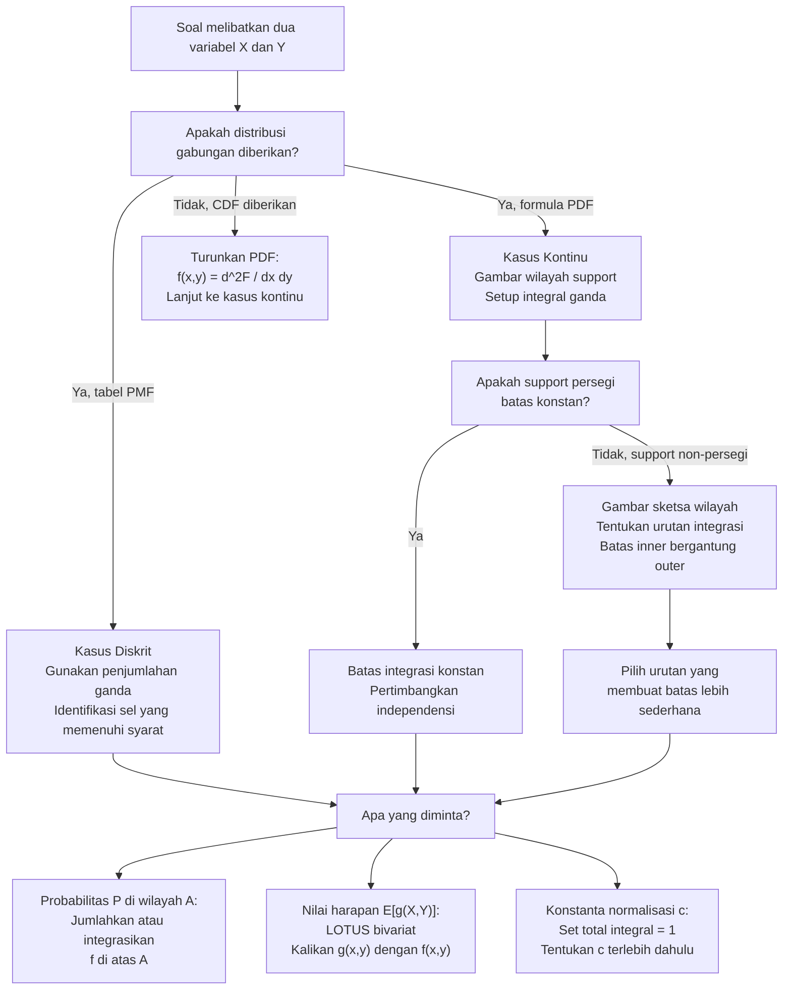

# 📊 3.1 — Distribusi Gabungan (Joint Distribution)

> [!ABSTRACT] Ringkasan Cepat
> **Topik:** Distribusi Gabungan (Joint Distribution) — Diskrit & Kontinu | **Bobot:** ~20–30% | **Difficulty:** Hard
> **Ref:** Hogg-McKean-Craig (2019) Bab 2.1–2.2; Miller et al. (2014) Bab 3.5–3.8; Hogg-Tanis-Zimm (2015) Bab 4.1–4.2 | **Prereq:** [[2.1 Variabel Acak Diskrit]], [[2.2 Variabel Acak Kontinu]], [[1.2 Aksioma dan Perhitungan Probabilitas]]

## Section 0 — Pemetaan Topik

| Topik CF2 | Sub-topik ID | Skill Diuji | Bobot | Difficulty | Prerequisite | Connected Topics | Referensi |
|-----------|--------------|-------------|-------|------------|--------------|------------------|-----------|
| Topik 3: Variabel Acak Multivariat | 3.1 | Mendefinisikan PMF/PDF gabungan diskrit dan kontinu; memverifikasi validitas PMF/PDF gabungan; menghitung probabilitas gabungan dari tabel atau integral ganda; menentukan CDF gabungan $F_{X,Y}(x,y)$; menghitung $E[g(X,Y)]$ menggunakan LOTUS bivariat; membedakan kasus diskrit (penjumlahan ganda) dan kontinu (integral ganda); menentukan support gabungan yang benar termasuk support non-persegi | 20–30% | Hard | [[2.1 Variabel Acak Diskrit]], [[2.2 Variabel Acak Kontinu]], [[1.2 Aksioma dan Perhitungan Probabilitas]] | [[3.2 Distribusi Marginal]], [[3.3 Distribusi Bersyarat (Conditional Distribution)]], [[3.4 Nilai Harapan dan Variansi Bersyarat]], [[3.5 Independensi dan Korelasi]], [[3.8 Transformasi Variabel Acak Gabungan]] | Hogg-McKean-Craig (2019) Bab 2.1–2.2; Miller et al. (2014) Bab 3.5–3.8; Hogg-Tanis-Zimm (2015) Bab 4.1–4.2 |

## Section 1 — Intuisi

Ketika seorang aktuaris menganalisis portofolio asuransi, ia jarang hanya peduli pada satu variabel. Yang lebih sering menarik perhatian adalah hubungan *antara* variabel: apakah besarnya klaim *X* berkorelasi dengan jumlah klaim *Y*? Apakah nilai aset dan liabilitas bergerak bersama? Apakah umur nasabah dan besarnya premi memiliki pola gabungan tertentu? Untuk menjawab pertanyaan-pertanyaan semacam ini, kita membutuhkan cara untuk mendeskripsikan probabilitas dari *dua variabel sekaligus* — inilah yang disebut **distribusi gabungan** (*joint distribution*).

Bayangkan distribusi gabungan sebagai "peta topografi" dari probabilitas di bidang dua dimensi. Untuk variabel diskrit, peta ini berupa tabel dua arah di mana setiap sel berisi probabilitas $P(X=x, Y=y)$ — seperti papan catur dengan probabilitas di setiap kotaknya. Jumlah semua probabilitas di semua kotak harus tepat 1. Untuk variabel kontinu, peta ini adalah permukaan tiga dimensi di mana ketinggian di titik $(x,y)$ adalah kerapatan probabilitas $f_{X,Y}(x,y)$ — dan "volume" total di bawah permukaan ini harus tepat 1. Probabilitas bahwa $(X,Y)$ berada dalam suatu wilayah adalah volume di bawah permukaan PDF di atas wilayah tersebut.

Yang membuat distribusi gabungan lebih rumit dari distribusi univariat adalah **bentuk support**. Untuk variabel tunggal, support biasanya interval sederhana. Untuk dua variabel, support adalah *wilayah* di bidang $xy$ — dan wilayah ini bisa berbentuk persegi, segitiga, disk, atau bahkan bentuk yang lebih kompleks tergantung dependensi antara $X$ dan $Y$. Menentukan batas-batas integrasi atau penjumlahan yang benar untuk wilayah support ini adalah keterampilan paling kritis di seluruh Topik 3, dan sumber kesalahan paling umum di ujian.

## Section 2 — Definisi Formal

> [!NOTE] Definisi Matematis
>
> **Kasus Diskrit — PMF Gabungan:**
> Pasangan variabel acak diskrit $(X,Y)$ memiliki **PMF gabungan**:
> $$p_{X,Y}(x,y) = P(X = x,\; Y = y), \quad (x,y) \in \mathcal{X} \times \mathcal{Y}$$
> yang memenuhi:
> $$p_{X,Y}(x,y) \geq 0 \;\forall (x,y), \qquad \sum_{x}\sum_{y} p_{X,Y}(x,y) = 1$$
>
> **Kasus Kontinu — PDF Gabungan:**
> Pasangan variabel acak kontinu $(X,Y)$ memiliki **PDF gabungan** $f_{X,Y}(x,y)$ jika:
> $$f_{X,Y}(x,y) \geq 0 \;\forall (x,y) \in \mathbb{R}^2, \qquad \int_{-\infty}^{\infty}\int_{-\infty}^{\infty} f_{X,Y}(x,y)\,dx\,dy = 1$$
>
> **CDF Gabungan:**
> $$F_{X,Y}(x,y) = P(X \leq x,\; Y \leq y) = \begin{cases} \displaystyle\sum_{s \leq x}\sum_{t \leq y} p_{X,Y}(s,t) & \text{(diskrit)} \\[8pt] \displaystyle\int_{-\infty}^{x}\int_{-\infty}^{y} f_{X,Y}(s,t)\,dt\,ds & \text{(kontinu)} \end{cases}$$

### Variabel & Parameter

| Simbol | Makna | Catatan |
|--------|-------|---------|
| $p_{X,Y}(x,y)$ | PMF gabungan diskrit | $P(X=x, Y=y)$; non-negatif; total jumlah = 1 |
| $f_{X,Y}(x,y)$ | PDF gabungan kontinu | Kerapatan, bukan probabilitas; bisa $> 1$; total integral = 1 |
| $F_{X,Y}(x,y)$ | CDF gabungan | $P(X \leq x, Y \leq y)$; non-decreasing di setiap argumen |
| $\mathcal{S}$ | Support gabungan | $\{(x,y) : p_{X,Y}(x,y) > 0\}$ atau $\{(x,y) : f_{X,Y}(x,y) > 0\}$ |
| $E[g(X,Y)]$ | Nilai harapan fungsi bivariat | LOTUS bivariat; integral/penjumlahan ganda |
| $g(X,Y)$ | Fungsi dari dua variabel acak | Misalnya $X+Y$, $XY$, $\max(X,Y)$, $X/Y$ |

### Rumus Utama

$$
\sum_{x \in \mathcal{X}}\sum_{y \in \mathcal{Y}} p_{X,Y}(x,y) = 1
$$
**Label: Syarat Normalisasi PMF Gabungan** — jumlah seluruh probabilitas di semua pasangan $(x,y)$ harus tepat 1; syarat validitas PMF gabungan diskrit.

$$
\int_{-\infty}^{\infty}\int_{-\infty}^{\infty} f_{X,Y}(x,y)\,dx\,dy = 1
$$
**Label: Syarat Normalisasi PDF Gabungan** — volume total di bawah permukaan PDF gabungan harus tepat 1; syarat validitas PDF gabungan kontinu.

$$
P\!\left((X,Y) \in A\right) = \begin{cases} \displaystyle\sum_{(x,y)\in A} p_{X,Y}(x,y) & \text{(diskrit)} \\[8pt] \displaystyle\iint_{A} f_{X,Y}(x,y)\,dx\,dy & \text{(kontinu)} \end{cases}
$$
**Label: Probabilitas pada Wilayah $A$** — untuk menghitung $P((X,Y) \in A)$, jumlahkan atau integrasikan distribusi gabungan di atas wilayah $A$; penentuan batas integrasi/penjumlahan bergantung pada bentuk $A$.

$$
E[g(X,Y)] = \begin{cases} \displaystyle\sum_{x}\sum_{y} g(x,y)\, p_{X,Y}(x,y) & \text{(diskrit)} \\[8pt] \displaystyle\int_{-\infty}^{\infty}\int_{-\infty}^{\infty} g(x,y)\, f_{X,Y}(x,y)\,dx\,dy & \text{(kontinu)} \end{cases}
$$
**Label: LOTUS Bivariat** — nilai harapan fungsi $g(X,Y)$ dihitung langsung dari distribusi gabungan tanpa perlu menentukan distribusi $g(X,Y)$ terlebih dahulu.

$$
f_{X,Y}(x,y) = \frac{\partial^2}{\partial x\,\partial y} F_{X,Y}(x,y)
$$
**Label: PDF Gabungan dari CDF Gabungan** — PDF gabungan kontinu diperoleh dari turunan parsial campuran (*mixed partial derivative*) CDF gabungan, analog dengan $f(x) = F'(x)$ univariat.

### Asumsi Eksplisit

- **Support gabungan $\mathcal{S}$:** Harus ditentukan secara eksplisit sebelum menghitung apapun. Support bisa berbentuk persegi (jika $X$ dan $Y$ independen dengan support masing-masing konstan), segitiga, atau wilayah terbatas lainnya tergantung ketergantungan antara $X$ dan $Y$.
- **Non-negativitas:** $p_{X,Y}(x,y) \geq 0$ dan $f_{X,Y}(x,y) \geq 0$ untuk semua $(x,y)$ — ini harus diperiksa, terutama jika PDF diberikan sebagai fungsi yang bisa bernilai negatif di luar support.
- **Integrasi/penjumlahan yang dapat dipertukarkan (*Fubini's Theorem*):** Untuk integral ganda, urutan integrasi dapat dipertukarkan jika $f_{X,Y} \geq 0$ dan integrasi konvergen — kondisi ini hampir selalu terpenuhi di konteks CF2. Namun, batas integrasi dalam urutan berbeda harus ditentukan ulang berdasarkan bentuk support.
- **PDF gabungan bukan probabilitas:** Seperti PDF univariat, nilai $f_{X,Y}(x,y)$ bisa lebih dari 1 — probabilitas hanya muncul dari integrasi atas wilayah dengan luas positif.

## Section 3 — Jembatan Logika

> [!TIP] Dari Definisi ke Rumus
> Distribusi gabungan adalah generalisasi alami dari distribusi univariat ke dua dimensi. Setiap konsep univariat memiliki padanannya:
>
> | Univariat | Bivariat |
> |-----------|----------|
> | PMF $p(x)$, PDF $f(x)$ | PMF gabungan $p_{X,Y}(x,y)$, PDF gabungan $f_{X,Y}(x,y)$ |
> | $\sum_x p(x) = 1$ | $\sum_x\sum_y p_{X,Y}(x,y) = 1$ |
> | $\int f(x)dx = 1$ | $\iint f_{X,Y}(x,y)\,dx\,dy = 1$ |
> | $P(X \in A) = \int_A f(x)dx$ | $P((X,Y)\in A) = \iint_A f_{X,Y}(x,y)\,dx\,dy$ |
> | $E[g(X)] = \int g(x)f(x)dx$ | $E[g(X,Y)] = \iint g(x,y)f_{X,Y}(x,y)\,dx\,dy$ |
> | CDF: $F(x) = \int_{-\infty}^x f(t)dt$ | CDF: $F_{X,Y}(x,y) = \int_{-\infty}^x\int_{-\infty}^y f(s,t)\,dt\,ds$ |
>
> Perbedaan utama: dimensi naik dari 1D ke 2D, penjumlahan/integral menjadi ganda, dan **batas integrasi bisa bergantung satu sama lain** (support non-persegi).

> [!IMPORTANT] Support Gabungan dan Batas Integrasi
> Ini adalah konsep paling kritis di seluruh Topik 3. Ada dua tipe support gabungan:
>
> **Tipe 1 — Support Persegi (Rectangular):** Batas $X$ dan batas $Y$ **tidak saling bergantung**. Contoh: $0 < x < 1$ dan $0 < y < 1$ untuk semua $x$. Batas integrasi konstan dalam kedua urutan. Ini terjadi ketika $X$ dan $Y$ **independen** dengan support masing-masing konstan.
>
> **Tipe 2 — Support Non-Persegi:** Batas salah satu variabel bergantung pada nilai variabel lainnya. Contoh: $0 < x < 1$ dan $0 < y < x$ (segitiga), atau $x^2 + y^2 < 1$ (disk). Batas integrasi harus disesuaikan tergantung urutan integrasi.
>
> **Strategi untuk support non-persegi:** Gambar sketsa wilayah support di bidang $xy$. Untuk integrasi $dy\,dx$: tentukan rentang $x$ (outer integral, konstan), lalu untuk setiap $x$ tentukan rentang $y$ (inner integral, bergantung $x$). Untuk integrasi $dx\,dy$: balik urutannya. Kedua urutan harus menghasilkan hasil yang sama (*Fubini*).

**Derivasi Relasi CDF Gabungan ke PDF Gabungan:**

Dari definisi CDF gabungan:
$$
F_{X,Y}(x,y) = \int_{-\infty}^{x}\int_{-\infty}^{y} f_{X,Y}(s,t)\,dt\,ds
$$

Diferensiasikan terhadap $y$ (Teorema Dasar Kalkulus dalam integral dalam):
$$
\frac{\partial}{\partial y} F_{X,Y}(x,y) = \int_{-\infty}^{x} f_{X,Y}(s,y)\,ds
$$

Diferensiasikan terhadap $x$:
$$
\frac{\partial^2}{\partial x\,\partial y} F_{X,Y}(x,y) = f_{X,Y}(x,y)
$$

Ini adalah analog bivariat dari $f(x) = F'(x)$ — PDF gabungan adalah turunan parsial campuran dari CDF gabungan.

**Probabilitas pada Persegi Panjang dari CDF Gabungan:**

Untuk $a < b$ dan $c < d$:
$$
P(a < X \leq b,\; c < Y \leq d) = F_{X,Y}(b,d) - F_{X,Y}(a,d) - F_{X,Y}(b,c) + F_{X,Y}(a,c)
$$

Ini adalah formula *inclusion-exclusion* bivariat — analoginya: luas persegi panjang = luas besar minus dua strip minus luas sudut kiri bawah yang dikurangi dua kali. Perhatikan bahwa kita menjumlahkan sudut karena dikurangi dua kali.

**Mengapa batas integrasi bergantung urutan untuk support non-persegi:**

Untuk $f_{X,Y}(x,y) > 0$ di wilayah segitiga $\{0 < x < 1,\; 0 < y < x\}$:

Urutan $dy\,dx$: untuk setiap $x \in (0,1)$, $y$ berjalan dari $0$ hingga $x$:
$$
\int_0^1 \int_0^x f_{X,Y}(x,y)\,dy\,dx
$$

Urutan $dx\,dy$: untuk setiap $y \in (0,1)$, $x$ berjalan dari $y$ hingga $1$ (karena $y < x$):
$$
\int_0^1 \int_y^1 f_{X,Y}(x,y)\,dx\,dy
$$

Keduanya mengintegrasikan di atas wilayah yang sama — hasilnya identik, hanya urutan "mengiris" wilayahnya yang berbeda.

> [!DANGER] Dilarang
> 1. **Dilarang** menggunakan batas integrasi konstan untuk support non-persegi. Jika support adalah $\{0 < y < x < 1\}$, batas inner integral **harus** bergantung pada variabel outer. Menulis $\int_0^1\int_0^1 f\,dy\,dx$ untuk support segitiga akan mengintegrasikan di wilayah yang salah dan menghasilkan nilai lebih dari 1.
> 2. **Dilarang** menentukan konstanta normalisasi dari PMF/PDF gabungan tanpa memperhatikan bentuk support secara lengkap. Konstanta $c$ dalam $f_{X,Y}(x,y) = c \cdot g(x,y)$ harus ditentukan dari $\iint_{\mathcal{S}} c\,g(x,y)\,dx\,dy = 1$ di mana $\mathcal{S}$ adalah support yang **benar**, bukan persegi $[0,1]^2$ secara otomatis.
> 3. **Dilarang** mengabaikan bahwa $f_{X,Y}(x,y)$ adalah kerapatan, bukan probabilitas. Nilai $f_{X,Y}(x_0, y_0) = 3$ di suatu titik adalah valid — probabilitas hanya muncul dari integrasi di wilayah dengan luas positif: $P((X,Y) = (x_0,y_0)) = 0$ untuk variabel kontinu.

## Section 4 — Contoh Soal

### Soal A — Fundamental

Dua variabel acak diskrit $X$ dan $Y$ memiliki PMF gabungan yang dinyatakan dalam tabel berikut:

| $X \backslash Y$ | $y=0$ | $y=1$ | $y=2$ |
|-----------------|-------|-------|-------|
| $x=0$ | $0{,}10$ | $0{,}15$ | $0{,}05$ |
| $x=1$ | $0{,}20$ | $0{,}25$ | $0{,}10$ |
| $x=2$ | $0{,}05$ | $0{,}07$ | $0{,}03$ |

(a) Verifikasi bahwa tabel di atas merupakan PMF gabungan yang valid.
(b) Hitung $P(X \leq 1, Y \leq 1)$.
(c) Hitung $P(X = Y)$.
(d) Hitung $E[X]$, $E[Y]$, dan $E[XY]$.
(e) Hitung $E[2X + 3Y - 1]$.

> [!SUCCESS] Solusi Soal A
>
> **1. Identifikasi Variabel**
> - $(X,Y)$ diskrit; support $\mathcal{S} = \{0,1,2\} \times \{0,1,2\}$ (9 pasangan)
> - PMF gabungan diberikan dalam tabel $3 \times 3$
>
> **2. Identifikasi Distribusi / Model**
> PMF gabungan diskrit — semua kalkulasi menggunakan penjumlahan, bukan integral.
>
> **3. Setup Persamaan**
>
> Validasi: $\sum_x\sum_y p_{X,Y}(x,y) = 1$
>
> Probabilitas wilayah: jumlahkan sel yang memenuhi syarat
>
> LOTUS bivariat: $E[g(X,Y)] = \sum_x\sum_y g(x,y)\,p_{X,Y}(x,y)$
>
> **4. Eksekusi Aljabar**
>
> **(a) Validasi PMF gabungan:**
> $$\sum_x\sum_y p_{X,Y}(x,y) = (0{,}10+0{,}15+0{,}05) + (0{,}20+0{,}25+0{,}10) + (0{,}05+0{,}07+0{,}03)$$
> $$= 0{,}30 + 0{,}55 + 0{,}15 = 1{,}00 \quad \checkmark$$
>
> Semua nilai non-negatif ✓. Tabel valid sebagai PMF gabungan.
>
> **(b) $P(X \leq 1, Y \leq 1)$:**
>
> Jumlahkan sel di mana $x \in \{0,1\}$ dan $y \in \{0,1\}$:
> $$P(X \leq 1, Y \leq 1) = p(0,0) + p(0,1) + p(1,0) + p(1,1)$$
> $$= 0{,}10 + 0{,}15 + 0{,}20 + 0{,}25 = 0{,}70$$
>
> **(c) $P(X = Y)$:**
>
> Jumlahkan sel di diagonal utama ($x = y$):
> $$P(X=Y) = p(0,0) + p(1,1) + p(2,2) = 0{,}10 + 0{,}25 + 0{,}03 = 0{,}38$$
>
> **(d) $E[X]$, $E[Y]$, $E[XY]$:**
>
> $E[X] = \sum_x\sum_y x \cdot p_{X,Y}(x,y)$:
> $$= 0(0{,}10+0{,}15+0{,}05) + 1(0{,}20+0{,}25+0{,}10) + 2(0{,}05+0{,}07+0{,}03)$$
> $$= 0(0{,}30) + 1(0{,}55) + 2(0{,}15) = 0 + 0{,}55 + 0{,}30 = 0{,}85$$
>
> $E[Y] = \sum_x\sum_y y \cdot p_{X,Y}(x,y)$:
> $$= 0(0{,}10+0{,}20+0{,}05) + 1(0{,}15+0{,}25+0{,}07) + 2(0{,}05+0{,}10+0{,}03)$$
> $$= 0(0{,}35) + 1(0{,}47) + 2(0{,}18) = 0 + 0{,}47 + 0{,}36 = 0{,}83$$
>
> $E[XY] = \sum_x\sum_y xy \cdot p_{X,Y}(x,y)$:
>
> Hanya pasangan dengan $xy \neq 0$ yang berkontribusi (yaitu $x \geq 1$ dan $y \geq 1$):
> $$= (1)(1)(0{,}25) + (1)(2)(0{,}10) + (2)(1)(0{,}07) + (2)(2)(0{,}03)$$
> $$= 0{,}25 + 0{,}20 + 0{,}14 + 0{,}12 = 0{,}71$$
>
> **(e) $E[2X + 3Y - 1]$:**
>
> Gunakan linieritas nilai harapan:
> $$E[2X + 3Y - 1] = 2E[X] + 3E[Y] - 1 = 2(0{,}85) + 3(0{,}83) - 1 = 1{,}70 + 2{,}49 - 1 = 3{,}19$$
>
> **5. Verification**
> - Total probabilitas = 1{,}00 ✓
> - $P(X \leq 1, Y \leq 1) = 0{,}70$: ini adalah bagian terbesar tabel (4 dari 9 sel di bagian kiri atas yang mendominasi), masuk akal ✓
> - $E[X] = 0{,}85 \in [0,2]$ dan $E[Y] = 0{,}83 \in [0,2]$: keduanya dalam rentang support ✓
> - $E[2X+3Y-1] = 3{,}19$: cek dengan nilai minimum $(2(0)+3(0)-1=-1)$ dan maksimum $(2(2)+3(2)-1=9)$ — nilai $3{,}19$ berada dalam rentang yang valid ✓

> [!WARNING] Exam Tips — Soal A
> **Target waktu:** 8–10 menit
> **Common trap 1:** Saat menghitung $E[X]$ dari tabel gabungan, jangan buat tabel marginal baru terlebih dahulu jika tidak diminta — langsung gunakan LOTUS bivariat: kalikan $x$ dengan semua entri di baris $x$ dan jumlahkan. Ini lebih cepat dari dua langkah (marginal dulu, baru ekspektasi).
> **Common trap 2:** Untuk $E[XY]$, banyak kandidat menghitung semua 9 suku. Hemat waktu: suku dengan $x=0$ atau $y=0$ menghasilkan $xy=0$ — lewati suku tersebut dan hanya hitung 4 suku di mana $x \geq 1$ dan $y \geq 1$.
> **Shortcut:** $E[aX+bY+c] = aE[X] + bE[Y] + c$ via linieritas — tidak perlu menghitung LOTUS bivariat penuh untuk fungsi linear.

---

### Soal B — Exam-Typical

Pasangan variabel acak kontinu $(X,Y)$ memiliki PDF gabungan:
$$
f_{X,Y}(x,y) = \begin{cases} c\,x\,y & 0 < x < 2,\; 0 < y < x \\ 0 & \text{lainnya} \end{cases}
$$

(a) Tentukan nilai konstanta $c$ dan gambarkan wilayah support $\mathcal{S}$.
(b) Hitung $P(X > 1)$.
(c) Hitung $P(Y > 1)$.
(d) Hitung $E[X]$, $E[Y]$, dan $E[XY]$.
(e) Hitung $P(X + Y > 2)$.

> [!SUCCESS] Solusi Soal B
>
> **1. Identifikasi Variabel**
> - PDF gabungan: $f_{X,Y}(x,y) = cxy$ pada support non-persegi
> - Support $\mathcal{S} = \{(x,y): 0 < x < 2,\; 0 < y < x\}$ — wilayah segitiga di bawah garis $y=x$
>
> **2. Identifikasi Distribusi / Model**
> PDF gabungan kontinu dengan support triangular. Urutan integrasi kritis: $dy\,dx$ lebih alami (batas $y$ bergantung $x$); untuk $dx\,dy$ perlu inversi batas ($x$ dari $y$ ke 2).
>
> **3. Setup Persamaan**
>
> Normalisasi (urutan $dy\,dx$):
> $$\int_0^2 \int_0^x cxy\,dy\,dx = 1$$
>
> **4. Eksekusi Aljabar**
>
> **(a) Nilai $c$:**
>
> $$c\int_0^2 \int_0^x xy\,dy\,dx = c\int_0^2 x\left[\frac{y^2}{2}\right]_0^x dx = c\int_0^2 x \cdot \frac{x^2}{2}\,dx = \frac{c}{2}\int_0^2 x^3\,dx$$
> $$= \frac{c}{2}\left[\frac{x^4}{4}\right]_0^2 = \frac{c}{2} \cdot 4 = 2c = 1 \implies \boxed{c = \frac{1}{2}}$$
>
> **Support:** Segitiga dengan sudut di $(0,0)$, $(2,0)$, $(2,2)$ — di bawah garis $y=x$, di atas sumbu-$x$, antara $x=0$ dan $x=2$.
>
> **(b) $P(X > 1)$:**
> $$P(X>1) = \int_1^2\int_0^x \frac{1}{2}xy\,dy\,dx = \frac{1}{2}\int_1^2 x \cdot \frac{x^2}{2}\,dx = \frac{1}{4}\int_1^2 x^3\,dx = \frac{1}{4}\left[\frac{x^4}{4}\right]_1^2 = \frac{1}{4}\cdot\frac{16-1}{4} = \frac{15}{16}$$
>
> **(c) $P(Y > 1)$:**
>
> Untuk $Y > 1$: wilayah di mana $y > 1$ dalam support — perlu $y > 1$ dan $y < x$ dan $x < 2$, sehingga $x > y > 1$, yaitu $1 < y < x < 2$.
>
> Gunakan urutan $dy\,dx$: $x$ dari 1 ke 2, $y$ dari 1 ke $x$:
> $$P(Y>1) = \int_1^2\int_1^x \frac{1}{2}xy\,dy\,dx = \frac{1}{2}\int_1^2 x\left[\frac{y^2}{2}\right]_1^x dx = \frac{1}{4}\int_1^2 x(x^2-1)\,dx$$
> $$= \frac{1}{4}\int_1^2(x^3-x)\,dx = \frac{1}{4}\left[\frac{x^4}{4}-\frac{x^2}{2}\right]_1^2 = \frac{1}{4}\left[\left(4-2\right)-\left(\frac{1}{4}-\frac{1}{2}\right)\right] = \frac{1}{4}\left[2+\frac{1}{4}\right] = \frac{1}{4}\cdot\frac{9}{4} = \frac{9}{16}$$
>
> **(d) $E[X]$, $E[Y]$, $E[XY]$:**
>
> $E[X]$:
> $$E[X] = \int_0^2\int_0^x \frac{1}{2}x \cdot xy\,dy\,dx = \frac{1}{2}\int_0^2 x^2\cdot\frac{x^2}{2}\,dx = \frac{1}{4}\int_0^2 x^4\,dx = \frac{1}{4}\cdot\frac{32}{5} = \frac{8}{5} = 1{,}6$$
>
> $E[Y]$:
> $$E[Y] = \int_0^2\int_0^x \frac{1}{2}y \cdot xy\,dy\,dx = \frac{1}{2}\int_0^2 x\cdot\frac{x^3}{3}\,dx = \frac{1}{6}\int_0^2 x^4\,dx = \frac{1}{6}\cdot\frac{32}{5} = \frac{16}{15} \approx 1{,}067$$
>
> $E[XY]$:
> $$E[XY] = \int_0^2\int_0^x \frac{1}{2}xy \cdot xy\,dy\,dx = \frac{1}{2}\int_0^2 x^2\cdot\frac{x^3}{3}\,dx = \frac{1}{6}\int_0^2 x^5\,dx = \frac{1}{6}\cdot\frac{64}{6} = \frac{32}{9} \approx 3{,}556$$
>
> **(e) $P(X+Y>2)$:**
>
> Wilayah: $\{(x,y) \in \mathcal{S}: x+y > 2\}$, yaitu $y > 2-x$ dan $0 < y < x$ dan $0 < x < 2$.
>
> Agar wilayah ini non-kosong: perlu $2-x < x$ (yaitu $x > 1$) dan $2-x > 0$ (yaitu $x < 2$).
>
> Untuk $x \in (1,2)$: $y$ dari $\max(0, 2-x)= 2-x$ hingga $x$:
> $$P(X+Y>2) = \int_1^2\int_{2-x}^x \frac{1}{2}xy\,dy\,dx = \frac{1}{2}\int_1^2 x\left[\frac{y^2}{2}\right]_{2-x}^x dx$$
> $$= \frac{1}{4}\int_1^2 x\left[x^2-(2-x)^2\right]dx = \frac{1}{4}\int_1^2 x\left[x^2-4+4x-x^2\right]dx$$
> $$= \frac{1}{4}\int_1^2 x(4x-4)\,dx = \int_1^2 x(x-1)\,dx = \int_1^2(x^2-x)\,dx$$
> $$= \left[\frac{x^3}{3}-\frac{x^2}{2}\right]_1^2 = \left(\frac{8}{3}-2\right)-\left(\frac{1}{3}-\frac{1}{2}\right) = \frac{2}{3}+\frac{1}{6} = \frac{4}{6}+\frac{1}{6} = \frac{5}{6}$$
>
> **5. Verification**
> - $c = 1/2 > 0$ ✓; $f_{X,Y}(x,y) = xy/2 \geq 0$ untuk $x,y > 0$ ✓
> - $P(X>1) = 15/16 \approx 0{,}938$: PDF berbentuk $xy$ memberi bobot besar pada $x$ besar, wajar jika $P(X>1)$ tinggi ✓
> - $E[Y] = 16/15 < E[X] = 8/5$: karena $Y < X$ selalu di support, $E[Y] < E[X]$ ✓
> - $P(X+Y>2) = 5/6$: cek komplemen — $P(X+Y \leq 2)$ harus $= 1 - 5/6 = 1/6$; ini adalah wilayah kecil di pojok bawah support ✓

> [!WARNING] Exam Tips — Soal B
> **Target waktu:** 15–18 menit
> **Common trap 1:** Untuk support $\{0 < y < x < 2\}$, saat menghitung $P(Y>1)$, banyak kandidat salah menulis $\int_0^2\int_1^x$ — ini mengikutkan wilayah $x \in (0,1)$ di mana $y > x$ juga termasuk, yang **di luar** support. Batas outer integral harus $x$ dari 1 ke 2 (bukan dari 0).
> **Common trap 2:** Untuk $P(X+Y>2)$, pertama tentukan untuk $x$ berapa wilayah $\{x+y>2, y<x\}$ non-kosong: hanya untuk $x > 1$. Kandidat sering mengikutkan $x \in (0,1)$ yang menghasilkan wilayah kosong dan batas integral yang tidak valid.
> **Shortcut:** Untuk menghitung $E[X]$ dari PDF gabungan kontinu, *tidak perlu* menghitung PDF marginal $f_X(x)$ terlebih dahulu — langsung gunakan LOTUS bivariat: $E[X] = \iint x\,f_{X,Y}(x,y)\,dy\,dx$.

---

### Soal C — Challenging

Pasangan variabel acak kontinu $(X,Y)$ memiliki CDF gabungan:
$$
F_{X,Y}(x,y) = \begin{cases} \left(1 - e^{-x}\right)\left(1 - e^{-y}\right) & x > 0,\; y > 0 \\ 0 & \text{lainnya} \end{cases}
$$

(a) Tentukan PDF gabungan $f_{X,Y}(x,y)$ dengan mendiferensiasikan CDF.
(b) Identifikasi distribusi dari $(X,Y)$ dan nyatakan apakah $X$ dan $Y$ independen — berikan justifikasi matematis.
(c) Hitung $P(X < Y)$.
(d) Hitung $P(X + Y \leq 3)$ menggunakan konvolusi atau integral ganda langsung.
(e) Hitung $E[\max(X,Y)]$ menggunakan identitas $\max(X,Y) = X + Y - \min(X,Y)$ dan fakta $\min(X,Y) \sim \text{Exp}(2)$ untuk $X,Y \overset{\text{iid}}{\sim} \text{Exp}(1)$.

> [!SUCCESS] Solusi Soal C
>
> **1. Identifikasi Variabel**
> - CDF gabungan diberikan: $F_{X,Y}(x,y) = (1-e^{-x})(1-e^{-y})$ untuk $x,y > 0$
> - Support: $(0,\infty) \times (0,\infty)$
>
> **2. Identifikasi Distribusi / Model**
> CDF berbentuk produk dari dua CDF Eksponensial marginal — ini adalah ciri khas distribusi **independen**. Akan dikonfirmasi secara formal via turunan parsial.
>
> **3. Setup Persamaan**
>
> PDF dari CDF: $f_{X,Y}(x,y) = \dfrac{\partial^2}{\partial x\,\partial y}F_{X,Y}(x,y)$
>
> **4. Eksekusi Aljabar**
>
> **(a) PDF gabungan:**
>
> Diferensiasikan terhadap $y$:
> $$\frac{\partial}{\partial y}\left[(1-e^{-x})(1-e^{-y})\right] = (1-e^{-x})\cdot e^{-y}$$
>
> Diferensiasikan terhadap $x$:
> $$f_{X,Y}(x,y) = \frac{\partial}{\partial x}\left[(1-e^{-x})e^{-y}\right] = e^{-x}\cdot e^{-y} = e^{-x-y}, \quad x > 0,\; y > 0$$
>
> **(b) Identifikasi distribusi dan independensi:**
>
> PDF marginal $X$: $f_X(x) = \int_0^\infty e^{-x-y}dy = e^{-x}\int_0^\infty e^{-y}dy = e^{-x} \cdot 1 = e^{-x}$ → $X \sim \text{Exp}(1)$
>
> PDF marginal $Y$: $f_Y(y) = \int_0^\infty e^{-x-y}dx = e^{-y}$ → $Y \sim \text{Exp}(1)$
>
> Periksa faktorisasi:
> $$f_{X,Y}(x,y) = e^{-x-y} = e^{-x} \cdot e^{-y} = f_X(x) \cdot f_Y(y)$$
>
> Karena PDF gabungan **difaktorkan** menjadi perkalian PDF marginal untuk **semua** $(x,y)$ di support, maka:
> $$\boxed{X \perp Y \text{ (independen)}}$$
>
> Lebih lanjut: $X, Y \overset{\text{iid}}{\sim} \text{Exp}(1)$.
>
> **(c) $P(X < Y)$:**
>
> Wilayah: $\{(x,y): 0 < x < y < \infty\}$.
>
> $$P(X < Y) = \int_0^\infty\int_0^y e^{-x-y}\,dx\,dy = \int_0^\infty e^{-y}\left[-e^{-x}\right]_0^y dy = \int_0^\infty e^{-y}(1-e^{-y})\,dy$$
> $$= \int_0^\infty (e^{-y} - e^{-2y})\,dy = \left[-e^{-y}+\frac{e^{-2y}}{2}\right]_0^\infty = (0-0) - (-1+\frac{1}{2}) = \frac{1}{2}$$
>
> Masuk akal: karena $X \overset{d}{=} Y$ (identik terdistribusi), $P(X < Y) = P(X > Y) = 1/2$ oleh simetri ✓
>
> **(d) $P(X + Y \leq 3)$:**
>
> Karena $X, Y \overset{\text{iid}}{\sim} \text{Exp}(1)$, maka $S = X+Y \sim \Gamma(2,\lambda=1)$ dengan PDF:
> $$f_S(s) = se^{-s}, \quad s > 0$$
>
> $$P(S \leq 3) = \int_0^3 se^{-s}\,ds$$
>
> Integrasi per bagian ($u=s$, $dv=e^{-s}ds$):
> $$= \left[-se^{-s}\right]_0^3 + \int_0^3 e^{-s}\,ds = -3e^{-3} + \left[-e^{-s}\right]_0^3 = -3e^{-3} + (1-e^{-3}) = 1 - 4e^{-3}$$
> $$= 1 - 4(0{,}04979) = 1 - 0{,}1991 = 0{,}8009$$
>
> **(e) $E[\max(X,Y)]$:**
>
> Gunakan identitas: $\max(X,Y) = X + Y - \min(X,Y)$, sehingga:
> $$E[\max(X,Y)] = E[X] + E[Y] - E[\min(X,Y)]$$
>
> Untuk $X, Y \overset{\text{iid}}{\sim}\text{Exp}(1)$: $\min(X,Y) \sim \text{Exp}(\lambda_1+\lambda_2) = \text{Exp}(2)$:
> $$E[\min(X,Y)] = \frac{1}{2}$$
>
> (Untuk $X_i \overset{\text{iid}}{\sim}\text{Exp}(\lambda)$: $\min(X_1,\ldots,X_n) \sim \text{Exp}(n\lambda)$, sehingga $E[\min] = 1/(n\lambda)$.)
>
> $$E[\max(X,Y)] = 1 + 1 - \frac{1}{2} = \frac{3}{2}$$
>
> Verifikasi alternatif via PDF $\max$:
>
> CDF $\max(X,Y)$: $F_M(m) = P(\max \leq m) = P(X \leq m)P(Y \leq m) = (1-e^{-m})^2$
>
> PDF: $f_M(m) = 2(1-e^{-m})e^{-m} = 2e^{-m} - 2e^{-2m}$
>
> $E[M] = \int_0^\infty m(2e^{-m}-2e^{-2m})\,dm = 2\cdot\frac{1}{1^2} - 2\cdot\frac{1}{2^2} = 2-\frac{1}{2} = \frac{3}{2}$ ✓
>
> **5. Verification**
> - $f_{X,Y}(x,y) = e^{-x-y} > 0$ untuk $x,y>0$ ✓; $\int_0^\infty\int_0^\infty e^{-x-y}dx\,dy = 1\cdot 1 = 1$ ✓
> - $P(X<Y) = 1/2$: simetri $X \overset{d}{=} Y$ memastikan ini ✓
> - $P(X+Y \leq 3) = 0{,}801$: rata-rata $X+Y$ adalah $E[X]+E[Y]=2$, sehingga $P(S\leq 3)$ yang lebih besar dari $1/2$ wajar ✓
> - $E[\max] = 3/2 > E[X] = 1$: maksimum selalu $\geq$ masing-masing variabel, sehingga $E[\max] \geq E[X]$ ✓

> [!WARNING] Exam Tips — Soal C
> **Target waktu:** 18–22 menit
> **Common trap 1:** Untuk $P(X<Y)$, batas integral $dy\,dx$: jika pilih outer $x$, maka $y$ dari $x$ ke $\infty$ — bukan dari 0. Banyak kandidat menulis $\int_0^\infty\int_x^\infty$ dengan benar untuk $P(X<Y)$ namun kemudian salah menghitung batas dalam urutan terbalik.
> **Common trap 2:** Untuk bagian (d), cara paling efisien adalah mengenali $X+Y \sim \Gamma(2,1)$ via sifat aditif Eksponensial — ini menghindari integral ganda yang lebih kompleks.
> **Common trap 3:** Rumus $\min(X_1,\ldots,X_n) \sim \text{Exp}(n\lambda)$ hanya berlaku untuk variabel **i.i.d.** Eksponensial dengan parameter laju **sama**.
> **Shortcut:** Identitas $\max = X + Y - \min$ adalah teknik baku untuk $E[\max]$ dari dua variabel — jauh lebih cepat dari menghitung PDF $\max$ dan mengintegrasikan.

## Section 5 — Verifikasi & Sanity Check

> [!CHECK] Validasi PMF/PDF Gabungan
> Setiap PMF/PDF gabungan yang diberikan atau diturunkan harus memenuhi:
> 1. Non-negatif di seluruh support ✓
> 2. Total penjumlahan/integral = 1 — verifikasi ini untuk semua soal yang melibatkan konstanta normalisasi ✓
> 3. Support $\mathcal{S}$ dinyatakan secara eksplisit dan konsisten dengan fungsi ✓

> [!CHECK] Validasi Batas Integrasi
> Sebelum menghitung integral ganda:
> 1. Gambar (atau visualisasikan) wilayah support $\mathcal{S}$ di bidang $xy$ ✓
> 2. Tentukan tipe support: persegi (batas konstan) atau non-persegi (batas bergantung variabel lain) ✓
> 3. Untuk urutan integrasi yang dipilih: batas outer konstan, batas inner boleh bergantung pada variabel outer ✓
> 4. Jika diragukan: hitung dalam kedua urutan — hasilnya harus sama (Fubini) ✓

> [!CHECK] Validasi Probabilitas
> Setiap probabilitas yang dihitung harus:
> 1. Berada dalam $[0,1]$ ✓
> 2. Konsisten: $P(A) + P(A^c) = 1$ — gunakan komplemen untuk verifikasi ✓
> 3. Untuk wilayah simetris dari distribusi simetris: gunakan simetri sebagai pengecekan ✓

> [!CHECK] Validasi Mean Bivariat
> Untuk nilai harapan dari distribusi gabungan:
> 1. $E[X]$ dari distribusi gabungan harus sama dengan $E[X]$ dari distribusi marginal $f_X$ ✓
> 2. Linieritas nilai harapan: $E[aX+bY+c] = aE[X]+bE[Y]+c$ selalu berlaku ✓
> 3. Jika $X$ dan $Y$ independen: $E[XY] = E[X]\cdot E[Y]$ — gunakan ini sebagai cek independensi ✓

### Metode Alternatif

**Mengubah urutan integrasi untuk menyederhanakan perhitungan:** Jika batas integrasi dalam satu urutan sulit, coba urutan sebaliknya — dengan Fubini hasilnya sama. Kunci: gambar ulang wilayah support dari perspektif urutan baru.

**Menggunakan CDF gabungan untuk probabilitas persegi panjang:** $P(a < X \leq b, c < Y \leq d) = F(b,d) - F(a,d) - F(b,c) + F(a,c)$ — lebih cepat dari integrasi PDF jika CDF tersedia secara closed-form.

**Sifat aditif untuk $E[X+Y]$:** Linieritas nilai harapan $E[X+Y] = E[X]+E[Y]$ tidak memerlukan independensi — selalu berlaku bahkan untuk variabel yang bergantung, selama momen individual terdefinisi.

## Section 6 — Visualisasi Mental

**PMF Gabungan Diskrit — Tabel Dua Arah:**

Bayangkan papan catur $m \times n$ di mana baris mewakili nilai $X$ dan kolom mewakili nilai $Y$. Setiap sel berisi probabilitas $P(X=x, Y=y)$. Total semua sel = 1. Probabilitas suatu wilayah = jumlah probabilitas semua sel yang termasuk wilayah tersebut. Menjumlahkan satu baris → PMF marginal $p_X(x)$; menjumlahkan satu kolom → PMF marginal $p_Y(y)$.

**PDF Gabungan Kontinu — Permukaan Tiga Dimensi:**

Bayangkan "landscape" tiga dimensi di atas bidang $xy$, di mana ketinggian di setiap titik $(x,y)$ adalah $f_{X,Y}(x,y)$. Volume total di bawah permukaan = 1. Probabilitas bahwa $(X,Y) \in A$ = volume di bawah permukaan di atas wilayah $A$ di bidang $xy$. PDF tinggi di area yang paling mungkin terjadi, rendah di area yang jarang.

**Support Non-Persegi — Mengiris Wilayah:**

Untuk support segitiga $\{0 < y < x < 1\}$: visualisasikan sebagai segitiga di bawah garis $y=x$. Integrasi $dy\,dx$: iriskan vertikal (setiap nilai $x$ tetap, $y$ bergerak dari 0 ke $x$). Integrasi $dx\,dy$: iriskan horizontal (setiap nilai $y$ tetap, $x$ bergerak dari $y$ ke 1). Kedua cara mengiris wilayah yang sama menghasilkan integral yang sama.

### Hubungan Visual ↔ Rumus

Sel tabel PMF gabungan berkorespondensi dengan:
$$
p_{X,Y}(x_i, y_j) \longleftrightarrow \text{nilai di sel }(i,j)\text{ pada tabel}
$$

Volume di bawah permukaan PDF gabungan di atas wilayah $A$ berkorespondensi dengan:
$$
P((X,Y) \in A) = \iint_A f_{X,Y}(x,y)\,dx\,dy \longleftrightarrow \text{volume di atas } A
$$

Formula inclusion-exclusion untuk CDF berkorespondensi dengan:
$$
P(a<X\leq b,\, c<Y\leq d) = F(b,d)-F(a,d)-F(b,c)+F(a,c) \longleftrightarrow \text{luas persegi panjang via pengurangan}
$$

## Section 7 — Jebakan Umum

> [!BUG] Kesalahan Parametrisasi
> **Kesalahan utama — Salah menentukan support gabungan:**
>
> - **Salah:** Untuk $f_{X,Y}(x,y) > 0$ pada $\{0 < y < x < 1\}$, menulis batas integrasi sebagai $\int_0^1\int_0^1$ (persegi penuh).
> - **Benar:** $\int_0^1\int_0^x f\,dy\,dx$ (urutan $dy\,dx$) atau $\int_0^1\int_y^1 f\,dx\,dy$ (urutan $dx\,dy$).
>
> **Akibat:** Integrasi di persegi penuh memasukkan wilayah $\{y > x\}$ di mana $f = 0$, memberikan nilai salah. Jika $f$ tidak nol di luar support yang dimaksud, ini akan menghasilkan total probabilitas lebih dari 1.

> [!BUG] Kesalahan Konseptual
> 1. **Mengabaikan bahwa batas integrasi inner bergantung pada variabel outer untuk support non-persegi.** Ini adalah kesalahan paling fatal: batas inner HARUS bergantung pada variabel outer jika support bukan persegi. Menulis batas konstan untuk inner integral pada support segitiga hampir pasti salah.
> 2. **Mengira $E[XY] = E[X] \cdot E[Y]$ selalu berlaku.** Persamaan ini hanya valid jika $X$ dan $Y$ **independen**. Untuk variabel yang bergantung, $E[XY] \neq E[X]\cdot E[Y]$ secara umum. Perbedaan $E[XY] - E[X]\cdot E[Y]$ adalah definisi $\text{Cov}(X,Y)$ — dibahas di [[3.5 Independensi dan Korelasi]].
> 3. **Mengira $F_{X,Y}(x,y) = F_X(x) \cdot F_Y(y)$ hanya berlaku untuk distribusi independen.** Ini benar — tetapi kadang kandidat menginversinya: mengira karena CDF marginal terpisah, distribusi harus independen. Independensi memerlukan faktorisasi **PDF gabungan** (atau PMF gabungan), bukan hanya CDF marginal yang terpisah.
> 4. **Salah menentukan batas probabilitas persegi panjang dari CDF.** Formula $P(a<X\leq b, c<Y\leq d) = F(b,d)-F(a,d)-F(b,c)+F(a,c)$ memiliki tanda $+F(a,c)$ di akhir — banyak kandidat lupa suku terakhir ini (inclusion-exclusion).

> [!BUG] Kesalahan Interpretasi Soal
> - **"PMF/PDF gabungan diberikan hingga konstanta $c$"**: langkah pertama **selalu** tentukan $c$ dari normalisasi menggunakan integral/penjumlahan di atas support yang **benar** — bukan di persegi $[0,1]^2$ atau $[0,\infty)^2$ secara otomatis.
> - **"Hitung $P(X < Y)$"**: ini adalah probabilitas di **wilayah** $\{(x,y): x < y\}$ yang diiris dari support gabungan — bukan $P(X < \text{sesuatu})$ secara marginal. Identifikasi irisan antara $\{x<y\}$ dan support $\mathcal{S}$ dengan benar.
> - **"Tentukan CDF gabungan"**: untuk variabel kontinu, CDF adalah $F_{X,Y}(x,y) = \int_{-\infty}^x\int_{-\infty}^y f\,dt\,ds$ — sering lebih kompleks dari PDF jika support non-persegi karena batas integrasi bergantung pada $(x,y)$ secara kasusistik.

> [!CAUTION] Red Flags
> - **Support dideskripsikan dengan ketidaksamaan yang melibatkan kedua variabel** (misalnya $y < x$, $x+y < 1$, $x^2+y^2 < 1$): ini adalah **support non-persegi** — batas integrasi bergantung urutan dan tidak konstan. Gambar sketsanya terlebih dahulu.
> - **Konstanta normalisasi $c$ atau $k$ tidak diketahui**: langkah pertama selalu tentukan dari $\iint_\mathcal{S} f\,dx\,dy = 1$ sebelum menghitung apapun.
> - **Soal meminta $P(g(X,Y) \leq c)$ untuk fungsi non-linear $g$**: tentukan wilayah $\{(x,y)\in\mathcal{S}: g(x,y) \leq c\}$ secara geometrik, lalu integrasikan — ini sering memerlukan sketsa wilayah.
> - **Soal meminta $E[\max(X,Y)]$ atau $E[\min(X,Y)]$**: pertimbangkan menggunakan CDF $\max$/$\min$ atau identitas $\max+\min=X+Y$ sebelum langsung mengintegrasikan fungsi $\max$ yang kompleks.
> - **"Hitung $P(X < Y)$ dari distribusi dengan $X \overset{d}{=} Y$"**: simetri langsung memberikan $P(X<Y) = P(X>Y) = 1/2$ (dan $P(X=Y) = 0$ untuk variabel kontinu) — tidak perlu integral.

## Section 8 — Ringkasan Eksekutif

> [!SUMMARY] Must-Remember
> 1. **Validasi PMF/PDF gabungan — dua syarat:**
>    $$p_{X,Y}(x,y) \geq 0,\quad \sum_x\sum_y p_{X,Y}(x,y) = 1 \qquad (\text{diskrit})$$
>    $$f_{X,Y}(x,y) \geq 0,\quad \iint f_{X,Y}(x,y)\,dx\,dy = 1 \qquad (\text{kontinu})$$
> 2. **Probabilitas wilayah $A$ — jumlahkan atau integrasikan:**
>    $$P((X,Y)\in A) = \iint_A f_{X,Y}(x,y)\,dx\,dy$$
> 3. **PDF dari CDF via turunan parsial campuran:**
>    $$f_{X,Y}(x,y) = \frac{\partial^2}{\partial x\,\partial y} F_{X,Y}(x,y)$$
> 4. **CDF dari persegi panjang — inclusion-exclusion:**
>    $$P(a<X\leq b,\;c<Y\leq d) = F(b,d) - F(a,d) - F(b,c) + F(a,c)$$
> 5. **LOTUS Bivariat — nilai harapan fungsi gabungan:**
>    $$E[g(X,Y)] = \iint g(x,y)\,f_{X,Y}(x,y)\,dx\,dy$$

### Kapan Digunakan

- **Trigger keywords:** "distribusi gabungan", "joint distribution", "PMF/PDF dari dua variabel", "probabilitas bersama", "hitung $P(X \in A, Y \in B)$", "$E[XY]$", "$E[g(X,Y)]$".
- **Tipe skenario soal:**
  - Diberikan PMF/PDF gabungan (tabel atau formula); hitung probabilitas, mean, variansi, atau kovariansi.
  - Diberikan CDF gabungan; tentukan PDF via turunan parsial campuran.
  - Diberikan PDF gabungan hingga konstanta; tentukan konstanta dari normalisasi lalu hitung kuantitas lain.
  - Hitung $P(g(X,Y) \leq c)$ untuk berbagai fungsi $g$ (misalnya $X+Y$, $\max(X,Y)$, $X/Y$).

### Kapan TIDAK Boleh Digunakan

- **Jika soal hanya melibatkan satu variabel:** Gunakan distribusi univariat dari [[2.1 Variabel Acak Diskrit]] atau [[2.2 Variabel Acak Kontinu]] — distribusi gabungan tidak diperlukan.
- **Jika distribusi marginal sudah cukup:** Untuk $E[X]$ dan $E[Y]$ secara terpisah tanpa $E[XY]$ atau $\text{Cov}(X,Y)$, cukup gunakan distribusi marginal dari [[3.2 Distribusi Marginal]].
- **Jika soal meminta distribusi bersyarat $f_{Y|X}(y|x)$:** Beralih ke [[3.3 Distribusi Bersyarat (Conditional Distribution)]] — distribusi gabungan adalah titik awal, tetapi perhitungannya melibatkan normalisasi bersyarat.
- **Jika soal meminta identifikasi independensi secara formal:** Gunakan kriteria faktorisasi dari [[3.5 Independensi dan Korelasi]] — faktorisasi $f_{X,Y}(x,y) = f_X(x)\cdot f_Y(y)$ harus berlaku di **seluruh** support.

### Quick Decision Tree

---

> [!QUOTE] Follow-up Options
> 1. *"Berikan contoh soal variasi: PDF gabungan dengan support disk $x^2 + y^2 < r^2$ dan hitung probabilitas di wilayah non-trivial"*
> 2. *"Jelaskan hubungan [[3.1 Distribusi Gabungan (Joint Distribution)]] dengan [[3.2 Distribusi Marginal]] — bagaimana mendapatkan distribusi marginal dari distribusi gabungan"*
> 3. *"Buat flashcard 1-halaman untuk topik ini"*

*📖 Ref: Hogg-McKean-Craig (2019) Bab 2.1–2.2; Miller et al. (2014) Bab 3.5–3.8; Hogg-Tanis-Zimm (2015) Bab 4.1–4.2 | 🗓️ 2026-02-21 | #CF2 #Multivariat #JointDistribution #DistribusiGabungan #PMFGabungan #PDFGabungan #CDFGabungan*
