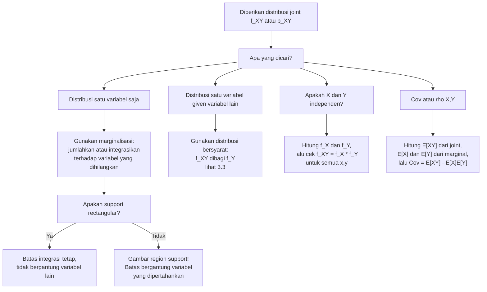

# 📊 3.2 — Distribusi Marginal

> [!ABSTRACT] Ringkasan Cepat
> **Topik:** Distribusi Marginal | **Bobot:** ~20–30% | **Difficulty:** Medium
> **Ref:** Hogg-McKean-Craig (2019) Bab 2.1–2.2; Miller et al. (2014) Bab 3.5–3.7, 4.6–4.7 | **Prereq:** [[3.1 Distribusi Gabungan (Joint Distribution)]], [[2.1 Variabel Acak Diskrit]], [[2.2 Variabel Acak Kontinu]]

## Section 0 — Pemetaan Topik

| Topik CF2 | Sub-topik ID | Skill Diuji | Bobot | Difficulty | Prerequisite | Connected Topics | Referensi |
|-----------|--------------|-------------|-------|------------|--------------|------------------|-----------|
| Topik 3: Variabel Acak Multivariat | 3.2 | Menurunkan PMF/PDF marginal dari distribusi joint; menghitung CDF marginal; menghitung $E[X]$, $\text{Var}(X)$ dari distribusi marginal; mengenali support marginal; membedakan marginal vs bersyarat vs joint | 20–30% | Medium | [[3.1 Distribusi Gabungan (Joint Distribution)]], [[2.1 Variabel Acak Diskrit]], [[2.2 Variabel Acak Kontinu]] | [[3.3 Distribusi Bersyarat (Conditional Distribution)]], [[3.4 Nilai Harapan dan Variansi Bersyarat]], [[3.5 Independensi dan Korelasi]], [[3.7 Distribusi Majemuk (Compound Distribution)]] | Hogg-McKean-Craig (2019) Bab 2.1–2.2; Miller et al. (2014) Bab 3.5–3.7, 4.6–4.7, 5.8–5.9 |

## Section 1 — Intuisi

Bayangkan sebuah perusahaan asuransi jiwa memiliki data gabungan tentang dua variabel untuk setiap nasabah: $X$ = usia nasabah saat pengajuan polis (dalam tahun), dan $Y$ = jumlah klaim dalam satu tahun. Distribusi *joint* dari $(X, Y)$ memberikan gambaran lengkap tentang hubungan antara kedua variabel — misalnya, berapa peluang seorang nasabah berusia 40 tahun mengajukan tepat 2 klaim. Namun sering kali, seorang aktuaris hanya perlu menjawab pertanyaan yang lebih sederhana: "Berapa distribusi usia nasabah, *tanpa mempedulikan* berapa klaim yang mereka ajukan?" Inilah fungsi **distribusi marginal**: ia "menarik keluar" distribusi satu variabel saja dari distribusi joint, dengan cara mengakumulasikan (menjumlahkan atau mengintegrasikan) semua kemungkinan nilai variabel lainnya.

Istilah "marginal" sendiri berasal dari kebiasaan lama statistikawan yang menuliskan distribusi satu variabel di **margin** (tepi luar) tabel distribusi gabungan — kolom paling kanan dan baris paling bawah berisi total baris dan total kolom, yang persis merupakan distribusi marginal masing-masing variabel. Operasi yang dilakukan adalah "meringkas" dimensi yang tidak diinginkan: untuk kasus diskrit, kita menjumlahkan sepanjang dimensi tersebut; untuk kasus kontinu, kita mengintegrasikan. Hasilnya adalah fungsi satu variabel — PMF atau PDF — yang berperilaku persis seperti distribusi univariat biasa.

Dalam konteks aktuaria, distribusi marginal sangat penting ketika kita ingin memodelkan risiko dari satu sumber saja (misalnya, hanya frekuensi klaim tanpa mempertimbangkan keparahan), atau ketika kita ingin memeriksa apakah dua variabel risiko saling independen. Jika distribusi marginal dari $X$ dan $Y$ dikalikan menghasilkan distribusi joint, maka $X$ dan $Y$ independen — dan penyederhanaan besar dalam pemodelan dapat dilakukan. Kemampuan menurunkan dan menginterpretasikan distribusi marginal adalah fondasi untuk topik [[3.3 Distribusi Bersyarat (Conditional Distribution)]], [[3.4 Nilai Harapan dan Variansi Bersyarat]], dan [[3.5 Independensi dan Korelasi]].

## Section 2 — Definisi Formal

> [!NOTE] Definisi Matematis
>
> Misalkan $(X, Y)$ adalah pasangan variabel acak dengan distribusi joint. **Distribusi marginal** dari $X$ diperoleh dengan mengakumulasikan distribusi joint terhadap seluruh nilai $Y$.
>
> **Kasus Diskrit — PMF Marginal $X$:**
> $$
> p_X(x) = \sum_{y \in \mathcal{Y}} p_{X,Y}(x, y), \quad x \in \mathcal{X}
> $$
>
> **Kasus Diskrit — PMF Marginal $Y$:**
> $$
> p_Y(y) = \sum_{x \in \mathcal{X}} p_{X,Y}(x, y), \quad y \in \mathcal{Y}
> $$
>
> **Kasus Kontinu — PDF Marginal $X$:**
> $$
> f_X(x) = \int_{-\infty}^{\infty} f_{X,Y}(x, y)\, dy, \quad x \in \mathcal{X}
> $$
>
> **Kasus Kontinu — PDF Marginal $Y$:**
> $$
> f_Y(y) = \int_{-\infty}^{\infty} f_{X,Y}(x, y)\, dx, \quad y \in \mathcal{Y}
> $$
>
> **CDF Marginal $X$ (berlaku umum):**
> $$
> F_X(x) = \lim_{y \to \infty} F_{X,Y}(x, y) = P(X \leq x, Y < \infty)
> $$

### Variabel & Parameter

| Simbol | Makna | Catatan |
|--------|-------|---------|
| $X, Y$ | Variabel acak dalam pasangan $(X, Y)$ | Bisa diskrit, kontinu, atau campuran |
| $\mathcal{X}, \mathcal{Y}$ | Support marginal dari $X$ dan $Y$ | Support marginal bisa berbeda dari support joint |
| $p_{X,Y}(x, y)$ | PMF joint dari $(X, Y)$ (kasus diskrit) | $p_{X,Y}(x,y) \geq 0$; $\sum_x \sum_y p_{X,Y}(x,y) = 1$ |
| $f_{X,Y}(x, y)$ | PDF joint dari $(X, Y)$ (kasus kontinu) | $f_{X,Y}(x,y) \geq 0$; $\int\int f_{X,Y} = 1$ |
| $p_X(x)$ | PMF marginal dari $X$ | Fungsi satu variabel; $\sum_x p_X(x) = 1$ |
| $f_X(x)$ | PDF marginal dari $X$ | Fungsi satu variabel; $\int f_X(x)\,dx = 1$ |
| $F_{X,Y}(x,y)$ | CDF joint dari $(X, Y)$ | $F_{X,Y}(x,y) = P(X \leq x, Y \leq y)$ |
| $F_X(x)$ | CDF marginal dari $X$ | $F_X(x) = \lim_{y \to \infty} F_{X,Y}(x, y)$ |
| $E_X[X]$ | Nilai harapan $X$ dari distribusi marginal | $\sum_x x\, p_X(x)$ atau $\int x\, f_X(x)\,dx$ |

### Rumus Utama

$$
p_X(x) = \sum_{y \in \mathcal{Y}} p_{X,Y}(x, y)
$$
**Label: Marginalisasi Diskrit** — jumlahkan PMF joint atas semua nilai $y$ untuk mendapatkan PMF marginal $X$; setiap baris dalam tabel joint dijumlahkan ke kolom margin.

$$
f_X(x) = \int_{-\infty}^{\infty} f_{X,Y}(x, y)\, dy
$$
**Label: Marginalisasi Kontinu** — integrasikan PDF joint atas variabel $y$ untuk mendapatkan PDF marginal $X$; batas integrasi harus menggunakan **support aktual** dari $y$, bukan selalu $-\infty$ hingga $\infty$.

$$
F_X(x) = \lim_{y \to \infty} F_{X,Y}(x, y)
$$
**Label: CDF Marginal dari CDF Joint** — ambil limit CDF joint ketika $y \to \infty$; secara intuitif, kita mengizinkan $Y$ mengambil semua nilai hingga $+\infty$.

$$
\sum_{x \in \mathcal{X}} p_X(x) = 1 \qquad \text{dan} \qquad \int_{-\infty}^{\infty} f_X(x)\,dx = 1
$$
**Label: Validasi Distribusi Marginal** — distribusi marginal yang diturunkan dengan benar selalu merupakan distribusi valid (PMF atau PDF yang sah).

$$
E[g(X)] = \sum_{x \in \mathcal{X}} g(x)\, p_X(x) = \sum_{x}\sum_{y} g(x)\, p_{X,Y}(x,y)
$$
**Label: Nilai Harapan dari Marginal (ekuivalensi)** — nilai harapan fungsi $X$ dapat dihitung langsung dari marginal atau dari joint; hasilnya identik.

### Asumsi Eksplisit

- **Support joint terdefinisi:** $\mathcal{X} \times \mathcal{Y}$ (atau subset-nya) harus terdefinisi dengan jelas sebelum marginalisasi dilakukan.
- **Konvergensi/keabsolutan:** Untuk kasus diskrit, $\sum_y |p_{X,Y}(x,y)| < \infty$; untuk kasus kontinu, $\int |f_{X,Y}(x,y)|\,dy < \infty$ — keduanya otomatis terpenuhi jika distribusi joint valid.
- **Batas integrasi bergantung support:** Ketika support joint adalah region non-rectangular (misal $0 < x < y < 1$), batas integrasi dalam marginalisasi **bergantung pada variabel yang dipertahankan**, bukan selalu $-\infty$ hingga $\infty$.
- **Marginal tidak menentukan joint secara unik:** Dua distribusi joint yang berbeda bisa menghasilkan marginal yang sama; oleh karena itu, mengetahui kedua marginal tidak cukup untuk menentukan distribusi joint kecuali ada informasi tambahan (misal: independensi).

## Section 3 — Jembatan Logika

> [!TIP] Dari Definisi ke Rumus
> Distribusi joint $p_{X,Y}(x,y)$ atau $f_{X,Y}(x,y)$ mendeskripsikan probabilitas untuk setiap **pasangan** $(x, y)$. Ketika kita ingin distribusi $X$ saja, kita tidak peduli nilai $Y$ yang mana — kita ingin *semua kemungkinan $Y$* digabungkan. Untuk kasus diskrit, "menggabungkan" berarti **menjumlahkan**: $p_X(x) = \sum_y p_{X,Y}(x,y)$ adalah total probabilitas semua kejadian $(X=x, Y=y)$ untuk setiap $y$ yang mungkin. Untuk kasus kontinu, "menggabungkan" berarti **mengintegrasikan**: $f_X(x) = \int f_{X,Y}(x,y)\,dy$ karena probabilitas bukan lagi diberikan oleh nilai fungsi tunggal melainkan oleh luas di bawah kurva. Ide dasarnya sama: kita "hapus" variabel $Y$ dengan merangkum semua kemungkinannya.

> [!IMPORTANT] Support dan Domain — Peringatan Batas Non-Rectangular
> Batas integrasi (atau batas penjumlahan) dalam marginalisasi harus mengikuti **support joint yang sebenarnya**. Jika support joint adalah suatu region, bukan persegi panjang, maka batas bervariasi:
>
> **Contoh:** Jika $f_{X,Y}(x,y) > 0$ hanya untuk $0 < x < y < 1$, maka:
> $$
> f_X(x) = \int_{y=x}^{1} f_{X,Y}(x,y)\,dy, \quad 0 < x < 1
> $$
> $$
> f_Y(y) = \int_{x=0}^{y} f_{X,Y}(x,y)\,dx, \quad 0 < y < 1
> $$
>
> Batas bawah integrasi $f_X$ adalah $x$ (bukan $0$), dan batas atas integrasi $f_Y$ adalah $y$ (bukan $1$). Menggunakan batas yang salah adalah kesalahan paling umum dalam soal CF2 bertopik distribusi marginal.

**Derivasi Marginal dari Prinsip Probabilitas Total:**

Mulai dari aksioma: probabilitas kejadian $\{X \leq x\}$ adalah total probabilitas dari semua pasangan $(X \leq x, Y = y)$ untuk semua $y$. Untuk kasus diskrit:

$$
P(X \leq x) = \sum_{x' \leq x} P(X = x') = \sum_{x' \leq x} \sum_{y \in \mathcal{Y}} p_{X,Y}(x', y)
$$

Dari sini, turunannya adalah PMF marginal:

$$
p_X(x) = P(X = x) = \sum_{y \in \mathcal{Y}} p_{X,Y}(x, y)
$$

Ini adalah hukum probabilitas total yang diterapkan pada $Y$: $P(X = x) = \sum_y P(X = x \mid Y = y) P(Y = y) = \sum_y p_{X,Y}(x,y)$.

Untuk kasus kontinu, argumen yang analog menggunakan properti integral. CDF joint memenuhi:

$$
F_X(x) = P(X \leq x) = P(X \leq x,\, Y < \infty) = \lim_{y \to \infty} F_{X,Y}(x, y)
$$

Mendiferensialkan $F_X(x)$ terhadap $x$ menghasilkan PDF marginal:

$$
f_X(x) = \frac{d}{dx} F_X(x) = \frac{d}{dx} \int_{-\infty}^{\infty} \int_{-\infty}^{x} f_{X,Y}(u, v)\,du\,dv = \int_{-\infty}^{\infty} f_{X,Y}(x, y)\,dy
$$

di mana pertukaran urutan diferensiasi dan integrasi dijustifikasi oleh teorema diferensiasi di bawah tanda integral (kondisi regularitas standar terpenuhi untuk distribusi yang valid di CF2).

> [!DANGER] Dilarang
> 1. **Dilarang menggunakan batas $\pm\infty$ secara membabi-buta** ketika support joint terbatas atau non-rectangular — selalu gambar region support terlebih dahulu dan tentukan batas integrasi yang benar untuk setiap variabel yang dipertahankan.
> 2. **Dilarang menyimpulkan distribusi joint dari kedua marginalnya** tanpa informasi tambahan — produk dari dua marginal sama dengan joint **hanya jika** $X$ dan $Y$ independen (lihat [[3.5 Independensi dan Korelasi]]).
> 3. **Dilarang menggunakan distribusi marginal sebagai distribusi bersyarat** — $f_X(x) \neq f_{X|Y}(x|y)$ kecuali $X$ dan $Y$ independen; keduanya adalah fungsi yang berbeda dengan interpretasi yang berbeda.

## Section 4 — Contoh Soal

### Soal A — Fundamental

Misalkan $(X, Y)$ adalah pasangan variabel acak diskrit dengan PMF joint sebagai berikut:

| $p_{X,Y}(x,y)$ | $Y=0$ | $Y=1$ | $Y=2$ |
|:---:|:---:|:---:|:---:|
| $X=1$ | 0.10 | 0.15 | 0.05 |
| $X=2$ | 0.20 | 0.25 | 0.10 |
| $X=3$ | 0.05 | 0.05 | 0.05 |

**(a)** Tentukan PMF marginal dari $X$ dan $Y$. **(b)** Hitung $E[X]$ dan $\text{Var}(X)$ menggunakan distribusi marginal $X$.

> [!SUCCESS] Solusi Soal A
>
> **1. Identifikasi Variabel**
> - $\mathcal{X} = \{1, 2, 3\}$, $\mathcal{Y} = \{0, 1, 2\}$
> - Total probabilitas: $0.10 + 0.15 + 0.05 + 0.20 + 0.25 + 0.10 + 0.05 + 0.05 + 0.05 = 1.00$ ✓
>
> **2. Identifikasi Distribusi / Model**
> - Variabel acak diskrit bivariat dengan PMF joint eksplisit.
> - Marginalisasi dilakukan dengan menjumlahkan baris (untuk marginal $X$) atau kolom (untuk marginal $Y$).
>
> **3. Setup Persamaan**
> $$
> p_X(x) = \sum_{y \in \{0,1,2\}} p_{X,Y}(x, y), \qquad p_Y(y) = \sum_{x \in \{1,2,3\}} p_{X,Y}(x, y)
> $$
>
> **4. Eksekusi Aljabar**
>
> *PMF Marginal $X$ (jumlahkan tiap baris):*
> $$
> p_X(1) = 0.10 + 0.15 + 0.05 = 0.30
> $$
> $$
> p_X(2) = 0.20 + 0.25 + 0.10 = 0.55
> $$
> $$
> p_X(3) = 0.05 + 0.05 + 0.05 = 0.15
> $$
> Cek: $0.30 + 0.55 + 0.15 = 1.00$ ✓
>
> *PMF Marginal $Y$ (jumlahkan tiap kolom):*
> $$
> p_Y(0) = 0.10 + 0.20 + 0.05 = 0.35
> $$
> $$
> p_Y(1) = 0.15 + 0.25 + 0.05 = 0.45
> $$
> $$
> p_Y(2) = 0.05 + 0.10 + 0.05 = 0.20
> $$
> Cek: $0.35 + 0.45 + 0.20 = 1.00$ ✓
>
> *Menghitung $E[X]$:*
> $$
> E[X] = \sum_{x} x\, p_X(x) = 1(0.30) + 2(0.55) + 3(0.15) = 0.30 + 1.10 + 0.45 = 1.85
> $$
>
> *Menghitung $E[X^2]$ via LOTUS:*
> $$
> E[X^2] = 1^2(0.30) + 2^2(0.55) + 3^2(0.15) = 0.30 + 2.20 + 1.35 = 3.85
> $$
>
> *Menghitung $\text{Var}(X)$:*
> $$
> \text{Var}(X) = E[X^2] - (E[X])^2 = 3.85 - (1.85)^2 = 3.85 - 3.4225 = 0.4275
> $$
>
> **5. Verification**
> - Distribusi marginal valid: semua $p_X(x) \geq 0$ dan jumlah = 1. ✓
> - $E[X] = 1.85$ berada di antara nilai minimum (1) dan maksimum (3). ✓
> - $\text{Var}(X) = 0.4275 > 0$, dan distribusi cukup terkonsentrasi di $X=2$, sehingga variansi kecil adalah masuk akal. ✓

> [!WARNING] Exam Tips — Soal A
> - **Target waktu:** 3–4 menit untuk bagian (a) + (b).
> - **Common trap:** Menjumlahkan kolom untuk marginal $X$ (seharusnya baris) atau sebaliknya. Ingat: marginal $X$ → jumlahkan arah $Y$ → jumlahkan **baris** (baris = nilai $X$ konstan, kolom = nilai $Y$ bervariasi).
> - **Shortcut verifikasi:** Jumlah semua entri PMF joint harus = 1; jumlah semua nilai marginal $X$ harus = 1; jika tidak, ada kesalahan penjumlahan.

---

### Soal B — Exam-Typical

Misalkan $(X, Y)$ memiliki PDF joint:

$$
f_{X,Y}(x, y) = \begin{cases} 6x & 0 < x < y < 1 \\ 0 & \text{lainnya} \end{cases}
$$

**(a)** Tentukan PDF marginal $f_X(x)$ dan $f_Y(y)$. **(b)** Hitung $E[Y]$ dan $\text{Var}(Y)$ menggunakan distribusi marginal $Y$.

> [!SUCCESS] Solusi Soal B
>
> **1. Identifikasi Variabel**
> - Support joint: $\{(x,y) : 0 < x < y < 1\}$ — region segitiga di bawah diagonal $y = 1$ dan di atas garis $y = x$.
> - Untuk marginalisasi, perlu menentukan batas variabel yang diintegrasikan sebagai fungsi variabel yang dipertahankan.
>
> **2. Identifikasi Distribusi / Model**
> - Distribusi kontinu bivariat dengan support non-rectangular (segitiga).
> - Verifikasi: $\int_0^1 \int_x^1 6x\,dy\,dx = \int_0^1 6x(1-x)\,dx = 6\left[\frac{1}{2} - \frac{1}{3}\right] = 6 \cdot \frac{1}{6} = 1$ ✓
>
> **3. Setup Persamaan**
>
> Untuk $f_X(x)$: $x$ tetap, $y$ bervariasi dari $x$ hingga $1$ (karena syarat $x < y < 1$):
> $$
> f_X(x) = \int_{y=x}^{1} 6x\, dy, \quad 0 < x < 1
> $$
>
> Untuk $f_Y(y)$: $y$ tetap, $x$ bervariasi dari $0$ hingga $y$ (karena syarat $0 < x < y$):
> $$
> f_Y(y) = \int_{x=0}^{y} 6x\, dx, \quad 0 < y < 1
> $$
>
> **4. Eksekusi Aljabar**
>
> *PDF Marginal $X$:*
> $$
> f_X(x) = \int_{x}^{1} 6x\, dy = 6x \cdot [y]_{x}^{1} = 6x(1 - x), \quad 0 < x < 1
> $$
>
> *PDF Marginal $Y$:*
> $$
> f_Y(y) = \int_{0}^{y} 6x\, dx = 6 \cdot \left[\frac{x^2}{2}\right]_{0}^{y} = 6 \cdot \frac{y^2}{2} = 3y^2, \quad 0 < y < 1
> $$
>
> *Menghitung $E[Y]$:*
> $$
> E[Y] = \int_0^1 y \cdot 3y^2\, dy = 3\int_0^1 y^3\, dy = 3 \cdot \frac{1}{4} = \frac{3}{4}
> $$
>
> *Menghitung $E[Y^2]$:*
> $$
> E[Y^2] = \int_0^1 y^2 \cdot 3y^2\, dy = 3\int_0^1 y^4\, dy = 3 \cdot \frac{1}{5} = \frac{3}{5}
> $$
>
> *Menghitung $\text{Var}(Y)$:*
> $$
> \text{Var}(Y) = E[Y^2] - (E[Y])^2 = \frac{3}{5} - \left(\frac{3}{4}\right)^2 = \frac{3}{5} - \frac{9}{16} = \frac{48}{80} - \frac{45}{80} = \frac{3}{80}
> $$
>
> **5. Verification**
> - $f_X(x) = 6x(1-x) \geq 0$ untuk $0 < x < 1$ ✓; $\int_0^1 6x(1-x)\,dx = 6(\frac{1}{2} - \frac{1}{3}) = 1$ ✓
> - $f_Y(y) = 3y^2 \geq 0$ untuk $0 < y < 1$ ✓; $\int_0^1 3y^2\,dy = [y^3]_0^1 = 1$ ✓
> - $E[Y] = 3/4$ masuk akal: karena $Y > X > 0$ dan $Y < 1$, ekspektasi $Y$ seharusnya lebih besar dari $1/2$ ✓
> - $\text{Var}(Y) = 3/80 = 0.0375 > 0$ ✓

> [!WARNING] Exam Tips — Soal B
> - **Target waktu:** 6–8 menit.
> - **Common trap paling kritis:** Menggunakan batas $0$ hingga $1$ untuk $f_X(x)$ — ini **salah** karena mengabaikan syarat $y > x$. Batas bawah integrasi untuk $y$ adalah $x$, bukan $0$!
> - **Common trap kedua:** Menggunakan batas $y$ hingga $1$ untuk $f_Y(y)$ — ini juga salah. Batas atas untuk $x$ adalah $y$, bukan $1$.
> - **Strategi:** Selalu gambar region support di kertas sebelum menulis integral. Garis $y=x$, $y=1$, $x=0$ membentuk segitiga — identifikasi dengan jelas mana batas bawah dan atas untuk setiap variabel.

---

### Soal C — Challenging

Misalkan $(X, Y)$ memiliki PDF joint:

$$
f_{X,Y}(x, y) = \begin{cases} c(x + y^2) & 0 < x < 1,\; 0 < y < 1 \\ 0 & \text{lainnya} \end{cases}
$$

**(a)** Tentukan nilai konstanta $c$. **(b)** Tentukan PDF marginal $f_X(x)$ dan $f_Y(y)$. **(c)** Tentukan apakah $X$ dan $Y$ independen. **(d)** Hitung $\text{Cov}(X, Y)$.

> [!SUCCESS] Solusi Soal C
>
> **1. Identifikasi Variabel**
> - Support joint: $\{(x,y) : 0 < x < 1, 0 < y < 1\}$ — persegi satuan (rectangular support, batas tidak saling bergantung).
> - Parameter $c > 0$ belum diketahui; harus ditentukan dari syarat normalisasi.
>
> **2. Identifikasi Distribusi / Model**
> - Distribusi kontinu bivariat dengan support rectangular.
> - Dengan support rectangular, marginalisasi lebih sederhana (batas integrasi tidak bergantung variabel yang dipertahankan).
>
> **3. Setup Persamaan**
>
> **(a) Menentukan $c$:**
> $$
> \int_0^1\int_0^1 c(x + y^2)\,dy\,dx = 1
> $$
>
> **(b) PDF marginal:**
> $$
> f_X(x) = \int_0^1 c(x + y^2)\,dy, \quad f_Y(y) = \int_0^1 c(x + y^2)\,dx
> $$
>
> **(d) Kovariasi:**
> $$
> \text{Cov}(X,Y) = E[XY] - E[X]E[Y]
> $$
>
> **4. Eksekusi Aljabar**
>
> **(a) Nilai $c$:**
> $$
> c\int_0^1\int_0^1 (x + y^2)\,dy\,dx = c\int_0^1 \left[xy + \frac{y^3}{3}\right]_0^1 dx = c\int_0^1 \left(x + \frac{1}{3}\right)dx
> $$
> $$
> = c\left[\frac{x^2}{2} + \frac{x}{3}\right]_0^1 = c\left(\frac{1}{2} + \frac{1}{3}\right) = c \cdot \frac{5}{6} = 1 \implies \boxed{c = \frac{6}{5}}
> $$
>
> **(b) PDF Marginal $X$:**
> $$
> f_X(x) = \frac{6}{5}\int_0^1 (x + y^2)\,dy = \frac{6}{5}\left[xy + \frac{y^3}{3}\right]_0^1 = \frac{6}{5}\left(x + \frac{1}{3}\right) = \frac{6x + 2}{5}, \quad 0 < x < 1
> $$
>
> *PDF Marginal $Y$:*
> $$
> f_Y(y) = \frac{6}{5}\int_0^1 (x + y^2)\,dx = \frac{6}{5}\left[\frac{x^2}{2} + xy^2\right]_0^1 = \frac{6}{5}\left(\frac{1}{2} + y^2\right) = \frac{3 + 6y^2}{5}, \quad 0 < y < 1
> $$
>
> **(c) Uji Independensi:**
>
> $X$ dan $Y$ independen jika dan hanya jika $f_{X,Y}(x,y) = f_X(x) \cdot f_Y(y)$ untuk semua $(x,y)$.
>
> $$
> f_X(x) \cdot f_Y(y) = \frac{(6x+2)}{5} \cdot \frac{(3+6y^2)}{5} = \frac{(6x+2)(3+6y^2)}{25}
> $$
>
> Sementara:
> $$
> f_{X,Y}(x,y) = \frac{6}{5}(x + y^2) = \frac{6x + 6y^2}{5}
> $$
>
> Karena $\frac{(6x+2)(3+6y^2)}{25} \neq \frac{6x + 6y^2}{5}$ (misalnya di $x=0, y=0$: $\frac{2 \cdot 3}{25} = \frac{6}{25} \neq 0$), maka $X$ dan $Y$ **tidak independen**.
>
> **(d) Menghitung $\text{Cov}(X,Y)$:**
>
> $E[X]$:
> $$
> E[X] = \int_0^1 x \cdot \frac{6x+2}{5}\,dx = \frac{1}{5}\int_0^1 (6x^2 + 2x)\,dx = \frac{1}{5}\left[2x^3 + x^2\right]_0^1 = \frac{3}{5}
> $$
>
> $E[Y]$:
> $$
> E[Y] = \int_0^1 y \cdot \frac{3+6y^2}{5}\,dy = \frac{1}{5}\int_0^1 (3y + 6y^3)\,dy = \frac{1}{5}\left[\frac{3y^2}{2} + \frac{6y^4}{4}\right]_0^1 = \frac{1}{5}\left(\frac{3}{2} + \frac{3}{2}\right) = \frac{3}{5}
> $$
>
> $E[XY]$ (dari distribusi joint):
> $$
> E[XY] = \frac{6}{5}\int_0^1\int_0^1 xy(x + y^2)\,dy\,dx = \frac{6}{5}\int_0^1\int_0^1 (x^2y + xy^3)\,dy\,dx
> $$
> $$
> = \frac{6}{5}\int_0^1 \left[\frac{x^2 y^2}{2} + \frac{xy^4}{4}\right]_0^1 dx = \frac{6}{5}\int_0^1 \left(\frac{x^2}{2} + \frac{x}{4}\right)dx = \frac{6}{5}\left[\frac{x^3}{6} + \frac{x^2}{8}\right]_0^1 = \frac{6}{5}\cdot\frac{7}{24} = \frac{7}{20}
> $$
>
> $\text{Cov}(X,Y)$:
> $$
> \text{Cov}(X,Y) = E[XY] - E[X]E[Y] = \frac{7}{20} - \frac{3}{5}\cdot\frac{3}{5} = \frac{7}{20} - \frac{9}{25} = \frac{35}{100} - \frac{36}{100} = -\frac{1}{100}
> $$
>
> **5. Verification**
> - $\int_0^1 f_X(x)\,dx = \frac{1}{5}\int_0^1(6x+2)\,dx = \frac{1}{5}[3x^2+2x]_0^1 = \frac{5}{5} = 1$ ✓
> - $\int_0^1 f_Y(y)\,dy = \frac{1}{5}\int_0^1(3+6y^2)\,dy = \frac{1}{5}[3y+2y^3]_0^1 = \frac{5}{5} = 1$ ✓
> - $\text{Cov}(X,Y) = -1/100 < 0$: masuk akal secara intuitif karena PDF joint memberikan bobot lebih pada area di mana $x$ kecil dan $y$ besar (suku $y^2$ dalam $f$ lebih dominan ketika $y$ besar), mengindikasikan korelasi negatif lemah. ✓
> - $E[X] = E[Y] = 3/5 > 1/2$: juga masuk akal karena PDF memberikan lebih banyak bobot pada nilai-nilai besar (fungsi $6x+2$ meningkat dalam $x$). ✓

> [!WARNING] Exam Tips — Soal C
> - **Target waktu:** 10–12 menit.
> - **Common trap — konstanta $c$:** Selalu tentukan $c$ di langkah pertama; jangan lanjutkan ke marginal sebelum $c$ diketahui.
> - **Common trap — uji independensi:** Jangan cukup memeriksa satu titik saja — gunakan argumen bahwa $f_{X,Y}(x,y)$ harus **dapat ditulis sebagai produk fungsi-$x$ dan fungsi-$y$ semata** (faktorisasi). Di sini, $x + y^2$ tidak dapat difaktorkan sebagai $g(x) \cdot h(y)$, sehingga $X$ dan $Y$ tidak independen.
> - **Shortcut kovariasi:** Gunakan $\text{Cov}(X,Y) = E[XY] - E[X]E[Y]$; hitung $E[XY]$ langsung dari distribusi joint (bukan dari marginal), karena kovariasi adalah konsep joint.

## Section 5 — Verifikasi & Sanity Check

> [!CHECK] Validasi Distribusi Marginal
> - Setelah menghitung $f_X(x)$ atau $p_X(x)$, verifikasi bahwa $\int f_X(x)\,dx = 1$ (kontinu) atau $\sum_x p_X(x) = 1$ (diskrit).
> - Semua nilai PMF/PDF marginal harus non-negatif pada seluruh support.
> - $E[X]$ dari marginal harus berada di antara nilai minimum dan maksimum support $\mathcal{X}$.

> [!CHECK] Konsistensi dengan Joint
> - $E[g(X)]$ dihitung dari marginal $f_X$ harus sama dengan $E[g(X)]$ dihitung langsung dari joint $f_{X,Y}$:
> $$\int g(x) f_X(x)\,dx = \int\int g(x) f_{X,Y}(x,y)\,dy\,dx$$
> - $P(X \in A)$ dari marginal harus sama dengan $P(X \in A, Y \in \mathbb{R})$ dari joint.

> [!CHECK] Cek Independensi
> - Jika $X$ dan $Y$ independen, maka $f_{X,Y}(x,y) = f_X(x) \cdot f_Y(y)$ untuk semua $(x,y)$.
> - Jika $X$ dan $Y$ independen, maka $E[XY] = E[X] \cdot E[Y]$, sehingga $\text{Cov}(X,Y) = 0$.
> - Perhatian: $\text{Cov}(X,Y) = 0$ **tidak** menjamin independensi (lihat [[3.5 Independensi dan Korelasi]]).

> [!CHECK] Cek Support Marginal
> - Support marginal $\mathcal{X}$ adalah proyeksi support joint ke sumbu-$x$: $\mathcal{X} = \{x : \exists\, y \text{ s.t. } f_{X,Y}(x,y) > 0\}$.
> - Untuk support non-rectangular, support marginal bisa berbeda dari "batas luar" yang terlihat sekilas.

### Metode Alternatif

**Untuk kasus diskrit:** Alih-alih menjumlahkan baris/kolom secara manual, gunakan **tabel joint lengkap** — isi margin baris (jumlah tiap baris) = marginal $X$; isi margin kolom (jumlah tiap kolom) = marginal $Y$. Lebih sistematis dan mengurangi risiko melewatkan suku.

**Untuk CDF marginal dari CDF joint:** Gunakan $F_X(x) = \lim_{y \to \infty} F_{X,Y}(x,y)$ langsung jika CDF joint sudah tersedia, tanpa perlu menurunkan PDF joint terlebih dahulu.

## Section 6 — Visualisasi Mental

**Bayangkan permukaan joint sebagai "gunung" di atas bidang $(x,y)$:** PDF joint $f_{X,Y}(x,y)$ membentuk permukaan tiga dimensi di atas bidang $xy$. Sumbu X dan Y adalah nilai-nilai variabel; sumbu Z adalah densitas probabilitas. Total volume di bawah permukaan = 1.

**Marginalisasi sebagai "proyeksi" ke satu sumbu:** PDF marginal $f_X(x)$ adalah bayangan (proyeksi) permukaan gunung ke sumbu-X. Secara teknis, $f_X(x)$ adalah tinggi total irisan vertikal di $x$ konstan — yaitu, $\int f_{X,Y}(x,y)\,dy$ adalah "luas penampang" gunung jika dipotong tegak lurus sumbu-Y. Sumbu X adalah nilai $x$; sumbu vertikal adalah $f_X(x)$. Kurva yang dihasilkan adalah kurva distribusi univariat biasa (bisa unimodal, miring, dll.).

**Untuk kasus diskrit, bayangkan tabel sebagai grid probabilitas:** Setiap sel berisi $p_{X,Y}(x,y)$. Marginal adalah total tiap baris (ditulis di kolom kanan) dan total tiap kolom (ditulis di baris bawah) — persis seperti tabel frekuensi dua-arah di statistika deskriptif.

### Hubungan Visual ↔ Rumus

Proyeksi sumbu-X dari permukaan joint $\leftrightarrow$ integrasi terhadap $y$:
$$
f_X(x) = \int_{-\infty}^{\infty} f_{X,Y}(x, y)\,dy \longleftrightarrow \text{"luas irisan vertikal" pada } x
$$

Lompatan di CDF joint ketika $y \to \infty$ dengan $x$ tetap $\leftrightarrow$ CDF marginal:
$$
F_X(x) = \lim_{y \to \infty} F_{X,Y}(x, y) \longleftrightarrow \text{"akumulasi penuh" sepanjang sumbu-}Y
$$

Jumlah margin baris di tabel diskrit $\leftrightarrow$ penjumlahan PMF joint sepanjang kolom:
$$
p_X(x) = \sum_{y} p_{X,Y}(x,y) \longleftrightarrow \text{total baris di posisi } x
$$

## Section 7 — Jebakan Umum

> [!BUG] Kesalahan Parametrisasi
> **Kesalahan Batas Integrasi Non-Rectangular:**
>
> *Salah:* Untuk $f_{X,Y}(x,y) = 6x$ dengan $0 < x < y < 1$, menghitung
> $$f_X(x) = \int_0^1 6x\,dy = 6x \quad \text{(SALAH)}$$
>
> *Benar:*
> $$f_X(x) = \int_x^1 6x\,dy = 6x(1-x) \quad \text{(BENAR)}$$
>
> Selalu periksa: batas integrasi untuk $y$ bergantung pada nilai $x$ yang dipegang tetap jika support joint bukan persegi panjang.

> [!BUG] Kesalahan Konseptual
> 1. **Mengira marginal menentukan joint secara unik.** Dua distribusi joint yang sama sekali berbeda bisa memiliki marginal yang identik. Contoh: distribusi joint dengan korelasi $\rho = 0.5$ dan distribusi joint dengan korelasi $\rho = -0.5$ bisa memiliki marginal normal yang sama.
> 2. **Menggunakan $f_X(x)$ sebagai $f_{X|Y}(x|y)$.** Distribusi marginal $f_X(x)$ adalah distribusi $X$ tanpa kondisi apapun pada $Y$. Distribusi bersyarat $f_{X|Y}(x|y) = f_{X,Y}(x,y) / f_Y(y)$ adalah distribusi $X$ ketika $Y = y$ diketahui — ini adalah fungsi yang berbeda (lihat [[3.3 Distribusi Bersyarat (Conditional Distribution)]]).
> 3. **Menghitung $E[XY]$ dari marginal.** $E[XY]$ tidak bisa dihitung dari $f_X$ dan $f_Y$ saja (kecuali $X, Y$ independen). Harus gunakan distribusi joint: $E[XY] = \int\int xy\, f_{X,Y}(x,y)\,dy\,dx$.
> 4. **Lupa bahwa support marginal adalah proyeksi dari support joint.** Jika support joint adalah $0 < x < y < 1$, maka support marginal $X$ adalah $0 < x < 1$ (bukan $0 < x < y$, karena $y$ tidak lagi ada di marginal).

> [!BUG] Kesalahan Interpretasi Soal
> - **"Distribusi $X$" tanpa konteks lebih lanjut** → biasanya berarti distribusi **marginal** dari $X$, bukan bersyarat.
> - **"Distribusi $X$ given $Y = y$"** → selalu berarti distribusi **bersyarat** (lihat [[3.3 Distribusi Bersyarat (Conditional Distribution)]]), bukan marginal.
> - **"$X$ dan $Y$ tidak berkorelasi"** → $\text{Cov}(X,Y) = 0$, tetapi ini **tidak** berarti $X$ dan $Y$ independen. Independensi lebih kuat dari non-korelasi.
> - **Soal meminta "apakah $X$ dan $Y$ independen?"** → wajib verifikasi $f_{X,Y}(x,y) = f_X(x) f_Y(y)$ untuk semua $(x,y)$, bukan hanya satu titik.

> [!CAUTION] Red Flags
> - **Support joint berbentuk segitiga atau non-rectangular** (kata kunci: "$0 < x < y < 1$", "$x + y < 1$", "$x^2 + y^2 < 1$"): wajib gambar region support terlebih dahulu; batas integrasi untuk marginalisasi **pasti** bergantung pada variabel yang dipertahankan.
> - **PDF joint mengandung faktor campuran** (seperti $xy$, $x + y^2$, $e^{x+y}$): cek apakah bisa difaktorkan sebagai $g(x)h(y)$ — jika ya, $X$ dan $Y$ independen; jika tidak, tidak independen.
> - **Soal meminta $E[XY]$ atau $\text{Cov}(X,Y)$**: ini adalah kuantitas joint, harus gunakan distribusi joint, bukan marginal.
> - **Konstanta normalisasi $c$ belum diketahui**: langkah pertama selalu tentukan $c$; tindakan yang tepat adalah menulis $\int\int f_{X,Y} = 1$ dan menyelesaikan untuk $c$ sebelum melanjutkan.

## Section 8 — Ringkasan Eksekutif

> [!SUMMARY] Must-Remember
> 1. **Marginalisasi diskrit (jumlahkan arah variabel yang dihilangkan):**
>    $$p_X(x) = \sum_{y \in \mathcal{Y}} p_{X,Y}(x, y)$$
> 2. **Marginalisasi kontinu (integrasikan arah variabel yang dihilangkan):**
>    $$f_X(x) = \int_{\mathcal{Y}(x)} f_{X,Y}(x, y)\, dy$$
>    di mana $\mathcal{Y}(x)$ adalah batas integrasi $y$ yang mungkin bergantung pada $x$.
> 3. **CDF marginal dari CDF joint:**
>    $$F_X(x) = \lim_{y \to \infty} F_{X,Y}(x, y)$$
> 4. **Independensi $\Leftrightarrow$ faktorisasi joint:**
>    $$X \perp Y \iff f_{X,Y}(x,y) = f_X(x) \cdot f_Y(y) \;\forall (x,y)$$
> 5. **$E[XY]$ harus dihitung dari joint, bukan dari marginal:**
>    $$E[XY] = \int\int xy\, f_{X,Y}(x,y)\,dy\,dx \neq E[X] \cdot E[Y] \text{ (kecuali independen)}$$

### Kapan Digunakan

- **Trigger keywords:** "distribusi $X$ saja", "distribusi marginal", "tanpa memperhatikan $Y$", "tentukan PMF/PDF dari $X$", "hitung $E[X]$ dari distribusi bersama".
- **Tipe skenario soal:**
  - Diberikan PMF/PDF joint (eksplisit atau dengan konstanta), turunkan distribusi marginal satu variabel.
  - Hitung momen ($E[X]$, $\text{Var}(X)$) dari distribusi marginal yang diturunkan.
  - Tentukan apakah dua variabel independen menggunakan faktorisasi joint = produk marginal.
  - Diberikan CDF joint, turunkan CDF marginal.

### Kapan TIDAK Boleh Digunakan

- **Jika soal menanyakan distribusi $X$ "given $Y = y$":** Ini adalah distribusi bersyarat, bukan marginal. Gunakan [[3.3 Distribusi Bersyarat (Conditional Distribution)]].
- **Jika soal meminta $E[XY]$, $\text{Cov}(X,Y)$, atau $\rho_{X,Y}$:** Kuantitas ini membutuhkan distribusi joint, bukan marginal. Marginalisasi menghilangkan informasi tentang ketergantungan antar variabel.
- **Jika hanya satu variabel diberikan tanpa konteks joint:** Tidak ada yang perlu "dimarginalisasikan" — gunakan langsung teknik univariat dari [[2.1 Variabel Acak Diskrit]] atau [[2.2 Variabel Acak Kontinu]].

### Quick Decision Tree

---

> [!QUOTE] Follow-up Options
> 1. *"Berikan contoh soal distribusi marginal dengan support non-rectangular berbentuk parabola atau lingkaran"*
> 2. *"Jelaskan hubungan [[3.2 Distribusi Marginal]] dengan [[3.3 Distribusi Bersyarat (Conditional Distribution)]] melalui rumus Bayes kontinu"*
> 3. *"Buat flashcard 1-halaman untuk topik ini"*

*📖 Ref: Hogg-McKean-Craig (2019) Bab 2.1–2.2; Miller et al. (2014) Bab 3.5–3.7, 4.6–4.7, 5.8–5.9 | 🗓️ 2026-02-21 | #CF2 #Multivariat #Marginal #PMF #PDF #Marginalisasi*
