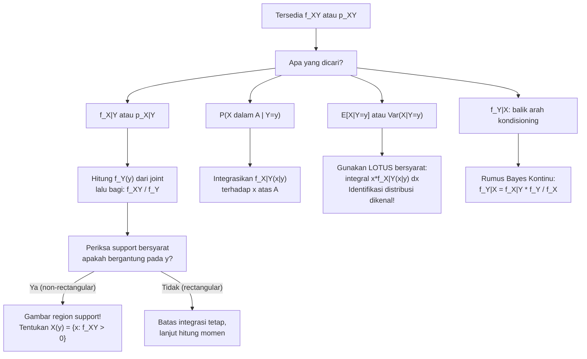

# 📊 3.3 — Distribusi Bersyarat (Conditional Distribution)

> [!ABSTRACT] Ringkasan Cepat
> **Topik:** Distribusi Bersyarat (Conditional Distribution) | **Bobot:** ~20–30% | **Difficulty:** Hard
> **Ref:** Hogg-McKean-Craig (2019) Bab 2.1–2.3; Miller et al. (2014) Bab 3.5–3.8, 4.6–4.9 | **Prereq:** [[3.1 Distribusi Gabungan (Joint Distribution)]], [[3.2 Distribusi Marginal]], [[1.4 Probabilitas Bersyarat]]

## Section 0 — Pemetaan Topik

| Topik CF2 | Sub-topik ID | Skill Diuji | Bobot | Difficulty | Prerequisite | Connected Topics | Referensi |
|-----------|--------------|-------------|-------|------------|--------------|------------------|-----------|
| Topik 3: Variabel Acak Multivariat | 3.3 | Menurunkan PMF/PDF bersyarat dari distribusi joint dan marginal; menghitung $P(X \in A \mid Y = y)$; menghitung $E[X \mid Y = y]$ dan $\text{Var}(X \mid Y = y)$; mengenali support bersyarat; membedakan distribusi bersyarat vs marginal; menerapkan rumus Bayes versi kontinu | 20–30% | Hard | [[3.1 Distribusi Gabungan (Joint Distribution)]], [[3.2 Distribusi Marginal]], [[1.4 Probabilitas Bersyarat]], [[2.1 Variabel Acak Diskrit]], [[2.2 Variabel Acak Kontinu]] | [[3.4 Nilai Harapan dan Variansi Bersyarat]], [[3.5 Independensi dan Korelasi]], [[3.7 Distribusi Majemuk (Compound Distribution)]], [[4.5 Estimasi Parameter]] | Hogg-McKean-Craig (2019) Bab 2.1–2.3; Miller et al. (2014) Bab 3.5–3.8, 4.6–4.9, 5.8–5.10 |

## Section 1 — Intuisi

Bayangkan seorang aktuaris yang menganalisis besarnya klaim asuransi kesehatan ($X$) dan usia tertanggung ($Y$). Distribusi marginal dari $X$ menggambarkan distribusi klaim untuk *semua nasabah* tanpa memilah usia. Namun intuisi kita mengatakan bahwa distribusi klaim untuk nasabah berusia 65 tahun tentu sangat berbeda dari distribusi klaim untuk nasabah berusia 25 tahun — nasabah yang lebih tua kemungkinan mengajukan klaim lebih besar dan lebih sering. Inilah yang ingin dijawab oleh **distribusi bersyarat**: bukan distribusi $X$ secara keseluruhan, melainkan distribusi $X$ *ketika kita sudah tahu* bahwa $Y = y$ untuk suatu nilai $y$ tertentu. Informasi tentang $Y$ "memperbarui" dan mempersempit pandangan kita tentang distribusi $X$.

Secara konseptual, distribusi bersyarat adalah perluasan langsung dari **probabilitas bersyarat** yang sudah dikenal di [[1.4 Probabilitas Bersyarat]]. Di sana, kita belajar bahwa $P(A \mid B) = P(A \cap B) / P(B)$ — probabilitas bersyarat adalah probabilitas irisan dibagi probabilitas kondisi. Untuk variabel acak, analogi persisnya adalah: $f_{X|Y}(x \mid y) = f_{X,Y}(x,y) / f_Y(y)$ — PDF bersyarat adalah PDF joint dibagi PDF marginal dari variabel yang dikondisikan. Rumus ini adalah inti dari seluruh topik. Yang membedakannya dari probabilitas bersyarat biasa adalah bahwa hasilnya bukan sebuah angka, melainkan sebuah **fungsi lengkap** — distribusi probabilitas penuh dari $X$ yang berlaku dalam "dunia di mana $Y = y$".

Dalam praktik aktuaria dan statistika, distribusi bersyarat adalah jantung dari pemodelan Bayesian, regresi, dan analisis risiko multivariat. Ketika seorang aktuaris menetapkan cadangan klaim berdasarkan informasi tambahan (usia, riwayat klaim, wilayah), mereka pada dasarnya bekerja dengan distribusi bersyarat. Memahami bagaimana cara menurunkan, menghitung momen, dan menginterpretasikan distribusi bersyarat adalah kunci untuk menguasai [[3.4 Nilai Harapan dan Variansi Bersyarat]] — di mana $E[X \mid Y]$ dan $\text{Var}(X \mid Y)$ menjadi variabel acak tersendiri yang memiliki distribusi dan momen mereka sendiri.

## Section 2 — Definisi Formal

> [!NOTE] Definisi Matematis
>
> Misalkan $(X, Y)$ adalah pasangan variabel acak. **Distribusi bersyarat** dari $X$ given $Y = y$ didefinisikan sebagai berikut.
>
> **Kasus Diskrit — PMF Bersyarat $X$ given $Y = y$:**
> $$
> p_{X|Y}(x \mid y) = P(X = x \mid Y = y) = \frac{p_{X,Y}(x,\, y)}{p_Y(y)}, \quad p_Y(y) > 0
> $$
>
> **Kasus Kontinu — PDF Bersyarat $X$ given $Y = y$:**
> $$
> f_{X|Y}(x \mid y) = \frac{f_{X,Y}(x,\, y)}{f_Y(y)}, \quad f_Y(y) > 0
> $$
>
> **CDF Bersyarat $X$ given $Y = y$ (kontinu):**
> $$
> F_{X|Y}(x \mid y) = P(X \leq x \mid Y = y) = \int_{-\infty}^{x} f_{X|Y}(t \mid y)\, dt
> $$
>
> **Nilai Harapan Bersyarat (Conditional Mean):**
> $$
> E[X \mid Y = y] = \begin{cases}
> \displaystyle\sum_{x \in \mathcal{X}} x\, p_{X|Y}(x \mid y) & \text{(diskrit)} \\[8pt]
> \displaystyle\int_{-\infty}^{\infty} x\, f_{X|Y}(x \mid y)\, dx & \text{(kontinu)}
> \end{cases}
> $$
>
> **Variansi Bersyarat (Conditional Variance):**
> $$
> \text{Var}(X \mid Y = y) = E[X^2 \mid Y = y] - \bigl(E[X \mid Y = y]\bigr)^2
> $$

### Variabel & Parameter

| Simbol | Makna | Catatan |
|--------|-------|---------|
| $X, Y$ | Variabel acak dalam pasangan $(X, Y)$ | $X$ adalah variabel yang dikondisikan; $Y$ adalah kondisi |
| $y$ | Nilai spesifik yang dikondisikan | $y$ harus berada pada support $\mathcal{Y}$ dengan $f_Y(y) > 0$ |
| $p_{X|Y}(x \mid y)$ | PMF bersyarat $X$ given $Y = y$ | Fungsi $x$ untuk $y$ tetap; berlaku sebagai PMF valid dalam $x$ |
| $f_{X|Y}(x \mid y)$ | PDF bersyarat $X$ given $Y = y$ | Fungsi $x$ untuk $y$ tetap; berlaku sebagai PDF valid dalam $x$ |
| $F_{X|Y}(x \mid y)$ | CDF bersyarat $X$ given $Y = y$ | $F_{X|Y}(x \mid y) = \int_{-\infty}^x f_{X|Y}(t \mid y)\,dt$ |
| $E[X \mid Y = y]$ | Nilai harapan bersyarat (angka) | Fungsi dari $y$; untuk setiap nilai $y$, menghasilkan satu angka |
| $E[X \mid Y]$ | Nilai harapan bersyarat (variabel acak) | Fungsi dari variabel acak $Y$; ini sendiri adalah variabel acak |
| $\text{Var}(X \mid Y = y)$ | Variansi bersyarat (angka) | Fungsi dari $y$; untuk setiap $y$, menghasilkan satu angka non-negatif |
| $\text{Var}(X \mid Y)$ | Variansi bersyarat (variabel acak) | Fungsi dari variabel acak $Y$; ini sendiri adalah variabel acak |
| $\mathcal{X}(y)$ | Support bersyarat dari $X$ given $Y = y$ | Bisa bergantung pada $y$, terutama jika support joint non-rectangular |

### Rumus Utama

$$
f_{X|Y}(x \mid y) = \frac{f_{X,Y}(x, y)}{f_Y(y)}, \quad f_Y(y) > 0
$$
**Label: Definisi PDF Bersyarat** — fondasi dari seluruh topik; PDF bersyarat adalah PDF joint dibagi PDF marginal dari variabel yang dikondisikan, dievaluasi pada nilai kondisi $y$.

$$
p_{X|Y}(x \mid y) = \frac{p_{X,Y}(x, y)}{p_Y(y)}, \quad p_Y(y) > 0
$$
**Label: Definisi PMF Bersyarat** — analogi diskrit; sama persis strukturnya dengan definisi kontinu.

$$
\int_{-\infty}^{\infty} f_{X|Y}(x \mid y)\, dx = 1 \quad \text{dan} \quad f_{X|Y}(x \mid y) \geq 0
$$
**Label: Validitas Distribusi Bersyarat** — untuk setiap $y$ tetap, distribusi bersyarat adalah distribusi probabilitas yang sah; integral (atau jumlah) terhadap $x$ harus = 1.

$$
f_{X,Y}(x, y) = f_{X|Y}(x \mid y) \cdot f_Y(y) = f_{Y|X}(y \mid x) \cdot f_X(x)
$$
**Label: Faktorisasi Joint** — distribusi joint dapat ditulis sebagai produk distribusi bersyarat dan distribusi marginal; ini adalah analog kontinu dari $P(A \cap B) = P(A \mid B) P(B)$.

$$
f_{Y|X}(y \mid x) = \frac{f_{X|Y}(x \mid y)\, f_Y(y)}{f_X(x)}
$$
**Label: Rumus Bayes Kontinu** — membalik arah kondisioning; ekuivalen dengan Teorema Bayes untuk distribusi kontinu (lihat [[1.6 Teorema Bayes dan Hukum Probabilitas Total]]).

$$
E[g(X) \mid Y = y] = \int_{-\infty}^{\infty} g(x)\, f_{X|Y}(x \mid y)\, dx
$$
**Label: LOTUS Bersyarat** — nilai harapan bersyarat dari fungsi $g(X)$ dihitung menggunakan PDF bersyarat, persis seperti LOTUS untuk distribusi univariat biasa.

$$
\text{Var}(X \mid Y = y) = E[X^2 \mid Y = y] - \bigl(E[X \mid Y = y]\bigr)^2
$$
**Label: Rumus Komputasional Variansi Bersyarat** — selalu lebih efisien dari definisi langsung $E[(X - E[X|Y=y])^2 \mid Y=y]$.

### Asumsi Eksplisit

- **$f_Y(y) > 0$:** Distribusi bersyarat hanya terdefinisi pada nilai $y$ di mana $f_Y(y) > 0$. Mengkondisikan pada kejadian probabilitas nol (untuk variabel kontinu, $P(Y = y) = 0$) memerlukan argumen limit yang hati-hati — definisi via densitas menghindari masalah ini.
- **Support bersyarat bergantung pada $y$:** Himpunan $\mathcal{X}(y) = \{x : f_{X,Y}(x,y) > 0\}$ dapat bergantung pada nilai $y$ jika support joint non-rectangular. Momen bersyarat harus diintegrasikan atas $\mathcal{X}(y)$, bukan selalu $(-\infty, \infty)$.
- **Existensi momen bersyarat:** $E[X \mid Y = y]$ terdefinisi jika $\int |x| f_{X|Y}(x \mid y)\,dx < \infty$; kondisi ini harus diperiksa untuk distribusi dengan ekor berat.

## Section 3 — Jembatan Logika

> [!TIP] Dari Definisi ke Rumus
> Ingat definisi probabilitas bersyarat klasik dari [[1.4 Probabilitas Bersyarat]]: $P(A \mid B) = P(A \cap B) / P(B)$. Untuk variabel acak kontinu, kejadian $\{Y = y\}$ memiliki probabilitas nol (karena $Y$ kontinu), sehingga kita tidak bisa langsung menerapkan rumus ini. Jalan keluarnya adalah bekerja dengan **densitas**, bukan probabilitas langsung. Secara intuitif, kita mendekati $\{Y = y\}$ dengan interval $\{y < Y \leq y + \delta\}$ untuk $\delta$ kecil, menghitung probabilitas bersyarat dalam limit $\delta \to 0$, dan hasil limitnya adalah rasio densitas: $f_{X|Y}(x \mid y) = f_{X,Y}(x,y) / f_Y(y)$. Rumus ini persis analog dengan $P(A \mid B) = P(A \cap B) / P(B)$, hanya dalam bahasa densitas.
>
> Setelah distribusi bersyarat $f_{X|Y}(x \mid y)$ diperoleh, ia berlaku sebagai **distribusi univariat biasa** dalam variabel $x$ dengan parameter $y$ yang dipegang tetap. Semua teknik dari [[2.2 Variabel Acak Kontinu]] dapat langsung diterapkan: menghitung probabilitas via integral, mean via $\int x f_{X|Y}$, variansi via rumus komputasional, dan seterusnya.

> [!IMPORTANT] Support Bersyarat dan Batas Integrasi
> Support bersyarat $\mathcal{X}(y) = \{x : f_{X,Y}(x,y) > 0\}$ **dapat bergantung pada $y$**. Ini terjadi kapanpun support joint adalah region non-rectangular.
>
> **Contoh:** Jika support joint adalah $\{0 < x < y < 1\}$, maka:
> - $\mathcal{X}(y) = (0, y)$ untuk $y \in (0,1)$ — support bersyarat $X$ given $Y = y$ adalah $(0,y)$, yang menyempit ketika $y$ kecil.
> - $\mathcal{Y}(x) = (x, 1)$ untuk $x \in (0,1)$ — support bersyarat $Y$ given $X = x$ adalah $(x,1)$.
>
> Ketika menghitung $E[X \mid Y = y]$, batas integrasi harus menggunakan $\mathcal{X}(y)$, bukan $(-\infty, \infty)$.

**Derivasi PDF Bersyarat dari Prinsip Pertama:**

Tujuan: mendefinisikan distribusi $X$ ketika diketahui $Y \approx y$. Untuk $\delta > 0$ kecil, gunakan definisi probabilitas bersyarat:

$$
P(X \leq x \mid y < Y \leq y + \delta) = \frac{P(X \leq x,\; y < Y \leq y + \delta)}{P(y < Y \leq y + \delta)}
$$

Pembilang: $\displaystyle P(X \leq x,\; y < Y \leq y+\delta) \approx \int_{-\infty}^{x} f_{X,Y}(u, y)\, du \cdot \delta$

Penyebut: $\displaystyle P(y < Y \leq y+\delta) \approx f_Y(y) \cdot \delta$

Ambil limit $\delta \to 0$:

$$
F_{X|Y}(x \mid y) = \lim_{\delta \to 0} \frac{\int_{-\infty}^{x} f_{X,Y}(u, y)\, du \cdot \delta}{f_Y(y) \cdot \delta} = \frac{\int_{-\infty}^{x} f_{X,Y}(u, y)\, du}{f_Y(y)}
$$

Diferensiasikan terhadap $x$:

$$
f_{X|Y}(x \mid y) = \frac{\partial}{\partial x} F_{X|Y}(x \mid y) = \frac{f_{X,Y}(x, y)}{f_Y(y)}
$$

Ini menunjukkan bahwa definisi PDF bersyarat adalah **satu-satunya** pilihan yang konsisten dengan definisi probabilitas bersyarat standar.

**Verifikasi bahwa $f_{X|Y}(\cdot \mid y)$ adalah PDF valid:**

$$
\int_{-\infty}^{\infty} f_{X|Y}(x \mid y)\, dx = \int_{-\infty}^{\infty} \frac{f_{X,Y}(x, y)}{f_Y(y)}\, dx = \frac{1}{f_Y(y)} \int_{-\infty}^{\infty} f_{X,Y}(x, y)\, dx = \frac{f_Y(y)}{f_Y(y)} = 1 \checkmark
$$

di mana langkah ketiga menggunakan definisi PDF marginal $f_Y(y) = \int f_{X,Y}(x,y)\,dx$.

> [!DANGER] Dilarang
> 1. **Dilarang membalik penyebut:** $f_{X|Y}(x \mid y) = f_{X,Y}(x,y) / f_Y(y)$ — penyebutnya adalah marginal dari **variabel yang dikondisikan** ($Y$), bukan marginal dari variabel yang dicari ($X$). Menulis $f_{X,Y}(x,y) / f_X(x)$ menghasilkan $f_{Y|X}(y \mid x)$, yaitu distribusi bersyarat yang **berlawanan arah**.
> 2. **Dilarang mengintegrasikan distribusi bersyarat terhadap $y$:** Distribusi bersyarat $f_{X|Y}(x \mid y)$ adalah fungsi dari $x$ (untuk $y$ tetap); mengintegrasikannya terhadap $y$ tidak menghasilkan apapun yang bermakna. Integrasi bermakna hanya terhadap $x$ (untuk memperoleh probabilitas atau momen bersyarat).
> 3. **Dilarang menyamakan $E[X \mid Y = y]$ dengan $E[X]$:** Kecuali $X$ dan $Y$ independen, nilai harapan bersyarat bergantung pada $y$ dan umumnya berbeda dari nilai harapan marginal $E[X]$. Kesamaan $E[X \mid Y = y] = E[X]$ untuk semua $y$ adalah *karakterisasi* independensi, bukan asumsi default.

## Section 4 — Contoh Soal

### Soal A — Fundamental

Misalkan $(X, Y)$ adalah pasangan variabel acak diskrit dengan PMF joint:

| $p_{X,Y}(x,y)$ | $Y=1$ | $Y=2$ | $Y=3$ |
|:---:|:---:|:---:|:---:|
| $X=0$ | 0.05 | 0.10 | 0.15 |
| $X=1$ | 0.20 | 0.25 | 0.05 |
| $X=2$ | 0.10 | 0.05 | 0.05 |

**(a)** Tentukan PMF bersyarat $p_{X|Y}(x \mid Y = 2)$.
**(b)** Hitung $E[X \mid Y = 2]$ dan $\text{Var}(X \mid Y = 2)$.

> [!SUCCESS] Solusi Soal A
>
> **1. Identifikasi Variabel**
> - $\mathcal{X} = \{0, 1, 2\}$, $\mathcal{Y} = \{1, 2, 3\}$
> - Kondisi: $Y = 2$; kita bekerja di kolom $Y = 2$ pada tabel joint.
> - Total probabilitas: $0.05+0.10+0.15+0.20+0.25+0.05+0.10+0.05+0.05 = 1.00$ ✓
>
> **2. Identifikasi Distribusi / Model**
> - PMF joint diskrit eksplisit. Distribusi bersyarat diperoleh dari definisi:
> $$p_{X|Y}(x \mid y) = \frac{p_{X,Y}(x, y)}{p_Y(y)}$$
> - Langkah pertama: hitung $p_Y(2)$ (marginal $Y$ di $y=2$).
>
> **3. Setup Persamaan**
> $$p_Y(2) = \sum_{x \in \{0,1,2\}} p_{X,Y}(x, 2)$$
> $$p_{X|Y}(x \mid 2) = \frac{p_{X,Y}(x,\, 2)}{p_Y(2)}, \quad x \in \{0,1,2\}$$
>
> **4. Eksekusi Aljabar**
>
> *Marginal $p_Y(2)$:*
> $$p_Y(2) = p_{X,Y}(0,2) + p_{X,Y}(1,2) + p_{X,Y}(2,2) = 0.10 + 0.25 + 0.05 = 0.40$$
>
> *PMF Bersyarat $p_{X|Y}(x \mid 2)$:*
> $$p_{X|Y}(0 \mid 2) = \frac{0.10}{0.40} = 0.25$$
> $$p_{X|Y}(1 \mid 2) = \frac{0.25}{0.40} = 0.625$$
> $$p_{X|Y}(2 \mid 2) = \frac{0.05}{0.40} = 0.125$$
> Cek: $0.25 + 0.625 + 0.125 = 1.000$ ✓
>
> *Nilai Harapan Bersyarat $E[X \mid Y = 2]$:*
> $$E[X \mid Y=2] = 0(0.25) + 1(0.625) + 2(0.125) = 0 + 0.625 + 0.250 = 0.875$$
>
> *$E[X^2 \mid Y = 2]$ via LOTUS Bersyarat:*
> $$E[X^2 \mid Y=2] = 0^2(0.25) + 1^2(0.625) + 2^2(0.125) = 0 + 0.625 + 0.500 = 1.125$$
>
> *Variansi Bersyarat $\text{Var}(X \mid Y = 2)$:*
> $$\text{Var}(X \mid Y=2) = E[X^2 \mid Y=2] - \bigl(E[X \mid Y=2]\bigr)^2 = 1.125 - (0.875)^2 = 1.125 - 0.765625 = 0.359375$$
>
> **5. Verification**
> - PMF bersyarat valid: semua nilai $\geq 0$ dan jumlah = 1 ✓
> - $E[X \mid Y=2] = 0.875$ berada di dalam support $\{0, 1, 2\}$ ✓
> - Distribusi bersyarat lebih terkonsentrasi di $X=1$ (bobot $0.625$), sehingga mean mendekati 1 dan variansi relatif kecil — masuk akal ✓

> [!WARNING] Exam Tips — Soal A
> - **Target waktu:** 4–5 menit.
> - **Common trap:** Lupa menghitung $p_Y(y)$ terlebih dahulu dan langsung menggunakan nilai-nilai kolom joint sebagai PMF bersyarat. Nilai-nilai kolom *belum* dinormalisasi — mereka harus dibagi $p_Y(y)$.
> - **Shortcut:** Jika soal hanya meminta PMF bersyarat tanpa momen, cukup bagi seluruh kolom dengan total kolom — lebih cepat dari menerapkan rumus satu per satu.
> - **Cek cepat:** Jumlah nilai PMF bersyarat harus = 1; jika tidak, ada kesalahan pada $p_Y(y)$ atau pembagian.

---

### Soal B — Exam-Typical

Misalkan $(X, Y)$ memiliki PDF joint:

$$
f_{X,Y}(x, y) = \begin{cases} \dfrac{3}{2}(x^2 + y^2) & 0 < x < 1,\; 0 < y < 1 \\ 0 & \text{lainnya} \end{cases}
$$

**(a)** Tentukan PDF bersyarat $f_{X|Y}(x \mid y)$.
**(b)** Hitung $P\!\left(X > \tfrac{1}{2} \mid Y = \tfrac{1}{3}\right)$.
**(c)** Hitung $E\!\left[X \mid Y = \tfrac{1}{3}\right]$.

> [!SUCCESS] Solusi Soal B
>
> **1. Identifikasi Variabel**
> - Support joint: $\{(x,y) : 0 < x < 1,\; 0 < y < 1\}$ — persegi satuan (rectangular support).
> - Kondisi: $Y = 1/3$; support bersyarat $X$ given $Y = 1/3$ adalah $(0, 1)$ (tidak bergantung pada $y$ karena support rectangular).
>
> **2. Identifikasi Distribusi / Model**
> - PDF joint kontinu dengan support rectangular. Karena support rectangular, PDF marginal $f_Y(y)$ memiliki batas integrasi tetap $(0,1)$.
>
> **3. Setup Persamaan**
> $$f_Y(y) = \int_0^1 \frac{3}{2}(x^2 + y^2)\, dx, \quad 0 < y < 1$$
> $$f_{X|Y}(x \mid y) = \frac{f_{X,Y}(x,y)}{f_Y(y)} = \frac{\frac{3}{2}(x^2 + y^2)}{f_Y(y)}, \quad 0 < x < 1$$
>
> **4. Eksekusi Aljabar**
>
> *PDF Marginal $f_Y(y)$:*
> $$f_Y(y) = \frac{3}{2}\int_0^1 (x^2 + y^2)\, dx = \frac{3}{2}\left[\frac{x^3}{3} + y^2 x\right]_0^1 = \frac{3}{2}\left(\frac{1}{3} + y^2\right) = \frac{1}{2} + \frac{3y^2}{2}, \quad 0 < y < 1$$
>
> *PDF Bersyarat $f_{X|Y}(x \mid y)$:*
> $$f_{X|Y}(x \mid y) = \frac{\frac{3}{2}(x^2 + y^2)}{\frac{1}{2} + \frac{3y^2}{2}} = \frac{\frac{3}{2}(x^2 + y^2)}{\frac{1 + 3y^2}{2}} = \frac{3(x^2 + y^2)}{1 + 3y^2}, \quad 0 < x < 1$$
>
> **(b)** Evaluasikan pada $y = 1/3$:
>
> $$1 + 3\left(\frac{1}{3}\right)^2 = 1 + 3 \cdot \frac{1}{9} = 1 + \frac{1}{3} = \frac{4}{3}$$
>
> $$f_{X|Y}\!\left(x \mid \tfrac{1}{3}\right) = \frac{3\!\left(x^2 + \frac{1}{9}\right)}{\frac{4}{3}} = \frac{9}{4}\left(x^2 + \frac{1}{9}\right) = \frac{9x^2 + 1}{4}, \quad 0 < x < 1$$
>
> Cek: $\int_0^1 \frac{9x^2+1}{4}\,dx = \frac{1}{4}[3x^3 + x]_0^1 = \frac{1}{4}(3+1) = 1$ ✓
>
> $$P\!\left(X > \tfrac{1}{2} \;\Big|\; Y = \tfrac{1}{3}\right) = \int_{1/2}^{1} \frac{9x^2+1}{4}\,dx = \frac{1}{4}\left[3x^3 + x\right]_{1/2}^{1}$$
> $$= \frac{1}{4}\left[(3 + 1) - \left(\frac{3}{8} + \frac{1}{2}\right)\right] = \frac{1}{4}\left[4 - \frac{7}{8}\right] = \frac{1}{4} \cdot \frac{25}{8} = \frac{25}{32}$$
>
> **(c)** Menghitung $E[X \mid Y = 1/3]$:
> $$E\!\left[X \mid Y = \tfrac{1}{3}\right] = \int_0^1 x \cdot \frac{9x^2 + 1}{4}\, dx = \frac{1}{4}\int_0^1 (9x^3 + x)\, dx = \frac{1}{4}\left[\frac{9x^4}{4} + \frac{x^2}{2}\right]_0^1 = \frac{1}{4}\left(\frac{9}{4} + \frac{1}{2}\right) = \frac{1}{4} \cdot \frac{11}{4} = \frac{11}{16}$$
>
> **5. Verification**
> - PDF bersyarat dievaluasi pada $y=1/3$ menghasilkan $(9x^2+1)/4 \geq 0$ untuk $x \in (0,1)$ ✓
> - Integral = 1 ✓
> - $E[X \mid Y=1/3] = 11/16 = 0.6875$: karena PDF bersyarat $\propto 9x^2 + 1$ lebih berat di nilai $x$ besar, mean di atas $0.5$ masuk akal ✓
> - $P(X > 1/2 \mid Y = 1/3) = 25/32 \approx 0.78 > 0.5$: konsisten dengan mean $> 0.5$ ✓

> [!WARNING] Exam Tips — Soal B
> - **Target waktu:** 8–10 menit.
> - **Common trap:** Lupa menghitung $f_Y(y)$ secara umum (sebagai fungsi $y$) sebelum mengevaluasinya di $y = 1/3$. Lebih efisien dan lebih jarang salah dibanding langsung mengevaluasi di $y=1/3$ di setiap langkah.
> - **Shortcut:** Setelah memperoleh $f_{X|Y}(x \mid y)$ dalam bentuk umum, substitusi $y = 1/3$ sekali saja di awal bagian (b), lalu lakukan semua integrasi menggunakan bentuk yang sudah disubstitusi.
> - **Cek cepat:** Setelah mendapatkan $f_{X|Y}(x \mid y)$, verifikasi bahwa $\int_0^1 f_{X|Y}(x \mid y)\,dx = 1$ sebelum menghitung probabilitas atau momen — ini mendeteksi kesalahan dalam $f_Y(y)$.

---

### Soal C — Challenging

Misalkan $(X, Y)$ memiliki PDF joint:

$$
f_{X,Y}(x, y) = \begin{cases} 2e^{-x-y} & 0 < y < x < \infty \\ 0 & \text{lainnya} \end{cases}
$$

**(a)** Tentukan PDF marginal $f_X(x)$ dan $f_Y(y)$.
**(b)** Tentukan PDF bersyarat $f_{X|Y}(x \mid y)$ dan $f_{Y|X}(y \mid x)$.
**(c)** Identifikasi distribusi dari $(X \mid Y = y)$ dan $(Y \mid X = x)$ beserta parameternya.
**(d)** Hitung $E[X \mid Y = y]$ dan $\text{Var}(X \mid Y = y)$.

> [!SUCCESS] Solusi Soal C
>
> **1. Identifikasi Variabel**
> - Support joint: $\{(x,y) : 0 < y < x < \infty\}$ — region di atas garis $y=0$ dan di bawah garis $y=x$ (segitiga tak hingga).
> - Support bersyarat $X$ given $Y = y$: $\mathcal{X}(y) = (y, \infty)$ — karena $x > y$, batas bawah bergantung pada $y$.
> - Support bersyarat $Y$ given $X = x$: $\mathcal{Y}(x) = (0, x)$ — karena $y < x$, batas atas bergantung pada $x$.
>
> **2. Identifikasi Distribusi / Model**
> - Distribusi kontinu bivariat dengan support non-rectangular.
> - Akan terlihat bahwa distribusi bersyarat memiliki bentuk distribusi yang dikenal (distribusi eksponensial yang digeser).
>
> **3. Setup Persamaan**
>
> *Marginal $f_X(x)$: integrasikan $y$ dari $0$ hingga $x$:*
> $$f_X(x) = \int_0^x 2e^{-x-y}\,dy, \quad x > 0$$
>
> *Marginal $f_Y(y)$: integrasikan $x$ dari $y$ hingga $\infty$:*
> $$f_Y(y) = \int_y^{\infty} 2e^{-x-y}\,dx, \quad y > 0$$
>
> **4. Eksekusi Aljabar**
>
> **(a) PDF Marginal $f_X(x)$:**
> $$f_X(x) = 2e^{-x}\int_0^x e^{-y}\,dy = 2e^{-x}\left[-e^{-y}\right]_0^x = 2e^{-x}(1 - e^{-x}) = 2(e^{-x} - e^{-2x}), \quad x > 0$$
>
> *PDF Marginal $f_Y(y)$:*
> $$f_Y(y) = 2e^{-y}\int_y^{\infty} e^{-x}\,dx = 2e^{-y}\left[-e^{-x}\right]_y^{\infty} = 2e^{-y} \cdot e^{-y} = 2e^{-2y}, \quad y > 0$$
>
> Perhatikan: $f_Y(y) = 2e^{-2y}$ adalah PDF distribusi $\text{Exp}(2)$ (dengan parameter laju 2).
>
> **(b) PDF Bersyarat $f_{X|Y}(x \mid y)$:**
> $$f_{X|Y}(x \mid y) = \frac{f_{X,Y}(x,y)}{f_Y(y)} = \frac{2e^{-x-y}}{2e^{-2y}} = \frac{e^{-x-y}}{e^{-2y}} = e^{-x+y} = e^{-(x-y)}, \quad x > y$$
>
> *PDF Bersyarat $f_{Y|X}(y \mid x)$:*
> $$f_{Y|X}(y \mid x) = \frac{f_{X,Y}(x,y)}{f_X(x)} = \frac{2e^{-x-y}}{2(e^{-x} - e^{-2x})} = \frac{e^{-x-y}}{e^{-x}(1-e^{-x})} = \frac{e^{-y}}{1-e^{-x}}, \quad 0 < y < x$$
>
> **(c) Identifikasi Distribusi:**
>
> *Distribusi $(X \mid Y = y)$:*
>
> $f_{X|Y}(x \mid y) = e^{-(x-y)}$ untuk $x > y$. Misalkan $Z = X - y$, maka $f_Z(z) = e^{-z}$ untuk $z > 0$ — ini adalah PDF $\text{Exp}(1)$. Oleh karena itu:
> $$\bigl(X \mid Y = y\bigr) \sim \text{Exp}(1) + y \quad \text{(distribusi Eksponensial digeser/shifted)}$$
> Artinya: $X - y \mid Y = y \sim \text{Exp}(1)$, dengan PDF $e^{-z}$ untuk $z > 0$.
>
> *Distribusi $(Y \mid X = x)$:*
>
> $f_{Y|X}(y \mid x) = \frac{e^{-y}}{1-e^{-x}}$ untuk $0 < y < x$. Ini adalah **distribusi Eksponensial terpotong (truncated exponential)** dengan parameter laju 1, terpotong pada interval $(0, x)$.
>
> **(d) Menghitung $E[X \mid Y = y]$ dan $\text{Var}(X \mid Y = y)$:**
>
> Karena $X \mid Y = y$ adalah distribusi Eksponensial yang digeser: $X = y + Z$ dengan $Z \sim \text{Exp}(1)$, maka:
>
> $$E[X \mid Y = y] = y + E[Z] = y + 1$$
>
> $$\text{Var}(X \mid Y = y) = \text{Var}(Z) = 1$$
>
> Verifikasi langsung via integrasi:
> $$E[X \mid Y=y] = \int_y^{\infty} x \cdot e^{-(x-y)}\,dx$$
>
> Substitusi $u = x - y$, $du = dx$, $x = u + y$:
> $$= \int_0^{\infty} (u+y) e^{-u}\,du = \int_0^{\infty} u e^{-u}\,du + y\int_0^{\infty} e^{-u}\,du = 1 + y$$
>
> Sehingga $E[X \mid Y=y] = y + 1$ ✓
>
> **5. Verification**
> - $\int_0^{\infty} f_Y(y)\,dy = \int_0^{\infty} 2e^{-2y}\,dy = 1$ ✓
> - $\int_y^{\infty} f_{X|Y}(x \mid y)\,dx = \int_y^{\infty} e^{-(x-y)}\,dx = [-e^{-(x-y)}]_y^{\infty} = 1$ ✓
> - $E[X \mid Y=y] = y+1 > y$: masuk akal karena $X > Y = y$ hampir pasti (support $x > y$) ✓
> - $\text{Var}(X \mid Y=y) = 1$: tidak bergantung pada $y$, yang adalah sifat khas distribusi eksponensial (memoryless property) ✓

> [!WARNING] Exam Tips — Soal C
> - **Target waktu:** 12–15 menit.
> - **Common trap — batas integrasi marginal:** Marginal $f_X(x)$ harus mengintegrasikan $y$ dari $0$ hingga $x$ (bukan $0$ hingga $\infty$); marginal $f_Y(y)$ mengintegrasikan $x$ dari $y$ hingga $\infty$ (bukan $0$ hingga $\infty$). Kesalahan batas menghasilkan fungsi yang bukan PDF valid.
> - **Strategi identifikasi distribusi:** Setelah mendapatkan $f_{X|Y}(x \mid y)$, periksa bentuknya sebagai fungsi $x$ saja (anggap $y$ konstanta). Jika berbentuk $e^{-(x-y)}$ untuk $x > y$, ini adalah eksponensial digeser. Identifikasi distribusi yang dikenal menghemat waktu integrasi signifikan.
> - **Shortcut momen:** Jika distribusi bersyarat teridentifikasi (Eksponensial, Normal, Gamma, dll.), langsung gunakan rumus momen distribusi tersebut alih-alih menghitung integral dari awal.

## Section 5 — Verifikasi & Sanity Check

> [!CHECK] Validasi Distribusi Bersyarat
> - Untuk setiap $y$ tetap, verifikasi: $\int_{-\infty}^{\infty} f_{X|Y}(x \mid y)\,dx = 1$ (atau $\sum_x p_{X|Y}(x \mid y) = 1$ untuk kasus diskrit).
> - Semua nilai $f_{X|Y}(x \mid y) \geq 0$ pada support bersyarat $\mathcal{X}(y)$.
> - $E[X \mid Y = y]$ harus berada dalam rentang support bersyarat $\mathcal{X}(y)$ untuk setiap $y$.

> [!CHECK] Konsistensi Faktorisasi Joint
> - Verifikasi bahwa $f_{X|Y}(x \mid y) \cdot f_Y(y) = f_{X,Y}(x,y)$ untuk semua $(x,y)$ pada support joint.
> - Demikian pula: $f_{Y|X}(y \mid x) \cdot f_X(x) = f_{X,Y}(x,y)$.
> - Kedua verifikasi ini mendeteksi kesalahan dalam menghitung marginal atau distribusi bersyarat.

> [!CHECK] Cek Independensi via Distribusi Bersyarat
> - $X$ dan $Y$ independen jika dan hanya jika $f_{X|Y}(x \mid y) = f_X(x)$ untuk semua $(x, y)$ — distribusi bersyarat sama dengan distribusi marginal.
> - Ekuivalen: $f_{X|Y}(x \mid y)$ tidak bergantung pada $y$ sama sekali.
> - Jika $f_{X|Y}(x \mid y)$ masih mengandung $y$ setelah penyederhanaan, maka $X$ dan $Y$ tidak independen.

> [!CHECK] Konsistensi Mean Bersyarat dengan Mean Marginal
> - Hukum Ekspektasi Total (dibahas di [[3.4 Nilai Harapan dan Variansi Bersyarat]]): $E[E[X \mid Y]] = E[X]$.
> - Ini bisa digunakan sebagai sanity check: hitung $E[X]$ dari marginal, dan hitung $E[E[X \mid Y]] = \int E[X \mid Y=y] f_Y(y)\,dy$ — keduanya harus sama.

### Metode Alternatif

**Mengidentifikasi distribusi bersyarat dari bentuk fungsional:** Ketika $f_{X|Y}(x \mid y)$ memiliki bentuk yang mirip distribusi yang dikenal (Eksponensial, Gamma, Normal, Beta), identifikasi distribusi tersebut dan gunakan rumus momennya langsung. Ini jauh lebih efisien daripada menghitung integral dari awal. Kunci: lihat $f_{X|Y}(x \mid y)$ sebagai **fungsi $x$ saja** (anggap $y$ konstanta) dan cocokkan dengan kernel distribusi yang dikenal.

**Rumus Bayes Kontinu untuk membalik kondisioning:**

$$
f_{Y|X}(y \mid x) = \frac{f_{X|Y}(x \mid y)\, f_Y(y)}{f_X(x)} = \frac{f_{X|Y}(x \mid y)\, f_Y(y)}{\int f_{X|Y}(x \mid y')\, f_Y(y')\, dy'}
$$

Ini berguna ketika diketahui $f_{X|Y}$ dan $f_Y$, dan ingin mendapatkan $f_{Y|X}$ tanpa harus menghitung $f_{X,Y}$ secara eksplisit.

## Section 6 — Visualisasi Mental

**Bayangkan irisan vertikal permukaan joint:** PDF joint $f_{X,Y}(x,y)$ adalah permukaan tiga dimensi. Ketika kita memotong permukaan ini dengan bidang vertikal $Y = y$ (bidang tegak lurus sumbu-Y di posisi $y$), kita mendapat kurva satu dimensi. Kurva irisan ini **proporsional** dengan $f_{X|Y}(x \mid y)$ — persis berbentuk distribusi bersyarat, hanya perlu dinormalisasi (dibagi $f_Y(y)$) agar luas di bawahnya = 1. Sumbu horizontal adalah nilai $x$; sumbu vertikal adalah densitas bersyarat.

**Untuk kasus diskrit, bayangkan memilih satu kolom dari tabel joint:** Kolom $Y = y$ berisi nilai-nilai $p_{X,Y}(x,y)$ untuk berbagai $x$. Nilai-nilai ini **belum** merupakan PMF yang valid (jumlahnya = $p_Y(y) \neq 1$ umumnya). Distribusi bersyarat diperoleh dengan **menskalakan** (rescaling) kolom tersebut agar jumlahnya = 1, yaitu membagi setiap entri dengan total kolom $p_Y(y)$. Secara visual, kita "memfokuskan perhatian" ke baris yang sesuai dengan $Y = y$ dan memperbarui probabilitas secara proporsional.

**Efek kondisioning pada bentuk distribusi:** Ketika $X$ dan $Y$ berkorelasi positif (nilai besar $Y$ cenderung disertai nilai besar $X$), maka distribusi bersyarat $f_{X|Y}(\cdot \mid y)$ untuk $y$ besar akan "bergeser ke kanan" dibandingkan distribusi marginal $f_X$. Distribusi bersyarat untuk $y$ kecil akan "bergeser ke kiri". Semakin kuat korelasi, semakin besar pergeseran ini.

### Hubungan Visual ↔ Rumus

Irisan permukaan joint di $Y = y$ → renormalisasi → PDF bersyarat:
$$
f_{X|Y}(x \mid y) = \underbrace{\frac{f_{X,Y}(x,y)}{f_Y(y)}}_{\text{irisan dibagi tinggi total irisan}}
$$

Pergeseran mean bersyarat akibat korelasi:
$$
E[X \mid Y = y] \neq E[X] \iff \text{Cov}(X, Y) \neq 0 \quad \text{(umumnya)}
$$

Renormalisasi kolom tabel diskrit:
$$
p_{X|Y}(x \mid y) = \frac{p_{X,Y}(x,y)}{p_Y(y)} \longleftrightarrow \frac{\text{entri kolom}}{\text{total kolom}}
$$

## Section 7 — Jebakan Umum

> [!BUG] Kesalahan Parametrisasi
> **Kesalahan Arah Kondisioning:**
>
> *Salah:* Menghitung $f_{X|Y}(x \mid y) = f_{X,Y}(x,y) / f_X(x)$
>
> *Benar:* $f_{X|Y}(x \mid y) = f_{X,Y}(x,y) / f_Y(y)$
>
> Penyebut selalu adalah marginal dari **variabel yang dikondisikan** (yang berada setelah garis vertikal "$\mid$"). Jika mengkondisikan pada $Y = y$, penyebutnya adalah $f_Y(y)$. Menggunakan $f_X(x)$ sebagai penyebut menghasilkan $f_{Y|X}(y \mid x)$ — distribusi bersyarat yang berlawanan arah.
>
> **Kesalahan Support Bersyarat Non-Rectangular:**
>
> *Salah:* Mengintegrasikan $\int_{-\infty}^{\infty} f_{X|Y}(x \mid y)\,dx$ dengan batas $\pm\infty$ ketika support bersyarat adalah $(y, \infty)$ atau $(0, y)$.
>
> *Benar:* Integrasikan hanya atas support bersyarat $\mathcal{X}(y)$, yang bergantung pada $y$ untuk support joint non-rectangular.

> [!BUG] Kesalahan Konseptual
> 1. **Menggunakan marginal sebagai bersyarat.** $f_X(x)$ dan $f_{X|Y}(x \mid y)$ adalah fungsi yang berbeda kecuali $X \perp Y$. Marginal adalah rata-rata dari semua kondisi; bersyarat adalah untuk kondisi spesifik.
> 2. **Mengira $E[X \mid Y = y]$ tidak bergantung pada $y$.** Untuk variabel yang tidak independen, $E[X \mid Y = y]$ adalah fungsi dari $y$ — nilai yang berbeda dari $y$ umumnya menghasilkan nilai harapan bersyarat yang berbeda.
> 3. **Menghitung $\text{Var}(X \mid Y = y)$ dengan rumus $E[X^2] - (E[X])^2$ menggunakan momen marginal.** Yang benar: $\text{Var}(X \mid Y = y) = E[X^2 \mid Y=y] - (E[X \mid Y=y])^2$ — semua momen harus bersyarat pada $Y = y$.
> 4. **Mengira distribusi bersyarat selalu mempunyai bentuk yang sama dengan joint.** Contoh: joint bisa tidak termasuk distribusi keluarga tertentu, tetapi distribusi bersyarat bisa saja ternyata Eksponensial atau Gamma — seperti yang terlihat pada Soal C.

> [!BUG] Kesalahan Interpretasi Soal
> - **"Distribusi $X$ jika $Y = y$"** → selalu distribusi **bersyarat** $f_{X|Y}(x \mid y)$, bukan marginal.
> - **"Distribusi $X$ tanpa informasi tentang $Y$"** atau **"distribusi $X$ secara keseluruhan"** → distribusi **marginal** $f_X(x)$.
> - **"Tentukan apakah $X \perp Y$"** → cek apakah $f_{X|Y}(x \mid y) = f_X(x)$ (atau ekuivalen, apakah joint dapat difaktorkan) — bukan hanya cek kovariasi.
> - **"Hitung $E[X \mid Y]$" (tanpa nilai $y$ spesifik)** → hasil adalah **fungsi dari $Y$** (variabel acak), bukan angka; dibahas lengkap di [[3.4 Nilai Harapan dan Variansi Bersyarat]].

> [!CAUTION] Red Flags
> - **Support joint non-rectangular** ($0 < y < x$, $x + y < 1$, dll.): selalu gambar support terlebih dahulu; batas integrasi marginal dan batas support bersyarat **pasti** bergantung pada variabel lain.
> - **PDF joint berbentuk produk** $g(x) \cdot h(y)$: jika bisa difaktorkan sempurna, $X$ dan $Y$ **mungkin** independen (perlu cek bahwa support juga rectangular); distribusi bersyarat = distribusi marginal.
> - **Soal meminta identifikasi distribusi bersyarat**: setelah mendapatkan $f_{X|Y}(x \mid y)$, lihat bentuknya sebagai fungsi $x$ saja — cocokkan dengan kernel Eksponensial ($e^{-\lambda x}$), Gamma ($x^{\alpha-1} e^{-\beta x}$), Normal ($e^{-(x-\mu)^2/2\sigma^2}$), Beta ($x^{a-1}(1-x)^{b-1}$), dll.
> - **Soal meminta $E[X \mid Y]$ sebagai variabel acak**: ini adalah langkah awal untuk Hukum Ekspektasi Total dan Hukum Variansi Total di [[3.4 Nilai Harapan dan Variansi Bersyarat]] — pahami bahwa hasilnya adalah fungsi dari $Y$, bukan angka.

## Section 8 — Ringkasan Eksekutif

> [!SUMMARY] Must-Remember
> 1. **Definisi PDF/PMF bersyarat (penyebut = marginal variabel yang dikondisikan):**
>    $$f_{X|Y}(x \mid y) = \frac{f_{X,Y}(x,y)}{f_Y(y)}, \quad f_Y(y) > 0$$
> 2. **Faktorisasi joint (berlaku dua arah):**
>    $$f_{X,Y}(x,y) = f_{X|Y}(x \mid y)\cdot f_Y(y) = f_{Y|X}(y \mid x)\cdot f_X(x)$$
> 3. **Rumus Bayes Kontinu (membalik arah kondisioning):**
>    $$f_{Y|X}(y \mid x) = \frac{f_{X|Y}(x \mid y)\, f_Y(y)}{f_X(x)}$$
> 4. **Momen bersyarat via LOTUS bersyarat:**
>    $$E[g(X) \mid Y=y] = \int g(x)\, f_{X|Y}(x \mid y)\,dx$$
> 5. **Variansi bersyarat komputasional:**
>    $$\text{Var}(X \mid Y=y) = E[X^2 \mid Y=y] - \bigl(E[X \mid Y=y]\bigr)^2$$

### Kapan Digunakan

- **Trigger keywords:** "distribusi $X$ given $Y = y$", "bersyarat pada", "diketahui bahwa $Y = y$", "conditional distribution", "PDF/PMF bersyarat", "nilai harapan bersyarat $E[X \mid Y = y]$", "variansi bersyarat".
- **Tipe skenario soal:**
  - Diberikan PDF/PMF joint dan marginal, turunkan distribusi bersyarat satu arah atau dua arah.
  - Hitung probabilitas bersyarat $P(X \in A \mid Y = y)$ menggunakan distribusi bersyarat.
  - Hitung $E[X \mid Y = y]$ dan $\text{Var}(X \mid Y = y)$ dari distribusi bersyarat.
  - Identifikasi distribusi bersyarat sebagai distribusi yang dikenal (Eksponensial, Gamma, Normal, dll.) dan gunakan rumus momennya.
  - Membalik arah kondisioning menggunakan Rumus Bayes Kontinu.

### Kapan TIDAK Boleh Digunakan

- **Jika soal menanyakan distribusi $X$ tanpa kondisi apapun:** Gunakan distribusi marginal dari [[3.2 Distribusi Marginal]], bukan distribusi bersyarat.
- **Jika soal meminta $E[X \mid Y]$ sebagai variabel acak (bukan pada $Y = y$ spesifik):** Ini adalah topik [[3.4 Nilai Harapan dan Variansi Bersyarat]] yang membahas $E[X \mid Y]$ sebagai fungsi dari $Y$ beserta hukum ekspektasi total dan hukum variansi total.
- **Jika soal meminta $\text{Cov}(X,Y)$ atau $\rho_{X,Y}$:** Kovariasi dihitung dari distribusi joint, bukan dari distribusi bersyarat saja (meskipun bisa diperoleh dari kombinasi momen joint dan marginal). Lihat [[3.5 Independensi dan Korelasi]].

### Quick Decision Tree

---

> [!QUOTE] Follow-up Options
> 1. *"Berikan contoh soal distribusi bersyarat di mana hasilnya adalah distribusi Normal bersyarat"*
> 2. *"Jelaskan hubungan [[3.3 Distribusi Bersyarat (Conditional Distribution)]] dengan [[3.4 Nilai Harapan dan Variansi Bersyarat]] melalui Hukum Ekspektasi Total"*
> 3. *"Buat flashcard 1-halaman untuk topik ini"*

*📖 Ref: Hogg-McKean-Craig (2019) Bab 2.1–2.3; Miller et al. (2014) Bab 3.5–3.8, 4.6–4.9, 5.8–5.10 | 🗓️ 2026-02-21 | #CF2 #Multivariat #Bersyarat #ConditionalDistribution #PDF #PMF #Bayes*
