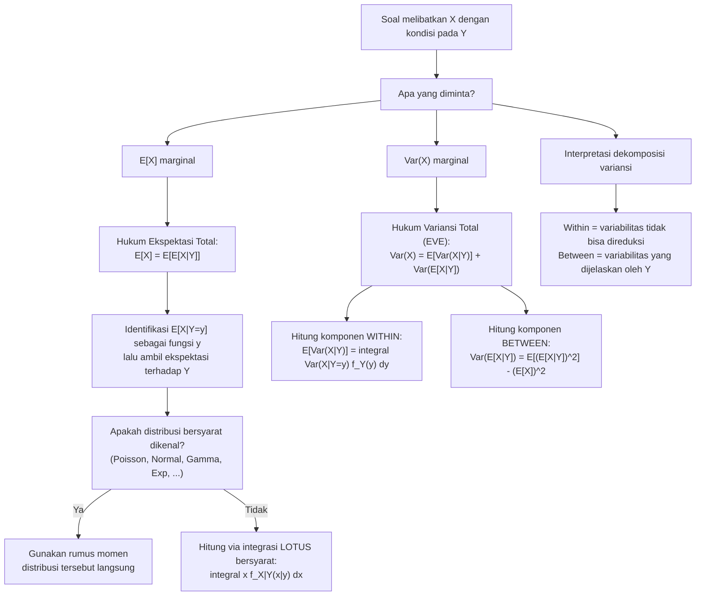

# 📊 3.4 — Nilai Harapan dan Variansi Bersyarat

> [!ABSTRACT] Ringkasan Cepat
> **Topik:** Nilai Harapan dan Variansi Bersyarat | **Bobot:** ~20–30% | **Difficulty:** Hard
> **Ref:** Hogg-McKean-Craig (2019) Bab 2.1–2.4; Miller et al. (2014) Bab 3.5–3.8, 4.6–4.9 | **Prereq:** [[3.3 Distribusi Bersyarat (Conditional Distribution)]], [[3.2 Distribusi Marginal]], [[3.1 Distribusi Gabungan (Joint Distribution)]]

## Section 0 — Pemetaan Topik

| Topik CF2 | Sub-topik ID | Skill Diuji | Bobot | Difficulty | Prerequisite | Connected Topics | Referensi |
|-----------|--------------|-------------|-------|------------|--------------|------------------|-----------|
| Topik 3: Variabel Acak Multivariat | 3.4 | Memahami $E[X \mid Y]$ dan $\text{Var}(X \mid Y)$ sebagai variabel acak; menerapkan Hukum Ekspektasi Total $E[X] = E[E[X \mid Y]]$; menerapkan Hukum Variansi Total $\text{Var}(X) = E[\text{Var}(X \mid Y)] + \text{Var}(E[X \mid Y])$; mengidentifikasi komponen "within" dan "between" dalam dekomposisi variansi; menghitung $E[X]$ dan $\text{Var}(X)$ melalui kondisioning ketika distribusi marginal sulit dihitung langsung | 20–30% | Hard | [[3.3 Distribusi Bersyarat (Conditional Distribution)]], [[3.2 Distribusi Marginal]], [[3.1 Distribusi Gabungan (Joint Distribution)]], [[2.1 Variabel Acak Diskrit]], [[2.2 Variabel Acak Kontinu]] | [[3.5 Independensi dan Korelasi]], [[3.7 Distribusi Majemuk (Compound Distribution)]], [[4.5 Estimasi Parameter]], [[4.8 Uji Hipotesis]] | Hogg-McKean-Craig (2019) Bab 2.1–2.4; Miller et al. (2014) Bab 3.5–3.8, 4.6–4.9, 5.8–5.10 |

## Section 1 — Intuisi

Pada topik [[3.3 Distribusi Bersyarat (Conditional Distribution)]], kita melihat bahwa $E[X \mid Y = y]$ — mean bersyarat untuk nilai $y$ yang spesifik — adalah sebuah **angka** yang bergantung pada pilihan $y$. Kini bayangkan kita tidak memilih nilai $y$ tertentu, melainkan membiarkan $Y$ tetap menjadi variabel acak. Maka $E[X \mid Y]$ — mean bersyarat yang dievaluasi pada $Y$ yang acak — menjadi sebuah **variabel acak** tersendiri, karena nilainya bervariasi bergantung pada nilai $Y$ yang terealisasi. Inilah lompatan konseptual terpenting di topik ini: dari angka menjadi variabel acak.

Analogi yang membantu: bayangkan perusahaan asuransi membagi nasabahnya ke dalam kelompok risiko $Y$ (rendah, sedang, tinggi). Untuk kelompok risiko rendah ($Y = 1$), rata-rata klaim tahunan adalah Rp5 juta. Untuk kelompok risiko sedang ($Y = 2$), rata-ratanya Rp12 juta. Untuk kelompok risiko tinggi ($Y = 3$), rata-ratanya Rp25 juta. Jika seorang nasabah dipilih secara acak tanpa mengetahui kelompok risikonya, "rata-rata klaim yang diharapkan" adalah rata-rata tertimbang dari ketiga angka tersebut — tertimbang oleh probabilitas masing-masing kelompok risiko. Inilah **Hukum Ekspektasi Total**: $E[X] = E[E[X \mid Y]]$. Mean total adalah rata-rata dari mean-mean bersyarat, tertimbang oleh distribusi $Y$.

Hukum Variansi Total lalu bertanya: dari mana datangnya variansi total klaim $X$? Ada dua sumber. **Pertama**, dalam setiap kelompok risiko, klaim individual bervariasi di sekitar mean kelompoknya — inilah variansi *dalam* kelompok, diringkas oleh $E[\text{Var}(X \mid Y)]$. **Kedua**, mean kelompok itu sendiri bervariasi antar kelompok — kelompok risiko tinggi punya mean jauh lebih tinggi dari kelompok risiko rendah. Inilah variansi *antar* kelompok, diringkas oleh $\text{Var}(E[X \mid Y])$. Hukum Variansi Total menyatakan bahwa variansi total adalah jumlah kedua komponen ini: $\text{Var}(X) = E[\text{Var}(X \mid Y)] + \text{Var}(E[X \mid Y])$. Dekomposisi ini fundamental dalam aktuaria, analisis ragam (ANOVA), dan pemodelan hierarkis.

## Section 2 — Definisi Formal

> [!NOTE] Definisi Matematis
>
> Misalkan $(X, Y)$ adalah pasangan variabel acak. Definisikan:
>
> **Nilai Harapan Bersyarat sebagai Variabel Acak:**
> $$
> E[X \mid Y] \;:=\; \varphi(Y), \quad \text{di mana } \varphi(y) = E[X \mid Y = y]
> $$
> $E[X \mid Y]$ adalah variabel acak yang merupakan fungsi dari $Y$.
>
> **Variansi Bersyarat sebagai Variabel Acak:**
> $$
> \text{Var}(X \mid Y) \;:=\; \psi(Y), \quad \text{di mana } \psi(y) = \text{Var}(X \mid Y = y) = E[X^2 \mid Y=y] - \bigl(E[X \mid Y=y]\bigr)^2
> $$
>
> **Hukum Ekspektasi Total (Law of Total Expectation / Tower Property):**
> $$
> \boxed{E[X] = E\!\left[E[X \mid Y]\right]}
> $$
>
> **Hukum Variansi Total (Law of Total Variance / Eve's Law):**
> $$
> \boxed{\text{Var}(X) = E\!\left[\text{Var}(X \mid Y)\right] + \text{Var}\!\left(E[X \mid Y]\right)}
> $$
>
> **Bentuk Diperluas Hukum Ekspektasi Total (untuk fungsi $g$):**
> $$
> E[g(X)] = E\!\left[E[g(X) \mid Y]\right]
> $$

### Variabel & Parameter

| Simbol | Makna | Catatan |
|--------|-------|---------|
| $E[X \mid Y = y]$ | Nilai harapan bersyarat — **angka** | Fungsi deterministik dari $y$; hasil untuk kondisi spesifik |
| $E[X \mid Y]$ | Nilai harapan bersyarat — **variabel acak** | Fungsi dari variabel acak $Y$; memiliki distribusi, mean, variansi sendiri |
| $\text{Var}(X \mid Y = y)$ | Variansi bersyarat — **angka** | Fungsi deterministik dari $y$; selalu $\geq 0$ |
| $\text{Var}(X \mid Y)$ | Variansi bersyarat — **variabel acak** | Fungsi dari variabel acak $Y$; memiliki mean sendiri |
| $E[\text{Var}(X \mid Y)]$ | Ekspektasi dari variansi bersyarat | Komponen "within-group" dalam dekomposisi variansi; mengukur variabilitas rata-rata *di dalam* setiap kondisi $Y$ |
| $\text{Var}(E[X \mid Y])$ | Variansi dari ekspektasi bersyarat | Komponen "between-group" dalam dekomposisi variansi; mengukur seberapa besar mean bersyarat bervariasi *antar* nilai $Y$ |
| $\text{Var}(X)$ | Variansi marginal total dari $X$ | $= E[\text{Var}(X \mid Y)] + \text{Var}(E[X \mid Y])$ |
| $\varphi(y)$ | Fungsi mean bersyarat: $\varphi(y) = E[X \mid Y=y]$ | Ketika $Y$ substitusi ke $\varphi$, hasilnya adalah variabel acak $E[X \mid Y]$ |
| $\psi(y)$ | Fungsi variansi bersyarat: $\psi(y) = \text{Var}(X \mid Y=y)$ | Ketika $Y$ substitusi ke $\psi$, hasilnya adalah variabel acak $\text{Var}(X \mid Y)$ |

### Rumus Utama

$$
E[X] = E\!\left[E[X \mid Y]\right] = \begin{cases} \displaystyle\sum_{y} E[X \mid Y=y]\, p_Y(y) & \text{(diskrit)} \\[8pt] \displaystyle\int_{-\infty}^{\infty} E[X \mid Y=y]\, f_Y(y)\, dy & \text{(kontinu)} \end{cases}
$$
**Label: Hukum Ekspektasi Total** — mean total $X$ adalah rata-rata tertimbang dari mean-mean bersyarat, tertimbang oleh distribusi $Y$; rumus ini valid tanpa syarat apapun mengenai independensi.

$$
\text{Var}(X) = \underbrace{E\!\left[\text{Var}(X \mid Y)\right]}_{\text{within-group}} + \underbrace{\text{Var}\!\left(E[X \mid Y]\right)}_{\text{between-group}}
$$
**Label: Hukum Variansi Total (Eve's Law)** — dekomposisi variansi total menjadi komponen rata-rata variansi dalam kondisi dan variansi antar kondisi; kedua komponen selalu $\geq 0$.

$$
\text{Var}\!\left(E[X \mid Y]\right) = E\!\left[\bigl(E[X \mid Y]\bigr)^2\right] - \bigl(E[E[X \mid Y]]\bigr)^2 = E\!\left[\bigl(E[X \mid Y]\bigr)^2\right] - \bigl(E[X]\bigr)^2
$$
**Label: Rumus Komputasional Komponen Between-Group** — variansi dari variabel acak $E[X \mid Y]$ dihitung menggunakan rumus $\text{Var}(Z) = E[Z^2] - (E[Z])^2$ dengan $Z = E[X \mid Y]$.

$$
E\!\left[E[X \mid Y, Z] \mid Y\right] = E[X \mid Y]
$$
**Label: Tower Property (Sifat Menara)** — untuk tiga variabel acak; ekspektasi bersyarat "level lebih dalam" bisa disederhanakan ke level lebih dangkal; relevan untuk distribusi majemuk di [[3.7 Distribusi Majemuk (Compound Distribution)]].

$$
E\!\left[g(Y) \cdot X \mid Y\right] = g(Y) \cdot E[X \mid Y]
$$
**Label: Sifat Taking Out What is Known** — fungsi dari $Y$ dapat "dikeluarkan" dari ekspektasi bersyarat ketika mengkondisikan pada $Y$, karena $g(Y)$ adalah konstanta given $Y$.

### Asumsi Eksplisit

- **Existensi momen:** Hukum Ekspektasi Total mensyaratkan $E[|X|] < \infty$. Hukum Variansi Total mensyaratkan $E[X^2] < \infty$ (sehingga $\text{Var}(X) < \infty$).
- **Tidak memerlukan independensi:** Kedua hukum berlaku untuk semua pasangan $(X, Y)$ dengan momen yang ada — independensi bukan syarat.
- **$E[X \mid Y]$ adalah variabel acak yang terdefinisi:** Secara teknis, $E[X \mid Y]$ harus terdefinisi hampir pasti (*almost surely*); untuk distribusi yang biasa dijumpai di CF2, kondisi ini selalu terpenuhi.
- **Kedua komponen Hukum Variansi Total selalu non-negatif:** $E[\text{Var}(X \mid Y)] \geq 0$ karena variansi bersyarat $\geq 0$; $\text{Var}(E[X \mid Y]) \geq 0$ karena variansi selalu $\geq 0$.

## Section 3 — Jembatan Logika

> [!TIP] Dari Definisi ke Rumus
> Kunci memahami topik ini adalah menerima bahwa $E[X \mid Y]$ adalah **variabel acak**. Begitu penerimaan itu ada, Hukum Ekspektasi Total menjadi sangat natural: kita cukup mengambil ekspektasi dari variabel acak $E[X \mid Y]$, menggunakan distribusi $Y$ sebagai bobot. Secara formal: $E[E[X \mid Y]] = \int \varphi(y) f_Y(y)\,dy = \int E[X \mid Y=y] f_Y(y)\,dy$. Substitusi definisi $E[X \mid Y=y] = \int x f_{X|Y}(x \mid y)\,dx$ dan gunakan fakta bahwa $f_{X|Y}(x \mid y) f_Y(y) = f_{X,Y}(x,y)$, kita peroleh $\int\int x f_{X,Y}(x,y)\,dx\,dy = E[X]$ — persis mean marginal yang benar.
>
> Untuk Hukum Variansi Total, mulai dari dekomposisi aljabar. Untuk setiap $y$ tetap, identitas variansi klasik berlaku: $E[X^2 \mid Y=y] = \text{Var}(X \mid Y=y) + (E[X \mid Y=y])^2$. Ambil ekspektasi terhadap $Y$ di kedua sisi: $E[X^2] = E[\text{Var}(X \mid Y)] + E[(E[X \mid Y])^2]$. Kurangi $(E[X])^2 = (E[E[X \mid Y]])^2$ dari kedua sisi: $E[X^2] - (E[X])^2 = E[\text{Var}(X \mid Y)] + E[(E[X \mid Y])^2] - (E[E[X \mid Y]])^2$. Sisi kiri adalah $\text{Var}(X)$; suku terakhir di sisi kanan adalah $\text{Var}(E[X \mid Y])$.

> [!IMPORTANT] Dua Komponen Hukum Variansi Total
> Penting untuk membedakan makna kedua komponen secara intuitif:
>
> **Komponen Within-Group:** $E[\text{Var}(X \mid Y)]$
> - Rata-rata dari "seberapa tersebar $X$ di dalam tiap kelompok $Y$"
> - Mengukur ketidakpastian yang **tidak dapat direduksi** meski kita mengetahui $Y$
> - Selalu $\geq 0$; sama dengan 0 hanya jika $X$ deterministik given $Y$ (yaitu $X = g(Y)$ untuk suatu fungsi $g$)
>
> **Komponen Between-Group:** $\text{Var}(E[X \mid Y])$
> - Seberapa besar rata-rata bersyarat $E[X \mid Y=y]$ bervariasi sebagai fungsi dari $y$
> - Mengukur ketidakpastian yang **dapat direduksi** jika kita mengetahui $Y$
> - Sama dengan 0 jika dan hanya jika $E[X \mid Y] = E[X]$ hampir pasti — yang terjadi ketika $X$ dan $Y$ tidak berkorelasi (atau independen)

**Derivasi Formal Hukum Ekspektasi Total (kasus kontinu):**

Mulai dari definisi $E[X \mid Y=y] = \int_{-\infty}^{\infty} x\, f_{X|Y}(x \mid y)\,dx$. Ambil ekspektasi terhadap $Y$:

$$
E\!\left[E[X \mid Y]\right] = \int_{-\infty}^{\infty} E[X \mid Y=y]\, f_Y(y)\, dy = \int_{-\infty}^{\infty} \left(\int_{-\infty}^{\infty} x\, f_{X|Y}(x \mid y)\, dx\right) f_Y(y)\, dy
$$

Gunakan fakta $f_{X|Y}(x \mid y) \cdot f_Y(y) = f_{X,Y}(x,y)$ dan tukar urutan integrasi (dibenarkan oleh Fubini's Theorem jika $E[|X|] < \infty$):

$$
= \int_{-\infty}^{\infty} \int_{-\infty}^{\infty} x\, f_{X,Y}(x, y)\, dy\, dx = \int_{-\infty}^{\infty} x \left(\int_{-\infty}^{\infty} f_{X,Y}(x,y)\, dy\right) dx = \int_{-\infty}^{\infty} x\, f_X(x)\, dx = E[X]
$$

**Derivasi Formal Hukum Variansi Total:**

Mulai dari identitas $\text{Var}(X \mid Y=y) = E[X^2 \mid Y=y] - (E[X \mid Y=y])^2$. Notasikan $\varphi(y) = E[X \mid Y=y]$ dan $\psi(y) = \text{Var}(X \mid Y=y)$. Ambil ekspektasi terhadap $Y$:

$$
E[\psi(Y)] = E[X^2 \mid Y=y \text{ dirata-ratakan}] - E[\varphi(Y)^2]
$$

Dari Hukum Ekspektasi Total diterapkan pada $X^2$: $E[E[X^2 \mid Y]] = E[X^2]$. Jadi:

$$
E[\text{Var}(X \mid Y)] = E[X^2] - E\!\left[\bigl(E[X \mid Y]\bigr)^2\right]
$$

Tambahkan dan kurangi $(E[X])^2 = (E[E[X \mid Y]])^2$:

$$
E[X^2] - (E[X])^2 = E[\text{Var}(X \mid Y)] + \underbrace{E\!\left[\bigl(E[X \mid Y]\bigr)^2\right] - \bigl(E[E[X \mid Y]]\bigr)^2}_{\text{Var}(E[X \mid Y])}
$$

$$
\therefore \quad \text{Var}(X) = E[\text{Var}(X \mid Y)] + \text{Var}(E[X \mid Y]) \qquad \blacksquare
$$

> [!DANGER] Dilarang
> 1. **Dilarang membalik urutan komponen Hukum Variansi Total:** $\text{Var}(X) = E[\text{Var}(X \mid Y)] + \text{Var}(E[X \mid Y])$ — urutan dan struktur operator ini baku. Menulis $\text{Var}(E[\text{Var}(X \mid Y)])$ atau $E[\text{Var}(E[X \mid Y])]$ adalah ekspresi yang tidak bermakna atau salah.
> 2. **Dilarang memperlakukan $E[X \mid Y]$ sebagai angka ketika menghitung $\text{Var}(E[X \mid Y])$:** $E[X \mid Y]$ adalah variabel acak — ia memiliki distribusi. $\text{Var}(E[X \mid Y])$ berarti menghitung variansi variabel acak tersebut menggunakan distribusi $Y$: $\text{Var}(E[X \mid Y]) = E[(E[X \mid Y])^2] - (E[X])^2$. Mengambil variansi dari angka tetap menghasilkan nol — ini kesalahan fatal.
> 3. **Dilarang menyimpulkan $\text{Var}(X \mid Y) = \text{Var}(X)$:** Variansi bersyarat $\text{Var}(X \mid Y=y)$ umumnya berbeda dari (dan lebih kecil atau sama dengan) variansi marginal $\text{Var}(X)$. Kesamaan terjadi hanya ketika $X$ dan $Y$ independen dan komponen between-group = 0.

## Section 4 — Contoh Soal

### Soal A — Fundamental

Misalkan $Y$ adalah variabel acak dengan distribusi $P(Y=1) = 0.4$, $P(Y=2) = 0.6$. Bersyarat pada $Y = y$, variabel acak $X$ memiliki distribusi berikut:
- Jika $Y = 1$: $E[X \mid Y=1] = 3$ dan $\text{Var}(X \mid Y=1) = 4$.
- Jika $Y = 2$: $E[X \mid Y=2] = 7$ dan $\text{Var}(X \mid Y=2) = 9$.

Hitung $E[X]$ dan $\text{Var}(X)$.

> [!SUCCESS] Solusi Soal A
>
> **1. Identifikasi Variabel**
> - $Y$ diskrit: $\mathcal{Y} = \{1, 2\}$ dengan $p_Y(1) = 0.4$, $p_Y(2) = 0.6$.
> - $E[X \mid Y=1] = 3$, $E[X \mid Y=2] = 7$ — nilai harapan bersyarat (angka).
> - $\text{Var}(X \mid Y=1) = 4$, $\text{Var}(X \mid Y=2) = 9$ — variansi bersyarat (angka).
>
> **2. Identifikasi Distribusi / Model**
> - Tidak perlu mengetahui distribusi joint penuh — hanya momen bersyarat yang diperlukan.
> - Terapkan Hukum Ekspektasi Total dan Hukum Variansi Total secara langsung.
>
> **3. Setup Persamaan**
> $$E[X] = E[E[X \mid Y]] = \sum_{y} E[X \mid Y=y]\, p_Y(y)$$
> $$\text{Var}(X) = E[\text{Var}(X \mid Y)] + \text{Var}(E[X \mid Y])$$
>
> **4. Eksekusi Aljabar**
>
> *Hukum Ekspektasi Total:*
> $$E[X] = E[X \mid Y=1]\cdot p_Y(1) + E[X \mid Y=2]\cdot p_Y(2) = 3(0.4) + 7(0.6) = 1.2 + 4.2 = 5.4$$
>
> *Komponen Within-Group — $E[\text{Var}(X \mid Y)]$:*
> $$E[\text{Var}(X \mid Y)] = \text{Var}(X \mid Y=1)\cdot p_Y(1) + \text{Var}(X \mid Y=2)\cdot p_Y(2) = 4(0.4) + 9(0.6) = 1.6 + 5.4 = 7.0$$
>
> *Komponen Between-Group — $\text{Var}(E[X \mid Y])$:*
>
> Definisikan variabel acak $Z = E[X \mid Y]$; maka $Z = 3$ dengan probabilitas $0.4$ dan $Z = 7$ dengan probabilitas $0.6$.
>
> $$E[Z^2] = 3^2(0.4) + 7^2(0.6) = 9(0.4) + 49(0.6) = 3.6 + 29.4 = 33.0$$
> $$(E[Z])^2 = (E[X])^2 = (5.4)^2 = 29.16$$
> $$\text{Var}(E[X \mid Y]) = E[Z^2] - (E[Z])^2 = 33.0 - 29.16 = 3.84$$
>
> *Hukum Variansi Total:*
> $$\text{Var}(X) = E[\text{Var}(X \mid Y)] + \text{Var}(E[X \mid Y]) = 7.0 + 3.84 = 10.84$$
>
> **5. Verification**
> - $E[X] = 5.4$ berada di antara $E[X \mid Y=1] = 3$ dan $E[X \mid Y=2] = 7$, dibobot lebih ke $Y=2$ (bobot 0.6) — masuk akal: $5.4$ lebih dekat ke 7 daripada ke 3. ✓
> - Kedua komponen positif: $7.0 > 0$ dan $3.84 > 0$. ✓
> - $\text{Var}(X) = 10.84 > \max(\text{Var}(X \mid Y=1), \text{Var}(X \mid Y=2)) = 9$: variansi total lebih besar dari variansi dalam grup mana pun karena ada tambahan variabilitas antar grup. ✓

> [!WARNING] Exam Tips — Soal A
> - **Target waktu:** 4–5 menit.
> - **Common trap — komponen between-group:** Kesalahan paling umum adalah menghitung $\text{Var}(E[X \mid Y])$ sebagai $\text{Var}(3) \cdot 0.4 + \text{Var}(7) \cdot 0.6 = 0$ — ini **salah** karena $\text{Var}(3) = \text{Var}(7) = 0$ (variansi konstanta). Yang benar: $Z = E[X \mid Y]$ adalah variabel acak yang mengambil nilai $3$ atau $7$, dan $\text{Var}(Z) = E[Z^2] - (E[Z])^2$.
> - **Shortcut:** Setelah mendapatkan $E[X]$, hitung $\text{Var}(E[X \mid Y])$ dengan rumus $\sum_y (E[X \mid Y=y] - E[X])^2 p_Y(y) = (3-5.4)^2(0.4) + (7-5.4)^2(0.6) = 5.76(0.4) + 2.56(0.6) = 2.304 + 1.536 = 3.84$ ✓

---

### Soal B — Exam-Typical

Misalkan $N$ adalah variabel acak yang menyatakan jumlah klaim, di mana $N \mid \Lambda = \lambda \sim \text{Poisson}(\lambda)$. Parameter $\Lambda$ sendiri adalah variabel acak dengan $E[\Lambda] = 2$ dan $\text{Var}(\Lambda) = 3$.

**(a)** Hitung $E[N]$.
**(b)** Hitung $\text{Var}(N)$.

> [!SUCCESS] Solusi Soal B
>
> **1. Identifikasi Variabel**
> - $\Lambda$: variabel acak parameter (prior); $E[\Lambda] = 2$, $\text{Var}(\Lambda) = 3$.
> - $N \mid \Lambda = \lambda \sim \text{Poisson}(\lambda)$: bersyarat pada $\Lambda = \lambda$, $N$ terdistribusi Poisson.
> - Sifat distribusi Poisson: jika $N \mid \Lambda = \lambda \sim \text{Poisson}(\lambda)$, maka $E[N \mid \Lambda = \lambda] = \lambda$ dan $\text{Var}(N \mid \Lambda = \lambda) = \lambda$.
>
> **2. Identifikasi Distribusi / Model**
> - Ini adalah **distribusi majemuk (compound/mixture distribution)** — lihat [[3.7 Distribusi Majemuk (Compound Distribution)]].
> - Kondisioning pada $\Lambda$ adalah strategi alami: distribusi joint $N, \Lambda$ tidak perlu diketahui secara eksplisit; cukup momen bersyarat.
> - Terapkan Hukum Ekspektasi Total dan Variansi Total dengan $X = N$ dan $Y = \Lambda$.
>
> **3. Setup Persamaan**
> $$E[N] = E[E[N \mid \Lambda]]$$
> $$\text{Var}(N) = E[\text{Var}(N \mid \Lambda)] + \text{Var}(E[N \mid \Lambda])$$
>
> **4. Eksekusi Aljabar**
>
> *Identifikasi momen bersyarat sebagai fungsi dari $\Lambda$:*
> $$E[N \mid \Lambda] = \Lambda \qquad (\text{karena } E[\text{Poisson}(\lambda)] = \lambda)$$
> $$\text{Var}(N \mid \Lambda) = \Lambda \qquad (\text{karena } \text{Var}(\text{Poisson}(\lambda)) = \lambda)$$
>
> **(a) Hukum Ekspektasi Total:**
> $$E[N] = E[E[N \mid \Lambda]] = E[\Lambda] = 2$$
>
> **(b) Hukum Variansi Total:**
>
> *Komponen Within:*
> $$E[\text{Var}(N \mid \Lambda)] = E[\Lambda] = 2$$
>
> *Komponen Between:*
> $$\text{Var}(E[N \mid \Lambda]) = \text{Var}(\Lambda) = 3$$
>
> *Total:*
> $$\text{Var}(N) = E[\text{Var}(N \mid \Lambda)] + \text{Var}(E[N \mid \Lambda]) = 2 + 3 = 5$$
>
> **5. Verification**
> - $E[N] = 2 = E[\Lambda]$: mean $N$ sama dengan mean $\Lambda$ — masuk akal karena Poisson memiliki mean = parameter. ✓
> - $\text{Var}(N) = 5 > E[N] = 2$: berbeda dari distribusi Poisson murni (di mana variansi = mean). Variansi ekstra sebesar $3 = \text{Var}(\Lambda)$ muncul karena ketidakpastian tambahan dari acaknya parameter $\Lambda$ — ini adalah **overdispersion** yang khas pada distribusi Poisson-campuran. ✓
> - Komponen within $= 2 = E[\Lambda]$: rata-rata "noise" dalam setiap kondisi $\Lambda$. ✓
> - Komponen between $= 3 = \text{Var}(\Lambda)$: variabilitas dari rata-rata bersyarat itu sendiri. ✓

> [!WARNING] Exam Tips — Soal B
> - **Target waktu:** 5–6 menit.
> - **Common trap:** Mengira $\text{Var}(N) = E[N] = 2$ karena "$N$ adalah Poisson". $N$ secara marginal **bukan** Poisson murni — ia adalah campuran Poisson. Variansi marginal selalu lebih besar dari mean marginal untuk Poisson-campuran (overdispersion).
> - **Pola umum untuk soal distribusi majemuk:** Ketika $N \mid \Lambda \sim \text{Poisson}(\Lambda)$ dan $\Lambda$ acak, selalu berlaku: $E[N] = E[\Lambda]$ dan $\text{Var}(N) = E[\Lambda] + \text{Var}(\Lambda)$. Pola ini layak dihafal untuk soal CF2 bertopik distribusi majemuk.
> - **Shortcut kunci:** Kenali bahwa $E[N \mid \Lambda] = \Lambda$ dan $\text{Var}(N \mid \Lambda) = \Lambda$ langsung dari sifat Poisson, tanpa perlu menghitung distribusi joint.

---

### Soal C — Challenging

Misalkan $(X, Y)$ memiliki PDF joint:

$$
f_{X,Y}(x,y) = \begin{cases} \dfrac{1}{y} e^{-x/y} e^{-y} & x > 0,\; y > 0 \\ 0 & \text{lainnya} \end{cases}
$$

**(a)** Tentukan $E[X \mid Y = y]$ dan $\text{Var}(X \mid Y = y)$.
**(b)** Hitung $E[X]$ menggunakan Hukum Ekspektasi Total.
**(c)** Hitung $\text{Var}(X)$ menggunakan Hukum Variansi Total.

> [!SUCCESS] Solusi Soal C
>
> **1. Identifikasi Variabel**
> - Support joint: $x > 0$, $y > 0$ (rectangular semi-infinite).
> - Strategi: identifikasi distribusi bersyarat $X \mid Y = y$ dari bentuk fungsional PDF joint terhadap $x$.
>
> **2. Identifikasi Distribusi / Model**
>
> *PDF Marginal $f_Y(y)$:*
> $$f_Y(y) = \int_0^{\infty} \frac{1}{y} e^{-x/y} e^{-y}\, dx = \frac{e^{-y}}{y} \int_0^{\infty} e^{-x/y}\, dx = \frac{e^{-y}}{y} \cdot y = e^{-y}, \quad y > 0$$
>
> Jadi $Y \sim \text{Exp}(1)$ (parameter laju 1), dengan $E[Y] = 1$ dan $\text{Var}(Y) = 1$.
>
> *PDF Bersyarat $f_{X|Y}(x \mid y)$:*
> $$f_{X|Y}(x \mid y) = \frac{f_{X,Y}(x,y)}{f_Y(y)} = \frac{\frac{1}{y} e^{-x/y} e^{-y}}{e^{-y}} = \frac{1}{y} e^{-x/y}, \quad x > 0$$
>
> Ini adalah PDF distribusi $\text{Exp}(1/y)$ (laju $1/y$, atau skala $y$): $X \mid Y = y \sim \text{Exp}(1/y)$.
>
> **3. Setup Persamaan**
>
> Sifat distribusi Eksponensial: jika $X \mid Y=y \sim \text{Exp}(1/y)$ (laju $1/y$, skala $y$), maka:
> $$E[X \mid Y=y] = y \qquad \text{dan} \qquad \text{Var}(X \mid Y=y) = y^2$$
>
> Sebagai variabel acak (fungsi dari $Y$):
> $$E[X \mid Y] = Y \qquad \text{dan} \qquad \text{Var}(X \mid Y) = Y^2$$
>
> **4. Eksekusi Aljabar**
>
> **(a)** Dari sifat Eksponensial di atas:
> $$E[X \mid Y = y] = y, \qquad \text{Var}(X \mid Y = y) = y^2$$
>
> **(b) Hukum Ekspektasi Total:**
> $$E[X] = E[E[X \mid Y]] = E[Y] = 1$$
>
> karena $Y \sim \text{Exp}(1)$ memiliki $E[Y] = 1$.
>
> **(c) Hukum Variansi Total:**
>
> *Komponen Within:*
> $$E[\text{Var}(X \mid Y)] = E[Y^2] = \text{Var}(Y) + (E[Y])^2 = 1 + 1^2 = 2$$
>
> *Komponen Between:*
> $$\text{Var}(E[X \mid Y]) = \text{Var}(Y) = 1$$
>
> *Total:*
> $$\text{Var}(X) = E[\text{Var}(X \mid Y)] + \text{Var}(E[X \mid Y]) = 2 + 1 = 3$$
>
> **5. Verification**
>
> *Verifikasi $E[X]$ langsung dari marginal $f_X(x)$:*
>
> Hitung $E[X]$ secara langsung dari joint: $E[X] = \int_0^{\infty}\int_0^{\infty} x \cdot \frac{1}{y} e^{-x/y} e^{-y}\,dx\,dy$.
>
> Integrasi dalam (terhadap $x$): $\int_0^{\infty} x \cdot \frac{1}{y} e^{-x/y}\,dx = E[X \mid Y=y] = y$.
>
> Integrasi luar: $\int_0^{\infty} y \cdot e^{-y}\,dy = E[Y] = 1$ ✓ (konsisten dengan Hukum Ekspektasi Total)
>
> *Cek komponen within:*
> $E[\text{Var}(X \mid Y)] = E[Y^2]$. Untuk $Y \sim \text{Exp}(1)$: $E[Y^2] = \text{Var}(Y) + (E[Y])^2 = 1 + 1 = 2$ ✓
>
> *Cek komponen between:*
> $\text{Var}(E[X \mid Y]) = \text{Var}(Y) = 1$ karena $E[X \mid Y] = Y$ dan $Y \sim \text{Exp}(1)$ ✓
>
> *Sanity check:* $\text{Var}(X) = 3 > \text{Var}(X \mid Y=y) = y^2$ untuk $y < \sqrt{3}$ — variansi total memang lebih besar dari variansi dalam kondisi yang "tipikal" (karena ada komponen between). ✓

> [!WARNING] Exam Tips — Soal C
> - **Target waktu:** 12–15 menit.
> - **Strategi kunci:** Identifikasi distribusi bersyarat $X \mid Y=y$ dari bentuk $f_{X,Y}$ terhadap $x$ (perlakukan $y$ sebagai konstanta). Di sini, $\frac{1}{y}e^{-x/y}$ langsung teridentifikasi sebagai kernel Eksponensial dengan skala $y$. Identifikasi ini menghindarkan integrasi manual.
> - **Common trap — parametrisasi Eksponensial:** Pastikan konsisten antara parametrisasi laju ($\lambda$: mean $= 1/\lambda$, variansi $= 1/\lambda^2$) dan parametrisasi skala ($\theta = 1/\lambda$: mean $= \theta$, variansi $= \theta^2$). Di soal ini, skala $= y$, sehingga mean $= y$ dan variansi $= y^2$.
> - **Common trap — $E[Y^2]$ vs $(E[Y])^2$:** Komponen within membutuhkan $E[Y^2]$, bukan $(E[Y])^2$. Gunakan $E[Y^2] = \text{Var}(Y) + (E[Y])^2$ — jangan asumsikan $E[Y^2] = (E[Y])^2$.

## Section 5 — Verifikasi & Sanity Check

> [!CHECK] Verifikasi Hukum Ekspektasi Total
> - $E[X]$ dari Hukum Ekspektasi Total harus sama dengan $E[X]$ yang dihitung langsung dari distribusi marginal $f_X(x)$ (jika marginal bisa dihitung).
> - Cek sederhana: $E[X]$ harus berada di antara $\min_y E[X \mid Y=y]$ dan $\max_y E[X \mid Y=y]$ — mean total tidak boleh keluar dari rentang mean bersyarat.

> [!CHECK] Verifikasi Hukum Variansi Total
> - Kedua komponen harus non-negatif: $E[\text{Var}(X \mid Y)] \geq 0$ dan $\text{Var}(E[X \mid Y]) \geq 0$.
> - Akibatnya: $\text{Var}(X) \geq E[\text{Var}(X \mid Y)]$ — variansi total selalu $\geq$ rata-rata variansi bersyarat.
> - Jika $X$ dan $Y$ independen: $\text{Var}(E[X \mid Y]) = \text{Var}(E[X]) = 0$ (karena $E[X \mid Y] = E[X]$ adalah konstanta), sehingga $\text{Var}(X) = E[\text{Var}(X \mid Y)]$ — variansi total = rata-rata variansi bersyarat.

> [!CHECK] Cek Kasus Khusus
> - Jika $E[X \mid Y=y] = a + by$ (linear dalam $y$), maka $E[X] = a + b\,E[Y]$ dan $\text{Var}(E[X \mid Y]) = b^2\,\text{Var}(Y)$ — dapat diturunkan langsung dari sifat ekspektasi dan variansi transformasi linear.
> - Jika $\text{Var}(X \mid Y=y) = \sigma^2$ konstan (tidak bergantung $y$), maka komponen within $= \sigma^2$ dan komponen between $= \text{Var}(E[X \mid Y])$.

### Metode Alternatif

**Menghitung $E[X]$ langsung dari joint tanpa Hukum Ekspektasi Total:**

$$E[X] = \int\!\!\int x\, f_{X,Y}(x,y)\,dx\,dy$$

Ini setara, tetapi seringkali lebih panjang. Hukum Ekspektasi Total lebih efisien ketika distribusi bersyarat mudah diidentifikasi.

**Menghitung $\text{Var}(X)$ dari definisi:**

$$\text{Var}(X) = E[X^2] - (E[X])^2$$

di mana $E[X^2] = E[E[X^2 \mid Y]]$ (dari Hukum Ekspektasi Total diterapkan pada $X^2$). Ini ekuivalen dengan Hukum Variansi Total tetapi membutuhkan perhitungan $E[X^2 \mid Y=y]$ secara eksplisit.

**Rumus praktis untuk soal distribusi majemuk standar:**

Jika $N \mid \Lambda \sim \text{Poisson}(\Lambda)$:
$$E[N] = E[\Lambda], \qquad \text{Var}(N) = E[\Lambda] + \text{Var}(\Lambda)$$

Jika $X \mid \Theta \sim N(\Theta, \sigma^2)$ dengan $\sigma^2$ konstan:
$$E[X] = E[\Theta], \qquad \text{Var}(X) = \sigma^2 + \text{Var}(\Theta)$$

## Section 6 — Visualisasi Mental

**Bayangkan populasi yang terbagi dalam sub-kelompok berdasarkan $Y$:** Setiap sub-kelompok $Y = y$ memiliki distribusi $X$ sendiri — dengan mean $E[X \mid Y=y]$ dan variansi $\text{Var}(X \mid Y=y)$. Hukum Ekspektasi Total mengatakan: untuk mendapat mean populasi total, rata-ratakan mean tiap sub-kelompok, dibobot oleh ukuran sub-kelompok (yaitu $f_Y(y)$). Ini persis seperti menghitung rata-rata keseluruhan dari rata-rata grup dalam statistika deskriptif.

**Visualisasi dekomposisi variansi — diagram batang bertumpuk:** Bayangkan batang vertikal dengan tinggi $\text{Var}(X)$. Batang ini terbagi menjadi dua segmen: segmen bawah dengan tinggi $E[\text{Var}(X \mid Y)]$ (komponen within — "noise dalam grup") dan segmen atas dengan tinggi $\text{Var}(E[X \mid Y])$ (komponen between — "variasi antar grup"). Semakin informatif $Y$ dalam menjelaskan $X$, semakin besar segmen atas relatif terhadap total — artinya sebagian besar variansi $X$ dapat "dijelaskan" oleh $Y$.

**Analogi ANOVA:** Dalam analisis ragam satu arah, dekomposisi variansi Total = Within + Between adalah fondasi dari uji-F. Hukum Variansi Total adalah versi probabilistik dari dekomposisi yang sama: $\text{SS}_{\text{Total}} = \text{SS}_{\text{Within}} + \text{SS}_{\text{Between}}$.

### Hubungan Visual ↔ Rumus

Mean total = rata-rata tertimbang mean sub-kelompok:
$$E[X] = \int \underbrace{E[X \mid Y=y]}_{\text{mean sub-kelompok}} \cdot \underbrace{f_Y(y)}_{\text{bobot (ukuran sub-kelompok)}}\, dy$$

Dekomposisi variansi — dua sumber ketidakpastian:
$$\text{Var}(X) = \underbrace{E[\text{Var}(X \mid Y)]}_{\substack{\text{rata-rata "spread"} \\ \text{dalam tiap sub-kelompok}}} + \underbrace{\text{Var}(E[X \mid Y])}_{\substack{\text{"spread" dari} \\ \text{mean antar sub-kelompok}}}$$

Ketika $Y$ sangat informatif tentang $X$ (korelasi kuat): komponen between $\uparrow$, komponen within $\downarrow$ relatif terhadap total.

Ketika $X \perp Y$: komponen between $= 0$, $\text{Var}(X) = E[\text{Var}(X \mid Y)] = \text{Var}(X)$ (trivially consistent).

## Section 7 — Jebakan Umum

> [!BUG] Kesalahan Parametrisasi
> **Kesalahan Struktur Operator pada Hukum Variansi Total:**
>
> *Salah:* $\text{Var}(X) = \text{Var}(\text{Var}(X \mid Y)) + E(E[X \mid Y])^2$
>
> *Benar:* $\text{Var}(X) = E[\text{Var}(X \mid Y)] + \text{Var}(E[X \mid Y])$
>
> Mnemonic: **"EVE's Law"** — **E**xpectation of **V**ariance + **V**ariance of **E**xpectation. Urutan operator: komponen pertama adalah $E[\text{Var}(\cdot)]$, komponen kedua adalah $\text{Var}(E[\cdot])$ — bukan sebaliknya, bukan campuran.

> [!BUG] Kesalahan Konseptual
> 1. **Mengira $\text{Var}(E[X \mid Y]) = 0$ karena "$E[X \mid Y]$ adalah nilai yang diharapkan".** Ini salah — $E[X \mid Y]$ adalah variabel acak (fungsi dari $Y$ yang acak), bukan konstanta. Ia memiliki variansi yang tidak nol kecuali $E[X \mid Y]$ konstan hampir pasti.
> 2. **Menghitung $E[\text{Var}(X \mid Y)]$ sebagai $\text{Var}(X \mid E[Y])$.** Ini adalah kesalahan Jensen — $E[\text{Var}(X \mid Y)] \neq \text{Var}(X \mid E[Y])$ karena variansi bersyarat adalah fungsi non-linear dari $Y$ umumnya.
> 3. **Mengabaikan komponen between ketika mean bersyarat "tampak mendekati" mean marginal.** Komponen between bisa kecil tetapi tidak nol — selalu hitung kedua komponen secara eksplisit.
> 4. **Mengira Hukum Variansi Total hanya berlaku untuk $Y$ diskrit.** Kedua hukum berlaku untuk $Y$ diskrit, kontinu, maupun campuran — perbedaannya hanya pada cara menghitung ekspektasi terhadap $Y$ (penjumlahan vs integrasi).

> [!BUG] Kesalahan Interpretasi Soal
> - **"Hitung $\text{Var}(X)$" ketika distribusi joint diberikan** → pertimbangkan apakah kondisioning pada salah satu variabel memudahkan perhitungan sebelum mencoba menghitung variansi marginal langsung.
> - **"Bersyarat pada $\Lambda$, distribusi $N$ adalah Poisson($\Lambda$)"** → segera kenali $E[N \mid \Lambda] = \Lambda$ dan $\text{Var}(N \mid \Lambda) = \Lambda$; jangan hitung ulang dari PMF Poisson.
> - **Soal menyebut "distribusi campuran" atau "model hierarkis"** → ini adalah sinyal kuat untuk menggunakan Hukum Ekspektasi Total dan Variansi Total dengan kondisioning pada parameter acak.
> - **"Hitung $E[E[X \mid Y]]$"** → ini sama dengan $E[X]$ — gunakan Hukum Ekspektasi Total langsung; tidak perlu menghitung distribusi $E[X \mid Y]$ secara eksplisit.

> [!CAUTION] Red Flags
> - **Soal memberikan $E[X \mid Y=y]$ dan $\text{Var}(X \mid Y=y)$ secara eksplisit tanpa meminta distribusi joint** → sinyal langsung untuk menerapkan kedua hukum; tidak ada informasi tambahan yang diperlukan.
> - **Soal menyebut distribusi Poisson dengan parameter acak** → pola $E[N] = E[\Lambda]$ dan $\text{Var}(N) = E[\Lambda] + \text{Var}(\Lambda)$ hampir pasti yang diuji.
> - **Soal menyebut distribusi Normal dengan mean acak** → pola $E[X] = E[\mu]$ dan $\text{Var}(X) = \sigma^2 + \text{Var}(\mu)$ hampir pasti yang diuji.
> - **Kata kunci "total variance", "within-group", "between-group", "unexplained variation"** → Hukum Variansi Total dan interpretasi kedua komponennya sedang diuji.
> - **Soal menanyakan $\text{Var}(X)$ ketika $X$ didefinisikan melalui proses dua tahap** (misalnya: pertama pilih $Y$, lalu tentukan $X$ berdasarkan $Y$) → selalu kondisikan pada $Y$ dan terapkan Hukum Variansi Total.

## Section 8 — Ringkasan Eksekutif

> [!SUMMARY] Must-Remember
> 1. **$E[X \mid Y]$ adalah variabel acak** — fungsi dari $Y$; perlakukan seperti variabel acak biasa saat mengambil ekspektasi atau variansi darinya.
> 2. **Hukum Ekspektasi Total (Tower Property):**
>    $$E[X] = E\!\left[E[X \mid Y]\right]$$
> 3. **Hukum Variansi Total (Eve's Law) — hafal urutan EVE:**
>    $$\text{Var}(X) = \underbrace{E[\text{Var}(X \mid Y)]}_{\text{within}} + \underbrace{\text{Var}(E[X \mid Y])}_{\text{between}}$$
> 4. **Pola Poisson-campuran — wajib hafal:**
>    $$N \mid \Lambda \sim \text{Poisson}(\Lambda) \implies E[N] = E[\Lambda],\quad \text{Var}(N) = E[\Lambda] + \text{Var}(\Lambda)$$
> 5. **Komponen between via rumus variansi:**
>    $$\text{Var}(E[X \mid Y]) = E\!\left[\bigl(E[X \mid Y]\bigr)^2\right] - \bigl(E[X]\bigr)^2$$

### Kapan Digunakan

- **Trigger keywords:** "hitung $E[X]$ melalui kondisioning", "hukum ekspektasi total", "total variance", "dekomposisi variansi", "distribusi campuran", "model hierarkis", "parameter acak", "bersyarat pada $Y$, distribusi $X$ adalah...".
- **Tipe skenario soal:**
  - Diberikan momen bersyarat ($E[X \mid Y=y]$ dan $\text{Var}(X \mid Y=y)$) dan distribusi $Y$; hitung $E[X]$ dan $\text{Var}(X)$.
  - Distribusi campuran: bersyarat pada parameter acak $\Lambda$, $X$ terdistribusi Poisson, Gamma, Normal, dll.; hitung momen marginal $X$.
  - Diberikan PDF/PMF joint; identifikasi distribusi bersyarat, lalu gunakan kedua hukum untuk menghitung momen marginal.
  - Interpretasikan komponen within vs between dalam konteks risiko aktuaria.

### Kapan TIDAK Boleh Digunakan

- **Jika distribusi marginal $f_X(x)$ sudah diketahui secara eksplisit dan sederhana:** Hitung $E[X]$ dan $\text{Var}(X)$ langsung dari marginal — tidak perlu kondisioning.
- **Jika soal hanya menanyakan $E[X \mid Y=y]$ atau $\text{Var}(X \mid Y=y)$ untuk nilai $y$ spesifik:** Ini adalah perhitungan momen bersyarat biasa dari [[3.3 Distribusi Bersyarat (Conditional Distribution)]], bukan penerapan kedua hukum.
- **Jika $X$ dan $Y$ independen:** $\text{Var}(E[X \mid Y]) = 0$ dan $E[\text{Var}(X \mid Y)] = \text{Var}(X)$, sehingga Hukum Variansi Total hanya menghasilkan tautologi — tidak ada informasi baru yang diperoleh dari kondisioning.

### Quick Decision Tree

---

> [!QUOTE] Follow-up Options
> 1. *"Berikan contoh soal distribusi campuran Gamma-Poisson (distribusi Binomial Negatif) menggunakan Hukum Variansi Total"*
> 2. *"Jelaskan hubungan [[3.4 Nilai Harapan dan Variansi Bersyarat]] dengan [[3.7 Distribusi Majemuk (Compound Distribution)]] dalam konteks pemodelan klaim agregat"*
> 3. *"Buat flashcard 1-halaman untuk topik ini"*

*📖 Ref: Hogg-McKean-Craig (2019) Bab 2.1–2.4; Miller et al. (2014) Bab 3.5–3.8, 4.6–4.9, 5.8–5.10 | 🗓️ 2026-02-21 | #CF2 #Multivariat #NilaiHarapanBersyarat #VariansiBersyarat #LawOfTotalExpectation #LawOfTotalVariance #EVE*
