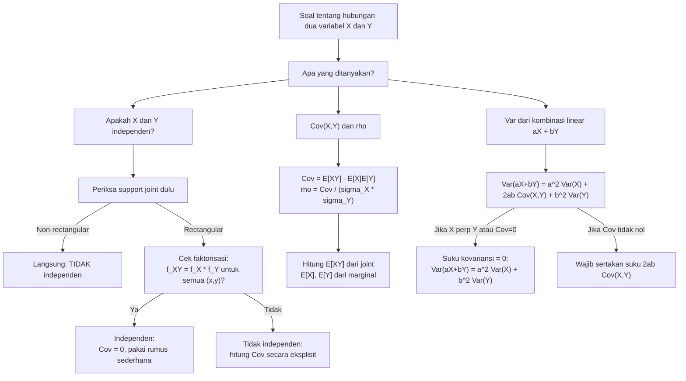

# 📊 3.5 — Independensi dan Korelasi

> [!ABSTRACT] Ringkasan Cepat
> **Topik:** Independensi dan Korelasi | **Bobot:** ~20–30% | **Difficulty:** Hard
> **Ref:** Hogg-McKean-Craig (2019) Bab 2.4–2.6; Miller et al. (2014) Bab 3.5–3.8, 4.6–4.9 | **Prereq:** [[3.2 Distribusi Marginal]], [[3.3 Distribusi Bersyarat (Conditional Distribution)]], [[2.3 Fungsi Pembangkit]]

## Section 0 — Pemetaan Topik

| Topik CF2 | Sub-topik ID | Skill Diuji | Bobot | Difficulty | Prerequisite | Connected Topics | Referensi |
|-----------|--------------|-------------|-------|------------|--------------|------------------|-----------|
| Topik 3: Variabel Acak Multivariat | 3.5 | Menguji independensi via faktorisasi joint, distribusi bersyarat, dan MGF joint; menghitung $\text{Cov}(X,Y)$ dari definisi dan rumus komputasional; menghitung $\rho_{X,Y}$; membuktikan independensi $\implies$ $\text{Cov}=0$ tetapi tidak sebaliknya; menghitung variansi penjumlahan variabel acak; menggunakan sifat MGF joint untuk menguji independensi | 20–30% | Hard | [[3.1 Distribusi Gabungan (Joint Distribution)]], [[3.2 Distribusi Marginal]], [[3.3 Distribusi Bersyarat (Conditional Distribution)]], [[3.4 Nilai Harapan dan Variansi Bersyarat]], [[2.3 Fungsi Pembangkit]] | [[3.6 Matriks Variansi-Kovariansi]], [[3.7 Distribusi Majemuk (Compound Distribution)]], [[3.8 Transformasi Variabel Acak Gabungan]], [[4.3 Teorema Limit Pusat (CLT)]] | Hogg-McKean-Craig (2019) Bab 2.4–2.6; Miller et al. (2014) Bab 3.5–3.8, 4.6–4.9, 5.8–5.10 |

## Section 1 — Intuisi

Dalam pemodelan risiko aktuaria, dua pertanyaan paling mendasar tentang sepasang variabel acak $(X, Y)$ adalah: apakah keduanya **saling mempengaruhi** (tidak independen), dan jika ya, **seberapa kuat dan ke arah mana** pengaruh tersebut (korelasi)? Bayangkan $X$ adalah klaim kebakaran dan $Y$ adalah klaim banjir di suatu wilayah. Jika wilayah tersebut mengalami musim panas ekstrem, kedua risiko kemungkinan meningkat bersama — keduanya tidak independen, dan korelasinya positif. Sebaliknya, klaim kesehatan individu muda yang sehat mungkin hampir tidak berkaitan dengan klaim kendaraan mereka — mendekati independen. Mengetahui apakah dua variabel risiko independen atau berkorelasi fundamental mengubah cara kita menghitung premi gabungan, cadangan, dan portofolio risiko.

**Independensi** adalah pernyataan paling kuat: mengetahui nilai $Y$ sama sekali tidak memberikan informasi apapun tentang distribusi $X$. Secara matematis, ini berarti distribusi bersyarat $X \mid Y = y$ identik dengan distribusi marginal $X$ untuk semua $y$ — kondisi $Y$ tidak mengubah apapun. Konsekuensi praktisnya besar: distribusi joint dapat difaktorkan menjadi produk marginal, MGF joint menjadi produk MGF masing-masing, dan variansi penjumlahan menjadi sederhana $\text{Var}(X+Y) = \text{Var}(X) + \text{Var}(Y)$.

**Korelasi** adalah ukuran yang lebih lemah dan lebih mudah dihitung: ia mengukur kekuatan hubungan *linear* antara $X$ dan $Y$, dikalibrasi ke skala $[-1, 1]$. Jebakan terbesar yang diuji di CF2 adalah arah implikasi yang *tidak* berlaku: independensi **selalu** mengimplikasikan korelasi nol, tetapi korelasi nol **tidak** mengimplikasikan independensi. Dua variabel bisa saling bergantung secara non-linear (misalnya $Y = X^2$) namun memiliki korelasi nol. Memahami perbedaan tajam antara "uncorrelated" dan "independent" adalah ujian pemahaman konseptual terpenting di topik ini.

## Section 2 — Definisi Formal

> [!NOTE] Definisi Matematis
>
> **Independensi dua variabel acak:**
>
> $X$ dan $Y$ dikatakan **independen** jika dan hanya jika salah satu dari kondisi berikut terpenuhi (semuanya ekuivalen):
> $$
> f_{X,Y}(x, y) = f_X(x)\, f_Y(y) \quad \text{untuk semua } (x, y) \in \mathbb{R}^2
> $$
> $$
> F_{X,Y}(x, y) = F_X(x)\, F_Y(y) \quad \text{untuk semua } (x, y) \in \mathbb{R}^2
> $$
> $$
> f_{X|Y}(x \mid y) = f_X(x) \quad \text{untuk semua } x \text{ dan setiap } y \text{ dengan } f_Y(y) > 0
> $$
>
> **Kovariansi:**
> $$
> \text{Cov}(X, Y) = E\!\left[(X - \mu_X)(Y - \mu_Y)\right] = E[XY] - E[X]\,E[Y]
> $$
>
> **Koefisien Korelasi Pearson:**
> $$
> \rho_{X,Y} = \frac{\text{Cov}(X,Y)}{\sqrt{\text{Var}(X)\,\text{Var}(Y)}} = \frac{\text{Cov}(X,Y)}{\sigma_X\, \sigma_Y}
> $$
>
> **MGF Joint dan Independensi:**
> $$
> M_{X,Y}(s,t) = E\!\left[e^{sX + tY}\right]; \quad X \perp Y \iff M_{X,Y}(s,t) = M_X(s)\,M_Y(t)
> $$

### Variabel & Parameter

| Simbol | Makna | Catatan |
|--------|-------|---------|
| $X \perp Y$ | $X$ dan $Y$ independen | Notasi standar untuk independensi statistik |
| $f_{X,Y}(x,y)$ | PDF/PMF joint dari $(X,Y)$ | Untuk independensi: harus sama dengan $f_X(x) f_Y(y)$ di **semua** titik |
| $\text{Cov}(X,Y)$ | Kovariansi antara $X$ dan $Y$ | Satuan: (satuan $X$) $\times$ (satuan $Y$); bisa negatif, nol, atau positif |
| $\rho_{X,Y}$ | Koefisien korelasi Pearson | Berdimensi, $\rho \in [-1, 1]$; $|\rho| = 1$ iff hubungan linear sempurna |
| $\sigma_X, \sigma_Y$ | Standar deviasi marginal $X$ dan $Y$ | $\sigma_X = \sqrt{\text{Var}(X)} > 0$ |
| $\mu_X, \mu_Y$ | Mean marginal $X$ dan $Y$ | $\mu_X = E[X]$, $\mu_Y = E[Y]$ |
| $E[XY]$ | Momen gabungan orde pertama | Dihitung dari distribusi joint: $\int\!\int xy\, f_{X,Y}(x,y)\,dx\,dy$ |
| $M_{X,Y}(s,t)$ | MGF joint dari $(X,Y)$ | $E[e^{sX+tY}]$; terdefinisi di sekitar $(s,t) = (0,0)$ |
| $M_X(t)$ | MGF marginal $X$ | $E[e^{tX}]$; diperoleh dari $M_{X,Y}(t, 0)$ |

### Rumus Utama

$$
\text{Cov}(X, Y) = E[XY] - E[X]\,E[Y]
$$
**Label: Rumus Komputasional Kovariansi** — lebih efisien dari definisi langsung; $E[XY]$ dihitung dari distribusi joint, $E[X]$ dan $E[Y]$ dari masing-masing marginal.

$$
\rho_{X,Y} = \frac{\text{Cov}(X,Y)}{\sigma_X \sigma_Y}, \qquad -1 \leq \rho_{X,Y} \leq 1
$$
**Label: Koefisien Korelasi** — normalisasi kovariansi agar bebas satuan; batas $\pm 1$ dijamin oleh ketidaksamaan Cauchy-Schwarz.

$$
X \perp Y \implies \text{Cov}(X,Y) = 0 \implies \rho_{X,Y} = 0
$$
$$
\text{Cov}(X,Y) = 0 \;\not\!\!\!\implies X \perp Y
$$
**Label: Arah Implikasi yang Benar** — independensi adalah kondisi yang lebih kuat dari non-korelasi; arah sebaliknya tidak berlaku secara umum.

$$
\text{Var}(aX + bY) = a^2\,\text{Var}(X) + b^2\,\text{Var}(Y) + 2ab\,\text{Cov}(X,Y)
$$
**Label: Variansi Kombinasi Linear** — rumus umum; jika $X \perp Y$, suku kovariansi gugur: $\text{Var}(aX+bY) = a^2\text{Var}(X) + b^2\text{Var}(Y)$.

$$
\text{Cov}(aX + b,\; cY + d) = ac\,\text{Cov}(X,Y)
$$
**Label: Sifat Kovariansi terhadap Transformasi Linear** — konstanta aditif tidak mempengaruhi kovariansi; konstanta multiplikatif dikalikan.

$$
\text{Cov}(X + Y,\; Z) = \text{Cov}(X, Z) + \text{Cov}(Y, Z)
$$
**Label: Bilinearitas Kovariansi** — kovariansi bersifat linear di kedua argumennya; berguna untuk memperluas kovariansi penjumlahan banyak variabel.

$$
\text{Var}\!\left(\sum_{i=1}^n X_i\right) = \sum_{i=1}^n \text{Var}(X_i) + 2\sum_{i < j} \text{Cov}(X_i, X_j)
$$
**Label: Variansi Penjumlahan $n$ Variabel** — jika semua $X_i$ saling independen berpasangan, semua kovariansi silang = 0 dan $\text{Var}(\sum X_i) = \sum \text{Var}(X_i)$.

$$
M_{X,Y}(s,t) = M_X(s)\,M_Y(t) \;\text{ untuk semua } (s,t) \iff X \perp Y
$$
**Label: Karakterisasi Independensi via MGF Joint** — MGF joint memfaktorkan menjadi produk MGF marginal jika dan hanya jika $X$ dan $Y$ independen; berguna sebagai uji independensi alternatif.

### Asumsi Eksplisit

- **Existensi momen:** $\text{Cov}(X,Y)$ terdefinisi jika $E[X^2] < \infty$ dan $E[Y^2] < \infty$. $\rho_{X,Y}$ terdefinisi jika tambahan $\text{Var}(X) > 0$ dan $\text{Var}(Y) > 0$ (keduanya non-degenerate).
- **Faktorisasi joint harus berlaku di semua titik:** Untuk membuktikan independensi via faktorisasi, persamaan $f_{X,Y}(x,y) = f_X(x) f_Y(y)$ harus berlaku untuk **semua** $(x,y)$, termasuk di luar support — tidak cukup memeriksa satu titik atau beberapa titik saja.
- **Support joint harus rectangular untuk independensi:** Jika support joint $\mathcal{X} \times \mathcal{Y}$ bukan persegi panjang (tidak dapat ditulis sebagai $A \times B$ untuk himpunan $A, B$ yang tidak bergantung satu sama lain), maka $X$ dan $Y$ **tidak mungkin** independen — ini adalah syarat perlu (bukan cukup) yang sering menjadi shortcut di soal CF2.
- **Korelasi hanya mengukur hubungan linear:** $\rho_{X,Y}$ bisa bernilai 0 meskipun ada hubungan non-linear yang kuat antara $X$ dan $Y$.

## Section 3 — Jembatan Logika

> [!TIP] Dari Definisi ke Rumus
> **Mengapa faktorisasi joint $\Leftrightarrow$ independensi?** Secara intuitif, $X$ independen dari $Y$ berarti mengetahui $Y = y$ tidak memberikan informasi tentang $X$. Secara formal: $f_{X|Y}(x \mid y) = f_X(x)$ untuk semua $y$. Substitusikan definisi distribusi bersyarat $f_{X|Y}(x \mid y) = f_{X,Y}(x,y)/f_Y(y)$, kita peroleh $f_{X,Y}(x,y)/f_Y(y) = f_X(x)$, yaitu $f_{X,Y}(x,y) = f_X(x) f_Y(y)$. Arah sebaliknya analogis. Ketiga karakterisasi (faktorisasi joint, faktorisasi CDF, dan distribusi bersyarat = marginal) semuanya ekuivalen dan dapat digunakan secara bergantian.
>
> **Mengapa independensi $\Rightarrow$ $\text{Cov}=0$?** Dari independensi, $f_{X,Y}(x,y) = f_X(x)f_Y(y)$. Maka: $E[XY] = \int\!\int xy\, f_X(x)f_Y(y)\,dx\,dy = \left(\int x f_X(x)\,dx\right)\!\left(\int y f_Y(y)\,dy\right) = E[X]\,E[Y]$. Jadi $\text{Cov}(X,Y) = E[XY] - E[X]E[Y] = 0$.
>
> **Mengapa $\text{Cov}=0$ $\not\Rightarrow$ independensi?** Kovariansi nol hanya menyatakan ketiadaan hubungan *linear*. Hubungan non-linear (kuadratik, siklik, dll.) tidak tertangkap oleh kovariansi. Contoh klasik: $X \sim U(-1,1)$ dan $Y = X^2$. Maka $E[X] = 0$, $E[XY] = E[X^3] = 0$ (simetri), sehingga $\text{Cov}(X,Y) = 0$. Namun $Y$ sepenuhnya ditentukan oleh $X$ — mereka sangat bergantung, bukan independen.

> [!IMPORTANT] Syarat Perlu Independensi: Support Rectangular
> Sebelum melakukan perhitungan faktorisasi, periksa support joint:
>
> **Jika support joint BUKAN rectangular** (contoh: $0 < x < y < 1$, $x + y < 1$, $x^2 + y^2 < 1$) → $X$ dan $Y$ **pasti tidak independen**, tanpa perlu perhitungan lebih lanjut.
>
> **Jika support joint rectangular** (contoh: $0 < x < 1$, $0 < y < 1$) → cek apakah $f_{X,Y}(x,y)$ dapat difaktorkan sebagai $g(x) \cdot h(y)$. Jika ya, $X$ dan $Y$ independen. Jika tidak, tidak independen.
>
> **Shortcut soal CF2:** Soal yang memberikan support non-rectangular dan bertanya "apakah $X$ dan $Y$ independen?" hampir selalu jawabannya "tidak" — dan alasannya cukup dengan menyebutkan support non-rectangular.

**Derivasi ketidaksamaan $|\rho_{X,Y}| \leq 1$ (dari Cauchy-Schwarz):**

Untuk sembarang $t \in \mathbb{R}$, definisikan $Z = (X - \mu_X) + t(Y - \mu_Y)$. Maka $\text{Var}(Z) \geq 0$:

$$
0 \leq \text{Var}(Z) = \text{Var}(X) + 2t\,\text{Cov}(X,Y) + t^2\,\text{Var}(Y) = \sigma_X^2 + 2t\,\text{Cov}(X,Y) + t^2\,\sigma_Y^2
$$

Ini adalah polinom kuadrat dalam $t$ yang selalu $\geq 0$, sehingga diskriminannya harus $\leq 0$:

$$
\Delta = 4\,[\text{Cov}(X,Y)]^2 - 4\,\sigma_X^2\,\sigma_Y^2 \leq 0 \implies [\text{Cov}(X,Y)]^2 \leq \sigma_X^2\,\sigma_Y^2
$$

$$
\therefore \quad \left|\frac{\text{Cov}(X,Y)}{\sigma_X\,\sigma_Y}\right| \leq 1 \implies |\rho_{X,Y}| \leq 1 \qquad \blacksquare
$$

Kesamaan $|\rho| = 1$ tercapai ketika $\text{Var}(Z) = 0$, yaitu ketika $Y - \mu_Y = -t^*(X - \mu_X)$ hampir pasti — hubungan linear deterministik.

**Derivasi variansi penjumlahan:**

$$
\text{Var}(X+Y) = E\!\left[(X+Y-\mu_X-\mu_Y)^2\right] = E\!\left[(X-\mu_X)^2 + 2(X-\mu_X)(Y-\mu_Y) + (Y-\mu_Y)^2\right]
$$
$$
= \text{Var}(X) + 2\,\text{Cov}(X,Y) + \text{Var}(Y)
$$

Untuk $n$ variabel: ekspansi $(X_1 + \cdots + X_n - \sum\mu_i)^2$ menghasilkan $n$ suku diagonal ($\text{Var}(X_i)$) dan $n(n-1)$ suku silang ($\text{Cov}(X_i, X_j)$ untuk $i \neq j$, muncul berpasangan).

> [!DANGER] Dilarang
> 1. **Dilarang menyimpulkan independensi hanya dari $\text{Cov}(X,Y) = 0$:** Non-korelasi adalah kondisi yang jauh lebih lemah dari independensi. Selalu gunakan faktorisasi joint atau karakterisasi distribusi bersyarat untuk membuktikan independensi — bukan kovariansi.
> 2. **Dilarang memeriksa faktorisasi hanya di satu atau beberapa titik:** Faktorisasi $f_{X,Y}(x,y) = f_X(x)f_Y(y)$ harus berlaku untuk **semua** $(x,y)$ agar dapat menyimpulkan independensi. Satu titik yang tidak memfaktorkan sudah cukup untuk menyimpulkan ketidakindependenan, tetapi ribuan titik yang memfaktorkan belum cukup untuk menyimpulkan independensi kecuali terbukti secara analitik untuk semua $(x,y)$.
> 3. **Dilarang menggunakan $\text{Var}(X+Y) = \text{Var}(X) + \text{Var}(Y)$ tanpa verifikasi independensi (atau minimal $\text{Cov}=0$):** Formula ini hanya berlaku ketika $\text{Cov}(X,Y) = 0$. Untuk variabel berkorelasi, suku $2\,\text{Cov}(X,Y)$ harus disertakan.

## Section 4 — Contoh Soal

### Soal A — Fundamental

Misalkan $(X, Y)$ memiliki PDF joint:

$$
f_{X,Y}(x,y) = \begin{cases} 4xy & 0 < x < 1,\; 0 < y < 1 \\ 0 & \text{lainnya} \end{cases}
$$

**(a)** Tentukan apakah $X$ dan $Y$ independen.
**(b)** Hitung $\text{Cov}(X, Y)$ dan $\rho_{X,Y}$.

> [!SUCCESS] Solusi Soal A
>
> **1. Identifikasi Variabel**
> - Support joint: persegi satuan $(0,1) \times (0,1)$ — **rectangular**. Independensi mungkin.
> - PDF joint: $4xy$ pada support rectangular. Periksa apakah dapat difaktorkan.
>
> **2. Identifikasi Distribusi / Model**
> - Distribusi kontinu bivariat dengan support rectangular. Strategi: uji faktorisasi analitik.
>
> **3. Setup Persamaan**
>
> Hitung PDF marginal, lalu periksa $f_{X,Y}(x,y) \stackrel{?}{=} f_X(x) \cdot f_Y(y)$.
>
> **4. Eksekusi Aljabar**
>
> **(a) Uji Independensi:**
>
> *PDF Marginal $f_X(x)$:*
> $$f_X(x) = \int_0^1 4xy\, dy = 4x \cdot \left[\frac{y^2}{2}\right]_0^1 = 4x \cdot \frac{1}{2} = 2x, \quad 0 < x < 1$$
>
> *PDF Marginal $f_Y(y)$:*
> $$f_Y(y) = \int_0^1 4xy\, dx = 4y \cdot \left[\frac{x^2}{2}\right]_0^1 = 4y \cdot \frac{1}{2} = 2y, \quad 0 < y < 1$$
>
> *Cek faktorisasi:*
> $$f_X(x) \cdot f_Y(y) = (2x)(2y) = 4xy = f_{X,Y}(x,y) \quad \text{untuk semua } (x,y) \in (0,1)^2$$
>
> $\therefore$ **$X$ dan $Y$ independen.**
>
> **(b) Kovariansi dan Korelasi:**
>
> Karena $X \perp Y$, **teorema langsung** menyatakan $\text{Cov}(X,Y) = 0$ dan $\rho_{X,Y} = 0$.
>
> Verifikasi via perhitungan eksplisit:
>
> $$E[X] = \int_0^1 x \cdot 2x\, dx = 2\int_0^1 x^2\, dx = 2 \cdot \frac{1}{3} = \frac{2}{3}$$
>
> $$E[Y] = \int_0^1 y \cdot 2y\, dy = \frac{2}{3} \quad \text{(simetri)}$$
>
> $$E[XY] = \int_0^1\!\int_0^1 xy \cdot 4xy\, dx\, dy = 4\int_0^1 x^2\, dx \cdot \int_0^1 y^2\, dy = 4 \cdot \frac{1}{3} \cdot \frac{1}{3} = \frac{4}{9}$$
>
> $$\text{Cov}(X,Y) = E[XY] - E[X]E[Y] = \frac{4}{9} - \frac{2}{3} \cdot \frac{2}{3} = \frac{4}{9} - \frac{4}{9} = 0 \checkmark$$
>
> $$\rho_{X,Y} = \frac{0}{\sigma_X \sigma_Y} = 0 \checkmark$$
>
> **5. Verification**
> - Faktorisasi berlaku untuk semua $(x,y) \in (0,1)^2$ secara analitik — bukan hanya di satu titik. ✓
> - $f_X(x) = 2x$ adalah PDF valid: $\int_0^1 2x\,dx = 1$ ✓
> - $f_Y(y) = 2y$ adalah PDF valid: $\int_0^1 2y\,dy = 1$ ✓
> - Independensi $\Rightarrow$ kovariansi nol: konsisten. ✓

> [!WARNING] Exam Tips — Soal A
> - **Target waktu:** 4–5 menit.
> - **Shortcut kunci:** Setelah mengidentifikasi bahwa $f_{X,Y}(x,y) = 4xy = (2x)(2y)$ dapat difaktorkan menjadi fungsi murni $x$ dikalikan fungsi murni $y$ pada support rectangular, langsung simpulkan independensi tanpa perlu menghitung marginal secara formal. Marginal hanya perlu dihitung untuk verifikasi atau jika soal memintanya secara eksplisit.
> - **Common trap:** Menyimpulkan bahwa karena $f_{X,Y}$ "terlihat seperti produk", independensi berlaku — perlu memastikan marginalnya benar-benar konsisten (tidak ada konstanta normalisasi yang tertinggal). Cara paling aman: hitung kedua marginal, lalu periksa produknya.

---

### Soal B — Exam-Typical

Misalkan $(X, Y)$ memiliki PDF joint:

$$
f_{X,Y}(x,y) = \begin{cases} \dfrac{3}{2}(x^2 + y^2) & 0 < x < 1,\; 0 < y < 1 \\ 0 & \text{lainnya} \end{cases}
$$

**(a)** Tentukan apakah $X$ dan $Y$ independen.
**(b)** Hitung $\text{Cov}(X, Y)$ dan $\rho_{X,Y}$.
**(c)** Hitung $\text{Var}(2X - 3Y)$.

> [!SUCCESS] Solusi Soal B
>
> **1. Identifikasi Variabel**
> - Support joint: persegi satuan — rectangular. Perlu cek faktorisasi.
> - $f_{X,Y}(x,y) = \frac{3}{2}(x^2 + y^2)$: bentuk penjumlahan (bukan perkalian) — kemungkinan tidak dapat difaktorkan.
>
> **2. Identifikasi Distribusi / Model**
> - Distribusi kontinu bivariat; karena joint berbentuk $x^2 + y^2$ (penjumlahan, bukan perkalian), dicurigai tidak independen.
>
> **3. Setup Persamaan**
>
> Hitung marginal, periksa faktorisasi, lalu hitung $E[X]$, $E[Y]$, $E[XY]$ untuk kovariansi.
>
> **4. Eksekusi Aljabar**
>
> **(a) Uji Independensi:**
>
> *PDF Marginal $f_X(x)$:*
> $$f_X(x) = \frac{3}{2}\int_0^1 (x^2 + y^2)\, dy = \frac{3}{2}\left[x^2 y + \frac{y^3}{3}\right]_0^1 = \frac{3}{2}\left(x^2 + \frac{1}{3}\right) = \frac{3x^2 + 1}{2}, \quad 0 < x < 1$$
>
> *PDF Marginal $f_Y(y)$:*
> $$f_Y(y) = \frac{3y^2 + 1}{2}, \quad 0 < y < 1 \quad \text{(simetri dalam } x \leftrightarrow y\text{)}$$
>
> *Cek faktorisasi:*
> $$f_X(x) \cdot f_Y(y) = \frac{(3x^2+1)(3y^2+1)}{4} = \frac{9x^2y^2 + 3x^2 + 3y^2 + 1}{4}$$
>
> Sementara:
> $$f_{X,Y}(x,y) = \frac{3}{2}(x^2 + y^2) = \frac{3x^2 + 3y^2}{2}$$
>
> Karena $\frac{9x^2y^2 + 3x^2 + 3y^2 + 1}{4} \neq \frac{3x^2 + 3y^2}{2}$ (misal di $x=y=1$: $\frac{9+3+3+1}{4} = 4 \neq \frac{3+3}{2} = 3$), maka **$X$ dan $Y$ tidak independen.**
>
> **(b) Kovariansi dan Korelasi:**
>
> *Menghitung $E[X]$:*
> $$E[X] = \int_0^1 x \cdot \frac{3x^2+1}{2}\, dx = \frac{1}{2}\int_0^1 (3x^3 + x)\, dx = \frac{1}{2}\left[\frac{3x^4}{4} + \frac{x^2}{2}\right]_0^1 = \frac{1}{2}\left(\frac{3}{4} + \frac{1}{2}\right) = \frac{1}{2} \cdot \frac{5}{4} = \frac{5}{8}$$
>
> Oleh simetri $x \leftrightarrow y$: $E[Y] = \dfrac{5}{8}$.
>
> *Menghitung $E[XY]$ dari distribusi joint:*
> $$E[XY] = \frac{3}{2}\int_0^1\!\int_0^1 xy(x^2 + y^2)\, dx\, dy = \frac{3}{2}\int_0^1\!\int_0^1 (x^3 y + xy^3)\, dx\, dy$$
>
> Karena integran simetris dalam $x \leftrightarrow y$:
> $$= \frac{3}{2} \cdot 2\int_0^1\!\int_0^1 x^3 y\, dx\, dy = 3\int_0^1 x^3\, dx \cdot \int_0^1 y\, dy = 3 \cdot \frac{1}{4} \cdot \frac{1}{2} = \frac{3}{8}$$
>
> *Kovariansi:*
> $$\text{Cov}(X,Y) = E[XY] - E[X]E[Y] = \frac{3}{8} - \frac{5}{8} \cdot \frac{5}{8} = \frac{3}{8} - \frac{25}{64} = \frac{24}{64} - \frac{25}{64} = -\frac{1}{64}$$
>
> *Menghitung $\text{Var}(X)$:*
> $$E[X^2] = \int_0^1 x^2 \cdot \frac{3x^2+1}{2}\, dx = \frac{1}{2}\int_0^1 (3x^4 + x^2)\, dx = \frac{1}{2}\left[\frac{3x^5}{5} + \frac{x^3}{3}\right]_0^1 = \frac{1}{2}\left(\frac{3}{5} + \frac{1}{3}\right) = \frac{1}{2} \cdot \frac{14}{15} = \frac{7}{15}$$
>
> $$\text{Var}(X) = E[X^2] - (E[X])^2 = \frac{7}{15} - \left(\frac{5}{8}\right)^2 = \frac{7}{15} - \frac{25}{64} = \frac{448}{960} - \frac{375}{960} = \frac{73}{960}$$
>
> Oleh simetri: $\text{Var}(Y) = \dfrac{73}{960}$.
>
> *Koefisien Korelasi:*
> $$\rho_{X,Y} = \frac{\text{Cov}(X,Y)}{\sqrt{\text{Var}(X)\,\text{Var}(Y)}} = \frac{-1/64}{\sqrt{(73/960)^2}} = \frac{-1/64}{73/960} = -\frac{1}{64} \cdot \frac{960}{73} = -\frac{960}{4672} = -\frac{15}{73}$$
>
> **(c) Variansi Kombinasi Linear:**
> $$\text{Var}(2X - 3Y) = 4\,\text{Var}(X) + 9\,\text{Var}(Y) - 2(2)(3)\,\text{Cov}(X,Y)$$
> $$= 4 \cdot \frac{73}{960} + 9 \cdot \frac{73}{960} - 12 \cdot \left(-\frac{1}{64}\right)$$
> $$= \frac{292}{960} + \frac{657}{960} + \frac{12}{64} = \frac{949}{960} + \frac{180}{960} = \frac{1129}{960}$$
>
> **5. Verification**
> - $\text{Cov}(X,Y) = -1/64 < 0$: korelasi negatif lemah. Intuitif karena $f_{X,Y}(x,y) = \frac{3}{2}(x^2+y^2)$ memberikan bobot lebih pada nilai besar $(x,y)$ secara simetris, tetapi suku $x^2+y^2$ (bukan $xy$) menunjukkan tidak ada preferensi untuk keduanya besar bersamaan — korelasi negatif kecil masuk akal. ✓
> - $\rho_{X,Y} = -15/73 \approx -0.205 \in (-1,1)$ ✓
> - $\text{Var}(2X-3Y) > 0$ ✓
> - Karena koefisien $-3Y$ lebih besar dari $2X$ dan $\text{Cov} < 0$, suku $-12\text{Cov}$ bernilai positif (menambah variansi) — konsisten dengan intuisi: korelasi negatif antara $X$ dan $Y$ berarti $X$ dan $-Y$ berkorelasi positif, sehingga $2X-3Y$ lebih tersebar. ✓

> [!WARNING] Exam Tips — Soal B
> - **Target waktu:** 10–12 menit.
> - **Common trap — formula $\text{Var}(aX+bY)$:** Untuk $\text{Var}(2X - 3Y)$, koefisien $b = -3$ sehingga $b^2 = 9$ (positif) dan suku kovariansi adalah $2(2)(-3)\text{Cov}(X,Y) = -12\text{Cov}(X,Y)$. Dengan $\text{Cov} < 0$, suku ini bernilai $+12/64 > 0$. Kesalahan umum adalah melupakan tanda pada $b$ saat mengkuadratkan, atau salah menentukan tanda suku kovariansi.
> - **Shortcut $E[XY]$ dengan simetri:** Gunakan simetri $f_{X,Y}(x,y) = f_{X,Y}(y,x)$ untuk menyederhanakan integral ganda — seperti yang dilakukan di atas dengan memanfaatkan $\int\int x^3y\,dx\,dy = \int\int xy^3\,dx\,dy$.
> - **Cek non-independensi cepat:** Sebelum menghitung marginal, perhatikan bahwa $x^2 + y^2$ tidak bisa difaktorkan sebagai $g(x)h(y)$ — ini langsung mengindikasikan ketidakindependenan tanpa perlu menghitung marginal.

---

### Soal C — Challenging

Misalkan $X$ dan $Y$ adalah variabel acak dengan $\text{Var}(X) = 4$, $\text{Var}(Y) = 9$, dan $\rho_{X,Y} = -\frac{1}{2}$.

**(a)** Hitung $\text{Cov}(X, Y)$.
**(b)** Hitung $\text{Var}(X + Y)$ dan $\text{Var}(X - Y)$.
**(c)** Misalkan $U = 2X + Y$ dan $V = X - 2Y$. Hitung $\text{Cov}(U, V)$ dan $\rho_{U,V}$.
**(d)** Definisikan $W = aX + bY$ untuk konstanta $a, b$. Tentukan nilai $a/b$ sedemikian sehingga $\text{Cov}(W, X) = 0$.

> [!SUCCESS] Solusi Soal C
>
> **1. Identifikasi Variabel**
> - $\sigma_X = \sqrt{4} = 2$, $\sigma_Y = \sqrt{9} = 3$, $\rho_{X,Y} = -1/2$.
> - Tidak ada distribusi spesifik yang disebutkan — soal hanya menggunakan momen orde dua.
>
> **2. Identifikasi Distribusi / Model**
> - Soal murni aljabar momen: gunakan sifat bilinearitas kovariansi dan rumus $\text{Var}$ kombinasi linear.
>
> **3. Setup Persamaan**
>
> Semua perhitungan menggunakan:
> $$\text{Cov}(aX+bY,\, cX+dY) = ac\,\text{Var}(X) + (ad+bc)\,\text{Cov}(X,Y) + bd\,\text{Var}(Y)$$
>
> **4. Eksekusi Aljabar**
>
> **(a) Kovariansi $\text{Cov}(X,Y)$:**
> $$\text{Cov}(X,Y) = \rho_{X,Y} \cdot \sigma_X \cdot \sigma_Y = \left(-\frac{1}{2}\right)(2)(3) = -3$$
>
> **(b) Variansi penjumlahan dan selisih:**
> $$\text{Var}(X+Y) = \text{Var}(X) + 2\,\text{Cov}(X,Y) + \text{Var}(Y) = 4 + 2(-3) + 9 = 4$$
>
> $$\text{Var}(X-Y) = \text{Var}(X) - 2\,\text{Cov}(X,Y) + \text{Var}(Y) = 4 - 2(-3) + 9 = 19$$
>
> **(c) Kovariansi dan Korelasi $U = 2X+Y$, $V = X-2Y$:**
>
> *Kovariansi $\text{Cov}(U,V)$:*
> $$\text{Cov}(2X+Y,\; X-2Y)$$
> $$= 2(1)\,\text{Var}(X) + [2(-2) + 1(1)]\,\text{Cov}(X,Y) + (1)(-2)\,\text{Var}(Y)$$
> $$= 2(4) + (-4+1)(-3) + (-2)(9)$$
> $$= 8 + (-3)(-3) - 18 = 8 + 9 - 18 = -1$$
>
> *Variansi $U$ dan $V$:*
> $$\text{Var}(U) = \text{Var}(2X+Y) = 4\,\text{Var}(X) + 4\,\text{Cov}(X,Y) + \text{Var}(Y) = 4(4) + 4(-3) + 9 = 16 - 12 + 9 = 13$$
>
> $$\text{Var}(V) = \text{Var}(X-2Y) = \text{Var}(X) - 4\,\text{Cov}(X,Y) + 4\,\text{Var}(Y) = 4 - 4(-3) + 4(9) = 4 + 12 + 36 = 52$$
>
> *Koefisien Korelasi $\rho_{U,V}$:*
> $$\rho_{U,V} = \frac{\text{Cov}(U,V)}{\sqrt{\text{Var}(U)\,\text{Var}(V)}} = \frac{-1}{\sqrt{13 \cdot 52}} = \frac{-1}{\sqrt{676}} = \frac{-1}{26}$$
>
> **(d) Kondisi $\text{Cov}(W, X) = 0$:**
>
> $$\text{Cov}(aX+bY,\; X) = a\,\text{Var}(X) + b\,\text{Cov}(Y,X) = 4a + b(-3) = 4a - 3b$$
>
> Syarat $\text{Cov}(W,X) = 0$:
> $$4a - 3b = 0 \implies \frac{a}{b} = \frac{3}{4}$$
>
> **5. Verification**
> - $\text{Cov}(X,Y) = -3$: $|\rho| = 1/2$, $\text{Cov} = \rho\sigma_X\sigma_Y = (-1/2)(2)(3) = -3$ ✓
> - $\text{Var}(X+Y) = 4$: menarik — variansi penjumlahan lebih kecil dari $\text{Var}(X)$ saja karena korelasi negatif kuat antara $X$ dan $Y$ "saling menghilangkan" fluktuasi. Ini adalah prinsip diversifikasi risiko! ✓
> - $\sqrt{13 \cdot 52} = \sqrt{676} = 26$: cek $13 \times 52 = 13 \times 4 \times 13 = 4 \times 169 = 676 = 26^2$ ✓
> - $\rho_{U,V} = -1/26 \in (-1,1)$ ✓
> - Rasio $a/b = 3/4$: substitusi $a = 3$, $b = 4$: $\text{Cov}(3X+4Y, X) = 3(4) + 4(-3) = 12 - 12 = 0$ ✓

> [!WARNING] Exam Tips — Soal C
> - **Target waktu:** 10–12 menit.
> - **Formula ekspansi kovariansi kombinasi linear — wajib hafal:**
>   $$\text{Cov}(aX+bY,\; cX+dY) = ac\,\sigma_X^2 + (ad+bc)\,\text{Cov}(X,Y) + bd\,\sigma_Y^2$$
>   Ini adalah "FOIL" untuk kovariansi. Hafalkan pola ini — soal tipe (c) sangat umum di CF2.
> - **Common trap — tanda pada suku kovariansi:** Untuk $\text{Var}(X-Y) = \text{Var}(X) + \text{Var}(Y) - 2\text{Cov}(X,Y)$: karena $\text{Cov} < 0$, suku $-2\text{Cov} > 0$, sehingga $\text{Var}(X-Y) > \text{Var}(X+Y)$ — jangan asumsikan selisih selalu memiliki variansi lebih kecil.
> - **Bagian (d) adalah tipe soal ortogonalisasi:** Kondisi $\text{Cov}(W,X) = 0$ berarti $W = aX+bY$ "ortogonal" terhadap $X$ — ini muncul dalam konteks regresi linear dan portofolio minimum variansi di aktuaria.

## Section 5 — Verifikasi & Sanity Check

> [!CHECK] Validasi Koefisien Korelasi
> - $\rho_{X,Y} \in [-1, 1]$ selalu. Jika hasil perhitungan keluar dari interval ini, ada kesalahan.
> - $|\rho_{X,Y}| = 1$ hanya jika $Y = aX + b$ hampir pasti untuk konstanta $a \neq 0$ dan $b$.
> - $\rho_{X,Y} = 0$ tidak berarti independensi; hanya mengindikasikan ketiadaan hubungan linear.

> [!CHECK] Validasi Kovariansi
> - $\text{Cov}(X,X) = \text{Var}(X) \geq 0$.
> - $\text{Cov}(X,Y) = \text{Cov}(Y,X)$ (simetri).
> - Jika $X$ dan $Y$ independen: $\text{Cov}(X,Y) = 0$ — ini dapat digunakan sebagai cek konsistensi.
> - $|\text{Cov}(X,Y)| \leq \sigma_X \sigma_Y$ (dari $|\rho| \leq 1$) — kovariansi dibatasi oleh produk standar deviasi.

> [!CHECK] Validasi Variansi Kombinasi Linear
> - $\text{Var}(aX+bY) \geq 0$ selalu — jika hasil negatif, ada kesalahan.
> - Untuk independen: $\text{Var}(X+Y) = \text{Var}(X-Y) = \text{Var}(X) + \text{Var}(Y)$.
> - Untuk korelasi negatif kuat: $\text{Var}(X+Y) < \text{Var}(X)$ dan $\text{Var}(X+Y) < \text{Var}(Y)$ mungkin terjadi — ini adalah prinsip diversifikasi.

> [!CHECK] Uji Independensi — Tiga Cara
> - **Via faktorisasi joint:** $f_{X,Y}(x,y) = f_X(x)f_Y(y)$ untuk semua $(x,y)$.
> - **Via distribusi bersyarat:** $f_{X|Y}(x \mid y) = f_X(x)$ untuk semua $x$ dan $y$.
> - **Via MGF joint:** $M_{X,Y}(s,t) = M_X(s)M_Y(t)$ untuk semua $(s,t)$.
> - Ketiga cara ini ekuivalen; pilih yang paling mudah untuk bentuk $f_{X,Y}$ yang diberikan.

### Metode Alternatif

**Uji independensi via kernel faktorisasi (shortcut):**

Jika $f_{X,Y}(x,y)$ pada support rectangular dapat ditulis sebagai $c \cdot g(x) \cdot h(y)$ untuk fungsi non-negatif $g$ dan $h$ dan konstanta $c > 0$, maka $X \perp Y$ dengan $f_X(x) \propto g(x)$ dan $f_Y(y) \propto h(y)$ (konstanta normalisasi diserap ke $c$). Tidak perlu menghitung marginal secara eksplisit untuk menyimpulkan independensi.

**Menghitung $\text{Cov}(X,Y)$ via Hukum Ekspektasi Total:**

Jika distribusi bersyarat diketahui:
$$\text{Cov}(X,Y) = E[XY] - E[X]E[Y] = E[E[XY \mid Y]] - E[X]E[Y] = E[Y \cdot E[X \mid Y]] - E[X]E[Y]$$

Berguna ketika $E[X \mid Y]$ mudah dihitung tetapi $f_{X,Y}$ kompleks (terhubung ke [[3.4 Nilai Harapan dan Variansi Bersyarat]]).

## Section 6 — Visualisasi Mental

**Diagram pencar (scatterplot) sebagai visualisasi korelasi:** Bayangkan titik-titik $(x_i, y_i)$ tersebar di bidang $xy$. Korelasi positif kuat ($\rho \approx 1$): titik-titik membentuk elips miring ke kanan atas — nilai besar $X$ cenderung bersamaan dengan nilai besar $Y$. Korelasi negatif kuat ($\rho \approx -1$): elips miring ke kanan bawah. Korelasi nol ($\rho = 0$): elips mendekati lingkaran atau persegi panjang — tidak ada kecenderungan arah. Namun perhatikan: titik-titik bisa membentuk parabola (hubungan kuadratik kuat) dengan $\rho = 0$ — korelasi tidak menangkap hubungan non-linear.

**Visualisasi dekomposisi variansi penjumlahan:** Bayangkan $\text{Var}(X+Y)$ sebagai luas total dari dua kuadrat (masing-masing bersisi $\sigma_X$ dan $\sigma_Y$) ditambah dua persegi panjang kovariansi (bersisi $\sigma_X$ dan $\sigma_Y$ dengan tanda sesuai $\text{Cov}$). Untuk korelasi negatif, persegi panjang kovariansi "mengurangi" luas total — variansi penjumlahan lebih kecil dari jumlah variansi masing-masing. Ini adalah prinsip **diversifikasi risiko** dalam asuransi dan investasi.

**Elips kontur PDF bivariat normal:** Untuk distribusi normal bivariat (yang tidak wajib diketahui di CF2 tetapi membantu intuisi), kontur PDF berbentuk elips. Sumbu utama elips sejajar koordinat jika $\rho = 0$ (independen); elips miring jika $\rho \neq 0$. Semakin $|\rho|$ mendekati 1, elips semakin "gepeng" dan memanjang — mendekati garis lurus ketika $|\rho| = 1$.

### Hubungan Visual ↔ Rumus

Kemiringan elips kontur $\leftrightarrow$ tanda $\text{Cov}(X,Y)$:
$$\text{Cov}(X,Y) > 0 \leftrightarrow \text{elips miring ke kanan atas (tren positif)}$$
$$\text{Cov}(X,Y) < 0 \leftrightarrow \text{elips miring ke kanan bawah (tren negatif)}$$

Normalisasi kovariansi ke $[-1,1]$:
$$\rho_{X,Y} = \frac{\text{Cov}(X,Y)}{\sigma_X \sigma_Y} \longleftrightarrow \text{"gepengnya" elips, bebas satuan}$$

Variansi penjumlahan dan suku kovariansi:
$$\text{Var}(X+Y) = \sigma_X^2 + 2\,\text{Cov}(X,Y) + \sigma_Y^2 \longleftrightarrow \text{luas total dengan koreksi kovariansi}$$

## Section 7 — Jebakan Umum

> [!BUG] Kesalahan Parametrisasi
> **Kesalahan Tanda pada Rumus $\text{Var}(aX + bY)$:**
>
> *Salah:* $\text{Var}(X - Y) = \text{Var}(X) - \text{Var}(Y)$
>
> *Benar:* $\text{Var}(X - Y) = \text{Var}(X) - 2\,\text{Cov}(X,Y) + \text{Var}(Y)$
>
> Variansi selalu non-negatif dan tidak bisa "dikurangi" seperti ekspektasi. Dengan $b = -1$: $b^2 = 1$ (bukan $-1$) dan suku kovariansi menjadi $2(1)(-1)\text{Cov}(X,Y) = -2\,\text{Cov}(X,Y)$.
>
> **Kesalahan Arah Implikasi:**
>
> *Salah:* "$\text{Cov}(X,Y) = 0$ maka $X$ dan $Y$ independen"
>
> *Benar:* "$\text{Cov}(X,Y) = 0$" hanya berarti tidak ada hubungan **linear**; $X$ dan $Y$ bisa sangat bergantung secara non-linear.

> [!BUG] Kesalahan Konseptual
> 1. **Menggunakan $\text{Var}(X+Y) = \text{Var}(X) + \text{Var}(Y)$ tanpa verifikasi $\text{Cov}=0$.** Rumus ini hanya berlaku ketika $X$ dan $Y$ tidak berkorelasi (atau independen). Untuk variabel berkorelasi, suku $2\text{Cov}(X,Y)$ harus selalu disertakan.
> 2. **Memeriksa faktorisasi hanya di satu titik untuk menyimpulkan independensi.** Verifikasi $f_{X,Y}(x_0,y_0) = f_X(x_0)f_Y(y_0)$ untuk satu titik $(x_0,y_0)$ tidak cukup — faktorisasi harus berlaku untuk semua titik pada support. Sebaliknya, menemukan satu titik di mana faktorisasi gagal sudah cukup untuk menyimpulkan ketidakindependenan.
> 3. **Lupa syarat support rectangular untuk independensi.** Jika support joint bergantung pada kedua variabel (non-rectangular), $X$ dan $Y$ tidak mungkin independen — tidak perlu cek faktorisasi lebih lanjut.
> 4. **Mengira $\text{Cov}(X, g(Y)) = 0$ jika $\text{Cov}(X,Y) = 0$.** Non-korelasi antara $X$ dan $Y$ tidak menjamin non-korelasi antara $X$ dan $g(Y)$ untuk fungsi non-linear $g$.

> [!BUG] Kesalahan Interpretasi Soal
> - **"$X$ dan $Y$ tidak berkorelasi"** → $\text{Cov}(X,Y) = 0$, **bukan** independensi. Jangan gunakan rumus independensi.
> - **"$X$ dan $Y$ independen"** → boleh gunakan $\text{Var}(X+Y) = \text{Var}(X) + \text{Var}(Y)$, faktorisasi joint, dan $E[XY] = E[X]E[Y]$.
> - **"Buktikan $X$ dan $Y$ independen"** → harus tunjukkan faktorisasi analitik untuk semua $(x,y)$, bukan hanya hitung kovariansi nol.
> - **Soal memberikan $\rho$ dan meminta $\text{Cov}$** → gunakan $\text{Cov}(X,Y) = \rho \cdot \sigma_X \cdot \sigma_Y$; jangan lupa menghitung $\sigma_X$ dan $\sigma_Y$ dari $\text{Var}$ terlebih dahulu.

> [!CAUTION] Red Flags
> - **Support joint non-rectangular** (kata kunci: $0 < x < y$, $x + y < 1$, $|x| + |y| < 1$): langsung simpulkan $X$ dan $Y$ **tidak independen** tanpa perhitungan lebih lanjut.
> - **PDF joint berbentuk penjumlahan** $f_{X,Y} \propto g(x) + h(y)$ (bukan perkalian): hampir pasti tidak bisa difaktorkan → tidak independen. Cek dengan menghitung marginal.
> - **PDF joint berbentuk perkalian** $f_{X,Y} \propto g(x) \cdot h(y)$ **pada support rectangular**: kemungkinan independen — lakukan verifikasi faktorisasi formal.
> - **Soal meminta $\text{Var}$ dari penjumlahan/selisih banyak variabel**: selalu periksa apakah semua pasangan independen atau berkorelasi sebelum menyederhanakan.
> - **Soal menyebut "diversifikasi" atau "portofolio"**: ini adalah konteks di mana korelasi negatif mengurangi variansi total — gunakan rumus $\text{Var}(X+Y)$ lengkap dengan suku kovariansi.

## Section 8 — Ringkasan Eksekutif

> [!SUMMARY] Must-Remember
> 1. **Tiga cara ekuivalen menguji independensi (pilih yang termudah):**
>    $$X \perp Y \iff f_{X,Y}(x,y) = f_X(x)f_Y(y) \iff f_{X|Y}(x|y) = f_X(x) \iff M_{X,Y}(s,t) = M_X(s)M_Y(t)$$
> 2. **Rumus komputasional kovariansi:**
>    $$\text{Cov}(X,Y) = E[XY] - E[X]\,E[Y]$$
> 3. **Koefisien korelasi dan batasnya:**
>    $$\rho_{X,Y} = \frac{\text{Cov}(X,Y)}{\sigma_X\,\sigma_Y} \in [-1, 1]$$
> 4. **Variansi kombinasi linear — rumus penuh:**
>    $$\text{Var}(aX + bY) = a^2\,\text{Var}(X) + 2ab\,\text{Cov}(X,Y) + b^2\,\text{Var}(Y)$$
> 5. **Arah implikasi yang benar (jebakan paling sering diuji):**
>    $$X \perp Y \implies \text{Cov}(X,Y) = 0, \quad \text{tetapi} \quad \text{Cov}(X,Y) = 0 \;\not\!\!\!\implies X \perp Y$$

### Kapan Digunakan

- **Trigger keywords:** "apakah $X$ dan $Y$ independen?", "hitung kovariansi", "hitung korelasi", "variansi penjumlahan", "$\text{Var}(X+Y)$", "saling bebas", "tidak berkorelasi", "koefisien korelasi", "diversifikasi risiko".
- **Tipe skenario soal:**
  - Diberikan PDF joint; tentukan independensi via faktorisasi; hitung $\text{Cov}$ dan $\rho$.
  - Diberikan momen marginal dan $\rho$; hitung $\text{Var}$ dari kombinasi linear.
  - Hitung $\text{Cov}(U,V)$ di mana $U$ dan $V$ adalah kombinasi linear dari $X$ dan $Y$.
  - Tentukan kondisi pada konstanta agar dua kombinasi linear tidak berkorelasi.
  - Buktikan bahwa $X$ dan $Y$ independen atau tidak, menggunakan tiga karakterisasi yang tersedia.

### Kapan TIDAK Boleh Digunakan

- **Jika soal meminta distribusi bersyarat $f_{X|Y}(x|y)$:** Ini adalah topik [[3.3 Distribusi Bersyarat (Conditional Distribution)]] — distribusi bersyarat adalah fungsi penuh, bukan hanya ukuran skalar seperti kovariansi.
- **Jika soal meminta dekomposisi $\text{Var}(X) = E[\text{Var}(X|Y)] + \text{Var}(E[X|Y])$:** Ini adalah Hukum Variansi Total dari [[3.4 Nilai Harapan dan Variansi Bersyarat]] — berbeda dari formula $\text{Var}(X+Y)$ di topik ini.
- **Jika korelasi nol sudah ditetapkan dan soal menanyakan tentang independensi:** Non-korelasi tidak cukup — perlu uji faktorisasi atau karakterisasi distribusi bersyarat untuk menjawab pertanyaan independensi.

### Quick Decision Tree

---

> [!QUOTE] Follow-up Options
> 1. *"Berikan contoh soal di mana $\text{Cov}(X,Y)=0$ tetapi $X$ dan $Y$ jelas tidak independen, dan buktikan ketidakindependenannya"*
> 2. *"Jelaskan hubungan [[3.5 Independensi dan Korelasi]] dengan [[3.6 Matriks Variansi-Kovariansi]] untuk kasus lebih dari dua variabel acak"*
> 3. *"Buat flashcard 1-halaman untuk topik ini"*

*📖 Ref: Hogg-McKean-Craig (2019) Bab 2.4–2.6; Miller et al. (2014) Bab 3.5–3.8, 4.6–4.9, 5.8–5.10 | 🗓️ 2026-02-21 | #CF2 #Multivariat #Independensi #Korelasi #Kovariansi #MGF #KoefisienKorelasi*
