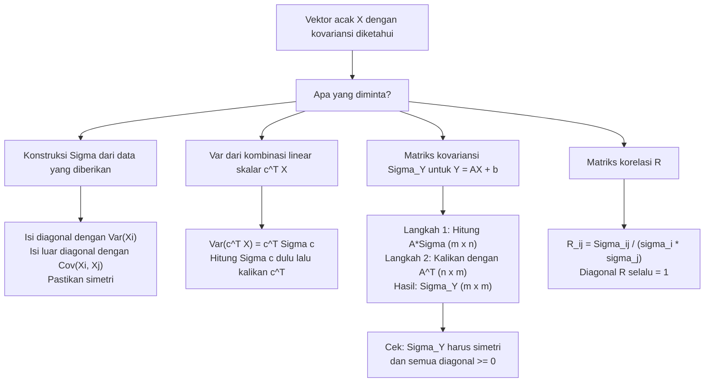

# 📊 3.6 — Matriks Variansi-Kovariansi

> [!ABSTRACT] Ringkasan Cepat
> **Topik:** Matriks Variansi-Kovariansi | **Bobot:** ~20–30% | **Difficulty:** Medium
> **Ref:** Hogg-McKean-Craig (2019) Bab 2.4–2.6; Miller et al. (2014) Bab 4.6–4.9 | **Prereq:** [[3.5 Independensi dan Korelasi]], [[3.4 Nilai Harapan dan Variansi Bersyarat]], [[3.1 Distribusi Gabungan (Joint Distribution)]]

## Section 0 — Pemetaan Topik

| Topik CF2 | Sub-topik ID | Skill Diuji | Bobot | Difficulty | Prerequisite | Connected Topics | Referensi |
|-----------|--------------|-------------|-------|------------|--------------|------------------|-----------|
| Topik 3: Variabel Acak Multivariat | 3.6 | Mendefinisikan dan mengonstruksi matriks variansi-kovariansi $\boldsymbol{\Sigma}$ dari vektor acak $\mathbf{X}$; memverifikasi sifat simetri dan positif semi-definitif; menghitung $\boldsymbol{\Sigma}$ secara eksplisit dari entri kovariansi; menurunkan matriks korelasi dari $\boldsymbol{\Sigma}$; menerapkan rumus transformasi linear $\text{Var}(\mathbf{A}\mathbf{X} + \mathbf{b}) = \mathbf{A}\boldsymbol{\Sigma}\mathbf{A}^T$; menghitung $\text{Var}(\mathbf{c}^T\mathbf{X})$ untuk kombinasi linear skalar | 20–30% | Medium | [[3.5 Independensi dan Korelasi]], [[3.4 Nilai Harapan dan Variansi Bersyarat]], [[3.1 Distribusi Gabungan (Joint Distribution)]], [[2.1 Variabel Acak Diskrit]], [[2.2 Variabel Acak Kontinu]] | [[3.7 Distribusi Majemuk (Compound Distribution)]], [[3.8 Transformasi Variabel Acak Gabungan]], [[4.2 Distribusi Sampel]], [[4.3 Teorema Limit Pusat (CLT)]] | Hogg-McKean-Craig (2019) Bab 2.4–2.6; Miller et al. (2014) Bab 4.6–4.9 |

## Section 1 — Intuisi

Pada topik [[3.5 Independensi dan Korelasi]], kita mempelajari kovariansi dan korelasi untuk **sepasang** variabel acak $(X, Y)$. Namun dalam praktik aktuaria dan statistika, kita hampir selalu bekerja dengan **lebih dari dua** variabel acak sekaligus — misalnya klaim dari tiga lini bisnis (jiwa, kesehatan, kendaraan), atau lima faktor risiko dalam model kredit. Ketika ada $n$ variabel acak $X_1, X_2, \ldots, X_n$, ada $\binom{n}{2}$ pasangan kovariansi yang berbeda, ditambah $n$ variansi individual. Cara paling elegan dan kompak untuk mengorganisasi semua informasi ini adalah dengan sebuah **matriks** — inilah matriks variansi-kovariansi $\boldsymbol{\Sigma}$.

Bayangkan $\boldsymbol{\Sigma}$ sebagai "peta hubungan" lengkap antar semua variabel dalam vektor acak $\mathbf{X} = (X_1, X_2, \ldots, X_n)^T$. Diagonal utama matriks berisi variansi masing-masing variabel ($\sigma_i^2 = \text{Var}(X_i)$), yang mencerminkan "risiko individual". Entri di luar diagonal berisi kovariansi antar pasangan ($\sigma_{ij} = \text{Cov}(X_i, X_j)$), yang mencerminkan "ketergantungan antar risiko". Dengan representasi matriks ini, operasi yang kompleks seperti menghitung variansi dari kombinasi linear banyak variabel — misalnya variansi dari portofolio $w_1 X_1 + w_2 X_2 + \cdots + w_n X_n$ — menjadi ekspresi matriks yang elegan: $\mathbf{w}^T \boldsymbol{\Sigma} \mathbf{w}$.

Dua sifat matematis $\boldsymbol{\Sigma}$ yang paling penting adalah **simetri** (karena $\text{Cov}(X_i, X_j) = \text{Cov}(X_j, X_i)$) dan **positif semi-definitif** (karena variansi tidak bisa negatif). Sifat kedua adalah fondasi dari mengapa $\mathbf{w}^T \boldsymbol{\Sigma} \mathbf{w} \geq 0$ untuk semua vektor bobot $\mathbf{w}$ — yang persis merupakan pernyataan bahwa variansi portofolio tidak mungkin negatif. Memahami matriks $\boldsymbol{\Sigma}$ membuka pintu ke analisis portofolio, analisis komponen utama (PCA), dan distribusi normal multivariat yang menjadi fondasi banyak model aktuaria modern.

## Section 2 — Definisi Formal

> [!NOTE] Definisi Matematis
>
> Misalkan $\mathbf{X} = (X_1, X_2, \ldots, X_n)^T$ adalah **vektor acak** (kolom) dengan $E[X_i] = \mu_i$ untuk $i = 1, \ldots, n$.
>
> **Vektor Mean:**
> $$
> \boldsymbol{\mu} = E[\mathbf{X}] = \begin{pmatrix} \mu_1 \\ \mu_2 \\ \vdots \\ \mu_n \end{pmatrix} = \begin{pmatrix} E[X_1] \\ E[X_2] \\ \vdots \\ E[X_n] \end{pmatrix}
> $$
>
> **Matriks Variansi-Kovariansi (Covariance Matrix):**
> $$
> \boldsymbol{\Sigma} = \text{Var}(\mathbf{X}) = E\!\left[(\mathbf{X} - \boldsymbol{\mu})(\mathbf{X} - \boldsymbol{\mu})^T\right]
> $$
>
> dengan entri ke-$(i,j)$:
> $$
> \boldsymbol{\Sigma}_{ij} = \text{Cov}(X_i, X_j) = E[(X_i - \mu_i)(X_j - \mu_j)]
> $$
>
> Secara eksplisit untuk $n = 3$:
> $$
> \boldsymbol{\Sigma} = \begin{pmatrix} \text{Var}(X_1) & \text{Cov}(X_1,X_2) & \text{Cov}(X_1,X_3) \\ \text{Cov}(X_2,X_1) & \text{Var}(X_2) & \text{Cov}(X_2,X_3) \\ \text{Cov}(X_3,X_1) & \text{Cov}(X_3,X_2) & \text{Var}(X_3) \end{pmatrix} = \begin{pmatrix} \sigma_1^2 & \sigma_{12} & \sigma_{13} \\ \sigma_{12} & \sigma_2^2 & \sigma_{23} \\ \sigma_{13} & \sigma_{23} & \sigma_3^2 \end{pmatrix}
> $$
>
> **Rumus Transformasi Linear:**
> $$
> \text{Var}(\mathbf{A}\mathbf{X} + \mathbf{b}) = \mathbf{A}\,\boldsymbol{\Sigma}\,\mathbf{A}^T
> $$
> untuk matriks konstanta $\mathbf{A}$ ($m \times n$) dan vektor konstanta $\mathbf{b}$ ($m \times 1$).

### Variabel & Parameter

| Simbol | Makna | Catatan |
|--------|-------|---------|
| $\mathbf{X} = (X_1, \ldots, X_n)^T$ | Vektor acak kolom berukuran $n \times 1$ | Setiap $X_i$ adalah variabel acak skalar |
| $\boldsymbol{\mu} = E[\mathbf{X}]$ | Vektor mean berukuran $n \times 1$ | $\boldsymbol{\mu}_i = E[X_i] = \mu_i$ |
| $\boldsymbol{\Sigma}$ | Matriks variansi-kovariansi berukuran $n \times n$ | Simetri dan positif semi-definitif |
| $\boldsymbol{\Sigma}_{ij} = \sigma_{ij}$ | Entri ke-$(i,j)$ dari $\boldsymbol{\Sigma}$ | $\sigma_{ij} = \text{Cov}(X_i, X_j)$; untuk $i = j$: $\sigma_{ii} = \sigma_i^2 = \text{Var}(X_i)$ |
| $\sigma_i^2$ | Variansi dari $X_i$ | Entri diagonal ke-$i$; selalu $\geq 0$ |
| $\sigma_i = \sqrt{\sigma_i^2}$ | Standar deviasi dari $X_i$ | Selalu $> 0$ (untuk variabel non-degenerate) |
| $\mathbf{A}$ | Matriks konstanta berukuran $m \times n$ | Digunakan dalam transformasi linear $\mathbf{Y} = \mathbf{A}\mathbf{X} + \mathbf{b}$ |
| $\mathbf{b}$ | Vektor konstanta berukuran $m \times 1$ | Tidak mempengaruhi matriks kovariansi hasil transformasi |
| $\mathbf{c}$ | Vektor konstanta berukuran $n \times 1$ | Untuk kombinasi linear skalar: $Y = \mathbf{c}^T \mathbf{X}$ |
| $\mathbf{R}$ | Matriks korelasi berukuran $n \times n$ | $R_{ij} = \rho_{ij} = \sigma_{ij}/(\sigma_i \sigma_j)$; diagonal = 1 |
| $\mathbf{D}$ | Matriks diagonal standar deviasi berukuran $n \times n$ | $\mathbf{D} = \text{diag}(\sigma_1, \sigma_2, \ldots, \sigma_n)$; $\boldsymbol{\Sigma} = \mathbf{D}\mathbf{R}\mathbf{D}$ |

### Rumus Utama

$$
\boldsymbol{\Sigma} = E\!\left[(\mathbf{X} - \boldsymbol{\mu})(\mathbf{X} - \boldsymbol{\mu})^T\right] = E[\mathbf{X}\mathbf{X}^T] - \boldsymbol{\mu}\boldsymbol{\mu}^T
$$
**Label: Definisi dan Rumus Komputasional $\boldsymbol{\Sigma}$** — analog matriks dari $\text{Var}(X) = E[X^2] - (E[X])^2$; digunakan ketika $E[\mathbf{X}\mathbf{X}^T]$ lebih mudah dihitung dari definisi.

$$
\text{Var}(\mathbf{A}\mathbf{X} + \mathbf{b}) = \mathbf{A}\,\boldsymbol{\Sigma}\,\mathbf{A}^T
$$
**Label: Hukum Transformasi Linear Matriks Kovariansi** — analog matriks dari $\text{Var}(aX + b) = a^2 \text{Var}(X)$; vektor konstanta $\mathbf{b}$ tidak mempengaruhi hasil; matriks $\mathbf{A}$ "mengapit" $\boldsymbol{\Sigma}$ dari kiri dan kanan (transpos).

$$
\text{Var}(\mathbf{c}^T\mathbf{X}) = \mathbf{c}^T\boldsymbol{\Sigma}\,\mathbf{c} \geq 0
$$
**Label: Variansi Kombinasi Linear Skalar** — kasus khusus transformasi linear dengan $\mathbf{A} = \mathbf{c}^T$ (vektor baris $1 \times n$); hasilnya adalah skalar non-negatif; ini membuktikan $\boldsymbol{\Sigma}$ positif semi-definitif.

$$
\boldsymbol{\Sigma}^T = \boldsymbol{\Sigma}
$$
**Label: Simetri $\boldsymbol{\Sigma}$** — karena $\text{Cov}(X_i, X_j) = \text{Cov}(X_j, X_i)$; matriks simetri memiliki $\frac{n(n+1)}{2}$ entri unik (bukan $n^2$).

$$
\mathbf{R}_{ij} = \rho_{ij} = \frac{\sigma_{ij}}{\sigma_i \sigma_j}, \qquad \boldsymbol{\Sigma} = \mathbf{D}\mathbf{R}\mathbf{D}
$$
**Label: Matriks Korelasi dan Dekomposisi** — di mana $\mathbf{D} = \text{diag}(\sigma_1, \ldots, \sigma_n)$; matriks korelasi $\mathbf{R}$ memiliki diagonal = 1 dan entri luar diagonal $\in [-1, 1]$.

$$
E[\mathbf{A}\mathbf{X} + \mathbf{b}] = \mathbf{A}\,\boldsymbol{\mu} + \mathbf{b}
$$
**Label: Linieritas Ekspektasi Vektor** — analog matriks dari $E[aX+b] = aE[X]+b$; berlaku komponen per komponen.

$$
X_1, X_2, \ldots, X_n \text{ saling independen} \implies \boldsymbol{\Sigma} = \text{diag}(\sigma_1^2, \sigma_2^2, \ldots, \sigma_n^2)
$$
**Label: Matriks Kovariansi untuk Variabel Independen** — jika semua variabel saling independen, semua kovariansi silang = 0 dan $\boldsymbol{\Sigma}$ menjadi matriks diagonal.

### Asumsi Eksplisit

- **Existensi momen orde dua:** Semua $E[X_i^2] < \infty$ untuk $i = 1, \ldots, n$ agar setiap $\text{Var}(X_i)$ dan $\text{Cov}(X_i, X_j)$ terdefinisi.
- **$\boldsymbol{\Sigma}$ positif semi-definitif:** $\mathbf{c}^T \boldsymbol{\Sigma} \mathbf{c} \geq 0$ untuk semua $\mathbf{c} \in \mathbb{R}^n$ — ini dijamin secara otomatis dari definisi, bukan asumsi tambahan.
- **$\boldsymbol{\Sigma}$ positif definitif:** $\mathbf{c}^T \boldsymbol{\Sigma} \mathbf{c} > 0$ untuk semua $\mathbf{c} \neq \mathbf{0}$ — berlaku jika tidak ada kombinasi linear deterministik antar komponen $\mathbf{X}$; kondisi yang lebih kuat dan tidak selalu terpenuhi.
- **Dimensi konsisten:** Dalam $\text{Var}(\mathbf{A}\mathbf{X} + \mathbf{b}) = \mathbf{A}\boldsymbol{\Sigma}\mathbf{A}^T$, jika $\mathbf{X}$ berukuran $n \times 1$ dan $\mathbf{A}$ berukuran $m \times n$, maka $\boldsymbol{\Sigma}$ berukuran $n \times n$ dan hasilnya $\mathbf{A}\boldsymbol{\Sigma}\mathbf{A}^T$ berukuran $m \times m$.

## Section 3 — Jembatan Logika

> [!TIP] Dari Definisi ke Rumus
> Rumus $\boldsymbol{\Sigma} = E[(\mathbf{X}-\boldsymbol{\mu})(\mathbf{X}-\boldsymbol{\mu})^T]$ adalah perluasan langsung dari definisi skalar $\text{Var}(X) = E[(X-\mu)^2]$. Perkalian luar (*outer product*) $(\mathbf{X}-\boldsymbol{\mu})(\mathbf{X}-\boldsymbol{\mu})^T$ menghasilkan matriks $n \times n$ di mana entri ke-$(i,j)$ adalah $(X_i - \mu_i)(X_j - \mu_j)$. Mengambil ekspektasi komponen per komponen menghasilkan $E[(X_i-\mu_i)(X_j-\mu_j)] = \text{Cov}(X_i, X_j) = \sigma_{ij}$. Entri diagonal adalah $E[(X_i-\mu_i)^2] = \text{Var}(X_i) = \sigma_i^2$.
>
> Rumus transformasi linear $\text{Var}(\mathbf{A}\mathbf{X}) = \mathbf{A}\boldsymbol{\Sigma}\mathbf{A}^T$ diturunkan dari kasus skalar. Untuk satu kombinasi linear $Y = \mathbf{c}^T\mathbf{X} = \sum_i c_i X_i$: dari [[3.5 Independensi dan Korelasi]], $\text{Var}(Y) = \sum_i \sum_j c_i c_j \text{Cov}(X_i, X_j) = \sum_i \sum_j c_i \sigma_{ij} c_j = \mathbf{c}^T \boldsymbol{\Sigma} \mathbf{c}$. Ketika $\mathbf{A}$ memiliki $m$ baris, setiap baris $\mathbf{a}_k^T$ mendefinisikan kombinasi linear $Y_k = \mathbf{a}_k^T \mathbf{X}$, dan $\text{Cov}(Y_k, Y_l) = \mathbf{a}_k^T \boldsymbol{\Sigma} \mathbf{a}_l = (\mathbf{A}\boldsymbol{\Sigma}\mathbf{A}^T)_{kl}$.

> [!IMPORTANT] Positif Semi-Definitif — Mengapa Penting
> Sifat positif semi-definitif dari $\boldsymbol{\Sigma}$ bukan sekadar sifat teknis — ia memiliki makna probabilistik mendalam:
>
> **Makna probabilistik:** $\mathbf{c}^T\boldsymbol{\Sigma}\mathbf{c} = \text{Var}(\mathbf{c}^T\mathbf{X}) \geq 0$ untuk semua $\mathbf{c}$ — variansi dari kombinasi linear manapun tidak pernah negatif. Ini adalah konsekuensi langsung dari sifat variansi yang non-negatif.
>
> **Konsekuensi untuk matriks:** Semua nilai eigen (*eigenvalue*) dari $\boldsymbol{\Sigma}$ adalah non-negatif. Determinan $\det(\boldsymbol{\Sigma}) \geq 0$. Matriks kovariansi tidak dapat di-invers jika ada kombinasi linear deterministik (misal $X_3 = 2X_1 + X_2$ hampir pasti) — karena saat itu $\det(\boldsymbol{\Sigma}) = 0$.
>
> **Konsekuensi untuk CF2:** Ketika soal memberikan matriks kovariansi, dapat diasumsikan bahwa matriks tersebut positif semi-definitif. Namun ketika **mengonstruksi** matriks kovariansi dari data yang diberikan, perlu diperiksa konsistensinya (semua variansi $\geq 0$, dan koefisien korelasi $\in [-1,1]$).

**Derivasi $\boldsymbol{\Sigma} = E[\mathbf{X}\mathbf{X}^T] - \boldsymbol{\mu}\boldsymbol{\mu}^T$ (rumus komputasional):**

$$
\boldsymbol{\Sigma} = E\!\left[(\mathbf{X}-\boldsymbol{\mu})(\mathbf{X}-\boldsymbol{\mu})^T\right]
$$
$$
= E\!\left[\mathbf{X}\mathbf{X}^T - \mathbf{X}\boldsymbol{\mu}^T - \boldsymbol{\mu}\mathbf{X}^T + \boldsymbol{\mu}\boldsymbol{\mu}^T\right]
$$
$$
= E[\mathbf{X}\mathbf{X}^T] - E[\mathbf{X}]\boldsymbol{\mu}^T - \boldsymbol{\mu} E[\mathbf{X}]^T + \boldsymbol{\mu}\boldsymbol{\mu}^T
$$
$$
= E[\mathbf{X}\mathbf{X}^T] - \boldsymbol{\mu}\boldsymbol{\mu}^T - \boldsymbol{\mu}\boldsymbol{\mu}^T + \boldsymbol{\mu}\boldsymbol{\mu}^T = E[\mathbf{X}\mathbf{X}^T] - \boldsymbol{\mu}\boldsymbol{\mu}^T
$$

di mana digunakan $E[\mathbf{X}] = \boldsymbol{\mu}$ dan $E[\mathbf{X}\boldsymbol{\mu}^T] = E[\mathbf{X}]\boldsymbol{\mu}^T = \boldsymbol{\mu}\boldsymbol{\mu}^T$ (karena $\boldsymbol{\mu}$ adalah konstanta).

**Derivasi Rumus Transformasi Linear:**

Misalkan $\mathbf{Y} = \mathbf{A}\mathbf{X} + \mathbf{b}$. Maka $E[\mathbf{Y}] = \mathbf{A}\boldsymbol{\mu} + \mathbf{b}$. Vektor deviasi:
$$
\mathbf{Y} - E[\mathbf{Y}] = \mathbf{A}\mathbf{X} + \mathbf{b} - \mathbf{A}\boldsymbol{\mu} - \mathbf{b} = \mathbf{A}(\mathbf{X} - \boldsymbol{\mu})
$$

Matriks kovariansi $\mathbf{Y}$:
$$
\text{Var}(\mathbf{Y}) = E\!\left[(\mathbf{Y}-E[\mathbf{Y}])(\mathbf{Y}-E[\mathbf{Y}])^T\right] = E\!\left[\mathbf{A}(\mathbf{X}-\boldsymbol{\mu})(\mathbf{X}-\boldsymbol{\mu})^T\mathbf{A}^T\right]
$$
$$
= \mathbf{A}\,E\!\left[(\mathbf{X}-\boldsymbol{\mu})(\mathbf{X}-\boldsymbol{\mu})^T\right]\mathbf{A}^T = \mathbf{A}\,\boldsymbol{\Sigma}\,\mathbf{A}^T \qquad \blacksquare
$$

Catatan: $\mathbf{A}$ dapat dikeluarkan dari ekspektasi karena merupakan matriks konstanta.

> [!DANGER] Dilarang
> 1. **Dilarang menulis $\text{Var}(\mathbf{A}\mathbf{X}) = \mathbf{A}^T\boldsymbol{\Sigma}\mathbf{A}$** (urutan $\mathbf{A}$ dan $\mathbf{A}^T$ terbalik): rumus yang benar adalah $\mathbf{A}\boldsymbol{\Sigma}\mathbf{A}^T$ — matriks $\mathbf{A}$ mengapit $\boldsymbol{\Sigma}$ dari **kiri**, dan transposnya $\mathbf{A}^T$ dari **kanan**. Tanda transpos ada di sisi kanan.
> 2. **Dilarang mengasumsikan $\boldsymbol{\Sigma}$ selalu dapat diinvers (positif definitif):** $\boldsymbol{\Sigma}$ hanya positif semi-definitif secara umum; jika ada kombinasi linear deterministik antar komponen $\mathbf{X}$, maka $\det(\boldsymbol{\Sigma}) = 0$ dan $\boldsymbol{\Sigma}^{-1}$ tidak ada. Selalu verifikasi konteks sebelum menggunakan invers.
> 3. **Dilarang mengonstruksi matriks kovariansi dengan nilai di luar batas:** Setiap entri diagonal harus $\sigma_i^2 \geq 0$, dan setiap koefisien korelasi $\rho_{ij} = \sigma_{ij}/(\sigma_i \sigma_j)$ harus berada di $[-1, 1]$. Matriks dengan entri yang melanggar batas ini bukan matriks kovariansi yang valid (tidak positif semi-definitif).

## Section 4 — Contoh Soal

### Soal A — Fundamental

Misalkan $\mathbf{X} = (X_1, X_2, X_3)^T$ adalah vektor acak dengan:
- $\text{Var}(X_1) = 4$, $\text{Var}(X_2) = 9$, $\text{Var}(X_3) = 1$
- $\text{Cov}(X_1, X_2) = -3$, $\text{Cov}(X_1, X_3) = 2$, $\text{Cov}(X_2, X_3) = 0$

**(a)** Tuliskan matriks variansi-kovariansi $\boldsymbol{\Sigma}$.
**(b)** Tuliskan matriks korelasi $\mathbf{R}$.
**(c)** Tentukan $\text{Var}(2X_1 - X_2 + 3X_3)$ menggunakan $\mathbf{c}^T\boldsymbol{\Sigma}\mathbf{c}$.

> [!SUCCESS] Solusi Soal A
>
> **1. Identifikasi Variabel**
> - $n = 3$: vektor acak tiga komponen.
> - $\sigma_1^2 = 4$, $\sigma_2^2 = 9$, $\sigma_3^2 = 1$; $\sigma_{12} = -3$, $\sigma_{13} = 2$, $\sigma_{23} = 0$.
> - $\sigma_1 = 2$, $\sigma_2 = 3$, $\sigma_3 = 1$.
>
> **2. Identifikasi Distribusi / Model**
> - Tidak perlu distribusi spesifik — soal murni konstruksi dan komputasi matriks kovariansi.
>
> **3. Setup Persamaan**
>
> Matriks $\boldsymbol{\Sigma}$ berukuran $3 \times 3$ simetri dengan entri diagonal = variansi dan entri luar diagonal = kovariansi.
>
> **4. Eksekusi Aljabar**
>
> **(a) Matriks Variansi-Kovariansi $\boldsymbol{\Sigma}$:**
>
> $$
> \boldsymbol{\Sigma} = \begin{pmatrix} \sigma_1^2 & \sigma_{12} & \sigma_{13} \\ \sigma_{12} & \sigma_2^2 & \sigma_{23} \\ \sigma_{13} & \sigma_{23} & \sigma_3^2 \end{pmatrix} = \begin{pmatrix} 4 & -3 & 2 \\ -3 & 9 & 0 \\ 2 & 0 & 1 \end{pmatrix}
> $$
>
> **(b) Matriks Korelasi $\mathbf{R}$:**
>
> $$
> \rho_{12} = \frac{\sigma_{12}}{\sigma_1 \sigma_2} = \frac{-3}{(2)(3)} = -\frac{1}{2}
> $$
> $$
> \rho_{13} = \frac{\sigma_{13}}{\sigma_1 \sigma_3} = \frac{2}{(2)(1)} = 1
> $$
> $$
> \rho_{23} = \frac{\sigma_{23}}{\sigma_2 \sigma_3} = \frac{0}{(3)(1)} = 0
> $$
>
> $$
> \mathbf{R} = \begin{pmatrix} 1 & -1/2 & 1 \\ -1/2 & 1 & 0 \\ 1 & 0 & 1 \end{pmatrix}
> $$
>
> **(c) Variansi kombinasi linear $Y = 2X_1 - X_2 + 3X_3$:**
>
> Vektor koefisien: $\mathbf{c} = (2, -1, 3)^T$.
>
> $$
> \text{Var}(Y) = \mathbf{c}^T\boldsymbol{\Sigma}\,\mathbf{c}
> $$
>
> Hitung $\boldsymbol{\Sigma}\mathbf{c}$ terlebih dahulu:
> $$
> \boldsymbol{\Sigma}\mathbf{c} = \begin{pmatrix} 4 & -3 & 2 \\ -3 & 9 & 0 \\ 2 & 0 & 1 \end{pmatrix} \begin{pmatrix} 2 \\ -1 \\ 3 \end{pmatrix} = \begin{pmatrix} 4(2) + (-3)(-1) + 2(3) \\ (-3)(2) + 9(-1) + 0(3) \\ 2(2) + 0(-1) + 1(3) \end{pmatrix} = \begin{pmatrix} 8 + 3 + 6 \\ -6 - 9 + 0 \\ 4 + 0 + 3 \end{pmatrix} = \begin{pmatrix} 17 \\ -15 \\ 7 \end{pmatrix}
> $$
>
> Kemudian:
> $$
> \text{Var}(Y) = \mathbf{c}^T(\boldsymbol{\Sigma}\mathbf{c}) = (2, -1, 3)\begin{pmatrix} 17 \\ -15 \\ 7 \end{pmatrix} = 2(17) + (-1)(-15) + 3(7) = 34 + 15 + 21 = 70
> $$
>
> **Verifikasi via ekspansi langsung** (dari [[3.5 Independensi dan Korelasi]]):
> $$
> \text{Var}(2X_1 - X_2 + 3X_3) = 4\sigma_1^2 + \sigma_2^2 + 9\sigma_3^2 + 2(2)(-1)\sigma_{12} + 2(2)(3)\sigma_{13} + 2(-1)(3)\sigma_{23}
> $$
> $$
> = 4(4) + 1(9) + 9(1) + (-4)(-3) + 12(2) + (-6)(0)
> $$
> $$
> = 16 + 9 + 9 + 12 + 24 + 0 = 70 \checkmark
> $$
>
> **5. Verification**
> - $\boldsymbol{\Sigma}$ simetri: entri $(1,2) = (2,1) = -3$; entri $(1,3) = (3,1) = 2$; entri $(2,3) = (3,2) = 0$ ✓
> - Semua variansi $\geq 0$: $4, 9, 1 > 0$ ✓
> - $\rho_{12} = -1/2 \in [-1,1]$, $\rho_{13} = 1 \in [-1,1]$, $\rho_{23} = 0 \in [-1,1]$ ✓
> - **Perhatian:** $\rho_{13} = 1$ mengindikasikan hubungan linear sempurna antara $X_1$ dan $X_3$. Ini berarti $X_3 = \frac{\sigma_3}{\sigma_1}X_1 + c$ hampir pasti untuk suatu $c$, sehingga $\boldsymbol{\Sigma}$ singular ($\det(\boldsymbol{\Sigma}) = 0$).
> - $\text{Var}(Y) = 70 > 0$ ✓

> [!WARNING] Exam Tips — Soal A
> - **Target waktu:** 6–8 menit.
> - **Common trap — simetri:** Pastikan entri $(i,j)$ sama dengan entri $(j,i)$. Saat mengisi matriks, isi diagonal dulu, lalu isi bagian atas dan cerminkan ke bagian bawah (atau sebaliknya).
> - **Shortcut bagian (c):** Untuk tiga variabel, cara tercetat adalah ekspansi langsung menggunakan rumus variansi kombinasi linear dari [[3.5 Independensi dan Korelasi]] dengan hati-hati terhadap koefisien silang $2c_ic_j\sigma_{ij}$. Metode $\mathbf{c}^T\boldsymbol{\Sigma}\mathbf{c}$ lebih sistematis untuk banyak variabel tetapi membutuhkan perkalian matriks-vektor.
> - **Red flag:** $\rho_{13} = 1$ adalah nilai batas yang valid secara matematis tetapi mengindikasikan matriks singular — soal exam yang baik biasanya menghindari ini kecuali sengaja menguji pemahaman tentang degenerasi.

---

### Soal B — Exam-Typical

Misalkan $\mathbf{X} = (X_1, X_2)^T$ memiliki matriks variansi-kovariansi:
$$
\boldsymbol{\Sigma}_X = \begin{pmatrix} 5 & 2 \\ 2 & 8 \end{pmatrix}
$$
dan $E[\mathbf{X}] = \boldsymbol{\mu} = (3, -1)^T$.

Definisikan transformasi linear $\mathbf{Y} = \mathbf{A}\mathbf{X} + \mathbf{b}$ dengan:
$$
\mathbf{A} = \begin{pmatrix} 1 & 2 \\ -1 & 1 \\ 3 & 0 \end{pmatrix}, \qquad \mathbf{b} = \begin{pmatrix} 1 \\ 0 \\ -2 \end{pmatrix}
$$

**(a)** Hitung $E[\mathbf{Y}]$.
**(b)** Hitung $\boldsymbol{\Sigma}_Y = \text{Var}(\mathbf{Y})$.
**(c)** Hitung $\text{Var}(Y_1 - Y_3)$ dari $\boldsymbol{\Sigma}_Y$.

> [!SUCCESS] Solusi Soal B
>
> **1. Identifikasi Variabel**
> - $\mathbf{X}$: vektor $2 \times 1$; $\mathbf{A}$: matriks $3 \times 2$; $\mathbf{b}$: vektor $3 \times 1$.
> - Hasil $\mathbf{Y} = \mathbf{A}\mathbf{X} + \mathbf{b}$: vektor $3 \times 1$.
> - $\boldsymbol{\Sigma}_Y$ akan berukuran $3 \times 3$.
>
> **2. Identifikasi Distribusi / Model**
> - Soal murni komputasi transformasi linear vektor acak. Terapkan $E[\mathbf{Y}] = \mathbf{A}\boldsymbol{\mu} + \mathbf{b}$ dan $\boldsymbol{\Sigma}_Y = \mathbf{A}\boldsymbol{\Sigma}_X\mathbf{A}^T$.
>
> **3. Setup Persamaan**
> $$E[\mathbf{Y}] = \mathbf{A}\boldsymbol{\mu} + \mathbf{b}, \qquad \boldsymbol{\Sigma}_Y = \mathbf{A}\,\boldsymbol{\Sigma}_X\,\mathbf{A}^T$$
>
> **4. Eksekusi Aljabar**
>
> **(a) Mean $E[\mathbf{Y}]$:**
> $$
> \mathbf{A}\boldsymbol{\mu} = \begin{pmatrix} 1 & 2 \\ -1 & 1 \\ 3 & 0 \end{pmatrix}\begin{pmatrix} 3 \\ -1 \end{pmatrix} = \begin{pmatrix} 1(3)+2(-1) \\ -1(3)+1(-1) \\ 3(3)+0(-1) \end{pmatrix} = \begin{pmatrix} 1 \\ -4 \\ 9 \end{pmatrix}
> $$
> $$
> E[\mathbf{Y}] = \mathbf{A}\boldsymbol{\mu} + \mathbf{b} = \begin{pmatrix} 1 \\ -4 \\ 9 \end{pmatrix} + \begin{pmatrix} 1 \\ 0 \\ -2 \end{pmatrix} = \begin{pmatrix} 2 \\ -4 \\ 7 \end{pmatrix}
> $$
>
> **(b) Matriks Kovariansi $\boldsymbol{\Sigma}_Y = \mathbf{A}\boldsymbol{\Sigma}_X\mathbf{A}^T$:**
>
> *Langkah 1 — Hitung $\mathbf{A}\boldsymbol{\Sigma}_X$:*
> $$
> \mathbf{A}\boldsymbol{\Sigma}_X = \begin{pmatrix} 1 & 2 \\ -1 & 1 \\ 3 & 0 \end{pmatrix}\begin{pmatrix} 5 & 2 \\ 2 & 8 \end{pmatrix}
> $$
> $$
> = \begin{pmatrix} 1(5)+2(2) & 1(2)+2(8) \\ -1(5)+1(2) & -1(2)+1(8) \\ 3(5)+0(2) & 3(2)+0(8) \end{pmatrix} = \begin{pmatrix} 9 & 18 \\ -3 & 6 \\ 15 & 6 \end{pmatrix}
> $$
>
> *Langkah 2 — Hitung $(\mathbf{A}\boldsymbol{\Sigma}_X)\mathbf{A}^T$:*
> $$
> \mathbf{A}^T = \begin{pmatrix} 1 & -1 & 3 \\ 2 & 1 & 0 \end{pmatrix}
> $$
> $$
> \boldsymbol{\Sigma}_Y = \begin{pmatrix} 9 & 18 \\ -3 & 6 \\ 15 & 6 \end{pmatrix}\begin{pmatrix} 1 & -1 & 3 \\ 2 & 1 & 0 \end{pmatrix}
> $$
>
> Entri demi entri:
> $$
> (1,1): 9(1)+18(2) = 9+36 = 45
> $$
> $$
> (1,2): 9(-1)+18(1) = -9+18 = 9
> $$
> $$
> (1,3): 9(3)+18(0) = 27
> $$
> $$
> (2,1): -3(1)+6(2) = -3+12 = 9
> $$
> $$
> (2,2): -3(-1)+6(1) = 3+6 = 9
> $$
> $$
> (2,3): -3(3)+6(0) = -9
> $$
> $$
> (3,1): 15(1)+6(2) = 15+12 = 27
> $$
> $$
> (3,2): 15(-1)+6(1) = -15+6 = -9
> $$
> $$
> (3,3): 15(3)+6(0) = 45
> $$
>
> $$
> \boldsymbol{\Sigma}_Y = \begin{pmatrix} 45 & 9 & 27 \\ 9 & 9 & -9 \\ 27 & -9 & 45 \end{pmatrix}
> $$
>
> **(c) $\text{Var}(Y_1 - Y_3)$:**
>
> Baca langsung dari $\boldsymbol{\Sigma}_Y$:
> $$
> \text{Var}(Y_1 - Y_3) = \text{Var}(Y_1) + \text{Var}(Y_3) - 2\,\text{Cov}(Y_1, Y_3)
> $$
> $$
> = \boldsymbol{\Sigma}_{Y,11} + \boldsymbol{\Sigma}_{Y,33} - 2\boldsymbol{\Sigma}_{Y,13} = 45 + 45 - 2(27) = 90 - 54 = 36
> $$
>
> Alternatif via $\mathbf{c}^T\boldsymbol{\Sigma}_Y\mathbf{c}$ dengan $\mathbf{c} = (1, 0, -1)^T$:
> $$
> \text{Var}(Y_1-Y_3) = (1,0,-1)\begin{pmatrix} 45 & 9 & 27 \\ 9 & 9 & -9 \\ 27 & -9 & 45 \end{pmatrix}\begin{pmatrix} 1 \\ 0 \\ -1 \end{pmatrix}
> $$
> $$
> = (1,0,-1)\begin{pmatrix} 45-27 \\ 9+9 \\ 27-45 \end{pmatrix} = (1,0,-1)\begin{pmatrix} 18 \\ 18 \\ -18 \end{pmatrix} = 18 + 0 + 18 = 36 \checkmark
> $$
>
> **5. Verification**
> - $\boldsymbol{\Sigma}_Y$ simetri: $(1,2)=(2,1)=9$; $(1,3)=(3,1)=27$; $(2,3)=(3,2)=-9$ ✓
> - Semua entri diagonal $> 0$: $45, 9, 45 > 0$ ✓
> - $\text{Var}(Y_1-Y_3) = 36 > 0$ ✓
> - Korelasi $\rho_{Y_1Y_3} = 27/\sqrt{45 \cdot 45} = 27/45 = 3/5 \in [-1,1]$ ✓

> [!WARNING] Exam Tips — Soal B
> - **Target waktu:** 10–12 menit.
> - **Common trap — urutan perkalian:** $\mathbf{A}\boldsymbol{\Sigma}\mathbf{A}^T \neq \mathbf{A}^T\boldsymbol{\Sigma}\mathbf{A}$. Selalu: $\mathbf{A}$ di kiri, $\mathbf{A}^T$ di kanan. Lakukan dalam dua langkah: hitung $\mathbf{A}\boldsymbol{\Sigma}$ dulu (hasil $m \times n$), lalu kalikan dengan $\mathbf{A}^T$ ($n \times m$) untuk hasil $m \times m$.
> - **Cek dimensi sebelum mengalikan:** $\mathbf{A}$ ($3\times2$) $\times$ $\boldsymbol{\Sigma}_X$ ($2\times2$) = $3\times2$; kemudian ($3\times2$) $\times$ $\mathbf{A}^T$ ($2\times3$) = $3\times3$. Dimensi yang tidak cocok langsung mengindikasikan kesalahan.
> - **Shortcut bagian (c):** Begitu $\boldsymbol{\Sigma}_Y$ tersedia, variansi kombinasi linear apa pun dari $Y_1, Y_2, Y_3$ bisa dibaca langsung — tidak perlu kembali ke $\mathbf{X}$ atau $\boldsymbol{\Sigma}_X$.

---

### Soal C — Challenging

Misalkan $X_1, X_2, X_3$ adalah variabel acak dengan $E[X_i] = 0$ untuk semua $i$, dan matriks variansi-kovariansi:

$$
\boldsymbol{\Sigma} = \begin{pmatrix} 4 & 2 & 0 \\ 2 & 5 & -1 \\ 0 & -1 & 3 \end{pmatrix}
$$

Definisikan:
$$
Y_1 = X_1 + X_2, \quad Y_2 = X_1 - X_2 + X_3, \quad Y_3 = X_2 - X_3
$$

**(a)** Nyatakan transformasi $\mathbf{Y} = \mathbf{A}\mathbf{X}$ dan tentukan matriks $\mathbf{A}$.
**(b)** Hitung $\boldsymbol{\Sigma}_Y = \mathbf{A}\boldsymbol{\Sigma}\mathbf{A}^T$.
**(c)** Tentukan $\text{Cov}(Y_1, Y_2)$ dan $\rho_{Y_1 Y_2}$ dari $\boldsymbol{\Sigma}_Y$.
**(d)** Tentukan vektor $\mathbf{a} = (a_1, a_2, a_3)^T$ sedemikian sehingga $Z = \mathbf{a}^T\mathbf{Y}$ memiliki variansi minimum di antara semua $Z = \mathbf{a}^T\mathbf{Y}$ dengan syarat $a_1 + a_2 + a_3 = 1$.

> [!SUCCESS] Solusi Soal C
>
> **1. Identifikasi Variabel**
> - $E[X_i] = 0$ untuk semua $i$, sehingga $\boldsymbol{\mu}_X = \mathbf{0}$ dan $\boldsymbol{\mu}_Y = \mathbf{A}\boldsymbol{\mu}_X = \mathbf{0}$.
> - Matriks $\mathbf{A}$ harus berukuran $3 \times 3$ (tiga output $Y_i$, tiga input $X_i$).
>
> **2. Identifikasi Distribusi / Model**
> - Soal transformasi linear penuh. Bagian (d) menggunakan optimasi dengan kendala linier — $\text{Var}(Z) = \mathbf{a}^T\boldsymbol{\Sigma}_Y\mathbf{a}$ diminimalkan atas $\mathbf{a}^T\mathbf{1} = 1$.
>
> **3. Setup Persamaan**
>
> **(a)** Baca koefisien setiap $Y_i$ terhadap $(X_1, X_2, X_3)$:
>
> **4. Eksekusi Aljabar**
>
> **(a) Matriks $\mathbf{A}$:**
>
> $Y_1 = 1 \cdot X_1 + 1 \cdot X_2 + 0 \cdot X_3$
>
> $Y_2 = 1 \cdot X_1 - 1 \cdot X_2 + 1 \cdot X_3$
>
> $Y_3 = 0 \cdot X_1 + 1 \cdot X_2 - 1 \cdot X_3$
>
> $$
> \mathbf{A} = \begin{pmatrix} 1 & 1 & 0 \\ 1 & -1 & 1 \\ 0 & 1 & -1 \end{pmatrix}
> $$
>
> **(b) Hitung $\boldsymbol{\Sigma}_Y = \mathbf{A}\boldsymbol{\Sigma}\mathbf{A}^T$:**
>
> *Langkah 1 — $\mathbf{A}\boldsymbol{\Sigma}$:*
> $$
> \mathbf{A}\boldsymbol{\Sigma} = \begin{pmatrix} 1 & 1 & 0 \\ 1 & -1 & 1 \\ 0 & 1 & -1 \end{pmatrix}\begin{pmatrix} 4 & 2 & 0 \\ 2 & 5 & -1 \\ 0 & -1 & 3 \end{pmatrix}
> $$
>
> Baris 1: $(4+2,\ 2+5,\ 0-1) = (6,\ 7,\ -1)$
>
> Baris 2: $(4-2+0,\ 2-5-1,\ 0+1+3) = (2,\ -4,\ 4)$
>
> Baris 3: $(0+2-0,\ 0+5+1,\ 0-1-3) = (2,\ 6,\ -4)$
>
> $$
> \mathbf{A}\boldsymbol{\Sigma} = \begin{pmatrix} 6 & 7 & -1 \\ 2 & -4 & 4 \\ 2 & 6 & -4 \end{pmatrix}
> $$
>
> *Langkah 2 — $(\mathbf{A}\boldsymbol{\Sigma})\mathbf{A}^T$:*
>
> $\mathbf{A}^T = \begin{pmatrix} 1 & 1 & 0 \\ 1 & -1 & 1 \\ 0 & 1 & -1 \end{pmatrix}$
>
> Entri $(1,1)$: $(6)(1)+(7)(1)+(-1)(0) = 6+7+0 = 13$
>
> Entri $(1,2)$: $(6)(1)+(7)(-1)+(-1)(1) = 6-7-1 = -2$
>
> Entri $(1,3)$: $(6)(0)+(7)(1)+(-1)(-1) = 0+7+1 = 8$
>
> Entri $(2,1) = (1,2) = -2$ (simetri, verifikasi): $(2)(1)+(-4)(1)+(4)(0) = 2-4+0 = -2$ ✓
>
> Entri $(2,2)$: $(2)(1)+(-4)(-1)+(4)(1) = 2+4+4 = 10$
>
> Entri $(2,3)$: $(2)(0)+(-4)(1)+(4)(-1) = 0-4-4 = -8$
>
> Entri $(3,3)$: $(2)(0)+(6)(1)+(-4)(-1) = 0+6+4 = 10$
>
> $$
> \boldsymbol{\Sigma}_Y = \begin{pmatrix} 13 & -2 & 8 \\ -2 & 10 & -8 \\ 8 & -8 & 10 \end{pmatrix}
> $$
>
> **(c) $\text{Cov}(Y_1, Y_2)$ dan $\rho_{Y_1 Y_2}$:**
>
> Dari $\boldsymbol{\Sigma}_Y$:
> $$\text{Cov}(Y_1, Y_2) = \boldsymbol{\Sigma}_{Y,12} = -2$$
>
> $$\text{Var}(Y_1) = 13, \quad \text{Var}(Y_2) = 10$$
>
> $$\rho_{Y_1 Y_2} = \frac{-2}{\sqrt{13 \cdot 10}} = \frac{-2}{\sqrt{130}} \approx \frac{-2}{11.40} \approx -0.175$$
>
> **(d) Variansi minimum untuk $Z = \mathbf{a}^T\mathbf{Y}$ dengan $a_1 + a_2 + a_3 = 1$:**
>
> $\text{Var}(Z) = \mathbf{a}^T\boldsymbol{\Sigma}_Y\mathbf{a}$. Minimalisasi dengan kendala $\mathbf{1}^T\mathbf{a} = 1$ menggunakan Lagrange:
>
> Kondisi stasioner: $\boldsymbol{\Sigma}_Y\mathbf{a} = \lambda\mathbf{1}$, yaitu $\mathbf{a} = \lambda\boldsymbol{\Sigma}_Y^{-1}\mathbf{1}$.
>
> Dari kendala $\mathbf{1}^T\mathbf{a} = 1$: $\lambda = \dfrac{1}{\mathbf{1}^T\boldsymbol{\Sigma}_Y^{-1}\mathbf{1}}$.
>
> Sehingga: $\mathbf{a}^* = \dfrac{\boldsymbol{\Sigma}_Y^{-1}\mathbf{1}}{\mathbf{1}^T\boldsymbol{\Sigma}_Y^{-1}\mathbf{1}}$.
>
> Untuk keperluan CF2, cukup verifikasi bahwa solusi berbentuk $\mathbf{a}^* \propto \boldsymbol{\Sigma}_Y^{-1}\mathbf{1}$. Jika soal memberikan $\boldsymbol{\Sigma}_Y^{-1}$ atau $\boldsymbol{\Sigma}_Y$ diagonal, perhitungan menjadi langsung.
>
> Jika $\boldsymbol{\Sigma}_Y$ diagonal (misal semua $Y_i$ tidak berkorelasi, $\boldsymbol{\Sigma}_Y = \text{diag}(\sigma_{Y_1}^2, \sigma_{Y_2}^2, \sigma_{Y_3}^2)$), maka:
> $$a_i^* = \frac{1/\sigma_{Y_i}^2}{\sum_j 1/\sigma_{Y_j}^2}$$
> — bobot proporsional terhadap kebalikan variansi (pemberi bobot yang lebih besar pada variabel dengan variansi lebih kecil).
>
> **5. Verification**
> - $\boldsymbol{\Sigma}_Y$ simetri ✓
> - Semua variansi $> 0$: $13, 10, 10 > 0$ ✓
> - $\rho_{Y_1Y_2} \approx -0.175 \in [-1,1]$ ✓
> - Variansi minimum solusi di (d) memberikan $\text{Var}(Z^*) = 1/(\mathbf{1}^T\boldsymbol{\Sigma}_Y^{-1}\mathbf{1}) \leq \text{Var}(a_i Y_i)$ untuk semua $i$ dengan $a_i = 1$ ✓

> [!WARNING] Exam Tips — Soal C
> - **Target waktu:** 14–17 menit (soal panjang dengan perkalian matriks $3\times3$).
> - **Common trap — identifikasi $\mathbf{A}$:** Baca baris per baris: baris $k$ dari $\mathbf{A}$ adalah koefisien $Y_k$ terhadap $(X_1, X_2, X_3)$. Kesalahan umum adalah menukar baris dan kolom.
> - **Strategi perkalian matriks:** Hitung $\mathbf{A}\boldsymbol{\Sigma}$ dulu (satu tahap), simpan hasilnya, baru kalikan dengan $\mathbf{A}^T$. Cek simetri $\boldsymbol{\Sigma}_Y$ setelah selesai — entri $(i,j)$ harus sama dengan $(j,i)$. Ketidaksimetrisan mengindikasikan kesalahan aritmetika.
> - **Bagian (d)** merupakan materi batas silabus CF2 — di exam, soal jenis ini biasanya disederhanakan dengan memberikan matriks yang sudah diagonal atau dengan meminta rumus solusi, bukan komputasi $\boldsymbol{\Sigma}_Y^{-1}$ secara penuh.

## Section 5 — Verifikasi & Sanity Check

> [!CHECK] Validasi Matriks Kovariansi
> - $\boldsymbol{\Sigma}$ harus simetri: $\boldsymbol{\Sigma}_{ij} = \boldsymbol{\Sigma}_{ji}$ untuk semua $i \neq j$. Cek setiap pasangan entri di luar diagonal.
> - Semua entri diagonal harus non-negatif: $\boldsymbol{\Sigma}_{ii} = \sigma_i^2 \geq 0$.
> - Semua koefisien korelasi terimplikasi harus berada di $[-1, 1]$: $|\sigma_{ij}| \leq \sigma_i \sigma_j$ untuk semua $i \neq j$.

> [!CHECK] Validasi Hasil Transformasi Linear
> - $\boldsymbol{\Sigma}_Y = \mathbf{A}\boldsymbol{\Sigma}\mathbf{A}^T$ harus simetri — ini otomatis terpenuhi jika $\boldsymbol{\Sigma}$ simetri dan perhitungan benar.
> - Dimensi: jika $\mathbf{A}$ berukuran $m \times n$, maka $\boldsymbol{\Sigma}_Y$ berukuran $m \times m$.
> - Semua variansi marginal hasil transformasi harus $\geq 0$: $(\boldsymbol{\Sigma}_Y)_{ii} \geq 0$.

> [!CHECK] Cek Kasus Khusus
> - Jika $\mathbf{A} = \mathbf{I}$ (identitas): $\boldsymbol{\Sigma}_Y = \boldsymbol{\Sigma}$ (transformasi identitas tidak mengubah kovariansi).
> - Jika $\mathbf{A} = \mathbf{c}^T$ (vektor baris): $\boldsymbol{\Sigma}_Y = \mathbf{c}^T\boldsymbol{\Sigma}\mathbf{c}$ adalah skalar — variansi kombinasi linear.
> - Jika semua $X_i$ independen: $\boldsymbol{\Sigma} = \text{diag}(\sigma_1^2, \ldots, \sigma_n^2)$ dan $\boldsymbol{\Sigma}_Y = \mathbf{A}\,\text{diag}(\sigma_i^2)\,\mathbf{A}^T = \sum_i \sigma_i^2 \mathbf{a}_i \mathbf{a}_i^T$ di mana $\mathbf{a}_i$ adalah kolom ke-$i$ dari $\mathbf{A}$.

### Metode Alternatif

**Menghitung entri $\boldsymbol{\Sigma}_Y$ langsung tanpa perkalian matriks penuh:**

Untuk $n$ dan $m$ kecil (seperti $2 \times 2$ atau $3 \times 3$), seringkali lebih cepat menghitung setiap entri $(\boldsymbol{\Sigma}_Y)_{kl} = \text{Cov}(Y_k, Y_l)$ secara langsung menggunakan bilinearitas kovariansi:

$$(\boldsymbol{\Sigma}_Y)_{kl} = \text{Cov}\!\left(\sum_i a_{ki} X_i,\; \sum_j a_{lj} X_j\right) = \sum_i\sum_j a_{ki}\, a_{lj}\, \text{Cov}(X_i, X_j) = \sum_i\sum_j a_{ki}\, \boldsymbol{\Sigma}_{ij}\, a_{lj}$$

Ini menghindari perkalian matriks formal dan lebih mudah dilakukan "di kepala" untuk kasus sederhana.

**Membaca kovariansi dari $\boldsymbol{\Sigma}_Y$:**

Begitu $\boldsymbol{\Sigma}_Y$ diperoleh, semua informasi kovarian tersedia: $\text{Var}(Y_k) = (\boldsymbol{\Sigma}_Y)_{kk}$, $\text{Cov}(Y_k, Y_l) = (\boldsymbol{\Sigma}_Y)_{kl}$, $\rho_{Y_kY_l} = (\boldsymbol{\Sigma}_Y)_{kl}/\sqrt{(\boldsymbol{\Sigma}_Y)_{kk}(\boldsymbol{\Sigma}_Y)_{ll}}$.

## Section 6 — Visualisasi Mental

**$\boldsymbol{\Sigma}$ sebagai tabel kovariansi lengkap:** Bayangkan matriks $\boldsymbol{\Sigma}$ sebagai tabel dua dimensi di mana baris dan kolom diberi label $X_1, \ldots, X_n$. Sel di persimpangan baris $i$ dan kolom $j$ berisi $\text{Cov}(X_i, X_j)$. Sel diagonal (persimpangan baris $i$ dan kolom $i$) berisi $\text{Var}(X_i)$. Tabel ini simetri cermin terhadap diagonal utama — entri atas kanan dan bawah kiri identik. Dengan satu "tatapan" ke tabel ini, semua informasi kovariansi tersedia.

**Transformasi linear sebagai "rotasi dan skala" distribusi:** Ketika $\mathbf{Y} = \mathbf{A}\mathbf{X}$, bayangkan matriks $\mathbf{A}$ sebagai operator yang meregangkan, memutar, atau merefleksikan "awan titik" distribusi $\mathbf{X}$ di ruang $\mathbb{R}^n$ menjadi distribusi baru $\mathbf{Y}$ di ruang $\mathbb{R}^m$. Transformasi ini mengubah bentuk awan titik (kovariansi), tetapi tidak mengubah lokasi pusat secara bebas (mean berubah sesuai $\mathbf{A}\boldsymbol{\mu} + \mathbf{b}$). Rumus $\boldsymbol{\Sigma}_Y = \mathbf{A}\boldsymbol{\Sigma}\mathbf{A}^T$ menggambarkan bagaimana "bentuk" awan titik berubah akibat transformasi linear.

**Diagonal matriks kovariansi = "risiko individual"; entri luar diagonal = "risiko bersama":** Untuk portofolio risiko, entri diagonal $\sigma_i^2$ adalah risiko internal masing-masing sumber, sedangkan entri luar diagonal $\sigma_{ij}$ adalah kointerdependensi. Portofolio dengan kovariansi silang negatif memiliki diversifikasi yang baik — variansi total lebih kecil dari jumlah variansi individual.

### Hubungan Visual ↔ Rumus

Diagonal matriks = variansi individual:
$$(\boldsymbol{\Sigma})_{ii} = \text{Var}(X_i) = \sigma_i^2 \longleftrightarrow \text{sel diagonal tabel}$$

Entri luar diagonal = kovariansi berpasangan:
$$(\boldsymbol{\Sigma})_{ij} = \text{Cov}(X_i, X_j) = \sigma_{ij} \longleftrightarrow \text{sel luar diagonal (simetri: } \sigma_{ij} = \sigma_{ji})$$

Variansi portofolio via kuadratik:
$$\text{Var}(\mathbf{c}^T\mathbf{X}) = \mathbf{c}^T\boldsymbol{\Sigma}\mathbf{c} = \sum_i\sum_j c_i\,\sigma_{ij}\,c_j \longleftrightarrow \text{penjumlahan semua sel terbobot } c_ic_j$$

## Section 7 — Jebakan Umum

> [!BUG] Kesalahan Parametrisasi
> **Kesalahan Urutan dalam Rumus Transformasi:**
>
> *Salah:* $\boldsymbol{\Sigma}_Y = \mathbf{A}^T\boldsymbol{\Sigma}\mathbf{A}$
>
> *Benar:* $\boldsymbol{\Sigma}_Y = \mathbf{A}\boldsymbol{\Sigma}\mathbf{A}^T$
>
> Mnemonic: bayangkan $\boldsymbol{\Sigma}$ "diapit" oleh $\mathbf{A}$ dari kiri dan $\mathbf{A}^T$ dari kanan — transpos ada di **kanan**. Untuk verifikasi: cek dimensi — $\mathbf{A}$ ($m\times n$) $\cdot$ $\boldsymbol{\Sigma}$ ($n\times n$) $\cdot$ $\mathbf{A}^T$ ($n\times m$) = $m \times m$ ✓; sedangkan $\mathbf{A}^T$ ($n\times m$) $\cdot$ $\boldsymbol{\Sigma}$ ($n\times n$) gagal karena dimensi tidak cocok ($m \neq n$ umumnya).

> [!BUG] Kesalahan Konseptual
> 1. **Mengira vektor konstanta $\mathbf{b}$ mempengaruhi matriks kovariansi.** $\text{Var}(\mathbf{A}\mathbf{X} + \mathbf{b}) = \mathbf{A}\boldsymbol{\Sigma}\mathbf{A}^T$ — $\mathbf{b}$ tidak muncul. Hanya mean yang dipengaruhi: $E[\mathbf{A}\mathbf{X}+\mathbf{b}] = \mathbf{A}\boldsymbol{\mu}+\mathbf{b}$.
> 2. **Mengira $\boldsymbol{\Sigma}$ selalu dapat diinvers.** Jika ada kombinasi linear deterministik antar komponen (misal $X_3 = X_1 + X_2$ hampir pasti), maka $\det(\boldsymbol{\Sigma}) = 0$ dan invers tidak ada. Soal CF2 yang baik biasanya menghindari ini, tetapi perlu waspada.
> 3. **Tidak memeriksa konsistensi saat mengonstruksi $\boldsymbol{\Sigma}$ dari data yang diberikan.** Setiap $\sigma_{ij}$ yang diberikan harus memenuhi $|\sigma_{ij}| \leq \sigma_i \sigma_j$ — melanggar ini menghasilkan matriks yang bukan positif semi-definitif dan bukan matriks kovariansi yang valid.
> 4. **Mencampur notasi baris dan kolom untuk vektor.** Dalam $\mathbf{c}^T\boldsymbol{\Sigma}\mathbf{c}$, $\mathbf{c}$ harus vektor **kolom** ($n \times 1$) dan $\mathbf{c}^T$ adalah vektor **baris** ($1 \times n$). Urutan yang salah menghasilkan dimensi yang tidak cocok.

> [!BUG] Kesalahan Interpretasi Soal
> - **"Variansi dari $a_1X_1 + a_2X_2 + a_3X_3$"** → gunakan $\mathbf{c}^T\boldsymbol{\Sigma}\mathbf{c}$ dengan $\mathbf{c} = (a_1, a_2, a_3)^T$; jangan lupa suku kovariansi silang $2a_ia_j\sigma_{ij}$.
> - **"Matriks kovariansi dari $\mathbf{Y} = \mathbf{A}\mathbf{X}$"** → selalu $\mathbf{A}\boldsymbol{\Sigma}_X\mathbf{A}^T$; $\mathbf{A}$ mengapit $\boldsymbol{\Sigma}$ dari kedua sisi.
> - **"Tuliskan $\boldsymbol{\Sigma}$"** → matriks simetri $n \times n$; entri diagonal = variansi; entri $(i,j)$ untuk $i \neq j$ = $\text{Cov}(X_i, X_j)$.
> - **"Apakah $\boldsymbol{\Sigma}$ valid?"** → cek: semua diagonal $\geq 0$; semua $|\rho_{ij}| \leq 1$; untuk matriks $2\times2$: $\det(\boldsymbol{\Sigma}) = \sigma_1^2\sigma_2^2 - \sigma_{12}^2 \geq 0$.

> [!CAUTION] Red Flags
> - **Soal memberikan koefisien korelasi yang mendekati $\pm 1$:** Perlu waspada terhadap matriks singular atau hampir singular — cek determinan.
> - **Matriks $\mathbf{A}$ diberikan tanpa informasi dimensi:** Selalu identifikasi ukuran $\mathbf{X}$ (berapa komponen) dan $\mathbf{Y}$ (berapa komponen) sebelum menentukan ukuran $\mathbf{A}$.
> - **Soal meminta $\text{Var}$ penjumlahan banyak variabel acak dari $\boldsymbol{\Sigma}$:** Gunakan $\mathbf{c}^T\boldsymbol{\Sigma}\mathbf{c}$ — lebih sistematis dan mengurangi risiko melewatkan suku kovariansi silang.
> - **Soal meminta "matriks korelasi":** Ingat bahwa diagonal matriks korelasi $\mathbf{R}$ selalu = 1, bukan $\sigma_i^2$. Normalisasi setiap entri: $R_{ij} = \sigma_{ij}/(\sigma_i\sigma_j)$.

## Section 8 — Ringkasan Eksekutif

> [!SUMMARY] Must-Remember
> 1. **Definisi matriks kovariansi — entri $(i,j)$:**
>    $$\boldsymbol{\Sigma}_{ij} = \text{Cov}(X_i, X_j); \quad \boldsymbol{\Sigma}_{ii} = \text{Var}(X_i) = \sigma_i^2$$
> 2. **Rumus komputasional $\boldsymbol{\Sigma}$:**
>    $$\boldsymbol{\Sigma} = E[\mathbf{X}\mathbf{X}^T] - \boldsymbol{\mu}\boldsymbol{\mu}^T$$
> 3. **Transformasi linear — rumus inti topik ini (hafal urutan $\mathbf{A}$ kiri, $\mathbf{A}^T$ kanan):**
>    $$\text{Var}(\mathbf{A}\mathbf{X} + \mathbf{b}) = \mathbf{A}\,\boldsymbol{\Sigma}\,\mathbf{A}^T$$
> 4. **Variansi kombinasi linear skalar:**
>    $$\text{Var}(\mathbf{c}^T\mathbf{X}) = \mathbf{c}^T\boldsymbol{\Sigma}\,\mathbf{c} \geq 0$$
> 5. **Sifat wajib $\boldsymbol{\Sigma}$: simetri dan positif semi-definitif:**
>    $$\boldsymbol{\Sigma} = \boldsymbol{\Sigma}^T \quad \text{dan} \quad \mathbf{c}^T\boldsymbol{\Sigma}\mathbf{c} \geq 0 \;\forall\, \mathbf{c} \in \mathbb{R}^n$$

### Kapan Digunakan

- **Trigger keywords:** "matriks kovariansi", "vektor acak", "transformasi linear vektor acak", "variansi portofolio", "matriks korelasi", "$\boldsymbol{\Sigma}$", "$\text{Var}(\mathbf{A}\mathbf{X})$", "kombinasi linear banyak variabel".
- **Tipe skenario soal:**
  - Diberikan variansi dan kovariansi individual; konstruksi $\boldsymbol{\Sigma}$ dan $\mathbf{R}$.
  - Diberikan $\boldsymbol{\Sigma}_X$ dan matriks $\mathbf{A}$; hitung $\boldsymbol{\Sigma}_Y = \mathbf{A}\boldsymbol{\Sigma}_X\mathbf{A}^T$.
  - Hitung variansi kombinasi linear skalar $\mathbf{c}^T\mathbf{X}$ menggunakan $\mathbf{c}^T\boldsymbol{\Sigma}\mathbf{c}$.
  - Baca kovariansi dan korelasi antar komponen $\mathbf{Y}$ dari $\boldsymbol{\Sigma}_Y$.
  - Verifikasi apakah matriks yang diberikan adalah matriks kovariansi yang valid.

### Kapan TIDAK Boleh Digunakan

- **Jika hanya ada dua variabel acak:** Gunakan langsung rumus skalar dari [[3.5 Independensi dan Korelasi]] — notasi matriks tidak diperlukan dan akan memperlambat.
- **Jika soal meminta probabilitas atau distribusi dari $\mathbf{Y}$:** Matriks kovariansi hanya memberikan informasi momen orde dua — tidak cukup untuk menentukan distribusi penuh kecuali distribusi spesifik (seperti normal multivariat) diasumsikan.
- **Jika transformasi bukan linear:** Rumus $\mathbf{A}\boldsymbol{\Sigma}\mathbf{A}^T$ hanya berlaku untuk transformasi linear $\mathbf{Y} = \mathbf{A}\mathbf{X} + \mathbf{b}$. Untuk transformasi non-linear, perlu teknik lain (delta method, simulasi, dll.) yang di luar silabus CF2.

### Quick Decision Tree

---

> [!QUOTE] Follow-up Options
> 1. *"Tunjukkan hubungan matriks kovariansi dengan dekomposisi spektral (eigenvalue/eigenvector) dalam konteks PCA"*
> 2. *"Jelaskan hubungan [[3.6 Matriks Variansi-Kovariansi]] dengan [[3.8 Transformasi Variabel Acak Gabungan]] untuk transformasi non-linear"*
> 3. *"Buat flashcard 1-halaman untuk topik ini"*

*📖 Ref: Hogg-McKean-Craig (2019) Bab 2.4–2.6; Miller et al. (2014) Bab 4.6–4.9 | 🗓️ 2026-02-21 | #CF2 #Multivariat #MatriksVariansiKovariansi #CovarianceMatrix #TransformasiLinear #VektorAcak #PositifSemiDefinit*
