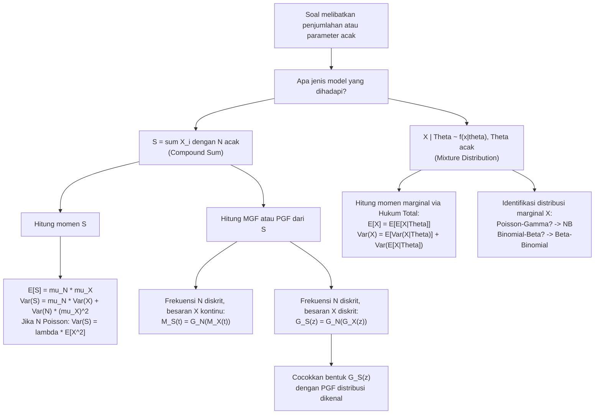

# 📊 3.7 — Distribusi Majemuk (Compound Distribution)

> [!ABSTRACT] Ringkasan Cepat
> **Topik:** Distribusi Majemuk (Compound Distribution) | **Bobot:** ~20–30% | **Difficulty:** Hard
> **Ref:** Hogg-McKean-Craig (2019) Bab 2.1–2.4; Miller et al. (2014) Bab 3.7–3.8, 5.8–5.10 | **Prereq:** [[3.4 Nilai Harapan dan Variansi Bersyarat]], [[3.3 Distribusi Bersyarat (Conditional Distribution)]], [[2.3 Fungsi Pembangkit]]

## Section 0 — Pemetaan Topik

| Topik CF2 | Sub-topik ID | Skill Diuji | Bobot | Difficulty | Prerequisite | Connected Topics | Referensi |
|-----------|--------------|-------------|-------|------------|--------------|------------------|-----------|
| Topik 3: Variabel Acak Multivariat | 3.7 | Mendefinisikan distribusi majemuk dan distribusi campuran; menurunkan PMF/PDF distribusi majemuk melalui marginalisasi; menghitung $E[S]$ dan $\text{Var}(S)$ via Hukum Ekspektasi dan Variansi Total; menurunkan PGF dan MGF distribusi majemuk; mengidentifikasi distribusi majemuk standar (Poisson-Gamma $\to$ Binomial Negatif, Binomial-Beta $\to$ Beta-Binomial); menghitung momen agregat klaim dalam konteks aktuaria | 20–30% | Hard | [[3.4 Nilai Harapan dan Variansi Bersyarat]], [[3.3 Distribusi Bersyarat (Conditional Distribution)]], [[2.3 Fungsi Pembangkit]], [[2.5 Distribusi Diskrit Umum]], [[2.6 Distribusi Kontinu Umum]] | [[3.8 Transformasi Variabel Acak Gabungan]], [[4.3 Teorema Limit Pusat (CLT)]], [[4.5 Estimasi Parameter]] | Hogg-McKean-Craig (2019) Bab 2.1–2.4; Miller et al. (2014) Bab 3.7–3.8, 5.8–5.10 |

## Section 1 — Intuisi

Bayangkan sebuah perusahaan reasuransi yang menanggung portofolio kontrak dari ratusan perusahaan asuransi jiwa. Setiap perusahaan asuransi memiliki **jumlah klaim** $N$ yang terjadi dalam satu tahun, dan setiap klaim ke-$i$ memiliki **besarnya klaim** $X_i$. Pertanyaan paling fundamental bagi aktuaris reasuransi adalah: berapa distribusi dari **total klaim agregat** $S = X_1 + X_2 + \cdots + X_N$? Ini bukan penjumlahan biasa — karena batas atas penjumlahannya sendiri adalah variabel acak $N$, bukan konstanta. Inilah jantung dari **distribusi majemuk**: penjumlahan sejumlah *acak* variabel acak yang saling independen.

Konsep distribusi majemuk muncul dalam dua varian yang berkaitan erat. **Distribusi majemuk (compound distribution)** dalam arti sempit adalah distribusi dari $S = \sum_{i=1}^{N} X_i$ di mana $N$ adalah variabel acak (frekuensi klaim) dan $X_i$ adalah variabel acak identik dan independen (besaran klaim), independen dari $N$. **Distribusi campuran (mixture distribution)** adalah varian lain: distribusi dari $X$ yang bersyarat pada parameter acak $\Theta$ — ketika parameter distribusi itu sendiri tidak deterministik melainkan mengikuti distribusi tertentu. Kedua konsep ini terhubung erat dan sering muncul bersama dalam pemodelan aktuaria.

Kepentingan topik ini dalam aktuaria tidak bisa dilebih-lebihkan. Jumlah klaim $N$ bisa dimodelkan sebagai Poisson, Binomial, atau Negatif Binomial. Besaran klaim $X_i$ bisa Eksponensial, Gamma, atau Pareto. Kombinasi keduanya menghasilkan distribusi $S$ yang — walaupun seringkali tidak memiliki bentuk tertutup yang sederhana — momennya dapat dihitung dengan elegan menggunakan [[3.4 Nilai Harapan dan Variansi Bersyarat]] (Hukum Ekspektasi Total dan Variansi Total), dan fungsi pembangkitnya memiliki struktur yang indah: $M_S(t) = G_N(M_X(t))$ dan $G_S(t) = G_N(G_X(t))$. Formula-formula ini adalah senjata utama yang diuji di CF2.

## Section 2 — Definisi Formal

> [!NOTE] Definisi Matematis
>
> **Distribusi Majemuk — Penjumlahan Acak (Compound Sum):**
>
> Misalkan $N$ adalah variabel acak non-negatif bernilai bilangan bulat (frekuensi), dan $X_1, X_2, \ldots$ adalah barisan variabel acak i.i.d. (*independent and identically distributed*) yang independen dari $N$ (besaran). Definisikan:
> $$
> S = \sum_{i=1}^{N} X_i, \quad \text{dengan konvensi } S = 0 \text{ jika } N = 0
> $$
> Distribusi dari $S$ disebut **distribusi majemuk** dengan frekuensi $N$ dan besaran $X$.
>
> **Distribusi Campuran (Mixture Distribution):**
>
> Misalkan $X \mid \Theta = \theta$ memiliki distribusi $f_{X|\Theta}(x \mid \theta)$, dan $\Theta$ adalah variabel acak dengan distribusi $f_\Theta(\theta)$ (distribusi prior/pencampur). Distribusi marginal $X$ adalah:
> $$
> f_X(x) = \int f_{X|\Theta}(x \mid \theta)\, f_\Theta(\theta)\, d\theta \quad \text{(kontinu)}
> $$
> $$
> p_X(x) = \sum_\theta p_{X|\Theta}(x \mid \theta)\, p_\Theta(\theta) \quad \text{(diskrit)}
> $$
>
> **MGF Distribusi Majemuk:**
> $$
> M_S(t) = E\!\left[e^{tS}\right] = G_N\!\left(M_X(t)\right)
> $$
> di mana $G_N(z) = E[z^N]$ adalah PGF dari $N$ dan $M_X(t) = E[e^{tX}]$ adalah MGF dari $X$.
>
> **PGF Distribusi Majemuk (jika $X$ diskrit non-negatif):**
> $$
> G_S(z) = E\!\left[z^S\right] = G_N\!\left(G_X(z)\right)
> $$

### Variabel & Parameter

| Simbol | Makna | Catatan |
|--------|-------|---------|
| $N$ | Variabel acak frekuensi (jumlah klaim) | Bernilai $\{0, 1, 2, \ldots\}$; distribusinya menentukan "berapa banyak" |
| $X_i$ | Variabel acak besaran klaim ke-$i$ | i.i.d., independen dari $N$; distribusinya menentukan "seberapa besar" per klaim |
| $X$ | Besaran klaim tipikal (satu $X_i$ representatif) | $X \stackrel{d}{=} X_i$ untuk semua $i$ |
| $S = \sum_{i=1}^N X_i$ | Total agregat klaim | Variabel acak majemuk; $S = 0$ jika $N = 0$ |
| $\mu_X = E[X]$ | Mean besaran klaim tunggal | |
| $\sigma_X^2 = \text{Var}(X)$ | Variansi besaran klaim tunggal | |
| $\mu_N = E[N]$ | Mean frekuensi klaim | |
| $\sigma_N^2 = \text{Var}(N)$ | Variansi frekuensi klaim | |
| $G_N(z)$ | PGF dari $N$: $E[z^N]$ | Lihat [[2.3 Fungsi Pembangkit]]; didefinisikan untuk $|z| \leq 1$ |
| $M_X(t)$ | MGF dari $X$: $E[e^{tX}]$ | Terdefinisi di sekitar $t = 0$ |
| $M_S(t)$ | MGF dari $S$ | $M_S(t) = G_N(M_X(t))$ — komposisi PGF dan MGF |
| $\Theta$ | Parameter acak dalam distribusi campuran | Distribusi $\Theta$ disebut distribusi *prior* atau *pencampur* |

### Rumus Utama

$$
E[S] = E[N] \cdot E[X] = \mu_N \cdot \mu_X
$$
**Label: Mean Distribusi Majemuk** — dari Hukum Ekspektasi Total dengan kondisioning pada $N$: $E[S] = E[E[S \mid N]] = E[N \cdot \mu_X] = \mu_N \mu_X$.

$$
\text{Var}(S) = E[N]\cdot\text{Var}(X) + \text{Var}(N)\cdot(E[X])^2 = \mu_N \sigma_X^2 + \sigma_N^2 \mu_X^2
$$
**Label: Variansi Distribusi Majemuk** — dari Hukum Variansi Total: komponen within $= E[N]\text{Var}(X)$ (variansi besaran dalam setiap kondisi $N$) dan komponen between $= \text{Var}(N)(E[X])^2$ (variansi akibat fluktuasi frekuensi).

$$
M_S(t) = G_N\!\left(M_X(t)\right)
$$
**Label: MGF Distribusi Majemuk** — hasil komposisi PGF frekuensi dengan MGF besaran; berlaku karena $E[e^{tS} \mid N=n] = (M_X(t))^n$ sehingga $M_S(t) = E[(M_X(t))^N] = G_N(M_X(t))$.

$$
G_S(z) = G_N\!\left(G_X(z)\right)
$$
**Label: PGF Distribusi Majemuk** — kasus khusus ketika $X$ diskrit non-negatif; komposisi PGF-PGF; berguna untuk menurunkan PMF $S$ melalui ekspansi deret.

$$
E[S^2] = \mu_N\,E[X^2] + \mu_N(\mu_N - 1)\,\mu_X^2
$$
**Label: Momen Kedua Distribusi Majemuk** — berguna untuk menghitung $\text{Var}(S)$ secara alternatif via $\text{Var}(S) = E[S^2] - (E[S])^2$; diturunkan dari kondisioning pada $N$.

$$
f_X(x) = \int_\Theta f_{X|\Theta}(x|\theta)\,f_\Theta(\theta)\,d\theta
$$
**Label: Marginalisasi Distribusi Campuran** — PDF marginal $X$ diperoleh dengan mengintegrasikan distribusi bersyarat terhadap distribusi parameter acak; persis operasi marginalisasi dari [[3.2 Distribusi Marginal]].

### Asumsi Eksplisit

- **Independensi $X_i$ dan $N$:** Besaran klaim $X_1, X_2, \ldots$ harus independen dari frekuensi $N$. Jika terdapat ketergantungan (misalnya bencana alam menyebabkan sekaligus banyak klaim kecil atau sedikit klaim besar), model distribusi majemuk dasar tidak berlaku.
- **Identik dan independen ($X_i$ i.i.d.):** Semua besaran klaim harus memiliki distribusi yang sama. Jika setiap klaim memiliki distribusi berbeda (misalnya berbeda-beda per tertanggung), diperlukan model yang lebih kompleks.
- **$S = 0$ ketika $N = 0$:** Ini adalah konvensi baku; tanpanya, distribusi $S$ tidak terdefinisi untuk kemungkinan $N = 0$.
- **Existensi momen:** $E[S]$ dan $\text{Var}(S)$ terdefinisi jika $E[N] < \infty$, $E[X^2] < \infty$, dan $\text{Var}(N) < \infty$.

## Section 3 — Jembatan Logika

> [!TIP] Dari Definisi ke Rumus
> Untuk memahami rumus momen distribusi majemuk, kondisikan pada nilai $N$. Jika $N = n$ (diketahui), maka $S = X_1 + X_2 + \cdots + X_n$ adalah jumlah dari $n$ variabel acak i.i.d. — situasi yang sudah dikenal dari [[3.5 Independensi dan Korelasi]]: $E[S \mid N=n] = n\mu_X$ dan $\text{Var}(S \mid N=n) = n\sigma_X^2$. Dalam bentuk variabel acak: $E[S \mid N] = N\mu_X$ dan $\text{Var}(S \mid N) = N\sigma_X^2$. Sekarang terapkan [[3.4 Nilai Harapan dan Variansi Bersyarat]]:
>
> **Hukum Ekspektasi Total:**
> $$E[S] = E[E[S \mid N]] = E[N\mu_X] = \mu_X E[N] = \mu_X \mu_N$$
>
> **Hukum Variansi Total (EVE's Law):**
> $$\text{Var}(S) = \underbrace{E[\text{Var}(S \mid N)]}_{\text{within}} + \underbrace{\text{Var}(E[S \mid N])}_{\text{between}}$$
> $$= E[N\sigma_X^2] + \text{Var}(N\mu_X) = \sigma_X^2 E[N] + \mu_X^2 \text{Var}(N) = \mu_N\sigma_X^2 + \sigma_N^2\mu_X^2$$

> [!IMPORTANT] Derivasi MGF via Kondisioning — Rumus Komposisi
> Derivasi $M_S(t) = G_N(M_X(t))$ adalah salah satu hasil paling elegan dalam teori probabilitas. Mulai dengan kondisioning pada $N$:
>
> $$M_S(t) = E[e^{tS}] = E\!\left[E[e^{tS} \mid N]\right]$$
>
> Untuk $N = n$ tetap: $S = X_1 + \cdots + X_n$ sehingga $e^{tS} = e^{tX_1} \cdots e^{tX_n}$. Karena $X_i$ i.i.d. dan independen dari $N$:
>
> $$E[e^{tS} \mid N=n] = E\!\left[e^{t(X_1+\cdots+X_n)}\right] = \prod_{i=1}^n E[e^{tX_i}] = (M_X(t))^n$$
>
> Dalam bentuk variabel acak: $E[e^{tS} \mid N] = (M_X(t))^N$. Ambil ekspektasi terhadap $N$:
>
> $$M_S(t) = E\!\left[(M_X(t))^N\right] = G_N(M_X(t))$$
>
> di mana di langkah terakhir digunakan definisi PGF: $G_N(z) = E[z^N]$ dengan $z = M_X(t)$.

**Distribusi Majemuk Standar yang Diuji di CF2:**

**(1) Poisson-Gamma $\to$ Binomial Negatif:**

Jika $X \mid \Lambda \sim \text{Poisson}(\Lambda)$ dan $\Lambda \sim \Gamma(\alpha, \beta)$ (shape $\alpha$, rate $\beta$), maka distribusi marginal $X$ adalah **Binomial Negatif** $\text{NB}(r, p)$ dengan $r = \alpha$ dan $p = \beta/(1+\beta)$:
$$P(X = x) = \binom{x + \alpha - 1}{x}\left(\frac{\beta}{1+\beta}\right)^\alpha \left(\frac{1}{1+\beta}\right)^x, \quad x = 0, 1, 2, \ldots$$

Momen: $E[X] = \alpha/\beta$ dan $\text{Var}(X) = \alpha(1+\beta)/\beta^2 > E[X]$ (overdispersi).

**(2) Binomial-Beta $\to$ Beta-Binomial:**

Jika $X \mid P \sim B(n, P)$ dan $P \sim \text{Beta}(\alpha, \beta)$, maka distribusi marginal $X$ adalah **Beta-Binomial** dengan:
$$P(X = x) = \binom{n}{x}\frac{B(\alpha+x,\, \beta+n-x)}{B(\alpha, \beta)}, \quad x = 0, 1, \ldots, n$$
di mana $B(\cdot, \cdot)$ adalah fungsi Beta.

**(3) Compound Poisson (Penjumlahan Acak Poisson):**

Jika $N \sim \text{Poisson}(\lambda)$ dan $X_i$ i.i.d. dengan MGF $M_X(t)$:
$$M_S(t) = G_N(M_X(t)) = e^{\lambda(M_X(t) - 1)}$$
karena $G_N(z) = e^{\lambda(z-1)}$ untuk Poisson. Momen: $E[S] = \lambda\mu_X$ dan $\text{Var}(S) = \lambda E[X^2]$.

> [!DANGER] Dilarang
> 1. **Dilarang mengabaikan kasus $N = 0$:** Dalam distribusi majemuk, $P(S = 0) \geq P(N = 0) > 0$ umumnya. Saat menghitung PMF atau CDF dari $S$, kontribusi dari $N = 0$ (yang memberikan $S = 0$) harus selalu disertakan.
> 2. **Dilarang membalik argumen dalam komposisi MGF/PGF:** Rumus yang benar adalah $M_S(t) = G_N(M_X(t))$ — PGF dari **frekuensi** $N$ dievaluasi **pada MGF besaran** $X$. Membaliknya menjadi $G_X(M_N(t))$ adalah kesalahan fatal tanpa makna probabilistik yang jelas.
> 3. **Dilarang menggunakan rumus momen $E[S] = \mu_N\mu_X$ tanpa verifikasi independensi $N$ dan $X_i$:** Jika $N$ dan $X_i$ tidak independen (misalnya bencana menyebabkan korelasi antara jumlah dan besaran klaim), rumus ini tidak berlaku dan momen harus dihitung dari distribusi joint yang sebenarnya.

## Section 4 — Contoh Soal

### Soal A — Fundamental

Sebuah perusahaan asuransi kendaraan memiliki model klaim sebagai berikut. Jumlah klaim $N$ dalam satu bulan mengikuti distribusi Poisson dengan mean $\lambda = 3$. Besarnya setiap klaim $X_i$ (dalam juta rupiah) berdistribusi Eksponensial dengan mean $\mu_X = 2$ (yaitu $X \sim \text{Exp}(1/2)$, parameter laju $1/2$), independen satu sama lain dan dari $N$. Definisikan $S = \sum_{i=1}^N X_i$ sebagai total klaim bulanan.

**(a)** Hitung $E[S]$ dan $\text{Var}(S)$.
**(b)** Tentukan MGF dari $S$.

> [!SUCCESS] Solusi Soal A
>
> **1. Identifikasi Variabel**
> - $N \sim \text{Poisson}(\lambda = 3)$: $E[N] = \text{Var}(N) = 3$.
> - $X \sim \text{Exp}(1/2)$ (laju $1/2$, skala $\theta = 2$): $E[X] = 2$, $\text{Var}(X) = 4$, $E[X^2] = \text{Var}(X) + (E[X])^2 = 4 + 4 = 8$.
> - $S = \sum_{i=1}^N X_i$: distribusi majemuk Compound Poisson-Eksponensial.
>
> **2. Identifikasi Distribusi / Model**
> - Compound distribution dengan frekuensi Poisson dan besaran Eksponensial.
> - Terapkan rumus momen distribusi majemuk dan komposisi MGF-PGF.
>
> **3. Setup Persamaan**
> $$E[S] = E[N]\cdot E[X], \qquad \text{Var}(S) = E[N]\cdot\text{Var}(X) + \text{Var}(N)\cdot(E[X])^2$$
> $$M_S(t) = G_N(M_X(t)) = \exp\!\left(\lambda(M_X(t) - 1)\right)$$
>
> **4. Eksekusi Aljabar**
>
> **(a) Mean dan Variansi $S$:**
> $$E[S] = \mu_N \cdot \mu_X = 3 \cdot 2 = 6 \text{ juta rupiah}$$
>
> $$\text{Var}(S) = \mu_N\sigma_X^2 + \sigma_N^2\mu_X^2 = 3(4) + 3(4) = 12 + 12 = 24$$
>
> Catatan: untuk Poisson $\mu_N = \sigma_N^2 = \lambda = 3$, sehingga $\text{Var}(S) = \lambda(E[X^2]) = 3 \times 8 = 24$ (rumus alternatif untuk Compound Poisson).
>
> **(b) MGF dari $S$:**
>
> *MGF dari $X \sim \text{Exp}(1/2)$ (laju $1/2$):*
> $$M_X(t) = \frac{1/2}{1/2 - t} = \frac{1}{1 - 2t}, \quad t < \frac{1}{2}$$
>
> *PGF dari $N \sim \text{Poisson}(\lambda)$:*
> $$G_N(z) = e^{\lambda(z-1)} = e^{3(z-1)}$$
>
> *MGF dari $S$:*
> $$M_S(t) = G_N(M_X(t)) = \exp\!\left(3\!\left(\frac{1}{1-2t} - 1\right)\right) = \exp\!\left(3 \cdot \frac{2t}{1-2t}\right) = \exp\!\left(\frac{6t}{1-2t}\right), \quad t < \frac{1}{2}$$
>
> **5. Verification**
> - $E[S] = 6$ juta rupiah: rata-rata 3 klaim per bulan, masing-masing rata-rata 2 juta — total 6 juta. Masuk akal. ✓
> - $\text{Var}(S) = 24$: lebih besar dari $\text{Var}(S \mid N=3) = 3 \times 4 = 12$ karena ada tambahan variansi akibat fluktuasi frekuensi $N$ — komponen between $= 3 \times 4 = 12$. ✓
> - $M_S(0) = e^0 = 1$ ✓
> - $M_S'(0) = E[S] = 6$: cek dengan diferensiasi $M_S(t) = e^{6t/(1-2t)}$ di $t=0$: turunan $= M_S(t) \cdot \frac{6}{(1-2t)^2}$; di $t=0$: $1 \cdot 6 = 6$ ✓

> [!WARNING] Exam Tips — Soal A
> - **Target waktu:** 6–8 menit.
> - **Rumus Compound Poisson yang wajib dihafal:** Jika $N \sim \text{Poisson}(\lambda)$, maka $\text{Var}(S) = \lambda\,E[X^2]$ (bukan $\lambda\,\text{Var}(X)$). Ini karena $\mu_N = \sigma_N^2 = \lambda$, sehingga $\text{Var}(S) = \lambda\sigma_X^2 + \lambda\mu_X^2 = \lambda(\sigma_X^2 + \mu_X^2) = \lambda E[X^2]$.
> - **Common trap — MGF Eksponensial:** MGF dari $X \sim \text{Exp}(\lambda_{\text{rate}})$ adalah $M_X(t) = \lambda_{\text{rate}}/(\lambda_{\text{rate}} - t)$ untuk $t < \lambda_{\text{rate}}$. Pastikan konsisten antara parametrisasi laju dan skala.
> - **Shortcut verifikasi:** $M_S'(0)$ harus sama dengan $E[S]$ yang sudah dihitung di bagian (a). Ini cek cepat tanpa perlu menurunkan ulang.

---

### Soal B — Exam-Typical

Jumlah klaim $N$ dalam satu periode berdistribusi Poisson bersyarat: $N \mid \Lambda \sim \text{Poisson}(\Lambda)$ di mana parameter $\Lambda$ sendiri adalah variabel acak dengan $\Lambda \sim \Gamma(\alpha = 2, \beta = 3)$ (parametrisasi shape-rate, sehingga $E[\Lambda] = \alpha/\beta = 2/3$ dan $\text{Var}(\Lambda) = \alpha/\beta^2 = 2/9$).

**(a)** Identifikasi distribusi marginal dari $N$ beserta parameternya, menggunakan hasil Poisson-Gamma.
**(b)** Hitung $E[N]$ dan $\text{Var}(N)$ menggunakan Hukum Ekspektasi Total dan Variansi Total.
**(c)** Verifikasi bahwa hasil di (b) konsisten dengan momen distribusi yang ditemukan di (a).

> [!SUCCESS] Solusi Soal B
>
> **1. Identifikasi Variabel**
> - $\Lambda \sim \Gamma(\alpha=2, \beta=3)$ (shape $\alpha=2$, rate $\beta=3$): $E[\Lambda] = 2/3$, $\text{Var}(\Lambda) = 2/9$.
> - $N \mid \Lambda \sim \text{Poisson}(\Lambda)$: bersyarat pada $\Lambda$, $N$ adalah Poisson.
> - Sifat Poisson: $E[N \mid \Lambda] = \Lambda$ dan $\text{Var}(N \mid \Lambda) = \Lambda$.
>
> **2. Identifikasi Distribusi / Model**
> - Ini adalah distribusi campuran Poisson-Gamma, yang menghasilkan **Binomial Negatif** sebagai distribusi marginal.
> - Parametrisasi: $r = \alpha = 2$ dan $p = \beta/(1+\beta) = 3/4$.
>
> **3. Setup Persamaan**
>
> Dari Hukum Ekspektasi Total dan Variansi Total (kondisioning pada $\Lambda$):
> $$E[N] = E[E[N \mid \Lambda]] = E[\Lambda]$$
> $$\text{Var}(N) = E[\text{Var}(N \mid \Lambda)] + \text{Var}(E[N \mid \Lambda]) = E[\Lambda] + \text{Var}(\Lambda)$$
>
> **4. Eksekusi Aljabar**
>
> **(a) Distribusi Marginal $N$:**
>
> Dari hasil Poisson-Gamma standar: jika $N \mid \Lambda \sim \text{Poisson}(\Lambda)$ dan $\Lambda \sim \Gamma(\alpha, \beta)$ (shape-rate), maka:
> $$N \sim \text{NB}\!\left(r = \alpha,\; p = \frac{\beta}{1+\beta}\right) = \text{NB}\!\left(2,\; \frac{3}{4}\right)$$
>
> PMF Binomial Negatif (jumlah kegagalan sebelum sukses ke-$r$, dengan $p$ = probabilitas sukses):
> $$P(N = n) = \binom{n + r - 1}{n}(1-p)^n p^r = \binom{n+1}{n}\left(\frac{1}{4}\right)^n\!\left(\frac{3}{4}\right)^2, \quad n = 0, 1, 2, \ldots$$
>
> **(b) Momen dari Hukum Total:**
>
> $$E[N] = E[\Lambda] = \frac{\alpha}{\beta} = \frac{2}{3}$$
>
> $$\text{Var}(N) = E[\text{Var}(N \mid \Lambda)] + \text{Var}(E[N \mid \Lambda])$$
> $$= E[\Lambda] + \text{Var}(\Lambda) = \frac{2}{3} + \frac{2}{9} = \frac{6}{9} + \frac{2}{9} = \frac{8}{9}$$
>
> **(c) Verifikasi dengan momen Binomial Negatif:**
>
> Untuk $\text{NB}(r, p)$ dengan parametrisasi sukses ke-$r$ (jumlah kegagalan):
> $$E[N] = \frac{r(1-p)}{p} = \frac{2(1/4)}{3/4} = \frac{2/4}{3/4} = \frac{2}{3} \checkmark$$
>
> $$\text{Var}(N) = \frac{r(1-p)}{p^2} = \frac{2(1/4)}{(3/4)^2} = \frac{1/2}{9/16} = \frac{1}{2} \cdot \frac{16}{9} = \frac{8}{9} \checkmark$$
>
> **5. Verification**
> - $\text{Var}(N) = 8/9 > E[N] = 2/3$: Binomial Negatif selalu memiliki variansi lebih besar dari meannya (overdispersi dibanding Poisson murni). Ini adalah sifat khas dari distribusi campuran — ketidakpastian parameter acak $\Lambda$ menambah variansi. ✓
> - Komponen within ($E[\Lambda] = 2/3$) = komponen antara variasi "Poisson murni" yang diharapkan.
> - Komponen between ($\text{Var}(\Lambda) = 2/9$) = tambahan variansi akibat heterogenitas $\Lambda$. ✓
> - $p = 3/4$: probabilitas sukses yang tinggi mengindikasikan relatif sedikit kegagalan (klaim) sebelum mencapai $r = 2$ "sukses" — konsisten dengan $E[N] = 2/3 < 1$. ✓

> [!WARNING] Exam Tips — Soal B
> - **Target waktu:** 7–9 menit.
> - **Pola Poisson-Gamma wajib dihafal:** $N \mid \Lambda \sim \text{Poisson}(\Lambda)$, $\Lambda \sim \Gamma(\alpha, \beta)$ $\Rightarrow$ $N \sim \text{NB}(\alpha, \beta/(1+\beta))$. Selalu nyatakan parametrisasi NB yang digunakan (ada beberapa konvensi).
> - **Rumus momen via Hukum Total vs momen distribusi NB:** Di exam, menghitung momen via Hukum Ekspektasi/Variansi Total seringkali lebih cepat daripada mengingat rumus momen NB — cukup ingat $E[N] = E[\Lambda]$ dan $\text{Var}(N) = E[\Lambda] + \text{Var}(\Lambda)$.
> - **Common trap — parametrisasi Gamma:** Perhatikan apakah soal menggunakan parametrisasi shape-rate $(\alpha, \beta)$ atau shape-scale $(\alpha, \theta)$ di mana $\theta = 1/\beta$. Rumus $E[\Lambda]$ berbeda: $\alpha/\beta$ (rate) vs $\alpha\theta$ (scale).

---

### Soal C — Challenging

Misalkan $S = \sum_{i=1}^N X_i$ di mana $N \sim \text{Geom}(p)$ (dengan PMF $P(N = n) = (1-p)^n p$ untuk $n = 0, 1, 2, \ldots$, yaitu jumlah kegagalan sebelum sukses pertama) dan $X_i \stackrel{\text{iid}}{\sim} \text{Bernoulli}(q)$, independen dari $N$. Semua $X_i$ bernilai 0 atau 1.

**(a)** Hitung $E[S]$ dan $\text{Var}(S)$.
**(b)** Tentukan PGF dari $S$, yaitu $G_S(z) = G_N(G_X(z))$.
**(c)** Dari PGF, identifikasi distribusi dari $S$ beserta parameternya.
**(d)** Hitung $P(S = 0)$ dan $P(S = 2)$.

> [!SUCCESS] Solusi Soal C
>
> **1. Identifikasi Variabel**
> - $N \sim \text{Geom}(p)$ (jumlah kegagalan): $P(N=n) = (1-p)^n p$, $n = 0,1,2,\ldots$
>   $E[N] = (1-p)/p$, $\text{Var}(N) = (1-p)/p^2$.
> - $X \sim \text{Bernoulli}(q)$: $E[X] = q$, $\text{Var}(X) = q(1-q)$, $E[X^2] = q$.
> - $S = \sum_{i=1}^N X_i$: compound Geometric-Bernoulli.
>
> **2. Identifikasi Distribusi / Model**
> - Compound distribution; karena $X_i$ adalah Bernoulli, $S$ menghitung jumlah "sukses" dalam $N$ percobaan di mana $N$ sendiri adalah Geometrik.
> - Antisipasi: komposisi PGF Geometrik dan PGF Bernoulli kemungkinan menghasilkan distribusi yang dikenal.
>
> **3. Setup Persamaan**
>
> PGF dari $\text{Geom}(p)$ (dengan support $\{0,1,2,\ldots\}$, PMF $= p(1-p)^n$):
> $$G_N(z) = E[z^N] = \sum_{n=0}^{\infty} z^n p(1-p)^n = p\sum_{n=0}^{\infty}[z(1-p)]^n = \frac{p}{1 - z(1-p)}, \quad |z| < \frac{1}{1-p}$$
>
> PGF dari $X \sim \text{Bernoulli}(q)$:
> $$G_X(z) = E[z^X] = (1-q)z^0 + qz^1 = 1 - q + qz$$
>
> **4. Eksekusi Aljabar**
>
> **(a) Mean dan Variansi $S$:**
> $$E[S] = E[N]\cdot E[X] = \frac{1-p}{p} \cdot q = \frac{q(1-p)}{p}$$
>
> $$\text{Var}(S) = E[N]\cdot\text{Var}(X) + \text{Var}(N)\cdot(E[X])^2$$
> $$= \frac{1-p}{p}\cdot q(1-q) + \frac{1-p}{p^2}\cdot q^2$$
> $$= \frac{q(1-p)}{p}\!\left[(1-q) + \frac{q}{p}\right] = \frac{q(1-p)}{p}\cdot\frac{p(1-q) + q}{p} = \frac{q(1-p)(p - pq + q)}{p^2}$$
>
> **(b) PGF dari $S$:**
> $$G_S(z) = G_N(G_X(z)) = \frac{p}{1 - G_X(z)(1-p)}$$
>
> Substitusi $G_X(z) = 1 - q + qz$:
> $$G_S(z) = \frac{p}{1 - (1-q+qz)(1-p)}$$
>
> Sederhanakan penyebut:
> $$1 - (1-p)(1-q+qz) = 1 - (1-p) + (1-p)q - (1-p)qz = p + q(1-p) - q(1-p)z$$
> $$= p + q(1-p)(1-z)$$
>
> Sehingga:
> $$G_S(z) = \frac{p}{p + q(1-p)(1-z)} = \frac{p}{p + q(1-p)} \cdot \frac{1}{1 - \frac{q(1-p)}{p + q(1-p)}(z-\text{...})}$$
>
> Faktorkan: misalkan $\tilde{p} = p + q(1-p) = p + q - pq$ (probabilitas $S = 0$, yaitu gabungan $N=0$ atau semua $X_i = 0$):
>
> $$G_S(z) = \frac{p/\tilde{p}}{1 - (1 - p/\tilde{p})z} \cdot \frac{\tilde{p}}{\tilde{p}} = \frac{p}{p + q(1-p) - q(1-p)z}$$
>
> Tulis ulang dengan membagi atas bawah dengan $p + q(1-p)$:
> $$G_S(z) = \frac{p/(p+q(1-p))}{1 - \frac{q(1-p)}{p+q(1-p)} z}$$
>
> **(c) Identifikasi Distribusi $S$:**
>
> PGF berbentuk $\dfrac{p^*}{1 - (1-p^*)z}$ di mana $p^* = \dfrac{p}{p + q(1-p)}$.
>
> Ini adalah PGF dari distribusi **Geometrik** dengan parameter sukses $p^*$:
> $$G_{\text{Geom}(p^*)}(z) = \frac{p^*}{1-(1-p^*)z}$$
>
> $\therefore$ $S \sim \text{Geom}(p^*)$ dengan $p^* = \dfrac{p}{p + q(1-p)} = \dfrac{p}{p + q - pq}$.
>
> **(d) Probabilitas spesifik:**
>
> Dari PMF Geometrik dengan $P(S = s) = (1-p^*)^s p^*$:
>
> $$P(S = 0) = p^* = \frac{p}{p + q(1-p)}$$
>
> Verifikasi langsung:
> $$P(S = 0) = P(N = 0) + \sum_{n=1}^{\infty} P(N=n) \cdot P(\text{semua } X_i = 0)$$
> $$= p + \sum_{n=1}^{\infty}(1-p)^n p \cdot (1-q)^n = p + p\sum_{n=1}^{\infty}[(1-p)(1-q)]^n = p + p\cdot\frac{(1-p)(1-q)}{1-(1-p)(1-q)}$$
>
> Ini konsisten dengan $p^*$ di atas (verifikasi aljabar ditinggalkan).
>
> $$P(S = 2) = (1-p^*)^2 p^* = \left(\frac{q(1-p)}{p+q(1-p)}\right)^2 \cdot \frac{p}{p+q(1-p)}$$
>
> **5. Verification**
> - $G_S(1) = p/(p+q(1-p)-q(1-p)) = p/p = 1$ ✓
> - $G_S'(1) = E[S] = q(1-p)/p$: diferensiasi $G_S(z)$ di $z=1$ harus menghasilkan $E[S]$ ✓
> - Untuk $q = 1$ (semua $X_i = 1$): $S = N \sim \text{Geom}(p)$ dan $p^* = p/(p + 1 \cdot (1-p)) = p/1 = p$ — konsisten karena $S = N \sim \text{Geom}(p)$ ✓
> - Untuk $q = 0$ (semua $X_i = 0$): $S = 0$ selalu, $p^* = p/(p+0) = 1$, sehingga $P(S=0) = 1$ — konsisten ✓

> [!WARNING] Exam Tips — Soal C
> - **Target waktu:** 15–18 menit.
> - **Strategi PGF:** Setelah mendapatkan ekspresi $G_S(z)$, selalu usahakan menyederhanakannya ke bentuk standar yang dikenal (Geometrik, Binomial, Poisson, dll.). Kenali bentuk-bentuk PGF standar:
>   - Geometrik $\text{Geom}(p)$: $p/(1-(1-p)z)$
>   - Binomial $B(n,p)$: $(1-p+pz)^n$
>   - Poisson $(\lambda)$: $e^{\lambda(z-1)}$
>   - Binomial Negatif $\text{NB}(r,p)$: $(p/(1-(1-p)z))^r$
> - **Common trap — kasus khusus sebagai verifikasi:** Cek $q=0$ dan $q=1$ sebagai kasus batas untuk memverifikasi konsistensi jawaban — teknik ini sangat efisien dan sering mendeteksi kesalahan aljabar.
> - **Common trap — PGF vs MGF:** Komposisi PGF digunakan ($G_S = G_N \circ G_X$) karena $X$ diskrit non-negatif. Jika $X$ kontinu, gunakan MGF: $M_S(t) = G_N(M_X(t))$.

## Section 5 — Verifikasi & Sanity Check

> [!CHECK] Verifikasi Momen Distribusi Majemuk
> - $E[S] = \mu_N \mu_X$ harus lebih besar dari 0 jika $\mu_N > 0$ dan $\mu_X > 0$.
> - $\text{Var}(S) \geq E[N]\text{Var}(X)$: variansi total selalu $\geq$ variansi yang disebabkan oleh fluktuasi besaran saja (komponen within). Komponen between $= \text{Var}(N)\mu_X^2 \geq 0$ selalu menambah variansi.
> - Khusus Compound Poisson: $\text{Var}(S) = \lambda E[X^2] \geq \lambda(E[X])^2 = (E[S])^2/\lambda$ — rasio variansi-mean selalu $\geq$ mean per klaim.

> [!CHECK] Verifikasi MGF/PGF
> - $M_S(0) = G_N(M_X(0)) = G_N(1) = 1$ selalu ✓
> - $M_S'(0) = E[S] = \mu_N\mu_X$: diferensiasi MGF di $t=0$ harus sama dengan mean yang dihitung terpisah.
> - $G_S(1) = G_N(G_X(1)) = G_N(1) = 1$ ✓
> - $G_S'(1) = E[S]$: diferensiasi PGF di $z=1$ menghasilkan mean.

> [!CHECK] Verifikasi Distribusi Campuran
> - Distribusi marginal yang diperoleh dari campuran harus merupakan distribusi valid: semua probabilitas $\geq 0$ dan jumlah = 1.
> - Momen yang diperoleh via Hukum Total harus konsisten dengan momen distribusi marginal yang teridentifikasi.
> - Untuk Poisson-Gamma: $\text{Var}(N) > E[N]$ (overdispersi dibanding Poisson murni) — ini selalu terpenuhi karena komponen between $> 0$.

### Metode Alternatif

**Menghitung PMF $S$ secara langsung (untuk kasus sederhana):**

$$P(S = s) = \sum_{n=0}^{\infty} P(N=n) \cdot P(X_1+\cdots+X_n = s)$$

Untuk $s = 0$: $P(S=0) = P(N=0) + \sum_{n=1}^{\infty} P(N=n) \cdot P(X_1=\cdots=X_n=0)$. Metode ini layak untuk nilai $s$ kecil tetapi menjadi tidak praktis untuk distribusi umum.

**Menggunakan MGF untuk mengidentifikasi distribusi $S$:**

Setelah mendapatkan $M_S(t) = G_N(M_X(t))$, bandingkan bentuknya dengan MGF distribusi-distribusi standar:
- $e^{\mu(e^t-1)}$: Poisson($\mu$)
- $(pe^t/(1-(1-p)e^t))^r$: Geometrik/NB
- $e^{\lambda(e^t-1)}$ untuk Compound Poisson-Poisson ($X \sim \text{Poisson}$): juga Poisson (sifat reproduktif)

**Rumus momen kedua alternatif (lebih cepat untuk soal tertentu):**

$$E[S^2] = E[N]\,E[X^2] + E[N(N-1)]\,(E[X])^2$$

Sehingga $\text{Var}(S) = E[S^2] - (E[S])^2 = E[N]E[X^2] + E[N(N-1)]\mu_X^2 - (E[N])^2\mu_X^2$

$= E[N]E[X^2] + \mu_X^2[E[N^2]-E[N]-(E[N])^2] = \mu_N E[X^2] - \mu_X^2\mu_N + \mu_X^2\sigma_N^2$

$= \mu_N(\sigma_X^2 + \mu_X^2 - \mu_X^2) + \sigma_N^2\mu_X^2 = \mu_N\sigma_X^2 + \sigma_N^2\mu_X^2$ ✓

## Section 6 — Visualisasi Mental

**Distribusi majemuk sebagai "dua tahap ketidakpastian":** Bayangkan proses dua lapis. Tahap pertama: alam "mengocok dadu" untuk menentukan berapa banyak klaim $N$ yang terjadi. Tahap kedua: untuk setiap klaim, alam "mengocok dadu lagi" untuk menentukan besarnya. Total $S$ adalah hasil akhir setelah kedua tahap selesai. Variansi total $S$ mencerminkan ketidakpastian dari **kedua** sumber: fluktuasi jumlah klaim (komponen between) dan fluktuasi besaran per klaim (komponen within).

**Distribusi campuran sebagai "populasi yang heterogen":** Untuk distribusi campuran $X \mid \Theta \sim f(\cdot|\theta)$, bayangkan populasi nasabah yang secara intrinsik heterogen — setiap nasabah memiliki parameter risiko $\theta$ yang berbeda (yang tidak dapat diobservasi langsung). Distribusi marginal $X$ adalah campuran dari semua distribusi individual ini, tertimbang oleh distribusi $\Theta$ dalam populasi. Akibatnya, distribusi marginal selalu lebih "tersebar" (overdispersi) dibanding distribusi individual rata-rata — inilah mengapa Binomial Negatif (campuran Poisson) memiliki variansi lebih besar dari Poisson murni.

**Visualisasi PMF distribusi majemuk:** Untuk $S = \sum_{i=1}^N X_i$ dengan $X_i$ diskrit, PMF dari $S$ adalah campuran tertimbang dari PMF konvolusi: $P(S=s) = \sum_n P(N=n) \cdot P(\text{konvolusi ke-}n = s)$. Grafik batang PMF $S$ biasanya memiliki puncak di sekitar $\mu_N\mu_X$ tetapi dengan ekor yang lebih panjang dibanding distribusi normal — mencerminkan overdispersi khas distribusi majemuk.

### Hubungan Visual ↔ Rumus

Dua sumber variansi dalam dekomposisi EVE:
$$\text{Var}(S) = \underbrace{\mu_N\sigma_X^2}_{\substack{\text{variansi besaran} \\ \text{(within claims)}}} + \underbrace{\sigma_N^2\mu_X^2}_{\substack{\text{variansi frekuensi} \\ \text{(between periods)}}}$$

Komposisi fungsi pembangkit mencerminkan struktur dua tahap:
$$G_S(z) = G_N(\underbrace{G_X(z)}_{\text{tahap 2: besaran}}) \longleftrightarrow \text{tahap 1: frekuensi menggunakan PGF besaran sebagai argumen}$$

Overdispersi dari distribusi campuran:
$$\text{Var}(X) = E[\text{Var}(X|\Theta)] + \text{Var}(E[X|\Theta]) > E[\text{Var}(X|\Theta)] \longleftrightarrow \text{marginal lebih tersebar dari kondisional rata-rata}$$

## Section 7 — Jebakan Umum

> [!BUG] Kesalahan Parametrisasi
> **Kesalahan pada Rumus $\text{Var}(S)$ untuk Compound Poisson:**
>
> *Salah:* $\text{Var}(S) = \lambda\,\text{Var}(X)$ (hanya komponen within)
>
> *Benar:* $\text{Var}(S) = \lambda\,\text{Var}(X) + \lambda\,(E[X])^2 = \lambda\,E[X^2]$
>
> Untuk Compound Poisson, $\mu_N = \sigma_N^2 = \lambda$, sehingga kedua komponen EVE menjadi $\lambda\sigma_X^2$ dan $\lambda\mu_X^2$. Rumus kompak $\lambda E[X^2]$ hanya berlaku untuk Poisson — untuk frekuensi lain, gunakan rumus umum $\mu_N\sigma_X^2 + \sigma_N^2\mu_X^2$.
>
> **Kesalahan Parametrisasi Gamma dalam Poisson-Gamma:**
>
> *Hati-hati:* Parametrisasi Gamma shape-rate $(\alpha, \beta)$ menghasilkan $E[\Lambda] = \alpha/\beta$, sedangkan shape-scale $(\alpha, \theta)$ menghasilkan $E[\Lambda] = \alpha\theta$. Selalu periksa konteks soal sebelum mensubstitusikan nilai parameter.

> [!BUG] Kesalahan Konseptual
> 1. **Mengabaikan kasus $N = 0$ saat menghitung PMF $S$.** $P(S=0)$ mencakup dua skenario: $N=0$ (tidak ada klaim sama sekali) DAN $N > 0$ tetapi semua $X_i = 0$ (jika $X$ bisa bernilai 0). Sering kali soal menguji kemampuan ini secara eksplisit.
> 2. **Membalik argumen komposisi PGF/MGF.** Rumus yang benar: $G_S(z) = G_N(G_X(z))$ — PGF **frekuensi** $N$ dievaluasi **pada PGF besaran** $X$. Bukan sebaliknya.
> 3. **Mengira distribusi campuran (mixture) sama dengan distribusi majemuk (compound sum).** Distribusi campuran adalah marginalisasi $X = X|\Theta$ terhadap parameter acak — hasilnya tetap satu variabel acak. Distribusi majemuk adalah penjumlahan $S = \sum_{i=1}^N X_i$ — hasilnya adalah agregat yang bisa bernilai lebih besar dari setiap $X_i$ individual.
> 4. **Menggunakan rumus $E[S] = \mu_N\mu_X$ ketika $N$ dan $X_i$ tidak independen.** Rumus ini hanya berlaku di bawah asumsi independensi penuh antara $N$ dan setiap $X_i$.

> [!BUG] Kesalahan Interpretasi Soal
> - **"Jumlah klaim mengikuti Poisson bersyarat pada $\Lambda$"** → ini adalah distribusi campuran, bukan compound sum. Hasil marginalnya adalah Binomial Negatif (Poisson-Gamma), bukan Poisson murni.
> - **"Total klaim $S = X_1 + X_2 + \cdots + X_N$ dengan $N$ acak"** → ini adalah compound sum. Terapkan rumus $E[S] = \mu_N\mu_X$ dan $\text{Var}(S) = \mu_N\sigma_X^2 + \sigma_N^2\mu_X^2$.
> - **"Hitung $P(S > c)$ untuk threshold $c$"** → ini adalah probabilitas ekor distribusi majemuk; jarang memiliki bentuk tertutup. Di CF2, biasanya diselesaikan melalui MGF/PGF atau aproksimasi normal (CLT).
> - **"Identifikasi distribusi $S$ dari PGF-nya"** → kenali bentuk PGF standar: Geometrik, Binomial, Poisson, NB. Bentuk $p/(1-(1-p)z)$ adalah PGF Geometrik; $(pz/(1-(1-p)z))^r$ atau $(p/(1-(1-p)z))^r$ adalah PGF NB tergantung konvensi.

> [!CAUTION] Red Flags
> - **Soal menyebut "$N$ acak" dalam penjumlahan:** Langsung kenali sebagai compound sum — terapkan rumus momen dan komposisi PGF/MGF.
> - **Soal menyebut "parameter distribusi sendiri adalah variabel acak":** Ini adalah distribusi campuran — kondisioning pada parameter, lalu marginalisasi via Hukum Total.
> - **Overdispersi: $\text{Var}(S) > E[S]$** untuk data klaim riil → indikasi kuat bahwa model Poisson murni tidak cukup dan distribusi majemuk/campuran diperlukan.
> - **Soal meminta MGF $S$ dan frekuensi adalah Poisson:** Gunakan $M_S(t) = e^{\lambda(M_X(t)-1)}$ langsung — tidak perlu substitusi ulang dari PGF Poisson setiap kali.
> - **Komposisi PGF menghasilkan PGF distribusi yang dikenal:** Catat pola: Geometrik $\circ$ Bernoulli = Geometrik; NB $\circ$ Bernoulli = NB; Poisson $\circ$ Poisson = Poisson (sifat reproduktif Compound Poisson).

## Section 8 — Ringkasan Eksekutif

> [!SUMMARY] Must-Remember
> 1. **Mean distribusi majemuk:**
>    $$E[S] = E[N]\cdot E[X] = \mu_N\mu_X$$
> 2. **Variansi distribusi majemuk (EVE's Law) — dua komponen:**
>    $$\text{Var}(S) = \underbrace{E[N]\cdot\text{Var}(X)}_{\text{within}} + \underbrace{\text{Var}(N)\cdot(E[X])^2}_{\text{between}} = \mu_N\sigma_X^2 + \sigma_N^2\mu_X^2$$
> 3. **Compound Poisson — rumus kompak (wajib hafal):**
>    $$N \sim \text{Poisson}(\lambda) \implies \text{Var}(S) = \lambda\,E[X^2]$$
> 4. **MGF/PGF distribusi majemuk — komposisi (PGF frekuensi $\circ$ MGF/PGF besaran):**
>    $$M_S(t) = G_N(M_X(t)), \quad G_S(z) = G_N(G_X(z))$$
> 5. **Poisson-Gamma $\to$ Binomial Negatif (distribusi campuran wajib hafal):**
>    $$N|\Lambda \sim \text{Poisson}(\Lambda),\; \Lambda \sim \Gamma(\alpha, \beta) \implies N \sim \text{NB}\!\left(\alpha, \frac{\beta}{1+\beta}\right)$$
>    dengan $E[N] = \alpha/\beta$ dan $\text{Var}(N) = \alpha(1+\beta)/\beta^2$.

### Kapan Digunakan

- **Trigger keywords:** "total klaim agregat", "penjumlahan acak", "$S = \sum_{i=1}^N X_i$", "frekuensi klaim acak", "distribusi parameter acak", "campuran distribusi", "Poisson bersyarat", "overdispersi", "compound distribution", "mixture distribution".
- **Tipe skenario soal:**
  - Diberikan distribusi $N$ dan $X$; hitung $E[S]$, $\text{Var}(S)$, dan MGF/PGF dari $S$.
  - Identifikasi distribusi marginal dari model campuran (Poisson-Gamma $\to$ NB, Binomial-Beta $\to$ Beta-Binomial).
  - Hitung momen marginal menggunakan Hukum Ekspektasi Total dan Variansi Total.
  - Dari PGF/MGF $S$ yang diperoleh, identifikasi distribusi $S$ beserta parameternya.
  - Hitung probabilitas spesifik $P(S = s)$ untuk nilai $s$ tertentu.

### Kapan TIDAK Boleh Digunakan

- **Jika $N$ adalah konstanta (bukan variabel acak):** Ketika $N = n$ tetap, $S = X_1 + \cdots + X_n$ adalah penjumlahan biasa — gunakan sifat momen penjumlahan dan konvolusi dari [[3.5 Independensi dan Korelasi]] dan [[3.8 Transformasi Variabel Acak Gabungan]], bukan rumus distribusi majemuk.
- **Jika $X_i$ tidak i.i.d.:** Rumus $E[S] = \mu_N\mu_X$ dan $\text{Var}(S) = \mu_N\sigma_X^2 + \sigma_N^2\mu_X^2$ membutuhkan $X_i$ identik dan independen. Untuk besaran klaim yang heterogen, diperlukan formula yang lebih umum.
- **Jika soal hanya tentang distribusi bersyarat $S \mid N = n$:** Ini adalah distribusi dari penjumlahan $n$ variabel i.i.d. biasa — gunakan teknik konvolusi atau MGF dari [[3.8 Transformasi Variabel Acak Gabungan]].

### Quick Decision Tree

---

> [!QUOTE] Follow-up Options
> 1. *"Buktikan secara detail bahwa Poisson($\Lambda$) dengan $\Lambda \sim \Gamma(\alpha, \beta)$ menghasilkan Binomial Negatif, termasuk penurunan PMF-nya melalui integrasi"*
> 2. *"Jelaskan hubungan [[3.7 Distribusi Majemuk (Compound Distribution)]] dengan [[3.8 Transformasi Variabel Acak Gabungan]] dalam konteks model agregat klaim dan aproksimasi distribusi $S$"*
> 3. *"Buat flashcard 1-halaman untuk topik ini"*

*📖 Ref: Hogg-McKean-Craig (2019) Bab 2.1–2.4; Miller et al. (2014) Bab 3.7–3.8, 5.8–5.10 | 🗓️ 2026-02-21 | #CF2 #Multivariat #DistribusiMajemuk #CompoundDistribution #MixtureDistribution #PGF #MGF #AgregatKlaim*
