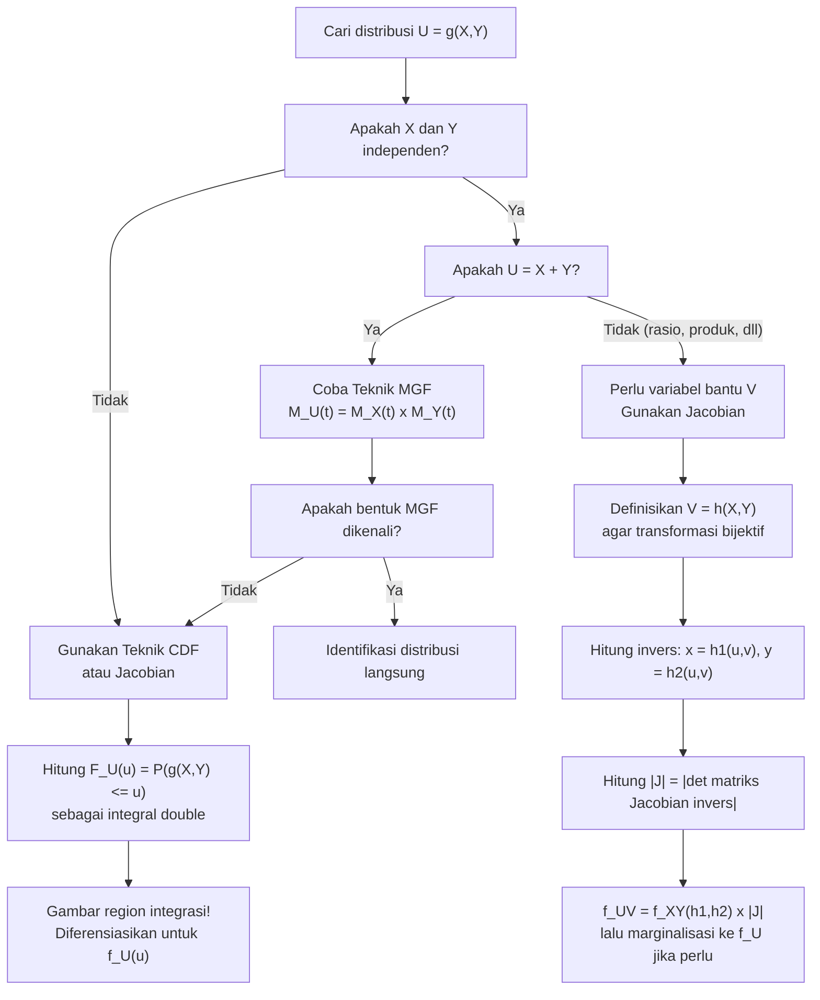

# 📊 3.8 — Transformasi Variabel Acak Gabungan

> [!ABSTRACT] Ringkasan Cepat
> **Topik:** Transformasi Variabel Acak Gabungan | **Bobot:** ~20–30% | **Difficulty:** Hard
> **Ref:** Hogg-McKean-Craig (2019) Bab 2.1–2.6; Miller et al. (2014) Bab 3.5–3.8, 4.6–4.9 | **Prereq:** [[2.4 Transformasi Variabel Acak Univariat]], [[3.1 Distribusi Gabungan (Joint Distribution)]], [[3.2 Distribusi Marginal]]

## Section 0 — Pemetaan Topik

| Topik CF2 | Sub-topik ID | Skill Diuji | Bobot | Difficulty | Prerequisite | Connected Topics | Referensi |
|-----------|--------------|-------------|-------|------------|--------------|------------------|-----------|
| Topik 3: Variabel Acak Multivariat | 3.8 | Menerapkan teknik CDF untuk transformasi gabungan; menghitung Jacobian transformasi dua variabel; menentukan PDF joint baru dari transformasi $(U,V) = g(X,Y)$; menentukan distribusi variabel tunggal $U = g(X,Y)$ via marginalisasi; menerapkan teknik MGF untuk penjumlahan variabel independen | 20–30% | Hard | [[2.4 Transformasi Variabel Acak Univariat]], [[3.1 Distribusi Gabungan (Joint Distribution)]], [[3.2 Distribusi Marginal]], [[3.3 Distribusi Bersyarat (Conditional Distribution)]], [[3.5 Independensi dan Korelasi]] | [[3.7 Distribusi Majemuk (Compound Distribution)]], [[4.2 Distribusi Sampel]], [[2.3 Fungsi Pembangkit]], [[2.6 Distribusi Kontinu Umum]] | Hogg-McKean-Craig (2019) Bab 2.1–2.6; Miller et al. (2014) Bab 3.5–3.8, 4.6–4.9 |

## Section 1 — Intuisi

Dalam pemodelan aktuaria, kita jarang hanya peduli pada satu variabel tunggal. Pertimbangkan skenario berikut: seorang aktuaris memiliki dua sumber risiko independen — total klaim dari lini bisnis kendaraan $X$ dan total klaim dari lini bisnis properti $Y$. Yang dibutuhkan perusahaan adalah distribusi dari **total klaim gabungan** $S = X + Y$, karena inilah yang menentukan cadangan teknis keseluruhan. Masalah ini — "jika kita tahu distribusi gabungan $(X, Y)$, bagaimana distribusi dari suatu fungsi $g(X, Y)$?" — adalah inti dari topik transformasi variabel acak gabungan.

Analoginya adalah seperti memiliki peta dua dimensi dan ingin menggambar kembali peta itu dalam sistem koordinat baru. Jika kita punya titik-titik dalam koordinat $(x, y)$ dan ingin mengekspresikannya dalam koordinat $(u, v) = g(x, y)$, maka "kepadatan" titik-titik itu di koordinat baru harus disesuaikan — kita tidak bisa begitu saja mengganti variabel tanpa memperhitungkan bagaimana "skala" berubah. Faktor penyesuaian skala ini adalah **Jacobian** dari transformasi, yang mengukur seberapa besar daerah luas berubah saat kita berpindah sistem koordinat. Tanpa Jacobian, probabilitas total tidak akan menjadi 1 lagi.

Ada tiga senjata utama dalam arsenal transformasi gabungan, masing-masing punya kekuatan berbeda. **Teknik CDF** adalah yang paling universal: hitung $P(U \leq u)$ langsung dari definisi, lalu diferensiasikan. **Teknik Jacobian** paling elegan untuk transformasi satu-ke-satu yang bisa diinverskan. **Teknik MGF** paling efisien ketika variabel-variabelnya independen dan kita hanya butuh distribusi penjumlahan. Mengetahui kapan menggunakan mana adalah kunci efisiensi di exam CF2.

## Section 2 — Definisi Formal

> [!NOTE] Definisi Matematis
> Misalkan $(X, Y)$ adalah vektor variabel acak kontinu dengan PDF gabungan $f_{X,Y}(x,y)$ pada support $\mathcal{S}_{XY}$.
>
> **Transformasi Satu-ke-Satu:** Misalkan $(U, V) = \bigl(g_1(X,Y),\, g_2(X,Y)\bigr)$ adalah transformasi yang *bijektif* (one-to-one) dari $\mathcal{S}_{XY}$ ke $\mathcal{S}_{UV}$, dengan invers $X = h_1(U,V)$, $Y = h_2(U,V)$.
>
> **PDF Gabungan Setelah Transformasi (Metode Jacobian):**
> $$
> f_{U,V}(u,v) = f_{X,Y}\!\bigl(h_1(u,v),\, h_2(u,v)\bigr) \cdot |J|, \quad (u,v) \in \mathcal{S}_{UV}
> $$
>
> **Jacobian Transformasi:**
> $$
> J = \frac{\partial(x,y)}{\partial(u,v)} = \begin{vmatrix} \dfrac{\partial h_1}{\partial u} & \dfrac{\partial h_1}{\partial v} \\[8pt] \dfrac{\partial h_2}{\partial u} & \dfrac{\partial h_2}{\partial v} \end{vmatrix} = \frac{\partial h_1}{\partial u}\frac{\partial h_2}{\partial v} - \frac{\partial h_1}{\partial v}\frac{\partial h_2}{\partial u}
> $$
>
> **PDF Marginal dari $U$:**
> $$
> f_U(u) = \int_{-\infty}^{\infty} f_{U,V}(u,v)\, dv
> $$

### Variabel & Parameter

| Simbol | Makna | Catatan |
|--------|-------|---------|
| $(X, Y)$ | Vektor variabel acak asal | PDF gabungan $f_{X,Y}(x,y)$ |
| $(U, V)$ | Vektor variabel acak baru setelah transformasi | $U = g_1(X,Y)$, $V = g_2(X,Y)$ |
| $g_1, g_2$ | Fungsi transformasi dari $(x,y)$ ke $(u,v)$ | Harus bijektif untuk teknik Jacobian langsung |
| $h_1, h_2$ | Fungsi invers: $x = h_1(u,v)$, $y = h_2(u,v)$ | Diperoleh dengan menginverskan $g_1, g_2$ |
| $J$ | Jacobian transformasi invers $\partial(x,y)/\partial(u,v)$ | Nilai absolutnya $|J|$ yang digunakan |
| $\mathcal{S}_{XY}$ | Support dari $(X, Y)$ | Domain di mana $f_{X,Y}(x,y) > 0$ |
| $\mathcal{S}_{UV}$ | Support dari $(U, V)$ | Bayangan (*image*) $\mathcal{S}_{XY}$ di bawah $g$ |
| $F_U(u)$ | CDF dari $U$ | $P(U \leq u) = P(g_1(X,Y) \leq u)$ |
| $M_X(t)$ | MGF dari $X$ | $E[e^{tX}]$; digunakan untuk teknik MGF |

### Rumus Utama

$$
f_{U,V}(u,v) = f_{X,Y}\!\bigl(h_1(u,v),\, h_2(u,v)\bigr)\cdot \left|\frac{\partial(x,y)}{\partial(u,v)}\right|
$$
**Label: Formula Perubahan Variabel (Change of Variables)** — PDF gabungan baru adalah PDF lama yang dievaluasi di titik asal (invers transformasi) dikalikan nilai absolut Jacobian.

$$
J = \frac{\partial(x,y)}{\partial(u,v)} = \frac{\partial h_1}{\partial u}\frac{\partial h_2}{\partial v} - \frac{\partial h_1}{\partial v}\frac{\partial h_2}{\partial u}
$$
**Label: Jacobian Invers** — selalu hitung Jacobian dari transformasi *invers* $(u,v) \mapsto (x,y)$, bukan dari transformasi maju $(x,y) \mapsto (u,v)$.

$$
\frac{\partial(u,v)}{\partial(x,y)} \cdot \frac{\partial(x,y)}{\partial(u,v)} = 1 \implies \left|\frac{\partial(x,y)}{\partial(u,v)}\right| = \left|\frac{\partial(u,v)}{\partial(x,y)}\right|^{-1}
$$
**Label: Hubungan Jacobian Maju dan Invers** — jika lebih mudah menghitung Jacobian maju, balik saja nilainya.

$$
M_{X+Y}(t) = M_X(t) \cdot M_Y(t), \quad \text{jika } X \perp Y
$$
**Label: Teknik MGF untuk Penjumlahan Independen** — MGF penjumlahan variabel independen adalah produk MGF masing-masing; identifikasi distribusi dari bentuk MGF hasilnya.

$$
F_U(u) = P(g_1(X,Y) \leq u) = \iint_{\{(x,y): g_1(x,y) \leq u\}} f_{X,Y}(x,y)\, dx\, dy
$$
**Label: Teknik CDF** — universal untuk semua transformasi; tidak mensyaratkan bijektivitas; diferensiasikan CDF untuk mendapatkan PDF.

### Asumsi Eksplisit

- **Teknik Jacobian:** Transformasi $(g_1, g_2)$ harus *one-to-one* (bijektif) dari $\mathcal{S}_{XY}$ ke $\mathcal{S}_{UV}$. Jika tidak bijektif, bagi domain menjadi bagian-bagian bijektif dan jumlahkan kontribusinya.
- **Diferensiabilitas:** Fungsi $h_1, h_2$ harus memiliki turunan parsial yang kontinu di $\mathcal{S}_{UV}$.
- **Jacobian non-nol:** $J \neq 0$ di seluruh interior $\mathcal{S}_{UV}$; jika $J = 0$ di suatu titik, transformasi tidak bijektif di titik tersebut.
- **Teknik MGF:** $X$ dan $Y$ harus **independen** agar $M_{X+Y}(t) = M_X(t) M_Y(t)$.
- **Variabel kontinu:** Seluruh pembahasan menggunakan PDF (bukan PMF). Untuk kasus diskrit, gunakan PMF gabungan dan penjumlahan langsung.

## Section 3 — Jembatan Logika

> [!TIP] Dari Definisi ke Rumus
> Intuisi di balik rumus Jacobian berasal dari kalkulus multivariabel. Ketika kita menghitung integral lipat dan melakukan substitusi variabel, faktor $|J|$ muncul secara alami untuk memastikan probabilitas total tetap 1. Secara geometris: jika transformasi $(x,y) \mapsto (u,v)$ "meregangkan" suatu daerah kecil $\Delta A_{xy}$ menjadi daerah $\Delta A_{uv}$, maka $|\Delta A_{uv}| \approx |J^{-1}| \cdot |\Delta A_{xy}|$, sehingga $f_{U,V}(u,v) \cdot |\Delta A_{uv}| = f_{X,Y}(x,y) \cdot |\Delta A_{xy}|$ harus terpenuhi (probabilitas di daerah yang sama harus sama). Ini menghasilkan $f_{U,V}(u,v) = f_{X,Y}(h_1(u,v), h_2(u,v)) \cdot |J|$.

> [!IMPORTANT] Support dan Domain
> - Support $\mathcal{S}_{UV}$ adalah **bayangan** dari $\mathcal{S}_{XY}$ di bawah transformasi $(g_1, g_2)$. Menentukan $\mathcal{S}_{UV}$ dengan tepat adalah langkah yang paling sering salah di exam.
> - Ketika batas integral bergantung pada variabel lain (e.g., $0 < y < x$), transformasi dapat mengubah batas secara non-trivial — harus digambar dahulu atau dicek dengan titik uji (*test point*).
> - Untuk teknik CDF dengan $U = X + Y$: region integrasinya adalah $\{(x,y) : x + y \leq u\}$, yang merupakan setengah bidang di bawah garis $x + y = u$.

**Derivasi Formula Jacobian dari Prinsip Pertama:**

Kita ingin menghitung $P(U \leq u_0, V \leq v_0)$ melalui integral:

$$
P(U \leq u_0, V \leq v_0) = \iint_{\{(u,v): u \leq u_0, v \leq v_0\}} f_{U,V}(u,v)\, du\, dv
$$

Di sisi lain, probabilitas ini sama dengan:

$$
P(U \leq u_0, V \leq v_0) = P\bigl(g_1(X,Y) \leq u_0,\, g_2(X,Y) \leq v_0\bigr) = \iint_{\mathcal{R}} f_{X,Y}(x,y)\, dx\, dy
$$

di mana $\mathcal{R} = \{(x,y) : g_1(x,y) \leq u_0,\, g_2(x,y) \leq v_0\}$. Dengan substitusi $x = h_1(u,v)$, $y = h_2(u,v)$ dalam integral di atas, teorema perubahan variabel untuk integral lipat memberikan:

$$
\iint_{\mathcal{R}} f_{X,Y}(x,y)\, dx\, dy = \iint_{\mathcal{R}'} f_{X,Y}\!\bigl(h_1(u,v), h_2(u,v)\bigr) \cdot \left|\frac{\partial(x,y)}{\partial(u,v)}\right| du\, dv
$$

Karena kedua sisi harus sama untuk semua $(u_0, v_0)$, integrandnya harus sama pointwise, menghasilkan:

$$
\boxed{f_{U,V}(u,v) = f_{X,Y}\!\bigl(h_1(u,v), h_2(u,v)\bigr) \cdot |J|}
$$

**Derivasi Teknik MGF untuk $S = X + Y$ dengan $X \perp Y$:**

$$
M_S(t) = E[e^{t(X+Y)}] = E[e^{tX} \cdot e^{tY}] \overset{X \perp Y}{=} E[e^{tX}] \cdot E[e^{tY}] = M_X(t) \cdot M_Y(t)
$$

Langkah ketiga menggunakan properti independensi: jika $X \perp Y$, maka $E[g(X) \cdot h(Y)] = E[g(X)] \cdot E[h(Y)]$ untuk fungsi $g, h$ yang dapat diukur (measurable). Setelah mendapatkan $M_S(t)$, identifikasi distribusi $S$ dari bentuk MGF tersebut menggunakan keunikan MGF.

> [!DANGER] Dilarang
> 1. **Dilarang menggunakan Jacobian maju langsung** $\partial(u,v)/\partial(x,y)$ sebagai faktor pengali tanpa membaliknya. Rumus yang benar menggunakan Jacobian *invers* $|\partial(x,y)/\partial(u,v)|$.
> 2. **Dilarang menerapkan teknik MGF** $M_{X+Y}(t) = M_X(t) \cdot M_Y(t)$ **tanpa memverifikasi independensi** $X$ dan $Y$ terlebih dahulu. Relasi ini hanya berlaku untuk variabel independen.
> 3. **Dilarang melupakan marginalisasi** saat hanya membutuhkan distribusi dari satu variabel transformasi ($U$ saja). Setelah mendapatkan $f_{U,V}$, wajib integrasikan terhadap $v$ untuk mendapatkan $f_U(u)$.

## Section 4 — Contoh Soal

### Soal A — Fundamental

Misalkan $X$ dan $Y$ adalah variabel acak kontinu independen dengan distribusi Eksponensial berparameter $\lambda = 1$, sehingga $f_{X,Y}(x,y) = e^{-x} e^{-y}$ untuk $x > 0$, $y > 0$. Definisikan transformasi $U = X + Y$ dan $V = X - Y$. Tentukan PDF gabungan $f_{U,V}(u,v)$ dan PDF marginal $f_U(u)$ dari $U$.

> [!SUCCESS] Solusi Soal A
>
> **1. Identifikasi Variabel**
> - $f_{X,Y}(x,y) = e^{-x-y}$, support: $x > 0$, $y > 0$
> - Transformasi maju: $u = x + y$, $v = x - y$
> - Cari: $f_{U,V}(u,v)$ dan $f_U(u)$
>
> **2. Identifikasi Distribusi / Model**
> - $(X,Y)$ joint Eksponensial independen; setelah transformasi, $U = X + Y \sim \text{Gamma}(2, 1)$ (akan diverifikasi via marginalisasi).
> - Gunakan teknik Jacobian karena transformasi linear dan bijektif.
>
> **3. Setup Persamaan (Inversikan transformasi)**
>
> Dari $u = x + y$ dan $v = x - y$:
> $$
> x = h_1(u,v) = \frac{u+v}{2}, \qquad y = h_2(u,v) = \frac{u-v}{2}
> $$
>
> Jacobian invers:
> $$
> J = \frac{\partial(x,y)}{\partial(u,v)} = \begin{vmatrix} \partial h_1/\partial u & \partial h_1/\partial v \\ \partial h_2/\partial u & \partial h_2/\partial v \end{vmatrix} = \begin{vmatrix} 1/2 & 1/2 \\ 1/2 & -1/2 \end{vmatrix}
> $$
>
> **4. Eksekusi Aljabar**
>
> $$
> J = \left(\frac{1}{2}\right)\left(-\frac{1}{2}\right) - \left(\frac{1}{2}\right)\left(\frac{1}{2}\right) = -\frac{1}{4} - \frac{1}{4} = -\frac{1}{2}
> $$
>
> Sehingga $|J| = \dfrac{1}{2}$.
>
> Tentukan support $(u,v)$: syarat $x > 0$ dan $y > 0$ berarti:
> $$
> \frac{u+v}{2} > 0 \implies u + v > 0; \qquad \frac{u-v}{2} > 0 \implies u > v
> $$
>
> Selain itu $u = x + y > 0$. Jadi support: $u > 0$ dan $-u < v < u$.
>
> PDF gabungan:
> $$
> f_{U,V}(u,v) = f_{X,Y}\!\left(\frac{u+v}{2}, \frac{u-v}{2}\right) \cdot \frac{1}{2} = e^{-(u+v)/2} \cdot e^{-(u-v)/2} \cdot \frac{1}{2} = \frac{1}{2}e^{-u}
> $$
>
> untuk $u > 0$, $-u < v < u$.
>
> PDF marginal $f_U(u)$: integrasikan terhadap $v$:
> $$
> f_U(u) = \int_{-u}^{u} \frac{1}{2} e^{-u}\, dv = \frac{1}{2}e^{-u} \cdot 2u = u\, e^{-u}, \quad u > 0
> $$
>
> Ini adalah PDF $\text{Gamma}(2, 1)$, terkonfirmasi.
>
> **5. Verification**
>
> Cek normalisasi $f_U(u)$:
> $$
> \int_0^\infty u e^{-u}\, du = \Gamma(2) = 1! = 1 \checkmark
> $$
>
> Cek marginal dari $f_{U,V}$: $f_{U,V}(u,v) = \frac{1}{2}e^{-u}$ terpisah dalam $u$ dan $v$ (faktanya $\frac{1}{2}$ adalah "PDF seragam dalam $v$ pada $(-u,u)$"), dan integrasinya menghasilkan $f_U(u)$ yang benar $\checkmark$.

> [!WARNING] Exam Tips — Soal A
> - **Target waktu:** 8–10 menit.
> - **Common trap:** Salah menentukan batas $v$. Karena $-u < v < u$, batas bervariasi tergantung $u$ — bukan konstan. Selalu gambar region $(x,y)$ lalu peta ke $(u,v)$.
> - **Shortcut:** Untuk $U = X + Y$ di mana $X, Y \overset{iid}{\sim} \text{Exp}(1)$, langsung gunakan teknik MGF: $M_U(t) = \left(\frac{1}{1-t}\right)^2 = M_{\text{Gamma}(2,1)}(t)$, sehingga $U \sim \text{Gamma}(2,1)$ tanpa perlu menghitung Jacobian.

### Soal B — Exam-Typical

Misalkan $X$ dan $Y$ adalah variabel acak kontinu independen dengan $X \sim U(0,1)$ dan $Y \sim U(0,1)$. Tentukan PDF dari $U = -\ln X - \ln Y$. Sebutkan distribusi apa yang dimiliki $U$.

> [!SUCCESS] Solusi Soal B
>
> **1. Identifikasi Variabel**
> - $f_X(x) = 1$ untuk $0 < x < 1$; $f_Y(y) = 1$ untuk $0 < y < 1$
> - $f_{X,Y}(x,y) = 1$ untuk $0 < x < 1$, $0 < y < 1$ (independen)
> - Cari: distribusi $U = -\ln X - \ln Y$
>
> **2. Identifikasi Distribusi / Model**
> - Gunakan teknik MGF. Karena $X \perp Y$, $M_U(t) = M_{-\ln X}(t) \cdot M_{-\ln Y}(t)$.
> - Alternatif: gunakan transformasi bertahap — definisikan $W_1 = -\ln X$ dan $W_2 = -\ln Y$, identifikasi distribusinya, lalu gunakan teknik konvolusi/MGF.
>
> **3. Setup Persamaan**
>
> Pertama, tentukan distribusi $W = -\ln X$ di mana $X \sim U(0,1)$:
>
> $$
> F_W(w) = P(-\ln X \leq w) = P(X \geq e^{-w}) = 1 - e^{-w}, \quad w > 0
> $$
>
> Sehingga $W = -\ln X \sim \text{Exp}(1)$. Demikian pula $-\ln Y \sim \text{Exp}(1)$.
>
> **4. Eksekusi Aljabar**
>
> Karena $X \perp Y$, maka $W_1 = -\ln X \perp W_2 = -\ln Y$, keduanya $\sim \text{Exp}(1)$.
>
> MGF dari $W_1 \sim \text{Exp}(1)$:
> $$
> M_{W_1}(t) = \frac{1}{1-t}, \quad t < 1
> $$
>
> MGF dari $U = W_1 + W_2$ (menggunakan independensi):
> $$
> M_U(t) = M_{W_1}(t) \cdot M_{W_2}(t) = \frac{1}{1-t} \cdot \frac{1}{1-t} = \frac{1}{(1-t)^2}, \quad t < 1
> $$
>
> MGF ini dikenali sebagai MGF distribusi $\text{Gamma}(\alpha, \beta)$ dengan $\alpha = 2$, $\beta = 1$ (atau secara setara, $\chi^2(4)$ dibagi 2). Dengan keunikan MGF:
>
> $$
> U = -\ln X - \ln Y \sim \text{Gamma}(2, 1)
> $$
>
> PDF-nya:
> $$
> f_U(u) = \frac{u^{2-1} e^{-u/1}}{\Gamma(2) \cdot 1^2} = u\, e^{-u}, \quad u > 0
> $$
>
> **5. Verification**
>
> $E[U] = \alpha\beta = 2 \cdot 1 = 2$. Cek langsung: $E[-\ln X] = -\int_0^1 \ln x\, dx = 1$, sehingga $E[U] = 1 + 1 = 2$ $\checkmark$.

> [!WARNING] Exam Tips — Soal B
> - **Target waktu:** 10–12 menit.
> - **Common trap:** Mencoba langsung menghitung Jacobian dari $U = -\ln X - \ln Y$ sebagai transformasi satu variabel tanpa memperkenalkan variabel bantu $V$ — ini tidak valid karena kita butuh dua persamaan untuk dua variabel.
> - **Strategi:** Transformasi bertahap ($X \to W_1$, $Y \to W_2$, lalu $W_1 + W_2$) jauh lebih efisien daripada Jacobian langsung. Kenali pola $-\ln(\text{Uniform}(0,1)) \sim \text{Exp}(1)$ — ini sangat sering muncul di CF2.
> - **Kunci MGF Gamma:** $M_{\Gamma(\alpha,\beta)}(t) = (1-\beta t)^{-\alpha}$ untuk $t < 1/\beta$.

### Soal C — Challenging

Misalkan $X$ dan $Y$ adalah variabel acak kontinu dengan PDF gabungan:
$$
f_{X,Y}(x,y) = 2, \quad 0 < y < x < 1
$$
Tentukan PDF dari $U = X/Y$ menggunakan teknik CDF. Tentukan pula $E[U]$ jika ada.

> [!SUCCESS] Solusi Soal C
>
> **1. Identifikasi Variabel**
> - $f_{X,Y}(x,y) = 2$ pada region segitiga $\mathcal{S}: 0 < y < x < 1$
> - $U = X/Y$; karena $0 < y < x < 1$, maka $U = X/Y > 1$
> - Cari: $f_U(u)$ dan $E[U]$
>
> **2. Identifikasi Distribusi / Model**
> - Gunakan teknik CDF: hitung $F_U(u) = P(X/Y \leq u)$ untuk $u > 1$, lalu diferensiasikan.
> - $(X,Y)$ tidak independen (support bergantung satu sama lain), sehingga teknik MGF tidak berlaku.
>
> **3. Setup Persamaan**
>
> Untuk $u > 1$:
> $$
> F_U(u) = P\!\left(\frac{X}{Y} \leq u\right) = P(X \leq uY)
> $$
>
> Region integrasi: irisan dari $\{X \leq uY\}$ dengan support $\mathcal{S} = \{0 < y < x < 1\}$.
>
> **4. Eksekusi Aljabar**
>
> Di dalam $\mathcal{S}$, $X \leq uY$ berarti $x \leq uy$. Perlu kasus berdasarkan nilai $u$:
>
> *Kasus 1: $1 < u \leq 1$ — sudah tercakup, perlu $u$ lebih besar.*
>
> Perhatikan: di $\mathcal{S}$, $x/y > 1$ selalu, jadi $U > 1$. Batas atas $U$: maksimum $x/y$ terjadi saat $y \to 0^+$, $x \to 1$, jadi $U$ bisa tak hingga. Jadi $U \in (1, \infty)$.
>
> Untuk menghitung $P(X \leq uY)$ di region $\mathcal{S}$ dengan $u > 1$:
>
> - Garis $x = uy$ memotong region $\mathcal{S}$.
> - Di $\mathcal{S}$, $0 < y < x < 1$. Jika $u > 1$, garis $x = uy$ memiliki kemiringan $> 1$.
> - Interseksi garis $x = uy$ dengan $x = 1$: $y = 1/u$. Interseksi dengan $x = y$: $y(u-1) = 0 \implies y = 0$.
>
> Region $\{(x,y) \in \mathcal{S} : x \leq uy\}$:
>
> Untuk $0 < y < 1/u$: batasan $x$ dari $y$ hingga $uy$ (karena $uy < 1$).
> Untuk $1/u \leq y < 1$: tidak mungkin di $\mathcal{S}$ karena $y < x < 1$ dan $y \geq 1/u > 0$.
>
> Tunggu — perlu lebih hati-hati. Di $\mathcal{S}$: $0 < y < x < 1$. Untuk $x \leq uy$:
>
> Integrasikan atas $y$ dari 0 ke $1/u$, lalu $x$ dari $y$ ke $uy$:
>
> $$
> F_U(u) = \int_0^{1/u} \int_y^{uy} 2\, dx\, dy = \int_0^{1/u} 2(uy - y)\, dy = 2(u-1)\int_0^{1/u} y\, dy
> $$
>
> $$
> = 2(u-1) \cdot \frac{1}{2} \cdot \frac{1}{u^2} = \frac{u-1}{u^2}
> $$
>
> Diferensiasikan untuk mendapat PDF:
> $$
> f_U(u) = \frac{d}{du}\!\left[\frac{u-1}{u^2}\right] = \frac{d}{du}\!\left[\frac{1}{u} - \frac{1}{u^2}\right] = -\frac{1}{u^2} + \frac{2}{u^3} = \frac{2 - u}{u^3}
> $$
>
> Tunggu — cek tanda: untuk $u > 1$, perlu $f_U(u) \geq 0$. Saat $u > 2$, $2 - u < 0$ sehingga $f_U(u) < 0$ — ini tidak valid. Ada kesalahan region.
>
> **Koreksi:** Untuk $u \geq 1$, ketika $uy \geq 1$ (yaitu $y \geq 1/u$), batas atas $x$ menjadi 1 (bukan $uy$). Bagi menjadi dua bagian berdasarkan apakah $uy$ melewati $x = 1$:
>
> - Untuk $1 < u \leq$ semua nilai: perlu memeriksa apakah $1/u < 1$. Ya, selalu, karena $u > 1$.
>
> Sebenarnya untuk $0 < y < 1/u$: $uy < 1$, jadi $x$ dari $y$ ke $uy$.
> Untuk $1/u \leq y < 1$: $uy \geq 1$, jadi kondisi $x \leq uy$ dengan $x < 1$ otomatis terpenuhi untuk semua $x \in (y, 1)$.
>
> $$
> F_U(u) = \int_0^{1/u}\!\int_y^{uy} 2\, dx\, dy + \int_{1/u}^{1}\!\int_y^{1} 2\, dx\, dy
> $$
>
> Bagian pertama:
> $$
> \int_0^{1/u} 2(uy-y)\,dy = 2(u-1)\cdot\frac{1}{2u^2} = \frac{u-1}{u^2}
> $$
>
> Bagian kedua (ini adalah $P(X/Y > 1, Y > 1/u)$ dalam support):
> $$
> \int_{1/u}^1 2(1-y)\,dy = 2\left[y - \frac{y^2}{2}\right]_{1/u}^1 = 2\left[\frac{1}{2} - \frac{1}{u} + \frac{1}{2u^2}\right] = 1 - \frac{2}{u} + \frac{1}{u^2}
> $$
>
> Jadi:
> $$
> F_U(u) = \frac{u-1}{u^2} + 1 - \frac{2}{u} + \frac{1}{u^2} = 1 - \frac{2}{u} + \frac{1}{u^2} + \frac{1}{u} - \frac{1}{u^2} = 1 - \frac{1}{u}
> $$
>
> Diferensiasikan:
> $$
> f_U(u) = \frac{d}{du}\!\left(1 - \frac{1}{u}\right) = \frac{1}{u^2}, \quad u > 1
> $$
>
> Ini adalah distribusi Pareto dengan $\alpha = 1$, $\theta = 1$.
>
> **5. Verification**
>
> Normalisasi: $\int_1^\infty \frac{1}{u^2}\, du = \left[-\frac{1}{u}\right]_1^\infty = 0 - (-1) = 1$ $\checkmark$.
>
> $E[U] = \int_1^\infty u \cdot \frac{1}{u^2}\, du = \int_1^\infty \frac{1}{u}\, du = \infty$.
>
> Jadi $E[U]$ **tidak ada (divergen)**. Ini masuk akal karena distribusi Pareto dengan $\alpha = 1$ tidak memiliki mean.

> [!WARNING] Exam Tips — Soal C
> - **Target waktu:** 15–18 menit.
> - **Common trap terbesar:** Melupakan pembagian region dalam teknik CDF. Ketika $uy$ bisa melampaui batas support ($x < 1$), region integrasi harus dibagi dua — kasus ini sangat sering dijebak di soal CF2.
> - **Common trap kedua:** Menyimpulkan $E[U]$ ada tanpa memeriksa konvergensi integral. Jika PDF bersifat $\sim 1/u^2$ untuk $u$ besar, $E[U]$ divergen.
> - **Strategi:** Setelah mendapat $F_U(u)$, selalu verifikasi $\lim_{u \to \infty} F_U(u) = 1$ sebelum diferensiasi. Jika tidak 1, ada kesalahan region.

## Section 5 — Verifikasi & Sanity Check

> [!CHECK] Verifikasi PDF Gabungan Hasil Transformasi
> Setelah mendapatkan $f_{U,V}(u,v)$, wajib periksa:
> 1. $f_{U,V}(u,v) \geq 0$ di seluruh support $\mathcal{S}_{UV}$.
> 2. $\iint_{\mathcal{S}_{UV}} f_{U,V}(u,v)\, du\, dv = 1$ (normalisasi terpenuhi).

> [!CHECK] Verifikasi Support
> 1. Substitusikan titik sudut $\mathcal{S}_{XY}$ ke dalam transformasi $(g_1, g_2)$ untuk mendapatkan sudut-sudut $\mathcal{S}_{UV}$.
> 2. Substitusikan satu titik interior ke dalam invers transformasi $(h_1, h_2)$ untuk memverifikasi bahwa titik tersebut memang berada di dalam $\mathcal{S}_{XY}$.

> [!CHECK] Verifikasi Jacobian
> 1. Hitung Jacobian maju $J_{\text{maju}} = \partial(u,v)/\partial(x,y)$ dan verifikasi $|J| = |J_{\text{maju}}|^{-1}$.
> 2. Untuk transformasi linear $(u,v) = A(x,y)^T$, Jacobian adalah $|\det A|^{-1}$ — lebih mudah dihitung via determinan matriks.

> [!CHECK] Verifikasi Teknik MGF
> 1. Pastikan MGF yang diperoleh $M_U(t)$ memiliki domain valid yang non-trivial ($t < c$ untuk suatu $c > 0$).
> 2. Cocokkan bentuk MGF dengan bentuk standar dari distribusi-distribusi di silabus CF2 (Gamma, Normal, dll.).

### Metode Alternatif

Untuk $U = X + Y$ dengan $X, Y$ kontinu independen, ada **tiga metode** yang valid:

**Metode 1 — Konvolusi (Marginalisasi dari Jacobian):**
$$
f_U(u) = \int_{-\infty}^{\infty} f_X(u - y)\, f_Y(y)\, dy
$$
Berlaku karena $X \perp Y$; ini adalah rumus konvolusi PDF.

**Metode 2 — Teknik MGF:**
$$
M_U(t) = M_X(t) \cdot M_Y(t)
$$
Efisien jika distribusi hasil penjumlahan dikenali dari bentuk MGF-nya.

**Metode 3 — Teknik CDF:**
$$
F_U(u) = \iint_{x+y \leq u} f_{X,Y}(x,y)\, dx\, dy, \quad f_U(u) = \frac{d}{du} F_U(u)
$$
Universal, berlaku bahkan untuk $X, Y$ yang tidak independen.

## Section 6 — Visualisasi Mental

**Diagram Region Support — Transformasi Jacobian:**

Bayangkan bidang $xy$ dengan region support $\mathcal{S}_{XY}$ (misalnya persegi $[0,1]^2$ atau segitiga $0 < y < x < 1$). Transformasi $(u,v) = g(x,y)$ "membengkokkan" atau "meregangkan" region ini menjadi region $\mathcal{S}_{UV}$ baru di bidang $uv$. Sumbu $u$ dan sumbu $v$ tidak harus saling tegak lurus dengan sumbu asal — mereka bisa berotasi atau berskala berbeda.

Di setiap titik $(u,v) \in \mathcal{S}_{UV}$, faktor $|J|$ mengukur **rasio luas daerah kecil di $uv$ terhadap luas daerah yang berkorespondensi di $xy$**. Jika $|J| > 1$, transformasi meregangkan daerah (probabilitas "encer" di $(u,v)$, jadi PDF lebih kecil). Jika $|J| < 1$, daerah dipadatkan (probabilitas "pekat", PDF lebih besar).

**Diagram Teknik CDF — Region Integrasi:**

Untuk $U = X/Y$, region $\{X/Y \leq u\}$ adalah $\{X \leq uY\}$ — yakni region di bawah garis $x = uy$ yang melewati asal dengan kemiringan $u$. Saat $u$ meningkat, garis berotasi ke atas, "menyapu" lebih banyak dari support. Kumulatif probabilitas $F_U(u)$ adalah luas yang tersapu (terbobot oleh PDF).

### Hubungan Visual ↔ Rumus

Faktor Jacobian $|J|$ berkorespondensi langsung dengan **rasio luas**:

$$
|J| = \left|\frac{\partial(x,y)}{\partial(u,v)}\right| \longleftrightarrow \frac{d(\text{Luas di }xy)}{d(\text{Luas di }uv)}
$$

Region integrasi dalam teknik CDF berkorespondensi dengan **kurva level** $g(x,y) = u$ yang membagi support:

$$
F_U(u) = \iint_{\{g(x,y) \leq u\}} f_{X,Y}(x,y)\, dx\, dy \longleftrightarrow \text{luas di bawah kurva level } g = u
$$

## Section 7 — Jebakan Umum

> [!BUG] Kesalahan Parametrisasi
> **Kesalahan 1 — Jacobian Maju vs Invers:** Menggunakan $J_{\text{maju}} = \partial(u,v)/\partial(x,y)$ sebagai faktor pengali langsung, padahal rumusnya memerlukan Jacobian invers $|J| = |\partial(x,y)/\partial(u,v)|$.
>
> **Salah:** $f_{U,V}(u,v) = f_{X,Y}(h_1, h_2) \cdot |\partial(u,v)/\partial(x,y)|$
>
> **Benar:** $f_{U,V}(u,v) = f_{X,Y}(h_1, h_2) \cdot |\partial(x,y)/\partial(u,v)| = f_{X,Y}(h_1, h_2) \cdot |J_{\text{maju}}|^{-1}$
>
> **Kesalahan 2 — MGF Gamma:** Parametrisasi Gamma dalam MGF bisa membingungkan. $M_{\Gamma(\alpha,\beta)}(t) = (1-\beta t)^{-\alpha}$ menggunakan $\beta$ sebagai parameter skala (*scale*), bukan laju (*rate*). Jika buku menggunakan $\beta$ sebagai *rate* ($f(x) = \frac{\beta^\alpha}{\Gamma(\alpha)} x^{\alpha-1} e^{-\beta x}$), maka $M(t) = \left(\frac{\beta}{\beta - t}\right)^\alpha = \left(1 - \frac{t}{\beta}\right)^{-\alpha}$. Selalu periksa parametrisasi buku.

> [!BUG] Kesalahan Konseptual
> 1. **Menerapkan teknik Jacobian untuk transformasi non-bijektif tanpa pembagian domain.** Contoh: $U = X^2$ tidak bijektif ($x$ dan $-x$ memberikan $u$ yang sama). Wajib bagi domain ke $x > 0$ dan $x < 0$ lalu jumlahkan.
> 2. **Melupakan marginalisasi.** Setelah mendapat $f_{U,V}(u,v)$, jika soal meminta $f_U(u)$ saja, harus integrasikan terhadap $v$. Langsung menjawab $f_{U,V}(u,v)$ sebagai $f_U(u)$ adalah kesalahan serius.
> 3. **Mengasumsikan $X \perp Y$ dari soal tanpa verifikasi.** Jika joint PDF $f_{X,Y}(x,y) \neq f_X(x) \cdot f_Y(y)$, atau support joint bergantung pada kedua variabel, maka $X$ dan $Y$ tidak independen dan teknik MGF tidak berlaku.
> 4. **Support $(U,V)$ salah karena tidak mempertimbangkan constraint.** Support $\mathcal{S}_{UV}$ tidak selalu kotak (*rectangular*) meskipun $\mathcal{S}_{XY}$ kotak. Gambar region selalu.

> [!BUG] Kesalahan Interpretasi Soal
> - **"Tentukan distribusi $U = X + Y$"** — soal bisa meminta PDF lengkap, atau hanya distribusi (nama + parameter). Teknik MGF lebih efisien jika hanya perlu mengidentifikasi distribusi.
> - **"Tentukan PDF dari $U = \max(X, Y)$"** — ini bukan transformasi Jacobian biasa; gunakan teknik CDF: $F_U(u) = P(\max(X,Y) \leq u) = F_X(u) \cdot F_Y(u)$ jika $X \perp Y$.
> - **"Tentukan distribusi dari $Z = X/Y$"** — jika tidak ada informasi independensi, jangan langsung gunakan rumus $f_Z(z) = \int |y| f_{X,Y}(zy, y) dy$ (rumus ini memerlukan $X \perp Y$).

> [!CAUTION] Red Flags
> - **Support triangular atau non-rectangular:** Harus gambar region terlebih dahulu; batas integrasi sangat mungkin bergantung variabel lain — potensi kesalahan batas besar.
> - **Transformasi rasio $U = X/Y$:** Selalu cek apakah $E[U]$ ada; distribusi Cauchy ($X, Y \sim N(0,1)$ independen) dan varian Pareto sering tidak memiliki mean.
> - **Kata "tentukan distribusi" tanpa "hitung PDF":** Coba teknik MGF dulu — jauh lebih cepat dari Jacobian.
> - **PDF hasil transformasi bernilai negatif:** Ini pasti ada kesalahan di penentuan support $\mathcal{S}_{UV}$ atau di pembagian region; jangan lanjut sebelum diperbaiki.
> - **Jacobian = 0:** Transformasi tidak bijektif di titik tersebut; perlu analisis lebih lanjut (biasanya titik batas).

## Section 8 — Ringkasan Eksekutif

> [!SUMMARY] Must-Remember
> 1. **Formula Jacobian (transformasi bijektif):**
>    $$
>    f_{U,V}(u,v) = f_{X,Y}\!\bigl(h_1(u,v),\, h_2(u,v)\bigr) \cdot \left|\frac{\partial(x,y)}{\partial(u,v)}\right|
>    $$
> 2. **Jacobian $2 \times 2$ (eksplisit):**
>    $$
>    \left|\frac{\partial(x,y)}{\partial(u,v)}\right| = \left|\frac{\partial h_1}{\partial u}\frac{\partial h_2}{\partial v} - \frac{\partial h_1}{\partial v}\frac{\partial h_2}{\partial u}\right|
>    $$
> 3. **Teknik MGF untuk penjumlahan independen:**
>    $$
>    M_{X+Y}(t) = M_X(t) \cdot M_Y(t), \quad X \perp Y
>    $$
> 4. **Teknik CDF (universal):**
>    $$
>    F_U(u) = \iint_{\{g(x,y) \leq u\}} f_{X,Y}(x,y)\, dx\, dy, \qquad f_U(u) = \frac{d}{du} F_U(u)
>    $$
> 5. **PDF marginal setelah transformasi:**
>    $$
>    f_U(u) = \int_{-\infty}^{\infty} f_{U,V}(u,v)\, dv
>    $$

### Kapan Digunakan

- **Trigger keywords:** "tentukan distribusi dari $g(X,Y)$", "PDF dari $X+Y$, $X-Y$, $XY$, $X/Y$", "transformasi variabel acak", "distribusi penjumlahan", "ubah variabel".
- **Tipe skenario soal:**
  - Diberikan joint PDF $(X,Y)$, cari distribusi $U = g(X,Y)$ (satu variabel baru).
  - Diberikan joint PDF, cari joint PDF baru $(U,V) = (g_1(X,Y), g_2(X,Y))$ lalu marginalisasikan.
  - Variabel $X, Y$ independen dengan distribusi dikenal, cari distribusi $X + Y$ via MGF.
  - Derivasi distribusi sampel (e.g., $\bar{X}$, $S^2$) — ini terhubung ke [[4.2 Distribusi Sampel]].

### Kapan TIDAK Boleh Digunakan

- **Teknik Jacobian tidak boleh digunakan** jika transformasi tidak bijektif tanpa pembagian domain terlebih dahulu.
- **Teknik MGF tidak boleh digunakan** untuk memperoleh PDF secara eksplisit jika bentuk MGF hasilnya tidak dikenali sebagai distribusi standar.
- **Jika variabel diskrit:** Tidak ada Jacobian; gunakan penjumlahan PMF langsung atau PGF untuk penjumlahan variabel independen diskrit (lihat [[2.3 Fungsi Pembangkit]]).
- **Jika hanya butuh momen** (bukan distribusi penuh): gunakan linieritas nilai harapan dan sifat kovarians — jauh lebih cepat daripada menghitung PDF transformasi.

### Quick Decision Tree

---

> [!QUOTE] Follow-up Options
> 1. *"Berikan contoh soal transformasi non-bijektif dengan pembagian domain di topik 3.8"*
> 2. *"Jelaskan hubungan [[3.8 Transformasi Variabel Acak Gabungan]] dengan [[4.2 Distribusi Sampel]] (distribusi $\chi^2$, $t$, $F$)"*
> 3. *"Buat flashcard 1-halaman untuk teknik Jacobian dan CDF gabungan"*

*📖 Ref: Hogg-McKean-Craig (2019) Bab 2.1–2.6; Miller et al. (2014) Bab 3.5–3.8, 4.6–4.9 | 🗓️ 2026-02-21 | #CF2 #Transformasi #Jacobian #Multivariat #CDF #MGF*
