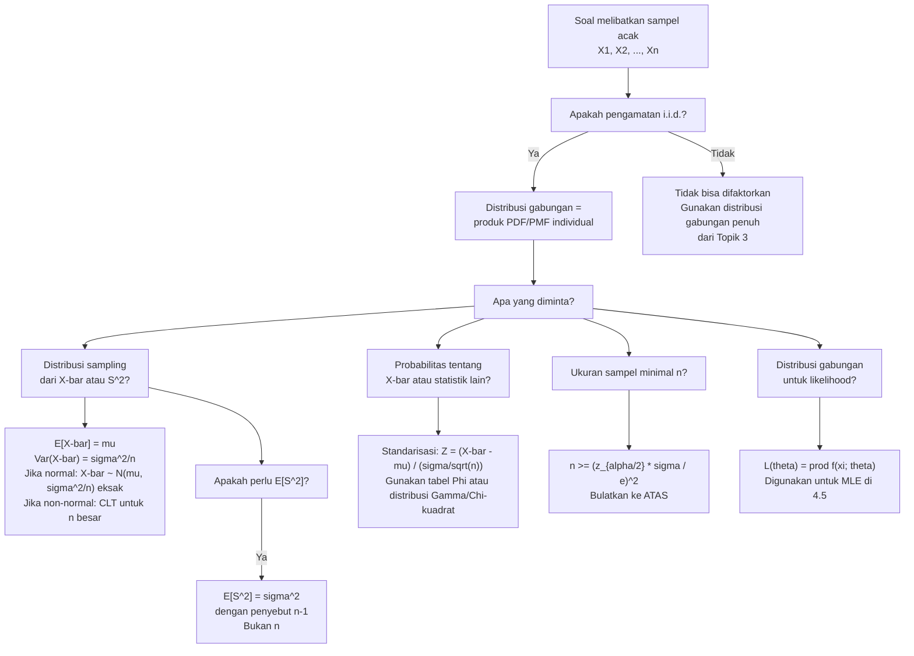

# 📊 4.1 — Penarikan Sampel Acak

> [!ABSTRACT] Ringkasan Cepat
> **Topik:** Penarikan Sampel Acak — Konsep Populasi, Sampel, dan Inferensi Statistik | **Bobot:** ~20–30% | **Difficulty:** Medium
> **Ref:** Hogg-Tanis-Zimm (2015) Bab 5.1–5.2; Hogg-McKean-Craig (2019) Bab 3.1–3.2; Miller et al. (2014) Bab 8.1–8.2; Walpole et al. (2012) Bab 8.1 | **Prereq:** [[2.1 Variabel Acak Diskrit]], [[2.2 Variabel Acak Kontinu]], [[2.6 Distribusi Kontinu Umum]], [[3.1 Distribusi Gabungan (Joint Distribution)]]

## Section 0 — Pemetaan Topik

| Topik CF2 | Sub-topik ID | Skill Diuji | Bobot | Difficulty | Prerequisite | Connected Topics | Referensi |
|-----------|--------------|-------------|-------|------------|--------------|------------------|-----------|
| Topik 4: Inferensi Statistik | 4.1 | Mendefinisikan populasi, parameter, sampel acak, dan statistik; membedakan parameter populasi $\theta$ dengan estimator $\hat{\theta}$; memformulasikan distribusi gabungan sampel i.i.d. sebagai produk PDF/PMF; menghitung probabilitas melibatkan statistik sederhana dari sampel; memahami konsep distribusi sampling (*sampling distribution*) sebagai fondasi inferensi | 20–30% | Medium | [[2.1 Variabel Acak Diskrit]], [[2.2 Variabel Acak Kontinu]], [[2.6 Distribusi Kontinu Umum]], [[3.1 Distribusi Gabungan (Joint Distribution)]] | [[4.2 Distribusi Sampel]], [[4.3 Teorema Limit Pusat (CLT)]], [[4.4 Hukum Bilangan Besar (LLN)]], [[4.5 Estimasi Parameter]], [[4.6 Sifat-Sifat Estimator]] | Hogg-Tanis-Zimm (2015) Bab 5.1–5.2; Hogg-McKean-Craig (2019) Bab 3.1–3.2; Miller et al. (2014) Bab 8.1–8.2; Walpole et al. (2012) Bab 8.1 |

## Section 1 — Intuisi

Bayangkan seorang aktuaris ditugaskan untuk memperkirakan rata-rata kerugian klaim kesehatan dari seluruh pemegang polis sebuah perusahaan asuransi besar — katakanlah 500.000 orang. Mustahil secara praktis untuk menghitung kerugian masing-masing dari 500.000 orang tersebut. Yang dilakukan adalah **mengambil sampel** — misalnya 200 pemegang polis dipilih secara acak, kerugian mereka dicatat, dan dari data 200 orang ini dibuatlah taksiran untuk keseluruhan 500.000. Proses inilah yang disebut **inferensi statistik**: menarik kesimpulan tentang *populasi* berdasarkan informasi dari *sampel*.

Kunci dari seluruh proses ini terletak pada kata "**acak**". Jika 200 pemegang polis dipilih sembarangan — misalnya hanya yang mudah dihubungi atau yang klaimnya besar — sampel tidak representatif dan inferensi menjadi cacat. Ketika kita memilih secara **acak sederhana dengan pengembalian**, setiap pengamatan $X_i$ menjadi variabel acak yang memiliki distribusi yang **sama** dengan distribusi populasi dan **independen** satu sama lain. Kondisi i.i.d. (*independent and identically distributed*) ini adalah fondasi matematis dari hampir seluruh Topik 4: ia memungkinkan distribusi gabungan sampel ditulis sebagai produk PDF/PMF, yang pada gilirannya membuat semua derivasi seperti MLE, distribusi $\bar{X}$, dan CLT menjadi mungkin.

Konsep terpenting untuk dipahami sejak awal adalah perbedaan antara **parameter** dan **statistik**. Parameter — seperti $\mu$, $\sigma^2$, atau $p$ — adalah bilangan tetap (meski tidak diketahui) yang mendeskripsikan populasi. Statistik — seperti $\bar{X}$, $S^2$, atau $\hat{p}$ — adalah fungsi dari data sampel, sehingga ia sendiri merupakan **variabel acak** yang memiliki distribusinya sendiri, yang disebut **distribusi sampling**. Memahami bahwa estimator adalah variabel acak, bukan bilangan tetap, adalah lompatan konseptual terpenting dari Topik 2–3 ke Topik 4.

## Section 2 — Definisi Formal

> [!NOTE] Definisi Matematis
>
> **Populasi dan Parameter:**
> Suatu **populasi** adalah himpunan semua nilai yang mungkin dari besaran yang diamati, dikarakterisasi oleh distribusi probabilitas $f(x;\theta)$ yang bergantung pada **parameter** $\theta$ (bisa vektor).
>
> **Sampel Acak (Random Sample):**
> $X_1, X_2, \ldots, X_n$ disebut **sampel acak berukuran $n$** dari populasi $f(x;\theta)$ jika variabel-variabel tersebut **independen dan identik terdistribusi** (i.i.d.) dengan distribusi $f(x;\theta)$:
> $$X_1, X_2, \ldots, X_n \overset{\text{i.i.d.}}{\sim} f(x;\theta)$$
>
> **Distribusi Gabungan Sampel:**
> $$f_{X_1,\ldots,X_n}(x_1,\ldots,x_n;\theta) = \prod_{i=1}^{n} f(x_i;\theta)$$
>
> **Statistik (Statistic):**
> Suatu **statistik** $T = T(X_1,\ldots,X_n)$ adalah fungsi yang terukur dari sampel yang **tidak bergantung** pada parameter $\theta$ yang tidak diketahui. Statistik adalah variabel acak dengan distribusinya sendiri — disebut **distribusi sampling** (*sampling distribution*).

### Variabel & Parameter

| Simbol | Makna | Catatan |
|--------|-------|---------|
| $\theta$ | Parameter populasi | Bilangan tetap tapi **tidak diketahui**; bisa skalar atau vektor |
| $f(x;\theta)$ | PDF/PMF populasi | Tergantung parameter $\theta$; diketahui bentuknya, tidak diketahui nilai $\theta$ |
| $n$ | Ukuran sampel | Jumlah pengamatan; ditetapkan oleh peneliti |
| $X_i$ | Pengamatan ke-$i$ dalam sampel | Variabel acak; i.i.d. $\sim f(x;\theta)$ |
| $x_i$ | Realizasi (nilai terobservasi) dari $X_i$ | Bilangan tetap setelah sampel diambil |
| $T = T(X_1,\ldots,X_n)$ | Statistik | Variabel acak; fungsi dari sampel; tidak bergantung $\theta$ |
| $\hat{\theta}$ | Estimator dari $\theta$ | Statistik yang digunakan untuk menduga $\theta$; variabel acak |
| $\hat{\theta}_{\text{obs}}$ | Estimasi (nilai terobservasi dari $\hat{\theta}$) | Bilangan tetap; realisasi dari estimator |
| $\bar{X}$ | Mean sampel | $\frac{1}{n}\sum_{i=1}^n X_i$; statistik paling dasar |
| $S^2$ | Variansi sampel | $\frac{1}{n-1}\sum_{i=1}^n (X_i-\bar{X})^2$; estimator tak-bias $\sigma^2$ |

### Rumus Utama

$$
\bar{X} = \frac{1}{n}\sum_{i=1}^n X_i
$$
**Label: Mean Sampel** — statistik ringkas (*summary statistic*) paling fundamental; estimator alami untuk mean populasi $\mu$.

$$
S^2 = \frac{1}{n-1}\sum_{i=1}^n (X_i - \bar{X})^2
$$
**Label: Variansi Sampel** — penyebut $n-1$ (bukan $n$) diperlukan agar $S^2$ adalah estimator **tak-bias** untuk $\sigma^2$; ini adalah identitas kritis yang sering diuji.

$$
f_{X_1,\ldots,X_n}(x_1,\ldots,x_n;\theta) = \prod_{i=1}^{n} f(x_i;\theta)
$$
**Label: Distribusi Gabungan Sampel i.i.d.** — karena independen, PDF gabungan adalah produk PDF individual; ini adalah fondasi dari fungsi likelihood di [[4.5 Estimasi Parameter]].

$$
E[\bar{X}] = \mu, \qquad \text{Var}(\bar{X}) = \frac{\sigma^2}{n}
$$
**Label: Mean dan Variansi dari Mean Sampel** — berlaku untuk **semua** distribusi populasi dengan $E[X_i] = \mu$ dan $\text{Var}(X_i) = \sigma^2$; tidak memerlukan asumsi Normalitas.

$$
E[S^2] = \sigma^2
$$
**Label: Tak-Bias Variansi Sampel** — penyebut $n-1$ memastikan ini; jika digunakan penyebut $n$, estimator menjadi **bias** dengan $E[\tilde{S}^2] = \frac{n-1}{n}\sigma^2$.

### Asumsi Eksplisit

- **i.i.d.:** Setiap $X_i$ independen dari $X_j$ untuk $i \neq j$, dan semua $X_i$ memiliki distribusi yang identik $f(x;\theta)$. Asumsi ini diperlukan agar distribusi gabungan dapat difaktorkan.
- **Distribusi populasi diketahui hingga $\theta$:** Bentuk $f(x;\theta)$ diasumsikan diketahui (misalnya Normal, Eksponensial); hanya nilai $\theta$ yang tidak diketahui. Inferensi adalah tentang mengestimasi $\theta$.
- **Nilai $n$ tetap:** Ukuran sampel diasumsikan tetap (bukan acak) sebelum pengamatan dilakukan.
- **Sampling dengan pengembalian (atau populasi sangat besar):** Asumsi i.i.d. mensyaratkan setiap pengamatan independent — ini valid untuk sampling dengan pengembalian, atau sampling tanpa pengembalian dari populasi yang jauh lebih besar dari $n$ (faktor koreksi populasi terbatas dapat diabaikan).

## Section 3 — Jembatan Logika

> [!TIP] Dari Definisi ke Rumus
> **Mengapa distribusi gabungan i.i.d. adalah produk?** Ini langsung dari definisi independensi. Untuk kejadian independen $A_1,\ldots,A_n$: $P(A_1 \cap \cdots \cap A_n) = P(A_1)\cdots P(A_n)$. Analog untuk variabel acak kontinu: jika $X_1,\ldots,X_n$ independen, maka PDF gabungan adalah:
> $$f_{X_1,\ldots,X_n}(x_1,\ldots,x_n) = f_{X_1}(x_1) \cdots f_{X_n}(x_n) = \prod_{i=1}^n f(x_i;\theta)$$
> "Identik terdistribusi" berarti semua $f_{X_i} = f$ — distribusinya sama. Kombinasi keduanya: setiap $X_i$ adalah "salinan independen" dari variabel acak dengan distribusi populasi yang sama.
>
> **Mengapa $\bar{X}$ adalah variabel acak?** Karena $\bar{X} = \frac{1}{n}(X_1 + \cdots + X_n)$ adalah fungsi dari $X_1,\ldots,X_n$ yang merupakan variabel acak. Sebelum sampel diambil, nilai $\bar{X}$ tidak pasti — ia berdistribusi dengan distribusi samplingnya. Setelah sampel diambil dan $x_1,\ldots,x_n$ terobservasi, barulah $\bar{x} = \frac{1}{n}\sum x_i$ menjadi bilangan tetap (estimasi, bukan estimator).

> [!IMPORTANT] Perbedaan Kritis: Parameter vs Statistik
> | | Parameter ($\theta$) | Statistik ($T$) |
> |--|---------------------|-----------------|
> | **Sifat** | Bilangan tetap, tidak diketahui | Variabel acak |
> | **Bergantung pada** | Distribusi populasi | Data sampel $X_1,\ldots,X_n$ |
> | **Contoh** | $\mu$, $\sigma^2$, $p$, $\lambda$ | $\bar{X}$, $S^2$, $\hat{p}$, $X_{(1)}$ |
> | **Distribusi** | Tidak memiliki distribusi (tetap) | Memiliki **distribusi sampling** |
> | **Nilai berubah?** | Tidak (tetap per populasi) | Ya, berubah antar sampel berbeda |
>
> Setiap kali Anda melihat $\bar{X}$ atau $S^2$ dalam persamaan probabilitas seperti $P(\bar{X} > c)$, ingat bahwa ini adalah **probabilitas atas variabel acak** — bukan probabilitas tentang bilangan tetap.

**Derivasi $E[\bar{X}] = \mu$ dan $\text{Var}(\bar{X}) = \sigma^2/n$:**

Karena $X_1,\ldots,X_n$ i.i.d. dengan $E[X_i] = \mu$ dan $\text{Var}(X_i) = \sigma^2$:

$$
E[\bar{X}] = E\!\left[\frac{1}{n}\sum_{i=1}^n X_i\right] = \frac{1}{n}\sum_{i=1}^n E[X_i] = \frac{1}{n}\cdot n\mu = \mu
$$

$$
\text{Var}(\bar{X}) = \text{Var}\!\left(\frac{1}{n}\sum_{i=1}^n X_i\right) = \frac{1}{n^2}\sum_{i=1}^n \text{Var}(X_i) = \frac{1}{n^2}\cdot n\sigma^2 = \frac{\sigma^2}{n}
$$

(Langkah kedua pada variansi menggunakan independensi — tanpa independensi, ada suku kovariansi $\text{Cov}(X_i,X_j)$ yang tidak hilang.)

**Derivasi $E[S^2] = \sigma^2$ (justifikasi penyebut $n-1$):**

$$
(n-1)S^2 = \sum_{i=1}^n (X_i-\bar{X})^2 = \sum_{i=1}^n X_i^2 - n\bar{X}^2
$$

Ambil nilai harapan:
$$
E\!\left[(n-1)S^2\right] = \sum_{i=1}^n E[X_i^2] - n\,E[\bar{X}^2]
$$

Gunakan $E[X_i^2] = \mu^2 + \sigma^2$ dan $E[\bar{X}^2] = \mu^2 + \sigma^2/n$:
$$
= n(\mu^2+\sigma^2) - n\!\left(\mu^2+\frac{\sigma^2}{n}\right) = n\sigma^2 - \sigma^2 = (n-1)\sigma^2
$$

Sehingga:
$$
E[S^2] = \frac{(n-1)\sigma^2}{n-1} = \sigma^2 \quad \checkmark
$$

Jika menggunakan penyebut $n$ (yaitu $\tilde{S}^2 = \frac{1}{n}\sum(X_i-\bar{X})^2$), maka $E[\tilde{S}^2] = \frac{n-1}{n}\sigma^2 < \sigma^2$ — **bias ke bawah**.

> [!DANGER] Dilarang
> 1. **Dilarang** menyebut $\bar{X}$ sebagai "nilai tetap" atau "angka" sebelum sampel diambil. Sebelum pengamatan, $\bar{X}$ adalah variabel acak dengan distribusi samplingnya. Setelah sampel terobservasi, $\bar{x}$ (huruf kecil) adalah realizasinya yang merupakan bilangan tetap.
> 2. **Dilarang** menggunakan penyebut $n$ pada variansi sampel $S^2$ jika tujuannya adalah estimator tak-bias $\sigma^2$. Penyebut $n$ menghasilkan estimator yang bias (underestimate). Gunakan $n-1$ untuk estimasi; $n$ hanya digunakan dalam konteks tertentu seperti Maximum Likelihood Estimator untuk $\sigma^2$ distribusi Normal (yang memang bias).
> 3. **Dilarang** menerapkan $\text{Var}(\bar{X}) = \sigma^2/n$ tanpa asumsi independensi. Rumus ini mensyaratkan $\text{Cov}(X_i, X_j) = 0$ untuk $i \neq j$. Untuk sampling tanpa pengembalian dari populasi kecil, ada faktor koreksi populasi terbatas yang harus diaplikasikan.

## Section 4 — Contoh Soal

### Soal A — Fundamental

Sebuah perusahaan asuransi memodelkan waktu tunggu (dalam hari) hingga klaim pertama mengikuti distribusi Eksponensial dengan parameter laju $\lambda$ (tidak diketahui). Seorang aktuaris mengambil sampel acak $X_1, X_2, \ldots, X_5$ dari 5 pemegang polis independen dan memperoleh nilai terobservasi:
$$x_1 = 12, \quad x_2 = 7, \quad x_3 = 19, \quad x_4 = 4, \quad x_5 = 8$$

(a) Nyatakan distribusi populasi $f(x;\lambda)$ dan identifikasi parameter yang tidak diketahui.
(b) Tuliskan distribusi gabungan $f_{X_1,\ldots,X_5}(x_1,\ldots,x_5;\lambda)$ secara eksplisit.
(c) Hitung $\bar{x}$ dan $s^2$ dari data terobservasi.
(d) Tentukan $E[\bar{X}]$ dan $\text{Var}(\bar{X})$ dalam bentuk $\lambda$.
(e) Jika diketahui $\lambda = 0{,}1$ (yaitu rata-rata populasi 10 hari), hitung $P(\bar{X} > 12)$ menggunakan fakta bahwa $\sum_{i=1}^5 X_i \sim \Gamma(5,\lambda)$.

> [!SUCCESS] Solusi Soal A
>
> **1. Identifikasi Variabel**
> - $X_i \overset{\text{i.i.d.}}{\sim} \text{Exp}(\lambda)$, $n = 5$
> - Realisasi terobservasi: $x_1=12, x_2=7, x_3=19, x_4=4, x_5=8$
> - Parameter yang tidak diketahui: $\lambda > 0$
>
> **2. Identifikasi Distribusi / Model**
> Sampel acak i.i.d. dari Eksponensial. Distribusi gabungan = produk PDF Eksponensial. Mean sampel berdistribusi $\Gamma(5,\lambda)$ setelah dikalikan $n$.
>
> **3. Setup Persamaan**
>
> PDF Eksponensial: $f(x;\lambda) = \lambda e^{-\lambda x}$, $x > 0$
>
> Distribusi gabungan (produk karena i.i.d.):
> $$f_{X_1,\ldots,X_5}(x_1,\ldots,x_5;\lambda) = \prod_{i=1}^5 \lambda e^{-\lambda x_i}$$
>
> **4. Eksekusi Aljabar**
>
> **(a) Distribusi populasi:**
> $$f(x;\lambda) = \lambda e^{-\lambda x}, \quad x > 0, \quad \lambda > 0$$
> Parameter yang tidak diketahui: $\lambda$ (laju klaim). Mean populasi $= 1/\lambda$.
>
> **(b) Distribusi gabungan:**
> $$f_{X_1,\ldots,X_5}(x_1,\ldots,x_5;\lambda) = \prod_{i=1}^5 \lambda e^{-\lambda x_i} = \lambda^5 \exp\!\left(-\lambda \sum_{i=1}^5 x_i\right)$$
> $$= \lambda^5 \exp\!\left(-\lambda(x_1+x_2+x_3+x_4+x_5)\right), \quad \text{semua } x_i > 0$$
>
> **(c) Menghitung $\bar{x}$ dan $s^2$:**
>
> $$\bar{x} = \frac{12+7+19+4+8}{5} = \frac{50}{5} = 10$$
>
> Deviasi dari mean:
> | $i$ | $x_i$ | $x_i - \bar{x}$ | $(x_i-\bar{x})^2$ |
> |-----|--------|-----------------|-------------------|
> | 1 | 12 | $+2$ | $4$ |
> | 2 | 7 | $-3$ | $9$ |
> | 3 | 19 | $+9$ | $81$ |
> | 4 | 4 | $-6$ | $36$ |
> | 5 | 8 | $-2$ | $4$ |
> | | | **Total** | $134$ |
>
> $$s^2 = \frac{\sum(x_i-\bar{x})^2}{n-1} = \frac{134}{4} = 33{,}5$$
>
> **(d) $E[\bar{X}]$ dan $\text{Var}(\bar{X})$ dalam $\lambda$:**
>
> Untuk $X_i \sim \text{Exp}(\lambda)$: $E[X_i] = 1/\lambda$ dan $\text{Var}(X_i) = 1/\lambda^2$.
> $$E[\bar{X}] = \mu = \frac{1}{\lambda}$$
> $$\text{Var}(\bar{X}) = \frac{\sigma^2}{n} = \frac{1/\lambda^2}{5} = \frac{1}{5\lambda^2}$$
>
> **(e) $P(\bar{X} > 12)$ dengan $\lambda = 0{,}1$:**
>
> Karena $X_i \overset{\text{i.i.d.}}{\sim} \text{Exp}(\lambda=0{,}1)$ dan $\bar{X} = S_5/5$ di mana $S_5 = \sum X_i \sim \Gamma(5, \lambda=0{,}1)$:
>
> $$P(\bar{X} > 12) = P\!\left(\frac{S_5}{5} > 12\right) = P(S_5 > 60)$$
>
> Gunakan hubungan Gamma–Poisson (karena $\alpha = 5 \in \mathbb{Z}^+$):
> $$P(S_5 > 60) = P\!\left(\text{Poisson}(\lambda \cdot 60) \leq \alpha - 1\right) = P\!\left(\text{Poisson}(6) \leq 4\right)$$
>
> $$= \sum_{k=0}^{4} \frac{e^{-6}\cdot 6^k}{k!} = e^{-6}\left(1 + 6 + 18 + 36 + 54\right) = e^{-6} \times 115$$
>
> $$= 0{,}002479 \times 115 = 0{,}2851$$
>
> **5. Verification**
> - $\bar{x} = 10$: rata-rata populasi dengan $\lambda=0{,}1$ adalah $1/\lambda = 10$ — sampel ini menghasilkan estimasi tepat di nilai parameter ✓
> - $s^2 = 33{,}5$: variansi populasi dengan $\lambda=0{,}1$ adalah $1/\lambda^2 = 100$; variansi sampel dari hanya 5 pengamatan memang bisa jauh dari nilai populasi ✓
> - $P(\bar{X} > 12) \approx 0{,}285$: dengan $E[\bar{X}] = 10$ dan $\bar{X}$ di atas 12 (0{,}2 SD di atas mean untuk Gamma dengan $n=5$), probabilitas sekitar 28,5% masuk akal ✓
> - Distribusi gabungan: $\lambda^5 e^{-\lambda \sum x_i}$ — ini adalah **fungsi likelihood** yang akan digunakan di [[4.5 Estimasi Parameter]] untuk menurunkan MLE ✓

> [!WARNING] Exam Tips — Soal A
> **Target waktu:** 10–12 menit
> **Common trap 1:** Saat menghitung $s^2$, gunakan penyebut $n-1 = 4$, **bukan** $n = 5$. Soal CF2 sering menguji apakah kandidat menggunakan estimator tak-bias.
> **Common trap 2:** Untuk bagian (e), $P(\bar{X} > 12) \neq P(X_i > 12)$ — ini adalah probabilitas tentang **mean sampel** (variabel acak yang berbeda dari $X_i$ individual).
> **Shortcut:** Distribusi gabungan i.i.d. selalu dapat ditulis sebagai $\prod f(x_i;\theta)$ — untuk Eksponensial ini menghasilkan $\lambda^n e^{-\lambda \sum x_i}$, bentuk yang sangat berguna untuk likelihood.

---

### Soal B — Exam-Typical

Klaim asuransi jiwa (dalam juta rupiah) dari suatu portofolio mengikuti distribusi $N(\mu, \sigma^2 = 16)$. Seorang aktuaris mengambil sampel acak $X_1, \ldots, X_{25}$ dan memperoleh $\bar{x} = 8{,}4$.

(a) Nyatakan distribusi sampling dari $\bar{X}$ untuk sampel berukuran $n = 25$.
(b) Hitung $P(7{,}5 \leq \bar{X} \leq 9{,}5)$ jika nilai sebenarnya $\mu = 8$.
(c) Hitung $P(|\bar{X} - \mu| > 1{,}0)$ jika $\mu = 8$.
(d) Berapa ukuran sampel minimal $n$ yang diperlukan agar $P(|\bar{X} - \mu| \leq 0{,}5) \geq 0{,}95$?
(e) Jelaskan interpretasi dari $\bar{x} = 8{,}4$: apakah ini parameter atau statistik? Apakah ini estimator atau estimasi?

> [!SUCCESS] Solusi Soal B
>
> **1. Identifikasi Variabel**
> - $X_i \overset{\text{i.i.d.}}{\sim} N(\mu, \sigma^2 = 16)$, $\sigma = 4$
> - $n = 25$; $\bar{x}_{\text{obs}} = 8{,}4$
> - $\mu$ tidak diketahui (parameter yang akan diestimasi)
>
> **2. Identifikasi Distribusi / Model**
> Sampel i.i.d. dari Normal — distribusi sampling $\bar{X}$ adalah Normal eksak (bukan hanya aproksimasi CLT) karena populasi Normal.
>
> **3. Setup Persamaan**
>
> Distribusi sampling: $\bar{X} \sim N\!\left(\mu,\; \frac{\sigma^2}{n}\right) = N\!\left(\mu,\; \frac{16}{25}\right)$
>
> Standarisasi: $Z = \dfrac{\bar{X}-\mu}{\sigma/\sqrt{n}} = \dfrac{\bar{X}-\mu}{4/5} = \dfrac{\bar{X}-\mu}{0{,}8} \sim N(0,1)$
>
> **4. Eksekusi Aljabar**
>
> **(a) Distribusi sampling $\bar{X}$:**
> $$\bar{X} \sim N\!\left(\mu,\; \frac{16}{25}\right) = N(\mu,\; 0{,}64)$$
> dengan standar error $\text{SE}(\bar{X}) = \sigma/\sqrt{n} = 4/5 = 0{,}8$.
>
> **(b) $P(7{,}5 \leq \bar{X} \leq 9{,}5)$ dengan $\mu = 8$:**
>
> Standarisasi batas:
> $$z_1 = \frac{7{,}5 - 8}{0{,}8} = \frac{-0{,}5}{0{,}8} = -0{,}625$$
> $$z_2 = \frac{9{,}5 - 8}{0{,}8} = \frac{1{,}5}{0{,}8} = 1{,}875$$
>
> $$P(7{,}5 \leq \bar{X} \leq 9{,}5) = \Phi(1{,}875) - \Phi(-0{,}625)$$
> $$= \Phi(1{,}875) - [1-\Phi(0{,}625)]$$
> $$\approx 0{,}9696 - (1-0{,}7340) = 0{,}9696 - 0{,}2660 = 0{,}7036$$
>
> **(c) $P(|\bar{X}-\mu|>1{,}0)$ dengan $\mu=8$:**
>
> $$P(|\bar{X}-8|>1{,}0) = P\!\left(|Z|>\frac{1{,}0}{0{,}8}\right) = P(|Z|>1{,}25)$$
> $$= 2[1-\Phi(1{,}25)] = 2[1-0{,}8944] = 2(0{,}1056) = 0{,}2112$$
>
> **(d) Ukuran sampel minimal untuk $P(|\bar{X}-\mu|\leq 0{,}5) \geq 0{,}95$:**
>
> $$P(|\bar{X}-\mu|\leq 0{,}5) = P\!\left(|Z|\leq\frac{0{,}5}{\sigma/\sqrt{n}}\right) = P\!\left(|Z|\leq\frac{0{,}5\sqrt{n}}{4}\right) \geq 0{,}95$$
>
> Syarat: $P(|Z| \leq c) \geq 0{,}95 \implies c \geq z_{0{,}025} = 1{,}96$:
>
> $$\frac{0{,}5\sqrt{n}}{4} \geq 1{,}96 \implies \sqrt{n} \geq \frac{4 \times 1{,}96}{0{,}5} = 15{,}68 \implies n \geq (15{,}68)^2 = 245{,}86$$
>
> Ukuran sampel minimal: $\boxed{n = 246}$ (dibulatkan ke atas).
>
> **(e) Interpretasi $\bar{x} = 8{,}4$:**
>
> - $\bar{X}$ (huruf besar) adalah **statistik** — variabel acak yang merupakan fungsi dari sampel $X_1,\ldots,X_{25}$; ini adalah **estimator** untuk $\mu$.
> - $\bar{x} = 8{,}4$ (huruf kecil) adalah **estimasi** — realizasi terobservasi dari statistik $\bar{X}$ setelah 25 pengamatan dilakukan; ini adalah bilangan tetap.
> - $\mu$ adalah **parameter** — bilangan tetap (tapi tidak diketahui) yang diestimasi oleh $\bar{X}$.
> - Ringkasan: $\bar{X}$ adalah estimator (variabel acak), $\bar{x}=8{,}4$ adalah estimasi (realisasi), $\mu$ adalah parameter (target inferensi).
>
> **5. Verification**
> - $\text{SE}(\bar{X}) = 0{,}8$: lebih kecil dari $\sigma=4$ — rata-rata dari 25 pengamatan jauh lebih stabil dari pengamatan tunggal ✓
> - $P(|\bar{X}-\mu|>1{,}0) = 0{,}211$: melebihi satu SE ($0{,}8$) dari mean, probabilitas sekitar 21% cukup masuk akal ✓
> - $n = 246$: untuk mengurangi SE menjadi $\sigma/\sqrt{n} = 4/\sqrt{246} \approx 0{,}255$, dan $0{,}5/0{,}255 \approx 1{,}96$ — tepat memenuhi syarat ✓

> [!WARNING] Exam Tips — Soal B
> **Target waktu:** 12–15 menit
> **Common trap 1:** Standar error $\bar{X}$ adalah $\sigma/\sqrt{n}$, **bukan** $\sigma^2/n$ (itu variansinya) dan **bukan** $\sigma/n$. Untuk soal ini: $\sigma/\sqrt{25} = 4/5 = 0{,}8$.
> **Common trap 2:** Untuk bagian (d), setelah mendapat $n \geq 245{,}86$, bulatkan ke **atas** menjadi 246 — bukan ke bawah. Ukuran sampel harus memenuhi ketidaksamaan, bukan hanya mendekatinya.
> **Common trap 3:** $z_{0{,}025} = 1{,}96$ digunakan karena kita membutuhkan $P(|Z| \leq c) \geq 0{,}95$, yang berarti $P(Z \leq c) \geq 0{,}975$ — persentil ke-97,5 dari $N(0,1)$.
> **Shortcut:** Formula ukuran sampel: $n \geq \left(\frac{z_{\alpha/2}\cdot\sigma}{e}\right)^2$ di mana $e$ adalah margin of error — hafalkan bentuk ini untuk soal penentuan $n$.

---

### Soal C — Challenging

Misalkan $X_1, X_2, \ldots, X_n$ adalah sampel acak i.i.d. dari distribusi dengan PDF:
$$f(x;\theta) = \theta x^{\theta-1}, \quad 0 < x < 1, \quad \theta > 0$$

(a) Verifikasi bahwa $f(x;\theta)$ adalah PDF yang valid untuk semua $\theta > 0$.
(b) Tuliskan distribusi gabungan $f_{X_1,\ldots,X_n}(x_1,\ldots,x_n;\theta)$ dan sederhanakan.
(c) Tunjukkan bahwa $E[X] = \theta/(\theta+1)$ dan $\text{Var}(X) = \theta/[(\theta+1)^2(\theta+2)]$.
(d) Nyatakan $E[\bar{X}]$ dan $\text{Var}(\bar{X})$ sebagai fungsi dari $\theta$ dan $n$.
(e) Misalkan $T = -\ln X_i$ untuk satu pengamatan $X_i$. Tunjukkan bahwa $T \sim \text{Exp}(\theta)$ menggunakan teknik transformasi, lalu tentukan distribusi $W = \sum_{i=1}^n (-\ln X_i)$ dan $E[W]$.

> [!SUCCESS] Solusi Soal C
>
> **1. Identifikasi Variabel**
> - $X_i \overset{\text{i.i.d.}}{\sim} f(x;\theta) = \theta x^{\theta-1}$ pada $(0,1)$ — ini adalah distribusi **Beta$(θ,1)$** atau **Power distribution**
> - Parameter: $\theta > 0$; Support: $(0,1)$
>
> **2. Identifikasi Distribusi / Model**
> Distribusi power (pangkat) pada $(0,1)$. Transformasi $T = -\ln X$ mengubahnya menjadi Eksponensial — teknik transformasi dari [[2.4 Transformasi Variabel Acak Univariat]].
>
> **3. Setup Persamaan**
>
> Validasi: $\int_0^1 \theta x^{\theta-1} dx = 1$
>
> Momen: $E[X^k] = \int_0^1 x^k \cdot \theta x^{\theta-1} dx = \theta \int_0^1 x^{k+\theta-1} dx$
>
> **4. Eksekusi Aljabar**
>
> **(a) Validasi PDF:**
> $$\int_0^1 \theta x^{\theta-1}\,dx = \theta \cdot \left[\frac{x^\theta}{\theta}\right]_0^1 = \theta \cdot \frac{1}{\theta} = 1 \quad \checkmark$$
>
> $f(x;\theta) = \theta x^{\theta-1} \geq 0$ untuk $x \in (0,1)$ dan $\theta > 0$ ✓. PDF valid untuk semua $\theta > 0$.
>
> **(b) Distribusi gabungan:**
> $$f_{X_1,\ldots,X_n}(x_1,\ldots,x_n;\theta) = \prod_{i=1}^n \theta x_i^{\theta-1} = \theta^n \prod_{i=1}^n x_i^{\theta-1} = \theta^n \exp\!\left[(\theta-1)\sum_{i=1}^n \ln x_i\right]$$
>
> untuk $0 < x_i < 1$, semua $i$.
>
> Bentuk terakhir menggunakan $\prod x_i^{\theta-1} = \exp\!\left[(\theta-1)\ln\prod x_i\right] = \exp\!\left[(\theta-1)\sum \ln x_i\right]$.
>
> **(c) $E[X]$ dan $\text{Var}(X)$:**
>
> Momen pertama:
> $$E[X] = \int_0^1 x \cdot \theta x^{\theta-1}\,dx = \theta\int_0^1 x^\theta\,dx = \theta\cdot\frac{1}{\theta+1} = \frac{\theta}{\theta+1}$$
>
> Momen kedua:
> $$E[X^2] = \int_0^1 x^2 \cdot \theta x^{\theta-1}\,dx = \theta\int_0^1 x^{\theta+1}\,dx = \theta\cdot\frac{1}{\theta+2} = \frac{\theta}{\theta+2}$$
>
> Variansi:
> $$\text{Var}(X) = E[X^2] - (E[X])^2 = \frac{\theta}{\theta+2} - \frac{\theta^2}{(\theta+1)^2}$$
> $$= \theta\left[\frac{1}{\theta+2} - \frac{\theta}{(\theta+1)^2}\right] = \theta\cdot\frac{(\theta+1)^2 - \theta(\theta+2)}{(\theta+2)(\theta+1)^2}$$
>
> Hitung pembilang: $(\theta+1)^2 - \theta(\theta+2) = \theta^2+2\theta+1 - \theta^2 - 2\theta = 1$:
> $$\text{Var}(X) = \frac{\theta}{(\theta+1)^2(\theta+2)} \quad \checkmark$$
>
> **(d) $E[\bar{X}]$ dan $\text{Var}(\bar{X})$:**
> $$E[\bar{X}] = E[X] = \frac{\theta}{\theta+1}$$
> $$\text{Var}(\bar{X}) = \frac{\text{Var}(X)}{n} = \frac{\theta}{n(\theta+1)^2(\theta+2)}$$
>
> **(e) Distribusi $T = -\ln X_i$ dan $W = \sum_{i=1}^n T_i$:**
>
> **Teknik CDF untuk $T = -\ln X$:**
>
> Support $T$: $X \in (0,1) \implies T = -\ln X \in (0,\infty)$.
>
> CDF $T$ untuk $t > 0$:
> $$F_T(t) = P(T \leq t) = P(-\ln X \leq t) = P(\ln X \geq -t) = P(X \geq e^{-t})$$
> $$= 1 - F_X(e^{-t}) = 1 - \int_0^{e^{-t}} \theta x^{\theta-1}\,dx = 1 - [x^\theta]_0^{e^{-t}} = 1 - e^{-\theta t}$$
>
> Diferensiasikan:
> $$f_T(t) = \frac{d}{dt}(1-e^{-\theta t}) = \theta e^{-\theta t}, \quad t > 0$$
>
> Ini adalah PDF $\text{Exp}(\theta)$, sehingga:
> $$\boxed{T_i = -\ln X_i \sim \text{Exp}(\theta)}$$
>
> **Distribusi $W = \sum_{i=1}^n T_i$:**
>
> Karena $T_i \overset{\text{i.i.d.}}{\sim} \text{Exp}(\theta)$ dan penjumlahan $n$ Eksponensial i.i.d.:
> $$W = \sum_{i=1}^n T_i = \sum_{i=1}^n (-\ln X_i) = -\ln\prod_{i=1}^n X_i \sim \Gamma(n,\,\theta)$$
>
> (parametrisasi laju $\theta$)
>
> $$E[W] = \frac{n}{\theta}$$
>
> **5. Verification**
> - Untuk $\theta = 1$: $f(x;1) = 1$ (Uniform$(0,1)$), $E[X] = 1/2$, $\text{Var}(X) = 1/12$ — sesuai dengan formula yang diturunkan: $E[X]=1/2$, $\text{Var}(X)=1/(4\cdot3)=1/12$ ✓
> - $T = -\ln X$ dari $U(0,1)$: ini adalah hasil baku *inverse transform method* — $T \sim \text{Exp}(1)$ untuk $\theta=1$ ✓
> - $W \sim \Gamma(n,\theta)$: $E[W] = n/\theta$; untuk $\theta=1$, $E[W] = n = E[-\ln X_1]\cdot n$ karena $E[-\ln U] = 1$ untuk $U \sim U(0,1)$ ✓

> [!WARNING] Exam Tips — Soal C
> **Target waktu:** 18–22 menit
> **Common trap 1:** Distribusi gabungan $\prod_{i=1}^n \theta x_i^{\theta-1} = \theta^n \prod x_i^{\theta-1}$ — pastikan mengangkat $\theta^n$ ke luar produk dengan benar.
> **Common trap 2:** Untuk teknik CDF pada $T = -\ln X$: $P(-\ln X \leq t) \Leftrightarrow P(X \geq e^{-t})$ — tanda pertidaksamaan terbalik karena $-\ln$ adalah fungsi monoton turun.
> **Common trap 3:** Saat menghitung $\text{Var}(X)$, jangan lupa bentuk $\text{Var} = E[X^2]-(E[X])^2$ — substitusi nilai yang benar dan sederhanakan secara aljabar dengan hati-hati.
> **Shortcut:** Hasil $T = -\ln X \sim \text{Exp}(\theta)$ untuk $X \sim \text{Beta}(\theta,1)$ adalah transformasi baku yang berguna — kenali pola ini untuk soal serupa.

## Section 5 — Verifikasi & Sanity Check

> [!CHECK] Validasi Distribusi Sampling
> Setiap pernyataan tentang distribusi sampling $\bar{X}$ harus memenuhi:
> 1. $E[\bar{X}] = \mu$ (tak-bias): rata-rata dari banyak sampel mendekati parameter populasi ✓
> 2. $\text{Var}(\bar{X}) = \sigma^2/n$: semakin besar $n$, distribusi sampling semakin terkonsentrasi ✓
> 3. Untuk $n \to \infty$: $\text{Var}(\bar{X}) \to 0$ — ini adalah manifestasi Hukum Bilangan Besar ✓

> [!CHECK] Validasi Statistik vs Parameter
> Sebelum menulis persamaan probabilitas:
> 1. Verifikasi bahwa besaran di dalam $P(\cdot)$ adalah **variabel acak** (statistik), bukan parameter tetap ✓
> 2. $P(\mu > c)$ tidak bermakna jika $\mu$ adalah parameter tetap — hanya $P(\bar{X} > c)$ yang bermakna ✓
> 3. $\bar{x}$ (huruf kecil, terobservasi) adalah bilangan tetap — tidak memiliki distribusi ✓

> [!CHECK] Validasi Distribusi Gabungan i.i.d.
> Distribusi gabungan $\prod f(x_i;\theta)$ valid jika:
> 1. Setiap $f(x_i;\theta)$ adalah PDF/PMF yang valid (non-negatif, ternormalisasi) ✓
> 2. Faktorisasi menjadi produk valid karena **independensi** — jika tidak independen, ada suku tambahan ✓
> 3. "Identik" berarti semua menggunakan distribusi **yang sama** dengan parameter **yang sama** ✓

> [!CHECK] Validasi Variansi Sampel $S^2$
> 1. $E[S^2] = \sigma^2$ hanya dengan penyebut $n-1$ ✓
> 2. $S^2 \geq 0$ selalu — variansi tidak mungkin negatif; jika hasil negatif, ada kesalahan aritmatika ✓
> 3. Untuk $n=1$: $S^2$ tidak terdefinisi (penyebut $= 0$) — diperlukan minimal $n \geq 2$ ✓

### Metode Alternatif

**Ukuran sampel via margin of error:** Formula $n \geq (z_{\alpha/2}\cdot\sigma/e)^2$ memberikan ukuran sampel minimal untuk margin of error $e$ pada tingkat kepercayaan $1-\alpha$. Untuk $95\%$: $z_{0{,}025} = 1{,}96$; untuk $99\%$: $z_{0{,}005} = 2{,}576$.

**Menggunakan MGF untuk distribusi $\bar{X}$:** MGF dari $\bar{X} = S_n/n$ adalah $M_{\bar{X}}(t) = [M_X(t/n)]^n$. Jika $M_X$ diketahui, $M_{\bar{X}}$ dapat dihitung dan dicocokkan dengan distribusi yang dikenal via *Uniqueness Theorem* — berguna untuk distribusi Normal dan Eksponensial.

## Section 6 — Visualisasi Mental

**Populasi vs Sampel — Dua Level Ketidakpastian:**

Bayangkan sebuah "guci raksasa" berisi bola-bola dengan angka (distribusi populasi $f(x;\theta)$). Parameter $\mu$ adalah rata-rata **semua** bola — bilangan tetap tapi tidak kita tahu. Setiap kali kita mengambil $n$ bola acak, kita mendapat sampel $x_1,\ldots,x_n$ dan menghitung $\bar{x}$. Jika proses ini diulang ribuan kali (masing-masing mengambil $n$ bola baru), nilai $\bar{x}$ akan berbeda-beda — distribusi dari berbagai $\bar{x}$ ini adalah **distribusi sampling**. Semakin besar $n$, semakin terkonsentrasi distribusi sampling (lebih kecil variansinya).

**Estimator vs Estimasi — Sebelum dan Sesudah Pengamatan:**

Sebelum mengambil sampel: $\bar{X}$ adalah kurva distribusi — tersebar di sepanjang garis bilangan, mencerminkan ketidakpastian. Setelah mengambil satu sampel: kita mendapat satu titik $\bar{x}$ pada garis bilangan — ini adalah realizasi tunggal dari distribusi sampling. Proses inferensi: dari $\bar{x}$ (titik tunggal) kita simpulkan tentang $\mu$ (parameter tetap tapi tidak diketahui) menggunakan pengetahuan tentang distribusi sampling $\bar{X}$.

### Hubungan Visual ↔ Rumus

Penyempitan distribusi sampling seiring $n$ bertambah berkorespondensi dengan:
$$
\text{Var}(\bar{X}) = \frac{\sigma^2}{n} \longleftrightarrow \text{distribusi sampling semakin sempit saat } n \uparrow
$$

Faktorisasi distribusi gabungan berkorespondensi dengan:
$$
f(x_1,\ldots,x_n;\theta) = \prod f(x_i;\theta) \longleftrightarrow \text{setiap bola diambil independen dari guci yang sama}
$$

Tak-bias $E[\bar{X}] = \mu$ berkorespondensi dengan:
$$
\text{Pusat distribusi sampling} = \mu \longleftrightarrow \text{rata-rata dari banyak } \bar{x} \text{ mendekati } \mu
$$

## Section 7 — Jebakan Umum

> [!BUG] Kesalahan Parametrisasi
> **Kesalahan utama — Penyebut $n$ vs $n-1$ pada variansi sampel:**
>
> - **Salah:** $S^2 = \frac{1}{n}\sum(X_i-\bar{X})^2$ sebagai estimator tak-bias $\sigma^2$
> - **Benar:** $S^2 = \frac{1}{n-1}\sum(X_i-\bar{X})^2$ — penyebut $n-1$ memberikan $E[S^2] = \sigma^2$
> - **Konteks pengecualian:** MLE untuk $\sigma^2$ pada distribusi Normal menggunakan penyebut $n$, tetapi estimator ini **bias**. Soal CF2 selalu menyebutkan konteks; jika tidak disebutkan, default ke $n-1$.

> [!BUG] Kesalahan Konseptual
> 1. **Mengira parameter $\theta$ memiliki distribusi probabilitas.** Parameter adalah bilangan tetap (meski tidak diketahui) — ia tidak "acak". Hanya estimator $\hat{\theta}$ yang merupakan variabel acak dengan distribusi sampling. Menulis $P(\mu > 5)$ sebagai probabilitas (bukan dalam konteks Bayesian) adalah kategori kesalahan ini.
> 2. **Mencampur standar error dengan standar deviasi populasi.** $\sigma$ adalah standar deviasi populasi (ukuran variabilitas satu pengamatan). $\text{SE}(\bar{X}) = \sigma/\sqrt{n}$ adalah standar error rata-rata sampel (ukuran variabilitas estimator). Keduanya berbeda dan tidak boleh dipertukarkan.
> 3. **Mengasumsikan distribusi sampling $\bar{X}$ selalu Normal.** Distribusi sampling $\bar{X}$ persis Normal hanya jika populasi Normal (untuk $n$ berapapun). Untuk populasi non-Normal, $\bar{X}$ hanya **mendekati** Normal untuk $n$ besar (CLT) — tidak eksak.
> 4. **Lupa bahwa rumus $\text{Var}(\bar{X}) = \sigma^2/n$ mensyaratkan independensi.** Untuk sampling tanpa pengembalian dari populasi kecil, rumus ini tidak berlaku — diperlukan faktor koreksi populasi terbatas (FPC) seperti pada distribusi Hipergeometrik.

> [!BUG] Kesalahan Interpretasi Soal
> - **"Estimator" vs "Estimasi":** Estimator adalah aturan/formula (variabel acak); estimasi adalah nilai spesifik setelah pengamatan (bilangan tetap). Soal mungkin meminta "estimator untuk $\mu$" ($\bar{X}$ — variabel acak) vs "estimasi untuk $\mu$" ($\bar{x}$ — bilangan).
> - **"Sampel acak"** secara default berarti **i.i.d.** — independen DAN identik terdistribusi. Jika soal menyebut "sampel acak", asumsikan kedua syarat ini terpenuhi.
> - **"Distribusi sampling dari $\bar{X}$"** — ini berbeda dari "distribusi populasi". Distribusi sampling adalah distribusi $\bar{X}$ (sebagai variabel acak) di atas semua sampel yang mungkin berukuran $n$.

> [!CAUTION] Red Flags
> - **Soal menyebutkan "sampel berukuran $n$" lalu meminta probabilitas tentang $\bar{X}$:** Ingat bahwa $\bar{X}$ memiliki $\text{Var}(\bar{X}) = \sigma^2/n$ — standarisasinya menggunakan $\sigma/\sqrt{n}$, bukan $\sigma$.
> - **Soal meminta ukuran sampel $n$ agar margin of error tertentu terpenuhi:** Gunakan formula $n \geq (z_{\alpha/2}\cdot\sigma/e)^2$ dan bulatkan ke **atas**.
> - **Soal menyebutkan distribusi gabungan $\prod f(x_i;\theta)$:** Ini adalah **fungsi likelihood** — petunjuk kuat bahwa soal akan meminta MLE di [[4.5 Estimasi Parameter]].
> - **Soal menyebutkan $E[S^2]$ atau "estimator tak-bias":** Segera periksa penyebut — harus $n-1$ untuk tak-bias.
> - **Soal meminta distribusi $W = \sum T_i$ di mana $T_i = g(X_i)$:** Tentukan distribusi $T_i$ via transformasi terlebih dahulu, lalu gunakan sifat aditif jika $T_i$ i.i.d.

## Section 8 — Ringkasan Eksekutif

> [!SUMMARY] Must-Remember
> 1. **Sampel acak i.i.d. — distribusi gabungan adalah produk:**
>    $$X_1,\ldots,X_n \overset{\text{i.i.d.}}{\sim} f(x;\theta) \implies f(x_1,\ldots,x_n;\theta) = \prod_{i=1}^n f(x_i;\theta)$$
> 2. **Mean sampel — tak-bias, variansi mengecil dengan $n$:**
>    $$E[\bar{X}] = \mu, \qquad \text{Var}(\bar{X}) = \frac{\sigma^2}{n}, \qquad \text{SE}(\bar{X}) = \frac{\sigma}{\sqrt{n}}$$
> 3. **Variansi sampel — tak-bias dengan penyebut $n-1$:**
>    $$S^2 = \frac{1}{n-1}\sum_{i=1}^n(X_i-\bar{X})^2, \qquad E[S^2] = \sigma^2$$
> 4. **Perbedaan kritis — parameter vs statistik:**
>    $$\underbrace{\theta,\;\mu,\;\sigma^2}_{\text{parameter: tetap, tak diketahui}} \quad\text{vs}\quad \underbrace{\bar{X},\;S^2,\;\hat{\theta}}_{\text{statistik: variabel acak, punya distribusi sampling}}$$
> 5. **Ukuran sampel minimal untuk margin of error $e$ pada level $1-\alpha$:**
>    $$n \geq \left(\frac{z_{\alpha/2}\cdot\sigma}{e}\right)^2 \quad \text{(bulatkan ke atas)}$$

### Kapan Digunakan

- **Trigger keywords:** "sampel acak", "i.i.d.", "populasi", "parameter", "estimator", "estimasi", "distribusi sampling", "mean sampel $\bar{X}$", "variansi sampel $S^2$", "standar error".
- **Tipe skenario soal:**
  - Nyatakan distribusi sampling dari $\bar{X}$ atau statistik lain untuk sampel dari populasi tertentu.
  - Hitung $P(\bar{X} > c)$ atau $P(|\bar{X}-\mu| < e)$ menggunakan distribusi sampling.
  - Tentukan ukuran sampel minimal $n$ untuk presisi tertentu.
  - Tulis distribusi gabungan i.i.d. sebagai produk (fondasi untuk fungsi likelihood di MLE).
  - Verifikasi apakah suatu statistik adalah estimator tak-bias via $E[\hat{\theta}] = \theta$.

### Kapan TIDAK Boleh Digunakan

- **Jika pengamatan tidak independen:** Rumus $\text{Var}(\bar{X}) = \sigma^2/n$ tidak berlaku — ada suku kovariansi. Gunakan metode khusus untuk data dependen (serial, klaster) `[BEYOND CF2]`.
- **Jika distribusi populasi tidak diketahui sama sekali:** Inferensi non-parametrik diperlukan `[BEYOND CF2]`.
- **Jika $n$ kecil dan populasi non-Normal:** CLT belum berlaku; distribusi sampling $\bar{X}$ tidak Normal. Gunakan hasil eksak dari [[4.2 Distribusi Sampel]] jika tersedia.
- **Jika soal meminta distribusi bersyarat atau joint dari $(X_1,\ldots,X_n)$ untuk variabel dependen:** Gunakan teknik dari [[3.1 Distribusi Gabungan (Joint Distribution)]] dan [[3.3 Distribusi Bersyarat (Conditional Distribution)]].

### Quick Decision Tree

---

> [!QUOTE] Follow-up Options
> 1. *"Berikan soal variasi: hitung distribusi sampling $\bar{X}$ untuk sampel dari distribusi Poisson dan Bernoulli menggunakan MGF"*
> 2. *"Jelaskan hubungan [[4.1 Penarikan Sampel Acak]] dengan [[4.3 Teorema Limit Pusat (CLT)]] — bagaimana CLT membenarkan aproksimasi Normal untuk $\bar{X}$ dari distribusi apapun"*
> 3. *"Buat flashcard 1-halaman untuk topik ini"*

*📖 Ref: Hogg-Tanis-Zimm (2015) Bab 5.1–5.2; Hogg-McKean-Craig (2019) Bab 3.1–3.2; Miller et al. (2014) Bab 8.1–8.2; Walpole et al. (2012) Bab 8.1 | 🗓️ 2026-02-21 | #CF2 #InferensStatistik #SampelAcak #Populasi #Statistik #Estimasi #IID #DistribusiSampel*
