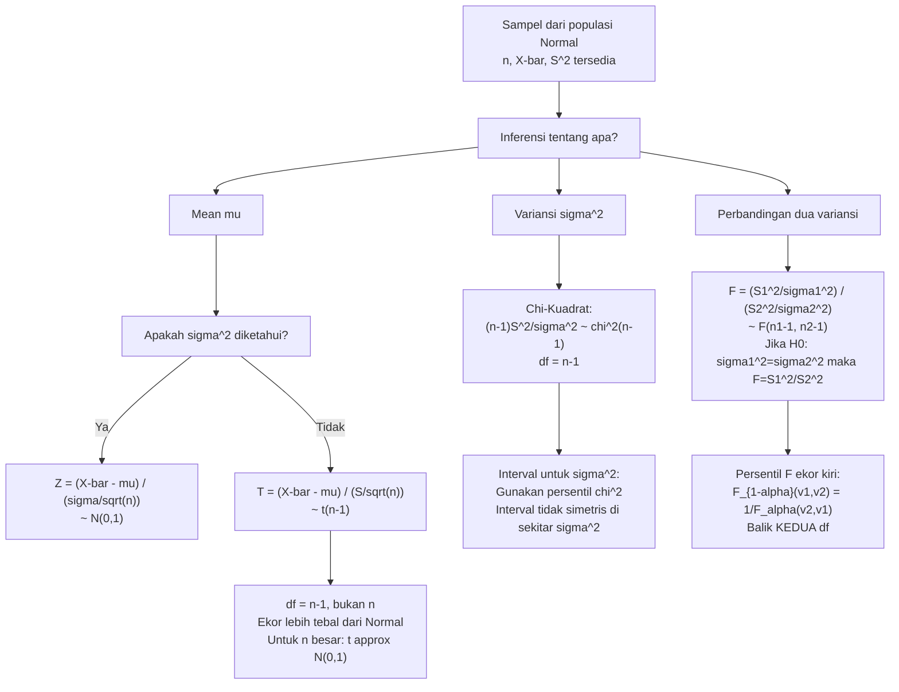

# 📊 4.2 — Distribusi Sampel

> [!ABSTRACT] Ringkasan Cepat
> **Topik:** Distribusi Sampel — Chi-Kuadrat, $t$, dan $F$ dari Sampel Normal | **Bobot:** ~20–30% | **Difficulty:** Hard
> **Ref:** Hogg-Tanis-Zimm (2015) Bab 5.3–5.5; Hogg-McKean-Craig (2019) Bab 3.3–3.6; Miller et al. (2014) Bab 8.3–8.5; Walpole et al. (2012) Bab 8.2–8.5 | **Prereq:** [[2.6 Distribusi Kontinu Umum]], [[2.4 Transformasi Variabel Acak Univariat]], [[4.1 Penarikan Sampel Acak]]

## Section 0 — Pemetaan Topik

| Topik CF2 | Sub-topik ID | Skill Diuji | Bobot | Difficulty | Prerequisite | Connected Topics | Referensi |
|-----------|--------------|-------------|-------|------------|--------------|------------------|-----------|
| Topik 4: Inferensi Statistik | 4.2 | Menurunkan dan menggunakan distribusi Chi-Kuadrat $\chi^2(\nu)$, distribusi-$t$ Student $t(\nu)$, dan distribusi-$F$ $F(\nu_1,\nu_2)$; menghubungkan distribusi-distribusi ini dengan sampel dari populasi Normal; menghitung probabilitas menggunakan sifat dan tabel distribusi sampel; membuktikan distribusi $(n-1)S^2/\sigma^2 \sim \chi^2(n-1)$; mengidentifikasi kebebasan $\bar{X}$ dari $S^2$ untuk populasi Normal; menggunakan relasi antar-distribusi ($t^2 \sim F$, $\chi^2$ sebagai Gamma khusus) | 20–30% | Hard | [[2.6 Distribusi Kontinu Umum]], [[2.4 Transformasi Variabel Acak Univariat]], [[4.1 Penarikan Sampel Acak]] | [[4.3 Teorema Limit Pusat (CLT)]], [[4.5 Estimasi Parameter]], [[4.7 Pengujian Hipotesis]], [[4.8 Interval Kepercayaan]] | Hogg-Tanis-Zimm (2015) Bab 5.3–5.5; Hogg-McKean-Craig (2019) Bab 3.3–3.6; Miller et al. (2014) Bab 8.3–8.5; Walpole et al. (2012) Bab 8.2–8.5 |

## Section 1 — Intuisi

Saat bekerja dengan sampel dari populasi Normal, tiga distribusi baru muncul secara alami dari statistik sampel yang paling fundamental — mean sampel $\bar{X}$, variansi sampel $S^2$, dan rasio keduanya. Distribusi-distribusi ini bukan sekadar kurva matematis abstrak: masing-masing adalah jawaban atas satu pertanyaan aktuaria yang konkret.

**Distribusi Chi-Kuadrat** $\chi^2(\nu)$ menjawab: *"Bagaimana distribusi jumlah kuadrat dari $\nu$ variabel Normal standar independen?"* Ia muncul secara alami dari $(n-1)S^2/\sigma^2$ — rasio yang mengukur seberapa jauh variansi sampel dari variansi populasi. Jika $\sigma^2$ diketahui, $\chi^2$ digunakan langsung; jika tidak, ia adalah fondasi untuk interval kepercayaan variansi dan uji kecocokan distribusi.

**Distribusi-$t$ Student** $t(\nu)$ menjawab: *"Bagaimana mendistribusikan $\bar{X}$ jika $\sigma^2$ tidak diketahui dan harus diestimasi dari data?"* Dalam praktik, $\sigma^2$ populasi hampir tidak pernah diketahui — kita hanya punya $S^2$. Maka daripada $Z = (\bar{X}-\mu)/(\sigma/\sqrt{n})$ (yang memerlukan $\sigma$ diketahui), kita gunakan $T = (\bar{X}-\mu)/(S/\sqrt{n})$. Distribusi ini memiliki ekor lebih tebal dari Normal standar, mencerminkan ketidakpastian tambahan karena estimasi $\sigma^2$.

**Distribusi-$F$** $F(\nu_1,\nu_2)$ menjawab: *"Bagaimana membandingkan variansi dari dua populasi Normal yang berbeda?"* Ia adalah rasio dua Chi-Kuadrat independen yang dibagi derajat kebebasannya masing-masing — alat statistik untuk uji homogenitas variansi antara dua kelompok, misalnya membandingkan risiko dua portofolio asuransi.

Ketiga distribusi ini saling terhubung erat: $t^2(\nu) = F(1,\nu)$; $\chi^2(\nu) = \Gamma(\nu/2, 2)$; $F(\nu_1,\nu_2)$ diturunkan dari dua $\chi^2$ independen. Memahami jaring hubungan ini memungkinkan penyelesaian soal dari berbagai arah — dan kerap menjadi shortcut paling efisien di ujian.

## Section 2 — Definisi Formal

> [!NOTE] Definisi Matematis
>
> Misalkan $Z, Z_1, Z_2, \ldots$ adalah variabel acak $N(0,1)$ independen, dan $X_1,\ldots,X_n \overset{\text{i.i.d.}}{\sim} N(\mu,\sigma^2)$.
>
> **Distribusi Chi-Kuadrat:**
> $$\chi^2(\nu) = \sum_{i=1}^{\nu} Z_i^2, \quad Z_i \overset{\text{i.i.d.}}{\sim} N(0,1)$$
>
> **Distribusi-$t$ Student:**
> $$T = \frac{Z}{\sqrt{V/\nu}} \quad \text{di mana } Z \sim N(0,1),\; V \sim \chi^2(\nu),\; Z \perp V$$
>
> **Distribusi-$F$:**
> $$F = \frac{U/\nu_1}{V/\nu_2} \quad \text{di mana } U \sim \chi^2(\nu_1),\; V \sim \chi^2(\nu_2),\; U \perp V$$
>
> **Teorema Sampel Normal (Fisher's Theorem):**
> Untuk $X_1,\ldots,X_n \overset{\text{i.i.d.}}{\sim} N(\mu,\sigma^2)$:
> $$\bar{X} \sim N\!\left(\mu, \frac{\sigma^2}{n}\right), \qquad \frac{(n-1)S^2}{\sigma^2} \sim \chi^2(n-1), \qquad \bar{X} \perp S^2$$

### Variabel & Parameter

| Simbol | Makna | Catatan |
|--------|-------|---------|
| $\nu$ | Derajat kebebasan (*degrees of freedom*) distribusi $\chi^2$ dan $t$ | Parameter positif; untuk sampel: $\nu = n-1$ |
| $\nu_1, \nu_2$ | Derajat kebebasan numerator dan denominator distribusi $F$ | Keduanya positif; urutan penting: $F(\nu_1,\nu_2) \neq F(\nu_2,\nu_1)$ |
| $\chi^2_\alpha(\nu)$ | Persentil ke-$(1-\alpha)$ dari $\chi^2(\nu)$ | $P(\chi^2(\nu) > \chi^2_\alpha(\nu)) = \alpha$ |
| $t_\alpha(\nu)$ | Persentil ke-$(1-\alpha)$ dari $t(\nu)$ | $P(t(\nu) > t_\alpha(\nu)) = \alpha$; simetris: $t_{1-\alpha}(\nu) = -t_\alpha(\nu)$ |
| $F_\alpha(\nu_1,\nu_2)$ | Persentil ke-$(1-\alpha)$ dari $F(\nu_1,\nu_2)$ | $P(F > F_\alpha(\nu_1,\nu_2)) = \alpha$ |
| $S^2$ | Variansi sampel | $\frac{1}{n-1}\sum(X_i-\bar{X})^2$; estimator tak-bias $\sigma^2$ |
| $S_p^2$ | Variansi pooled (dua sampel) | $S_p^2 = \frac{(n_1-1)S_1^2+(n_2-1)S_2^2}{n_1+n_2-2}$ |

### Rumus Utama — Chi-Kuadrat $\chi^2(\nu)$

$$
\chi^2(\nu) = \sum_{i=1}^{\nu} Z_i^2, \quad Z_i \overset{\text{i.i.d.}}{\sim} N(0,1)
$$
**Label: Definisi via Normal Standar** — penjumlahan $\nu$ kuadrat Normal standar independen.

$$
f(x;\nu) = \frac{1}{2^{\nu/2}\,\Gamma(\nu/2)}\, x^{\nu/2-1}\, e^{-x/2}, \quad x > 0
$$
**Label: PDF Chi-Kuadrat** — ini adalah Gamma$(\alpha = \nu/2,\; \beta = 2)$ dalam parametrisasi skala; berlaku $\chi^2(\nu) = \Gamma(\nu/2, 2)$.

$$
E[\chi^2(\nu)] = \nu, \qquad \text{Var}(\chi^2(\nu)) = 2\nu
$$
**Label: Mean dan Variansi Chi-Kuadrat** — mean = derajat kebebasan; variansi = dua kali derajat kebebasan.

$$
M_{\chi^2(\nu)}(t) = (1-2t)^{-\nu/2}, \quad t < \frac{1}{2}
$$
**Label: MGF Chi-Kuadrat** — bentuk Gamma$(\ nu/2, \beta=2)$; sifat aditif: $\chi^2(\nu_1) + \chi^2(\nu_2) \sim \chi^2(\nu_1+\nu_2)$ untuk variabel independen.

$$
\frac{(n-1)S^2}{\sigma^2} \sim \chi^2(n-1)
$$
**Label: Distribusi Variansi Sampel** — hasil kunci dari Fisher's Theorem; derajat kebebasan $n-1$, bukan $n$, karena satu derajat kebebasan "digunakan" untuk mengestimasi $\mu$ dengan $\bar{X}$.

### Rumus Utama — Distribusi-$t$ Student $t(\nu)$

$$
T = \frac{Z}{\sqrt{V/\nu}}, \quad Z \sim N(0,1),\; V \sim \chi^2(\nu),\; Z \perp V
$$
**Label: Definisi Distribusi-$t$** — rasio Normal standar dengan akar Chi-Kuadrat yang dinormalisasi.

$$
f(t;\nu) = \frac{\Gamma\!\left(\frac{\nu+1}{2}\right)}{\sqrt{\nu\pi}\;\Gamma\!\left(\frac{\nu}{2}\right)} \left(1+\frac{t^2}{\nu}\right)^{-(\nu+1)/2}, \quad t \in \mathbb{R}
$$
**Label: PDF Distribusi-$t$** — simetris di nol; ekor lebih tebal dari Normal standar; mendekati $N(0,1)$ saat $\nu \to \infty$.

$$
E[T] = 0\; (\nu > 1), \qquad \text{Var}(T) = \frac{\nu}{\nu-2}\; (\nu > 2)
$$
**Label: Mean dan Variansi Distribusi-$t$** — mean nol (simetris); variansi $> 1$ (ekor lebih tebal dari Normal); untuk $\nu \leq 2$ variansi tidak terdefinisi.

$$
T = \frac{\bar{X} - \mu}{S/\sqrt{n}} \sim t(n-1)
$$
**Label: Statistik-$t$ Sampel** — digunakan saat $\sigma^2$ tidak diketahui; penyebut menggunakan $S$ (standar deviasi sampel), bukan $\sigma$ (standar deviasi populasi).

### Rumus Utama — Distribusi-$F$ $F(\nu_1,\nu_2)$

$$
F = \frac{U/\nu_1}{V/\nu_2}, \quad U \sim \chi^2(\nu_1),\; V \sim \chi^2(\nu_2),\; U \perp V
$$
**Label: Definisi Distribusi-$F$** — rasio dua Chi-Kuadrat independen yang masing-masing dibagi derajat kebebasannya.

$$
E[F] = \frac{\nu_2}{\nu_2 - 2}\; (\nu_2 > 2), \qquad \text{Var}(F) = \frac{2\nu_2^2(\nu_1+\nu_2-2)}{\nu_1(\nu_2-2)^2(\nu_2-4)}\; (\nu_2 > 4)
$$
**Label: Mean dan Variansi Distribusi-$F$** — mean bergantung hanya pada $\nu_2$ (derajat kebebasan denominator).

$$
\frac{S_1^2/\sigma_1^2}{S_2^2/\sigma_2^2} \sim F(n_1-1,\; n_2-1)
$$
**Label: Statistik-$F$ Dua Sampel** — digunakan untuk membandingkan variansi dua populasi Normal independen.

### Relasi Antar-Distribusi

$$
\chi^2(\nu) = \Gamma\!\left(\frac{\nu}{2},\; \beta=2\right)
$$
$$
t^2(\nu) \sim F(1, \nu)
$$
$$
F(\nu_1,\nu_2) = \frac{1}{F(\nu_2,\nu_1)} \quad \text{(invers distribusi)}
$$
$$
F_{1-\alpha}(\nu_1,\nu_2) = \frac{1}{F_\alpha(\nu_2,\nu_1)}
$$
$$
t(\nu) \xrightarrow{\nu \to \infty} N(0,1), \qquad \chi^2(\nu)/\nu \xrightarrow{\nu \to \infty} 1
$$

### Asumsi Eksplisit

- **Chi-Kuadrat:** Setiap $Z_i$ harus $N(0,1)$ dan **independen**. Sifat aditif mensyaratkan independensi.
- **Distribusi-$t$:** $Z$ dan $V$ harus **independen**. Ini terpenuhi secara otomatis untuk statistik $T = (\bar{X}-\mu)/(S/\sqrt{n})$ dari sampel Normal karena Fisher's Theorem menjamin $\bar{X} \perp S^2$.
- **Distribusi-$F$:** $U$ dan $V$ harus **independen**. Untuk uji dua sampel, dua sampel harus independen satu sama lain.
- **Populasi Normal:** Distribusi $\chi^2$, $t$, dan $F$ berlaku **eksak** hanya untuk sampel dari populasi Normal. Untuk populasi non-Normal, distribusi ini hanya pendekatan (valid untuk $n$ besar via CLT untuk distribusi $t$).
- **Fisher's Theorem:** Kebebasan $\bar{X}$ dan $S^2$ adalah properti **eksklusif** distribusi Normal — untuk distribusi lain, $\bar{X}$ dan $S^2$ umumnya berkorelasi.

## Section 3 — Jembatan Logika

> [!TIP] Dari Definisi ke Rumus
> **Mengapa $(n-1)S^2/\sigma^2 \sim \chi^2(n-1)$ bukan $\chi^2(n)$?**
>
> Kita mulai dari identitas:
> $$\sum_{i=1}^n \left(\frac{X_i - \mu}{\sigma}\right)^2 = \frac{(n-1)S^2}{\sigma^2} + \left(\frac{\bar{X}-\mu}{\sigma/\sqrt{n}}\right)^2$$
>
> Ruas kiri adalah jumlah $n$ kuadrat Normal standar independen → $\chi^2(n)$.
>
> Suku kedua ruas kanan: $\left(\frac{\bar{X}-\mu}{\sigma/\sqrt{n}}\right)^2 \sim \chi^2(1)$ karena $\bar{X} \sim N(\mu,\sigma^2/n)$.
>
> Dari Fisher's Theorem, $\bar{X}$ dan $S^2$ independen, sehingga dua suku di ruas kanan independen. Maka berdasarkan sifat aditif $\chi^2$ (terbalik):
> $$\chi^2(n) = \chi^2_{\text{kiri}} + \chi^2(1) \implies \chi^2_{\text{kiri}} = \frac{(n-1)S^2}{\sigma^2} \sim \chi^2(n-1)$$
>
> Kehilangan satu derajat kebebasan (dari $n$ ke $n-1$) mencerminkan bahwa mengestimasi $\mu$ dengan $\bar{X}$ mengimposes satu kendala linear pada deviasi $X_i - \bar{X}$: $\sum(X_i - \bar{X}) = 0$ selalu.

> [!IMPORTANT] Tabel Perbandingan Tiga Distribusi Sampel
>
> | Properti | $\chi^2(\nu)$ | $t(\nu)$ | $F(\nu_1,\nu_2)$ |
> |----------|--------------|----------|-----------------|
> | **Support** | $(0,\infty)$ | $(-\infty,\infty)$ | $(0,\infty)$ |
> | **Simetri** | Tidak simetris (right-skewed) | Simetris di nol | Tidak simetris |
> | **Mean** | $\nu$ | $0$ ($\nu>1$) | $\nu_2/(\nu_2-2)$ ($\nu_2>2$) |
> | **Variansi** | $2\nu$ | $\nu/(\nu-2)$ ($\nu>2$) | Kompleks ($\nu_2>4$) |
> | **Limit Normal** | $\chi^2(\nu)/\nu \to 1$ | $t(\nu) \to N(0,1)$ | $F(1,\nu) \to \chi^2(1)$ |
> | **Konteks sampel** | $(n-1)S^2/\sigma^2$ | $(\bar{X}-\mu)/(S/\sqrt{n})$ | $S_1^2/S_2^2$ (jika $\sigma_1^2=\sigma_2^2$) |
> | **df sampel** | $n-1$ | $n-1$ | $n_1-1$, $n_2-1$ |

**Derivasi Distribusi-$t$ dari Komponen:**

$$
T = \frac{\bar{X}-\mu}{S/\sqrt{n}}
$$

Tulis ulang dalam bentuk standar. Bagi pembilang dan penyebut dengan $\sigma/\sqrt{n}$:

$$
T = \frac{(\bar{X}-\mu)/(\sigma/\sqrt{n})}{\sqrt{S^2/\sigma^2}} = \frac{Z}{\sqrt{V/(n-1)}}
$$

di mana $Z = (\bar{X}-\mu)/(\sigma/\sqrt{n}) \sim N(0,1)$ dan $V = (n-1)S^2/\sigma^2 \sim \chi^2(n-1)$.

Karena $Z \perp V$ (Fisher's Theorem), ini tepat memenuhi definisi $t(n-1)$:
$$
T = \frac{Z}{\sqrt{V/(n-1)}} \sim t(n-1)
$$

**Derivasi Distribusi-$F$ untuk Dua Sampel:**

Untuk $X_1^{(1)},\ldots,X_{n_1}^{(1)} \overset{\text{i.i.d.}}{\sim} N(\mu_1,\sigma_1^2)$ dan $X_1^{(2)},\ldots,X_{n_2}^{(2)} \overset{\text{i.i.d.}}{\sim} N(\mu_2,\sigma_2^2)$ independen:

$$
U = \frac{(n_1-1)S_1^2}{\sigma_1^2} \sim \chi^2(n_1-1), \quad V = \frac{(n_2-1)S_2^2}{\sigma_2^2} \sim \chi^2(n_2-1), \quad U \perp V
$$

$$
F = \frac{U/(n_1-1)}{V/(n_2-1)} = \frac{S_1^2/\sigma_1^2}{S_2^2/\sigma_2^2} \sim F(n_1-1,\, n_2-1)
$$

Jika $H_0: \sigma_1^2 = \sigma_2^2$ maka $F = S_1^2/S_2^2 \sim F(n_1-1, n_2-1)$ di bawah $H_0$.

**Relasi Persentil $F$ dan Invers:**

$$
F_{1-\alpha}(\nu_1,\nu_2) = \frac{1}{F_\alpha(\nu_2,\nu_1)}
$$

Ini berguna ketika tabel hanya menyediakan nilai $\alpha$ kecil (ekor kanan) dan kita membutuhkan persentil ekor kiri. Contoh: $F_{0{,}95}(5,10) = 1/F_{0{,}05}(10,5)$.

> [!DANGER] Dilarang
> 1. **Dilarang** menggunakan distribusi-$t$ tanpa asumsi populasi Normal (atau $n$ besar). Statistik $T = (\bar{X}-\mu)/(S/\sqrt{n})$ hanya mengikuti distribusi $t(n-1)$ **eksak** untuk populasi Normal. Untuk populasi non-Normal dengan $n$ kecil, distribusinya bukan $t$ — gunakan metode non-parametrik atau bootstrap.
> 2. **Dilarang** mencampur derajat kebebasan. Untuk $\chi^2$: df $= n-1$ (bukan $n$). Untuk $t$: df $= n-1$ (bukan $n$). Untuk $F$ dua sampel: df numerator $= n_1-1$, df denominator $= n_2-1$ — urutan momennen dan denominator harus konsisten dengan statistik yang dihitung.
> 3. **Dilarang** mengasumsikan $\bar{X}$ dan $S^2$ independen untuk populasi non-Normal. Kebebasan $\bar{X} \perp S^2$ adalah properti eksklusif distribusi Normal. Untuk distribusi lain (Eksponensial, Gamma, dll.), $\bar{X}$ dan $S^2$ berkorelasi.

## Section 4 — Contoh Soal

### Soal A — Fundamental

Dari sampel acak $X_1,\ldots,X_{16}$ dari $N(\mu=50,\;\sigma^2=25)$, definisikan $\bar{X}$ dan $S^2$ sebagai mean dan variansi sampel.

(a) Nyatakan distribusi $\bar{X}$ secara eksak.
(b) Hitung $P(48 \leq \bar{X} \leq 52{,}5)$.
(c) Nyatakan distribusi $\frac{15S^2}{25}$ dan hitung $E\!\left[\frac{15S^2}{25}\right]$ serta $\text{Var}\!\left(\frac{15S^2}{25}\right)$.
(d) Hitung $P(S^2 \leq 40)$, yaitu probabilitas bahwa variansi sampel tidak melampaui 40.
(e) Nyatakan distribusi statistik $T = \dfrac{\bar{X}-50}{S/4}$ dan jelaskan mengapa dapat menggunakan distribusi ini.

> [!SUCCESS] Solusi Soal A
>
> **1. Identifikasi Variabel**
> - $X_i \overset{\text{i.i.d.}}{\sim} N(\mu=50,\, \sigma^2=25)$, sehingga $\sigma=5$
> - $n = 16$; df $= n-1 = 15$
> - $\bar{X}$ = mean sampel; $S^2$ = variansi sampel
>
> **2. Identifikasi Distribusi / Model**
> Populasi Normal eksak → distribusi $\bar{X}$ Normal eksak; $(n-1)S^2/\sigma^2 \sim \chi^2(n-1)$; $T = (\bar{X}-\mu)/(S/\sqrt{n}) \sim t(n-1)$.
>
> **3. Setup Persamaan**
>
> Fisher's Theorem: $\bar{X} \sim N(\mu, \sigma^2/n)$ dan $(n-1)S^2/\sigma^2 \sim \chi^2(n-1)$, $\bar{X} \perp S^2$.
>
> **4. Eksekusi Aljabar**
>
> **(a) Distribusi $\bar{X}$:**
> $$\bar{X} \sim N\!\left(50,\; \frac{25}{16}\right) = N\!\left(50,\; 1{,}5625\right)$$
> Standar error: $\text{SE}(\bar{X}) = \sigma/\sqrt{n} = 5/4 = 1{,}25$.
>
> **(b) $P(48 \leq \bar{X} \leq 52{,}5)$:**
>
> Standarisasi dengan $\text{SE} = 1{,}25$:
> $$z_1 = \frac{48 - 50}{1{,}25} = \frac{-2}{1{,}25} = -1{,}60, \qquad z_2 = \frac{52{,}5 - 50}{1{,}25} = \frac{2{,}5}{1{,}25} = 2{,}00$$
>
> $$P(48 \leq \bar{X} \leq 52{,}5) = \Phi(2{,}00) - \Phi(-1{,}60)$$
> $$= \Phi(2{,}00) - [1-\Phi(1{,}60)] = 0{,}9772 - (1 - 0{,}9452) = 0{,}9772 - 0{,}0548 = 0{,}9224$$
>
> **(c) Distribusi, Mean, dan Variansi dari $\frac{15S^2}{25}$:**
>
> Dari Fisher's Theorem dengan $n=16$, $\sigma^2=25$:
> $$\frac{(n-1)S^2}{\sigma^2} = \frac{15\,S^2}{25} \sim \chi^2(15)$$
>
> Menggunakan properti $\chi^2(\nu)$:
> $$E\!\left[\frac{15S^2}{25}\right] = \nu = 15$$
> $$\text{Var}\!\left(\frac{15S^2}{25}\right) = 2\nu = 30$$
>
> **(d) $P(S^2 \leq 40)$:**
>
> Konversikan ke $\chi^2$:
> $$P(S^2 \leq 40) = P\!\left(\frac{15S^2}{25} \leq \frac{15 \times 40}{25}\right) = P(\chi^2(15) \leq 24)$$
>
> Dari tabel $\chi^2$: $P(\chi^2(15) \leq 24{,}996) \approx 0{,}95$, sehingga $P(\chi^2(15) \leq 24) \approx 0{,}945$.
>
> (Nilai eksak: persentil ke-94,5 distribusi $\chi^2(15)$ adalah sekitar 24.)
>
> **(e) Distribusi $T = (\bar{X}-50)/(S/4)$:**
>
> Tulis ulang: $T = \dfrac{\bar{X}-50}{S/\sqrt{16}} = \dfrac{\bar{X}-\mu}{S/\sqrt{n}}$
>
> Dari Fisher's Theorem:
> - Pembilang standarisasi: $Z = (\bar{X}-50)/(5/4) \sim N(0,1)$
> - $(n-1)S^2/\sigma^2 = 15S^2/25 \sim \chi^2(15)$, dan $\bar{X} \perp S^2$
>
> Maka $T = Z/\sqrt{(15S^2/25)/15} = Z/\sqrt{S^2/25} = Z/(S/5)$ — dan:
>
> $$T = \frac{\bar{X}-50}{S/4} \sim t(15)$$
>
> **Justifikasi:** Distribusi $t(n-1)$ berlaku karena: (1) populasi Normal sehingga $\bar{X}$ Normal, (2) $(n-1)S^2/\sigma^2 \sim \chi^2(n-1)$, dan (3) $\bar{X} \perp S^2$ (Fisher's Theorem untuk populasi Normal).
>
> **5. Verification**
> - $\text{SE}(\bar{X}) = 5/4 = 1{,}25$: lebih kecil dari $\sigma=5$ karena rata-rata 16 pengamatan lebih stabil ✓
> - $E[15S^2/25] = 15 = \nu$: konsisten dengan properti $\chi^2(\nu)$ ✓
> - $P(S^2 \leq 40) \approx 0{,}945$: dengan $E[S^2] = \sigma^2 = 25$ dan nilai 40 cukup di atas mean, probabilitas kumulatif mendekati 1 masuk akal ✓
> - Derajat kebebasan $t$: $n-1 = 15$, bukan $n = 16$ ✓

> [!WARNING] Exam Tips — Soal A
> **Target waktu:** 10–12 menit
> **Common trap 1:** Standar error $\bar{X}$ adalah $\sigma/\sqrt{n} = 5/4 = 1{,}25$ — bukan $\sigma = 5$. Standarisasi harus menggunakan $\text{SE}$, bukan $\sigma$.
> **Common trap 2:** Untuk konversi ke $\chi^2$ di bagian (d): $P(S^2 \leq 40) = P(\chi^2(15) \leq 15\times40/25) = P(\chi^2(15) \leq 24)$ — kalikan dengan $(n-1)/\sigma^2$, bukan hanya dibagi $\sigma^2$.
> **Common trap 3:** Derajat kebebasan $t$ dan $\chi^2$ adalah $n-1 = 15$, bukan $n = 16$. Satu derajat kebebasan "hilang" karena mengestimasi $\mu$ dengan $\bar{X}$.

---

### Soal B — Exam-Typical

Seorang aktuaris mengambil sampel $n = 10$ polis asuransi dan memperoleh $\bar{x} = 42$ juta rupiah dan $s = 8$ juta rupiah. Diasumsikan nilai klaim mengikuti distribusi Normal dengan mean $\mu$ yang tidak diketahui.

(a) Bangun statistik $T$ yang berdistribusi $t(9)$ menggunakan $\bar{X}$, $S$, $\mu$, dan $n$.
(b) Hitung $P\!\left(T \leq 1{,}833\right)$ di mana $T \sim t(9)$ (nilai tabel).
(c) Hitung $P\!\left(|\bar{X} - \mu| \leq 4{,}634\right)$ menggunakan distribusi $t(9)$ dan $s=8$.
(d) Misalkan aktuaris kedua mengambil sampel independen $n_2 = 8$ polis dari populasi yang **sama** dan memperoleh $s_2 = 6$. Bangun statistik $F$ yang membandingkan kedua variansi sampel dan tentukan distribusinya.
(e) Gunakan relasi $F_{1-\alpha}(\nu_1,\nu_2) = 1/F_\alpha(\nu_2,\nu_1)$ untuk mencari $F_{0{,}95}(9,7)$ jika diketahui $F_{0{,}05}(7,9) = 3{,}29$.

> [!SUCCESS] Solusi Soal B
>
> **1. Identifikasi Variabel**
> - Sampel 1: $n_1=10$, $\bar{x}=42$, $s_1=8$; $\sigma^2$ tidak diketahui
> - Sampel 2: $n_2=8$, $s_2=6$; dari populasi **sama** (diasumsikan $\sigma_1^2 = \sigma_2^2$)
> - Populasi Normal
>
> **2. Identifikasi Distribusi / Model**
> Karena $\sigma^2$ tidak diketahui: gunakan distribusi $t$. Perbandingan variansi: distribusi $F$.
>
> **3. Setup Persamaan**
>
> Statistik-$t$: $T = (\bar{X}-\mu)/(S/\sqrt{n})$
>
> Statistik-$F$: $F = S_1^2/S_2^2$ (jika $\sigma_1^2 = \sigma_2^2$)
>
> **4. Eksekusi Aljabar**
>
> **(a) Statistik $T \sim t(9)$:**
> $$T = \frac{\bar{X} - \mu}{S/\sqrt{n}} = \frac{\bar{X} - \mu}{S/\sqrt{10}} \sim t(9)$$
>
> Derajat kebebasan: $n - 1 = 10 - 1 = 9$.
>
> **(b) $P(T \leq 1{,}833)$ untuk $T \sim t(9)$:**
>
> Dari tabel distribusi-$t$: $t_{0{,}05}(9) = 1{,}833$ berarti $P(T > 1{,}833) = 0{,}05$.
>
> $$P(T \leq 1{,}833) = 1 - 0{,}05 = 0{,}95$$
>
> Interpretasi: nilai 1,833 adalah persentil ke-95 dari $t(9)$.
>
> **(c) $P(|\bar{X}-\mu| \leq 4{,}634)$:**
>
> Konversikan ke statistik $T$ menggunakan $s = 8$ dan $n = 10$:
> $$P(|\bar{X}-\mu| \leq 4{,}634) = P\!\left(\left|\frac{\bar{X}-\mu}{8/\sqrt{10}}\right| \leq \frac{4{,}634}{8/\sqrt{10}}\right)$$
>
> Hitung penyebut: $8/\sqrt{10} = 8/3{,}162 = 2{,}530$.
>
> $$\frac{4{,}634}{2{,}530} = 1{,}831 \approx 1{,}833$$
>
> $$P(|\bar{X}-\mu| \leq 4{,}634) = P(|T| \leq 1{,}833) = P(-1{,}833 \leq T \leq 1{,}833)$$
> $$= 2\Phi_{t(9)}(1{,}833) - 1 = 2(0{,}95) - 1 = 0{,}90$$
>
> (menggunakan simetri $t$ di nol dan hasil bagian (b))
>
> **(d) Statistik $F$ dan distribusinya:**
>
> Karena diasumsikan $\sigma_1^2 = \sigma_2^2$ (populasi sama):
> $$F = \frac{S_1^2}{S_2^2} = \frac{8^2}{6^2} = \frac{64}{36} = \frac{16}{9} \approx 1{,}778$$
>
> Distribusi: $F \sim F(n_1-1,\, n_2-1) = F(9,\, 7)$.
>
> Catatan: nilai $f_{\text{obs}} = 1{,}778$ adalah realisasi terobservasi dari statistik $F$.
>
> **(e) $F_{0{,}95}(9,7)$ dari relasi invers:**
>
> Gunakan: $F_{1-\alpha}(\nu_1,\nu_2) = 1/F_\alpha(\nu_2,\nu_1)$ dengan $\alpha=0{,}05$, $\nu_1=9$, $\nu_2=7$:
> $$F_{0{,}95}(9,7) = F_{1-0{,}05}(9,7) = \frac{1}{F_{0{,}05}(7,9)} = \frac{1}{3{,}29} \approx 0{,}304$$
>
> Interpretasi: $P(F(9,7) \leq 0{,}304) = 0{,}05$ — nilai ini adalah persentil ke-5 dari $F(9,7)$.
>
> **5. Verification**
> - $P(T \leq 1{,}833) = 0{,}95$: konsisten dengan notasi $t_{0{,}05}(9) = 1{,}833$ artinya $P(T > 1{,}833) = 0{,}05$ ✓
> - $P(|T| \leq 1{,}833) = 0{,}90$: interval dua sisi di tingkat 90% menggunakan persentil 95% dari masing-masing ekor ✓
> - $F_{0{,}95}(9,7) = 0{,}304 < 1$: persentil ke-5 dari distribusi $F$ yang right-skewed memang $< 1$ (mean $F(9,7) = 7/5 = 1{,}4 > 1$, persentil kecil harusnya $< 1$) ✓
> - Derajat kebebasan $F(9,7)$: numerator $= n_1-1=9$, denominator $= n_2-1=7$ ✓

> [!WARNING] Exam Tips — Soal B
> **Target waktu:** 12–14 menit
> **Common trap 1:** Relasi invers $F$: $F_{0{,}95}(9,7) = 1/F_{0{,}05}(7,9)$ — **urutan df terbalik** di sisi kanan. Banyak kandidat salah menulis $1/F_{0{,}05}(9,7)$ (urutan tidak terbalik).
> **Common trap 2:** Untuk bagian (c), pastikan membagi $4{,}634$ dengan standar error $s/\sqrt{n}$, bukan dengan $s$ saja.
> **Common trap 3:** Distribusi $F(9,7)$ untuk $S_1^2/S_2^2$ hanya valid di bawah $H_0: \sigma_1^2 = \sigma_2^2$. Jika $\sigma_1^2 \neq \sigma_2^2$, statistiknya adalah $F = (S_1^2/\sigma_1^2)/(S_2^2/\sigma_2^2)$.

---

### Soal C — Challenging

Misalkan $X_1,\ldots,X_n \overset{\text{i.i.d.}}{\sim} N(\mu,\sigma^2)$. Definisikan $\bar{X}$, $S^2$, dan $S_n^2 = \frac{1}{n}\sum_{i=1}^n(X_i-\bar{X})^2$ (variansi sampel dengan penyebut $n$, bukan $n-1$).

(a) Tunjukkan bahwa $\displaystyle\sum_{i=1}^n\!\left(\frac{X_i-\mu}{\sigma}\right)^2 = \frac{(n-1)S^2}{\sigma^2} + \left(\frac{\bar{X}-\mu}{\sigma/\sqrt{n}}\right)^2$ dan identifikasi distribusi masing-masing suku di ruas kanan.

(b) Gunakan dekomposisi pada (a) dan kebebasan $\bar{X}$ dari $S^2$ untuk membuktikan bahwa $\dfrac{(n-1)S^2}{\sigma^2} \sim \chi^2(n-1)$.

(c) Tunjukkan bahwa $E[S_n^2] = \frac{n-1}{n}\sigma^2$ (bias ke bawah) dan $E[S^2] = \sigma^2$ (tak-bias).

(d) Misalkan $Y = c\,S^2/\sigma^2$ berdistribusi $\chi^2(\nu)$. Tentukan nilai $c$ dan $\nu$ dari $n$ dan definisikan derajat kebebasan.

(e) Untuk $n=25$ dan $\sigma^2=9$ (diketahui), tentukan interval $[a,b]$ simetris sehingga $P(a \leq S^2 \leq b) = 0{,}90$ menggunakan persentil $\chi^2(24)$: $\chi^2_{0{,}05}(24) = 36{,}415$ dan $\chi^2_{0{,}95}(24) = 13{,}848$.

> [!SUCCESS] Solusi Soal C
>
> **1. Identifikasi Variabel**
> - $X_i \overset{\text{i.i.d.}}{\sim} N(\mu,\sigma^2)$; $n$ umum
> - $S^2 = \frac{1}{n-1}\sum(X_i-\bar{X})^2$ (tak-bias); $S_n^2 = \frac{1}{n}\sum(X_i-\bar{X})^2$ (MLE, bias)
>
> **2. Identifikasi Distribusi / Model**
> Bukti formal Fisher's Theorem via dekomposisi jumlah kuadrat. Hubungan $\chi^2$, $\Gamma$, dan variansi sampel.
>
> **3. Setup Persamaan**
>
> Identitas aljabar kunci:
> $$\sum(X_i-\mu)^2 = \sum(X_i-\bar{X})^2 + n(\bar{X}-\mu)^2$$
>
> **4. Eksekusi Aljabar**
>
> **(a) Dekomposisi jumlah kuadrat:**
>
> Mulai dari identitas $(X_i - \mu) = (X_i - \bar{X}) + (\bar{X} - \mu)$:
>
> $$\sum_{i=1}^n(X_i-\mu)^2 = \sum_{i=1}^n(X_i-\bar{X})^2 + 2(\bar{X}-\mu)\underbrace{\sum_{i=1}^n(X_i-\bar{X})}_{=\,0} + n(\bar{X}-\mu)^2$$
>
> Suku silang hilang karena $\sum(X_i-\bar{X}) = 0$ selalu. Bagi dengan $\sigma^2$:
> $$\sum_{i=1}^n\!\left(\frac{X_i-\mu}{\sigma}\right)^2 = \underbrace{\frac{\sum(X_i-\bar{X})^2}{\sigma^2}}_{=\,(n-1)S^2/\sigma^2} + \underbrace{\left(\frac{\bar{X}-\mu}{\sigma/\sqrt{n}}\right)^2}_{}$$
>
> Identifikasi distribusi masing-masing:
> - Ruas kiri: $\sum Z_i^2$ di mana $Z_i = (X_i-\mu)/\sigma \overset{\text{i.i.d.}}{\sim} N(0,1)$ → $\chi^2(n)$
> - Suku kedua ruas kanan: $\left(\frac{\bar{X}-\mu}{\sigma/\sqrt{n}}\right)^2 = Z_{\bar{X}}^2$ di mana $Z_{\bar{X}} \sim N(0,1)$ → $\chi^2(1)$
> - Suku pertama ruas kanan: $(n-1)S^2/\sigma^2$ — akan ditentukan distribusinya di bagian (b)
>
> **(b) Bukti $\frac{(n-1)S^2}{\sigma^2} \sim \chi^2(n-1)$:**
>
> Dari dekomposisi di (a): $Q_n = Q_{n-1} + Q_1$ di mana:
> - $Q_n = \sum Z_i^2 \sim \chi^2(n)$
> - $Q_1 = Z_{\bar{X}}^2 \sim \chi^2(1)$
> - $Q_{n-1} = (n-1)S^2/\sigma^2$
>
> Fisher's Theorem (diterima sebagai fakta untuk populasi Normal) menyatakan $\bar{X} \perp S^2$, sehingga $Q_1 \perp Q_{n-1}$.
>
> Hitung MGF $Q_{n-1}$ menggunakan sifat aditif $\chi^2$ (terbalik): jika $Q_n = Q_{n-1} + Q_1$ dan keduanya independen:
> $$M_{Q_n}(t) = M_{Q_{n-1}}(t) \cdot M_{Q_1}(t)$$
> $$(1-2t)^{-n/2} = M_{Q_{n-1}}(t) \cdot (1-2t)^{-1/2}$$
> $$M_{Q_{n-1}}(t) = (1-2t)^{-n/2} / (1-2t)^{-1/2} = (1-2t)^{-(n-1)/2}$$
>
> Ini adalah MGF $\chi^2(n-1)$. Oleh *Uniqueness Theorem*:
> $$\frac{(n-1)S^2}{\sigma^2} \sim \chi^2(n-1) \quad \checkmark$$
>
> **(c) Bias $S_n^2$ dan tak-bias $S^2$:**
>
> Karena $(n-1)S^2/\sigma^2 \sim \chi^2(n-1)$ dengan $E[\chi^2(n-1)] = n-1$:
> $$E\!\left[\frac{(n-1)S^2}{\sigma^2}\right] = n-1 \implies E[S^2] = \sigma^2 \quad \text{(tak-bias) ✓}$$
>
> Hubungan $S_n^2$ dan $S^2$: $S_n^2 = \frac{n-1}{n} S^2$, sehingga:
> $$E[S_n^2] = \frac{n-1}{n} E[S^2] = \frac{n-1}{n}\,\sigma^2 < \sigma^2 \quad \text{(bias ke bawah) ✓}$$
>
> Bias: $E[S_n^2] - \sigma^2 = -\sigma^2/n$ (mendekati nol untuk $n$ besar).
>
> **(d) Nilai $c$ dan $\nu$:**
>
> Dari hasil (b): $\frac{(n-1)S^2}{\sigma^2} \sim \chi^2(n-1)$.
>
> Maka $Y = c\,S^2/\sigma^2 \sim \chi^2(\nu)$ mensyaratkan:
> $$c = n-1, \qquad \nu = n-1$$
>
> Derajat kebebasan $\nu = n-1$ mencerminkan bahwa dari $n$ deviasi $X_i-\bar{X}$, hanya $n-1$ yang bebas karena kendala $\sum(X_i-\bar{X}) = 0$.
>
> **(e) Interval $[a,b]$ untuk $P(a \leq S^2 \leq b) = 0{,}90$ dengan $n=25$, $\sigma^2=9$:**
>
> Konversikan ke $\chi^2(24)$ menggunakan $(n-1)S^2/\sigma^2 = 24S^2/9$:
> $$P(a \leq S^2 \leq b) = P\!\left(\frac{24a}{9} \leq \chi^2(24) \leq \frac{24b}{9}\right) = 0{,}90$$
>
> Pilih interval simetris dalam arti probabilitas ekor masing-masing $= 0{,}05$:
> $$P(\chi^2(24) \leq 24a/9) = 0{,}05 \implies \frac{24a}{9} = \chi^2_{0{,}95}(24) = 13{,}848$$
> $$a = \frac{13{,}848 \times 9}{24} = \frac{124{,}632}{24} = 5{,}193$$
>
> $$P(\chi^2(24) \leq 24b/9) = 0{,}95 \implies \frac{24b}{9} = \chi^2_{0{,}05}(24) = 36{,}415$$
> $$b = \frac{36{,}415 \times 9}{24} = \frac{327{,}735}{24} = 13{,}655$$
>
> $$\boxed{P(5{,}193 \leq S^2 \leq 13{,}655) = 0{,}90}$$
>
> **5. Verification**
> - Dekomposisi: $\chi^2(n) = \chi^2(n-1) + \chi^2(1)$: $n = (n-1) + 1$ ✓ (derajat kebebasan aditif)
> - $E[S^2] = \sigma^2 = 9$: interval $[5{,}193, 13{,}655]$ mencakup nilai $9$ di dalamnya ✓
> - Interval $S^2$ tidak simetris di sekitar $E[S^2]=9$: $9-5{,}193=3{,}807$ dan $13{,}655-9=4{,}655$ — distribusi $\chi^2$ right-skewed sehingga interval $S^2$ tidak simetris ✓
> - Rumus: batas bawah $= \chi^2_{\alpha/2, \text{bawah}} \cdot \sigma^2/(n-1)$; batas atas $= \chi^2_{\alpha/2, \text{atas}} \cdot \sigma^2/(n-1)$ ✓

> [!WARNING] Exam Tips — Soal C
> **Target waktu:** 18–22 menit
> **Common trap 1:** Persentil $\chi^2$ untuk interval dua sisi: $P(a \leq \chi^2 \leq b) = 0{,}90$ menggunakan persentil ke-5 ($\chi^2_{0{,}95}$) sebagai batas bawah dan persentil ke-95 ($\chi^2_{0{,}05}$) sebagai batas atas — notasi $\chi^2_\alpha$ berarti $P(\chi^2 > \chi^2_\alpha) = \alpha$. Banyak kandidat terbalik mana persentil atas dan bawah.
> **Common trap 2:** Untuk konversi $P(S^2 \leq b) \to P(\chi^2(24) \leq 24b/9)$ — kalikan $S^2$ dengan $(n-1)/\sigma^2 = 24/9$, bukan hanya $1/\sigma^2 = 1/9$.
> **Common trap 3:** Interval untuk $S^2$ tidak simetris di sekitar $\sigma^2$ karena distribusi $\chi^2$ right-skewed. Jangan menggunakan interval simetris $\sigma^2 \pm c$ — gunakan transformasi $\chi^2$ yang benar.

## Section 5 — Verifikasi & Sanity Check

> [!CHECK] Validasi Identifikasi Distribusi Sampel
> Sebelum menggunakan distribusi $\chi^2$, $t$, atau $F$:
> 1. Populasi harus **Normal** (atau aproksimasi untuk $n$ besar) ✓
> 2. Derajat kebebasan harus benar: $\chi^2$ dan $t$ menggunakan $n-1$; $F$ menggunakan $n_1-1$ dan $n_2-1$ ✓
> 3. Independensi yang diperlukan terpenuhi: $\bar{X} \perp S^2$ (Fisher's Theorem, hanya untuk Normal); dua sampel independen untuk $F$ ✓

> [!CHECK] Validasi Persentil dan Probabilitas
> 1. Notasi $\chi^2_\alpha(\nu)$: $P(\chi^2(\nu) > \chi^2_\alpha(\nu)) = \alpha$ — ini adalah ekor **kanan**; nilai lebih besar untuk $\alpha$ lebih kecil ✓
> 2. Notasi $t_\alpha(\nu)$: $P(t(\nu) > t_\alpha(\nu)) = \alpha$ — karena simetri: $t_{1-\alpha}(\nu) = -t_\alpha(\nu)$ ✓
> 3. Untuk interval dua sisi $P(|T| \leq c) = 1-\alpha$: gunakan $c = t_{\alpha/2}(\nu)$ ✓
> 4. Relasi invers $F$: $F_{1-\alpha}(\nu_1,\nu_2) = 1/F_\alpha(\nu_2,\nu_1)$ — **urutan df terbalik** ✓

> [!CHECK] Validasi Konversi Statistik
> Untuk menghitung probabilitas tentang $S^2$:
> 1. Konversikan: $P(S^2 \leq c) = P\!\left(\chi^2(n-1) \leq \frac{(n-1)c}{\sigma^2}\right)$ ✓
> 2. Untuk statistik $T = (\bar{X}-\mu)/(S/\sqrt{n})$: derajat kebebasan $= n-1$, penyebut menggunakan $S$ (bukan $\sigma$) ✓
> 3. Untuk statistik $F = S_1^2/S_2^2$ (jika $\sigma_1^2=\sigma_2^2$): df $= (n_1-1, n_2-1)$ ✓

### Metode Alternatif

**Menggunakan relasi $\chi^2 = \Gamma$ untuk menghitung probabilitas:** $\chi^2(\nu) = \Gamma(\nu/2, \beta=2)$, sehingga probabilitas $\chi^2$ dapat dihitung via tabel Gamma atau hubungan Gamma–Poisson untuk $\nu$ genap ($\nu/2 \in \mathbb{Z}^+$).

**Menggunakan $t^2 \sim F(1,\nu)$ untuk konversi:** $P(|T| > c) = P(T^2 > c^2) = P(F(1,\nu) > c^2)$ — berguna ketika tabel $F$ lebih lengkap dari tabel $t$.

**Simetri distribusi $t$ untuk probabilitas dua sisi:** $P(|T| \leq c) = 2P(T \leq c) - 1 = 2\Phi_t(c) - 1$ menggunakan simetri di nol.

## Section 6 — Visualisasi Mental

**Chi-Kuadrat — Histogram Ekor Kanan:**

PDF $\chi^2(\nu)$ adalah kurva yang mulai dari 0, naik ke modus di $\max(\nu-2, 0)$, lalu turun dengan ekor kanan panjang. Untuk $\nu=1$ atau $\nu=2$: modus di 0, menurun monoton. Untuk $\nu$ besar: mendekati Normal $N(\nu, 2\nu)$. Selalu non-negatif karena merupakan jumlah kuadrat. Semakin besar $\nu$, kurva semakin "datar" dan bergeser ke kanan.

**Distribusi-$t$ — Lonceng Lebih Gemuk:**

Bentuknya mirip Normal standar — lonceng simetris di nol — tetapi **ekor lebih tebal**. Untuk $\nu=1$ (Cauchy): ekor sangat tebal, tidak memiliki mean. Untuk $\nu=5$: sudah cukup mirip Normal. Untuk $\nu \geq 30$: hampir tidak bisa dibedakan dari $N(0,1)$. Implikasi: interval kepercayaan menggunakan $t$ lebih lebar dari menggunakan $z$ — mencerminkan ketidakpastian tambahan karena $\sigma^2$ tidak diketahui.

**Distribusi-$F$ — Asimetris Positif:**

Support $(0,\infty)$, right-skewed. Untuk $\nu_1,\nu_2$ besar: mendekati Normal. Perhatikan bahwa $F(\nu_1,\nu_2) = 1/F(\nu_2,\nu_1)$ — membalik distribusi berarti membalik urutan df. Kurva dimulai dari 0, naik ke modus di $(\nu_1-2)/\nu_1 \cdot \nu_2/(\nu_2+2)$ (jika $\nu_1>2$), lalu menurun dengan ekor kanan.

### Hubungan Visual ↔ Rumus

Pelebaran ekor distribusi-$t$ dibanding Normal berkorespondensi dengan:
$$
\text{Var}(t(\nu)) = \frac{\nu}{\nu-2} > 1 \longleftrightarrow \text{ekor lebih tebal dari } N(0,1) \text{ yang Var}=1
$$

Distribusi $\chi^2$ mendekati Normal untuk $\nu$ besar berkorespondensi dengan:
$$
\sqrt{2\chi^2} - \sqrt{2\nu-1} \approx N(0,1) \text{ untuk } \nu \text{ besar} \longleftrightarrow \text{kurva semakin simetris}
$$

Relasi invers distribusi-$F$ berkorespondensi dengan:
$$
F(\nu_1,\nu_2) = \frac{U/\nu_1}{V/\nu_2} = \frac{1}{V/\nu_2 \div U/\nu_1} = \frac{1}{F(\nu_2,\nu_1)} \longleftrightarrow \text{balik pecahan = balik distribusi}
$$

## Section 7 — Jebakan Umum

> [!BUG] Kesalahan Parametrisasi
> **Jebakan utama — Derajat kebebasan yang salah:**
>
> | Statistik | df BENAR | df SALAH yang umum |
> |-----------|----------|-------------------|
> | $(n-1)S^2/\sigma^2$ | $\chi^2(n-1)$ | $\chi^2(n)$ |
> | $(\bar{X}-\mu)/(S/\sqrt{n})$ | $t(n-1)$ | $t(n)$ atau $N(0,1)$ |
> | $S_1^2/S_2^2$ (jika $\sigma_1^2=\sigma_2^2$) | $F(n_1-1, n_2-1)$ | $F(n_1, n_2)$ |
> | $F_{1-\alpha}(\nu_1,\nu_2)$ | $= 1/F_\alpha(\nu_2,\nu_1)$ | $= 1/F_\alpha(\nu_1,\nu_2)$ (tidak terbalik) |
>
> **Penyebab:** Kehilangan satu df karena mengestimasi $\mu$ dengan $\bar{X}$; imposes kendala $\sum(X_i-\bar{X})=0$.

> [!BUG] Kesalahan Konseptual
> 1. **Menggunakan $Z = (\bar{X}-\mu)/(\sigma/\sqrt{n})$ saat $\sigma^2$ tidak diketahui.** Jika $\sigma^2$ tidak diketahui dan diestimasi dengan $S^2$, statistik yang benar adalah $T = (\bar{X}-\mu)/(S/\sqrt{n}) \sim t(n-1)$ — bukan $N(0,1)$. Perbedaannya signifikan untuk $n$ kecil.
> 2. **Mengasumsikan $\bar{X} \perp S^2$ untuk populasi non-Normal.** Ini hanya berlaku untuk populasi Normal (Fisher's Theorem). Untuk distribusi lain, $\bar{X}$ dan $S^2$ dapat berkorelasi.
> 3. **Terbalik arah persentil $\chi^2$ untuk interval dua sisi.** Untuk $P(c_1 \leq \chi^2(\nu) \leq c_2) = 1-\alpha$: batas bawah $c_1 = \chi^2_{1-\alpha/2}(\nu)$ (persentil ke-$\alpha/2$, **nilai kecil**) dan batas atas $c_2 = \chi^2_{\alpha/2}(\nu)$ (persentil ke-$(1-\alpha/2)$, **nilai besar**). Notasi $\chi^2_\alpha$ adalah nilai dengan probabilitas ekor kanan $\alpha$ — bukan persentil ke-$\alpha$.
> 4. **Salah urutan df dalam relasi invers $F$.** $F_{0{,}95}(9,7) = 1/F_{0{,}05}(7,9)$ — urutan df di kedua sisi TERBALIK. Kesalahan umum: menulis $1/F_{0{,}05}(9,7)$ tanpa membalik urutan.

> [!BUG] Kesalahan Interpretasi Soal
> - **"$\sigma^2$ tidak diketahui":** Otomatis gunakan $t$, bukan $Z$. Ini adalah petunjuk wajib untuk distribusi $t$.
> - **"Bandingkan variansi dua populasi":** Otomatis distribusi $F$; pastikan identifikasi mana yang menjadi numerator/denominator karena $F(\nu_1,\nu_2) \neq F(\nu_2,\nu_1)$.
> - **"Interval untuk $\sigma^2$ atau $S^2$":** Gunakan transformasi $\chi^2$: $P(c_1 \leq (n-1)S^2/\sigma^2 \leq c_2)$.
> - **"Distribusi eksak" vs "aproksimasi":** Untuk populasi Normal: $t$, $\chi^2$, $F$ berlaku eksak untuk $n$ berapapun. Untuk populasi non-Normal: hanya berlaku sebagai aproksimasi untuk $n$ besar (via CLT untuk $t$).

> [!CAUTION] Red Flags
> - **Soal menyebut "$\sigma^2$ tidak diketahui" dengan populasi Normal:** Distribusi $t$ wajib — bukan $Z$.
> - **Soal meminta interval kepercayaan atau uji untuk $\sigma^2$:** Distribusi $\chi^2$ dengan $(n-1)S^2/\sigma^2 \sim \chi^2(n-1)$.
> - **Soal memberikan dua variansi sampel $S_1^2$ dan $S_2^2$:** Distribusi $F$ untuk perbandingan.
> - **Soal meminta persentil ekor kiri distribusi $F$:** Gunakan relasi invers dengan membalik df.
> - **Soal menyebut "$n$ kecil" (misal $n < 30$) dan populasi Normal:** Distribusi $t$ atau $\chi^2$ berlaku eksak — jangan aproksimasi dengan Normal.
> - **Soal meminta distribusi $T^2$:** $T^2 \sim F(1, n-1)$ — gunakan relasi $t^2 \sim F(1,\nu)$.

## Section 8 — Ringkasan Eksekutif

> [!SUMMARY] Must-Remember
> 1. **Fisher's Theorem — fondasi semua distribusi sampel Normal:**
>    $$X_i \overset{\text{i.i.d.}}{\sim} N(\mu,\sigma^2) \implies \bar{X} \sim N\!\left(\mu,\frac{\sigma^2}{n}\right),\;\; \frac{(n-1)S^2}{\sigma^2}\sim\chi^2(n-1),\;\; \bar{X}\perp S^2$$
> 2. **Chi-Kuadrat — jumlah kuadrat Normal standar, relasi Gamma:**
>    $$\chi^2(\nu) = \sum_{i=1}^\nu Z_i^2,\quad E=\nu,\quad \text{Var}=2\nu,\quad \chi^2(\nu)=\Gamma(\nu/2,\,2)$$
> 3. **Distribusi-$t$ — ketika $\sigma^2$ tidak diketahui:**
>    $$T = \frac{\bar{X}-\mu}{S/\sqrt{n}} \sim t(n-1),\quad \text{ekor lebih tebal dari }N(0,1),\quad t(\nu)\to N(0,1)\text{ saat }\nu\to\infty$$
> 4. **Distribusi-$F$ — rasio dua variansi sampel:**
>    $$F = \frac{S_1^2/\sigma_1^2}{S_2^2/\sigma_2^2} \sim F(n_1-1,n_2-1),\quad F_{1-\alpha}(\nu_1,\nu_2) = \frac{1}{F_\alpha(\nu_2,\nu_1)}$$
> 5. **Relasi kunci antar-distribusi:**
>    $$t^2(\nu) \sim F(1,\nu),\quad \chi^2(\nu_1)+\chi^2(\nu_2)\sim\chi^2(\nu_1+\nu_2)\text{ (independen)},\quad \chi^2(\nu)=\Gamma(\nu/2,2)$$

### Kapan Digunakan

- **Chi-Kuadrat:** Inferensi tentang $\sigma^2$ (interval kepercayaan, uji); distribusi statistik $(n-1)S^2/\sigma^2$; uji kecocokan distribusi (*goodness of fit*); uji independensi tabel kontingensi.
- **Distribusi-$t$:** Inferensi tentang $\mu$ ketika $\sigma^2$ tidak diketahui; interval kepercayaan dan uji satu sampel atau dua sampel (berpasangan atau independen).
- **Distribusi-$F$:** Perbandingan variansi dua populasi; uji homogenitas variansi; ANOVA.

### Kapan TIDAK Boleh Digunakan

- **Jangan $t$ atau $\chi^2$ eksak untuk populasi non-Normal dengan $n$ kecil** — distribusi tidak valid. Gunakan metode non-parametrik atau bootstrap.
- **Jangan $Z = (\bar{X}-\mu)/(\sigma/\sqrt{n})$ jika $\sigma^2$ tidak diketahui** — gunakan $t$ dengan $S$.
- **Jangan $F$ jika dua sampel tidak independen** (misalnya data berpasangan *before-after*) — gunakan uji $t$ berpasangan.
- **Jangan asumsikan $\bar{X} \perp S^2$ untuk populasi non-Normal** — properti eksklusif Normal.

### Quick Decision Tree

---

> [!QUOTE] Follow-up Options
> 1. *"Berikan soal variasi: turunkan interval kepercayaan 95% untuk $\mu$ menggunakan distribusi $t$ dan untuk $\sigma^2$ menggunakan distribusi $\chi^2$ dari data sampel yang diberikan"*
> 2. *"Jelaskan hubungan [[4.2 Distribusi Sampel]] dengan [[4.7 Pengujian Hipotesis]] — bagaimana $\chi^2$, $t$, dan $F$ digunakan sebagai statistik uji"*
> 3. *"Buat flashcard 1-halaman untuk topik ini"*

*📖 Ref: Hogg-Tanis-Zimm (2015) Bab 5.3–5.5; Hogg-McKean-Craig (2019) Bab 3.3–3.6; Miller et al. (2014) Bab 8.3–8.5; Walpole et al. (2012) Bab 8.2–8.5 | 🗓️ 2026-02-21 | #CF2 #InferensStatistik #DistribusiSampel #ChiKuadrat #TDistribusi #FDistribusi #NormalSampel*
