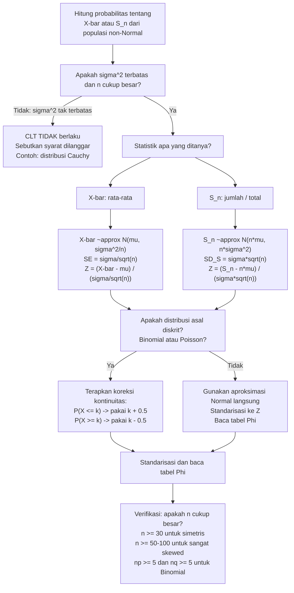

# 📊 4.3 — Teorema Limit Pusat (CLT)

> [!ABSTRACT] Ringkasan Cepat
> **Topik:** Teorema Limit Pusat (Central Limit Theorem) — Aproksimasi Normal untuk $\bar{X}$ dan $S_n$ | **Bobot:** ~15–25% | **Difficulty:** Medium
> **Ref:** Hogg-Tanis-Zimm (2015) Bab 5.3–5.4; Hogg-McKean-Craig (2019) Bab 4.1–4.2; Miller et al. (2014) Bab 8.6–8.7; Walpole et al. (2012) Bab 8.3 | **Prereq:** [[2.3 Fungsi Pembangkit]], [[2.6 Distribusi Kontinu Umum]], [[4.1 Penarikan Sampel Acak]], [[4.2 Distribusi Sampel]]

## Section 0 — Pemetaan Topik

| Topik CF2 | Sub-topik ID | Skill Diuji | Bobot | Difficulty | Prerequisite | Connected Topics | Referensi |
|-----------|--------------|-------------|-------|------------|--------------|------------------|-----------|
| Topik 4: Inferensi Statistik | 4.3 | Menyatakan CLT secara formal untuk $\bar{X}$ dan $S_n = \sum X_i$; menerapkan aproksimasi Normal untuk berbagai distribusi populasi (Binomial, Poisson, Gamma, Uniform); menentukan ukuran sampel minimal untuk validitas aproksimasi; menghitung probabilitas aproksimasi menggunakan tabel $\Phi$ dengan standarisasi yang benar; memahami koreksi kontinuitas untuk aproksimasi distribusi diskrit ke Normal; menyatakan dan menggunakan Hukum Bilangan Besar (LLN) sebagai hasil terkait CLT | 15–25% | Medium | [[2.3 Fungsi Pembangkit]], [[2.6 Distribusi Kontinu Umum]], [[4.1 Penarikan Sampel Acak]], [[4.2 Distribusi Sampel]] | [[4.1 Penarikan Sampel Acak]], [[4.2 Distribusi Sampel]], [[4.4 Hukum Bilangan Besar (LLN)]], [[4.5 Estimasi Parameter]], [[4.8 Interval Kepercayaan]] | Hogg-Tanis-Zimm (2015) Bab 5.3–5.4; Hogg-McKean-Craig (2019) Bab 4.1–4.2; Miller et al. (2014) Bab 8.6–8.7; Walpole et al. (2012) Bab 8.3 |

## Section 1 — Intuisi

Ada satu hasil dalam teori probabilitas yang lebih menakjubkan dari hampir semua yang lain: apapun bentuk distribusi populasi asal — miring kanan, miring kiri, diskrit, kontinu, bimodal — jika kita mengambil rata-rata dari sampel yang cukup besar, distribusi dari rata-rata itu akan mendekati distribusi Normal. Ini bukan kebetulan atau aproksimasi kasar: ini adalah **Teorema Limit Pusat**, salah satu teorema paling fundamental dalam matematika.

Bayangkan klaim asuransi tunggal $X$ berdistribusi Eksponensial — miring kanan ekstrem, tidak simetris sama sekali. Namun, jika perusahaan asuransi menanggung 500 polis, total klaim $S_{500} = \sum X_i$ dan rata-rata klaim $\bar{X}_{500}$ akan mengikuti distribusi yang hampir persis Normal. Mengapa? Secara intuitif: fluktuasi di satu arah dari satu polis cenderung diimbangi oleh fluktuasi berlawanan dari polis lain. Semakin banyak polis, semakin sempurna keseimbangan ini, dan distribusi rata-rata semakin simetris dan berbentuk lonceng.

Implikasi aktuaria sangat luas. CLT adalah justifikasi teoritis mengapa pendekatan Normal digunakan secara universal dalam portofolio besar — untuk menghitung modal berbasis risiko (*risk-based capital*), value at risk, dan premi kolektif. Tanpa CLT, setiap distribusi klaim yang berbeda akan membutuhkan metode komputasi yang berbeda. Dengan CLT, kita memiliki satu alat pemersatu: selama $n$ cukup besar dan distribusi asal memiliki momen terbatas, semuanya bermuara ke Normal.

Yang tidak kalah pentingnya adalah apa yang **tidak** dijamin CLT. Ia hanya berbicara tentang distribusi *limit* — seberapa cepat konvergensi ke Normal bergantung pada bentuk distribusi asal. Untuk distribusi simetris dan "ringan ekor" (seperti Uniform), $n = 10$ sudah cukup. Untuk distribusi sangat miring atau "berat ekor" (seperti distribusi dengan variansi besar), mungkin dibutuhkan $n = 100$ atau lebih. Mengenali batas-batas berlakunya CLT adalah keterampilan kritis yang membedakan penggunaan yang tepat dari yang keliru.

## Section 2 — Definisi Formal

> [!NOTE] Definisi Matematis
>
> **Teorema Limit Pusat (Versi Standar):**
> Misalkan $X_1, X_2, \ldots, X_n \overset{\text{i.i.d.}}{\sim} f(x)$ dengan $E[X_i] = \mu < \infty$ dan $\text{Var}(X_i) = \sigma^2 < \infty$. Definisikan:
> $$\bar{X}_n = \frac{1}{n}\sum_{i=1}^n X_i, \qquad S_n = \sum_{i=1}^n X_i$$
>
> Maka untuk setiap bilangan real $z$:
> $$\lim_{n \to \infty} P\!\left(\frac{\bar{X}_n - \mu}{\sigma/\sqrt{n}} \leq z\right) = \Phi(z)$$
>
> atau ekuivalen:
> $$\lim_{n \to \infty} P\!\left(\frac{S_n - n\mu}{\sigma\sqrt{n}} \leq z\right) = \Phi(z)$$
>
> **Notasi Konvergensi dalam Distribusi:**
> $$\frac{\bar{X}_n - \mu}{\sigma/\sqrt{n}} \xrightarrow{d} N(0,1) \quad \text{saat } n \to \infty$$
>
> **Aproksimasi Praktis (untuk $n$ cukup besar):**
> $$\bar{X}_n \overset{\text{approx}}{\sim} N\!\left(\mu,\; \frac{\sigma^2}{n}\right), \qquad S_n \overset{\text{approx}}{\sim} N(n\mu,\; n\sigma^2)$$

### Variabel & Parameter

| Simbol | Makna | Catatan |
|--------|-------|---------|
| $\mu = E[X_i]$ | Mean populasi | Harus **terbatas** — syarat eksistensi CLT |
| $\sigma^2 = \text{Var}(X_i)$ | Variansi populasi | Harus **terbatas dan positif** — syarat kritis CLT; distribusi Cauchy tidak memenuhi |
| $\bar{X}_n$ | Mean sampel berukuran $n$ | Variabel acak dengan distribusi mendekati $N(\mu, \sigma^2/n)$ |
| $S_n = \sum X_i$ | Jumlah sampel | Variabel acak dengan distribusi mendekati $N(n\mu, n\sigma^2)$ |
| $Z_n = (\bar{X}_n - \mu)/(\sigma/\sqrt{n})$ | Statistik CLT terstandarisasi | Konvergen ke $N(0,1)$ dalam distribusi |
| $\xrightarrow{d}$ | Konvergensi dalam distribusi (*convergence in distribution*) | Bukan konvergensi nilai; distribusi CDF konvergen ke $\Phi$ |
| $n_{\min}$ | Ukuran sampel minimal untuk validitas aproksimasi | Bergantung distribusi asal: $\approx 30$ untuk simetris; lebih besar untuk skewed |
| CC | Koreksi kontinuitas (*continuity correction*) | $\pm 0{,}5$ untuk aproksimasi distribusi diskrit dengan Normal |

### Rumus Utama

$$
Z_n = \frac{\bar{X}_n - \mu}{\sigma / \sqrt{n}} \xrightarrow{d} N(0,1) \quad (n \to \infty)
$$
**Label: CLT untuk Mean Sampel** — standarisasi menggunakan $\sigma/\sqrt{n}$ (standar error), bukan $\sigma$; ini adalah bentuk CLT yang paling sering digunakan di soal CF2.

$$
Z_n = \frac{S_n - n\mu}{\sigma\sqrt{n}} \xrightarrow{d} N(0,1) \quad (n \to \infty)
$$
**Label: CLT untuk Jumlah Sampel** — ekuivalen dengan CLT untuk mean; digunakan ketika soal melibatkan total (penjumlahan) bukan rata-rata.

$$
P(a \leq \bar{X}_n \leq b) \approx \Phi\!\left(\frac{b - \mu}{\sigma/\sqrt{n}}\right) - \Phi\!\left(\frac{a - \mu}{\sigma/\sqrt{n}}\right)
$$
**Label: Aproksimasi Probabilitas via CLT** — formula kerja untuk menghitung probabilitas menggunakan aproksimasi Normal; valid untuk $n$ cukup besar.

$$
P(a \leq S_n \leq b) \approx \Phi\!\left(\frac{b - n\mu}{\sigma\sqrt{n}}\right) - \Phi\!\left(\frac{a - n\mu}{\sigma\sqrt{n}}\right)
$$
**Label: Aproksimasi Probabilitas untuk Jumlah** — untuk total klaim, total skor, dsb.; standarisasi menggunakan $\sigma\sqrt{n}$ (bukan $\sigma/\sqrt{n}$).

$$
P(X \leq k) \approx \Phi\!\left(\frac{k + 0{,}5 - \mu}{\sigma}\right) \quad \text{(koreksi kontinuitas, distribusi diskrit)}
$$
**Label: Koreksi Kontinuitas** — saat mengaproksimasi distribusi diskrit (Binomial, Poisson) dengan Normal; $\pm 0{,}5$ mengkompensasi transisi dari diskrit ke kontinu; meningkatkan akurasi aproksimasi secara signifikan.

### Asumsi Eksplisit

- **i.i.d.:** Variabel acak $X_1,\ldots,X_n$ harus independen dan identik terdistribusi — syarat paling mendasar. CLT umum (Lindeberg-Lévy) dapat melonggarkan ini, tetapi di CF2 asumsi i.i.d. selalu berlaku.
- **Momen terbatas:** $\mu = E[X] < \infty$ dan $\sigma^2 = \text{Var}(X) < \infty$ — **kedua syarat ini wajib**. Distribusi Cauchy ($f(x) \propto 1/(1+x^2)$) tidak memiliki mean terbatas dan CLT **tidak berlaku** untuknya.
- **$n$ cukup besar:** CLT adalah pernyataan limit ($n \to \infty$). Untuk penggunaan praktis: aturan umum $n \geq 30$ untuk distribusi mendekati simetris; $n \geq 50$ hingga $n \geq 100$ untuk distribusi sangat miring (*highly skewed*). Ini bukan aturan absolut — distribusi Normal menghasilkan aproksimasi sempurna untuk $n$ berapapun.
- **Tidak memerlukan distribusi populasi Normal:** Ini adalah kekuatan CLT — ia bekerja untuk distribusi *apapun* selama dua syarat momen di atas terpenuhi.

## Section 3 — Jembatan Logika

> [!TIP] Dari Definisi ke Rumus
> **Mengapa CLT bekerja — Sketsa Bukti via MGF:**
>
> Misalkan $Y_i = (X_i - \mu)/\sigma$ sehingga $E[Y_i] = 0$ dan $\text{Var}(Y_i) = 1$. Maka:
> $$Z_n = \frac{\bar{X}_n - \mu}{\sigma/\sqrt{n}} = \frac{1}{\sqrt{n}}\sum_{i=1}^n Y_i$$
>
> MGF dari $Z_n$ (menggunakan independensi):
> $$M_{Z_n}(t) = \left[M_Y\!\left(\frac{t}{\sqrt{n}}\right)\right]^n$$
>
> Ekspansi Taylor $M_Y(s) = 1 + E[Y]s + E[Y^2]s^2/2 + O(s^3) = 1 + 0 + s^2/2 + O(s^3)$ (karena $E[Y]=0$, $E[Y^2]=1$):
> $$M_Y\!\left(\frac{t}{\sqrt{n}}\right) = 1 + \frac{t^2}{2n} + O\!\left(n^{-3/2}\right)$$
>
> Maka:
> $$M_{Z_n}(t) = \left[1 + \frac{t^2}{2n} + O(n^{-3/2})\right]^n \xrightarrow{n\to\infty} e^{t^2/2}$$
>
> (menggunakan $(1 + a/n)^n \to e^a$)
>
> Karena $e^{t^2/2}$ adalah MGF $N(0,1)$, dan MGF mengkarakterisasi distribusi (*Uniqueness Theorem*):
> $$Z_n \xrightarrow{d} N(0,1) \quad \checkmark$$
>
> **Kunci:** Konvergensi MGF ke MGF Normal mengimplikasikan konvergensi distribusi. Bukti ini valid selama MGF $X_i$ terdefinisi pada suatu lingkungan $t = 0$ — kondisi yang lebih kuat dari sekadar variansi terbatas, tetapi cukup untuk sebagian besar distribusi yang digunakan di CF2.

> [!IMPORTANT] CLT untuk Distribusi Spesifik
>
> | Distribusi Asal | $\mu$ | $\sigma^2$ | Aproksimasi $S_n$ | Catatan |
> |----------------|-------|-----------|-------------------|---------|
> | $B(1,p)$ (Bernoulli) | $p$ | $p(1-p)$ | $S_n = X \sim B(n,p) \approx N(np, np(1-p))$ | CLT menjelaskan aproksimasi Normal-Binomial |
> | $\text{Poisson}(\lambda)$ individual | $\lambda$ | $\lambda$ | $S_n \approx N(n\lambda, n\lambda)$ | $S_n \sim \text{Poisson}(n\lambda)$ eksak; CLT digunakan untuk $n\lambda$ besar |
> | $\text{Exp}(\beta)$ | $\beta$ | $\beta^2$ | $S_n \approx N(n\beta, n\beta^2)$ | $S_n$ eksak $\Gamma(n,\beta)$; CLT digunakan untuk $n$ besar |
> | $U(a,b)$ | $(a+b)/2$ | $(b-a)^2/12$ | Konvergensi cepat, $n \geq 5$ cukup | Distribusi simetris, konvergensi sangat cepat |
> | $\Gamma(\alpha,\beta)$ | $\alpha\beta$ | $\alpha\beta^2$ | Aproksimasi lebih baik untuk $\alpha$ besar | $\alpha$ besar → distribusi lebih simetris |
>
> **Aproksimasi Normal-Binomial (kasus khusus penting):**
> Jika $X \sim B(n,p)$, maka untuk $n$ besar:
> $$X \approx N(np,\; np(1-p))$$
> Aturan praktis: valid jika $np \geq 5$ **dan** $n(1-p) \geq 5$.

**Koreksi Kontinuitas — Mengapa dan Bagaimana:**

Distribusi Binomial dan Poisson adalah diskrit: $P(X = k)$ adalah probabilitas titik. Distribusi Normal adalah kontinu: $P(X = k) = 0$. Koreksi kontinuitas menjembatani ini dengan memperlakukan nilai diskrit $k$ sebagai interval kontinu $[k-0{,}5,\; k+0{,}5]$:

$$P(X = k) \approx P\!\left(k-0{,}5 \leq Z_{\text{Normal}} \leq k+0{,}5\right)$$

$$P(X \leq k) \approx P\!\left(Z_{\text{Normal}} \leq k+0{,}5\right) = \Phi\!\left(\frac{k+0{,}5-\mu}{\sigma}\right)$$

$$P(X \geq k) \approx P\!\left(Z_{\text{Normal}} \geq k-0{,}5\right) = 1 - \Phi\!\left(\frac{k-0{,}5-\mu}{\sigma}\right)$$

$$P(j \leq X \leq k) \approx \Phi\!\left(\frac{k+0{,}5-\mu}{\sigma}\right) - \Phi\!\left(\frac{j-0{,}5-\mu}{\sigma}\right)$$

**Aturan arah $+0{,}5$ atau $-0{,}5$:** Sisi yang "lebih inklusif" mendapatkan tanda yang "memperlebar" interval:
- $\leq k$ (inklusif atas) → $k + 0{,}5$ (perlebar ke atas)
- $< k$ (eksklusif atas) → $k - 0{,}5$ (persempit ke atas)
- $\geq k$ (inklusif bawah) → $k - 0{,}5$ (perlebar ke bawah)
- $> k$ (eksklusif bawah) → $k + 0{,}5$ (persempit ke bawah)

**Hukum Bilangan Besar (LLN) — Hasil Terkait:**

LLN adalah pernyataan yang **lebih lemah** dari CLT namun lebih mendasar. CLT mengatakan *distribusi* $\bar{X}_n$ mendekati Normal; LLN mengatakan *nilai* $\bar{X}_n$ mendekati $\mu$:

$$\bar{X}_n \xrightarrow{P} \mu \quad (n \to \infty) \qquad \text{(LLN Lemah)}$$

$$P(|\bar{X}_n - \mu| > \varepsilon) \to 0 \text{ untuk setiap } \varepsilon > 0$$

LLN hanya memerlukan $E[X] < \infty$ (tidak perlu variansi terbatas); CLT memerlukan $\text{Var}(X) < \infty$. Setiap distribusi yang memenuhi syarat CLT juga memenuhi LLN, tetapi tidak sebaliknya.

> [!DANGER] Dilarang
> 1. **Dilarang** menerapkan CLT untuk distribusi dengan variansi tidak terbatas (misalnya Pareto dengan ekor sangat berat, atau Cauchy). Syarat $\sigma^2 < \infty$ adalah **wajib**. Untuk distribusi berat ekor yang relevan di aktuaria (misalnya distribusi dengan $\alpha < 2$ untuk distribusi stabil), CLT tidak berlaku dalam bentuk standar.
> 2. **Dilarang** menggunakan aproksimasi Normal tanpa koreksi kontinuitas untuk distribusi diskrit (Binomial, Poisson) jika presisi diperlukan. Tanpa koreksi kontinuitas, kesalahan aproksimasi bisa signifikan terutama untuk $n$ yang tidak terlalu besar.
> 3. **Dilarang** mengabaikan arah koreksi kontinuitas. Untuk $P(X \leq k)$: gunakan $k + 0{,}5$ (bukan $k - 0{,}5$). Terbalik arahnya menghasilkan kesalahan aproksimasi yang lebih buruk daripada tanpa koreksi sama sekali.

## Section 4 — Contoh Soal

### Soal A — Fundamental

Sebuah perusahaan asuransi menanggung $n = 100$ polis secara independen. Nilai klaim masing-masing polis berdistribusi dengan $\mu = 500$ ribu rupiah dan $\sigma = 200$ ribu rupiah (distribusi populasi tidak diketahui bentuknya).

(a) Nyatakan distribusi aproksimasi dari $\bar{X}_{100}$ menggunakan CLT.
(b) Hitung $P(480 \leq \bar{X} \leq 530)$.
(c) Nyatakan distribusi aproksimasi dari $S_{100} = \sum_{i=1}^{100} X_i$ (total klaim).
(d) Hitung $P(S_{100} > 52.000)$ (dalam satuan ribu rupiah).
(e) Tentukan batas $c$ sehingga $P(\bar{X} \leq c) = 0{,}99$.

> [!SUCCESS] Solusi Soal A
>
> **1. Identifikasi Variabel**
> - $X_i$ i.i.d.; $\mu = 500$, $\sigma = 200$ (satuan: ribu rupiah)
> - $n = 100$; distribusi asal tidak diketahui
> - $\text{SE}(\bar{X}) = \sigma/\sqrt{n} = 200/\sqrt{100} = 200/10 = 20$
>
> **2. Identifikasi Distribusi / Model**
> CLT berlaku karena $\mu$ dan $\sigma^2$ terbatas dan $n = 100 \geq 30$. Distribusi populasi tidak perlu diketahui.
>
> **3. Setup Persamaan**
>
> CLT: $\bar{X} \overset{\text{approx}}{\sim} N(500, 20^2)$ dan $S_{100} \overset{\text{approx}}{\sim} N(100 \times 500,\; 100 \times 200^2) = N(50.000,\; 4.000.000)$
>
> **4. Eksekusi Aljabar**
>
> **(a) Distribusi aproksimasi $\bar{X}$:**
> $$\bar{X} \overset{\text{approx}}{\sim} N\!\left(500,\; \frac{200^2}{100}\right) = N(500,\; 400)$$
> Standar error: $\text{SE}(\bar{X}) = \sqrt{400} = 20$ ribu rupiah.
>
> **(b) $P(480 \leq \bar{X} \leq 530)$:**
>
> Standarisasi:
> $$z_1 = \frac{480 - 500}{20} = \frac{-20}{20} = -1{,}00, \qquad z_2 = \frac{530 - 500}{20} = \frac{30}{20} = 1{,}50$$
>
> $$P(480 \leq \bar{X} \leq 530) \approx \Phi(1{,}50) - \Phi(-1{,}00) = 0{,}9332 - (1 - 0{,}8413)$$
> $$= 0{,}9332 - 0{,}1587 = 0{,}7745$$
>
> **(c) Distribusi aproksimasi $S_{100}$:**
> $$S_{100} \overset{\text{approx}}{\sim} N(n\mu,\; n\sigma^2) = N(100 \times 500,\; 100 \times 200^2)$$
> $$= N(50.000,\; 4.000.000)$$
> Standar deviasi $S_{100}$: $\sigma_{S} = \sigma\sqrt{n} = 200\sqrt{100} = 2.000$ ribu rupiah.
>
> **(d) $P(S_{100} > 52.000)$:**
>
> Standarisasi menggunakan $\sigma_S = 2.000$:
> $$z = \frac{52.000 - 50.000}{2.000} = \frac{2.000}{2.000} = 1{,}00$$
>
> $$P(S_{100} > 52.000) \approx 1 - \Phi(1{,}00) = 1 - 0{,}8413 = 0{,}1587$$
>
> **(e) Nilai $c$ sehingga $P(\bar{X} \leq c) = 0{,}99$:**
>
> $$P\!\left(\frac{\bar{X}-500}{20} \leq \frac{c-500}{20}\right) = 0{,}99 \implies \Phi\!\left(\frac{c-500}{20}\right) = 0{,}99$$
>
> Dari tabel: $\Phi(z) = 0{,}99 \implies z = 2{,}326$:
> $$\frac{c - 500}{20} = 2{,}326 \implies c = 500 + 20 \times 2{,}326 = 500 + 46{,}52 = 546{,}52 \text{ ribu rupiah}$$
>
> **5. Verification**
> - Standar deviasi $\bar{X} = 20$ vs $\sigma = 200$: pengambilan rata-rata 100 pengamatan mengurangi variabilitas oleh faktor $\sqrt{100} = 10$ ✓
> - $P(480 \leq \bar{X} \leq 530) = 0{,}775$: interval mencakup $\mu = 500$ dan selebar $[-1\sigma_{\bar{X}}, +1{,}5\sigma_{\bar{X}}]$ — probabilitas sekitar 77% wajar ✓
> - $c = 546{,}52$: persentil ke-99 dari $N(500,400)$ — selisih dari mean adalah $46{,}52 = 2{,}326 \times 20$ ✓
> - Hubungan $\bar{X}$ dan $S_{100}$: $P(S_{100} > 52.000) = P(\bar{X} > 520) = P(Z > 1{,}00) = 0{,}1587$ — konsisten dengan bagian (d) karena $S_{100} = 100 \bar{X}$ ✓

> [!WARNING] Exam Tips — Soal A
> **Target waktu:** 10–12 menit
> **Common trap 1:** Standar error untuk $\bar{X}$ adalah $\sigma/\sqrt{n}$, bukan $\sigma/n$ dan bukan $\sigma$. Untuk $n=100$: $\text{SE} = 200/10 = 20$, bukan $200/100 = 2$.
> **Common trap 2:** Standar deviasi untuk $S_n$ adalah $\sigma\sqrt{n}$ (bukan $\sigma/\sqrt{n}$). Untuk $n=100$: $\sigma_S = 200\sqrt{100} = 2.000$, bukan 20.
> **Shortcut:** Verifikasi konsistensi: $P(S_n > c_S) = P(\bar{X} > c_S/n)$ — selalu periksa bahwa jawaban bagian $S_n$ konsisten dengan bagian $\bar{X}$ ketika keduanya ada dalam soal.

---

### Soal B — Exam-Typical

Suatu perusahaan asuransi menerbitkan 200 polis. Probabilitas setiap polis mengajukan klaim dalam setahun adalah $p = 0{,}3$, independen satu sama lain. Misalkan $X$ = jumlah polis yang mengajukan klaim.

(a) Identifikasi distribusi eksak $X$ dan nyatakan $E[X]$ serta $\text{Var}(X)$.
(b) Gunakan CLT (tanpa koreksi kontinuitas) untuk mengaproksimasi $P(X \leq 55)$.
(c) Ulangi bagian (b) **dengan koreksi kontinuitas** dan bandingkan hasilnya.
(d) Gunakan CLT untuk mengaproksimasi $P(50 \leq X \leq 70)$ dengan koreksi kontinuitas.
(e) Tentukan nilai $k$ terkecil sehingga $P(X \leq k) \geq 0{,}90$ menggunakan aproksimasi Normal dengan koreksi kontinuitas.

> [!SUCCESS] Solusi Soal B
>
> **1. Identifikasi Variabel**
> - $X = \sum_{i=1}^{200} B_i$ di mana $B_i \sim \text{Bern}(0{,}3)$ i.i.d. → $X \sim B(200, 0{,}3)$
> - $\mu_X = np = 200 \times 0{,}3 = 60$
> - $\sigma_X^2 = np(1-p) = 200 \times 0{,}3 \times 0{,}7 = 42$; $\sigma_X = \sqrt{42} \approx 6{,}481$
> - Cek validitas CLT: $np = 60 \geq 5$ ✓ dan $n(1-p) = 140 \geq 5$ ✓
>
> **2. Identifikasi Distribusi / Model**
> Distribusi eksak: $B(200, 0{,}3)$. CLT berlaku karena $n=200$ besar dan $p$ tidak ekstrem. Aproksimasi Normal: $X \approx N(60, 42)$.
>
> **3. Setup Persamaan**
>
> Standarisasi: $Z = (X - 60)/\sqrt{42}$
>
> **4. Eksekusi Aljabar**
>
> **(a) Distribusi eksak, $E[X]$, $\text{Var}(X)$:**
> $$X \sim B(200, 0{,}3), \quad E[X] = 60, \quad \text{Var}(X) = 42$$
>
> **(b) $P(X \leq 55)$ tanpa koreksi kontinuitas:**
>
> $$z = \frac{55 - 60}{\sqrt{42}} = \frac{-5}{6{,}481} = -0{,}7715$$
>
> $$P(X \leq 55) \approx \Phi(-0{,}772) = 1 - \Phi(0{,}772) \approx 1 - 0{,}7801 = 0{,}2199$$
>
> **(c) $P(X \leq 55)$ **dengan** koreksi kontinuitas:**
>
> Karena $\leq 55$ (inklusif), gunakan batas atas $55 + 0{,}5 = 55{,}5$:
>
> $$z_{\text{CC}} = \frac{55{,}5 - 60}{\sqrt{42}} = \frac{-4{,}5}{6{,}481} = -0{,}6943$$
>
> $$P(X \leq 55) \approx \Phi(-0{,}694) = 1 - \Phi(0{,}694) \approx 1 - 0{,}7561 = 0{,}2439$$
>
> Nilai eksak (Binomial): $P(X \leq 55) \approx 0{,}2443$.
>
> Perbandingan:
> | Metode | Nilai | Kesalahan vs Eksak |
> |--------|-------|---------------------|
> | Normal tanpa CC | 0{,}2199 | $-0{,}0244$ (2,44%) |
> | Normal dengan CC | 0{,}2439 | $-0{,}0004$ (0,04%) |
> | Eksak (Binomial) | 0{,}2443 | — |
>
> Koreksi kontinuitas meningkatkan akurasi dari 2,44% menjadi 0,04%.
>
> **(d) $P(50 \leq X \leq 70)$ dengan koreksi kontinuitas:**
>
> Interval inklusif di kedua sisi: gunakan $49{,}5$ hingga $70{,}5$:
>
> $$z_1 = \frac{49{,}5 - 60}{\sqrt{42}} = \frac{-10{,}5}{6{,}481} = -1{,}620$$
> $$z_2 = \frac{70{,}5 - 60}{\sqrt{42}} = \frac{10{,}5}{6{,}481} = 1{,}620$$
>
> $$P(50 \leq X \leq 70) \approx \Phi(1{,}620) - \Phi(-1{,}620) = 2\Phi(1{,}620) - 1$$
> $$= 2(0{,}9474) - 1 = 0{,}8948$$
>
> **(e) $k$ terkecil sehingga $P(X \leq k) \geq 0{,}90$:**
>
> Dengan koreksi kontinuitas, $P(X \leq k) \approx \Phi\!\left(\frac{k+0{,}5-60}{\sqrt{42}}\right) \geq 0{,}90$:
>
> $$\frac{k + 0{,}5 - 60}{\sqrt{42}} \geq z_{0{,}10} = 1{,}282$$
>
> $$k + 0{,}5 - 60 \geq 1{,}282 \times 6{,}481 = 8{,}307$$
>
> $$k \geq 60 - 0{,}5 + 8{,}307 = 67{,}807$$
>
> Karena $k$ harus integer: $k_{\min} = 68$.
>
> Verifikasi: $\Phi\!\left(\frac{68{,}5 - 60}{6{,}481}\right) = \Phi(1{,}311) \approx 0{,}905 \geq 0{,}90$ ✓
>
> Cek $k=67$: $\Phi\!\left(\frac{67{,}5-60}{6{,}481}\right) = \Phi(1{,}157) \approx 0{,}876 < 0{,}90$ ✗
>
> **5. Verification**
> - Cek CLT valid: $np = 60 \geq 5$ dan $nq = 140 \geq 5$ ✓
> - Koreksi kontinuitas drastis meningkatkan akurasi (error 2,44% → 0,04%) ✓
> - $P(50 \leq X \leq 70)$: interval simetris sekitar $\mu = 60$ dengan lebar $\pm 10 \approx \pm 1{,}54\sigma$ → probabilitas sekitar 87-88% wajar ✓
> - $k_{\min} = 68 > \mu = 60$: persentil ke-90 di atas mean untuk distribusi yang tidak terlalu skewed ✓

> [!WARNING] Exam Tips — Soal B
> **Target waktu:** 14–16 menit
> **Common trap 1:** Arah koreksi kontinuitas paling sering salah. Hafal aturan: $P(X \leq k)$ → gunakan $k + 0{,}5$; $P(X \geq k)$ → gunakan $k - 0{,}5$. Bayangkan bahwa $\leq k$ "mencakup" hingga tepat sebelum $k+1$, yaitu $k+0{,}5$.
> **Common trap 2:** Untuk $P(50 \leq X \leq 70)$ dengan CC: batas bawah inklusif menggunakan $50 - 0{,}5 = 49{,}5$ (perlebar ke bawah), batas atas inklusif menggunakan $70 + 0{,}5 = 70{,}5$ (perlebar ke atas).
> **Common trap 3:** Untuk bagian (e), setelah mendapat $k \geq 67{,}807$, bulatkan ke **atas** ke 68 karena $k$ adalah integer dan harus memenuhi $\geq 0{,}90$.

---

### Soal C — Challenging

Waktu proses setiap klaim di sebuah perusahaan asuransi berdistribusi $\text{Exp}(\beta = 4)$ (rata-rata 4 hari per klaim, parametrisasi skala). Ada $n = 36$ klaim independen yang harus diproses.

(a) Nyatakan distribusi eksak dari total waktu proses $S_{36} = \sum_{i=1}^{36} X_i$ dan hitung $E[S_{36}]$ serta $\text{Var}(S_{36})$.
(b) Gunakan CLT untuk mengaproksimasi $P(130 \leq S_{36} \leq 160)$ dan bandingkan dengan nilai dari distribusi Gamma eksak.
(c) Hitung $P(\bar{X}_{36} > 5)$ menggunakan CLT dan interpretasikan hasilnya dalam konteks aktuaria.
(d) Tentukan nilai $t_0$ sehingga $P(S_{36} \leq t_0) = 0{,}95$ menggunakan aproksimasi CLT.
(e) Untuk ukuran sampel $n$ berapakah aproksimasi Normal untuk $\bar{X}$ dari distribusi $\text{Exp}(\beta)$ dianggap "cukup baik"? Diskusikan faktor yang memengaruhi laju konvergensi CLT untuk distribusi Eksponensial.

> [!SUCCESS] Solusi Soal C
>
> **1. Identifikasi Variabel**
> - $X_i \overset{\text{i.i.d.}}{\sim} \text{Exp}(\beta=4)$: $\mu = \beta = 4$, $\sigma^2 = \beta^2 = 16$, $\sigma = 4$
> - $n = 36$; $\text{SE}(\bar{X}) = \sigma/\sqrt{n} = 4/6 = 2/3$
>
> **2. Identifikasi Distribusi / Model**
> Distribusi eksak $S_{36}$: penjumlahan 36 Eksponensial i.i.d. $\to \Gamma(36, \beta=4)$.
>
> Aproksimasi CLT: $S_{36} \approx N(n\mu, n\sigma^2) = N(144, 576)$; $\sigma_{S} = 24$.
>
> **3. Setup Persamaan**
>
> Standarisasi $S_{36}$: $Z = (S_{36} - 144)/24$
>
> **4. Eksekusi Aljabar**
>
> **(a) Distribusi eksak, $E[S_{36}]$, $\text{Var}(S_{36})$:**
>
> Penjumlahan 36 Eksponensial i.i.d. $\to \Gamma(36, \beta=4)$:
> $$S_{36} \sim \Gamma(\alpha=36,\;\beta=4)$$
> $$E[S_{36}] = \alpha\beta = 36 \times 4 = 144 \text{ hari}$$
> $$\text{Var}(S_{36}) = \alpha\beta^2 = 36 \times 16 = 576, \quad \sigma_{S} = 24 \text{ hari}$$
>
> **(b) $P(130 \leq S_{36} \leq 160)$ — CLT vs Gamma eksak:**
>
> **Via CLT:**
> $$z_1 = \frac{130 - 144}{24} = \frac{-14}{24} = -0{,}583$$
> $$z_2 = \frac{160 - 144}{24} = \frac{16}{24} = 0{,}667$$
>
> $$P(130 \leq S_{36} \leq 160) \approx \Phi(0{,}667) - \Phi(-0{,}583)$$
> $$= 0{,}7476 - (1 - 0{,}7202) = 0{,}7476 - 0{,}2798 = 0{,}4678$$
>
> **Via Gamma eksak** (hubungan Gamma–Poisson, $\alpha=36 \in \mathbb{Z}^+$, $\lambda = 1/\beta = 1/4$):
>
> $$P(S_{36} \leq s) = P\!\left(\text{Poisson}\!\left(\frac{s}{\beta}\right) \leq \alpha - 1\right) = P(\text{Poisson}(s/4) \leq 35)$$
>
> $$P(130 \leq S_{36} \leq 160) = P(S_{36}\leq 160) - P(S_{36} \leq 130)$$
> $$= P(\text{Poisson}(40) \leq 35) - P(\text{Poisson}(32{,}5) \leq 35)$$
>
> Untuk Poisson dengan $\lambda$ besar, via CLT Poisson:
> $$P(\text{Poisson}(40) \leq 35) \approx \Phi\!\left(\frac{35{,}5-40}{\sqrt{40}}\right) = \Phi(-0{,}711) \approx 0{,}239$$
> $$P(\text{Poisson}(32{,}5) \leq 35) \approx \Phi\!\left(\frac{35{,}5-32{,}5}{\sqrt{32{,}5}}\right) = \Phi(0{,}526) \approx 0{,}701$$
>
> $P(130 \leq S_{36} \leq 160) \approx 0{,}701 - 0{,}239 = 0{,}462$
>
> Perbandingan: CLT ($0{,}468$) vs Gamma eksak via Poisson ($0{,}462$) — perbedaan kecil, menunjukkan CLT cukup akurat untuk $n=36$ dari Eksponensial.
>
> **(c) $P(\bar{X}_{36} > 5)$:**
>
> $$\bar{X}_{36} \overset{\text{approx}}{\sim} N\!\left(4,\; \frac{16}{36}\right) = N\!\left(4,\; \frac{4}{9}\right), \quad \text{SE} = \frac{2}{3}$$
>
> $$P(\bar{X} > 5) \approx P\!\left(Z > \frac{5-4}{2/3}\right) = P(Z > 1{,}5) = 1 - \Phi(1{,}5) = 1 - 0{,}9332 = 0{,}0668$$
>
> **Interpretasi aktuaria:** Hanya sekitar 6,7% kemungkinan bahwa rata-rata waktu proses dari 36 klaim melebihi 5 hari (padahal rata-rata populasi hanya 4 hari). Ini menunjukkan bahwa dengan 36 klaim, rata-rata waktu proses cukup stabil di sekitar mean populasi — risiko keterlambatan sistemik relatif kecil.
>
> **(d) $t_0$ sehingga $P(S_{36} \leq t_0) = 0{,}95$:**
>
> $$P\!\left(Z \leq \frac{t_0 - 144}{24}\right) = 0{,}95 \implies \frac{t_0 - 144}{24} = z_{0{,}05} = 1{,}645$$
>
> $$t_0 = 144 + 24 \times 1{,}645 = 144 + 39{,}48 = 183{,}48 \text{ hari}$$
>
> Interpretasi: dengan probabilitas 95%, 36 klaim akan selesai diproses dalam 183,5 hari.
>
> **(e) Ukuran sampel minimal dan laju konvergensi:**
>
> Distribusi Eksponensial memiliki koefisien kemiringan (*skewness*) yang tinggi: $\gamma_1 = 2$ (bandingkan dengan Normal: $\gamma_1 = 0$). Berry-Esseen Theorem menyatakan bahwa kecepatan konvergensi CLT bergantung pada $\rho = E[|X-\mu|^3]/\sigma^3$. Untuk Eksponensial: $\rho = 2\sigma^3/\sigma^3 = 2$, mengimplikasikan error aproksimasi $O(1/\sqrt{n})$.
>
> **Panduan praktis untuk Eksponensial:**
> - $n \geq 30$: aproksimasi Normal sudah cukup baik untuk sebagian besar kebutuhan
> - $n \geq 50$: aproksimasi sangat baik, error $< 1\%$ untuk probabilitas di sekitar mean
> - Untuk ekor ekstrem ($z > 2$): butuh $n$ lebih besar karena ekor kanan Eksponensial lebih tebal dari Normal
>
> **Faktor yang memengaruhi laju konvergensi:**
> 1. Kemiringan (*skewness*) distribusi asal — semakin miring, konvergensi lebih lambat
> 2. Kurtosis (*kurtosis*) — ekor lebih tebal → konvergensi lebih lambat
> 3. Probabilitas yang dihitung — aproksimasi lebih baik di sekitar mean daripada di ekor
> 4. Apakah $n$ cukup untuk $np \geq 5$ (untuk Binomial) atau $\lambda n$ cukup besar (untuk Poisson)
>
> **5. Verification**
> - $E[S_{36}] = 144$, $\sigma_S = 24$: konsisten dengan $\Gamma(36,4)$ via formula $E = \alpha\beta$ dan $\text{SD} = \sqrt{\alpha}\beta = 6\times4=24$ ✓
> - CLT ($0{,}468$) vs Gamma eksak ($0{,}462$): perbedaan $< 1{,}5\%$, aproksimasi baik untuk $n=36$ ✓
> - $P(\bar{X} > 5) = 6{,}7\%$: 5 hari adalah $(\mu + \sigma_{\bar{X}} \cdot 1{,}5) = 4 + 1 = 5$ — berada 1,5 SE di atas mean, probabilitas 6,7% sesuai ✓

> [!WARNING] Exam Tips — Soal C
> **Target waktu:** 18–22 menit
> **Common trap 1:** Untuk $S_n = \sum X_i$: standar deviasi adalah $\sigma\sqrt{n}$, **bukan** $\sigma/\sqrt{n}$. Keduanya $= 24$ untuk kasus ini karena $\sigma\sqrt{n} = 4\times6 = 24$ — kebetulan numeriknya sama dengan $\sigma/\sqrt{n}$ untuk parameter berbeda, sehingga ini adalah soal yang perlu waspada.
> **Common trap 2:** Jangan bingung antara standarisasi $\bar{X}$ (bagi dengan $\sigma/\sqrt{n}$) dan standarisasi $S_n$ (bagi dengan $\sigma\sqrt{n}$). Keduanya berbeda arah perpangkatan $n$.
> **Shortcut:** Untuk persentil $t_0$ pada bagian (d): $t_0 = n\mu + z_\alpha \cdot \sigma\sqrt{n}$ — rumus langsung untuk persentil ke-$(1-\alpha)$ dari distribusi $S_n$.

## Section 5 — Verifikasi & Sanity Check

> [!CHECK] Validasi Penerapan CLT
> Sebelum menggunakan CLT:
> 1. Distribusi asal: $E[X] < \infty$ dan $\text{Var}(X) < \infty$ — wajib diperiksa ✓
> 2. $n$ cukup besar: $n \geq 30$ untuk distribusi simetris ringan; $n \geq 50$–$100$ untuk distribusi skewed ✓
> 3. Variabel i.i.d.: independen dan identik terdistribusi ✓
> 4. Untuk Binomial: $np \geq 5$ **dan** $n(1-p) \geq 5$ ✓

> [!CHECK] Validasi Standarisasi
> Dua kesalahan paling sering dalam standarisasi:
> 1. Untuk $\bar{X}$: standar deviasi adalah $\sigma/\sqrt{n}$ (dibagi akar $n$) ✓
> 2. Untuk $S_n$: standar deviasi adalah $\sigma\sqrt{n}$ (dikali akar $n$) ✓
> 3. Kedua rumus menghasilkan statistik yang **sama**: $(\bar{X}-\mu)/(\sigma/\sqrt{n}) = (S_n - n\mu)/(\sigma\sqrt{n})$ ✓

> [!CHECK] Validasi Koreksi Kontinuitas
> Untuk distribusi diskrit:
> 1. $P(X \leq k)$: gunakan $k + 0{,}5$ di pembilang ✓
> 2. $P(X \geq k)$: gunakan $k - 0{,}5$ di pembilang ✓
> 3. $P(j \leq X \leq k)$: gunakan $j - 0{,}5$ (bawah) dan $k + 0{,}5$ (atas) ✓
> 4. $P(X = k)$: gunakan interval $[k - 0{,}5,\; k + 0{,}5]$ ✓

### Metode Alternatif

**CLT via MGF (untuk verifikasi distribusi penjumlahan):** Jika distribusi $X_i$ memiliki MGF yang diketahui, ekspansi Taylor MGF di $t/\sqrt{n}$ memberikan konvergensi eksplisit ke $e^{t^2/2}$. Lebih rigorous dari pendekatan intuitif namun memberikan insight mendalam tentang laju konvergensi.

**Menggunakan distribusi eksak sebagai benchmark:** Untuk distribusi yang distribusi penjumlahannya diketahui ($\text{Exp} \to \Gamma$; $\text{Bern} \to \text{Binomial}$; $\text{Poisson}$ individual $\to \text{Poisson}$ total), selalu bandingkan aproksimasi CLT dengan nilai eksak untuk memverifikasi akurasi.

## Section 6 — Visualisasi Mental

**CLT sebagai "Perataan Distribusi":**

Bayangkan satu variabel acak $X$ dengan distribusi miring kanan (seperti Eksponensial). Ambil rata-rata dari 2 variabel — distribusi mulai lebih simetris. Ambil rata-rata dari 10 — sudah tampak seperti lonceng kasar. Ambil rata-rata dari 30 — hampir tidak bisa dibedakan dari Normal. Ini bukan keajaiban: fluktuasi positif di satu variabel cenderung diimbangi oleh fluktuasi negatif di variabel lain; semakin banyak variabel, semakin sempurna penyeimbangan ini.

**Koreksi Kontinuitas sebagai "Pikselasi":**

Distribusi diskrit seperti Binomial adalah "piksel" di integer. Distribusi Normal adalah "kurva halus". Koreksi kontinuitas adalah cara mengonversi antara keduanya: setiap piksel integer $k$ direpresentasikan sebagai interval $[k-0{,}5, k+0{,}5]$ dalam kurva halus. Tanpa koreksi, kita memotong kurva Normal tepat di titik integer; dengan koreksi, kita mengambil seluruh "pixel" yang sesuai.

**Lebar Distribusi $\bar{X}$ vs $S_n$:**

Distribusi $\bar{X}$ semakin **sempit** saat $n$ bertambah ($\sigma/\sqrt{n} \to 0$): rata-rata semakin terkonsentrasi di $\mu$ — ini adalah manifestasi LLN. Distribusi $S_n$ semakin **lebar** saat $n$ bertambah ($\sigma\sqrt{n} \to \infty$): total klaim semakin tersebar. Namun keduanya semakin **Normal-shaped** — ini adalah CLT.

### Hubungan Visual ↔ Rumus

Penyempitan distribusi $\bar{X}$ berkorespondensi dengan:
$$
\text{SE}(\bar{X}) = \frac{\sigma}{\sqrt{n}} \to 0 \text{ saat } n \to \infty \longleftrightarrow \text{distribusi semakin terkonsentrasi di } \mu
$$

Koreksi kontinuitas $+0{,}5$ berkorespondensi dengan:
$$
P(X \leq k) = P(\text{Normal} \leq k+0{,}5) \longleftrightarrow \text{memasukkan seluruh "piksel" ke-}k
$$

Konvergensi MGF ke Normal berkorespondensi dengan:
$$
\left[1 + \frac{t^2}{2n} + O(n^{-3/2})\right]^n \to e^{t^2/2} \longleftrightarrow \text{MGF Normal standar}
$$

## Section 7 — Jebakan Umum

> [!BUG] Kesalahan Parametrisasi
> **Jebakan utama — Mencampur SE untuk $\bar{X}$ dan SD untuk $S_n$:**
>
> | | $\bar{X}$ | $S_n = \sum X_i$ |
> |--|-----------|-----------------|
> | **Mean** | $\mu$ | $n\mu$ |
> | **Standar deviasi** | $\sigma/\sqrt{n}$ | $\sigma\sqrt{n}$ |
> | **Standarisasi** | $({\bar{X}-\mu})/(\sigma/\sqrt{n})$ | $(S_n - n\mu)/(\sigma\sqrt{n})$ |
>
> Keduanya menghasilkan statistik yang **identik** secara aljabar: $(\bar{X}-\mu)/(\sigma/\sqrt{n}) = (S_n-n\mu)/(\sigma\sqrt{n})$ karena $\bar{X} = S_n/n$. Kesalahan adalah menggunakan $\sigma/\sqrt{n}$ sebagai SD untuk $S_n$, atau $\sigma\sqrt{n}$ sebagai SE untuk $\bar{X}$.

> [!BUG] Kesalahan Konseptual
> 1. **Mengira CLT menyatakan distribusi $X_i$ mendekati Normal.** CLT berbicara tentang distribusi $\bar{X}_n$ atau $S_n$ — **bukan** distribusi populasi $X_i$. Setiap $X_i$ tetap terdistribusi seperti populasinya; hanya rata-ratanya yang mendekati Normal.
> 2. **Mengaplikasikan CLT tanpa memeriksa syarat variansi terbatas.** Untuk distribusi berat ekor (heavy-tailed) dengan variansi tak terbatas, CLT tidak berlaku. Di konteks aktuaria, distribusi seperti Pareto dengan $\alpha \leq 2$ tidak memiliki variansi terbatas.
> 3. **Mengira $n \geq 30$ adalah batas absolut.** Ini adalah aturan *praktis*, bukan matematis. Untuk distribusi simetris ringan (Uniform), $n = 10$ sudah cukup. Untuk distribusi sangat skewed atau heavy-tailed, $n = 30$ mungkin tidak cukup.
> 4. **Melupakan koreksi kontinuitas untuk distribusi diskrit.** Untuk Binomial dan Poisson, koreksi kontinuitas secara signifikan meningkatkan akurasi aproksimasi, terutama saat menghitung probabilitas ekor atau probabilitas titik.

> [!BUG] Kesalahan Interpretasi Soal
> - **"Gunakan CLT untuk mengaproksimasi":** Ini secara implisit meminta menggunakan $\bar{X} \approx N(\mu, \sigma^2/n)$ atau $S_n \approx N(n\mu, n\sigma^2)$ — pilih sesuai dengan statistik yang ditanya.
> - **"$X$ adalah jumlah" (bukan rata-rata):** Jika soal menyatakan $X = \sum X_i$, gunakan CLT untuk $S_n$ (standar deviasi $\sigma\sqrt{n}$), bukan untuk $\bar{X}$ (standar deviasi $\sigma/\sqrt{n}$).
> - **Persentil dari distribusi aproksimasi:** Untuk mencari $c$ sehingga $P(S_n \leq c) = p$: gunakan $c = n\mu + z_p \cdot \sigma\sqrt{n}$ di mana $z_p = \Phi^{-1}(p)$ — ingat standar deviasi $S_n$ adalah $\sigma\sqrt{n}$, bukan $\sigma/\sqrt{n}$.

> [!CAUTION] Red Flags
> - **Distribusi asal tidak diketahui atau non-Normal + $n$ besar:** Ini adalah sinyal klasik untuk menggunakan CLT — tanpa CLT tidak mungkin menghitung probabilitas tentang $\bar{X}$ atau $S_n$.
> - **Soal menyebut "Binomial dengan $n$ besar" atau "Poisson dengan $\lambda$ besar":** Kemungkinan besar aproksimasi Normal + koreksi kontinuitas diminta.
> - **Soal meminta $P(\bar{X} > c)$ atau $P(S_n \leq c)$ dari distribusi non-Normal:** Standarisasi ke $Z$ menggunakan $\text{SE} = \sigma/\sqrt{n}$ atau $\sigma\sqrt{n}$ sesuai statistik.
> - **Soal menyebutkan "total" atau "jumlah":** Gunakan CLT untuk $S_n$ — mean $n\mu$, SD $\sigma\sqrt{n}$.
> - **Soal menyebutkan "rata-rata":** Gunakan CLT untuk $\bar{X}$ — mean $\mu$, SD $\sigma/\sqrt{n}$.
> - **Soal tentang distribusi Cauchy atau distribusi "berat ekor" tanpa variansi terbatas:** CLT tidak berlaku — sebutkan ini secara eksplisit.

## Section 8 — Ringkasan Eksekutif

> [!SUMMARY] Must-Remember
> 1. **CLT — pernyataan formal:**
>    $$\frac{\bar{X}_n - \mu}{\sigma/\sqrt{n}} \xrightarrow{d} N(0,1) \quad (n \to \infty), \quad \text{syarat: } \mu < \infty,\; \sigma^2 < \infty,\; \text{i.i.d.}$$
> 2. **Aproksimasi praktis — mean dan jumlah:**
>    $$\bar{X}_n \overset{\text{approx}}{\sim} N\!\left(\mu,\; \frac{\sigma^2}{n}\right), \qquad S_n \overset{\text{approx}}{\sim} N(n\mu,\; n\sigma^2)$$
> 3. **Standar deviasi — arah $\sqrt{n}$ berbeda!**
>    $$\text{SD}(\bar{X}) = \frac{\sigma}{\sqrt{n}} \quad (\text{bagi}), \qquad \text{SD}(S_n) = \sigma\sqrt{n} \quad (\text{kali})$$
> 4. **Koreksi kontinuitas untuk distribusi diskrit:**
>    $$P(X \leq k) \approx \Phi\!\left(\frac{k+0{,}5-\mu}{\sigma}\right), \quad P(X \geq k) \approx 1 - \Phi\!\left(\frac{k-0{,}5-\mu}{\sigma}\right)$$
> 5. **Aturan validitas — Binomial:**
>    $$X \sim B(n,p): \quad X \approx N(np, np(1-p)) \quad \text{jika } np \geq 5 \text{ dan } n(1-p) \geq 5$$

### Kapan Digunakan

- **Trigger keywords:** "aproksimasi Normal", "CLT", "distribusi populasi tidak diketahui tapi $n$ besar", "Binomial $n$ besar", "Poisson $\lambda$ besar", "total klaim dari banyak polis", "rata-rata sampel besar".
- **Tipe skenario soal:**
  - Hitung $P(\bar{X} \in [a,b])$ atau $P(S_n \leq c)$ dari distribusi asal non-Normal.
  - Aproksimasi Binomial atau Poisson menggunakan Normal.
  - Tentukan ukuran sampel minimal untuk probabilitas tertentu.
  - Tentukan persentil dari distribusi sampel menggunakan tabel Normal standar.

### Kapan TIDAK Boleh Digunakan

- **Jika $\sigma^2$ tidak terbatas:** CLT tidak berlaku — sebutkan syarat dilanggar.
- **Jika $n$ kecil dan distribusi asal non-Normal:** Gunakan distribusi eksak jika tersedia, atau simulasi.
- **Jika populasi Normal:** Distribusi $\bar{X}$ eksak Normal untuk $n$ berapapun — CLT tidak diperlukan, langsung gunakan $\bar{X} \sim N(\mu, \sigma^2/n)$.
- **Jika $\sigma^2$ tidak diketahui:** Distribusi $t$ (bukan CLT langsung) saat $n$ kecil; untuk $n$ besar CLT + $S$ sebagai estimasi $\sigma$ valid (lihat [[4.2 Distribusi Sampel]]).
- **Jika diperlukan probabilitas eksak:** Gunakan PMF/PDF atau CDF eksak dari distribusi yang diketahui.

### Quick Decision Tree

---

> [!QUOTE] Follow-up Options
> 1. *"Berikan soal variasi: aproksimasi Normal untuk total klaim $n = 50$ polis dengan klaim individual berdistribusi Gamma, termasuk perbandingan dengan Gamma eksak"*
> 2. *"Jelaskan hubungan [[4.3 Teorema Limit Pusat (CLT)]] dengan [[4.4 Hukum Bilangan Besar (LLN)]] — perbedaan formal dan implikasi masing-masing"*
> 3. *"Buat flashcard 1-halaman untuk topik ini"*

*📖 Ref: Hogg-Tanis-Zimm (2015) Bab 5.3–5.4; Hogg-McKean-Craig (2019) Bab 4.1–4.2; Miller et al. (2014) Bab 8.6–8.7; Walpole et al. (2012) Bab 8.3 | 🗓️ 2026-02-21 | #CF2 #InferensStatistik #CLT #TeoremaLimitPusat #NormalAproksimasi #Konvergensi #DistribusiSampel*
