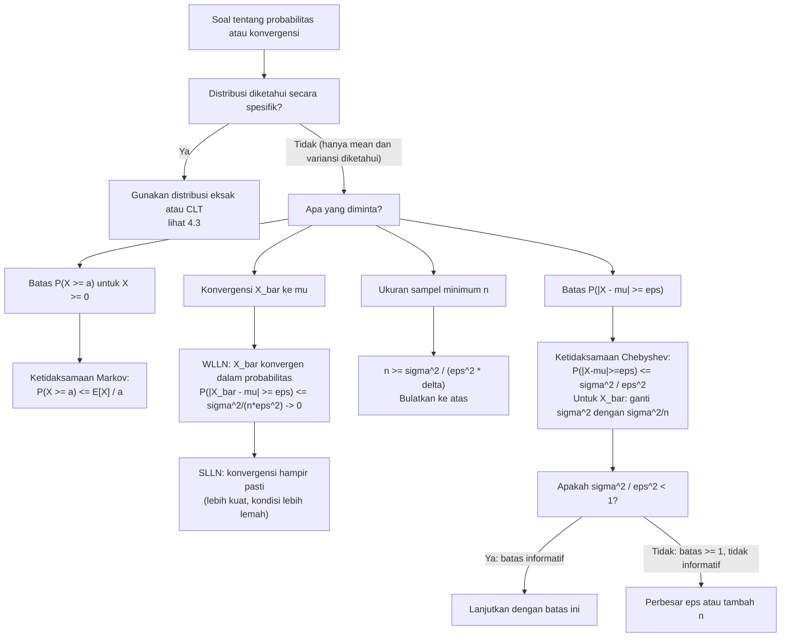

# 📊 4.4 — Hukum Bilangan Besar (LLN)

> [!ABSTRACT] Ringkasan Cepat
> **Topik:** Hukum Bilangan Besar (LLN) | **Bobot:** ~20–30% | **Difficulty:** Medium
> **Ref:** Hogg-McKean-Craig (2019) Bab 1.7, 5.1; Hogg-Tanis-Zimm (2015) Bab 5.1–5.2; Miller et al. (2014) Bab 7.1–7.3 | **Prereq:** [[4.1 Penarikan Sampel Acak]], [[2.1 Variabel Acak Diskrit]], [[2.2 Variabel Acak Kontinu]]

## Section 0 — Pemetaan Topik

| Topik CF2 | Sub-topik ID | Skill Diuji | Bobot | Difficulty | Prerequisite | Connected Topics | Referensi |
|-----------|--------------|-------------|-------|------------|--------------|------------------|-----------|
| Topik 4: Inferensi Statistik | 4.4 | Menyatakan dan membedakan WLLN dan SLLN; membuktikan WLLN menggunakan Ketidaksamaan Chebyshev; menerapkan Ketidaksamaan Markov dan Chebyshev untuk batas probabilitas; menginterpretasikan konvergensi dalam probabilitas vs konvergensi hampir pasti; menghubungkan LLN dengan konsistensi estimator; menentukan ukuran sampel minimum dari Ketidaksamaan Chebyshev | 20–30% | Medium | [[4.1 Penarikan Sampel Acak]], [[2.1 Variabel Acak Diskrit]], [[2.2 Variabel Acak Kontinu]], [[4.6 Sifat-Sifat Estimator]] | [[4.3 Teorema Limit Pusat (CLT)]], [[4.5 Estimasi Parameter]], [[4.6 Sifat-Sifat Estimator]], [[4.7 Selang Kepercayaan]] | Hogg-McKean-Craig (2019) Bab 1.7, 5.1; Hogg-Tanis-Zimm (2015) Bab 5.1–5.2; Miller et al. (2014) Bab 7.1–7.3 |

## Section 1 — Intuisi

Hukum Bilangan Besar adalah formalisasi matematis dari sesuatu yang secara intuitif kita percayai sejak lama: semakin banyak data yang kita kumpulkan, semakin dekat rata-rata sampel mendekati nilai yang sesungguhnya. Bayangkan seorang aktuaris yang sedang mengestimasi rata-rata klaim tahunan untuk lini bisnis asuransi kesehatan baru. Dengan hanya 10 data klaim, rata-rata sampel bisa sangat berfluktuasi dan menyesatkan. Dengan 1.000 data, rata-rata sampel sudah jauh lebih stabil. Dengan 100.000 data, rata-rata sampel hampir pasti sangat dekat dengan rata-rata populasi yang sebenarnya. Hukum Bilangan Besar menjamin secara matematis bahwa fenomena "semakin banyak data semakin baik" ini bukan sekadar harapan, melainkan sebuah kepastian probabilistik.

Fondasi dari LLN adalah dua ketidaksamaan probabilistik yang sederhana namun sangat kuat. **Ketidaksamaan Markov** mengatakan: untuk variabel acak non-negatif $X$, probabilitas bahwa $X$ melampaui nilai $a$ dibatasi oleh $E[X]/a$. Ini adalah batas yang sangat umum — tidak memerlukan asumsi apapun selain non-negativitas dan existensi mean. **Ketidaksamaan Chebyshev** memperkuat ini: untuk variabel acak dengan mean $\mu$ dan variansi $\sigma^2$, probabilitas bahwa nilai berjarak lebih dari $\varepsilon$ dari mean dibatasi oleh $\sigma^2/\varepsilon^2$. Kedua ketidaksamaan ini memberikan batas atas probabilitas untuk peristiwa ekstrem, tanpa perlu mengetahui distribusi tepatnya.

LLN sendiri hadir dalam dua versi. **Hukum Lemah Bilangan Besar (WLLN)** menyatakan bahwa rata-rata sampel $\bar{X}_n$ **konvergen dalam probabilitas** ke $\mu$ — artinya untuk setiap toleransi $\varepsilon > 0$, probabilitas bahwa $|\bar{X}_n - \mu| > \varepsilon$ mendekati nol ketika $n \to \infty$. **Hukum Kuat Bilangan Besar (SLLN)** menyatakan sesuatu yang lebih kuat: $\bar{X}_n$ **konvergen hampir pasti** ke $\mu$ — artinya dengan probabilitas 1, setiap realisasi dari barisan $\bar{X}_n$ akhirnya dan selamanya berada dekat $\mu$. Dalam praktek aktuaria, LLN adalah justifikasi matematika mengapa penggunaan frekuensi relatif historis (misalnya angka kematian, frekuensi kecelakaan) sebagai estimator probabilitas adalah valid ketika ukuran portofolio cukup besar.

## Section 2 — Definisi Formal

> [!NOTE] Definisi Matematis
>
> **Ketidaksamaan Markov:**
>
> Misalkan $X$ adalah variabel acak non-negatif dengan $E[X] < \infty$. Maka untuk setiap $a > 0$:
> $$
> P(X \geq a) \leq \frac{E[X]}{a}
> $$
>
> **Ketidaksamaan Chebyshev:**
>
> Misalkan $X$ adalah variabel acak dengan $E[X] = \mu$ dan $\text{Var}(X) = \sigma^2 < \infty$. Maka untuk setiap $\varepsilon > 0$:
> $$
> P(|X - \mu| \geq \varepsilon) \leq \frac{\sigma^2}{\varepsilon^2}
> $$
>
> Ekuivalen: $P(|X - \mu| < \varepsilon) \geq 1 - \dfrac{\sigma^2}{\varepsilon^2}$
>
> **Hukum Lemah Bilangan Besar (WLLN):**
>
> Misalkan $X_1, X_2, \ldots$ adalah barisan variabel acak i.i.d. dengan $E[X_i] = \mu$ dan $\text{Var}(X_i) = \sigma^2 < \infty$. Definisikan $\bar{X}_n = \frac{1}{n}\sum_{i=1}^n X_i$. Maka untuk setiap $\varepsilon > 0$:
> $$
> \lim_{n \to \infty} P\!\left(|\bar{X}_n - \mu| \geq \varepsilon\right) = 0
> $$
> Dinotasikan: $\bar{X}_n \xrightarrow{P} \mu$ (konvergen dalam probabilitas ke $\mu$).
>
> **Hukum Kuat Bilangan Besar (SLLN):**
>
> Dengan asumsi yang sama (atau lebih lemah: cukup $E[|X_i|] < \infty$):
> $$
> P\!\left(\lim_{n \to \infty} \bar{X}_n = \mu\right) = 1
> $$
> Dinotasikan: $\bar{X}_n \xrightarrow{\text{a.s.}} \mu$ (konvergen hampir pasti / *almost surely* ke $\mu$).

### Variabel & Parameter

| Simbol | Makna | Catatan |
|--------|-------|---------|
| $X_1, X_2, \ldots, X_n$ | Sampel acak i.i.d. berukuran $n$ | Identik dan saling independen |
| $\bar{X}_n = \frac{1}{n}\sum_{i=1}^n X_i$ | Rata-rata sampel | Variabel acak yang bergantung pada $n$ |
| $\mu = E[X_i]$ | Mean populasi (parameter target) | Nilai yang ingin didekati oleh $\bar{X}_n$ |
| $\sigma^2 = \text{Var}(X_i)$ | Variansi populasi | Diperlukan untuk WLLN via Chebyshev; kondisi lebih lemah untuk SLLN |
| $\varepsilon > 0$ | Toleransi deviasi (ambang batas) | Seberapa dekat $\bar{X}_n$ harus ke $\mu$ |
| $a > 0$ | Ambang batas dalam Ketidaksamaan Markov | Harus positif; semakin besar $a$, batas semakin kecil |
| $\xrightarrow{P}$ | Konvergen dalam probabilitas | Notasi WLLN; lebih lemah dari konvergensi a.s. |
| $\xrightarrow{\text{a.s.}}$ | Konvergen hampir pasti (*almost surely*) | Notasi SLLN; lebih kuat dari konvergensi dalam probabilitas |
| $E[\bar{X}_n]$ | Mean dari rata-rata sampel | $= \mu$ (rata-rata sampel adalah estimator tak-bias) |
| $\text{Var}(\bar{X}_n)$ | Variansi dari rata-rata sampel | $= \sigma^2/n$ (mengecil ke 0 saat $n \to \infty$) |

### Rumus Utama

$$
P(X \geq a) \leq \frac{E[X]}{a}, \quad X \geq 0,\; a > 0
$$
**Label: Ketidaksamaan Markov** — batas atas paling umum untuk probabilitas ekor; hanya memerlukan non-negativitas dan existensi mean; batas ini seringkali tidak ketat tetapi berlaku untuk distribusi apapun.

$$
P(|X - \mu| \geq \varepsilon) \leq \frac{\sigma^2}{\varepsilon^2}, \quad \varepsilon > 0
$$
**Label: Ketidaksamaan Chebyshev** — diturunkan dari Ketidaksamaan Markov dengan $Y = (X-\mu)^2$ dan $a = \varepsilon^2$; memerlukan existensi variansi; berlaku untuk distribusi apapun.

$$
P\!\left(|\bar{X}_n - \mu| \geq \varepsilon\right) \leq \frac{\sigma^2}{n\varepsilon^2}
$$
**Label: Chebyshev Diterapkan pada $\bar{X}_n$** — langkah kunci dalam bukti WLLN; menggunakan $\text{Var}(\bar{X}_n) = \sigma^2/n$; batas ini $\to 0$ saat $n \to \infty$ untuk setiap $\varepsilon > 0$ tetap.

$$
\bar{X}_n \xrightarrow{P} \mu \quad \text{(WLLN)}
$$
**Label: Hukum Lemah Bilangan Besar** — konsekuensi langsung dari batas Chebyshev di atas; cukup memerlukan $\sigma^2 < \infty$ (dan $E[X] = \mu$).

$$
\bar{X}_n \xrightarrow{\text{a.s.}} \mu \quad \text{(SLLN)}
$$
**Label: Hukum Kuat Bilangan Besar** — pernyataan yang lebih kuat; hanya memerlukan $E[|X_i|] < \infty$; SLLN mengimplikasikan WLLN (tetapi tidak sebaliknya).

$$
n \geq \frac{\sigma^2}{\varepsilon^2 \delta}
$$
**Label: Ukuran Sampel Minimum dari Chebyshev** — untuk menjamin $P(|\bar{X}_n - \mu| \geq \varepsilon) \leq \delta$; diperoleh dari $\sigma^2/(n\varepsilon^2) \leq \delta$; batas konservatif (overestimate $n$ yang diperlukan).

### Asumsi Eksplisit

- **WLLN:** $X_i$ i.i.d. dengan $E[X_i] = \mu$ dan $\text{Var}(X_i) = \sigma^2 < \infty$. Asumsi variansi berhingga diperlukan untuk bukti via Chebyshev. (Ada versi WLLN tanpa asumsi variansi berhingga, menggunakan fungsi karakteristik, tetapi di luar CF2.)
- **SLLN (Kolmogorov):** $X_i$ i.i.d. dengan $E[|X_i|] < \infty$. Kondisi ini lebih lemah dari WLLN — hanya memerlukan mean berhingga, bukan variansi berhingga.
- **Ketidaksamaan Markov:** $X \geq 0$ hampir pasti (non-negatif), dan $E[X] < \infty$.
- **Ketidaksamaan Chebyshev:** $E[X] = \mu$ dan $\text{Var}(X) = \sigma^2 < \infty$; tidak diperlukan asumsi bentuk distribusi tertentu.

## Section 3 — Jembatan Logika

> [!TIP] Dari Definisi ke Rumus
> Rantai logika dari prinsip dasar ke WLLN sangat elegan dan penting untuk dipahami sepenuhnya:
>
> **Langkah 1 — Hitung momen $\bar{X}_n$:**
> $$E[\bar{X}_n] = \mu, \qquad \text{Var}(\bar{X}_n) = \frac{\sigma^2}{n}$$
> Mean sama dengan $\mu$ (tak-bias), dan variansi mengecil ke 0 saat $n \to \infty$.
>
> **Langkah 2 — Terapkan Chebyshev pada $\bar{X}_n$:**
> $$P\!\left(|\bar{X}_n - \mu| \geq \varepsilon\right) \leq \frac{\text{Var}(\bar{X}_n)}{\varepsilon^2} = \frac{\sigma^2}{n\varepsilon^2}$$
>
> **Langkah 3 — Ambil limit $n \to \infty$:**
> $$0 \leq P\!\left(|\bar{X}_n - \mu| \geq \varepsilon\right) \leq \frac{\sigma^2}{n\varepsilon^2} \xrightarrow{n\to\infty} 0$$
>
> Oleh Squeeze Theorem: $\lim_{n\to\infty} P(|\bar{X}_n - \mu| \geq \varepsilon) = 0$ untuk setiap $\varepsilon > 0$. $\blacksquare$
>
> Keindahan bukti ini: **tidak perlu mengetahui distribusi $X_i$** — cukup dua momen pertama. Ini membuat LLN berlaku sangat umum.

> [!IMPORTANT] Perbedaan Konvergensi Dalam Probabilitas vs Hampir Pasti
>
> **Konvergensi Dalam Probabilitas ($\xrightarrow{P}$) — WLLN:**
> Untuk setiap $\varepsilon > 0$: $P(|\bar{X}_n - \mu| > \varepsilon) \to 0$.
> Interpretasi: untuk $n$ besar, *sangat mungkin* bahwa $\bar{X}_n$ dekat dengan $\mu$. Namun, masih ada kemungkinan (yang mengecil) bahwa suatu sampel tertentu menghasilkan $\bar{X}_n$ jauh dari $\mu$.
>
> **Konvergensi Hampir Pasti ($\xrightarrow{\text{a.s.}}$) — SLLN:**
> $P(\lim_{n\to\infty} \bar{X}_n = \mu) = 1$.
> Interpretasi: hampir setiap *realisasi* barisan $(\bar{X}_1, \bar{X}_2, \ldots)$ akhirnya dan *selamanya* mendekati $\mu$. Ini adalah pernyataan tentang jalur sampel (path-wise), bukan hanya distribusi per nilai $n$.
>
> **Analogi:** WLLN seperti menjamin bahwa pada hari tertentu, sangat mungkin cuaca mendekati rata-rata musiman. SLLN seperti menjamin bahwa sepanjang hidupmu, rata-rata cuaca harian pasti mendekati rata-rata iklim — tidak hanya pada hari tertentu.
>
> **Hierarki:** SLLN $\implies$ WLLN (konvergensi a.s. lebih kuat dan mengimplikasikan konvergensi dalam probabilitas), tetapi tidak sebaliknya.

**Derivasi Ketidaksamaan Chebyshev dari Ketidaksamaan Markov:**

Definisikan $Y = (X - \mu)^2 \geq 0$. Terapkan Ketidaksamaan Markov pada $Y$ dengan $a = \varepsilon^2$:

$$P(Y \geq \varepsilon^2) \leq \frac{E[Y]}{\varepsilon^2}$$

Perhatikan bahwa $\{Y \geq \varepsilon^2\} = \{(X-\mu)^2 \geq \varepsilon^2\} = \{|X - \mu| \geq \varepsilon\}$ dan $E[Y] = E[(X-\mu)^2] = \sigma^2$. Substitusi:

$$P(|X - \mu| \geq \varepsilon) \leq \frac{\sigma^2}{\varepsilon^2} \qquad \blacksquare$$

Derivasi ini menunjukkan bahwa Chebyshev adalah kasus khusus Markov dengan pilihan cerdas $Y = (X-\mu)^2$ — sehingga Markov lebih fundamental, dan Chebyshev adalah aplikasinya.

**Mengapa $\text{Var}(\bar{X}_n) = \sigma^2/n$?**

$$\text{Var}(\bar{X}_n) = \text{Var}\!\left(\frac{1}{n}\sum_{i=1}^n X_i\right) = \frac{1}{n^2}\sum_{i=1}^n \text{Var}(X_i) = \frac{1}{n^2} \cdot n\sigma^2 = \frac{\sigma^2}{n}$$

Langkah kedua menggunakan independensi $X_i$ (semua kovariansi silang = 0). Fakta bahwa $\text{Var}(\bar{X}_n) \to 0$ saat $n \to \infty$ adalah **inti mekanis** mengapa LLN bekerja: rata-rata sampel menjadi semakin tidak tersebar di sekitar $\mu$.

> [!DANGER] Dilarang
> 1. **Dilarang menyimpulkan dari WLLN bahwa $\bar{X}_n = \mu$ untuk $n$ besar:** LLN menyatakan konvergensi probabilistik, bukan konvergensi deterministik. Untuk setiap $n$ berhingga, $\bar{X}_n$ masih merupakan variabel acak yang bisa berbeda dari $\mu$. Yang mengecil adalah *probabilitas* deviasi besar, bukan deviasi itu sendiri.
> 2. **Dilarang menggunakan Ketidaksamaan Markov untuk variabel acak yang bisa bernilai negatif:** Markov mensyaratkan $X \geq 0$ hampir pasti. Untuk variabel umum yang bisa negatif, terapkan Markov pada $|X|$ atau gunakan Chebyshev secara langsung.
> 3. **Dilarang mengira WLLN dan SLLN setara:** SLLN adalah pernyataan yang lebih kuat. SLLN $\Rightarrow$ WLLN, tetapi ada barisan yang memenuhi WLLN tetapi bukan SLLN (contoh-contoh ini di luar CF2, tetapi perbedaan konseptualnya sering diuji).

## Section 4 — Contoh Soal

### Soal A — Fundamental

Misalkan $X$ adalah variabel acak dengan $E[X] = 10$ dan $\text{Var}(X) = 25$.

**(a)** Gunakan Ketidaksamaan Chebyshev untuk menentukan batas atas $P(|X - 10| \geq 8)$.
**(b)** Gunakan Ketidaksamaan Markov untuk menentukan batas atas $P(X \geq 20)$, dengan asumsi $X \geq 0$.
**(c)** Misalkan $X_1, X_2, \ldots$ adalah sampel i.i.d. dari distribusi yang sama. Tentukan ukuran sampel minimum $n$ agar $P(|\bar{X}_n - 10| \geq 2) \leq 0.05$ dijamin oleh Ketidaksamaan Chebyshev.

> [!SUCCESS] Solusi Soal A
>
> **1. Identifikasi Variabel**
> - $\mu = E[X] = 10$, $\sigma^2 = \text{Var}(X) = 25$, $\sigma = 5$.
> - Bagian (a): $\varepsilon = 8$. Bagian (b): $a = 20$, $X \geq 0$. Bagian (c): $\varepsilon = 2$, $\delta = 0.05$.
>
> **2. Identifikasi Distribusi / Model**
> - Tidak ada distribusi spesifik — gunakan ketidaksamaan umum Chebyshev dan Markov.
> - Ini adalah penerapan langsung dari batas probabilistik.
>
> **3. Setup Persamaan**
>
> **(a)** $P(|X - \mu| \geq \varepsilon) \leq \sigma^2/\varepsilon^2$
>
> **(b)** $P(X \geq a) \leq E[X]/a$
>
> **(c)** $\sigma^2/(n\varepsilon^2) \leq \delta \implies n \geq \sigma^2/(\varepsilon^2\delta)$
>
> **4. Eksekusi Aljabar**
>
> **(a) Ketidaksamaan Chebyshev:**
> $$P(|X - 10| \geq 8) \leq \frac{\sigma^2}{\varepsilon^2} = \frac{25}{64} \approx 0.3906$$
>
> **(b) Ketidaksamaan Markov:**
> $$P(X \geq 20) \leq \frac{E[X]}{20} = \frac{10}{20} = \frac{1}{2} = 0.5$$
>
> **(c) Ukuran Sampel Minimum:**
>
> Dari Ketidaksamaan Chebyshev untuk $\bar{X}_n$:
> $$P(|\bar{X}_n - 10| \geq 2) \leq \frac{\sigma^2}{n\varepsilon^2} = \frac{25}{n \cdot 4} = \frac{25}{4n}$$
>
> Syarat: $\dfrac{25}{4n} \leq 0.05$
>
> $$4n \geq \frac{25}{0.05} = 500 \implies n \geq \frac{500}{4} = 125$$
>
> Jadi ukuran sampel minimum yang dijamin adalah $n = 125$.
>
> **5. Verification**
> - Bagian (a): $25/64 \approx 0.391$ adalah batas atas yang valid. Batas ini konservatif — distribusi aktual mungkin memberikan probabilitas jauh lebih kecil.
> - Bagian (b): Batas Markov 0.5 sangat longgar — hanya menggunakan informasi mean. Jika distribusi diketahui (misalnya Normal), batas aktual $P(X \geq 20) = P(Z \geq 2) \approx 0.023$ jauh lebih kecil.
> - Bagian (c): Cek $n = 125$: $25/(4 \times 125) = 25/500 = 0.05 \leq 0.05$ ✓. Untuk $n = 124$: $25/496 \approx 0.0504 > 0.05$ — tidak memenuhi syarat. ✓

> [!WARNING] Exam Tips — Soal A
> - **Target waktu:** 5–6 menit.
> - **Common trap — Markov vs Chebyshev:** Markov memerlukan $X \geq 0$ dan menggunakan $E[X]$; Chebyshev memerlukan existensi $\text{Var}(X)$ dan menggunakan deviasi dari mean. Pilih yang sesuai dengan apa yang diberikan dan yang diminta.
> - **Common trap — unit $\varepsilon$:** Dalam Chebyshev, $\varepsilon$ adalah deviasi dari mean (bukan $\varepsilon$ standar deviasi). Jangan bingungkan $P(|X-\mu| \geq k\sigma)$ dengan $P(|X-\mu| \geq \varepsilon)$ — keduanya berbeda format.
> - **Shortcut bagian (c):** Rumus langsung $n \geq \sigma^2/(\varepsilon^2\delta)$: substitusi $25/(4 \times 0.05) = 25/0.2 = 125$. Selalu bulatkan ke atas ke bilangan bulat.

---

### Soal B — Exam-Typical

Sebuah perusahaan asuransi jiwa memodelkan klaim individu $X_i$ dengan $E[X_i] = 50$ juta rupiah dan $\text{Var}(X_i) = 900$ (dalam satuan juta rupiah kuadrat), untuk $i = 1, 2, \ldots, n$, i.i.d.

**(a)** Misalkan $n = 100$. Gunakan Ketidaksamaan Chebyshev untuk menentukan batas bawah $P(47 \leq \bar{X}_{100} \leq 53)$.

**(b)** Tentukan ukuran sampel minimum $n$ agar $P(|\bar{X}_n - 50| < 1.5) \geq 0.96$.

**(c)** Interpretasikan hasil WLLN dalam konteks aktuaria: apa yang terjadi pada distribusi $\bar{X}_n$ ketika $n \to \infty$?

> [!SUCCESS] Solusi Soal B
>
> **1. Identifikasi Variabel**
> - $\mu = 50$, $\sigma^2 = 900$, $\sigma = 30$ (dalam juta rupiah).
> - Bagian (a): $n = 100$, $\bar{X}_{100}$, interval $[47, 53]$ berarti $\varepsilon = 3$.
> - Bagian (b): toleransi $\varepsilon = 1.5$, jaminan $1 - \delta = 0.96$, sehingga $\delta = 0.04$.
>
> **2. Identifikasi Distribusi / Model**
> - $\bar{X}_n$ memiliki $E[\bar{X}_n] = \mu = 50$ dan $\text{Var}(\bar{X}_n) = \sigma^2/n = 900/n$.
> - Terapkan Chebyshev pada $\bar{X}_n$ dengan $\text{Var}(\bar{X}_n)$ yang bergantung pada $n$.
>
> **3. Setup Persamaan**
>
> **(a)** Interval $[47, 53]$ simetris di sekitar $\mu = 50$ dengan $\varepsilon = 3$:
> $$P(|\bar{X}_{100} - 50| < 3) \geq 1 - \frac{\text{Var}(\bar{X}_{100})}{3^2}$$
>
> **(b)** $P(|\bar{X}_n - 50| < 1.5) \geq 0.96$ ekuivalen dengan $P(|\bar{X}_n - 50| \geq 1.5) \leq 0.04$.
>
> Dari Chebyshev: $\dfrac{900}{n \cdot (1.5)^2} \leq 0.04$
>
> **4. Eksekusi Aljabar**
>
> **(a) Batas bawah probabilitas:**
>
> $\text{Var}(\bar{X}_{100}) = 900/100 = 9$
>
> $$P(|\bar{X}_{100} - 50| < 3) \geq 1 - \frac{9}{3^2} = 1 - \frac{9}{9} = 1 - 1 = 0$$
>
> Batas Chebyshev memberikan $P \geq 0$ — yang tidak informatif karena batas ini tidak ketat.
>
> Cek lebih teliti: Chebyshev menjamin $P(|\bar{X}_{100} - 50| \geq 3) \leq 9/9 = 1$, sehingga $P(|\bar{X}_{100} - 50| < 3) \geq 0$. Batas ini tidak bermakna karena probabilitas selalu $\geq 0$.
>
> Masalahnya: $\varepsilon = 3$ terlalu kecil relatif terhadap $\text{Var}(\bar{X}_{100}) = 9$ ($\varepsilon < \sigma_{\bar{X}} = 3$). Chebyshev hanya berguna ketika batas $\sigma^2/\varepsilon^2 < 1$, yaitu ketika $\varepsilon > \sigma_{\bar{X}} = \sqrt{9} = 3$. Untuk $\varepsilon = 3 = \sigma_{\bar{X}}$, batas Chebyshev mencapai tepat 1.
>
> Dengan $\varepsilon = 3$ dan $\text{Var}(\bar{X}_{100}) = 9$: $\sigma^2/\varepsilon^2 = 9/9 = 1$, sehingga Chebyshev hanya menjamin $P \geq 0$, yang selalu benar tetapi tidak berguna.
>
> **Koreksi interpretasi:** Untuk memberikan batas bawah yang bermakna, kita butuh $\varepsilon > \sigma_{\bar{X}} = 3$. Misalnya untuk $\varepsilon = 4.5$: $P(|\bar{X}_{100} - 50| < 4.5) \geq 1 - 9/20.25 \approx 0.556$.
>
> **(b) Ukuran Sampel Minimum:**
> $$\frac{900}{n(1.5)^2} \leq 0.04 \implies \frac{900}{2.25\,n} \leq 0.04 \implies \frac{400}{n} \leq 0.04 \implies n \geq \frac{400}{0.04} = 10{,}000$$
>
> Jadi diperlukan $n \geq 10.000$ sampel klaim.
>
> **(c) Interpretasi WLLN dalam Konteks Aktuaria:**
>
> Seiring $n \to \infty$, WLLN menjamin bahwa $\bar{X}_n \xrightarrow{P} 50$ juta rupiah. Secara praktis: dengan portofolio yang semakin besar, rata-rata klaim per polis semakin mendekati 50 juta rupiah dengan probabilitas yang semakin tinggi. Aktuaris dapat menggunakan rata-rata historis dari portofolio besar sebagai estimasi yang handal untuk mean populasi, dan ketidakpastian estimasi (diukur oleh $\text{Var}(\bar{X}_n) = 900/n$) mengecil berbanding terbalik dengan ukuran portofolio. Ini adalah dasar mengapa **hukum bilangan besar** menjadi fondasi penetapan premi: premi yang ditetapkan berdasarkan rata-rata historis dari banyak polis konvergen ke premi "aktuarially fair" yang sebenarnya.
>
> **5. Verification**
> - Bagian (a): $\varepsilon^2 = 9 = \text{Var}(\bar{X}_{100})$, sehingga batas Chebyshev tepat = 1, tidak bermakna. Ini adalah temuan penting yang menunjukkan keterbatasan Chebyshev untuk $n$ yang tidak cukup besar. ✓
> - Bagian (b): $n = 10.000$: $900/(10000 \times 2.25) = 900/22500 = 0.04 \leq 0.04$ ✓. $n = 9.999$: $900/(9999 \times 2.25) \approx 0.04001 > 0.04$ ✗. ✓

> [!WARNING] Exam Tips — Soal B
> - **Target waktu:** 8–10 menit.
> - **Common trap — batas Chebyshev yang tidak informatif:** Ketika $\sigma^2/\varepsilon^2 \geq 1$, batas Chebyshev $\geq 1$ sehingga hanya menjamin probabilitas $\geq 0$ — tidak berguna. Ini terjadi ketika $\varepsilon \leq \sigma$. Soal ini menguji kemampuan mengenali keterbatasan Chebyshev.
> - **Interpretasi praktis:** Hasil $n \geq 10.000$ menunjukkan bahwa Chebyshev sangat konservatif — dalam praktik, CLT (topik [[4.3 Teorema Limit Pusat (CLT)]]) memberikan perkiraan jauh lebih efisien. Chebyshev berlaku untuk distribusi apapun; CLT lebih akurat tetapi memerlukan $n$ besar dan mengasumsikan normalitas asimtotik.
> - **Shortcut bagian (b):** Rumus langsung $n \geq \sigma^2/(\varepsilon^2\delta) = 900/(2.25 \times 0.04) = 900/0.09 = 10000$.

---

### Soal C — Challenging

Misalkan $X_1, X_2, \ldots$ adalah sampel i.i.d. dengan $E[X_i] = \mu$ dan $\text{Var}(X_i) = \sigma^2 < \infty$.

**(a)** Buktikan bahwa $\bar{X}_n^2 \xrightarrow{P} \mu^2$ (kuadrat rata-rata sampel konvergen dalam probabilitas ke kuadrat mean).

**(b)** Misalkan $g$ adalah fungsi kontinu. Tunjukkan mengapa $g(\bar{X}_n) \xrightarrow{P} g(\mu)$ (Continuous Mapping Theorem — [BEYOND CF2] hanya intuisi).

**(c)** Definisikan $S_n^2 = \frac{1}{n}\sum_{i=1}^n (X_i - \bar{X}_n)^2$ (variansi sampel dengan pembagi $n$). Tunjukkan bahwa $S_n^2 \xrightarrow{P} \sigma^2$ menggunakan LLN.

**(d)** Dalam konteks uji konsistensi estimator, jelaskan mengapa $\bar{X}_n$ adalah estimator **konsisten** untuk $\mu$, dan apakah $S_n^2$ konsisten untuk $\sigma^2$.

> [!SUCCESS] Solusi Soal C
>
> **1. Identifikasi Variabel**
> - $\bar{X}_n \xrightarrow{P} \mu$ dari WLLN (sudah diketahui).
> - Perlu menunjukkan bahwa LLN berlaku untuk fungsi dari $\bar{X}_n$ dan untuk statistik lain.
>
> **2. Identifikasi Distribusi / Model**
> - Tidak ada distribusi spesifik — argumen berlaku untuk distribusi apapun dengan dua momen pertama berhingga.
> - Bagian ini menghubungkan LLN dengan konsistensi estimator dari [[4.6 Sifat-Sifat Estimator]].
>
> **3. Setup Persamaan**
>
> Kunci: gunakan identitas aljabar dan terapkan LLN pada rata-rata sampel yang sesuai.
>
> **4. Eksekusi Aljabar**
>
> **(a) Konvergensi $\bar{X}_n^2 \xrightarrow{P} \mu^2$:**
>
> Gunakan identitas:
> $$\bar{X}_n^2 - \mu^2 = (\bar{X}_n - \mu)(\bar{X}_n + \mu)$$
>
> Untuk setiap $\varepsilon > 0$, terapkan Chebyshev pada $\bar{X}_n$. Dari WLLN: $\bar{X}_n \xrightarrow{P} \mu$, sehingga $\bar{X}_n + \mu \xrightarrow{P} 2\mu$ (karena $\mu$ adalah konstanta).
>
> Lebih formal, gunakan batas Chebyshev:
> $$P(|\bar{X}_n^2 - \mu^2| \geq \varepsilon) = P(|\bar{X}_n - \mu||\bar{X}_n + \mu| \geq \varepsilon)$$
>
> Untuk $n$ besar, $\bar{X}_n$ mendekati $\mu$, sehingga $|\bar{X}_n + \mu|$ dibatasi oleh konstanta $M$ dengan probabilitas tinggi. Kemudian:
> $$P(|\bar{X}_n - \mu| \cdot M \geq \varepsilon) \leq P\!\left(|\bar{X}_n - \mu| \geq \frac{\varepsilon}{M}\right) \leq \frac{\sigma^2 M^2}{n\varepsilon^2} \to 0$$
>
> $\therefore$ $\bar{X}_n^2 \xrightarrow{P} \mu^2$.
>
> **(b) Continuous Mapping Theorem [BEYOND CF2 — intuisi]:**
>
> Jika $g$ kontinu dan $\bar{X}_n \xrightarrow{P} \mu$, maka untuk setiap $\varepsilon > 0$, terdapat $\delta > 0$ sedemikian sehingga $|g(x) - g(\mu)| < \varepsilon$ kapanpun $|x - \mu| < \delta$ (dari definisi kontinuitas). Karena $P(|\bar{X}_n - \mu| \geq \delta) \to 0$, maka $P(|g(\bar{X}_n) - g(\mu)| \geq \varepsilon) \leq P(|\bar{X}_n - \mu| \geq \delta) \to 0$.
>
> **(c) Konsistensi $S_n^2$ untuk $\sigma^2$:**
>
> Gunakan identitas:
> $$S_n^2 = \frac{1}{n}\sum_{i=1}^n (X_i - \bar{X}_n)^2 = \frac{1}{n}\sum_{i=1}^n X_i^2 - \bar{X}_n^2$$
>
> Terapkan LLN pada dua suku:
>
> **Suku pertama:** $\dfrac{1}{n}\sum_{i=1}^n X_i^2 \xrightarrow{P} E[X^2] = \sigma^2 + \mu^2$ (LLN diterapkan pada $X_i^2$, dengan $E[X_i^2] = \sigma^2 + \mu^2 < \infty$).
>
> **Suku kedua:** $\bar{X}_n^2 \xrightarrow{P} \mu^2$ (dari bagian (a)).
>
> Menggunakan sifat konvergensi dalam probabilitas (penjumlahan dan selisih dari dua barisan yang konvergen dalam probabilitas juga konvergen):
> $$S_n^2 \xrightarrow{P} (\sigma^2 + \mu^2) - \mu^2 = \sigma^2$$
>
> $\therefore$ $S_n^2 \xrightarrow{P} \sigma^2$, jadi $S_n^2$ adalah estimator konsisten untuk $\sigma^2$.
>
> **(d) Konsistensi Estimator:**
>
> **$\bar{X}_n$ konsisten untuk $\mu$:** Dari WLLN, $\bar{X}_n \xrightarrow{P} \mu$ — ini adalah definisi konsistensi estimator (lihat [[4.6 Sifat-Sifat Estimator]]). Formal: untuk setiap $\varepsilon > 0$, $P(|\bar{X}_n - \mu| > \varepsilon) \to 0$ saat $n \to \infty$.
>
> **$S_n^2$ konsisten untuk $\sigma^2$:** Dari bagian (c), $S_n^2 \xrightarrow{P} \sigma^2$ — ya, $S_n^2$ juga konsisten.
>
> Catatan: $S_n^2$ dengan pembagi $n$ adalah **bias** (bukan tak-bias) karena $E[S_n^2] = (n-1)\sigma^2/n \neq \sigma^2$. Namun ia tetap **konsisten** karena biasnya $\to 0$ saat $n \to \infty$. Ini menunjukkan bahwa konsistensi dan ketidakbiasan adalah sifat yang berbeda.
>
> **5. Verification**
> - Bagian (a): $\bar{X}_n^2 - \mu^2 = (\bar{X}_n-\mu)(\bar{X}_n+\mu)$; faktor pertama $\to 0$ dalam probabilitas, faktor kedua dibatasi → produk $\to 0$ dalam probabilitas ✓
> - Bagian (c): $S_n^2 = \frac{1}{n}\sum X_i^2 - \bar{X}_n^2 \xrightarrow{P} E[X^2] - \mu^2 = \sigma^2$ ✓
> - Bagian (d): Konsistensi tidak memerlukan ketidakbiasan — $S_n^2$ bias tetapi konsisten; $S^2 = nS_n^2/(n-1)$ tak-bias DAN konsisten ✓

> [!WARNING] Exam Tips — Soal C
> - **Target waktu:** 12–15 menit.
> - **Teknik kunci — identitas aljabar:** Untuk membuktikan konvergensi statistik yang lebih kompleks (seperti $S_n^2$), hampir selalu dimulai dengan memecah statistik menggunakan identitas aljabar, lalu terapkan LLN pada setiap suku.
> - **Pola umum konsistensi via LLN:** Jika statistik $T_n$ dapat ditulis sebagai fungsi kontinu dari rata-rata sampel beberapa statistik (misalnya rata-rata $X_i^2$, rata-rata $X_i$), maka $T_n$ konsisten karena kombinasi LLN dan Continuous Mapping Theorem.
> - **Perbedaan bias vs konsistensi:** Selalu bedakan — bias adalah properti untuk $n$ tetap ($E[\hat\theta] \neq \theta$), konsistensi adalah properti asimtotik ($\hat\theta_n \xrightarrow{P} \theta$). Estimator bisa bias tetapi konsisten (seperti $S_n^2$) atau tak-bias tetapi tidak konsisten (kasus patologis, jarang di CF2).

## Section 5 — Verifikasi & Sanity Check

> [!CHECK] Validasi Ketidaksamaan Markov dan Chebyshev
> - Batas Markov: $P(X \geq a) \leq E[X]/a$ harus $\in [0,1]$. Jika $E[X]/a > 1$, batas tidak informatif (tapi tetap valid secara matematis).
> - Batas Chebyshev: $\sigma^2/\varepsilon^2$ harus $\leq 1$ agar memberikan batas yang berguna (probabilitas $< 1$). Jika $\varepsilon \leq \sigma$, batas Chebyshev $\geq 1$ dan tidak informatif.
> - Kedua batas selalu non-negatif dan tidak pernah negatif secara definisi.

> [!CHECK] Validasi Penerapan LLN
> - Periksa bahwa $X_i$ i.i.d. (identik dan independen) — jika tidak, LLN standar tidak berlaku.
> - Periksa existensi $E[X_i] = \mu < \infty$ (diperlukan untuk WLLN dan SLLN).
> - Periksa existensi $\text{Var}(X_i) = \sigma^2 < \infty$ (diperlukan khususnya untuk bukti WLLN via Chebyshev).
> - $\text{Var}(\bar{X}_n) = \sigma^2/n$ harus $\to 0$ saat $n \to \infty$ — kondisi ini terpenuhi untuk semua $\sigma^2 < \infty$.

> [!CHECK] Cek Ukuran Sampel dari Chebyshev
> - Rumus $n \geq \sigma^2/(\varepsilon^2\delta)$ harus memberikan bilangan bulat — bulatkan ke atas.
> - Substitusikan $n$ yang diperoleh kembali ke $\sigma^2/(n\varepsilon^2)$ dan verifikasi bahwa nilainya $\leq \delta$.
> - Cek $n-1$ untuk memastikan batas tidak terpenuhi (membuktikan $n$ adalah minimum).

### Metode Alternatif

**Menggunakan Ketidaksamaan Chebyshev dalam bentuk standar deviasi:**

Ketidaksamaan Chebyshev dapat ditulis dalam bentuk $k$ standar deviasi:
$$P(|X - \mu| \geq k\sigma) \leq \frac{1}{k^2}$$

Ini diperoleh dengan mensubstitusi $\varepsilon = k\sigma$. Berguna ketika soal dinyatakan dalam kelipatan standar deviasi: misalnya $P(|X-\mu| \geq 3\sigma) \leq 1/9$.

**Menghitung batas tighter menggunakan informasi distribusi:**

Chebyshev berlaku untuk distribusi apapun. Jika distribusi diketahui (misalnya Normal), probabilitas aktual dapat dihitung secara eksak dan jauh lebih baik dari batas Chebyshev:
- Chebyshev: $P(|X-\mu| \geq 2\sigma) \leq 1/4 = 0.25$
- Normal aktual: $P(|X-\mu| \geq 2\sigma) \approx 0.046$

Perbedaan ini menunjukkan betapa konservatifnya Chebyshev — tetapi keunggulannya adalah berlaku universal.

## Section 6 — Visualisasi Mental

**Bayangkan distribusi $\bar{X}_n$ yang "menyempit" seiring bertambahnya $n$:** Untuk $n = 1$, distribusi $\bar{X}_1 = X_1$ memiliki bentuk sama dengan distribusi populasi — mungkin sangat tersebar. Untuk $n = 10$, distribusi $\bar{X}_{10}$ sudah mulai mengumpul di sekitar $\mu$. Untuk $n = 100$, distribusi $\bar{X}_{100}$ sangat terkonsentrasi di sekitar $\mu$. Untuk $n \to \infty$, distribusi $\bar{X}_n$ "runtuh" ke titik tunggal $\mu$ — inilah yang dimaksud konvergensi dalam probabilitas. Bayangkan deretan distribusi berbentuk lonceng yang semakin sempit dan semakin terpusat: variansinya $\sigma^2/n$ mengecil secara berbanding terbalik dengan $n$.

**Ketidaksamaan Markov sebagai batas "area ekor":** Bayangkan grafik PDF dari variabel acak non-negatif $X$. Area di sebelah kanan garis $x = a$ adalah $P(X \geq a)$. Rata-rata $E[X]$ adalah "titik keseimbangan" distribusi. Markov mengatakan: area ekor tidak bisa melebihi $E[X]/a$ — jika mean adalah 10 dan kita melihat area di sebelah kanan 20, maka area tersebut paling banyak $10/20 = 0.5$.

**Ketidaksamaan Chebyshev sebagai batas "area di luar pita":** Bayangkan pita simetris $[\mu - \varepsilon, \mu + \varepsilon]$ di sekitar mean. Area di luar pita ini adalah $P(|X-\mu| \geq \varepsilon)$. Chebyshev mengatakan: area ini tidak bisa melebihi $\sigma^2/\varepsilon^2$ — seberapa lebar pun pita itu, pembatasan ini berlaku untuk distribusi manapun.

### Hubungan Visual ↔ Rumus

Distribusi $\bar{X}_n$ yang menyempit:
$$\text{Var}(\bar{X}_n) = \frac{\sigma^2}{n} \to 0 \longleftrightarrow \text{lebar distribusi} \propto \frac{\sigma}{\sqrt{n}} \to 0$$

Batas Chebyshev sebagai area ekor:
$$P(|X-\mu| \geq \varepsilon) \leq \frac{\sigma^2}{\varepsilon^2} \longleftrightarrow \frac{\text{variansi}}{\text{toleransi}^2}$$

Bukti WLLN via "squeeze":
$$0 \leq P(|\bar{X}_n - \mu| \geq \varepsilon) \leq \frac{\sigma^2}{n\varepsilon^2} \to 0 \longleftrightarrow \text{probabilitas terjepit antara 0 dan sesuatu yang} \to 0$$

## Section 7 — Jebakan Umum

> [!BUG] Kesalahan Parametrisasi
> **Kesalahan pada Bentuk Chebyshev:**
>
> *Salah:* $P(|X - \mu| \geq \varepsilon) \leq \dfrac{\varepsilon^2}{\sigma^2}$ (pembilang dan penyebut terbalik)
>
> *Benar:* $P(|X - \mu| \geq \varepsilon) \leq \dfrac{\sigma^2}{\varepsilon^2}$
>
> Mnemonic: batas harus $\to 0$ ketika $\varepsilon \to \infty$ (deviasi besar semakin tidak mungkin) — ini hanya benar untuk $\sigma^2/\varepsilon^2$, bukan $\varepsilon^2/\sigma^2$. Juga: satuan harus konsisten — $\sigma^2$ dan $\varepsilon^2$ harus dalam satuan yang sama (kuadrat satuan $X$).
>
> **Kesalahan Membalik Ketidaksamaan:**
>
> *Salah:* $P(|X-\mu| < \varepsilon) \leq 1 - \sigma^2/\varepsilon^2$
>
> *Benar:* $P(|X-\mu| < \varepsilon) \geq 1 - \sigma^2/\varepsilon^2$
>
> Chebyshev memberikan **batas atas** untuk $P(|\cdot| \geq \varepsilon)$, yang ekuivalen dengan **batas bawah** untuk $P(|\cdot| < \varepsilon)$. Selalu periksa arah ketidaksamaan.

> [!BUG] Kesalahan Konseptual
> 1. **Mengira LLN berarti $\bar{X}_n$ pasti sama dengan $\mu$ untuk $n$ besar.** LLN adalah pernyataan probabilistik, bukan deterministik. Untuk $n$ berhingga berapapun, $\bar{X}_n$ masih variabel acak yang bisa berbeda dari $\mu$. Yang dijamin adalah bahwa probabilitas deviasi besar mengecil ke nol.
> 2. **Mengira WLLN dan SLLN identik.** SLLN lebih kuat: ia menjamin konvergensi jalur sampel (hampir setiap realisasi barisan $\bar{X}_n$ konvergen ke $\mu$), sementara WLLN hanya menjamin konvergensi distribusional untuk setiap $n$ tetap.
> 3. **Mengira Chebyshev memerlukan distribusi tertentu.** Ketidaksamaan Chebyshev berlaku untuk **distribusi apapun** yang memiliki mean dan variansi berhingga — ini adalah kekuatannya yang paling utama. Tidak diperlukan asumsi normalitas atau bentuk distribusi lainnya.
> 4. **Mengira batas Chebyshev yang longgar berarti hasil salah.** Batas Chebyshev sangat konservatif (overestimate) — probabilitas aktual bisa jauh lebih kecil. Ini normal dan bukan indikasi kesalahan perhitungan.

> [!BUG] Kesalahan Interpretasi Soal
> - **"Berikan batas atas untuk $P(X \geq a)$"** dengan $X$ bisa negatif → Markov tidak berlaku langsung; gunakan Chebyshev: $P(X \geq a) = P(X - \mu \geq a - \mu) \leq P(|X-\mu| \geq a-\mu) \leq \sigma^2/(a-\mu)^2$ jika $a > \mu$.
> - **"Berapa ukuran sampel minimum agar $P(|\bar{X}_n - \mu| < \varepsilon) \geq 1 - \delta$?"** → gunakan $n \geq \sigma^2/(\varepsilon^2\delta)$; jangan lupa $\delta = 1 - $ (probabilitas yang diminta), dan $\varepsilon$ adalah **setengah lebar interval** jika interval dinyatakan sebagai $[\mu - \varepsilon, \mu + \varepsilon]$.
> - **"Buktikan konsistensi estimator $\hat{\theta}_n$"** → tunjukkan $P(|\hat{\theta}_n - \theta| > \varepsilon) \to 0$ saat $n \to \infty$; seringkali diselesaikan dengan menunjukkan bahwa bias $\to 0$ DAN variansi $\to 0$ (karena $E[(\hat\theta_n - \theta)^2] \to 0$ mengimplikasikan konvergensi dalam probabilitas).

> [!CAUTION] Red Flags
> - **Soal meminta batas probabilitas tanpa menyebutkan distribusi:** Gunakan Chebyshev (dengan $\sigma^2$) atau Markov (untuk $X \geq 0$ dengan $E[X]$) — jangan gunakan tabel Normal atau distribusi spesifik.
> - **$\sigma^2/\varepsilon^2 \geq 1$ dalam Chebyshev:** Batas tidak informatif ($P \geq 0$ selalu benar). Ini terjadi ketika $\varepsilon \leq \sigma$ — perlu menambah $n$ atau memperlebar toleransi $\varepsilon$.
> - **Soal tentang "konsistensi estimator":** Langsung hubungkan dengan LLN — rata-rata sampel selalu konsisten (dari WLLN); untuk estimator lain, cek apakah bisa dinyatakan sebagai fungsi kontinu dari rata-rata sampel.
> - **Kata kunci "untuk setiap $n$ besar" atau "asimtotik":** Ini adalah sinyal untuk menggunakan LLN atau CLT, bukan distribusi eksak untuk $n$ tetap.
> - **Soal meminta bukti konvergensi statistik kompleks:** Gunakan strategi: tulis ulang statistik sebagai fungsi dari rata-rata sampel beberapa besaran, terapkan LLN pada setiap rata-rata, gabungkan menggunakan sifat konvergensi dalam probabilitas.

## Section 8 — Ringkasan Eksekutif

> [!SUMMARY] Must-Remember
> 1. **Ketidaksamaan Markov ($X \geq 0$):**
>    $$P(X \geq a) \leq \frac{E[X]}{a}, \quad a > 0$$
> 2. **Ketidaksamaan Chebyshev (distribusi apapun):**
>    $$P(|X - \mu| \geq \varepsilon) \leq \frac{\sigma^2}{\varepsilon^2} \quad \Longleftrightarrow \quad P(|X-\mu| < \varepsilon) \geq 1 - \frac{\sigma^2}{\varepsilon^2}$$
> 3. **Chebyshev pada $\bar{X}_n$ — inti bukti WLLN:**
>    $$P\!\left(|\bar{X}_n - \mu| \geq \varepsilon\right) \leq \frac{\sigma^2}{n\varepsilon^2} \xrightarrow{n\to\infty} 0$$
> 4. **Ukuran sampel minimum (Chebyshev):**
>    $$n \geq \frac{\sigma^2}{\varepsilon^2\,\delta} \quad \text{untuk menjamin } P(|\bar{X}_n - \mu| \geq \varepsilon) \leq \delta$$
> 5. **Hierarki konvergensi (penting untuk CF2):**
>    $$\bar{X}_n \xrightarrow{\text{a.s.}} \mu \;\text{(SLLN)} \implies \bar{X}_n \xrightarrow{P} \mu \;\text{(WLLN)}, \quad \text{tidak berlaku sebaliknya}$$

### Kapan Digunakan

- **Trigger keywords:** "batas probabilitas tanpa distribusi", "ukuran sampel minimum", "konvergensi rata-rata sampel", "hukum bilangan besar", "konsistensi estimator", "Chebyshev", "Markov", "untuk $n$ yang besar", "ketidaksamaan probabilistik".
- **Tipe skenario soal:**
  - Hitung batas atas $P(X \geq a)$ atau $P(|X-\mu| \geq \varepsilon)$ tanpa distribusi spesifik → Markov atau Chebyshev.
  - Hitung batas bawah $P(\mu - \varepsilon \leq X \leq \mu + \varepsilon)$ → Chebyshev (bentuk komplemen).
  - Tentukan $n$ minimum agar $P(|\bar{X}_n - \mu| < \varepsilon) \geq 1-\delta$ → rumus $n \geq \sigma^2/(\varepsilon^2\delta)$.
  - Buktikan $\bar{X}_n \xrightarrow{P} \mu$ → rantai Chebyshev tiga langkah.
  - Buktikan konsistensi estimator → tunjukkan konvergensi dalam probabilitas menggunakan LLN.

### Kapan TIDAK Boleh Digunakan

- **Jika distribusi diketahui dan pertanyaan memerlukan probabilitas eksak:** Gunakan distribusi spesifik (Normal, Poisson, dll.) atau CLT dari [[4.3 Teorema Limit Pusat (CLT)]] — Chebyshev terlalu konservatif untuk perhitungan eksak.
- **Jika $E[X_i]$ tidak terdefinisi (tidak berhingga):** LLN tidak berlaku. Misalnya untuk distribusi Cauchy, mean tidak ada dan $\bar{X}_n$ tidak konvergen ke nilai apapun.
- **Jika $X_i$ tidak identik:** Terdapat ekstensi LLN untuk barisan yang tidak identik, tetapi di luar silabus CF2. Asumsi i.i.d. adalah syarat standar yang harus diperiksa.
- **Jika soal meminta pernyataan tentang satu realisasi sampel tertentu:** LLN adalah pernyataan asimtotik tentang perilaku rata-rata untuk $n \to \infty$, bukan pernyataan tentang sampel spesifik.

### Quick Decision Tree

---

> [!QUOTE] Follow-up Options
> 1. *"Tunjukkan contoh distribusi di mana batas Chebyshev tepat (tight) — yaitu ada distribusi yang mencapai batas $\sigma^2/\varepsilon^2$ secara eksak"*
> 2. *"Jelaskan hubungan [[4.4 Hukum Bilangan Besar (LLN)]] dengan [[4.3 Teorema Limit Pusat (CLT)]]: mengapa CLT adalah hasil yang lebih kuat dari LLN?"*
> 3. *"Buat flashcard 1-halaman untuk topik ini"*

*📖 Ref: Hogg-McKean-Craig (2019) Bab 1.7, 5.1; Hogg-Tanis-Zimm (2015) Bab 5.1–5.2; Miller et al. (2014) Bab 7.1–7.3 | 🗓️ 2026-02-21 | #CF2 #Inferensi #HukumBilanganBesar #LLN #Chebyshev #Markov #Konvergensi #Konsistensi*
