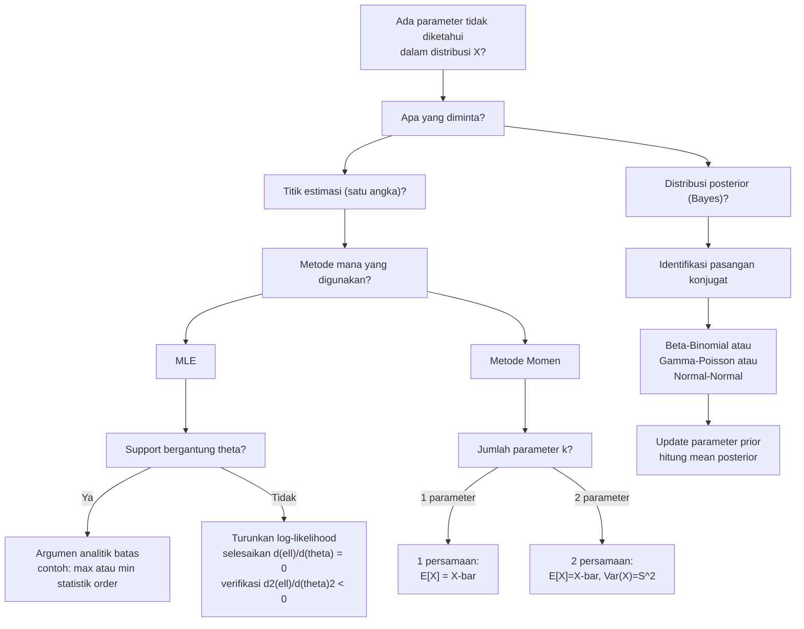

# 📊 4.5 — Estimasi Parameter

> [!ABSTRACT] Ringkasan Cepat
> **Topik:** Estimasi Parameter | **Bobot:** ~20–30% | **Difficulty:** Hard
> **Ref:** Miller et al. (2014) Bab 10.1–10.4; Hogg-McKean-Craig (2019) Bab 6.1–6.3, 7.2 | **Prereq:** [[4.1 Penarikan Sampel Acak]], [[4.2 Distribusi Sampel]], [[2.1 Variabel Acak Diskrit]], [[2.2 Variabel Acak Kontinu]]

## Section 0 — Pemetaan Topik

| Topik CF2 | Sub-topik ID | Skill Diuji | Bobot | Difficulty | Prerequisite | Connected Topics | Referensi |
|-----------|--------------|-------------|-------|------------|--------------|------------------|-----------|
| Topik 4: Inferensi Statistik | 4.5 | Menurunkan estimator momen; menurunkan MLE untuk distribusi diskrit dan kontinu; menghitung estimasi Bayesian (prior konjugat); menentukan dan membandingkan estimator berdasarkan properti tak-bias dan konsistensi | 20–30% | Hard | [[4.1 Penarikan Sampel Acak]], [[4.2 Distribusi Sampel]], [[2.1 Variabel Acak Diskrit]], [[2.2 Variabel Acak Kontinu]], [[2.3 Fungsi Pembangkit]] | [[4.6 Sifat-Sifat Estimator]], [[4.7 Selang Kepercayaan]], [[4.8 Uji Hipotesis]], [[3.3 Distribusi Bersyarat (Conditional Distribution)]] | Miller et al. (2014) Bab 10.1–10.4; Hogg-McKean-Craig (2019) Bab 6.1–6.3, 7.2; Hogg-Tanis-Zimm (2015) Bab 5.5–5.6 |

## Section 1 — Intuisi

Bayangkan seorang aktuaris yang harus menetapkan premi asuransi jiwa untuk kelompok nasabah baru. Dia tahu bahwa kematian di kelompok ini mengikuti distribusi eksponensial dengan laju $\lambda$ — namun nilai $\lambda$ yang sebenarnya tidak diketahui. Yang dia miliki hanyalah data historis: umur tujuh puluh nasabah yang telah meninggal. Tugasnya adalah menggunakan data tersebut untuk "menebak" nilai $\lambda$ yang paling masuk akal — dan inilah inti dari **estimasi parameter**: menggunakan sampel yang teramati untuk menarik kesimpulan tentang parameter populasi yang tidak diketahui.

Ada tiga pendekatan utama yang diuji di CF2. **Metode momen** adalah pendekatan paling intuitif: samakan momen-momen teoritis distribusi (yang bergantung pada parameter tak diketahui) dengan momen-momen sampel (yang bisa dihitung langsung dari data), lalu selesaikan sistem persamaan tersebut untuk mendapatkan estimasi. **Maximum Likelihood Estimation (MLE)** mengajukan pertanyaan berbeda: "Nilai parameter mana yang membuat data yang kita amati *paling mungkin* terjadi?" MLE mencari parameter yang memaksimalkan fungsi likelihood — yakni probabilitas (atau densitas) bersama dari seluruh data sebagai fungsi dari parameter. Di antara keduanya, MLE umumnya dianggap lebih unggul karena memiliki sifat-sifat statistik yang baik secara asimtotik.

**Estimasi Bayesian** mengambil perspektif yang berbeda secara filosofis: parameter $\theta$ bukan dianggap sebagai konstanta tetap yang tidak diketahui, melainkan sebagai variabel acak yang memiliki distribusi prior sebelum data diamati. Setelah data masuk, kita memperbarui keyakinan tentang $\theta$ menggunakan Teorema Bayes untuk mendapatkan distribusi posterior. Estimasi Bayesian sangat relevan untuk aktuaria ketika ada informasi sebelumnya tentang parameter — misalnya data industri tentang frekuensi klaim yang dapat digunakan sebagai prior sebelum menganalisis portofolio nasabah baru.

## Section 2 — Definisi Formal

> [!NOTE] Definisi Matematis
>
> Misalkan $X_1, X_2, \ldots, X_n$ adalah sampel acak dari distribusi dengan PDF/PMF $f(x; \theta)$, di mana $\theta \in \Theta$ adalah parameter yang tidak diketahui.
>
> **Fungsi Likelihood:**
> $$
> L(\theta) = L(\theta; x_1, \ldots, x_n) = \prod_{i=1}^{n} f(x_i; \theta)
> $$
>
> **Log-Likelihood:**
> $$
> \ell(\theta) = \ln L(\theta) = \sum_{i=1}^{n} \ln f(x_i; \theta)
> $$
>
> **MLE:** Nilai $\hat{\theta}_{\text{MLE}}$ yang memaksimalkan $L(\theta)$ (ekivalen: memaksimalkan $\ell(\theta)$):
> $$
> \hat{\theta}_{\text{MLE}} = \arg\max_{\theta \in \Theta} L(\theta)
> $$
>
> **Estimator Momen ke-$k$:** Diperoleh dengan memecahkan sistem $\mu_k' = m_k'$, di mana:
> $$
> \mu_k' = E[X^k] \quad \text{(momen teoritis ke-}k\text{)} \qquad m_k' = \frac{1}{n}\sum_{i=1}^{n} X_i^k \quad \text{(momen sampel ke-}k\text{)}
> $$
>
> **Distribusi Posterior (Bayes):**
> $$
> \pi(\theta \mid \mathbf{x}) = \frac{f(\mathbf{x} \mid \theta)\, \pi(\theta)}{f(\mathbf{x})} \propto f(\mathbf{x} \mid \theta)\, \pi(\theta)
> $$

### Variabel & Parameter

| Simbol | Makna | Catatan |
|--------|-------|---------|
| $\theta$ | Parameter populasi yang tidak diketahui | Skalar atau vektor $\boldsymbol{\theta} = (\theta_1, \ldots, \theta_k)$ |
| $\hat{\theta}$ | Estimator (fungsi dari sampel) atau estimasi (nilai numeriknya) | Estimator adalah variabel acak; estimasi adalah angka |
| $X_1, \ldots, X_n$ | Sampel acak berukuran $n$ (variabel acak) | iid dari $f(x;\theta)$ |
| $x_1, \ldots, x_n$ | Nilai observasi sampel (realisasi) | Konstanta setelah diamati |
| $L(\theta)$ | Fungsi likelihood | Fungsi $\theta$, bukan fungsi $x$ |
| $\ell(\theta)$ | Log-likelihood: $\ln L(\theta)$ | Lebih mudah dimaksimalkan; $\ln$ monoton sehingga argmax sama |
| $\mu_k'$ | Momen teoritis ke-$k$ tentang nol: $E[X^k]$ | Bergantung pada $\theta$ |
| $m_k'$ | Momen sampel ke-$k$: $\frac{1}{n}\sum X_i^k$ | Statistik, tidak bergantung pada $\theta$ |
| $\pi(\theta)$ | Distribusi prior atas $\theta$ (Bayes) | Merepresentasikan keyakinan sebelum melihat data |
| $\pi(\theta \mid \mathbf{x})$ | Distribusi posterior atas $\theta$ (Bayes) | Distribusi $\theta$ setelah melihat data |
| $\hat{\theta}_{\text{Bayes}}$ | Estimator Bayes | Mean, median, atau modus dari distribusi posterior |
| $\Theta$ | Ruang parameter | Domain valid untuk $\theta$ |
| $\bar{X}$ | Mean sampel: $\frac{1}{n}\sum_{i=1}^n X_i$ | Momen sampel pertama $m_1'$ |
| $S^2$ | Variansi sampel: $\frac{1}{n-1}\sum(X_i - \bar{X})^2$ | Estimator tak-bias untuk $\sigma^2$ |

### Rumus Utama

$$
L(\theta) = \prod_{i=1}^{n} f(x_i; \theta)
$$
**Label: Fungsi Likelihood** — produk dari semua PDF/PMF individual karena $X_i$ diasumsikan iid; ini mengukur seberapa "compatible" parameter $\theta$ dengan data yang diamati.

$$
\frac{\partial \ell(\theta)}{\partial \theta} = 0
$$
**Label: Persamaan Likelihood (Likelihood Equation)** — syarat perlu untuk MLE interior; wajib diverifikasi bahwa titik kritis ini memang maksimum (bukan minimum atau saddle point) melalui syarat cukup $\frac{\partial^2 \ell}{\partial \theta^2} < 0$.

$$
\hat{\theta}_{\text{MOM}} \text{ dari } E[X] = \bar{X} \quad \Longrightarrow \quad \mu_1'(\hat{\theta}) = m_1'
$$
**Label: Metode Momen Orde Pertama** — persamaan tunggal untuk distribusi berparameter satu; untuk distribusi berparameter dua, diperlukan sistem dua persamaan menggunakan $\mu_1' = m_1'$ dan $\mu_2' = m_2'$.

$$
\pi(\theta \mid \mathbf{x}) \propto L(\theta \mid \mathbf{x}) \cdot \pi(\theta)
$$
**Label: Teorema Bayes untuk Estimasi** — posterior proporsional terhadap likelihood dikali prior; konstanta normalisasi $f(\mathbf{x})$ tidak bergantung pada $\theta$ sehingga sering diabaikan saat menentukan bentuk posterior.

$$
\hat{\theta}_{\text{Bayes, mean}} = E[\theta \mid \mathbf{x}] = \int \theta \cdot \pi(\theta \mid \mathbf{x}) \, d\theta
$$
**Label: Estimator Bayes Mean Posterior** — estimasi Bayes yang meminimalkan *expected squared error loss*; yang paling sering diuji di CF2.

### Asumsi Eksplisit

- **iid:** Observasi $X_1, \ldots, X_n$ diasumsikan *independent and identically distributed* (iid) dari $f(x;\theta)$.
- **Identifiabilitas:** Untuk MLE valid, distribusi harus *identifiable*: $f(x;\theta_1) = f(x;\theta_2)$ untuk semua $x$ jika dan hanya jika $\theta_1 = \theta_2$.
- **Regularitas:** Persamaan likelihood $\partial \ell / \partial \theta = 0$ mengasumsikan support $f(x;\theta)$ tidak bergantung pada $\theta$ (kondisi regularitas). Jika support bergantung pada $\theta$ (seperti $U(0,\theta)$), MLE dicari melalui argumen batas, bukan kalkulus.
- **Existensi momen:** Untuk metode momen, $E[X^k]$ harus terdefinisi untuk $k$ yang diperlukan.
- **Prior informatif (Bayes):** Pilihan prior $\pi(\theta)$ mempengaruhi posterior; prior konjugat dipilih agar bentuk posterior memiliki bentuk distribusi yang dikenal.

## Section 3 — Jembatan Logika

> [!TIP] Dari Definisi ke Rumus
> **Mengapa produk dalam $L(\theta)$?** Karena $X_i$ iid, probabilitas bersama dari seluruh sampel adalah produk dari probabilitas individual: $P(X_1 = x_1, \ldots, X_n = x_n) = \prod P(X_i = x_i) = \prod f(x_i; \theta)$. Kita *membalik perspektif*: anggap data $x_1, \ldots, x_n$ sudah tetap, dan $\theta$ sebagai variabel. Maka $L(\theta)$ mengukur seberapa besar peluang data ini "terbangkitkan" oleh nilai $\theta$ tertentu — kita cari $\theta$ yang memberikan nilai terbesar.
>
> **Mengapa log-likelihood?** Karena $\ln$ adalah fungsi monoton meningkat, argmax dari $L$ dan $\ell = \ln L$ identik. Namun $\ell = \sum \ln f(x_i; \theta)$ jauh lebih mudah didiferensialkan daripada produk — ini adalah justifikasi teknis utama transformasi ke log.
>
> **Mengapa metode momen?** Intuisinya sederhana: jika model yang benar, momen sampel $m_k' = \frac{1}{n}\sum X_i^k$ akan konvergen ke momen teoritis $\mu_k' = E[X^k]$ (Hukum Bilangan Besar, lihat [[4.4 Hukum Bilangan Besar (LLN)]]). Maka menyamakannya dan memecahkan untuk $\theta$ adalah pendekatan yang konsisten.

> [!IMPORTANT] Support dan Domain
> - MLE **dengan kalkulus** hanya valid jika support $f(x;\theta)$ tidak bergantung pada $\theta$. Contoh yang valid: Poisson, Normal, Eksponensial. Contoh pengecualian: $U(0,\theta)$ di mana support $[0,\theta]$ bergantung pada $\theta$ — MLE adalah $X_{(n)} = \max(X_1, \ldots, X_n)$, diperoleh dari argumen bahwa $L(\theta) = 1/\theta^n$ untuk $\theta \geq X_{(n)}$ dan nol untuk $\theta < X_{(n)}$.
> - Ruang parameter $\Theta$ bisa memiliki batasan yang membuat MLE berada di batas (boundary solution), bukan di titik stasioner interior.

**Derivasi MLE untuk Distribusi Bernoulli:**

Misalkan $X_1, \ldots, X_n \overset{\text{iid}}{\sim} \text{Bernoulli}(p)$, dengan $P(X_i = x_i) = p^{x_i}(1-p)^{1-x_i}$.

Fungsi likelihood:
$$
L(p) = \prod_{i=1}^{n} p^{x_i}(1-p)^{1-x_i} = p^{\sum x_i}(1-p)^{n - \sum x_i}
$$

Log-likelihood:
$$
\ell(p) = \left(\sum_{i=1}^n x_i\right) \ln p + \left(n - \sum_{i=1}^n x_i\right) \ln(1-p)
$$

Turunkan terhadap $p$ dan samakan nol:
$$
\frac{\partial \ell}{\partial p} = \frac{\sum x_i}{p} - \frac{n - \sum x_i}{1-p} = 0
$$

Kalikan kedua ruas dengan $p(1-p)$:
$$
(1-p)\sum x_i = p\left(n - \sum x_i\right)
$$
$$
\sum x_i - p \sum x_i = pn - p \sum x_i
$$
$$
\sum x_i = pn \implies \hat{p}_{\text{MLE}} = \frac{\sum_{i=1}^n x_i}{n} = \bar{x}
$$

Verifikasi maksimum: $\frac{\partial^2 \ell}{\partial p^2} = -\frac{\sum x_i}{p^2} - \frac{n - \sum x_i}{(1-p)^2} < 0$ ✓

**Derivasi Estimator Momen untuk Distribusi Gamma $\Gamma(\alpha, \beta)$:**

Untuk $X \sim \Gamma(\alpha, \beta)$ dengan $E[X] = \alpha\beta$ dan $\text{Var}(X) = \alpha\beta^2$:

Sistem dua persamaan (dua parameter):
$$
\mu_1' = \alpha\beta = \bar{X} = m_1'
$$
$$
\mu_2' = \text{Var}(X) + (E[X])^2 = \alpha\beta^2 + \alpha^2\beta^2 = m_2'
$$

Atau lebih praktis, gunakan $\text{Var}(X) \approx S^2$ (variansi sampel):
$$
\hat{\alpha}\hat{\beta} = \bar{X}, \qquad \hat{\alpha}\hat{\beta}^2 = S^2
$$

Dari persamaan kedua dibagi pertama: $\hat{\beta} = S^2/\bar{X}$. Substitusi ke pertama: $\hat{\alpha} = \bar{X}^2/S^2$.

**Estimasi Bayes dengan Prior Konjugat Beta-Binomial:**

Misalkan $X \mid p \sim B(n, p)$ (Binomial) dan $p \sim \text{Beta}(\alpha, \beta)$ (prior). Posterior:
$$
\pi(p \mid x) \propto p^x(1-p)^{n-x} \cdot p^{\alpha-1}(1-p)^{\beta-1} = p^{(x+\alpha)-1}(1-p)^{(n-x+\beta)-1}
$$

Ini adalah kernel distribusi $\text{Beta}(x+\alpha, n-x+\beta)$, sehingga:
$$
p \mid x \sim \text{Beta}(x + \alpha, n - x + \beta)
$$

Estimator Bayes (mean posterior):
$$
\hat{p}_{\text{Bayes}} = \frac{x + \alpha}{n + \alpha + \beta}
$$

> [!DANGER] Dilarang
> 1. **Dilarang** menggunakan persamaan likelihood $\partial \ell / \partial \theta = 0$ untuk distribusi di mana support bergantung pada $\theta$ (seperti $U(0,\theta)$, $U(\theta, 1)$, atau distribusi dengan $\theta$ sebagai batas support) — dalam kasus ini $L(\theta)$ tidak dua kali differensiable di titik kritis; MLE harus dicari melalui argumen analitik batas.
> 2. **Dilarang** mengidentifikasi estimator momen dengan MLE tanpa memverifikasinya — keduanya umumnya berbeda, kecuali untuk distribusi tertentu (seperti Normal). Klaim kesamaan harus dibuktikan.
> 3. **Dilarang** menyimpulkan bahwa posterior $\pi(\theta \mid \mathbf{x})$ sudah ternormalisasi dari $\pi(\theta \mid \mathbf{x}) \propto L(\theta) \cdot \pi(\theta)$ — tanda $\propto$ artinya belum ternormalisasi; untuk mendapat mean posterior, harus mengidentifikasi bentuk distribusi yang dikenal atau menghitung integral normalisasi.

## Section 4 — Contoh Soal

### Soal A — Fundamental

Sebuah perusahaan asuransi mengamati bahwa jumlah klaim harian $X$ mengikuti distribusi Poisson dengan parameter $\lambda$ yang tidak diketahui. Dalam sampel acak selama 5 hari, dicatat jumlah klaim: $x_1 = 3$, $x_2 = 1$, $x_3 = 4$, $x_4 = 2$, $x_5 = 0$. (a) Tuliskan fungsi likelihood $L(\lambda)$ dan log-likelihood $\ell(\lambda)$. (b) Tentukan MLE dari $\lambda$. (c) Tentukan juga estimator momen dari $\lambda$ dan bandingkan hasilnya dengan MLE.

> [!SUCCESS] Solusi Soal A
>
> **1. Identifikasi Variabel**
> - Variabel acak: $X_i \overset{\text{iid}}{\sim} \text{Poisson}(\lambda)$, dengan PMF $f(x;\lambda) = \frac{e^{-\lambda}\lambda^x}{x!}$ untuk $x = 0, 1, 2, \ldots$
> - Data observasi: $x_1 = 3, x_2 = 1, x_3 = 4, x_4 = 2, x_5 = 0$; $n = 5$
> - $\sum_{i=1}^5 x_i = 3 + 1 + 4 + 2 + 0 = 10$; $\bar{x} = 10/5 = 2$
>
> **2. Identifikasi Distribusi / Model**
> - $X_i \sim \text{Poisson}(\lambda)$: tipe diskrit, support $\{0, 1, 2, \ldots\}$, parameter $\lambda > 0$
> - Support tidak bergantung pada $\lambda$, sehingga MLE dapat diturunkan via kalkulus ✓
>
> **3. Setup Persamaan**
>
> $$
> L(\lambda) = \prod_{i=1}^{5} \frac{e^{-\lambda}\lambda^{x_i}}{x_i!}
> $$
>
> $$
> \ell(\lambda) = \sum_{i=1}^5 \left(-\lambda + x_i \ln \lambda - \ln x_i!\right)
> $$
>
> $$
> \frac{d\ell}{d\lambda} = 0
> $$
>
> **4. Eksekusi Aljabar**
>
> **(a) Likelihood dan log-likelihood:**
> $$
> L(\lambda) = \prod_{i=1}^{5} \frac{e^{-\lambda}\lambda^{x_i}}{x_i!} = \frac{e^{-5\lambda}\,\lambda^{\sum x_i}}{\prod x_i!} = \frac{e^{-5\lambda}\,\lambda^{10}}{3!\,1!\,4!\,2!\,0!}
> $$
>
> $$
> \ell(\lambda) = -5\lambda + 10 \ln \lambda - \ln(3!) - \ln(1!) - \ln(4!) - \ln(2!) - \ln(0!)
> $$
>
> (suku-suku $-\ln x_i!$ adalah konstanta tidak bergantung pada $\lambda$, sehingga tidak mempengaruhi maksimisasi)
>
> **(b) MLE dari $\lambda$:**
> $$
> \frac{d\ell}{d\lambda} = -5 + \frac{10}{\lambda} = 0 \implies \hat{\lambda}_{\text{MLE}} = \frac{10}{5} = 2
> $$
>
> Verifikasi maksimum:
> $$
> \frac{d^2\ell}{d\lambda^2} = -\frac{10}{\lambda^2} \bigg|_{\lambda=2} = -\frac{10}{4} = -2.5 < 0 \quad \checkmark
> $$
>
> **(c) Estimator momen:**
>
> Untuk $X \sim \text{Poisson}(\lambda)$, $E[X] = \lambda = \mu_1'$.
>
> Menyamakan dengan momen sampel pertama:
> $$
> \hat{\lambda}_{\text{MOM}} = m_1' = \bar{x} = \frac{\sum x_i}{n} = \frac{10}{5} = 2
> $$
>
> **Perbandingan:** Untuk distribusi Poisson, $\hat{\lambda}_{\text{MLE}} = \hat{\lambda}_{\text{MOM}} = \bar{X}$. Ini bukan kebetulan — keduanya menghasilkan persamaan yang ekivalen karena $E[X] = \lambda$ dan $L$ hanya bergantung pada $\sum x_i$.
>
> **5. Verification**
> - $\hat{\lambda} = 2 > 0$: berada dalam ruang parameter $\Theta = (0, \infty)$ ✓
> - Masuk akal: rata-rata klaim diamati adalah 2 klaim/hari, dan estimasi $\lambda = 2$ ✓
> - Syarat cukup maksimum ($d^2\ell/d\lambda^2 < 0$) terpenuhi ✓

> [!WARNING] Exam Tips — Soal A
> - **Target waktu:** 5–6 menit
> - **Common trap:** Lupa membuang konstanta $-\ln x_i!$ dari log-likelihood sebelum diferensiasi — konstanta tersebut tidak mempengaruhi argmax, tetapi bisa menyebabkan kesalahan aljabar jika tetap disertakan. Untuk efisiensi exam, langsung tulis $\ell(\lambda) \propto -n\lambda + (\sum x_i)\ln\lambda$ saja.
> - **Shortcut Poisson:** Untuk $X_i \overset{\text{iid}}{\sim}\text{Poisson}(\lambda)$, MLE *selalu* $\hat{\lambda} = \bar{X}$. Hafalkan hasil ini dan cukup tunjukkan persamaan likelihood untuk justifikasi.

---

### Soal B — Exam-Typical

Misalkan $X_1, X_2, \ldots, X_n$ adalah sampel acak dari distribusi Gamma $\Gamma(\alpha, \beta)$ dengan PDF:
$$
f(x;\alpha,\beta) = \frac{1}{\Gamma(\alpha)\beta^\alpha} x^{\alpha-1} e^{-x/\beta}, \quad x > 0
$$
di mana $\alpha > 0$ (parameter bentuk) dan $\beta > 0$ (parameter skala). Diketahui bahwa $E[X] = \alpha\beta$ dan $\text{Var}(X) = \alpha\beta^2$. Dengan $n = 4$ observasi: $x_1 = 6, x_2 = 3, x_3 = 9, x_4 = 6$:

(a) Tentukan estimator momen $\hat{\alpha}$ dan $\hat{\beta}$ dalam bentuk $\bar{X}$ dan $S^2$.
(b) Hitung nilai numerik $\hat{\alpha}$ dan $\hat{\beta}$ untuk sampel di atas.
(c) Turunkan MLE untuk kasus khusus $\alpha = 2$ diketahui (hanya $\beta$ yang tidak diketahui).

> [!SUCCESS] Solusi Soal B
>
> **1. Identifikasi Variabel**
> - $X_i \overset{\text{iid}}{\sim} \Gamma(\alpha, \beta)$: tipe kontinu, support $(0, \infty)$, dua parameter $(\alpha, \beta)$
> - $n = 4$; observasi: $6, 3, 9, 6$
> - $\bar{x} = (6+3+9+6)/4 = 24/4 = 6$
> - $S^2 = \frac{1}{n-1}\sum(x_i - \bar{x})^2 = \frac{1}{3}\left[(0)^2+(-3)^2+(3)^2+(0)^2\right] = \frac{18}{3} = 6$
>
> **2. Identifikasi Distribusi / Model**
> - Distribusi Gamma dua parameter; metode momen membutuhkan dua persamaan
> - Untuk bagian (c): dengan $\alpha = 2$ diketahui, hanya satu parameter $\beta$ yang dicari via MLE
>
> **3. Setup Persamaan**
>
> Untuk metode momen (dua persamaan):
> $$
> \mu_1' = \alpha\beta = \bar{X}
> $$
> $$
> \mu_2 = \alpha\beta^2 = S^2 \quad \text{(menggunakan variansi sampel sebagai aproksimasi variansi teoritis)}
> $$
>
> Untuk MLE dengan $\alpha = 2$, log-likelihood:
> $$
> \ell(\beta) = \sum_{i=1}^n \left[-\ln\Gamma(2) - 2\ln\beta + \ln x_i - \frac{x_i}{\beta}\right]
> $$
>
> **4. Eksekusi Aljabar**
>
> **(a) Estimator momen dalam $\bar{X}$ dan $S^2$:**
>
> Dari sistem:
> $$
> \hat{\alpha}\hat{\beta} = \bar{X} \quad \cdots (i)
> $$
> $$
> \hat{\alpha}\hat{\beta}^2 = S^2 \quad \cdots (ii)
> $$
>
> Bagi $(ii)$ dengan $(i)$:
> $$
> \hat{\beta} = \frac{S^2}{\bar{X}}
> $$
>
> Substitusi ke $(i)$:
> $$
> \hat{\alpha} = \frac{\bar{X}}{\hat{\beta}} = \frac{\bar{X}^2}{S^2}
> $$
>
> **(b) Nilai numerik:**
> $$
> \hat{\beta}_{\text{MOM}} = \frac{S^2}{\bar{X}} = \frac{6}{6} = 1
> $$
> $$
> \hat{\alpha}_{\text{MOM}} = \frac{\bar{X}^2}{S^2} = \frac{36}{6} = 6
> $$
>
> **(c) MLE untuk $\beta$ dengan $\alpha = 2$:**
>
> Gunakan $\Gamma(2) = 1! = 1$, sehingga $\ln\Gamma(2) = 0$:
>
> $$
> \ell(\beta) = n(-2\ln\beta) + \sum_{i=1}^n \ln x_i - \frac{1}{\beta}\sum_{i=1}^n x_i
> $$
>
> (konstanta $\sum \ln x_i$ diabaikan untuk diferensiasi)
>
> $$
> \frac{d\ell}{d\beta} = \frac{-2n}{\beta} + \frac{\sum x_i}{\beta^2} = 0
> $$
>
> Kalikan dengan $\beta^2/n$:
> $$
> -2\beta + \frac{\sum x_i}{n} = 0 \implies \hat{\beta}_{\text{MLE}} = \frac{\bar{x}}{2} = \frac{6}{2} = 3
> $$
>
> Verifikasi: $\frac{d^2\ell}{d\beta^2} = \frac{2n}{\beta^2} - \frac{2\sum x_i}{\beta^3} = \frac{2n}{\beta^2}\left(1 - \frac{\bar{x}}{\beta}\right)\bigg|_{\hat{\beta}=3} = \frac{2\cdot4}{9}\left(1-2\right) = -\frac{8}{9} < 0$ ✓
>
> **5. Verification**
> - $\hat{\alpha} = 6 > 0$, $\hat{\beta} = 1 > 0$: kedua estimator berada dalam $\Theta$ ✓
> - Untuk bagian (c): dengan $\alpha = 2$, rumus umum MLE Gamma memberikan $\hat{\beta} = \bar{x}/\alpha = 6/2 = 3$ ✓ (konsisten)
> - Perhatikan $\hat{\beta}_{\text{MLE}} = 3 \neq \hat{\beta}_{\text{MOM}} = 1$: ini menunjukkan MLE dan MOM umumnya berbeda

> [!WARNING] Exam Tips — Soal B
> - **Target waktu:** 10–12 menit
> - **Common trap 1 — Parametrisasi Gamma:** Beberapa referensi menggunakan parametrisasi *rate* $\lambda = 1/\beta$ (bukan skala $\beta$), sehingga $E[X] = \alpha/\lambda$. Periksa selalu parametrisasi yang digunakan soal sebelum menghafal rumus.
> - **Common trap 2 — Variansi sampel:** Metode momen teoritis sebenarnya menyamakan momen populasi dengan momen sampel mentah $m_2' = \frac{1}{n}\sum x_i^2$, bukan $S^2$. Menggunakan $S^2 \approx \hat{\sigma}^2$ adalah aproksimasi yang diterima di CF2 karena menghasilkan estimator yang sama secara asimtotik, tetapi ketahui perbedaan konseptualnya.
> - **Shortcut Gamma:** Untuk $\Gamma(\alpha, \beta)$ dengan $\alpha$ diketahui, MLE selalu $\hat{\beta} = \bar{X}/\alpha$.

---

### Soal C — Challenging

Suatu aktuaris memodelkan frekuensi klaim dengan $X \mid \theta \sim \text{Poisson}(\theta)$. Berdasarkan data industri, aktuaris menggunakan prior $\theta \sim \text{Gamma}(\alpha_0, \beta_0)$ dengan $\alpha_0 = 4$ dan $\beta_0 = 2$ (menggunakan parametrisasi skala sehingga $E[\theta] = \alpha_0\beta_0 = 8$).

Dari portofolio baru, diamati klaim dalam $n = 5$ periode: $x_1 = 3, x_2 = 7, x_3 = 5, x_4 = 6, x_5 = 4$, sehingga $\sum x_i = 25$.

(a) Tentukan distribusi posterior $\theta \mid \mathbf{x}$ dengan menunjukkan bahwa prior Gamma adalah konjugat untuk likelihood Poisson. (b) Hitung estimator Bayes $\hat{\theta}_{\text{Bayes}}$ (mean posterior). (c) Bandingkan dengan MLE $\hat{\theta}_{\text{MLE}}$ dan tunjukkan bahwa estimator Bayes dapat ditulis sebagai rata-rata tertimbang antara mean prior dan $\bar{X}$. (d) Jika ukuran sampel $n \to \infty$, apa yang terjadi pada estimator Bayes?

> [!SUCCESS] Solusi Soal C
>
> **1. Identifikasi Variabel**
> - Model: $X_i \mid \theta \overset{\text{iid}}{\sim} \text{Poisson}(\theta)$, $\theta > 0$
> - Prior: $\theta \sim \Gamma(\alpha_0, \beta_0) = \Gamma(4, 2)$ dengan PDF $\pi(\theta) \propto \theta^{\alpha_0 - 1}e^{-\theta/\beta_0}$
> - Data: $n = 5$, $\sum x_i = 25$, $\bar{x} = 5$
> - MLE dari Poisson: $\hat{\theta}_{\text{MLE}} = \bar{x} = 5$
>
> **2. Identifikasi Distribusi / Model**
> - Prior Gamma + Likelihood Poisson → Posterior Gamma (pasangan konjugat)
> - Tujuan: identifikasi kernel posterior sebagai distribusi yang dikenal
>
> **3. Setup Persamaan**
>
> $$
> \pi(\theta \mid \mathbf{x}) \propto L(\theta \mid \mathbf{x}) \cdot \pi(\theta)
> $$
>
> $$
> = \left[\prod_{i=1}^n \frac{e^{-\theta}\theta^{x_i}}{x_i!}\right] \cdot \theta^{\alpha_0 - 1}e^{-\theta/\beta_0}
> $$
>
> **4. Eksekusi Aljabar**
>
> **(a) Distribusi posterior:**
>
> Kumpulkan semua faktor yang bergantung pada $\theta$:
> $$
> \pi(\theta \mid \mathbf{x}) \propto e^{-n\theta}\,\theta^{\sum x_i} \cdot \theta^{\alpha_0-1}\,e^{-\theta/\beta_0}
> $$
> $$
> = \theta^{(\alpha_0 + \sum x_i) - 1} \cdot e^{-\theta\left(n + 1/\beta_0\right)}
> $$
>
> Ini adalah kernel distribusi Gamma dengan:
> - Parameter bentuk: $\alpha_n = \alpha_0 + \sum x_i = 4 + 25 = 29$
> - Parameter laju: $1/\beta_n = n + 1/\beta_0 = 5 + 1/2 = 11/2$, sehingga parameter skala $\beta_n = 2/11$
>
> Jadi: $\theta \mid \mathbf{x} \sim \Gamma\!\left(29,\, \dfrac{2}{11}\right)$
>
> **(b) Estimator Bayes (mean posterior):**
> $$
> \hat{\theta}_{\text{Bayes}} = E[\theta \mid \mathbf{x}] = \alpha_n \cdot \beta_n = 29 \cdot \frac{2}{11} = \frac{58}{11} \approx 5.273
> $$
>
> **(c) Representasi rata-rata tertimbang:**
>
> Mean prior: $E[\theta] = \alpha_0\beta_0 = 4 \cdot 2 = 8$
>
> MLE: $\hat{\theta}_{\text{MLE}} = \bar{x} = 5$
>
> Tuliskan mean posterior:
> $$
> \hat{\theta}_{\text{Bayes}} = \alpha_n\beta_n = \frac{\alpha_0 + \sum x_i}{n + 1/\beta_0}
> $$
>
> Bagi pembilang dan penyebut:
> $$
> = \frac{\frac{\alpha_0}{1/\beta_0} \cdot \frac{1/\beta_0}{n + 1/\beta_0} + \bar{x} \cdot \frac{n}{n + 1/\beta_0}}{1}
> $$
>
> Definisikan bobot $w = \dfrac{n}{n + 1/\beta_0}$. Maka:
> $$
> \hat{\theta}_{\text{Bayes}} = (1-w)\cdot E[\theta] + w\cdot\bar{X}
> $$
>
> Dengan data ini: $w = \dfrac{5}{5 + 0.5} = \dfrac{5}{5.5} = \dfrac{10}{11}$
>
> Verifikasi:
> $$
> \left(1 - \frac{10}{11}\right)\cdot 8 + \frac{10}{11}\cdot 5 = \frac{1}{11}\cdot 8 + \frac{10}{11}\cdot 5 = \frac{8 + 50}{11} = \frac{58}{11} \approx 5.273 \quad \checkmark
> $$
>
> **(d) Perilaku asimtotik $n \to \infty$:**
>
> Ketika $n \to \infty$:
> $$
> w = \frac{n}{n + 1/\beta_0} \to 1
> $$
>
> Sehingga:
> $$
> \hat{\theta}_{\text{Bayes}} \to (1-1)\cdot E[\theta] + 1 \cdot \bar{X} = \bar{X} = \hat{\theta}_{\text{MLE}}
> $$
>
> **Interpretasi:** Dengan semakin banyak data, pengaruh prior semakin kecil dan estimator Bayes konvergen ke MLE. Ini adalah properti konsistensi Bayesian.
>
> **5. Verification**
> - $\hat{\theta}_{\text{Bayes}} = 58/11 \approx 5.27$: berada di antara mean prior ($8$) dan MLE ($5$), mengkonfirmasi sifat "kompromi" ✓
> - Karena $n = 5$ cukup besar relatif terhadap informasi prior, estimasi lebih dekat ke MLE (5) daripada mean prior (8) ✓
> - $\hat{\theta}_{\text{Bayes}} > \hat{\theta}_{\text{MLE}} = 5$: prior menarik estimasi ke atas menuju mean prior 8 ✓

> [!WARNING] Exam Tips — Soal C
> - **Target waktu:** 15–18 menit
> - **Common trap 1 — Parametrisasi Gamma posterior:** Pastikan parameter $\beta_n$ adalah parameter *skala* (sehingga mean = $\alpha_n\beta_n$), bukan parameter *laju* (mean = $\alpha_n/\lambda_n$). Konfusikan keduanya menyebabkan mean posterior yang salah.
> - **Common trap 2 — Mengabaikan update $\beta$:** Banyak kandidat hanya meng-update $\alpha$ (menambahkan $\sum x_i$) tetapi lupa meng-update $\beta$ menjadi $\beta_n = \beta_0/(1 + n\beta_0)$. Keduanya harus di-update.
> - **Shortcut Gamma-Poisson konjugat:** Untuk $X \mid \theta \sim \text{Poisson}(\theta)$ dan $\theta \sim \Gamma(\alpha_0, \beta_0)$, hasil posterior adalah $\Gamma\!\left(\alpha_0 + \sum x_i,\, \dfrac{\beta_0}{1 + n\beta_0}\right)$. Hafalkan rumus update ini untuk efisiensi exam.

## Section 5 — Verifikasi & Sanity Check

> [!CHECK] Validasi MLE
> 1. **Cek ruang parameter:** $\hat{\theta}_{\text{MLE}} \in \Theta$ (e.g., $\hat{\lambda} > 0$ untuk Poisson, $0 < \hat{p} < 1$ untuk Binomial). Estimasi di luar ruang parameter pasti ada kesalahan aljabar.
> 2. **Cek syarat orde dua:** $\frac{d^2\ell}{d\theta^2}\big|_{\hat{\theta}} < 0$ untuk memastikan titik kritis adalah maksimum. Jika kondisi ini tidak diperiksa, titik kritis bisa jadi minimum.
> 3. **Cek konsistensi dengan data:** MLE dari distribusi yang merupakan rata-rata tertimbang data (seperti $\hat{\mu}_{\text{Normal}} = \bar{x}$, $\hat{\lambda}_{\text{Poisson}} = \bar{x}$, $\hat{p}_{\text{Binom}} = \bar{x}/n$) harus berada dalam rentang data yang diamati.

> [!CHECK] Validasi Metode Momen
> 1. **Jumlah persamaan = jumlah parameter:** Distribusi satu parameter → gunakan $\mu_1' = m_1'$. Distribusi dua parameter → tambahkan $\mu_2' = m_2'$ (atau padanan variansi).
> 2. **Solusi harus dalam ruang parameter:** Jika sistem menghasilkan $\hat{\alpha} < 0$ untuk distribusi Gamma, ada kesalahan dalam menyusun sistem persamaan.
> 3. **Momen sampel adalah statistik:** $m_k' = \frac{1}{n}\sum X_i^k$ — pastikan tidak menggunakan $S^2$ (yang memiliki faktor $1/(n-1)$) sebagai $m_2'$ (yang menggunakan faktor $1/n$) kecuali secara eksplisit disebutkan menggunakan variansi sampel sebagai proxy.

> [!CHECK] Validasi Estimasi Bayes
> 1. **Prior konjugat:** Verifikasi bahwa posterior memiliki bentuk yang sama dengan prior (keluarga distribusi yang sama). Jika tidak, ada kesalahan dalam mengidentifikasi prior konjugat.
> 2. **Estimator Bayes sebagai kompromi:** Mean posterior selalu berada di antara mean prior dan MLE (untuk prior konjugat standar). Hasil di luar rentang ini menandakan kesalahan.
> 3. **Batas asimtotik:** Ketika $n \to \infty$, estimator Bayes harus konvergen ke MLE (data mendominasi prior).

### Metode Alternatif

**MLE vs Metode Momen:** Untuk distribusi Normal $N(\mu, \sigma^2)$ dengan kedua parameter tidak diketahui, keduanya memberikan $\hat{\mu} = \bar{X}$ tetapi berbeda untuk variansi: MLE menghasilkan $\hat{\sigma}^2_{\text{MLE}} = \frac{1}{n}\sum(X_i - \bar{X})^2$ (bias), sedangkan metode momen (menggunakan $\mu_2 = \sigma^2$, yaitu variansi populasi ≈ variansi sampel $S^2$) menghasilkan $\hat{\sigma}^2_{\text{MOM}} = S^2 = \frac{1}{n-1}\sum(X_i-\bar{X})^2$ (tak-bias). Ini salah satu perbedaan paling penting untuk diketahui di CF2.

**Maksimisasi $L$ vs $\ell$:** Secara matematis ekivalen karena $\ln$ monoton. Namun di CF2, hampir selalu lebih mudah menggunakan $\ell$. Pengecualian: distribusi sederhana seperti $U(0,\theta)$ di mana $L(\theta) = 1/\theta^n$ bisa langsung dianalisis tanpa log.

## Section 6 — Visualisasi Mental

**Fungsi Likelihood sebagai "Permukaan Kepercayaan":**

Bayangkan grafik dengan **sumbu horizontal = nilai parameter $\theta$** dan **sumbu vertikal = $L(\theta)$ atau $\ell(\theta)$**. Untuk setiap nilai $\theta$ di sumbu horizontal, tinggi grafik mengukur "seberapa kompatibel" nilai $\theta$ tersebut dengan data yang diamati. Grafik ini memiliki puncak (*peak*) di $\hat{\theta}_{\text{MLE}}$ — titik di mana data paling "mungkin" terjadi jika parameter adalah $\hat{\theta}$.

Bentuk umum log-likelihood untuk distribusi reguler adalah **kurva cembung** (*concave*, membuka ke bawah) dengan puncak tunggal. Semakin "tajam" puncaknya (semakin negatif $\ell''(\hat{\theta})$), semakin presisi estimasi — ini terhubung dengan konsep **Informasi Fisher** $I(\theta) = -E[\ell''(\theta)]$ (lihat [[4.6 Sifat-Sifat Estimator]]).

**Diagram Pembaruan Bayes:**

Bayangkan tiga kurva pada grafik yang sama (sumbu horizontal = $\theta$, sumbu vertikal = densitas/nilai):

- **Kurva kiri yang lebar:** prior $\pi(\theta)$ — merepresentasikan keyakinan sebelum melihat data, biasanya lebih datar/tersebar.
- **Kurva tengah:** likelihood $L(\theta \mid \mathbf{x})$ — bentuknya ditentukan oleh data; semakin banyak data, semakin tajam puncaknya.
- **Kurva kanan yang lebih sempit:** posterior $\pi(\theta \mid \mathbf{x})$ — selalu merupakan "kompromi" antara prior dan likelihood. Puncaknya berada di antara puncak prior dan MLE, dan lebih sempit dari prior (data mengurangi ketidakpastian).

### Hubungan Visual ↔ Rumus

Puncak log-likelihood pada grafik $\ell(\theta)$ berkorespondensi langsung dengan persamaan:

$$
\frac{d\ell}{d\theta}\bigg|_{\hat{\theta}} = 0 \longleftrightarrow \text{titik puncak kurva log-likelihood}
$$

"Ketajaman" puncak (kelengkungan negatif) berkorespondensi dengan:

$$
-\frac{d^2\ell}{d\theta^2}\bigg|_{\hat{\theta}} = I_n(\theta) \longleftrightarrow \text{ukuran informasi dalam sampel tentang } \theta
$$

Posisi posterior sebagai kompromi berkorespondensi dengan rumus rata-rata tertimbang:

$$
\hat{\theta}_{\text{Bayes}} = (1-w)\cdot E_{\text{prior}}[\theta] + w \cdot \hat{\theta}_{\text{MLE}} \longleftrightarrow \text{puncak posterior di antara prior dan likelihood}
$$

## Section 7 — Jebakan Umum

> [!BUG] Kesalahan Parametrisasi
> **Kesalahan 1 — Parametrisasi Gamma (skala vs laju):** Distribusi Gamma memiliki dua konvensi. Parametrisasi *skala*: $E[X] = \alpha\beta$; parametrisasi *laju* ($\lambda = 1/\beta$): $E[X] = \alpha/\lambda$. Menggunakan rumus dari satu konvensi dalam konteks konvensi lain menyebabkan MLE/MOM yang salah. **Salah:** Menulis $\hat{\beta} = \bar{x}/\alpha$ ketika soal menggunakan parametrisasi laju. **Benar:** Periksa apakah soal menggunakan $\beta$ sebagai parameter skala ($E[X]=\alpha\beta$) atau laju ($E[X]=\alpha/\beta$) sebelum menerapkan rumus apapun.
>
> **Kesalahan 2 — Variansi sampel $S^2$ vs momen sampel kedua $m_2'$:** Metode momen formal menggunakan $m_2' = \frac{1}{n}\sum x_i^2$ (momen sampel *mentah* orde dua, bukan variansi). Namun CF2 sering mengijinkan penggunaan $\text{Var}(X) \approx S^2$ untuk menentukan parameter kedua. Konfirmasi mana yang digunakan: dengan $m_2' = \frac{1}{n}\sum x_i^2$, atau dengan $\mu_2 = \text{Var}(X) \approx S^2 = \frac{1}{n-1}\sum(x_i-\bar{x})^2$.

> [!BUG] Kesalahan Konseptual
> 1. **Menggunakan $\partial L/\partial\theta = 0$ alih-alih $\partial\ell/\partial\theta = 0$ untuk distribusi dengan banyak observasi.** Secara matematis ekivalen, tetapi $\partial L/\partial\theta = 0$ untuk produk sangat rawan kesalahan aljabar pada exam. Selalu gunakan log-likelihood.
> 2. **Memperlakukan $L(\theta)$ sebagai PDF atas $\theta$.** Likelihood bukan distribusi probabilitas atas $\theta$; $\int L(\theta)\,d\theta$ tidak harus sama dengan 1. Likelihood hanya mengukur kesesuaian relatif nilai $\theta$ dengan data.
> 3. **Mengabaikan update parameter $\beta$ pada posterior Gamma-Poisson.** Posterior Gamma memiliki *kedua* parameter yang berubah ($\alpha_n = \alpha_0 + \sum x_i$ DAN $\beta_n = \beta_0/(1+n\beta_0)$), bukan hanya $\alpha$.
> 4. **Salah mengidentifikasi syarat cukup maksimum MLE.** Setelah menemukan titik kritis dari $\ell'(\theta) = 0$, wajib memeriksa $\ell''(\hat{\theta}) < 0$. Untuk beberapa distribusi (seperti distribusi campuran), log-likelihood bisa multimodal dan perlu diperiksa semua titik kritis.

> [!BUG] Kesalahan Interpretasi Soal
> - **"Estimasi" vs "Estimator":** "Estimator" adalah fungsi dari sampel (variabel acak); "estimasi" adalah nilai numeriknya (konstanta) setelah data substitusi. Soal yang meminta "estimator" mengharapkan ekspresi dalam $X_1, \ldots, X_n$ atau $\bar{X}$; soal yang meminta "estimasi" mengharapkan angka numerik.
> - **"Prior konjugat" vs "sembarang prior":** Soal dengan kata "konjugat" menginformasikan bahwa posterior memiliki bentuk distribusi yang sama dengan prior — manfaatkan ini untuk langsung menentukan parameter posterior tanpa menghitung integral normalisasi.
> - **"MLE" vs "MAP (Maximum A Posteriori)":** MAP adalah modus dari distribusi posterior, bukan mean posterior. Untuk distribusi simetris (Normal), keduanya sama; untuk distribusi asimetris (Gamma, Beta), keduanya berbeda. Soal yang meminta "estimator Bayes" tanpa kualifikasi biasanya mengacu pada mean posterior (meminimalkan squared error loss).

> [!CAUTION] Red Flags
> - **Support bergantung pada parameter:** Kata kunci seperti "$X \sim U(0, \theta)$" atau "distribusi dengan batas atas $\theta$" → MLE tidak dari $\ell'(\theta) = 0$; gunakan argumen batas/analitik.
> - **Distribusi berparameter banyak:** Jika distribusi memiliki $k$ parameter, metode momen membutuhkan $k$ persamaan ($\mu_1' = m_1', \ldots, \mu_k' = m_k'$) dan MLE membutuhkan sistem $k$ persamaan likelihood.
> - **Kata "prior" atau "posterior" atau "Bayesian":** Langsung identifikasi pasangan konjugat yang relevan (Beta-Binomial, Gamma-Poisson, Normal-Normal) untuk menghemat waktu.
> - **Distribusi Gamma/Beta dalam konteks Bayes:** Periksa apakah distribusi tersebut adalah prior atau model data; konfusikan keduanya adalah kesalahan fatal.
> - **Log-likelihood mengandung $\sum \ln x_i$ untuk data:**  Ini sering muncul untuk distribusi Gamma dan Log-normal; suku ini adalah konstanta terhadap $\theta$ dan tidak mempengaruhi solusi MLE, tetapi pastikan tidak salah menurunkannya.

## Section 8 — Ringkasan Eksekutif

> [!SUMMARY] Must-Remember
> 1. **Fungsi likelihood (iid):**
>    $$
>    L(\theta) = \prod_{i=1}^{n} f(x_i;\theta), \qquad \ell(\theta) = \sum_{i=1}^{n} \ln f(x_i;\theta)
>    $$
> 2. **MLE: selesaikan persamaan likelihood** (jika support tidak bergantung $\theta$):
>    $$
>    \frac{d\ell(\theta)}{d\theta} = 0 \quad \text{dan verifikasi} \quad \frac{d^2\ell}{d\theta^2}\bigg|_{\hat{\theta}} < 0
>    $$
> 3. **Metode momen ($k$ parameter → $k$ persamaan):**
>    $$
>    \mu_1'(\hat{\boldsymbol{\theta}}) = m_1' = \bar{X}, \quad \mu_2'(\hat{\boldsymbol{\theta}}) = m_2' = \frac{1}{n}\sum X_i^2, \quad \ldots
>    $$
> 4. **Posterior Bayes (Teorema Bayes):**
>    $$
>    \pi(\theta \mid \mathbf{x}) \propto L(\theta \mid \mathbf{x}) \cdot \pi(\theta)
>    $$
> 5. **Pasangan konjugat kunci di CF2:**
>    $$
>    \text{Beta}(\alpha,\beta) \,\xrightarrow{\text{data Binom}(n,p)}\, \text{Beta}(\alpha+\sum x_i,\; \beta + n - \sum x_i)
>    $$
>    $$
>    \Gamma(\alpha_0,\beta_0) \,\xrightarrow{\text{data Poisson}(\theta)}\, \Gamma\!\left(\alpha_0+\textstyle\sum x_i,\; \frac{\beta_0}{1+n\beta_0}\right)
>    $$

### Kapan Digunakan

- **Trigger keywords:** "MLE", "maximum likelihood", "estimator", "hitung estimasi", "metode momen", "prior", "posterior", "distribusi parameter", "inferensi", "Bayesian update".
- **Tipe skenario soal:**
  - Diberikan distribusi dan data sampel: tentukan MLE numerik atau dalam bentuk statistik cukup.
  - Diberikan distribusi dua parameter: tentukan pasangan estimator momen $(\hat{\theta}_1, \hat{\theta}_2)$.
  - Diberikan prior konjugat dan data: tentukan posterior, hitung mean/varians posterior sebagai estimasi Bayes.
  - Perbandingan MLE vs estimator momen: tunjukkan apakah keduanya sama atau berbeda.

### Kapan TIDAK Boleh Digunakan

- **Jika soal meminta interval estimasi:** Beralih ke [[4.7 Selang Kepercayaan]], yang membutuhkan distribusi sampling dari estimator, bukan hanya estimasi titik.
- **Jika soal meminta uji hipotesis tentang $\theta$:** Beralih ke [[4.8 Uji Hipotesis]]; estimasi titik adalah prasyarat tetapi bukan tujuan akhir.
- **Jika support bergantung pada $\theta$ DAN kamu tidak tahu prosedur alternatifnya:** Jangan terapkan $\ell'(\theta) = 0$ untuk $U(0,\theta)$, distribusi triangular, atau distribusi dengan batas bergantung $\theta$.

### Quick Decision Tree

---

> [!QUOTE] Follow-up Options
> 1. *"Berikan contoh soal MLE untuk distribusi Normal dengan kedua parameter tidak diketahui"*
> 2. *"Jelaskan hubungan [[4.5 Estimasi Parameter]] dengan [[4.6 Sifat-Sifat Estimator]] (tak-bias, efisiensi, Cramér-Rao)"*
> 3. *"Buat flashcard 1-halaman untuk pasangan prior konjugat yang sering diuji di CF2"*

*📖 Ref: Miller et al. (2014) Bab 10.1–10.4; Hogg-McKean-Craig (2019) Bab 6.1–6.3, 7.2; Hogg-Tanis-Zimm (2015) Bab 5.5–5.6 | 🗓️ 2026-02-21 | #CF2 #Inferensi #EstimasiParameter #MLE #MetodeMomen #Bayes*
