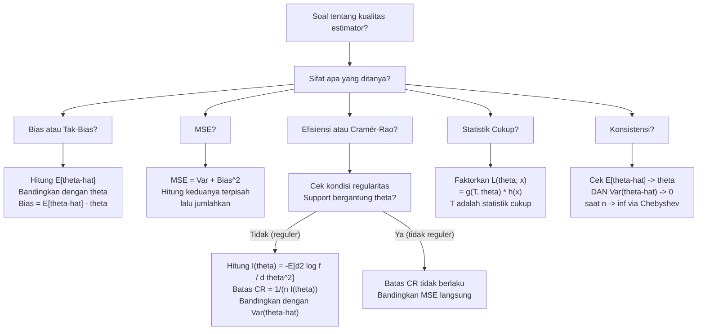

# 📊 4.6 — Sifat-Sifat Estimator

> [!ABSTRACT] Ringkasan Cepat
> **Topik:** Sifat-Sifat Estimator | **Bobot:** ~20–30% | **Difficulty:** Hard
> **Ref:** Miller et al. (2014) Bab 10.1–10.4; Hogg-McKean-Craig (2019) Bab 6.1–6.3, 7.1–7.3 | **Prereq:** [[4.5 Estimasi Parameter]], [[4.2 Distribusi Sampel]], [[2.1 Variabel Acak Diskrit]], [[2.2 Variabel Acak Kontinu]]

## Section 0 — Pemetaan Topik

| Topik CF2 | Sub-topik ID | Skill Diuji | Bobot | Difficulty | Prerequisite | Connected Topics | Referensi |
|-----------|--------------|-------------|-------|------------|--------------|------------------|-----------|
| Topik 4: Inferensi Statistik | 4.6 | Menentukan bias dan MSE estimator; membuktikan/menyangkal tak-bias; menghitung Informasi Fisher dan batas Cramér-Rao; membandingkan efisiensi dua estimator; menentukan konsistensi estimator; mengidentifikasi statistik cukup via faktorisasi | 20–30% | Hard | [[4.5 Estimasi Parameter]], [[4.2 Distribusi Sampel]], [[4.1 Penarikan Sampel Acak]] | [[4.7 Selang Kepercayaan]], [[4.8 Uji Hipotesis]], [[2.3 Fungsi Pembangkit]] | Miller et al. (2014) Bab 10.1–10.4; Hogg-McKean-Craig (2019) Bab 6.1–6.3, 7.1–7.3; Hogg-Tanis-Zimm (2015) Bab 5.5–5.6 |

## Section 1 — Intuisi

Bayangkan dua aktuaris yang masing-masing menciptakan rumus berbeda untuk mengestimasi rata-rata klaim dari sampel nasabah. Kedua rumus menggunakan data yang sama, tetapi memberikan angka yang berbeda. Pertanyaannya: estimator mana yang lebih baik? Inilah inti dari topik ini — kita tidak hanya ingin estimator yang "menghasilkan angka", tetapi estimator yang memiliki **sifat-sifat yang baik** secara statistik.

Sifat pertama yang diperiksa adalah **tak-bias** (*unbiasedness*): apakah estimator "tepat sasaran" secara rata-rata? Jika kita ulangi proses sampling dan estimasi ribuan kali, apakah rata-rata semua estimasi mendekati nilai parameter yang sesungguhnya? Bayangkan pemanah: estimator tak-bias adalah pemanah yang *rata-rata* mengenai titik tengah sasaran, meski setiap panah mungkin meleset sedikit. Estimator yang bias selalu condong ke satu arah — seperti pemanah yang selalu terlalu ke kiri. Sifat kedua, **efisiensi**, menjawab: di antara semua estimator tak-bias, mana yang paling presisi (varians terkecil)? Kita ingin panah yang tidak hanya rata-rata di tengah, tetapi juga berkelompok serapat mungkin. **Batas Cramér-Rao** memberikan batas bawah teoritis untuk variansi estimator tak-bias — ini adalah tolok ukur untuk menentukan apakah suatu estimator sudah "seoptimal mungkin".

Sifat **konsistensi** memiliki nuansa berbeda: ia adalah sifat *asimtotik* — apakah estimator konvergen ke nilai parameter yang benar ketika ukuran sampel $n \to \infty$? Ini sangat relevan untuk aktuaria yang bekerja dengan big data, di mana jumlah observasi bisa sangat besar. Sifat terakhir, **kecukupan** (*sufficiency*), menjawab pertanyaan tentang informasi: apakah suatu statistik merangkum *semua* informasi yang ada di dalam data tentang parameter yang dicari? Statistik cukup adalah ringkasan data yang tidak membuang satu pun informasi relevan tentang $\theta$.

## Section 2 — Definisi Formal

> [!NOTE] Definisi Matematis
>
> Misalkan $\hat{\theta} = \hat{\theta}(X_1, \ldots, X_n)$ adalah estimator dari parameter $\theta$.
>
> **Bias:**
> $$
> b(\hat{\theta}) = E[\hat{\theta}] - \theta
> $$
>
> **Estimator Tak-Bias:** $\hat{\theta}$ dikatakan tak-bias (*unbiased*) jika:
> $$
> E[\hat{\theta}] = \theta \quad \text{untuk semua } \theta \in \Theta
> $$
>
> **Mean Squared Error (MSE):**
> $$
> \text{MSE}(\hat{\theta}) = E\!\left[(\hat{\theta} - \theta)^2\right] = \text{Var}(\hat{\theta}) + \left[b(\hat{\theta})\right]^2
> $$
>
> **Informasi Fisher:**
> $$
> I(\theta) = E\!\left[\left(\frac{\partial \ln f(X;\theta)}{\partial \theta}\right)^2\right] = -E\!\left[\frac{\partial^2 \ln f(X;\theta)}{\partial \theta^2}\right]
> $$
>
> **Batas Cramér-Rao:** Untuk estimator tak-bias $\hat{\theta}$ dari sampel berukuran $n$:
> $$
> \text{Var}(\hat{\theta}) \geq \frac{1}{n\,I(\theta)}
> $$
>
> **Statistik Cukup:** $T = T(X_1, \ldots, X_n)$ adalah statistik cukup (*sufficient statistic*) untuk $\theta$ jika distribusi bersyarat $(X_1, \ldots, X_n) \mid T = t$ tidak bergantung pada $\theta$.

### Variabel & Parameter

| Simbol | Makna | Catatan |
|--------|-------|---------|
| $\hat{\theta}$ | Estimator dari $\theta$ — variabel acak (fungsi dari sampel) | Bukan konstanta; nilainya bervariasi antarsampling |
| $\theta$ | Nilai parameter populasi yang sesungguhnya (tetap, tidak diketahui) | Bukan variabel acak dalam inferensi frekuentis |
| $b(\hat{\theta})$ | Bias estimator: $E[\hat{\theta}] - \theta$ | Nol untuk estimator tak-bias |
| $\text{MSE}(\hat{\theta})$ | Mean squared error: gabungan bias dan variansi | $= \text{Var}(\hat{\theta}) + [b(\hat{\theta})]^2$ |
| $I(\theta)$ | Informasi Fisher per observasi | Mengukur informasi yang dibawa satu observasi tentang $\theta$ |
| $I_n(\theta)$ | Informasi Fisher total dari sampel berukuran $n$ | $I_n(\theta) = n\,I(\theta)$ untuk sampel iid |
| $\text{CR}(\theta)$ | Batas Cramér-Rao: $1/[n\,I(\theta)]$ | Batas bawah variansi estimator tak-bias |
| $e(\hat{\theta}_1, \hat{\theta}_2)$ | Efisiensi relatif estimator $\hat{\theta}_1$ terhadap $\hat{\theta}_2$ | $= \text{Var}(\hat{\theta}_2)/\text{Var}(\hat{\theta}_1)$ |
| $T(X_1,\ldots,X_n)$ | Statistik (fungsi dari sampel) | Statistik cukup jika merangkum semua info tentang $\theta$ |
| $\ell(\theta; x)$ | Log-likelihood: $\ln f(x;\theta)$ | Digunakan dalam definisi Informasi Fisher |
| $S(\theta; x)$ | *Score function*: $\partial \ell / \partial \theta$ | $E[S(\theta;X)] = 0$ selalu untuk distribusi reguler |
| UMVUE | Uniformly Minimum Variance Unbiased Estimator | Estimator tak-bias dengan variansi terkecil seragam di semua $\theta$ |

### Rumus Utama

$$
\text{MSE}(\hat{\theta}) = \text{Var}(\hat{\theta}) + \left[b(\hat{\theta})\right]^2
$$
**Label: Dekomposisi Bias-Variansi MSE** — MSE adalah jumlah variansi (penyebaran estimator di sekitar mean-nya) dan kuadrat bias (seberapa jauh mean estimator dari nilai benar $\theta$). Kedua komponen harus dievaluasi bersama saat membandingkan estimator.

$$
I(\theta) = -E\!\left[\frac{\partial^2 \ln f(X;\theta)}{\partial \theta^2}\right]
$$
**Label: Informasi Fisher via Turunan Kedua** — formula alternatif yang sering lebih mudah dihitung; berlaku di bawah kondisi regularitas (support tidak bergantung $\theta$, pertukaran diferensiasi dan integral valid).

$$
\text{Var}(\hat{\theta}) \geq \frac{1}{n\,I(\theta)}
$$
**Label: Ketidaksamaan Cramér-Rao** — batas bawah untuk variansi *setiap* estimator tak-bias; estimator yang mencapai batas ini disebut **efisien** (*efficient*).

$$
e(\hat{\theta}_1, \hat{\theta}_2) = \frac{\text{Var}(\hat{\theta}_2)}{\text{Var}(\hat{\theta}_1)}
$$
**Label: Efisiensi Relatif** — jika $e > 1$ maka $\hat{\theta}_1$ lebih efisien dari $\hat{\theta}_2$ (variansinya lebih kecil); jika $e = 1$ keduanya sama efisien.

$$
L(\theta; \mathbf{x}) = g(T(\mathbf{x}), \theta) \cdot h(\mathbf{x})
$$
**Label: Teorema Faktorisasi Neyman** — $T(\mathbf{x})$ adalah statistik cukup untuk $\theta$ jika dan hanya jika likelihood dapat difaktorkan menjadi produk fungsi yang bergantung pada data *hanya melalui* $T$ dan fungsi yang tidak bergantung pada $\theta$. Ini adalah alat utama untuk mengidentifikasi statistik cukup di CF2.

$$
\hat{\theta}_n \xrightarrow{P} \theta \quad \text{ketika } n \to \infty
$$
**Label: Konsistensi (Konvergensi dalam Probabilitas)** — estimator $\hat{\theta}_n$ konsisten jika untuk setiap $\varepsilon > 0$: $\lim_{n\to\infty} P(|\hat{\theta}_n - \theta| > \varepsilon) = 0$.

### Asumsi Eksplisit

- **Kondisi regularitas (untuk Cramér-Rao):** Support $f(x;\theta)$ tidak bergantung pada $\theta$; $\frac{\partial}{\partial\theta}\int f(x;\theta)\,dx = \int \frac{\partial}{\partial\theta} f(x;\theta)\,dx$ valid (pertukaran diferensiasi-integral diijinkan).
- **iid:** Observasi $X_1, \ldots, X_n$ iid dari $f(x;\theta)$, sehingga $I_n(\theta) = n\,I(\theta)$.
- **Tak-bias:** Batas Cramér-Rao hanya berlaku untuk estimator tak-bias. Untuk estimator bias, ada versi yang dimodifikasi.
- **Existensi momen:** Untuk membuktikan konsistensi via Chebyshev, diperlukan $E[\hat{\theta}]$ dan $\text{Var}(\hat{\theta})$ terdefinisi dan $\text{Var}(\hat{\theta}) \to 0$.

## Section 3 — Jembatan Logika

> [!TIP] Dari Definisi ke Rumus
> **Mengapa MSE = Var + Bias²?** Mulai dari definisi $\text{MSE} = E[(\hat{\theta}-\theta)^2]$. Tambahkan dan kurangkan $E[\hat{\theta}]$:
> $$
> \hat{\theta} - \theta = (\hat{\theta} - E[\hat{\theta}]) + (E[\hat{\theta}] - \theta)
> $$
> Kuadratkan dan ambil ekspektasi; suku silang menghilang karena $E[\hat{\theta} - E[\hat{\theta}}] = 0$, menyisakan:
> $$
> \text{MSE} = E\!\left[(\hat{\theta} - E[\hat{\theta}])^2\right] + (E[\hat{\theta}] - \theta)^2 = \text{Var}(\hat{\theta}) + [b(\hat{\theta})]^2
> $$
> Intuisi: MSE mengukur *total error* — ada dua penyebab error, yaitu ketidakpresisian (variansi) dan ketidaktepatan arah (bias). Trade-off keduanya penting: estimator dengan sedikit bias bisa memiliki MSE lebih kecil dari estimator tak-bias yang bervarians besar.
>
> **Mengapa Informasi Fisher mengukur "informasi"?** *Score function* $S(\theta;x) = \frac{\partial \ln f(x;\theta)}{\partial\theta}$ mengukur seberapa cepat log-likelihood berubah ketika $\theta$ berubah. Jika $S$ bervarians besar (log-likelihood sangat sensitif terhadap $\theta$), data sangat "informatif" tentang $\theta$ — kita bisa membedakan nilai $\theta$ yang berbeda dengan baik. Informasi Fisher $I(\theta) = \text{Var}(S(\theta;X)) = E[S^2]$ adalah variansi score, yaitu ukuran formal dari sensitivitas ini.
>
> **Mengapa batas Cramér-Rao berlaku?** Dari ketidaksamaan Cauchy-Schwarz diterapkan pada $\text{Cov}(\hat{\theta}, S(\theta;X))$:
> $$
> [\text{Cov}(\hat{\theta}, S)]^2 \leq \text{Var}(\hat{\theta}) \cdot \text{Var}(S) = \text{Var}(\hat{\theta}) \cdot I(\theta)
> $$
> Untuk estimator tak-bias, $\text{Cov}(\hat{\theta}, S) = 1$ (dapat ditunjukkan dari kondisi regularitas), sehingga $1 \leq \text{Var}(\hat{\theta}) \cdot I(\theta)$, menghasilkan $\text{Var}(\hat{\theta}) \geq 1/I(\theta)$.

> [!IMPORTANT] Support dan Domain
> - **Kondisi regularitas adalah prasyarat mutlak** untuk menggunakan Informasi Fisher dan batas Cramér-Rao. Distribusi $U(0,\theta)$ melanggar kondisi ini — batas Cramér-Rao tidak berlaku, dan MLE ($X_{(n)}$) memiliki variansi yang *lebih kecil* dari batas Cramér-Rao.
> - **Statistik cukup terdefinisi** untuk semua distribusi dari keluarga eksponensial (Bernoulli, Poisson, Normal, Gamma, Beta, dsb.) — statistik cukup minimal biasanya berupa $\sum X_i$ atau $(\sum X_i, \sum X_i^2)$.
> - Batas Cramér-Rao menggunakan $I_n(\theta) = n\,I(\theta)$ untuk sampel iid — tanda $n$ sering terlupakan di exam.

**Derivasi Dekomposisi MSE:**

$$
\text{MSE}(\hat{\theta}) = E\!\left[(\hat{\theta} - \theta)^2\right]
$$

Tulis $\hat{\theta} - \theta = (\hat{\theta} - \mu_{\hat{\theta}}) + (\mu_{\hat{\theta}} - \theta)$ di mana $\mu_{\hat{\theta}} = E[\hat{\theta}]$:

$$
= E\!\left[(\hat{\theta} - \mu_{\hat{\theta}})^2 + 2(\hat{\theta} - \mu_{\hat{\theta}})(\mu_{\hat{\theta}} - \theta) + (\mu_{\hat{\theta}} - \theta)^2\right]
$$

Suku tengah: $2(\mu_{\hat{\theta}} - \theta)\,E[\hat{\theta} - \mu_{\hat{\theta}}] = 2(\mu_{\hat{\theta}} - \theta) \cdot 0 = 0$. Maka:

$$
\text{MSE}(\hat{\theta}) = E\!\left[(\hat{\theta} - \mu_{\hat{\theta}})^2\right] + (\mu_{\hat{\theta}} - \theta)^2 = \text{Var}(\hat{\theta}) + [b(\hat{\theta})]^2
$$

**Derivasi Informasi Fisher untuk distribusi Poisson:**

Untuk $X \sim \text{Poisson}(\lambda)$, $\ln f(x;\lambda) = x\ln\lambda - \lambda - \ln x!$

$$
\frac{\partial \ln f}{\partial \lambda} = \frac{x}{\lambda} - 1 \quad \Rightarrow \quad \frac{\partial^2 \ln f}{\partial \lambda^2} = -\frac{x}{\lambda^2}
$$

$$
I(\lambda) = -E\!\left[-\frac{X}{\lambda^2}\right] = \frac{E[X]}{\lambda^2} = \frac{\lambda}{\lambda^2} = \frac{1}{\lambda}
$$

Batas Cramér-Rao untuk sampel berukuran $n$: $\text{Var}(\hat{\lambda}) \geq \dfrac{1}{n/\lambda} = \dfrac{\lambda}{n}$

Cek: $\hat{\lambda} = \bar{X}$ tak-bias dan $\text{Var}(\bar{X}) = \lambda/n$ — tepat sama dengan batas CR → $\bar{X}$ adalah estimator **efisien** untuk $\lambda$.

**Teorema Faktorisasi untuk statistik cukup:**

Untuk $X_1, \ldots, X_n \overset{\text{iid}}{\sim} \text{Poisson}(\lambda)$:

$$
L(\lambda;\mathbf{x}) = \prod_{i=1}^n \frac{e^{-\lambda}\lambda^{x_i}}{x_i!} = e^{-n\lambda}\lambda^{\sum x_i} \cdot \underbrace{\frac{1}{\prod x_i!}}_{h(\mathbf{x})}
$$

Faktor pertama $g\!\left(\sum x_i, \lambda\right) = e^{-n\lambda}\lambda^{\sum x_i}$ hanya bergantung pada data melalui $T = \sum X_i$, dan $h(\mathbf{x}) = 1/\prod x_i!$ tidak bergantung pada $\lambda$. Oleh teorema faktorisasi Neyman, $T = \sum X_i$ adalah statistik cukup untuk $\lambda$.

> [!DANGER] Dilarang
> 1. **Dilarang** menerapkan batas Cramér-Rao pada estimator yang *bias* tanpa modifikasi, atau pada distribusi yang support-nya bergantung pada $\theta$ (seperti $U(0,\theta)$) — batas CR tidak berlaku dalam kasus-kasus ini, dan hasilnya akan memberi kesimpulan yang salah.
> 2. **Dilarang** menyimpulkan bahwa estimator tak-bias *pasti lebih baik* dari estimator bias — dalam banyak situasi praktis, estimator dengan sedikit bias tetapi variansi jauh lebih kecil memiliki MSE lebih rendah dan lebih diinginkan.
> 3. **Dilarang** mengidentifikasi statistik cukup hanya dari MLE atau estimator momen tanpa melakukan faktorisasi likelihood secara eksplisit — MLE sering merupakan fungsi dari statistik cukup, tetapi MLE itu sendiri tidak otomatis merupakan statistik cukup.

## Section 4 — Contoh Soal

### Soal A — Fundamental

Misalkan $X_1, X_2, \ldots, X_n$ adalah sampel acak iid dari distribusi dengan mean $\mu$ dan variansi $\sigma^2 < \infty$ (keduanya tidak diketahui). Pertimbangkan dua estimator untuk $\mu$:

$$
\hat{\mu}_1 = \bar{X} = \frac{1}{n}\sum_{i=1}^n X_i, \qquad \hat{\mu}_2 = \frac{X_1 + X_n}{2}
$$

(a) Tunjukkan bahwa $\hat{\mu}_1$ dan $\hat{\mu}_2$ keduanya tak-bias untuk $\mu$.
(b) Hitung $\text{Var}(\hat{\mu}_1)$ dan $\text{Var}(\hat{\mu}_2)$.
(c) Hitung MSE kedua estimator dan tentukan mana yang lebih efisien.
(d) Hitung efisiensi relatif $e(\hat{\mu}_1, \hat{\mu}_2)$.

> [!SUCCESS] Solusi Soal A
>
> **1. Identifikasi Variabel**
> - Populasi: distribusi dengan mean $\mu$ (tidak diketahui) dan variansi $\sigma^2$ (tidak diketahui)
> - $X_i$ iid, sehingga $E[X_i] = \mu$, $\text{Var}(X_i) = \sigma^2$, dan $\text{Cov}(X_i, X_j) = 0$ untuk $i \neq j$
> - Dua estimator: $\hat{\mu}_1 = \bar{X}$ (menggunakan semua $n$ observasi), $\hat{\mu}_2 = (X_1 + X_n)/2$ (hanya dua observasi)
>
> **2. Identifikasi Distribusi / Model**
> - Tidak ada asumsi distribusi spesifik — hanya menggunakan linieritas ekspektasi dan sifat iid
> - MSE = Var + Bias² (karena kedua estimator akan terbukti tak-bias, MSE = Var)
>
> **3. Setup Persamaan**
>
> Tak-bias: $E[\hat{\mu}] = \mu$
>
> Variansi: $\text{Var}(aX_i + bX_j) = a^2\sigma^2 + b^2\sigma^2$ (karena independen)
>
> **4. Eksekusi Aljabar**
>
> **(a) Tak-bias keduanya:**
>
> Untuk $\hat{\mu}_1$:
> $$
> E[\hat{\mu}_1] = E\!\left[\frac{1}{n}\sum_{i=1}^n X_i\right] = \frac{1}{n}\sum_{i=1}^n E[X_i] = \frac{1}{n} \cdot n\mu = \mu \quad \checkmark
> $$
>
> Untuk $\hat{\mu}_2$:
> $$
> E[\hat{\mu}_2] = E\!\left[\frac{X_1 + X_n}{2}\right] = \frac{E[X_1] + E[X_n]}{2} = \frac{\mu + \mu}{2} = \mu \quad \checkmark
> $$
>
> **(b) Variansi masing-masing:**
>
> Untuk $\hat{\mu}_1$ (karena $X_i$ iid):
> $$
> \text{Var}(\hat{\mu}_1) = \text{Var}\!\left(\frac{1}{n}\sum_{i=1}^n X_i\right) = \frac{1}{n^2}\sum_{i=1}^n \text{Var}(X_i) = \frac{n\sigma^2}{n^2} = \frac{\sigma^2}{n}
> $$
>
> Untuk $\hat{\mu}_2$ (karena $X_1 \perp X_n$):
> $$
> \text{Var}(\hat{\mu}_2) = \text{Var}\!\left(\frac{X_1 + X_n}{2}\right) = \frac{\text{Var}(X_1) + \text{Var}(X_n)}{4} = \frac{\sigma^2 + \sigma^2}{4} = \frac{\sigma^2}{2}
> $$
>
> **(c) MSE dan perbandingan:**
>
> Karena kedua estimator tak-bias ($b = 0$):
> $$
> \text{MSE}(\hat{\mu}_1) = \text{Var}(\hat{\mu}_1) = \frac{\sigma^2}{n}
> $$
> $$
> \text{MSE}(\hat{\mu}_2) = \text{Var}(\hat{\mu}_2) = \frac{\sigma^2}{2}
> $$
>
> Untuk $n \geq 3$: $\sigma^2/n < \sigma^2/2$, sehingga $\hat{\mu}_1$ **lebih efisien** dari $\hat{\mu}_2$.
>
> (Untuk $n = 2$: keduanya sama; untuk $n = 1$: trivial, $\hat{\mu}_1 = \hat{\mu}_2 = X_1$.)
>
> **(d) Efisiensi relatif:**
> $$
> e(\hat{\mu}_1, \hat{\mu}_2) = \frac{\text{Var}(\hat{\mu}_2)}{\text{Var}(\hat{\mu}_1)} = \frac{\sigma^2/2}{\sigma^2/n} = \frac{n}{2}
> $$
>
> Untuk $n = 10$: $e = 5$, artinya $\hat{\mu}_1$ lima kali lebih efisien dari $\hat{\mu}_2$. Semakin besar $n$, semakin besar keunggulan $\hat{\mu}_1$ — ini menunjukkan pentingnya menggunakan seluruh data.
>
> **5. Verification**
> - $e(\hat{\mu}_1, \hat{\mu}_2) = n/2 \geq 1$ untuk $n \geq 2$ ✓ (artinya $\hat{\mu}_1$ selalu minimal sama efisien)
> - Untuk $n = 2$: $e = 1$, kedua estimator sama efisien (keduanya menggunakan dua observasi yang sama) ✓
> - $\text{Var}(\hat{\mu}_1) \to 0$ saat $n \to \infty$: konsisten dengan konsistensi $\bar{X}$ ✓

> [!WARNING] Exam Tips — Soal A
> - **Target waktu:** 6–8 menit
> - **Common trap:** Menghitung $\text{Var}(\hat{\mu}_2)$ sebagai $\text{Var}((X_1+X_n)/2) = \text{Var}(X_1+X_n)/2$ — ingat bahwa variansi tidak linear: $\text{Var}(cZ) = c^2\text{Var}(Z)$, sehingga harus dibagi $4$ (bukan $2$).
> - **Shortcut efisiensi relatif:** Untuk dua estimator tak-bias yang variansinya berbentuk $\sigma^2/a$ dan $\sigma^2/b$, efisiensi relatifnya langsung $b/a$ — tidak perlu menulis $\sigma^2$ secara eksplisit.

---

### Soal B — Exam-Typical

Misalkan $X_1, X_2, \ldots, X_n$ adalah sampel acak iid dari distribusi Eksponensial dengan PDF:
$$
f(x;\lambda) = \lambda e^{-\lambda x}, \quad x > 0,\; \lambda > 0
$$

(a) Hitung Informasi Fisher $I(\lambda)$ per observasi.
(b) Tunjukkan bahwa $\hat{\lambda} = 1/\bar{X}$ adalah MLE untuk $\lambda$.
(c) Tentukan apakah $1/\bar{X}$ memenuhi batas Cramér-Rao (apakah estimator ini efisien?). Gunakan fakta bahwa $\text{Var}(1/\bar{X}) \approx \lambda^2/n$ untuk $n$ besar.
(d) Tunjukkan bahwa $T = \sum_{i=1}^n X_i$ adalah statistik cukup untuk $\lambda$ menggunakan teorema faktorisasi.

> [!SUCCESS] Solusi Soal B
>
> **1. Identifikasi Variabel**
> - $X_i \overset{\text{iid}}{\sim} \text{Exp}(\lambda)$: kontinu, support $(0,\infty)$, parameter $\lambda > 0$
> - $E[X] = 1/\lambda$, $\text{Var}(X) = 1/\lambda^2$
> - Support tidak bergantung pada $\lambda$ → kondisi regularitas terpenuhi → batas CR berlaku ✓
>
> **2. Identifikasi Distribusi / Model**
> - Keluarga eksponensial satu parameter → statistik cukup berupa $\sum X_i$
> - MLE dari Eksponensial diketahui $\hat{\lambda} = 1/\bar{X}$; perlu diverifikasi
>
> **3. Setup Persamaan**
>
> Log-likelihood untuk satu observasi: $\ln f(x;\lambda) = \ln\lambda - \lambda x$
>
> Informasi Fisher: $I(\lambda) = -E\!\left[\frac{\partial^2 \ln f(X;\lambda)}{\partial\lambda^2}\right]$
>
> Batas CR: $\text{Var}(\hat{\lambda}) \geq \dfrac{1}{n\,I(\lambda)}$
>
> **4. Eksekusi Aljabar**
>
> **(a) Informasi Fisher $I(\lambda)$:**
>
> $$
> \frac{\partial \ln f}{\partial \lambda} = \frac{1}{\lambda} - x
> $$
>
> $$
> \frac{\partial^2 \ln f}{\partial \lambda^2} = -\frac{1}{\lambda^2}
> $$
>
> $$
> I(\lambda) = -E\!\left[-\frac{1}{\lambda^2}\right] = \frac{1}{\lambda^2}
> $$
>
> **(b) MLE untuk $\lambda$:**
>
> Log-likelihood sampel (mengabaikan konstanta terhadap $\lambda$):
> $$
> \ell(\lambda) = n\ln\lambda - \lambda\sum_{i=1}^n x_i
> $$
>
> $$
> \frac{d\ell}{d\lambda} = \frac{n}{\lambda} - \sum x_i = 0 \implies \hat{\lambda}_{\text{MLE}} = \frac{n}{\sum x_i} = \frac{1}{\bar{x}}
> $$
>
> Verifikasi: $\frac{d^2\ell}{d\lambda^2} = -n/\lambda^2 < 0$ ✓
>
> **(c) Apakah $1/\bar{X}$ efisien?**
>
> Batas Cramér-Rao:
> $$
> \text{Var}(\hat{\lambda}) \geq \frac{1}{n\,I(\lambda)} = \frac{1}{n \cdot 1/\lambda^2} = \frac{\lambda^2}{n}
> $$
>
> Diberikan bahwa $\text{Var}(1/\bar{X}) \approx \lambda^2/n$ untuk $n$ besar.
>
> Perbandingan: $\text{Var}(1/\bar{X}) \approx \lambda^2/n = \dfrac{1}{n\,I(\lambda)}$
>
> Kesimpulan: $\hat{\lambda} = 1/\bar{X}$ **mencapai batas Cramér-Rao secara asimtotik** — estimator ini efisien secara asimtotik.
>
> *Catatan:* $1/\bar{X}$ adalah estimator *bias* (karena $E[1/\bar{X}] \neq 1/E[\bar{X}]$ untuk distribusi non-linear), sehingga secara teknis batas CR tidak langsung berlaku; perbandingan di atas bersifat asimtotik.
>
> **(d) Statistik cukup via faktorisasi Neyman:**
>
> $$
> L(\lambda;\mathbf{x}) = \prod_{i=1}^n \lambda e^{-\lambda x_i} = \lambda^n \exp\!\left(-\lambda \sum_{i=1}^n x_i\right)
> $$
>
> Faktorkan:
> $$
> L(\lambda;\mathbf{x}) = \underbrace{\lambda^n e^{-\lambda T}}_{g(T,\lambda)} \cdot \underbrace{1}_{h(\mathbf{x})}
> $$
>
> di mana $T = \sum_{i=1}^n x_i$.
>
> Faktor $g(T,\lambda) = \lambda^n e^{-\lambda T}$ hanya bergantung pada data melalui $T$, dan $h(\mathbf{x}) = 1$ tidak bergantung pada $\lambda$. Oleh teorema faktorisasi Neyman, $T = \sum_{i=1}^n X_i$ adalah statistik cukup untuk $\lambda$. ✓
>
> **5. Verification**
> - $I(\lambda) = 1/\lambda^2 > 0$ ✓ (informasi selalu positif)
> - $\hat{\lambda} = 1/\bar{X} > 0$ karena $\bar{X} > 0$ ✓ (berada dalam $\Theta = (0,\infty)$)
> - Statistik cukup $T = \sum X_i$ merupakan fungsi dari MLE ($\hat{\lambda} = n/T$): ini tipikal — MLE biasanya merupakan fungsi dari statistik cukup ✓

> [!WARNING] Exam Tips — Soal B
> - **Target waktu:** 10–12 menit
> - **Common trap 1:** Lupa faktor $n$ dalam batas CR: $\text{Var}(\hat{\theta}) \geq \dfrac{1}{n\,I(\theta)}$, bukan $\dfrac{1}{I(\theta)}$. Satu $n$ ini sering terlupakan dan menghasilkan batas yang salah.
> - **Common trap 2:** Mengklaim $1/\bar{X}$ adalah estimator **tak-bias** untuk $\lambda$. Ini salah — $E[1/\bar{X}] \neq 1/E[\bar{X}] = \lambda$ karena fungsi $1/x$ non-linear. $\bar{X}$ adalah estimator tak-bias untuk $E[X] = 1/\lambda$, bukan $\lambda$.
> - **Shortcut Informasi Fisher:** Untuk distribusi keluarga eksponensial satu parameter, $I(\theta)$ hampir selalu dihitung paling cepat via $-E[\partial^2\ell/\partial\theta^2]$ daripada $E[(\partial\ell/\partial\theta)^2]$.

---

### Soal C — Challenging

Misalkan $X_1, \ldots, X_n$ adalah sampel acak iid dari distribusi Normal $N(\mu, \sigma^2)$ dengan $\sigma^2$ diketahui. Pertimbangkan estimator untuk $\mu$:

$$
\hat{\mu}_c = c\bar{X}, \quad c \in \mathbb{R} \text{ (konstanta)}
$$

(a) Hitung $E[\hat{\mu}_c]$ dan $b(\hat{\mu}_c)$ sebagai fungsi dari $c$ dan $\mu$.
(b) Hitung $\text{MSE}(\hat{\mu}_c)$ sebagai fungsi dari $c$, $\mu$, $\sigma^2$, dan $n$.
(c) Tentukan nilai $c^*$ yang meminimalkan $\text{MSE}(\hat{\mu}_c)$.
(d) Hitung Informasi Fisher $I(\mu)$ untuk distribusi Normal dan tunjukkan bahwa $\bar{X}$ adalah estimator yang efisien.
(e) Bandingkan $\text{MSE}(\hat{\mu}_{c^*})$ dengan $\text{MSE}(\bar{X})$ dan jelaskan mengapa estimator dengan $c^* \neq 1$ (yang bias) bisa mengalahkan $\bar{X}$ (yang tak-bias) dalam hal MSE.

> [!SUCCESS] Solusi Soal C
>
> **1. Identifikasi Variabel**
> - $X_i \overset{\text{iid}}{\sim} N(\mu, \sigma^2)$, $\sigma^2$ diketahui, $\mu \in \mathbb{R}$ tidak diketahui
> - Estimator satu keluarga: $\hat{\mu}_c = c\bar{X}$ dengan parameter bebas $c$
> - Kasus $c = 1$: $\hat{\mu}_1 = \bar{X}$ (MLE dan estimator tak-bias standar)
>
> **2. Identifikasi Distribusi / Model**
> - Masalah minimisasi MSE atas keluarga estimator linear
> - Dekomposisi bias-variansi: $\text{MSE} = \text{Var} + \text{Bias}^2$
> - Terdapat trade-off bias-variansi: $c < 1$ mengurangi variansi tetapi menambah bias
>
> **3. Setup Persamaan**
>
> $$
> \text{MSE}(\hat{\mu}_c) = \text{Var}(c\bar{X}) + [E[c\bar{X}] - \mu]^2
> $$
>
> $$
> \frac{d}{dc}\text{MSE}(\hat{\mu}_c) = 0
> $$
>
> **4. Eksekusi Aljabar**
>
> **(a) Ekspektasi dan bias:**
> $$
> E[\hat{\mu}_c] = cE[\bar{X}] = c\mu
> $$
> $$
> b(\hat{\mu}_c) = E[\hat{\mu}_c] - \mu = c\mu - \mu = (c-1)\mu
> $$
>
> Kasus $c = 1$: $b(\hat{\mu}_1) = 0$ (tak-bias). Kasus $c \neq 1$: bias bergantung pada nilai $\mu$ sendiri.
>
> **(b) MSE sebagai fungsi $c$:**
> $$
> \text{Var}(\hat{\mu}_c) = c^2\text{Var}(\bar{X}) = c^2 \cdot \frac{\sigma^2}{n}
> $$
>
> $$
> \text{MSE}(\hat{\mu}_c) = c^2 \cdot \frac{\sigma^2}{n} + [(c-1)\mu]^2 = \frac{c^2\sigma^2}{n} + (c-1)^2\mu^2
> $$
>
> **(c) Minimisasi MSE — mencari $c^*$:**
>
> $$
> \frac{d}{dc}\text{MSE} = \frac{2c\sigma^2}{n} + 2(c-1)\mu^2 = 0
> $$
>
> $$
> c\left(\frac{\sigma^2}{n} + \mu^2\right) = \mu^2
> $$
>
> $$
> c^* = \frac{\mu^2}{\mu^2 + \sigma^2/n}
> $$
>
> Perhatikan: $c^* < 1$ selalu (karena pembilang $<$ penyebut), dan $c^* \to 1$ saat $n \to \infty$ atau $\sigma^2/n \to 0$.
>
> **(d) Informasi Fisher dan efisiensi $\bar{X}$:**
>
> Untuk $X \sim N(\mu, \sigma^2)$, $\ln f(x;\mu) = -\frac{(x-\mu)^2}{2\sigma^2} + \text{konst}$:
>
> $$
> \frac{\partial \ln f}{\partial \mu} = \frac{x - \mu}{\sigma^2}, \quad \frac{\partial^2 \ln f}{\partial \mu^2} = -\frac{1}{\sigma^2}
> $$
>
> $$
> I(\mu) = -E\!\left[-\frac{1}{\sigma^2}\right] = \frac{1}{\sigma^2}
> $$
>
> Batas Cramér-Rao: $\text{Var}(\hat{\mu}) \geq \dfrac{1}{n\,I(\mu)} = \dfrac{\sigma^2}{n}$
>
> Karena $\text{Var}(\bar{X}) = \sigma^2/n$ tepat sama dengan batas CR, $\bar{X}$ adalah estimator **efisien** untuk $\mu$. ✓
>
> **(e) Perbandingan MSE dan trade-off bias-variansi:**
>
> $\text{MSE}(\bar{X}) = \sigma^2/n$ (tak-bias → MSE = Var = batas CR)
>
> $\text{MSE}(\hat{\mu}_{c^*}) = \dfrac{(c^*)^2\sigma^2}{n} + (c^*-1)^2\mu^2$
>
> Substitusi $c^* = \mu^2/(\mu^2 + \sigma^2/n)$:
>
> $$
> \text{MSE}(\hat{\mu}_{c^*}) = \frac{\mu^2\sigma^2/n}{\mu^2 + \sigma^2/n} < \frac{\sigma^2}{n} = \text{MSE}(\bar{X})
> $$
>
> (dapat diverifikasi: pembilang $\mu^2\sigma^2/n < (\mu^2+\sigma^2/n)\cdot\sigma^2/n$ iff $0 < \sigma^4/n^2$ ✓)
>
> **Interpretasi penting:** $\hat{\mu}_{c^*}$ memiliki MSE lebih kecil dari $\bar{X}$ meskipun bias! Ini karena mengurangi $c$ dari 1 ke $c^*$ mengurangi variansi lebih besar daripada peningkatan kuadrat bias. Namun, $c^*$ bergantung pada $\mu$ yang tidak diketahui — estimator ini tidak dapat digunakan dalam praktik tanpa mengetahui $\mu$.
>
> **5. Verification**
> - $c^* \in (0,1)$ selalu ✓; $c^* \to 1$ saat $\mu^2 \gg \sigma^2/n$ (signal kuat → bias kecil relatif) ✓
> - Ketika $\mu = 0$: $c^* = 0$, artinya $\hat{\mu}_{c^*} = 0$ — masuk akal karena estimator nol memiliki bias $= \mu = 0$ (tak-bias!) dan variansi $= 0$
> - $\text{MSE}(\hat{\mu}_{c^*}) < \text{MSE}(\bar{X})$ walaupun $\bar{X}$ efisien: ini tidak kontradiksi karena Cramér-Rao hanya membatasi estimator tak-bias ✓

> [!WARNING] Exam Tips — Soal C
> - **Target waktu:** 15–18 menit
> - **Common trap 1:** Mengklaim bahwa "efisien" berarti MSE terkecil dari semua estimator. Salah — efisien berarti variansi terkecil di antara estimator **tak-bias**. Estimator bias bisa memiliki MSE lebih kecil.
> - **Common trap 2:** Mengasumsikan $c^*$ konstan tanpa menyadari ia bergantung pada $\mu$ (parameter yang tidak diketahui). Di exam, soal mungkin meminta "nilai $c$ yang meminimalkan MSE dalam hal $\mu$" — jawaban boleh mengandung $\mu$.
> - **Insight kunci untuk exam:** Batas Cramér-Rao hanya berlaku untuk estimator tak-bias. Jika soal membahas trade-off bias-variansi atau estimator yang "mengalahkan" MLE, kemungkinan besar melibatkan estimator bias yang dipilih dengan cermat.

## Section 5 — Verifikasi & Sanity Check

> [!CHECK] Validasi Tak-Bias dan Bias
> 1. **Cek $E[\hat{\theta}] = \theta$ secara eksplisit** menggunakan linieritas ekspektasi, bukan asumsi. Klaim "terlihat tak-bias" tanpa perhitungan tidak diterima.
> 2. **Untuk rata-rata sampel $\bar{X}$:** Selalu tak-bias untuk $E[X]$ (dari iid, tidak memerlukan asumsi distribusi).
> 3. **Untuk variansi sampel $S^2 = \frac{1}{n-1}\sum(X_i-\bar{X})^2$:** Tak-bias untuk $\sigma^2$ (faktor $n-1$, bukan $n$). Jika menggunakan $\frac{1}{n}$, estimatornya bias dengan faktor $(n-1)/n$.
> 4. **Bias dari fungsi non-linear:** $E[g(\hat{\theta})] \neq g(E[\hat{\theta}]) = g(\theta)$ secara umum. Contoh: $\hat{\lambda} = 1/\bar{X}$ bias untuk $\lambda$ meskipun $\bar{X}$ tak-bias untuk $1/\lambda$.

> [!CHECK] Validasi Cramér-Rao
> 1. **Cek kondisi regularitas sebelum menerapkan CR:** Support tidak bergantung pada $\theta$? Jika $\theta$ adalah batas support, CR tidak berlaku.
> 2. **Cek faktor $n$:** Batas CR untuk sampel ukuran $n$ adalah $\dfrac{1}{n\,I(\theta)}$. Sering ditulis juga sebagai $\dfrac{1}{I_n(\theta)}$ di mana $I_n = nI$.
> 3. **Estimator efisien mencapai batas CR dengan persamaan:** $\text{Var}(\hat{\theta}) = 1/(n\,I(\theta))$. Jika $\text{Var}(\hat{\theta}) < 1/(n\,I(\theta))$, ada kesalahan (baik di $I(\theta)$ maupun $\text{Var}(\hat{\theta})$).
> 4. **Konsistensi Informasi Fisher:** $I(\theta) > 0$ selalu. Nilai negatif atau nol menandakan kesalahan derivasi.

> [!CHECK] Validasi Statistik Cukup
> 1. **Faktorisasi Neyman:** Pastikan faktor $g(T(\mathbf{x}), \theta)$ hanya bergantung pada $\theta$ dan $T(\mathbf{x})$, dan $h(\mathbf{x})$ benar-benar bebas $\theta$.
> 2. **MLE sebagai fungsi dari statistik cukup:** Jika $\hat{\theta}_{\text{MLE}}$ adalah fungsi dari $T$, ini konsisten dengan $T$ sebagai statistik cukup — namun tidak cukup untuk membuktikan kecukupan tanpa faktorisasi.
> 3. **Keluarga eksponensial:** Untuk distribusi dalam keluarga eksponensial satu parameter, $T = \sum X_i$ hampir selalu menjadi statistik cukup. Gunakan ini sebagai sanity check.

### Metode Alternatif

**Dua formula Informasi Fisher yang ekivalen:** Formula $I(\theta) = E[S^2]$ dan $I(\theta) = -E[\ell'']$ memberikan hasil yang sama di bawah kondisi regularitas. Di exam, pilih yang lebih mudah dihitung:
- Gunakan $I = -E[\ell'']$ ketika $\partial^2 \ell/\partial\theta^2$ adalah konstanta (tidak mengandung $X$) — ekspektasi langsung hilang.
- Gunakan $I = E[(\partial\ell/\partial\theta)^2]$ ketika lebih mudah menghitung kuadrat dari turunan pertama.

Contoh: Untuk $\text{Bernoulli}(p)$, $\ell = x\ln p + (1-x)\ln(1-p)$, turunan kedua $\partial^2\ell/\partial p^2 = -x/p^2 - (1-x)/(1-p)^2$, sehingga $I(p) = E[X]/p^2 + E[1-X]/(1-p)^2 = 1/p + 1/(1-p) = 1/[p(1-p)]$.

**Konsistensi melalui Chebyshev:** Untuk membuktikan konsistensi $\hat{\theta}_n$ secara formal, cukup tunjukkan: (1) $E[\hat{\theta}_n] \to \theta$ (atau tak-bias untuk semua $n$) dan (2) $\text{Var}(\hat{\theta}_n) \to 0$. Maka oleh ketidaksamaan Chebyshev, $P(|\hat{\theta}_n - \theta| > \varepsilon) \leq \text{Var}(\hat{\theta}_n)/\varepsilon^2 \to 0$.

## Section 6 — Visualisasi Mental

**Diagram Bias-Variansi — Analogi Pemanah:**

Bayangkan empat target panahan (diagram $2 \times 2$):
- **Tak-bias + Variansi Kecil (estimator ideal):** Semua panah berkerumun rapat tepat di tengah. Ini adalah UMVUE atau estimator efisien.
- **Tak-bias + Variansi Besar:** Panah tersebar luas tetapi *rata-rata* tepat di tengah. Mean sampel dari distribusi dengan $\sigma^2$ besar dan $n$ kecil.
- **Bias + Variansi Kecil:** Panah berkerumun rapat tetapi selalu meleset ke satu arah (misalnya selalu terlalu tinggi). Estimator bias dengan $c < 1$ dari Soal C.
- **Bias + Variansi Besar (estimator terburuk):** Panah tersebar luas DAN selalu meleset. Estimator yang tidak konsisten.

**MSE sebagai Jarak Rata-Rata ke Pusat Target:** MSE adalah *rata-rata jarak kuadrat* dari panah ke pusat (nilai benar $\theta$). Dekomposisi MSE = Var + Bias² memisahkan dua penyebab: penyebaran antaranah (variansi) dan jarak pusat kelompok panah dari pusat target (bias).

**Kurva Log-Likelihood dan Informasi Fisher:**

Grafik $\ell(\theta)$ vs $\theta$ yang tajam (cembung dalam, kelengkungan besar negatif) ↔ Informasi Fisher besar ↔ Batas CR kecil ↔ Estimator presisi tinggi bisa dicapai. Grafik $\ell(\theta)$ yang datar (kelengkungan hampir nol) ↔ Data tidak informatif tentang $\theta$ ↔ Batas CR besar ↔ Estimasi inherently tidak presisi.

### Hubungan Visual ↔ Rumus

Kelengkungan kurva log-likelihood di titik maksimum berkorespondensi dengan:

$$
-\ell''(\hat{\theta}) \approx n\,I(\theta) = \frac{1}{\text{CR}} \longleftrightarrow \text{ketajaman puncak log-likelihood}
$$

Penyebaran distribusi sampling $\hat{\theta}$ (histogram dari ribuan replikasi) berkorespondensi dengan:

$$
\text{Var}(\hat{\theta}) \geq \frac{1}{n\,I(\theta)} \longleftrightarrow \text{lebar minimum histogram estimator}
$$

Jarak rata-rata antara pusat histogram dan nilai $\theta$ sejati berkorespondensi dengan:

$$
b(\hat{\theta}) = E[\hat{\theta}] - \theta \longleftrightarrow \text{pergeseran horizontal pusat histogram dari } \theta
$$

## Section 7 — Jebakan Umum

> [!BUG] Kesalahan Parametrisasi
> **Kesalahan 1 — Faktor $n$ dalam batas CR:** Batas Cramér-Rao untuk *sampel ukuran $n$* adalah $\dfrac{1}{n\,I(\theta)}$, bukan $\dfrac{1}{I(\theta)}$. Satu-satu observasi memiliki batas $1/I(\theta)$; sampel $n$ observasi iid memiliki batas $1/(nI(\theta))$ — karena informasi total $I_n = nI$. Menulis $\text{Var}(\hat{\theta}) \geq 1/I(\theta)$ untuk estimasi dari $n$ observasi adalah error klasik di exam CF2.
>
> **Kesalahan 2 — Formula $I(\theta)$ dengan tanda:** $I(\theta) = -E[\partial^2\ell/\partial\theta^2]$ — perhatikan tanda negatif di depan ekspektasi. Karena $\partial^2\ell/\partial\theta^2 \leq 0$ di titik maksimum, nilai dalam kurung negatif, sehingga $I(\theta) > 0$. Lupa tanda negatif menghasilkan $I(\theta) < 0$, yang tidak mungkin secara fisik.

> [!BUG] Kesalahan Konseptual
> 1. **"Efisien" ≠ "MSE terkecil dari semua estimator".** Efisien = variansi terkecil di antara estimator **tak-bias**. Estimator bias bisa memiliki MSE lebih rendah, seperti pada Soal C. Jangan klaim estimator efisien "optimal secara mutlak".
> 2. **Konsistensi ≠ Tak-Bias.** Estimator bisa konsisten tetapi bias untuk setiap $n$ finite (bias mengecil ke nol saat $n\to\infty$). Sebaliknya, estimator bisa tak-bias tetapi tidak konsisten (jika variansinya tidak mengecil).
> 3. **Statistik cukup bukan unik — statistik cukup minimal adalah yang terkecil.** $(\sum X_i, n)$ juga statistik cukup untuk Poisson, tetapi lebih "boros" dari $\sum X_i$. Yang dievaluasi biasanya statistik cukup minimal.
> 4. **Batas Cramér-Rao tidak berlaku untuk $U(0,\theta)$.** Karena batas support $\theta$ bergantung pada parameter, kondisi regularitas dilanggar. MLE $X_{(n)}$ memiliki $\text{Var} = O(1/n^2)$, jauh lebih kecil dari batas CR yang tidak terdefinisi.

> [!BUG] Kesalahan Interpretasi Soal
> - **"Estimator efisien"** spesifik berarti estimator yang mencapai batas Cramér-Rao (bukan sekadar "estimator yang baik"). Jika soal meminta membuktikan efisiensi, harus dihitung $I(\theta)$, dibandingkan batas CR dengan $\text{Var}(\hat{\theta})$, dan ditunjukkan kesamaan.
> - **"UMVUE"** (Uniformly Minimum Variance Unbiased Estimator) berbeda dari "efisien" meskipun sering tumpang tindih. UMVUE berkaitan dengan teorema Rao-Blackwell dan statistik cukup lengkap — topik yang lebih lanjut dari sekadar mencapai batas CR.
> - **"Konsisten" di soal** hampir selalu mengacu pada konvergensi dalam probabilitas. Jangan konfusikan dengan konsistensi dalam estimasi Bayesian atau konsistensi skor.
> - **Variansi $S^2$ vs $\hat{\sigma}^2_{\text{MLE}}$:** Soal yang menyebut "MLE variansi" mengacu pada $\hat{\sigma}^2_{\text{MLE}} = \frac{1}{n}\sum(X_i-\bar{X})^2$ (bias); soal yang menyebut "estimator tak-bias variansi" mengacu pada $S^2 = \frac{1}{n-1}\sum(X_i-\bar{X})^2$.

> [!CAUTION] Red Flags
> - **Soal menyebut "batas bawah variansi" atau "bound":** Langsung pikirkan Cramér-Rao → hitung $I(\theta)$ → hitung $1/(nI(\theta))$.
> - **Soal meminta "buktikan estimator efisien":** Wajib menunjukkan $\text{Var}(\hat{\theta}) = 1/(n\,I(\theta))$ secara eksplisit, bukan hanya mengklaim MLE bersifat efisien.
> - **Distribusi dengan batas bergantung $\theta$ ($U(0,\theta)$, distribusi triangular, dll.):** Jangan gunakan CR; gunakan argumen order statistik.
> - **Soal menyebut "statistik cukup" atau "sufficient":** Langsung aplikasikan teorema faktorisasi Neyman — faktorkan $L(\theta;\mathbf{x}) = g(T,\theta)\cdot h(\mathbf{x})$.
> - **Soal membandingkan dua estimator tak-bias:** Hitung efisiensi relatif $e = \text{Var}(\hat{\theta}_2)/\text{Var}(\hat{\theta}_1)$; jika keduanya tak-bias, MSE = Var sehingga perbandingan MSE = perbandingan Var.
> - **Soal meminta "apakah estimator konsisten?":** Gunakan Chebyshev: cukup buktikan $E[\hat{\theta}_n] \to \theta$ dan $\text{Var}(\hat{\theta}_n) \to 0$ saat $n \to \infty$.

## Section 8 — Ringkasan Eksekutif

> [!SUMMARY] Must-Remember
> 1. **Dekomposisi MSE (selalu berlaku):**
>    $$
>    \text{MSE}(\hat{\theta}) = \text{Var}(\hat{\theta}) + \left[b(\hat{\theta})\right]^2, \quad b(\hat{\theta}) = E[\hat{\theta}] - \theta
>    $$
> 2. **Informasi Fisher (dua formula ekivalen):**
>    $$
>    I(\theta) = E\!\left[\left(\frac{\partial \ln f}{\partial \theta}\right)^2\right] = -E\!\left[\frac{\partial^2 \ln f}{\partial \theta^2}\right]
>    $$
> 3. **Batas Cramér-Rao (untuk estimator tak-bias, kondisi regularitas terpenuhi):**
>    $$
>    \text{Var}(\hat{\theta}) \geq \frac{1}{n\,I(\theta)}
>    $$
> 4. **Efisiensi relatif:**
>    $$
>    e(\hat{\theta}_1, \hat{\theta}_2) = \frac{\text{Var}(\hat{\theta}_2)}{\text{Var}(\hat{\theta}_1)} > 1 \iff \hat{\theta}_1 \text{ lebih efisien}
>    $$
> 5. **Teorema Faktorisasi Neyman (statistik cukup):**
>    $$
>    L(\theta;\mathbf{x}) = g(T(\mathbf{x}), \theta) \cdot h(\mathbf{x}) \iff T(\mathbf{x}) \text{ statistik cukup untuk } \theta
>    $$

### Kapan Digunakan

- **Trigger keywords:** "tak-bias", "unbiased", "bias", "MSE", "mean squared error", "efisiensi", "efisien", "Cramér-Rao", "informasi Fisher", "variansi minimum", "statistik cukup", "sufficient statistic", "faktorisasi", "konsisten".
- **Tipe skenario soal:**
  - Diberikan estimator: hitung bias, variansi, MSE dan tentukan apakah tak-bias.
  - Hitung Informasi Fisher untuk distribusi tertentu dan tentukan batas CR.
  - Bandingkan dua estimator: hitung efisiensi relatif dan tentukan mana yang lebih baik.
  - Identifikasi statistik cukup menggunakan teorema faktorisasi.
  - Tunjukkan suatu estimator efisien dengan membandingkan variansinya terhadap batas CR.

### Kapan TIDAK Boleh Digunakan

- **Batas Cramér-Rao TIDAK berlaku** jika: (a) estimator bias, (b) support bergantung pada $\theta$, atau (c) kondisi regularitas pertukaran diferensiasi-integral tidak terpenuhi.
- **Perbandingan MSE saja tidak cukup** untuk menyimpulkan satu estimator "lebih baik" tanpa konteks — estimator bias dengan MSE kecil mungkin tidak diinginkan jika properti asimtotik atau konsistensi diperlukan.
- **Jika distribusi di luar keluarga eksponensial:** Pendekatan statistik cukup via faktorisasi masih berlaku, tetapi bentuknya mungkin tidak sesederhana $\sum X_i$.

### Quick Decision Tree

---

> [!QUOTE] Follow-up Options
> 1. *"Berikan contoh soal Informasi Fisher untuk distribusi Bernoulli dan Gamma"*
> 2. *"Jelaskan hubungan [[4.6 Sifat-Sifat Estimator]] dengan [[4.7 Selang Kepercayaan]] (peran variansi estimator dalam CI)"*
> 3. *"Buat flashcard 1-halaman: rumus Informasi Fisher untuk distribusi umum CF2 (Poisson, Normal, Eksponensial, Binomial)"*

*📖 Ref: Miller et al. (2014) Bab 10.1–10.4; Hogg-McKean-Craig (2019) Bab 6.1–6.3, 7.1–7.3; Hogg-Tanis-Zimm (2015) Bab 5.5–5.6 | 🗓️ 2026-02-21 | #CF2 #Inferensi #SifatEstimator #TakBias #CramerRao #InformasiFisher #Kecukupan #Konsistensi*
