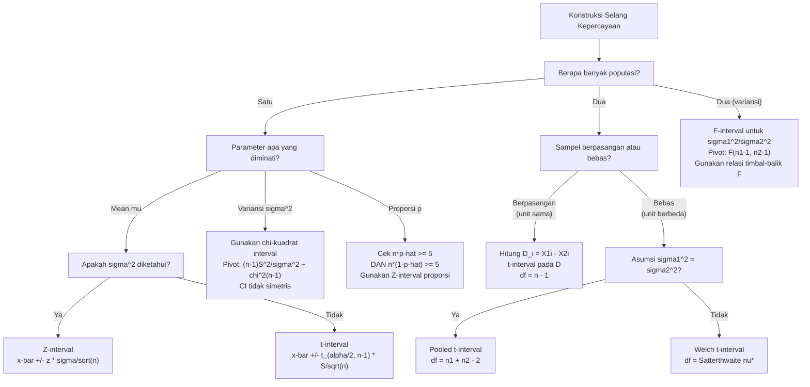

# 📊 4.7 — Selang Kepercayaan

> [!ABSTRACT] Ringkasan Cepat
> **Topik:** Selang Kepercayaan | **Bobot:** ~20–30% | **Difficulty:** Calculation-Intensive
> **Ref:** Miller et al. (2014) Bab 11.1–11.5; Hogg-Tanis-Zimm (2015) Bab 5.5–5.8; Walpole et al. (2012) Bab 8.1, 8.4, 8.5 | **Prereq:** [[4.2 Distribusi Sampel]], [[4.3 Teorema Limit Pusat (CLT)]], [[4.5 Estimasi Parameter]], [[4.6 Sifat-Sifat Estimator]]

## Section 0 — Pemetaan Topik

| Topik CF2 | Sub-topik ID | Skill Diuji | Bobot | Difficulty | Prerequisite | Connected Topics | Referensi |
|-----------|--------------|-------------|-------|------------|--------------|------------------|-----------|
| Topik 4: Inferensi Statistik | 4.7 | Mengonstruksi CI untuk mean satu populasi ($\sigma^2$ diketahui dan tidak diketahui); CI untuk selisih dua mean (sampel bebas dan berpasangan); CI untuk proporsi dan selisih dua proporsi; CI untuk variansi satu populasi; CI untuk rasio dua variansi; menentukan ukuran sampel minimum; menginterpretasikan level kepercayaan | 20–30% | Calculation-Intensive | [[4.2 Distribusi Sampel]], [[4.3 Teorema Limit Pusat (CLT)]], [[4.5 Estimasi Parameter]], [[4.6 Sifat-Sifat Estimator]] | [[4.8 Uji Hipotesis]], [[4.3 Teorema Limit Pusat (CLT)]], [[2.6 Distribusi Kontinu Umum]] | Miller et al. (2014) Bab 11.1–11.5; Hogg-Tanis-Zimm (2015) Bab 5.5–5.8; Walpole et al. (2012) Bab 8.1, 8.4, 8.5 |

## Section 1 — Intuisi

Bayangkan seorang aktuaris yang diminta mengestimasi rata-rata klaim kesehatan tahunan per nasabah dari sampel 50 nasabah. Dia bisa menghitung rata-rata sampel, katakanlah Rp 8.500.000. Tetapi angka tunggal ini terasa tidak memuaskan — pasti ada ketidakpastian di sekitarnya. Berapa "margin error"-nya? Inilah motivasi **selang kepercayaan** (*confidence interval*, CI): alih-alih satu titik, kita memberikan sebuah *interval* yang dengan tingkat kepercayaan tertentu (biasanya 95%) mencakup nilai parameter yang sesungguhnya. Jawaban yang lebih jujur: "Kami 95% yakin bahwa rata-rata klaim sesungguhnya berada antara Rp 7.900.000 dan Rp 9.100.000."

Kunci untuk membangun CI adalah menemukan sebuah **kuantitas pivot** (*pivotal quantity*): fungsi dari data dan parameter yang distribusinya diketahui dan tidak bergantung pada parameter apapun yang tidak diketahui. Misalnya, jika populasi Normal dengan $\sigma^2$ diketahui, maka $Z = (\bar{X} - \mu)/(\sigma/\sqrt{n})$ mengikuti distribusi $N(0,1)$ — distribusinya diketahui sepenuhnya tanpa perlu tahu $\mu$. Dari sini, kita "balikkan" ketidaksamaan probabilitas untuk mengisolasi $\mu$ di tengah dan mendapatkan interval acak $[\bar{X} - z_{\alpha/2}\sigma/\sqrt{n},\; \bar{X} + z_{\alpha/2}\sigma/\sqrt{n}]$ yang mencakup $\mu$ dengan probabilitas $1-\alpha$.

Penting untuk memahami interpretasi yang benar: setelah data diamati dan interval dihitung, kita tidak bisa lagi berbicara tentang "probabilitas bahwa $\mu$ ada di dalam interval ini" — $\mu$ adalah konstanta, bukan variabel acak. Yang tepat adalah: **prosedur** yang kita gunakan akan menghasilkan interval yang mencakup $\mu$ sesungguhnya dalam $(1-\alpha) \times 100\%$ dari semua pengulangan sampling. Level kepercayaan $1-\alpha$ adalah properti dari prosedur, bukan dari satu interval yang spesifik.

## Section 2 — Definisi Formal

> [!NOTE] Definisi Matematis
>
> **Selang Kepercayaan $(1-\alpha) \times 100\%$ untuk $\theta$:**
>
> Sebuah interval acak $[L(\mathbf{X}),\, U(\mathbf{X})]$ adalah selang kepercayaan $(1-\alpha)\times100\%$ untuk $\theta$ jika:
> $$
> P\!\left(L(\mathbf{X}) \leq \theta \leq U(\mathbf{X})\right) = 1 - \alpha \quad \text{untuk semua } \theta \in \Theta
> $$
>
> **Kuantitas Pivot** (*Pivotal Quantity*): Fungsi $Q(\mathbf{X}, \theta)$ yang distribusinya sepenuhnya diketahui (tidak bergantung pada $\theta$ atau parameter lain yang tidak diketahui).
>
> **CI untuk $\mu$, $\sigma^2$ diketahui** ($Z$-interval):
> $$
> \bar{X} \pm z_{\alpha/2} \cdot \frac{\sigma}{\sqrt{n}}
> $$
>
> **CI untuk $\mu$, $\sigma^2$ tidak diketahui** ($t$-interval):
> $$
> \bar{X} \pm t_{\alpha/2,\, n-1} \cdot \frac{S}{\sqrt{n}}
> $$
>
> **CI untuk $\sigma^2$** ($\chi^2$-interval):
> $$
> \left[\frac{(n-1)S^2}{\chi^2_{\alpha/2,\, n-1}},\;\; \frac{(n-1)S^2}{\chi^2_{1-\alpha/2,\, n-1}}\right]
> $$

### Variabel & Parameter

| Simbol | Makna | Catatan |
|--------|-------|---------|
| $1 - \alpha$ | Level kepercayaan (*confidence level*) | Nilai umum: 0.90, 0.95, 0.99 |
| $\alpha$ | Tingkat signifikansi; probabilitas interval tidak mencakup $\theta$ | $\alpha = 1 - \text{(level kepercayaan)}$ |
| $z_{\alpha/2}$ | Nilai kritis distribusi $N(0,1)$: $P(Z > z_{\alpha/2}) = \alpha/2$ | $z_{0.025} = 1.96$, $z_{0.005} = 2.576$ |
| $t_{\alpha/2,\,\nu}$ | Nilai kritis distribusi $t(\nu)$: $P(T > t_{\alpha/2,\nu}) = \alpha/2$ | Bertambah saat $\nu$ berkurang; mendekati $z_{\alpha/2}$ saat $\nu \to \infty$ |
| $\chi^2_{\alpha,\,\nu}$ | Nilai kritis $\chi^2(\nu)$: $P(\chi^2 > \chi^2_{\alpha,\nu}) = \alpha$ | Tidak simetris; butuh dua nilai kritis untuk CI |
| $F_{\alpha,\,\nu_1,\nu_2}$ | Nilai kritis $F(\nu_1,\nu_2)$: $P(F > F_{\alpha,\nu_1,\nu_2}) = \alpha$ | $F_{1-\alpha,\nu_1,\nu_2} = 1/F_{\alpha,\nu_2,\nu_1}$ |
| $\bar{X}$ | Mean sampel: $\frac{1}{n}\sum X_i$ | Estimator titik untuk $\mu$ |
| $S^2$ | Variansi sampel: $\frac{1}{n-1}\sum(X_i-\bar{X})^2$ | Estimator tak-bias untuk $\sigma^2$ |
| $n$ | Ukuran sampel | Menentukan derajat bebas dan lebar interval |
| $\nu$ | Derajat bebas (*degrees of freedom*) | Untuk $t$: $\nu = n-1$; untuk $\chi^2$: $\nu = n-1$ |
| $E$ | *Margin of error* (setengah lebar CI) | $E = z_{\alpha/2} \cdot \sigma/\sqrt{n}$ untuk $Z$-interval |
| $\hat{p}$ | Proporsi sampel: $X/n$ di mana $X \sim B(n,p)$ | Estimator titik untuk proporsi populasi $p$ |
| $S_p^2$ | Variansi gabungan (*pooled variance*) untuk dua sampel | $S_p^2 = \frac{(n_1-1)S_1^2 + (n_2-1)S_2^2}{n_1+n_2-2}$ |

### Rumus Utama

$$
\bar{X} \pm z_{\alpha/2} \cdot \frac{\sigma}{\sqrt{n}}
$$
**Label: CI untuk $\mu$, $\sigma^2$ diketahui ($Z$-interval)** — pivot: $Z = (\bar{X}-\mu)/(\sigma/\sqrt{n}) \sim N(0,1)$. Berlaku tepat untuk populasi Normal; berlaku aproksimasi untuk $n \geq 30$ (CLT) tanpa asumsi Normal.

$$
\bar{X} \pm t_{\alpha/2,\, n-1} \cdot \frac{S}{\sqrt{n}}
$$
**Label: CI untuk $\mu$, $\sigma^2$ tidak diketahui ($t$-interval)** — pivot: $T = (\bar{X}-\mu)/(S/\sqrt{n}) \sim t(n-1)$. Berlaku tepat untuk populasi Normal; nilai kritis $t$ lebih besar dari $z$, menghasilkan interval lebih lebar.

$$
\left[\frac{(n-1)S^2}{\chi^2_{\alpha/2,\,n-1}},\;\; \frac{(n-1)S^2}{\chi^2_{1-\alpha/2,\,n-1}}\right]
$$
**Label: CI untuk $\sigma^2$** — pivot: $\chi^2 = (n-1)S^2/\sigma^2 \sim \chi^2(n-1)$. Interval **tidak simetris** di sekitar $S^2$ karena distribusi $\chi^2$ menjulur ke kanan.

$$
(\bar{X}_1 - \bar{X}_2) \pm t_{\alpha/2,\,n_1+n_2-2} \cdot S_p\sqrt{\frac{1}{n_1}+\frac{1}{n_2}}, \qquad S_p^2 = \frac{(n_1-1)S_1^2+(n_2-1)S_2^2}{n_1+n_2-2}
$$
**Label: CI untuk $\mu_1 - \mu_2$, variansi sama tidak diketahui (*pooled $t$*)** — asumsi kritis: $\sigma_1^2 = \sigma_2^2$. Derajat bebas: $n_1 + n_2 - 2$.

$$
(\bar{X}_1 - \bar{X}_2) \pm t_{\alpha/2,\,\nu^*} \cdot \sqrt{\frac{S_1^2}{n_1}+\frac{S_2^2}{n_2}}
$$
**Label: CI untuk $\mu_1 - \mu_2$, variansi berbeda tidak diketahui (Welch/Satterthwaite)** — derajat bebas Satterthwaite:
$$
\nu^* = \frac{(S_1^2/n_1 + S_2^2/n_2)^2}{\frac{(S_1^2/n_1)^2}{n_1-1}+\frac{(S_2^2/n_2)^2}{n_2-1}}
$$

$$
\bar{D} \pm t_{\alpha/2,\,n-1} \cdot \frac{S_D}{\sqrt{n}}, \qquad D_i = X_{1i} - X_{2i}
$$
**Label: CI untuk $\mu_D = \mu_1 - \mu_2$, sampel berpasangan** — reduksi ke CI satu sampel pada selisih $D_i$; lebih presisi dari dua sampel bebas jika ada korelasi positif antara pasangan.

$$
\hat{p} \pm z_{\alpha/2}\sqrt{\frac{\hat{p}(1-\hat{p})}{n}}
$$
**Label: CI untuk proporsi $p$ (aproksimasi Normal besar)** — berlaku jika $n\hat{p} \geq 5$ dan $n(1-\hat{p}) \geq 5$. Pivot: CLT pada $\hat{p}$.

$$
\left[\frac{S_1^2/S_2^2}{F_{\alpha/2,\,n_1-1,\,n_2-1}},\;\; \frac{S_1^2/S_2^2}{F_{1-\alpha/2,\,n_1-1,\,n_2-1}}\right]
$$
**Label: CI untuk $\sigma_1^2/\sigma_2^2$** — pivot: $F = (S_1^2/\sigma_1^2)/(S_2^2/\sigma_2^2) \sim F(n_1-1, n_2-1)$.

$$
n \geq \left(\frac{z_{\alpha/2} \cdot \sigma}{E}\right)^2
$$
**Label: Ukuran sampel minimum untuk margin error $E$** — berlaku untuk $Z$-interval; bulatkan ke atas (*ceiling*) untuk memastikan margin error tidak melebihi $E$.

### Asumsi Eksplisit

- **$Z$-interval tepat:** Populasi Normal, $\sigma^2$ diketahui. Atau: $n \geq 30$ dan CLT (aproksimasi).
- **$t$-interval tepat:** Populasi Normal, $\sigma^2$ tidak diketahui. Robust terhadap penyimpangan normalitas untuk $n$ cukup besar.
- **Pooled $t$:** Dua populasi Normal independen dengan $\sigma_1^2 = \sigma_2^2$ (homoskedastisitas).
- **CI untuk $\sigma^2$ dan $F$:** Asumsi normalitas sangat sensitif — tidak robust; distribusi $\chi^2$ dan $F$ hanya tepat jika populasi betul-betul Normal.
- **CI proporsi (aproksimasi Normal):** $n\hat{p} \geq 5$ dan $n(1-\hat{p}) \geq 5$; tidak berlaku untuk $p$ sangat kecil atau besar dengan $n$ kecil.

## Section 3 — Jembatan Logika

> [!TIP] Dari Definisi ke Rumus
> Semua CI dibangun dengan **tiga langkah yang sama**:
>
> **Langkah 1 — Identifikasi kuantitas pivot $Q(\mathbf{X}, \theta)$:** Fungsi yang distribusinya sepenuhnya diketahui ($Z$, $t$, $\chi^2$, atau $F$).
>
> **Langkah 2 — Tulis ketidaksamaan probabilitas:** $P(q_{L} \leq Q \leq q_{U}) = 1-\alpha$, di mana $q_L$ dan $q_U$ adalah nilai kritis dari tabel.
>
> **Langkah 3 — Isolasi $\theta$:** Manipulasi aljabar ketidaksamaan untuk mendapatkan $P(L(\mathbf{X}) \leq \theta \leq U(\mathbf{X})) = 1-\alpha$.
>
> Contoh derivasi CI untuk $\mu$ dengan $\sigma^2$ diketahui:
> - Pivot: $Z = \frac{\bar{X} - \mu}{\sigma/\sqrt{n}} \sim N(0,1)$
> - Ketidaksamaan: $P\!\left(-z_{\alpha/2} \leq \frac{\bar{X}-\mu}{\sigma/\sqrt{n}} \leq z_{\alpha/2}\right) = 1-\alpha$
> - Kalikan dengan $\sigma/\sqrt{n}$ dan balikkan: $P\!\left(\bar{X} - z_{\alpha/2}\frac{\sigma}{\sqrt{n}} \leq \mu \leq \bar{X} + z_{\alpha/2}\frac{\sigma}{\sqrt{n}}\right) = 1-\alpha$

> [!IMPORTANT] Support dan Domain — Sifat Distribusi yang Menentukan Bentuk CI
> - **$N(0,1)$ dan $t(\nu)$:** Simetris di sekitar nol → nilai kritis $\pm z_{\alpha/2}$ atau $\pm t_{\alpha/2,\nu}$ → CI **simetris** di sekitar estimator titik $\bar{X}$.
> - **$\chi^2(\nu)$:** Tidak simetris, support $[0,\infty)$, menjulur ke kanan → butuh **dua** nilai kritis berbeda $\chi^2_{1-\alpha/2,\nu}$ (sisi kiri) dan $\chi^2_{\alpha/2,\nu}$ (sisi kanan) → CI **tidak simetris** di sekitar $S^2$.
> - **$F(\nu_1,\nu_2)$:** Tidak simetris, support $[0,\infty)$ → sama seperti $\chi^2$; gunakan relasi $F_{1-\alpha,\nu_1,\nu_2} = 1/F_{\alpha,\nu_2,\nu_1}$ untuk menghemat tabel.
> - Semakin besar $n$: interval semakin sempit (proporsional $1/\sqrt{n}$); nilai $t_{n-1}$ mendekati $z$.

**Derivasi CI untuk $\sigma^2$ dari pivot $\chi^2$:**

Untuk $X_i \overset{\text{iid}}{\sim} N(\mu, \sigma^2)$ (kedua parameter tidak diketahui):

$$
\frac{(n-1)S^2}{\sigma^2} \sim \chi^2(n-1)
$$

Tulis ketidaksamaan probabilitas dengan dua nilai kritis (karena $\chi^2$ tidak simetris):
$$
P\!\left(\chi^2_{1-\alpha/2,\,n-1} \leq \frac{(n-1)S^2}{\sigma^2} \leq \chi^2_{\alpha/2,\,n-1}\right) = 1 - \alpha
$$

Balikkan dan isolasi $\sigma^2$ (ingat: membalikkan pertidaksamaan saat dibagi):
$$
P\!\left(\frac{(n-1)S^2}{\chi^2_{\alpha/2,\,n-1}} \leq \sigma^2 \leq \frac{(n-1)S^2}{\chi^2_{1-\alpha/2,\,n-1}}\right) = 1-\alpha
$$

**Derivasi ukuran sampel minimum:**

Dari $Z$-interval, margin of error:
$$
E = z_{\alpha/2} \cdot \frac{\sigma}{\sqrt{n}}
$$

Isolasi $n$:
$$
\sqrt{n} = \frac{z_{\alpha/2}\cdot\sigma}{E} \implies n = \left(\frac{z_{\alpha/2}\cdot\sigma}{E}\right)^2
$$

Karena $n$ harus bilangan bulat, gunakan $n = \left\lceil\left(\frac{z_{\alpha/2}\cdot\sigma}{E}\right)^2\right\rceil$ (*ceiling function*).

**Hubungan sifat $F$ — nilai kritis ekor kiri:**

$$
F_{1-\alpha/2,\,\nu_1,\nu_2} = \frac{1}{F_{\alpha/2,\,\nu_2,\nu_1}}
$$

Relasi ini memungkinkan kita hanya menggunakan tabel ekor kanan (nilai besar $F$) untuk mendapatkan nilai kritis ekor kiri.

> [!DANGER] Dilarang
> 1. **Dilarang** menginterpretasikan CI $(L, U)$ yang sudah dihitung dari data sebagai "probabilitas $\mu$ berada dalam $(L, U)$ adalah 95%". Setelah interval dihitung, $\mu$ adalah konstanta tetap — ia ada atau tidak ada dalam interval yang tetap. Interpretasi yang benar: prosedur ini menghasilkan interval yang mencakup $\mu$ dalam 95% pengulangan sampling jangka panjang.
> 2. **Dilarang** menggunakan $Z$-interval (dengan $\sigma$ diketahui atau $S$ menggantikan $\sigma$) ketika $n < 30$ dan populasi tidak Normal — distribusi pivot tidak $N(0,1)$; gunakan $t$-interval dengan asumsi normalitas populasi.
> 3. **Dilarang** menukar posisi nilai kritis $\chi^2$ dalam CI untuk $\sigma^2$: batas bawah CI menggunakan $\chi^2_{\alpha/2}$ (nilai besar) di penyebut, batas atas menggunakan $\chi^2_{1-\alpha/2}$ (nilai kecil) di penyebut — karena $\sigma^2$ berbanding terbalik dengan pivot $\chi^2$.

## Section 4 — Contoh Soal

### Soal A — Fundamental

Seorang aktuaris mengambil sampel acak $n = 25$ polis asuransi kendaraan dan mencatat besaran klaim (dalam juta rupiah). Diperoleh $\bar{x} = 12.4$ dan $s = 3.2$. Asumsikan besaran klaim terdistribusi Normal.

(a) Konstruksi CI 95% untuk rata-rata klaim populasi $\mu$ (gunakan $t$-interval karena $\sigma^2$ tidak diketahui).
(b) Konstruksi CI 90% untuk $\mu$.
(c) Konstruksi CI 95% untuk variansi populasi $\sigma^2$.
(d) Jika $\sigma$ sebenarnya diketahui $= 3.0$, berapa ukuran sampel minimum agar margin of error tidak melebihi $E = 1.0$ pada CI 95%?

> [!SUCCESS] Solusi Soal A
>
> **1. Identifikasi Variabel**
> - $n = 25$, $\bar{x} = 12.4$, $s = 3.2$, $s^2 = 10.24$
> - Populasi: Normal, $\sigma^2$ tidak diketahui
> - Level: 95% → $\alpha = 0.05$; 90% → $\alpha = 0.10$
> - Derajat bebas untuk $t$ dan $\chi^2$: $\nu = n - 1 = 24$
>
> **2. Identifikasi Distribusi / Model**
> - (a) & (b): Pivot $T = (\bar{X}-\mu)/(S/\sqrt{n}) \sim t(24)$
> - (c): Pivot $\chi^2 = (n-1)S^2/\sigma^2 \sim \chi^2(24)$
> - (d): Formula ukuran sampel minimum dari $Z$-interval
>
> **3. Setup Persamaan**
>
> (a): $\bar{x} \pm t_{\alpha/2,\,24} \cdot \dfrac{s}{\sqrt{n}}$
>
> (c): $\left[\dfrac{(n-1)s^2}{\chi^2_{\alpha/2,\,24}},\; \dfrac{(n-1)s^2}{\chi^2_{1-\alpha/2,\,24}}\right]$
>
> (d): $n \geq \left(\dfrac{z_{\alpha/2}\cdot\sigma}{E}\right)^2$
>
> **4. Eksekusi Aljabar**
>
> **(a) CI 95% untuk $\mu$ (t-interval, $\nu = 24$):**
>
> Nilai kritis: $t_{0.025,\,24} = 2.064$ (dari tabel $t$)
>
> Margin of error: $E = 2.064 \times \dfrac{3.2}{\sqrt{25}} = 2.064 \times \dfrac{3.2}{5} = 2.064 \times 0.64 = 1.321$
>
> $$
> \text{CI 95\%}: \quad 12.4 \pm 1.321 \quad \Rightarrow \quad (11.079,\; 13.721)
> $$
>
> **(b) CI 90% untuk $\mu$ (t-interval, $\nu = 24$):**
>
> Nilai kritis: $t_{0.05,\,24} = 1.711$
>
> Margin of error: $E = 1.711 \times 0.64 = 1.095$
>
> $$
> \text{CI 90\%}: \quad 12.4 \pm 1.095 \quad \Rightarrow \quad (11.305,\; 13.495)
> $$
>
> Konfirmasi: CI 90% lebih sempit dari CI 95% ✓
>
> **(c) CI 95% untuk $\sigma^2$ ($\chi^2$-interval, $\nu = 24$):**
>
> Nilai kritis:
> - $\chi^2_{0.025,\,24} = 39.364$ (ekor kanan, nilai besar)
> - $\chi^2_{0.975,\,24} = 12.401$ (ekor kiri, nilai kecil)
>
> $(n-1)s^2 = 24 \times 10.24 = 245.76$
>
> Batas bawah: $\dfrac{245.76}{39.364} = 6.244$
>
> Batas atas: $\dfrac{245.76}{12.401} = 19.818$
>
> $$
> \text{CI 95\% untuk } \sigma^2: \quad (6.244,\; 19.818)
> $$
>
> CI untuk $\sigma$: $(\sqrt{6.244},\; \sqrt{19.818}) = (2.499,\; 4.452)$
>
> **(d) Ukuran sampel minimum:**
>
> $\sigma = 3.0$, $E = 1.0$, $z_{0.025} = 1.96$:
> $$
> n \geq \left(\frac{1.96 \times 3.0}{1.0}\right)^2 = (5.88)^2 = 34.574
> $$
>
> Karena $n$ harus bulat ke atas: $n_{\min} = 35$
>
> **5. Verification**
> - CI 95% lebih lebar dari CI 90% ✓ (lebih percaya diri → interval lebih lebar)
> - CI untuk $\sigma^2$ tidak simetris di sekitar $s^2 = 10.24$: $(10.24 - 6.244) = 3.996$ vs $(19.818 - 10.24) = 9.578$ — asimetri ke kanan khas untuk $\chi^2$ ✓
> - $n = 35 > 25$: untuk memperketat margin error dari $\approx1.18$ (dengan $n=25$, $\sigma=3$) menjadi $1.0$, butuh lebih banyak sampel ✓

> [!WARNING] Exam Tips — Soal A
> - **Target waktu:** 8–10 menit
> - **Common trap 1 — Urutan nilai kritis $\chi^2$:** Batas bawah CI menggunakan nilai kritis $\chi^2$ yang *besar* (ekor kanan $\alpha/2$) di penyebut, bukan yang kecil. Logikanya: semakin besar nilai $\chi^2$, semakin kecil $\sigma^2 = (n-1)s^2/\chi^2$. Tuliskan $\chi^2_{\alpha/2}$ > $\chi^2_{1-\alpha/2}$ selalu untuk verifikasi urutan.
> - **Common trap 2 — Derajat bebas:** Untuk $t$ dan $\chi^2$ dari satu sampel Normal, $\nu = n - 1 = 24$, bukan $n = 25$.
> - **Shortcut ukuran sampel:** Jika soal meminta $n$ dengan margin error setengah dari semula, $n$ harus dikali 4 (karena $n \propto 1/E^2$).

---

### Soal B — Exam-Typical

Sebuah perusahaan reasuransi ingin membandingkan rata-rata klaim dua kelompok nasabah: Kelompok A (industri manufaktur) dan Kelompok B (industri jasa). Sampel independen menghasilkan:

- Kelompok A: $n_1 = 16$, $\bar{x}_1 = 85.2$ juta, $s_1 = 12.6$ juta
- Kelompok B: $n_2 = 21$, $\bar{x}_2 = 78.5$ juta, $s_2 = 11.8$ juta

Asumsikan kedua populasi Normal dan variansi populasi sama (tetapi tidak diketahui nilainya).

(a) Hitung variansi gabungan (*pooled variance*) $S_p^2$.
(b) Konstruksi CI 95% untuk selisih rata-rata $\mu_1 - \mu_2$ menggunakan *pooled t*-interval.
(c) Berdasarkan CI yang diperoleh, apakah ada bukti bahwa rata-rata klaim kedua kelompok berbeda? Jelaskan.
(d) Konstruksi CI 95% untuk rasio variansi $\sigma_1^2/\sigma_2^2$ dan periksa apakah asumsi $\sigma_1^2 = \sigma_2^2$ yang digunakan di bagian (b) terdukung.

> [!SUCCESS] Solusi Soal B
>
> **1. Identifikasi Variabel**
> - Kelompok A: $n_1 = 16$, $\bar{x}_1 = 85.2$, $s_1 = 12.6$, $s_1^2 = 158.76$
> - Kelompok B: $n_2 = 21$, $\bar{x}_2 = 78.5$, $s_2 = 11.8$, $s_2^2 = 139.24$
> - $\bar{x}_1 - \bar{x}_2 = 85.2 - 78.5 = 6.7$
> - Asumsi: kedua populasi Normal, $\sigma_1^2 = \sigma_2^2$ (tidak diketahui)
> - $\alpha = 0.05$, level 95%
>
> **2. Identifikasi Distribusi / Model**
> - (a)–(b): Pivot *pooled t*: $T = \dfrac{(\bar{X}_1-\bar{X}_2)-(\mu_1-\mu_2)}{S_p\sqrt{1/n_1+1/n_2}} \sim t(n_1+n_2-2) = t(35)$
> - (d): Pivot $F$: $F = \dfrac{S_1^2/\sigma_1^2}{S_2^2/\sigma_2^2} \sim F(n_1-1, n_2-1) = F(15, 20)$
>
> **3. Setup Persamaan**
>
> $$
> S_p^2 = \frac{(n_1-1)s_1^2 + (n_2-1)s_2^2}{n_1+n_2-2}
> $$
>
> $$
> (\bar{x}_1-\bar{x}_2) \pm t_{\alpha/2,\,n_1+n_2-2} \cdot S_p\sqrt{\frac{1}{n_1}+\frac{1}{n_2}}
> $$
>
> **4. Eksekusi Aljabar**
>
> **(a) Variansi gabungan:**
> $$
> S_p^2 = \frac{(16-1)(158.76) + (21-1)(139.24)}{16+21-2} = \frac{15 \times 158.76 + 20 \times 139.24}{35}
> $$
> $$
> = \frac{2381.4 + 2784.8}{35} = \frac{5166.2}{35} = 147.606
> $$
> $$
> S_p = \sqrt{147.606} = 12.149
> $$
>
> **(b) CI 95% untuk $\mu_1 - \mu_2$ (pooled t, $\nu = 35$):**
>
> Nilai kritis: $t_{0.025,\,35} = 2.030$
>
> Margin of error:
> $$
> E = 2.030 \times 12.149 \times \sqrt{\frac{1}{16}+\frac{1}{21}} = 2.030 \times 12.149 \times \sqrt{0.0625 + 0.04762}
> $$
> $$
> = 2.030 \times 12.149 \times \sqrt{0.11012} = 2.030 \times 12.149 \times 0.33184 = 8.181
> $$
>
> $$
> \text{CI 95\%}: \quad 6.7 \pm 8.181 \quad \Rightarrow \quad (-1.481,\; 14.881)
> $$
>
> **(c) Interpretasi:**
>
> CI 95% untuk $\mu_1 - \mu_2$ adalah $(-1.481,\; 14.881)$.
>
> Interval ini **mencakup nol**. Oleh karena itu, pada level kepercayaan 95%, **tidak ada bukti yang cukup** bahwa rata-rata klaim kedua kelompok berbeda secara statistik. Perbedaan yang diamati ($6.7$ juta) bisa saja terjadi secara kebetulan saat sampling.
>
> **(d) CI 95% untuk $\sigma_1^2/\sigma_2^2$ ($F$-interval, $\nu_1=15$, $\nu_2=20$):**
>
> Rasio variansi sampel: $s_1^2/s_2^2 = 158.76/139.24 = 1.140$
>
> Nilai kritis:
> - $F_{0.025,\,15,\,20} = 2.57$ (ekor kanan)
> - $F_{0.975,\,15,\,20} = 1/F_{0.025,\,20,\,15} = 1/2.76 = 0.362$ (ekor kiri, menggunakan relasi timbal-balik)
>
> Batas bawah: $\dfrac{s_1^2/s_2^2}{F_{0.025,\,15,20}} = \dfrac{1.140}{2.57} = 0.444$
>
> Batas atas: $\dfrac{s_1^2/s_2^2}{F_{0.975,\,15,20}} = \dfrac{1.140}{0.362} = 3.149$
>
> $$
> \text{CI 95\% untuk } \frac{\sigma_1^2}{\sigma_2^2}: \quad (0.444,\; 3.149)
> $$
>
> CI ini mencakup 1, sehingga asumsi $\sigma_1^2 = \sigma_2^2$ yang digunakan di bagian (b) **terdukung** oleh data pada level kepercayaan 95%.
>
> **5. Verification**
> - $S_p^2 = 147.606$ berada di antara $s_1^2 = 158.76$ dan $s_2^2 = 139.24$ ✓ (rata-rata tertimbang harus berada di antara keduanya)
> - CI untuk $\mu_1-\mu_2$ mencakup 0 ✓ (konsisten dengan tidak ada perbedaan signifikan)
> - CI untuk $\sigma_1^2/\sigma_2^2$ mencakup 1 ✓ (konsisten dengan asumsi variansi sama)
> - $F_{0.975,15,20} = 1/F_{0.025,20,15}$: perhatikan derajat bebas terbalik saat menggunakan relasi timbal-balik ✓

> [!WARNING] Exam Tips — Soal B
> - **Target waktu:** 12–15 menit
> - **Common trap 1 — Relasi nilai kritis $F$:** $F_{1-\alpha/2,\nu_1,\nu_2} = 1/F_{\alpha/2,\nu_2,\nu_1}$ — perhatikan derajat bebas ($\nu_1$ dan $\nu_2$) **bertukar** saat menggunakan relasi timbal-balik. Kesalahan paling umum: menggunakan $1/F_{\alpha/2,\nu_1,\nu_2}$ (derajat bebas tidak bertukar) yang memberikan jawaban salah.
> - **Common trap 2 — Derajat bebas pooled $t$:** $\nu = n_1 + n_2 - 2 = 16 + 21 - 2 = 35$, bukan $n_1 + n_2 - 1$ atau $n_1 + n_2$.
> - **Common trap 3 — Interpretasi CI yang mencakup nol:** CI untuk selisih yang mencakup 0 berarti tidak ada bukti perbedaan yang signifikan — jangan klaim "terbukti sama"; cukup "tidak ada bukti berbeda".
> - **Shortcut $S_p^2$:** Ketika $n_1 = n_2 = n$, $S_p^2 = (S_1^2 + S_2^2)/2$ — rata-rata sederhana. Cek apakah kondisi ini berlaku sebelum menggunakan rumus umum.

---

### Soal C — Challenging

Seorang peneliti aktuaria menyelidiki efek program pencegahan klaim pada 12 nasabah korporat. Klaim sebelum dan sesudah program dicatat (dalam ratus juta rupiah):

| Nasabah | 1 | 2 | 3 | 4 | 5 | 6 | 7 | 8 | 9 | 10 | 11 | 12 |
|---------|---|---|---|---|---|---|---|---|---|----|----|----|
| Sebelum ($X_{1i}$) | 8.2 | 6.5 | 9.1 | 7.3 | 10.4 | 5.8 | 8.7 | 6.2 | 9.5 | 7.8 | 8.0 | 6.9 |
| Sesudah ($X_{2i}$) | 7.5 | 6.1 | 8.2 | 6.8 | 9.6 | 5.5 | 7.9 | 5.8 | 8.7 | 7.1 | 7.4 | 6.4 |

(a) Hitung selisih $D_i = X_{1i} - X_{2i}$ untuk setiap nasabah, kemudian hitung $\bar{d}$ dan $s_D$.
(b) Konstruksi CI 95% untuk rata-rata selisih $\mu_D = \mu_{\text{sebelum}} - \mu_{\text{sesudah}}$ menggunakan sampel berpasangan.
(c) Apakah program pencegahan terbukti efektif menurunkan klaim? Jelaskan berdasarkan CI.
(d) Jelaskan mengapa pendekatan sampel berpasangan lebih tepat daripada dua sampel bebas dalam konteks ini, dan apa konsekuensi statistiknya.

> [!SUCCESS] Solusi Soal C
>
> **1. Identifikasi Variabel**
> - $n = 12$ pasang (nasabah yang sama diukur dua kali)
> - Selisih $D_i = X_{1i} - X_{2i}$: pengurangan klaim setelah program
> - Parameter yang diminati: $\mu_D = \mu_1 - \mu_2$ (rata-rata pengurangan klaim)
> - $\alpha = 0.05$, $\nu = n - 1 = 11$
>
> **2. Identifikasi Distribusi / Model**
> - Sampel berpasangan → reduksi ke satu sampel $D_1, \ldots, D_{12}$
> - Pivot: $T = (\bar{D} - \mu_D)/(S_D/\sqrt{n}) \sim t(11)$ (asumsi $D_i \overset{\text{iid}}{\sim} N(\mu_D, \sigma_D^2)$)
>
> **3. Setup Persamaan**
>
> $$
> \bar{d} \pm t_{0.025,\,11} \cdot \frac{s_D}{\sqrt{12}}
> $$
>
> **4. Eksekusi Aljabar**
>
> **(a) Hitung $D_i$, $\bar{d}$, dan $s_D$:**
>
> | Nasabah | $X_{1i}$ | $X_{2i}$ | $D_i$ | $D_i - \bar{d}$ | $(D_i-\bar{d})^2$ |
> |---------|-----------|-----------|--------|-----------------|-------------------|
> | 1 | 8.2 | 7.5 | 0.7 | 0.0083 | 0.0001 |
> | 2 | 6.5 | 6.1 | 0.4 | $-0.2917$ | 0.0851 |
> | 3 | 9.1 | 8.2 | 0.9 | 0.2083 | 0.0434 |
> | 4 | 7.3 | 6.8 | 0.5 | $-0.1917$ | 0.0367 |
> | 5 | 10.4 | 9.6 | 0.8 | 0.1083 | 0.0117 |
> | 6 | 5.8 | 5.5 | 0.3 | $-0.3917$ | 0.1534 |
> | 7 | 8.7 | 7.9 | 0.8 | 0.1083 | 0.0117 |
> | 8 | 6.2 | 5.8 | 0.4 | $-0.2917$ | 0.0851 |
> | 9 | 9.5 | 8.7 | 0.8 | 0.1083 | 0.0117 |
> | 10 | 7.8 | 7.1 | 0.7 | 0.0083 | 0.0001 |
> | 11 | 8.0 | 7.4 | 0.6 | $-0.0917$ | 0.0084 |
> | 12 | 6.9 | 6.4 | 0.5 | $-0.1917$ | 0.0367 |
> | **Total** | | | **8.4** | | **0.4841** |
>
> $$
> \bar{d} = \frac{8.4}{12} = 0.700
> $$
>
> $$
> s_D^2 = \frac{\sum(D_i - \bar{d})^2}{n-1} = \frac{0.4841}{11} = 0.04401
> $$
>
> $$
> s_D = \sqrt{0.04401} = 0.2098
> $$
>
> **(b) CI 95% untuk $\mu_D$ (sampel berpasangan, $\nu = 11$):**
>
> Nilai kritis: $t_{0.025,\,11} = 2.201$
>
> Margin of error:
> $$
> E = 2.201 \times \frac{0.2098}{\sqrt{12}} = 2.201 \times \frac{0.2098}{3.4641} = 2.201 \times 0.06056 = 0.1333
> $$
>
> $$
> \text{CI 95\%}: \quad 0.700 \pm 0.133 \quad \Rightarrow \quad (0.567,\; 0.833)
> $$
>
> **(c) Interpretasi dan kesimpulan:**
>
> CI 95% untuk $\mu_D = \mu_{\text{sebelum}} - \mu_{\text{sesudah}}$ adalah $(0.567,\; 0.833)$ (dalam ratus juta rupiah).
>
> Seluruh interval **berada di atas nol**. Ini berarti, pada level kepercayaan 95%, terdapat bukti yang kuat bahwa program pencegahan klaim **efektif** menurunkan rata-rata klaim. Estimasi terbaik adalah rata-rata klaim turun sebesar Rp 70 juta per nasabah korporat, dengan rentang kepercayaan 95% antara Rp 56,7 juta hingga Rp 83,3 juta.
>
> **(d) Keunggulan sampel berpasangan:**
>
> Nasabah yang sama diobservasi sebelum dan sesudah program — artinya $X_{1i}$ dan $X_{2i}$ dari nasabah yang sama berkorelasi positif (nasabah dengan klaim historis tinggi cenderung tetap lebih tinggi). Jika dianalisis sebagai dua sampel bebas, korelasi ini diabaikan dan variansi estimasi $\bar{X}_1 - \bar{X}_2$ dihitung terlalu besar:
> $$
> \text{Var}(\bar{X}_1 - \bar{X}_2)_{\text{bebas}} = \frac{\sigma_1^2}{n_1} + \frac{\sigma_2^2}{n_2} > \frac{\sigma_1^2 + \sigma_2^2 - 2\rho\sigma_1\sigma_2}{n} = \text{Var}(\bar{D})
> $$
> (untuk $\rho > 0$). Dengan sampel berpasangan, selisih $D_i$ mengeliminasi variabilitas antarindividu (heterogenitas nasabah), sehingga $s_D$ lebih kecil dan CI lebih sempit — menghasilkan kesimpulan yang lebih presisi.
>
> **5. Verification**
> - $\bar{d} = 0.700 > 0$: rata-rata klaim turun setelah program ✓
> - $s_D = 0.2098 \ll s_1, s_2$ (jauh lebih kecil dari variansi dalam kelompok): menunjukkan eliminasi variabilitas antarindividu berhasil ✓
> - CI seluruhnya positif → bukti efektivitas program pada $\alpha = 0.05$ ✓

> [!WARNING] Exam Tips — Soal C
> - **Target waktu:** 15–18 menit
> - **Common trap 1 — Arah selisih $D_i$:** Definisikan $D_i = X_{\text{sebelum}} - X_{\text{sesudah}}$. Jika program efektif, $D_i > 0$ dan CI seluruhnya positif. Jika didefinisikan terbalik ($D_i = X_{\text{sesudah}} - X_{\text{sebelum}}$), CI seluruhnya negatif — kesimpulan tetap sama tetapi arah numerik berbeda.
> - **Common trap 2 — Derajat bebas sampel berpasangan:** $\nu = n - 1 = 11$ (berdasarkan jumlah pasang), bukan $n_1 + n_2 - 2 = 22$ (yang berlaku untuk dua sampel bebas).
> - **Shortcut komputasi $s_D$:** Gunakan $s_D^2 = \frac{\sum d_i^2 - n\bar{d}^2}{n-1}$ untuk menghindari tabel panjang. $\sum d_i^2 = 0.49+0.16+0.81+0.25+0.64+0.09+0.64+0.16+0.64+0.49+0.36+0.25 = 4.98$; $s_D^2 = (4.98 - 12\times0.49)/11 = (4.98-5.88)/11$... gunakan kolom $(D_i - \bar{d})^2$ yang lebih akurat.

## Section 5 — Verifikasi & Sanity Check

> [!CHECK] Validasi Konstruksi CI Secara Umum
> 1. **Level kepercayaan vs $\alpha$:** $1-\alpha = 0.95$ berarti $\alpha = 0.05$, nilai kritis menggunakan $\alpha/2 = 0.025$ di setiap ekor (untuk CI dua sisi). Jangan campurkan $\alpha$ dan $\alpha/2$.
> 2. **Lebar CI proporsional $1/\sqrt{n}$:** Untuk mengurangi margin error setengahnya, ukuran sampel harus *dikali 4*. Kuadratkan faktor pengurangan untuk mendapat faktor $n$.
> 3. **Cek urutan batas:** Pastikan $L < U$ selalu. Untuk CI $\chi^2$: $(n-1)s^2/\chi^2_{\alpha/2} < (n-1)s^2/\chi^2_{1-\alpha/2}$ iff $\chi^2_{\alpha/2} > \chi^2_{1-\alpha/2}$, yang benar karena $\alpha/2 < 1-\alpha/2$ untuk $\alpha < 1$.

> [!CHECK] Validasi Nilai Kritis Distribusi
> 1. **$t$ vs $z$:** $t_{\alpha/2,\nu} > z_{\alpha/2}$ untuk semua $\nu$ finite; $t_{\alpha/2,\nu} \to z_{\alpha/2}$ saat $\nu \to \infty$. Jika $t < z$ untuk $\nu$ kecil, ada kesalahan pencarian tabel.
> 2. **$\chi^2$ tidak simetris:** $\chi^2_{\alpha/2,\nu} > \nu > \chi^2_{1-\alpha/2,\nu}$ untuk $\alpha$ kecil (misal 0.05). Konfirmasi bahwa nilai kritis kanan selalu lebih besar dari nilai kritis kiri.
> 3. **Relasi $F$:** $F_{1-\alpha,\nu_1,\nu_2} = 1/F_{\alpha,\nu_2,\nu_1}$ — derajat bebas bertukar. Untuk $\nu_1 = \nu_2$: $F_{1-\alpha,\nu,\nu} = 1/F_{\alpha,\nu,\nu}$.
> 4. **Nilai kritis umum yang perlu dihafalkan:**
>    - $z_{0.025} = 1.960$, $z_{0.005} = 2.576$, $z_{0.05} = 1.645$
>    - $t_{0.025,\infty} = 1.960 = z_{0.025}$; $t_{0.025,30} \approx 2.042$; $t_{0.025,10} \approx 2.228$

> [!CHECK] Validasi Pemilihan Prosedur CI
> 1. **$\sigma^2$ diketahui?** Ya → $Z$-interval. Tidak → $t$-interval (asumsi Normal).
> 2. **Dua sampel — variansi sama?** Ya (diasumsikan) → pooled $t$, $\nu = n_1+n_2-2$. Tidak → Welch, $\nu = \nu^*$ Satterthwaite.
> 3. **Sampel berpasangan atau bebas?** Berpasangan (unit yang sama diukur dua kali) → $t$-interval pada $D_i$, $\nu = n-1$. Bebas → prosedur dua sampel.
> 4. **CI proporsi:** Cek $n\hat{p} \geq 5$ DAN $n(1-\hat{p}) \geq 5$. Jika tidak, aproksimasi Normal tidak valid.

### Metode Alternatif

**CI Satu Sisi (*One-Sided CI*):** Untuk CI batas bawah satu sisi pada level $1-\alpha$:
$$
\mu > \bar{X} - t_{\alpha,\,n-1} \cdot \frac{S}{\sqrt{n}}
$$
Perbedaan dengan CI dua sisi: gunakan $t_{\alpha,\nu}$ (bukan $t_{\alpha/2,\nu}$) — nilai kritisnya lebih kecil, sehingga batas bawah lebih ketat. Gunakan CI satu sisi ketika pertanyaan hanya tentang satu arah (misal: "apakah rata-rata klaim *lebih dari* X?").

**Metode Bootstrap (konseptual) [BEYOND CF2]:** Untuk distribusi yang tidak Normal dengan $n$ kecil, interval dapat dikonstruksi melalui resampling. Tidak diuji di CF2, tetapi berguna untuk memahami prinsip dasar CI.

## Section 6 — Visualisasi Mental

**Simulasi Pengulangan Sampling — Makna Level Kepercayaan 95%:**

Bayangkan 100 peneliti berbeda, masing-masing mengambil sampel acak $n=25$ dari populasi yang sama dan menghitung CI 95%. Gambarlah 100 interval horizontal yang sejajar, dengan populasi mean $\mu$ (diketahui dalam simulasi) sebagai garis vertikal. Sekitar **95 dari 100 interval** akan memotong garis $\mu$, dan **5 interval akan meleset** sama sekali. Setiap interval berbeda panjang dan posisinya (karena setiap sampel berbeda), tetapi prosedur secara kolektif berhasil 95% waktu.

Inilah makna sesungguhnya dari "95% confidence" — bukan probabilitas tentang $\mu$ yang sudah tetap, melainkan *coverage probability* prosedur.

**Hubungan Lebar CI dengan $n$ dan $\sigma$:**

Gambarkan grafik dengan sumbu X = $n$ (1 sampai 500) dan sumbu Y = lebar CI. Kurva turun seperti $1/\sqrt{n}$ — menurun cepat di $n$ kecil, semakin datar di $n$ besar. Pada $n = 4$: lebar $\propto 1/2$; pada $n = 16$: $1/4$; pada $n = 100$: $1/10$. Menggandakan presisi butuh $4\times$ ukuran sampel.

**Asimetri CI untuk $\sigma^2$:**

Gambarkan distribusi $\chi^2(\nu)$ — menjulur ke kanan. Potong $\alpha/2 = 0.025$ di setiap ekor: nilai kritis kiri $\chi^2_{0.975,\nu}$ (kecil) dan kanan $\chi^2_{0.025,\nu}$ (besar). Karena $\sigma^2 \propto 1/\chi^2$, batas bawah CI (menggunakan $\chi^2$ besar) dekat ke nol, dan batas atas (menggunakan $\chi^2$ kecil) jauh ke kanan — menghasilkan interval yang asimetris, condong jauh ke kanan dari $s^2$.

### Hubungan Visual ↔ Rumus

Cakupan probabilitas CI sebagai daerah di bawah kurva distribusi pivot:

$$
P\!\left(-z_{\alpha/2} \leq Z \leq z_{\alpha/2}\right) = 1-\alpha \longleftrightarrow \text{daerah tengah di bawah kurva } N(0,1)
$$

Lebar CI sebagai fungsi dari komponen rumus:

$$
\text{Lebar} = 2 \times z_{\alpha/2} \times \frac{\sigma}{\sqrt{n}} \longleftrightarrow 2 \times (\text{nilai kritis}) \times (\text{standar error estimator})
$$

## Section 7 — Jebakan Umum

> [!BUG] Kesalahan Parametrisasi
> **Kesalahan 1 — Penempatan nilai kritis $\chi^2$ dalam CI $\sigma^2$:** Batas bawah CI menggunakan $\chi^2_{\alpha/2,\nu}$ (nilai besar, ekor kanan) di penyebut; batas atas menggunakan $\chi^2_{1-\alpha/2,\nu}$ (nilai kecil, ekor kiri) di penyebut. Ini berlawanan intuisi dan merupakan jebakan nomor satu untuk topik CI variansi. Ingat: $\sigma^2 = (n-1)s^2/\chi^2$ — semakin besar $\chi^2$, semakin kecil $\sigma^2$.
>
> **Kesalahan 2 — Relasi $F$ timbal-balik dengan derajat bebas terbalik:** $F_{1-\alpha,\nu_1,\nu_2} = 1/F_{\alpha,\nu_2,\nu_1}$ — **derajat bebas harus bertukar** ($\nu_1 \leftrightarrow \nu_2$). Menggunakan $1/F_{\alpha,\nu_1,\nu_2}$ (tanpa menukar $\nu$) adalah kesalahan kritis yang menghasilkan batas kiri CI yang salah.

> [!BUG] Kesalahan Konseptual
> 1. **Interpretasi salah: "Probabilitas 95% bahwa $\mu$ ada di dalam $(L,U)$".** Setelah interval dihitung dari data, $L$ dan $U$ adalah konstanta; $\mu$ juga konstanta. Tidak ada lagi probabilitas yang bisa dikaitkan. Yang tepat: "Prosedur ini menghasilkan interval yang mencakup $\mu$ dalam 95% pengulangan jangka panjang."
> 2. **Menggunakan $z$ alih-alih $t$ saat $\sigma^2$ tidak diketahui dan $n$ kecil.** Bahkan untuk $n = 30$, jika distribusi diketahui Normal dan $\sigma^2$ tidak diketahui, secara formal harus menggunakan $t_{29}$. Menggunakan $z_{0.025} = 1.96$ alih-alih $t_{0.025,29} = 2.045$ meremehkan ketidakpastian.
> 3. **CI mencakup 0 bukan berarti "terbukti tidak ada perbedaan".** CI mencakup 0 hanya berarti "tidak ada bukti yang cukup untuk menyimpulkan perbedaan pada level $\alpha$". Tidak terbukti berbeda ≠ terbukti sama.
> 4. **Sampel berpasangan dianalisis sebagai dua sampel bebas.** Jika data berpasangan (unit sama diukur dua kali), menggunakan prosedur dua sampel bebas mengabaikan korelasi positif antarobservasi dan menghasilkan CI yang terlalu lebar dan tidak valid.

> [!BUG] Kesalahan Interpretasi Soal
> - **"Interval kepercayaan 95%"** vs **"interval kepercayaan 5%":** Level kepercayaan $= 1-\alpha$, bukan $\alpha$. Soal yang menyebut "level signifikansi 5%" berarti $\alpha = 0.05$ → CI 95%.
> - **"Variansi diketahui" vs "standar deviasi diketahui":** Jika soal memberikan $\sigma$ (bukan $S$), gunakan $Z$-interval. Jika soal memberikan $s$ (dari data), gunakan $t$-interval.
> - **"Sampel besar" sebagai justifikasi $Z$-interval:** Beberapa soal secara eksplisit meminta $t$-interval meski $n$ besar; ikuti instruksi soal. Secara asimtotik $t \approx z$, tetapi kalau diminta $t$ harus menggunakan $t$.
> - **Margin of error vs setengah lebar CI:** "Margin of error $E$" adalah setengah lebar CI dua sisi ($E = z_{\alpha/2}\sigma/\sqrt{n}$). Soal yang meminta "lebar CI" mengacu pada $2E$.

> [!CAUTION] Red Flags
> - **Soal menyebut "$\sigma$ diketahui":** Gunakan $z_{\alpha/2}$ dan $Z$-interval. Jangan gunakan $t$.
> - **Soal menyebut "dua sampel independen dengan variansi sama":** Gunakan pooled $t$ dengan $\nu = n_1+n_2-2$.
> - **Soal menyebut "data berpasangan" atau "pengukuran sebelum-sesudah":** Hitung $D_i$ terlebih dahulu, kemudian terapkan $t$-interval satu sampel pada $D_i$.
> - **Nilai kritis $\chi^2_{1-\alpha/2}$ kecil padahal $\nu$ besar:** Periksa kembali tabel — untuk $\nu = 24$, $\chi^2_{0.975,24} = 12.401$ (memang kecil, bukan kesalahan).
> - **Soal meminta "ukuran sampel minimum":** Gunakan formula $n \geq (z_{\alpha/2}\sigma/E)^2$ dan **bulatkan ke atas** (ceiling), bukan ke bawah. Membulatkan ke bawah membuat margin error melebihi $E$.
> - **CI untuk rasio variansi:** Pivot adalah $F = (S_1^2/\sigma_1^2)/(S_2^2/\sigma_2^2)$; batas CI diperoleh dari $S_1^2/S_2^2$ dibagi nilai kritis $F$ — bukan dikurangi atau ditambah.

## Section 8 — Ringkasan Eksekutif

> [!SUMMARY] Must-Remember
> 1. **CI untuk $\mu$, $\sigma^2$ diketahui ($Z$):**
>    $$
>    \bar{X} \pm z_{\alpha/2} \cdot \frac{\sigma}{\sqrt{n}}, \qquad n_{\min} = \left\lceil\left(\frac{z_{\alpha/2}\,\sigma}{E}\right)^2\right\rceil
>    $$
> 2. **CI untuk $\mu$, $\sigma^2$ tidak diketahui ($t$):**
>    $$
>    \bar{X} \pm t_{\alpha/2,\,n-1} \cdot \frac{S}{\sqrt{n}}
>    $$
> 3. **CI untuk $\sigma^2$ ($\chi^2$, tidak simetris):**
>    $$
>    \left[\frac{(n-1)S^2}{\chi^2_{\alpha/2,\,n-1}},\;\frac{(n-1)S^2}{\chi^2_{1-\alpha/2,\,n-1}}\right]
>    $$
> 4. **CI untuk $\mu_1-\mu_2$, variansi sama (pooled $t$):**
>    $$
>    (\bar{X}_1-\bar{X}_2) \pm t_{\alpha/2,\,n_1+n_2-2}\cdot S_p\sqrt{\tfrac{1}{n_1}+\tfrac{1}{n_2}}, \quad S_p^2 = \frac{(n_1-1)S_1^2+(n_2-1)S_2^2}{n_1+n_2-2}
>    $$
> 5. **CI untuk $\sigma_1^2/\sigma_2^2$ ($F$, gunakan relasi timbal-balik):**
>    $$
>    \left[\frac{S_1^2/S_2^2}{F_{\alpha/2,\,n_1-1,\,n_2-1}},\;\frac{S_1^2/S_2^2}{F_{1-\alpha/2,\,n_1-1,\,n_2-1}}\right], \quad F_{1-\alpha/2,\nu_1,\nu_2} = \frac{1}{F_{\alpha/2,\nu_2,\nu_1}}
>    $$

### Kapan Digunakan

- **Trigger keywords:** "selang kepercayaan", "confidence interval", "CI", "margin of error", "interval estimasi", "tingkat kepercayaan X%", "ukuran sampel minimum", "seberapa presisi estimasi".
- **Tipe skenario soal:**
  - Diberikan data sampel → hitung CI untuk $\mu$, $\sigma^2$, atau proporsi.
  - Diberikan dua sampel independen → CI untuk $\mu_1-\mu_2$ atau $\sigma_1^2/\sigma_2^2$.
  - Diberikan data berpasangan → CI untuk $\mu_D$ menggunakan selisih.
  - Diberikan lebar CI atau margin error yang diinginkan → tentukan $n_{\min}$.
  - Diberikan CI → interpretasikan dalam konteks permasalahan.

### Kapan TIDAK Boleh Digunakan

- **$Z$-interval** tidak berlaku jika $\sigma^2$ tidak diketahui dan $n$ kecil (gunakan $t$-interval).
- **CI $\chi^2$ dan $F$** tidak robust — tidak berlaku jika populasi jelas tidak Normal, bahkan untuk $n$ besar.
- **Pooled $t$** tidak berlaku jika variansi dua populasi jelas berbeda (gunakan Welch/Satterthwaite).
- **CI proporsi (Normal aproksimasi)** tidak berlaku jika $n\hat{p} < 5$ atau $n(1-\hat{p}) < 5$.

### Quick Decision Tree

---

> [!QUOTE] Follow-up Options
> 1. *"Berikan contoh soal CI untuk proporsi dan selisih dua proporsi dengan uji kondisi normalitas"*
> 2. *"Jelaskan hubungan [[4.7 Selang Kepercayaan]] dengan [[4.8 Uji Hipotesis]] (dualitas CI dan uji dua sisi)"*
> 3. *"Buat flashcard 1-halaman: tabel pivot, nilai kritis, dan derajat bebas untuk semua jenis CI di CF2"*

*📖 Ref: Miller et al. (2014) Bab 11.1–11.5; Hogg-Tanis-Zimm (2015) Bab 5.5–5.8; Walpole et al. (2012) Bab 8.1, 8.4, 8.5 | 🗓️ 2026-02-21 | #CF2 #Inferensi #SelangKepercayaan #ConfidenceInterval #tDistribusi #ChiKuadrat #FDistribusi #Pivotal*
