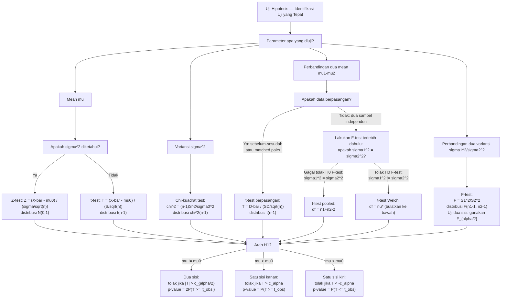

# 📊 4.8 — Uji Hipotesis

> [!ABSTRACT] Ringkasan Cepat
> **Topik:** Uji Hipotesis — Kerangka Umum, Z-test, t-test, $\chi^2$-test, F-test | **Bobot:** ~25–35% | **Difficulty:** Hard
> **Ref:** Hogg-Tanis-Zimm (2015) Bab 6.1–6.5; Hogg-McKean-Craig (2019) Bab 4.4–4.6; Miller et al. (2014) Bab 9.1–9.5; Walpole et al. (2012) Bab 10.1–10.5 | **Prereq:** [[4.1 Penarikan Sampel Acak]], [[4.2 Distribusi Sampel]], [[4.3 Teorema Limit Pusat (CLT)]], [[4.7 Interval Kepercayaan]]

## Section 0 — Pemetaan Topik

| Topik CF2 | Sub-topik ID | Skill Diuji | Bobot | Difficulty | Prerequisite | Connected Topics | Referensi |
|-----------|--------------|-------------|-------|------------|--------------|------------------|-----------|
| Topik 4: Inferensi Statistik | 4.8 | Merumuskan $H_0$ dan $H_1$ (satu sisi & dua sisi); mendefinisikan dan menghitung statistik uji $Z$, $t$, $\chi^2$, $F$; menentukan wilayah penolakan (*rejection region*) dari level signifikansi $\alpha$; menghitung dan menginterpretasikan $p$-value; membedakan Tipe I error ($\alpha$), Tipe II error ($\beta$), dan daya uji (*power* $= 1-\beta$); melaksanakan uji satu sampel untuk $\mu$ ($\sigma^2$ diketahui/tidak), untuk $\sigma^2$, uji dua sampel untuk $\mu_1-\mu_2$ (independen & berpasangan), dan uji $F$ untuk $\sigma_1^2/\sigma_2^2$; mengaitkan uji hipotesis dengan interval kepercayaan | 25–35% | Hard | [[4.1 Penarikan Sampel Acak]], [[4.2 Distribusi Sampel]], [[4.3 Teorema Limit Pusat (CLT)]], [[4.7 Interval Kepercayaan]] | [[4.7 Interval Kepercayaan]], [[4.9 Uji Goodness-of-Fit]], [[4.10 Regresi Linear Sederhana]] | Hogg-Tanis-Zimm (2015) Bab 6.1–6.5; Hogg-McKean-Craig (2019) Bab 4.4–4.6; Miller et al. (2014) Bab 9.1–9.5; Walpole et al. (2012) Bab 10.1–10.5 |

## Section 1 — Intuisi

Seorang aktuaris menduga bahwa rata-rata klaim dari polis asuransi jiwa baru lebih rendah dari Rp 150 juta — nilai historis perusahaan. Ia mengambil sampel 40 polis, menghitung $\bar{x} = 143$ juta, dan bertanya: "Apakah perbedaan ini cukup besar untuk menyimpulkan bahwa mean populasi benar-benar berubah, ataukah hanya fluktuasi acak sampel?" Inilah pertanyaan inti **uji hipotesis** (*hypothesis testing*): membedakan sinyal nyata dari kebisingan acak (*noise*).

Kerangka uji hipotesis bekerja dengan logika bukti *ex contrario* — mirip dengan pembuktian dalam hukum. Kita mulai dengan **hipotesis nol** $H_0$ yang menyatakan "tidak ada perubahan" atau "tidak ada efek" — anggap ini sebagai "praduga tak bersalah". Kemudian data memberikan bukti berupa statistik uji. Jika bukti cukup ekstrem (probabilitasnya kecil di bawah $H_0$), kita **tolak** $H_0$ dan menerima **hipotesis alternatif** $H_1$. Jika tidak cukup ekstrem, kita **gagal menolak** $H_0$ — bukan berarti $H_0$ terbukti benar, hanya saja bukti tidak cukup kuat untuk menolaknya.

Dua jenis kesalahan bisa terjadi: **Tipe I** (menolak $H_0$ yang sebenarnya benar — *false positive*) dan **Tipe II** (gagal menolak $H_0$ yang sebenarnya salah — *false negative*). Level signifikansi $\alpha$ adalah batas maksimum yang kita toleransi untuk Tipe I — biasanya 0,01, 0,05, atau 0,10. **Daya uji** (*power*) $= 1 - \beta$ mengukur kemampuan mendeteksi efek nyata. Ada *trade-off* inheren: untuk ukuran sampel tetap, memperkecil $\alpha$ (lebih ketat) akan memperbesar $\beta$ (lebih sering gagal mendeteksi efek nyata). Satu-satunya cara memperkecil keduanya sekaligus adalah memperbesar $n$.

**$p$-value** adalah probabilitas mendapat statistik uji se-ekstrem atau lebih ekstrem dari yang terobservasi, **jika $H_0$ benar**. $p$-value kecil berarti data sangat tidak konsisten dengan $H_0$ — semakin kecil $p$-value, semakin kuat bukti melawan $H_0$. Keputusan: tolak $H_0$ jika $p \leq \alpha$.

## Section 2 — Definisi Formal

> [!NOTE] Definisi Matematis
>
> **Hipotesis Statistik:**
> Pernyataan tentang parameter populasi $\theta$:
> $$H_0: \theta \in \Theta_0 \quad \text{(hipotesis nol)}, \qquad H_1: \theta \in \Theta_1 \quad \text{(hipotesis alternatif)}$$
> di mana $\Theta_0 \cap \Theta_1 = \emptyset$ dan $\Theta_0 \cup \Theta_1 = \Theta$ (semua nilai yang mungkin).
>
> **Tipe Hipotesis Alternatif:**
> $$H_1: \theta \neq \theta_0 \quad \text{(dua sisi)}, \quad H_1: \theta > \theta_0 \quad \text{(satu sisi kanan)}, \quad H_1: \theta < \theta_0 \quad \text{(satu sisi kiri)}$$
>
> **Statistik Uji (*Test Statistic*):**
> Fungsi dari data sampel $T = T(X_1,\ldots,X_n)$ yang digunakan untuk mengambil keputusan. Distribusi $T$ di bawah $H_0$ diketahui dan digunakan untuk menentukan wilayah penolakan.
>
> **$p$-value:**
> $$p\text{-value} = P(T \text{ se-ekstrem atau lebih} \mid H_0 \text{ benar})$$
> - Dua sisi: $p = P(|T| \geq |t_{\text{obs}}| \mid H_0)$
> - Satu sisi kanan: $p = P(T \geq t_{\text{obs}} \mid H_0)$
> - Satu sisi kiri: $p = P(T \leq t_{\text{obs}} \mid H_0)$

### Variabel & Parameter

| Simbol | Makna | Catatan |
|--------|-------|---------|
| $H_0$ | Hipotesis nol | Pernyataan "status quo"; ditolak atau gagal ditolak (tidak pernah "diterima") |
| $H_1$ (atau $H_a$) | Hipotesis alternatif | Yang ingin dibuktikan; satu sisi atau dua sisi |
| $\alpha$ | Level signifikansi | $= P(\text{Tipe I error}) = P(\text{tolak }H_0 \mid H_0 \text{ benar})$; dipilih sebelum uji |
| $\beta$ | Probabilitas Tipe II error | $= P(\text{gagal tolak }H_0 \mid H_1 \text{ benar})$; bergantung pada nilai $\theta$ di bawah $H_1$ |
| $1-\beta$ | Daya uji (*power*) | Probabilitas mendeteksi efek nyata; idealnya mendekati 1 |
| $t_{\text{obs}}$ | Nilai statistik uji terobservasi | Bilangan tetap dihitung dari data; dibandingkan dengan nilai kritis |
| $z_\alpha$ | Nilai kritis $N(0,1)$ ekor kanan $\alpha$ | $P(Z > z_\alpha) = \alpha$; contoh: $z_{0{,}05} = 1{,}645$, $z_{0{,}025} = 1{,}96$ |
| $t_\alpha(\nu)$ | Nilai kritis $t(\nu)$ ekor kanan $\alpha$ | $P(t(\nu) > t_\alpha(\nu)) = \alpha$ |
| $\chi^2_\alpha(\nu)$ | Nilai kritis $\chi^2(\nu)$ ekor kanan $\alpha$ | $P(\chi^2(\nu) > \chi^2_\alpha(\nu)) = \alpha$ |
| $F_\alpha(\nu_1,\nu_2)$ | Nilai kritis $F(\nu_1,\nu_2)$ ekor kanan $\alpha$ | $P(F(\nu_1,\nu_2) > F_\alpha(\nu_1,\nu_2)) = \alpha$ |
| $S_p^2$ | Variansi *pooled* | $S_p^2 = \frac{(n_1-1)S_1^2+(n_2-1)S_2^2}{n_1+n_2-2}$; digunakan saat $\sigma_1^2 = \sigma_2^2$ diasumsikan |

### Tabel Master: Semua Uji Hipotesis Utama

| Uji | Parameter | $H_0$ | Statistik Uji | Distribusi di bawah $H_0$ | Asumsi |
|-----|-----------|--------|--------------|--------------------------|--------|
| Z-test satu sampel | $\mu$ | $\mu = \mu_0$ | $Z = \dfrac{\bar{X}-\mu_0}{\sigma/\sqrt{n}}$ | $N(0,1)$ | $\sigma^2$ diketahui; Normal atau $n$ besar |
| t-test satu sampel | $\mu$ | $\mu = \mu_0$ | $T = \dfrac{\bar{X}-\mu_0}{S/\sqrt{n}}$ | $t(n-1)$ | $\sigma^2$ tidak diketahui; populasi Normal |
| $\chi^2$-test variansi | $\sigma^2$ | $\sigma^2 = \sigma_0^2$ | $\chi^2 = \dfrac{(n-1)S^2}{\sigma_0^2}$ | $\chi^2(n-1)$ | Populasi Normal |
| t-test dua sampel independen (variansi sama) | $\mu_1-\mu_2$ | $\mu_1=\mu_2$ | $T = \dfrac{\bar{X}_1-\bar{X}_2}{S_p\sqrt{1/n_1+1/n_2}}$ | $t(n_1+n_2-2)$ | Populasi Normal, $\sigma_1^2=\sigma_2^2$, independen |
| t-test dua sampel independen (variansi beda) | $\mu_1-\mu_2$ | $\mu_1=\mu_2$ | $T = \dfrac{\bar{X}_1-\bar{X}_2}{\sqrt{S_1^2/n_1+S_2^2/n_2}}$ | $t(\nu^*)$ Welch | Populasi Normal, $\sigma_1^2\neq\sigma_2^2$ |
| t-test berpasangan | $\mu_D = \mu_1-\mu_2$ | $\mu_D=0$ | $T = \dfrac{\bar{D}}{S_D/\sqrt{n}}$ | $t(n-1)$ | $D_i = X_{1i}-X_{2i}$ Normal; data berpasangan |
| F-test variansi | $\sigma_1^2/\sigma_2^2$ | $\sigma_1^2=\sigma_2^2$ | $F = S_1^2/S_2^2$ | $F(n_1-1,n_2-1)$ | Populasi Normal, dua sampel independen |

### Wilayah Penolakan per Tipe Alternatif

| $H_1$ | Wilayah Penolakan | $p$-value |
|--------|-------------------|----------|
| $\theta \neq \theta_0$ (dua sisi) | $\|T\| > c_{\alpha/2}$ | $2P(T \geq \|t_{\text{obs}}\|)$ |
| $\theta > \theta_0$ (satu sisi kanan) | $T > c_\alpha$ | $P(T \geq t_{\text{obs}})$ |
| $\theta < \theta_0$ (satu sisi kiri) | $T < -c_\alpha$ | $P(T \leq t_{\text{obs}})$ |

di mana $c_\alpha$ adalah nilai kritis distribusi yang sesuai pada level $\alpha$.

### Rumus Utama — Kerangka Pengambilan Keputusan

$$
\text{Tolak } H_0 \iff p\text{-value} \leq \alpha \iff |T_{\text{obs}}| > c_{\alpha/2} \text{ (dua sisi)}
$$
**Label: Kesetaraan Keputusan** — tiga cara pengambilan keputusan yang selalu konsisten: via $p$-value, via wilayah penolakan, dan via interval kepercayaan.

$$
\alpha = P(\text{Tipe I}) = P(\text{tolak } H_0 \mid H_0 \text{ benar}), \qquad \beta = P(\text{Tipe II}) = P(\text{gagal tolak } H_0 \mid H_1 \text{ benar})
$$
**Label: Dua Jenis Kesalahan** — $\alpha$ dikendalikan oleh pemilihan level signifikansi; $\beta$ bergantung pada nilai $\theta$ yang sebenarnya di bawah $H_1$.

$$
\text{Power}(\theta) = 1 - \beta(\theta) = P(\text{tolak } H_0 \mid \theta \text{ adalah nilai sebenarnya})
$$
**Label: Fungsi Daya Uji** — probabilitas mendeteksi bahwa $H_0$ salah ketika nilai parameter sesungguhnya adalah $\theta$; fungsi dari $\theta$, $n$, $\alpha$, dan statistik uji.

$$
\text{df Welch} = \nu^* = \frac{(S_1^2/n_1 + S_2^2/n_2)^2}{\dfrac{(S_1^2/n_1)^2}{n_1-1} + \dfrac{(S_2^2/n_2)^2}{n_2-1}}
$$
**Label: Derajat Kebebasan Welch (t-test Dua Sampel Variansi Berbeda)** — aproksimasi df untuk uji Welch-Satterthwaite; selalu dibulatkan ke bawah ke integer.

$$
\text{Hubungan IC dan Uji}: \quad \theta_0 \notin \text{IC}_{1-\alpha}(\theta) \iff \text{tolak } H_0: \theta = \theta_0 \text{ pada level } \alpha
$$
**Label: Dualitas Interval Kepercayaan dan Uji Hipotesis** — IC dua sisi $1-\alpha$ dan uji dua sisi pada level $\alpha$ selalu menghasilkan keputusan yang sama; interval kepercayaan memberikan informasi lebih kaya daripada keputusan biner.

### Asumsi Eksplisit

- **Z-test:** $\sigma^2$ diketahui **dan** populasi Normal (eksak) **atau** $n \geq 30$ (aproksimasi CLT). Dalam praktik sangat jarang karena $\sigma^2$ hampir tidak pernah diketahui.
- **t-test satu sampel:** Populasi Normal dengan $\sigma^2$ tidak diketahui. Robust terhadap deviasi ringan dari normalitas untuk $n \geq 15$.
- **t-test dua sampel pooled:** Kedua populasi Normal dengan **variansi sama** ($\sigma_1^2 = \sigma_2^2$); dua sampel independen. Sebaiknya lakukan F-test terlebih dahulu untuk memeriksa asumsi variansi sama.
- **t-test berpasangan:** Perbedaan $D_i = X_{1i} - X_{2i}$ harus Normal (atau $n$ cukup besar); data harus berpasangan secara natural (pengukuran sebelum-sesudah, atau pasangan yang cocok).
- **$\chi^2$-test variansi:** Populasi Normal — uji ini sangat tidak robust terhadap deviasi normalitas; bahkan deviasi ringan dapat memengaruhi validitasnya secara signifikan.
- **F-test variansi:** Kedua populasi Normal, dua sampel independen — seperti $\chi^2$-test, sangat sensitif terhadap asumsi normalitas.

## Section 3 — Jembatan Logika

> [!TIP] Dari Definisi ke Rumus
> **Mengapa statistik uji terdistribusi seperti yang dinyatakan di bawah $H_0$?**
>
> Untuk Z-test: jika $H_0: \mu = \mu_0$ benar dan $X_i \overset{\text{i.i.d.}}{\sim} N(\mu_0, \sigma^2)$, maka:
> $$\bar{X} \sim N\!\left(\mu_0, \frac{\sigma^2}{n}\right) \implies Z = \frac{\bar{X}-\mu_0}{\sigma/\sqrt{n}} \sim N(0,1)$$
>
> Untuk t-test: mengganti $\sigma$ dengan $S$ menghasilkan $T = (\bar{X}-\mu_0)/(S/\sqrt{n}) \sim t(n-1)$ (Fisher's Theorem). Distribusi-$t$ berlaku **eksak** untuk populasi Normal; untuk populasi non-Normal dengan $n$ besar, CLT memastikan $T$ mendekati $N(0,1)$.
>
> Untuk $\chi^2$-test: dari Fisher's Theorem, $(n-1)S^2/\sigma^2 \sim \chi^2(n-1)$. Jika $H_0: \sigma^2 = \sigma_0^2$ benar: $(n-1)S^2/\sigma_0^2 \sim \chi^2(n-1)$.
>
> Untuk F-test: $F = S_1^2/S_2^2 = [(n_1-1)S_1^2/\sigma_1^2/(n_1-1)] / [(n_2-1)S_2^2/\sigma_2^2/(n_2-1)]$. Jika $H_0: \sigma_1^2 = \sigma_2^2$ benar, faktor $\sigma^2$ hilang dan $F \sim F(n_1-1, n_2-1)$.

> [!IMPORTANT] Lima Langkah Baku Uji Hipotesis
>
> Setiap soal uji hipotesis harus diselesaikan dengan urutan langkah yang sama:
>
> **Langkah 1 — Rumuskan Hipotesis:**
> Nyatakan $H_0$ dan $H_1$ secara eksplisit dalam bentuk parameter ($\mu$, $\sigma^2$, dsb.), bukan dalam kata-kata saja. Tentukan apakah uji satu sisi atau dua sisi berdasarkan konteks soal.
>
> **Langkah 2 — Pilih Statistik Uji dan Distribusinya di bawah $H_0$:**
> Identifikasi uji yang sesuai dari tabel master (Z, $t$, $\chi^2$, $F$). Sebutkan distribusi di bawah $H_0$ beserta derajat kebebasannya.
>
> **Langkah 3 — Tentukan Wilayah Penolakan atau Nilai Kritis:**
> Dari level signifikansi $\alpha$ dan distribusi di langkah 2, tentukan nilai kritis $c_\alpha$ atau $c_{\alpha/2}$. Wilayah penolakan bergantung pada arah $H_1$.
>
> **Langkah 4 — Hitung Statistik Uji dari Data:**
> Substitusikan nilai sampel ($\bar{x}$, $s$, $n$, dsb.) ke formula statistik uji. Ini menghasilkan satu bilangan $t_{\text{obs}}$.
>
> **Langkah 5 — Ambil Keputusan dan Interpretasikan:**
> Bandingkan $t_{\text{obs}}$ dengan nilai kritis (atau hitung $p$-value). Nyatakan keputusan dalam konteks masalah asli — bukan hanya "tolak" atau "gagal tolak" secara abstrak.

**Derivasi Daya Uji untuk Z-test Satu Sisi:**

Untuk uji satu sisi kanan $H_1: \mu > \mu_0$ dengan statistik $Z = (\bar{X}-\mu_0)/(\sigma/\sqrt{n})$:

Wilayah penolakan: $Z > z_\alpha$, ekuivalen dengan $\bar{X} > \mu_0 + z_\alpha \cdot \sigma/\sqrt{n} := c$.

Daya pada nilai alternatif $\mu_1 > \mu_0$:
$$
\text{Power}(\mu_1) = P(\bar{X} > c \mid \mu = \mu_1) = P\!\left(Z > \frac{c - \mu_1}{\sigma/\sqrt{n}}\right) = 1 - \Phi\!\left(\frac{c - \mu_1}{\sigma/\sqrt{n}}\right)
$$

Substitusi $c = \mu_0 + z_\alpha \cdot \sigma/\sqrt{n}$:
$$
\text{Power}(\mu_1) = 1 - \Phi\!\left(z_\alpha - \frac{(\mu_1-\mu_0)\sqrt{n}}{\sigma}\right) = \Phi\!\left(\frac{(\mu_1-\mu_0)\sqrt{n}}{\sigma} - z_\alpha\right)
$$

Untuk dua sisi ($H_1: \mu \neq \mu_0$), aproksimasi yang biasa digunakan:
$$\text{Power}(\mu_1) \approx \Phi\!\left(\frac{|\mu_1-\mu_0|\sqrt{n}}{\sigma} - z_{\alpha/2}\right)$$

**Ukuran Sampel untuk Daya Target:**

Untuk mencapai $\text{Power}(\mu_1) \geq 1-\beta$ pada uji satu sisi:
$$
n \geq \left(\frac{(z_\alpha + z_\beta)\,\sigma}{\mu_1 - \mu_0}\right)^2
$$

Untuk uji dua sisi, ganti $z_\alpha$ dengan $z_{\alpha/2}$.

**Hubungan IC dengan Uji Hipotesis (Dualitas):**

IC dua sisi $1-\alpha$ untuk $\mu$: $\bar{x} \pm t_{\alpha/2}(n-1) \cdot s/\sqrt{n}$.

Tolak $H_0: \mu = \mu_0$ pada level $\alpha$ $\iff$ $\mu_0$ berada di luar IC $1-\alpha$ $\iff$ $|t_{\text{obs}}| > t_{\alpha/2}(n-1)$.

Dualitas ini berarti IC memberikan **semua informasi** yang diberikan uji hipotesis ditambah ukuran efek — IC selalu lebih informatif dari sekadar keputusan biner.

> [!DANGER] Dilarang
> 1. **Dilarang** menyimpulkan "$H_0$ terbukti benar" atau "$H_0$ diterima" ketika gagal menolak $H_0$. Ketidakmampuan menolak $H_0$ **tidak** berarti $H_0$ benar — hanya berarti bukti tidak cukup kuat. Frasa yang benar: "**gagal menolak** $H_0$" atau "tidak cukup bukti untuk menolak $H_0$".
> 2. **Dilarang** mengubah level signifikansi $\alpha$ **setelah** melihat data. $\alpha$ harus dipilih sebelum pengumpulan data. Menyesuaikan $\alpha$ agar keputusan sesuai harapan adalah manipulasi statistik (*p-hacking*).
> 3. **Dilarang** menginterpretasikan $p$-value sebagai probabilitas bahwa $H_0$ benar. $p$-value adalah $P(\text{data se-ekstrem} \mid H_0 \text{ benar})$ — bukan $P(H_0 \text{ benar} \mid \text{data})$. Keduanya sangat berbeda (Teorema Bayes diperlukan untuk yang kedua).

## Section 4 — Contoh Soal

### Soal A — Fundamental

Sebuah perusahaan asuransi mengklaim bahwa rata-rata waktu penyelesaian klaim adalah **$\mu_0 = 14$ hari**. Seorang regulator mengambil sampel acak $n = 25$ klaim dan memperoleh $\bar{x} = 15{,}8$ hari dan $s = 4{,}5$ hari. Asumsikan waktu penyelesaian berdistribusi Normal.

(a) Rumuskan $H_0$ dan $H_1$ untuk menguji apakah rata-rata **berbeda** dari 14 hari. Tentukan level signifikansi $\alpha = 0{,}05$.
(b) Identifikasi statistik uji yang sesuai beserta distribusinya di bawah $H_0$. Jelaskan mengapa $t$-test, bukan $Z$-test.
(c) Hitung nilai statistik uji $t_{\text{obs}}$ dan tentukan wilayah penolakan.
(d) Hitung $p$-value dan ambil keputusan.
(e) Bangun IC $95\%$ untuk $\mu$ dan verifikasi konsistensinya dengan keputusan uji hipotesis.

> [!SUCCESS] Solusi Soal A
>
> **1. Identifikasi Variabel**
> - $n = 25$; $\bar{x} = 15{,}8$; $s = 4{,}5$; $\mu_0 = 14$
> - $\sigma^2$ tidak diketahui; populasi Normal
> - df $= n-1 = 24$
>
> **2. Identifikasi Distribusi / Model**
> $\sigma^2$ tidak diketahui → t-test satu sampel. Statistik $T = (\bar{X}-\mu_0)/(S/\sqrt{n}) \sim t(24)$ di bawah $H_0$.
>
> **3. Setup Persamaan**
>
> Lima langkah baku:
>
> **4. Eksekusi Aljabar**
>
> **(a) Hipotesis:**
> $$H_0: \mu = 14 \quad \text{vs} \quad H_1: \mu \neq 14 \quad (\text{dua sisi}), \quad \alpha = 0{,}05$$
>
> **(b) Statistik uji dan justifikasi:**
>
> Gunakan **t-test** karena $\sigma^2$ tidak diketahui dan diestimasi dengan $s^2$. Jika digunakan Z-test, kita perlu $\sigma$ (diketahui), yang tidak diberikan dalam soal. Substitusi $s$ ke formula Z-test menghasilkan distribusi $t$, bukan Normal standar (Fisher's Theorem).
>
> $$T = \frac{\bar{X} - \mu_0}{S/\sqrt{n}} \sim t(24) \quad \text{di bawah } H_0$$
>
> **(c) Nilai kritis, wilayah penolakan, dan $t_{\text{obs}}$:**
>
> Nilai kritis (dua sisi, $\alpha = 0{,}05$, df $= 24$):
> $$t_{\alpha/2}(24) = t_{0{,}025}(24) = 2{,}064$$
>
> Wilayah penolakan: $|T| > 2{,}064$, yaitu $T < -2{,}064$ atau $T > 2{,}064$.
>
> Hitung $t_{\text{obs}}$:
> $$t_{\text{obs}} = \frac{15{,}8 - 14}{4{,}5/\sqrt{25}} = \frac{1{,}8}{4{,}5/5} = \frac{1{,}8}{0{,}9} = 2{,}00$$
>
> **(d) $p$-value dan keputusan:**
>
> Karena uji dua sisi dan $t_{\text{obs}} = 2{,}00$:
> $$p\text{-value} = 2\,P(t(24) \geq 2{,}00) = 2 \times P(t(24) > 2{,}00)$$
>
> Dari tabel $t(24)$: $P(t(24) > 2{,}064) = 0{,}025$ dan $P(t(24) > 1{,}711) = 0{,}05$. Karena $t_{\text{obs}} = 2{,}00$ berada di antara keduanya:
> $$0{,}05 < p\text{-value} < 0{,}10$$
>
> Lebih tepatnya: $p\text{-value} \approx 2 \times 0{,}029 = 0{,}058$.
>
> **Keputusan:** Karena $p\text{-value} \approx 0{,}058 > \alpha = 0{,}05$, **gagal menolak $H_0$**.
>
> Juga: $|t_{\text{obs}}| = 2{,}00 < 2{,}064 = t_{0{,}025}(24)$ — tidak masuk wilayah penolakan.
>
> **Interpretasi:** Pada level signifikansi 5%, tidak terdapat cukup bukti statistik bahwa rata-rata waktu penyelesaian klaim berbeda dari 14 hari. Namun, $p$-value $\approx 0{,}058$ cukup dekat dengan 0,05 — hasil ini bersifat marginal dan mungkin signifikan pada $\alpha = 0{,}10$.
>
> **(e) IC 95% dan dualitas:**
>
> $$\text{IC}_{95\%}(\mu) = \bar{x} \pm t_{0{,}025}(24) \cdot \frac{s}{\sqrt{n}} = 15{,}8 \pm 2{,}064 \times 0{,}9 = 15{,}8 \pm 1{,}858 = (13{,}942;\; 17{,}658)$$
>
> **Verifikasi dualitas:** $\mu_0 = 14$ berada **di dalam** interval $(13{,}942;\; 17{,}658)$ → gagal menolak $H_0$ ✓. Konsisten dengan keputusan via $p$-value.
>
> **5. Verification**
> - $t_{\text{obs}} = 2{,}00$: hitung ulang $(15{,}8 - 14)/(4{,}5/5) = 1{,}8/0{,}9 = 2{,}00$ ✓
> - $p$-value $> \alpha$: gagal tolak $H_0$; $\mu_0 \in$ IC: gagal tolak $H_0$ — kedua metode konsisten ✓
> - IC mencakup 14: $(13{,}94; 17{,}66)$ — 14 berada sangat dekat batas bawah, menjelaskan hasil marginal ✓

> [!WARNING] Exam Tips — Soal A
> **Target waktu:** 10–12 menit
> **Common trap 1:** $t_{\text{obs}} = 2{,}00 < t_{0{,}025}(24) = 2{,}064$ → **gagal tolak**. Banyak kandidat salah karena membandingkan $t_{\text{obs}}$ dengan $z_{0{,}025} = 1{,}96$ (menggunakan nilai kritis Normal, bukan $t$). Untuk $n=25$ dengan $\sigma$ tidak diketahui, selalu gunakan nilai kritis $t$, bukan $z$.
> **Common trap 2:** $p$-value untuk uji dua sisi = **dua kali** probabilitas ekor satu sisi. Jangan lupa faktor 2.
> **Shortcut:** IC dan uji hipotesis selalu konsisten — jika IC dua sisi $1-\alpha$ sudah dihitung, cukup periksa apakah $\mu_0$ ada di dalam IC untuk keputusan tanpa perlu menghitung statistik uji secara terpisah.

---

### Soal B — Exam-Typical

Sebuah perusahaan re-asuransi mengklaim bahwa variansi kerugian klaim dari dua lini bisnis (Lini A: $n_1=16$ sampel, $s_1^2 = 120$; Lini B: $n_2=21$ sampel, $s_2^2 = 45$) adalah sama. Diasumsikan kerugian berdistribusi Normal secara independen.

(a) Lakukan **F-test** untuk menguji $H_0: \sigma_1^2 = \sigma_2^2$ vs $H_1: \sigma_1^2 \neq \sigma_2^2$ pada $\alpha = 0{,}10$.
(b) Hitung $p$-value (pendekatan via tabel $F$).
(c) Jika kesimpulan dari (a) adalah variansi **berbeda**, lakukan uji $H_0: \mu_1 = \mu_2$ menggunakan t-test Welch. Data tambahan: $\bar{x}_1 = 85$, $\bar{x}_2 = 72$. Hitung df Welch $\nu^*$ (pembulatan ke bawah).
(d) Jika sebaliknya variansi **sama**, hitung statistik uji $t$ pooled dan tentukan distribusinya.
(e) Sebuah auditor mengambil sampel $n=20$ klaim dari Lini A dan menguji $H_0: \sigma_1^2 = 100$ vs $H_1: \sigma_1^2 > 100$ pada $\alpha = 0{,}05$. Data: $s^2 = 147$. Lakukan uji $\chi^2$ lengkap.

> [!SUCCESS] Solusi Soal B
>
> **1. Identifikasi Variabel**
> - Lini A: $n_1=16$, $\bar{x}_1=85$, $s_1^2=120$; df$_1 = 15$
> - Lini B: $n_2=21$, $\bar{x}_2=72$, $s_2^2=45$; df$_2 = 20$
> - Kedua populasi Normal, independen
>
> **2. Identifikasi Distribusi / Model**
> F-test untuk variansi; t-test (pooled atau Welch) untuk mean tergantung hasil F-test; $\chi^2$-test untuk variansi satu sampel.
>
> **3. Setup Persamaan**
>
> F-test: $F = S_1^2/S_2^2$ (peletakan numerator: variansi lebih besar di atas untuk kemudahan)
>
> **4. Eksekusi Aljabar**
>
> **(a) F-test $H_0: \sigma_1^2 = \sigma_2^2$:**
>
> $H_0: \sigma_1^2 = \sigma_2^2$ vs $H_1: \sigma_1^2 \neq \sigma_2^2$, $\alpha = 0{,}10$.
>
> Letakkan variansi lebih besar di numerator (konvensi umum untuk uji dua sisi):
> $$F_{\text{obs}} = \frac{s_1^2}{s_2^2} = \frac{120}{45} = \frac{8}{3} \approx 2{,}667, \quad F \sim F(15, 20) \text{ di bawah } H_0$$
>
> Nilai kritis (dua sisi, $\alpha/2 = 0{,}05$ untuk ekor kanan karena $s_1^2 > s_2^2$):
> $$F_{0{,}05}(15, 20) \approx 2{,}20$$
>
> Wilayah penolakan (ekor kanan karena $s_1^2 > s_2^2$ diletakkan di numerator): $F > F_{0{,}05}(15,20) = 2{,}20$.
>
> **Keputusan:** $F_{\text{obs}} = 2{,}667 > 2{,}20$ → **Tolak $H_0$**.
>
> Kesimpulan: Cukup bukti bahwa variansi kedua lini bisnis berbeda pada $\alpha = 0{,}10$.
>
> **(b) $p$-value F-test:**
>
> $p\text{-value} = 2 \times P(F(15,20) \geq 2{,}667)$ (karena dua sisi).
>
> Dari tabel: $F_{0{,}05}(15,20) = 2{,}20$ dan $F_{0{,}025}(15,20) \approx 2{,}57$. Karena $F_{\text{obs}} = 2{,}667 > 2{,}57$:
> $$P(F(15,20) \geq 2{,}667) < 0{,}025$$
>
> Maka $p\text{-value} = 2 \times P(\ldots) < 0{,}05$. Lebih tepatnya: $p$-value $\approx 2 \times 0{,}020 = 0{,}040$.
>
> **(c) t-test Welch ($\sigma_1^2 \neq \sigma_2^2$):**
>
> Statistik uji:
> $$T_{\text{obs}} = \frac{\bar{x}_1 - \bar{x}_2}{\sqrt{s_1^2/n_1 + s_2^2/n_2}} = \frac{85 - 72}{\sqrt{120/16 + 45/21}} = \frac{13}{\sqrt{7{,}5 + 2{,}143}} = \frac{13}{\sqrt{9{,}643}} = \frac{13}{3{,}105} = 4{,}187$$
>
> Derajat kebebasan Welch:
> $$\nu^* = \frac{(s_1^2/n_1 + s_2^2/n_2)^2}{\dfrac{(s_1^2/n_1)^2}{n_1-1} + \dfrac{(s_2^2/n_2)^2}{n_2-1}} = \frac{(7{,}5 + 2{,}143)^2}{\dfrac{(7{,}5)^2}{15} + \dfrac{(2{,}143)^2}{20}}$$
>
> $$= \frac{(9{,}643)^2}{\dfrac{56{,}25}{15} + \dfrac{4{,}592}{20}} = \frac{92{,}99}{3{,}75 + 0{,}230} = \frac{92{,}99}{3{,}980} = 23{,}37 \to \nu^* = 23$$
>
> Distribusi: $T \sim t(23)$ di bawah $H_0: \mu_1 = \mu_2$.
>
> Nilai kritis dua sisi $\alpha = 0{,}05$: $t_{0{,}025}(23) = 2{,}069$.
>
> $T_{\text{obs}} = 4{,}187 > 2{,}069$ → **Tolak $H_0$**. Cukup bukti $\mu_1 \neq \mu_2$.
>
> **(d) t-test Pooled ($\sigma_1^2 = \sigma_2^2$ — skenario alternatif):**
>
> $$s_p^2 = \frac{(n_1-1)s_1^2 + (n_2-1)s_2^2}{n_1+n_2-2} = \frac{15 \times 120 + 20 \times 45}{35} = \frac{1800 + 900}{35} = \frac{2700}{35} = 77{,}14$$
>
> $$T_{\text{obs}} = \frac{\bar{x}_1-\bar{x}_2}{s_p\sqrt{1/n_1+1/n_2}} = \frac{13}{\sqrt{77{,}14}\sqrt{1/16+1/21}} = \frac{13}{8{,}783\sqrt{0{,}1101}} = \frac{13}{8{,}783 \times 0{,}3318} = \frac{13}{2{,}915} = 4{,}461$$
>
> Distribusi di bawah $H_0$: $T \sim t(n_1+n_2-2) = t(35)$.
>
> **(e) $\chi^2$-test untuk $\sigma_1^2$:**
>
> $H_0: \sigma_1^2 = 100$ vs $H_1: \sigma_1^2 > 100$, $\alpha = 0{,}05$, $n=20$, $s^2=147$.
>
> **Langkah 1:** $H_0: \sigma^2 = 100$, $H_1: \sigma^2 > 100$ (satu sisi kanan).
>
> **Langkah 2:** $\chi^2 = (n-1)s^2/\sigma_0^2 \sim \chi^2(n-1) = \chi^2(19)$ di bawah $H_0$.
>
> **Langkah 3:** Nilai kritis (satu sisi kanan): $\chi^2_{0{,}05}(19) = 30{,}144$.
> Wilayah penolakan: $\chi^2 > 30{,}144$.
>
> **Langkah 4:** $\chi^2_{\text{obs}} = \dfrac{(20-1) \times 147}{100} = \dfrac{19 \times 147}{100} = \dfrac{2793}{100} = 27{,}93$.
>
> **Langkah 5:** $\chi^2_{\text{obs}} = 27{,}93 < 30{,}144$ → **Gagal menolak $H_0$**.
>
> Interpretasi: Tidak cukup bukti bahwa variansi kerugian Lini A melebihi 100 pada level signifikansi 5%.
>
> **5. Verification**
> - $F_{\text{obs}} = 120/45 = 8/3$ — pastikan pembilang adalah variansi lebih besar ✓
> - df Welch $\nu^* = 23$ (dibulatkan dari 23,37 ke **bawah**) — bukan 24 ✓
> - $\chi^2_{\text{obs}} = 19 \times 147/100 = 27{,}93$: antara $\chi^2_{0{,}10}(19)=27{,}20$ dan $\chi^2_{0{,}05}(19)=30{,}14$ → $p$-value $\approx 0{,}065$ → tidak tolak pada $\alpha=0{,}05$ ✓

> [!WARNING] Exam Tips — Soal B
> **Target waktu:** 16–19 menit
> **Common trap 1 (F-test):** Untuk uji dua sisi, nilai kritis adalah $F_{\alpha/2}(\nu_1,\nu_2)$ (bukan $F_\alpha$). Dengan $\alpha=0{,}10$, gunakan $F_{0{,}05}(15,20)$. Konvensi meletakkan variansi lebih besar di numerator memungkinkan kita hanya memeriksa ekor kanan.
> **Common trap 2 (Welch df):** Selalu bulatkan $\nu^*$ ke **bawah**, tidak ke atas dan tidak ke nearest integer. $23{,}37 \to 23$, bukan 24.
> **Common trap 3 ($\chi^2$-test):** Statistik uji menggunakan $\sigma_0^2$ (dari $H_0$), bukan $s^2$ yang tidak diketahui. Formula: $(n-1)s^2/\sigma_0^2$ — bagi dengan nilai hipotesis, bukan variansi sampel.

---

### Soal C — Challenging

Suatu studi membandingkan besarnya klaim sebelum dan sesudah implementasi program manajemen risiko baru. Sampel $n = 12$ polis yang **sama** diukur sebelum ($X_{1i}$) dan sesudah ($X_{2i}$) program, dengan data perbedaan $D_i = X_{1i} - X_{2i}$ (positif = klaim berkurang):

$$d_1,\ldots,d_{12}: \quad 3, -1, 5, 2, 8, -2, 4, 6, 1, 3, 2, 5$$

(a) Jelaskan mengapa harus menggunakan **t-test berpasangan** bukan t-test dua sampel independen.
(b) Hitung $\bar{d}$ dan $s_D$, lalu lakukan uji $H_0: \mu_D = 0$ vs $H_1: \mu_D > 0$ pada $\alpha = 0{,}05$.
(c) Hitung $p$-value dan buat kesimpulan dalam konteks aktuaria.
(d) Bangun IC $95\%$ satu sisi (batas bawah) untuk $\mu_D$.
(e) Hitung **daya uji** (*power*) jika nilai sebenarnya $\mu_D = 2$ dengan $\sigma_D \approx s_D$ yang dihitung di bagian (b). Gunakan aproksimasi Normal.

> [!SUCCESS] Solusi Soal C
>
> **1. Identifikasi Variabel**
> - $n = 12$ pasangan; $D_i = X_{1i} - X_{2i}$
> - Data: $3, -1, 5, 2, 8, -2, 4, 6, 1, 3, 2, 5$
> - df $= n - 1 = 11$
>
> **2. Identifikasi Distribusi / Model**
> t-test berpasangan: perlakukan $D_i$ sebagai satu sampel i.i.d. $\sim N(\mu_D, \sigma_D^2)$.
>
> **3. Setup Persamaan**
>
> $T = (\bar{D} - 0)/(S_D/\sqrt{n}) \sim t(11)$ di bawah $H_0: \mu_D = 0$.
>
> **4. Eksekusi Aljabar**
>
> **(a) Justifikasi t-test berpasangan:**
>
> Data **tidak independen**: pengukuran sebelum dan sesudah diambil dari **polis yang sama**. Setiap pasangan $(X_{1i}, X_{2i})$ berkorelasi — karakteristik risiko polis memengaruhi keduanya. T-test dua sampel independen mengasumsikan $X_{1i} \perp X_{2i}$, yang dilanggar di sini. T-test berpasangan menghilangkan variasi antar-polis dengan menganalisis perbedaan $D_i$, menghasilkan uji yang lebih kuat (*powerful*).
>
> **(b) Hitung $\bar{d}$, $s_D$, dan statistik uji:**
>
> $$\bar{d} = \frac{3+(-1)+5+2+8+(-2)+4+6+1+3+2+5}{12} = \frac{36}{12} = 3{,}00$$
>
> Hitung $\sum d_i^2$:
> $$3^2+1^2+5^2+2^2+8^2+2^2+4^2+6^2+1^2+3^2+2^2+5^2 = 9+1+25+4+64+4+16+36+1+9+4+25 = 198$$
>
> $$s_D^2 = \frac{\sum d_i^2 - n\bar{d}^2}{n-1} = \frac{198 - 12 \times 9}{11} = \frac{198 - 108}{11} = \frac{90}{11} = 8{,}182$$
>
> $$s_D = \sqrt{8{,}182} = 2{,}860$$
>
> Statistik uji:
> $$t_{\text{obs}} = \frac{\bar{d}}{s_D/\sqrt{n}} = \frac{3{,}00}{2{,}860/\sqrt{12}} = \frac{3{,}00}{2{,}860/3{,}464} = \frac{3{,}00}{0{,}826} = 3{,}632$$
>
> Nilai kritis satu sisi kanan, $\alpha = 0{,}05$, df $= 11$:
> $$t_{0{,}05}(11) = 1{,}796$$
>
> $t_{\text{obs}} = 3{,}632 > 1{,}796$ → **Tolak $H_0$**.
>
> **(c) $p$-value dan kesimpulan:**
>
> Satu sisi kanan: $p\text{-value} = P(t(11) \geq 3{,}632)$.
>
> Dari tabel: $t_{0{,}005}(11) = 3{,}106$ dan $t_{0{,}0025}(11) \approx 3{,}497$. Karena $t_{\text{obs}} = 3{,}632 > 3{,}497$:
> $$p\text{-value} < 0{,}005$$
>
> Lebih tepatnya: $p$-value $\approx 0{,}002$.
>
> **Kesimpulan aktuaria:** Pada level signifikansi 5% (bahkan 0,5%), terdapat bukti statistik yang sangat kuat bahwa program manajemen risiko baru berhasil **mengurangi** besarnya klaim secara rata-rata. Rata-rata pengurangan klaim yang diestimasi adalah Rp 3 juta per polis ($\bar{d} = 3$).
>
> **(d) IC 95% satu sisi (batas bawah) untuk $\mu_D$:**
>
> IC satu sisi kanan (memberikan batas bawah):
> $$\mu_D > \bar{d} - t_{0{,}05}(11) \cdot \frac{s_D}{\sqrt{n}} = 3{,}00 - 1{,}796 \times 0{,}826 = 3{,}00 - 1{,}484 = 1{,}516$$
>
> IC: $\mu_D > 1{,}516$ juta rupiah dengan kepercayaan 95%.
>
> Interpretasi: Rata-rata pengurangan klaim akibat program manajemen risiko adalah setidaknya Rp 1,516 juta per polis dengan kepercayaan 95%.
>
> **(e) Daya uji pada $\mu_D = 2$:**
>
> Gunakan aproksimasi Normal untuk daya uji satu sisi kanan.
>
> Dengan $\sigma_D \approx s_D = 2{,}860$ dan $n = 12$, standar error $\approx 2{,}860/\sqrt{12} = 0{,}826$.
>
> Nilai kritis dalam skala $\bar{D}$: $c = \mu_0 + t_{0{,}05}(11) \cdot \text{SE} = 0 + 1{,}796 \times 0{,}826 = 1{,}483$.
>
> Daya pada $\mu_D = 2$:
> $$\text{Power}(2) = P(\bar{D} > 1{,}483 \mid \mu_D = 2) = P\!\left(Z > \frac{1{,}483 - 2}{0{,}826}\right) = P(Z > -0{,}626)$$
> $$= 1 - \Phi(-0{,}626) = \Phi(0{,}626) \approx 0{,}734$$
>
> Interpretasi: Jika pengurangan rata-rata sesungguhnya adalah Rp 2 juta, uji ini memiliki daya 73,4% untuk mendeteksinya — artinya 26,6% kemungkinan gagal mendeteksi efek nyata (Tipe II error) dengan $n=12$.
>
> **5. Verification**
> - $\bar{d} = 36/12 = 3{,}00$; cek: $\sum d_i = 3-1+5+2+8-2+4+6+1+3+2+5 = 36$ ✓
> - $s_D^2 = 90/11 = 8{,}182$: selalu non-negatif; $s_D = 2{,}86$ lebih kecil dari range data ($8-(-2)=10$) ✓
> - Daya 73,4% untuk efek $\mu_D = 2$ dengan $n=12$: wajar — efek relatif kecil ($2/2{,}86 \approx 0{,}7$ SD) dan $n$ tidak besar ✓
> - IC batas bawah $> 1{,}516$: secara praktis bermakna (pengurangan setidaknya Rp 1,5 juta) ✓

> [!WARNING] Exam Tips — Soal C
> **Target waktu:** 18–22 menit
> **Common trap 1:** Menggunakan t-test dua sampel independen untuk data berpasangan adalah kesalahan konseptual serius. Kunci identifikasi: "polis yang sama diukur dua kali", "sebelum-sesudah", "pasangan yang cocok" (*matched pairs*) → selalu t-test berpasangan.
> **Common trap 2:** Formula $s_D^2 = (\sum d_i^2 - n\bar{d}^2)/(n-1)$ lebih cepat dari menghitung $(d_i - \bar{d})^2$ satu per satu untuk $n$ besar. Hafalkan bentuk komputasi ini.
> **Common trap 3:** IC satu sisi memberikan **batas bawah** (untuk $H_1: \mu_D > 0$), bukan interval dua sisi. Gunakan $t_\alpha$ (bukan $t_{\alpha/2}$) untuk IC satu sisi.
> **Common trap 4:** Untuk daya uji, aproksimasi Normal menggunakan $\sigma_D \approx s_D$ — ini menghasilkan aproksimasi, bukan nilai eksak. Nilai eksak memerlukan distribusi non-central $t$ yang di luar cakupan CF2.

## Section 5 — Verifikasi & Sanity Check

> [!CHECK] Validasi Pemilihan Uji
> Sebelum menghitung statistik uji apapun, jawab empat pertanyaan ini berurutan:
> 1. **Parameter apa yang diuji?** $\mu$, $\sigma^2$, atau $\mu_1-\mu_2$, atau $\sigma_1^2/\sigma_2^2$? ✓
> 2. **Berapa sampel?** Satu, dua independen, atau dua berpasangan? ✓
> 3. **Apakah $\sigma^2$ diketahui?** Ya → $Z$; Tidak → $t$ (untuk $\mu$) ✓
> 4. **Apakah populasi Normal atau $n$ cukup besar?** Ini menentukan apakah distribusi berlaku eksak atau hanya aproksimasi ✓

> [!CHECK] Validasi Arah Wilayah Penolakan
> - Dua sisi ($H_1: \theta \neq \theta_0$): tolak jika $|T| > c_{\alpha/2}$; gunakan $z_{\alpha/2}$ atau $t_{\alpha/2}(\nu)$ ✓
> - Satu sisi kanan ($H_1: \theta > \theta_0$): tolak jika $T > c_\alpha$; gunakan $z_\alpha$ atau $t_\alpha(\nu)$ ✓
> - Satu sisi kiri ($H_1: \theta < \theta_0$): tolak jika $T < -c_\alpha$; gunakan $-z_\alpha$ atau $-t_\alpha(\nu)$ ✓
> - $p$-value untuk dua sisi = **dua kali** ekor satu sisi ✓

> [!CHECK] Validasi Derajat Kebebasan
> | Uji | df |
> |-----|-----|
> | t satu sampel | $n-1$ |
> | t dua sampel pooled | $n_1+n_2-2$ |
> | t Welch | $\nu^*$ (hitung dan bulatkan **ke bawah**) |
> | t berpasangan | $n-1$ (bukan $2n-2$!) |
> | $\chi^2$ variansi | $n-1$ |
> | $F$ dua sampel | $(n_1-1, n_2-1)$ |

> [!CHECK] Validasi Keputusan via Dua Metode
> Selalu verifikasi menggunakan minimal dua cara berbeda:
> 1. Metode wilayah penolakan: $|T_{\text{obs}}|$ vs nilai kritis $c$ ✓
> 2. Metode $p$-value: $p$ vs $\alpha$ ✓
> 3. Metode IC (untuk uji dua sisi): apakah $\theta_0 \in$ IC $_{1-\alpha}$? ✓
>
> Ketiga metode harus menghasilkan keputusan yang sama — jika tidak, ada kesalahan perhitungan.

### Metode Alternatif

**Menggunakan IC untuk keputusan uji hipotesis:** Bangun IC $1-\alpha$ untuk parameter. Tolak $H_0: \theta = \theta_0$ jika $\theta_0$ berada di luar IC. Lebih informatif dari keputusan biner karena menunjukkan range nilai yang kompatibel dengan data.

**Menentukan $p$-value dari tabel:** Untuk $t_{\text{obs}}$ dan df diketahui, lokasikan $t_{\text{obs}}$ di antara dua nilai kritis tabel untuk mendapat batas atas dan bawah $p$-value. Contoh: jika $t_{\text{obs}} = 2{,}50$ dan df $= 15$, dan $t_{0{,}025}(15) = 2{,}131$ serta $t_{0{,}01}(15) = 2{,}602$, maka $0{,}01 < p/2 < 0{,}025$ → $0{,}02 < p < 0{,}05$.

## Section 6 — Visualisasi Mental

**Distribusi Sampling di bawah $H_0$ — Kurva Standar:**

Bayangkan distribusi $T$ di bawah $H_0$ sebagai kurva simetris berpusat di nol (untuk $Z$ dan $t$) atau kurva right-skewed berpusat di df (untuk $\chi^2$). Wilayah penolakan adalah ekor-ekor yang diarsir — area total = $\alpha$. Nilai terobservasi $t_{\text{obs}}$ adalah satu titik pada kurva ini. Jika titik ini jatuh di wilayah yang diarsir, kita tolak $H_0$. $p$-value adalah luas area dari $t_{\text{obs}}$ ke ekor — semakin kecil area ini, semakin tidak kompatibel data dengan $H_0$.

**Trade-off $\alpha$ dan $\beta$ — Dua Kurva:**

Bayangkan dua kurva distribusi: satu di bawah $H_0$ (berpusat di $\mu_0$) dan satu di bawah $H_1$ (berpusat di $\mu_1 > \mu_0$). Nilai kritis $c$ memisahkan dua wilayah. Area di bawah $H_0$ di kanan $c$ adalah $\alpha$ (Tipe I). Area di bawah $H_1$ di kiri $c$ adalah $\beta$ (Tipe II). Menggeser $c$ ke kanan (perketat $\alpha$) otomatis memperbesar area $\beta$ — trade-off ini hanya bisa dipecahkan dengan memperbesar $n$ (memisahkan kedua kurva lebih jauh).

**Daya Uji sebagai Fungsi dari $\mu_1$:**

Kurva daya (power curve) dimulai dari $\alpha$ saat $\mu_1 = \mu_0$ (daya minimal), meningkat monoton saat $|\mu_1 - \mu_0|$ bertambah, dan mendekati 1 saat efek sangat besar. Memperbesar $n$ mengangkat seluruh kurva ke atas — daya lebih tinggi untuk semua nilai $\mu_1$.

### Hubungan Visual ↔ Rumus

Wilayah penolakan dua sisi berkorespondensi dengan:
$$
|T_{\text{obs}}| > t_{\alpha/2}(\nu) \longleftrightarrow \text{nilai terobservasi jatuh di ekor yang diarsir}
$$

Dualitas IC–uji hipotesis berkorespondensi dengan:
$$
\theta_0 \notin (\bar{x} \pm t_{\alpha/2}(n-1) \cdot s/\sqrt{n}) \longleftrightarrow |\bar{x} - \theta_0| > t_{\alpha/2}(n-1) \cdot s/\sqrt{n} \longleftrightarrow |T| > t_{\alpha/2}(n-1)
$$

Trade-off $\alpha$-$\beta$ berkorespondensi dengan:
$$
\text{Perkecil } \alpha \implies \text{geser } c \text{ ke kanan} \implies \text{perbesar } \beta \implies \text{kurangi power}
$$

## Section 7 — Jebakan Umum

> [!BUG] Kesalahan Konseptual
> 1. **"Gagal tolak $H_0$" ≠ "$H_0$ terbukti benar".** Ini adalah kesalahan interpretasi paling fundamental. Kegagalan menolak hanya berarti bukti tidak cukup kuat — bukan konfirmasi $H_0$. Contoh: uji yang memiliki daya rendah ($n$ kecil) akan sering gagal menolak bahkan ketika $H_0$ salah.
> 2. **"$p$-value = probabilitas $H_0$ benar".** $p$-value adalah kondisional: $P(\text{data} \mid H_0)$, bukan $P(H_0 \mid \text{data})$. Yang kedua memerlukan prior Bayesian — di luar cakupan CF2 tetapi sering disalahpahami.
> 3. **Mengubah $H_1$ setelah melihat data (*HARKing*).** $H_0$ dan $H_1$ harus dirumuskan **sebelum** melihat data. Merumuskan hipotesis setelah melihat hasil (*Hypothesizing After Results are Known*) menghasilkan inflasi Tipe I error yang serius.
> 4. **Menggunakan Z-test saat $\sigma^2$ tidak diketahui.** Mensubstitusikan $s$ ke formula Z-test tidak menghasilkan distribusi Normal standar — hasilnya adalah distribusi $t$. Untuk $n$ besar ($\geq 100$), $t$ dan $Z$ hampir identik, tetapi untuk $n$ kecil perbedaannya signifikan.

> [!BUG] Kesalahan Parametrisasi
> **Tabel Kesalahan Derajat Kebebasan:**
>
> | Uji | df BENAR | Kesalahan Umum |
> |-----|---------|----------------|
> | t berpasangan, $n$ pasangan | $n-1$ | $2n-2$ (salah anggap dua sampel bebas) |
> | t pooled, $n_1$ dan $n_2$ | $n_1+n_2-2$ | $n_1+n_2-1$ atau $n_1+n_2$ |
> | $\chi^2$ variansi | $n-1$ | $n$ |
> | F-test | $(n_1-1, n_2-1)$ | $(n_1, n_2)$ |
> | Welch | $\nu^*$ dibulatkan ke **bawah** | Dibulatkan ke atas atau ke nearest |
>
> **Nilai kritis F-test dua sisi:**
> - $\alpha = 0{,}10$ → gunakan $F_{0{,}05}(\nu_1,\nu_2)$ (bukan $F_{0{,}10}$) karena dua sisi $\alpha/2 = 0{,}05$
> - Menempatkan variansi lebih besar di numerator → hanya perlu memeriksa ekor kanan

> [!BUG] Kesalahan Interpretasi Soal
> - **"Apakah ada perbedaan":** uji **dua sisi** ($H_1: \mu \neq \mu_0$).
> - **"Apakah lebih besar/lebih kecil dari":** uji **satu sisi** ($H_1: \mu > \mu_0$ atau $H_1: \mu < \mu_0$). Identifikasi arah dari konteks soal.
> - **"Data berpasangan":** t-test berpasangan. Kunci identifikasi: "sebelum-sesudah", "polis yang sama", "pasangan yang cocok", "pengukuran ganda pada unit yang sama".
> - **"Apakah variansi sama":** lakukan F-test **terlebih dahulu** sebelum t-test dua sampel. Hasil F-test menentukan apakah menggunakan t-pooled atau t-Welch.
> - **"Level 5%" untuk uji dua sisi:** gunakan $z_{0{,}025} = 1{,}96$ atau $t_{0{,}025}(\nu)$ — bukan $z_{0{,}05} = 1{,}645$.

> [!CAUTION] Red Flags
> - **"$\sigma^2$ tidak diketahui":** wajib t-test, bukan Z-test.
> - **"Sebelum-sesudah" atau "polis yang sama diukur dua kali":** wajib t-test **berpasangan**; df $= n_{\text{pasangan}}-1$.
> - **Soal meminta uji dua variansi:** F-test dengan df $(n_1-1, n_2-1)$; untuk dua sisi gunakan $\alpha/2$ di tabel.
> - **Soal meminta uji variansi satu sampel:** $\chi^2$-test dengan $(n-1)s^2/\sigma_0^2$.
> - **$p$-value $< \alpha$ tetapi "sangat sedikit":** pertimbangkan kekuatan uji — keputusan statistis tidak selalu bermakna praktis. Ukuran efek penting di samping signifikansi.
> - **Soal menyebutkan "dua populasi Normal independen":** periksa asumsi $\sigma_1^2 = \sigma_2^2$ terlebih dahulu via F-test sebelum memilih antara t-pooled dan t-Welch.
> - **Soal tentang $n$ yang diperlukan untuk daya tertentu:** gunakan formula $n \geq (z_\alpha + z_\beta)^2\sigma^2/(\mu_1-\mu_0)^2$ (satu sisi) atau ganti $z_\alpha$ dengan $z_{\alpha/2}$ (dua sisi).

## Section 8 — Ringkasan Eksekutif

> [!SUMMARY] Must-Remember
> 1. **Lima langkah baku — selalu ikuti urutan ini:**
>    Rumuskan $H_0$/$H_1$ → Pilih statistik uji dan distribusinya → Tentukan nilai kritis → Hitung statistik uji dari data → Keputusan dan interpretasi konteks.
>
> 2. **Empat uji utama dan statistiknya:**
>    $$Z = \frac{\bar{X}-\mu_0}{\sigma/\sqrt{n}} \sim N(0,1); \quad T = \frac{\bar{X}-\mu_0}{S/\sqrt{n}} \sim t(n-1); \quad \chi^2 = \frac{(n-1)S^2}{\sigma_0^2} \sim \chi^2(n-1); \quad F = \frac{S_1^2}{S_2^2} \sim F(n_1-1,n_2-1)$$
>
> 3. **Tiga jenis keputusan — selalu konsisten:**
>    $$\text{Tolak } H_0 \iff p\text{-value} \leq \alpha \iff |T_{\text{obs}}| > c_{\alpha/2} \iff \theta_0 \notin \text{IC}_{1-\alpha}$$
>
> 4. **Error dan daya — trade-off fundamental:**
>    $$\alpha = P(\text{Tipe I}),\quad \beta = P(\text{Tipe II}),\quad \text{Power} = 1-\beta; \quad n\uparrow \implies \alpha\downarrow \text{ dan } \beta\downarrow \text{ bersamaan}$$
>
> 5. **Variansi pooled dan derajat kebebasan kritis:**
>    $$S_p^2 = \frac{(n_1-1)S_1^2+(n_2-1)S_2^2}{n_1+n_2-2};\quad \nu_{\text{Welch}}^* = \text{bulatkan ke bawah};\quad \nu_{\text{pasangan}} = n-1\text{ (bukan }2n-2\text{)}$$

### Kapan Digunakan

- **Z-test:** $\sigma^2$ diketahui (sangat jarang dalam praktik) atau $n$ sangat besar ($\geq 100$) sehingga $s \approx \sigma$.
- **t-test satu sampel:** $\sigma^2$ tidak diketahui; inferensi tentang $\mu$ satu populasi Normal.
- **t-test dua sampel (pooled):** Dua sampel independen dari populasi Normal dengan **variansi sama** yang terlebih dahulu diverifikasi via F-test.
- **t-test Welch:** Dua sampel independen dari populasi Normal dengan **variansi berbeda** (setelah F-test signifikan).
- **t-test berpasangan:** Data berpasangan (sebelum-sesudah, atau pasangan yang cocok) — bukan dua sampel independen.
- **$\chi^2$-test:** Inferensi tentang $\sigma^2$ satu populasi Normal.
- **F-test:** Perbandingan $\sigma_1^2$ dan $\sigma_2^2$ dari dua populasi Normal independen; atau sebagai prasyarat sebelum memilih t-pooled vs t-Welch.

### Kapan TIDAK Boleh Digunakan

- **Jangan Z-test jika $\sigma^2$ tidak diketahui** — gunakan t-test.
- **Jangan t-pooled tanpa memeriksa asumsi $\sigma_1^2 = \sigma_2^2$** — lakukan F-test terlebih dahulu; jika F-test signifikan, gunakan Welch.
- **Jangan t-test dua sampel independen untuk data berpasangan** — gunakan t-test berpasangan.
- **Jangan $\chi^2$ atau F-test untuk populasi non-Normal** — kedua uji sangat sensitif terhadap asumsi normalitas; bahkan deviasi ringan dapat membuat hasil tidak valid.
- **Jangan menyimpulkan "H_0 terbukti" dari kegagalan tolak** — kegagalan tolak bukan konfirmasi $H_0$.

### Quick Decision Tree

---

> [!QUOTE] Follow-up Options
> 1. *"Berikan soal variasi: uji hipotesis lengkap dari data mentah — hitung statistik uji, p-value, dan bangun IC untuk kasus t-test dua sampel independen dengan asumsi variansi sama"*
> 2. *"Jelaskan hubungan [[4.8 Uji Hipotesis]] dengan [[4.7 Interval Kepercayaan]] — turunkan IC dari prosedur inversi uji hipotesis dan tunjukkan dualitas secara matematis"*
> 3. *"Buat flashcard 1-halaman untuk topik ini — semua formula, nilai kritis standar, dan decision tree dalam satu halaman"*

*📖 Ref: Hogg-Tanis-Zimm (2015) Bab 6.1–6.5; Hogg-McKean-Craig (2019) Bab 4.4–4.6; Miller et al. (2014) Bab 9.1–9.5; Walpole et al. (2012) Bab 10.1–10.5 | 🗓️ 2026-02-21 | #CF2 #InferensStatistik #UjiHipotesis #ZTest #TTest #ChiKuadrat #FTest #PValue #ErrorTipeI #ErrorTipeII #Power*
