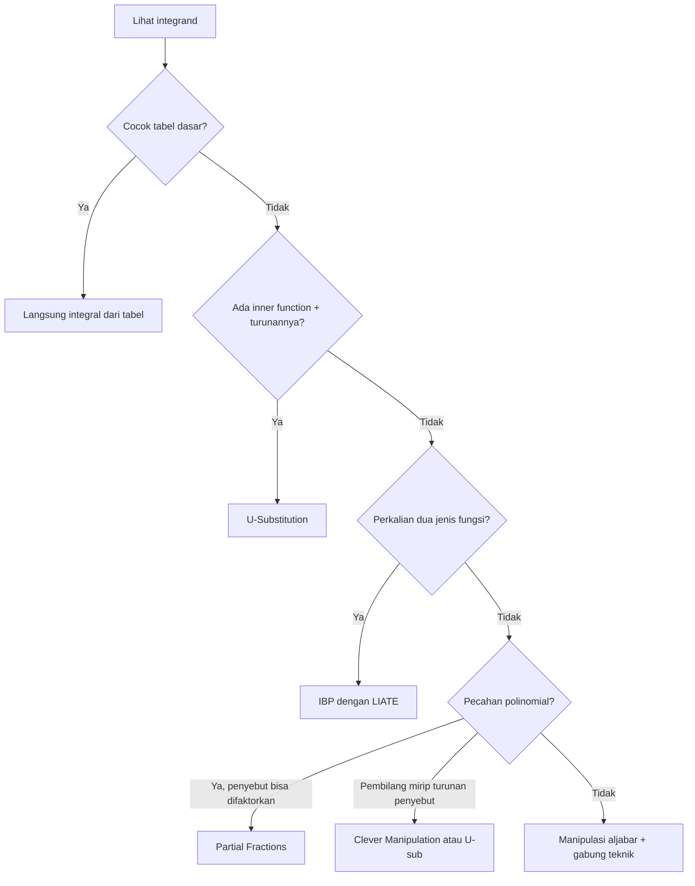

# 📊 CALC-01 — Mastering Integral & Turunan: Zero to Hero (Actuarial Level)

> [!ABSTRACT] Ringkasan Cepat
> **Topik:** Integral & Turunan | **Level:** Fundamental hingga Actuarial
> **Difficulty:** Calculation-Intensive | **Scope:** Dipakai di SELURUH topik CF2 & Exam P
> **Prereq:** Aljabar dasar, fungsi eksponen & logaritma

---

## Section 0 — Pemetaan Topik

| Topik | Sub-topik ID | Skill Diuji | Bobot | Difficulty | Prerequisite | Connected Topics | Referensi |
|---|---|---|---|---|---|---|---|
| Turunan Dasar | A.1 | Hitung turunan fungsi elementer | Fundamental | Easy | Aljabar | [[2.2 Variabel Acak Kontinu]] | ASM Ch.1 |
| Aturan Kombinasi | A.2 | Product, Quotient, Chain Rule | Fundamental | Medium | Turunan Dasar | [[2.4 Transformasi Variabel Acak]] | ASM Ch.1 |
| Integral Dasar | B.1 | Hitung integral elementer | Fundamental | Easy | Turunan Dasar | [[2.2 Variabel Acak Kontinu]] | ASM Ch.1 |
| U-Substitution | B.2 | Kenali pola & eksekusi | Fundamental | Medium | Integral Dasar | [[3.8 Transformasi Variabel Acak Gabungan]] | ASM Ch.1 |
| Integration by Parts | B.3 | LIATE rule, eksekusi IBP | Fundamental | Medium–Hard | Integral Dasar | [[2.3 Fungsi Pembangkit]] | ASM Ch.1 |
| Partial Fractions | B.4 | Dekomposisi pecahan polinomial | Fundamental | Hard | Integral Dasar | [[2.2 Variabel Acak Kontinu]] | ASM Ch.1 |
| Bentuk Kompleks | C | Kombinasi multi-teknik | Exam-Critical | Hard–Calc | Semua teknik di atas | [[3.4 Nilai Harapan Bersyarat]] | ASM Ch.1–2 |
| Konteks Aktuaria | H | PV, E[X], Var(X), survival | Exam-Critical | Medium–Hard | Semua | [[2.6 Distribusi Kontinu Umum]] | Seluruh ASM |

---

## Section 1 — Intuisi

Bayangkan kamu bekerja sebagai aktuaris di sebuah perusahaan asuransi jiwa. Salah satu tugasmu adalah menghitung **berapa besar premi** yang harus dibayar nasabah agar perusahaan tidak merugi di masa depan. Untuk melakukan ini, kamu perlu menghitung *expected value* dari klaim — yaitu, rata-rata berapa besar kerugian yang akan terjadi, dikalikan dengan seberapa mungkin kerugian itu terjadi. Perhitungan ini pada dasarnya adalah sebuah **integral**: kamu menjumlahkan (dalam arti kontinu) semua kemungkinan nilai klaim, masing-masing dikalikan dengan probabilitasnya.

Di sisi lain, **turunan** adalah alat untuk mengukur *laju perubahan*. Misalnya, force of mortality — seberapa cepat peluang bertahan hidup seseorang menurun seiring bertambahnya usia — adalah turunan dari fungsi survival. Ketika seorang aktuaris ingin tahu "seberapa sensitif nilai polis ini terhadap perubahan suku bunga?", jawabannya ada di turunan dari fungsi present value.

Intinya: **turunan mengukur laju perubahan, integral mengukur akumulasi**. Dua operasi ini adalah dua sisi dari koin yang sama (Teorema Fundamental Kalkulus), dan keduanya muncul di hampir setiap soal CF2 dan Exam P yang melibatkan fungsi kontinu. Memahami keduanya dengan baik bukan sekadar syarat lulus ujian — ini adalah bahasa dasar yang dipakai aktuaris setiap hari.

---

## Section 2 — Definisi Formal

> [!NOTE] Hubungan Fundamental: Turunan & Integral
> Jika $F(x)$ adalah antiturunan dari $f(x)$, maka:
>
> $$
> \frac{d}{dx}[F(x)] = f(x) \quad \Longleftrightarrow \quad \int f(x)\,dx = F(x) + C
> $$
>
> Dan untuk integral tentu (Teorema Fundamental Kalkulus):
>
> $$
> \int_a^b f(x)\,dx = F(b) - F(a)
> $$

### Tabel Variabel & Notasi

| Simbol | Makna | Catatan |
|---|---|---|
| $f(x)$ | Fungsi asal (integrand / fungsi yang diturunkan) | Disebut juga "the function" |
| $F(x)$ | Antiturunan dari $f(x)$ | $F'(x) = f(x)$ |
| $C$ | Konstanta integrasi | Wajib di integral tak tentu |
| $u, v$ | Variabel substitusi / bagian dalam IBP | Konteks-dependent |
| $f'(x)$ | Turunan pertama $f$ terhadap $x$ | Notasi alternatif: $\frac{df}{dx}$ atau $Df$ |
| $dx$ | Diferensial: "elemen kecil" pada sumbu $x$ | Bagian dari notasi Leibniz |
| $[a,b]$ | Batas integrasi | $a$ = batas bawah, $b$ = batas atas |

---

## A. DERIVATIVES MASTERY — Turunan

### Tabel Lengkap Turunan Dasar

| Fungsi $f(x)$ | Turunan $f'(x)$ | Contoh Numerik |
|---|---|---|
| $c$ (konstanta) | $0$ | $(7)' = 0$ |
| $x^n$ | $nx^{n-1}$ | $(x^3)' = 3x^2$ |
| $e^{ax}$ | $ae^{ax}$ | $(e^{2x})' = 2e^{2x}$ |
| $e^{-ax}$ | $-ae^{-ax}$ | $(e^{-0{,}05x})' = -0{,}05\,e^{-0{,}05x}$ |
| $a^{bx}$ | $a^{bx}\ln(a)\cdot b$ | $(2^{3x})' = 2^{3x}\ln(2)\cdot 3$ |
| $\ln x$ | $\dfrac{1}{x}$ | $(\ln x)' = \dfrac{1}{x}$ |
| $\ln(ax+b)$ | $\dfrac{a}{ax+b}$ | $(\ln(5x+1))' = \dfrac{5}{5x+1}$ |

> [!TIP] Cara Hafal Turunan Eksponen
> Ingat prinsip ini: **"turunkan eksponen, kalikan dengan koefisien $a$"**.
> - $e^{ax}$ → tinggalkan $e^{ax}$, kalikan dengan $a$
> - $a^{bx}$ → tinggalkan $a^{bx}$, kalikan dengan $b\ln(a)$ (muncul karena basis bukan $e$)

---

### Aturan Kombinasi (Combination Rules)

#### Product Rule

Jika $h(x) = u(x) \cdot v(x)$, maka:

$$
h'(x) = u'(x)\cdot v(x) + u(x)\cdot v'(x)
$$

**Contoh:** $h(x) = x^2 \cdot e^{3x}$

$$
h'(x) = 2x \cdot e^{3x} + x^2 \cdot 3e^{3x} = e^{3x}(2x + 3x^2)
$$

---

#### Quotient Rule

Jika $h(x) = \dfrac{u(x)}{v(x)}$, maka:

$$
h'(x) = \frac{u'(x)\cdot v(x) - u(x)\cdot v'(x)}{[v(x)]^2}
$$

**Contoh:** $h(x) = \dfrac{x^2}{e^{2x}}$

$$
h'(x) = \frac{2x \cdot e^{2x} - x^2 \cdot 2e^{2x}}{(e^{2x})^2} = \frac{e^{2x}(2x - 2x^2)}{e^{4x}} = \frac{2x(1-x)}{e^{2x}}
$$

> [!DANGER] Urutan Quotient Rule TIDAK Boleh Dibalik
> Formula: **"$u'v$ dikurangi $uv'$"** — urutan ini WAJIB. Jika dibalik menjadi $uv' - u'v$, tanda hasilnya salah.

---

#### Chain Rule

Jika $h(x) = f(g(x))$ (fungsi komposisi), maka:

$$
h'(x) = f'(g(x)) \cdot g'(x)
$$

Dalam kata-kata: **"turunan outer function, evaluated di inner function, dikali turunan inner function."**

**Level 1 (mudah):**

$$
h(x) = (3x+1)^5 \quad\Rightarrow\quad h'(x) = 5(3x+1)^4 \cdot 3 = 15(3x+1)^4
$$

**Level 2 (medium):**

$$
h(x) = e^{x^2+1} \quad\Rightarrow\quad h'(x) = e^{x^2+1} \cdot 2x = 2x\,e^{x^2+1}
$$

**Level 3 (rumit):**

$$
h(x) = \ln\!\left(e^{2x} + 3x\right) \quad\Rightarrow\quad h'(x) = \frac{2e^{2x}+3}{e^{2x}+3x}
$$

> [!BUG] Kesalahan Paling Umum: Lupa Inner Function Derivative
> **Salah:** $(e^{x^2})' = e^{x^2}$
>
> **Benar:** $(e^{x^2})' = e^{x^2} \cdot 2x$
>
> Selalu tanya: *"Apakah eksponennya lebih dari sekadar $x$?"* Jika ya → Chain Rule.

---

### Aplikasi Turunan di Aktuaria

| Konteks Aktuaria | Formula | Penjelasan |
|---|---|---|
| Force of mortality | $\mu_x = -\dfrac{d}{dx}[\ln S(x)]$ | Laju kematian sesaat di usia $x$ |
| Sensitivity PV | $\dfrac{d}{d\delta}\left[e^{-\delta t}\right] = -t\,e^{-\delta t}$ | Perubahan PV per unit perubahan force of interest |
| Duration (Macaulay) | $D = -\dfrac{1}{P}\cdot\dfrac{dP}{di}$ | Sensitivitas harga obligasi terhadap suku bunga |
| Hazard rate | $h(x) = \dfrac{f(x)}{S(x)} = -\dfrac{d}{dx}[\ln S(x)]$ | Identik dengan force of mortality |

---

## B. INTEGRALS MASTERY — Integral

### Tabel Lengkap Integral Dasar

| Integral | Hasil | Contoh |
|---|---|---|
| $\displaystyle\int x^n\,dx$ | $\dfrac{x^{n+1}}{n+1}+C$ (jika $n\neq -1$) | $\int x^4\,dx = \dfrac{x^5}{5}+C$ |
| $\displaystyle\int \frac{1}{x}\,dx$ | $\ln\lvert x\rvert + C$ | $\int \dfrac{3}{x}\,dx = 3\ln\lvert x\rvert + C$ |
| $\displaystyle\int e^{ax}\,dx$ | $\dfrac{e^{ax}}{a}+C$ | $\int e^{2x}\,dx = \dfrac{e^{2x}}{2}+C$ |
| $\displaystyle\int e^{-ax}\,dx$ | $-\dfrac{e^{-ax}}{a}+C$ | $\int e^{-0{,}05x}\,dx = -20\,e^{-0{,}05x}+C$ |
| $\displaystyle\int a^{bx}\,dx$ | $\dfrac{a^{bx}}{b\ln(a)}+C$ | $\int 2^{3x}\,dx = \dfrac{2^{3x}}{3\ln 2}+C$ |
| $\displaystyle\int \frac{1}{ax+b}\,dx$ | $\dfrac{1}{a}\ln\lvert ax+b\rvert + C$ | $\int \dfrac{1}{3x+5}\,dx = \dfrac{1}{3}\ln\lvert 3x+5\rvert + C$ |

> [!TIP] Trik Hapus Tanda Negatif untuk Eksponen Negatif
> $\int e^{-ax}\,dx$: bayangkan $a = -a_{\text{asli}}$, lalu pakai rumus $\frac{e^{ax}}{a}$.
> Hasilnya otomatis $-\frac{e^{-ax}}{a}$ — tanda minus muncul karena koefisien $a$ bernilai negatif.

---

### Teknik U-Substitution (Inverse Chain Rule)

**Kapan pakai:** Ketika integrand berbentuk $\int f(g(x))\cdot g'(x)\,dx$ — ada "inner function" plus turunannya.

**Langkah-langkah sistematis:**

1. Identifikasi $u$ = inner function $g(x)$
2. Hitung $du = g'(x)\,dx$
3. Rewrite integrand seluruhnya dalam $u$
4. Hitung $\int f(u)\,du$
5. Substitute balik: ganti $u$ dengan $g(x)$

**Level 1 (mudah):**

$$
\int 2x\,(x^2+1)^4\,dx
$$

Misalkan $u = x^2+1$, maka $du = 2x\,dx$.

$$
= \int u^4\,du = \frac{u^5}{5}+C = \frac{(x^2+1)^5}{5}+C
$$

**Level 2 (medium):**

$$
\int \frac{e^x}{e^x+3}\,dx
$$

Misalkan $u = e^x+3$, maka $du = e^x\,dx$.

$$
= \int \frac{du}{u} = \ln\lvert u\rvert + C = \ln(e^x+3)+C
$$

**Level 3 (rumit):**

$$
\int x\,\sqrt{x^2+4}\,dx
$$

Misalkan $u = x^2+4$, maka $du = 2x\,dx$, sehingga $x\,dx = \frac{du}{2}$.

$$
= \int \sqrt{u}\cdot\frac{du}{2} = \frac{1}{2}\cdot\frac{u^{3/2}}{3/2}+C = \frac{1}{3}(x^2+4)^{3/2}+C
$$

> [!BUG] Lupa Substitute Balik
> Hasil akhir **harus** dalam variabel $x$, bukan $u$. Selalu lakukan substitusi balik di langkah 5.

---

### Teknik Integration by Parts (IBP)

**Formula:**

$$
\int u\,dv = uv - \int v\,du
$$

**LIATE Rule** untuk memilih $u$ (pilih yang paling kiri dalam daftar ini):

| Huruf | Jenis Fungsi | Contoh |
|---|---|---|
| **L** | Logarithm | $\ln x$, $\ln(ax+b)$ |
| **I** | Inverse functions | $\arctan x$ (jarang di CF2) |
| **A** | Algebraic (polynomial) | $x$, $x^2$, $x^3$ |
| **T** | Trigonometric | $\sin x$, $\cos x$ (jarang di CF2) |
| **E** | Exponential | $e^{ax}$, $a^{bx}$ |

**Level 1 (mudah):** $\int x\,e^{2x}\,dx$

Pilih $u = x$ (Algebraic), $dv = e^{2x}\,dx$

$$
du = dx, \quad v = \frac{e^{2x}}{2}
$$

$$
\int x\,e^{2x}\,dx = x\cdot\frac{e^{2x}}{2} - \int \frac{e^{2x}}{2}\,dx = \frac{x\,e^{2x}}{2} - \frac{e^{2x}}{4} + C = \frac{e^{2x}}{4}(2x-1)+C
$$

**Level 2 (medium):** $\int \ln x\,dx$

Pilih $u = \ln x$ (Logarithm), $dv = dx$

$$
du = \frac{1}{x}\,dx, \quad v = x
$$

$$
\int \ln x\,dx = x\ln x - \int x\cdot\frac{1}{x}\,dx = x\ln x - \int 1\,dx = x\ln x - x + C
$$

**Level 3 (rumit — IBP berulang):** $\int x^2 e^{3x}\,dx$

*IBP pertama:* $u=x^2$, $dv=e^{3x}\,dx$, sehingga $du=2x\,dx$, $v=\frac{e^{3x}}{3}$:

$$
= \frac{x^2 e^{3x}}{3} - \int \frac{2x\,e^{3x}}{3}\,dx
$$

*IBP kedua* (untuk $\int x\,e^{3x}\,dx$): $u=x$, $dv=e^{3x}\,dx$, sehingga $du=dx$, $v=\frac{e^{3x}}{3}$:

$$
\int x\,e^{3x}\,dx = \frac{x\,e^{3x}}{3} - \frac{e^{3x}}{9}
$$

Gabungkan:

$$
\int x^2 e^{3x}\,dx = \frac{x^2 e^{3x}}{3} - \frac{2}{3}\left(\frac{x\,e^{3x}}{3} - \frac{e^{3x}}{9}\right) = \frac{e^{3x}}{27}(9x^2 - 6x + 2) + C
$$

> [!WARNING] IBP Infinite Loop
> Jika setelah IBP integral di kanan **lebih rumit** dari integral awal, kemungkinan pemilihan $u$ tidak optimal. Coba swap pilihan $u$ dan $dv$.

---

### Teknik Partial Fractions (Pecahan Parsial)

**Kapan dipakai:** Integral berbentuk $\int \dfrac{P(x)}{Q(x)}\,dx$ di mana derajat $P < $ derajat $Q$, dan $Q(x)$ bisa difaktorkan.

**Langkah-langkah:**

1. Jika derajat pembilang ≥ penyebut → bagi dulu (long division)
2. Faktorkan penyebut: $Q(x) = (x-a)(x-b)\cdots$
3. Setup: $\dfrac{P(x)}{(x-a)(x-b)} = \dfrac{A}{x-a} + \dfrac{B}{x-b}$
4. Selesaikan koefisien $A, B$ (substitute nilai $x = a$ dan $x = b$)
5. Integral setiap term

**Contoh:** $\displaystyle\int \frac{2x+1}{(x+1)(x-2)}\,dx$

Setup: $\dfrac{2x+1}{(x+1)(x-2)} = \dfrac{A}{x+1} + \dfrac{B}{x-2}$

Kalikan kedua ruas dengan $(x+1)(x-2)$:

$$
2x+1 = A(x-2) + B(x+1)
$$

Untuk $x=-1$: $-1 = A(-3)$, sehingga $A = \frac{1}{3}$

Untuk $x=2$: $5 = B(3)$, sehingga $B = \frac{5}{3}$

$$
\int \frac{2x+1}{(x+1)(x-2)}\,dx = \frac{1}{3}\ln\lvert x+1\rvert + \frac{5}{3}\ln\lvert x-2\rvert + C
$$

---

### Pemisahan Pembilang (Clever Numerator Manipulation)

Strategi ini berguna untuk menghindari partial fractions yang rumit: **ubah pembilang agar cocok dengan turunan penyebut**.

**Contoh:** $\displaystyle\int \frac{2x+1}{(x+1)^2}\,dx$

Rewrite: $2x+1 = 2(x+1) - 1$

$$
\int \frac{2(x+1)-1}{(x+1)^2}\,dx = \int \frac{2}{x+1}\,dx - \int \frac{1}{(x+1)^2}\,dx
$$

$$
= 2\ln\lvert x+1\rvert + \frac{1}{x+1} + C
$$

> [!TIP] Pattern untuk Clever Manipulation
> Jika penyebut adalah $(ax+b)^n$ dan pembilang adalah polinomial derajat 1, coba tulis pembilang sebagai $\alpha(ax+b) + \beta$. Ini hampir selalu berhasil.

---

### Tabel Pattern Recognition (Quick Reference)

| Pattern Integrand | Teknik | Hasil Langsung |
|---|---|---|
| $\int f'(x)\cdot f(x)\,dx$ | U-sub: $u=f(x)$ | $\dfrac{[f(x)]^2}{2}+C$ |
| $\int \dfrac{f'(x)}{f(x)}\,dx$ | U-sub: $u=f(x)$ | $\ln\lvert f(x)\rvert + C$ |
| $\int x\cdot e^{ax}\,dx$ | IBP | $\dfrac{e^{ax}}{a^2}(ax-1)+C$ |
| $\int x^2\cdot e^{ax}\,dx$ | IBP ×2 | $\dfrac{e^{ax}}{a^3}(a^2x^2-2ax+2)+C$ |
| $\int (ax+b)^n\,dx$ | U-sub: $u=ax+b$ | $\dfrac{(ax+b)^{n+1}}{a(n+1)}+C$ |
| $\int \ln(ax+b)\,dx$ | IBP ($u=\ln$) | $(x+\frac{b}{a})\ln(ax+b)-x+C$ |

---

### Integral Tentu (Definite Integral)

$$
\int_a^b f(x)\,dx = F(b) - F(a)
$$

**Properties:**

$$
\int_a^b [c\cdot f(x)]\,dx = c\int_a^b f(x)\,dx \quad \text{(linearitas)}
$$

$$
\int_a^b [f(x)+g(x)]\,dx = \int_a^b f(x)\,dx + \int_a^b g(x)\,dx \quad \text{(additivitas)}
$$

$$
\int_a^b f(x)\,dx = \int_a^c f(x)\,dx + \int_c^b f(x)\,dx \quad \text{(split interval)}
$$

$$
\int_a^b f(x)\,dx = -\int_b^a f(x)\,dx \quad \text{(balik batas)}
$$

> [!IMPORTANT] Perbedaan Integral Tentu vs Tak Tentu
> - **Integral tak tentu**: $\int f(x)\,dx = F(x) + C$ — hasil adalah **fungsi**, **harus ada $+C$**
> - **Integral tentu**: $\int_a^b f(x)\,dx = F(b)-F(a)$ — hasil adalah **bilangan**, **tanpa $+C$**

---

## C. BENTUK-BENTUK KOMPLEKS PRIORITAS TINGGI

### C.1 Eksponensial

**Bentuk dasar:**

$$
\int e^{-ax}\,dx = -\frac{1}{a}e^{-ax}+C
$$

**Contoh aktuaria (present value):**

$$
\int_0^{\infty} e^{-\delta t}\,dt = \left[-\frac{1}{\delta}e^{-\delta t}\right]_0^{\infty} = 0 - \left(-\frac{1}{\delta}\right) = \frac{1}{\delta}
$$

**IBP dengan eksponensial — pola dasar:**

$$
\int x\,e^{-ax}\,dx \quad \xrightarrow{\text{IBP}} \quad -\frac{x\,e^{-ax}}{a} - \frac{e^{-ax}}{a^2}+C = -\frac{e^{-ax}}{a^2}(ax+1)+C
$$

**IBP dua kali — $\int x^2 e^{-ax}\,dx$:**

$$
\int x^2 e^{-ax}\,dx = -\frac{e^{-ax}}{a^3}(a^2x^2+2ax+2)+C
$$

---

### C.2 Pecahan Rasional

**Pola 1 — linear di penyebut:**

$$
\int \frac{f'(x)}{f(x)}\,dx = \ln\lvert f(x)\rvert + C
$$

**Contoh:**

$$
\int \frac{2x}{x^2+5}\,dx = \ln(x^2+5)+C
$$

**Pola 2 — penyebut berpangkat:**

$$
\int \frac{1}{(ax+b)^n}\,dx = \frac{(ax+b)^{1-n}}{a(1-n)}+C, \quad n\neq 1
$$

**Contoh:**

$$
\int \frac{1}{(3x+1)^2}\,dx = \frac{(3x+1)^{-1}}{3\cdot(-1)}+C = -\frac{1}{3(3x+1)}+C
$$

---

### C.3 Konstanta Berpangkat Variabel

$$
\int a^{bx}\,dx = \frac{a^{bx}}{b\ln a}+C
$$

**Perbedaan kunci vs $e^{ax}$:**

| | $e^{ax}$ | $a^{bx}$ (basis $\neq e$) |
|---|---|---|
| Integral | $\frac{e^{ax}}{a}+C$ | $\frac{a^{bx}}{b\ln a}+C$ |
| Perbedaan | Tidak ada $\ln$ | Ada $\ln(a)$ di penyebut |

---

### C.4 Gabungan Teknik

**Contoh 1 — IBP + Eksponensial (penting untuk PV kontinu):**

$$
\int_0^n t\,e^{-\delta t}\,dt
$$

IBP: $u = t$, $dv = e^{-\delta t}\,dt$ → $du=dt$, $v = -\frac{e^{-\delta t}}{\delta}$

$$
= \left[-\frac{t\,e^{-\delta t}}{\delta}\right]_0^n + \frac{1}{\delta}\int_0^n e^{-\delta t}\,dt = -\frac{n\,e^{-\delta n}}{\delta} + \frac{1}{\delta}\left[-\frac{e^{-\delta t}}{\delta}\right]_0^n
$$

$$
= -\frac{n\,e^{-\delta n}}{\delta} + \frac{1-e^{-\delta n}}{\delta^2}
$$

**Contoh 2 — U-sub clever pada eksponensial di penyebut:**

$$
\int \frac{e^{ax}}{(e^{ax}+c)^2}\,dx
$$

Misalkan $u = e^{ax}+c$, maka $du = ae^{ax}\,dx$:

$$
= \frac{1}{a}\int \frac{du}{u^2} = \frac{1}{a}\cdot\frac{u^{-1}}{-1}+C = -\frac{1}{a(e^{ax}+c)}+C
$$

---

## D. PROBLEM-SOLVING MINDSET

### Flowchart Decision: Pilih Teknik yang Tepat

```
Lihat integrand
        │
        ▼
Apakah cocok dengan bentuk dasar? (tabel)
  ├── Ya → Langsung integral
  └── Tidak ↓
        │
        ▼
Apakah ada inner function + turunannya?
  ├── Ya → U-Substitution
  └── Tidak ↓
        │
        ▼
Apakah perkalian DUA jenis fungsi berbeda?
  ├── Ya → Integration by Parts (LIATE)
  └── Tidak ↓
        │
        ▼
Apakah pecahan polinomial?
  ├── Penyebut bisa difaktorkan → Partial Fractions
  ├── Pembilang ~ turunan penyebut → U-sub atau clever manipulation
  └── Tidak ↓
        │
        ▼
Kombinasi teknik / manipulasi aljabar dulu
```

---

### Langkah Sistematis Menghadapi Integral Rumit

1. **Baca soal** — identifikasi fungsi utama (eksponensial? polinomial? pecahan?)
2. **Cek tabel** — apakah cocok dengan pola dasar?
3. **Gunakan flowchart** — pilih teknik
4. **Eksekusi step-by-step** — jangan skip langkah
5. **Simplifikasi** — faktorkan, gabungkan terms
6. **Verifikasi** — turunkan hasil → harus kembali ke integrand

---

### Checklist Sebelum Serah Jawaban

- [ ] Integral tentu atau tak tentu? (ada/tidak ada $+C$)
- [ ] Apakah semua langkah U-sub sudah di-substitute balik ke $x$?
- [ ] Apakah batas integrasi sudah dievaluasi dengan benar (untuk integral tentu)?
- [ ] Apakah ada $+C$ di integral tak tentu?
- [ ] Cek dengan turunkan hasil → harus kembali ke integrand
- [ ] Apakah ada domain restrictions? (mis. $\ln$ hanya untuk $x > 0$)
- [ ] Apakah hasil reasonable dari konteks soal?

---

### Cara Verifikasi

> [!CHECK] Cara Paling Cepat Verifikasi Integral
> Turunkan hasil akhirmu. Jika hasilnya **persis sama** dengan integrand awal, maka jawabanmu benar.
>
> **Contoh:** Jika $\int x\,e^{2x}\,dx = \frac{e^{2x}}{4}(2x-1)+C$, verifikasi:
>
> $$
> \frac{d}{dx}\left[\frac{e^{2x}}{4}(2x-1)\right] = \frac{2e^{2x}}{4}(2x-1) + \frac{e^{2x}}{4}\cdot 2 = \frac{e^{2x}}{2}(2x-1) + \frac{e^{2x}}{2} = x\,e^{2x} \checkmark
> $$

---

## E. COMMON MISTAKES & MISCONCEPTIONS

### Kesalahan Turunan

> [!BUG] Daftar Kesalahan Turunan yang Sering Terjadi
>
> **1. Lupa inner function derivative (Chain Rule):**
>
> ❌ $(e^{x^2})' = e^{x^2}$
>
> ✅ $(e^{x^2})' = 2x\,e^{x^2}$
>
> **2. Quotient Rule tanda terbalik:**
>
> ❌ $\left(\frac{u}{v}\right)' = \frac{uv' - u'v}{v^2}$
>
> ✅ $\left(\frac{u}{v}\right)' = \frac{u'v - uv'}{v^2}$ (ingat: "hi d-lo minus lo d-hi")
>
> **3. Turunan logaritma:**
>
> ❌ $(\ln u)' = \frac{u}{u}$
>
> ✅ $(\ln u)' = \frac{u'}{u}$ (Chain Rule wajib!)
>
> **4. Lupa $\ln(a)$ untuk basis $\neq e$:**
>
> ❌ $(2^{3x})' = 2^{3x}\cdot 3$
>
> ✅ $(2^{3x})' = 2^{3x}\cdot\ln(2)\cdot 3$

---

### Kesalahan Integral

> [!BUG] Daftar Kesalahan Integral yang Sering Terjadi
>
> **1. Lupa $+C$ di integral tak tentu:**
>
> ❌ $\int e^{2x}\,dx = \frac{e^{2x}}{2}$
>
> ✅ $\int e^{2x}\,dx = \frac{e^{2x}}{2}+C$
>
> **2. U-sub tapi lupa substitute balik:**
>
> ❌ Hasil akhir masih dalam $u$
>
> ✅ Hasil akhir HARUS dalam $x$
>
> **3. IBP: pilih $u$ tidak optimal:**
>
> Untuk $\int \ln x\,dx$: jangan pilih $u=1$ dan $dv=\ln x\,dx$ (tidak ada formula $v$ yang mudah)
>
> ✅ Pilih $u=\ln x$, $dv=dx$ sesuai LIATE
>
> **4. Partial fractions dengan repeated root:**
>
> Untuk penyebut $(x-a)^2$: setup HARUS $\frac{A}{x-a}+\frac{B}{(x-a)^2}$ — jangan hanya $\frac{A}{x-a}$

---

### Misconceptions Umum

> [!IMPORTANT] Meluruskan Mitos tentang Integral
>
> **Mitos 1:** "Integral hanya untuk hitung luas area"
> → **Realita:** Integral mengukur akumulasi: expected value, present value, survival probability, momen statistik, dll.
>
> **Mitos 2:** "Harus hafalin semua bentuk integral"
> → **Realita:** Cukup hafal tabel dasar + kuasai 4 teknik (U-sub, IBP, Partial Fractions, Manipulasi). Pattern recognition > hafalan.
>
> **Mitos 3:** "Chain Rule hanya untuk turunan"
> → **Realita:** U-substitution adalah *inverse chain rule untuk integral*. Pola $\int f(g(x))\cdot g'(x)\,dx$ adalah persis ini.

---

## F. CONTOH SOAL LATIHAN

### F.1 Level 1 — Dasar

**[Turunan] - Level 1**

**Soal:** Hitung $\dfrac{d}{dx}\left[3x^4 - 2e^{5x} + \ln(4x+1)\right]$

**Solusi:**

$$
\frac{d}{dx}\left[3x^4\right] = 12x^3
$$

$$
\frac{d}{dx}\left[-2e^{5x}\right] = -2\cdot 5e^{5x} = -10e^{5x}
$$

$$
\frac{d}{dx}\left[\ln(4x+1)\right] = \frac{4}{4x+1}
$$

**Hasil:** $12x^3 - 10e^{5x} + \dfrac{4}{4x+1}$

---

**[Integral] - Level 1**

**Soal:** Hitung $\displaystyle\int \left(6x^2 - \frac{3}{x} + 4e^{-2x}\right)\,dx$

**Solusi:**

$$
\int 6x^2\,dx = 2x^3
$$

$$
\int -\frac{3}{x}\,dx = -3\ln\lvert x\rvert
$$

$$
\int 4e^{-2x}\,dx = 4\cdot\frac{e^{-2x}}{-2} = -2e^{-2x}
$$

**Hasil:** $2x^3 - 3\ln\lvert x\rvert - 2e^{-2x} + C$

---

### F.2 Level 2 — Medium

**[U-Substitution] - Level 2**

**Soal:** Hitung $\displaystyle\int_0^1 \frac{x}{(x^2+1)^3}\,dx$

**Solusi:**

Misalkan $u = x^2+1$, maka $du = 2x\,dx$, sehingga $x\,dx = \frac{du}{2}$.

Ubah batas: $x=0 \Rightarrow u=1$; $x=1 \Rightarrow u=2$

$$
\int_0^1 \frac{x}{(x^2+1)^3}\,dx = \frac{1}{2}\int_1^2 u^{-3}\,du = \frac{1}{2}\left[\frac{u^{-2}}{-2}\right]_1^2 = -\frac{1}{4}\left[\frac{1}{u^2}\right]_1^2
$$

$$
= -\frac{1}{4}\left(\frac{1}{4}-1\right) = -\frac{1}{4}\cdot\left(-\frac{3}{4}\right) = \frac{3}{16}
$$

**Hasil:** $\dfrac{3}{16}$

---

**[IBP] - Level 2**

**Soal:** Hitung $\displaystyle\int_0^{\infty} x\,e^{-2x}\,dx$

**Solusi:**

IBP: $u = x$, $dv = e^{-2x}\,dx$ → $du = dx$, $v = -\frac{e^{-2x}}{2}$

$$
\int x\,e^{-2x}\,dx = -\frac{x\,e^{-2x}}{2} - \int -\frac{e^{-2x}}{2}\,dx = -\frac{x\,e^{-2x}}{2} - \frac{e^{-2x}}{4}+C
$$

Evaluasi $[0, \infty)$:

Saat $x\to\infty$: $x\,e^{-2x}\to 0$ dan $e^{-2x}\to 0$ (exponential mendominasi)

Saat $x=0$: $-\frac{0}{2} - \frac{1}{4} = -\frac{1}{4}$

$$
\int_0^{\infty} x\,e^{-2x}\,dx = 0 - \left(-\frac{1}{4}\right) = \frac{1}{4}
$$

**Hasil:** $\dfrac{1}{4}$

> [!NOTE] Konteks Aktuaria
> $\int_0^{\infty} x\,e^{-\lambda x}\,dx = \frac{1}{\lambda^2}$ adalah expected value $E[X]$ untuk distribusi Exponential dengan parameter $\lambda$. Di sini $\lambda=2$, sehingga $E[X] = \frac{1}{4}$.

---

### F.3 Level 3 — Rumit (Exam-Level)

**[Kombinasi Teknik] - Level 3**

**Soal:** Diberikan $f(x) = \dfrac{2x+5}{(x+1)(x+2)}$ untuk $x > 0$.

Hitung $\displaystyle\int_0^1 f(x)\,dx$.

**Solusi:**

**Langkah 1:** Partial fractions. Misalkan:

$$
\frac{2x+5}{(x+1)(x+2)} = \frac{A}{x+1}+\frac{B}{x+2}
$$

Kalikan: $2x+5 = A(x+2)+B(x+1)$

$x=-1$: $3 = A(1) \Rightarrow A=3$

$x=-2$: $1 = B(-1) \Rightarrow B=-1$

**Langkah 2:** Integral:

$$
\int_0^1 \frac{2x+5}{(x+1)(x+2)}\,dx = \int_0^1 \frac{3}{x+1}\,dx - \int_0^1 \frac{1}{x+2}\,dx
$$

**Langkah 3:** Evaluasi:

$$
= \Big[3\ln(x+1)\Big]_0^1 - \Big[\ln(x+2)\Big]_0^1
$$

$$
= \Big[3\ln 2 - 3\ln 1\Big] - \Big[\ln 3 - \ln 2\Big]
$$

$$
= 3\ln 2 - \ln 3 + \ln 2 = 4\ln 2 - \ln 3 = \ln\frac{16}{3}
$$

**Hasil:** $\ln\dfrac{16}{3} \approx 1{,}674$

---

## G. REFERENCE & QUICK SHEETS

### One-Page Cheat Sheet

**Bagian 1: Turunan Dasar**

| $f(x)$ | $f'(x)$ |
|---|---|
| $c$ | $0$ |
| $x^n$ | $nx^{n-1}$ |
| $e^{ax}$ | $ae^{ax}$ |
| $a^{bx}$ | $a^{bx}\ln(a)\cdot b$ |
| $\ln(ax+b)$ | $\frac{a}{ax+b}$ |

**Bagian 2: Integral Dasar**

| $\int f(x)\,dx$ | Hasil |
|---|---|
| $\int x^n\,dx$ | $\frac{x^{n+1}}{n+1}+C$ |
| $\int \frac{1}{x}\,dx$ | $\ln\lvert x\rvert+C$ |
| $\int e^{ax}\,dx$ | $\frac{e^{ax}}{a}+C$ |
| $\int a^{bx}\,dx$ | $\frac{a^{bx}}{b\ln a}+C$ |
| $\int \frac{1}{ax+b}\,dx$ | $\frac{1}{a}\ln\lvert ax+b\rvert+C$ |

**Bagian 3: Kapan Pakai Teknik Apa**

| Kondisi Integrand | Teknik |
|---|---|
| Cocok dengan tabel | Langsung |
| Inner function + turunannya | U-Substitution |
| Perkalian polynomial × exponential | IBP (LIATE) |
| Perkalian log × apapun | IBP ($u$ = log) |
| Pecahan polinomial, penyebut bisa difaktorkan | Partial Fractions |
| Pembilang ~ turunan penyebut | U-sub atau Clever Manipulation |

---

## H. ACTUARIAL CONTEXT

### Aplikasi Integral & Turunan di Aktuaria

> [!NOTE] Present Value Anuitas Kontinu
> **Formula:**
>
> $$
> \bar{a}_{\overline{n}\|} = \int_0^n e^{-\delta t}\,dt = \frac{1-e^{-\delta n}}{\delta}
> $$
>
> **Teknik:** Integral dasar $\int e^{-ax}\,dx = -\frac{e^{-ax}}{a}$.
>
> **Interpretasi:** Nilai sekarang dari pembayaran 1 per unit waktu selama $n$ tahun dengan force of interest $\delta$.

> [!NOTE] Expected Value Distribusi Kontinu
> **Formula:**
>
> $$
> E[X] = \int_{-\infty}^{\infty} x\cdot f(x)\,dx
> $$
>
> **Teknik:** Sering butuh IBP, terutama untuk distribusi Gamma, Weibull.
>
> **Contoh (Exponential $\lambda$):**
>
> $$
> E[X] = \int_0^{\infty} x\cdot\lambda e^{-\lambda x}\,dx = \frac{1}{\lambda}
> $$

> [!NOTE] Survival Function & Force of Mortality
> **Definisi:**
>
> $$
> S(x) = P(X > x) = 1 - F(x) = \int_x^{\infty} f(t)\,dt
> $$
>
> **Force of mortality (turunan):**
>
> $$
> \mu(x) = -\frac{d}{dx}[\ln S(x)] = \frac{f(x)}{S(x)}
> $$
>
> **Teknik:** Chain Rule pada $\ln S(x)$.

> [!NOTE] Variance dan Second Moment
> **Formula:**
>
> $$
> E[X^2] = \int_0^{\infty} x^2 f(x)\,dx, \quad \text{Var}(X) = E[X^2] - (E[X])^2
> $$
>
> **Teknik:** Sering IBP dua kali untuk distribusi dengan PDF exponential.

### Frekuensi Kemunculan Teknik di Ujian CF2/Exam P

| Teknik | Frekuensi di Ujian | Konteks Utama |
|---|---|---|
| Integral eksponensial ($e^{-ax}$) | Sangat Sering | PV, expected value distribusi Exponential/Gamma |
| U-substitution | Sering | CDF dari PDF tertentu, transformasi |
| IBP | Medium | $E[X]$ distribusi Gamma, $E[X^2]$ Exponential |
| Partial fractions | Jarang–Medium | Beberapa soal CF2 dengan PDF pecahan |
| Turunan (Chain Rule) | Sering | Force of mortality, PDF dari CDF, Jacobian |

---

## Section 7 — Jebakan Umum (Ringkasan)

> [!BUG] Kesalahan Kritis — Turunan
> 1. **Lupa Chain Rule**: $(e^{g(x)})' \neq e^{g(x)}$ — harus dikali $g'(x)$
> 2. **Quotient Rule terbalik**: selalu $u'v - uv'$ di pembilang, bukan sebaliknya
> 3. **Basis $\neq e$**: $(a^{bx})' = a^{bx}\ln(a)\cdot b$ — ada $\ln(a)$ yang sering terlupa

> [!BUG] Kesalahan Kritis — Integral
> 1. **Lupa $+C$**: wajib di setiap integral tak tentu tanpa kecuali
> 2. **U-sub tidak dikembalikan ke $x$**: hasil akhir harus dalam variabel asli
> 3. **IBP pilihan $u$ salah**: ikuti LIATE — Logarithm adalah $u$ paling kuat
> 4. **Partial fractions repeated root**: $(x-a)^2$ butuh dua term: $\frac{A}{x-a}+\frac{B}{(x-a)^2}$

> [!CAUTION] Red Flags di Soal Ujian
> - Munculnya $e^{-\delta t}$ atau $e^{-\lambda x}$ → integral eksponensial, sering ada IBP
> - Munculnya $\frac{d}{dx}[S(x)]$ atau $\mu(x)$ → Chain Rule pada logaritma
> - Batas integral adalah $\infty$ → evaluasi limit exponential ($x\,e^{-ax}\to 0$ saat $x\to\infty$)
> - Integrand adalah perkalian polynomial × exponential → IBP (kemungkinan dua kali)

---

## Section 8 — Ringkasan Eksekutif

> [!SUMMARY] Must-Remember: Formula Paling Kritis
>
> 1. **Turunan Chain Rule:** $(f(g(x)))' = f'(g(x))\cdot g'(x)$
>
> 2. **Integral Dasar Eksponensial:**
>
>    $$\int e^{ax}\,dx = \frac{e^{ax}}{a}+C, \quad \int e^{-ax}\,dx = -\frac{e^{-ax}}{a}+C$$
>
> 3. **U-Substitution:** $u = g(x)$, $du = g'(x)\,dx$ → $\int f(g(x))g'(x)\,dx = \int f(u)\,du$
>
> 4. **IBP:** $\int u\,dv = uv - \int v\,du$ (pilih $u$ dengan LIATE)
>
> 5. **FTC:** $\int_a^b f(x)\,dx = F(b)-F(a)$
>
> 6. **Aktuaria:** $\int_0^{\infty} e^{-\delta t}\,dt = \frac{1}{\delta}$; $\int_0^{\infty} x\lambda e^{-\lambda x}\,dx = \frac{1}{\lambda}$

### Kapan Digunakan

Teknik kalkulus ini digunakan di **hampir semua topik CF2/Exam P** yang melibatkan variabel acak kontinu:
- Menghitung CDF dari PDF yang diberikan
- Menghitung $E[X]$, $E[X^2]$, $\text{Var}(X)$
- Menghitung probabilitas $P(a < X < b)$
- Menghitung survival function dan hazard rate
- Soal transformasi variabel acak

### Kapan TIDAK Pakai Teknik Integral

- Variabel acak **diskrit** → gunakan penjumlahan $\sum$, bukan integral
- Distribusi sudah diketahui expected value-nya → pakai formula langsung (tidak perlu integrasikan ulang)

### Quick Decision Tree



---

> [!QUOTE] Follow-up Options
> 1. *"Berikan latihan soal additional untuk IBP berulang dengan konteks E[X²] distribusi Gamma"*
> 2. *"Jelaskan hubungan [[2.2 Variabel Acak Kontinu]] dengan teknik integral di sini"*
> 3. *"Buat flashcard 1-halaman untuk quick reference semua teknik"*
> 4. *"Tunjukkan contoh soal CF2/Exam P yang menggunakan kombinasi U-sub + IBP"*

*📖 Ref: ASM Exam P 5th Ed. Ch.1–2; Wackerly et al. Mathematical Statistics | 🗓️ 2026-04-21 | #CF2 #ExamP #Kalkulus #Integral #Turunan*
