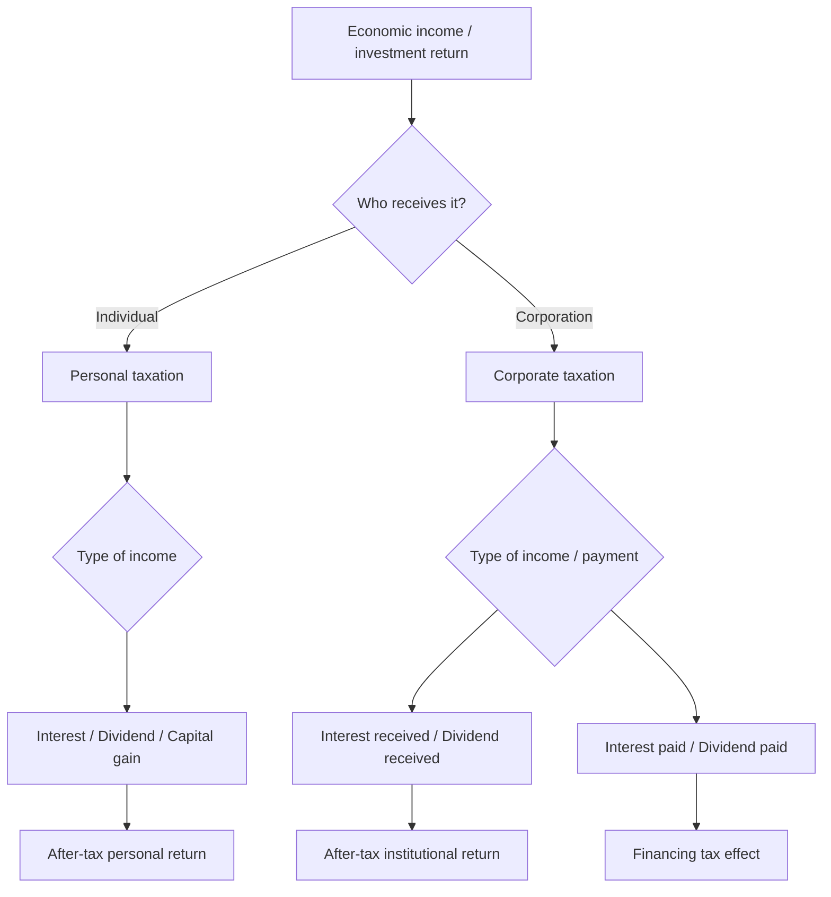
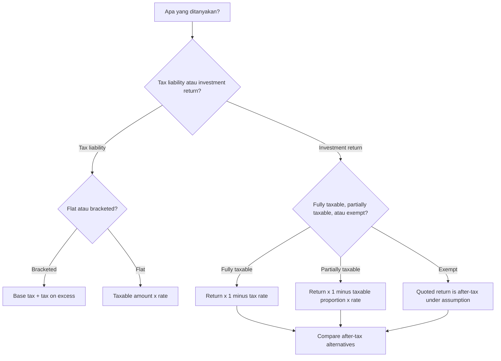

# 📘 1.1 — Taxation Principles

> [!ABSTRACT] Ringkasan Cepat
> **Topik:** Taxation Principles  
> **Bobot Parent Topic:** 30–40%  
> **Exam Priority:** Very High  
> **Difficulty:** Concept-Intensive  
> **Primary Skill:** Mixed — concept, calculation sederhana, dan interpretation  
> **Ref:** Brigham & Ehrhardt Bab 2, terutama §2.9 *The Federal Income Tax System*; Weygandt Bab 1 dan 18 sebagai konteks accounting/reporting; Robinson sebagai konteks financial reporting dalam scope Topik 1.

## Section 0 — Pemetaan Silabus & Exam Scope

| Field | Isi |
|---|---|
| Topik CF4 | Topik 1 — Pelaporan Keuangan dan Perpajakan |
| Subtopik | 1.1 Taxation Principles |
| Learning Outcome | Menjelaskan prinsip dasar perpajakan personal dan korporasi, serta perpajakan atas investasi yang dimiliki oleh institusi. |
| Skill Diuji | Membedakan jenis pajak/pendapatan, menentukan efek pajak terhadap after-tax return, membedakan marginal vs average tax rate, dan menjelaskan implikasi pajak terhadap pilihan investasi/pendanaan. |
| Bobot Parent Topic | 30–40% |
| Exam Priority | Very High |
| Prerequisite | Ordinary income, interest, dividend, capital gain/loss, debt vs equity, taxable income |
| Connected Topics | [[1.4 Company Account Structure]], [[1.5 Financial Statements Construction]], [[1.6 Financial Ratios and Interpretation]], [[2.1 Equity Instruments]], [[2.2 Long-Term Debt Instruments]], [[3.2 Sources of Finance and Capital Structure]] |
| Referensi | Brigham & Ehrhardt Bab 2 §2.9; Weygandt Bab 1 & 18 untuk konteks income tax dalam accounting; Robinson untuk konteks financial reporting dalam Topik 1 |

> [!IMPORTANT] Scope Boundary
> `[CORE CF4]` Fokus subtopik ini adalah **prinsip** perpajakan: personal tax, corporate tax, dan taxation of institutional investments. Materi inti mencakup progressive taxation, marginal vs average tax rate, taxation of interest/dividend/capital gains, tax treatment interest vs dividend bagi perusahaan, dan efek pajak pada after-tax return.  
>  
> Angka tarif, bracket, holding-period rule, carryback/carryforward, dan persentase dividend exclusion yang muncul dalam Brigham & Ehrhardt adalah **aturan AS pada saat textbook diterbitkan**. Gunakan angka tersebut hanya ketika soal memberikannya atau ketika sedang memahami mechanics textbook, bukan sebagai klaim hukum pajak yang berlaku saat ini.  
>  
> `[BEYOND CF4]` Rincian compliance pajak Indonesia, pengisian SPT, tax treaty, transfer pricing, serta akuntansi deferred tax yang mendalam tidak dijadikan materi inti di note ini kecuali secara eksplisit diminta oleh silabus/soal.

---

## Section 1 — Intuisi & Big Picture

Bayangkan ada **Rp100 pendapatan ekonomi**. Pertanyaan pajak bukan sekadar “berapa tarif pajaknya?”, tetapi:

1. **Siapa yang menerima pendapatan itu?** Individu atau corporation?
2. **Pendapatan berasal dari apa?** Gaji, laba usaha, interest, dividend, atau capital gain?
3. **Kapan pajaknya timbul?** Saat income diperoleh, saat dividend dibayar, atau saat asset dijual?
4. **Apakah pembayaran tertentu mengurangi taxable income?** Misalnya interest expense dibanding dividend.
5. **Berapa yang benar-benar tersisa setelah pajak?** Inilah yang relevan bagi keputusan keuangan.

Itulah alasan taxation penting dalam corporate finance: **value ditentukan oleh cash flow yang tersedia setelah pajak**, bukan sekadar angka pre-tax.

### Mengapa konsep ini ada?

Pajak mengubah economic payoff dari hampir semua keputusan keuangan. Dua investasi dengan pre-tax return berbeda dapat menghasilkan after-tax return yang sama; dua sumber pendanaan dengan biaya nominal yang sama dapat mempunyai biaya efektif berbeda setelah mempertimbangkan tax deductibility.

Contoh sederhana:

- Perusahaan membayar **interest** atas debt.
- Perusahaan membayar **dividend** atas equity.

Secara ekonomi keduanya adalah return kepada penyedia modal, tetapi tax treatment dapat berbeda. Karena itu tax system dapat menciptakan **incentive** terhadap struktur pendanaan tertentu.

### Siapa yang menggunakan konsep ini?

- **Individual investor** → membandingkan return setelah personal tax.
- **Corporation/institutional investor** → membandingkan after-tax yield dari bond interest vs dividend income.
- **Corporate management** → memahami pengaruh tax deductibility terhadap financing decision.
- **Analyst/creditor** → menilai cash flow setelah pajak dan sustainability pembayaran interest/dividend.

### Keputusan apa yang dibantu?

- Apakah investasi A benar-benar lebih menguntungkan setelah pajak?
- Apakah tax-exempt security yang yield-nya lebih rendah tetap menarik?
- Apakah debt lebih murah daripada equity karena interest deductible?
- Apakah nominal tax rate sama dengan effective burden yang benar-benar ditanggung?

### Apa yang salah jika konsep ini disalahpahami?

Kesalahan paling berbahaya adalah membandingkan **pre-tax number dengan after-tax number**. Misalnya:

- yield bond 8% dibanding yield tax-exempt 6% secara langsung;
- menyebut 35% sebagai “average tax rate” hanya karena 35% adalah marginal rate;
- menganggap dividend paid mengurangi taxable income seperti interest;
- menganggap kenaikan harga saham langsung menimbulkan tax pada capital gain padahal source menjelaskan tax baru timbul ketika gain direalisasikan melalui penjualan.

> [!DANGER] Prinsip Besar
> Untuk hampir semua soal pajak CF4, biasakan bertanya: **“berapa cash/income yang tersisa setelah tax?”**

---

## Section 2 — Definisi & Core Concepts

### Definisi Formal

> [!NOTE] Definisi Formal
> **Taxable income** adalah basis income yang dikenai pajak menurut aturan perpajakan yang berlaku.  
> **Marginal tax rate** adalah tarif yang dikenakan pada **dollar/rupiah terakhir** dari taxable income.  
> **Average tax rate** adalah total tax dibagi total taxable income.  
> **Progressive tax** adalah sistem di mana tax rate meningkat ketika tingkat taxable income meningkat.  
> **Capital gain** terjadi ketika capital asset dijual dengan harga lebih tinggi daripada cost-nya; **capital loss** terjadi bila harga jual lebih rendah daripada cost.  
> **After-tax income/return** adalah income atau return yang tersisa setelah tax.

### Terminologi Penting

| Istilah | Definisi | Intuisi | Exam Note |
|---|---|---|---|
| Taxable income | Income yang menjadi basis pengenaan pajak | “Bagian income yang benar-benar dikenai tax” | Jangan otomatis samakan dengan accounting profit |
| Marginal tax rate | Tarif pada tambahan income terakhir | Tarif untuk “next dollar” | Relevan untuk keputusan incremental |
| Average tax rate | Total tax / total taxable income | Beban pajak rata-rata | Biasanya berbeda dari marginal rate dalam progressive system |
| Progressive tax | Tarif meningkat seiring income meningkat | Makin tinggi bracket, next dollar dikenai rate lebih tinggi | Tidak berarti seluruh income dikenai highest rate |
| Ordinary income | Dalam Brigham: terutama wages, business income, dan sebagian investment income | Income “normal” yang masuk basis ordinary taxation | Classification tax dapat mempengaruhi rate |
| Interest income | Return dari lending/debt investment | Imbal hasil kreditur | Tax treatment berbeda tergantung issuer/investor dan aturan yang diberikan |
| Dividend income | Distribution kepada shareholder | Return kepada equity investor | Tax treatment berbeda dari interest |
| Capital gain/loss | Selisih sale price dan cost capital asset | Gain/loss karena perubahan nilai asset yang direalisasikan | Unrealized appreciation ≠ realized capital gain tax event dalam framing source |
| Tax-exempt interest | Interest tertentu yang dibebaskan dari pajak | Yield nominal lebih rendah bisa kompetitif setelah tax | Gunakan taxable-equivalent yield |
| Dividend exclusion | Dalam contoh historis Brigham, sebagian intercorporate dividend dikeluarkan dari taxable income | Mencegah lapisan tax berulang | Gunakan hanya jika soal/source memberi persentasenya |
| Tax deductibility | Expense tertentu mengurangi taxable income | Menghasilkan tax shield | Interest paid vs dividend paid adalah distinction penting |
| C corporation | Corporation yang dikenai corporate tax tersendiri | Separate tax-paying entity | Berpotensi double taxation |
| S corporation | Dalam framing textbook AS, profit dialokasikan ke owners dan dikenai individual tax | Pass-through taxation | Detail kualifikasi adalah jurisdiction-specific |

### Core Relationships

#### 1. Tax liability pada bracket tertentu

Jika soal memberikan bentuk bracket:

$$
\text{Tax}
=
\text{Base Tax}
+
\text{Marginal Rate}
\times
(\text{Taxable Income}-\text{Bracket Base})
$$

**Financial meaning:** total tax bukan selalu taxable income dikali marginal rate. Sebagian income sebelumnya telah dikenai tarif bracket lebih rendah.

#### 2. Average tax rate

$$
\text{Average Tax Rate}
=
\frac{\text{Total Tax}}{\text{Taxable Income}}
$$

**Kapan digunakan:** ketika soal bertanya effective burden rata-rata atas seluruh taxable income.

#### 3. After-tax income

$$
\text{After-tax Income}
=
\text{Before-tax Income}(1-T)
$$

Dengan $T$ = effective tax rate yang berlaku pada income tersebut.

> [!WARNING]
> Jangan menggunakan formula sederhana ini bila hanya **sebagian** income yang taxable. Jika hanya proporsi $p$ yang dikenai tax rate $T$, maka effective tax rate terhadap gross income adalah $pT$.

#### 4. Institutional investor — dividend exclusion

Jika proporsi dividend yang **taxable** adalah $p$ dan corporate tax rate adalah $T_c$:

$$
T_{\text{effective dividend}}
=
pT_c
$$

Sehingga:

$$
\text{After-tax Dividend Income}
=
D(1-pT_c)
$$

Dalam contoh historis Brigham, 70% dividend exclusion berarti hanya 30% dividend taxable, sehingga $p=0.30$.

#### 5. Taxable-equivalent yield

Jika tax-exempt yield adalah $r_{TE}$ dan taxable investment dikenai marginal tax rate $T$:

$$
r_{TE}=r_{taxable}(1-T)
$$

Maka taxable-equivalent yield:

$$
r_{taxable}
=
\frac{r_{TE}}{1-T}
$$

**Interpretation:** ini adalah pre-tax yield minimum dari taxable investment agar investor memperoleh after-tax return yang sama dengan tax-exempt investment.

#### 6. Pre-tax income yang diperlukan untuk membayar dividend setelah corporate tax

Jika dividend tidak deductible dan corporate tax rate $T_c$:

$$
\text{Pre-tax Income Needed}
=
\frac{\text{Dividend}}{1-T_c}
$$

Sebaliknya, jika interest sepenuhnya deductible sesuai asumsi soal, $1$ interest membutuhkan $1$ pre-tax operating income sebelum deduction, sedangkan $1$ dividend memerlukan lebih dari $1$ pre-tax income.

---

## Section 3 — How It Works

### A. Personal Tax Logic

```text
Personal income / investment return
↓
Identify tax category
↓
Determine taxable amount
↓
Apply relevant tax rate/rule
↓
Compute after-tax income
↓
Compare alternatives on same after-tax basis
```

Contoh mental model:

- **Interest taxable** → reduce yield by tax.
- **Interest tax-exempt** → nominal yield may equal after-tax yield.
- **Capital gain** → source distinguishes unrealized appreciation from realized gain on sale.
- **Dividend** → taxed according to rule given by source/question.

### B. Corporate Tax Logic

```text
Operating income
↓
Deductible items
↓
Taxable income
↓
Corporate tax
↓
After-tax corporate income
↓
Possible distribution to shareholders
```

Hal penting: **interest paid** dapat reduce taxable income dalam Brigham, sedangkan **dividend paid** tidak deductible.

### C. Institutional Investment Tax Logic

```text
Institution has surplus funds
↓
Choose security
↓
Interest or dividend income?
↓
Determine taxable proportion
↓
Calculate after-tax yield
↓
Compare investment alternatives
```

Ini menjelaskan mengapa institutional investor tidak boleh membandingkan coupon/dividend yield hanya secara nominal.

> [!TIP] Cara Berpikir
> Gunakan urutan **Gross Return → Taxable Portion → Tax → After-tax Return**.  
> Jika semua alternatif sudah dikonversi ke basis after-tax yang sama, keputusan menjadi jauh lebih jelas.

> [!DANGER] Jangan Salah Pikir
> 1. **Marginal rate ≠ average rate.** Marginal adalah tax atas next dollar; average adalah total tax dibagi total taxable income.
> 2. **Highest bracket ≠ seluruh income dikenai highest rate.** Dalam progressive schedule, bracket sebelumnya tetap dikenai rate masing-masing.
> 3. **Interest paid ≠ dividend paid untuk tax purpose.** Dalam source Brigham, interest deductible, dividend tidak.
> 4. **Pre-tax yield ≠ after-tax yield.** Selalu samakan basis sebelum membandingkan.
> 5. **Unrealized appreciation ≠ realized capital gain tax event** dalam framing personal taxation Brigham.

---

## Section 4 — Worked Examples & Exam Cases

> [!IMPORTANT]
> Angka tarif dan bracket dalam contoh berikut mengikuti **mechanics textbook Brigham & Ehrhardt** dan bersifat historis. Fokus ujian adalah reasoning dan perhitungan berdasarkan data yang diberikan dalam soal.

### Case A — Fundamental: Marginal vs Average Tax Rate

**Soal**

Sebuah corporation memiliki taxable income sebesar $65{,}000$. Berdasarkan bracket yang diberikan dalam textbook:

- tax atas $50{,}000$ pertama = $7{,}500$;
- excess di atas $50{,}000$ hingga bracket berikutnya dikenai 25%.

Tentukan total tax, marginal tax rate, dan average tax rate.

> [!SUCCESS] Pembahasan
>
> **1. Identifikasi informasi**
>
> Taxable income berada pada bracket $50{,}000$–$75{,}000$.
>
> **2. Konsep yang diuji**
>
> Progressive tax, marginal rate, dan average rate.
>
> **3. Reasoning**
>
> Jangan mengalikan seluruh $65{,}000$ dengan 25%. Rate 25% hanya berlaku untuk **excess** di atas $50{,}000$.
>
> **4. Calculation**
>
> $$
> \text{Tax}
> =7{,}500+0.25(65{,}000-50{,}000)
> $$
>
> $$
> =7{,}500+3{,}750
> =11{,}250
> $$
>
> Marginal tax rate:
>
> $$
> 25\%
> $$
>
> Average tax rate:
>
> $$
> \frac{11{,}250}{65{,}000}
> =17.31\%
> $$
>
> **5. Interpretation**
>
> Corporation membayar tax rata-rata 17.31% atas seluruh taxable income, tetapi tambahan income berikutnya dalam bracket tersebut dikenai 25%.
>
> **6. Verification**
>
> Average rate < marginal rate masuk akal dalam progressive schedule ketika income berada di atas lower-rate brackets.

> [!WARNING] Exam Trap — Case A
> - **Trap:** $65{,}000\times25\%=16{,}250$.
> - **Mengapa distractor terlihat benar:** kandidat mengira marginal rate berlaku atas seluruh income.
> - **Cara menghindari:** pisahkan *base tax* dan *excess over bracket base*.
> - **Target waktu:** 60–90 detik.

---

### Case B — Exam-Typical: Institutional Investor, Bond vs Stock

**Soal**

Sebuah corporation memiliki dana $100{,}000$ dan mempertimbangkan:

- bond yang menghasilkan interest $8{,}000$ per tahun; atau
- preferred stock yang menghasilkan dividend $7{,}000$ per tahun.

Corporate tax rate = 35%. Menurut rule dalam contoh textbook, 70% intercorporate dividend dikecualikan dari taxable income, sehingga hanya 30% dividend taxable.

Manakah yang memberikan after-tax income lebih besar?

> [!SUCCESS] Pembahasan
>
> **1. Identifikasi informasi**
>
> Interest: seluruh $8{,}000$ taxable.  
> Dividend: hanya $30\%$ dari $7{,}000$ taxable.
>
> **2. Konsep yang diuji**
>
> Taxation of investments held by an institution/corporation.
>
> **3. Reasoning**
>
> Yield nominal bond lebih tinggi, tetapi tax treatment berbeda. Bandingkan **after-tax income**, bukan gross income.
>
> **4. Calculation**
>
> **Bond**
>
> $$
> \text{Tax}=0.35(8{,}000)=2{,}800
> $$
>
> $$
> \text{After-tax interest}=8{,}000-2{,}800=5{,}200
> $$
>
> **Preferred stock**
>
> Taxable dividend:
>
> $$
> 0.30(7{,}000)=2{,}100
> $$
>
> Tax:
>
> $$
> 0.35(2{,}100)=735
> $$
>
> After-tax dividend:
>
> $$
> 7{,}000-735=6{,}265
> $$
>
> **5. Interpretation**
>
> Walaupun gross dividend $7{,}000 < 8{,}000$ interest, preferred stock menghasilkan after-tax income lebih besar dalam assumptions soal:
>
> $$
> 6{,}265>5{,}200
> $$
>
> **6. Verification**
>
> Effective tax rate atas dividend adalah:
>
> $$
> 0.30\times0.35=10.5\%
> $$
>
> sehingga after-tax dividend yield terhadap $100{,}000$ adalah:
>
> $$
> 7\%(1-10.5\%)=6.265\%
> $$
>
> sedangkan after-tax bond yield:
>
> $$
> 8\%(1-35\%)=5.2\%
> $$

> [!WARNING] Exam Trap — Case B
> - **Trap:** memilih bond karena 8% > 7%.
> - **Mengapa distractor terlihat benar:** kandidat berhenti di pre-tax yield.
> - **Cara menghindari:** selalu ubah setiap alternative menjadi **after-tax basis**.
> - **Target waktu:** 90–120 detik.

---

### Case C — Challenging / Integrated: Tax-Exempt vs Taxable Bond

**Soal**

Seorang individual investor berada pada marginal tax bracket 35%. Ia membandingkan:

- municipal bond yang menghasilkan 5.5% dan, menurut assumption textbook, bebas federal tax; dan
- corporate bond yang taxable sebagai ordinary income.

Berapa minimum pre-tax yield corporate bond agar after-tax return sama dengan municipal bond?

> [!SUCCESS] Pembahasan
>
> **1. Identifikasi informasi**
>
> Municipal yield = after-tax yield = 5.5% dalam assumption soal.  
> Corporate bond yield harus dikurangi tax 35%.
>
> **2. Konsep yang diuji**
>
> Taxable-equivalent yield.
>
> **3. Reasoning**
>
> Kita mencari $r$ sehingga:
>
> $$
> r(1-0.35)=5.5\%
> $$
>
> **4. Calculation**
>
> $$
> r
> =
> \frac{5.5\%}{0.65}
> =8.4615\%
> $$
>
> Jadi minimum corporate bond yield sekitar:
>
> $$
> \boxed{8.46\%}
> $$
>
> **5. Interpretation**
>
> Corporate bond harus menawarkan sekitar 8.46% pre-tax agar investor memperoleh after-tax return yang sama dengan tax-exempt 5.5%.
>
> **6. Verification**
>
> $$
> 8.46\%(1-35\%)\approx5.50\%
> $$

> [!WARNING] Exam Trap — Case C
> - **Trap:** $5.5\%(1-35\%)$.
> - **Mengapa distractor terlihat benar:** formula after-tax diterapkan pada security yang justru tax-exempt.
> - **Cara menghindari:** tentukan dulu **security mana yang taxable**.
> - **Target waktu:** 60–90 detik.

---

### Case D — Integrated Corporate Financing: Interest vs Dividend

**Soal**

Sebuah corporation memiliki tax rate 40%. Berapa pre-tax income yang diperlukan untuk membayar $1 dividend jika dividend tidak deductible? Bandingkan dengan pembayaran $1 interest yang deductible menurut assumption source.

> [!SUCCESS] Pembahasan
>
> Untuk dividend:
>
> $$
> \text{Pre-tax Income Needed}
> =
> \frac{1}{1-0.40}
> =1.6667
> $$
>
> Jadi corporation perlu sekitar $1.67 pre-tax income agar setelah tax tersisa $1 untuk dividend.
>
> Untuk $1 interest yang deductible, corporation dapat mengurangkan interest dari taxable income. Dengan framing source, $1 pre-tax operating income dapat digunakan untuk membayar $1 interest tanpa terlebih dahulu dikenai corporate tax atas dollar tersebut.
>
> **Interpretation:** tax deductibility menciptakan **tax advantage of debt** relatif terhadap equity distribution.

> [!WARNING] Exam Trap — Case D
> Jangan menyimpulkan “debt selalu lebih baik”. Tax advantage hanyalah **satu faktor**; debt juga menciptakan fixed obligation dan financial risk.

---

## Section 5 — Interpretation & Sanity Check

> [!CHECK] Sanity Check
> 1. **After-tax return harus ≤ pre-tax return** bila return tersebut benar-benar dikenai positive tax rate dan tidak ada credit/subsidies lain.
> 2. Dalam progressive system, **average tax rate biasanya tidak melebihi marginal rate** pada bracket aktif jika lower brackets memiliki rate lebih rendah.
> 3. Jika hanya sebagian dividend taxable, effective tax rate atas gross dividend harus lebih rendah daripada statutory corporate tax rate.
> 4. Jika security tax-exempt dibanding taxable security, taxable security harus menawarkan **pre-tax yield lebih tinggi** untuk menyamai after-tax return yang sama.
> 5. Jika dividend tidak deductible tetapi interest deductible, maka pre-tax income yang dibutuhkan untuk \$1 dividend harus lebih dari \$1 selama $T>0$.

### Interpretation Ladder

> **Level 1 — Number**  
> Berapa tax atau after-tax return?
>
> **Level 2 — Direction**  
> Tax naik → after-tax return turun, ceteris paribus.
>
> **Level 3 — Meaning**  
> Yang relevan untuk keputusan investor/perusahaan adalah disposable/after-tax economic benefit.
>
> **Level 4 — Cause**  
> Perbedaan after-tax outcome dapat berasal dari tax rate, taxable proportion, deductibility, atau timing recognition.
>
> **Level 5 — Limitation**  
> Tax law bersifat jurisdiction-specific dan dapat berubah. Soal CF4 harus dijawab berdasarkan rule/data yang diberikan atau sumber resmi yang ditetapkan, bukan mengasumsikan tarif historis berlaku universal.

---

## Section 6 — Connections & Mental Model



### Hubungan Konsep

#### 1. Dengan [[1.4 Company Account Structure]]

Tax memperkenalkan distinction antara pre-tax income, tax expense/payable, dan after-tax income. Namun note ini berfokus pada economic tax principles, bukan detail deferred tax accounting.

#### 2. Dengan [[1.5 Financial Statements Construction]]

Income tax expense mempengaruhi net income. Tetapi cash tax paid dapat berbeda timing dari income tax expense; karena itu jangan otomatis menyamakan tax expense dengan cash outflow pada periode yang sama.

> [!DANGER] Profit ≠ Cash Flow
> Taxation memperkuat perbedaan ini: accounting tax expense dan actual cash tax payment dapat memiliki timing yang berbeda. Detail deferred tax adalah topik accounting yang lebih khusus dan tidak menjadi fokus utama 1.1.

#### 3. Dengan [[2.1 Equity Instruments]] dan [[2.2 Long-Term Debt Instruments]]

Investor menilai return **setelah pajak**, sehingga coupon, dividend yield, dan capital gain tidak boleh diperlakukan identik tanpa melihat tax rule.

#### 4. Dengan [[3.2 Sources of Finance and Capital Structure]]

Interest deductibility dapat menghasilkan tax shield dan menjadi alasan tax system cenderung memberi advantage pada debt relative to equity, tetapi keputusan capital structure tetap harus mempertimbangkan risk dan financial distress.

---

## Section 7 — Exam Traps & Misconceptions

### Definition Trap

> [!BUG] Definition Trap
> **Marginal tax rate vs Average tax rate**  
> Marginal = rate atas income tambahan terakhir.  
> Average = total tax / total taxable income.
>
> **Capital gain vs Dividend**  
> Capital gain berasal dari kenaikan value yang direalisasikan melalui sale; dividend adalah distribution dari corporation kepada shareholder.
>
> **Taxable income vs Accounting income**  
> Keduanya dapat berbeda karena tax rules dan accounting rules tidak selalu mendefinisikan income/expense dengan cara yang sama.

### Accounting / Financial Logic Trap

> [!BUG] Logic Trap
> - **Higher pre-tax yield ≠ higher after-tax yield.**
> - **Interest paid dan dividend paid bukan economic/tax equivalent.** Dalam Brigham, interest deductible; dividend tidak.
> - **Tax-exempt yield tidak boleh dikurangi tax lagi.**
> - **Tax benefit bukan alasan untuk sengaja rugi.** Tax saving hanya mengurangi sebagian loss, bukan mengubah loss menjadi gain.

### Calculation Trap

> [!BUG] Calculation Trap
> **Salah — menerapkan marginal rate pada seluruh income**
>
> $$
> \text{Tax}=65{,}000(25\%)=16{,}250
> $$
>
> **Benar — gunakan base tax + tax atas excess**
>
> $$
> \text{Tax}
> =7{,}500+25\%(65{,}000-50{,}000)
> =11{,}250
> $$

> [!BUG] Calculation Trap
> **Salah — tax dividend institusi atas seluruh dividend ketika ada exclusion**
>
> $$
> \text{Tax}=D\times T_c
> $$
>
> **Benar — tax hanya taxable proportion**
>
> $$
> \text{Tax}=D\times p\times T_c
> $$

### Interpretation Trap

> [!BUG] Interpretation Trap
> Misalkan setelah tax, preferred stock menghasilkan 6.265% dan bond 5.2%. Kesimpulan yang valid hanya: **preferred stock lebih unggul dari sisi after-tax yield berdasarkan assumptions soal**.  
> Kesimpulan yang tidak valid: “preferred stock pasti investasi lebih baik.” Risiko kredit, market risk, liquidity, call features, dan lainnya belum dipertimbangkan.

### Red Flags

> [!CAUTION] Red Flags

| Keyword / Condition | Apa yang Harus Dipikirkan |
|---|---|
| "marginal tax rate" | Rate atas next/additional dollar, bukan rata-rata seluruh income |
| "average tax rate" | Total tax / taxable income |
| "progressive" | Rate meningkat pada higher brackets; jangan gunakan highest rate ke seluruh income |
| "after-tax" | Pastikan tax sudah dikurangkan tepat satu kali |
| "tax-exempt" | Jangan kurangi tax lagi; bandingkan dengan taxable-equivalent yield |
| "interest received" | Tentukan apakah taxable dan pada rate apa |
| "dividend received by corporation" | Cek apakah soal memberikan exclusion/taxable proportion |
| "interest paid" | Cek deductibility; berpotensi menciptakan tax shield |
| "dividend paid" | Dalam source Brigham tidak deductible untuk corporate tax |
| "capital gain" | Perhatikan realization dan holding-period rule bila diberikan |
| "pre-tax return" | Jangan dibandingkan langsung dengan after-tax return |

---

## Section 8 — Executive Summary

### Must Remember

> [!SUMMARY] Must Remember
> 1. `[CORE CF4]` Taxation Principles mencakup **personal tax, corporate tax, dan taxation of institutional investments**.
> 2. **Marginal tax rate** = rate atas last/additional dollar; **average tax rate** = total tax / taxable income.
> 3. Progressive tax tidak berarti seluruh income dikenai highest marginal rate.
> 4. Bandingkan investasi menggunakan **after-tax return**, bukan sekadar quoted/pre-tax yield.
> 5. Jika proporsi taxable dari income adalah $p$, effective tax rate atas gross income adalah $pT$.
> 6. Tax-exempt yield dapat dikonversi menjadi taxable-equivalent yield dengan $r/(1-T)$.
> 7. Dalam Brigham, corporate **interest paid deductible**, sedangkan **dividend paid tidak deductible**; ini menciptakan tax advantage bagi debt.
> 8. Dalam personal taxation framing source, capital appreciation belum menimbulkan capital-gain tax sampai asset dijual dan gain direalisasikan.
> 9. Tax law dan angka tarif dalam textbook bersifat historical/jurisdiction-specific; ujian harus mengikuti data/rule yang diberikan.
> 10. Tax treatment dapat mengubah ranking investasi bahkan ketika gross yield menunjukkan ranking sebaliknya.

### Comparison Table

| Concept | Treatment / Formula | Financial Meaning | Caveat |
|---|---|---|---|
| Marginal tax rate | Rate on last/additional income | Relevant untuk incremental decision | Tidak sama dengan average burden |
| Average tax rate | $\frac{Tax}{Taxable\ Income}$ | Overall tax burden | Tidak menentukan tax pada next dollar |
| Taxable investment return | $r(1-T)$ | Return bersih setelah tax | Hanya jika seluruh return taxable pada rate $T$ |
| Partially taxable dividend | $D(1-pT)$ | Return setelah tax atas taxable portion | $p$ harus diberikan/ditentukan dari rule soal |
| Tax-exempt yield | Tidak dikurangi tax | After-tax = quoted yield dalam assumption | Exemption tergantung rule soal |
| Taxable-equivalent yield | $\frac{r_{tax-exempt}}{1-T}$ | Yield taxable yang setara | Gunakan marginal rate yang relevan |
| Interest paid | Deductible dalam source Brigham | Mengurangi taxable income | Jangan generalisasi ke semua jurisdiction tanpa rule |
| Dividend paid | Tidak deductible dalam source Brigham | Dibayar dari after-tax income | Menyebabkan equity distribution lebih mahal secara tax |

### Trigger Keywords

| Jika soal mengatakan... | Pikirkan... |
|---|---|
| "last dollar of income" | Marginal tax rate |
| "total tax divided by income" | Average tax rate |
| "tax-exempt bond" | Taxable-equivalent yield |
| "corporation receives dividend" | Taxable proportion / dividend exclusion |
| "corporation receives interest" | Ordinary taxable income dalam source |
| "interest expense" | Tax deductibility / tax shield |
| "dividend payment" | Non-deductible corporate distribution |
| "capital asset sold above cost" | Realized capital gain |
| "after-tax return" | Convert all alternatives ke basis yang sama |

### Kapan Digunakan

Gunakan framework tax ini ketika soal meminta:

- tax liability;
- marginal/average tax rate;
- after-tax income atau after-tax yield;
- comparison taxable vs tax-exempt investment;
- institutional choice antara interest-bearing dan dividend-paying securities;
- effect of interest deductibility terhadap financing.

### Kapan TIDAK Boleh Digunakan

Jangan otomatis menggunakan:

- bracket/tarif historis textbook jika soal tidak memberikannya;
- dividend exclusion percentage historis tanpa data soal;
- formula $r(1-T)$ pada income yang hanya sebagian taxable;
- tax-equivalent yield jika kedua securities memiliki tax treatment yang sama;
- tax advantage of debt untuk menyimpulkan optimal capital structure tanpa mempertimbangkan risk.

### Quick Decision Tree



---

## Section 9 — Active Recall Check

1. Apa perbedaan **marginal tax rate** dan **average tax rate**, dan mana yang lebih relevan untuk incremental financial decision?
2. Mengapa progressive tax system tidak berarti seluruh taxable income dikenai highest marginal rate?
3. Sebuah investment memberikan 9% pre-tax dan dikenai tax 30%. Berapa after-tax return?
4. Mengapa tax-exempt bond dengan yield lebih rendah dapat mengalahkan taxable bond dengan yield lebih tinggi?
5. Jika hanya 25% dividend yang taxable pada corporate tax rate 32%, berapa effective tax rate terhadap gross dividend?
6. Mengapa interest paid dan dividend paid memiliki konsekuensi tax berbeda bagi corporation dalam Brigham?
7. Jelaskan bagaimana tax treatment dapat membuat institutional investor memilih lower-yielding dividend security daripada higher-yielding bond.
8. Apa perbedaan unrealized appreciation dan realized capital gain dalam framing personal taxation source?
9. Mengapa “investasi A punya yield 8%, investasi B 7%, maka A lebih baik” merupakan reasoning yang belum lengkap?
10. Apa limitation utama ketika menggunakan angka tax rates dari textbook lama untuk persiapan CF4?

---

## Section 10 — Exam Pattern Map

> [!NOTE]
> Belum ada past exam CF4 yang digunakan dalam pembuatan note ini. Pattern berikut diberi label `[TEXTBOOK-BASED EXPECTATION]`, bukan klaim frekuensi soal ujian.

| Narasi Soal | Keyword | Konsep | Formula/Rule | Langkah | Trap | Shortcut |
|---|---|---|---|---|---|---|
| `[TEXTBOOK-BASED EXPECTATION]` Taxable income masuk bracket tertentu | "marginal", "bracket", "excess" | Progressive corporate tax | Base tax + marginal rate × excess | Temukan bracket → hitung excess → tambah base tax | Highest rate × seluruh income | **Bracket first, multiply second** |
| `[TEXTBOOK-BASED EXPECTATION]` Bandingkan taxable bond vs tax-exempt bond | "tax-exempt", "after-tax" | Taxable-equivalent yield | $r_{taxable}=\frac{r_{exempt}}{1-T}$ | Samakan basis after-tax | Mengurangi tax dari exempt yield | **Same basis before compare** |
| `[TEXTBOOK-BASED EXPECTATION]` Corporation memilih bond vs dividend-paying security | "interest income", "dividend exclusion" | Institutional investment taxation | $D(1-pT)$ vs $I(1-T)$ | Tentukan taxable proportion → hitung after-tax | Bandingkan gross yields | **Gross → taxable portion → tax → net** |
| `[TEXTBOOK-BASED EXPECTATION]` Debt vs equity financing dari sisi tax | "interest deductible", "dividend not deductible" | Corporate financing tax effect | Pre-tax income for dividend $=\frac{D}{1-T}$ | Identifikasi deductibility → compare tax burden | Menyimpulkan debt selalu superior | **Tax advantage ≠ total financing decision** |
| `[TEXTBOOK-BASED EXPECTATION]` Investor menjual asset di atas cost | "capital gain", "sale" | Personal investment taxation | Gain = sale price − cost | Tentukan realization → tax rule yang diberikan | Menganggap price increase saja sudah realized | **No sale, no realized gain** dalam framing source |

---

## Source Traceability

| Materi | Sumber |
|---|---|
| Scope: personal, corporate, dan institutional investment taxation | Silabus CF4 Topik 1 — learning outcome 1.1 |
| Marginal vs average tax rate; progressive corporate taxation | Brigham & Ehrhardt, Bab 2 §2.9 — *The Federal Income Tax System* |
| Interest income received by corporation | Brigham & Ehrhardt, Bab 2 §2.9 — *Interest and Dividend Income Received by a Corporation* |
| Intercorporate dividend exclusion dan after-tax example | Brigham & Ehrhardt, Bab 2 §2.9 |
| Interest vs dividend paid by corporation; deductibility | Brigham & Ehrhardt, Bab 2 §2.9 — *Interest and Dividends Paid by a Corporation* |
| Corporate capital gains | Brigham & Ehrhardt, Bab 2 §2.9 — *Corporate Capital Gains* |
| Loss carryback/carryforward mechanics historis | Brigham & Ehrhardt, Bab 2 §2.9 — *Corporate Loss Carryback and Carryforward* |
| S corporations / pass-through framing historis | Brigham & Ehrhardt, Bab 2 §2.9 — *Taxation of Small Businesses: S Corporations* |
| Personal ordinary income, progressive rates, municipal-bond tax exemption, capital gains, dividends | Brigham & Ehrhardt, Bab 2 §2.9 — *Personal Taxes* |
| Income tax sebagai external reporting/accounting context | Weygandt, Kimmel & Kieso, Bab 1 dan Bab 18 |
| Financial reporting context dan distinction financial statement information | Robinson et al., bagian Topik 1 sesuai silabus |

> [!IMPORTANT] Source Note
> Substansi taxation mechanics pada note 1.1 terutama berasal dari **Brigham & Ehrhardt Bab 2 §2.9**, karena bagian inilah dari referensi Topik 1 yang secara langsung membahas corporate taxation, personal taxation, serta taxation of corporate/institutional investments. Weygandt dan Robinson digunakan hanya sebagai konteks accounting/financial reporting yang relevan; note ini tidak menambahkan tax rules dari luar source yang diberikan.

---

> [!QUOTE] Follow-up Options
> 1. *"Uji saya dengan soal Active Recall dari topik ini"*
> 2. *"Buat 10 soal exam-style untuk topik ini"*
> 3. *"Jelaskan hubungan topik ini dengan topik CF4 terkait"*

*📖 Ref: Brigham & Ehrhardt Bab 2 §2.9; Weygandt Bab 1 & 18; Robinson Topik 1 sesuai silabus | 🗓️ 2026-08-23 | #CF4 #AkuntansiKeuanganKorporasi*
