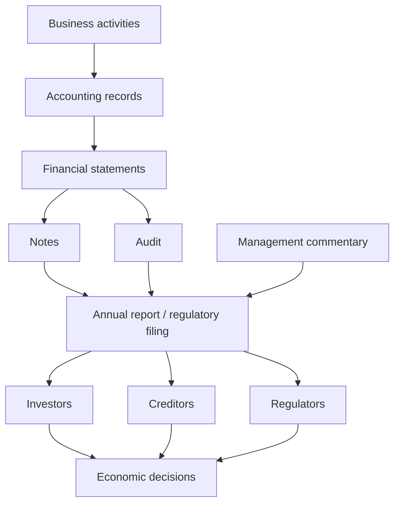
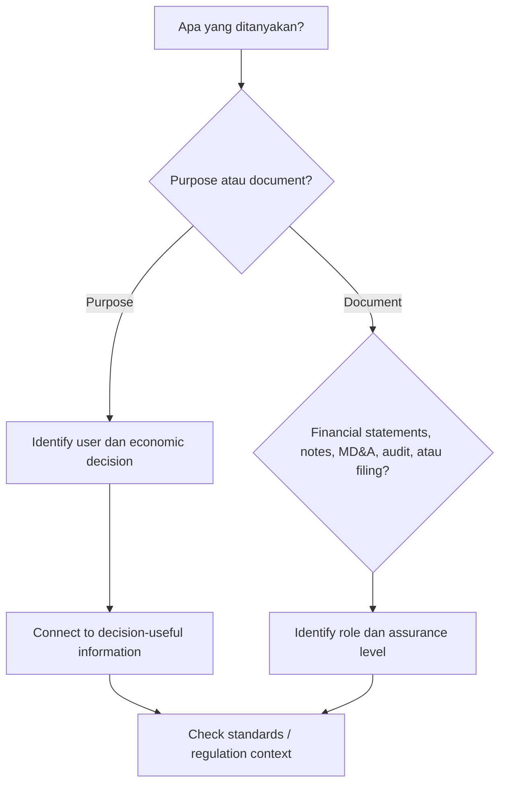

# 📘 1.2 — Financial Reporting Requirements

> [!ABSTRACT] Ringkasan Cepat
> **Topik:** Financial Reporting Requirements  
> **Bobot Parent Topic:** 30–40%  
> **Exam Priority:** Very High  
> **Difficulty:** Concept-Intensive  
> **Primary Skill:** Concept  
> **Ref:** Robinson et al. Bab 1.1–1.3 dan Bab 3.1–3.8; Weygandt et al. Bab 1; Brigham & Ehrhardt Bab 2

## Section 0 — Pemetaan Silabus & Exam Scope

| Field | Isi |
|---|---|
| Topik CF4 | Topik 1 — Pelaporan Keuangan dan Perpajakan |
| Subtopik | 1.2 Financial Reporting Requirements |
| Learning Outcome | Menjelaskan mengapa perusahaan diharuskan untuk menerbitkan akun dan laporan tahunan (*financial accounts* dan *annual reports*) |
| Skill Diuji | Memahami tujuan financial reporting, pengguna informasi, kebutuhan standardisasi, peran regulation, isi umum annual report, audit, dan disclosure |
| Bobot Parent Topic | 30–40% |
| Exam Priority | Very High |
| Prerequisite | Konsep dasar perusahaan, investor, creditor, accounting information |
| Connected Topics | [[1.3 Accounting Concepts and Sustainability]], [[1.4 Company Account Structure]], [[1.5 Financial Statements Construction]], [[1.6 Financial Ratios and Interpretation]] |
| Referensi | Robinson et al. Bab 1.1–1.3 dan Bab 3.1–3.8; Weygandt et al. Bab 1; Brigham & Ehrhardt Bab 2 |

> [!IMPORTANT] Scope Boundary
> Fokus subtopik ini adalah **mengapa perusahaan menyediakan financial accounts dan annual reports, kepada siapa informasi tersebut ditujukan, mengapa pelaporan harus distandardisasi dan diregulasi, serta apa peran financial statements, notes, management commentary, audit, dan regulatory filings dalam ekosistem pelaporan**. Detail mechanics penyusunan setiap statement dibahas lebih dalam di [[1.5 Financial Statements Construction]], sedangkan detail rasio berada di [[1.6 Financial Ratios and Interpretation]]. Detail konseptual GAAP/IFRS dan sustainability diperdalam di [[1.3 Accounting Concepts and Sustainability]].

---

## Section 1 — Intuisi & Big Picture

Bayangkan kamu ingin meminjamkan Rp100 miliar kepada sebuah perusahaan yang belum pernah kamu kelola sendiri. Kamu tidak melihat langsung kasnya, tidak tahu seluruh kontraknya, dan tidak ikut rapat manajemen. Atau kamu seorang investor yang ingin membeli sahamnya. Pertanyaan pertama adalah:

> **Bagaimana kamu tahu kondisi perusahaan sebenarnya?**

Di sinilah **financial reporting** dibutuhkan.

Perusahaan merupakan pihak yang paling banyak mengetahui kondisi internalnya, sedangkan investor, creditor, dan pihak eksternal lain berada di luar perusahaan. Situasi ini menciptakan **information gap**. Financial reporting berfungsi mengurangi gap tersebut dengan mengomunikasikan informasi mengenai:

- **financial position** perusahaan;
- **financial performance** perusahaan;
- perubahan financial position;
- kemampuan menghasilkan profit dan cash flow;
- resources yang dikendalikan perusahaan;
- obligations kepada creditor;
- informasi tambahan mengenai risiko, accounting policies, estimates, dan prospek.

Robinson menempatkan tujuan financial reporting sebagai penyediaan informasi mengenai performance, financial position, dan perubahan financial position yang berguna bagi pengguna untuk membuat economic decisions. Financial statement analysis kemudian menggunakan laporan tersebut bersama informasi lain untuk menilai kinerja masa lalu, kondisi saat ini, dan prospek perusahaan.

Weygandt memberikan framing yang lebih sederhana: accounting adalah sistem informasi yang **mengidentifikasi, mencatat, dan mengomunikasikan** economic events kepada pengguna yang berkepentingan. Financial statements adalah bentuk utama komunikasi tersebut.

Brigham membawa perspektif corporate finance: investor membutuhkan financial statements untuk membantu memperkirakan future cash flows dan nilai perusahaan. Karena itu, perusahaan publik menyediakan financial statements kepada publik dan annual report menjadi salah satu sarana utama komunikasi tersebut.

### Siapa yang membutuhkan laporan?

Secara sederhana:

| User | Pertanyaan Utama |
|---|---|
| Investor / shareholder | Apakah perusahaan layak dibeli, ditahan, atau dijual? |
| Creditor / lender | Apakah perusahaan mampu membayar bunga dan principal? |
| Management | Bagaimana performa perusahaan dan apa keputusan yang perlu diambil? |
| Regulator | Apakah perusahaan mengikuti reporting rules dan securities regulation? |
| Employees / unions | Apakah perusahaan mampu mempertahankan operasi, upah, dan benefit? |
| Customers / suppliers | Apakah perusahaan cukup sehat untuk memenuhi komitmen jangka panjang? |

Tanpa reporting yang konsisten, setiap perusahaan dapat memilih cara sendiri untuk menggambarkan kinerja sehingga dua perusahaan menjadi sulit dibandingkan. Lebih buruk lagi, management dapat memilih presentation yang terlalu optimistis atau menyembunyikan informasi yang material.

> [!TIP] Intuisi Ujian
> **Financial reporting bukan sekadar “mencatat angka”.** Ia adalah mekanisme komunikasi antara perusahaan dan pihak yang harus mengambil economic decisions tetapi tidak memiliki akses langsung ke seluruh informasi internal perusahaan.

### Apa yang dapat salah jika konsep ini disalahpahami?

1. Menganggap annual report hanya formalitas administrasi.
2. Menganggap seluruh annual report telah diaudit.
3. Menganggap management commentary sama dengan financial statements.
4. Menganggap regulator dan accounting standard setter mempunyai fungsi identik.
5. Menganggap financial reporting hanya diperlukan oleh shareholder.
6. Menganggap angka yang dilaporkan tidak membutuhkan accounting standards karena “angka adalah fakta”.

Padahal banyak angka accounting memerlukan **policy choices, estimates, classification, dan judgment**. Karena itulah standards, disclosure, audit, dan regulation menjadi penting.

---

## Section 2 — Definisi & Core Concepts

### Definisi Formal

> [!NOTE] Definisi Formal
> **Financial reporting** adalah proses penyediaan informasi mengenai performance, financial position, dan perubahan financial position suatu reporting entity yang berguna bagi pengguna dalam membuat economic decisions.

> [!NOTE] Annual Report
> **Annual report** adalah laporan tahunan perusahaan kepada shareholder dan pihak eksternal lain yang biasanya memuat financial statements serta informasi tambahan mengenai perusahaan, management, operating results, dan perkembangan penting.

> [!NOTE] Financial Statements
> **Financial statements** adalah laporan terstruktur yang merangkum informasi accounting perusahaan. Dalam framework Robinson, complete set mencakup statement of financial position, statement of comprehensive income, statement of changes in equity, statement of cash flows, serta notes sebagai bagian integral.

### Terminologi Penting

| Istilah | Definisi | Intuisi | Exam Note |
|---|---|---|---|
| Financial reporting | Komunikasi informasi keuangan perusahaan kepada pengguna | “Jendela” pihak luar ke kondisi perusahaan | Lebih luas daripada financial statements |
| Financial statements | Laporan terstruktur dari accounting records | Core numerical reports | Merupakan bagian dari financial reporting |
| Annual report | Laporan tahunan kepada shareholders/pihak eksternal | Paket komunikasi tahunan perusahaan | Bisa mengandung audited dan unaudited information |
| Notes / footnotes | Penjelasan tambahan yang menyertai financial statements | Menjelaskan angka, policies, estimates, commitments | Integral terhadap complete financial statements |
| Management commentary / MD&A | Penjelasan management atas hasil, kondisi, risiko, tren, dan prospek | “Cerita di balik angka” dari management | Umumnya tidak sama dengan audited financial statements |
| Audit report | Opini independent auditor atas financial statements | Assurance atas kewajaran penyajian | Reasonable assurance, bukan jaminan absolut |
| Accounting standards | Aturan/principles untuk recognition, measurement, presentation, disclosure | Membuat reporting lebih konsisten/comparable | Standard setter membuat rules; regulator umumnya enforce |
| Regulatory filing | Laporan yang wajib disampaikan menurut aturan pasar modal | Formal compliance channel | Tidak selalu identik dengan annual report marketing document |

### Financial Reporting vs Financial Statement Analysis

| Financial Reporting | Financial Statement Analysis |
|---|---|
| Dilakukan oleh perusahaan | Dilakukan oleh analyst/user |
| Menyediakan informasi | Menggunakan dan mengevaluasi informasi |
| Fokus pada preparation dan communication | Fokus pada interpretation dan decision |
| Mengikuti standards dan regulatory requirements | Menggabungkan financial reports dengan informasi lain |

> [!DANGER] Definition Trap
> **Financial reporting ≠ financial statement analysis.** Reporting menghasilkan dan menyampaikan informasi; analysis menggunakan informasi tersebut untuk membuat keputusan.

### Mengapa Standardisasi Diperlukan?

Robinson menekankan bahwa financial reporting melibatkan pilihan accounting policies dan estimates yang membutuhkan judgment. Tanpa standards, judgment antar-preparer dapat sangat berbeda dan mengurangi consistency serta comparability.

Alur logikanya:

```text
Economic event
↓
Management/accountant harus menentukan recognition, measurement, classification, disclosure
↓
Terdapat judgment dan estimates
↓
Jika tidak ada standards → treatment dapat berbeda secara ekstrem
↓
Comparability dan credibility turun
↓
Economic decision menjadi lebih sulit
```

### Siapa Membuat dan Menegakkan Rules?

Robinson membedakan dua fungsi:

- **Standard-setting bodies**: secara umum mengembangkan accounting standards.
- **Regulatory authorities**: secara umum menegakkan reporting requirements dan securities regulation.

Contoh dalam sumber:

- **IASB** → menerbitkan IFRS.
- **FASB** → mengembangkan US GAAP.
- **SEC** → regulator pasar modal AS dan memiliki legal authority terhadap public-company reporting di yurisdiksinya.

Weygandt juga menekankan perbedaan IASB/IFRS dan FASB/GAAP serta usaha convergence untuk meningkatkan comparability lintas negara.

> [!TIP] Shortcut
> **Standard setter = “bagaimana accounting seharusnya dilakukan.”**  
> **Regulator = “siapa harus melapor, kapan, dan apakah aturan dipatuhi.”**

---

## Section 3 — How It Works

### A. Dari Business Activity ke External Decision

```text
Business transactions & economic events
↓
Identification + recording
↓
Classification + summarization
↓
Financial statements
↓
Notes + management commentary + other disclosures
↓
Audit / assurance
↓
Publication / regulatory filing
↓
Investor, creditor, regulator, dan user lain
↓
Economic decision
```

Weygandt menggambarkan accounting sebagai proses **identification → recording → communication**. Financial statements menjadi alat komunikasi utama. Robinson kemudian memperluasnya dengan notes, supplementary information, management commentary, auditor’s report, dan regulatory filings.

### B. Mengapa Perusahaan Menerbitkan Accounts dan Annual Reports?

Ada beberapa alasan yang saling berkaitan.

#### 1. Memenuhi kebutuhan informasi external users

Investor dan creditors tidak memiliki akses penuh ke internal books perusahaan. Mereka membutuhkan informasi untuk menilai:

- profitability;
- liquidity;
- solvency;
- cash-flow generating ability;
- financial position;
- risk;
- kemampuan memenuhi obligations;
- kemungkinan future performance.

#### 2. Mendukung capital allocation

Investor menentukan apakah akan menyediakan equity capital. Lender menentukan apakah akan memberikan loan dan pada terms seperti apa. Dengan informasi yang lebih baik, capital dapat diarahkan ke perusahaan yang dinilai memiliki risk-return profile yang sesuai.

#### 3. Memenuhi legal dan regulatory requirements

Public companies dalam berbagai yurisdiksi diwajibkan memenuhi periodic reporting dan filing requirements. Robinson menggunakan contoh SEC filings seperti annual filings, interim reporting, dan current reports untuk material events.

#### 4. Meningkatkan accountability

Management menggunakan resources yang berasal dari owners dan creditors. Reporting membantu pihak tersebut mengevaluasi hasil pengelolaan resources.

#### 5. Meningkatkan comparability dan transparency

Penggunaan accounting standards membantu economic events yang sejenis dipresentasikan dengan framework yang lebih konsisten, sehingga analysts dapat membandingkan perusahaan lintas waktu dan lintas entitas.

#### 6. Mengurangi information asymmetry

Management mengetahui lebih banyak daripada outside investors. Reporting, disclosure, dan audit mengurangi—meskipun tidak menghilangkan—ketimpangan informasi tersebut.

### C. Isi Umum Annual Report

Brigham menyatakan annual report biasanya diawali penjelasan chairman mengenai operating results tahun sebelumnya dan perkembangan baru yang memengaruhi future operations. Annual report juga menyajikan empat basic financial statements:

1. **Balance sheet**
2. **Income statement**
3. **Statement of stockholders’ equity**
4. **Statement of cash flows**

Robinson menggunakan framing IFRS yang sedikit berbeda namun secara ekonomi sejalan:

1. **Statement of financial position**
2. **Statement of comprehensive income**
3. **Statement of changes in equity**
4. **Statement of cash flows**
5. **Notes** sebagai bagian integral

Selain itu, annual report dapat memuat:

- chairman/CEO letter;
- management commentary / MD&A;
- governance information;
- corporate responsibility information;
- market segment information;
- R&D activities;
- future corporate goals;
- auditor’s report.

> [!IMPORTANT] Exam Note
> Jangan menghafal “annual report = empat statements saja”. Annual report adalah **paket informasi yang lebih luas**. Financial statements adalah core-nya, tetapi terdapat notes dan supplementary information.

### D. Annual Report vs Regulatory Filing

Robinson memberikan contoh penting dari pasar AS:

- Form 10-K merupakan annual regulatory filing untuk registrant AS.
- Annual report to shareholders adalah dokumen yang biasanya disiapkan perusahaan untuk berkomunikasi dengan shareholders dan dapat lebih polished/marketing-oriented.

Jadi:

> **Annual report dan regulatory annual filing dapat overlap, tetapi tidak selalu identik.**

### E. Audit

Financial statements dalam annual reports pada umumnya diaudit oleh independent accounting firm sesuai auditing standards yang berlaku.

Tujuan audit menurut framing Robinson adalah memperoleh **reasonable assurance** bahwa financial statements secara keseluruhan bebas dari material misstatement, baik akibat fraud maupun error, sehingga auditor dapat menyatakan opinion mengenai apakah financial statements disusun sesuai applicable financial reporting framework.

> [!DANGER] Jangan Salah Pikir
> 1. **Audit ≠ guarantee** bahwa perusahaan sehat atau tidak akan bangkrut.
> 2. **Audit opinion ≠ opini bahwa saham layak dibeli.**
> 3. **Audited financial statements ≠ seluruh annual report otomatis audited.** Management commentary biasanya perlu dinilai terpisah.

### F. Management Commentary / MD&A

Management commentary membantu menjelaskan konteks di balik angka, termasuk:

- nature of business;
- objectives dan strategies;
- significant resources, risks, dan relationships;
- results of operations;
- critical performance measures;
- trends, uncertainties, liquidity, capital resources;
- critical accounting policies dan significant judgments.

Management commentary sangat berguna untuk memahami perusahaan dan membuat projections, tetapi analyst harus sadar bahwa banyak informasi di dalamnya **unaudited** dan disampaikan dari perspektif management.

> [!TIP] Cara Berpikir
> **Financial statements = “apa yang tercatat.”**  
> **Notes = “bagaimana angka itu dibentuk.”**  
> **MD&A = “bagaimana management menjelaskan apa yang terjadi dan apa yang mungkin terjadi.”**  
> **Audit report = “tingkat assurance atas financial statements.”**

---

## Section 4 — Worked Examples & Exam Cases

### Case A — Fundamental

**Soal**

Sebuah perusahaan listed menerbitkan annual report berisi income statement, balance sheet, cash flow statement, notes, CEO letter, dan MD&A. Seorang peserta ujian menyimpulkan bahwa semua informasi dalam annual report telah diaudit karena financial statements-nya diaudit.

> [!SUCCESS] Pembahasan
>
> **1. Identifikasi informasi**  
> Annual report berisi audited financial statements dan supplementary narrative information.
>
> **2. Konsep yang diuji**  
> Perbedaan financial statements, annual report, management commentary, dan audit coverage.
>
> **3. Reasoning**  
> Robinson menyatakan financial statements pada annual report umumnya diaudit, sedangkan management commentary biasanya tidak diaudit, kecuali terdapat ketentuan khusus di yurisdiksi tertentu.
>
> **4. Calculation**  
> Tidak ada.
>
> **5. Interpretation**  
> Kesimpulan peserta salah. Status audited pada financial statements tidak otomatis meluas ke seluruh narrative content dalam annual report.
>
> **6. Verification**  
> Tanyakan: “Apakah informasi ini bagian dari financial statements yang menjadi subject audit opinion, atau supplementary commentary?”

> [!WARNING] Exam Trap — Case A
> - **Trap:** Menganggap annual report dan audited financial statements identik.
> - **Mengapa distractor terlihat benar:** Auditor’s report memang berada dalam annual report.
> - **Cara menghindari:** Pisahkan *document package* dari *specific statements covered by audit opinion*.
> - **Target waktu:** 30–45 detik.

### Case B — Exam-Typical

**Soal**

Manakah alasan paling kuat mengapa accounting standards dibutuhkan dalam financial reporting?

A. Semua economic events memiliki hanya satu nilai objektif.  
B. Management tidak pernah menggunakan estimates.  
C. Financial reporting melibatkan policy choices, estimates, dan judgment sehingga consistency perlu ditingkatkan.  
D. Accounting standards menjamin semua perusahaan memiliki profitability yang sama.

> [!SUCCESS] Pembahasan
>
> **1. Identifikasi informasi**  
> Pertanyaan mengenai tujuan standards.
>
> **2. Konsep yang diuji**  
> Standardization dan judgment dalam financial reporting.
>
> **3. Reasoning**  
> Robinson menekankan bahwa policy choices dan estimates membutuhkan judgment. Standards membantu meningkatkan consistency dan comparability.
>
> **4. Calculation**  
> Tidak ada.
>
> **5. Interpretation**  
> Jawaban **C**.
>
> **6. Verification**  
> A salah karena tidak semua angka accounting murni objektif; B salah karena estimates sangat umum; D tidak berhubungan dengan tujuan standards.

> [!WARNING] Exam Trap — Case B
> - **Trap:** Mengira standards menghilangkan seluruh judgment.
> - **Mengapa distractor terlihat benar:** Standardization terdengar seperti “semua harus sama”.
> - **Cara menghindari:** Standards membatasi dan mengarahkan judgment; tidak menghapus seluruh judgment.
> - **Target waktu:** 30 detik.

### Case C — Challenging / Integrated

**Soal**

Investor membaca dua sumber dari perusahaan yang sama:

1. audited financial statements menunjukkan laba meningkat 8%;
2. MD&A menyatakan perusahaan menghadapi uncertainty besar karena kenaikan biaya bahan baku dan kebutuhan capital expenditure tahun depan.

Investor mengabaikan MD&A karena tidak termasuk angka audited. Apakah pendekatan ini tepat?

> [!SUCCESS] Pembahasan
>
> **1. Identifikasi informasi**  
> Financial statements memberikan historical reported performance; MD&A memberikan contextual dan forward-looking information.
>
> **2. Konsep yang diuji**  
> Complementary role financial statements dan management commentary.
>
> **3. Reasoning**  
> Financial analysis tidak berhenti pada angka audited. Robinson menyatakan management commentary dapat memberikan informasi mengenai trends, uncertainties, capital resources, planned expenditures, dan critical accounting policies yang penting untuk memahami future performance.
>
> **4. Calculation**  
> Tidak ada.
>
> **5. Interpretation**  
> Mengabaikan MD&A sepenuhnya tidak tepat. Namun investor juga tidak boleh memperlakukan management commentary sebagai bukti setara audited figures; informasi perlu dinilai secara kritis.
>
> **6. Verification**  
> Bedakan **assurance level** dari **decision usefulness**. Unaudited tidak berarti tidak berguna; audited tidak berarti cukup untuk seluruh keputusan.

> [!WARNING] Exam Trap — Case C
> - **Trap:** “Audited = useful, unaudited = useless.”
> - **Mengapa distractor terlihat benar:** Audit meningkatkan credibility.
> - **Cara menghindari:** Financial analysis menggunakan multiple information sources dengan tingkat assurance berbeda.
> - **Target waktu:** 45–60 detik.

---

## Section 5 — Interpretation & Sanity Check

> [!CHECK] Sanity Check
> 1. **User check:** Siapa yang membutuhkan informasi ini—management, investor, creditor, atau regulator?
> 2. **Document check:** Apakah yang dimaksud financial statement, annual report, notes, MD&A, atau regulatory filing?
> 3. **Assurance check:** Apakah informasi tersebut audited, unaudited, atau hanya management representation?
> 4. **Rule-maker check:** Apakah soal sedang membahas standard setter atau regulator?
> 5. **Decision-usefulness check:** Informasi apa yang dibutuhkan untuk keputusan—historical performance saja atau juga risk dan future outlook?

### Interpretation Ladder

> **Level 1 — Information**  
> Apa yang dilaporkan perusahaan?
>
> **Level 2 — User**  
> Siapa yang memakai informasi tersebut?
>
> **Level 3 — Decision**  
> Keputusan ekonomi apa yang akan dibuat?
>
> **Level 4 — Reliability / Comparability**  
> Apa yang membuat informasi lebih credible dan comparable?
>
> **Level 5 — Limitation**  
> Apa yang tidak dapat disimpulkan hanya dari laporan tersebut?

Contoh:

> Annual report menunjukkan net income meningkat.

Jangan berhenti pada “perusahaan membaik”. Pertanyaan berikutnya:

- Apakah cash flow juga membaik?
- Apakah kenaikan berasal dari recurring operations?
- Apakah accounting policy berubah?
- Apa yang dijelaskan notes dan MD&A?
- Apakah terdapat material risks atau obligations?

---

## Section 6 — Connections & Mental Model



### Hubungan Konsep

#### Dengan [[1.3 Accounting Concepts and Sustainability]]

Subtopik 1.2 menjawab **mengapa reporting diperlukan**. Subtopik 1.3 menjelaskan **konsep dan rules yang digunakan untuk menghasilkan reporting yang konsisten**, termasuk accounting principles, standards, dan broader reporting context.

#### Dengan [[1.4 Company Account Structure]]

Setelah memahami mengapa financial reports dibutuhkan, langkah berikutnya adalah memahami bagaimana perusahaan dan group accounts disusun serta apa fungsi komponen utamanya.

#### Dengan [[1.5 Financial Statements Construction]]

1.2 fokus pada **purpose dan requirements**. 1.5 fokus pada **mechanics penyusunan** statement of financial position dan income statement sederhana.

#### Dengan [[1.6 Financial Ratios and Interpretation]]

Financial reports menyediakan raw information. Financial ratio analysis mengubah raw data tersebut menjadi metrics yang membantu interpretation.

> [!DANGER] Profit ≠ Cash Flow
> Financial reporting menyediakan beberapa statements karena satu angka tidak cukup menggambarkan perusahaan. Net income dan cash flow dapat berbeda akibat timing recognition, accruals, credit transactions, depreciation, dan perubahan working capital.

---

## Section 7 — Exam Traps & Misconceptions

### Definition Trap

> [!BUG] Definition Trap
> **Financial reporting vs financial statements**  
> Financial reporting lebih luas; financial statements merupakan bagian inti dari financial reporting.

> [!BUG] Definition Trap
> **Annual report vs regulatory filing**  
> Keduanya dapat overlap tetapi tidak harus identik. Dalam contoh AS pada Robinson, annual report to shareholders berbeda konsep dari mandatory annual SEC filing seperti Form 10-K.

> [!BUG] Definition Trap
> **Standard setter vs regulator**  
> Standard setter terutama mengembangkan accounting standards; regulator terutama menetapkan/enforce legal reporting dan filing requirements di yurisdiksinya.

### Accounting / Financial Logic Trap

> [!BUG] Logic Trap
> **“Karena management mengetahui bisnis paling baik, management commentary sudah cukup.”**  
> Salah. Management commentary berguna tetapi berasal dari management perspective dan biasanya bukan substitute bagi audited financial statements dan independent analysis.

> [!BUG] Logic Trap
> **“Kalau financial statements sudah audited, tidak perlu notes.”**  
> Salah. Notes merupakan bagian integral complete financial statements dan penting untuk memahami policies, estimates, commitments, dan detail angka.

> [!BUG] Logic Trap
> **“Tujuan reporting adalah memberi tahu investor berapa harga saham yang benar.”**  
> Salah. Reporting menyediakan decision-useful information; valuation dan investment decision tetap dilakukan oleh users/analysts.

### Calculation Trap

Subtopik 1.2 bersifat concept-heavy sehingga tidak memiliki core calculation formula. Trap numerik biasanya muncul melalui interpretation, misalnya menganggap satu angka reported profit sudah cukup tanpa melihat cash flow atau disclosure lain.

### Interpretation Trap

> [!BUG] Interpretation Trap
> Financial statements dapat disusun sesuai standards dan tetap membutuhkan judgment. Compliance dengan standards tidak berarti angka bebas dari estimates, assumptions, atau uncertainty.

### Red Flags

> [!CAUTION] Red Flags

| Keyword / Condition | Apa yang Harus Dipikirkan |
|---|---|
| “annual report” | Paket informasi luas; jangan otomatis samakan dengan financial statements |
| “audited” | Cari bagian yang benar-benar menjadi subject audit opinion |
| “MD&A / management commentary” | Context, trends, risks, outlook; biasanya management perspective dan sering unaudited |
| “notes” | Accounting policies, estimates, detail disclosures; integral terhadap statements |
| “investor” | Equity value, profitability, dividends, future prospects |
| “creditor” | Interest/principal repayment, liquidity, solvency |
| “regulator” | Compliance, filing, disclosure, market integrity |
| “IASB / FASB” | Standard setting |
| “SEC” | Regulation/enforcement dan filing requirements dalam konteks AS |
| “comparability” | Peran common accounting standards |
| “judgment / estimate” | Alasan standards dan disclosure diperlukan |

---

## Section 8 — Executive Summary

### Must Remember

> [!SUMMARY] Must Remember
> 1. **[CORE CF4]** Financial reporting ada untuk menyediakan decision-useful information mengenai performance, financial position, dan perubahan financial position perusahaan.
> 2. **[CORE CF4]** External users terutama membutuhkan reporting karena mereka tidak memiliki direct access ke seluruh internal information perusahaan.
> 3. **[CORE CF4]** Investor menilai return dan value; creditor menilai kemampuan pembayaran obligations.
> 4. **[CORE CF4]** Financial reporting lebih luas daripada financial statements.
> 5. **[CORE CF4]** Complete financial statements mencakup core statements dan notes; notes bukan sekadar tambahan opsional.
> 6. **[CORE CF4]** Annual report dapat berisi financial statements, notes, management commentary, auditor’s report, governance information, dan informasi korporasi lain.
> 7. **[CORE CF4]** Accounting standards diperlukan karena reporting melibatkan choices, estimates, dan judgment.
> 8. **[CORE CF4]** Standard setter dan regulator mempunyai fungsi berbeda tetapi saling melengkapi.
> 9. **[CORE CF4]** Audit memberikan reasonable assurance atas financial statements—bukan jaminan absolut dan bukan investment recommendation.
> 10. **[INTERPRETATION]** Management commentary berguna untuk context dan outlook tetapi tidak boleh diperlakukan sama dengan audited financial statements.

### Comparison Table

| Konsep | Tujuan Utama | Dibuat oleh | Typical Assurance |
|---|---|---|---|
| Financial statements | Menyajikan structured financial information | Company management/accounting function | Umumnya audited untuk public-company annual reporting |
| Notes | Menjelaskan policies dan detail statements | Company | Termasuk dalam audited financial statements bila menjadi bagian statements |
| MD&A / management commentary | Menjelaskan business context, trends, risks, outlook | Management | Sering unaudited |
| Auditor’s report | Memberikan independent opinion | External auditor | Reasonable assurance |
| Regulatory filing | Memenuhi legal/securities reporting requirement | Company kepada regulator | Tergantung filing dan applicable rules |
| Annual report | Komunikasi tahunan luas kepada shareholders/pihak eksternal | Company | Campuran audited dan unaudited content |

### Trigger Keywords

| Jika soal mengatakan... | Pikirkan... |
|---|---|
| “why publish accounts?” | Decision usefulness + external users + regulation + accountability |
| “existing/potential investors and lenders” | Objective of general-purpose financial reporting |
| “policy choices / estimates / judgment” | Need for accounting standards dan disclosure |
| “independent opinion” | External audit |
| “reasonable assurance” | Audit, bukan guarantee |
| “forward-looking trends / uncertainties” | MD&A / management commentary |
| “integral part of complete financial statements” | Notes |
| “standard-setting body” | IASB/FASB framing |
| “enforce reporting requirements” | Regulatory authority |

### Kapan Digunakan

Gunakan framework 1.2 ketika soal meminta:

- alasan perusahaan menerbitkan accounts/annual reports;
- tujuan financial reporting;
- siapa pengguna laporan dan keputusan mereka;
- perbedaan financial statements dan broader annual reporting;
- fungsi notes, MD&A, atau audit;
- mengapa standards dan regulation dibutuhkan;
- membedakan standard setter dan regulator.

### Kapan TIDAK Boleh Digunakan

Jangan gunakan subtopik ini sebagai substitusi untuk:

- mechanics debit/credit → [[1.5 Financial Statements Construction]];
- detail accounting equation dan account structure → [[1.4 Company Account Structure]];
- formula financial ratios → [[1.6 Financial Ratios and Interpretation]];
- detail sustainability reporting → [[1.3 Accounting Concepts and Sustainability]].

### Quick Decision Tree



---

## Section 9 — Active Recall Check

1. Mengapa external investors membutuhkan financial reporting jika management sudah mengetahui kondisi perusahaan?
2. Apa perbedaan **financial reporting** dengan **financial statement analysis**?
3. Mengapa adanya accounting estimates dan policy choices justru memperkuat kebutuhan terhadap accounting standards?
4. Apa perbedaan fungsi **standard-setting body** dan **regulatory authority**?
5. Mengapa annual report tidak boleh otomatis dianggap seluruhnya audited?
6. Apa fungsi notes yang tidak dapat digantikan hanya dengan melihat angka pada balance sheet dan income statement?
7. Mengapa MD&A dapat berguna bagi investor meskipun sering tidak diaudit?
8. Apa arti **reasonable assurance** dalam konteks audit, dan apa yang tidak dijamin oleh audit?
9. Mengapa creditor dan equity investor dapat membaca laporan yang sama tetapi fokus pada informasi yang berbeda?
10. Jika suatu perusahaan melaporkan kenaikan profit tetapi operating cash flow memburuk, mengapa annual financial reporting tetap harus dibaca secara keseluruhan dan tidak hanya income statement?

---

## Section 10 — Exam Pattern Map

| Narasi Soal | Keyword | Konsep | Formula/Rule | Langkah | Trap | Shortcut |
|---|---|---|---|---|---|---|
| Perusahaan diwajibkan menerbitkan laporan untuk investor dan lender | “useful”, “investor”, “lender”, “creditor” | Objective of financial reporting | Tidak ada formula | Identifikasi user → decision → information needed | Mengira hanya shareholder yang relevan | **User → Decision → Information** |
| Ditanyakan alasan adanya accounting standards | “estimates”, “judgment”, “policy choices”, “comparability” | Standardization | Standards meningkatkan consistency/comparability | Cari sumber variability → hubungkan ke standards | Mengira standards menghapus seluruh judgment | **Judgment exists → standards constrain it** |
| Annual report berisi financial statements dan management commentary | “audited”, “MD&A”, “annual report” | Scope of audit | Audit ≠ whole annual report | Pisahkan components → tentukan assurance | Semua annual report dianggap audited | **Statement ≠ package** |
| Soal membedakan IASB/FASB dan SEC | “standard setter”, “regulator”, “enforcement” | Regulatory architecture | Setter develops; regulator enforces/filing | Identifikasi verb dalam soal | Menganggap semua lembaga membuat standards dengan fungsi sama | **Make rules vs enforce rules** |
| Analyst ingin memahami future risk dan planned capex | “trends”, “uncertainties”, “future”, “capital resources” | MD&A / management commentary | Tidak ada formula | Cari narrative disclosure | Hanya membaca historical statements | **Past numbers + future context** |

**Label:** `[TEXTBOOK-BASED EXPECTATION]` — pola di atas berasal dari learning outcome dan konsep yang secara langsung ditekankan oleh referensi resmi; tidak diklaim sebagai frekuensi past exam karena past exam CF4 tidak digunakan dalam penyusunan note ini.

---

## Source Traceability

| Materi | Sumber |
|---|---|
| Role dan objective of financial reporting | Robinson et al., Bab 1 §§1–3 dan Bab 3 |
| Financial reporting vs financial statement analysis | Robinson et al., Bab 1 §2 |
| Complete set of financial statements dan supplementary information | Robinson et al., Bab 1 §3.1 |
| Management commentary / MD&A | Robinson et al., Bab 1 §3.1.6 |
| Auditor’s report dan reasonable assurance | Robinson et al., Bab 1 §3.1.7 |
| Standard setters, regulators, filing requirements, convergence | Robinson et al., Bab 3 §§1–3 dan §§6–8 |
| Accounting sebagai identification, recording, communication | Weygandt, Kimmel & Kieso, Bab 1 |
| Internal dan external users; investor dan creditor | Weygandt, Kimmel & Kieso, Bab 1 |
| GAAP, FASB, IFRS, IASB, transparency dan international comparability | Weygandt, Kimmel & Kieso, Bab 1 |
| Annual report sebagai sumber komunikasi perusahaan | Brigham & Ehrhardt, Bab 2 §2.1 |
| Empat basic financial statements dalam annual report | Brigham & Ehrhardt, Bab 2 §2.1 |
| Financial statements sebagai input untuk estimasi future cash flows dan valuation | Brigham & Ehrhardt, Bab 2 |

> [!IMPORTANT] Source Note
> Untuk subtopik 1.2, **Robinson merupakan sumber paling substantif** karena secara langsung membahas tujuan financial reporting, financial statements dan supplementary information, management commentary, audit, reporting standards, regulators, dan filing requirements. **Weygandt** memperkuat framing accounting sebagai proses komunikasi serta peran internal/external users dan standard-setting. **Brigham & Ehrhardt** memberikan perspektif corporate finance mengenai annual report, basic statements, dan penggunaan financial information untuk memahami cash flows serta firm value. Tidak ada materi dari Berk & DeMarzo karena buku tersebut bukan referensi resmi Topik 1 CF4.

---

> [!QUOTE] Follow-up Options
> 1. *"Uji saya dengan soal Active Recall dari topik ini"*
> 2. *"Buat 10 soal exam-style untuk topik ini"*
> 3. *"Jelaskan hubungan topik ini dengan topik CF4 terkait"*

*📖 Ref: Robinson et al. Bab 1.1–1.3 & Bab 3.1–3.8; Weygandt et al. Bab 1; Brigham & Ehrhardt Bab 2 | 🗓️ 2026-08-23 | #CF4 #AkuntansiKeuanganKorporasi*
