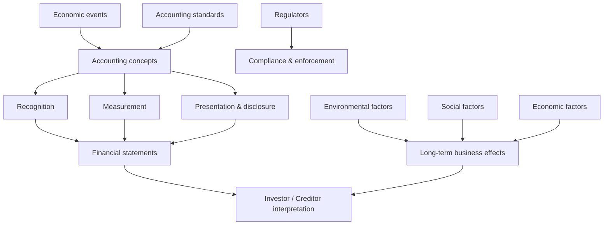
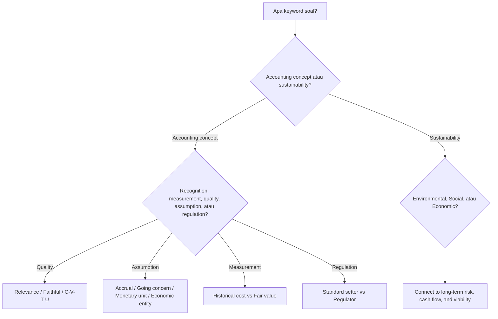

# 📘 1.3 — Accounting Concepts and Sustainability

> [!ABSTRACT] Ringkasan Cepat
> **Topik:** Accounting Concepts and Sustainability  
> **Bobot Parent Topic:** 30–40%  
> **Exam Priority:** Very High  
> **Difficulty:** Concept-Intensive  
> **Primary Skill:** Concept  
> **Ref:** Robinson et al. Bab 3.1–3.8; Weygandt et al. Bab 1–2; Brigham & Ehrhardt Bab 1–3

## Section 0 — Pemetaan Silabus & Exam Scope

| Field | Isi |
|---|---|
| Topik CF4 | Topik 1 — Pelaporan Keuangan dan Perpajakan |
| Subtopik | 1.3 Accounting Concepts and Sustainability |
| Learning Outcome | Menjelaskan konsep-konsep dan istilah-istilah akuntansi dasar, mendeskripsikan sumber utama peraturan terkait akuntansi, dan memahami kontekstualisasi financial reporting berkaitan dengan lingkungan, sosial, dan ekonomi yang berkesinambungan. |
| Skill Diuji | Membedakan accounting concepts yang mirip, memahami qualitative characteristics dan assumptions, menjelaskan standard-setting/regulation, serta menghubungkan financial reporting dengan sustainability context tanpa menyamakan keduanya. |
| Bobot Parent Topic | 30–40% |
| Exam Priority | Very High |
| Prerequisite | [[1.2 Financial Reporting Requirements]] |
| Connected Topics | [[1.2 Financial Reporting Requirements]], [[1.4 Company Account Structure]], [[1.5 Financial Statements Construction]], [[1.6 Financial Ratios and Interpretation]] |
| Referensi | Robinson et al. Bab 3.1–3.8; Weygandt et al. Bab 1–2; Brigham & Ehrhardt Bab 1–3 |

> [!IMPORTANT] Scope Boundary
> `[CORE CF4]` Subtopik ini mencakup **basic accounting concepts and terminology**, qualitative characteristics of useful financial information, basic assumptions dan measurement principles, sumber utama accounting regulation, serta cara memandang **sustainability** dalam konteks lingkungan, sosial, dan ekonomi.  
>  
> Detail penyusunan jurnal dan debit/credit dibahas lebih tepat di [[1.5 Financial Statements Construction]], sedangkan ratio calculation berada di [[1.6 Financial Ratios and Interpretation]].  
>  
> `[BEYOND CF4]` Framework sustainability modern yang tidak terdapat dalam sumber resmi yang diberikan—misalnya detail GRI, SASB, TCFD, ISSB/IFRS S1–S2, EU CSRD, atau assurance standards terbaru—**tidak dimasukkan sebagai materi inti**. Sumber yang tersedia mendukung sustainability terutama melalui corporate responsibility, ethical reporting, environmental/social considerations, dan hubungan antara perusahaan dengan stakeholder serta society.

---

## Section 1 — Intuisi & Big Picture

Apa masalah nyata yang ingin diselesaikan konsep ini?

Bayangkan dua perusahaan sama-sama melaporkan profit Rp100 miliar. Apakah kita boleh langsung mengatakan keduanya sama baiknya?

Belum tentu.

Perusahaan A mungkin mencatat transaksi dengan prinsip yang konsisten, menggunakan estimasi yang wajar, menjaga operasi jangka panjang, dan mengungkapkan risiko lingkungan serta sosial yang relevan. Perusahaan B mungkin menggunakan asumsi agresif, memilih treatment yang menaikkan laba saat ini, dan mengabaikan biaya ekonomi yang baru muncul beberapa tahun kemudian.

Angka accounting baru berguna jika kita memahami **aturan dan konsep yang membentuk angka tersebut**.

Accounting bukan hanya aktivitas mencatat transaksi. Weygandt merangkum accounting sebagai proses:

```text
Identify economic events
↓
Record
↓
Classify and summarize
↓
Communicate
↓
Analyze and interpret
```

Supaya komunikasi itu berguna, perusahaan tidak boleh bebas menentukan semua aturan sendiri. Karena itulah dibutuhkan:

- accounting standards;
- qualitative characteristics;
- measurement principles;
- assumptions;
- ethical conduct;
- disclosure;
- standard setters dan regulators.

Robinson menambahkan perspektif yang sangat penting untuk exam: financial reporting **memerlukan policy choices, estimates, dan judgment**. Karena judgment antar-preparer bisa berbeda, standards dibutuhkan untuk meningkatkan consistency dan comparability.

### Mengapa sustainability masuk ke topik accounting?

Financial statements secara tradisional sangat kuat untuk menjelaskan transaksi yang dapat diukur dalam monetary terms, tetapi perusahaan hidup di dunia yang lebih luas daripada angka laba tahun berjalan.

Contohnya:

- penggunaan energi dan sumber daya;
- dampak lingkungan;
- keselamatan dan kesejahteraan karyawan;
- hubungan dengan customer dan community;
- reputasi;
- kemampuan bisnis bertahan secara ekonomi dalam jangka panjang.

Weygandt memberi contoh Clif Bar dengan *Five Aspirations*: sustaining business, brands, people, community, dan planet. Contoh ini memperlihatkan bahwa keberlanjutan perusahaan dapat dipandang melalui dimensi bisnis, manusia, komunitas, dan lingkungan—bukan hanya laba jangka pendek.

Brigham juga menempatkan corporate success dalam hubungan perusahaan dengan customers, employees, suppliers, investors, dan society. Perusahaan yang mengejar nilai jangka panjang tidak dapat sepenuhnya mengabaikan kualitas produk, employees, social responsibility, maupun environmental constraints.

> [!TIP] Intuisi Ujian
> **Accounting concepts menjawab: “bagaimana economic events diterjemahkan menjadi financial information?”**  
> **Sustainability context menjawab: “apakah financial performance dan business model tersebut dapat dipahami secara lebih luas dan dipertahankan secara ekonomi, sosial, dan lingkungan?”**

### Apa yang bisa salah jika konsep ini disalahpahami?

1. Menganggap semua angka accounting bersifat objektif dan bebas judgment.
2. Menganggap **historical cost** dan **fair value** selalu menghasilkan angka yang sama.
3. Menganggap **relevance** dan **faithful representation** adalah sinonim.
4. Menganggap accounting standards menghapus seluruh estimasi.
5. Menganggap **going concern** berarti perusahaan pasti tidak akan bangkrut.
6. Menganggap hanya transaksi kas yang dapat memengaruhi profit.
7. Menganggap sustainability hanya soal lingkungan.
8. Menganggap tindakan yang meningkatkan profit jangka pendek otomatis meningkatkan long-term firm value.

---

## Section 2 — Definisi & Core Concepts

### Definisi Formal

> [!NOTE] Definisi Formal — Accounting
> **Accounting** adalah information system yang mengidentifikasi, mencatat, dan mengomunikasikan economic events suatu organisasi kepada interested users.

> [!NOTE] Definisi Formal — GAAP
> **Generally Accepted Accounting Principles (GAAP)** adalah common set of accounting standards/principles yang digunakan untuk menentukan bagaimana economic events dilaporkan.

> [!NOTE] Definisi Formal — IFRS
> **International Financial Reporting Standards (IFRS)** adalah financial reporting standards yang diterbitkan oleh **International Accounting Standards Board (IASB)** dan digunakan atau diadopsi dalam banyak yurisdiksi.

> [!NOTE] Definisi Formal — Sustainability Context
> Dalam scope CF4 dan sumber yang tersedia, **sustainability** dipahami sebagai konteks bahwa kinerja perusahaan dan financial reporting perlu dibaca bersama dampak dan kemampuan bisnis mempertahankan aktivitasnya dalam dimensi **ekonomi, sosial, dan lingkungan**. Sumber resmi yang diberikan tidak menyediakan satu definisi teknis tunggal sustainability reporting modern; karena itu note ini tidak mengimpor framework eksternal.

### Terminologi Penting

| Istilah | Definisi | Intuisi | Exam Note |
|---|---|---|---|
| Economic event | Kejadian yang relevan terhadap aktivitas ekonomi entitas | Sesuatu terjadi dalam bisnis | Belum tentu seluruh event dapat direkam jika tidak measurable |
| Recognition | Memasukkan suatu item ke financial statements ketika memenuhi kriteria | “Apakah masuk laporan?” | Berbeda dari measurement |
| Measurement | Menentukan amount/nilai yang dilaporkan | “Berapa nilainya?” | Historical cost dan fair value dapat memberi amount berbeda |
| Presentation | Bagaimana item ditampilkan/classified dalam statements | “Ditampilkan di mana?” | Classification dapat memengaruhi interpretation |
| Disclosure | Informasi tambahan, biasanya dalam notes | “Apa detail di balik angka?” | Tidak sama dengan recognition |
| Relevance | Informasi mampu membuat perbedaan dalam decision | Informasi berguna untuk keputusan | Fundamental qualitative characteristic |
| Faithful representation | Informasi merepresentasikan economic phenomenon secara faithful | Angka/deskripsi sesuai substance yang ingin digambarkan | Fundamental qualitative characteristic |
| Comparability | Membantu user membandingkan antarperiode/antarentitas | Apples-to-apples | Enhancing characteristic |
| Verifiability | Knowledgeable independent observers dapat mencapai konsensus reasonable | Dapat dicek | Enhancing characteristic |
| Timeliness | Informasi tersedia ketika masih berguna | Terlambat = kurang berguna | Enhancing characteristic |
| Understandability | Informasi disajikan jelas dan ringkas bagi knowledgeable users | Bisa dipahami | Tidak berarti semua complexity harus dihilangkan |
| Materiality | Informasi cukup penting sehingga omission/misstatement dapat memengaruhi decision | “Apakah ini cukup penting?” | Materiality ≠ ukuran absolut tunggal |
| Accrual basis | Economic effects diakui ketika terjadi sesuai accounting rules, tidak semata saat cash bergerak | Profit ≠ cash flow | Fundamental exam concept |
| Going concern | Financial statements umumnya disiapkan dengan asumsi entitas akan terus beroperasi | Bisnis diasumsikan continuing | Bukan jaminan perusahaan akan hidup selamanya |
| Historical cost | Asset dicatat berdasarkan cost yang dikeluarkan saat acquisition | Nilai transaksi asli | Factual tetapi dapat kurang current |
| Fair value | Measurement berbasis current market-oriented value sebagaimana didefinisikan source | Nilai yang lebih current | Lebih relevant dalam beberapa asset, tetapi dapat membutuhkan estimation |
| Monetary unit assumption | Hanya data yang dapat diekspresikan dalam money terms masuk accounting records | Accounting membutuhkan unit pengukuran | Hal penting yang tidak terukur dapat berada di luar records |
| Economic entity assumption | Aktivitas entitas dipisahkan dari aktivitas owner dan entitas lain | Bisnis ≠ dompet pribadi owner | Penting untuk valid reporting |
| Consistency | Treatment/presentation diterapkan secara konsisten antarperiode kecuali ada alasan valid untuk berubah | Jangan ganti metode seenaknya | Mendukung comparability |
| Sustainability | Kemampuan dan konteks jangka panjang bisnis dalam aspek ekonomi, sosial, lingkungan | “Apakah keberhasilan hari ini bisa dipertahankan?” | Jangan direduksi menjadi “green issue” saja |

---

### 2.1 Fundamental Qualitative Characteristics

Menurut Robinson, objective utama conceptual framework adalah penyajian informasi yang berguna. Dua **fundamental qualitative characteristics** adalah:

#### A. Relevance

Informasi relevan bila dapat membuat perbedaan pada keputusan pengguna.

Mental model:

```text
Information
↓
Can change assessment / prediction / confirmation?
↓
Yes → Relevant
```

Contoh: informasi mengenai penurunan besar demand kemungkinan relevan bagi investor karena dapat memengaruhi expected future cash flow.

#### B. Faithful Representation

Informasi harus merepresentasikan economic phenomenon yang dimaksud secara faithful.

Intinya bukan sekadar “angkanya presisi”, tetapi apakah angka/deskripsi tersebut benar-benar mewakili economic reality yang ingin dilaporkan.

> [!DANGER] Definition Trap
> **Relevance ≠ faithful representation.**  
> Informasi bisa sangat relevan tetapi jika measurement-nya tidak credible, decision usefulness turun. Sebaliknya, informasi bisa sangat akurat secara mekanis tetapi kurang relevan untuk decision tertentu.

---

### 2.2 Enhancing Qualitative Characteristics

Robinson menyebut empat enhancing characteristics:

1. **Comparability**
2. **Verifiability**
3. **Timeliness**
4. **Understandability**

Mereka meningkatkan usefulness dari informasi yang sudah relevant dan faithfully represented.

| Characteristic | Pertanyaan Mental |
|---|---|
| Comparability | Bisa dibandingkan dengan periode/entitas lain? |
| Verifiability | Bisa diuji/dicek oleh pihak independen? |
| Timeliness | Datanya tersedia sebelum kehilangan kegunaan? |
| Understandability | Disajikan secara jelas bagi informed user? |

> [!TIP] Shortcut
> **Fundamental = R + F** → *Relevant + Faithful*.  
> **Enhancing = C + V + T + U** → *Comparable, Verifiable, Timely, Understandable*.

---

### 2.3 Basic Accounting Assumptions

#### Accrual Basis

Robinson menempatkan accrual basis sebagai underlying assumption dalam conceptual framework.

Under accrual accounting, timing recognition **tidak identik** dengan timing cash.

Contoh:

Perusahaan menjual barang Rp100 juta secara kredit pada Desember dan menerima kas pada Januari.

Secara accrual, revenue dapat diakui pada Desember ketika earning event memenuhi recognition criteria, sementara cash baru masuk Januari.

> [!DANGER] Profit ≠ Cash Flow
> Revenue bukan selalu cash received. Expense bukan selalu cash paid. Karena itu net income tidak otomatis sama dengan net cash flow.

#### Going Concern

Going concern mengasumsikan entitas akan melanjutkan operasinya sehingga financial statements disusun dalam konteks continuing operations.

> [!BUG] Trap
> Going concern **bukan** prediksi bahwa perusahaan pasti bertahan selamanya. Ini adalah basis preparation, bukan guarantee.

#### Monetary Unit Assumption

Weygandt menjelaskan bahwa accounting records hanya memasukkan transaction data yang dapat dinyatakan dalam monetary terms.

Akibatnya, beberapa hal penting seperti:

- morale employees;
- kualitas management;
- reputasi;
- kualitas customer relationship;

mungkin sangat bernilai secara ekonomi tetapi tidak otomatis tercatat sebagai angka accounting.

Ini merupakan jembatan penting menuju sustainability: **tidak semua faktor yang memengaruhi long-term value dapat langsung diukur sebagai conventional accounting amount.**

#### Economic Entity Assumption

Aktivitas perusahaan harus dipisahkan dari aktivitas personal owner dan entitas lainnya.

Tanpa separation ini, profit, assets, liabilities, dan cash flow perusahaan tidak dapat diinterpretasikan secara meaningful.

---

### 2.4 Measurement Principles

Weygandt membedakan dua measurement principles utama dalam pembahasan dasar:

#### Historical Cost Principle

Asset dicatat berdasarkan acquisition cost.

Contoh:

Tanah dibeli Rp10 miliar. Jika kemudian market value menjadi Rp14 miliar, historical cost tetap bertolak dari cost Rp10 miliar selama accounting treatment yang berlaku menggunakan cost basis.

**Kekuatan:**

- berbasis transaksi aktual;
- relatif mudah diverifikasi.

**Keterbatasan:**

- dapat menjadi kurang current ketika nilai ekonomi berubah drastis.

#### Fair Value Principle

Asset/liability tertentu dapat dilaporkan berdasarkan fair value.

**Kekuatan:**

- dapat lebih relevant terhadap current economic conditions.

**Keterbatasan:**

- ketika market price tidak tersedia langsung, estimation dan judgment dapat meningkat.

> [!TIP] Cara Berpikir
> Jangan hafalkan “cost bagus, fair value buruk” atau sebaliknya. Exam reasoning biasanya adalah **trade-off antara factual/verifiable information dan relevance/currentness**.

---

### 2.5 Elements of Financial Statements

Robinson menyebut conceptual framework mengidentifikasi elements seperti:

- **assets**;
- **liabilities**;
- **equity**;
- **income**;
- **expenses**.

Weygandt memberi framing basic accounting equation:

$$
Assets = Liabilities + Equity
$$

Secara intuitif:

- **Assets** = resources yang dikendalikan/dimiliki bisnis.
- **Liabilities** = claims/obligations kepada creditors.
- **Equity** = residual claim owner setelah liabilities.

Rearrange:

$$
Equity = Assets - Liabilities
$$

Income dan expenses pada akhirnya memengaruhi equity melalui profit/loss.

> [!IMPORTANT]
> Detail transaction mechanics dan penyusunan statements akan dibahas lebih dalam di [[1.4 Company Account Structure]] dan [[1.5 Financial Statements Construction]]. Pada 1.3, fokusnya adalah **conceptual meaning**.

---

### 2.6 Materiality, Aggregation, No Offsetting, Consistency

Robinson menegaskan bahwa financial statements perlu mencerminkan basic presentation features seperti:

- fair presentation;
- going concern;
- accrual basis;
- materiality and aggregation;
- no offsetting;
- consistency.

#### Materiality and Aggregation

Item yang material perlu mendapat treatment/presentation/disclosure yang memadai. Item yang tidak material dapat diagregasi secara appropriate.

#### No Offsetting

Secara umum assets dengan liabilities atau income dengan expenses tidak boleh sembarang dinet-off jika standards tidak mengizinkan, karena netting dapat menyembunyikan gross exposure.

#### Consistency

Consistency mempermudah comparison antarperiode. Perubahan treatment tidak otomatis salah, tetapi harus memiliki basis yang appropriate dan biasanya membutuhkan explanation/disclosure.

---

### 2.7 Sumber Utama Accounting Regulation

Robinson membedakan **standard-setting bodies** dan **regulatory authorities**.

#### Standard-Setting Bodies

Secara umum bertugas mengembangkan accounting/financial reporting standards.

Contoh dari source:

- **IASB** → menerbitkan IFRS.
- **FASB** → mengembangkan US GAAP.

#### Regulatory Authorities

Secara umum bertugas mengawasi/enforce reporting requirements dalam yurisdiksinya dan dapat memiliki legal authority terhadap reporting.

Contoh:

- **SEC** dalam konteks pasar modal Amerika Serikat.

```text
Economic transactions
↓
Accounting standards
↓
Recognition / measurement / presentation / disclosure
↓
Financial statements
↓
Regulatory filing & enforcement
```

> [!TIP] Shortcut
> **Standard setter = develops accounting rules.**  
> **Regulator = supervises/enforces compliance.**

#### Convergence

Robinson dan Weygandt membahas usaha convergence antara standard setters untuk meningkatkan compatibility/comparability global.

Namun convergence tidak berarti semua jurisdiction langsung identik. Institutional, regulatory, business, cultural, political, serta enforcement differences dapat tetap menghasilkan perbedaan.

---

### 2.8 Sustainability: Environmental, Social, Economic Context

Silabus secara eksplisit meminta pemahaman financial reporting dalam konteks **lingkungan, sosial, dan ekonomi yang berkesinambungan**.

Sumber yang diberikan tidak membangun sustainability sebagai satu standalone accounting standard. Karena itu pendekatan yang paling source-faithful adalah memahami tiga dimensi berikut.

#### A. Environmental Dimension

Pertanyaan:

> Bagaimana operasi perusahaan memengaruhi dan bergantung pada physical environment?

Weygandt memberi contoh Clif Bar yang menggunakan organic products, solar energy, dan employee incentives untuk mengurangi environmental impact.

Financial relevance dapat muncul melalui:

- operating cost;
- capital expenditure;
- regulatory exposure;
- asset impairment atau remediation obligations jika relevan;
- demand/customer preferences;
- long-term resource availability.

> [!IMPORTANT]
> Tidak semua environmental effect otomatis muncul sebagai asset/liability/expense dalam financial statements. Recognition tetap bergantung pada accounting rules dan measurability.

#### B. Social Dimension

Pertanyaan:

> Bagaimana perusahaan berinteraksi dengan people dan community yang memengaruhi keberlangsungan bisnis?

Contoh source mencakup:

- employees;
- workplace quality;
- training;
- community involvement;
- customer relationships;
- fair business practices.

Brigham menekankan bahwa perusahaan yang sukses tidak hanya membutuhkan financing, tetapi juga skilled people dan strong relationships dengan pihak di luar perusahaan. Ini memberi economic bridge: social factors dapat memengaruhi productivity, reputation, sales, cost, dan ultimately cash flow.

#### C. Economic Sustainability

Pertanyaan:

> Apakah business model mampu menghasilkan value dan cash flow cukup untuk mempertahankan operasi serta memenuhi claims jangka panjang?

Financial sustainability berkaitan dengan kemampuan perusahaan untuk:

- menghasilkan profit secara berkelanjutan;
- menghasilkan cash flow;
- mempertahankan liquidity dan solvency;
- membiayai investasi;
- memberikan return kepada providers of capital;
- bertahan tanpa mengorbankan future economics demi current accounting result.

Robinson menekankan pentingnya profitability, cash flow, liquidity, dan solvency dalam analisis perusahaan. Brigham menekankan bahwa firm value bergantung pada expected future cash flows dan kemampuan menciptakan value bagi customers, employees, suppliers, dan investors.

### Sustainability bukan lawan dari shareholder value

Dalam Brigham, intrinsic stock value maximization dan social welfare tidak selalu bertentangan. Dalam competitive setting, penciptaan long-term value biasanya menuntut produk yang diinginkan customer, efficient operations, employee capability, dan hubungan yang sehat dengan stakeholder.

Namun conflict dapat muncul ketika private benefit perusahaan dicapai dengan external cost kepada society atau environment. Karena itu regulation dan ethical considerations dapat menjadi relevan.

> [!DANGER] Exam Trap
> **Sustainability ≠ philanthropy saja.**  
> Sustainability harus dipahami sebagai konteks long-term viability dan dampak ekonomi-sosial-lingkungan, bukan sekadar corporate donation atau “green marketing”.

---

## Section 3 — How It Works

### A. Dari Economic Event ke Financial Reporting

```text
Economic event
↓
Can it be identified and measured?
↓
Recognition decision
↓
Measurement basis
↓
Classification / presentation
↓
Disclosure
↓
Financial statements
↓
User interpretation
```

Contoh sederhana:

Perusahaan membeli equipment.

1. **Event** → acquisition of productive resource.
2. **Recognition** → asset diakui jika memenuhi criteria.
3. **Measurement** → initial measurement berdasarkan applicable principle.
4. **Presentation** → classified sebagai appropriate asset category.
5. **Subsequent accounting** → depreciation/other treatment mengikuti applicable standards.
6. **Interpretation** → investor memahami perusahaan telah mengalokasikan resources untuk future operations.

### B. Dari Accounting Judgment ke Standards

```text
Economic reality is complex
↓
Accounting requires judgment and estimates
↓
Different preparers could choose differently
↓
Accounting standards constrain choices
↓
More consistency & comparability
↓
Better decision usefulness
```

### C. Sustainability Context

```text
Business activity
↓
Economic output
↓
Environmental + Social + Financial consequences
↓
Some effects are recognized in financial statements
↓
Some effects appear through disclosures / commentary / broader reporting
↓
Investor assesses long-term business sustainability
```

> [!TIP] Cara Berpikir
> Untuk soal conceptual, gunakan urutan **Event → Accounting Concept → Reporting Effect → User Interpretation**.  
> Untuk sustainability, tambahkan satu pertanyaan: **“Apakah efek ini sudah masuk angka financial statements, hanya perlu disclosure/context, atau belum measurable?”**

> [!DANGER] Jangan Salah Pikir
> 1. **Measurable ≠ important.** Sesuatu bisa penting tetapi sulit dicatat dalam monetary terms.
> 2. **Accounting standards ≠ economic reality itu sendiri.** Standards adalah framework untuk merepresentasikan reality.
> 3. **Consistency ≠ never change.** Change dapat legitimate bila required/justified dan properly disclosed.
> 4. **Fair value ≠ always more accurate.** Current relevance dapat meningkat tetapi estimation uncertainty juga dapat meningkat.
> 5. **Sustainability information ≠ automatically financial statement item.** Recognition rules tetap berlaku.

---

## Section 4 — Worked Examples & Exam Cases

### Case A — Fundamental: Monetary Unit Assumption

**Soal**

Sebuah perusahaan memiliki management team yang sangat berpengalaman dan employee morale yang tinggi. Manajemen ingin mencatat “employee morale asset” sebesar Rp20 miliar karena yakin hal tersebut meningkatkan future profit.

Apakah pencatatan ini konsisten dengan basic accounting concepts dalam Weygandt?

> [!SUCCESS] Pembahasan
>
> **1. Identifikasi informasi**  
> Faktor yang ingin dicatat adalah employee morale.
>
> **2. Konsep yang diuji**  
> Monetary unit assumption dan recognition.
>
> **3. Reasoning**  
> Monetary unit assumption membatasi accounting records pada transaction data yang dapat diekspresikan secara monetary dengan basis yang sesuai. Employee morale dapat sangat penting secara ekonomi, tetapi source justru menggunakan contoh seperti morale sebagai informasi yang tidak otomatis dapat dikuantifikasi dan dicatat.
>
> **4. Calculation**  
> Tidak ada.
>
> **5. Interpretation**  
> Management tidak boleh sekadar menciptakan angka Rp20 miliar karena faktor tersebut dianggap valuable.
>
> **6. Verification**  
> Tanyakan: apakah terdapat identifiable accounting event dan reliable monetary measurement yang memenuhi applicable accounting criteria?

> [!WARNING] Exam Trap — Case A
> - **Trap:** “Kalau valuable berarti asset.”
> - **Mengapa distractor terlihat benar:** asset memang berkaitan dengan economic resources.
> - **Cara menghindari:** pisahkan **economic importance** dari **accounting recognition**.
> - **Target waktu:** 30–45 detik.

---

### Case B — Exam-Typical: Relevance vs Faithful Representation

**Soal**

Dua measurement alternatives tersedia untuk suatu asset:

- Method X menggunakan transaction-based amount yang sangat mudah diverifikasi tetapi sudah cukup lama;
- Method Y memberikan current estimate yang lebih dekat dengan kondisi pasar saat ini, tetapi membutuhkan judgment lebih besar.

Pernyataan mana yang paling tepat?

A. X selalu benar karena verifiability adalah fundamental characteristic.  
B. Y selalu benar karena current value pasti lebih relevant.  
C. Pemilihan measurement melibatkan trade-off antara usefulness, termasuk relevance dan faithful representation.  
D. Keduanya pasti menghasilkan amount sama jika accounting standards dipatuhi.

> [!SUCCESS] Pembahasan
>
> **1. Identifikasi informasi**  
> Ada trade-off current relevance vs measurement certainty.
>
> **2. Konsep yang diuji**  
> Relevance, faithful representation, verifiability, measurement basis.
>
> **3. Reasoning**  
> Robinson menempatkan relevance dan faithful representation sebagai fundamental characteristics. Verifiability hanya enhancing characteristic. Tidak ada rule sederhana bahwa historical cost atau fair value selalu superior dalam semua situasi.
>
> **4. Calculation**  
> Tidak ada.
>
> **5. Interpretation**  
> Jawaban **C**.
>
> **6. Verification**  
> Tolak statement yang menggunakan kata absolut seperti *always* tanpa support.

> [!WARNING] Exam Trap — Case B
> - **Trap:** Mengira “lebih mudah diverifikasi = selalu lebih baik”.
> - **Mengapa distractor terlihat benar:** reliability sangat intuitif.
> - **Cara menghindari:** ingat hierarchy: **Relevance + Faithful Representation** adalah fundamental.
> - **Target waktu:** 30–45 detik.

---

### Case C — Challenging / Integrated: Sustainability vs Current Profit

**Soal**

Sebuah perusahaan mengurangi preventive maintenance dan employee training selama satu tahun. Akibatnya current operating expenses turun dan profit naik. Pada saat yang sama, management mengetahui kemungkinan breakdown equipment meningkat dan employee turnover mulai memburuk.

Apakah kenaikan current profit cukup untuk menyimpulkan bahwa economic performance dan sustainability perusahaan membaik?

> [!SUCCESS] Pembahasan
>
> **1. Identifikasi informasi**  
> Current expense turun, current profit naik, tetapi terdapat potential future operational/social costs.
>
> **2. Konsep yang diuji**  
> Accounting result vs long-term economic substance; sustainability; stakeholder effects.
>
> **3. Reasoning**  
> Profit periode berjalan adalah salah satu ukuran performance, tetapi tidak mewakili seluruh future economic consequences. Brigham memberi contoh bahwa tindakan yang menaikkan current earnings dengan menunda necessary maintenance dapat menaikkan market perception sementara tetapi menurunkan fundamental value bila future costs meningkat.
>
> **4. Calculation**  
> Tidak ada angka yang cukup untuk menghitung effect.
>
> **5. Interpretation**  
> Kenaikan profit **tidak cukup** untuk menyimpulkan long-term value meningkat. Analyst perlu menilai sustainability of operations, future cash-flow implications, employee effects, dan disclosure terkait risks.
>
> **6. Verification**  
> Tanyakan: apakah current accounting improvement berasal dari true efficiency atau hanya shifting cost/risk ke masa depan?

> [!WARNING] Exam Trap — Case C
> - **Trap:** Profit naik → perusahaan pasti membaik.
> - **Mengapa distractor terlihat benar:** profit adalah ukuran performance utama.
> - **Cara menghindari:** bedakan **current accounting outcome** dengan **long-term economic value**.
> - **Target waktu:** 45–60 detik.

---

## Section 5 — Interpretation & Sanity Check

> [!CHECK] Sanity Check
> 1. **Recognition check:** Apakah item benar-benar memenuhi basis untuk masuk financial statements, atau hanya economically important?
> 2. **Measurement check:** Nilai yang dipakai historical cost, fair value, atau basis lain yang dijelaskan source?
> 3. **Quality check:** Apakah informasi relevant dan faithfully represented?
> 4. **Comparability check:** Apakah accounting treatment konsisten dan comparable antarperiode?
> 5. **Cash-flow check:** Apakah perubahan profit benar-benar mencerminkan perubahan cash flow saat ini?
> 6. **Sustainability check:** Apakah current performance dicapai dengan mengorbankan future economic, social, atau environmental position?

### Interpretation Ladder

> **Level 1 — Accounting Number**  
> Apa amount yang dilaporkan?
>
> **Level 2 — Accounting Basis**  
> Recognition/measurement principle apa yang menghasilkan angka tersebut?
>
> **Level 3 — Economic Meaning**  
> Apa economic phenomenon yang direpresentasikan?
>
> **Level 4 — User Decision**  
> Bagaimana investor/creditor menggunakan informasi tersebut?
>
> **Level 5 — Limitation / Sustainability**  
> Informasi apa yang belum tertangkap oleh angka tersebut dan apakah ada long-term implication?

Contoh:

> Profit meningkat 15%.

Jangan langsung menyimpulkan “company is healthier”. Periksa:

- apakah revenue quality membaik?
- apakah expense hanya ditunda?
- apakah cash flow mendukung?
- apakah accounting policy berubah?
- apakah ada environmental/social cost yang berpotensi menjadi future economic cost?
- apakah reporting consistent dan comparable?

---

## Section 6 — Connections & Mental Model



### Hubungan Konsep

#### Dengan [[1.2 Financial Reporting Requirements]]

1.2 menjawab **mengapa perusahaan harus melaporkan**. 1.3 menjawab **konsep dan principles apa yang membuat laporan menjadi meaningful, comparable, dan decision-useful**.

#### Dengan [[1.4 Company Account Structure]]

Konsep assets, liabilities, equity, income, dan expenses menjadi fondasi untuk memahami struktur company accounts dan group accounts.

#### Dengan [[1.5 Financial Statements Construction]]

Accrual basis, economic entity, monetary unit, dan accounting equation menjadi dasar mechanics pencatatan dan penyusunan statements.

#### Dengan [[1.6 Financial Ratios and Interpretation]]

Ratio hanya sebaik data accounting yang menjadi inputnya. Perubahan accounting policy atau measurement basis dapat memengaruhi comparability ratios.

### Mental Model Inti

```text
Real business ≠ accounting numbers

Real business
↓
Accounting concepts + standards
↓
Recognition / measurement / presentation
↓
Financial statements
↓
Interpretation
↓
Economic decision

PLUS

Environmental + social + economic context
↓
Long-term sustainability
↓
Future cash flow / risk / firm value
```

---

## Section 7 — Exam Traps & Misconceptions

### Definition Trap

> [!BUG] Definition Trap
> **Relevance vs Faithful Representation**  
> Relevance = mampu memengaruhi decision.  
> Faithful representation = representasi economic phenomenon secara faithful.
>
> **Comparability vs Consistency**  
> Comparability adalah quality yang memungkinkan comparison. Consistency adalah penggunaan treatment yang sama/serupa antarperiode yang membantu comparability.
>
> **Recognition vs Disclosure**  
> Recognition memasukkan item ke statements; disclosure memberi information tambahan. Sesuatu yang disclosed tidak otomatis recognized sebagai asset/liability.
>
> **Standard setter vs Regulator**  
> Standard setter mengembangkan rules; regulator mengawasi/enforce sesuai yurisdiksi.

### Accounting / Financial Logic Trap

> [!BUG] Logic Trap
> - **Important ≠ recognized.** Economic importance tidak otomatis menghasilkan accounting asset/liability.
> - **Profit ≠ cash flow.** Accrual accounting memisahkan timing recognition dari cash.
> - **Historical cost ≠ market value.** Cost dapat tetap berbeda dari current value.
> - **Sustainability ≠ environmental-only.** Social dan economic dimensions juga termasuk scope silabus.
> - **Current profit ↑ ≠ long-term value ↑.** Bisa terjadi karena shifting cost/risk ke masa depan.

### Calculation Trap

Topik 1.3 terutama concept-heavy, tetapi accounting equation tetap menjadi simple numerical anchor.

> [!BUG] Calculation Trap
> Misalkan assets = Rp500 dan liabilities = Rp320.
>
> **Salah**
>
> $$
> Equity = Assets + Liabilities = 820
> $$
>
> **Benar**
>
> $$
> Equity = Assets - Liabilities = 500 - 320 = 180
> $$
>
> karena:
>
> $$
> Assets = Liabilities + Equity
> $$

### Interpretation Trap

> [!BUG] Interpretation Trap
> Sebuah perusahaan memiliki sustainability narrative yang sangat positif. Itu **tidak otomatis** membuktikan financial health. Sebaliknya, profit tinggi juga **tidak otomatis** membuktikan environmental/social sustainability. Keduanya harus dianalisis dalam konteks yang tepat dan dengan memahami mana informasi yang recognized, measured, disclosed, atau hanya qualitative commentary.

### Red Flags

> [!CAUTION] Red Flags

| Keyword / Condition | Apa yang Harus Dipikirkan |
|---|---|
| “relevant” | Apakah informasi dapat memengaruhi decision? |
| “faithfully represented” | Apakah representasi sesuai economic phenomenon? |
| “comparable” | Bisa dibandingkan antarperiode/entitas? |
| “verifiable” | Dapat dicek oleh knowledgeable independent observers? |
| “timely” | Apakah tersedia sebelum kehilangan decision usefulness? |
| “going concern” | Basis continuing operations, bukan guarantee |
| “accrual” | Timing recognition ≠ timing cash |
| “historical cost” | Acquisition cost / transaction-based amount |
| “fair value” | Current value basis; potential estimation judgment |
| “material” | Cukup penting untuk memengaruhi decision |
| “standard-setting body” | IASB/FASB type role |
| “regulator/enforcement” | SEC-type role dalam source |
| “environmental” | Resource use, environmental impact, future economic effects |
| “social” | Employees, customers, community, business relationships |
| “economic sustainability” | Profitability, cash flow, liquidity, solvency, long-term viability |

---

## Section 8 — Executive Summary

### Must Remember

> [!SUMMARY] Must Remember
> 1. **[CORE CF4] Accounting = identify → record → communicate economic events.**
> 2. **[CORE CF4] Financial reporting membutuhkan standards karena terdapat policy choices, estimates, dan judgment.**
> 3. **[CORE CF4] Fundamental qualitative characteristics = relevance + faithful representation.**
> 4. **[CORE CF4] Enhancing characteristics = comparability, verifiability, timeliness, understandability.**
> 5. **[CORE CF4] Accrual basis membuat profit dan cash flow dapat berbeda.**
> 6. **[CORE CF4] Going concern adalah assumption, bukan jaminan survival.**
> 7. **[CORE CF4] Monetary unit assumption menjelaskan mengapa tidak semua economically important factors masuk accounting records.**
> 8. **[CORE CF4] Historical cost dan fair value mempunyai trade-off berbeda antara current relevance, factual basis, dan estimation.**
> 9. **[CORE CF4] Standard setters dan regulators mempunyai fungsi berbeda.**
> 10. **[CORE CF4] Sustainability dalam silabus mencakup environmental + social + economic context; jangan direduksi menjadi environmental reporting saja.**

### Comparison Table

| Concept A | Concept B | Key Difference |
|---|---|---|
| Relevance | Faithful representation | Decision impact vs quality of representation |
| Historical cost | Fair value | Transaction-based cost vs current value orientation |
| Accrual profit | Cash flow | Recognition timing vs cash timing |
| Recognition | Disclosure | Masuk face/statements vs explanatory information |
| Standard setter | Regulator | Develop standards vs oversee/enforce |
| Financial performance | Sustainability | Current reported outcome vs broader long-term viability/context |
| Environmental sustainability | Social sustainability | Physical/environment effects vs people/community/stakeholder effects |

### Trigger Keywords

| Jika soal mengatakan... | Pikirkan... |
|---|---|
| “makes a difference to decisions” | Relevance |
| “represents what actually happened” | Faithful representation |
| “compare across companies/years” | Comparability |
| “independent observers can check” | Verifiability |
| “available before decision” | Timeliness |
| “clear to informed users” | Understandability |
| “transactions measured in money” | Monetary unit assumption |
| “owner transactions separated from business” | Economic entity assumption |
| “continue operating” | Going concern |
| “earned but cash not yet received” | Accrual basis |
| “original acquisition amount” | Historical cost |
| “current market-oriented amount” | Fair value |
| “IASB / FASB” | Standard setter |
| “SEC / enforcement” | Regulator |
| “people, community, planet” | Sustainability context |
| “profit rises by cutting maintenance” | Current accounting result vs long-term economic value |

### Kapan Digunakan

Gunakan framework 1.3 ketika soal meminta:

- basic accounting concepts atau terminology;
- qualitative characteristics;
- accounting assumptions;
- historical cost vs fair value;
- source of accounting standards/regulation;
- standard setter vs regulator;
- accrual vs cash logic;
- environmental/social/economic sustainability context;
- hubungan accounting information dengan long-term business sustainability.

### Kapan TIDAK Boleh Digunakan

Jangan memakai 1.3 sebagai substitusi untuk:

- detailed debit/credit mechanics → [[1.5 Financial Statements Construction]];
- detailed financial ratio formulas → [[1.6 Financial Ratios and Interpretation]];
- detailed tax rules → [[1.1 Taxation Principles]];
- detailed annual reporting requirements → [[1.2 Financial Reporting Requirements]].

Jangan mengklaim framework sustainability modern tertentu sebagai requirement CF4 jika tidak terdapat dalam source yang diberikan.

### Quick Decision Tree



---

## Section 9 — Active Recall Check

1. Mengapa accounting standards dibutuhkan jika professional accountants sudah memiliki judgment?
2. Apa perbedaan **relevance** dan **faithful representation**?
3. Mengapa **verifiability** tidak sama dengan faithful representation?
4. Apa perbedaan **comparability** dan **consistency**?
5. Mengapa revenue dapat diakui sebelum cash diterima dalam accrual accounting?
6. Mengapa **going concern** tidak boleh diinterpretasikan sebagai guarantee bahwa perusahaan tidak akan gagal?
7. Berikan contoh informasi yang economically important tetapi tidak otomatis masuk accounting records karena monetary unit assumption.
8. Apa trade-off utama antara **historical cost** dan **fair value**?
9. Apa perbedaan peran **IASB/FASB** dengan regulatory authority seperti **SEC** dalam framing source?
10. Mengapa sustainability dalam CF4 tidak boleh dipahami hanya sebagai environmental issue?
11. Bagaimana employee training atau customer relationship dapat relevan secara ekonomi meskipun tidak selalu muncul sebagai standalone asset pada balance sheet?
12. Jika current profit naik karena maintenance ditunda, informasi apa yang perlu kamu cek sebelum menyimpulkan firm value meningkat?

---

## Section 10 — Exam Pattern Map

| Narasi Soal | Keyword | Konsep | Formula/Rule | Langkah | Trap | Shortcut |
|---|---|---|---|---|---|---|
| `[TEXTBOOK-BASED EXPECTATION]` User butuh informasi yang mampu mengubah decision | “decision-useful”, “capable of making a difference” | Relevance | Tidak ada formula | Cari apakah informasi memengaruhi assessment | Memilih verifiability | **Decision impact = relevance** |
| `[TEXTBOOK-BASED EXPECTATION]` Informasi harus menggambarkan economic phenomenon secara benar | “represents what happened” | Faithful representation | Tidak ada formula | Pisahkan dari relevance | Mengira harus selalu exact market price | **Representation, not mere precision** |
| `[TEXTBOOK-BASED EXPECTATION]` Penjualan kredit dicatat sebelum kas diterima | “on credit”, “earned”, “cash later” | Accrual basis | Profit ≠ cash | Identifikasi earning event vs cash timing | Menyamakan revenue dengan receipt | **Recognition clock ≠ cash clock** |
| `[TEXTBOOK-BASED EXPECTATION]` Asset tetap dicatat berdasarkan purchase amount | “original cost” | Historical cost | Cost basis | Identifikasi acquisition amount | Mengganti dengan market value otomatis | **Bought for X → cost starts at X** |
| `[TEXTBOOK-BASED EXPECTATION]` Dua perusahaan sulit dibandingkan karena treatment berbeda | “compare”, “consistent” | Comparability / consistency | Tidak ada formula | Tentukan apakah fokus outcome atau method | Menganggap istilah identik | **Consistency helps comparability** |
| `[TEXTBOOK-BASED EXPECTATION]` Lembaga membuat standard vs mengawasi compliance | “issues standards”, “enforces” | Standard setter vs regulator | Setter develops; regulator enforces | Fokus pada verb | Menganggap semua lembaga regulator | **Make vs enforce** |
| `[TEXTBOOK-BASED EXPECTATION]` Faktor penting tidak bisa dicatat secara monetary | “employee morale”, “reputation” | Monetary unit assumption | Tidak ada formula | Tanyakan measurability | “valuable = asset” | **Important ≠ recognized** |
| `[TEXTBOOK-BASED EXPECTATION]` Profit naik tapi operational/environmental/social risk memburuk | “short-term profit”, “future risk” | Sustainability / economic substance | Tidak ada formula | Pisahkan current result vs future consequence | Profit ↑ = value ↑ | **Ask what was sacrificed** |

**Label:** `[TEXTBOOK-BASED EXPECTATION]` — pattern di atas diturunkan dari direct learning outcome dan concepts pada official references. Tidak ada claim mengenai frekuensi past exam karena past exam CF4 tidak digunakan dalam note ini.

---

## Source Traceability

| Materi | Sumber |
|---|---|
| Scope accounting concepts, terminology, accounting regulation, sustainability environmental/social/economic | Silabus CF4 Topik 1 — subtopik 1.3 |
| Financial reporting requires policy choices, estimates, judgment; standards improve consistency | Robinson et al., Bab 3 — Financial Reporting Standards |
| Fundamental qualitative characteristics: relevance, faithful representation | Robinson et al., Bab 3 — IFRS Conceptual Framework discussion |
| Enhancing characteristics: comparability, verifiability, timeliness, understandability | Robinson et al., Bab 3 |
| Accrual basis, going concern, benefit-cost constraint | Robinson et al., Bab 3 — Conceptual Framework |
| Fair presentation, materiality/aggregation, no offsetting, consistency | Robinson et al., Bab 3 |
| IASB/FASB, standard setters vs regulatory authorities, convergence | Robinson et al., Bab 3 |
| Accounting as identification, recording, communication | Weygandt et al., Bab 1 |
| Ethics and sound financial reporting | Weygandt et al., Bab 1 |
| GAAP/FASB, IFRS/IASB | Weygandt et al., Bab 1 |
| Historical cost principle and fair value principle | Weygandt et al., Bab 1 |
| Monetary unit assumption and economic entity assumption | Weygandt et al., Bab 1 |
| Accounting equation and basic definitions of assets, liabilities, equity, revenues, expenses | Weygandt et al., Bab 1–2 |
| Sustainability illustration: Clif Bar Five Aspirations, organic products, solar energy, employee environmental incentives | Weygandt et al., Bab 1 Feature Story |
| Corporate success: customers, employees, suppliers, capital; social responsibility context | Brigham & Ehrhardt, Bab 1 |
| Intrinsic value vs short-term market price; example of cutting maintenance raising current earnings but harming future value | Brigham & Ehrhardt, Bab 1 |
| Firm value and social welfare / ethical-social considerations | Brigham & Ehrhardt, Bab 1 |
| Profitability, cash flow, liquidity, solvency as analytical dimensions | Robinson et al., Bab 1 §§1–3 |

> [!IMPORTANT] Source Note
> Untuk subtopik 1.3, **Robinson** menjadi sumber utama conceptual framework, qualitative characteristics, assumptions, presentation features, dan accounting regulatory architecture. **Weygandt** menjadi sumber utama basic accounting terminology, measurement principles, assumptions, accounting equation, ethics, serta contoh konkret sustainability melalui *People/Community/Planet* framing. **Brigham & Ehrhardt** memberi economic interpretation mengenai stakeholder relationships, social responsibility, intrinsic value, dan bahaya mengejar short-term earnings dengan mengorbankan future value.  
>  
> Sustainability frameworks modern yang tidak terdapat dalam textbook resmi **tidak ditambahkan** agar tetap mengikuti source-boundary rule.

---

> [!QUOTE] Follow-up Options
> 1. *"Uji saya dengan soal Active Recall dari topik ini"*
> 2. *"Buat 10 soal exam-style untuk topik ini"*
> 3. *"Jelaskan hubungan topik ini dengan topik CF4 terkait"*

*📖 Ref: Robinson et al. Bab 3.1–3.8; Weygandt et al. Bab 1–2; Brigham & Ehrhardt Bab 1–3 | 🗓️ 2026-08-23 | #CF4 #AkuntansiKeuanganKorporasi*
