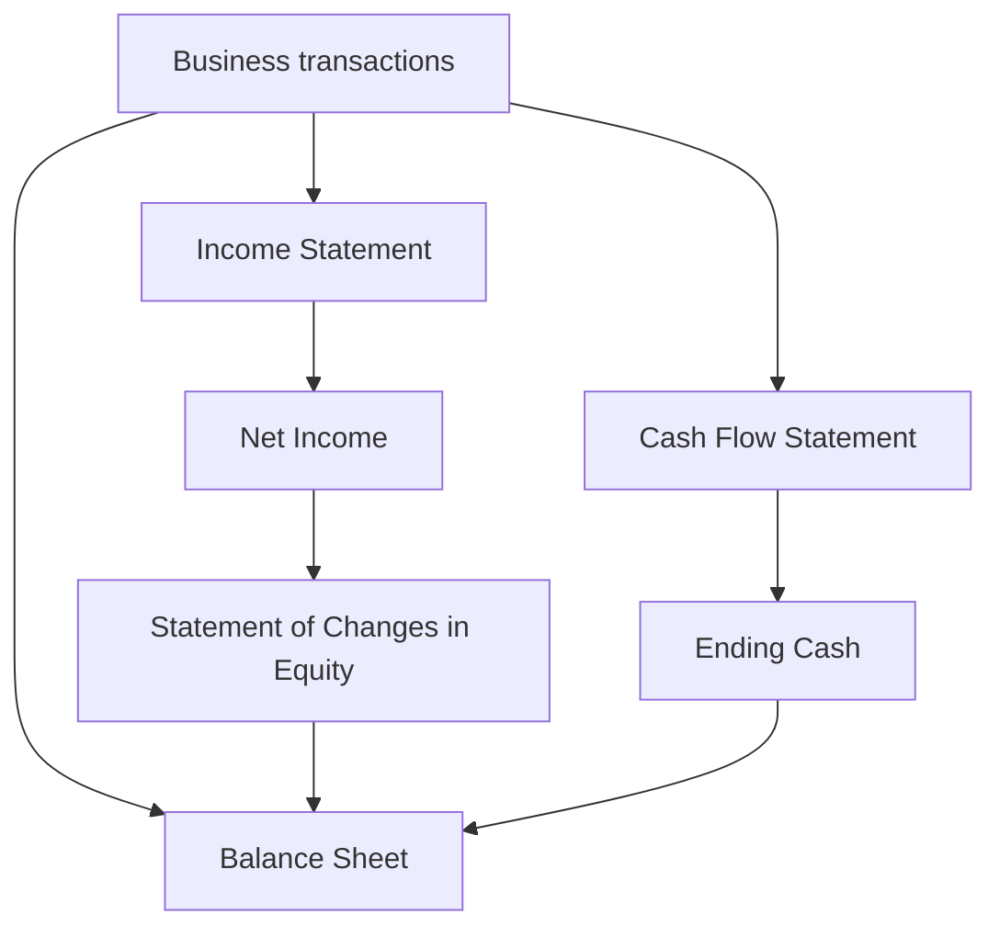
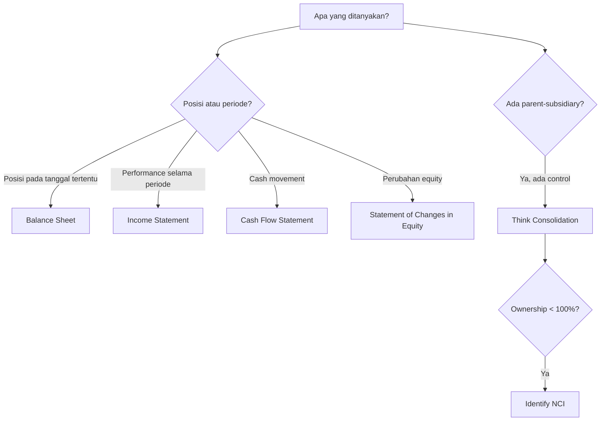

# 📘 1.4 — Company Account Structure

> [!ABSTRACT] Ringkasan Cepat
> **Topik:** Company Account Structure  
> **Bobot Parent Topic:** 30–40%  
> **Exam Priority:** Very High  
> **Difficulty:** Mixed  
> **Primary Skill:** Mixed  
> **Ref:** Robinson et al. Bab 1.1–1.3, 3.1–3.8, 4.1–4.8, 5, 6.1–6.4; Weygandt et al. Bab 1–2, 18; Brigham & Ehrhardt Bab 1–3

## Section 0 — Pemetaan Silabus & Exam Scope

| Field | Isi |
|---|---|
| Topik CF4 | Topik 1 — Pelaporan Keuangan dan Perpajakan |
| Subtopik | 1.4 Company Account Structure |
| Learning Outcome | Menjelaskan struktur dasar akun perusahaan dan grup, serta menjelaskan tujuan komponen utama akun perusahaan dan interpretasinya. |
| Skill Diuji | Mengidentifikasi fungsi dan keterkaitan statement of financial position, income/comprehensive income statement, statement of changes in equity, cash flow statement, notes, serta memahami basic group/consolidated accounts. |
| Bobot Parent Topic | 30–40% |
| Exam Priority | Very High |
| Prerequisite | [[1.2 Financial Reporting Requirements]], [[1.3 Accounting Concepts and Sustainability]] |
| Connected Topics | [[1.5 Financial Statements Construction]], [[1.6 Financial Ratios and Interpretation]], [[1.1 Taxation Principles]] |
| Referensi | Robinson et al. Bab 1.1–1.3, 3.1–3.8, 4.1–4.8, 5, 6.1–6.4; Weygandt et al. Bab 1–2, 18; Brigham & Ehrhardt Bab 1–3 |

> [!IMPORTANT] Scope Boundary
> `[CORE CF4]` Fokus subtopik ini adalah **arsitektur financial accounts**: apa saja komponen utama laporan perusahaan, apa tujuan masing-masing statement, bagaimana statement saling terhubung, serta bagaimana laporan berubah ketika reporting entity adalah **group** yang terdiri dari parent dan subsidiary.  
>  
> Detail debit/credit dan penyusunan statement dari daftar transaksi dibahas lebih dalam di [[1.5 Financial Statements Construction]]. Perhitungan ratio dan analisis komparatif berada di [[1.6 Financial Ratios and Interpretation]].  
>  
> `[BEYOND CF4]` Teknik consolidation lanjutan seperti purchase price allocation rinci, goodwill calculation kompleks, step acquisitions, foreign subsidiary translation, atau elimination journals tingkat lanjut tidak dijadikan materi inti kecuali secara eksplisit dibutuhkan oleh sumber/silabus.

---

## Section 1 — Intuisi & Big Picture

Apa masalah nyata yang ingin diselesaikan konsep ini?

Bayangkan Anda diberi annual report sebuah perusahaan besar. Anda melihat ratusan angka: cash, inventory, debt, revenue, tax, retained earnings, operating cash flow, dan sebagainya.

Pertanyaan pertama bukan:

> “Berapa profit-nya?”

melainkan:

> **“Angka ini berada di laporan apa, mewakili apa, dan berhubungan dengan angka mana?”**

Itulah fungsi **company account structure**.

Sebuah perusahaan tidak dilihat hanya dari satu angka atau satu statement. Kita membutuhkan beberapa sudut pandang:

```text
Financial position at one date
→ Statement of Financial Position / Balance Sheet

Performance over a period
→ Income Statement / Statement of Comprehensive Income

Changes in owners' claim
→ Statement of Changes in Equity

Actual cash movement over a period
→ Cash Flow Statement

Context, policies, estimates, detail
→ Notes and supplementary information
```

Robinson menjelaskan bahwa satu set financial statements yang lengkap mencakup **statement of financial position, statement of comprehensive income, statement of changes in equity, statement of cash flows**, serta accompanying notes yang merupakan bagian integral dari laporan.

Brigham menggunakan framing yang sangat berguna secara exam-oriented: annual report memberi investor informasi untuk menilai kondisi keuangan, hasil operasi, cash flows, dan pada akhirnya prospek future cash flows serta value perusahaan.

Weygandt menempatkan seluruh struktur ini sebagai output dari proses accounting:

```text
Identify economic events
↓
Record
↓
Classify and summarize
↓
Communicate through financial statements
```

### Mengapa satu statement tidak cukup?

Misalkan perusahaan melaporkan **net income tinggi**.

Apakah itu otomatis berarti kondisi keuangannya kuat?

Tidak.

- Income statement dapat menunjukkan profit tinggi.
- Balance sheet dapat menunjukkan debt yang sangat besar.
- Cash flow statement dapat menunjukkan operating cash flow negatif.
- Notes dapat menunjukkan significant obligations atau accounting estimates.

Maka:

> [!TIP] Mental Model Utama
> **Balance sheet = posisi.**  
> **Income statement = performance.**  
> **Cash flow statement = cash movement.**  
> **Statement of changes in equity = bridge perubahan hak pemilik.**  
> **Notes = konteks di balik angka.**

---

## Section 2 — Definisi & Core Concepts

### Definisi Formal

> [!NOTE] Definisi Formal — Financial Statements
> **Financial statements** adalah ringkasan terstruktur dari accounting information yang menggambarkan financial position, financial performance, changes in equity, dan cash flows suatu reporting entity sesuai applicable accounting standards.

> [!NOTE] Definisi Formal — Statement of Financial Position
> **Statement of financial position (balance sheet)** menyajikan resources yang dikendalikan perusahaan (**assets**), obligations (**liabilities**), dan residual interest pemilik (**equity**) pada suatu titik waktu tertentu.

> [!NOTE] Definisi Formal — Income Statement
> **Income statement** menyajikan financial results perusahaan selama suatu periode melalui revenue dan other income dikurangi expenses sehingga menghasilkan profit atau loss.

> [!NOTE] Definisi Formal — Statement of Changes in Equity
> **Statement of changes in equity** menjelaskan perubahan setiap komponen equity antara awal dan akhir periode, termasuk dampak profit/loss, distributions kepada owners, contributions dari owners, dan item comprehensive income tertentu.

> [!NOTE] Definisi Formal — Cash Flow Statement
> **Statement of cash flows** menjelaskan cash inflows dan outflows selama periode dan mengklasifikasikannya menurut **operating, investing, dan financing activities**.

> [!NOTE] Definisi Formal — Consolidated Financial Statements
> Ketika satu perusahaan (**parent**) mengendalikan perusahaan lain (**subsidiary**), informasi financial statement parent dan subsidiary disajikan bersama sebagai **consolidated financial statements**, dengan intercompany transactions dihilangkan agar group dipandang sebagai satu economic reporting entity.

### Terminologi Penting

| Istilah | Definisi | Intuisi | Exam Note |
|---|---|---|---|
| Reporting entity | Entitas yang financial statements-nya disajikan | “Siapa yang sedang dilaporkan?” | Bisa individual company atau group |
| Parent | Perusahaan yang mengendalikan subsidiary | Induk | Control, bukan sekadar keberadaan investasi |
| Subsidiary | Entitas yang dikendalikan parent | Anak perusahaan | Dalam consolidation, line items subsidiary masuk secara penuh sebelum allocation NCI |
| Consolidation | Penggabungan financial information parent dan controlled subsidiaries | Group dianggap satu economic entity | Jangan sekadar menjumlahkan tanpa eliminasi intercompany |
| Non-controlling interest (NCI) | Hak pemilik subsidiary selain parent | Bagian group yang bukan milik shareholders parent | Disebut juga minority interest dalam sumber lama |
| Assets | Economic resources yang dikendalikan perusahaan | Apa yang perusahaan punya/kendalikan | Posisi pada balance sheet |
| Liabilities | Present obligations terhadap pihak lain | Apa yang perusahaan wajib bayar/serahkan | Claim prior terhadap equity |
| Equity | Residual interest setelah liabilities dikurangkan dari assets | Hak residual pemilik | Bukan “cash milik pemegang saham” |
| Revenue | Income dari ordinary activities | Nilai dari aktivitas utama bisnis | Revenue ≠ cash receipt |
| Expense | Pengorbanan ekonomi yang mengurangi equity selain distribution kepada owners | Cost untuk menghasilkan aktivitas/performance | Expense ≠ cash payment |
| Net income | Income dikurangi expenses | Accounting profit periode | Profit ≠ cash flow |
| Retained earnings | Akumulasi earnings yang tidak didistribusikan sebagai dividends | Profit yang dipertahankan secara accounting | Retained earnings ≠ cash balance |
| Comprehensive income | Perubahan equity dari non-owner sources yang mencakup net income dan other comprehensive income | Performance lebih luas dari net income | Jangan selalu disamakan dengan net income |
| Operating cash flow | Cash flow dari core operating activities | Cash yang dihasilkan operasi | Bisa berbeda dari net income |
| Notes | Disclosures yang menjelaskan policies, estimates, detail line items, commitments, dll. | “Cerita di balik angka” | Integral terhadap complete statements menurut Robinson |

---

### 2.1 Statement of Financial Position / Balance Sheet

Persamaan dasarnya:

$$
\text{Assets} = \text{Liabilities} + \text{Equity}
$$

atau:

$$
\text{Equity} = \text{Assets} - \text{Liabilities}
$$

#### Apa yang dijawab balance sheet?

> **“Pada tanggal ini, resources perusahaan berasal dari mana dan siapa yang memiliki claim atas resources tersebut?”**

Struktur umumnya:

```text
ASSETS
├── Current assets
└── Non-current assets

LIABILITIES
├── Current liabilities
└── Non-current liabilities

EQUITY
├── Share capital / common stock
├── Additional paid-in capital / reserves (jika ada)
├── Retained earnings
├── Accumulated OCI / reserves tertentu
└── Non-controlling interest pada consolidated accounts
```

Robinson menunjukkan bahwa presentation order dapat berbeda antar-yurisdiksi. Misalnya, beberapa IFRS reporters dapat menampilkan non-current assets sebelum current assets, sedangkan praktik AS/Canada sering menyajikan assets dari lebih liquid ke kurang liquid.

> [!DANGER] Jangan Salah Pikir
> Perbedaan **urutan penyajian** tidak mengubah fundamental relationship:
>
> $$
> A=L+E
> $$

---

### 2.2 Income Statement / Statement of Comprehensive Income

Core relationship:

$$
\text{Revenue} + \text{Other Income} - \text{Expenses}
= \text{Net Income}
$$

Sumber dapat menggunakan istilah:

- net income;
- net earnings;
- net profit;
- profit or loss.

Struktur sederhana:

```text
Revenue
− Cost of sales / COGS
= Gross profit
− Operating expenses
± Other operating items
= Operating profit
± Financing / investment items
= Profit before tax
− Income tax expense
= Profit after tax / Net income
```

Untuk consolidated accounts, Robinson menekankan bahwa income statement group memasukkan **income dan expenses subsidiaries yang berada di bawah control parent**. Jika subsidiary tidak 100% dimiliki, consolidated net income kemudian dialokasikan antara:

1. shareholders of the parent; dan
2. non-controlling interests.

> [!TIP] Cara Berpikir
> **Consolidation memasukkan bisnis subsidiary sebagai bagian group karena control. Ownership percentage kemudian penting untuk menentukan bagian profit/equity yang attributable kepada parent versus NCI.**

---

### 2.3 Statement of Changes in Equity

Statement ini menjawab:

> **“Mengapa equity awal periode berubah menjadi equity akhir periode?”**

Simplified relationship untuk retained earnings:

$$
RE_{end}=RE_{begin}+\text{Net Income}-\text{Dividends}
$$

Jika ada net loss:

$$
RE_{end}=RE_{begin}-\text{Net Loss}-\text{Dividends}
$$

Namun full statement of changes in equity dapat mencakup lebih dari retained earnings, misalnya:

- issuance of shares;
- repurchase/treasury shares;
- dividends;
- net income;
- other comprehensive income;
- transactions with non-controlling interests.

Brigham menekankan sebuah exam trap klasik:

> [!DANGER] Retained Earnings ≠ Cash
> **Retained earnings adalah equity account / claim against assets, bukan rekening kas.**  
> Perusahaan dapat memiliki retained earnings tinggi tetapi cash rendah karena earnings telah diinvestasikan dalam inventory, receivables, plant, equipment, atau assets lain.

---

### 2.4 Cash Flow Statement

Cash flow statement mengelompokkan cash flows ke tiga kategori:

| Kategori | Intuisi | Contoh umum |
|---|---|---|
| Operating | Cash dari core business | Cash from customers, payments to suppliers/employees |
| Investing | Pembelian/penjualan long-term assets dan investments | Purchase of PP&E, sale of equipment |
| Financing | Transaksi dengan providers of capital | Borrowing, repayment of debt, share issuance, dividends sesuai classification yang berlaku |

Statement ini penting karena accounting profit berbasis accrual.

> [!DANGER] Profit ≠ Cash Flow
> Revenue dapat diakui sebelum cash diterima, dan expense dapat diakui sebelum atau sesudah cash dibayar. Karena itu, net income dan operating cash flow tidak harus sama pada satu periode.

Brigham menekankan bahwa statement of cash flows membantu menjelaskan mengapa cash balance berubah meskipun company melaporkan profit.

---

### 2.5 Notes and Supplementary Information

Financial statements utama memberikan ringkasan. Notes memberi detail yang diperlukan agar angka dapat dipahami dengan benar.

Menurut Robinson, notes dapat menjelaskan antara lain:

- basis of preparation;
- accounting policies;
- estimates dan judgments;
- detail line items;
- commitments dan contingencies;
- risks;
- information yang tidak cukup terlihat dari face of statements.

Mental model:

```text
Primary statement = headline number
Notes = meaning, composition, assumptions, caveats
```

> [!WARNING] Exam Trap
> Jangan menganggap notes sebagai “tambahan opsional”. Dalam complete financial statements menurut framing Robinson, notes merupakan **integral part** dari laporan.

---

### 2.6 Individual Company vs Group Accounts

Ini bagian yang sangat penting untuk learning outcome “company and group accounts”.

#### Individual company

Financial statements hanya menggambarkan satu legal entity.

#### Group

Jika parent mengendalikan subsidiary, consolidated statements menggambarkan parent + controlled subsidiaries seolah-olah satu economic entity.

```text
Parent
│
├── Subsidiary A
├── Subsidiary B
└── Subsidiary C

        ↓ consolidation

Group financial statements
```

### Core mechanics consolidation

Secara konseptual:

```text
Parent accounts
+
Subsidiary accounts
−
Intercompany effects
=
Consolidated group accounts
```

Intercompany items harus dihilangkan karena group tidak boleh terlihat menghasilkan revenue/profit hanya dengan “bertransaksi dengan dirinya sendiri”.

Contoh sederhana:

- Parent menjual barang kepada subsidiary Rp100 juta.
- Dari masing-masing legal entity, transaksi memang ada.
- Dari perspektif **group**, belum ada sale kepada external customer hanya karena terjadi transfer internal.

Maka intercompany sales/purchases terkait perlu dieliminasi dalam consolidation.

> [!TIP] Shortcut Aman
> Tanyakan:
> **“Apakah transaksi ini terjadi dengan pihak di luar group?”**  
> Jika tidak, hati-hati: consolidated accounts biasanya tidak boleh memperlakukan internal transfer seolah-olah transaksi eksternal.

---

### 2.7 Non-Controlling Interest (Minority Interest)

Misalkan Parent P mengendalikan Subsidiary S tetapi hanya memiliki 80% saham S.

Group tetap mengonsolidasikan financial information S karena **control**, bukan karena harus memiliki 100%.

Namun 20% bagian subsidiary dimiliki pihak lain. Bagian ini disebut **non-controlling interest (NCI)**.

Robinson menggunakan contoh Volkswagen dan Scania: Volkswagen memiliki sekitar 72% voting rights dan sisanya merupakan minority/non-controlling interests.

Mental model:

```text
Control → consolidate subsidiary
Less than 100% ownership → identify NCI
```

> [!BUG] Definition Trap
> **Control ≠ 100% ownership.**  
> Parent dapat mengendalikan subsidiary meskipun masih ada outside shareholders.

---

## Section 3 — How It Works

### 3.1 Dari Transaction ke Financial Statements

```text
Business transaction
↓
Account affected
↓
Asset / Liability / Equity / Revenue / Expense
↓
Income statement effect
↓
Balance sheet effect
↓
Cash flow effect, jika ada cash movement
↓
Statement of changes in equity effect
```

Contoh: perusahaan menjual barang secara kredit Rp10 juta dengan cost Rp6 juta.

Secara konseptual:

```text
Sale on credit
↓
Receivable ↑ 10
Revenue ↑ 10
COGS ↑ 6
Inventory ↓ 6
↓
Net income ↑ 4
↓
Equity ↑ 4 through retained earnings
↓
Cash belum naik pada saat sale
```

Inilah mengapa setiap statement harus dibaca sebagai bagian dari satu sistem.

---

### 3.2 Statement Linkage



### Hubungan inti

1. **Net income** dari income statement memengaruhi retained earnings/equity.
2. **Ending cash** dari cash flow statement harus reconcile dengan cash pada balance sheet.
3. Asset dan liability balances pada akhir periode menjadi financial position pada balance sheet.
4. Notes menjelaskan detail dan assumptions di balik line items.

---

### 3.3 Group Accounts Logic

```text
Who controls whom?
↓
Identify parent and subsidiary
↓
Combine relevant financial information
↓
Eliminate intercompany transactions/balances
↓
Identify non-controlling interest, if parent owns <100%
↓
Present consolidated group position and performance
```

> [!TIP] Cara Berpikir
> Jangan mulai consolidation dari **berapa persen yang dimiliki**. Mulai dari **apakah ada control**. Setelah subsidiary harus dikonsolidasikan, baru pikirkan apakah ada NCI.

> [!DANGER] Jangan Salah Pikir
> 1. Consolidated accounts bukan sekadar menjumlahkan parent + subsidiary.
> 2. 80% ownership tidak berarti hanya 80% revenue subsidiary dimasukkan line-by-line ke consolidated income statement.
> 3. Retained earnings bukan cash.
> 4. Net income bukan operating cash flow.
> 5. Balance sheet adalah **point-in-time**, sedangkan income statement dan cash flow statement adalah **period statements**.

---

## Section 4 — Worked Examples & Exam Cases

### Case A — Fundamental

**Soal**

Sebuah perusahaan pada 31 Desember memiliki:

- Assets = Rp500 juta
- Liabilities = Rp320 juta

Berapa equity perusahaan dan statement mana yang terutama menampilkan informasi ini?

> [!SUCCESS] Pembahasan
>
> **1. Identifikasi informasi**  
> Diberikan assets dan liabilities pada satu tanggal tertentu.
>
> **2. Konsep yang diuji**  
> Accounting equation dan fungsi balance sheet.
>
> **3. Reasoning**  
> Equity adalah residual claim setelah liabilities dikurangkan dari assets.
>
> **4. Calculation**
>
> $$
> \text{Equity}=\text{Assets}-\text{Liabilities}
> $$
>
> $$
> =500-320=180
> $$
>
> Jadi equity = **Rp180 juta**.
>
> **5. Interpretation**  
> Perusahaan mengendalikan resources Rp500 juta, dengan Rp320 juta claims dari creditors/other liabilities dan Rp180 juta residual claim owners.
>
> **6. Verification**
>
> $$
> 500=320+180
> $$
>
> Informasi ini terutama terdapat pada **statement of financial position / balance sheet**.

> [!WARNING] Exam Trap — Case A
> - **Trap:** Menganggap equity = cash yang tersedia bagi shareholders.
> - **Mengapa distractor terlihat benar:** Equity adalah hak residual pemilik, sehingga mudah dibayangkan sebagai “uang pemilik”.
> - **Cara menghindari:** Ingat equity adalah **claim on net assets**, bukan cash account.
> - **Target waktu:** < 45 detik.

---

### Case B — Exam-Typical

**Soal**

PT Alpha memiliki 80% voting shares PT Beta dan mengendalikan Beta. Selama tahun berjalan, Beta memperoleh net income Rp50 miliar. Pernyataan mana yang paling tepat mengenai consolidated financial statements Alpha Group?

A. Alpha hanya memasukkan 80% setiap revenue dan expense Beta.  
B. Beta tidak dikonsolidasikan karena Alpha tidak memiliki 100%.  
C. Financial information Beta dikonsolidasikan karena Alpha mengendalikan Beta; bagian profit yang bukan attributable kepada Alpha disajikan sebagai non-controlling interest.  
D. Seluruh profit Beta otomatis menjadi profit attributable kepada shareholders Alpha.

> [!SUCCESS] Pembahasan
>
> **1. Identifikasi informasi**  
> Ownership 80% + control.
>
> **2. Konsep yang diuji**  
> Consolidation dan NCI.
>
> **3. Reasoning**  
> Robinson menjelaskan bahwa ketika parent controls subsidiary, parent menyajikan consolidated financial statements. Line items subsidiary dimasukkan secara penuh setelah intercompany effects dieliminasi. Jika ownership kurang dari 100%, profit kemudian dialokasikan antara parent shareholders dan minority/NCI.
>
> **4. Calculation**  
> Tidak diperlukan untuk menentukan jawaban konseptual.
>
> **5. Interpretation**  
> Jawaban **C**.
>
> **6. Verification**  
> Control → consolidate. Ownership <100% → NCI exists.

> [!WARNING] Exam Trap — Case B
> - **Trap:** Menggunakan ownership percentage untuk “proportionally consolidate” setiap line item.
> - **Mengapa distractor terlihat benar:** 80% ownership terdengar seperti seharusnya hanya 80% revenue/expense yang dimiliki.
> - **Cara menghindari:** **Control first, NCI second.**
> - **Target waktu:** 45–60 detik.

---

### Case C — Challenging / Integrated

**Soal**

Pada awal tahun, retained earnings PT Gamma adalah Rp120 miliar. Selama tahun berjalan perusahaan memperoleh net income Rp40 miliar dan membayar dividends Rp15 miliar. Pada akhir tahun cash balance hanya Rp8 miliar.

Seorang analis menyatakan:

> “Ini tidak mungkin. Jika retained earnings bertambah Rp25 miliar, cash juga seharusnya bertambah Rp25 miliar.”

Evaluasi pernyataan tersebut.

> [!SUCCESS] Pembahasan
>
> **1. Identifikasi informasi**  
> Beginning RE = 120, net income = 40, dividends = 15, ending cash = 8.
>
> **2. Konsep yang diuji**  
> Statement linkage dan perbedaan retained earnings vs cash.
>
> **3. Reasoning**  
> Retained earnings adalah cumulative accounting earnings yang tidak didistribusikan, bukan cash reserve.
>
> **4. Calculation**
>
> $$
> RE_{end}=120+40-15=145
> $$
>
> Retained earnings bertambah Rp25 miliar.
>
> **5. Interpretation**  
> Tidak ada keharusan cash juga naik Rp25 miliar. Earnings dapat tercermin dalam receivables, inventory, PP&E, repayment of liabilities, atau perubahan working capital lainnya.
>
> **6. Verification**  
> Cash harus diuji melalui cash flow statement, bukan dari perubahan retained earnings saja.

> [!WARNING] Exam Trap — Case C
> - **Trap:** RE increase = cash increase.
> - **Mengapa distractor terlihat benar:** Dividends memang mengurangi retained earnings dan biasanya melibatkan cash, sehingga hubungan tampak satu-ke-satu.
> - **Cara menghindari:** Ingat **equity account ≠ asset account**.
> - **Target waktu:** 1–2 menit.

---

## Section 5 — Interpretation & Sanity Check

> [!CHECK] Sanity Check
> **1. Accounting equation**  
> Apakah setelah transaksi/adjustment masih berlaku:
>
> $$
> A=L+E?
> $$
>
> **2. Statement timing**  
> Apakah Anda membedakan **point-in-time** balance sheet dari **period-based** income/cash flow statements?
>
> **3. Cash linkage**  
> Apakah ending cash pada cash flow statement konsisten dengan cash pada ending balance sheet?
>
> **4. Equity linkage**  
> Apakah net income/dividends masuk akal terhadap perubahan retained earnings?
>
> **5. Group logic**  
> Jika consolidated accounts, apakah intercompany effects sudah tidak dianggap external activity? Apakah NCI dipertimbangkan jika ownership <100%?

### Interpretation Ladder

> **Level 1 — Number**  
> Berapa assets, liabilities, equity, revenue, profit, cash flow?
>
> **Level 2 — Classification**  
> Angka itu berada di statement dan kategori apa?
>
> **Level 3 — Linkage**  
> Angka tersebut memengaruhi statement lain bagaimana?
>
> **Level 4 — Meaning**  
> Apa arti ekonominya untuk investor/creditor/management?
>
> **Level 5 — Limitation**  
> Apakah statement tersebut cukup untuk membuat kesimpulan, atau perlu statement/notes lain?

---

## Section 6 — Connections & Mental Model

### 6.1 Hubungan dengan [[1.2 Financial Reporting Requirements]]

Topik 1.2 menjawab **mengapa perusahaan harus melaporkan** dan siapa pengguna laporan. Topik 1.4 menjawab **bagaimana struktur laporan tersebut**.

```text
Why report?
[[1.2 Financial Reporting Requirements]]
↓
What is reported and how statements fit together?
[[1.4 Company Account Structure]]
```

### 6.2 Hubungan dengan [[1.5 Financial Statements Construction]]

Topik 1.4 memberi **peta**. Topik 1.5 mengajarkan bagaimana angka masuk ke peta tersebut dari transactions.

### 6.3 Hubungan dengan [[1.6 Financial Ratios and Interpretation]]

Ratios mengambil numerator dan denominator dari financial statements.

```text
Financial Statements
↓
Raw accounting numbers
↓
Ratios
↓
Interpretation
```

Tanpa memahami structure, risiko memilih angka yang salah untuk ratio meningkat.

### 6.4 Hubungan dengan [[1.1 Taxation Principles]]

Income tax expense memengaruhi income statement; current/deferred tax items dapat muncul dalam balance sheet; tax cash payments memengaruhi cash flows sesuai applicable classification.

---

## Section 7 — Exam Traps & Misconceptions

### Definition Trap

> [!BUG] Definition Trap
> **Balance sheet vs income statement**  
> Balance sheet = **pada satu tanggal**.  
> Income statement = **selama suatu periode**.

> [!BUG] Definition Trap
> **Minority interest vs subsidiary**  
> NCI bukan nama subsidiary. NCI adalah ownership interest pada subsidiary yang tidak dimiliki parent.

> [!BUG] Definition Trap
> **Retained earnings vs cash**  
> Retained earnings adalah equity account, cash adalah asset.

---

### Accounting / Financial Logic Trap

> [!BUG] Logic Trap
> **Profit ≠ cash flow.**  
> Accrual accounting menyebabkan timing recognition income/expense berbeda dari cash movement.

> [!BUG] Logic Trap
> **Consolidation ≠ addition only.**  
> Intercompany transactions dan balances tidak boleh membuat group terlihat memiliki external activity yang sebenarnya internal.

> [!BUG] Logic Trap
> **Control ≠ 100% ownership.**  
> Subsidiary dapat dikonsolidasikan meskipun ada NCI.

---

### Calculation Trap

> [!BUG] Calculation Trap
> **Salah** — menganggap ending retained earnings hanya beginning RE + net income:
>
> $$
> RE_{end}=RE_{begin}+NI
> $$
>
> jika dividends ada.
>
> **Benar**:
>
> $$
> RE_{end}=RE_{begin}+NI-Dividends
> $$

Contoh:

$$
100+30-10=120
$$

bukan:

$$
100+30=130
$$

---

### Interpretation Trap

> [!BUG] Interpretation Trap
> Perusahaan dapat memiliki **high net income** tetapi **weak cash generation** pada periode yang sama. Menilai liquidity hanya dari income statement dapat menghasilkan kesimpulan yang salah.

> [!BUG] Interpretation Trap
> Total consolidated net income tidak selalu seluruhnya attributable kepada shareholders parent jika terdapat NCI.

---

### Red Flags

> [!CAUTION] Red Flags

| Keyword / Condition | Apa yang Harus Dipikirkan |
|---|---|
| “at 31 December” / “as of” | Point-in-time → balance sheet |
| “for the year ended” | Period statement → income/cash flow/equity changes |
| “controlled subsidiary” | Consolidation |
| “80% owned” / “less than 100%” | Cek control + NCI |
| “intercompany” | Elimination dalam consolidated perspective |
| “retained earnings” | Equity, bukan cash |
| “profit” | Jangan otomatis samakan dengan cash flow |
| “cash generated” | Lihat cash flow statement |
| “notes disclose” | Detail/policy/estimate di balik face statements |
| “current” | Pikirkan current asset/current liability classification dan liquidity context |

---

## Section 8 — Executive Summary

### Must Remember

> [!SUMMARY] Must Remember
> 1. `[CORE CF4]` Complete financial reporting structure mencakup **statement of financial position, statement of comprehensive income/income statement, statement of changes in equity, statement of cash flows, dan notes**.
> 2. Balance sheet adalah **snapshot pada satu tanggal**; income statement dan cash flow statement menggambarkan **periode**.
> 3. Fundamental balance sheet relationship:
>
> $$
> A=L+E
> $$
>
> 4. Income statement menjelaskan performance melalui **income − expenses = profit/loss**.
> 5. Statement of changes in equity menjelaskan bridge dari beginning equity ke ending equity.
> 6. Simplified retained earnings bridge:
>
> $$
> RE_{end}=RE_{begin}+NI-Dividends
> $$
>
> 7. **Retained earnings ≠ cash.**
> 8. **Profit ≠ cash flow.** Cash flow statement diperlukan untuk memahami actual cash movement.
> 9. Jika parent **controls** subsidiary, consolidated financial statements menyajikan group sebagai satu economic entity dan intercompany effects dieliminasi.
> 10. Jika parent mengendalikan tetapi tidak memiliki 100% subsidiary, bagian outside owners disebut **non-controlling interest**.

### Comparison Table

| Statement | Fokus | Timing | Core Question | Exam Trap |
|---|---|---|---|---|
| Balance Sheet | Financial position | Point in time | Apa resources dan claims saat ini? | Equity ≠ cash |
| Income Statement | Performance | Period | Apakah perusahaan menghasilkan profit? | Profit ≠ cash |
| Changes in Equity | Movement in owners' claim | Period | Mengapa equity berubah? | RE ≠ cash reserve |
| Cash Flow Statement | Cash inflow/outflow | Period | Dari mana cash datang dan ke mana pergi? | Positive NI tidak menjamin positive OCF |
| Notes | Detail/context | Terkait statements | Apa policy, estimate, dan detail di balik angka? | Jangan dianggap optional |

### Individual vs Consolidated Accounts

| Aspek | Individual Company | Consolidated Group |
|---|---|---|
| Reporting entity | Satu legal entity | Parent + controlled subsidiaries |
| Internal transactions | Dapat muncul bila counterparty adalah entity lain | Intercompany effects dieliminasi |
| Subsidiary line items | Tidak otomatis digabung | Digabung dalam consolidated accounts jika controlled |
| NCI | Tidak relevan untuk standalone parent account sebagai group allocation | Muncul jika subsidiary tidak 100% owned |
| Perspektif | Legal entity | Economic group |

### Trigger Keywords

| Jika soal mengatakan... | Pikirkan... |
|---|---|
| “resources and obligations at year-end” | Balance sheet |
| “revenue and expenses during the year” | Income statement |
| “why equity changed” | Statement of changes in equity |
| “cash generated/used” | Cash flow statement |
| “parent controls subsidiary” | Consolidation |
| “parent owns 75%” | Consolidate if control; identify NCI |
| “sale between parent and subsidiary” | Intercompany elimination |
| “retained earnings increased” | Jangan simpulkan cash meningkat sama besar |

### Kapan Digunakan

Gunakan mental model company account structure ketika soal meminta:

- statement mana yang memuat suatu informasi;
- hubungan antar-financial statements;
- classification asset/liability/equity/income/expense;
- perubahan retained earnings;
- basic interpretation of company accounts;
- parent/subsidiary/group reporting;
- consolidated vs individual accounts;
- non-controlling interest.

### Kapan TIDAK Boleh Digunakan

Jangan mengandalkan satu statement untuk menjawab semua pertanyaan.

- liquidity tidak dapat dinilai hanya dari net income;
- profitability tidak dapat disimpulkan hanya dari cash balance;
- financial risk tidak dapat dipahami hanya dari revenue;
- group profit tidak boleh dianggap seluruhnya milik parent shareholders jika ada NCI;
- balance sheet totals tidak menjelaskan seluruh accounting policies—lihat notes.

### Quick Decision Tree



---

## Section 9 — Active Recall Check

1. Mengapa satu perusahaan memerlukan lebih dari satu primary financial statement?
2. Apa perbedaan paling fundamental antara balance sheet dan income statement dari sisi waktu?
3. Jelaskan mengapa **equity** tidak sama dengan cash yang tersedia untuk shareholders.
4. Jika retained earnings awal Rp80 miliar, net income Rp25 miliar, dan dividends Rp10 miliar, berapa retained earnings akhir?
5. Mengapa perusahaan dapat melaporkan net income positif tetapi operating cash flow negatif?
6. Apa fungsi statement of changes in equity yang tidak dapat dilihat hanya dari income statement?
7. Mengapa notes merupakan bagian penting dari complete financial statements?
8. Jika parent memiliki 75% subsidiary dan mengendalikannya, apakah consolidated income statement hanya memasukkan 75% revenue subsidiary? Jelaskan reasoning Anda.
9. Apa yang dimaksud non-controlling interest dan mengapa ia muncul?
10. Mengapa intercompany sale perlu diperhatikan dalam consolidated accounts?

---

## Section 10 — Exam Pattern Map

| Narasi Soal | Keyword | Konsep | Formula/Rule | Langkah | Trap | Shortcut |
|---|---|---|---|---|---|---|
| Menanyakan resources dan obligations pada tanggal tertentu | “as of”, “at year-end” | Balance sheet | $A=L+E$ | Identifikasi A/L/E → solve residual | Menggunakan income statement | **Date = position** |
| Menanyakan profit selama periode | revenue, expense, “for the year” | Income statement | Income − Expenses = Net income | Susun performance items | Campur cash receipts dengan revenue | **Period + performance = IS** |
| Perubahan retained earnings | beginning RE, net income, dividends | Changes in equity | $RE_e=RE_b+NI-Div$ | Start → add NI → subtract dividends | Menganggap RE = cash | **NI in, dividend out** |
| Parent memiliki <100% subsidiary tetapi control | control, voting shares, subsidiary | Consolidation + NCI | Control → consolidate; <100% → NCI | Determine control → consolidate → allocate NCI | Proportional consolidation line-by-line | **Control first, NCI second** |
| Parent menjual ke subsidiary | intercompany sale | Elimination | Internal group effect removed | Identify internal transaction → remove group-only effect | Menganggap internal revenue sebagai external revenue | **Group cannot sell to itself** |
| Profit tinggi tetapi cash rendah | net income, cash flow | Accrual vs cash | Profit ≠ cash flow | Compare IS with CFS and working capital effects | Menilai liquidity dari profit saja | **Ask where cash went** |

`[TEXTBOOK-BASED EXPECTATION]` Pola di atas diturunkan dari konsep dan examples dalam referensi resmi yang tersedia. Tidak ada klaim frekuensi past-exam karena past exam CF4 tidak digunakan dalam penyusunan note ini.

---

## Source Traceability

| Materi | Sumber |
|---|---|
| Complete set of financial statements dan fungsi primary statements | Robinson et al., Bab 1, Section 3.1 |
| Balance sheet: assets, liabilities, equity dan accounting equation | Robinson et al., Bab 1, Section 3.1.1; Weygandt et al., Bab 1–2; Brigham & Ehrhardt, Bab 2 |
| Income statement: revenue, expenses, net income, period performance | Robinson et al., Bab 1, Section 3.1.2; Brigham & Ehrhardt, Bab 2 |
| Statement of changes in equity dan retained earnings | Robinson et al., Bab 1, Section 3.1.3; Brigham & Ehrhardt, Bab 2 |
| Retained earnings bukan cash | Brigham & Ehrhardt, Bab 2 |
| Cash flow statement dan operating/investing/financing classification | Robinson et al., Bab 1, Section 3.1.4; Brigham & Ehrhardt, Bab 2 |
| Notes sebagai integral part dan sumber policy/detail | Robinson et al., Bab 1, Section 3.1 dan financial statement notes discussion |
| Parent, subsidiary, consolidated income statement, intercompany elimination, minority/NCI | Robinson et al., Bab 1, Section 3.1.2 |
| Accounting process dan basic financial statement communication | Weygandt et al., Bab 1–2 |
| Financial statement analysis context dan interpretation | Weygandt et al., Bab 18; Robinson et al., Bab 1 |
| Annual report / investor-oriented interpretation of company accounts | Brigham & Ehrhardt, Bab 2–3 |

> [!NOTE] Source Boundary Note
> Referensi resmi Topik 1 telah diperiksa secara lintas-sumber. **Robinson** merupakan sumber paling langsung untuk struktur complete financial statements dan basic group/consolidated reporting. **Brigham & Ehrhardt** memperkuat statement linkage, retained earnings, cash-flow interpretation, dan investor perspective. **Weygandt** memperkuat accounting process dan basic statement structure. Materi consolidation teknis lanjutan tidak ditambahkan karena melampaui kebutuhan subtopik yang dinyatakan dalam silabus dan sumber yang tersedia.

---

> [!QUOTE] Follow-up Options
> 1. *"Uji saya dengan soal Active Recall dari topik ini"*
> 2. *"Buat 10 soal exam-style untuk topik ini"*
> 3. *"Jelaskan hubungan topik ini dengan topik CF4 terkait"*

*📖 Ref: Robinson et al.; Weygandt et al.; Brigham & Ehrhardt — chapter sesuai scope Topik 1 | 🗓️ 2026-08-23 | #CF4 #AkuntansiKeuanganKorporasi*
