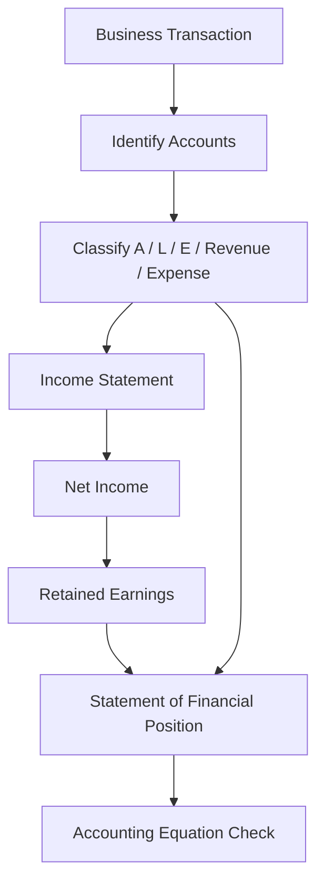
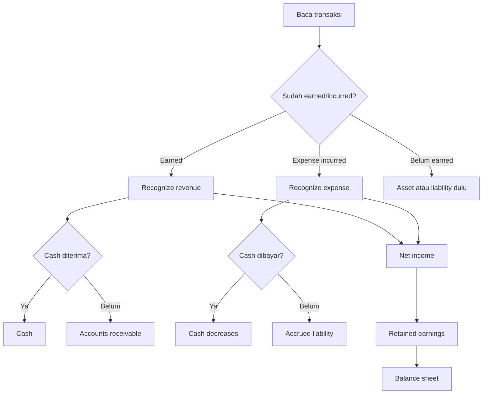

# 📘 1.5 — Financial Statements Construction

> [!ABSTRACT] Ringkasan Cepat
> **Topik:** Financial Statements Construction  
> **Bobot Parent Topic:** 30–40%  
> **Exam Priority:** Very High  
> **Difficulty:** Mixed  
> **Primary Skill:** Mixed — accounting mechanics, calculation, dan interpretation  
> **Ref:** Robinson et al. Bab 1.1–1.3, 2.3, 3.1–3.8, 4.1–4.8, 5, 6.1–6.4, 13.1–13.3, 13.6–13.8; Weygandt et al. Bab 1, 2, 18; Brigham & Ehrhardt Bab 1, 2, 3

---

## Section 0 — Pemetaan Silabus & Exam Scope

| Field | Isi |
|---|---|
| Topik CF4 | Topik 1 — Pelaporan Keuangan dan Perpajakan |
| Subtopik | 1.5 Financial Statements Construction |
| Learning Outcome | Menyusun **statement of financial position** dan **income statement** sederhana. |
| Skill Diuji | Mengklasifikasikan transaksi, menentukan pengaruh pada assets/liabilities/equity/revenue/expense, menghitung net income, retained earnings, dan menyusun balance sheet sederhana yang tetap balance. |
| Bobot Parent Topic | 30–40% |
| Exam Priority | Very High |
| Prerequisite | [[1.3 Accounting Concepts and Sustainability]], [[1.4 Company Account Structure]] |
| Connected Topics | [[1.1 Taxation Principles]], [[1.4 Company Account Structure]], [[1.6 Financial Ratios and Interpretation]] |
| Referensi | Robinson et al. sesuai chapter Topik 1; Weygandt et al. Bab 1–2, 18; Brigham & Ehrhardt Bab 1–3 |

> [!IMPORTANT] Scope Boundary
> `[CORE CF4]` Fokus 1.5 adalah **basic construction mechanics**: dari transaksi atau account balances → klasifikasi → income statement → retained earnings/equity → statement of financial position.  
>
> Silabus secara eksplisit meminta penyusunan **statement of financial position dan income statement sederhana**. Karena itu, detail accounting cycle seperti posting jurnal penuh, worksheet kompleks, adjusting/closing entries tingkat lanjut, dan penyusunan cash flow statement lengkap bukan target utama subtopik ini.
>
> Debit/credit tetap berguna sebagai alat verifikasi, tetapi **tujuan ujian bukan menjadi bookkeeper**. Robinson sendiri menekankan bahwa financial reporting mechanics dapat dipahami lewat accounting equation tanpa harus selalu menggunakan debit/credit.

---

## Section 1 — Intuisi & Big Picture

Apa masalah nyata yang ingin diselesaikan konsep ini?

Bayangkan pada akhir bulan sebuah perusahaan memiliki banyak transaksi:

- pemilik menyetor modal,
- perusahaan membeli equipment,
- menjual jasa secara tunai,
- menjual jasa secara kredit,
- membayar gaji,
- menerima uang muka pelanggan,
- membeli barang secara kredit,
- membayar sebagian utang.

Semua transaksi tersebut terjadi dalam bentuk **kejadian bisnis**, bukan dalam bentuk financial statements.

Tugas accounting adalah mengubah:

```text
Business transactions
↓
Accounts
↓
Revenue / Expense / Asset / Liability / Equity
↓
Income Statement
↓
Equity update
↓
Statement of Financial Position
```

Jadi pertanyaan inti dalam construction bukan:

> “Transaksi ini debit atau kredit?”

melainkan terlebih dahulu:

> **“Secara ekonomi, apa yang berubah?”**

Contoh paling sederhana:

Perusahaan menjual jasa Rp20 juta secara kredit.

Walaupun cash belum diterima:

- **Accounts receivable naik** Rp20 juta.
- **Revenue naik** Rp20 juta.
- Revenue menaikkan **net income**.
- Net income pada akhirnya menaikkan **retained earnings/equity**.

Maka:

$$
Assets \uparrow = Equity \uparrow
$$

Tidak ada cash yang bergerak pada saat transaksi tersebut.

> [!DANGER] Profit ≠ Cash Flow
> Financial statements construction menggunakan **accrual accounting**, bukan sekadar mencatat kas masuk dan kas keluar.
>
> **Revenue ≠ cash received**  
> **Expense ≠ cash paid**  
> **Net income ≠ operating cash flow**

### Mengapa konsep ini penting?

Karena hampir seluruh analisis CF4 setelah ini bergantung pada statement yang benar.

Jika suatu transaksi salah diklasifikasikan:

```text
Wrong transaction classification
↓
Wrong financial statement
↓
Wrong ratio
↓
Wrong interpretation
↓
Wrong decision
```

---

## Section 2 — Definisi & Core Concepts

### Definisi Formal

> [!NOTE] Definisi Formal — Accounting Equation
> Hubungan fundamental antara resources perusahaan dan claims terhadap resources tersebut adalah:
>
> $$
> \text{Assets}=\text{Liabilities}+\text{Equity}
> $$

Equity juga dapat dinyatakan sebagai residual claim:

$$
\text{Equity}=\text{Assets}-\text{Liabilities}
$$

> [!NOTE] Definisi Formal — Income Statement
> **Income statement** melaporkan revenue/income dan expenses selama suatu periode dan menghasilkan **laba bersih (*net income*)** atau loss.

Secara sederhana:

$$
\text{Net Income}=\text{Revenue}-\text{Expenses}
$$

Jika income lain atau gains/losses diberikan:

$$
\text{Net Income}
=
\text{Total Income and Gains}
-
\text{Total Expenses and Losses}
$$

> [!NOTE] Definisi Formal — Statement of Financial Position
> **Statement of financial position (balance sheet)** menunjukkan assets, liabilities, dan equity pada satu tanggal tertentu.

### Expanded Accounting Equation

Untuk memahami bagaimana income statement mengalir ke equity:

$$
Assets
=
Liabilities
+
Contributed\ Capital
+
Retained\ Earnings
$$

dan:

$$
Retained\ Earnings_{end}
=
Retained\ Earnings_{begin}
+
Net\ Income
-
Dividends
$$

Sehingga secara konseptual:

$$
Assets
=
Liabilities
+
Contributed\ Capital
+
Retained\ Earnings_{begin}
+
Revenue
-
Expenses
-
Dividends
$$

> [!TIP] Mental Shortcut
> **Revenue menambah equity.**  
> **Expense mengurangi equity.**  
> **Owner contribution menambah equity tetapi bukan revenue.**  
> **Dividend mengurangi equity tetapi bukan expense.**

---

### Terminologi Penting

| Istilah | Definisi | Intuisi | Exam Note |
|---|---|---|---|
| Asset | Economic resource yang dikendalikan perusahaan | Sesuatu yang memberi future economic benefit | Cash, receivable, inventory, equipment |
| Liability | Present obligation kepada pihak lain | Claim creditor | Payable, debt, accrued expense, unearned revenue |
| Equity | Residual interest setelah liabilities dikurangkan dari assets | Hak pemilik | Bukan cash balance |
| Revenue | Income dari ordinary activities | Nilai yang earned dari aktivitas bisnis | Revenue dapat timbul sebelum cash diterima |
| Expense | Consumption/outflow economic benefits untuk menghasilkan revenue/menjalankan bisnis | Cost periode | Expense dapat timbul sebelum cash dibayar |
| Accounts receivable | Hak menerima cash dari customer | Penjualan sudah earned, cash belum diterima | Asset |
| Accounts payable | Kewajiban membayar supplier | Barang/jasa sudah diterima, cash belum dibayar | Liability |
| Accrued expense | Expense sudah terjadi tetapi belum dibayar | “Sudah dipakai, belum dibayar” | Expense + liability |
| Prepaid expense | Cash dibayar sebelum benefit digunakan | “Sudah bayar, belum habis dipakai” | Asset dulu |
| Unearned revenue | Cash diterima sebelum revenue earned | “Sudah terima uang, belum memenuhi kewajiban” | Liability dulu |
| Depreciation | Allocation of cost of long-lived asset over periods of use | Asset dipakai lintas periode | Expense tanpa current-period cash outflow |
| Retained earnings | Akumulasi earnings yang tidak didistribusikan | Jembatan profit ke equity | Bukan reserve cash |
| Dividend/distribution | Pembagian kepada owner | Transfer value ke pemilik | Mengurangi equity, bukan expense |

---

## Section 3 — How It Works

### 3.1 Framework Utama: Transaction → Statement

Untuk setiap transaksi, gunakan urutan berikut:

```text
1. Apa transaksi ekonominya?
↓
2. Account apa yang berubah?
↓
3. Account itu Asset / Liability / Equity / Revenue / Expense?
↓
4. Naik atau turun?
↓
5. Apakah mempengaruhi net income?
↓
6. Bagaimana efek akhirnya pada balance sheet?
↓
7. Apakah accounting equation tetap balance?
```

---

### 3.2 Debit dan Credit sebagai Verification Tool

Robinson menjelaskan bahwa debit/credit memastikan total debit sama dengan total credit dan accounting equation tetap balance.

Rule dasar:

| Account Type | Increase | Decrease |
|---|---|---|
| Asset | Debit | Credit |
| Expense | Debit | Credit |
| Liability | Credit | Debit |
| Equity | Credit | Debit |
| Revenue | Credit | Debit |

Mnemonic:

> **A + E → Debit increase**  
> **L + E(q) + R → Credit increase**

Namun untuk CF4:

> [!TIP] Cara Berpikir
> Jangan mulai dari “debit atau credit”.  
> Mulai dari **economic substance → classification → direction**.  
> Debit/credit digunakan terakhir sebagai check.

---

### 3.3 Basic Transaction Effects

#### A. Owner invests cash

Misal owner menyetor Rp100 juta.

| Account | Effect |
|---|---:|
| Cash | +100 |
| Contributed capital | +100 |

Accounting equation:

$$
Assets+100=Equity+100
$$

Income statement effect: **tidak ada**.

> Owner contribution **bukan revenue**.

---

#### B. Purchase equipment for cash

Equipment Rp30 juta dibeli tunai.

| Account | Effect |
|---|---:|
| Cash | -30 |
| Equipment | +30 |

Total assets tidak berubah.

Income statement effect saat pembelian: **tidak ada immediate expense penuh**.

> [!DANGER] Jangan Salah Pikir
> Membeli long-lived asset bukan berarti seluruh harga beli langsung menjadi expense. Asset kemudian dialokasikan melalui depreciation sesuai accounting treatment.

---

#### C. Purchase inventory on credit

Inventory Rp20 juta dibeli dari supplier secara kredit.

| Account | Effect |
|---|---:|
| Inventory | +20 |
| Accounts payable | +20 |

$$
Assets+20=Liabilities+20
$$

Belum ada expense hanya karena inventory dibeli.

Expense muncul ketika inventory yang relevan **sold** dan menjadi cost of goods sold.

---

#### D. Revenue earned for cash

Jasa Rp15 juta selesai dan customer langsung membayar.

| Account | Effect |
|---|---:|
| Cash | +15 |
| Revenue | +15 |
| Equity melalui NI | +15 |

---

#### E. Revenue earned on credit

Jasa Rp12 juta selesai, customer akan membayar bulan depan.

| Account | Effect |
|---|---:|
| Accounts receivable | +12 |
| Revenue | +12 |
| Equity melalui NI | +12 |

Cash effect: **0 saat transaksi**.

---

#### F. Pay operating expense

Gaji Rp5 juta dibayar.

| Account | Effect |
|---|---:|
| Cash | -5 |
| Salary expense | +5 |
| Equity melalui NI | -5 |

---

#### G. Expense accrued but not yet paid

Gaji Rp3 juta sudah menjadi kewajiban tetapi belum dibayar.

| Account | Effect |
|---|---:|
| Accrued salary expense | +3 expense |
| Accrued wages payable | +3 liability |
| Equity melalui NI | -3 |

Cash effect: **0**.

---

#### H. Cash received in advance

Customer membayar Rp8 juta untuk service bulan depan.

Saat cash diterima:

| Account | Effect |
|---|---:|
| Cash | +8 |
| Unearned revenue | +8 |

Belum ada revenue.

Ketika service telah diberikan:

| Account | Effect |
|---|---:|
| Unearned revenue | -8 |
| Revenue | +8 |

> **Cash received ≠ automatically revenue.**

---

#### I. Prepaid expense

Perusahaan membayar rent Rp12 juta untuk 12 bulan di muka.

Saat pembayaran:

| Account | Effect |
|---|---:|
| Cash | -12 |
| Prepaid rent | +12 |

Tidak ada expense penuh pada saat pembayaran.

Setelah 1 bulan:

$$
Rent\ Expense=\frac{12}{12}=1
$$

| Account | Effect |
|---|---:|
| Prepaid rent | -1 |
| Rent expense | +1 |
| Equity melalui NI | -1 |

---

#### J. Depreciation

Equipment Rp24 juta digunakan 4 tahun, sederhana tanpa residual value:

$$
Annual\ Depreciation=\frac{24}{4}=6
$$

Effect:

| Account | Effect |
|---|---:|
| Depreciation expense | +6 |
| Accumulated depreciation | +6 contra-asset |
| Net PP&E | -6 |
| Equity melalui NI | -6 |

Cash effect periode depreciation: **0**.

---

### 3.4 Penyusunan Income Statement

Urutan mental:

```text
Revenue / Income
-
Expenses
=
Net Income
```

Contoh:

| Item | Rp juta |
|---|---:|
| Service revenue | 80 |
| Sales revenue | 20 |
| Total revenue | **100** |
| Salary expense | (25) |
| Rent expense | (10) |
| Depreciation expense | (5) |
| Interest expense | (4) |
| Total expenses | **(44)** |
| **Net income** | **56** |

Calculation:

$$
Net\ Income=100-44=56
$$

### Apa yang TIDAK masuk income statement?

- owner contribution;
- borrowing principal;
- cash collection of existing receivable;
- repayment of loan principal;
- purchase of asset yang dikapitalisasi;
- dividend.

---

### 3.5 Dari Net Income ke Retained Earnings

Misalkan:

- beginning retained earnings = Rp40 juta;
- net income = Rp56 juta;
- dividends = Rp16 juta.

Maka:

$$
RE_{end}=40+56-16=80
$$

> [!DANGER] Dividends ≠ Expense
> Dividend adalah distribution kepada owner dan langsung mengurangi retained earnings/equity. Dividend tidak digunakan untuk menghitung net income.

---

### 3.6 Penyusunan Statement of Financial Position

Misalkan ending balances:

#### Assets

| Asset | Rp juta |
|---|---:|
| Cash | 45 |
| Accounts receivable | 25 |
| Inventory | 30 |
| Prepaid rent | 6 |
| Equipment | 120 |
| Less: accumulated depreciation | (20) |
| **Total assets** | **206** |

#### Liabilities

| Liability | Rp juta |
|---|---:|
| Accounts payable | 35 |
| Accrued wages | 6 |
| Bank debt | 45 |
| **Total liabilities** | **86** |

#### Equity

| Equity | Rp juta |
|---|---:|
| Contributed capital | 40 |
| Retained earnings | 80 |
| **Total equity** | **120** |

Verification:

$$
Assets=Liabilities+Equity
$$

$$
206=86+120
$$

$$
206=206
$$

Balance sheet **balances**.

---

### 3.7 Construction Sequence yang Aman

Jika soal memberikan daftar account balances:

1. Pisahkan **revenue dan expenses**.
2. Susun income statement dan hitung **net income**.
3. Jika diperlukan, hitung ending retained earnings.
4. Pisahkan **assets, liabilities, dan equity**.
5. Susun statement of financial position.
6. Cek:

$$
A=L+E
$$

> [!TIP] Shortcut
> **IS dulu → NI → RE → BS.**
>
> Income statement menghasilkan angka yang masuk ke equity, sehingga secara logika income statement sering perlu diselesaikan sebelum final balance sheet.

---

## Section 4 — Worked Examples & Exam Cases

### Case A — Fundamental

**Soal**

PT Alfa memiliki transaksi berikut pada bulan pertama operasinya:

1. Pemilik menyetor cash Rp100 juta.
2. Perusahaan membeli equipment tunai Rp30 juta.
3. Perusahaan memperoleh service revenue tunai Rp25 juta.
4. Perusahaan membayar salary expense Rp8 juta.

Susun income statement sederhana dan tentukan ending assets, liabilities, dan equity.

> [!SUCCESS] Pembahasan
>
> **1. Identifikasi informasi**
>
> - Contribution: +cash, +capital.
> - Equipment purchase: asset exchange.
> - Service revenue: +cash, +revenue.
> - Salary: -cash, +expense.
>
> **2. Konsep yang diuji**
>
> Transaction classification → net income → equity → balance sheet.
>
> **3. Reasoning**
>
> Owner contribution tidak masuk income statement. Equipment purchase juga bukan immediate expense penuh.
>
> **4. Calculation**
>
> Income statement:
>
> $$
> Net\ Income=25-8=17
> $$
>
> Cash:
>
> $$
> 100-30+25-8=87
> $$
>
> Equipment:
>
> $$
> 30
> $$
>
> Total assets:
>
> $$
> 87+30=117
> $$
>
> Liabilities:
>
> $$
> 0
> $$
>
> Equity:
>
> $$
> 100+17=117
> $$
>
> **5. Interpretation**
>
> Perusahaan menghasilkan profit Rp17 juta. Total wealth accounting yang attributable ke owner adalah Rp117 juta, tetapi equity tersebut terdiri dari cash dan equipment, bukan seluruhnya cash.
>
> **6. Verification**
>
> $$
> 117=0+117
> $$

> [!WARNING] Exam Trap — Case A
> - **Trap:** Memasukkan Rp100 juta owner contribution sebagai revenue.
> - **Mengapa distractor terlihat benar:** Cash masuk sebesar Rp100 juta.
> - **Cara menghindari:** Tanyakan sumber cash: **customer atau owner?**
> - **Target waktu:** 60–90 detik.

---

### Case B — Exam-Typical

**Soal**

Pada bulan Desember, PT Beta melakukan transaksi berikut:

- memberikan jasa senilai Rp40 juta secara kredit;
- menerima cash Rp15 juta dari customer atas piutang sebelumnya;
- membayar rent Rp6 juta;
- menerima Rp10 juta di muka untuk jasa yang akan diberikan bulan Januari;
- accrued salary expense Rp4 juta yang belum dibayar.

Hitung net income Desember dan jelaskan perubahan utama pada balance sheet.

> [!SUCCESS] Pembahasan
>
> **1. Identifikasi informasi**
>
> Revenue earned on credit = Rp40 juta.  
> Collection receivable = bukan revenue baru.  
> Rent expense = Rp6 juta.  
> Advance from customer = liability, bukan revenue.  
> Accrued salary = expense Rp4 juta + liability Rp4 juta.
>
> **2. Konsep yang diuji**
>
> Accrual recognition dan distinction antara revenue vs cash.
>
> **3. Reasoning**
>
> Hanya aktivitas yang earned menjadi revenue, dan expense diakui ketika incurred.
>
> **4. Calculation**
>
> $$
> Net\ Income
> =
> 40-6-4
> =
> 30
> $$
>
> Balance sheet effects:
>
> - AR naik Rp40 juta saat revenue diakui.
> - AR turun Rp15 juta saat collection, cash naik Rp15 juta.
> - Cash turun Rp6 juta untuk rent.
> - Cash naik Rp10 juta dari advance; unearned revenue naik Rp10 juta.
> - Accrued wages liability naik Rp4 juta.
> - Equity naik net Rp30 juta melalui net income.
>
> **5. Interpretation**
>
> Cash inflow bukan penentu tunggal revenue. PT Beta memperoleh Rp30 juta accounting profit walaupun sebagian revenue belum diterima tunai dan sebagian cash yang diterima belum menjadi revenue.
>
> **6. Verification**
>
> Pastikan setiap non-cash revenue/expense tetap memiliki balancing account di balance sheet.

> [!WARNING] Exam Trap — Case B
> - **Trap:** Revenue = seluruh cash received.
> - **Mengapa distractor terlihat benar:** Rp15 juta + Rp10 juta memang cash masuk.
> - **Cara menghindari:** **Earned? → revenue. Received? → cash.**
> - **Target waktu:** 90–120 detik.

---

### Case C — Challenging / Integrated

**Soal**

PT Gamma memiliki opening balances:

- Cash Rp40 juta
- Accounts receivable Rp10 juta
- Equipment Rp60 juta
- Accumulated depreciation Rp10 juta
- Accounts payable Rp20 juta
- Contributed capital Rp50 juta
- Retained earnings Rp30 juta

Selama periode:

1. Menjual jasa secara kredit Rp50 juta.
2. Mengumpulkan receivable Rp35 juta.
3. Membayar accounts payable Rp12 juta.
4. Membayar operating expenses Rp18 juta.
5. Mencatat depreciation expense Rp6 juta.
6. Membayar dividend Rp5 juta.

Susun income statement dan ending statement of financial position.

> [!SUCCESS] Pembahasan
>
> **1. Identifikasi opening equation**
>
> Opening assets:
>
> $$
> 40+10+(60-10)=100
> $$
>
> Opening liabilities + equity:
>
> $$
> 20+50+30=100
> $$
>
> **2. Income statement**
>
> Revenue:
>
> $$
> 50
> $$
>
> Expenses:
>
> $$
> 18+6=24
> $$
>
> Net income:
>
> $$
> NI=50-24=26
> $$
>
> **3. Ending retained earnings**
>
> $$
> RE_{end}=30+26-5=51
> $$
>
> **4. Ending accounts**
>
> Cash:
>
> $$
> 40+35-12-18-5=40
> $$
>
> Accounts receivable:
>
> $$
> 10+50-35=25
> $$
>
> Equipment:
>
> $$
> 60
> $$
>
> Accumulated depreciation:
>
> $$
> 10+6=16
> $$
>
> Net equipment:
>
> $$
> 60-16=44
> $$
>
> Accounts payable:
>
> $$
> 20-12=8
> $$
>
> **5. Statement of financial position**
>
> Assets:
>
> $$
> 40+25+44=109
> $$
>
> Liabilities:
>
> $$
> 8
> $$
>
> Equity:
>
> $$
> 50+51=101
> $$
>
> Verification:
>
> $$
> 109=8+101
> $$
>
> **6. Interpretation**
>
> Perusahaan memperoleh net income Rp26 juta, tetapi cash tidak berubah dari opening Rp40 juta. Ini menunjukkan secara langsung bahwa **profit dan cash movement berbeda** karena receivables, payment of payables, depreciation, dan dividend.

> [!WARNING] Exam Trap — Case C
> - **Trap 1:** Collection of receivable dianggap revenue.
> - **Trap 2:** Payment of accounts payable dianggap expense.
> - **Trap 3:** Dividend dianggap expense.
> - **Trap 4:** Depreciation diabaikan karena tidak ada cash outflow.
> - **Shortcut:** Pisahkan **recognition event** dari **settlement event**.
> - **Target waktu:** 3–4 menit.

---

## Section 5 — Interpretation & Sanity Check

> [!CHECK] Sanity Check
> **1. Balance check**
>
> $$
> Assets=Liabilities+Equity
> $$
>
> Jika tidak balance, ada transaksi yang salah klasifikasi, salah tanda, atau terlewat.
>
> **2. Profit check**
>
> Net income hanya berasal dari revenue/income dikurangi expenses/losses—bukan dari semua cash movements.
>
> **3. Equity bridge**
>
> $$
> RE_{end}=RE_{begin}+NI-Dividends
> $$
>
> Jika ending RE tidak konsisten, cek kembali NI atau distributions.
>
> **4. Recognition vs settlement**
>
> Collection of receivable dan payment of payable biasanya adalah settlement balance sheet accounts, bukan revenue/expense baru.
>
> **5. Cash check**
>
> Depreciation dapat mengurangi profit tanpa current-period cash outflow; credit sale dapat menaikkan profit tanpa cash inflow.
>
> **6. Sign check**
>
> Asset purchase with cash biasanya mengubah komposisi assets, bukan otomatis total assets atau profit.

### Interpretation Ladder

> **Level 1 — Number**  
> Berapa net income, total assets, liabilities, dan equity?
>
> **Level 2 — Direction**  
> Account mana naik/turun?
>
> **Level 3 — Statement linkage**  
> Bagaimana income statement memengaruhi retained earnings dan balance sheet?
>
> **Level 4 — Economic meaning**  
> Apakah perusahaan menghasilkan profit? Apakah profit tersebut sudah berubah menjadi cash?
>
> **Level 5 — Limitation**  
> Dua perusahaan dapat memiliki net income sama tetapi cash generation, leverage, dan asset structure berbeda.

---

## Section 6 — Connections & Mental Model



### Hubungan dengan [[1.3 Accounting Concepts and Sustainability]]

Accrual, economic entity, historical cost/fair value context, dan recognition principles menentukan **kapan** suatu transaksi masuk financial statements.

### Hubungan dengan [[1.4 Company Account Structure]]

1.4 menjelaskan **apa fungsi setiap statement**.  
1.5 menjelaskan **bagaimana angka dibentuk dari transactions**.

### Hubungan dengan [[1.6 Financial Ratios and Interpretation]]

Ratio hanya sebaik underlying statements-nya.

Contoh:

$$
Current\ Ratio=\frac{Current\ Assets}{Current\ Liabilities}
$$

Jika unearned revenue salah dicatat sebagai revenue tanpa liability, current liabilities akan understated dan interpretation ratio menjadi salah.

### Hubungan dengan [[1.1 Taxation Principles]]

Income statement dapat memuat income tax expense dan balance sheet dapat memuat current/deferred tax positions sesuai accounting treatment. Namun technical deferred tax mechanics tetap mengikuti scope taxation/accounting chapters yang relevan, bukan menjadi inti construction sederhana di 1.5.

---

## Section 7 — Exam Traps & Misconceptions

### Definition Trap

> [!BUG] Definition Trap — Revenue vs Cash Receipt
> Revenue berkaitan dengan **earning activity**. Cash receipt hanya menunjukkan uang diterima.
>
> Cash dapat diterima:
> - bersamaan dengan revenue;
> - setelah revenue;
> - sebelum revenue.

> [!BUG] Definition Trap — Expense vs Cash Payment
> Expense berkaitan dengan resource consumed/incurred dalam periode. Cash payment dapat terjadi sebelum, saat, atau setelah expense recognition.

> [!BUG] Definition Trap — Equity vs Cash
> Equity adalah residual claim. Equity tidak berarti jumlah cash yang tersedia.

---

### Accounting / Financial Logic Trap

> [!BUG] Logic Trap
> **Owner contribution ≠ revenue**  
> Walaupun cash masuk, transaksi berasal dari owner dan menambah contributed capital.

> [!BUG] Logic Trap
> **Dividend ≠ expense**  
> Dividend adalah owner distribution dan mengurangi retained earnings.

> [!BUG] Logic Trap
> **Borrowing ≠ revenue**  
> Cash naik, tetapi liability juga naik.

> [!BUG] Logic Trap
> **Loan repayment principal ≠ expense**  
> Cash turun dan liability turun. Interest portion, bila ada, dapat menjadi expense.

> [!BUG] Logic Trap
> **Asset purchase ≠ immediate expense**  
> Jika benefit melewati periode, item dapat dikapitalisasi dan kemudian dialokasikan sesuai accounting treatment.

---

### Calculation Trap

> [!BUG] Calculation Trap — Ending Retained Earnings

**Salah**

$$
RE_{end}=RE_{begin}+NI+Dividends
$$

**Benar**

$$
RE_{end}=RE_{begin}+NI-Dividends
$$

Dividend mengurangi accumulated earnings yang dipertahankan perusahaan.

---

> [!BUG] Calculation Trap — Net PP&E

**Salah**

$$
Net\ PP\&E=Equipment+Accumulated\ Depreciation
$$

**Benar**

$$
Net\ PP\&E
=
Gross\ PP\&E
-
Accumulated\ Depreciation
$$

Accumulated depreciation merupakan contra-asset.

---

### Interpretation Trap

> [!BUG] Interpretation Trap
> Sebuah perusahaan mencatat net income Rp100 juta. Kesimpulan “cash pasti naik Rp100 juta” adalah salah.
>
> Profit dapat terkandung dalam:
> - accounts receivable;
> - inventory changes;
> - accrued liabilities;
> - prepaid items;
> - non-cash depreciation;
> - dan working-capital movements lainnya.

---

### Red Flags

> [!CAUTION] Red Flags

| Keyword / Condition | Apa yang Harus Dipikirkan |
|---|---|
| “on credit” | Apakah receivable atau payable terbentuk? Jangan langsung pikir cash |
| “cash received in advance” | Unearned revenue / liability sampai earning obligation terpenuhi |
| “earned but not received” | Revenue + receivable |
| “incurred but unpaid” | Expense + liability |
| “prepaid” | Asset terlebih dahulu, expense ketika benefit consumed |
| “depreciation” | Expense non-cash + accumulated depreciation |
| “owner investment” | Contributed capital, bukan revenue |
| “dividend” | Equity distribution, bukan expense |
| “borrowed” | Cash + liability, bukan revenue |
| “repay principal” | Cash ↓, liability ↓, bukan expense |
| “collection of receivable” | Cash ↑, AR ↓, bukan revenue baru |
| “payment of payable” | Cash ↓, AP ↓, bukan expense baru jika expense/asset sudah recognized sebelumnya |
| “at year-end / as of” | Balance sheet / point-in-time |
| “for the year / during the period” | Income statement / period performance |

---

## Section 8 — Executive Summary

### Must Remember

> [!SUMMARY] Must Remember
> 1. Fundamental equation:
>
> $$
> A=L+E
> $$
>
> 2. Net income:
>
> $$
> NI=Revenue-Expenses
> $$
>
> 3. Ending retained earnings:
>
> $$
> RE_{end}=RE_{begin}+NI-Dividends
> $$
>
> 4. **Revenue ≠ cash receipt.**
> 5. **Expense ≠ cash payment.**
> 6. **Owner contribution ≠ revenue.**
> 7. **Dividend ≠ expense.**
> 8. **Borrowing ≠ revenue; repayment of principal ≠ expense.**
> 9. Credit sales create **revenue + receivable**.
> 10. Accrued expenses create **expense + liability**.
> 11. Cash received before earning creates **cash + unearned revenue liability**.
> 12. Prepayment biasanya menciptakan **asset dulu**, lalu expense ketika benefit consumed.
> 13. Depreciation menurunkan net income tanpa current-period cash outflow.
> 14. Construction sequence yang aman: **transactions → IS → NI → RE → BS → balance check**.

---

### Comparison Table

| Event | Cash | Asset lain | Liability | Revenue | Expense | Equity |
|---|---:|---:|---:|---:|---:|---:|
| Owner invests cash | ↑ | — | — | — | — | ↑ |
| Borrow cash | ↑ | — | ↑ | — | — | — |
| Revenue for cash | ↑ | — | — | ↑ | — | ↑ |
| Revenue on credit | — | AR ↑ | — | ↑ | — | ↑ |
| Collect AR | ↑ | AR ↓ | — | — | — | — |
| Buy inventory on credit | — | Inventory ↑ | AP ↑ | — | — | — |
| Pay AP | ↓ | — | AP ↓ | — | — | — |
| Pay expense | ↓ | — | — | — | ↑ | ↓ |
| Accrue expense | — | — | Liability ↑ | — | ↑ | ↓ |
| Receive customer advance | ↑ | — | Unearned revenue ↑ | — | — | — |
| Pay prepaid expense | ↓ | Prepaid asset ↑ | — | — | — | — |
| Record depreciation | — | Net PP&E ↓ | — | — | ↑ | ↓ |
| Pay dividend | ↓ | — | — | — | — | ↓ |

---

### Trigger Keywords

| Jika soal mengatakan... | Pikirkan... |
|---|---|
| “earned” | Revenue recognition |
| “on account / on credit” | Receivable atau payable |
| “received in advance” | Unearned revenue liability |
| “incurred but unpaid” | Accrued liability + expense |
| “prepaid” | Asset dahulu |
| “owner contributed” | Equity, bukan revenue |
| “borrowed from bank” | Liability |
| “distributed/dividend” | Equity reduction |
| “depreciation” | Non-cash expense |
| “ending retained earnings” | Beginning RE + NI − dividends |
| “prepare balance sheet” | Assets, liabilities, equity + equation check |
| “prepare income statement” | Revenue − expenses |

---

### Kapan Digunakan

Framework construction digunakan saat soal:

- memberikan daftar transactions;
- memberikan adjusted account balances;
- meminta effect transaksi terhadap financial statements;
- meminta net income;
- meminta ending retained earnings;
- meminta ending assets/liabilities/equity;
- meminta statement of financial position sederhana;
- meminta income statement sederhana.

### Kapan TIDAK Boleh Digunakan

Jangan menggunakan cash logic sebagai pengganti accrual accounting ketika soal memberi:

- credit transaction;
- prepayment;
- accrual;
- unearned revenue;
- depreciation.

Jangan pula menganggap:

$$
Ending\ Cash=Ending\ Retained\ Earnings
$$

karena kedua account mengukur hal yang berbeda.

---

### Quick Decision Tree



---

## Section 9 — Active Recall Check

1. Mengapa owner contribution tidak boleh dicatat sebagai revenue walaupun cash perusahaan meningkat?
2. Apa perbedaan antara sale on credit dan collection of accounts receivable dari sisi income statement?
3. Jika perusahaan menerima uang customer sebelum memenuhi kewajibannya, account apa yang timbul dan mengapa?
4. Bagaimana accrued salary expense memengaruhi asset, liability, equity, dan net income?
5. Mengapa payment of accounts payable biasanya tidak menciptakan expense baru?
6. Sebuah perusahaan membeli equipment tunai Rp50 juta. Apa immediate effect terhadap total assets dan net income?
7. Jika beginning retained earnings Rp100 juta, net income Rp35 juta, dan dividends Rp15 juta, berapa ending retained earnings?
8. Mengapa depreciation dapat membuat net income turun tanpa cash turun pada periode yang sama?
9. Perusahaan memiliki total assets Rp420 juta dan total liabilities Rp270 juta. Berapa equity?
10. Jika perusahaan mencatat revenue Rp60 juta secara kredit dan expense Rp25 juta seluruhnya tunai, apakah perubahan cash sama dengan net income? Jelaskan tanpa menghitung dulu.
11. Apa urutan paling aman ketika diminta menyusun income statement dan statement of financial position dari daftar account balances?
12. Sebutkan minimal tiga transaksi yang mengubah cash tetapi tidak memengaruhi net income pada saat transaksi terjadi.

---

## Section 10 — Exam Pattern Map

| Narasi Soal | Keyword | Konsep | Formula/Rule | Langkah | Trap | Shortcut |
|---|---|---|---|---|---|---|
| Menyusun profit dari daftar account | revenue, expense, “for the period” | Income statement | $NI=R-E$ | Pisahkan R/E → hitung NI | Owner capital/borrowing dianggap revenue | **Only earned income vs incurred expense** |
| Menyusun ending equity | beginning RE, NI, dividend | Retained earnings linkage | $RE_e=RE_b+NI-Div$ | Hitung NI → update RE | Dividend ditambah atau dianggap expense | **NI in, dividend out** |
| Menentukan balance sheet | “as of”, assets/liabilities/equity | Accounting equation | $A=L+E$ | Klasifikasi accounts → subtotal → check | Revenue/expense ikut ditaruh sebagai ending account | **Permanent accounts only after closing** |
| Sale on credit | “on credit”, “receivable” | Accrual revenue | AR ↑, Revenue ↑ | Identify earned → no cash yet | Tidak mencatat revenue karena cash belum masuk | **Earned beats cash timing** |
| Customer pays before service | “advance”, “before delivery” | Unearned revenue | Cash ↑, Liability ↑ | Identify obligation not fulfilled | Langsung revenue | **Cash first ≠ revenue first** |
| Expense incurred, unpaid | “accrued”, “not yet paid” | Accrual expense | Expense ↑, Liability ↑ | Recognize incurred cost | Tidak mencatat karena cash belum keluar | **Incurred beats cash timing** |
| Equipment purchase | “equipment”, “long-lived”, “cash purchase” | Capitalization logic | Asset exchange initially | Cash ↓, PP&E ↑ | Seluruh purchase price dianggap expense | **Asset first, expense over use** |
| Depreciation | “depreciation” | Non-cash expense | Expense ↑; accumulated depreciation ↑ | Reduce NI and net PP&E | Mengurangi cash | **Expense without current cash** |
| Receivable collection | “collection”, “previous sale” | Settlement | Cash ↑, AR ↓ | No new revenue | Double-count revenue | **Recognition already happened** |
| Pay existing payable | “settle payable” | Settlement | Cash ↓, AP ↓ | No new expense | Double-count expense | **Settlement ≠ recognition** |

**Label:** `[TEXTBOOK-BASED EXPECTATION]`  
Pola di atas diturunkan dari direct learning outcome silabus serta transaction mechanics dan practice style dalam Robinson/Weygandt. Tidak ada klaim “sering keluar” karena past exam CF4 tidak digunakan untuk menetapkan frekuensi.

---

## Source Traceability

| Materi | Sumber |
|---|---|
| Learning outcome: menyusun statement of financial position dan income statement sederhana | Silabus CF4 — Topik 1 |
| Accounting process: identify, record, communicate | Weygandt et al., Bab 1 |
| Accounting equation dan transaction analysis | Weygandt et al., Bab 1–2; Robinson et al., financial reporting mechanics |
| Assets, liabilities, equity sebagai basic elements | Robinson et al., Bab 1 dan Bab 2; Weygandt et al., Bab 1 |
| Revenue/expense dan pengaruh terhadap equity | Weygandt et al., Bab 1–2; Robinson et al., Bab 2 |
| Construction dari transaction spreadsheet / trial balance menjadi income statement dan balance sheet | Robinson et al., Bab 2 financial reporting mechanics |
| Net income mengalir ke retained earnings | Robinson et al., Bab 2; Brigham & Ehrhardt, Bab 2 |
| Statement linkage dan fungsi basic financial statements | Robinson et al., Bab 1–2; Brigham & Ehrhardt, Bab 2 |
| Debit/credit basic rule dan equality of debits/credits | Robinson et al., Bab 2 appendix/mechanics; Weygandt et al., Bab 2 |
| Cash receipt vs revenue / cash payment vs expense | Robinson et al., Bab 1–2; Weygandt et al., Bab 1–2 |
| Accruals, prepayments, unearned revenue, accrued expenses | Robinson et al., Bab 2; Weygandt et al., Bab 2 |
| Depreciation as expense and accumulated depreciation mechanics | Robinson et al., Bab 2; Brigham & Ehrhardt, Bab 2 |
| Annual report / basic statement framing and retained earnings interpretation | Brigham & Ehrhardt, Bab 2 |
| Financial statement analysis context | Robinson et al., Bab 1; Weygandt et al., Bab 18 |

> [!NOTE] Source Boundary Note
> Ketiga referensi resmi Topik 1 diperiksa. **Weygandt** dan **Robinson** adalah sumber paling langsung untuk transaction mechanics dan construction. **Brigham & Ehrhardt** digunakan terutama untuk linkage antar-statements, retained earnings, depreciation, cash-flow vs accounting-profit interpretation, dan corporate-finance perspective.  
>
> Materi accounting-cycle yang lebih teknis daripada kebutuhan “simple statement construction” tidak dijadikan core exam content.

---

> [!QUOTE] Follow-up Options
> 1. *"Uji saya dengan soal Active Recall dari topik ini"*
> 2. *"Buat 10 soal exam-style untuk topik ini"*
> 3. *"Jelaskan hubungan topik ini dengan topik CF4 terkait"*

*📖 Ref: Robinson et al.; Weygandt et al.; Brigham & Ehrhardt — chapter sesuai scope Topik 1 | 🗓️ 2026-08-23 | #CF4 #AkuntansiKeuanganKorporasi*
