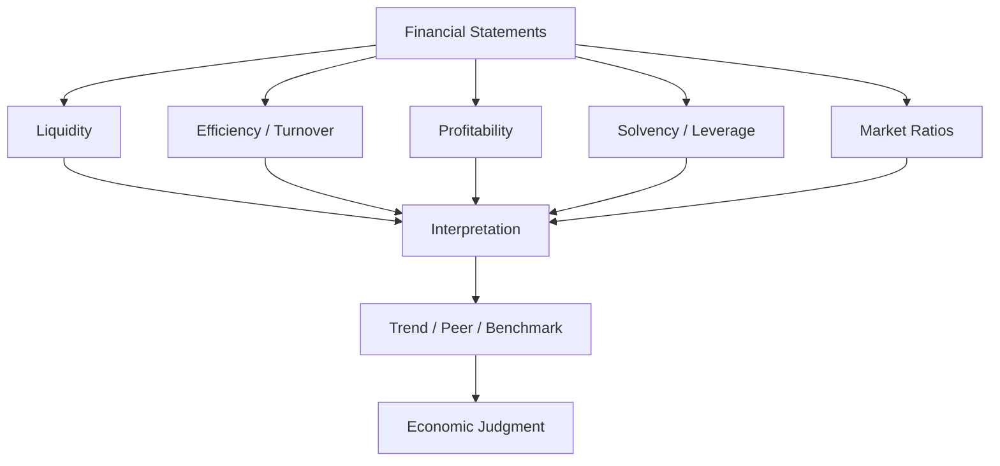
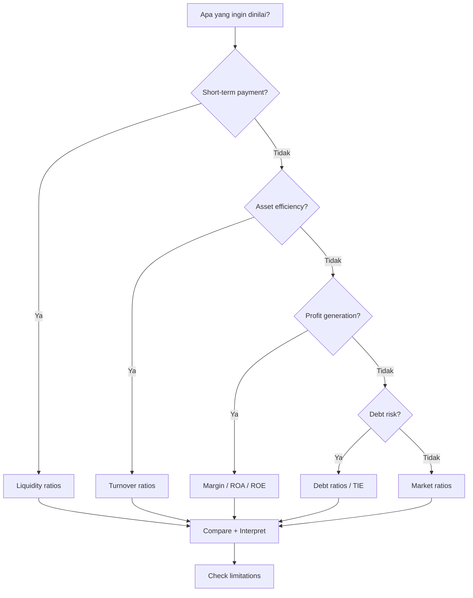

# 📘 1.6 — Financial Ratios and Interpretation

> [!ABSTRACT] Ringkasan Cepat
> **Topik:** Financial Ratios and Interpretation  
> **Bobot Parent Topic:** 30–40%  
> **Exam Priority:** Very High  
> **Difficulty:** Calculation-Intensive  
> **Primary Skill:** Mixed — Calculation + Interpretation  
> **Ref:** Robinson et al. sesuai scope Topik 1; Weygandt et al. Bab 18; Brigham & Ehrhardt Bab 3

---

## Section 0 — Pemetaan Silabus & Exam Scope

| Field | Isi |
|---|---|
| Topik CF4 | Topik 1 — Pelaporan Keuangan dan Perpajakan |
| Subtopik | 1.6 Financial Ratios and Interpretation |
| Learning Outcome | Menghitung dan menginterpretasikan **financial ratios dan accounting ratios**. |
| Skill Diuji | Memilih ratio yang tepat, mengambil numerator/denominator dari statement yang benar, menghitung ratio, membaca arah perubahan, membandingkan dengan periode/peer/benchmark, dan memberi interpretation yang tidak berlebihan. |
| Bobot Parent Topic | 30–40% |
| Exam Priority | Very High |
| Prerequisite | [[1.4 Company Account Structure]], [[1.5 Financial Statements Construction]] |
| Connected Topics | [[1.1 Taxation Principles]], [[1.3 Accounting Concepts and Sustainability]], [[1.4 Company Account Structure]], [[1.5 Financial Statements Construction]], [[3.2 Sources of Finance and Capital Structure]] |
| Referensi | Robinson et al. sesuai chapter Topik 1; Weygandt et al. Bab 18; Brigham & Ehrhardt Bab 3 |

> [!IMPORTANT] Scope Boundary
> `[CORE CF4]` Silabus meminta kemampuan **menghitung dan menginterpretasikan** ratio. Karena itu, menghafal formula saja tidak cukup.
>
> Materi inti note ini mencakup:
>
> - liquidity;
> - receivables/inventory dan asset efficiency;
> - profitability;
> - solvency/leverage dan interest coverage;
> - shareholder/market ratios yang secara eksplisit dibahas oleh referensi;
> - Du Pont relationship;
> - trend, peer comparison, benchmarking;
> - limitations dan accounting effects pada ratio.
>
> Sumber menggunakan beberapa **definisi formula yang tidak selalu identik**. Contohnya, numerator/denominator tertentu dapat berbeda antar-textbook atau data vendor. Untuk ujian, ikuti **definisi yang diberikan dalam soal** jika tersedia. Jangan mencampur numerator dari satu definisi dengan denominator dari definisi lain.

---

## Section 1 — Intuisi & Big Picture

Apa masalah nyata yang ingin diselesaikan konsep ini?

Bayangkan dua perusahaan:

- PT A memiliki net income Rp100 miliar.
- PT B juga memiliki net income Rp100 miliar.

Apakah performance keduanya sama?

Belum tentu.

Jika PT A menggunakan assets Rp500 miliar dan PT B menggunakan assets Rp2 triliun, Rp100 miliar profit memiliki arti yang sangat berbeda.

Ratio mengubah pertanyaan:

> “Berapa besar angkanya?”

menjadi:

> **“Besar dibanding apa?”**

Contoh:

$$
ROA=\frac{Net\ Income}{Average\ Total\ Assets}
$$

Jika:

$$
ROA_A=\frac{100}{500}=20\%
$$

dan:

$$
ROA_B=\frac{100}{2{,}000}=5\%
$$

maka kedua perusahaan menghasilkan nominal profit yang sama tetapi berbeda dalam **efficiency of asset use**.

### Ratio adalah alat kompresi informasi

Financial statements dapat berisi ratusan line items. Ratio menghubungkan beberapa angka menjadi signal yang lebih mudah dianalisis.

```text
Financial Statement Data
↓
Choose Relevant Relationship
↓
Calculate Ratio
↓
Compare
↓
Interpret
↓
Investigate Cause
↓
Economic Decision
```

Tetapi ratio **bukan diagnosis otomatis**.

Current ratio 3.0 tidak otomatis “lebih baik” daripada 2.0.

Mengapa?

Current assets dapat didominasi inventory yang lambat terjual. Perusahaan dengan current ratio lebih rendah tetapi cash dan receivables berkualitas tinggi dapat justru lebih liquid.

Robinson menekankan bahwa current ratio hanyalah rough measure pada satu titik waktu dan sensitif terhadap komposisi current assets serta end-of-period financing/operating decisions.

Brigham menekankan bahwa ratio analysis memiliki limitations dan harus dilengkapi judgment, trend analysis, peer comparison, serta qualitative analysis.

Weygandt membagi ratio terutama berdasarkan tujuan:

- **liquidity** → short-term ability;
- **profitability** → operating success/profit generation;
- **solvency** → long-term survival dan ability to meet obligations.

Brigham memberi framing lebih granular:

- liquidity;
- asset management;
- debt management;
- profitability;
- market value.

Keduanya tidak bertentangan; hanya grouping yang berbeda.

---

## Section 2 — Definisi & Core Concepts

### Definisi Formal

> [!NOTE] Financial Ratio
> Financial ratio adalah hubungan matematis antara dua financial quantities yang digunakan untuk mengevaluasi aspek tertentu dari financial position atau performance perusahaan.

Ratio menjadi meaningful jika dibandingkan dengan sesuatu:

1. **time-series / trend** → perusahaan yang sama lintas waktu;
2. **cross-sectional** → perusahaan lain pada periode yang sama;
3. **industry benchmark** → kelompok peer;
4. **target/covenant** → threshold tertentu.

---

### 2.1 Average Balance — Rule yang Sangat Penting

Jika numerator berasal dari **flow selama satu periode** seperti sales atau net income, sedangkan denominator adalah **stock pada satu tanggal** seperti assets, inventory, receivables, atau equity, Weygandt sering menggunakan average balance:

$$
Average\ Balance
=
\frac{Beginning\ Balance+Ending\ Balance}{2}
$$

Contoh:

$$
Average\ Inventory
=
\frac{Inventory_{begin}+Inventory_{end}}{2}
$$

> [!DANGER] Exam Trap
> Jika soal memberi beginning dan ending balance, jangan langsung memakai ending balance hanya karena lebih mudah.
>
> Tetapi jika source/soal secara eksplisit menggunakan year-end balance, ikuti definisinya. Brigham juga menunjukkan bahwa data provider berbeda dapat memakai definisi berbeda.

---

# A. LIQUIDITY RATIOS

Liquidity menilai kemampuan memenuhi **short-term obligations**.

---

### 2.2 Current Ratio

### Formula

$$
Current\ Ratio
=
\frac{Current\ Assets}{Current\ Liabilities}
$$

### Numerator

Dari **statement of financial position**:

- cash;
- short-term investments;
- receivables;
- inventory;
- current assets lain sesuai classification.

### Denominator

**Current liabilities** dari balance sheet.

### Economic Meaning

Mengukur berapa banyak current assets yang tersedia relatif terhadap setiap satu unit current liability.

Jika:

$$
Current\ Ratio=2.0
$$

secara nominal perusahaan memiliki Rp2 current assets untuk setiap Rp1 current liabilities.

### Higher / Lower Interpretation

**Higher** biasanya memberi greater short-term cushion.

Namun:

> **Higher ≠ always better.**

Current ratio terlalu tinggi dapat mencerminkan:

- excess cash yang tidak produktif;
- receivables lambat tertagih;
- inventory menumpuk;
- inefficient working capital management.

### Limitation

- tidak mengukur **quality** current assets;
- point-in-time measure;
- dapat dipengaruhi seasonality;
- dapat dipengaruhi end-of-period transactions;
- perbandingan antar-industry bisa tidak meaningful.

### Common Exam Trap

Mengira semua current assets sama liquid-nya.

---

### 2.3 Acid-Test / Quick Ratio

Weygandt:

$$
Quick\ Ratio
=
\frac{
Cash
+
Short\text{-}term\ Investments
+
Net\ Accounts\ Receivable
}{
Current\ Liabilities
}
$$

Robinson menggunakan framing yang sejalan:

$$
Quick\ Ratio
=
\frac{
Cash
+
Marketable\ Securities
+
Receivables
}{
Current\ Liabilities
}
$$

### Economic Meaning

Lebih strict daripada current ratio karena inventory dan less-liquid current assets tidak dimasukkan.

### Interpretation

Jika current ratio tinggi tetapi quick ratio rendah:

> kemungkinan besar bagian besar current assets berada dalam **inventory atau other less-liquid current assets**.

### Limitation

Receivables sendiri belum tentu cepat collectible.

---

### 2.4 Cash Ratio — Robinson

$$
Cash\ Ratio
=
\frac{
Cash+Marketable\ Securities
}{
Current\ Liabilities
}
$$

### Economic Meaning

Menilai short-term coverage hanya menggunakan assets yang paling dekat dengan cash.

### Interpretation

Lebih conservative daripada current dan quick ratio.

Urutan tipikal:

$$
Cash\ Ratio
\le
Quick\ Ratio
\le
Current\ Ratio
$$

selama classifications normal.

> [!CHECK] Sanity Check
> Jika cash ratio > quick ratio pada data normal, cek kembali numerator.

---

# B. RECEIVABLES & INVENTORY / ASSET EFFICIENCY

Weygandt mengelompokkan receivable dan inventory turnover sebagai liquidity-related measures karena keduanya menunjukkan seberapa cepat assets berubah menjadi cash. Brigham memasukkannya dalam **asset management ratios**.

---

### 2.5 Accounts Receivable Turnover

$$
Accounts\ Receivable\ Turnover
=
\frac{
Net\ Credit\ Sales
}{
Average\ Net\ Accounts\ Receivable
}
$$

### Numerator

Income statement:

- gunakan **net credit sales** jika tersedia.

### Denominator

Balance sheet:

$$
Average\ Net\ AR
=
\frac{Beginning\ Net\ AR+Ending\ Net\ AR}{2}
$$

### Economic Meaning

Mengukur berapa kali rata-rata receivables “berputar” menjadi collection selama periode.

### Higher / Lower Interpretation

Higher turnover biasanya berarti faster collection.

Namun sangat tinggi dapat juga menunjukkan:

- credit policy terlalu ketat;
- perusahaan kehilangan potential sales;
- banyak cash sales sehingga ratio tidak comparable.

### Limitation

Perlu memahami:

- sales mix cash vs credit;
- receivable factoring;
- seasonality;
- allowance policies.

---

### 2.6 Average Collection Period

Jika turnover tersedia:

$$
Average\ Collection\ Period
=
\frac{365}{Accounts\ Receivable\ Turnover}
$$

atau tergantung convention sumber soal:

$$
DSO
=
\frac{Accounts\ Receivable}{Sales/365}
$$

Brigham menyebut **days sales outstanding (DSO)**.

### Economic Meaning

Rata-rata hari yang diperlukan untuk collect receivables.

### Interpretation

Jika credit term perusahaan 30 hari tetapi collection period 55 hari:

> dapat menjadi signal collection issue, tetapi analyst tetap perlu memeriksa customer mix dan business model.

---

### 2.7 Inventory Turnover

Weygandt:

$$
Inventory\ Turnover
=
\frac{
Cost\ of\ Goods\ Sold
}{
Average\ Inventory
}
$$

### Numerator

Income statement → **COGS**, bukan sales.

### Denominator

$$
Average\ Inventory
=
\frac{Beginning\ Inventory+Ending\ Inventory}{2}
$$

### Economic Meaning

Menilai seberapa cepat inventory dijual/replaced.

### Higher / Lower Interpretation

Higher turnover sering berarti inventory bergerak lebih cepat.

Namun terlalu tinggi dapat berarti:

- stock terlalu sedikit;
- stock-outs;
- lost sales.

Lower turnover dapat menunjukkan:

- overstocking;
- obsolete inventory;
- weak sales;
- deliberate inventory build-up.

### Limitation

Accounting method dan jenis industry dapat memengaruhi comparability.

---

### 2.8 Days in Inventory

$$
Days\ in\ Inventory
=
\frac{365}{Inventory\ Turnover}
$$

### Economic Meaning

Estimasi berapa hari inventory rata-rata berada sebelum terjual.

Hubungan:

$$
Inventory\ Turnover\uparrow
\Rightarrow
Days\ in\ Inventory\downarrow
$$

---

### 2.9 Fixed Assets Turnover — Brigham

$$
Fixed\ Assets\ Turnover
=
\frac{Sales}{Net\ Fixed\ Assets}
$$

### Economic Meaning

Menilai sales yang dihasilkan per unit fixed assets.

### Interpretation

Higher dapat menunjukkan productive use of fixed assets.

### Limitation

Perbandingan dapat distorted oleh:

- umur assets;
- depreciation;
- outsourcing;
- lease treatment;
- capital intensity industry.

---

### 2.10 Total Asset Turnover / Asset Turnover

Weygandt:

$$
Asset\ Turnover
=
\frac{
Net\ Sales
}{
Average\ Total\ Assets
}
$$

Brigham sering menggunakan:

$$
Total\ Assets\ Turnover
=
\frac{Sales}{Total\ Assets}
$$

sesuai data yang digunakan.

### Economic Meaning

Menilai kemampuan assets menghasilkan sales.

Jika:

$$
Asset\ Turnover=1.8
$$

artinya setiap Rp1 average assets menghasilkan sekitar Rp1.80 sales selama periode.

### Interpretation

Higher biasanya menunjukkan greater asset utilization, tetapi profitability tetap bergantung pada margin.

---

# C. PROFITABILITY RATIOS

Profitability ratio menjawab:

> “Seberapa efektif perusahaan mengubah sales/assets/equity menjadi profit?”

---

### 2.11 Profit Margin / Net Profit Margin

Weygandt:

$$
Profit\ Margin
=
\frac{Net\ Income}{Net\ Sales}
$$

Brigham:

$$
Profit\ Margin\ on\ Sales
=
\frac{Net\ Income}{Sales}
$$

### Economic Meaning

Net profit yang dihasilkan per Rp1 sales.

Contoh:

$$
Margin=8\%
$$

berarti Rp100 sales menghasilkan sekitar Rp8 net income.

### Higher / Lower Interpretation

Higher margin biasanya menunjukkan:

- pricing power;
- cost control;
- favorable product mix;
- operational efficiency.

Tetapi margin tinggi tidak otomatis berarti high ROA/ROE jika asset turnover rendah.

### Limitation

Dipengaruhi oleh:

- financing;
- taxes;
- one-off items;
- accounting policy;
- industry structure.

---

### 2.12 Basic Earning Power — Brigham

$$
BEP
=
\frac{EBIT}{Total\ Assets}
$$

### Economic Meaning

Mengukur earning power assets **sebelum** effect financing dan tax.

### Mengapa berguna?

Untuk membandingkan operating performance perusahaan dengan financing/tax situations berbeda.

### Exam Trap

Jangan memakai net income sebagai numerator untuk BEP.

---

### 2.13 Return on Assets — ROA

Weygandt:

$$
ROA
=
\frac{
Net\ Income
}{
Average\ Total\ Assets
}
$$

Brigham menggunakan:

$$
ROA
=
\frac{Net\ Income}{Total\ Assets}
$$

pada framing chapter-nya.

### Economic Meaning

Mengukur profit yang dihasilkan dari asset base.

### Higher / Lower Interpretation

Higher ROA umumnya menunjukkan greater profitability relative to assets.

Namun:

- asset age;
- depreciation;
- asset-light business model;
- off-balance-sheet arrangements;
- industry structure

dapat memengaruhi comparison.

> [!DANGER] Formula Definition Trap
> **Average assets vs ending assets** adalah salah satu distractor paling mudah.
>
> Jika soal mengikuti Weygandt dan memberikan beginning/ending balances:
>
> $$
> Average\ Assets
> =
> \frac{Beginning+Ending}{2}
> $$

---

### 2.14 Return on Common Stockholders' Equity — ROE

Weygandt:

$$
ROE
=
\frac{
Net\ Income-Preferred\ Dividends
}{
Average\ Common\ Stockholders'\ Equity
}
$$

Jika tidak ada preferred shares:

$$
ROE
=
\frac{
Net\ Income
}{
Average\ Common\ Equity
}
$$

Brigham:

$$
ROE
=
\frac{
Net\ Income
}{
Common\ Equity
}
$$

sesuai framing data yang digunakan.

### Economic Meaning

Mengukur accounting return yang dihasilkan atas owners' common equity.

### Higher / Lower Interpretation

Higher ROE dapat berasal dari:

1. higher profitability;
2. faster asset turnover;
3. higher financial leverage.

Karena itu:

> **ROE tinggi tidak selalu berarti operating business lebih baik.**

Perusahaan dapat menaikkan ROE dengan menggunakan lebih banyak debt, yang juga meningkatkan risk.

---

# D. SOLVENCY / LEVERAGE RATIOS

Solvency berfokus pada ability to meet **long-term obligations** dan financial risk.

---

### 2.15 Debt to Assets Ratio

Weygandt:

$$
Debt\ to\ Assets
=
\frac{
Total\ Liabilities
}{
Total\ Assets
}
$$

Brigham menggunakan **debt ratio** dengan framing sejenis berdasarkan debt definition yang digunakan dalam chapter.

### Economic Meaning

Bagian assets yang dibiayai oleh creditors.

Jika:

$$
Debt\ to\ Assets=60\%
$$

sekitar 60% asset financing berasal dari liabilities berdasarkan definisi ratio.

### Higher / Lower Interpretation

Higher:

- greater creditor financing;
- greater leverage;
- generally greater financial risk.

Tetapi leverage juga dapat amplify shareholder returns jika operating return exceeds financing cost.

---

### 2.16 Debt-to-Equity — Robinson

$$
Debt\text{-}to\text{-}Equity
=
\frac{
Total\ Debt
}{
Total\ Equity
}
$$

### Economic Meaning

Membandingkan debt capital dengan equity capital.

Higher ratio biasanya menunjukkan greater leverage.

---

### 2.17 Long-Term Debt-to-Equity — Robinson

$$
Long\text{-}Term\ Debt\text{-}to\text{-}Equity
=
\frac{
Total\ Long\text{-}Term\ Debt
}{
Total\ Equity
}
$$

### Economic Meaning

Fokus pada long-term debt burden relatif terhadap equity.

---

### 2.18 Financial Leverage Ratio — Robinson

$$
Financial\ Leverage
=
\frac{
Total\ Assets
}{
Total\ Equity
}
$$

### Economic Meaning

Mengukur asset base supported oleh setiap unit equity.

Semakin besar:

- semakin banyak assets relatif terhadap equity;
- biasanya semakin besar leverage.

---

### 2.19 Times Interest Earned — TIE

Weygandt memberi bentuk:

$$
TIE
=
\frac{
Net\ Income
+
Interest\ Expense
+
Income\ Tax\ Expense
}{
Interest\ Expense
}
$$

Karena:

$$
Net\ Income
+
Interest
+
Tax
\approx EBIT
$$

maka bentuk equivalent yang lazim dalam Brigham:

$$
TIE
=
\frac{EBIT}{Interest\ Expense}
$$

### Economic Meaning

Berapa kali operating earnings sebelum interest/tax mampu cover interest obligation.

Jika:

$$
TIE=6
$$

earnings before interest and tax sekitar enam kali annual interest expense.

### Higher / Lower Interpretation

Higher biasanya memberi greater interest-payment cushion.

Lower TIE → higher default pressure, ceteris paribus.

### Limitation

TIE berbasis accounting earnings, bukan actual cash flow.

> [!DANGER] Profit ≠ Cash Flow
> Perusahaan dapat memiliki TIE memadai tetapi cash flow lemah jika earnings belum dikonversi menjadi cash.

---

### 2.20 EBITDA Coverage — Brigham

Brigham juga membahas coverage ratio yang lebih luas menggunakan EBITDA dan fixed financial charges.

> [!IMPORTANT]
> Gunakan tepat formula yang diberikan source/soal. Jangan menganggap seluruh “coverage ratios” identik dengan TIE.

---

# E. SHAREHOLDER / MARKET RATIOS

---

### 2.21 Earnings per Share — EPS

Weygandt:

$$
EPS
=
\frac{
Net\ Income-Preferred\ Dividends
}{
Weighted\text{-}Average\ Common\ Shares\ Outstanding
}
$$

### Economic Meaning

Accounting earnings attributable per common share.

### Exam Trap

Denominator adalah **weighted-average shares**, bukan otomatis ending shares.

---

### 2.22 Price-Earnings Ratio — P/E

$$
P/E
=
\frac{
Market\ Price\ per\ Share
}{
Earnings\ per\ Share
}
$$

### Economic Meaning

Menunjukkan berapa kali earnings per share yang tercermin dalam stock price.

### Interpretation

Higher P/E dapat mencerminkan:

- stronger growth expectations;
- lower perceived risk;
- high quality earnings;

tetapi tidak otomatis berarti saham “lebih baik” atau “lebih mahal secara salah”.

### Limitation

P/E sulit digunakan jika earnings:

- sangat volatile;
- near zero;
- negative;
- distorted by non-recurring items.

---

### 2.23 Payout Ratio

Weygandt:

$$
Payout\ Ratio
=
\frac{
Cash\ Dividends\ Declared\ on\ Common\ Stock
}{
Net\ Income
}
$$

Dalam kasus dengan preferred stock, perhatikan definisi earnings attributable to common jika soal memberi treatment spesifik.

### Economic Meaning

Proporsi earnings yang didistribusikan sebagai dividends.

### Interpretation

Growth company dapat memilih lower payout untuk retain earnings dan membiayai growth.

Higher payout tidak otomatis lebih baik.

---

### 2.24 Market-to-Book dan Price/Cash Flow — Brigham

Brigham juga membahas:

$$
Market/Book
=
\frac{
Market\ Price\ per\ Share
}{
Book\ Value\ per\ Share
}
$$

dan **price/cash flow ratio**.

Market value ratios memberikan signal bagaimana investors menilai past performance dan future prospects.

> [!IMPORTANT]
> Market ratios memerlukan **market data**, bukan hanya accounting statements.

---

## Section 3 — How It Works

### 3.1 Universal Ratio Framework

Untuk setiap soal ratio:

```text
Question
↓
Apa dimensi yang ditanyakan?
Liquidity / Efficiency / Profitability / Solvency / Market
↓
Pilih ratio
↓
Cari numerator
↓
Cari denominator
↓
Cek average vs ending balance
↓
Hitung
↓
Bandingkan
↓
Interpretasikan
↓
Cari limitation / alternate explanation
```

> [!TIP] Cara Berpikir
> Jangan hafalkan ratio sebagai kumpulan pecahan terpisah. Pikirkan **pertanyaan bisnisnya**:
>
> - “Bisa bayar kewajiban pendek?” → liquidity.
> - “Asset berputar cepat?” → turnover.
> - “Sales menghasilkan profit?” → margin.
> - “Asset/equity menghasilkan profit?” → ROA/ROE.
> - “Seberapa berat debt?” → leverage.
> - “Bisa cover interest?” → TIE.
> - “Bagaimana market menilai earnings?” → P/E.

---

### 3.2 Flow ÷ Stock → Pikirkan Average

```text
Income Statement amount = selama periode
Balance Sheet amount = satu titik waktu
```

Karena itu:

$$
Sales\ atau\ Income
\div
Balance\ Sheet\ Item
$$

sering menggunakan **average balance**.

Contoh:

- AR turnover;
- inventory turnover;
- asset turnover;
- ROA;
- ROE.

---

### 3.3 Direction-of-Effect Framework

Contoh: inventory meningkat, sales dan COGS tetap.

#### Current ratio

Current assets naik:

$$
Current\ Ratio\uparrow
$$

#### Quick ratio

Inventory tidak masuk numerator:

$$
Quick\ Ratio\ unchanged
$$

#### Inventory turnover

Denominator naik:

$$
Inventory\ Turnover\downarrow
$$

Ini adalah jenis reasoning yang sangat exam-friendly.

---

### 3.4 Du Pont System — Mengurai ROE

Brigham menjelaskan bahwa Du Pont menunjukkan interaction antara:

- profit margin;
- asset turnover;
- leverage.

Basic three-component form:

$$
ROE
=
\frac{Net\ Income}{Sales}
\times
\frac{Sales}{Total\ Assets}
\times
\frac{Total\ Assets}{Common\ Equity}
$$

Sehingga:

$$
ROE
=
Profit\ Margin
\times
Total\ Asset\ Turnover
\times
Equity\ Multiplier
$$

Secara algebra:

$$
\frac{NI}{Sales}
\times
\frac{Sales}{Assets}
\times
\frac{Assets}{Equity}
=
\frac{NI}{Equity}
$$

### Mental Model

```text
ROE
├── Margin: profit per sales
├── Turnover: sales per asset
└── Leverage: assets per equity
```

Jadi ROE bisa tinggi karena:

- margin tinggi;
- asset utilization tinggi;
- leverage tinggi;
- atau kombinasi ketiganya.

> [!DANGER] Jangan Salah Pikir
> “ROE tinggi = operational performance pasti hebat” adalah salah.
>
> Bisa saja margin dan turnover biasa saja tetapi leverage sangat tinggi.

---

### 3.5 Trend Analysis

Brigham:

> ratio dilihat lintas waktu untuk mengetahui apakah kondisi membaik atau memburuk.

Contoh:

| Year | Current Ratio |
|---|---:|
| 2024 | 1.8 |
| 2025 | 1.5 |
| 2026 | 1.2 |

Ada downward trend.

Tetapi analyst tetap perlu menanyakan:

- apakah company menjadi lebih efficient?
- apakah inventory turun?
- apakah short-term debt meningkat?
- apakah industry mengalami pattern yang sama?

---

### 3.6 Comparative Ratio Analysis / Benchmarking

Cross-sectional comparison:

```text
Company Ratio
vs
Competitor
vs
Industry
vs
Benchmark
```

Brigham mendefinisikan **benchmarking** sebagai perbandingan dengan sekelompok perusahaan serupa yang berhasil.

Robinson menekankan comparability dapat terbatas oleh:

- accounting method differences;
- lack of operating homogeneity;
- diversified businesses;
- temporary vs persistent conditions.

---

### 3.7 Ratio ≠ Answer; Ratio = Signal

Contoh:

**Current ratio naik dari 1.8 → 2.6.**

Weak interpretation:

> “Liquidity membaik.”

Better interpretation:

> Current assets meningkat relatif terhadap current liabilities, sehingga measured short-term coverage membaik. Namun penyebab kenaikan harus diperiksa. Jika berasal dari slow-moving inventory, economic liquidity belum tentu membaik sebesar yang ditunjukkan current ratio.

Inilah level interpretation yang perlu dibiasakan untuk CF4.

---

## Section 4 — Worked Examples & Exam Cases

### Case A — Fundamental: Liquidity & Turnover

**Soal**

PT Alpha memiliki data berikut:

| Item | Beginning | Ending |
|---|---:|---:|
| Cash | — | 60 |
| Short-term investments | — | 20 |
| Accounts receivable | 100 | 140 |
| Inventory | 180 | 220 |
| Current assets | — | 500 |
| Current liabilities | — | 250 |

Net credit sales = 960  
COGS = 800

Hitung:

1. current ratio;
2. quick ratio;
3. accounts receivable turnover;
4. inventory turnover.

> [!SUCCESS] Pembahasan
>
> **1. Identifikasi informasi**
>
> Current ratio dan quick ratio menggunakan ending balance-sheet data.  
> Turnover menghubungkan period flow dengan balance sehingga gunakan average balance.
>
> **2. Current ratio**
>
> $$
> Current\ Ratio
> =
> \frac{500}{250}
> =
> 2.00
> $$
>
> **3. Quick ratio**
>
> $$
> Quick\ Assets
> =
> 60+20+140
> =
> 220
> $$
>
> $$
> Quick\ Ratio
> =
> \frac{220}{250}
> =
> 0.88
> $$
>
> **4. AR turnover**
>
> $$
> Average\ AR
> =
> \frac{100+140}{2}
> =
> 120
> $$
>
> $$
> AR\ Turnover
> =
> \frac{960}{120}
> =
> 8.0
> $$
>
> Average collection period:
>
> $$
> \frac{365}{8}
> \approx45.6\ days
> $$
>
> **5. Inventory turnover**
>
> $$
> Average\ Inventory
> =
> \frac{180+220}{2}
> =
> 200
> $$
>
> $$
> Inventory\ Turnover
> =
> \frac{800}{200}
> =
> 4.0
> $$
>
> Days in inventory:
>
> $$
> \frac{365}{4}
> =
> 91.25\ days
> $$
>
> **6. Interpretation**
>
> Current ratio 2.00 terlihat comfortable secara nominal, tetapi quick ratio hanya 0.88. Gap besar tersebut menunjukkan current liquidity bergantung cukup besar pada inventory/less-liquid items.
>
> **7. Verification**
>
> $$
> Quick\ Ratio<Current\ Ratio
> $$
>
> sesuai expectation.

> [!WARNING] Exam Trap — Case A
> - **Trap:** Inventory dimasukkan ke quick ratio.
> - **Trap:** Menggunakan ending AR/inventory daripada average.
> - **Trap:** Sales digunakan sebagai numerator inventory turnover.
> - **Shortcut:** **AR ↔ credit sales; Inventory ↔ COGS.**
> - **Target waktu:** 2–3 menit.

---

### Case B — Exam-Typical: Profitability, Leverage, Coverage

**Soal**

PT Beta memiliki:

- Net sales = 1,500
- Net income = 90
- EBIT = 180
- Interest expense = 30
- Beginning total assets = 900
- Ending total assets = 1,100
- Beginning common equity = 450
- Ending common equity = 550
- Total liabilities at year-end = 550

Tidak ada preferred shares.

Hitung:

1. profit margin;
2. ROA;
3. ROE;
4. debt-to-assets ratio;
5. TIE.

> [!SUCCESS] Pembahasan
>
> **1. Profit margin**
>
> $$
> Profit\ Margin
> =
> \frac{90}{1{,}500}
> =
> 6\%
> $$
>
> **2. Average assets**
>
> $$
> Average\ Assets
> =
> \frac{900+1{,}100}{2}
> =
> 1{,}000
> $$
>
> $$
> ROA
> =
> \frac{90}{1{,}000}
> =
> 9\%
> $$
>
> **3. Average equity**
>
> $$
> Average\ Equity
> =
> \frac{450+550}{2}
> =
> 500
> $$
>
> $$
> ROE
> =
> \frac{90}{500}
> =
> 18\%
> $$
>
> **4. Debt-to-assets**
>
> $$
> Debt\ to\ Assets
> =
> \frac{550}{1{,}100}
> =
> 50\%
> $$
>
> **5. TIE**
>
> $$
> TIE
> =
> \frac{180}{30}
> =
> 6.0
> $$
>
> **6. Interpretation**
>
> ROE 18% jauh di atas ROA 9%. Salah satu alasan penting adalah penggunaan leverage: common shareholders menyediakan hanya sebagian dari asset financing. Namun leverage meningkatkan financial risk.
>
> **7. Verification**
>
> Profit margin harus:
>
> $$
> <100\%
> $$
>
> untuk case normal ini, dan TIE positif karena EBIT > interest.

> [!WARNING] Exam Trap — Case B
> - **Trap:** ROA menggunakan ending assets padahal beginning balance diberikan.
> - **Trap:** Interest expense dikurangkan lagi dari EBIT sebelum menghitung TIE.
> - **Trap:** Menganggap ROE > ROA selalu “good news”.
> - **Target waktu:** 2–3 menit.

---

### Case C — Challenging / Integrated: Du Pont Diagnosis

**Soal**

Dua perusahaan memiliki data:

| Metric | Gamma | Delta |
|---|---:|---:|
| Net income | 80 | 80 |
| Sales | 1,000 | 2,000 |
| Total assets | 500 | 1,000 |
| Common equity | 250 | 250 |

Bandingkan ROE dan jelaskan sumbernya dengan Du Pont.

> [!SUCCESS] Pembahasan
>
> **1. ROE Gamma**
>
> $$
> ROE_G
> =
> \frac{80}{250}
> =
> 32\%
> $$
>
> **2. ROE Delta**
>
> $$
> ROE_D
> =
> \frac{80}{250}
> =
> 32\%
> $$
>
> Kedua perusahaan memiliki ROE sama.
>
> **3. Du Pont — Gamma**
>
> Margin:
>
> $$
> \frac{80}{1{,}000}=8\%
> $$
>
> Asset turnover:
>
> $$
> \frac{1{,}000}{500}=2.0
> $$
>
> Leverage:
>
> $$
> \frac{500}{250}=2.0
> $$
>
> $$
> ROE_G
> =
> 8\%
> \times2.0\times2.0
> =
> 32\%
> $$
>
> **4. Du Pont — Delta**
>
> Margin:
>
> $$
> \frac{80}{2{,}000}=4\%
> $$
>
> Asset turnover:
>
> $$
> \frac{2{,}000}{1{,}000}=2.0
> $$
>
> Leverage:
>
> $$
> \frac{1{,}000}{250}=4.0
> $$
>
> $$
> ROE_D
> =
> 4\%
> \times2.0\times4.0
> =
> 32\%
> $$
>
> **5. Interpretation**
>
> ROE sama tetapi economics berbeda:
>
> - Gamma mempunyai **higher margin** dan lower leverage.
> - Delta mengompensasi lower margin dengan **much higher leverage**.
>
> Jika hanya melihat ROE, perbedaan risk structure tidak terlihat.
>
> **6. Verification**
>
> Komponen Du Pont harus multiply kembali ke ROE aktual.

> [!WARNING] Exam Trap — Case C
> - **Trap:** Memilih perusahaan hanya berdasarkan ROE.
> - **Trap:** Menganggap ROE sama → performance/risk sama.
> - **Shortcut:** **Margin × Turnover × Leverage.**
> - **Target waktu:** 3 menit.

---

### Case D — Direction-of-Effect

**Soal**

Sebuah perusahaan membeli inventory tambahan dengan **short-term credit**, sementara sales, cash, receivables, dan COGS belum berubah. Apa immediate direction terhadap:

1. current ratio;
2. quick ratio;
3. inventory turnover?

Asumsikan current ratio sebelum transaksi > 1.

> [!SUCCESS] Pembahasan
>
> Inventory ↑ dan current liabilities ↑ dengan amount sama.
>
> **Current ratio**
>
> Jika:
>
> $$
> \frac{CA}{CL}>1
> $$
>
> lalu numerator dan denominator ditambah amount yang sama, ratio akan turun menuju 1.
>
> Jadi:
>
> $$
> Current\ Ratio\downarrow
> $$
>
> **Quick ratio**
>
> Inventory tidak masuk quick assets, tetapi current liabilities naik:
>
> $$
> Quick\ Ratio\downarrow
> $$
>
> **Inventory turnover**
>
> COGS tetap, inventory naik:
>
> $$
> Inventory\ Turnover\downarrow
> $$
>
> **Interpretation**
>
> Transaksi dapat membuat nominal current assets naik tetapi measured liquidity justru melemah karena pembelian dibiayai short-term obligation dan asset yang bertambah adalah inventory.

> [!WARNING] Exam Trap — Case D
> “Current assets naik” tidak cukup untuk menyimpulkan current ratio naik. **Denominator juga berubah.**

---

## Section 5 — Interpretation & Sanity Check

> [!CHECK] Sanity Check
> 1. **Category check:** Ratio ini mengukur liquidity, efficiency, profitability, solvency, atau market perception?
> 2. **Statement check:** Numerator dan denominator diambil dari statement yang benar?
> 3. **Average check:** Flow ÷ balance-sheet stock → apakah seharusnya pakai average?
> 4. **Unit check:** Ratio dinyatakan sebagai times, %, atau days?
> 5. **Direction check:** Apakah hubungan numerator/denominator masuk akal?
> 6. **Bridge check:** Jika memakai Du Pont, product komponen harus kembali ke ROE.
> 7. **Economic check:** Higher/lower benar-benar baik/buruk atau perlu context?
> 8. **Comparability check:** Apakah accounting policies, industry, period, dan definitions comparable?

---

### Interpretation Ladder

> **Level 1 — Number**  
> Current ratio = 1.8.
>
> **Level 2 — Direction**  
> Turun dari 2.3 tahun sebelumnya.
>
> **Level 3 — Meaning**  
> Current asset cushion relatif terhadap current liabilities berkurang.
>
> **Level 4 — Cause**  
> Bisa karena current liabilities naik, current assets turun, atau keduanya.
>
> **Level 5 — Quality/Composition**  
> Apa yang terjadi pada cash, receivable quality, inventory, dan payables?
>
> **Level 6 — Benchmark**  
> Bagaimana dibanding peer dan historical norm?
>
> **Level 7 — Limitation**  
> Apakah perubahan hanya seasonal/end-of-period atau persistent?

---

## Section 6 — Connections & Mental Model



### Dengan [[1.4 Company Account Structure]]

1.4 menjelaskan **di mana angka berada**.  
1.6 menggunakan angka tersebut sebagai numerator/denominator.

Contoh:

- current assets/current liabilities → balance sheet;
- net income/net sales → income statement;
- net income/average assets → income statement + balance sheet;
- market price/EPS → market data + accounting data.

---

### Dengan [[1.5 Financial Statements Construction]]

Salah construction → salah ratio.

Contoh:

Jika customer advance salah dicatat sebagai revenue dan tidak sebagai liability:

- net income overstated;
- equity overstated;
- current liabilities understated;
- current ratio overstated;
- ROA/ROE dapat distorted.

---

### Dengan [[1.3 Accounting Concepts and Sustainability]]

Accounting policies dan estimates dapat memengaruhi:

- inventory;
- depreciation;
- asset values;
- provisions;
- revenue;
- profit.

Akibatnya, ratio comparison harus mempertimbangkan **comparability of accounting methods**.

---

### Dengan Corporate Finance

Ratios membantu management/investors/creditors melihat trade-off:

```text
More Debt
↓
Potentially Higher ROE
BUT
Higher Financial Risk
↓
Debt ratios ↑
Interest coverage may ↓
```

---

## Section 7 — Exam Traps & Misconceptions

### Definition Trap

> [!BUG] Definition Trap — Liquidity vs Solvency
>
> **Liquidity** → ability memenuhi short-term obligations.  
> **Solvency** → ability memenuhi long-term/overall obligations dan survive financially.

> [!BUG] Definition Trap — Profit Margin vs ROA
>
> Margin menggunakan **sales** sebagai basis.  
> ROA menggunakan **assets** sebagai basis.

> [!BUG] Definition Trap — ROA vs ROE
>
> ROA → return relatif terhadap asset base.  
> ROE → return relatif terhadap owners' equity.

> [!BUG] Definition Trap — Turnover vs Days
>
> Higher turnover berarti lebih banyak cycles per year.  
> Higher days berarti lebih lama tertahan.
>
> Maka keduanya biasanya bergerak **berlawanan arah**.

---

### Financial Logic Trap

> [!BUG] Logic Trap
> **Higher current ratio ≠ always better.**
>
> Bisa berasal dari inventory menumpuk.

> [!BUG] Logic Trap
> **Higher inventory turnover ≠ unlimited good news.**
>
> Terlalu tinggi dapat mengindikasikan insufficient inventory dan lost sales.

> [!BUG] Logic Trap
> **Higher ROE ≠ lower risk.**
>
> Leverage dapat menaikkan ROE sekaligus risk.

> [!BUG] Logic Trap
> **High profit ≠ high cash flow.**
>
> Ratio berbasis earnings tidak otomatis menunjukkan cash generation.

> [!BUG] Logic Trap
> **Industry average ≠ perfect target.**
>
> Companies dalam industry yang sama dapat memiliki business models berbeda.

---

### Calculation Trap — Inventory Turnover

**Salah**

$$
Inventory\ Turnover
=
\frac{Sales}{Inventory}
$$

**Benar — Weygandt**

$$
Inventory\ Turnover
=
\frac{COGS}{Average\ Inventory}
$$

---

### Calculation Trap — ROA

Jika beginning dan ending assets tersedia:

**Salah**

$$
ROA
=
\frac{NI}{Ending\ Assets}
$$

**Benar — Weygandt**

$$
ROA
=
\frac{NI}{
(Beginning\ Assets+Ending\ Assets)/2
}
$$

---

### Calculation Trap — TIE

**Salah**

$$
TIE=\frac{Net\ Income}{Interest}
$$

**Benar**

$$
TIE=\frac{EBIT}{Interest}
$$

atau Weygandt:

$$
TIE
=
\frac{
NI+Interest+Tax
}{
Interest
}
$$

---

### Calculation Trap — EPS

**Salah**

$$
EPS=\frac{Net\ Income}{Ending\ Shares}
$$

**Benar**

$$
EPS
=
\frac{
NI-Preferred\ Dividends
}{
Weighted\text{-}Average\ Common\ Shares
}
$$

---

### Interpretation Trap

> [!BUG] Interpretation Trap
> Company A memiliki current ratio 3.0 dan Company B 2.0.
>
> Tidak cukup untuk mengatakan A lebih liquid.
>
> Periksa:
>
> - quick ratio;
> - cash ratio;
> - receivable collection;
> - inventory turnover;
> - current liability composition;
> - seasonality.

---

### Red Flags

> [!CAUTION] Red Flags

| Keyword / Condition | Apa yang Harus Dipikirkan |
|---|---|
| “short-term ability” | Current ratio / quick ratio |
| “immediate liquidity” | Quick ratio / cash ratio |
| “credit sales” | AR turnover |
| “average receivables” | Flow ÷ average balance |
| “COGS” + inventory | Inventory turnover |
| “days to collect” | 365 / AR turnover atau DSO |
| “days inventory held” | 365 / inventory turnover |
| “sales generated by assets” | Asset turnover |
| “profit per sales” | Profit margin |
| “return generated by assets” | ROA |
| “return to common owners” | ROE |
| “percentage financed by creditors” | Debt-to-assets |
| “interest-paying ability” | TIE |
| “market price relative to earnings” | P/E |
| “earnings distributed as dividend” | Payout ratio |
| “trend” | Time-series comparison |
| “industry average / peer” | Cross-sectional analysis |
| “ROE driver” | Du Pont |
| “beginning and ending balance given” | Check whether denominator should be average |

---

## Section 8 — Executive Summary

### Must Remember

> [!SUMMARY] Must Remember
> 1. Ratio calculation tanpa interpretation **belum selesai**.
> 2. Ratio harus dibaca relatif terhadap **trend, peer, benchmark, atau target**.
> 3. Current ratio:
>
> $$
> \frac{CA}{CL}
> $$
>
> 4. Quick ratio:
>
> $$
> \frac{Cash+Short\text{-}term\ Investments+Net\ AR}{CL}
> $$
>
> 5. AR turnover:
>
> $$
> \frac{Net\ Credit\ Sales}{Average\ Net\ AR}
> $$
>
> 6. Inventory turnover:
>
> $$
> \frac{COGS}{Average\ Inventory}
> $$
>
> 7. Profit margin:
>
> $$
> \frac{NI}{Net\ Sales}
> $$
>
> 8. Asset turnover:
>
> $$
> \frac{Net\ Sales}{Average\ Assets}
> $$
>
> 9. ROA:
>
> $$
> \frac{NI}{Average\ Assets}
> $$
>
> 10. ROE:
>
> $$
> \frac{NI-Preferred\ Dividends}{Average\ Common\ Equity}
> $$
>
> 11. Debt-to-assets:
>
> $$
> \frac{Total\ Liabilities}{Total\ Assets}
> $$
>
> 12. TIE:
>
> $$
> \frac{EBIT}{Interest}
> $$
>
> 13. EPS:
>
> $$
> \frac{NI-Preferred\ Dividends}{Weighted\text{-}Average\ Common\ Shares}
> $$
>
> 14. P/E:
>
> $$
> \frac{Market\ Price}{EPS}
> $$
>
> 15. Du Pont:
>
> $$
> ROE
> =
> Margin\times Asset\ Turnover\times Leverage
> $$
>
> 16. **Higher ratio ≠ automatically better.**
> 17. **Average vs ending balance** adalah trap numerik penting.
> 18. **Profit ≠ cash flow.**
> 19. Accounting method, seasonality, window dressing, diversified operations, dan definition differences dapat mengurangi comparability.

---

### Master Ratio Table

| Ratio | Formula | Mainly Measures | Higher Usually Means | Main Caveat |
|---|---|---|---|---|
| Current Ratio | $\frac{CA}{CL}$ | Liquidity | Greater short-term cushion | Inventory quality |
| Quick Ratio | $\frac{Cash+STI+AR}{CL}$ | Immediate liquidity | Stronger liquid coverage | AR collectibility |
| Cash Ratio | $\frac{Cash+MS}{CL}$ | Most conservative liquidity | Greater cash coverage | May penalize efficient cash management |
| AR Turnover | $\frac{Net\ Credit\ Sales}{Avg\ AR}$ | Collection efficiency | Faster collection | Cash sales / factoring |
| Collection Period | $\frac{365}{AR\ Turnover}$ | Collection days | **Higher = slower** | Credit terms differ |
| Inventory Turnover | $\frac{COGS}{Avg\ Inventory}$ | Inventory efficiency | Faster movement | Too high may mean stock-outs |
| Days Inventory | $\frac{365}{Inv.\ Turnover}$ | Holding period | **Higher = slower** | Industry dependent |
| Asset Turnover | $\frac{Sales}{Avg\ Assets}$ | Asset utilization | More sales per asset | Capital intensity |
| Profit Margin | $\frac{NI}{Sales}$ | Profitability per sales | More profit per sales | Financing/tax effects |
| BEP | $\frac{EBIT}{Assets}$ | Operating earning power | Higher operating productivity | Asset measurement |
| ROA | $\frac{NI}{Avg\ Assets}$ | Return on asset base | Higher profitability | Leverage/accounting |
| ROE | $\frac{NI-PrefDiv}{Avg\ CommonEq}$ | Return to common owners | Higher equity return | Can be leverage-driven |
| Debt/Assets | $\frac{Liabilities}{Assets}$ | Solvency/leverage | More creditor financing | Liability definition |
| Debt/Equity | $\frac{Debt}{Equity}$ | Leverage | Higher leverage | Debt definition |
| Financial Leverage | $\frac{Assets}{Equity}$ | Leverage | Higher leverage | May amplify risk |
| TIE | $\frac{EBIT}{Interest}$ | Interest coverage | Larger cushion | Earnings ≠ cash |
| EPS | $\frac{NI-PrefDiv}{WA\ Shares}$ | Earnings per share | More earnings/share | Buybacks/share changes |
| P/E | $\frac{Price}{EPS}$ | Market expectations | Higher valuation multiple | Growth/risk context |
| Payout | $\frac{Common\ Cash\ Dividends}{NI}$ | Distribution policy | More earnings distributed | Growth firms often retain |

---

### Trigger Keywords

| Jika soal mengatakan... | Pikirkan... |
|---|---|
| “ability to pay current liabilities” | Liquidity ratios |
| “inventory excluded” | Quick ratio |
| “how many times receivables collected” | AR turnover |
| “average collection days” | DSO / collection period |
| “how quickly inventory sold” | Inventory turnover / days inventory |
| “efficiency using assets” | Asset turnover |
| “each dollar of sales generates profit” | Profit margin |
| “profit relative to assets” | ROA |
| “return to common shareholders” | ROE |
| “creditors financed assets” | Debt-to-assets |
| “cover interest charges” | TIE |
| “market price vs earnings” | P/E |
| “dividend distribution percentage” | Payout ratio |
| “why ROE changed?” | Du Pont |
| “improved or deteriorated over time” | Trend analysis |
| “compared with competitors” | Cross-sectional / benchmarking |

---

### Kapan Digunakan

Gunakan ratio analysis untuk:

- screening performance;
- trend diagnosis;
- liquidity analysis;
- credit analysis;
- solvency assessment;
- profitability assessment;
- management performance review;
- peer comparison;
- identifying areas requiring deeper investigation.

### Kapan TIDAK Boleh Digunakan Sendirian

Jangan membuat final conclusion hanya dari satu ratio jika:

- company diversified;
- accounting policies berbeda;
- industry berbeda;
- seasonal business;
- major acquisitions/disposals;
- unusual/non-recurring events;
- rapid growth membuat year-end balances unrepresentative;
- ratio definitions berasal dari provider berbeda.

---

### Quick Decision Tree



---

## Section 9 — Active Recall Check

1. Mengapa current ratio yang lebih tinggi belum tentu menunjukkan perusahaan yang lebih sehat?
2. Apa perbedaan economic meaning antara current ratio dan quick ratio?
3. Mengapa inventory turnover menggunakan COGS, bukan sales?
4. Jika AR turnover naik dari 5 menjadi 8, apa yang biasanya terjadi pada average collection period?
5. Kapan denominator average balance lebih tepat daripada ending balance?
6. Apa perbedaan yang sebenarnya diukur oleh profit margin, asset turnover, ROA, dan ROE?
7. Mengapa ROE dapat naik walaupun operating performance tidak membaik?
8. Sebuah perusahaan memiliki ROA 8% dan ROE 20%. Apa kemungkinan structural explanation?
9. Mengapa TIE yang tinggi belum cukup untuk menjamin perusahaan tidak mengalami cash-flow problem?
10. Jika current assets dan current liabilities naik dengan amount yang sama ketika current ratio awal >1, ke arah mana current ratio bergerak?
11. Jika inventory naik tetapi COGS tetap, bagaimana inventory turnover dan days in inventory berubah?
12. Mengapa perusahaan dari dua industry berbeda tidak boleh dibandingkan hanya berdasarkan asset turnover?
13. Apa tiga driver utama dalam basic Du Pont ROE decomposition?
14. Mengapa P/E tinggi tidak otomatis berarti saham overvalued?
15. Bagaimana accounting policy differences dapat merusak cross-company ratio comparison?
16. Ratio apa yang paling relevan bagi short-term lender? Bagaimana dengan long-term bond investor? Bagaimana dengan common shareholder?
17. Mengapa trend analysis sering lebih informative daripada melihat satu ratio satu tahun?
18. Apa perbedaan antara liquidity dan solvency dalam satu kalimat?

---

## Section 10 — Exam Pattern Map

| Narasi Soal | Keyword | Konsep | Formula/Rule | Langkah | Trap | Shortcut |
|---|---|---|---|---|---|---|
| Kemampuan membayar kewajiban jangka pendek | current assets/current liabilities | Liquidity | $CA/CL$ | Ambil CA, CL → divide → interpret | Higher selalu baik | **Short term → current** |
| Inventory dikeluarkan dari liquid assets | acid-test | Quick ratio | $(Cash+STI+AR)/CL$ | Exclude inventory/prepaids | Inventory ikut numerator | **Quick = no inventory** |
| Kecepatan collection | credit sales, receivable | AR turnover | $CreditSales/AvgAR$ | Average AR → turnover | Ending AR | **Credit ↔ receivable** |
| Hari collect | days outstanding | Collection period | $365/Turnover$ | Hitung turnover → invert | Turnover & days searah | **More turns = fewer days** |
| Inventory movement | COGS, inventory | Inventory turnover | $COGS/AvgInv$ | Average inventory → divide | Sales numerator | **COGS ↔ inventory** |
| Sales per asset | efficiency | Asset turnover | $Sales/AvgAssets$ | Average assets → divide | Disamakan dengan ROA | **Sales, not income** |
| Profit per sales | margin | Profit margin | $NI/Sales$ | NI ÷ sales | Memakai EBIT tanpa instruction | **Income per sales** |
| Profit per asset | return on assets | ROA | $NI/AvgAssets$ | Average assets | Ending denominator | **Income per assets** |
| Common owner return | ROE | ROE | $(NI-PrefDiv)/AvgCommonEq$ | Remove pref claims → average equity | Debt effect ignored | **Owner return** |
| Creditor financing | debt ratio | Debt/assets | $Liabilities/Assets$ | Divide → interpret leverage | Higher = safer | **Debt up → risk up** |
| Interest-paying ability | interest coverage | TIE | $EBIT/Interest$ | Derive EBIT if needed | NI/interest | **Before interest pays interest** |
| Market pays x earnings | P/E | Market ratio | $Price/EPS$ | EPS then price/EPS | P/E = return | **Price multiple** |
| ROE driver | margin, turnover, leverage | Du Pont | Margin × Turnover × Leverage | Decompose | ROE high = operations good | **M × T × L** |
| Ratio berubah lintas tahun | historical trend | Trend analysis | Compare consistently | Direction + cause | One-year conclusion | **Trend before verdict** |
| Compare with peers | industry benchmark | Cross-sectional | Same definitions | Normalize/compare | Different methods/business models | **Comparable first** |

**Label:** `[TEXTBOOK-BASED EXPECTATION]`

Pola di atas berasal dari direct CF4 learning outcome dan jenis calculation/interpretation exercises dalam referensi. Tidak diklaim sebagai “sering keluar” karena tidak ada past exam CF4 yang digunakan sebagai evidence frekuensi pada note ini.

---

## Source Traceability

| Materi | Sumber |
|---|---|
| Learning outcome menghitung dan menginterpretasikan financial/accounting ratios | Silabus CF4 — Topik 1 |
| Financial analysis, ratio sebagai bagian analytical process | Robinson et al., Bab 1 |
| Current, quick, cash ratio | Robinson et al., Bab 5 balance-sheet ratios; Weygandt Bab 18 |
| Liquidity vs solvency interpretation | Robinson et al., Bab 5; Weygandt Bab 18 |
| Current-ratio limitations: composition, point-in-time, end-period sensitivity | Robinson et al., Bab 5 |
| Cross-sectional limitation: accounting methods dan operating heterogeneity | Robinson et al., Bab 5 |
| Current ratio, acid-test, AR turnover, inventory turnover | Weygandt et al., Bab 18 |
| Profit margin, asset turnover, ROA, ROE | Weygandt et al., Bab 18 |
| EPS, P/E, payout | Weygandt et al., Bab 18 |
| Debt-to-assets dan TIE | Weygandt et al., Bab 18 |
| Average balance convention untuk turnover/returns | Weygandt et al., Bab 18 |
| Liquidity, asset management, debt management, profitability, market value categories | Brigham & Ehrhardt, Bab 3 |
| Fixed assets turnover dan total assets turnover | Brigham & Ehrhardt, Bab 3 |
| BEP, ROA, ROE | Brigham & Ehrhardt, Bab 3 |
| Debt ratio, TIE, coverage ratios | Brigham & Ehrhardt, Bab 3 |
| Market value ratios | Brigham & Ehrhardt, Bab 3 |
| Trend analysis dan benchmarking | Brigham & Ehrhardt, Bab 3 |
| Du Pont system | Brigham & Ehrhardt, Bab 3 |
| Ratio-analysis limitations dan qualitative factors | Brigham & Ehrhardt, Bab 3 |
| Need to verify ratio definition because data providers can differ | Brigham & Ehrhardt, Bab 3 |

> [!NOTE] Source Boundary Note
> Ketiga referensi resmi Topik 1 telah diperiksa untuk subtopik ini. **Weygandt Bab 18** dan **Brigham Bab 3** adalah sumber paling direct dan calculation-heavy. **Robinson** memperkuat financial-analysis framework, balance-sheet liquidity/solvency ratios, interpretation, serta limitations/comparability.
>
> Ada perbedaan formula presentation antar-source, terutama penggunaan **average vs ending balance** dan definition of debt. Note ini tidak menyembunyikan perbedaan tersebut. Dalam soal, gunakan definisi yang eksplisit diberikan; jika tidak ada, konsistenlah dengan framework textbook yang sedang dipakai.
>
> Detail ratio di luar scope referensi resmi Topik 1 tidak ditambahkan hanya karena lazim digunakan dalam praktik profesional.

---

> [!QUOTE] Follow-up Options
> 1. *"Uji saya dengan soal Active Recall dari topik ini"*
> 2. *"Buat 10 soal exam-style untuk topik ini"*
> 3. *"Jelaskan hubungan topik ini dengan topik CF4 terkait"*

*📖 Ref: Robinson et al.; Weygandt et al. Bab 18; Brigham & Ehrhardt Bab 3 | 🗓️ 2026-08-23 | #CF4 #AkuntansiKeuanganKorporasi*
