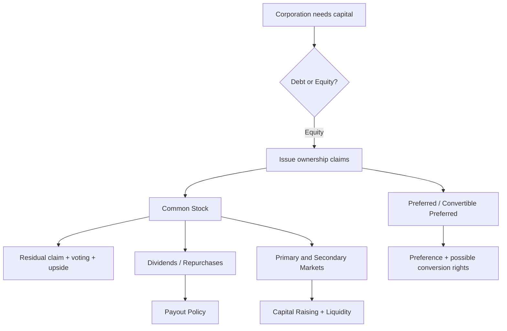
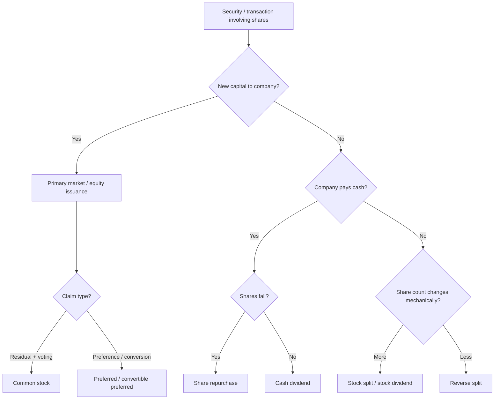

# 📘 2.1 — Equity Instruments

> [!ABSTRACT] Ringkasan Cepat
> **Topik:** Equity Instruments  
> **Bobot Parent Topic:** 20–30%  
> **Exam Priority:** High  
> **Difficulty:** Concept-Intensive  
> **Primary Skill:** Mixed — concept, comparison, issuer/investor perspective, dan calculation sederhana  
> **Ref:** Berk & DeMarzo Bab 1, 14, 17, 23; Brigham & Ehrhardt Bab 20 untuk konteks penerbitan equity.

## Section 0 — Pemetaan Silabus & Exam Scope

| Field | Isi |
|---|---|
| Topik CF4 | Topik 2 — Sekuritas dan Bentuk Lain Keuangan Korporasi |
| Subtopik | 2.1 Equity Instruments |
| Learning Outcome | Menjelaskan karakteristik berbagai jenis instrumen saham, baik dari sudut pandang penerbit maupun investor. |
| Skill Diuji | Mengidentifikasi hak pemegang saham, membedakan common dan preferred equity, memahami dividend/repurchase/split, menilai seniority dan risk, serta menjelaskan konsekuensi penerbitan equity bagi perusahaan dan investor. |
| Bobot Parent Topic | 20–30% |
| Exam Priority | High |
| Prerequisite | Corporation, ownership, debt vs equity, primary vs secondary market, dividend, liquidation, market value |
| Connected Topics | [[2.5 Capital Raising Methods]], [[3.2 Sources of Finance and Capital Structure]], [[4.3 Agency Theory and Governance]], [[5.1 Investment Asset Characteristics]] |
| Referensi | Berk & DeMarzo Bab 1, 14, 17, 23; Brigham & Ehrhardt Bab 20 sesuai chapter yang dicantumkan dalam silabus Topik 2 |

> [!IMPORTANT] Scope Boundary
> `[CORE CF4]` Fokus subtopik ini adalah **karakteristik instrumen equity dari dua sisi sekaligus: issuer dan investor**. Materi inti mencakup common stock/ordinary shares, ownership dan voting, residual claim, dividends, preferred stock dalam konteks raising equity, convertible preferred pada private firms, share repurchases, stock splits/reverse splits, serta hubungan equity dengan market value dan dilution.
>
> Detail prosedural IPO, underwriting, registration, dan flotation mechanics dibahas lebih penuh di [[2.5 Capital Raising Methods]]. Teori capital structure yang lengkap adalah wilayah [[3.2 Sources of Finance and Capital Structure]].
>
> File Brigham Topik 2 yang tersedia juga memuat Chapter 19 tentang preferred stock, warrants, dan convertibles. Namun **silabus yang diberikan hanya mencantumkan Brigham Bab 18 dan 20 untuk Topik 2**. Sesuai source-boundary rule, Chapter 19 **tidak dijadikan authority utama note ini**. Preferred equity dibahas dari Berk & DeMarzo Chapter 23 dan hubungan security claims dari Chapter 14.

---

## Section 1 — Intuisi & Big Picture

Apa masalah nyata yang ingin diselesaikan oleh **equity instruments**?

Bayangkan sebuah perusahaan membutuhkan modal untuk membangun pabrik baru. Ada dua keluarga besar pilihan:

1. **meminjam** — perusahaan menerima cash sekarang tetapi berjanji membayar interest dan principal;
2. **menjual ownership** — perusahaan menerima cash dengan memberikan sebagian claim atas perusahaan kepada investor.

Pilihan kedua adalah **equity financing**.

Secara sederhana:

```text
Investor memberikan modal
        ↓
Perusahaan menerbitkan equity claim
        ↓
Investor menjadi pemilik/residual claimant
        ↓
Return investor bergantung pada
dividend + perubahan nilai saham
```

Perbedaan terbesar terhadap debt adalah bahwa equity bukan janji pembayaran tetap yang harus dipenuhi pada tanggal tertentu. Investor equity menerima hak atas **sisa nilai** setelah seluruh kewajiban yang lebih senior dipenuhi.

Karena itulah common shareholder berada pada posisi yang tampak kontradiktif:

- ia paling belakang dalam liquidation;
- tidak memiliki fixed return;
- tetapi memperoleh upside terbesar bila perusahaan berkembang.

### Siapa yang menggunakan konsep ini?

**Perusahaan / issuer** menggunakan equity ketika ingin:

- memperoleh permanent capital;
- membiayai growth;
- mengurangi kebutuhan fixed contractual payments;
- memperluas ownership base;
- menggunakan saham sebagai acquisition currency atau employee compensation;
- membawa investor baru ke perusahaan.

**Investor** membeli equity untuk memperoleh:

- ownership exposure;
- capital appreciation;
- dividend income;
- voting/control rights pada common shares;
- special priority atau conversion rights pada jenis preferred shares tertentu.

### Keputusan apa yang dibantu?

Subtopik ini membantu menjawab pertanyaan seperti:

- Apakah instrument ini benar-benar equity atau memiliki karakter hybrid?
- Siapa yang mendapat cash flow lebih dahulu?
- Siapa yang memiliki voting rights?
- Apa yang terjadi jika perusahaan tidak membayar dividend?
- Apa beda menerima dividend dan menjual saham ke perusahaan dalam repurchase?
- Apakah menerbitkan saham baru otomatis merugikan existing shareholders?
- Apakah stock split membuat shareholder lebih kaya?
- Mengapa venture-capital investor sering meminta convertible preferred stock?

### Apa yang salah jika konsep ini disalahpahami?

Kesalahan paling umum adalah memperlakukan semua “saham” seolah identik.

Padahal:

- common dan preferred memiliki priority berbeda;
- dividend bukan contractual obligation seperti interest debt;
- share issuance menambah share count **dan** menambah assets/cash perusahaan;
- repurchase mengurangi shares outstanding sekaligus cash/equity value;
- stock split mengubah unit, bukan otomatis economic value;
- preferred stock pada mature public company dapat berbeda secara desain dari convertible preferred yang dipakai pada start-up/private financing.

> [!TIP] Mental Model Utama
> Untuk setiap equity instrument, selalu tanyakan enam hal:
>
> **Ownership → Cash-flow rights → Voting → Priority → Upside/downside → Issuer consequence**

---

## Section 2 — Definisi & Core Concepts

### Definisi Formal

> [!NOTE] Definisi Formal
> **Equity** adalah ownership interest dalam perusahaan. Dalam corporation, ownership dibagi menjadi **shares of stock**. Pemilik saham disebut **shareholder**, **stockholder**, atau **equity holder**.
>
> Common shareholders adalah residual owners: mereka menerima value setelah claims yang lebih senior dipenuhi. Preferred shareholders memiliki contractual preferences tertentu relatif terhadap common shareholders, misalnya priority terhadap distributions atau liquidation proceeds.

### 2.1 Common Stock / Ordinary Shares

Berk & DeMarzo menjelaskan bahwa ownership corporation dibagi menjadi shares yang disebut **stock**. Koleksi seluruh outstanding shares merupakan equity perusahaan.

Pemilik common stock pada umumnya memiliki:

- ownership claim;
- voting rights;
- hak atas dividend jika board mendeklarasikannya;
- residual claim pada liquidation;
- potential capital gain bila nilai firm meningkat.

Yang penting: **common shareholder tidak dijanjikan fixed dividend**.

Dividend adalah distribution yang ditentukan oleh corporation, bukan pembayaran wajib seperti interest contractual debt.

### 2.2 Residual Claim

Common equity dapat dipahami sebagai:
$$
\text{Equity Value}
=
\text{Value of Firm Assets}
-
\text{Value of Debt and Other Senior Claims}
$$
Dalam market-value balance sheet Berk & DeMarzo, sisi kanan firm dapat terdiri dari:

- short-term debt;
- long-term debt;
- convertible debt;
- preferred stock;
- common equity;
- warrants/options.

Common equity adalah claim residual setelah claims lain diperhitungkan.

#### Financial meaning

Jika asset value naik setelah debt tetap, peningkatan value terutama mengalir ke equity.

Sebaliknya, jika asset value jatuh, common equity menyerap loss terlebih dahulu sebelum debt holder kehilangan principal penuh.

Inilah alasan common equity:

- memiliki upside tinggi;
- memiliki downside tinggi;
- memerlukan required return yang lebih tinggi daripada claim yang lebih senior, all else equal.

### 2.3 Voting and Control Rights

Corporation memisahkan ownership dari day-to-day control.

Shareholders memilih **board of directors**, lalu board mengawasi management dan appoints senior executives.

Secara umum:

```text
Shareholders
    ↓ elect
Board of Directors
    ↓ delegates
Management
    ↓ operates
Corporation
```

Common shares biasanya menjadi basis voting control.

Namun ownership economic dan control rights tidak selalu identik satu-per-satu pada seluruh perusahaan. Yang harus dipahami untuk CF4 adalah:

> **Common equity biasanya membawa ownership dan voting rights; preferred equity dapat memiliki voting rights lebih terbatas atau bersyarat.**

### 2.4 Dividends

Dividend adalah cash atau asset distribution kepada shareholders.

Dalam Berk & DeMarzo Chapter 17, payout dapat dilakukan terutama melalui:

1. **cash dividends**;
2. **share repurchases**.

Cash dividend memberi cash kepada eligible shareholders.

Return investor equity secara konsep berasal dari:
$$
\text{Total Shareholder Return}
=
\text{Dividend Yield}
+
\text{Capital Gain/Loss Yield}
$$
Subtopik ini tidak memerlukan valuation formula lengkap, tetapi hubungan ekonominya penting:

> Investor common stock memperoleh return dari cash distributions dan perubahan share price.

### 2.5 Preferred Stock

Preferred stock adalah equity security yang memberikan **preference** tertentu terhadap common stock.

Dalam Berk & DeMarzo Chapter 23, preferred stock yang diterbitkan mature companies biasanya memiliki:

- preferential dividend;
- seniority atas common stock pada liquidation;
- kadang special voting rights.

Untuk young/private companies, outside investors sering menerima **convertible preferred stock**.

Jenis ini umumnya:

- lebih senior daripada common stock bila perusahaan gagal;
- dapat dikonversi menjadi common stock bila perusahaan berhasil;
- memberi investor kombinasi downside protection dan upside participation.

Intuisi:

```text
Bad outcome
   ↓
Investor ingin senior claim

Good outcome
   ↓
Investor ingin common-equity upside

Convertible preferred
   ↓
Menggabungkan keduanya
```

### 2.6 Convertible Preferred Stock

Convertible preferred memberi holder hak untuk mengubah preferred shares menjadi common shares pada kondisi tertentu.

Berk & DeMarzo menekankan penggunaannya pada private-company financing.

Dari sisi investor:

- jika firm gagal → preference/seniority membantu melindungi downside;
- jika firm sukses → conversion memungkinkan investor menikmati common-stock upside.

Dari sisi issuer:

- dapat lebih mudah menarik outside equity capital ketika uncertainty masih tinggi;
- tetapi memberikan special rights kepada investors yang dapat membuat claim existing common holders lebih junior.

### 2.7 Share Repurchase

**Share repurchase** terjadi ketika perusahaan membeli kembali sahamnya sendiri.

Berk & DeMarzo membahas beberapa bentuk:

- open-market repurchase;
- tender offer;
- Dutch auction;
- targeted repurchase.

Economic mechanics:

```text
Firm cash ↓
Shares outstanding ↓
Equity market capitalization ↓
```

Namun **share price tidak harus turun** hanya karena share count turun.

Dalam perfect-market example Berk & DeMarzo, jika repurchase dilakukan pada fair value:
$$
\text{Value per Share}
=
\frac{\text{Equity Value}}{\text{Shares Outstanding}}
$$
Jika numerator dan denominator turun secara proporsional, price per share dapat tetap.

### 2.8 Stock Dividend, Stock Split, Reverse Split

**Stock split** meningkatkan number of shares dan secara proporsional mengurangi price per share.

Contoh 2-for-1 split:

Sebelum:

- 100 shares;
- price = 40;
- portfolio value = 4,000.

Sesudah:

- 200 shares;
- theoretical price = 20;
- portfolio value = 4,000.
$$
100(40)=200(20)=4{,}000
$$
**Reverse split** melakukan kebalikan:

- shares berkurang;
- nominal price per share naik.

Core lesson:

> **Changing units is not the same as creating value.**

### 2.9 Primary vs Secondary Equity Transactions

Equity dapat diperdagangkan dalam dua konteks.

**Primary market**

Perusahaan menerbitkan new shares dan menerima cash.

```text
Investor cash
   ↓
Company
   ↓
New shares to investor
```

**Secondary market**

Investor menjual shares yang sudah ada kepada investor lain.

```text
Investor A ← cash ← Investor B
Investor A → shares → Investor B
```

Perusahaan tidak menerima cash dari ordinary secondary-market transaction.

Namun secondary market tetap penting karena:

- menciptakan liquidity;
- menyediakan market price;
- membantu price discovery;
- membuat new equity issuance lebih feasible.

### Terminologi Penting

| Istilah | Definisi | Intuisi | Exam Note |
|---|---|---|---|
| Equity | Ownership claim pada firm | Investor memiliki bagian perusahaan | Bukan fixed contractual payment |
| Common stock | Residual ownership shares | Dibayar paling akhir, menikmati upside | Biasanya voting rights |
| Ordinary shares | Istilah lain untuk common shares | Common equity | Jangan anggap berbeda hanya karena istilah |
| Shareholder | Pemilik share | Owner | Ownership ≠ day-to-day management |
| Dividend | Distribution kepada shareholder | Cash return dari ownership | Tidak sama dengan interest debt |
| Residual claim | Claim setelah senior claims | “Yang tersisa untuk owners” | Common paling junior |
| Preferred stock | Equity dengan preference terhadap common | Lebih senior dari common | Rights tergantung terms |
| Convertible preferred | Preferred yang dapat menjadi common | Protection + upside | Umum dalam private financing |
| Share repurchase | Firm membeli shares sendiri | Cash keluar, shares turun | Tidak otomatis menaikkan value |
| Stock split | Menambah units/shares | Satu pizza dipotong lebih banyak | Value total tidak otomatis berubah |
| Reverse split | Mengurangi units/shares | Potongan digabung | Nominal price naik |
| Primary market | New securities dijual oleh issuer | Capital raising | Cash masuk perusahaan |
| Secondary market | Existing securities diperdagangkan | Ownership berpindah antar investors | Cash tidak masuk issuer |
| Market capitalization | Share price × shares outstanding | Market value common equity | Dapat berubah karena price atau share count |
| Dilution | Penurunan ownership/EPS per existing share akibat new claims/shares | Pie dibagi ke lebih banyak claim | Tidak sama dengan automatic value destruction |

---

### Core Relationships

#### Relationship 1 — Equity sebagai residual claim
$$
E = V_A - D - \text{Other Senior Claims}
$$
dengan:

- $E$ = market value common equity;
- $V_A$ = market value assets;
- $D$ = debt;
- senior claims dapat mencakup preferred atau securities lain sesuai structure.

Financial meaning:

> Common shareholders hanya memiliki bagian residual dari asset value.

---

#### Relationship 2 — Market capitalization
$$
\text{Market Capitalization}
=
P_0 \times N
$$
dengan:

- $P_0$ = current share price;
- $N$ = shares outstanding.

Market cap adalah market value common equity, bukan total enterprise value.

---

#### Relationship 3 — Ownership percentage
$$
\text{Ownership \%}
=
\frac{\text{Shares Owned}}
{\text{Total Shares Outstanding}}
$$
Jika investor memiliki 100,000 shares dari 1,000,000:
$$
\text{Ownership}=10\%
$$
Jika perusahaan menerbitkan 250,000 new shares dan investor tidak membeli tambahan:
$$
\text{New Ownership}
=
\frac{100{,}000}{1{,}250{,}000}
=
8\%
$$
Ownership percentage terdilusi dari 10% menjadi 8%.

Tetapi ini **belum** membuktikan economic wealth investor turun karena perusahaan menerima cash/assets dari new issuance.

---

#### Relationship 4 — Payout mechanics

Untuk dividend $d$ per share pada perfect market:
$$
P_{\text{ex}}
\approx
P_{\text{cum}}-d
$$
Economic intuition:

Firm membayar cash keluar sebesar dividend, sehingga firm value per share turun sebesar cash yang didistribusikan, all else equal.

Dalam dunia nyata, taxes, information, market frictions, dan expectations dapat membuat observed price change berbeda.

---

## Section 3 — How It Works

### 3.1 Securities Framework

Gunakan framework berikut untuk membaca instrumen equity:

```text
Security
↓
Cash-flow rights
↓
Risk
↓
Return
↓
Issuer impact
↓
Investor impact
```

### Common Stock

```text
Common share
↓
Residual dividend / residual asset claim
↓
Highest junior-claim risk
↓
Potentially high upside
↓
No mandatory maturity or principal repayment
↓
Ownership + voting + upside for investor
```

### Preferred Stock

```text
Preferred share
↓
Preferential distribution / liquidation rights
↓
Risk below common but above more senior debt-like claims
↓
Return structured by preferred terms
↓
Provides equity capital with special rights
↓
Investor gains priority over common
```

### Convertible Preferred

```text
Convertible preferred
↓
Preferred downside protection
+
Option to convert
↓
Seniority if bad outcome
+
Common upside if good outcome
↓
Useful for high-uncertainty private financing
```

---

### 3.2 Issuing New Common Equity

Assume a company has:

- assets worth 100 million;
- no debt;
- 10 million shares;
- price = 10.

Initial:
$$
E=100
$$
million.

Now company issues 2 million new shares at fair price 10.

Cash raised:
$$
2(10)=20
$$
million.

New assets:
$$
100+20=120
$$
million.

New share count:
$$
10+2=12
$$
million.

If issuance is fairly priced and has no other value effects:
$$
P
=
\frac{120}{12}
=
10
$$
So existing shareholder's percentage ownership falls, tetapi value per share tidak harus turun.

> [!TIP] Cara Berpikir
> Jangan melihat **denominator (share count)** saja.
>
> Saat new shares diterbitkan, selalu tanyakan:
>
> **“Apa yang diterima perusahaan sebagai imbalan?”**
>
> Jika firm menerima fair-value cash/assets, lebih banyak shares juga disertai lebih banyak firm assets.

---

### 3.3 Share Repurchase

Gunakan Berk & DeMarzo leveraged recapitalization sebagai mental model.

Misalkan:

- 50 juta shares;
- price = 4;
- equity value = 200 juta.

Perusahaan meminjam 80 juta lalu menggunakan cash untuk repurchase.

Shares repurchased:
$$
\frac{80}{4}=20
$$
juta.

Remaining shares:
$$
50-20=30
$$
juta.

Setelah payout, common equity value menjadi:
$$
200-80=120
$$
juta.

Price per share:
$$
\frac{120}{30}=4
$$
Price tetap 4 dalam benchmark perfect market.

Pelajaran:

> Repurchase dapat mengurangi total equity value dan jumlah shares secara bersamaan tanpa mengubah price per share.

---

### 3.4 Dividend vs Repurchase

Pada perfect capital markets dengan investment policy tetap, Berk & DeMarzo menggunakan MM logic:

> **Payout packaging sendiri tidak menciptakan value.**

Dividend:

- cash turun;
- shares tetap;
- price per share menyesuaikan ke bawah.

Repurchase:

- cash turun;
- shares turun;
- price remaining shares dapat tetap.

Investor dapat menciptakan cash pattern sendiri melalui trading.

Namun di dunia nyata payout method dapat matter karena:

- taxes;
- transaction costs;
- agency problems;
- future financing needs;
- information/signaling.

---

### 3.5 Why Preferred Stock Exists in Private Financing

Young company sering memiliki:

- uncertain cash flow;
- substantial information asymmetry;
- founders/common employees sebagai junior owners;
- outside investor yang meminta downside protection.

Convertible preferred menyelesaikan tension:

```text
Investor tidak mau hanya common
karena downside terlalu besar
        ↓
Issuer tidak ingin fixed debt obligation
        ↓
Preferred seniority +
common conversion upside
        ↓
Convertible preferred financing
```

---

> [!DANGER] Jangan Salah Pikir
> 1. **“Equity = no risk.”** Salah. Equity adalah residual claim dan biasanya paling exposed ke business risk.
> 2. **“Dividend selalu wajib dibayar.”** Salah. Common dividend bergantung pada board/payout policy dan bukan fixed debt obligation.
> 3. **“New shares pasti menghancurkan value.”** Salah. Share count bertambah, tetapi issuer menerima financing/assets. Economic dilution perlu dianalisis, bukan diasumsikan.
> 4. **“Preferred = debt.”** Tidak otomatis. Preferred tetap equity dalam banyak structures, meskipun memiliki debt-like preferences.
> 5. **“Stock split membuat investor dua kali lebih kaya.”** Salah. Shares bertambah tetapi price per share menyesuaikan.
> 6. **“Secondary-market stock purchase membiayai perusahaan.”** Salah. Cash umumnya berpindah antar investors.

---

## Section 4 — Worked Examples & Exam Cases

### Case A — Fundamental

**Soal**

PT Alpha memiliki:

- 2,000,000 common shares outstanding;
- seorang investor memiliki 100,000 shares;
- tidak ada preferred shares.

Perusahaan menerbitkan 500,000 new common shares kepada investor baru. Existing investor tidak berpartisipasi.

1. Berapa ownership percentage investor sebelum issuance?
2. Berapa setelah issuance?
3. Apakah penurunan ownership percentage otomatis berarti value investasi investor turun?

> [!SUCCESS] Pembahasan
>
> **1. Identifikasi informasi**
>
> Initial shares = 2,000,000  
> Investor shares = 100,000  
> New shares = 500,000
>
> **2. Konsep yang diuji**
>
> Ownership dilution vs economic value dilution.
>
> **3. Reasoning**
>
> Ownership percentage bergantung pada shares owned relatif terhadap total shares.
>
> **4. Calculation**
>
> Sebelum:
>
> $$
> \frac{100{,}000}{2{,}000{,}000}=5\%
> $$
>
> Setelah:
>
> $$
> \frac{100{,}000}{2{,}500{,}000}=4\%
> $$
>
> **5. Interpretation**
>
> Voting/ownership stake investor turun dari 5% menjadi 4%.
>
> Namun value investasi tidak otomatis turun. Jika new shares dijual pada fair value, perusahaan menerima additional assets/cash. Economic wealth existing shareholder harus dianalisis berdasarkan **value received vs claims issued**, bukan share count saja.
>
> **6. Verification**
>
> Share count memang naik 25%, sedangkan investor share count tetap. Karena itu ownership percentage harus turun.

> [!WARNING] Exam Trap — Case A
> - **Trap:** Menjawab “investor rugi 20%” hanya karena ownership turun dari 5% ke 4%.
> - **Mengapa distractor terlihat benar:** Persentase ownership memang turun 20% secara relatif.
> - **Cara menghindari:** Pisahkan **ownership dilution** dari **economic-value dilution**.
> - **Target waktu:** 45–60 detik.

---

### Case B — Exam-Typical

**Soal**

Manakah pernyataan yang paling tepat?

A. Common shareholders memiliki claim atas assets sebelum bondholders.  
B. Preferred shareholders selalu memiliki voting control lebih besar daripada common shareholders.  
C. Preferred shareholders dapat memiliki priority atas common shareholders untuk distributions atau liquidation proceeds.  
D. Tidak dibayarnya common dividend otomatis menyebabkan bankruptcy.  
E. Stock split meningkatkan total intrinsic value perusahaan secara mekanis.

> [!SUCCESS] Pembahasan
>
> **1. Identifikasi informasi**
>
> Soal menguji hierarchy of claims dan basic equity rights.
>
> **2. Konsep yang diuji**
>
> Common vs preferred.
>
> **3. Reasoning**
>
> - Common adalah residual claim → A salah.
> - Preferred rights tergantung terms; tidak selalu memiliki voting control → B salah.
> - Preferred memang dapat memiliki preference atas dividend/liquidation → C benar.
> - Common dividend bukan contractual debt payment → D salah.
> - Split mengubah unit/share count, bukan intrinsic value secara mekanis → E salah.
>
> **4. Calculation**
>
> Tidak diperlukan.
>
> **5. Interpretation**
>
> Jawaban benar: **C**.
>
> **6. Verification**
>
> Semua distractor lain menggunakan kata absolut seperti “selalu”, “otomatis”, atau membalik claim priority.

> [!WARNING] Exam Trap — Case B
> - **Trap:** Menganggap “preferred” berarti selalu punya control rights lebih tinggi.
> - **Mengapa distractor terlihat benar:** Kata “preferred” terdengar seperti “lebih kuat dalam segala aspek”.
> - **Cara menghindari:** Preference biasanya berkaitan dengan **economic claims**, bukan otomatis voting dominance.
> - **Target waktu:** 30–45 detik.

---

### Case C — Challenging / Integrated

**Soal**

PT Beta memiliki 20 juta shares outstanding pada harga Rp5,000 per share dan tidak memiliki debt. Perusahaan menerbitkan 5 juta new shares pada fair market price Rp5,000 dan menyimpan seluruh proceeds sebagai cash.

1. Hitung initial market capitalization.
2. Hitung cash yang diterima.
3. Dengan asumsi perfect market dan tidak ada information effect, berapa total equity value setelah issuance?
4. Berapa theoretical share price setelah issuance?
5. Jelaskan mengapa “share count naik 25%, jadi harga harus turun 25%” adalah reasoning yang salah.

> [!SUCCESS] Pembahasan
>
> **1. Identifikasi informasi**
>
> $$
> N_0=20\text{ juta}, \quad P_0=5{,}000
> $$
>
> New shares:
>
> $$
> \Delta N=5\text{ juta}
> $$
>
> **2. Konsep yang diuji**
>
> Fair-value equity issuance dan dilution.
>
> **3. Reasoning**
>
> Issuance menambah claims tetapi juga menambah corporate assets berupa cash.
>
> **4. Calculation**
>
> Initial market cap:
>
> $$
> 20{,}000{,}000 \times 5{,}000
> =
> Rp100\text{ miliar}
> $$
>
> Cash raised:
>
> $$
> 5{,}000{,}000 \times 5{,}000
> =
> Rp25\text{ miliar}
> $$
>
> New equity value:
>
> $$
> 100+25
> =
> Rp125\text{ miliar}
> $$
>
> New shares:
>
> $$
> 20+5=25\text{ juta}
> $$
>
> Theoretical price:
>
> $$
> \frac{Rp125\text{ miliar}}{25\text{ juta}}
> =
> Rp5{,}000
> $$
>
> **5. Interpretation**
>
> Share count naik, tetapi assets firm juga naik dengan jumlah fair-value proceeds. Tidak ada mechanical reason price harus turun.
>
> **6. Verification**
>
> Investor baru membayar Rp5,000 untuk claim seharga Rp5,000. Tidak ada wealth transfer dalam benchmark fair-value issuance.

> [!WARNING] Exam Trap — Case C
> - **Trap:** Menggunakan hanya perubahan denominator.
> - **Mengapa distractor terlihat benar:** Lebih banyak shares tampak seperti “pie dibagi lebih banyak”.
> - **Cara menghindari:** Ingat bahwa issuance **memperbesar pie** melalui cash raised.
> - **Target waktu:** 90 detik.

---

### Case D — Preferred in a Private Company

**Soal**

Sebuah start-up ingin memperoleh modal dari venture investor. Founder memiliki common shares. Investor meminta convertible preferred shares dengan seniority atas common dalam liquidation.

Mengapa structure tersebut masuk akal bagi investor?

> [!SUCCESS] Pembahasan
>
> **1. Identifikasi informasi**
>
> Private firm, high uncertainty, founder common, outside investor preferred + conversion.
>
> **2. Konsep yang diuji**
>
> Convertible preferred.
>
> **3. Reasoning**
>
> Investor menghadapi asymmetric payoff:
>
> - jika business gagal, seniority mengurangi downside relatif terhadap common;
> - jika business sukses, investor dapat convert menjadi common untuk menikmati upside.
>
> **4. Calculation**
>
> Tidak diperlukan.
>
> **5. Interpretation**
>
> Instrument menggabungkan preference dengan equity upside.
>
> **6. Verification**
>
> Jika instrument hanya common, downside protection lebih lemah. Jika debt murni, start-up harus menghadapi fixed payment obligations yang mungkin sulit dipenuhi.

> [!WARNING] Exam Trap — Case D
> - **Trap:** Menganggap preferred selalu dipilih karena regular dividend.
> - **Mengapa distractor terlihat benar:** Mature preferred stock sering diasosiasikan dengan preferential dividend.
> - **Cara menghindari:** Pada young firms dalam Berk & DeMarzo, convertible preferred sering **tidak membayar regular cash dividend**; value utamanya dapat berasal dari seniority + conversion right.
> - **Target waktu:** 45–60 detik.

---

## Section 5 — Interpretation & Sanity Check

> [!CHECK] Sanity Check
> 1. **Claim hierarchy check:** common seharusnya tidak menjadi lebih senior daripada debt/preferred hanya karena namanya “equity”.
> 2. **Cash-flow check:** jika perusahaan membayar dividend atau repurchase, cash perusahaan harus berkurang.
> 3. **Share-count check:** issuance menaikkan shares outstanding; repurchase menurunkannya; split mengubah units secara proporsional.
> 4. **Value conservation check:** pada fair-value security exchange dalam perfect market, issuing securities sendiri tidak menciptakan value dari udara.
> 5. **Primary/secondary check:** jika transaksi hanya antar investors, perusahaan biasanya tidak menerima proceeds.
> 6. **Preferred-rights check:** jangan menambahkan rights yang tidak disebut terms; preferred tidak identik di semua issuances.

### Interpretation Ladder

> **Level 1 — Number**  
> Berapa ownership %, market cap, shares outstanding, atau payout?
>
> **Level 2 — Direction**  
> Shares naik atau turun? Cash firm naik atau turun? Priority lebih senior atau junior?
>
> **Level 3 — Meaning**  
> Apa artinya bagi control, risk, dan claim investor?
>
> **Level 4 — Cause**  
> Apakah perubahan berasal dari issuance, payout, reclassification, atau actual economic performance?
>
> **Level 5 — Limitation**  
> Apakah conclusion bergantung pada fair pricing, perfect-market assumption, terms of security, taxes, atau information effects?

---

## Section 6 — Connections & Mental Model



### Hubungan Konsep

#### Dengan [[2.5 Capital Raising Methods]]

2.1 menjawab:

> **Apa instrument equity-nya?**

2.5 menjawab:

> **Bagaimana perusahaan menerbitkan dan menjual instrument tersebut?**

Contoh:

- common shares → instrument;
- IPO / seasoned equity offering / private placement → raising method.

#### Dengan [[3.2 Sources of Finance and Capital Structure]]

Equity adalah salah satu financing source bersama debt.

Topik 3.2 memperluas pertanyaan menjadi:

- berapa debt vs equity?
- apa effect terhadap risk?
- bagaimana taxes, distress, agency, dan information memengaruhi choice?

#### Dengan [[4.3 Agency Theory and Governance]]

Voting rights menghubungkan equity ownership dengan governance:

```text
Ownership
↓
Voting
↓
Board
↓
Management oversight
```

Namun dispersed shareholders dapat menghadapi agency problem karena management memiliki day-to-day control.

#### Dengan [[5.1 Investment Asset Characteristics]]

Bagi investor, equity adalah investment asset dengan:

- uncertain cash flows;
- no fixed maturity untuk common shares;
- dividend + capital gains sebagai return;
- residual risk;
- market liquidity tergantung listing/market structure.

---

## Section 7 — Exam Traps & Misconceptions

### Definition Trap

> [!BUG] Definition Trap
>
> **Common stock ≠ preferred stock**
>
> Common = residual ownership claim.  
> Preferred = equity claim dengan contractual preferences tertentu terhadap common.
>
> **Primary market ≠ secondary market**
>
> Primary = issuer menjual new securities dan memperoleh capital.  
> Secondary = existing securities berpindah antar investors.
>
> **Stock split ≠ share issuance for cash**
>
> Split mengubah number of units tanpa new financing.  
> New issuance membawa new investors/cash ke firm.

---

### Financial Logic Trap

> [!BUG] Logic Trap
>
> **Ownership dilution ≠ automatic value destruction**
>
> New shares mengurangi percentage ownership existing holders bila mereka tidak ikut membeli, tetapi firm juga menerima assets/proceeds.
>
> **Dividend ≠ interest**
>
> Dividend common bukan fixed contractual debt payment.
>
> **Preferred ≠ always debt**
>
> Preferred memiliki features yang dapat menyerupai debt tetapi tetap merupakan equity instrument dalam structure yang dibahas.
>
> **Lower share count ≠ higher firm value**
>
> Repurchase dapat mengurangi share count sekaligus mengurangi cash/assets.

---

### Calculation Trap

> [!BUG] Calculation Trap

#### Salah — menghitung post-issuance price dengan market cap lama saja

Misal:

- old equity value = 100;
- old shares = 10;
- issue 2 new shares at 10.

**Salah**
$$
P_{\text{new}}
=
\frac{100}{12}
=
8.33
$$
Kesalahan: mengabaikan cash 20 yang diterima company.

**Benar**
$$
P_{\text{new}}
=
\frac{100+20}{12}
=
10
$$
---

#### Salah — repurchase dianggap otomatis menaikkan price

Jika firm value common turun proporsional dengan cash payout:

**Salah**
$$
P_{\text{after}}
=
\frac{\text{Old Equity Value}}{\text{Fewer Shares}}
$$
karena numerator juga berubah.

**Benar**
$$
P_{\text{after}}
=
\frac{\text{Old Equity Value}-\text{Cash Paid}}
{\text{Old Shares}-\text{Shares Repurchased}}
$$
---

### Interpretation Trap

> [!BUG] Interpretation Trap
>
> **“Preferred lebih aman, berarti return-nya pasti lebih tinggi.”**
>
> Salah secara logic. Security yang lebih senior umumnya menanggung downside lebih rendah daripada common, sehingga required return dapat lebih rendah, all else equal.
>
> **“Stock split menaikkan price karena perusahaan menunjukkan confidence.”**
>
> Textbook dapat membahas signaling/market reactions dalam real world, tetapi mechanical effect split sendiri hanyalah perubahan units. Jangan mencampur mechanical effect dengan information effect.
>
> **“Repurchase selalu good news.”**
>
> Tidak otomatis. Repurchase dapat signal undervaluation, tetapi value effect tergantung price paid, financing, taxes, opportunity cost, dan information.

---

### Red Flags

> [!CAUTION] Red Flags

| Keyword / Condition | Apa yang Harus Dipikirkan |
|---|---|
| "common shareholder" | Residual claim, voting, upside/downside |
| "preferred" | Preference atas common; cek dividend/liquidation/conversion terms |
| "convertible preferred" | Seniority + possible common upside |
| "new shares issued" | Shares naik **dan** cash/assets issuer naik |
| "secondary market" | Trade antar investors, bukan capital raised oleh issuer |
| "dividend" | Cash keluar dari firm; bukan interest obligation |
| "share repurchase" | Cash turun, shares outstanding turun |
| "stock split" | Unit change, bukan automatic value creation |
| "reverse split" | Fewer shares, higher nominal price |
| "dilution" | Tentukan apakah yang dimaksud ownership, EPS, voting, atau economic value |
| "liquidation" | Urutkan claims berdasarkan seniority |
| "venture / private company" | Convertible preferred dapat menjadi key equity instrument |

---

## Section 8 — Executive Summary

### Must Remember

> [!SUMMARY] Must Remember
> 1. `[CORE CF4]` **Common stock adalah residual ownership claim**: common shareholder menikmati upside tetapi berada paling belakang terhadap senior claims.
> 2. Common shareholders biasanya memiliki **voting rights** untuk memilih board, tetapi ownership dan management tetap terpisah.
> 3. **Dividend bukan interest.** Common dividend tidak memiliki fixed contractual payment requirement seperti debt.
> 4. **Preferred stock** memberi preference tertentu terhadap common, terutama distributions/liquidation; rights exact bergantung terms.
> 5. Dalam private/start-up financing, Berk & DeMarzo menekankan **convertible preferred**: downside protection melalui seniority + upside melalui conversion.
> 6. **Primary market** memberikan new capital kepada issuer; **secondary market** memindahkan ownership antar investors.
> 7. New equity issuance dapat menurunkan ownership percentage existing shareholder tetapi **tidak otomatis menghancurkan value** jika securities dijual pada fair value.
> 8. **Share repurchase** mengurangi firm cash dan shares outstanding; price per remaining share tidak otomatis naik.
> 9. **Stock split/reverse split** pada dasarnya mengubah units; bukan mechanical value creation.
> 10. Untuk setiap equity security, selalu lihat **cash-flow rights, voting, priority, risk, return, issuer effect, investor effect**.

---

### Comparison Table — Common vs Preferred

| Feature | Common Stock | Preferred Stock |
|---|---|---|
| Ownership/claim | Residual ownership | Equity claim dengan preferences |
| Cash flow | Dividend discretionary / residual | Preferential distribution sesuai terms |
| Maturity | Umumnya tidak ada fixed maturity | Tergantung terms |
| Voting rights | Biasanya ada | Dapat terbatas / khusus / bersyarat |
| Priority | Junior | Senior terhadap common |
| Liquidation | Dibayar setelah senior claims | Dibayar sebelum common sesuai preference |
| Upside | Tinggi / residual | Biasanya lebih terbatas kecuali convertible/participating features |
| Downside | Paling exposed | Lebih protected daripada common |
| Issuer perspective | Permanent capital, no principal maturity, tetapi ownership/control dilution | Equity capital dengan special rights; dapat menarik investor tertentu |
| Investor perspective | Growth/upside + voting, tetapi residual risk | Priority/protection, tetapi rights tergantung instrument |
| Key exam trap | Dilution ≠ automatic wealth loss | Preferred ≠ automatically debt |

---

### Comparison Table — Dividend vs Repurchase

| Feature | Cash Dividend | Share Repurchase |
|---|---|---|
| Cash leaves firm | Ya | Ya |
| Shares outstanding | Tetap | Turun |
| Who receives cash | Eligible shareholders | Shareholders yang menjual |
| Mechanical perfect-market effect | Price ex-dividend turun sekitar dividend | Equity value & shares turun; price dapat tetap |
| Flexibility | Regular dividend cenderung sticky | Umumnya lebih flexible |
| Information possibility | Dividend changes dapat signal prospects | Repurchase dapat signal undervaluation |
| Value creation by packaging alone | Tidak dalam perfect market | Tidak dalam perfect market |

---

### Trigger Keywords

| Jika soal mengatakan... | Pikirkan... |
|---|---|
| "residual owner" | Common shareholder |
| "senior to common" | Preferred or other senior claim |
| "vote for directors" | Common equity / shareholder control |
| "cash distribution" | Dividend or repurchase |
| "buys back its own shares" | Share repurchase |
| "two shares for every one share" | Stock split |
| "fewer shares, higher nominal price" | Reverse split |
| "issuer receives proceeds" | Primary market |
| "investor sells to another investor" | Secondary market |
| "outside investor in young private firm" | Preferred / convertible preferred |
| "ownership falls after issue" | Ownership dilution; assess economic value separately |

---

### Kapan Digunakan

Gunakan framework equity instruments ketika soal meminta:

- identify rights pemegang security;
- compare common vs preferred;
- analyze issuer vs investor perspective;
- determine liquidation priority;
- evaluate ownership dilution;
- explain dividend/repurchase;
- explain primary vs secondary equity;
- distinguish split from issuance;
- interpret private-company convertible preferred financing.

### Kapan TIDAK Boleh Digunakan

Jangan gunakan conclusion sederhana equity-instrument framework untuk:

- menentukan optimal debt-equity ratio → gunakan [[3.2 Sources of Finance and Capital Structure]];
- menghitung detailed IPO proceeds/underpricing → gunakan [[2.5 Capital Raising Methods]];
- menilai long-term debt covenant/yield structure → gunakan [[2.2 Long-Term Debt Instruments]];
- menganalisis options/warrants sebagai derivatives secara penuh → gunakan [[2.4 Derivative Securities in Corporate Finance]];
- menyimpulkan stock split atau repurchase pasti menciptakan value tanpa mempertimbangkan information, taxes, transaction costs, atau pricing.

---

### Quick Decision Tree



---

## Section 9 — Active Recall Check

1. Mengapa common shareholder disebut **residual claimant**?
2. Apa perbedaan paling penting antara common dividend dan interest payment pada debt?
3. Dari sisi investor, apa keuntungan dan kerugian common stock dibanding preferred stock?
4. Mengapa preferred stock pada young private company sering dibuat convertible?
5. Jika perusahaan menerbitkan new shares dan existing shareholder tidak ikut membeli, apa yang terjadi pada ownership percentage-nya?
6. Mengapa penurunan ownership percentage tidak otomatis berarti economic loss?
7. Apa perbedaan primary market dan secondary market dari sudut pandang cash flow perusahaan?
8. Jika perusahaan melakukan 2-for-1 stock split, apa yang seharusnya terjadi secara mekanis pada share count dan price per share?
9. Mengapa share repurchase tidak otomatis menaikkan price per share?
10. Dalam liquidation, mengapa common equity lebih berisiko daripada preferred equity?
11. Sebutkan enam pertanyaan mental yang harus dipakai untuk menganalisis setiap equity instrument.
12. Apa beda **ownership dilution**, **EPS dilution**, dan **value dilution** secara konsep?
13. Mengapa voting rights relevan dengan agency theory dan corporate governance?
14. Jika preferred security mempunyai conversion right, apa payoff logic investor pada bad vs good outcome?
15. Apakah membeli saham perusahaan di bursa sekunder secara langsung menambah cash perusahaan? Jelaskan.

---

## Section 10 — Exam Pattern Map

| Narasi Soal | Keyword | Konsep | Formula/Rule | Langkah | Trap | Shortcut |
|---|---|---|---|---|---|---|
| Investor memiliki sekian shares, firm issue new shares | "new shares", "ownership" | Ownership dilution | $\text{Ownership \%}=\frac{\text{owned}}{\text{outstanding}}$ | Hitung before → new total → after | Menyamakan ownership dilution dengan wealth loss | Hitung percentage dulu, lalu tanyakan proceeds |
| Security mendapat priority sebelum common saat liquidation | "priority", "liquidation" | Preferred equity | Senior to common | Urutkan claims | Menganggap preferred selalu voting-dominant | “Preferred” = preference claim, bukan universal control |
| Perusahaan membayar cash dan mengurangi shares | "repurchase", "buyback" | Share repurchase | $P=\frac{E}{N}$ | Kurangi cash/equity dan shares | Menganggap fewer shares pasti price naik | Numerator dan denominator sama-sama berubah |
| Perusahaan membagi 2 shares untuk 1 | "2-for-1", "split" | Stock split | Total value unchanged mechanically | Shares ×2, theoretical price ÷2 | Menganggap shareholder wealth ×2 | Unit change only |
| Investor membeli existing stock di exchange | "secondary market" | Secondary-market trade | Issuer receives no new proceeds | Identifikasi seller/buyer | Menganggap company mendapat cash | Follow the cash |
| Start-up menjual preferred yang dapat menjadi common | "convertible preferred", "venture" | Private equity instrument | Downside protection + upside conversion | Analyze bad/good state | Fokus hanya dividend | Seniority when bad; conversion when good |
| New shares issued at fair value | "issue equity", "fair price" | Equity issuance | New equity value = old value + proceeds | Tambah cash dan shares | Denominator-only dilution | Shares ↑, assets ↑ |
| Dividend vs repurchase | "payout", "cash to shareholders" | Payout mechanics | Perfect-market packaging irrelevance | Track cash and share count | Mengklaim satu metode selalu creates value | Track economic pie, not labels |

`[TEXTBOOK-BASED EXPECTATION]` Pola di atas diturunkan dari distinctions dan mechanics yang secara langsung ditekankan oleh Berk & DeMarzo dan Brigham dalam chapter yang berada dalam scope Topik 2. Note ini tidak menggunakan label `[PAST EXAM EVIDENCE]` karena past exam tidak disediakan sebagai source untuk permintaan ini.

---

## Source Traceability

| Materi | Sumber |
|---|---|
| Corporation ownership divided into shares; shareholder rights; transferability; ownership vs control | Berk & DeMarzo, Chapter 1 |
| Common equity as residual claim / market value balance sheet | Berk & DeMarzo, Chapter 14 |
| Fair-value issuance logic dan dilution fallacy | Berk & DeMarzo, Chapter 14 |
| Share repurchase mechanics; leveraged recapitalization illustration | Berk & DeMarzo, Chapter 14 |
| Dividends, repurchases, MM payout benchmark, signaling | Berk & DeMarzo, Chapter 17 |
| Stock splits, reverse splits, stock dividends | Berk & DeMarzo, Chapter 17 |
| Preferred stock used by outside investors in private companies | Berk & DeMarzo, Chapter 23 |
| Mature-company preferred characteristics: preferential dividend / seniority / possible special voting rights | Berk & DeMarzo, Chapter 23 |
| Convertible preferred used in young companies; seniority plus conversion upside | Berk & DeMarzo, Chapter 23 |
| IPO/public equity issuance context; company vs selling shareholders; investment-banking context | Brigham & Ehrhardt, Chapter 20 |
| Chapter 19 preferred/warrant/convertible discussion in uploaded Brigham file | **Not used as primary authority because Chapter 19 is not listed in the supplied Topik 2 syllabus reference map** |

---

## Final Mental Model

```text
EQUITY = OWNERSHIP CLAIM
        ↓
What rights does this claim have?
        ↓
┌─────────────────────────────────────┐
│ Cash flow                           │
│ Voting                              │
│ Priority                            │
│ Conversion / special features      │
│ Risk and upside                     │
└─────────────────────────────────────┘
        ↓
Then ask from TWO SIDES
        ↓
Issuer                         Investor
------                         --------
Capital raised                 Return potential
No fixed principal maturity    Residual / preferred claim
Ownership dilution             Voting / control
Payout flexibility             Dividend / capital gain
Governance implications        Downside + upside
        ↓
Never judge from share count alone
        ↓
Track CASH + CLAIMS + RIGHTS + VALUE
```
