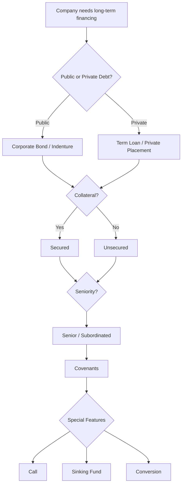
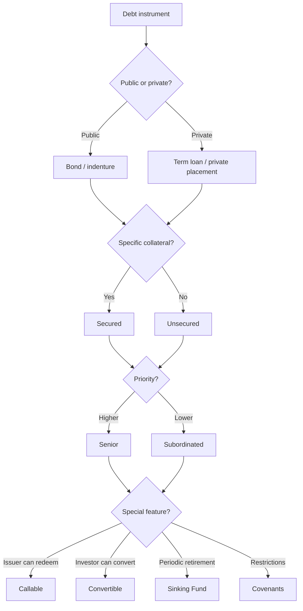

# 📘 2.2 — Long-Term Debt Instruments

> [!ABSTRACT] Ringkasan Cepat
> **Topik:** Long-Term Debt Instruments  
> **Bobot Parent Topic:** 20–30%  
> **Exam Priority:** High  
> **Difficulty:** Mixed  
> **Primary Skill:** Mixed — classification, issuer/investor perspective, risk-return, repayment mechanics, dan calculation sederhana  
> **Ref:** Berk & DeMarzo Bab 14 & 24; Brigham & Ehrhardt Bab 20 §§20.5, 20.8–20.10; Bab 18 sebagai supporting context untuk lease financing.

## Section 0 — Pemetaan Silabus & Exam Scope

| Field | Isi |
|---|---|
| Topik CF4 | Topik 2 — Sekuritas dan Bentuk Lain Keuangan Korporasi |
| Subtopik | 2.2 Long-Term Debt Instruments |
| Learning Outcome | Menjelaskan karakteristik berbagai jenis instrumen surat utang jangka panjang, baik dari sudut pandang penerbit maupun investor. |
| Skill Diuji | Mengidentifikasi public/private debt, secured/unsecured debt, seniority, covenants, callable/convertible provisions, sinking funds, maturity structure, serta menjelaskan konsekuensi risk-return bagi issuer dan investor. |
| Bobot Parent Topic | 20–30% |
| Exam Priority | High |
| Prerequisite | Debt vs equity, fixed contractual payments, default, bankruptcy, interest rate/yield, market value |
| Connected Topics | [[2.1 Equity Instruments]], [[2.3 Short and Medium-Term Finance]], [[2.4 Derivative Securities in Corporate Finance]], [[2.5 Capital Raising Methods]], [[3.2 Sources of Finance and Capital Structure]], [[5.1 Investment Asset Characteristics]] |
| Referensi | Berk & DeMarzo Bab 14 & 24; Brigham & Ehrhardt Bab 20 §§20.5, 20.8–20.10; Bab 18 untuk lease financing sebagai debt-like long-term financing context |

> [!IMPORTANT] Scope Boundary
> `[CORE CF4]` Fokus subtopik ini adalah **karakteristik instrumen debt jangka panjang**, terutama corporate bonds dan private long-term debt, dilihat dari:
>
> **cash-flow obligation → collateral → seniority → covenant → maturity → repayment provision → investor risk → issuer flexibility.**
>
> Berk & DeMarzo Chapter 24 adalah sumber paling langsung untuk klasifikasi corporate debt, indenture, notes/debentures, mortgage/asset-backed bonds, senior/subordinated debt, term loans/private placements, covenants, call provisions, sinking funds, dan convertible bonds.
>
> Brigham Chapter 20 memperluasnya dengan **debt maturity management, bond refunding, dan project financing**.
>
> `[SUPPORTING CONTEXT]` Brigham Chapter 18 membahas lease financing. Lease dapat memiliki economic characteristics yang debt-like, khususnya financial/capital lease, tetapi lease bukan fokus utama klasifikasi **bond/debt security** pada note 2.2.
>
> `[BEYOND CF4]` Detail government securities, municipal tax law, agency-specific MBS rules, struktur CMO/CDO yang sangat teknis, serta regulatory terminology yang tidak diperlukan untuk memahami long-term corporate debt tidak dijadikan materi inti.

---

## Section 1 — Intuisi & Big Picture

Apa masalah nyata yang ingin diselesaikan oleh long-term debt?

Bayangkan perusahaan ingin membangun pabrik yang akan dipakai selama 20 tahun. Perusahaan membutuhkan dana sekarang, tetapi tidak ingin menjual ownership kepada investor baru.

Solusinya:

> **pinjam modal sekarang dan berjanji melakukan pembayaran kepada creditor di masa depan.**

Secara sederhana:

```text
Investor / lender memberikan cash
            ↓
Company menerbitkan debt claim
            ↓
Company berjanji:
interest + repayment of principal
            ↓
Debt holder memperoleh priority
atas common shareholders
```

Tetapi “utang jangka panjang” bukan satu produk yang identik.

Dua bonds dengan face value dan coupon sama dapat memiliki risk berbeda karena:

- satu secured, satu unsecured;
- satu senior, satu subordinated;
- satu callable, satu non-callable;
- satu mempunyai sinking fund;
- satu convertible menjadi saham;
- covenant-nya berbeda;
- maturity-nya berbeda;
- satu public bond, satu private loan.

Karena itu exam-writer dapat membuat soal bukan dengan meminta definisi “bond”, tetapi dengan bertanya:

> **Siapa yang paling terlindungi? Siapa yang menanggung option? Mengapa yield berbeda? Apa yang terjadi saat default?**

### Dari sisi issuer

Perusahaan menyukai debt karena dapat:

- memperoleh capital tanpa langsung memberikan voting ownership;
- memilih maturity sesuai kebutuhan financing;
- memilih public atau private borrowing;
- memberi collateral agar borrowing terms lebih baik;
- menambahkan call feature untuk refinancing flexibility;
- menggunakan convertible feature untuk menurunkan stated coupon;
- menggunakan project financing untuk mengisolasi risk.

Tetapi debt menciptakan:

- contractual payment obligations;
- default risk;
- covenants;
- refinancing/rollover risk;
- restrictions terhadap management;
- potential loss of assets/control saat financial distress.

### Dari sisi investor

Debt investor terutama peduli pada:

1. **apakah saya akan dibayar?**
2. **kapan saya dibayar?**
3. **berapa saya dibayar?**
4. **apa claim saya bila issuer gagal?**
5. **apakah issuer dapat membayar saya lebih cepat dari yang saya inginkan?**
6. **apakah saya memiliki optional upside seperti conversion?**

### Big mental model

```text
Long-term debt
↓
Promised cash flows
↓
What secures the promise?
↓
What is my priority?
↓
What restrictions protect me?
↓
How and when can debt be repaid?
↓
What risks remain?
↓
Required return / yield
```

> [!TIP] Cara Berpikir
> Untuk setiap bond/debt instrument, jangan mulai dari namanya.
>
> Tanyakan:
>
> **Promise → Security → Seniority → Covenants → Maturity → Embedded options → Risk → Yield**

---

## Section 2 — Definisi & Core Concepts

### Definisi Formal

> [!NOTE] Definisi Formal
> **Debt financing** adalah financing melalui contractual claim yang mewajibkan borrower/issuer melakukan pembayaran kepada lender/debt holder sesuai terms yang disepakati.
>
> Pada public corporate borrowing, securities yang diterbitkan perusahaan disebut **corporate bonds**. Terms issue dituangkan dalam **indenture**, yaitu formal bond agreement yang menetapkan rights dan obligations para pihak.

### 2.1 Debt vs Equity — Foundation

| Feature | Debt | Common Equity |
|---|---|---|
| Claim | Contractual | Residual |
| Payment | Interest/principal sesuai terms | Dividend discretionary |
| Maturity | Biasanya ada | Tidak ada fixed maturity |
| Priority | Senior terhadap common | Residual |
| Default consequence | Non-payment dapat trigger default | Tidak membayar common dividend bukan default debt |
| Voting | Umumnya tidak | Biasanya ada |
| Upside | Terbatas pada contractual payoff kecuali hybrid feature | Residual upside |
| Downside protection | Lebih tinggi karena priority | Paling junior |

Berk & DeMarzo Chapter 14 menekankan bahwa debt lebih murah **bukan karena risk hilang**, tetapi karena debt holder memperoleh priority yang membuat claim mereka lebih aman; equity yang tersisa menjadi lebih berisiko.

### 2.2 Public Debt vs Private Debt

**Public debt** dijual ke public capital market dan dapat diperdagangkan. Untuk public corporate bond, terms dituangkan dalam **indenture**.

**Private debt** dinegosiasikan langsung dengan bank atau small group of investors. Berk & DeMarzo menyebut bentuk penting:

- **term loan**;
- **private placement**.

| Feature | Public Debt | Private Debt |
|---|---|---|
| Investor base | Luas | Terbatas |
| Negotiation | Lebih standardized | Lebih customized |
| Liquidity | Umumnya lebih tinggi | Umumnya lebih rendah |
| Monitoring | Diffuse | Concentrated |
| Renegotiation | Lebih sulit | Dapat lebih mudah karena fewer creditors |

> [!WARNING] Definition Trap
> **Private debt ≠ short-term debt.**
>
> “Private” menjelaskan **market/placement mechanism**, bukan maturity.

### 2.3 Indenture

**Indenture** adalah formal contract untuk bond issue.

Fungsinya menjelaskan antara lain:

- principal/face value;
- coupon/payment terms;
- maturity;
- collateral;
- seniority;
- covenants;
- call/conversion/sinking-fund provisions.

Secara ekonomi:

> Indenture adalah “rulebook” yang menentukan apa yang dijanjikan issuer dan apa protection investor.

### 2.4 Notes dan Debentures

Dalam Berk & DeMarzo Chapter 24:

- **notes** = unsecured corporate debt;
- **debentures** = unsecured corporate debt.

Artinya tidak ada specific asset pledged sebagai collateral.

Investor mengandalkan:

- overall creditworthiness issuer;
- contractual seniority;
- covenants;
- general assets dalam bankruptcy sesuai claim priority.

### 2.5 Mortgage Bonds

**Mortgage bond** adalah secured bond dengan property/assets tertentu sebagai collateral.

Dari sisi investor:

- collateral memberikan additional protection;
- expected recovery dalam distress dapat lebih tinggi.

Dari sisi issuer:

- collateral dapat membantu memperoleh financing;
- tetapi asset tertentu menjadi pledged dan financing flexibility berkurang.

### 2.6 Asset-Backed Bonds / Securities

**Asset-backed security (ABS)** memperoleh cash flow dari underlying financial assets.

```text
Underlying receivables / loans
↓
Pool
↓
Securities issued against pool cash flows
↓
Investors receive payments
```

Untuk CF4, lesson utama:

> **Investor risk tergantung kualitas underlying assets + structure of claims.**

### 2.7 Secured vs Unsecured Debt

> [!NOTE] Core Distinction
> **Secured debt** memiliki collateral tertentu.  
> **Unsecured debt** tidak dijamin specific collateral.

| Feature | Secured | Unsecured |
|---|---|---|
| Collateral | Ada | Tidak ada specific collateral |
| Recovery support | Claim atas pledged assets | General claim sesuai seniority |
| Investor risk | Ceteris paribus lebih rendah | Ceteris paribus lebih tinggi |
| Issuer flexibility | Asset pledged | Lebih flexible |
| Typical examples | Mortgage bond, asset-backed bond | Note, debenture |

Secured **tidak berarti risk-free** karena collateral value dapat turun atau tidak cukup.

### 2.8 Senior vs Subordinated Debt

**Seniority** menentukan urutan pembayaran claim saat default/bankruptcy.

```text
Senior debt
↓ paid first
Subordinated debt
↓
Preferred equity
↓
Common equity
```

Core rule Berk & DeMarzo:

> **Senior debt dibayar lebih dahulu sebelum subordinated debt.**

Directionally:
$$
\text{Lower Priority}
\Rightarrow
\text{Higher Loss Given Default}
\Rightarrow
\text{Higher Required Yield}
$$
> [!WARNING] Important Distinction
> **Secured ≠ senior.**
>
> - Secured/unsecured → apakah ada collateral.
> - Senior/subordinated → priority claim.

### 2.9 Term Loans

**Term loan** adalah private bank loan dengan specific maturity/term.

Dari issuer perspective:

- negotiated directly;
- terms dapat lebih customized;
- lender monitoring lebih concentrated.

Dari lender perspective:

- direct relationship;
- dapat menegosiasikan covenants/collateral;
- liquidity biasanya lebih rendah daripada publicly traded debt.

### 2.10 International Bond Categories

Berk & DeMarzo mengelompokkan:

- **domestic bonds**;
- **foreign bonds**;
- **Eurobonds**;
- **global bonds**.

Untuk CF4, fokus pada classification principle.

> [!BUG] Definition Trap
> **Eurobond tidak berarti otomatis “bond dalam euro”.**
>
> “Eurobond” adalah market/denomination classification, bukan nama currency.

### 2.11 Bond Covenants

**Covenants** adalah restrictive clauses dalam bond contract yang membantu melindungi investors dengan membatasi actions issuer yang dapat menaikkan default risk atau mengurangi bond value.

Contoh restriction dari source:

- additional indebtedness;
- dividend payments;
- stock repurchases;
- investments tertentu;
- creation of liens;
- asset transfers;
- minimum working capital atau financial condition tertentu.

Jika issuer melanggar covenant, bond dapat masuk **default** sesuai contractual terms.

```text
Debt issued
↓
Shareholders control firm decisions
↓
Some actions may transfer value
from creditors to shareholders
↓
Creditors demand protection
↓
Covenants
```

### 2.12 Call Provision

**Call provision** memberi issuer **right, bukan obligation**, untuk retire bond setelah specified date tetapi sebelum maturity.

Terms penting:

- **call date**;
- **call price**.

Saat rates turun:

```text
Old bond coupon = high
Market rates ↓
New debt cheaper
↓
Issuer wants to call old bond
and refinance
```

Bagi investor, call feature menimbulkan **call/reinvestment risk**.

Karena itu:

> Callable bond umumnya memiliki **lower price / higher yield** dibanding otherwise equivalent non-callable bond.

### 2.13 Yield to Call

**Yield to Call (YTC)** adalah yield jika callable bond diasumsikan dipanggil pada call date tertentu.
$$
P_0
=
\sum_{t=1}^{N_c}
\frac{C}{(1+y_c)^t}
+
\frac{\text{Call Price}}{(1+y_c)^{N_c}}
$$
YTC adalah return **conditional pada assumption call**, bukan prediction bahwa bond pasti akan dipanggil.

### 2.14 Sinking Fund

**Sinking fund** mengharuskan issuer retire sebagian debt secara periodik sebelum final maturity.

Jika sinking-fund payments tidak cukup melunasi seluruh issue, final remaining payment disebut **balloon payment**.

```text
Bond issue
↓
Periodic sinking-fund retirement
↓
Outstanding debt falls
↓
Final balance at maturity
↓
Possible balloon payment
```

> [!WARNING] Definition Trap
> **Sinking fund ≠ call provision.**
>
> Call = issuer option/right.  
> Sinking fund = scheduled/contractual repayment mechanism.

### 2.15 Convertible Bonds

**Convertible bond** memberi bondholder option untuk mengubah bond menjadi fixed number of common shares.
$$
\text{Conversion Price}
=
\frac{\text{Face Value of Bond}}
{\text{Conversion Ratio}}
$$
Contoh textbook:
$$
\frac{1000}{15}=66.67
$$
Pada maturity:
$$
V_T
=
\max
\left(
F,\,
CR \times S_T

\right)
$$
Convertible bond dapat dipandang sebagai:
$$
\text{Straight Bond}
+
\text{Embedded Equity Option}
$$
Karena embedded option valuable, convertible bond dapat menawarkan lower coupon/yield daripada otherwise identical straight bond.

> Lower coupon **tidak berarti financing gratis atau automatically cheaper**.

### 2.16 Callable Convertible Bonds

Convertible bond dapat sekaligus callable.

Jika issuer melakukan call, holder harus memilih:

- convert; atau
- menerima call payment.

Call dapat memaksa conversion decision lebih awal, sehingga sebagian time value conversion option dapat berpindah dari bondholder ke shareholders.

### 2.17 Debt Maturity Structure

Brigham Chapter 20 membahas **maturity matching**: maturity financing perlu dipertimbangkan relatif terhadap economic life/cash-flow profile assets.

#### Long-term debt

**Advantages**
- mengurangi refinancing/rollover risk;
- memberi certainty financing availability.

**Disadvantages**
- dapat mengunci borrowing cost;
- kurang flexible jika rates turun kecuali callable/refinanceable.

#### Shorter debt

**Advantages**
- dapat lebih murah pada kondisi tertentu;
- dapat reset ke future rates.

**Risks**
- refinancing risk;
- future interest-rate risk;
- lender may refuse renewal.

> [!TIP] Shortcut
> Jika soal menyebut **asset life vs debt maturity**, pikirkan **maturity matching + refinancing risk**.

### 2.18 Bond Refunding

**Bond refunding** = mengganti old debt dengan new debt.
$$
NPV_{\text{refunding}}
=
PV(\text{Future After-Tax Savings})
-
\text{Current Refunding Costs}
$$
Jika:
$$
NPV_{\text{refunding}}>0
$$
refunding secara ekonomi attractive **subject to timing/option considerations**.

Brigham menekankan bahwa “refund now vs later” dapat lebih kompleks karena embedded call option dan future interest-rate uncertainty.

### 2.19 Project Financing

Dalam **project financing**, project sering ditempatkan dalam separate legal entity.

Creditors terutama mengandalkan:

- project cash flows;
- project assets;
- sponsor equity cushion.

Biasanya creditors tidak mempunyai full recourse ke seluruh sponsor assets.

```text
Sponsor
↓ equity
Project Entity
↑ debt
Lenders
↓
Project generates cash flow
↓
Pays operating costs + debt service
```

### Terminologi Penting

| Istilah | Definisi | Intuisi | Exam Note |
|---|---|---|---|
| Corporate bond | Debt security issued by corporation | Promise to pay | Public debt core |
| Indenture | Formal bond contract | Rulebook bond | Cari covenants/options |
| Note | Unsecured corporate debt | General claim | Dalam source = unsecured |
| Debenture | Unsecured corporate bond | No specific collateral | Jangan tertukar mortgage bond |
| Mortgage bond | Bond secured by property/assets | Collateral-backed | Secured |
| Asset-backed security | Claim backed by underlying asset pool | Cash flow dari pool | Underlying quality matters |
| Secured debt | Specific collateral pledged | Extra recovery protection | ≠ seniority |
| Unsecured debt | No specific collateral | General creditor claim | Risk depends credit quality |
| Senior debt | Higher priority | Dibayar lebih dulu | ≠ secured |
| Subordinated debt | Junior to senior debt | Dibayar setelah senior | Higher loss exposure |
| Term loan | Private bank loan for fixed term | Negotiated borrowing | Private ≠ short-term |
| Private placement | Debt sold to small investor group | Customized financing | Lower liquidity |
| Covenant | Restriction protecting creditors | Limits risk shifting | Can trigger default |
| Callable bond | Issuer can retire early | Issuer owns call option | Investor demands compensation |
| Yield to call | Yield assuming call | Conditional return | ≠ guaranteed realized yield |
| Sinking fund | Periodic debt retirement | Gradual principal reduction | ≠ optional call |
| Balloon payment | Large remaining maturity payment | Residual lump sum | Can follow sinking fund |
| Convertible bond | Bond convertible into stock | Debt + equity option | Lower coupon due option value |
| Conversion ratio | Shares received per bond | Quantity on conversion | Used to derive conversion price |
| Conversion price | Face value / conversion ratio | Effective stock price at conversion | Compare with stock price |
| Maturity matching | Align debt maturity with asset life | Reduce mismatch | Long asset ↔ long financing |
| Bond refunding | Replace old debt with new debt | Refinance | NPV problem |
| Project financing | Debt mainly supported by project cash flows/assets | Ring-fenced risk | Limited recourse |

---

## Section 3 — How It Works

```text
Debt Instrument
↓
Promised Cash Flow
↓
Collateral?
↓
Priority?
↓
Covenants?
↓
Maturity?
↓
Repayment / Embedded Options?
↓
Default + Interest Rate + Reinvestment Risk
↓
Required Yield
```

### Issuer vs Investor Perspective

| Feature | Issuer Perspective | Investor Perspective |
|---|---|---|
| Fixed interest/principal | Creates obligation | Contractual cash-flow claim |
| Long maturity | Funding certainty | Long interest-rate exposure |
| Collateral | May reduce risk premium but encumbers assets | Improves recovery protection |
| Seniority | Higher priority debt may price more cheaply | Higher seniority improves recovery |
| Covenant | Restricts management | Protects creditor |
| Call feature | Refinancing flexibility | Call/reinvestment risk |
| Sinking fund | Scheduled retirement requirement | Exposure declines over time |
| Convertibility | Lower coupon possible | Equity upside |
| Private debt | Customizable | Less liquid, concentrated monitoring |
| Project financing | Isolates project risk | Reliance on project cash flow |

### Why Yield Differs

Conceptual direction:
$$
\text{Required Yield}
\approx
\text{Base Rate}
+
\text{Credit Risk Compensation}
+
\text{Liquidity Compensation}
+
\text{Option/Structural Compensation}
$$
- more default risk → yield ↑;
- more junior → yield ↑;
- call feature → yield ↑ / price ↓;
- conversion feature → coupon/yield can ↓.

> [!TIP] Cara Berpikir
> **Who owns the option?**
>
> - Call → issuer benefits → investor demands compensation.
> - Conversion → investor benefits → investor accepts lower coupon.

### Covenants as Agency Protection

```text
Bondholders supply capital
↓
Shareholders control decisions
↓
Risk-shifting / value-transfer incentive
↓
Bond value can fall
↓
Covenants
```

### Maturity Choice as Risk Management

```text
Long-lived asset
↓
Very short debt
↓
Frequent refinancing
↓
Future rate may rise
or lender may refuse renewal
↓
Rollover risk
```

> [!DANGER] Jangan Salah Pikir
> 1. **Secured = senior.** Salah.
> 2. **Callable bond menguntungkan investor.** Salah.
> 3. **Convertible lower coupon = cheap/free financing.** Salah.
> 4. **Covenants menjamin bond tidak default.** Salah.
> 5. **Long-term debt selalu lebih baik.** Tidak selalu.
> 6. **Private placement berarti short-term.** Salah.
> 7. **Sinking fund = call option.** Salah.
> 8. **Eurobond = euro-denominated.** Salah.

---

## Section 4 — Worked Examples & Exam Cases

### Case A — Fundamental: Seniority

**Soal**

PT Aruna memiliki:

1. senior debt Rp50 miliar;
2. subordinated debt Rp30 miliar;
3. common equity.

Saat liquidation tersedia Rp65 miliar untuk claim holders.

> [!SUCCESS] Pembahasan
>
> Senior debt:
>
> $$
> \min(50,65)=50
> $$
>
> Remaining:
>
> $$
> 65-50=15
> $$
>
> Subordinated debt menerima:
>
> $$
> 15
> $$
>
> Common:
>
> $$
> 0
> $$
>
> **Interpretation:** priority berlaku sebelum residual ownership.

> [!WARNING] Exam Trap — Case A
> - Trap: membagi loss pro-rata.
> - Shortcut: rank claims first.
> - Target waktu: 45–60 detik.

### Case B — Callable vs Non-Callable

**Soal**

Dua bonds identik kecuali Bond X callable, Bond Y non-callable.

Manakah paling tepat?

A. X lebih mahal karena issuer flexible.  
B. X memberi investor upside lebih besar saat rates turun.  
C. X cenderung price lebih rendah dan required yield lebih tinggi.  
D. Y memiliki call risk lebih besar.  
E. Call option milik bondholder.

> [!SUCCESS] Pembahasan
>
> Call option milik issuer dan merugikan investor saat rates turun.
>
> Jawaban: **C**.

> [!WARNING] Exam Trap — Case B
> - Trap: “more flexibility = more value” tanpa perspective.
> - Shortcut: ask who owns the option.
> - Target waktu: 30–45 detik.

### Case C — Convertible Bond

**Soal**

Face value Rp1,000,000 dan conversion ratio 20 shares.

1. Conversion price?
2. Jika stock price saat maturity Rp45,000?
3. Jika stock price Rp60,000?

> [!SUCCESS] Pembahasan
>
> $$
> CP=\frac{1{,}000{,}000}{20}=50{,}000
> $$
>
> Pada Rp45,000:
>
> $$
> 20(45{,}000)=900{,}000
> $$
>
> pilih cash Rp1,000,000.
>
> Pada Rp60,000:
>
> $$
> 20(60{,}000)=1{,}200{,}000
> $$
>
> pilih conversion.

> [!WARNING] Exam Trap — Case C
> - Trap: mengalikan face value × conversion ratio.
> - Shortcut: conversion price = face value ÷ shares.
> - Target waktu: 60–90 detik.

### Case D — Sinking Fund

**Soal**

Bond Rp100 miliar. Sinking fund retire Rp15 miliar per tahun selama 5 tahun, lalu balance dibayar pada tahun ke-6.

> [!SUCCESS] Pembahasan
>
> $$
> 5(15)=75
> $$
>
> $$
> \text{Balloon}=100-75=25
> $$
>
> Jadi balloon payment = **Rp25 miliar**.

> [!WARNING] Exam Trap — Case D
> Sinking fund tidak selalu fully amortize issue.

### Case E — Maturity Choice

**Soal**

Asset life 25 tahun dibiayai rolling 1-year debt. Apa major risk?

> [!SUCCESS] Pembahasan
>
> 1. refinancing/rollover risk;
> 2. future-interest-rate risk.
>
> Long-term debt dapat mengurangi kedua risk tersebut, tetapi mengurangi flexibility.

### Case F — Bond Refunding

**Soal**

PV future after-tax savings = Rp12 miliar. Current refunding costs = Rp8.5 miliar.

> [!SUCCESS] Pembahasan
>
> $$
> NPV=12-8.5=3.5
> $$
>
> Refunding attractive under assumptions karena $NPV>0$.

> [!WARNING] Exam Trap — Case F
> Jangan hanya membandingkan old coupon vs new coupon.

---

## Section 5 — Interpretation & Sanity Check

> [!CHECK] Sanity Check
> 1. Senior debt harus dibayar sebelum subordinated debt.
> 2. Secured debt punya collateral, tetapi secured ≠ automatically senior.
> 3. Callable → option milik issuer.
> 4. Convertible → conversion option milik investor.
> 5. Feature yang merugikan investor harus compensated melalui price/yield.
> 6. Sinking fund menurunkan outstanding principal; balloon adalah residual payment.
> 7. Shorter maturity dapat meningkatkan refinancing exposure.
> 8. Lower coupon saja belum cukup untuk justify refunding.
> 9. Jika stock price < conversion price pada maturity, conversion tidak attractive.

### Interpretation Ladder

> **Level 1 — Instrument**  
> Apa jenis debt?
>
> **Level 2 — Cash flow**  
> Apa promised payments?
>
> **Level 3 — Protection**  
> Collateral, seniority, covenant?
>
> **Level 4 — Risk**  
> Default, call, reinvestment, rate, liquidity, rollover?
>
> **Level 5 — Price/Yield**  
> Mengapa investor meminta yield tertentu?
>
> **Level 6 — Issuer trade-off**  
> Flexibility vs restriction?

---

## Section 6 — Connections & Mental Model



### Hubungan Konsep

- [[2.1 Equity Instruments]] — debt = contractual senior claim; equity = residual.
- [[2.3 Short and Medium-Term Finance]] — shorter maturity meningkatkan refinancing frequency.
- [[2.4 Derivative Securities in Corporate Finance]] — call dan conversion adalah embedded-option logic.
- [[2.5 Capital Raising Methods]] — 2.2 membahas **security**, 2.5 membahas **how it is issued/placed**.
- [[3.2 Sources of Finance and Capital Structure]] — debt memengaruhi leverage dan financial risk.
- [[4.3 Agency Theory and Governance]] — covenants melindungi creditors terhadap shareholder risk-shifting.
- [[5.1 Investment Asset Characteristics]] — investor bond menilai yield, maturity, credit risk, liquidity, dan embedded options.

---

## Section 7 — Exam Traps & Misconceptions

### Definition Trap

> [!BUG] Definition Trap
> **Secured vs Senior**  
> Secured = collateral. Senior = priority.
>
> **Call vs Conversion**  
> Call = issuer right. Conversion = holder right.
>
> **Sinking Fund vs Call**  
> Scheduled repayment vs issuer option.
>
> **Public vs Private Debt**  
> Market/placement ≠ maturity.

### Financial Logic Trap

> [!BUG] Logic Trap
> - Lower coupon ≠ cheaper security.
> - Collateral ≠ no default risk.
> - Covenants ≠ guarantee.
> - Short maturity ≠ always less risky.
> - Callable ≠ investor-friendly.

### Calculation Trap

> [!BUG] Calculation Trap
>
> **Salah**
>
> $$
> CP=F\times CR
> $$
>
> **Benar**
>
> $$
> CP=\frac{F}{CR}
> $$
>
> **Salah**
>
> $$
> \text{Refunding benefit}=\text{Old Coupon}-\text{New Coupon}
> $$
>
> **Benar**
>
> $$
> NPV=PV(\text{after-tax savings})-\text{refunding costs}
> $$
### Interpretation Trap

> [!BUG] Interpretation Trap
> **Higher yield ≠ automatically better investment.**
>
> Higher yield dapat compensation untuk higher default risk, lower priority, call risk, atau illiquidity.
>
> **Positive refunding NPV ≠ automatically call now.**
>
> Brigham menekankan timing/embedded option considerations.

### Red Flags

> [!CAUTION] Red Flags

| Keyword / Condition | Apa yang Harus Dipikirkan |
|---|---|
| "indenture" | Formal bond contract |
| "collateral" | Secured debt |
| "no specific collateral" | Unsecured note/debenture |
| "paid before" | Seniority |
| "subordinated" | Junior debt |
| "restrict dividends/new borrowing" | Covenant |
| "issuer may retire early" | Callable bond |
| "rates fall" | Call/refunding |
| "yield to call" | Conditional yield |
| "periodically retire debt" | Sinking fund |
| "large final payment" | Balloon payment |
| "convert into common shares" | Convertible |
| "fixed number of shares" | Conversion ratio |
| "face value divided by shares" | Conversion price |
| "asset life and debt maturity" | Maturity matching |
| "replace old high-coupon debt" | Bond refunding |
| "limited recourse" | Project financing |
| "small group of investors" | Private placement |
| "bank loan for specific term" | Term loan |
| "not local currency of issue country" | Eurobond |

---

## Section 8 — Executive Summary

> [!SUMMARY] Must Remember
> 1. Long-term debt adalah **contractual senior claim** dengan promised payments.
> 2. Public debt dipasarkan broadly; private debt dinegosiasikan dengan bank/small investor group.
> 3. **Indenture** = formal bond contract.
> 4. Dalam source Berk & DeMarzo: **notes/debentures = unsecured**; **mortgage/asset-backed bonds = secured**.
> 5. **Secured/unsecured ≠ senior/subordinated**.
> 6. Senior debt dibayar sebelum subordinated debt.
> 7. Covenants melindungi creditors dari risk shifting.
> 8. Callable bond memberi option kepada issuer → investor meminta compensation.
> 9. Sinking fund = gradual debt retirement; remaining lump sum dapat menjadi balloon.
> 10. Convertible:
>
> $$
> CP=\frac{F}{CR}
> $$
>
> 11. Convertible lower coupon bukan free financing.
> 12. Maturity matching membantu memahami rollover risk.
> 13. Bond refunding adalah incremental NPV decision.
> 14. Project financing biasanya membuat lenders bergantung pada project cash flows/assets.

### Comparison Table — Major Debt Types

| Instrument | Secured? | Issuer Perspective | Investor Perspective |
|---|---|---|---|
| Note | No | Unsecured borrowing | Relies on issuer credit |
| Debenture | No | No specific asset pledged | General claim |
| Mortgage Bond | Yes | Pledges property | Recovery support |
| Asset-Backed Security | Asset-pool backed | Monetizes assets | Risk tied to pool |
| Senior Debt | Varies | Higher-priority financing | Paid before junior debt |
| Subordinated Debt | Varies | Financing behind senior claims | Higher loss exposure |
| Term Loan | Negotiated private | Customizable | Concentrated monitoring |
| Private Placement | Private issue | Lower public-market burden | Less liquidity |
| Callable Bond | Depends | Refinancing flexibility | Call/reinvestment risk |
| Convertible Bond | Depends | Lower coupon possible | Equity upside |
| Project Debt | Often project secured | Isolates risk | Relies on project economics |

### Trigger Keywords

| Jika soal mengatakan... | Pikirkan... |
|---|---|
| "formal bond agreement" | Indenture |
| "without collateral" | Note/debenture |
| "secured by property" | Mortgage bond |
| "underlying receivables" | ABS |
| "paid first" | Seniority |
| "restrict dividend" | Covenant |
| "issuer right to redeem" | Callable |
| "return if called" | YTC |
| "retire a portion each year" | Sinking fund |
| "large final principal" | Balloon |
| "exchange for common stock" | Convertible |
| "asset life vs debt term" | Maturity matching |
| "replace old debt" | Refunding |
| "project cash flows / limited recourse" | Project financing |

### Kapan Digunakan

Gunakan framework 2.2 untuk:

- classify long-term debt;
- compare secured/unsecured;
- compare senior/subordinated;
- explain covenants;
- analyze call/conversion;
- calculate conversion price;
- explain sinking fund/balloon;
- interpret yield differences;
- analyze maturity choice;
- explain refunding/project finance.

### Kapan TIDAK Boleh Digunakan

Jangan gunakan note ini sebagai pengganti:

- [[2.3 Short and Medium-Term Finance]];
- detailed option pricing di [[2.4 Derivative Securities in Corporate Finance]];
- issuance/underwriting di [[2.5 Capital Raising Methods]];
- optimal leverage di [[3.2 Sources of Finance and Capital Structure]].

---

### Quick Decision Tree



---

## Section 9 — Active Recall Check

1. Mengapa debt holder disebut contractual claimant sedangkan common shareholder residual claimant?
2. Apa perbedaan public debt dan private debt?
3. Apa fungsi indenture?
4. Apa perbedaan secured debt dan senior debt?
5. Dalam Berk & DeMarzo, bagaimana notes dan debentures diklasifikasikan?
6. Apa perbedaan mortgage bond dan debenture?
7. Mengapa subordinated debt lebih berisiko daripada senior debt?
8. Mengapa bond covenants dibutuhkan?
9. Sebutkan tiga actions yang dapat dibatasi covenant.
10. Siapa yang memiliki option pada callable bond?
11. Mengapa callable bond cenderung memiliki higher yield?
12. Apa arti yield to call?
13. Apa perbedaan sinking fund dan call provision?
14. Apa itu balloon payment?
15. Jika face value Rp2 juta dan conversion ratio 40, berapa conversion price?
16. Mengapa convertible bond dapat memiliki coupon lebih rendah?
17. Mengapa lower coupon convertible tidak otomatis berarti financing lebih murah?
18. Apa risiko mendanai asset 20 tahun dengan rolling 1-year debt?
19. Bagaimana maturity matching membantu risk management?
20. Mengapa refunding dianalisis dengan NPV?
21. Apa arti limited recourse?
22. Mengapa secured debt tetap bisa loss?
23. Mengapa Eurobond tidak identik dengan bond dalam euro?
24. Mana yang lebih favorable bagi investor: call atau conversion?
25. Apa yang mungkin terjadi jika covenant dilanggar?

---

## Section 10 — Exam Pattern Map

| Narasi Soal | Keyword | Konsep | Formula/Rule | Langkah | Trap | Shortcut |
|---|---|---|---|---|---|---|
| Bond backed by plant/property | collateral | Secured debt | Collateral supports claim | Identify pledged asset | Secured = senior | Collateral → secured |
| Debt paid after another debt | subordinated | Seniority | Senior paid first | Rank claims | Mixing collateral | Priority ≠ security |
| Contract restricts dividends | covenant | Creditor protection | Limits risk shifting | Identify restriction | Covenant = guarantee | Restriction → covenant |
| Issuer can repay early | call | Callable bond | Issuer owns option | Identify beneficiary | Investor owns option | Call → issuer |
| Holder can exchange for shares | convert | Convertible | $CP=F/CR$ | Compute and compare | Multiply instead divide | Convert → holder |
| Principal retired periodically | sinking fund | Repayment | Remaining = original − retired | Sum repayments | Assume fully amortized | Periodic retirement |
| Large final payment remains | balloon | Repayment | Residual principal | Compute balance | Confuse with coupon | Balloon = lump principal |
| One bond callable | otherwise identical | Embedded option | Investor disadvantage → yield ↑ | Identify option owner | More flexibility = investor value | Who owns option? |
| Long asset financed short | roll over | Maturity matching | Short debt → rollover risk | Compare terms | Current coupon only | Long asset → matching |
| Replace high-coupon debt | refund | Refunding | $NPV=PV(savings)-costs$ | Include all costs | Compare coupons only | Capital-budgeting logic |
| Separate entity/no full recourse | limited recourse | Project finance | Project cash flow supports debt | Follow repayment source | Sponsor guarantees all | Follow recourse |
| Debt sold to small group | small group | Private placement | Private issue | Identify investor base | Secondary market | Small negotiated group |

`[TEXTBOOK-BASED EXPECTATION]` Pattern map ini diturunkan dari mechanics dan distinctions yang ditekankan dalam Berk & DeMarzo Chapter 24 dan Brigham Chapter 20. Tidak digunakan label `[PAST EXAM EVIDENCE]` karena past exam tidak diberikan sebagai source untuk permintaan ini.

---

## Source Traceability

| Materi | Sumber |
|---|---|
| Debt vs equity priority dan leverage logic | Berk & DeMarzo, Chapter 14 |
| Public vs private debt | Berk & DeMarzo, Chapter 24 §24.1 |
| Indenture | Berk & DeMarzo, Chapter 24 §24.1 |
| Notes, debentures, mortgage bonds, asset-backed bonds | Berk & DeMarzo, Chapter 24 §24.1 |
| Secured vs unsecured | Berk & DeMarzo, Chapter 24 §24.1 |
| Seniority | Berk & DeMarzo, Chapter 24 §24.1 |
| International bond categories | Berk & DeMarzo, Chapter 24 §24.1 |
| Term loan dan private placement | Berk & DeMarzo, Chapter 24 §24.1 |
| ABS/MBS concept | Berk & DeMarzo, Chapter 24 §24.2 |
| Bond covenants | Berk & DeMarzo, Chapter 24 §24.3 |
| Call provision / YTC | Berk & DeMarzo, Chapter 24 §24.4 |
| Sinking fund / balloon payment | Berk & DeMarzo, Chapter 24 §24.4 |
| Convertible bond / conversion ratio / price | Berk & DeMarzo, Chapter 24 §24.4 |
| Callable convertible logic | Berk & DeMarzo, Chapter 24 §24.4 |
| Securitization context | Brigham & Ehrhardt, Chapter 20 §20.5 |
| Debt maturity structure | Brigham & Ehrhardt, Chapter 20 §20.8 |
| Bond refunding | Brigham & Ehrhardt, Chapter 20 §20.9 |
| Project financing / limited recourse | Brigham & Ehrhardt, Chapter 20 §20.10 |
| Financial/capital lease context | Brigham & Ehrhardt, Chapter 18 |

---

## Final Mental Model

```text
LONG-TERM DEBT
      ↓
A contractual promise
      ↓
1. WHAT CASH FLOWS?
   Coupon + principal
      ↓
2. WHAT PROTECTS INVESTOR?
   Collateral + seniority + covenants
      ↓
3. HOW LONG?
   Maturity structure
      ↓
4. HOW CAN IT END?
   Maturity / Call / Sinking fund / Conversion
      ↓
5. WHO OWNS THE OPTION?
   Call → issuer
   Conversion → investor
      ↓
6. WHAT RISK?
   Default / Recovery / Interest-rate
   Reinvestment / Liquidity / Rollover
      ↓
7. WHAT RETURN IS REQUIRED?
   More investor risk → more compensation
      ↓
ALWAYS ANALYZE FROM BOTH SIDES:
ISSUER ↔ INVESTOR
```
