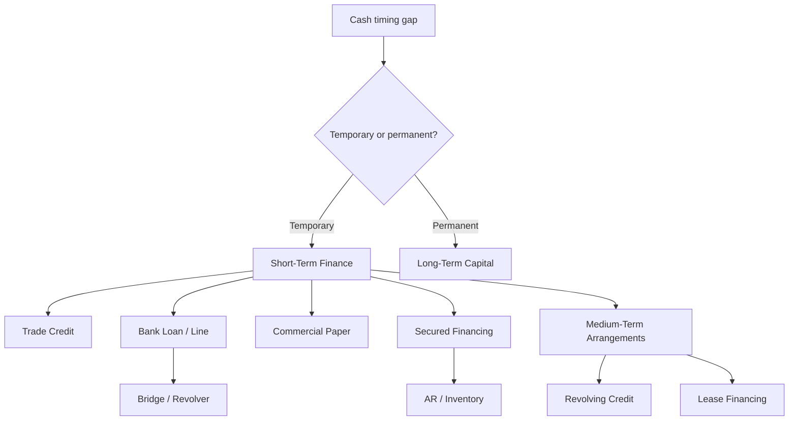
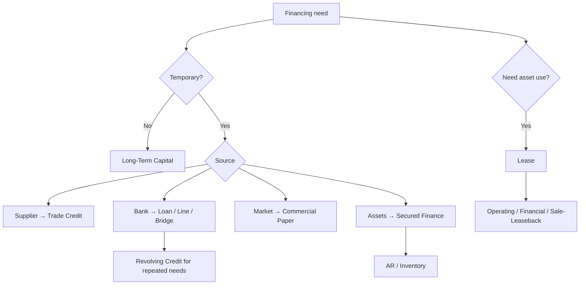

# 📘 2.3 — Short and Medium-Term Finance

> [!ABSTRACT] Ringkasan Cepat
> **Topik:** Short and Medium-Term Finance  
> **Bobot Parent Topic:** 20–30%  
> **Exam Priority:** High  
> **Difficulty:** Mixed  
> **Primary Skill:** Mixed — concept, financing classification, effective-cost calculation, issuer/lender perspective, dan interpretation  
> **Ref:** Berk & DeMarzo Bab 26–27; Brigham & Ehrhardt Bab 18; Bab 20 sebagai supporting context.

## Section 0 — Pemetaan Silabus & Exam Scope

| Field | Isi |
|---|---|
| Topik CF4 | Topik 2 — Sekuritas dan Bentuk Lain Keuangan Korporasi |
| Subtopik | 2.3 Short and Medium-Term Finance |
| Learning Outcome | Menjelaskan karakteristik berbagai jenis instrumen pendanaan jangka pendek dan menengah, baik dari sudut pandang borrower/issuer maupun lender/investor. |
| Skill Diuji | Memahami short-term financing need, trade credit, bank loans, lines of credit, bridge loans, commercial paper, secured financing, maturity policy, funding risk, dan lease financing. |
| Bobot Parent Topic | 20–30% |
| Exam Priority | High |
| Prerequisite | Working capital, cash flow, current liabilities, APR/EAR, collateral |
| Connected Topics | [[2.2 Long-Term Debt Instruments]], [[2.5 Capital Raising Methods]], [[3.2 Sources of Finance and Capital Structure]], [[1.4 Company Account Structure]], [[1.6 Financial Ratios and Interpretation]] |
| Referensi | Berk & DeMarzo Bab 26–27; Brigham & Ehrhardt Bab 18; Brigham Bab 20 untuk maturity-matching context |

> [!IMPORTANT] Scope Boundary
> `[CORE CF4]` Fokus note ini adalah **instrumen dan arrangements untuk membiayai kebutuhan cash/working capital pada horizon pendek sampai menengah**.
>
> Berk & DeMarzo Chapter 27 adalah source utama untuk forecasting financing needs, temporary vs permanent working capital, matching principle, financing policy, bank loans, credit lines, bridge loans, commercial paper, dan secured financing. Chapter 26 menambahkan **trade credit/accounts payable** sebagai short-term financing source.
>
> Brigham Chapter 18 digunakan untuk **lease financing**: operating lease, financial/capital lease, sale-and-leaseback, dan economic substance lease sebagai financing arrangement.
>
> Detail working-capital optimization dan full lease-versus-buy valuation tidak dijadikan fokus kecuali diperlukan untuk memahami karakteristik financing.

---

## Section 1 — Intuisi & Big Picture

Perusahaan dapat **profitable tetapi tetap kekurangan cash**.

Misalnya:

```text
Beli inventory
↓
Bayar supplier
↓
Barang dijual
↓
Accounts receivable
↓
Customer baru bayar
```

Jika cash keluar lebih awal daripada cash masuk, perusahaan membutuhkan financing untuk mempertahankan operasi.

Short/medium-term finance menyelesaikan **timing mismatch**, bukan hanya masalah perusahaan merugi.

Perusahaan dapat menggunakan:

- **trade credit**;
- bank loan;
- **line of credit**;
- revolving credit;
- **bridge loan**;
- **commercial paper**;
- receivables/inventory secured financing;
- leasing.

Pertanyaan pertama bukan “mana interest rate paling kecil?”, tetapi:

```text
Cash deficit
↓
Temporary atau permanent?
↓
Berapa lama financing dibutuhkan?
↓
Source apa yang tersedia?
↓
Berapa TRUE effective cost?
↓
Apa collateral / restriction?
↓
Apa funding risk?
```

> [!TIP] Mental Model Utama
> **Need → Maturity → Cost → Commitment → Collateral → Flexibility → Funding Risk**

---

## Section 2 — Definisi & Core Concepts

### Definisi Formal

> [!NOTE] Definisi Formal
> **Short-term financing** membiayai temporary atau near-term funding needs, terutama working-capital requirements.
>
> Dalam Chapter 27, major alternatives adalah **bank loans, commercial paper, dan secured financing**. Chapter 26 menambahkan **trade credit**.
>
> Untuk medium-term financing dalam official sources, relevant arrangements meliputi **multi-year revolving credit** dan **leases** yang memberikan penggunaan asset melalui periodic contractual payments.

### 2.1 Working Capital dan Financing Need
$$
\text{Net Working Capital}
=
\text{Current Assets}
-
\text{Current Liabilities}
$$
Working capital melibatkan:

- cash;
- inventory;
- accounts receivable;
- accounts payable;
- short-term operating liabilities.

Financing question:

> Berapa cash yang dibutuhkan dan **berapa lama** deficit akan berlangsung?

### 2.2 Forecasting Short-Term Financing Needs

Menurut Berk & DeMarzo, short-term planning dimulai dengan forecast cash flows untuk menentukan:

1. surplus atau deficit;
2. temporary atau permanent.

Temporary financing needs sering berasal dari:

- **seasonality**;
- **negative cash-flow shocks**;
- **positive cash-flow shocks** yang memerlukan extra working capital.

Profitability tidak otomatis menghilangkan financing need karena working-capital timing dapat menyerap cash.

### 2.3 Temporary vs Permanent Working Capital

**Permanent working capital** = minimum base level yang terus dibutuhkan.

**Temporary working capital** = additional seasonal/fluctuating requirement.

```text
WC Need
│      /\      /\
│     /  \    /  \ ← temporary
│____/____\__/____\_
│------------------ ← permanent base
└────────────────── time
```

### 2.4 Matching Principle

> **Match financing maturity dengan life of financing need.**

```text
Temporary need → short-term finance
Permanent need → long-term capital
```

Tujuannya mengurangi maturity mismatch.

### 2.5 Aggressive vs Conservative Financing Policy

#### Aggressive Policy

Menggunakan lebih banyak short-term debt, termasuk untuk sebagian permanent needs.

Potential benefit:

- flexibility;
- short debt dapat memiliki lower agency/information costs.

Major cost:

> **funding risk** — risk refinancing tidak tersedia atau hanya tersedia dengan rate sangat mahal.

#### Conservative Policy

Menggunakan more long-term funding untuk fixed assets, permanent working capital, dan sebagian seasonal requirements.

Benefit:

- funding risk lebih rendah.

Cost:

- excess cash pada low-need periods;
- low return on surplus cash;
- potential tax/agency costs.

| Policy | Short Debt | Funding Risk | Excess Cash |
|---|---:|---:|---:|
| Aggressive | Tinggi | Tinggi | Rendah |
| Matching | Sesuai maturity | Moderate | Moderate |
| Conservative | Rendah | Rendah | Tinggi |

---

### 2.6 Trade Credit

**Trade credit** = supplier memberikan goods/services sekarang, buyer membayar kemudian.

```text
Purchase now
↓
Accounts Payable
↓
Pay later
```

Accounts payable karena itu merupakan **spontaneous short-term financing**.

#### Terms: Net 30

Full invoice due dalam 30 hari.

#### Terms: 2/10, Net 30

- 2% discount jika dibayar dalam 10 hari;
- jika tidak, full amount due pada day 30.

Jika discount dilewatkan, buyer secara substance meminjam discounted amount selama tambahan 20 hari.

### 2.7 Cost of Trade Credit

Untuk discount $d$, discount date $t_d$, net date $t_n$:
$$
r_p
=
\frac{d}{1-d}
$$
$$
N=t_n-t_d
$$
$$
EAR
=
\left(1+\frac{d}{1-d}\right)^{365/N}-1
$$
#### Example: 2/10, Net 30

Pay day 10 = 98, pay day 30 = 100.
$$
r_{20}
=
\frac{2}{98}
=
2.0408\%
$$
$$
EAR
=
(1.020408)^{365/20}-1
\approx44.6\%
$$
> [!IMPORTANT] Financial Meaning
> Discount kecil dapat berarti **annualized financing cost sangat besar** jika dilewatkan.

Decision:

> compare cost of trade credit dengan alternative financing seperti bank loan.

### 2.8 Stretching Accounts Payable

**Stretching accounts payable** = membayar melewati agreed due date.

Arithmetic benefit:

- financing period lebih panjang.

Potential costs:

- supplier mengubah terms ke COD/CBD;
- damaged credit reputation;
- supplier stop supplying;
- future financing terms memburuk;
- ethical issue karena melanggar agreed terms.

---

### 2.9 Short-Term Bank Loans

Bank loan biasanya dimulai dengan **promissory note** yang menyebut:

- amount;
- due date;
- interest rate.

Chapter 27 membahas:

1. single end-of-period payment loan;
2. line of credit;
3. bridge loan.

### 2.10 Single End-of-Period Payment Loan

Borrower menerima principal lalu membayar interest + principal dalam lump sum pada maturity.

Rate dapat:

- fixed;
- variable relative to benchmark plus spread.

---

### 2.11 Line of Credit

Bank setuju menyediakan borrowing sampai stated maximum.

#### Uncommitted Line

Informal; bank **tidak legally bound** untuk lend.

#### Committed Line

Written legally binding commitment selama conditions terpenuhi.

May include:

- commitment fee;
- compensating balance;
- working-capital restrictions;
- requirement agar balance menjadi zero pada waktu tertentu.

Zero-balance clause membantu memastikan short-term facility tidak berubah menjadi permanent long-term financing.

### 2.12 Revolving Line dan Evergreen Credit

**Revolving line of credit** = committed line untuk longer period, textbook menyebut typical 2–3 years.

Borrower dapat:

- draw;
- repay;
- redraw.

Ini menjadi important **medium-term liquidity facility**.

**Evergreen credit** = revolving line tanpa fixed maturity dalam terminology Chapter 27.

### 2.13 Bridge Loan

**Bridge loan** = temporary bank loan sampai permanent funding atau expected cash receipt tersedia.

```text
Need cash now
↓
Permanent financing arrives later
↓
Bridge loan fills gap
```

Use cases source:

- construction until long-term financing;
- plant/equipment until bond/equity proceeds;
- emergency financing until insurance/relief proceeds.

> [!WARNING] Definition Trap
> Bridge loan membiayai **timing gap**, bukan berarti underlying asset harus short-lived.

---

### 2.14 Discount Loan

Pada **discount loan**, interest dibayar upfront melalui deduction dari proceeds.
$$
\text{Usable Proceeds}
=
F-I
$$
Borrower tetap repay face amount.

Karena usable proceeds lebih rendah dari stated principal, true effective cost lebih tinggi daripada yang terlihat.

### 2.15 Commitment Fee

Untuk line:
$$
\text{Commitment Fee}
=
f_c \times \text{Unused Commitment}
$$
Example source:

- commitment = 1,000,000;
- borrowed = 800,000;
- interest = 10%;
- fee = 0.5% unused.
$$
Interest=80{,}000
$$
$$
Fee=0.005(200{,}000)=1{,}000
$$
$$
Total\ Cost=81{,}000
$$
### 2.16 Loan Origination Fee

Fee paid saat loan initiated mengurangi usable proceeds.

Source example:

- face = 500,000;
- 3-month APR = 12%;
- fee = 1%.
$$
Fee=5{,}000
$$
$$
Usable=495{,}000
$$
$$
Interest=500{,}000\left(\frac{0.12}{4}\right)=15{,}000
$$
$$
Repayment=515{,}000
$$
Three-month effective rate:
$$
\frac{515{,}000}{495{,}000}-1
=
4.04\%
$$
$$
EAR=(1.0404)^4-1\approx17.17\%
$$
Quoted APR 12% ≠ true economic cost.

### 2.17 Compensating Balance

**Compensating balance** requires borrower menyimpan percentage loan di bank.
$$
\text{Usable Funds}
=
\text{Principal}
-
\text{Required Balance}
$$
Jika loan = 500,000 dan required balance = 10%:
$$
Usable=450{,}000
$$
Interest mungkin tetap dihitung dari full 500,000.

> [!TIP] Cara Berpikir
> Effective cost denominator = **cash yang benar-benar usable**.

---

### 2.18 Commercial Paper

**Commercial paper** adalah:

> short-term, unsecured debt used by large, well-known corporations.

Characteristics:

- money-market instrument;
- unsecured;
- biasanya cheaper than short-term bank borrowing bagi firms yang punya access;
- availability bergantung credit quality dan market conditions.

Issuer perspective:

**Advantages**
- low-cost short financing;
- direct market access.

**Disadvantages**
- market funding can disappear;
- refinancing/funding risk;
- not generally available to weak/small issuers.

Investor perspective:

- short-term corporate credit exposure;
- yield compensates credit/liquidity risk.

> Commercial paper **bukan risk-free**.

### 2.19 Dealer vs Direct Paper

- **dealer paper** → distributed through dealer;
- **direct paper** → issuer sells directly.

Difference = distribution channel.

### 2.20 EAR Commercial Paper

If face $F$, proceeds $P$:
$$
r_p=\frac{F}{P}-1
$$
If 3-month:
$$
EAR=(1+r_p)^4-1
$$
Example $F=100{,}000$, $P=98{,}000$:
$$
r_{3m}
=
\frac{100{,}000}{98{,}000}-1
=
2.0408\%
$$
$$
EAR
=
(1.020408)^4-1
\approx8.42\%
$$
---

### 2.21 Secured Short-Term Financing

Accounts receivable dan inventory sering menjadi collateral.

Reason:

- current assets;
- expected to convert to cash.

### 2.22 Pledging Accounts Receivable

Receivables tetap dimiliki borrower tetapi digunakan sebagai collateral.

```text
Firm owns AR
↓ pledges AR
Lender provides loan
```

### 2.23 Factoring

Firm **sells receivables** kepada factor.

```text
Firm sells AR
↓
Factor pays cash
↓
Customer pays factor
```

#### With Recourse

Seller retains some customer default risk.

#### Without Recourse

Factor bears credit/default risk according to arrangement.

> [!WARNING] Definition Trap
> **Pledging ≠ factoring.**
>
> Pledge = collateral.  
> Factoring = sale.

---

### 2.24 Inventory Financing

#### Floating / General / Blanket Lien

Broad lien over inventory pool.

- simpler;
- less specific lender control.

#### Trust Receipts / Floor Planning

Specific inventory items linked to financing; proceeds often remitted as item sold.

#### Warehouse Arrangement

Inventory under controlled storage/warehouse.

Can be:

- public warehouse;
- field warehouse.

General trade-off:

```text
More collateral control
→ lower lender risk
→ higher administrative cost
```

---

## 2.25 Medium-Term Financing Through Leasing

Brigham Chapter 18 is the official Topik 2 source most relevant to financing arrangements extending beyond very short working-capital maturities.

Lease separates:

> **ownership** from **use**.

- **lessor** owns asset;
- **lessee** uses asset and pays rent.

### Operating Lease

Typical features:

- maintenance/service often provided by lessor;
- not fully amortized over basic term;
- often cancellable.

Lessor expects recovery through:

- renewal;
- re-lease;
- residual sale.

Benefits to lessee:

- flexibility;
- potential transfer of obsolescence/residual-value risk;
- maintenance convenience.

### Financial / Capital Lease

Brigham characteristics:

1. maintenance usually not provided by lessor;
2. usually noncancellable;
3. fully amortized.

Payments recover:

- asset cost;
- lessor required return.

Economic substance:

> **financial lease ≈ debt-like asset financing.**

### Sale-and-Leaseback

Firm:

1. owns asset;
2. sells asset;
3. immediately leases it back.

Effects:

- cash increases now;
- legal ownership transferred;
- firm retains use;
- future lease obligations arise.

This can be viewed as alternative financing similar in economic purpose to mortgage borrowing.

---

### Terminologi Penting

| Istilah | Definisi | Intuisi | Exam Note |
|---|---|---|---|
| Permanent working capital | Base WC need | Always required | Match long-term |
| Temporary working capital | Seasonal extra WC | Comes and goes | Match short-term |
| Matching principle | Match funding maturity to need | Avoid mismatch | Core policy |
| Funding risk | Risk refinancing unavailable/costly | Rollover danger | Aggressive policy ↑ |
| Trade credit | Supplier financing | Buy now, pay later | Accounts payable |
| Stretching payables | Paying after due date | Extra informal finance | Relationship cost |
| Promissory note | Written loan terms | Formal short loan | Amount/date/rate |
| Line of credit | Borrow up to limit | Flexible funding | Seasonal use |
| Uncommitted line | Bank not legally bound | Less certainty | Availability risk |
| Committed line | Bank legally committed | Funding certainty | Fee/restrictions |
| Revolving line | Multi-year reusable line | Medium-term liquidity | Draw-repay-redraw |
| Evergreen credit | Revolver without fixed maturity | Ongoing facility | Terms still matter |
| Bridge loan | Temporary gap financing | Until permanent source arrives | Timing bridge |
| Discount loan | Interest deducted upfront | Less cash received | Effective cost ↑ |
| Commitment fee | Fee on unused line | Pay for availability | Include in cost |
| Origination fee | Upfront loan fee | Reduces usable proceeds | EAR ↑ |
| Compensating balance | Required bank deposit | Restricted cash | Denominator trap |
| Commercial paper | Short-term unsecured corporate debt | Large-firm market funding | Not risk-free |
| AR pledge | Receivable used as collateral | Loan secured by AR | ≠ factoring |
| Factoring | Sale of receivables | AR converted to cash | Risk transfer may vary |
| Floating lien | Broad inventory lien | Blanket security | Less specific control |
| Trust receipt | Specific inventory financing | Floor planning | Pay as sold |
| Warehouse finance | Inventory under controlled storage | Strong collateral control | Admin cost |
| Operating lease | Flexible/service-oriented lease | Rent/use | Often cancellable |
| Financial lease | Fully amortized debt-like lease | Asset financing | Fixed obligation |
| Sale-and-leaseback | Sell asset then lease it | Unlock cash | Retain use |

---

## Section 3 — How It Works

### Financing Flow

```text
Forecast cash
↓
Surplus or deficit?
↓
Temporary or permanent?
↓
Select maturity
↓
Select instrument
↓
Calculate TRUE cost
↓
Assess collateral / commitment / restrictions
↓
Assess funding risk
```

### Trade Credit Logic

```text
Supplier discount offered
↓
Take discount?
├─ Yes → pay early
└─ No → implicit borrowing
         ↓
         compute EAR
         ↓
compare alternative funding cost
```

### Bank Facility Logic

```text
Need flexible cash
↓
Line of credit
↓
Committed?
├─ No → availability risk
└─ Yes → fee + restrictions
```

### Commercial Paper Logic

```text
Large strong issuer?
↓
Yes
↓
Can access CP market
↓
Often lower cost
↓
But market-access risk remains
```

### Secured Financing Logic

```text
Need funds
↓
Use AR or inventory as collateral
↓
Lender gains protection
↓
Borrower bears monitoring/restriction cost
```

### Lease Logic

```text
Need asset use
↓
Buy or lease?
↓
Operating lease → flexibility/service
Financial lease → debt-like financing
Sale-leaseback → convert asset to cash
```

> [!DANGER] Jangan Salah Pikir
> 1. Profitability ≠ cash sufficiency.
> 2. Accounts payable ≠ free financing jika discount dilewatkan.
> 3. Quoted rate ≠ effective cost jika ada fee/restricted cash.
> 4. Committed ≠ uncommitted line.
> 5. Commercial paper ≠ risk-free.
> 6. Pledge ≠ factor.
> 7. Collateral does not eliminate risk.
> 8. Short debt tidak selalu lebih baik meskipun rate saat ini lebih rendah.
> 9. Financial lease dapat sangat debt-like.
> 10. Sale-and-leaseback gives cash now but creates future obligation.

---

## Section 4 — Worked Examples & Exam Cases

### Case A — Fundamental: Trade Credit

**Soal**

Supplier menawarkan **2/10, Net 30**. Alternative bank financing memiliki EAR 12%. Apakah firm sebaiknya melewatkan discount?

> [!SUCCESS] Pembahasan
>
> Financing period:
>
> $$
> 30-10=20
> $$
>
> days.
>
> $$
> r_{20}=\frac{0.02}{0.98}=2.0408\%
> $$
>
> $$
> EAR=(1.020408)^{365/20}-1\approx44.6\%
> $$
>
> Karena 12% < 44.6%, ceteris paribus lebih murah borrow from bank dan mengambil discount.

> [!WARNING] Exam Trap — Case A
> - Trap: compare 2% dengan 12%.
> - Shortcut: annualize financing costs.
> - Target waktu: 60–90 detik.

### Case B — Origination Fee

**Soal**

Face loan Rp500 juta, tenor 3 bulan, APR 12%, origination fee 1%.

> [!SUCCESS] Pembahasan
>
> $$
> Fee=5
> $$
>
> juta.
>
> $$
> Usable=495
> $$
>
> juta.
>
> $$
> Interest=500(0.12/4)=15
> $$
>
> juta.
>
> $$
> r_{3m}=\frac{515}{495}-1=4.04\%
> $$
>
> $$
> EAR=(1.0404)^4-1\approx17.17\%
> $$
> [!WARNING] Exam Trap — Case B
> Effective rate memakai **usable proceeds**, bukan face value.

### Case C — Compensating Balance

Loan Rp1 miliar, annual interest 10%, compensating balance 20%.

> [!SUCCESS] Pembahasan
>
> $$
> Usable=1{,}000-200=800
> $$
>
> juta.
>
> $$
> Interest=100
> $$
>
> juta.
>
> $$
> Effective\ Cost=\frac{100}{800}=12.5\%
> $$
### Case D — Commercial Paper

Face = 100 juta; 3-month proceeds = 98 juta.

> [!SUCCESS] Pembahasan
>
> $$
> r_{3m}=\frac{100}{98}-1=2.0408\%
> $$
>
> $$
> EAR=(1.020408)^4-1\approx8.42\%
> $$
### Case E — Committed vs Uncommitted

Firm membutuhkan guaranteed seasonal liquidity.

> [!SUCCESS] Pembahasan
>
> **Committed line** memberi greater funding certainty karena bank legally committed subject to agreement.
>
> Trade-off: commitment fee/restrictions.

### Case F — Pledge vs Factor

- Bank lends against receivables → **pledging**.
- Finance company buys receivables → **factoring**.

> [!WARNING] Exam Trap
> Cari verb **pledged** vs **sold**.

### Case G — Financing Policy

Firm membiayai fixed assets, permanent WC, dan sebagian seasonal WC dengan long-term financing.

> [!SUCCESS] Pembahasan
>
> **Conservative financing policy**.
>
> Benefit: lower funding risk.  
> Cost: more excess cash/carry cost.

### Case H — Lease

Lease:

- no maintenance;
- noncancellable;
- fully amortized.

> [!SUCCESS] Pembahasan
>
> **Financial/capital lease**.
>
> Economic substance: debt-like financing.

### Case I — Sale-and-Leaseback

Firm menjual warehouse lalu langsung menyewa kembali.

> [!SUCCESS] Pembahasan
>
> **Sale-and-leaseback**:
>
> - receives cash now;
> - transfers ownership;
> - retains use;
> - incurs future lease payments.

---

## Section 5 — Interpretation & Sanity Check

> [!CHECK] Sanity Check
> 1. Profitable + seasonal inventory buildup dapat menghasilkan temporary cash deficit.
> 2. Small supplier discount + short extra credit period dapat berarti high EAR.
> 3. Upfront fee harus mengurangi usable proceeds.
> 4. Compensating balance harus mengurangi funds available.
> 5. CP tetap corporate credit exposure.
> 6. Aggressive policy harus menaikkan refinancing risk.
> 7. Factoring = sale; pledging = collateral.
> 8. More collateral control biasanya lower lender risk tetapi higher admin cost.
> 9. Financial lease harus lebih debt-like daripada cancellable operating lease.
> 10. Sale-and-leaseback tidak menciptakan free money.

### Interpretation Ladder

> **Level 1 — Need:** apa cash deficit-nya?  
> **Level 2 — Duration:** temporary atau permanent?  
> **Level 3 — Instrument:** supplier, bank, market, collateral, lease?  
> **Level 4 — True Cost:** interest + discount + fees + restricted cash.  
> **Level 5 — Risk:** funding, collateral, market access.  
> **Level 6 — Flexibility:** redraw/cancel/refinance?  
> **Level 7 — Substance:** apakah arrangement debt-like?

---

## Section 6 — Connections & Mental Model



### Connections

- [[2.2 Long-Term Debt Instruments]] — maturity matching membedakan short vs permanent financing need.
- [[1.4 Company Account Structure]] — AP dan short borrowings muncul sebagai current liabilities.
- [[1.6 Financial Ratios and Interpretation]] — financing policy memengaruhi liquidity dan working-capital ratios.
- [[2.5 Capital Raising Methods]] — bridge loan dapat digunakan sampai proceeds bond/equity issue tersedia.
- [[3.2 Sources of Finance and Capital Structure]] — 2.3 fokus instrument/maturity, bukan full optimal capital structure.

---

## Section 7 — Exam Traps & Misconceptions

### Definition Trap

> [!BUG] Definition Trap
> - Trade credit = supplier financing; bank credit = financial institution.
> - Committed ≠ uncommitted line.
> - Pledging ≠ factoring.
> - Operating ≠ financial lease.

### Financial Logic Trap

> [!BUG] Logic Trap
> - No stated interest ≠ free financing.
> - Lowest stated rate ≠ lowest effective cost.
> - Commitment certainty has a price.
> - CP can be cheap but funding access can disappear.
> - Secured financing can carry admin/collateral cost.
> - Lease can still create leverage-like obligations.

### Calculation Trap

> [!BUG] Calculation Trap

**Trade credit — Salah**
$$
Cost=2\%
$$
**Benar**
$$
r=\frac{0.02}{0.98}
$$
then annualize.

**Upfront fee — Salah**
$$
r=\frac{Interest}{Face}
$$
**Benar**

Use cash actually available:
$$
r=\frac{Repayment}{Usable\ Proceeds}-1
$$
### Interpretation Trap

> [!BUG] Interpretation Trap
> - Longer financing is not always superior: it reduces rollover risk but may create excess funding cost.
> - Stretching AP may appear cheaper but can damage supplier access.
> - Factoring is not automatically a distress signal.
> - Financial lease should be interpreted based on economic substance, not label alone.

### Red Flags

> [!CAUTION] Red Flags

| Keyword | Pikirkan |
|---|---|
| seasonal | Temporary WC |
| permanent base | Permanent WC |
| matching | Maturity matching |
| rollover | Funding risk |
| 2/10 Net 30 | Trade-credit cost |
| maximum bank amount | Line of credit |
| legally binding | Committed line |
| 2–3 year reusable facility | Revolving line |
| until bond/equity proceeds | Bridge loan |
| interest deducted upfront | Discount loan |
| fee on unused commitment | Commitment fee |
| minimum deposit | Compensating balance |
| large firm + unsecured short debt | Commercial paper |
| AR collateral | Pledge |
| AR sold | Factoring |
| blanket lien | Floating lien |
| floor planning | Trust receipt |
| warehouse | Controlled inventory collateral |
| maintenance + cancellable | Operating lease |
| noncancellable + fully amortized | Financial lease |
| sell asset then rent it | Sale-and-leaseback |

---

## Section 8 — Executive Summary

> [!SUMMARY] Must Remember
> 1. Short-term finance solves **cash timing mismatch**.
> 2. First classify need as **temporary vs permanent**.
> 3. Matching principle: temporary ↔ short funding; permanent ↔ long-term funding.
> 4. Aggressive financing raises **funding/rollover risk**.
> 5. Conservative financing lowers funding risk but can create excess cash/carry cost.
> 6. Trade credit = supplier financing.
> 7. Forgone discount cost:
>
> $$
> EAR=
> \left(1+\frac{d}{1-d}\right)^{365/(t_n-t_d)}-1
> $$
>
> 8. Committed line ≠ uncommitted line.
> 9. Revolving line is a key multi-period/medium-term liquidity arrangement.
> 10. Bridge loan fills gap until permanent financing arrives.
> 11. Fees and compensating balances mean **quoted rate ≠ true cost**.
> 12. Commercial paper = short-term unsecured corporate debt for strong issuers.
> 13. Pledge AR ≠ factor AR.
> 14. Inventory can secure financing through lien, trust receipt, or warehouse structure.
> 15. Operating lease = more flexible/service-oriented; financial lease = more debt-like.
> 16. Sale-and-leaseback unlocks cash while retaining asset use.

### Comparison Table

| Instrument | Horizon | Collateral | Main Benefit | Main Risk/Cost |
|---|---|---|---|---|
| Trade Credit | Very short | No | Automatic supplier finance | Forgone discount |
| Bank Loan | Short | Varies | Simple | Lump repayment/cost |
| Uncommitted Line | Short | Varies | Flexibility | Availability risk |
| Committed Line | Short | Varies | Certainty | Fee/restrictions |
| Revolving Credit | Short–Medium | Varies | Reborrow flexibility | Fees/covenants |
| Bridge Loan | Short | Varies | Timing bridge | Must later refinance |
| Commercial Paper | Short | Unsecured | Low-cost market funding | Market-access risk |
| AR Pledge | Short | Receivables | Unlock funds | Monitoring |
| Factoring | Short | AR sold | Immediate cash | Fee/risk-transfer terms |
| Inventory Finance | Short | Inventory | Asset-backed funding | Control/admin |
| Operating Lease | Short–Medium | Asset with lessor | Flexibility/service | No residual ownership |
| Financial Lease | Medium–Long | Leased asset economics | Asset financing | Fixed obligation |
| Sale-Leaseback | Medium–Long | Asset sold | Unlock cash | Future rent |

### Trigger Keywords

| Jika soal mengatakan... | Pikirkan... |
|---|---|
| temporary cash deficit | Short-term finance |
| seasonal buildup | Temporary WC |
| supplier delayed payment | Trade credit |
| early-payment discount | Implicit interest |
| borrow up to limit | Line of credit |
| bank legally committed | Committed line |
| reusable multi-year line | Revolving credit |
| until permanent finance arrives | Bridge |
| strong firm unsecured money-market borrowing | CP |
| receivable sold | Factoring |
| receivable collateral | Pledge |
| noncancellable fully amortized | Financial lease |
| sell and rent back | Sale-and-leaseback |

### Kapan Digunakan

Gunakan framework ini untuk:

- classify short/medium financing;
- temporary vs permanent needs;
- calculate trade-credit cost;
- compare bank loan effective costs;
- analyze fees/compensating balance;
- identify CP;
- distinguish factoring/pledging;
- identify inventory collateral;
- distinguish lease types.

### Kapan TIDAK Boleh Digunakan

Jangan menggantikan:

- [[2.2 Long-Term Debt Instruments]] untuk bond structure;
- [[2.4 Derivative Securities in Corporate Finance]] untuk derivatives;
- [[2.5 Capital Raising Methods]] untuk IPO/underwriting;
- full lease-vs-buy NAL unless specifically asked.

---

### Quick Decision Tree



---

## Section 9 — Active Recall Check

1. Mengapa profitable firm masih dapat membutuhkan short-term finance?
2. Temporary vs permanent working capital?
3. Apa matching principle?
4. Mengapa aggressive policy meningkatkan funding risk?
5. Apa cost conservative policy?
6. Apa arti 2/10 Net 30?
7. Mengapa forgone discount adalah interest cost?
8. Bagaimana menghitung EAR trade credit?
9. Apa risiko stretching AP?
10. Uncommitted vs committed line?
11. Mengapa commitment fee ada?
12. Apa fungsi zero-balance requirement?
13. Apa itu revolving line?
14. Apa itu evergreen credit?
15. Kapan bridge loan digunakan?
16. Mengapa discount loan punya higher effective cost?
17. Bagaimana origination fee memengaruhi EAR?
18. Bagaimana compensating balance memengaruhi usable funds?
19. Apa ciri commercial paper?
20. Mengapa CP tidak risk-free?
21. Dealer paper vs direct paper?
22. Pledging vs factoring?
23. With recourse vs without recourse?
24. Apa floating lien?
25. Apa trust receipt/floor planning?
26. Mengapa warehouse arrangement mengurangi lender risk?
27. Tiga ciri financial lease menurut Brigham?
28. Mengapa operating lease lebih flexible?
29. Apa economic mechanics sale-and-leaseback?
30. Mengapa financial lease debt-like?

---

## Section 10 — Exam Pattern Map

| Narasi Soal | Keyword | Konsep | Formula/Rule | Langkah | Trap | Shortcut |
|---|---|---|---|---|---|---|
| Seasonal cash deficit | seasonal | Temporary WC | Matching | Identify timing | Loss ≠ cash gap | Seasonality → short |
| Permanent base financed short | rollover | Funding risk | Aggressive policy | Compare maturity | Short rate only | Long need + short debt = risk |
| 2/10 Net 30 | discount | Trade credit | EAR formula | Discount → days → annualize | Use 2% | Forgone discount = interest |
| Bank lends up to max | line | LOC | Check commitment | Binding? | Treat lines same | Ask committed? |
| Multi-year reusable line | revolving | Revolver | Draw-repay-redraw | Identify term | Call term loan | Reusable facility |
| Until long-term issue | bridge | Bridge loan | Temporary | Identify future source | Asset must be short | Timing bridge |
| Fee deducted upfront | fee | Effective cost | Use usable proceeds | Reduce denominator | Use face | Cash actually received |
| Minimum bank deposit | balance | Compensating balance | Usable = face − balance | Compute usable | Ignore deposit | Denominator trap |
| Large firm unsecured short issue | CP | Commercial paper | Discount/EAR | Assess market access | Risk-free | CP = unsecured |
| AR collateral | pledge | Secured loan | AR remains with firm | Follow ownership | Factor | Pledge = collateral |
| AR sold | factor | Factoring | Sale | Follow cash | Loan | Sold = factor |
| Broad inventory lien | blanket | Floating lien | Secured | Identify breadth | Specific | Blanket = broad |
| Floor planning | trust receipt | Inventory finance | Specific items | Track sale/remit | Warehouse | Dealer inventory clue |
| Noncancellable fully amortized | lease | Financial lease | Debt-like | Check terms | All leases same | Fixed = financial |
| Sell asset, lease back | sale-leaseback | Asset monetization | Cash now + rents later | Track ownership | Free cash | Obligation follows |

`[TEXTBOOK-BASED EXPECTATION]` Pattern map diturunkan langsung dari Berk & DeMarzo Chapters 26–27 dan Brigham Chapter 18. Tidak digunakan `[PAST EXAM EVIDENCE]` karena past exam tidak menjadi source pada permintaan ini.

---

## Source Traceability

| Materi | Sumber |
|---|---|
| Working-capital context | Berk & DeMarzo, Chapter 26 opening |
| Trade credit and credit terms | Berk & DeMarzo, Chapter 26 §26.2 |
| Cost of trade credit | Berk & DeMarzo, Chapter 26 §26.2 |
| Stretching accounts payable | Berk & DeMarzo, Chapter 26 §26.4 |
| Forecasting short-term financing needs | Berk & DeMarzo, Chapter 27 §27.1 |
| Seasonality and cash-flow shocks | Berk & DeMarzo, Chapter 27 §27.1 |
| Temporary/permanent working capital | Berk & DeMarzo, Chapter 27 §27.2 |
| Matching principle | Berk & DeMarzo, Chapter 27 §27.2 |
| Aggressive/conservative financing | Berk & DeMarzo, Chapter 27 §27.2 |
| Funding risk | Berk & DeMarzo, Chapter 27 §27.2 |
| Short-term bank loans / promissory note | Berk & DeMarzo, Chapter 27 §27.3 |
| Lines of credit / committed vs uncommitted | Berk & DeMarzo, Chapter 27 §27.3 |
| Revolving line / evergreen credit | Berk & DeMarzo, Chapter 27 §27.3 |
| Bridge loan / discount loan | Berk & DeMarzo, Chapter 27 §27.3 |
| Commitment/origination fees | Berk & DeMarzo, Chapter 27 §27.3 |
| Compensating balance | Berk & DeMarzo, Chapter 27 §27.3 |
| Commercial paper | Berk & DeMarzo, Chapter 27 §27.4 |
| Dealer/direct paper | Berk & DeMarzo, Chapter 27 §27.4 |
| AR pledging/factoring | Berk & DeMarzo, Chapter 27 §27.5 |
| Inventory secured financing | Berk & DeMarzo, Chapter 27 §27.5 |
| Operating lease | Brigham & Ehrhardt, Chapter 18 §18.1 |
| Financial/capital lease | Brigham & Ehrhardt, Chapter 18 §18.1 |
| Sale-and-leaseback | Brigham & Ehrhardt, Chapter 18 §18.1 |
| Lease as financing/debt substitute | Brigham & Ehrhardt, Chapter 18 §§18.3–18.4 |
| Leasing flexibility/obsolescence risk | Brigham & Ehrhardt, Chapter 18 §18.7 |
| Maturity matching supporting context | Brigham & Ehrhardt, Chapter 20 §20.8 |

---

## Final Mental Model

```text
SHORT / MEDIUM-TERM FINANCE
            ↓
Why is cash needed?
            ↓
Temporary or permanent?
            ↓
MATCH MATURITY
            ↓
Supplier → Trade Credit
Bank → Loan / Line / Bridge
Market → Commercial Paper
Assets → AR / Inventory Financing
Asset Use → Lease
            ↓
TRUE COST =
Interest
+ Forgone Discount
+ Fees
+ Restricted Cash
+ Collateral/Admin Cost
+ Funding Risk
            ↓
Compare:
COST ↔ FLEXIBILITY ↔ CERTAINTY ↔ RISK
```
