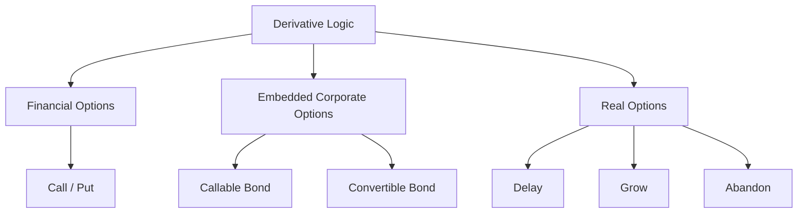
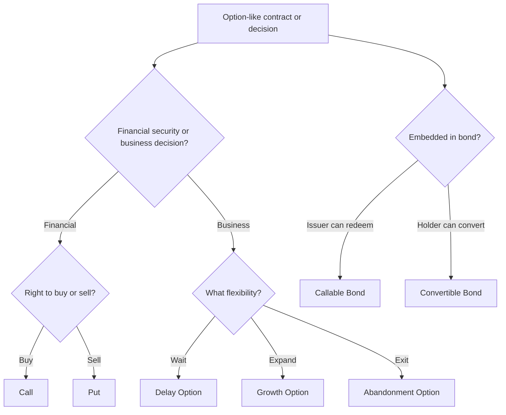

# 📘 2.4 — Derivative Securities in Corporate Finance

> [!ABSTRACT] Ringkasan Cepat
> **Topik:** Derivative Securities in Corporate Finance  
> **Bobot Parent Topic:** 20–30%  
> **Exam Priority:** High  
> **Difficulty:** Mixed  
> **Primary Skill:** Mixed — option mechanics, payoff calculation, interpretation, embedded options, dan corporate decision-making  
> **Ref:** Berk & DeMarzo Bab 20, 22, dan 24.

## Section 0 — Pemetaan Silabus & Exam Scope

| Field | Isi |
|---|---|
| Topik CF4 | Topik 2 — Sekuritas dan Bentuk Lain Keuangan Korporasi |
| Subtopik | 2.4 Derivative Securities in Corporate Finance |
| Learning Outcome | Memahami derivative securities dan contracts dalam corporate finance. |
| Skill Diuji | Memahami call/put options, option payoff dan moneyness, long/short positions, option-value drivers, put-call parity, real options, serta embedded options pada corporate securities seperti callable dan convertible bonds. |
| Bobot Parent Topic | 20–30% |
| Exam Priority | High |
| Prerequisite | Debt vs equity, market value, present value, NPV, risk-return |
| Connected Topics | [[2.1 Equity Instruments]], [[2.2 Long-Term Debt Instruments]], [[2.5 Capital Raising Methods]], [[3.3 Capital Budgeting and Cost of Capital]], [[5.2 Derivative Investments]] |
| Referensi | Berk & DeMarzo Bab 20, 22, dan 24 |

> [!IMPORTANT] Scope Boundary
> `[CORE CF4]` Topik ini menggunakan tiga lapisan derivative thinking dari official Berk & DeMarzo references:
>
> 1. **Financial options** — Bab 20: call, put, payoff, moneyness, long/short, put-call parity, value drivers, dan exercise logic.
> 2. **Real options** — Bab 22: option to delay, growth option, abandonment option, decision trees, dan staged investment.
> 3. **Embedded options in corporate securities** — Bab 24: callable bonds dan convertible bonds.
>
> Topik 5.2 juga membahas derivative investments. Untuk menghindari overlap berlebihan, note 2.4 menekankan **bagaimana derivative logic digunakan dalam financing dan corporate decisions**, sedangkan [[5.2 Derivative Investments]] lebih natural untuk derivative contracts sebagai investment/market instruments.
>
> Brigham Chapter 19 dalam PDF Topik 2 memang memuat warrants dan convertibles, tetapi chapter tersebut **tidak tercantum pada reference map Topik 2 yang diberikan dalam prompt CF4**. Sesuai source-boundary rule, Chapter 19 tidak digunakan sebagai authority utama note ini.

---

## Section 1 — Intuisi & Big Picture

Apa masalah nyata yang diselesaikan derivative?

Corporate finance penuh dengan keputusan yang hasilnya tergantung **apa yang terjadi nanti**.

Contoh:

- perusahaan ingin hak membeli asset jika harganya favorable;
- investor bond ingin hak mengubah bond menjadi shares jika stock price naik;
- issuer ingin hak melunasi bond lebih awal jika interest rates turun;
- management ingin menunggu market information sebelum membangun pabrik;
- firm ingin memperbesar project hanya jika demand ternyata tinggi;
- firm ingin menghentikan project bila hasilnya buruk.

Semua ini mempunyai struktur yang sama:

```text
Uncertainty today
↓
Future state becomes known
↓
One party has a RIGHT
but not necessarily an obligation
↓
Decision is exercised only when favorable
```

Itulah inti **optionality**.

### Mengapa derivative bisa valuable?

Karena payoff-nya **asymmetric**.

Holder option:

- dapat mengambil favorable outcome;
- dapat menolak unfavorable exercise.

Contoh call:

```text
Stock rises above strike
→ exercise
→ positive payoff

Stock remains below strike
→ do not exercise
→ payoff = 0
```

Karena downside exercise dapat dihindari, flexibility memiliki value.

### Corporate-finance connection

Derivative logic muncul dalam tiga bentuk:

```text
Financial option
↓
Call / Put

Corporate security
↓
Callable / Convertible Bond

Business decision
↓
Delay / Expand / Abandon
```

> [!TIP] Mental Model Utama
> Untuk setiap derivative atau option-like feature, tanyakan:
>
> **Underlying → Right → Strike/Decision Cost → Expiry/Timing → Who Owns the Option → Payoff → Corporate Consequence**

---

## Section 2 — Definisi & Core Concepts

### Definisi Formal

> [!NOTE] Definisi Formal
> **Option** adalah contract yang memberi holder **right, but not obligation**, untuk melakukan transaction tertentu pada terms yang telah ditentukan.
>
> **Call option** memberi right to buy underlying asset.
>
> **Put option** memberi right to sell underlying asset.
>
> Value derivative berasal dari value underlying asset atau economic state yang mendasarinya.

### 2.1 Call Option

Call holder mempunyai hak membeli underlying pada **strike price** $K$.

Pada expiration:

$$
C_T
=
\max(S_T-K,0)
$$

Jika $S_T>K$, exercise. Jika $S_T\le K$, jangan exercise.

### Example

Jika:

$$
K=50
$$

and:

$$
S_T=70
$$

maka:

$$
C_T
=
70-50
=
20
$$

Jika:

$$
S_T=40
$$

maka:

$$
C_T=0
$$

### 2.2 Put Option

Put holder mempunyai hak menjual underlying pada strike $K$.

Pada expiration:

$$
P_T
=
\max(K-S_T,0)
$$

Jika $S_T<K$, put valuable. Jika $S_T\ge K$, put expires worthless.

### Example

$$
K=50,\qquad S_T=35
$$

maka:

$$
P_T
=
50-35
=
15
$$

### 2.3 Long vs Short Position

**Long option** = buyer/holder.

**Short option** = writer/seller.

Ignoring initial premium:

$$
\text{Short Option Payoff}
=
-\text{Long Option Payoff}
$$

#### Long Call

$$
\max(S_T-K,0)
$$

#### Short Call

$$
-\max(S_T-K,0)
$$

Short call dapat menghadapi potentially unlimited loss karena $S_T$ secara teoritis dapat terus naik.

#### Long Put

$$
\max(K-S_T,0)
$$

#### Short Put

$$
-\max(K-S_T,0)
$$

> [!DANGER] Payoff ≠ Profit
> Payoff hanya melihat cash flow saat exercise/expiration.
>
> **Profit** juga harus memperhitungkan option premium yang dibayar atau diterima di awal.

Jika call premium = $c_0$:

$$
\Pi_{\text{Long Call}}
=
\max(S_T-K,0)-c_0
$$

Jika put premium = $p_0$:

$$
\Pi_{\text{Long Put}}
=
\max(K-S_T,0)-p_0
$$

### 2.4 Strike Price dan Expiration

**Strike price** = predetermined transaction price.

**Expiration date** = final date associated with option contract.

#### European Option

Exercise hanya pada expiration date.

#### American Option

Exercise kapan saja sampai dan termasuk expiration.

> [!BUG] Definition Trap
> American dan European menjelaskan **exercise rules**, bukan lokasi geographical trading.

### 2.5 Moneyness

#### Call

$$
S>K
\Rightarrow
\text{ITM}
$$

$$
S=K
\Rightarrow
\text{ATM}
$$

$$
S<K
\Rightarrow
\text{OTM}
$$

#### Put

$$
S<K
\Rightarrow
\text{ITM}
$$

$$
S=K
\Rightarrow
\text{ATM}
$$

$$
S>K
\Rightarrow
\text{OTM}
$$

> [!IMPORTANT] ITM ≠ Profitable Trade
> ITM hanya berarti immediate exercise mempunyai positive intrinsic payoff.
>
> Investor masih mungkin rugi setelah memperhitungkan premium awal.

### 2.6 Option Premium

Option writer menerima premium saat contract dimulai.

```text
Holder
Pays premium today
↓
Receives optional future payoff

Writer
Receives premium today
↓
Accepts contingent future obligation
```

### 2.7 Intrinsic Value dan Time Value

Sebelum expiration, option price dapat lebih besar dari immediate-exercise payoff.

$$
\text{Option Value}
=
\text{Intrinsic Value}
+
\text{Time Value}
$$

Intrinsic value call:

$$
\max(S-K,0)
$$

Intrinsic value put:

$$
\max(K-S,0)
$$

Time value muncul karena future price masih uncertain dan holder masih memiliki flexibility.

### 2.8 Put-Call Parity

Berk & DeMarzo menggunakan Law of One Price untuk European options.

Dengan dividend adjustment, source menulis:

$$
C
=
P+S-PV(K)-PV(\text{Div})
$$

Equivalent rearrangement:

$$
S+P
=
C+PV(K)+PV(\text{Div})
$$

### Financial Meaning

Put-call parity mengatakan:

> dua portfolios yang memberikan equivalent future payoff harus mempunyai same value today.

Jika tidak, arbitrage opportunity would exist.

### 2.9 Protective Put

Investor memegang stock dan long put.

Terminal payoff:

$$
S_T+\max(K-S_T,0)
$$

Equivalent:

$$
\max(S_T,K)
$$

Meaning:

- downside dibatasi pada approximately $K$;
- upside stock tetap tersedia.

Ini seperti **portfolio insurance**.

### 2.10 Option Strategies dalam Source

Bab 20 juga menunjukkan option combinations:

- **straddle** — memperoleh payoff besar jika stock bergerak jauh ke salah satu arah;
- **strangle** — logic mirip dengan different strikes;
- **butterfly spread** — payoff terbesar ketika terminal price dekat middle strike;
- **protective put** — downside protection sambil mempertahankan upside.

Untuk CF4 2.4, tujuan utamanya adalah memahami bahwa derivative contracts dapat **engineer asymmetric cash-flow exposures**.

### 2.11 What Determines Option Value?

Berk & DeMarzo menekankan drivers:

- underlying stock price;
- strike price;
- time to expiration;
- volatility;
- interest rates;
- dividends.

#### Call — Directional Effects

| Variable naik | Effect pada Call |
|---|---|
| Stock price | Value naik |
| Strike price | Value turun |
| Volatility | Value naik |
| Time to expiration | Generally value naik |
| Interest rate | Value naik |
| Dividend | Value turun |

#### Put — Directional Effects

| Variable naik | Effect pada Put |
|---|---|
| Stock price | Value turun |
| Strike price | Value naik |
| Volatility | Value naik |
| Time to expiration | Generally value naik |
| Interest rate | Value turun |
| Dividend | Value naik |

### Why volatility raises option value

```text
Very favorable movement
→ holder participates

Very unfavorable movement
→ holder can refuse exercise
```

> [!TIP] Shortcut
> **Volatility benefits optionality.**

### 2.12 Early Exercise

#### American Call on Non-Dividend-Paying Stock

Berk & DeMarzo: early exercise tidak optimal karena exercising destroys remaining time value dan holder pays strike earlier.

#### American Put

Deep ITM put dapat rational untuk early exercise karena receiving strike earlier dapat outweigh remaining time value.

#### Dividend-Paying Stock

Call holder tidak menerima dividend sebelum owning stock. Early exercise tepat sebelum ex-dividend date dapat menjadi relevant apabila lost dividend sufficiently large relative to remaining option value.

---

## 2.13 Real Options

> [!NOTE] Definisi Formal
> **Real option** adalah right, but not obligation, untuk mengambil future business decision terkait real asset/project.

Underlying-nya tidak necessarily traded financial security.

Examples:

- delay project;
- expand project;
- abandon project;
- stage sequential investments.

### Financial vs Real Options

| Feature | Financial Option | Real Option |
|---|---|---|
| Underlying | Tradable financial asset | Project/real asset/opportunity |
| Exercise | Buy/sell asset | Invest/expand/abandon |
| Strike analogue | Contract strike | Investment/exercise cost |
| Expiry | Contract date | Opportunity deadline |
| Market price | Often observable | Often estimated |
| Replication | Often feasible | Usually harder |
| Core value | Flexibility | Managerial flexibility |

### 2.14 Option to Delay

Investment opportunity dapat dilihat sebagai call option.

```text
Financial Call
Stock value
Strike price
Expiration
Dividend

↓

Real Investment Option
Project value
Investment cost
Decision deadline
Cash flow lost by waiting
```

Key insight:

> **Positive static NPV does not always mean invest immediately.**

Management compares value of investing now versus value of waiting.

Likewise:

> current negative NPV does not necessarily mean the opportunity has zero value.

### 2.15 Growth Option

**Growth option** = current project creates right/opportunity untuk future expansion.

Important implication:

> initial project dengan apparently negative standalone NPV dapat masih valuable jika membuka sufficiently valuable future opportunities.

### 2.16 Abandonment Option

**Abandonment option** = ability to stop project when future prospects become poor.

Bad state:

```text
Stop losses / recover salvage value
```

Good state:

```text
Continue project
```

Thus:

$$
\text{Project Value with Flexibility}
\ge
\text{Project Value without Flexibility}
$$

under otherwise same assumptions.

### 2.17 Decision Trees

Decision tree distinguishes:

- **information nodes** — uncertainty is resolved;
- **decision nodes** — management chooses action.

```text
Current decision
↓
Future information
↓
Decision conditional on outcome
↓
Expected project value
```

### 2.18 Staged Investment

```text
Stage 1
↓ learn
Stage 2 only if favorable
↓ learn
Stage 3 only if favorable
```

Staging adds value because firm can stop after bad news before committing all capital.

---

## 2.19 Embedded Options in Corporate Debt

Two key Chapter 24 examples:

1. callable bond;
2. convertible bond.

### 2.20 Callable Bond = Issuer Option

Call provision gives issuer right to retire bond before maturity according to specified terms.

When interest rates fall:

```text
Old coupon high
↓
New borrowing cheaper
↓
Issuer exercises call
↓
Refinance
```

Thus:

> **call option belongs to issuer.**

Investor bears call/reinvestment risk.

Ceteris paribus:

$$
\text{Callable Bond Value}
<
\text{Otherwise Identical Non-Callable Bond Value}
$$

Therefore callable bond generally must offer greater yield/compensation to investor.

### 2.21 Convertible Bond = Investor Conversion Option

Convertible bond allows holder to convert debt into fixed number of common shares.

Conversion price:

$$
\text{Conversion Price}
=
\frac{\text{Face Value}}
{\text{Conversion Ratio}}
$$

At maturity, simplified payoff:

$$
V_T
=
\max\left(F,CR\times S_T\right)
$$

Economic decomposition:

$$
\text{Convertible Bond}
=
\text{Straight Bond}
+
\text{Embedded Conversion Option}
$$

Because conversion option has positive value, convertible bond can carry lower stated coupon/yield than otherwise identical straight bond.

> **Lower coupon does not mean free financing.** Existing shareholders grant bondholders valuable equity upside.

### 2.22 Callable Convertible Bond

If convertible bond is also callable, issuer can force holder to make conversion decision earlier.

```text
Holder chooses:
convert
or
accept call payment
```

Calling convertible debt may transfer remaining time value of conversion option from bondholders toward shareholders.

---

### Terminologi Penting

| Istilah | Definisi | Intuisi | Exam Note |
|---|---|---|---|
| Derivative | Contract whose value depends on underlying | Value derived from something else | Identify underlying |
| Call | Right to buy | Upside right | Holder chooses exercise |
| Put | Right to sell | Downside protection | Holder chooses exercise |
| Strike price | Contract exercise price | Predetermined price | $K$ |
| Expiration | Final option date | Time limit | Exercise timing |
| American option | Exercise through expiry | More flexibility | Not geography |
| European option | Exercise only at expiry | Less exercise flexibility | Not geography |
| Long option | Holder/buyer | Pays premium | Has right |
| Short option | Writer/seller | Receives premium | Has obligation |
| Premium | Option market price | Price of flexibility | Payoff ≠ profit |
| ITM | Positive immediate exercise payoff | Intrinsic value positive | ≠ necessarily profitable |
| ATM | Underlying ≈ strike | Borderline | $S\approx K$ |
| OTM | Immediate exercise payoff zero | Do not exercise now | Can still have time value |
| Put-call parity | Replication relationship | Same payoff → same price | Law of One Price |
| Protective put | Stock + put | Portfolio insurance | Floor + upside |
| Volatility | Dispersion of outcomes | More uncertainty | Raises option value |
| Real option | Future business decision right | Managerial flexibility | Non-traded underlying |
| Option to delay | Right to wait before investing | Information has value | Positive NPV may wait |
| Growth option | Right to expand | Future upside | Initial project can create options |
| Abandonment option | Right to stop | Limits downside | Ignore sunk costs |
| Decision node | Management choice | Controlled action | Distinguish uncertainty |
| Information node | State revealed | New information | No choice at node |
| Callable bond | Issuer can redeem early | Issuer owns option | Investor disadvantaged |
| Convertible bond | Holder can convert to stock | Investor owns option | Lower coupon possible |
| Conversion ratio | Shares per bond | Quantity received | Determines conversion price |

---

## Section 3 — How It Works

### 3.1 Financial Option Framework

```text
Underlying asset
↓
Future uncertain price
↓
Strike price
↓
Holder decides whether to exercise
↓
Payoff
↓
Subtract premium
↓
Profit
```

> [!TIP] Cara Berpikir
> Selalu pisahkan **Payoff → Initial Premium → Profit**.

### 3.2 Call Logic

```text
Is S_T > K?
├─ Yes → Exercise → payoff = S_T - K
└─ No  → Do not exercise → payoff = 0
```

### 3.3 Put Logic

```text
Is S_T < K?
├─ Yes → Exercise → payoff = K - S_T
└─ No  → Do not exercise → payoff = 0
```

### 3.4 Corporate Embedded-Option Framework

```text
Corporate Security
↓
Base security value
+
Embedded option
↓
Who owns option?
↓
Issuer or investor?
↓
Who benefits?
↓
Security price / yield adjusts
```

#### Callable

```text
Issuer gets flexibility
→ investor gives up favorable refinancing outcome
→ investor requires compensation
```

#### Convertible

```text
Investor gets equity upside
→ investor accepts lower fixed coupon
```

### 3.5 Real-Option Framework

```text
Project opportunity
↓
Uncertainty
↓
Can management wait / expand / abandon?
↓
Observe information
↓
Exercise only in favorable state
↓
Flexibility adds value
```

> [!DANGER] Jangan Salah Pikir
> 1. **Option payoff = profit.** Salah; premium matters.
> 2. **ITM = investor definitely profitable.** Salah.
> 3. **American option = traded in America.** Salah.
> 4. **OTM option = worthless today.** Salah; time value can remain.
> 5. **Higher uncertainty always destroys value.** Not for option holders.
> 6. **Positive NPV = invest immediately.** Real option to delay can make waiting better.
> 7. **Negative current NPV = opportunity worthless.** Growth/waiting option may still have value.
> 8. **Callable bond option belongs to investor.** Salah.
> 9. **Convertible lower coupon = free cheap financing.** Salah.
> 10. **Call and conversion benefit bondholder in same direction.** Salah.

---

## Section 4 — Worked Examples & Exam Cases

### Case A — Fundamental: Long Call

**Soal**

Investor membeli call dengan strike $K=100$, premium 8, dan terminal stock price $S_T=125$.

> [!SUCCESS] Pembahasan
>
> Payoff:
>
> $$
> C_T
> =
> \max(125-100,0)
> =
> 25
> $$
>
> Profit:
>
> $$
> \Pi
> =
> 25-8
> =
> 17
> $$
>
> Break-even terminal price:
>
> $$
> K+c_0
> =
> 108
> $$

> [!WARNING] Exam Trap — Case A
> - Trap: answer 25 sebagai profit.
> - Shortcut: payoff first, subtract premium second.
> - Target waktu: 30–45 detik.

### Case B — Long Put

Put strike 80, premium 5, terminal stock 60.

> [!SUCCESS] Pembahasan
>
> $$
> P_T
> =
> 80-60
> =
> 20
> $$
>
> $$
> \Pi
> =
> 20-5
> =
> 15
> $$

### Case C — Moneyness vs Profit

Call strike 50, premium 12, terminal stock 58.

> [!SUCCESS] Pembahasan
>
> Since $58>50$, call is ITM.
>
> $$
> \text{Payoff}=58-50=8
> $$
>
> $$
> \text{Profit}=8-12=-4
> $$
>
> Jadi option **ITM tetapi trade masih rugi**.

### Case D — Protective Put

Investor memiliki stock dan put strike 90. Abaikan premium.

> [!SUCCESS] Pembahasan
>
> Portfolio payoff:
>
> $$
> S_T+\max(90-S_T,0)
> $$
>
> Jika $S_T=60$:
>
> $$
> 60+(90-60)=90
> $$
>
> Jika $S_T=120$:
>
> $$
> 120+0=120
> $$
>
> Put creates a downside floor while preserving upside.

### Case E — Option Value Drivers

Dua otherwise identical calls berbeda hanya pada volatility. Call X lebih volatile.

> [!SUCCESS] Pembahasan
>
> Call X lebih valuable, ceteris paribus, karena option holder participates in favorable upside tetapi can avoid unfavorable exercise.

### Case F — Real Option to Delay

Project memiliki positive NPV today, tetapi company dapat menunggu satu tahun untuk mendapatkan market information tanpa kehilangan opportunity.

> [!SUCCESS] Pembahasan
>
> Tidak otomatis invest sekarang.
>
> Compare:
>
> $$
> \text{Value of Investing Now}
> $$
>
> versus:
>
> $$
> \text{Value of Waiting}
> $$
>
> Positive NPV means opportunity is attractive, tetapi timing decision dapat tetap favor waiting.

### Case G — Growth Option

Pilot project standalone NPV = -2 juta, tetapi membuka future expansion option worth 7 juta.

> [!SUCCESS] Pembahasan
>
> Simplified strategic value:
>
> $$
> -2+7=5
> $$
>
> juta.
>
> Initial negative standalone NPV can be acceptable if it creates sufficient growth-option value.

### Case H — Abandonment Option

Project dapat dihentikan after Year 1 jika demand buruk dan equipment dapat dijual.

> [!SUCCESS] Pembahasan
>
> Ini **abandonment option**. Management avoids continuing losses in bad state. Past expenditure is sunk cost; decision should use future incremental cash flows.

### Case I — Callable Bond

Interest rates turun tajam setelah callable bond issued.

> [!SUCCESS] Pembahasan
>
> Issuer is likely to call old high-coupon debt and refinance at lower rates. Investor loses favorable coupon and faces reinvestment risk.

### Case J — Convertible Bond

Face value 1,000 dan conversion ratio 20. Stock at maturity = 65.

> [!SUCCESS] Pembahasan
>
> Conversion price:
>
> $$
> \frac{1{,}000}{20}
> =
> 50
> $$
>
> Conversion value:
>
> $$
> 20\times65
> =
> 1{,}300
> $$
>
> Since:
>
> $$
> 1{,}300>1{,}000
> $$
>
> holder converts.

---

## Section 5 — Interpretation & Sanity Check

> [!CHECK] Sanity Check
> 1. Long call payoff cannot be negative before premium.
> 2. Long put payoff cannot be negative before premium.
> 3. Short payoff should be opposite of long payoff, ignoring initial premium.
> 4. Call benefits from stock rise; put benefits from stock fall.
> 5. ITM does not guarantee positive profit.
> 6. OTM before expiration can still have time value.
> 7. Higher volatility should generally increase option value.
> 8. Protective put should create downside protection.
> 9. Waiting option should never force management to invest in bad states.
> 10. Abandonment flexibility should not reduce project value.
> 11. Call option on bond belongs to issuer; conversion option belongs to bondholder.
> 12. Convertible lower coupon must be interpreted together with the option granted to investor.

### Interpretation Ladder

> **Level 1 — Contract**: call, put, real option, callable, convertible?  
> **Level 2 — Owner**: siapa memiliki right?  
> **Level 3 — Exercise Condition**: kapan favorable?  
> **Level 4 — Payoff**: berapa payoff?  
> **Level 5 — Profit / Value**: berapa premium atau cost of flexibility?  
> **Level 6 — Corporate Meaning**: financing/project consequence?  
> **Level 7 — Limitation**: traded underlying atau estimated real asset?

---

## Section 6 — Connections & Mental Model



### Connections

- [[2.1 Equity Instruments]] — options on shares derive value from equity; conversion can create equity ownership.
- [[2.2 Long-Term Debt Instruments]] — callable/convertible debt contain embedded options.
- [[2.5 Capital Raising Methods]] — security design affects investor attractiveness and financing terms.
- [[3.3 Capital Budgeting and Cost of Capital]] — real options modify static invest/reject timing logic.
- [[5.2 Derivative Investments]] — same option mechanics reappear with investment/market emphasis.

---

## Section 7 — Exam Traps & Misconceptions

### Definition Trap

> [!BUG] Definition Trap
> - Call = right to buy; put = right to sell.
> - Long = holder/right; short = writer/obligation.
> - American vs European = exercise timing, not geography.
> - Financial option vs real option = tradable financial underlying vs business/project flexibility.

### Logic Trap

> [!BUG] Logic Trap
> - Payoff ≠ profit.
> - ITM ≠ profitable.
> - More volatility can raise option value.
> - Positive NPV ≠ immediate exercise.
> - Negative current NPV ≠ zero opportunity value.
> - Callable = issuer option.
> - Convertible lower coupon ≠ free financing.

### Calculation Trap

> [!BUG] Calculation Trap
>
> **Call — Salah**
>
> $$
> C_T=S_T-K
> $$
>
> **Benar**
>
> $$
> C_T=\max(S_T-K,0)
> $$
>
> **Put — Salah**
>
> $$
> P_T=K-S_T
> $$
>
> **Benar**
>
> $$
> P_T=\max(K-S_T,0)
> $$
>
> **Conversion Price — Salah**
>
> $$
> CP=F\times CR
> $$
>
> **Benar**
>
> $$
> CP=\frac{F}{CR}
> $$

### Interpretation Trap

> [!BUG] Interpretation Trap
> - Option expires worthless → holder still loses initial premium.
> - Abandonment is not necessarily evidence initial decision was irrational.
> - Waiting can be an economically optimal action.
> - Call and conversion have opposite ownership of flexibility: issuer vs holder.

### Red Flags

> [!CAUTION] Red Flags

| Keyword / Condition | Apa yang Harus Dipikirkan |
|---|---|
| right to buy | Call |
| right to sell | Put |
| holder/buyer | Long |
| writer/seller | Short |
| premium | Payoff vs profit |
| exercise only at expiry | European |
| exercise any time | American |
| in the money | Positive exercise payoff |
| volatility rises | Option value generally rises |
| stock + put | Protective put |
| same terminal payoff | Put-call parity |
| wait before investing | Delay option |
| future expansion | Growth option |
| stop project if bad | Abandonment option |
| observe then decide | Decision tree |
| issuer may redeem bond | Callable bond |
| holder may convert debt to shares | Convertible bond |
| face value / conversion ratio | Conversion price |

---

## Section 8 — Executive Summary

> [!SUMMARY] Must Remember
> 1. Option = **right, not obligation**.
> 2. Call = right to buy; put = right to sell.
> 3. Long holds right; short accepts exercise obligation.
> 4. Long call payoff:
>
> $$
> C_T=\max(S_T-K,0)
> $$
>
> 5. Long put payoff:
>
> $$
> P_T=\max(K-S_T,0)
> $$
>
> 6. **Payoff ≠ profit** because premium matters.
> 7. ITM means positive exercise payoff, not necessarily profitable trade.
> 8. Put-call parity follows Law of One Price:
>
> $$
> C=P+S-PV(K)-PV(\text{Div})
> $$
>
> 9. Higher volatility generally increases option value.
> 10. American call on non-dividend-paying stock should not normally be exercised early.
> 11. Main real options: **delay, grow, abandon**.
> 12. Positive NPV project need not be exercised immediately when waiting has value.
> 13. Negative standalone NPV can be outweighed by growth-option value.
> 14. Callable bond = **issuer option**.
> 15. Convertible bond = debt + **investor conversion option**.
> 16. Convertible lower coupon compensates investor for receiving equity upside; it is not free financing.

### Comparison Table — Call vs Put

| Feature | Call | Put |
|---|---|---|
| Holder right | Buy | Sell |
| ITM when | $S>K$ | $S<K$ |
| Expiry payoff | $\max(S_T-K,0)$ | $\max(K-S_T,0)$ |
| Benefits from underlying | Rise | Fall |
| Typical corporate intuition | Upside participation | Downside protection |

### Comparison Table — Corporate Options

| Option | Who Owns It? | Exercise Logic | Main Effect |
|---|---|---|---|
| Callable bond | Issuer | Rates fall / refinancing attractive | Issuer flexibility; investor call risk |
| Convertible bond | Bondholder | Equity conversion value attractive | Investor upside; potential dilution |
| Delay option | Company | Wait until investment sufficiently attractive | Preserves flexibility |
| Growth option | Company | Expand after success | Captures upside |
| Abandonment option | Company | Exit when continuation unattractive | Limits downside |

### Trigger Keywords

| Jika soal mengatakan... | Pikirkan... |
|---|---|
| buy at fixed price | Call |
| sell at fixed price | Put |
| payoff at expiration | Max function |
| writer | Short option |
| premium paid | Profit adjustment |
| replicate same payoff | Put-call parity |
| volatility increases | Option value |
| delay investment | Real option |
| future expansion | Growth option |
| stop if project fails | Abandonment |
| issuer redeem early | Callable bond |
| convert bond into shares | Convertible bond |

### Kapan Digunakan

Gunakan framework 2.4 ketika soal meminta:

- classify call/put;
- calculate option payoff/profit;
- determine moneyness;
- identify long/short exposure;
- explain put-call parity;
- interpret option-value drivers;
- identify real options;
- analyze delay/growth/abandonment;
- identify who owns embedded option in corporate debt;
- calculate conversion price/value.

### Kapan TIDAK Boleh Digunakan

Jangan memaksakan option logic untuk:

- ordinary debt tanpa embedded option;
- static cash flow tanpa managerial flexibility;
- full derivative-market coverage seperti forwards/futures/swaps jika pertanyaan berada di [[5.2 Derivative Investments]];
- full Black-Scholes numerical valuation bila tidak diminta/source scope tidak memerlukannya.

### Quick Decision Tree



---

## Section 9 — Active Recall Check

1. Apa definisi option?
2. Apa perbedaan call dan put?
3. Apa perbedaan long dan short option?
4. Tuliskan payoff long call.
5. Tuliskan payoff long put.
6. Mengapa payoff tidak sama dengan profit?
7. Apa arti ITM, ATM, dan OTM untuk call?
8. Apa arti ITM, ATM, dan OTM untuk put?
9. Apa perbedaan American dan European option?
10. Mengapa OTM option sebelum expiry masih dapat mempunyai value?
11. Jelaskan intuition put-call parity tanpa menghafal formula.
12. Apa yang dimaksud protective put?
13. Mengapa volatility meningkatkan option value?
14. Mengapa American call pada non-dividend-paying stock tidak optimal untuk early exercise?
15. Apa itu real option?
16. Mengapa positive NPV project tidak selalu harus langsung dijalankan?
17. Bagaimana growth option dapat membuat negative standalone NPV project tetap valuable?
18. Bagaimana abandonment option membatasi downside?
19. Apa perbedaan information node dan decision node?
20. Mengapa staged investment dapat menciptakan value?
21. Siapa yang memiliki option pada callable bond?
22. Siapa yang memiliki option pada convertible bond?
23. Mengapa callable bond merugikan investor ketika rates turun?
24. Mengapa convertible bond dapat memiliki coupon lebih rendah?
25. Mengapa lower coupon convertible bukan bukti financing cost lebih murah?
26. Bagaimana menghitung conversion price?
27. Apa yang terjadi jika issuer calls a convertible bond sebelum maturity?

---

## Section 10 — Exam Pattern Map

| Narasi Soal | Keyword | Konsep | Formula/Rule | Langkah | Trap | Shortcut |
|---|---|---|---|---|---|---|
| Right to buy at fixed price | buy | Call | $C_T=\max(S_T-K,0)$ | Compare $S_T$ vs $K$ | Call/put reversed | Buy = call |
| Right to sell at fixed price | sell | Put | $P_T=\max(K-S_T,0)$ | Compare $K$ vs $S_T$ | Wrong sign | Sell = put |
| Asked profit, premium given | premium | Option profit | payoff − premium | Calculate payoff first | Report payoff | Premium means profit question |
| Call $S>K$ | ITM | Moneyness | Positive intrinsic payoff | Compare $S$ and $K$ | ITM = profitable | ITM only exercise payoff |
| Same payoff portfolios | replicate | Put-call parity | Law of One Price | Match terminal payoff | Formula only | Same payoff → same price |
| Volatility increases | uncertainty | Option value | Call/put value ↑ | Think convexity | Risk always lowers value | Options like volatility |
| Company can wait | delay | Real option | Invest now vs wait | Value information | Positive NPV → now | Wait has value |
| Pilot opens future market | expansion | Growth option | Project + option value | Include flexibility | Standalone NPV only | Expansion = growth |
| Firm may shut project | abandon | Abandonment option | Exercise in bad states | Ignore sunk costs | Continue because spent | Future cash only |
| Issuer repays bond early | call | Callable bond | Issuer owns option | Identify rate incentive | Holder owns call | Call = issuer |
| Bond exchanged for shares | convert | Convertible bond | $CP=F/CR$ | Compute conversion value | Multiply $F$ and $CR$ | Divide face by shares |
| Convertible also callable | forced decision | Interacting options | Convert vs accept call | Compare values | Ignore time value | Call can force choice |

`[TEXTBOOK-BASED EXPECTATION]` Pola di atas diturunkan dari Berk & DeMarzo Chapters 20, 22, dan 24. Tidak digunakan `[PAST EXAM EVIDENCE]` karena past exam tidak disediakan sebagai source untuk permintaan ini.

---

## Source Traceability

| Materi | Sumber |
|---|---|
| Option definition, call/put, strike, expiration | Berk & DeMarzo, Chapter 20 §20.1 |
| American vs European options | Berk & DeMarzo, Chapter 20 §20.1 |
| Long/short positions and premium | Berk & DeMarzo, Chapter 20 §20.1 |
| ITM/ATM/OTM | Berk & DeMarzo, Chapter 20 §20.1 |
| Long call/put payoff | Berk & DeMarzo, Chapter 20 §20.2 |
| Short option payoff and risk | Berk & DeMarzo, Chapter 20 §20.2 |
| Straddle, strangle, butterfly, protective put | Berk & DeMarzo, Chapter 20 |
| Put-call parity / Law of One Price | Berk & DeMarzo, Chapter 20 |
| Option value drivers | Berk & DeMarzo, Chapter 20 |
| American early-exercise logic | Berk & DeMarzo, Chapter 20 |
| Real vs financial options | Berk & DeMarzo, Chapter 22 §22.1 |
| Decision tree / information vs decision nodes | Berk & DeMarzo, Chapter 22 §22.2 |
| Option to delay | Berk & DeMarzo, Chapter 22 §22.3 |
| Growth and abandonment options | Berk & DeMarzo, Chapter 22 §22.4 |
| Staged investment / multiple-project option logic | Berk & DeMarzo, Chapter 22 §22.5 |
| Real-option rules of thumb | Berk & DeMarzo, Chapter 22 §22.6 |
| Callable bond as issuer option | Berk & DeMarzo, Chapter 24 §24.4 |
| Convertible bond and conversion option | Berk & DeMarzo, Chapter 24 §24.4 |
| Conversion ratio / conversion price | Berk & DeMarzo, Chapter 24 §24.4 |
| Lower coupon of convertible debt | Berk & DeMarzo, Chapter 24 §24.4 |
| Callable convertible and forced earlier conversion | Berk & DeMarzo, Chapter 24 §24.4 |

---

## Final Mental Model

```text
DERIVATIVE / OPTION
        ↓
A RIGHT, NOT AN OBLIGATION
        ↓
Who owns the right?
        ↓
What is the underlying?
        ↓
When is exercise favorable?
        ↓
What is the payoff?
        ↓
What did the option cost?
        ↓
FINANCIAL OPTION
Call / Put
        ↓
CORPORATE SECURITY
Callable / Convertible
        ↓
REAL OPTION
Delay / Grow / Abandon
        ↓
CORE IDEA:
FLEXIBILITY HAS VALUE
BECAUSE BAD STATES CAN BE AVOIDED
AND GOOD STATES CAN BE EXERCISED
```
