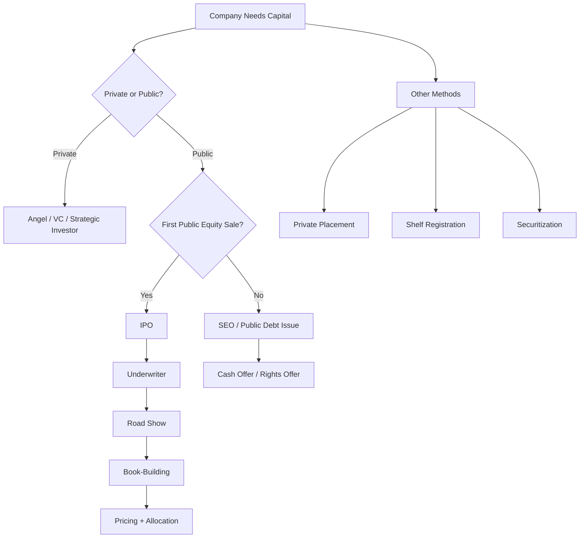
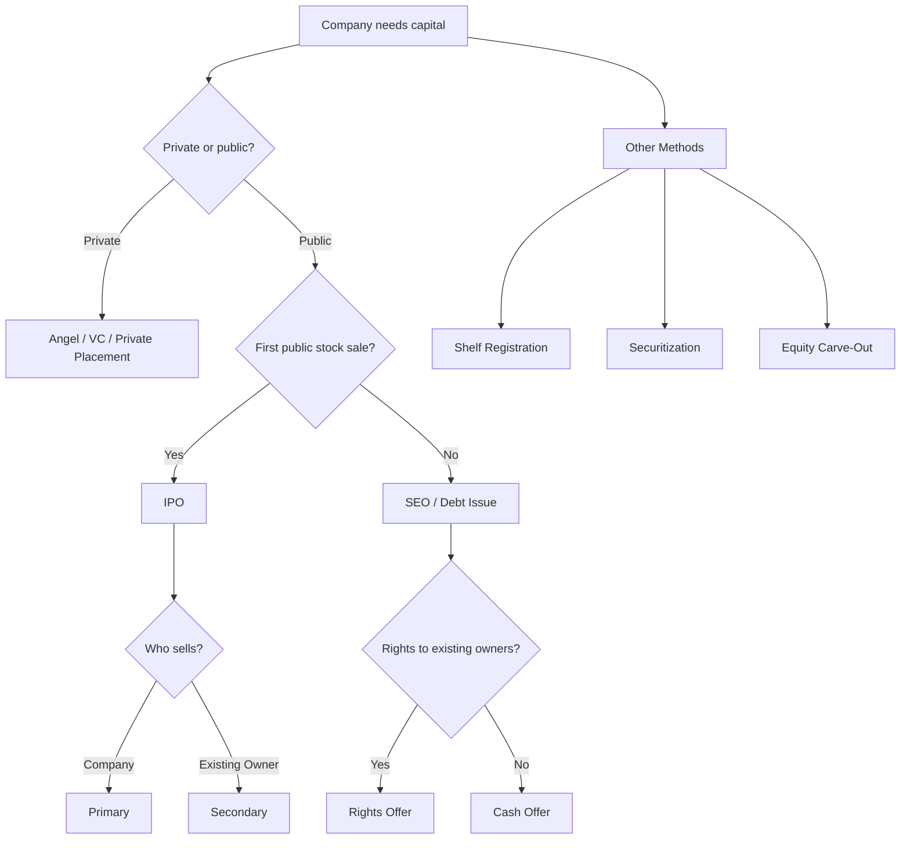

# 📘 2.5 — Capital Raising Methods

> [!ABSTRACT] Ringkasan Cepat
> **Topik:** Capital Raising Methods  
> **Bobot Parent Topic:** 20–30%  
> **Exam Priority:** High  
> **Difficulty:** Mixed  
> **Primary Skill:** Mixed — classification, financing mechanics, calculation, issuer/investor perspective, dan interpretation  
> **Ref:** Berk & DeMarzo Bab 23–24; Brigham & Ehrhardt Bab 20.

## Section 0 — Pemetaan Silabus & Exam Scope

| Field | Isi |
|---|---|
| Topik CF4 | Topik 2 — Sekuritas dan Bentuk Lain Keuangan Korporasi |
| Subtopik | 2.5 Capital Raising Methods |
| Learning Outcome | Memahami metode perusahaan memperoleh capital melalui securities. |
| Skill Diuji | Private financing, IPO, primary/secondary offerings, underwriting, road show, book-building, underpricing, SEO, rights offering, private placement, shelf registration, securitization, dan financing trade-offs. |
| Bobot Parent Topic | 20–30% |
| Exam Priority | High |
| Prerequisite | [[2.1 Equity Instruments]], [[2.2 Long-Term Debt Instruments]], primary vs secondary market, dilution |
| Connected Topics | [[2.1 Equity Instruments]], [[2.2 Long-Term Debt Instruments]], [[2.3 Short and Medium-Term Finance]], [[3.2 Sources of Finance and Capital Structure]], [[4.1 Financial Markets Structure]] |
| Referensi | Berk & DeMarzo Bab 23–24; Brigham & Ehrhardt Bab 20 |

> [!IMPORTANT] Scope Boundary
> `[CORE CF4]` Fokus subtopik ini adalah **bagaimana perusahaan memperoleh external capital melalui securities dan financing arrangements**. Core areas mencakup private financing, financing rounds, IPO, primary vs secondary shares, underwriting, pricing dan book-building, IPO underpricing, SEO, rights offering, private placement, shelf registration, equity carve-out, securitization, dan public/private debt-raising context.
>
> Detail debt maturity, refunding, dan project financing hanya menjadi supporting context di sini karena pembahasan utamanya berada di [[2.2 Long-Term Debt Instruments]].
>
> `[TEXTBOOK CONTEXT]` Detail SEC dan regulatory filing dalam Brigham/Berk dipertahankan hanya sebagai konteks textbook, bukan current-law guidance.

---

## Section 1 — Intuisi & Big Picture

Perusahaan dapat memiliki project yang bagus tetapi tetap tidak bisa tumbuh jika tidak memperoleh capital.

Pertanyaan yang harus dijawab bukan hanya:

> “Berapa uang yang dibutuhkan?”

Tetapi juga:

> “Security apa yang diterbitkan, kepada siapa dijual, bagaimana price ditentukan, siapa yang menanggung placement risk, berapa issuance cost, dan siapa sebenarnya menerima cash?”

Life-cycle financing:

```text
Founder Capital
↓
Angel Investors
↓
Venture Capital / Strategic Investors
↓
Private Financing Rounds
↓
IPO
↓
Public Capital Market
↓
SEO / Debt Issues
↓
Rights / Private Placement / Shelf / Securitization
```

Early-stage firms cenderung menggunakan private capital karena information asymmetry tinggi dan public flotation terlalu costly. Mature firms dapat menggunakan public markets karena investor base dan liquidity jauh lebih besar.

> [!TIP] Mental Model
> Pisahkan tiga layer:
>
> **Security → Offering Method → Cash Destination**

Contoh:

- common stock = security;
- IPO = offering method;
- primary shares = cash masuk ke company.

---

## Section 2 — Definisi & Core Concepts

### Definisi Formal

> [!NOTE] Definisi Formal
> **Capital raising** adalah proses memperoleh funds dari investors/lenders melalui penerbitan atau penempatan financial claims seperti equity atau debt.

---

### 2.1 Private Financing

Private equity sources yang ditekankan Berk & DeMarzo:

- **angel investors**;
- **venture capital firms**;
- **corporate/strategic investors**.

#### Angel Investors

Individual investors yang menggunakan personal capital dan dapat memberikan:

- expertise;
- contacts;
- monitoring;
- credibility.

#### Venture Capital

VC menyediakan capital plus active monitoring.

```text
Limited Partners
↓ committed capital
VC Fund
↓ managed by General Partner
Portfolio Companies
↓
Capital + Monitoring + Governance
```

#### Strategic Investor

Established corporation dapat berinvestasi untuk:

- financial return;
- technology access;
- commercial partnership;
- potential future acquisition.

> [!WARNING] Important Distinction
> Strategic investor dapat mengejar **strategic value**, bukan hanya financial return.

---

### 2.2 Financing Rounds

Private firms sering raise capital secara sequential.

Pre-money valuation:

$$
V_{\text{pre}}
=
N_{\text{old}}P
$$

Post-money valuation:

$$
V_{\text{post}}
=
V_{\text{pre}}
+
\text{New Capital}
$$

Equivalent:

$$
V_{\text{post}}
=
(N_{\text{old}}+N_{\text{new}})P
$$

New investor ownership:

$$
\text{Ownership}_{\text{new}}
=
\frac{N_{\text{new}}}
{N_{\text{old}}+N_{\text{new}}}
$$

atau:

$$
\text{Ownership}_{\text{new}}
=
\frac{\text{Amount Invested}}
{V_{\text{post}}}
$$

> [!DANGER] Dilution ≠ Automatic Wealth Destruction
> Existing shareholder percentage dapat turun, tetapi company menerima new cash. Track **ownership + value + proceeds**.

---

### 2.3 Exit Strategies

Berk & DeMarzo menekankan dua main exit strategies:

1. acquisition;
2. IPO.

---

### 2.4 Initial Public Offering

**IPO** = first sale of stock by a private company to public investors.

Main benefits:

- liquidity;
- access to larger capital pools;
- founder diversification;
- observable market valuation;
- publicly traded shares for compensation/acquisition.

Main costs:

- disclosure;
- compliance;
- flotation cost;
- dispersed ownership;
- weaker concentrated monitoring;
- possible control dilution.

---

### 2.5 Primary vs Secondary Shares

#### Primary Shares

New shares issued by company.

```text
Investors
↓ cash
Company
↓
New shares
```

Company receives proceeds.

#### Secondary Shares

Existing shares sold by current owners.

```text
Investors
↓ cash
Selling Owners
↓
Existing shares
```

Company receives **no new capital** from secondary portion.

> [!WARNING] Definition Trap
> IPO dapat mengandung primary dan secondary shares sekaligus.

---

### 2.6 Investment Bank / Underwriter

Investment bank membantu:

- determine issue size;
- choose/design securities;
- value and price issue;
- market and distribute;
- sometimes support aftermarket.

**Lead underwriter** coordinates deal dan dapat membentuk **syndicate** untuk berbagi distribution risk.

---

### 2.7 Best Efforts vs Firm Commitment

#### Best Efforts

Underwriter tries to sell securities tetapi tidak guarantees entire issue.

#### Firm Commitment

Underwriter buys issue from issuer and resells to investors.

| Feature | Best Efforts | Firm Commitment |
|---|---|---|
| Full-sale guarantee | No | More commitment by underwriter |
| Placement risk | More on issuer | More on underwriter |
| Proceeds certainty | Lower | Higher |

> [!BUG] Definition Trap
> Underwriting tidak berarti investment tersebut “guaranteed safe”.

---

### 2.8 IPO Process

```text
Select Underwriter
↓
Due Diligence + Registration
↓
Prospectus
↓
Road Show
↓
Book-Building
↓
Final Offer Price
↓
Allocation
↓
Public Trading
```

**Road show** = issuer/underwriter presentations kepada investors.

**Book-building** = collecting demand indications, quantities, dan price sensitivity untuk membantu pricing/allocation.

> [!TIP] Shortcut
> **Road show = communicate/market.**  
> **Book-building = collect demand information.**

---

### 2.9 Underwriting Spread

Spread per share:

$$
\text{Spread per Share}
=
P_{\text{offer}}
-
P_{\text{issuer}}
$$

Spread percentage:

$$
s
=
\frac{
P_{\text{offer}}-P_{\text{issuer}}
}{
P_{\text{offer}}
}
$$

Total fee:

$$
\text{Underwriting Fee}
=
N P_{\text{offer}}s
$$

Spread adalah **direct flotation cost**.

---

### 2.10 Net Proceeds

Gross proceeds dari primary shares:

$$
\text{Gross Proceeds}
=
N P_{\text{offer}}
$$

Dengan spread $s$:

$$
\text{Net Proceeds}
=
N P_{\text{offer}}(1-s)
$$

Jika additional direct costs $F$:

$$
\text{Net Proceeds}
=
N P_{\text{offer}}(1-s)-F
$$

> [!DANGER] Exam Trap
> Financing need tidak boleh dibagi begitu saja dengan offer price jika issuer tidak menerima full offer price.

---

### 2.11 Greenshoe and Lockup

**Greenshoe** memberi underwriter option untuk sell additional shares beyond initial offering size, membantu demand management dan stabilization.

**Lockup** membatasi insiders menjual shares selama specified post-IPO period.

> Greenshoe adalah underwriter mechanism; rights offering adalah shareholder preemptive mechanism. Jangan tertukar.

---

### 2.12 IPO Underpricing

IPO underpriced jika initial market value exceeds offer price.

First-day return:

$$
R_{\text{initial}}
=
\frac{
P_1-P_0
}{
P_0
}
$$

Money left on table:

$$
\text{Money Left on Table}
=
N(P_1-P_0)
$$

Underpricing:

- benefits allocated investors;
- is an indirect issuance cost to issuer/existing owners.

---

### 2.13 Winner's Curse

Attractive IPOs cenderung oversubscribed dan allocations rationed, sedangkan weak issues lebih mudah diperoleh.

Result:

> uninformed investor dapat memperoleh little of good deals dan much more of weak deals.

Positive average first-day return therefore bukan guaranteed free lunch.

---

### 2.14 Seasoned Equity Offering

**SEO** = sale of stock by a company that is already publicly traded.

```text
Private → Public first time = IPO
Already Public → More equity = SEO
```

Two types emphasized by Berk & DeMarzo:

- **cash offer**;
- **rights offer**.

---

### 2.15 Rights Offering

Existing shareholders receive rights to purchase new shares.

Purpose:

- preserve proportional ownership;
- protect shareholders against wealth transfer from below-market subscription price.

Theoretical ex-rights price:

$$
P_{\text{ex}}
=
\frac{
N_0P_0+N_1P_s
}{
N_0+N_1
}
$$

where:

- $N_0$ = old shares;
- $P_0$ = old market price;
- $N_1$ = new shares;
- $P_s$ = subscription price.

> [!TIP] Core Interpretation
> A low subscription price does not mechanically destroy value because the rights themselves have value and the firm receives cash.

---

### 2.16 SEO Announcement Effect

Berk & DeMarzo reports negative average price reaction around SEO announcements in textbook evidence.

Important logic:

```text
Managers possess private information
↓
Management chooses to issue equity
↓
Market may infer shares are not undervalued
or may be overvalued
↓
Price can fall
```

This is **adverse selection**, not merely share-count dilution.

---

### 2.17 Equity Carve-Out

Brigham: parent company sells minority stake in subsidiary to public investors.

```text
Parent
↓ owns Subsidiary
Subsidiary shares sold to public
↓
Public minority stake
Parent usually retains control
```

Possible benefits:

- separate valuation;
- capital raising;
- incentives;
- strategic flexibility.

> [!BUG] Equity carve-out ≠ full divestiture.

---

### 2.18 Private Placement

Security sold directly to one or small number of investors.

Can involve:

- equity;
- debt.

Benefits:

- customized terms;
- direct negotiation;
- lower public issuance burden;
- concentrated monitoring.

Costs:

- lower liquidity;
- smaller investor universe;
- potentially higher required return;
- restrictive covenants.

> [!IMPORTANT] Private Placement ≠ Secondary Market
> Private placement can raise **new capital**.

---

### 2.19 Competitive Bid vs Negotiated Deal

**Competitive bid**: investment banks compete on financing terms.

**Negotiated deal**: issuer selects banker and collaboratively designs/prices/distributes issue.

Shortcut:

> Competitive = bankers compete.  
> Negotiated = chosen banker collaborates.

---

### 2.20 Shelf Registration

`[TEXTBOOK CONTEXT]`

Qualified issuer can register securities in advance and sell portions later.

```text
Register
↓
Wait for favorable market window
↓
Issue quickly
```

Economic benefit:

> **timing flexibility**.

---

### 2.21 Securitization

Securitization pools cash-flow-producing financial assets and issues securities backed by pool cash flows.

Examples:

- mortgages;
- auto loans;
- credit-card receivables;
- equipment leases.

```text
Loans / Receivables
↓
Pool
↓
Securities
↓
Investors
```

Potential benefits:

- greater liquidity;
- broader funding sources;
- potentially lower funding cost;
- transfer/repackaging of risk.

> [!WARNING] Securitization does not eliminate underlying credit risk.

---

### 2.22 Debt Capital Raising Context

Berk & DeMarzo Chapter 24 shows corporations can raise debt through:

- public bonds;
- term loans;
- syndicated loans;
- revolving facilities;
- private placements;
- asset-backed financing.

Thus:

> security type and placement method are separate decisions.

---

### Terminologi Penting

| Istilah | Definisi | Intuisi | Exam Note |
|---|---|---|---|
| Angel investor | Individual early-stage investor | Capital + advice | Private financing |
| Venture capital | Private institutional equity | Capital + monitoring | Active investor |
| Pre-money | Value before new funding | Existing pie | Before cash |
| Post-money | Value after new funding | Enlarged pie | Pre + new capital |
| IPO | First public stock sale | Private → public | First public issue |
| Primary shares | New shares by company | Cash → issuer | Raises capital |
| Secondary shares | Existing shares sold by owners | Cash → seller | No new issuer capital |
| Underwriter | Investment bank managing issue | Intermediary | Pricing/distribution |
| Syndicate | Group of underwriters | Shares distribution risk | Large deals |
| Best efforts | No full-sale guarantee | More issuer risk | Underwriting method |
| Firm commitment | Underwriter buys/resells | More banker risk | Higher proceeds certainty |
| Road show | Investor presentations | Marketing | ≠ book-building |
| Book-building | Collect investor demand | Price discovery | Pricing/allocation |
| Underwriting spread | Offer price minus issuer proceeds | Banker compensation | Direct cost |
| Greenshoe | Additional-share option | Underwriter flexibility | Stabilization/demand |
| Lockup | Temporary insider sale restriction | Reduce selling pressure | Post-IPO |
| Underpricing | Offer below initial market price | Money left on table | Indirect cost |
| Winner's curse | Good IPO rationing | Allocation adverse selection | No free lunch |
| SEO | Later public equity issue | Raise more equity | Already public |
| Rights offer | Existing holders get rights | Ownership protection | Rights have value |
| Equity carve-out | Minority subsidiary public sale | Partial monetization | Parent retains control |
| Private placement | Direct sale to limited investors | Customized financing | Less liquid |
| Shelf registration | Register before later issuance | Timing flexibility | Textbook context |
| Securitization | Pool assets and issue claims | Turn illiquid claims into securities | Risk not erased |

---

## Section 3 — How It Works

### Capital Raising Framework

```text
Capital Need
↓
Security Type
↓
Private or Public?
↓
Primary or Secondary?
↓
Intermediary?
↓
Pricing / Allocation
↓
Fees / Underpricing
↓
Ownership / Control / Liquidity
```

### IPO Cash Flow

```text
Public Investors
↓ cash
Underwriter
↓ net proceeds
Issuer
```

Secondary portion:

```text
Public Investors
↓ cash
Selling Shareholder
```

> [!TIP] In offering problems: **follow the cash**.

### Cost Framework

```text
Gross Offering
↓
Underwriting Spread
↓
Direct Costs
↓
Underpricing / Money Left on Table
↓
Net Economic Proceeds
```

> [!DANGER] Jangan Salah Pikir
> 1. IPO = all cash goes to company.
> 2. Secondary market raises issuer capital.
> 3. Firm commitment guarantees investor return.
> 4. Road show = book-building.
> 5. Underpricing is automatically good for issuer.
> 6. SEO decline is purely mechanical dilution.
> 7. Rights issue below market automatically destroys value.
> 8. Private placement is necessarily secondary.
> 9. Shelf registration locks a favorable price.
> 10. Securitization removes credit risk.

---

## Section 4 — Worked Examples & Exam Cases

### Case A — Pre/Post-Money Valuation

Founder has 8 million shares. VC invests Rp20 billion at Rp5,000 per new share.

> [!SUCCESS] Pembahasan
>
> Pre-money:
>
> $$
> 8{,}000{,}000
> \times
> 5{,}000
> =
> Rp40\text{ billion}
> $$
>
> New shares:
>
> $$
> \frac{
> 20{,}000{,}000{,}000
> }{
> 5{,}000
> }
> =
> 4{,}000{,}000
> $$
>
> Post-money:
>
> $$
> 40+20
> =
> Rp60\text{ billion}
> $$
>
> VC ownership:
>
> $$
> \frac{4}{12}
> =
> 33.33\%
> $$

> [!WARNING] Exam Trap
> Post-money denominator = old + new shares.

---

### Case B — Primary vs Secondary

IPO sells 10 million shares at Rp4,000:

- 6 million primary;
- 4 million secondary.

> [!SUCCESS] Pembahasan
>
> Issuer receives:
>
> $$
> 6{,}000{,}000(4{,}000)
> =
> Rp24\text{ billion}
> $$
>
> Selling owners receive:
>
> $$
> 4{,}000{,}000(4{,}000)
> =
> Rp16\text{ billion}
> $$

Total deal = Rp40 billion, but new company capital = Rp24 billion.

---

### Case C — Underwriting Spread

5 million primary shares at Rp10,000; spread 6%.

> [!SUCCESS] Pembahasan
>
> Gross:
>
> $$
> Rp50\text{ billion}
> $$
>
> Fee:
>
> $$
> 0.06(50)
> =
> Rp3\text{ billion}
> $$
>
> Net:
>
> $$
> Rp47\text{ billion}
> $$

---

### Case D — IPO Underpricing

Offer = Rp2,000; first-day price = Rp2,500; 8 million primary shares.

> [!SUCCESS] Pembahasan
>
> Return:
>
> $$
> \frac{2{,}500-2{,}000}{2{,}000}
> =
> 25\%
> $$
>
> Money left:
>
> $$
> 8{,}000{,}000(500)
> =
> Rp4\text{ billion}
> $$

---

### Case E — Rights Offering

10 million old shares at Rp40,000. Company issues 2 million shares at Rp25,000.

> [!SUCCESS] Pembahasan
>
> Old equity:
>
> $$
> Rp400\text{ billion}
> $$
>
> New cash:
>
> $$
> Rp50\text{ billion}
> $$
>
> Post-issue equity:
>
> $$
> Rp450\text{ billion}
> $$
>
> Ex-rights price:
>
> $$
> \frac{
> 450\text{ billion}
> }{
> 12\text{ million}
> }
> =
> Rp37{,}500
> $$

> [!WARNING] Exam Trap
> Include new cash; don't divide old equity by new shares only.

---

### Case F — Underwriting Method

Issuer needs high certainty of financing proceeds for an acquisition.

> [!SUCCESS] Pembahasan
>
> **Firm commitment** is conceptually more suitable than best efforts because underwriter assumes more placement risk.

---

### Case G — Private Placement

Firm wants fast direct negotiation with few institutions and customized terms.

> [!SUCCESS] Pembahasan
>
> **Private placement**.
>
> Trade-off: customization and lower public issuance burden vs lower liquidity and potentially restrictive terms.

---

### Case H — Securitization

Finance company pools auto loans and sells securities backed by pool cash flows.

> [!SUCCESS] Pembahasan
>
> **Asset securitization**.
>
> It converts illiquid loan claims into marketable securities and transfers/repackages risk, but does not remove borrower credit risk.

---

## Section 5 — Interpretation & Sanity Check

> [!CHECK] Sanity Check
> 1. Primary shares → cash to issuer.
> 2. Secondary shares → cash to selling owner.
> 3. Post-money = pre-money + new capital.
> 4. Spread reduces issuer net proceeds.
> 5. Positive first-day jump implies positive underpricing return.
> 6. More underpricing or more primary shares → more money left on table.
> 7. Rights issue below market does not automatically destroy wealth.
> 8. SEO price reaction is not explained solely by higher share count.
> 9. Private placement can raise new capital.
> 10. Shelf registration improves timing flexibility but does not eliminate market risk.
> 11. Securitization transforms liquidity/risk distribution, not credit quality itself.

### Interpretation Ladder

> **Level 1 — Method:** IPO/SEO/rights/private placement?  
> **Level 2 — Security:** equity/debt/hybrid?  
> **Level 3 — Cash Destination:** issuer or selling owner?  
> **Level 4 — Intermediary:** underwriter/syndicate/direct?  
> **Level 5 — Cost:** spread/direct cost/underpricing?  
> **Level 6 — Ownership:** dilution/control?  
> **Level 7 — Information:** what does issuance choice signal?

---

## Section 6 — Connections & Mental Model



- [[2.1 Equity Instruments]] — defines the claim; 2.5 explains how it is sold.
- [[2.2 Long-Term Debt Instruments]] — defines debt contract; 2.5 explains public/private placement.
- [[2.3 Short and Medium-Term Finance]] — bridge finance can cover timing before long-term issue proceeds.
- [[3.2 Sources of Finance and Capital Structure]] — focuses on debt/equity mix rather than issuance mechanics.
- [[4.1 Financial Markets Structure]] — primary market raises issuer capital; secondary market provides trading/liquidity.

---

## Section 7 — Exam Traps & Misconceptions

### Definition Trap

> [!BUG] Definition Trap
> - IPO ≠ SEO.
> - Primary shares ≠ secondary shares.
> - Rights offering ≠ secondary-market transaction.
> - Private placement ≠ private equity only.

### Logic Trap

> [!BUG] Logic Trap
> - Dilution ≠ automatic wealth destruction.
> - Underpricing is not automatically good for issuer.
> - Secondary shares do not increase corporate cash.
> - Rights issued below market are not automatically a giveaway.
> - Securitization does not erase bad-credit risk.

### Calculation Trap

> [!BUG] Calculation Trap

**Post-money — Salah**

$$
V_{\text{post}}
=
V_{\text{pre}}
-
\text{New Capital}
$$

**Benar**

$$
V_{\text{post}}
=
V_{\text{pre}}
+
\text{New Capital}
$$

**IPO return — Salah**

$$
R
=
\frac{P_1-P_0}{P_1}
$$

**Benar**

$$
R
=
\frac{P_1-P_0}{P_0}
$$

**Rights price — Benar**

$$
P_{\text{ex}}
=
\frac{
N_0P_0+N_1P_s
}{
N_0+N_1
}
$$

### Interpretation Trap

> [!BUG] Interpretation Trap
> - Oversubscribed IPO does not prove issuer maximized proceeds.
> - SEO price fall can reflect adverse selection.
> - Private placement may have lower issuance burden but higher illiquidity premium.
> - Shelf registration gives flexibility, not a guaranteed future price.

### Red Flags

> [!CAUTION] Red Flags

| Keyword | Pikirkan |
|---|---|
| first sale to public | IPO |
| already public, new stock | SEO |
| new shares by company | Primary |
| existing owner sells | Secondary |
| no sale guarantee | Best efforts |
| bank buys/resells | Firm commitment |
| group of banks | Syndicate |
| investor presentations | Road show |
| demand indications | Book-building |
| offer price vs issuer proceeds | Spread |
| first-day jump | Underpricing |
| existing holders get rights | Rights offer |
| minority subsidiary stake | Equity carve-out |
| few institutions | Private placement |
| register now, issue later | Shelf registration |
| pool receivables/loans | Securitization |

---

## Section 8 — Executive Summary

> [!SUMMARY] Must Remember
> 1. Capital raising method is distinct from security type.
> 2. Private firms commonly progress founder → angel → VC/strategic investor → IPO.
> 3. 
>
> $$
> V_{\text{post}}
> =
> V_{\text{pre}}
> +
> \text{New Capital}
> $$
>
> 4. IPO = first public stock sale.
> 5. Primary shares raise company capital; secondary shares provide owner liquidity.
> 6. Best efforts leaves more placement risk with issuer; firm commitment shifts more to underwriter.
> 7. Road show markets; book-building gathers demand.
> 8. Underwriting spread is a direct flotation cost.
> 9. Underpricing benefits allocated investors but leaves money on table.
> 10. SEO = later equity issue by public company.
> 11. Rights offer protects existing shareholder ownership/value.
> 12. Private placement emphasizes customization over liquidity.
> 13. Shelf registration provides timing flexibility.
> 14. Securitization creates tradable claims on pooled cash flows but does not eliminate credit risk.

### Comparison Table

| Method | Investor Base | New Company Capital? | Main Trade-Off |
|---|---|---:|---|
| Angel | Individual private | Yes | Capital/advice vs dilution |
| VC | Private institutional | Yes | Capital/monitoring vs control |
| IPO Primary | Public | Yes | Large capital vs cost/disclosure |
| IPO Secondary | Public | No | Owner liquidity |
| SEO Cash Offer | Public | Yes for primary | Capital vs dilution/information |
| Rights Offer | Existing holders | Yes | Ownership protection |
| Private Placement | Few investors | Yes | Customization vs liquidity |
| Shelf Issue | Public | Yes | Timing flexibility |
| Securitization | Capital market | Yes via asset funding | Liquidity vs structural risk |

### Trigger Keywords

| Jika soal mengatakan... | Pikirkan... |
|---|---|
| founder seeks early outside capital | Angel/VC |
| first public stock sale | IPO |
| founder sells existing shares | Secondary |
| company issues new shares | Primary |
| banker buys then resells | Firm commitment |
| banker only attempts sale | Best efforts |
| management investor presentations | Road show |
| indications of demand | Book-building |
| first-day price jump | Underpricing |
| public firm issues more equity | SEO |
| existing holders offered first | Rights |
| few institutional buyers | Private placement |
| pre-register securities | Shelf |
| pooled receivables | Securitization |

### Kapan Digunakan

Gunakan framework ini untuk:

- private vs public financing;
- pre/post-money valuation;
- primary vs secondary shares;
- IPO/SEO;
- underwriting;
- spread/net proceeds;
- underpricing;
- rights offerings;
- private placement;
- shelf registration;
- securitization.

### Kapan TIDAK Boleh Digunakan

Jangan menggantikan:

- [[2.1 Equity Instruments]] untuk rights of securities;
- [[2.2 Long-Term Debt Instruments]] untuk bond terms;
- [[2.3 Short and Medium-Term Finance]] untuk working-capital facilities;
- [[2.4 Derivative Securities in Corporate Finance]] untuk options;
- [[3.2 Sources of Finance and Capital Structure]] untuk optimal financing mix.

---

### Quick Decision Tree



---

## Section 9 — Active Recall Check

1. Apa perbedaan security type dan capital raising method?
2. Mengapa young firms biasanya memperoleh private capital sebelum public capital?
3. Angel investor vs VC?
4. Apa tujuan strategic investor?
5. Bagaimana menghitung pre-money valuation?
6. Bagaimana menghitung post-money valuation?
7. Mengapa dilution tidak otomatis berarti wealth loss?
8. Apa dua exit strategies utama private investors?
9. Apa definisi IPO?
10. Benefit dan cost utama going public?
11. Primary vs secondary shares?
12. Siapa menerima cash dari secondary shares?
13. Apa peran underwriter?
14. Best efforts vs firm commitment?
15. Apa fungsi syndicate?
16. Road show vs book-building?
17. Bagaimana menghitung underwriting spread?
18. Mengapa net proceeds < gross proceeds?
19. Apa fungsi greenshoe?
20. Apa fungsi lockup?
21. Apa itu IPO underpricing?
22. Bagaimana menghitung first-day return?
23. Apa itu money left on table?
24. Apa intuition winner's curse?
25. IPO vs SEO?
26. Cash offer vs rights offer?
27. Mengapa rights mempunyai value?
28. Mengapa SEO price reaction bukan hanya dilution?
29. Apa itu equity carve-out?
30. Private placement vs secondary transaction?
31. Competitive bid vs negotiated deal?
32. Apa manfaat shelf registration?
33. Apa itu securitization?
34. Mengapa securitization tidak menghapus credit risk?

---

## Section 10 — Exam Pattern Map

| Narasi Soal | Keyword | Konsep | Formula/Rule | Trap | Shortcut |
|---|---|---|---|---|---|
| VC invests in private firm | round | Pre/post-money | $V_{post}=V_{pre}+I$ | Wrong ownership denominator | New cash enlarges pie |
| Founder sells existing shares | secondary | Secondary offering | Cash → seller | Company gets cash | Follow cash |
| Company sells new shares | primary | Primary offering | Cash → issuer | Secondary confusion | New shares |
| Bank only tries to sell | best efforts | Underwriting | No guarantee | “Best” outcome | No guarantee |
| Bank buys and resells | firm commitment | Underwriting | Banker risk | Investment guaranteed | Buy/resell |
| Investor presentations | road show | IPO process | Marketing | Book-building | Presentation |
| Demand indications | book-building | Price discovery | Demand | Road show only | Build book |
| Offer vs issuer price | spread | Flotation cost | $s=(P_o-P_i)/P_o$ | Market price denominator | Offer vs issuer |
| First-day jump | underpricing | IPO cost | $R=(P_1-P_0)/P_0$ | Wrong denominator | Offer denominator |
| Public firm issues again | seasoned | SEO | Already public | IPO | Already public |
| Existing holders offered shares | rights | Rights offer | Ex-rights formula | Low price = loss | Rights have value |
| Few institutions | private | Private placement | Direct sale | Secondary market | Limited group |
| Register before issue | shelf | Shelf registration | Timing flexibility | Price locked | Timing |
| Pool receivables | pool | Securitization | Asset cash flows | Risk disappears | Risk transferred |

`[TEXTBOOK-BASED EXPECTATION]` Pattern map ini berasal dari Berk & DeMarzo Chapters 23–24 dan Brigham Chapter 20. Tidak digunakan `[PAST EXAM EVIDENCE]` karena past exam tidak menjadi source pada permintaan ini.

---

## Source Traceability

| Materi | Sumber |
|---|---|
| Angels / VC / strategic investors | Berk & DeMarzo, Chapter 23 §23.1; Brigham, Chapter 20 §20.1 |
| Financing rounds / pre-post-money | Berk & DeMarzo, Chapter 23 §23.1 |
| Exit strategies | Berk & DeMarzo, Chapter 23 §23.1 |
| IPO and going-public trade-off | Berk & DeMarzo, Chapter 23 §23.2; Brigham, Chapter 20 §20.2 |
| Primary vs secondary offering | Berk & DeMarzo, Chapter 23 §23.2 |
| Underwriter / syndicate | Berk & DeMarzo, Chapter 23 §23.2; Brigham, Chapter 20 §20.3 |
| Best efforts / firm commitment | Berk & DeMarzo, Chapter 23 §23.2; Brigham, Chapter 20 §20.3 |
| Prospectus / road show / book-building | Berk & DeMarzo, Chapter 23 §23.2; Brigham, Chapter 20 §20.3 |
| Underwriting spread | Berk & DeMarzo, Chapter 23 §23.2; Brigham, Chapter 20 §20.3 |
| Greenshoe / lockup | Berk & DeMarzo, Chapter 23 §23.2 |
| IPO underpricing / winner's curse | Berk & DeMarzo, Chapter 23 §23.3 |
| SEO / cash offer / rights offer | Berk & DeMarzo, Chapter 23 §23.4 |
| SEO adverse-selection interpretation | Berk & DeMarzo, Chapter 23 §23.4 |
| Equity carve-out | Brigham & Ehrhardt, Chapter 20 §20.4 |
| Competitive bid / negotiated deal | Brigham & Ehrhardt, Chapter 20 §20.5 |
| Private placement | Brigham, Chapter 20 §§20.1, 20.5; Berk & DeMarzo, Chapter 24 §24.1 |
| Shelf registration | Brigham & Ehrhardt, Chapter 20 §20.5 |
| Securitization | Brigham, Chapter 20 §20.5; Berk & DeMarzo, Chapter 24 §24.2 |
| Public/private debt context | Berk & DeMarzo, Chapter 24 §24.1 |

---

> [!QUOTE] Follow-up Options
> 1. *"Uji saya dengan soal Active Recall dari topik ini"*
> 2. *"Buat 10 soal exam-style untuk topik ini"*
> 3. *"Jelaskan hubungan topik ini dengan topik CF4 terkait"*

*📖 Ref: Berk & DeMarzo Bab 23–24; Brigham & Ehrhardt Bab 20 | 🗓️ 2026-08-24 | #CF4 #AkuntansiKeuanganKorporasi*
