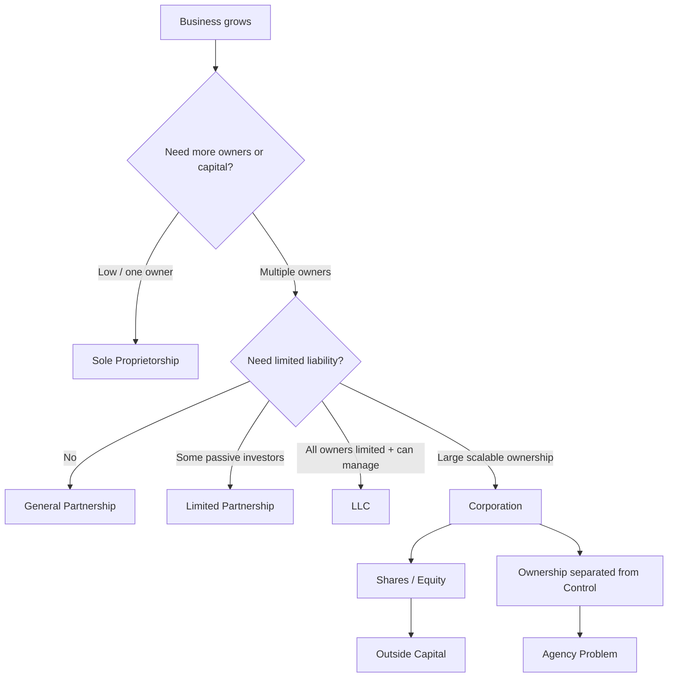
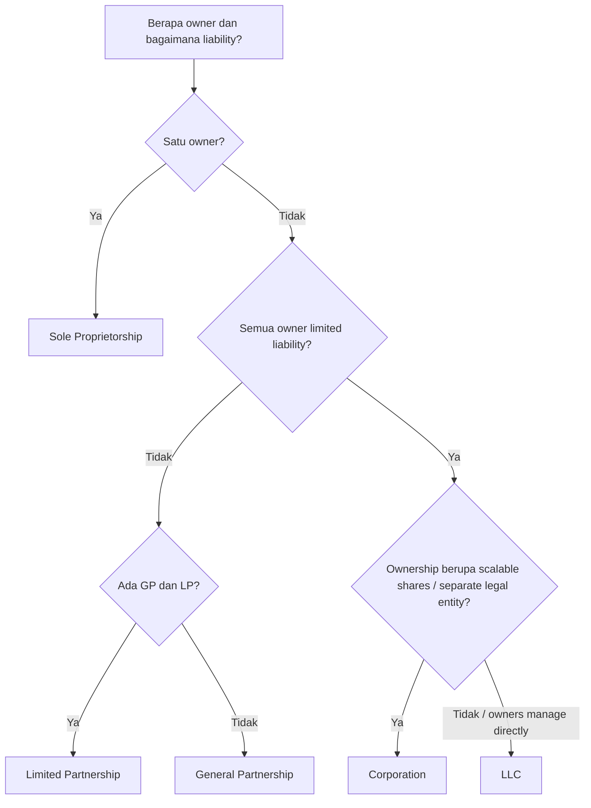

# 📘 3.1 — Business Entity Structures

> [!ABSTRACT] Ringkasan Cepat
> **Topik:** Business Entity Structures  
> **Bobot Parent Topic:** 10–20%  
> **Exam Priority:** Medium-High  
> **Difficulty:** Concept-Intensive  
> **Primary Skill:** Concept — classification, comparison, dan interpretation  
> **Ref:** Berk & DeMarzo, Bab 1 §§1.1–1.3

## Section 0 — Pemetaan Silabus & Exam Scope

| Field | Isi |
|---|---|
| Topik CF4 | Topik 3 — Pembiayaan Korporasi |
| Subtopik | 3.1 Business Entity Structures |
| Learning Outcome | Memahami berbagai struktur entitas bisnis beserta kekurangan dan kelebihannya. |
| Skill Diuji | Mengidentifikasi bentuk entitas dari cirinya; membandingkan liability, ownership, control, continuity, transferability, taxation, dan ability to raise capital; menjelaskan mengapa corporation cocok untuk business berskala besar. |
| Bobot Parent Topic | 10–20% |
| Exam Priority | Medium-High |
| Prerequisite | Owner vs business, debt vs equity, limited vs unlimited liability, shareholder, dividend, financing |
| Connected Topics | [[2.1 Equity Instruments]], [[2.5 Capital Raising Methods]], [[3.2 Sources of Finance and Capital Structure]], [[4.3 Agency Theory and Governance]] |
| Referensi | Berk & DeMarzo Bab 1 §§1.1–1.3 |

> [!IMPORTANT] Scope Boundary
> `[CORE CF4]` Subtopik ini berfokus pada **bentuk organisasi bisnis dan economic trade-off-nya**: sole proprietorship, partnership, limited partnership, LLC, dan corporation; termasuk hubungan ownership–control yang muncul terutama pada corporation. Detail legal dan tax yang sangat spesifik terhadap Amerika Serikat diperlakukan sebagai `[TEXTBOOK CONTEXT]`, bukan aturan hukum Indonesia.
>
> Silabus Topik 3 juga mencantumkan Brigham & Ehrhardt Bab 9, 10, 14, 15 dan Weygandt Bab 26. Bagian-bagian tersebut terutama mendukung subtopik 3.2–3.4 (cost of capital, capital budgeting, capital structure, dividend policy, dan investment appraisal), bukan classification of business entities. Karena itu note 3.1 tidak memaksakan materi dari chapter tersebut. **Sumber inti yang secara langsung mendukung learning outcome 3.1 adalah Berk & DeMarzo Bab 1 §§1.1–1.3.**

---

## Section 1 — Intuisi & Big Picture

Bayangkan dua bisnis.

**Bisnis A** adalah kedai kecil milik satu orang. Owner menjalankan usaha sendiri, mengambil keputusan sendiri, dan menerima seluruh keuntungan. Jika bisnis gagal membayar utang, masalahnya tidak berhenti di kas usaha—creditor dapat mengejar personal assets owner.

**Bisnis B** adalah perusahaan besar dengan ribuan shareholders. Para pemilik tidak menjalankan operasi sehari-hari. Ownership dibagi menjadi shares, management dijalankan oleh executives, dan business secara hukum dipisahkan dari owners. Jika perusahaan gagal, shareholder pada umumnya kehilangan nilai investasinya, tetapi tidak otomatis harus membayar seluruh debt perusahaan dari personal assets.

Keduanya sama-sama “business”, tetapi **struktur entitasnya mengubah siapa yang menanggung risiko, siapa yang mengendalikan keputusan, seberapa mudah ownership berpindah, bagaimana business bertahan dari pergantian owner, dan seberapa mudah capital dapat dihimpun.**

Jadi masalah nyata yang diselesaikan oleh konsep *business entity structures* adalah:

> **Bagaimana memilih bentuk organisasi yang cocok dengan kebutuhan ownership, risk-bearing, control, continuity, taxation, dan financing sebuah business?**

### Mengapa konsep ini ada?

Tidak ada satu bentuk business yang unggul pada semua dimensi.

- Struktur sederhana biasanya mudah didirikan, tetapi dapat membawa personal liability besar.
- Struktur dengan limited liability melindungi owners lebih baik, tetapi lebih formal.
- Struktur yang ownership-nya mudah diperdagangkan mempermudah capital raising, tetapi memisahkan ownership dari control.
- Struktur dengan banyak owners dapat memperoleh capital jauh lebih besar, tetapi membutuhkan governance mechanism.

Dengan kata lain:

```text
Bentuk entitas
    ↓
Menentukan legal separation
    ↓
Menentukan siapa menanggung liability
    ↓
Mempengaruhi ownership & control
    ↓
Mempengaruhi transferability & continuity
    ↓
Mempengaruhi ability to raise capital
    ↓
Mempengaruhi scale dan governance problem
```

### Siapa yang menggunakan konsep ini?

- **Founder / entrepreneur** — memilih bentuk awal business.
- **Investor** — menilai rights dan exposure atas investasi.
- **Creditor** — menilai siapa yang secara hukum/economically menanggung debt.
- **Management** — memahami hubungan antara owners, board, dan executives.
- **Shareholders** — memahami rights terhadap control dan residual value.

### Keputusan apa yang dibantu?

1. Apakah business cukup dijalankan sebagai sole proprietorship?
2. Apakah multiple owners lebih cocok menggunakan partnership?
3. Apakah limited liability diperlukan?
4. Apakah business membutuhkan ownership yang transferable?
5. Apakah perusahaan akan membutuhkan external equity dalam jumlah besar?
6. Apakah separation of ownership and control dapat diterima dan dikelola?

### Apa yang salah jika konsep ini disalahpahami?

Kesalahan paling berbahaya adalah menganggap seluruh bentuk business memiliki risk yang sama bagi owner.

> [!DANGER] Core Misunderstanding
> **Kerugian business tidak selalu terbatas pada modal yang ditanamkan owner.**
>
> Pada sole proprietorship dan general partnership, owner/partner dapat memiliki **unlimited personal liability**. Pada corporation dan LLC, textbook menekankan **limited liability** sebagai karakteristik utama.

---

## Section 2 — Definisi & Core Concepts

### Definisi Formal

> [!NOTE] Definisi Formal
> **Sole proprietorship** adalah business yang dimiliki dan dijalankan oleh satu orang.
>
> **Partnership** adalah bentuk business dengan lebih dari satu owner; dalam general partnership, partners bertanggung jawab terhadap debt firm.
>
> **Limited partnership** memiliki dua jenis owner: **general partners** dan **limited partners**. General partners mengelola business dan memiliki personal liability; limited partners memiliki liability terbatas pada investment tetapi tidak memiliki management authority.
>
> **Limited liability company (LLC)** adalah bentuk di mana seluruh owners memiliki limited liability namun tetap dapat terlibat dalam pengelolaan business.
>
> **Corporation** adalah legally defined artificial being / legal entity yang **separate from its owners**. Corporation dapat memiliki assets, membuat contracts, menanggung obligations, dan ownership-nya dibagi menjadi shares of stock.

### Terminologi Penting

| Istilah | Definisi | Intuisi | Exam Note |
|---|---|---|---|
| Sole proprietorship | Business owned and run by one person | Owner dan business sangat melekat | Simple, tetapi unlimited personal liability |
| Partnership | Business dengan >1 owner | Beberapa orang berbagi ownership | General partners dapat menanggung seluruh debt |
| General partner | Partner dengan management authority dan personal liability | Mengendalikan sekaligus menanggung risk besar | Jangan tertukar dengan limited partner |
| Limited partner | Investor partnership dengan liability terbatas dan tanpa management authority | Passive capital provider | Limited liability datang bersama restriction on control |
| LLC | Entity dengan limited liability bagi semua owners dan ability to manage | Kombinasi liability protection + owner management | Berbeda dari limited partnership |
| Corporation | Separate legal entity dari owners | Business dianggap entitas tersendiri | Foundation bagi scalable ownership |
| Limited liability | Loss owner umumnya dibatasi pada investment | Personal assets owner lebih terlindungi | Core advantage corporation/LLC |
| Unlimited personal liability | Creditor dapat menuntut personal assets owner/partner | Risk business dapat spill over ke personal wealth | Core disadvantage proprietorship/general partnership |
| Stock | Shares yang membagi ownership corporation | Unit kepemilikan | Memungkinkan ownership transfer |
| Equity | Collection of all outstanding ownership shares | Residual ownership claim | Ownership corporation secara agregat |
| Shareholder / stockholder / equity holder | Owner of stock | Pemilik economic claim corporation | Dapat memperoleh dividend dan voting rights |
| Board of directors | Body yang dipilih shareholders dan memiliki ultimate decision-making authority | Jembatan ownership ke control | Core corporation governance |
| CEO | Executive yang menjalankan corporation sesuai policy board | Day-to-day leadership | Control ≠ ownership |
| CFO | Senior financial manager | Investment, financing, cash management | Bridge ke Topik 3 berikutnya |
| Agency problem | Managers mendahulukan self-interest dibanding shareholder interests | Problem dari separation ownership-control | Bridge ke [[4.3 Agency Theory and Governance]] |

### Core Relationships

Untuk ujian, jangan menghafal nama bentuk entity secara terpisah. Gunakan lima dimensi inti:

```text
1. Liability
2. Control
3. Transferability
4. Continuity
5. Capital-raising capacity
```

Tambahkan dua dimensi pendukung:

```text
6. Formation complexity
7. Tax treatment
```

#### Mental Matrix Utama

| Dimension | Sole Proprietorship | General Partnership | Limited Partnership | LLC | Corporation |
|---|---|---|---|---|---|
| Number of owners | 1 | >1 | >1 | >1 possible | Potentially many |
| Legal separation from owner | Lemah / tidak terpisah dalam framing textbook | Lemah | Partnership structure | Lebih terpisah | **Separate legal entity** |
| Owner liability | **Unlimited** | **Unlimited** for general partners | GP unlimited; LP limited | **Limited** | **Limited** |
| Management | Owner | Partners | General partners | Owners dapat manage | Board + management |
| Transferability | Sulit | Relatif sulit | LP interest lebih transferable | Lebih fleksibel | **Shares mudah diperdagangkan** |
| Continuity | Terkait owner | Dapat berakhir saat partner keluar/meninggal | Withdrawal LP tidak otomatis dissolve | Lebih durable | **Not tied to individual owner life** |
| Ability to raise large capital | Rendah | Terbatas | Lebih baik tetapi struktur khusus | Lebih baik | **Sangat kuat** |
| Formation | Simple | Relatif simple | Lebih formal | Lebih formal | **Paling formal/costly** |
| Tax framing | Owner-level | Owner-level | Partnership-style | Context dependent | C corp dapat mengalami double taxation |

> [!IMPORTANT] Exam Core
> Jika hanya boleh mengingat satu hal dari section ini:
>
> **Corporation mengorbankan simplicity untuk mendapatkan limited liability, continuity, transferable ownership, dan akses lebih besar ke outside capital.**

---

### Sole Proprietorship

#### Definisi dan mechanics

Sole proprietorship hanya memiliki satu owner. Struktur ini mudah digunakan untuk new/small business karena formation-nya straightforward.

Namun textbook menekankan tiga kelemahan besar:

1. **No separation between firm and owner.** Firm hanya dapat memiliki satu owner.
2. **Unlimited personal liability.** Debt business dapat menjadi exposure terhadap personal assets owner.
3. **Limited life dan difficult transferability.** Kelangsungan business sangat bergantung pada owner.

#### Financial meaning

Sole proprietorship murah secara organizational complexity, tetapi mahal dari sisi **risk concentration**.

```text
Satu owner
   ↓
Satu sumber control
   ↓
Sederhana
   ↓
Tetapi ownership, liability, dan continuity terkonsentrasi pada orang yang sama
```

#### Kapan cocok?

- small business;
- kebutuhan capital masih rendah;
- owner ingin direct control;
- complexity formal ingin diminimalkan.

#### Kapan mulai menjadi kurang cocok?

Ketika business membutuhkan:

- substantial external capital;
- lebih banyak investors;
- liability protection;
- ownership yang mudah dipindahkan;
- continuity di luar life owner.

---

### Partnership

Partnership pada dasarnya memperluas proprietorship dari satu owner menjadi beberapa owner.

#### General partnership

Key features:

- partners dapat bertanggung jawab atas firm debt;
- lender dapat menuntut partner untuk repayment;
- death atau withdrawal partner dapat mengakhiri partnership kecuali partnership agreement menyediakan mekanisme alternatif.

Textbook memberi konteks bahwa partnership tetap umum pada business yang personal reputation owners-nya penting, seperti professional firms.

#### Financial meaning

Partnership memecahkan satu problem proprietorship—**keterbatasan satu owner**—tetapi belum sepenuhnya memecahkan liability problem.

```text
More owners
   ↓
More capital / expertise potentially available
   ↓
Tetapi general partners masih personally exposed to debt
```

> [!DANGER] Jangan Salah Pikir
> “Ada banyak partners, jadi liability otomatis terbagi dan terbatas.”
>
> Salah. Dalam general partnership, textbook menyatakan lender dapat menuntut partner terhadap outstanding debts firm. **Multiple owners tidak sama dengan limited liability.**

---

### Limited Partnership

Limited partnership membagi owners menjadi dua kelompok.

#### General partners

- management authority;
- rights and privileges dalam management;
- personally liable terhadap debt obligations.

#### Limited partners

- liability limited to investment;
- private property tidak digunakan untuk memenuhi debt partnership dalam normal limited-liability framing;
- interest dapat transferable;
- tidak memiliki management authority.

#### Trade-off

```text
Limited partner
= limited liability
+ passive investment role
- management authority
```

Ini penting karena **protection dan control tidak selalu datang bersamaan**.

> [!WARNING] Important Distinction
> **Limited partner ≠ general partner dengan liability lebih kecil.**
>
> Perbedaannya mencakup **control**, bukan hanya amount of liability.

---

### Limited Liability Company (LLC)

Berk & DeMarzo mendeskripsikan LLC sebagai limited partnership **without a general partner**: seluruh owners memperoleh limited liability, tetapi unlike limited partners, mereka juga dapat menjalankan business.

#### Economic logic

LLC berusaha menggabungkan dua benefit:

```text
Owner participation in management
              +
        Limited liability
```

Karena itu LLC mengurangi trade-off yang terdapat pada limited partnership antara **control** dan **liability protection**.

> [!NOTE] Textbook Context
> Nama hukum, eligibility, dan tax rules LLC berbeda antar-jurisdiction. CF4 perlu menangkap **economic distinction** yang diberikan textbook, bukan menghafal legal implementation negara tertentu.

---

### Corporation

Corporation adalah bentuk yang paling penting dalam corporate finance karena memungkinkan business scale yang sangat besar.

#### Separate legal entity

Corporation secara hukum separate and distinct dari owners.

Akibatnya corporation dapat:

- enter contracts;
- acquire assets;
- incur obligations;
- bertanggung jawab atas obligations-nya sendiri.

Owners pada umumnya tidak bertanggung jawab atas obligations corporation.

#### Ownership divided into stock

Ownership corporation dibagi menjadi **shares of stock**.

Seluruh outstanding ownership shares = **equity**.

Pemilik share = **shareholder / stockholder / equity holder**.

Shareholder dapat memperoleh dividends yang dibayarkan at the discretion of corporation.

#### Mengapa shares sangat penting?

Karena ownership dapat diperdagangkan tanpa business harus dibubarkan.

```text
Corporation tetap ada
      ↑
Shareholder dapat berubah
      ↑
Shares transferable
      ↑
Outside investors lebih mudah masuk/keluar
      ↑
Capital-raising capacity meningkat
```

Inilah salah satu alasan corporation dapat menghimpun capital jauh lebih besar daripada sole proprietorship atau partnership.

#### Major advantages

1. **Limited liability**
2. **Transferable ownership**
3. **Potentially unlimited number of owners**
4. **Continuity independent of individual owner**
5. **Stronger access to outside capital**

#### Major disadvantages

1. Formation lebih formal dan costly.
2. Ownership dan direct control terpisah.
3. C corporation dalam textbook U.S. context dapat mengalami **double taxation**.
4. Separation ownership-control menciptakan agency problem.

---

### Tax Implications of Corporate Form

Tax treatment bukan core utama 3.1, tetapi source menggunakannya sebagai salah satu perbedaan organizational form.

Pada textbook U.S. context, **C corporation** membayar tax atas corporate profit. Jika after-tax profit kemudian dibagikan sebagai dividend, shareholder membayar personal tax atas dividend tersebut.

```text
Corporate profit
    ↓ corporate tax
After-tax corporate profit
    ↓ dividend
Shareholder income
    ↓ personal tax
After-tax cash to shareholder
```

Ini disebut **double taxation** dalam textbook.

Berk & DeMarzo juga membahas **S corporation**, yang menggunakan pass-through-style taxation dalam U.S. context: profit/loss dialokasikan ke shareholders dan tidak terlebih dahulu dikenai corporate income tax seperti C corporation.

> [!CAUTION] Scope Note
> Untuk CF4 3.1, pahami bahwa **tax treatment dapat menjadi trade-off organizational form**. Jangan menghafal historical U.S. rates atau eligibility rules sebagai current Indonesian law.

---

### Ownership Versus Control

Corporation memunculkan satu perubahan fundamental:

> **Pemilik perusahaan tidak harus menjadi orang yang menjalankan perusahaan.**

Dalam corporation besar:

```text
Shareholders
    ↓ elect
Board of Directors
    ↓ appoint / oversee
CEO and Management
    ↓ operate
Business
```

#### Shareholders

Owners of corporation. Voting rights biasanya memungkinkan shareholders memilih board.

#### Board of directors

Memiliki ultimate decision-making authority dalam textbook framing. Board:

- menetapkan high-level rules dan policy;
- memonitor performance;
- mengawasi compensation top managers;
- memilih / mengawasi senior management.

#### CEO

Menjalankan corporation berdasarkan rules and policies dari board.

#### CFO

Senior financial manager yang bertanggung jawab terhadap financial function.

Berk & DeMarzo mengelompokkan tiga tugas utama financial manager:

1. **investment decisions**;
2. **financing decisions**;
3. **cash management**.

Poin ini menjadi bridge langsung ke [[3.2 Sources of Finance and Capital Structure]], [[3.3 Capital Budgeting and Cost of Capital]], dan [[3.4 Investment Return Methods]].

---

### Agency Problem

Separation ownership-control membawa benefit scale tetapi menciptakan problem baru.

> Managers adalah agents shareholders, tetapi managers dapat memiliki kepentingan pribadi yang berbeda dari kepentingan shareholders.

Ini disebut **agency problem**.

Contoh bentuk umum dalam logic textbook:

```text
Shareholders ingin firm value naik
          ↓
Managers membuat keputusan
          ↓
Jika manager incentives ≠ shareholder interests
          ↓
Decision dapat menyimpang dari owner objective
```

Untuk 3.1, cukup pahami bahwa agency problem **berasal dari separation of ownership and control**. Mechanism governance secara lebih penuh masuk [[4.3 Agency Theory and Governance]].

---

## Section 3 — How It Works

Subtopik ini bukan soal menghitung angka, tetapi soal **mengubah narasi menjadi struktur economic trade-off**.

### Corporate Finance Reasoning Framework

```text
Business characteristics
↓
Berapa owner?
↓
Siapa menanggung debt?
↓
Siapa memiliki control?
↓
Apakah ownership transferable?
↓
Apakah entity dapat bertahan tanpa owner tertentu?
↓
Seberapa besar capital yang perlu dihimpun?
↓
Pilih / identifikasi entity structure
```

### Langkah 1 — Cari liability clue

Jika soal mengatakan:

- personal assets owner dapat dituntut;
- owner personally responsible for debt;

pikirkan **unlimited personal liability** → sole proprietorship atau general partnership.

Jika soal mengatakan:

- losses limited to amount invested;
- owners are not personally liable for corporation obligations;

pikirkan **limited liability** → corporation, LLC, atau limited partner.

### Langkah 2 — Cari control clue

Jika owner dengan limited liability **tidak boleh mengelola** business → limited partner.

Jika semua owners punya limited liability **dan dapat manage** → LLC.

Jika shareholders elect board, board oversees CEO → corporation.

### Langkah 3 — Cari ownership clue

Jika business hanya dapat punya satu owner → sole proprietorship.

Jika more than one owner tetapi structure noncorporate → partnership.

Jika ownership divided into shares dan dapat diperdagangkan → corporation.

### Langkah 4 — Cari continuity clue

Jika death/withdrawal owner dapat mengakhiri entity → proprietorship/partnership framing.

Jika business terus ada meskipun shareholders berubah → corporation.

### Langkah 5 — Cari financing clue

Jika business perlu menghimpun large amounts of outside capital dari banyak anonymous investors → corporation paling kuat.

---

> [!TIP] Cara Berpikir
> Jangan mulai dari nama entity. Mulai dari **empat pertanyaan**:
>
> 1. **Siapa yang liable?**
> 2. **Siapa yang control?**
> 3. **Seberapa mudah ownership berpindah?**
> 4. **Seberapa mudah capital dihimpun?**
>
> Dari empat jawaban ini, nama entity biasanya langsung terlihat.

> [!DANGER] Jangan Salah Pikir
> 1. **Multiple owners ≠ limited liability.** General partnership tetap dapat memiliki unlimited personal liability.
> 2. **Limited liability ≠ no risk.** Investor masih dapat kehilangan seluruh amount invested.
> 3. **Limited partner ≠ LLC owner.** Limited partner mendapat liability protection tetapi tidak management authority; LLC owners dapat memiliki limited liability sekaligus manage.
> 4. **Corporation ≠ owners menjalankan operasi langsung.** Pada large corporation, ownership dan control dipisahkan.
> 5. **Easy transferability ≠ firm receives cash setiap kali stock diperdagangkan.** Trading existing shares antar-investors berbeda dari issuance new shares.

---

## Section 4 — Worked Examples & Exam Cases

### Case A — Fundamental

**Soal**

Rina memiliki sebuah design studio sendiri. Business hanya memiliki satu owner. Ia mengendalikan seluruh keputusan dan business mudah dibentuk. Namun jika studio gagal membayar loan, creditor dapat menuntut personal assets Rina. Bentuk business mana yang paling sesuai dengan deskripsi tersebut?

A. Corporation  
B. LLC  
C. Sole proprietorship  
D. Limited partnership

> [!SUCCESS] Pembahasan
>
> **1. Identifikasi informasi**
>
> - satu owner;
> - owner menjalankan business;
> - personal assets exposed terhadap debt.
>
> **2. Konsep yang diuji**
>
> Sole proprietorship dan unlimited personal liability.
>
> **3. Reasoning**
>
> Satu owner + direct control belum cukup; decisive clue adalah **unlimited personal liability**.
>
> **4. Calculation**
>
> Tidak ada calculation yang relevan.
>
> **5. Interpretation**
>
> Struktur simple datang dengan risk concentration pada owner.
>
> **6. Verification**
>
> Corporation dan LLC memberi limited liability; limited partnership membutuhkan lebih dari satu owner dan memisahkan general vs limited partners.
>
> **Jawaban: C. Sole proprietorship**

> [!WARNING] Exam Trap — Case A
> - **Trap:** memilih corporation hanya karena business memiliki owner.
> - **Mengapa distractor terlihat benar:** semua corporation juga memiliki owners.
> - **Cara menghindari:** fokus pada liability dan number of owners.
> - **Target waktu:** 30–45 detik.

---

### Case B — Exam-Typical

**Soal**

Sebuah investment vehicle mempunyai dua kelompok owners. Kelompok pertama menjalankan business dan personally liable terhadap debt. Kelompok kedua menyediakan capital, liability-nya terbatas pada investment, dan tidak memiliki authority untuk mengambil managerial decisions.

Bentuk entity yang paling sesuai adalah:

A. General partnership  
B. Limited partnership  
C. LLC  
D. Corporation

> [!SUCCESS] Pembahasan
>
> **1. Identifikasi informasi**
>
> - dua classes of owners;
> - general managers personally liable;
> - passive investors limited liability;
> - passive investors tidak memiliki management authority.
>
> **2. Konsep yang diuji**
>
> Limited partnership.
>
> **3. Reasoning**
>
> Kombinasi **general partner + limited partner** adalah fingerprint limited partnership.
>
> **4. Calculation**
>
> Tidak ada.
>
> **5. Interpretation**
>
> Entity ini memisahkan management dari passive capital dan menukar control dengan liability protection bagi limited partners.
>
> **6. Verification**
>
> LLC tidak cocok karena textbook menyatakan owners LLC dapat manage business sambil tetap memiliki limited liability.
>
> **Jawaban: B. Limited partnership**

> [!WARNING] Exam Trap — Case B
> - **Trap:** memilih LLC karena melihat kata “limited liability”.
> - **Mengapa distractor terlihat benar:** LLC memang memberi limited liability.
> - **Cara menghindari:** cek **management authority**. Limited partner tidak manage; LLC owner dapat manage.
> - **Target waktu:** 45–60 detik.

---

### Case C — Challenging / Integrated

**Soal**

Sebuah technology business tumbuh cepat. Founders saat ini mengendalikan company secara langsung. Untuk ekspansi global, company membutuhkan capital besar dari outside investors. Founders juga ingin agar investor baru dapat membeli dan menjual ownership interest dengan mudah, dan mereka ingin personal wealth investor tidak digunakan untuk membayar corporate obligations. Namun founders sadar bahwa setelah scale meningkat, professional managers mungkin menjalankan daily operations.

Manakah kombinasi interpretation yang paling tepat?

A. Partnership paling cocok karena banyak owners otomatis memiliki limited liability.  
B. Corporation cocok karena transferable shares dan limited liability mempermudah raising capital, tetapi separation ownership-control dapat menciptakan agency problem.  
C. Sole proprietorship cocok karena memberikan permanent capital dan transferability tinggi.  
D. Limited partnership cocok karena seluruh owners dapat manage tanpa personal liability.

> [!SUCCESS] Pembahasan
>
> **1. Identifikasi informasi**
>
> - large outside capital;
> - ownership mudah diperdagangkan;
> - limited liability;
> - professional management;
> - ownership-control separation.
>
> **2. Konsep yang diuji**
>
> Corporation + agency problem.
>
> **3. Reasoning**
>
> Corporation menggabungkan transferable ownership, potentially many investors, limited liability, dan continuity. Namun scale tersebut menyebabkan ownership dan control terpisah.
>
> **4. Calculation**
>
> Tidak ada.
>
> **5. Interpretation**
>
> Advantage dan disadvantage berasal dari struktur yang sama: **tradable dispersed ownership** memungkinkan scale, tetapi memerlukan governance karena managers menjalankan assets milik shareholders.
>
> **6. Verification**
>
> - A salah: partnership tidak otomatis limited liability.
> - C salah: sole proprietorship tidak cocok untuk large outside equity dan ownership transfer.
> - D salah: pada limited partnership, limited partners tidak memiliki management authority; general partners memiliki personal liability.
>
> **Jawaban: B.**

> [!WARNING] Exam Trap — Case C
> - **Trap:** menghafal hanya advantages corporation dan lupa governance consequence.
> - **Mengapa distractor terlihat benar:** multiple-owner structures terlihat sama-sama mampu menghimpun capital.
> - **Cara menghindari:** cari kombinasi **limited liability + transferable shares + many owners + separation ownership-control**.
> - **Target waktu:** 60–90 detik.

---

## Section 5 — Interpretation & Sanity Check

> [!CHECK] Sanity Check
> Gunakan pemeriksaan berikut sebelum memilih jawaban:
>
> **1. Liability check**  
> Jika soal menyebut personal assets owner exposed, jawaban limited-liability entity hampir pasti salah.
>
> **2. Control check**  
> Jika limited-liability investor dilarang manage, pikirkan limited partner—bukan LLC owner.
>
> **3. Transferability check**  
> Jika ownership shares mudah diperdagangkan tanpa membubarkan firm, corporation adalah kandidat kuat.
>
> **4. Scale check**  
> Jika business membutuhkan capital dari sangat banyak outside investors, corporation memiliki structural advantage.
>
> **5. Governance check**  
> Jika owners tersebar tetapi professional managers membuat daily decisions, separation of ownership and control sudah muncul.

### Interpretation Ladder

> **Level 1 — Classification**  
> Entity apa?
>
> **Level 2 — Feature**  
> Apa liability, control, transferability, dan continuity-nya?
>
> **Level 3 — Economic Meaning**  
> Siapa yang menanggung downside risk dan siapa yang membuat keputusan?
>
> **Level 4 — Financing Consequence**  
> Apakah structure mendukung external capital dalam skala besar?
>
> **Level 5 — Limitation**  
> Apa trade-off yang timbul—complexity, tax, atau agency problem?

---

## Section 6 — Connections & Mental Model



### Hubungan dengan [[2.1 Equity Instruments]]

Corporation membagi ownership menjadi **shares of stock**. Jadi business entity structure menjelaskan **mengapa equity instrument dapat ada dan diperdagangkan**.

### Hubungan dengan [[2.5 Capital Raising Methods]]

Transferable shares memungkinkan corporation menjual ownership claims kepada outside investors. Ini menjadi foundation untuk equity issuance dan public capital raising.

### Hubungan dengan [[3.2 Sources of Finance and Capital Structure]]

Setelah entity terbentuk, financial manager harus memilih bagaimana membiayai investment:

```text
Equity financing
vs
Debt financing
```

Corporation memberi architecture yang memungkinkan keduanya digunakan dalam scale besar.

### Hubungan dengan [[3.3 Capital Budgeting and Cost of Capital]]

CFO dan financial managers memilih investments dan mengevaluasi cost of financing. Struktur corporation menyediakan separation of roles yang membuat capital budgeting menjadi formal managerial function.

### Hubungan dengan [[4.3 Agency Theory and Governance]]

Ini adalah connection paling penting.

```text
Transferable dispersed ownership
        ↓
Owners tidak manage langsung
        ↓
Board + executives control firm
        ↓
Potential conflict of interests
        ↓
Agency problem
        ↓
Governance mechanisms
```

---

## Section 7 — Exam Traps & Misconceptions

### Definition Trap

> [!BUG] Definition Trap — Limited Partnership vs LLC
> **Limited partnership:** limited partners punya limited liability tetapi tidak management authority; general partners mengelola dan personally liable.  
> **LLC:** seluruh owners dapat memiliki limited liability dan tetap dapat menjalankan business.

> [!BUG] Definition Trap — Owner vs Manager
> **Shareholder** adalah owner.  
> **CEO / management** menjalankan daily operations.  
> Pada corporation besar, keduanya tidak harus orang yang sama.

> [!BUG] Definition Trap — Stock vs Equity
> **Stock** adalah individual shares of ownership.  
> **Equity** adalah collection of outstanding ownership claims / total ownership stake dalam framing chapter.

---

### Financial Logic Trap

> [!BUG] Logic Trap
> **Limited liability ≠ zero loss.**
>
> Shareholder tetap dapat kehilangan seluruh amount invested jika equity value jatuh ke nol. Limited liability berarti loss normal owner tidak meluas menjadi kewajiban personal untuk seluruh corporate debt.

> [!BUG] Logic Trap
> **Partnership ≠ automatically safer than proprietorship.**
>
> Menambah partner dapat menambah resources, tetapi general partners masih dapat personally liable.

> [!BUG] Logic Trap
> **Corporation advantage bukan sekadar “banyak owner”.**
>
> Keunggulan scale berasal dari kombinasi separate legal entity, limited liability, transferability, continuity, dan ability to sell ownership claims.

---

### Calculation Trap

Subtopik ini bukan calculation-heavy. Satu calculation yang mungkin muncul dari source adalah double taxation, tetapi calculation tax bukan fokus utama 3.1.

Misalnya corporation earns $5 per share before tax, corporate tax rate 40%, dan dividend tax 15%.

**Salah**

$$
40\%+15\%=55\%
$$

Mengapa salah? Personal dividend tax diterapkan pada earnings **setelah** corporate tax, bukan pada original pretax earnings.

**Benar**

Corporate tax:

$$
5(0.40)=2
$$

After-corporate-tax earnings:

$$
5-2=3
$$

Dividend tax:

$$
3(0.15)=0.45
$$

Total tax:

$$
2+0.45=2.45
$$

Effective combined rate:

$$
\frac{2.45}{5}=49\%
$$

> [!NOTE]
> Example ini berasal dari Berk & DeMarzo Chapter 1 untuk menunjukkan tax implication corporate form. Historical rates adalah textbook context, bukan current tax law.

---

### Interpretation Trap

> [!BUG] Interpretation Trap
> “Corporation selalu lebih baik karena limited liability.”
>
> Tidak cukup. Corporation juga lebih formal/costly, dapat mengalami double taxation dalam textbook context, dan memisahkan ownership dari control sehingga agency problem muncul.

> [!BUG] Interpretation Trap
> “Sole proprietorship selalu buruk karena unlimited liability.”
>
> Tidak tepat. Struktur ini tetap attractive untuk business sederhana karena straightforward to set up dan memberikan direct owner control. Yang benar adalah **trade-off**, bukan absolute ranking.

---

### Red Flags

> [!CAUTION] Red Flags

| Keyword / Condition | Apa yang Harus Dipikirkan |
|---|---|
| “owned and run by one person” | Sole proprietorship |
| “personal assets may be seized” | Unlimited personal liability |
| “all partners liable for debt” | General partnership |
| “general and limited partners” | Limited partnership |
| “limited partner cannot manage” | Limited partnership |
| “all owners limited liability and can run the business” | LLC |
| “separate legal entity” | Corporation |
| “ownership divided into shares” | Corporation / stock |
| “freely transferable ownership” | Corporation advantage |
| “many outside investors” | Corporation / scalable capital raising |
| “shareholders elect directors” | Corporation governance |
| “board appoints/oversees CEO” | Separation ownership-control |
| “manager self-interest vs shareholders” | Agency problem |
| “corporate profit taxed then dividend taxed” | Double taxation in textbook C-corp context |

---

## Section 8 — Executive Summary

### Must Remember

> [!SUMMARY] Must Remember
> 1. **Sole proprietorship** = one owner, simple, tetapi **unlimited personal liability**, limited life, dan difficult ownership transfer.
> 2. **General partnership** = multiple owners, tetapi general partners masih dapat personally liable terhadap firm debt.
> 3. **Limited partnership** = general partners manage + unlimited liability; limited partners passive + limited liability.
> 4. **LLC** = owners memiliki limited liability dan dapat menjalankan business.
> 5. **Corporation** = **separate legal entity** dari owners.
> 6. Corporation unggul dalam **limited liability, transferable ownership, continuity, dan ability to raise large amounts of capital**.
> 7. Ownership corporation dibagi menjadi **stock**; holders disebut shareholders / stockholders / equity holders.
> 8. Pada corporation besar, **ownership ≠ control**: shareholders → board → CEO/management.
> 9. Separation ownership-control menimbulkan **agency problem**.
> 10. Tax/legal details dalam source bersifat U.S.-specific textbook context; fokus CF4 adalah **economic characteristics and trade-offs**.

### Comparison Table

| Entity | Liability | Control | Transferability | Continuity | Capital Raising | Main Trade-off |
|---|---|---|---|---|---|---|
| Sole Proprietorship | Unlimited | Owner | Low | Low | Low | Simplicity vs personal risk |
| General Partnership | Unlimited for partners | Partners | Low | Fragile | Moderate | Shared resources vs liability |
| Limited Partnership | GP unlimited; LP limited | GP | LP interest transferable | Better for LP | Moderate | Passive limited liability vs no control |
| LLC | Limited | Owners can manage | More flexible | Better | Moderate/High | Formality vs protection |
| Corporation | Limited | Board + management | **High** | **High** | **High** | Scale vs complexity/agency/tax |

### Trigger Keywords

| Jika soal mengatakan... | Pikirkan... |
|---|---|
| “single owner + personal liability” | Sole proprietorship |
| “two or more owners + all liable” | General partnership |
| “passive investor + liability limited to investment” | Limited partner |
| “limited liability + owner can manage” | LLC |
| “separate legal entity” | Corporation |
| “shares can be freely traded” | Corporation |
| “large outside equity capital” | Corporation structural advantage |
| “shareholders elect board” | Ownership-control separation |
| “management may pursue own interest” | Agency problem |

### Kapan Digunakan

Gunakan framework entity structures ketika soal meminta:

- identify business form;
- compare liability;
- compare management rights;
- explain transferability;
- explain continuity;
- explain capital-raising ability;
- explain why corporation scales;
- connect ownership separation dengan agency problem.

### Kapan TIDAK Boleh Digunakan

Jangan menggunakan classification ini untuk menjawab detail:

- current Indonesian company law;
- current tax rates;
- specific incorporation procedures;
- detailed securities issuance mechanics;
- WACC, NPV, IRR, dividend policy.

Materi tersebut memerlukan subtopik atau authority lain.

### Quick Decision Tree



---

## Section 9 — Active Recall Check

1. Apa dua alasan utama mengapa sole proprietorship sulit digunakan untuk business yang ingin scale besar?
2. Mengapa **multiple owners** tidak otomatis berarti owners memiliki limited liability?
3. Apa perbedaan paling penting antara **general partner** dan **limited partner** selain amount of investment?
4. Mengapa LLC mengurangi trade-off antara liability protection dan management control yang terdapat pada limited partnership?
5. Apa yang dimaksud corporation sebagai **separate legal entity**?
6. Mengapa transferable shares meningkatkan ability corporation untuk raise outside capital?
7. Mengapa limited liability tidak berarti shareholder tidak dapat mengalami kerugian?
8. Bagaimana alur control pada corporation dari shareholder sampai management?
9. Mengapa separation of ownership and control dapat menyebabkan agency problem?
10. Sebuah business membutuhkan ribuan outside investors dan ownership yang mudah diperdagangkan. Ciri entity apa yang harus langsung terlintas, dan mengapa?

---

## Section 10 — Exam Pattern Map

| Narasi Soal | Keyword | Konsep | Formula/Rule | Langkah | Trap | Shortcut |
|---|---|---|---|---|---|---|
| Owner tunggal, mudah dibentuk, personal assets exposed | one owner, personal liability | Sole proprietorship | Unlimited liability | Identify owner count → liability | Mengira small corporation | 1 owner + unlimited liability = proprietorship |
| Beberapa owners, lender dapat menuntut partner | partners liable | General partnership | Partners personally liable | Check number owners → debt exposure | Multiple owners dianggap limited risk | “All partners liable” = general partnership |
| Dua classes: managing owners + passive investors | general partner, limited partner | Limited partnership | GP manages/liability; LP limited/no management | Split rights vs liability | Salah pilih LLC | LP limited **karena** passive |
| Semua owners limited liability tetapi dapat manage | limited liability + management | LLC | Owner protection + control | Compare with limited partnership | Hanya fokus kata “limited” | “Limited + manage” = LLC |
| Separate legal entity, shares transferable, many investors | stock, legal entity, transferable | Corporation | Limited liability + scalable ownership | Identify legal separation → shares → capital | Menganggap partnership karena multiple owners | “Shares + separate entity” = corporation |
| Owners elect board; board oversees CEO | shareholders, directors, CEO | Ownership vs control | Owners → Board → Management | Map governance chain | CEO dianggap owner | Shareholder owns; management operates |
| Managers pursue personal benefit | self-interest, shareholders | Agency problem | Ownership ≠ control | Identify conflict | Menganggap hanya ethical issue | Separation → agency |
| Corporate profit taxed then dividend taxed | corporate tax, dividend tax | Double taxation | Sequential taxation | Tax corporation → tax distribution | Menjumlahkan rates langsung | Tax stages are sequential |

`[TEXTBOOK-BASED EXPECTATION]` Pattern map di atas diturunkan dari definisi, comparisons, examples, dan concept checks dalam Berk & DeMarzo Chapter 1 §§1.1–1.3. Tidak ada klaim frekuensi past-exam karena past exam CF4 tidak digunakan dalam penyusunan note ini.

---

## Source Traceability

| Materi | Sumber |
|---|---|
| Four major types of firms | Berk & DeMarzo, Chapter 1 §1.1 — *The Four Types of Firms* |
| Sole proprietorship characteristics | Berk & DeMarzo, Chapter 1 §1.1 — *Sole Proprietorships* |
| General partnership characteristics | Berk & DeMarzo, Chapter 1 §1.1 — *Partnerships* |
| Limited partnership: GP vs LP | Berk & DeMarzo, Chapter 1 §1.1 — *Partnerships / Limited Partnership* |
| LLC definition dan distinction dari limited partnership | Berk & DeMarzo, Chapter 1 §1.1 — *Limited Liability Companies* |
| Corporation sebagai separate legal entity | Berk & DeMarzo, Chapter 1 §1.1 — *Corporations* |
| Formation dan ownership of corporation | Berk & DeMarzo, Chapter 1 §1.1 — *Formation / Ownership of a Corporation* |
| Stock, equity, shareholder, dividend | Berk & DeMarzo, Chapter 1 §1.1 — *Ownership of a Corporation* |
| Transferability dan ability to raise capital | Berk & DeMarzo, Chapter 1 §1.1 — *Ownership of a Corporation* |
| C corporation double taxation | Berk & DeMarzo, Chapter 1 §1.1 — *Tax Implications for Corporate Entities* |
| S corporation tax framing | Berk & DeMarzo, Chapter 1 §1.1 — *S Corporations* |
| Ownership vs control | Berk & DeMarzo, Chapter 1 §1.2 — *Ownership Versus Control of Corporations* |
| Board, CEO, CFO roles | Berk & DeMarzo, Chapter 1 §1.2 — *The Corporate Management Team* |
| Financial manager: investment, financing, cash management | Berk & DeMarzo, Chapter 1 §1.2 — *The Financial Manager* |
| Goal of the firm dan shareholder value framing | Berk & DeMarzo, Chapter 1 §1.2 — *The Goal of the Firm* |
| Agency problem dan incentive conflict | Berk & DeMarzo, Chapter 1 §1.2 — *Ethics and Incentives within Corporations / Agency Problems* |
| Stock-market context dan tradability of ownership | Berk & DeMarzo, Chapter 1 §1.3 — *The Stock Market* |

> [!NOTE] Source Boundary Note
> Silabus CF4 menetapkan **Berk & DeMarzo Bab 1.1–1.3** sebagai referensi Topik 3, dan bagian tersebut adalah source yang secara langsung membahas business entity structures. Referensi Topik 3 lain yang tercantum dalam silabus berfokus pada capital budgeting, cost of capital, capital structure/dividend policy, dan investment appraisal; karena itu tidak digunakan untuk menambahkan materi entity structure yang tidak dibahas di sana. Detail legal dan tax dalam Chapter 1 dipertahankan hanya sejauh membantu memahami economic trade-off antar-entity dan diberi framing textbook context.

---

> [!QUOTE] Follow-up Options
> 1. *"Uji saya dengan soal Active Recall dari topik ini"*
> 2. *"Buat 10 soal exam-style untuk topik ini"*
> 3. *"Jelaskan hubungan topik ini dengan topik CF4 terkait"*

*📖 Ref: Berk & DeMarzo, Bab 1 §§1.1–1.3 | 🗓️ 2026-08-24 | #CF4 #AkuntansiKeuanganKorporasi*
