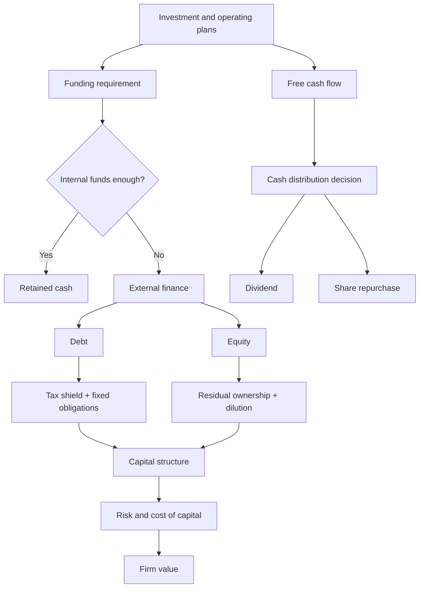
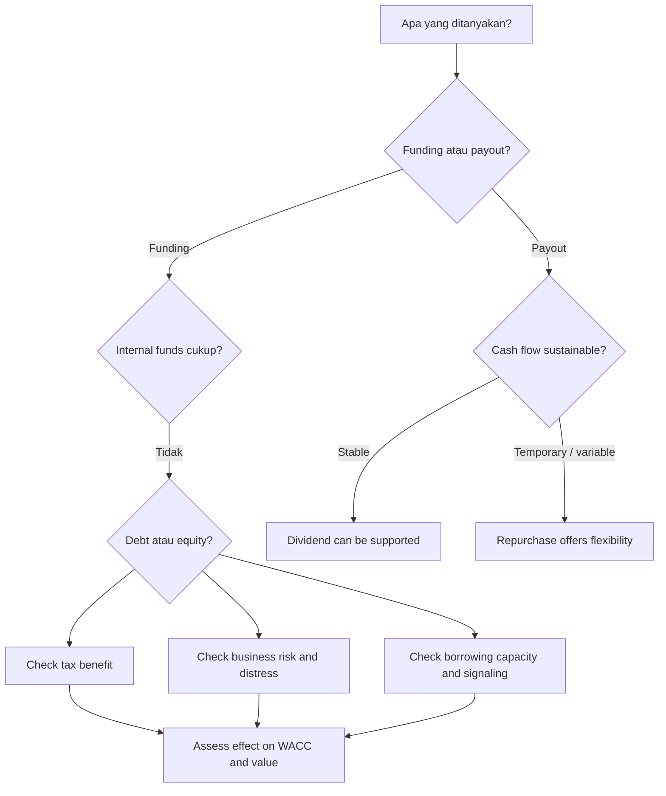

# 📘 3.2 — Sources of Finance and Capital Structure

> [!ABSTRACT] Ringkasan Cepat
> **Topik:** Sources of Finance and Capital Structure  
> **Bobot Parent Topic:** 10–20%  
> **Exam Priority:** Medium-High  
> **Difficulty:** Hard  
> **Primary Skill:** Mixed — concept, calculation ringan, dan interpretation  
> **Ref:** Brigham & Ehrhardt Bab 14 §§14.1–14.3, 14.5–14.6, 14.9–14.10; Bab 15 §§15.1–15.4; Berk & DeMarzo Bab 1 §§1.1–1.3

## Section 0 — Pemetaan Silabus & Exam Scope

| Field | Isi |
|---|---|
| Topik CF4 | Topik 3 — Pembiayaan Korporasi |
| Subtopik | 3.2 Sources of Finance and Capital Structure |
| Learning Outcome | Memahami berbagai pilihan sumber pendanaan untuk bisnis dan menjelaskan faktor yang mempengaruhi pengambilan keputusan untuk struktur permodalan dan kebijakan dividen. |
| Skill Diuji | Membedakan debt dan equity financing; memahami internal vs external funding; menjelaskan leverage trade-off; menghubungkan debt, tax shield, bankruptcy/financial distress, risk, WACC, dan firm value; memahami dividend vs repurchase dan faktor yang mempengaruhi payout policy. |
| Bobot Parent Topic | 10–20% |
| Exam Priority | Medium-High |
| Prerequisite | Debt vs equity, free cash flow, cost of debt/equity, shareholder claims, corporate tax, present value |
| Connected Topics | [[2.1 Equity Instruments]], [[2.2 Long-Term Debt Instruments]], [[2.3 Short and Medium-Term Finance]], [[2.5 Capital Raising Methods]], [[3.3 Capital Budgeting and Cost of Capital]], [[4.3 Agency Theory and Governance]] |
| Referensi | Brigham & Ehrhardt Bab 14 dan 15 sesuai section silabus; Berk & DeMarzo Bab 1 §§1.1–1.3 |

> [!IMPORTANT] Scope Boundary
> `[CORE CF4]` Subtopik ini mencakup dua keputusan yang saling berhubungan: **bagaimana perusahaan membiayai bisnisnya** dan **bagaimana perusahaan membagi cash yang tersedia antara reinvestment, debt, dividend, dan share repurchase**. Fokus utamanya adalah debt–equity mix, trade-off leverage, serta dividend/payout policy.
>
> Detail lengkap perhitungan WACC ditempatkan pada [[3.3 Capital Budgeting and Cost of Capital]]. Detail karakteristik setiap security secara individual ditempatkan pada Topik 2. Di sini securities dibahas hanya sejauh memengaruhi **financing choice, capital structure, dan payout decision**.
>
> Brigham menggunakan konteks tax dan market conventions Amerika Serikat. Angka tax rate maupun aturan teknis spesifik yurisdiksi diperlakukan sebagai `[TEXTBOOK CONTEXT]`; yang harus dipahami untuk CF4 adalah **economic relationship**-nya.

---

## Section 1 — Intuisi & Big Picture

Sebuah perusahaan menemukan project bagus. Project tersebut membutuhkan dana sekarang, sementara cash yang dihasilkan baru datang di masa depan. Pertanyaannya sederhana:

> **Uangnya diperoleh dari mana?**

Secara fundamental, financial manager harus menentukan apakah kebutuhan dana dipenuhi melalui:

- cash yang sudah dihasilkan bisnis dan ditahan di perusahaan;
- tambahan **debt** dari creditors;
- tambahan **equity** dari owners/shareholders.

Berk & DeMarzo menggambarkan financing decision sebagai keputusan setelah investment decision dibuat: ketika perusahaan membutuhkan tambahan dana, financial manager harus memilih apakah menjual lebih banyak ownership melalui stock atau meminjam melalui debt.

Namun pilihan tersebut bukan sekadar masalah “mana yang bunganya paling murah”. Debt dan equity mengubah pembagian risiko dan cash-flow claims.

```text
Business needs capital
        ↓
Internal funds sufficient?
   ↓                ↓
 Yes               No
   ↓                ↓
Retain cash     Raise external capital
                     ↓
                Debt or Equity
                     ↓
        Changes risk, taxes, claims,
        flexibility, and cost of capital
                     ↓
               Firm value
```

### Mengapa capital structure menjadi penting?

Debt mempunyai fixed contractual claim. Interest dan principal harus dibayar sesuai terms. Equity adalah residual claim: shareholders menerima nilai setelah obligations kepada creditors terpenuhi.

Menambah debt dapat memberikan manfaat karena interest dapat mengurangi taxable income dalam framing Brigham. Tetapi semakin banyak debt:

1. shareholder claim menjadi lebih berisiko;
2. cost of equity meningkat;
3. probability of financial distress meningkat;
4. creditors dapat meminta interest rate lebih tinggi;
5. financial distress dapat merusak operations dan free cash flow.

Jadi masalahnya bukan:

> “Debt baik atau buruk?”

melainkan:

> **“Berapa debt yang memberi manfaat financing tanpa membuat distress cost dan risk terlalu besar?”**

Inilah inti **capital structure decision**.

### Mengapa dividend policy berada dalam subtopik yang sama?

Karena cash yang dihasilkan perusahaan tidak berdiri sendiri dari financing decision.

Brigham menjelaskan bahwa free cash flow dapat digunakan antara lain untuk interest, debt principal, dividends, share repurchases, atau non-operating financial assets. Setelah kebutuhan operating investment, capital structure, dan liquidity dipertimbangkan, perusahaan menentukan berapa cash yang akan dikembalikan ke shareholders.

Dengan demikian:

```text
Operating decisions
      ↓
Free Cash Flow
      ↓
Financing / capital structure requirements
      ↓
Cash retained for flexibility
      ↓
Cash available to shareholders
      ↓
Dividend and/or share repurchase
```

Kesalahan memahami hubungan ini dapat membuat kandidat mengira bahwa **dividend policy, investment policy, dan financing policy adalah keputusan yang sepenuhnya terpisah**. Dalam praktik textbook, ketiganya saling bergantung.

---

## Section 2 — Definisi & Core Concepts

### Definisi Formal

> [!NOTE] Definisi Formal
> **Financing decision** adalah keputusan mengenai bagaimana perusahaan memperoleh dana untuk membiayai investment dan operations, terutama melalui debt atau equity.
>
> **Capital structure** adalah campuran sumber pendanaan jangka panjang perusahaan, terutama debt dan common equity, yang digunakan untuk membiayai assets/operations.
>
> **Financial leverage** adalah penggunaan debt financing yang menciptakan fixed financial obligations dan mengubah risk yang ditanggung shareholders.
>
> **Target capital structure** adalah campuran debt dan equity yang ingin dipertahankan perusahaan dalam jangka panjang.
>
> **Dividend policy / distribution policy** adalah keputusan mengenai berapa cash yang dibagikan kepada shareholders dan bagaimana pembagian tersebut dilakukan, terutama melalui cash dividends dan share repurchases.

### Terminologi Penting

| Istilah | Definisi | Intuisi | Exam Note |
|---|---|---|---|
| Internal financing | Dana yang berasal dari cash/earnings yang ditahan dalam business | Business membiayai dirinya sendiri | Tidak menambah creditor atau shareholder baru |
| External financing | Dana yang diperoleh dari luar perusahaan | Mencari capital provider | Umumnya debt atau new equity |
| Debt | Contractual financing claim dengan obligation interest/principal | Creditor dibayar lebih dulu | Menambah fixed obligation dan leverage |
| Equity | Ownership/residual claim | Shareholders menerima residual cash flow | Tidak punya contractual interest payment |
| Capital structure | Mix debt dan equity | Cara perusahaan “membagi pembiayaan” | Jangan tertukar dengan asset structure |
| Financial leverage | Penggunaan debt untuk membiayai firm | Fixed claim memperbesar variability bagi equity | Debt dapat menaikkan expected return sekaligus risk equity |
| Business risk | Risk dari operations jika firm tidak menggunakan debt | Risk dari bisnis itu sendiri | Ada sebelum financing choice |
| Financial risk | Tambahan risk shareholders akibat penggunaan debt | Debt memperbesar residual volatility | Naik ketika leverage naik |
| Tax shield | Tax saving dari deductibility of interest dalam model Brigham | Debt dapat mengurangi bagian cash flow yang pergi ke tax | Benefit utama debt dalam trade-off theory |
| Financial distress | Kondisi kesulitan memenuhi financial obligations | Sebelum atau menuju bankruptcy | Cost dapat muncul bahkan sebelum formal bankruptcy |
| Trade-off theory | Firm menyeimbangkan benefit debt dengan distress-related costs | Debt optimal bukan otomatis 0% atau 100% | Core capital-structure reasoning |
| Reserve borrowing capacity | Kemampuan perusahaan untuk meminjam di masa depan | Menyisakan “ruang utang” | Penting bagi firms dengan growth opportunities |
| Signaling | Financing/payout action membawa informasi yang ditafsir investor | Action management dapat menjadi signal | Equity issue atau dividend change dapat ditafsir pasar |
| Dividend | Cash distribution per share kepada shareholders | Regular cash payout | Stabilitas penting karena cuts dapat menjadi negative signal |
| Share repurchase | Perusahaan menggunakan cash untuk membeli kembali shares | Distribution melalui pengurangan shares outstanding | Lebih fleksibel dibanding commitment dividend |
| Dividend payout ratio | Proporsi earnings yang dibayar sebagai dividend | Seberapa besar profit didistribusikan | Jangan samakan dengan total distribution ratio jika repurchases ada |
| Distribution policy | Total kebijakan cash payout termasuk dividends dan repurchases | Lebih luas dari dividend policy | Exam dapat menguji distinction ini |

### Core Relationships

#### 1. Sources of finance

```text
Sources of Finance
├── Internal
│   └── Retained cash / earnings
└── External
    ├── Debt
    └── Equity
```

Internal funds cenderung menghindari flotation dan signaling costs yang dapat timbul ketika firm harus mengakses external capital. Tetapi retaining cash juga berarti cash tersebut tidak dibagikan kepada shareholders dan berpotensi menimbulkan agency problem jika manajemen menggunakannya secara buruk.

#### 2. Debt vs equity claims

```text
Operating cash flow
      ↓
Debt claim paid first
      ↓
Residual cash flow
      ↓
Equity holders
```

Karena equity menerima residual, debt yang lebih besar membuat residual tersebut lebih volatile. Ini menjelaskan mengapa **cost of equity meningkat ketika leverage meningkat**.

#### 3. Capital structure → WACC → firm value

Brigham menghubungkan capital structure dengan valuation melalui:

$$
V_{op} = \sum_{t=1}^{\infty} \frac{FCF_t}{(1+WACC)^t}
$$

Dengan simplified debt-equity WACC:

$$
WACC = w_d(1-T)r_d + w_s r_s
$$

Keterangan:

- $w_d$ = weight debt;
- $w_s$ = weight common equity;
- $r_d$ = pre-tax cost of debt;
- $r_s$ = cost of common equity;
- $T$ = corporate tax rate dalam model textbook.

**Financial meaning:** capital structure dapat memengaruhi firm value melalui **cost of capital** dan, karena distress dapat mengganggu operations, melalui **free cash flow** juga.

> [!WARNING] Important Distinction
> WACC tidak otomatis turun setiap kali debt ditambah. Weight debt memang naik, tetapi $r_d$ dan $r_s$ juga dapat naik ketika leverage meningkatkan risk.

#### 4. Tax shield dalam MM with corporate taxes

Brigham menyajikan hubungan:

$$
V_L = V_U + PV(\text{tax shield})
$$

Dalam simplified MM corporate-tax case:

$$
V_L = V_U + TD
$$

Keterangan:

- $V_L$ = value of levered firm;
- $V_U$ = value of otherwise identical unlevered firm;
- $T$ = corporate tax rate;
- $D$ = amount of debt.

**Financial meaning:** jika interest mengurangi taxable income dan tidak ada offsetting cost, debt menambah value melalui tax shield.

**Limitation:** kesimpulan “lebih banyak debt selalu lebih baik” muncul dari assumptions yang terlalu kuat. Real-world financial distress, agency, information, dan personal-tax effects membuat hasil tersebut tidak berlaku secara mekanis.

#### 5. Trade-off theory

```text
More debt
  ↓
Tax-shield benefit ↑
  ↓
Firm value tends to ↑

BUT

More debt
  ↓
Financial distress probability ↑
Cost of debt ↑
Cost of equity ↑
Potential operating disruption ↑
  ↓
Firm value can ↓
```

Maka target debt ratio berada pada area ketika marginal benefit debt kira-kira seimbang dengan marginal cost of additional leverage.

#### 6. Distribution decision

Brigham menyatakan lima penggunaan utama positive free cash flow:

1. pay interest;
2. repay debt principal;
3. pay dividends;
4. repurchase shares;
5. acquire non-operating financial assets / marketable securities.

Dalam simplified distribution logic, setelah operating investment, capital structure, dan liquidity policy dipenuhi, residual FCF dapat dibagikan kepada shareholders.

---

## Section 3 — How It Works

### Corporate Finance Framework

```text
Business decision: fund operations/investments
        ↓
Choose internal funds, debt, or equity
        ↓
Cash-flow consequence
        ↓
Tax effect + fixed obligations + dilution/residual claims
        ↓
Risk changes
        ↓
Cost of debt and/or cost of equity changes
        ↓
WACC and FCF may change
        ↓
Firm value changes
```

### A. Internal financing

Jika perusahaan menghasilkan cash dan tidak membagikannya, cash tersebut dapat digunakan untuk investment tanpa mengeluarkan security baru.

Keuntungannya:

- tidak menambah contractual debt obligation;
- tidak memerlukan equity issuance;
- dapat menghindari flotation/signaling costs;
- menyediakan financing flexibility.

Tetapi retaining terlalu banyak cash juga memiliki downside:

- shareholders tidak menerima distribution sekarang;
- managers dapat memiliki lebih banyak discretionary cash;
- excess cash dapat meningkatkan agency cost jika dialokasikan ke low-value projects atau perks.

Jadi **retained cash bukan “free money”**. Cash yang ditahan tetap milik economic claim shareholders dan harus digunakan untuk opportunities yang menghasilkan value.

### B. Debt financing

Debt memberikan capital tanpa langsung menambah ownership shares.

**Issuer perspective:**

- interest tax deductibility dapat menciptakan tax shield;
- debt dapat lebih murah daripada equity pada moderate leverage;
- tidak menambah voting ownership;
- tetapi menciptakan fixed contractual payments.

**Creditor perspective:**

- creditor mempunyai prior claim;
- semakin tinggi leverage, semakin tinggi default risk;
- higher risk dapat menyebabkan required interest rate meningkat.

**Shareholder perspective:**

- upside setelah debt payment tetap menjadi residual equity;
- tetapi variability residual cash flow meningkat;
- required return $r_s$ meningkat karena financial risk.

### C. Equity financing

Equity menyediakan capital tanpa fixed interest/principal obligation.

Keuntungan bagi issuer:

- menurunkan default pressure relatif terhadap debt;
- memperbesar loss-absorbing capital;
- cocok ketika firm ingin mempertahankan borrowing capacity.

Trade-off:

- additional owners berbagi residual claim;
- equity capital mempunyai required return;
- issuance dapat membawa information/signaling effects;
- issuing equity bukan berarti capital “gratis” hanya karena dividend tidak contractual.

### D. Mengapa leverage dapat menurunkan lalu menaikkan WACC?

Pada debt ratio rendah sampai moderate:

- debt memiliki tax advantage;
- weight financing yang relatively lower-cost meningkat;
- WACC dapat turun.

Pada leverage tinggi:

- $r_d$ naik karena creditors melihat default risk lebih besar;
- $r_s$ naik karena equity semakin risky;
- expected distress cost meningkat;
- FCF dapat ikut turun karena customers, suppliers, dan employees bereaksi terhadap distress.

Maka relationship konseptualnya:

```text
Very low debt
   ↓ add debt
Tax benefit dominates
   ↓
WACC may fall
Firm value may rise

Excessive debt
   ↓ add more debt
Distress/risk effects dominate
   ↓
WACC may rise and/or FCF fall
Firm value may fall
```

### E. Business risk vs financial risk

**Business risk** berasal dari uncertainty operations sebelum leverage dipertimbangkan.

Contoh source of business risk:

- demand variability;
- input/output price variability;
- operating leverage;
- cyclicality.

**Financial risk** adalah extra risk pada shareholders akibat penggunaan debt.

> [!TIP] Cara Berpikir
> Bayangkan operating income sebagai air yang masuk ke ember. Debt menempatkan lubang wajib di bagian bawah ember: interest harus keluar lebih dulu. Semakin besar fixed outflow, semakin volatile sisa air untuk shareholders. Itulah financial leverage dari perspektif equity.

### F. Dividend policy dan payout policy

Setelah firm memperoleh positive FCF, firm menentukan berapa cash yang dibagikan.

Brigham membedakan dua alat utama:

- **cash dividend**;
- **share repurchase**.

Dividend cenderung diperlakukan sebagai payout yang lebih predictable. Karena managers enggan memotong dividend, kenaikan dividend biasanya dilakukan ketika management percaya earning/cash capacity dapat mendukung level baru.

Repurchase lebih flexible: perusahaan dapat meningkatkan atau menurunkan repurchase tanpa signal negatif sebesar dividend cut.

### G. Dividend theories yang harus dibedakan

#### Dividend irrelevance theory

Dalam idealized MM setting dengan assumptions seperti no taxes dan no brokerage costs, investor dapat membuat “homemade dividend” dengan menjual shares atau reinvest dividend. Dengan demikian, cara distribution dibagi antara dividend dan retained earnings tidak mengubah value jika investment policy dan total cash flow tidak berubah.

#### Dividend preference / bird-in-the-hand

Pandangan ini menyatakan sebagian investor dapat menilai dividend yang lebih certain lebih tinggi dibanding uncertain future capital gain.

#### Tax effect

Jika tax treatment dividend lebih tidak menguntungkan dibanding capital gains, investor dapat lebih menyukai lower dividend dan lebih banyak capital gains.

> [!CAUTION] Textbook Context
> Detail tax-rate yang digunakan Brigham bersifat period- dan jurisdiction-specific. Untuk CF4, fokus pada logic: **relative taxation of dividend vs capital gain dapat memengaruhi investor preference**.

### H. Signaling dan dividend stability

Brigham menekankan observation bahwa:

- dividend increase sering diasosiasikan dengan stock-price increase;
- dividend cut sering diasosiasikan dengan stock-price decline.

MM framing menjelaskan hal tersebut sebagai **information content/signaling**, bukan bukti otomatis bahwa investors intrinsically “suka dividend”. Karena managers cenderung menghindari dividend cuts, mereka biasanya tidak menaikkan dividend kecuali percaya future earnings cukup kuat untuk mempertahankannya.

Implikasinya:

> **Stable, predictable dividend lebih penting daripada memaksakan payout yang volatile.**

### I. Dividend vs share repurchase

Ignoring tax dan signaling effects, Brigham menunjukkan bahwa distribution melalui dividend atau repurchase tidak dengan sendirinya menciptakan total shareholder wealth yang berbeda jika total cash distributed sama.

Repurchase mengurangi number of shares outstanding. Secara sederhana:

$$
\text{Shares repurchased} = \frac{\text{Cash used for repurchase}}{\text{Share price}}
$$

Jika repurchase dilakukan pada fair intrinsic price dan tidak ada secondary effects, repurchase itu sendiri tidak otomatis meningkatkan value per shareholder melalui “magic EPS effect”.

> [!DANGER] Jangan Salah Pikir
> 1. **Debt lebih murah ≠ semakin banyak debt selalu lebih baik.** Cost of debt dan equity berubah saat leverage berubah.
> 2. **Equity tidak punya contractual interest ≠ equity gratis.** Shareholders tetap menuntut required return.
> 3. **Dividend increase ≠ otomatis bukti dividend menciptakan value.** Bisa jadi perubahan harga adalah signaling effect.
> 4. **Share repurchase mengurangi shares outstanding ≠ otomatis menciptakan economic value.** Harga yang dibayar dan underlying cash flow tetap penting.
> 5. **Retained earnings ≠ cash tanpa opportunity cost.** Cash tersebut tetap mempunyai economic claim dari shareholders.

---

## Section 4 — Worked Examples & Exam Cases

### Case A — Fundamental: Debt atau Equity?

**Soal**

Perusahaan membutuhkan dana untuk membiayai expansion. Management mempertimbangkan dua alternatif:

- menerbitkan debt baru; atau
- menerbitkan common equity baru.

Perusahaan memiliki business risk yang sudah cukup tinggi dan cash flow relatif volatile. Mana pernyataan yang paling tepat?

A. Debt selalu lebih baik karena cost of debt lebih rendah daripada cost of equity.  
B. Equity selalu lebih baik karena tidak memiliki cost.  
C. Debt dapat memberikan tax benefit, tetapi volatility yang tinggi meningkatkan expected distress cost sehingga optimal debt capacity dapat lebih rendah.  
D. Capital structure tidak pernah memengaruhi firm value.

> [!SUCCESS] Pembahasan
>
> **1. Identifikasi informasi**  
> Firm sudah memiliki high business risk dan volatile cash flow.
>
> **2. Konsep yang diuji**  
> Trade-off theory dan interaction antara business risk dengan financial leverage.
>
> **3. Reasoning**  
> Debt memang mempunyai potential tax advantage, tetapi fixed obligations menambah financial risk. Firm dengan earnings/cash-flow volatility lebih tinggi memiliki greater probability of financial distress pada debt ratio yang sama.
>
> **4. Calculation**  
> Tidak diperlukan.
>
> **5. Interpretation**  
> Pilihan terbaik adalah **C**.
>
> **6. Verification**  
> A dan B menggunakan absolute statement “always”; D mengabaikan real-world imperfections yang justru menjadi inti Bab 15.

> [!WARNING] Exam Trap — Case A
> - **Trap:** memilih debt hanya karena stated interest rate terlihat lebih rendah.
> - **Mengapa distractor terlihat benar:** WACC memang menggunakan after-tax debt cost yang sering lebih rendah dari equity cost.
> - **Cara menghindari:** selalu tanyakan apa yang terjadi pada $r_d$, $r_s$, distress probability, dan FCF ketika debt naik.
> - **Target waktu:** 45–60 detik.

### Case B — Exam-Typical: WACC Direction

**Soal**

Sebuah firm mengubah financing mix dari low debt menjadi moderate debt. Pada level awal, probability of financial distress sangat rendah. Interest tax shield meningkat, sementara kenaikan $r_d$ dan $r_s$ masih kecil. Apa dampak paling masuk akal?

> [!SUCCESS] Pembahasan
>
> **1. Identifikasi informasi**  
> Debt bertambah dari low ke moderate; tax shield meningkat; risk-cost increase masih kecil.
>
> **2. Konsep yang diuji**  
> Capital structure → WACC → firm value.
>
> **3. Reasoning**  
> Pada kondisi ini debt benefit dapat mendominasi. Weight debt naik dan after-tax debt cost memberikan benefit, sedangkan distress effect masih rendah.
>
> **4. Calculation**  
> Secara konseptual:
>
> $$
> WACC = w_d(1-T)r_d + w_s r_s
> $$
>
> Jika benefit perubahan weight lebih besar daripada increase dalam $r_d$ dan $r_s$, WACC turun.
>
> **5. Interpretation**  
> Lower WACC, other things equal, meningkatkan present value FCF dan firm value.
>
> **6. Verification**  
> Jangan menyimpulkan rule ini berlaku pada setiap leverage level. Pada excessive leverage, direction dapat berbalik.

> [!WARNING] Exam Trap — Case B
> - **Trap:** “debt naik → WACC pasti turun.”
> - **Mengapa distractor terlihat benar:** debt sering memiliki lower stated cost dan tax shield.
> - **Cara menghindari:** bedakan low/moderate leverage dengan excessive leverage.
> - **Target waktu:** 60–90 detik.

### Case C — Challenging / Integrated: Dividend atau Repurchase?

**Soal**

Perusahaan mempunyai excess cash yang tidak diperlukan untuk positive-NPV investment. Management memperkirakan cash flow tahun depan lebih tidak pasti dan tidak ingin membuat commitment payout yang sulit dipertahankan. Apa distribution method yang secara konsep lebih flexible menurut pembahasan Brigham?

> [!SUCCESS] Pembahasan
>
> **1. Identifikasi informasi**  
> Ada excess cash sekarang, tetapi future cash flow uncertain.
>
> **2. Konsep yang diuji**  
> Dividend stability vs share repurchase flexibility.
>
> **3. Reasoning**  
> Dividend cuts dapat membawa negative signal. Karena itu management biasanya enggan menaikkan regular dividend jika level baru belum sustainable. Repurchase dapat disesuaikan lebih fleksibel dari tahun ke tahun.
>
> **4. Calculation**  
> Tidak diperlukan.
>
> **5. Interpretation**  
> Repurchase lebih cocok untuk cash distribution yang sifatnya temporary/residual, sementara regular dividend sebaiknya berada pada level yang dapat dipertahankan.
>
> **6. Verification**  
> Ini bukan berarti repurchase selalu superior; investor clientele, tax effects, pricing, signaling, dan other circumstances tetap relevan.

> [!WARNING] Exam Trap — Case C
> - **Trap:** menganggap dividend dan repurchase identik dalam semua kondisi.
> - **Mengapa distractor terlihat benar:** dalam frictionless model dan total distribution yang sama, value effect dapat equivalent.
> - **Cara menghindari:** setelah memahami theoretical equivalence, periksa taxes, signals, flexibility, dan investor preference.
> - **Target waktu:** 60–90 detik.

---

## Section 5 — Interpretation & Sanity Check

> [!CHECK] Sanity Check
> 1. **Debt naik:** financial leverage dan equity risk seharusnya tidak turun tanpa alasan lain. Jika jawaban menyatakan leverage naik tetapi $r_s$ turun secara otomatis, curigai.
> 2. **Debt sangat tinggi:** jangan hanya melihat tax shield. Probability/cost of distress harus masuk reasoning.
> 3. **Dividend naik:** jangan langsung simpulkan firm value naik karena dividend itu sendiri. Periksa signaling dan sustainability.
> 4. **Repurchase:** jika firm membayar cash untuk membeli shares, total equity value berkurang sebesar cash keluar, sementara shares outstanding juga berkurang. Jangan menganggap repurchase menciptakan value hanya karena EPS/share count berubah.
> 5. **Retained cash:** pastikan tidak dianggap gratis. Ada opportunity cost bagi shareholders dan potential agency cost.

### Interpretation Ladder

> **Level 1 — Number**  
> Berapa debt ratio, WACC, dividend payout, atau shares repurchased?
>
> **Level 2 — Direction**  
> Apakah leverage, cost of equity, distress risk, atau distribution naik/turun?
>
> **Level 3 — Meaning**  
> Siapa yang menanggung lebih banyak risk dan siapa yang menerima cash-flow claim?
>
> **Level 4 — Cause**  
> Apakah perubahan berasal dari tax shield, business risk, distress, signaling, atau financing flexibility?
>
> **Level 5 — Limitation**  
> Apakah conclusion bergantung pada assumptions seperti no taxes, no transaction costs, perfect information, atau fair repurchase price?

---

## Section 6 — Connections & Mental Model



### Hubungan Konsep

#### Dengan [[2.1 Equity Instruments]]

Equity adalah salah satu external financing source. Topik 2.1 membahas instrument characteristics; 3.2 membahas **mengapa dan kapan equity dipilih relatif terhadap debt**.

#### Dengan [[2.2 Long-Term Debt Instruments]] dan [[2.3 Short and Medium-Term Finance]]

Topik 2 menjelaskan bentuk debt. Di sini semua bentuk debt tersebut dipandang sebagai financing claims yang menambah contractual obligations dan leverage.

#### Dengan [[2.5 Capital Raising Methods]]

Capital raising menjelaskan bagaimana securities diterbitkan; 3.2 menjelaskan **financing mix** yang ingin dicapai.

#### Dengan [[3.3 Capital Budgeting and Cost of Capital]]

Capital structure memengaruhi cost of capital. [[3.3 Capital Budgeting and Cost of Capital]] membahas mechanics perhitungan WACC lebih penuh.

#### Dengan [[4.3 Agency Theory and Governance]]

Debt dapat mendisiplinkan managers dengan mengurangi discretionary free cash flow, tetapi high leverage juga dapat menciptakan incentive problems dan menyebabkan managers menghindari risky positive-NPV projects.

---

## Section 7 — Exam Traps & Misconceptions

### Definition Trap

> [!BUG] Definition Trap
> **Capital structure ≠ capital budgeting.**  
> Capital structure bertanya **bagaimana firm dibiayai**. Capital budgeting bertanya **project/investment mana yang harus dilakukan**.
>
> **Dividend policy ≠ distribution policy.**  
> Dividend policy fokus pada dividend; distribution policy dapat mencakup **dividend + share repurchase**.
>
> **Business risk ≠ financial risk.**  
> Business risk berasal dari operations; financial risk adalah tambahan risk dari leverage.

### Accounting / Financial Logic Trap

> [!BUG] Logic Trap
> - Debt financing ≠ free capital.
> - Equity financing ≠ costless karena tidak ada mandatory interest.
> - Retained earnings ≠ free cash tanpa opportunity cost.
> - More debt ≠ automatically higher firm value.
> - Dividend increase ≠ automatically value creation.
> - Repurchase ≠ guaranteed stock-price increase.

### Calculation Trap

> [!BUG] Calculation Trap
> Kesalahan umum adalah menggunakan cost of debt **sebelum tax** dalam WACC ketika model secara eksplisit meminta after-tax debt cost.
>
> **Salah**
>
> $$
> WACC = w_d r_d + w_s r_s
> $$
>
> **Benar dalam simplified Brigham debt-equity WACC**
>
> $$
> WACC = w_d(1-T)r_d + w_s r_s
> $$
>
> Namun jangan memasukkan formula ini secara mekanis jika pertanyaan hanya meminta conceptual financing choice.

### Interpretation Trap

> [!BUG] Interpretation Trap
> Misalkan debt ratio naik dan EPS ikut naik. Menyimpulkan “firm lebih baik” hanya dari EPS adalah salah. Leverage juga mengubah risk, required return, probability of distress, dan firm value. **Per-share accounting outcome tidak cukup untuk membuktikan value creation.**

### Red Flags

> [!CAUTION] Red Flags

| Keyword / Condition | Apa yang Harus Dipikirkan |
|---|---|
| "debt financing" | Fixed obligation, tax shield, leverage, financial risk |
| "equity financing" | Residual claim, ownership, no fixed interest obligation, required return |
| "high business risk" | Lower debt capacity / distress risk lebih cepat meningkat |
| "interest tax deductible" | After-tax debt cost dan tax shield |
| "financial distress" | Bankruptcy probability + direct/indirect costs + possible FCF reduction |
| "optimal capital structure" | Trade-off benefits vs costs; value maximization |
| "reserve borrowing capacity" | Menjaga kemampuan meminjam untuk future opportunities |
| "dividend increase" | Sustainability + signaling |
| "dividend cut" | Potential negative signal |
| "excess cash" | Dividend, repurchase, debt reduction, marketable securities; check investment opportunities first |
| "share repurchase" | Flexibility, share count reduction, fair price, signaling |
| "stable dividend" | Management reluctance to cut dividend; smoothing/stability logic |

---

## Section 8 — Executive Summary

### Must Remember

> [!SUMMARY] Must Remember
> 1. Financing sources secara fundamental dapat berasal dari **internal funds, debt, atau equity**.
> 2. Capital structure adalah **mix debt dan equity**, bukan daftar assets perusahaan.
> 3. Debt memberi **tax-shield benefit** dalam model Brigham tetapi menciptakan fixed obligations dan financial distress risk.
> 4. Leverage membuat equity menjadi lebih risky, sehingga **cost of equity cenderung meningkat**.
> 5. Pada excessive leverage, cost of debt juga naik dan distress dapat menurunkan FCF.
> 6. **Trade-off theory:** firm menyeimbangkan tax benefit of debt dengan distress-related costs.
> 7. Firms dengan greater business risk atau costly-to-liquidate assets cenderung memiliki alasan untuk menggunakan debt lebih sedikit.
> 8. Positive FCF dapat digunakan untuk debt service, dividends, repurchases, atau financial assets; payout policy bergantung pada investment, financing, dan liquidity needs.
> 9. Dividend changes mempunyai **information/signaling content** dan firms cenderung menghindari dividend cuts.
> 10. Repurchases lebih flexible daripada committing seluruh residual distribution ke regular dividend.

### Comparison Table — Debt vs Equity

| Dimension | Debt | Equity |
|---|---|---|
| Claim | Contractual / prior | Residual |
| Required cash payment | Interest/principal contractual | Dividend discretionary |
| Tax effect in Brigham model | Interest creates tax shield | No corresponding interest tax shield |
| Effect on ownership | Tidak langsung menambah owners | Menambah/menyebarkan ownership |
| Default risk | Menambah default exposure | Tidak menciptakan contractual default dari dividend nonpayment |
| Cost behavior | $r_d$ rises as default risk increases | $r_s$ rises as leverage increases |
| Financial flexibility | Dapat mengurangi future borrowing capacity | Dapat preserve borrowing capacity |
| Core risk | Financial distress | Dilution/residual sharing + high required return |

### Comparison Table — Dividend vs Share Repurchase

| Dimension | Cash Dividend | Share Repurchase |
|---|---|---|
| Cash distribution | Semua eligible shareholders menerima dividend | Hanya shareholders yang menjual shares menerima cash |
| Flexibility | Lower; cuts dapat menjadi negative signal | Higher; amount dapat lebih mudah berubah |
| Shares outstanding | Tidak berubah karena dividend | Berkurang |
| Signal | Increase/cut dapat membawa strong information content | Announcement juga dapat memberi signal |
| Sustainability | Management cenderung menjaga stable level | Lebih cocok untuk variable/residual cash |
| Tax effect | Bergantung tax regime | Dapat memiliki relative tax advantage dalam textbook context |

### Trigger Keywords

| Jika soal mengatakan... | Pikirkan... |
|---|---|
| "mix of debt and equity" | Capital structure |
| "interest is tax deductible" | Tax shield dan after-tax cost of debt |
| "earnings are volatile" | High business risk → lower debt tolerance |
| "probability of bankruptcy increases" | Distress cost dan higher $r_d$ / $r_s$ |
| "management wants financial flexibility" | Reserve borrowing capacity |
| "excess cash but uncertain future cash flow" | Repurchase lebih flexible daripada permanent dividend increase |
| "dividend unexpectedly increased" | Signaling / information content |
| "dividend unexpectedly cut" | Negative signal potential |
| "repurchase shares" | Cash outflow + lower shares outstanding; no automatic value creation |

### Kapan Digunakan

Gunakan framework capital structure ketika soal meminta:

- memilih debt vs equity;
- menjelaskan leverage;
- menentukan effect of debt on risk, WACC, FCF, atau value;
- menjelaskan optimal/target capital structure;
- menganalisis tax shield vs financial distress;
- membandingkan dividend dan share repurchase;
- menjelaskan payout stability atau signaling.

### Kapan TIDAK Boleh Digunakan

- Jangan gunakan trade-off theory untuk menghitung WACC numerik jika inputs component costs tidak diberikan; mechanics detail ada di [[3.3 Capital Budgeting and Cost of Capital]].
- Jangan menganggap tax-rate atau legal rules textbook berlaku universal lintas negara/periode.
- Jangan menilai project hanya dari financing source; project acceptance tetap membutuhkan investment appraisal.
- Jangan menganggap higher EPS setelah recapitalization membuktikan higher firm value.

### Quick Decision Tree



---

## Section 9 — Active Recall Check

1. Apa perbedaan antara **business risk** dan **financial risk**?
2. Mengapa menambah debt biasanya meningkatkan cost of equity?
3. Mengapa tax deductibility of interest dapat meningkatkan value of a levered firm?
4. Mengapa kesimpulan MM with corporate taxes dapat mengarah pada debt ratio yang sangat tinggi, dan mengapa real-world firms tidak otomatis mengikuti hasil itu?
5. Bagaimana financial distress dapat menurunkan **FCF**, bukan hanya menaikkan required return?
6. Apa inti **trade-off theory of capital structure**?
7. Mengapa firm dengan growth opportunities mungkin ingin mempertahankan **reserve borrowing capacity**?
8. Apa perbedaan antara **dividend irrelevance**, **bird-in-the-hand**, dan **tax effect** theories?
9. Mengapa management cenderung enggan menaikkan dividend jika kenaikan itu tidak sustainable?
10. Mengapa share repurchase yang menurunkan shares outstanding tidak otomatis menciptakan shareholder value?

---

## Section 10 — Exam Pattern Map

| Narasi Soal | Keyword | Konsep | Formula/Rule | Langkah | Trap | Shortcut |
|---|---|---|---|---|---|---|
| Firm mempertimbangkan menambah debt | debt ratio, tax shield, distress | Trade-off theory | $WACC = w_d(1-T)r_d + w_s r_s$ | Identifikasi benefit → risk effect → net direction | Debt murah → dianggap selalu baik | “Tax benefit vs distress cost” |
| Firm dengan volatile earnings memilih financing | high business risk | Business vs financial risk | Conceptual | High operating uncertainty → fixed debt obligation lebih berbahaya | Menganggap debt capacity sama antar firms | “Risk bisnis tinggi → ruang leverage lebih kecil” |
| Debt meningkat dan shareholder required return berubah | leverage, residual claim | Financial risk | $r_s$ tends to rise with leverage | Debt prior claim → residual more volatile → equity risk ↑ | Cost equity dianggap tetap | “Fixed claim membuat residual lebih risky” |
| Firm punya excess cash | free cash flow, distribution | Payout decision | Five uses of FCF | Check investment needs → capital structure/liquidity → distribution | Langsung bayar dividend tanpa melihat funding needs | “Investment first, payout residual” |
| Dividend dinaikkan unexpectedly | dividend increase | Signaling | Conceptual | Management information → sustainability expectation → market reaction | Menganggap dividend mechanically creates value | “Change can be signal, not magic value” |
| Cash flow temporary tinggi | excess cash, uncertain future | Dividend vs repurchase | Conceptual | Avoid unsustainable regular dividend → consider repurchase | Semua payout dianggap equivalent in practice | “Permanent cash → dividend; temporary cash → flexibility” |
| Repurchase menurunkan share count | shares outstanding | Repurchase mechanics | $n_{rep} = Cash/P$ | Compute shares repurchased → check cash outflow and equity value | EPS/share count effect disamakan dengan value creation | “Less shares ≠ free value” |

`[TEXTBOOK-BASED EXPECTATION]` Pola di atas diturunkan dari distinctions dan decision frameworks yang secara eksplisit dibahas dalam referensi Topik 3. Tidak diklaim sebagai frekuensi empiris past exam karena past exam tidak digunakan sebagai source pada note ini.

---

## Source Traceability

| Materi | Sumber |
|---|---|
| Financing decision: debt vs equity | Berk & DeMarzo, Bab 1 §1.2 |
| Free cash flow dan penggunaan cash distribution | Brigham & Ehrhardt, Bab 14 §14.1 |
| Dividend vs retained earnings; dividend theories | Brigham & Ehrhardt, Bab 14 §14.3 |
| Signaling / information content of dividends | Brigham & Ehrhardt, Bab 14 §14.5 |
| Dividend stability | Brigham & Ehrhardt, Bab 14 §14.6 |
| Dividend vs share repurchase mechanics | Brigham & Ehrhardt, Bab 14 §14.9 |
| Pros/cons dividends dan repurchases | Brigham & Ehrhardt, Bab 14 §14.10 |
| Capital structure → WACC/FCF/value framework | Brigham & Ehrhardt, Bab 15 §15.1 |
| Business risk dan financial risk | Brigham & Ehrhardt, Bab 15 §15.2 |
| MM, tax shield, Miller, trade-off, signaling/pecking-order/windows framing | Brigham & Ehrhardt, Bab 15 §15.3 |
| Empirical implications dan managerial capital-structure considerations | Brigham & Ehrhardt, Bab 15 §15.4 |

---

#CF4 #Topik3 #CorporateFinance #CapitalStructure #Financing #DividendPolicy #ShareRepurchase
