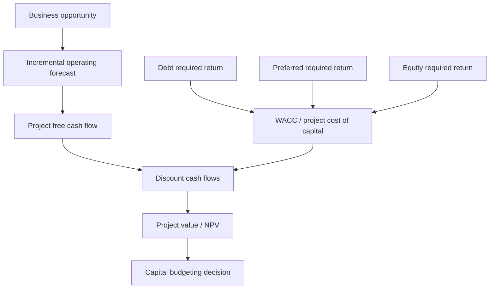
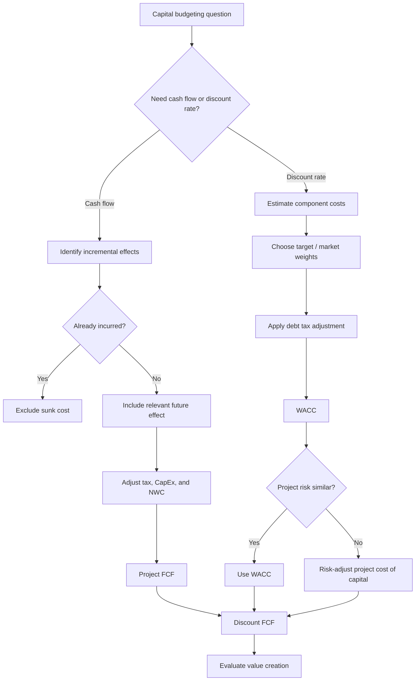

# 📘 3.3 — Capital Budgeting and Cost of Capital

> [!ABSTRACT] Ringkasan Cepat
> **Topik:** Capital Budgeting and Cost of Capital  
> **Bobot Parent Topic:** 10–20%  
> **Exam Priority:** Medium-High  
> **Difficulty:** Calculation-Intensive  
> **Primary Skill:** Mixed — calculation, project cash-flow construction, dan interpretation  
> **Ref:** Brigham & Ehrhardt Bab 9 §§9.1–9.2, 9.7–9.8, 9.11–9.13 dan Bab 10 §§10.1–10.8; Berk & DeMarzo Bab 3 §§3.1–3.5, Bab 7 §§7.1–7.5, Bab 8 §§8.1–8.5; Weygandt Bab 26

## Section 0 — Pemetaan Silabus & Exam Scope

| Field | Isi |
|---|---|
| Topik CF4 | Topik 3 — Pembiayaan Korporasi |
| Subtopik | 3.3 Capital Budgeting and Cost of Capital |
| Learning Outcome | Menjabarkan pendanaan modal dan menghitung biaya modal. |
| Skill Diuji | Memahami proses capital budgeting; membentuk incremental project free cash flow; membedakan project cash flow dari accounting earnings; menghitung component cost of capital dan WACC; memilih weights yang sesuai; menjelaskan tax shield; menentukan kapan company WACC dapat digunakan sebagai project discount rate; memahami risk adjustment. |
| Bobot Parent Topic | 10–20% |
| Exam Priority | Medium-High |
| Prerequisite | Present value, debt/equity, tax, required return, free cash flow |
| Connected Topics | [[1.1 Taxation Principles]], [[1.5 Financial Statements Construction]], [[2.1 Equity Instruments]], [[2.2 Long-Term Debt Instruments]], [[3.2 Sources of Finance and Capital Structure]], [[3.4 Investment Return Methods]] |
| Referensi | Brigham & Ehrhardt Bab 9 dan 10 sesuai section silabus; Berk & DeMarzo Bab 3, 7, dan 8 sesuai section silabus; Weygandt Bab 26 |

> [!IMPORTANT] Scope Boundary
> `[CORE CF4]` Topik 3.3 berfokus pada **bagaimana perusahaan mengubah sebuah investment proposal menjadi relevant project cash flows, menentukan required return/cost of capital yang sesuai, lalu menggunakan keduanya dalam capital budgeting**.
>
> Detail **perbandingan metode investment appraisal** seperti NPV versus IRR, payback, discounted payback, MIRR, dan profitability index dibahas lebih penuh pada [[3.4 Investment Return Methods]]. Di 3.3 metode tersebut hanya muncul sejauh diperlukan untuk menjelaskan hubungan antara **cash flow, discount rate, dan capital budgeting decision**.
>
> Silabus Topik 3 juga mencantumkan Brigham Bab 14–15, tetapi bagian tersebut terutama mendukung [[3.2 Sources of Finance and Capital Structure]]. Karena itu detail capital-structure theory dan dividend policy tidak diulang di sini kecuali saat diperlukan untuk memahami target capital structure dan WACC.

---

## Section 1 — Intuisi & Big Picture

Apa masalah nyata yang ingin diselesaikan konsep ini?

Bayangkan sebuah perusahaan ingin membangun pabrik baru. Manajemen memperkirakan bahwa pabrik tersebut akan menghasilkan penjualan selama beberapa tahun. Tetapi sebelum menerima cash tersebut, perusahaan harus:

- membeli mesin;
- membayar instalasi;
- menyediakan inventory;
- memberi credit kepada customers;
- membayar operating costs;
- menanggung taxes;
- dan mengikat capital yang sebenarnya bisa dipakai untuk project lain.

Pertanyaan pertama adalah:

> **Apakah project ini menciptakan value setelah seluruh cash flow relevan diperhitungkan?**

Pertanyaan kedua:

> **Return minimum berapa yang harus dihasilkan project agar layak bagi providers of capital?**

Pertanyaan kedua inilah yang membawa kita ke **cost of capital**.

Investor tidak memberikan capital secara gratis. Debt holders menuntut return melalui interest dan repayment. Preferred shareholders menuntut preferred dividend. Common shareholders menuntut expected return yang sepadan dengan risiko.

Dari sisi perusahaan, required return para investors tersebut menjadi **cost of capital**.

Jadi capital budgeting dapat dipahami sebagai dua sisi yang harus bertemu:

```text
PROJECT SIDE
Forecast incremental cash flows
        ↓
How much cash will the project generate?

FINANCING / MARKET SIDE
Estimate required return
        ↓
What return is required for this risk?

        ↓
Discount project cash flows
        ↓
Does the project create value?
```

### Mengapa accounting profit saja tidak cukup?

Project dapat melaporkan accounting profit tetapi tetap menguras cash karena:

- capital expenditure dibayar sekarang tetapi didepresiasi bertahap;
- receivables mengakui revenue sebelum cash diterima;
- inventory membutuhkan cash sebelum goods terjual;
- depreciation mengurangi taxable income tetapi bukan cash outflow saat dicatat.

Karena itu capital budgeting menggunakan **incremental free cash flow**, bukan sekadar accounting net income.

### Mengapa satu discount rate tidak selalu cocok untuk semua project?

Brigham menekankan bahwa WACC perusahaan dapat digunakan untuk **average-risk projects** yang memiliki risiko sebanding dengan existing operations dan dibiayai konsisten dengan target capital structure.

Jika sebuah project jauh lebih berisiko daripada business perusahaan saat ini, memakai company WACC tanpa adjustment dapat membuat project berisiko terlihat terlalu menarik.

Hubungan mentalnya:

```text
Higher project risk
        ↓
Higher required return
        ↓
Higher discount rate
        ↓
Lower present value, all else equal
```

---

## Section 2 — Definisi & Core Concepts

### Definisi Formal

> [!NOTE] Definisi Formal
> **Capital budgeting** adalah proses menganalisis potential long-term investments dan menentukan project mana yang seharusnya diterima.
>
> **Cost of capital** adalah required rate of return yang diminta investors atas capital yang mereka sediakan, dengan mempertimbangkan risiko investment.
>
> **Weighted Average Cost of Capital (WACC)** menggabungkan component costs dari debt, preferred stock, dan common equity berdasarkan weights masing-masing dalam capital structure.

### Terminologi Penting

| Istilah | Definisi | Intuisi | Exam Note |
|---|---|---|---|
| Capital budgeting | Proses evaluasi long-term investment projects | Memilih penggunaan capital yang paling value-creating | Jangan samakan dengan financing decision |
| Incremental cash flow | Cash flow yang berubah karena project diterima | “With project minus without project” | Sunk cost tidak termasuk |
| Opportunity cost | Benefit yang dikorbankan karena resource digunakan pada project | Resource yang sudah dimiliki tetap punya economic cost | Tidak harus berupa explicit cash payment |
| Sunk cost | Cost yang sudah terjadi dan tidak dapat diubah oleh current decision | Masa lalu tidak berubah karena project decision | Exclude |
| Project externality | Dampak project pada cash flow business lain | New product bisa cannibalize existing sales | Include jika incremental |
| Cannibalization | Penurunan cash flow existing product akibat new project | Project mengambil customer sendiri | Negative incremental effect |
| CapEx | Cash expenditure untuk long-lived assets | Cash keluar saat asset dibeli | Tidak sama dengan depreciation |
| Depreciation | Allocation of asset cost untuk accounting/tax | Non-cash expense | Relevan melalui tax shield |
| Net Working Capital | Operating current assets minus operating current liabilities dalam framing project | Cash yang terikat dalam operations | Increase in NWC reduces FCF |
| Component cost | Required return suatu capital component | “Price” dari debt/equity source | WACC memakai marginal/current relevant cost |
| Target capital structure | Planned mix debt, preferred, equity | Financing mix yang ingin dipertahankan | Weight WACC |
| After-tax cost of debt | Cost of debt setelah interest tax shield | Interest deductibility mengurangi economic cost | Pakai $r_D(1-T)$ |
| Cost of preferred stock | Required return preferred shareholders | Preferred dividend relative to net proceeds | No corporate interest tax shield |
| Cost of common equity | Required return common shareholders | Compensation atas residual risk | Dapat diestimasi CAPM/DCF |
| Flotation cost | Issuance cost untuk new securities | External financing proceeds lebih kecil daripada issue price | New equity cost dapat > retained earnings cost |
| Risk-adjusted cost of capital | Discount rate yang disesuaikan dengan project risk | Riskier project → higher hurdle rate | Company WACC bukan universal discount rate |

### Core Relationships

Capital budgeting memiliki satu relationship paling penting:

```text
Incremental project cash flows
        +
Appropriate project cost of capital
        ↓
Present value
        ↓
Value creation
```

Jika project cash flows meningkat tanpa perubahan risk, value meningkat.

Jika risk/required return meningkat tanpa perubahan cash flow, present value menurun.

---

### Rumus Utama

### 1. WACC dengan Debt dan Common Equity

$$
WACC
=
w_Er_E+w_Dr_D(1-T)
$$

dengan:

- $w_E$ = weight common equity;
- $r_E$ = cost of common equity;
- $w_D$ = weight debt;
- $r_D$ = before-tax cost of debt;
- $T$ = marginal corporate tax rate.

Financial meaning:

> WACC adalah weighted required return yang harus dihasilkan assets/projects agar providers of capital memperoleh return yang sesuai dengan claims dan risk mereka.

---

### 2. WACC dengan Preferred Stock

$$
WACC
=
w_Dr_D(1-T)
+
w_Pr_P
+
w_Er_E
$$

dengan:

- $w_P$ = preferred stock weight;
- $r_P$ = cost of preferred stock.

Weights memenuhi:

$$
w_D+w_P+w_E=1
$$

> [!WARNING] Important Distinction
> Debt cost disesuaikan dengan tax karena interest memperoleh tax treatment yang berbeda dari dividends dalam framing textbook. Preferred dan common equity tidak dikalikan $(1-T)$.

---

### 3. After-Tax Cost of Debt

$$
r_D^{after-tax}
=
r_D(1-T)
$$

Jika:

$$
r_D=8\%, \qquad T=30\%
$$

maka:

$$
r_D^{after-tax}
=
8\%(1-0.30)
=
5.6\%
$$

Interpretation: perusahaan membayar contractual 8%, tetapi tax deductibility interest membuat relevant after-tax financing cost lebih rendah dalam framework textbook.

---

### 4. Cost of Common Equity — CAPM

Brigham memberikan:

$$
r_E
=
r_{RF}
+
\beta_E(RP_M)
$$

atau ekuivalen:

$$
r_E
=
r_{RF}
+
\beta_E\left(r_M-r_{RF}\right)
$$

dengan:

- $r_{RF}$ = risk-free rate;
- $\beta_E$ = equity beta;
- $RP_M$ = market risk premium;
- $r_M-r_{RF}$ = market risk premium.

Financial meaning:

> Shareholders require risk-free return plus compensation untuk systematic market risk.

---

### 5. Cost of Common Equity — DCF / Dividend Growth

Untuk constant-growth stock:

$$
r_E
=
\frac{D_1}{P_0}
+
g
$$

dengan:

- $D_1$ = expected dividend next period;
- $P_0$ = current share price;
- $g$ = expected constant dividend growth.

Limitations:

- membutuhkan meaningful dividend;
- growth assumption harus sustainable;
- tidak cocok untuk semua firms.

---

### 6. Cost of New External Common Equity dengan Flotation Cost

$$
r_{E,new}
=
\frac{D_1}{P_0(1-F)}
+
g
$$

dengan:

- $F$ = flotation cost sebagai proporsi issue price.

Karena:

$$
P_0(1-F)<P_0
$$

maka, all else equal:

$$
r_{E,new}>r_E
$$

---

### 7. Cost of Preferred Stock

Untuk perpetual preferred stock:

$$
r_P
=
\frac{D_P}{P_{net}}
$$

Jika flotation cost relevan:

$$
P_{net}
=
P_0(1-F)
$$

sehingga:

$$
r_P
=
\frac{D_P}{P_0(1-F)}
$$

---

### 8. Project Free Cash Flow

Berk & DeMarzo merangkum project FCF sebagai:

$$
FCF
=
(Revenues-Costs-Depreciation)(1-T)
+
Depreciation
-
CapEx
-
\Delta NWC
$$

atau:

$$
FCF
=
Unlevered\ Net\ Income
+
Depreciation
-
CapEx
-
\Delta NWC
$$

dengan:

$$
Unlevered\ Net\ Income
=
EBIT(1-T)
$$

### Mengapa depreciation dikurangkan lalu ditambahkan kembali?

Karena depreciation:

1. mengurangi taxable income;
2. sehingga mengurangi tax;
3. tetapi bukan cash payment pada period tersebut.

Jadi depreciation menciptakan **depreciation tax shield**:

$$
Depreciation\ Tax\ Shield
=
T\times Depreciation
$$

---

### 9. Perubahan Net Working Capital

$$
\Delta NWC_t
=
NWC_t-NWC_{t-1}
$$

Jika:

$$
\Delta NWC_t>0
$$

maka additional cash terikat dalam operations, sehingga:

$$
FCF \downarrow
$$

Jika working capital dilepas di akhir project:

$$
\Delta NWC_t<0
$$

maka cash direcover dan:

$$
FCF \uparrow
$$

---

### 10. NPV sebagai Link antara Cash Flow dan Cost of Capital

$$
NPV
=
\sum_{t=0}^{n}
\frac{CF_t}{(1+r)^t}
$$

dengan $r$ sebagai project cost of capital.

Decision rule:

$$
NPV>0
\Rightarrow
\text{Accept}
$$

Untuk Topik 3.3, inti formula ini bukan sekadar menghitung NPV, tetapi memahami:

> **cash flow yang benar + discount rate yang benar = valuation yang benar.**

Detail comparison NPV, IRR, payback, MIRR, dan PI dilanjutkan pada [[3.4 Investment Return Methods]].

---

## Section 3 — How It Works

### A. Capital Budgeting Flow

```text
Business opportunity
        ↓
Forecast incremental revenues and costs
        ↓
Calculate incremental EBIT
        ↓
Apply marginal tax
        ↓
Unlevered net income
        ↓
Add back non-cash depreciation
        ↓
Subtract CapEx
        ↓
Subtract increase in NWC
        ↓
Project Free Cash Flow
        ↓
Estimate project cost of capital
        ↓
Discount FCF
        ↓
Evaluate value creation
```

### B. Relevant Cash Flow Principle

Berk & DeMarzo menekankan bahwa capital budgeting menggunakan **incremental earnings dan incremental free cash flow**.

Pertanyaan mental paling aman:

> **“Apakah cash flow ini berubah jika project diterima?”**

Jika tidak berubah, cash flow tersebut bukan incremental terhadap decision.

#### Include

- incremental revenues;
- incremental operating costs;
- opportunity costs;
- project externalities;
- cannibalization;
- incremental taxes;
- CapEx;
- changes in NWC;
- after-tax salvage/liquidation value;
- terminal/continuation value jika source scenario menggunakannya.

#### Exclude

- sunk costs;
- allocated overhead yang tidak berubah karena project;
- financing interest dalam unlevered project cash flow.

---

### C. Mengapa Interest Expense Tidak Masuk Project FCF?

Dalam Berk & DeMarzo, project dievaluasi **separately from financing decision**.

Jika interest dimasukkan ke project cash flow lalu project cash flow juga didiskontokan dengan WACC, cost of debt dapat terhitung dua kali:

1. sekali melalui explicit interest cash flow;
2. sekali lagi melalui debt component di WACC.

Karena itu project FCF dibuat **unlevered**.

> [!DANGER] Jangan Salah Pikir
> **Interest expense bukan operating project cost dalam standard WACC capital-budgeting setup.**
>
> Financing effect sudah tercermin dalam discount rate ketika WACC digunakan.

---

### D. Dari Component Costs ke WACC

Misalkan target capital structure perusahaan:

- debt = 30%;
- preferred = 10%;
- common equity = 60%.

Component costs:

- $r_D=9\%$;
- $r_P=8.2\%$;
- $r_E=11.6\%$;
- tax rate = 40%.

Maka:

$$
WACC
=
0.30(9\%)(1-0.40)
+
0.10(8.2\%)
+
0.60(11.6\%)
$$

$$
WACC
=
1.62\%
+
0.82\%
+
6.96\%
$$

$$
\boxed{WACC=9.40\%}
$$

Ini mengikuti numerical illustration Brigham.

### Apa arti 9.40%?

Bukan berarti:

> “setiap lender dan shareholder menerima 9.40%.”

Masing-masing capital provider menerima required return sesuai claim mereka.

WACC berarti:

> **secara aggregate, average-risk assets perusahaan harus menghasilkan return sekitar weighted required return tersebut agar value tidak turun, berdasarkan assumptions yang digunakan.**

---

### E. Source of Weights

Brigham membahas tiga possible bases:

- book-value weights;
- market-value weights;
- target weights.

Untuk capital-budgeting WACC, target capital structure adalah concept utama. Jika target tidak tersedia, Brigham menyatakan market-value weights secara teori lebih baik daripada book values karena cost of capital merupakan market opportunity cost.

> [!TIP] Cara Berpikir
> Cost of capital bertanya:
>
> **“Apa return yang investor minta sekarang?”**
>
> Karena itu current market values lebih conceptually aligned daripada historical accounting book values.

---

### F. Marginal Cost, Bukan Historical Cost

WACC relevan untuk new investment harus merefleksikan cost of **new/marginal capital**, bukan rate lama dari financing yang sudah diterbitkan bertahun-tahun lalu.

Misalnya bond lama memiliki coupon 4%, tetapi comparable new debt sekarang yield 8%.

Untuk current capital-budgeting decision, angka yang economically relevant adalah current required return sekitar 8%, bukan historical coupon 4%.

---

### G. Kapan Company WACC Layak Dipakai?

Company WACC paling layak jika project:

1. memiliki risk yang kira-kira sama dengan existing assets/company average;
2. memiliki financing behavior yang konsisten dengan target capital structure;
3. cash flows yang didiskontokan adalah operating/unlevered project cash flows.

Jika project lebih risky:

$$
r_{project}>WACC_{company}
$$

Jika project lebih safe:

$$
r_{project}<WACC_{company}
$$

Brigham menjelaskan tiga risk concepts:

1. **stand-alone risk** — variability project return jika dianggap sendiri;
2. **corporate / within-firm risk** — contribution project terhadap firm-level variability;
3. **market / beta risk** — contribution project terhadap risk diversified shareholder.

Secara teori, market risk paling relevant untuk diversified investors, tetapi project beta sulit diestimasi. Praktiknya dapat memakai risk categories atau divisional costs of capital.

---

> [!TIP] Cara Berpikir
> Pisahkan dua pertanyaan:
>
> **Question 1 — Cash flow:** Apa yang berubah karena project?  
> **Question 2 — Discount rate:** Return berapa yang diminta market untuk risk tersebut?
>
> Jangan mencampurkan financing cash flows ke operating project cash flow jika WACC sudah menangkap financing cost.

---

> [!DANGER] Jangan Salah Pikir
> 1. **Accounting profit ≠ project free cash flow.**
> 2. **Historical coupon rate ≠ current cost of debt.**
> 3. **Book-value capital weights ≠ otomatis best WACC weights.**
> 4. **Debt weight × before-tax cost of debt ≠ correct after-tax debt contribution** bila tax shield relevan.
> 5. **Company WACC ≠ universal hurdle rate untuk semua project.**
> 6. **Sunk cost ≠ relevant project cost.**
> 7. **Depreciation ≠ cash outflow saat expense dicatat.**
> 8. **Interest expense jangan dimasukkan ke unlevered FCF lalu WACC digunakan tanpa adjustment.**

---

## Section 4 — Worked Examples & Exam Cases

### Case A — Fundamental: Menghitung WACC

**Soal**

PT Alpha memiliki target capital structure:

- debt 40%;
- common equity 60%.

Current before-tax cost of debt adalah 8%. Cost of equity adalah 13%. Marginal corporate tax rate 25%.

Hitung WACC.

> [!SUCCESS] Pembahasan
>
> **1. Identifikasi informasi**
>
> $$
> w_D=0.40
> $$
>
> $$
> w_E=0.60
> $$
>
> $$
> r_D=8\%
> $$
>
> $$
> r_E=13\%
> $$
>
> $$
> T=25\%
> $$
>
> **2. Konsep yang diuji**
>
> Debt harus masuk WACC menggunakan **after-tax cost**.
>
> **3. Reasoning**
>
> $$
> r_D(1-T)
> =
> 8\%(1-0.25)
> =
> 6\%
> $$
>
> **4. Calculation**
>
> $$
> WACC
> =
> 0.40(6\%)
> +
> 0.60(13\%)
> $$
>
> $$
> WACC
> =
> 2.4\%
> +
> 7.8\%
> $$
>
> $$
> \boxed{WACC=10.2\%}
> $$
>
> **5. Interpretation**
>
> Untuk project dengan risk yang sebanding dengan average business risk perusahaan dan financing consistent dengan target structure, 10.2% merupakan relevant benchmark cost of capital dalam framework ini.
>
> **6. Verification**
>
> WACC 10.2% berada di antara after-tax debt cost 6% dan equity cost 13%. Ini masuk akal karena WACC adalah weighted average.

> [!WARNING] Exam Trap — Case A
> - **Trap:** menggunakan 8% langsung tanpa tax adjustment.
> - **Mengapa distractor terlihat benar:** 8% adalah contractual debt rate yang terlihat eksplisit.
> - **Cara menghindari:** saat WACC dan corporate tax diberikan, tanyakan “interest tax shield?”
> - **Target waktu:** 45–60 detik.

---

### Case B — Exam-Typical: Project Free Cash Flow

**Soal**

Sebuah project diperkirakan memiliki pada Year 1:

- revenues = 1,000;
- cash operating costs = 600;
- depreciation = 100;
- tax rate = 30%;
- capital expenditure pada Year 1 = 50;
- NWC meningkat sebesar 40.

Hitung Year-1 project free cash flow.

> [!SUCCESS] Pembahasan
>
> **1. Identifikasi informasi**
>
> Pertama hitung EBIT:
>
> $$
> EBIT
> =
> 1000-600-100
> =
> 300
> $$
>
> **2. Konsep yang diuji**
>
> Gunakan unlevered operating profit setelah tax, lalu add back depreciation dan kurangi actual investments.
>
> **3. Reasoning**
>
> $$
> Unlevered\ Net\ Income
> =
> 300(1-0.30)
> =
> 210
> $$
>
> **4. Calculation**
>
> $$
> FCF
> =
> 210+100-50-40
> $$
>
> $$
> \boxed{FCF=220}
> $$
>
> **5. Interpretation**
>
> Accounting after-tax operating income hanya 210, tetapi project menghasilkan FCF 220 karena depreciation 100 bukan cash outflow pada Year 1; setelah itu masih perlu dikurangi CapEx dan additional NWC.
>
> **6. Verification**
>
> Alternate form:
>
> $$
> FCF
> =
> (1000-600)(1-0.30)
> -
> 50
> -
> 40
> +
> 0.30(100)
> $$
>
> $$
> =
> 280-50-40+30
> =
> 220
> $$

> [!WARNING] Exam Trap — Case B
> - **Trap:** berhenti pada after-tax EBIT = 210.
> - **Mengapa distractor terlihat benar:** angka tersebut terlihat seperti “profit setelah tax”.
> - **Cara menghindari:** setelah profit, selalu check **Depreciation → CapEx → $\Delta NWC$**.
> - **Target waktu:** 75–90 detik.

---

### Case C — Challenging / Integrated: Apakah Company WACC Tepat?

**Soal**

Perusahaan memiliki WACC 9%. Manajemen mempertimbangkan dua projects:

- Project A memperluas existing product line dan memiliki risk yang mirip dengan existing operations.
- Project B masuk ke teknologi baru dengan highly uncertain cash flows dan risk jauh di atas existing business.

Seorang analyst mendiskontokan kedua project pada 9% karena “WACC perusahaan adalah 9%”.

Evaluasi.

> [!SUCCESS] Pembahasan
>
> **1. Identifikasi informasi**
>
> Company WACC = 9%. Risk projects berbeda.
>
> **2. Konsep yang diuji**
>
> WACC hanya appropriate sebagai project cost of capital jika project risk konsisten dengan risk yang mendasari WACC tersebut.
>
> **3. Reasoning**
>
> - Project A: 9% dapat menjadi reasonable starting discount rate.
> - Project B: penggunaan 9% kemungkinan terlalu rendah bila project risk materially lebih tinggi.
>
> **4. Calculation**
>
> Tidak ada angka cukup untuk menghitung exact risk-adjusted rate.
>
> **5. Interpretation**
>
> Discount rate terlalu rendah:
>
> $$
> PV\ overstated
> $$
>
> sehingga:
>
> $$
> NPV\ overstated
> $$
>
> Project risky dapat terlihat lebih attractive daripada seharusnya.
>
> **6. Verification**
>
> Direction check:
>
> higher risk seharusnya tidak menghasilkan lower required return tanpa alasan khusus.

> [!WARNING] Exam Trap — Case C
> - **Trap:** menganggap “company WACC” = mandatory discount rate semua projects.
> - **Mengapa distractor terlihat benar:** WACC memang corporate cost of capital.
> - **Cara menghindari:** sebelum menggunakan WACC, tanyakan **“same risk?”**
> - **Target waktu:** 45–60 detik.

---

### Case D — Integrated: Flotation Cost dan New Equity

**Soal**

Saham perusahaan diperdagangkan pada 50. Expected dividend next year adalah 4, dan dividend growth diperkirakan 5%. Jika perusahaan menggunakan retained earnings, hitung cost of equity dengan DCF. Jika new shares harus diterbitkan dengan flotation cost 4%, hitung approximate cost of new external equity.

> [!SUCCESS] Pembahasan
>
> **Retained earnings / internal common equity**
>
> $$
> r_E
> =
> \frac{4}{50}+5\%
> =
> 8\%+5\%
> =
> \boxed{13\%}
> $$
>
> **New external equity**
>
> Net proceeds:
>
> $$
> 50(1-0.04)=48
> $$
>
> Maka:
>
> $$
> r_{E,new}
> =
> \frac{4}{48}+5\%
> $$
>
> $$
> r_{E,new}
> =
> 8.333\%+5\%
> $$
>
> $$
> \boxed{r_{E,new}\approx13.33\%}
> $$
>
> **Interpretation**
>
> External equity lebih mahal karena firm menerima net proceeds lebih kecil per share akibat flotation cost.

> [!WARNING] Exam Trap — Case D
> - **Trap:** menurunkan dividend sebesar flotation cost.
> - **Cara menghindari:** flotation cost mengurangi **net proceeds**, bukan dividend contractual/expected.
> - **Target waktu:** 60–75 detik.

---

## Section 5 — Interpretation & Sanity Check

> [!CHECK] Sanity Check
> 1. **WACC bounds:** WACC biasanya berada di antara relevant component costs jika weights positif dan tax adjustment diterapkan dengan benar.
> 2. **Tax effect:** after-tax cost of debt tidak boleh lebih tinggi daripada same before-tax debt cost jika $0<T<1$.
> 3. **Risk direction:** higher project risk seharusnya cenderung membutuhkan higher required return.
> 4. **NWC direction:** increase in NWC berarti lebih banyak cash terikat, sehingga FCF harus turun.
> 5. **Depreciation:** depreciation sendiri bukan cash payment; effect pada FCF terutama melalui tax shield.
> 6. **Sunk cost:** jika cost sudah terjadi dan tidak berubah oleh decision, memasukkannya ke NPV akan mendistorsi incremental analysis.
> 7. **Interest double count:** jika unlevered FCF didiskontokan dengan WACC, interest expense tidak seharusnya sudah dikurangkan dari operating cash flow.
> 8. **Positive NPV logic:** project dengan positive NPV menciptakan value relatif terhadap required return yang digunakan.

### Interpretation Ladder

> **Level 1 — Number**  
> Berapa WACC atau project FCF?
>
> **Level 2 — Direction**  
> Apakah cost of capital naik/turun? Apakah investment in NWC menaikkan/menurunkan FCF?
>
> **Level 3 — Meaning**  
> Apakah project menghasilkan return yang cukup untuk compensate capital providers?
>
> **Level 4 — Cause**  
> Apakah perubahan datang dari market rates, project risk, leverage, tax rate, flotation costs, atau cash-flow assumptions?
>
> **Level 5 — Limitation**  
> Apakah WACC yang digunakan benar-benar appropriate untuk project risk? Apakah cash-flow forecast sudah incremental dan after-tax?

---

## Section 6 — Connections & Mental Model



### Hubungan Konsep

#### Dengan [[1.1 Taxation Principles]]

Corporate tax memengaruhi:

- after-tax cost of debt;
- project operating taxes;
- depreciation tax shield;
- after-tax salvage value.

---

#### Dengan [[1.5 Financial Statements Construction]]

Accounting statements menyediakan raw inputs seperti:

- revenues;
- expenses;
- depreciation;
- assets;
- receivables;
- inventory;
- payables.

Tetapi capital budgeting mengubah accounting information menjadi **incremental cash flow**.

> [!DANGER] Profit ≠ Cash Flow
>
> Revenue recognition dapat terjadi sebelum cash collection, depreciation mengurangi accounting income tanpa current cash outflow, dan CapEx dapat menghabiskan cash sebelum expense diakui penuh.

---

#### Dengan [[2.1 Equity Instruments]] dan [[2.2 Long-Term Debt Instruments]]

Topik 2 membahas karakteristik claims. Di sini claims tersebut diterjemahkan menjadi **required return / component cost** untuk WACC.

---

#### Dengan [[3.2 Sources of Finance and Capital Structure]]

Topik 3.2 menjelaskan *mengapa* firm memilih debt/equity mix.

Topik 3.3 memakai mix tersebut sebagai **target weights** untuk menghitung WACC.

```text
Capital structure decision
        ↓
Target debt/equity weights
        ↓
WACC
        ↓
Capital budgeting
```

---

#### Dengan [[3.4 Investment Return Methods]]

Topik 3.3 menyediakan dua input utama:

1. project cash flows;
2. project cost of capital.

Topik 3.4 kemudian membahas bagaimana inputs tersebut digunakan oleh:

- NPV;
- IRR;
- MIRR;
- PI;
- payback;
- discounted payback;
- annual/accounting return methods sesuai source.

---

## Section 7 — Exam Traps & Misconceptions

### Definition Trap

> [!BUG] Definition Trap
>
> **Cost of debt ≠ coupon rate lama.**  
> Relevant cost adalah current required return / marginal borrowing cost.
>
> **Cost of equity ≠ dividend yield saja.**  
> Dalam constant-growth DCF:
>
> $$
> r_E=\frac{D_1}{P_0}+g
> $$
>
> **Capital budgeting ≠ financing decision.**  
> Project dievaluasi berdasarkan economic cash flows; financing effects diperlakukan melalui cost of capital dalam standard framework.

---

### Accounting / Financial Logic Trap

> [!BUG] Logic Trap
>
> **Net income positif ≠ FCF positif.**
>
> Sebuah project dapat profitable secara accounting tetapi membutuhkan CapEx atau NWC sangat besar sehingga cash flow lemah.
>
> **Depreciation expense ≠ current cash outflow.**
>
> Depreciation penting karena tax effect.
>
> **Retained earnings ≠ costless capital.**
>
> Shareholders tetap memiliki opportunity cost atas earnings yang ditahan.

---

### Calculation Trap

> [!BUG] Calculation Trap

**Salah — debt tidak di-tax-adjust**

$$
WACC
=
w_Dr_D+w_Er_E
$$

jika corporate interest tax shield relevan.

**Benar**

$$
WACC
=
w_Dr_D(1-T)+w_Er_E
$$

---

**Salah — menghitung FCF hanya dari after-tax EBIT**

$$
FCF
=
EBIT(1-T)
$$

**Benar**

$$
FCF
=
EBIT(1-T)
+
Depreciation
-
CapEx
-
\Delta NWC
$$

untuk simplified project setup source.

---

**Salah — memasukkan increase in NWC sebagai cash inflow**

$$
FCF
=
\cdots+\Delta NWC
$$

**Benar**

$$
FCF
=
\cdots-\Delta NWC
$$

ketika $\Delta NWC>0$ berarti additional operating investment.

---

### Interpretation Trap

> [!BUG] Interpretation Trap
>
> WACC yang dihitung sempurna secara arithmetic masih dapat menghasilkan valuation salah jika dipakai pada project dengan risk yang berbeda.
>
> Demikian juga project FCF yang dihitung benar masih dapat menghasilkan decision salah bila discount rate tidak sesuai.
>
> Jadi exam logic:
>
> **correct formula + wrong economic input = wrong answer.**

---

### Red Flags

> [!CAUTION] Red Flags

| Keyword / Condition | Apa yang Harus Dipikirkan |
|---|---|
| “target capital structure” | Gunakan sebagai WACC weights |
| “market value” | Biasanya lebih relevant daripada historical book value untuk current opportunity cost |
| “before-tax cost of debt” | Apply $(1-T)$ jika corporate tax shield relevant |
| “new common stock” | Check flotation cost |
| “retained earnings” | Cost tetap ada; bukan zero |
| “sunk cost” | Exclude dari incremental project analysis |
| “already paid” | Curigai sunk cost |
| “existing asset could be sold” | Opportunity cost |
| “cannibalization” | Include as project externality |
| “increase in receivables/inventory” | NWC investment → FCF down |
| “increase in payables” | Reduces NWC requirement → FCF up, all else equal |
| “depreciation” | Non-cash expense + tax shield |
| “interest expense” | Jangan otomatis masukkan ke unlevered FCF |
| “high-risk project” | Company WACC may be too low |
| “low-risk project” | Company WACC may be too high |
| “average-risk project” | Company/divisional WACC may be reasonable |

---

## Section 8 — Executive Summary

### Must Remember

> [!SUMMARY] Must Remember
> 1. Capital budgeting menggunakan **incremental cash flows**, bukan total company cash flow.
> 2. Sunk costs diabaikan; opportunity costs dan externalities dimasukkan.
> 3. Project FCF harus memisahkan operating/investment cash flows dari financing cash flows dalam standard WACC framework.
> 4. Depreciation bukan cash outflow tetapi menciptakan tax shield.
> 5. Increase in NWC adalah investment dan mengurangi current FCF.
> 6. Cost of capital adalah required return dari capital providers.
> 7. WACC menggunakan **after-tax cost of debt**.
> 8. WACC weights sebaiknya merefleksikan target/current economic capital structure; Brigham menyatakan market-value weights lebih theoretically sound daripada book values jika target tidak tersedia.
> 9. Company WACC cocok terutama untuk average-risk projects; riskier/safer projects membutuhkan risk-adjusted rate.
> 10. Capital budgeting akhirnya menghubungkan **cash flow → risk → required return → value**.

### Formula Table

| Metric | Formula | Meaning | Main Trap |
|---|---|---|---|
| After-tax debt cost | $r_D(1-T)$ | Relevant debt cost after interest tax shield | Pakai $r_D$ langsung |
| CAPM equity cost | $r_E=r_{RF}+\beta_E(r_M-r_{RF})$ | Required return common equity | Salah market risk premium |
| DCF equity cost | $r_E=D_1/P_0+g$ | Dividend yield + growth | Pakai $D_0$ tanpa converting ke $D_1$ |
| New equity cost | $r_{E,new}=D_1/[P_0(1-F)]+g$ | Equity cost after flotation | Flotation mengurangi dividend |
| Preferred cost | $r_P=D_P/P_{net}$ | Required return preferred | Tax-adjust seperti debt |
| WACC | $w_Dr_D(1-T)+w_Pr_P+w_Er_E$ | Weighted marginal capital cost | Wrong weights / wrong tax treatment |
| Project FCF | $EBIT(1-T)+Dep-CapEx-\Delta NWC$ | Cash generated by project before financing | Confuse profit with cash |
| NPV | $\sum CF_t/(1+r)^t$ | Value created at required return | Wrong $r$ for project risk |

---

### Comparison Table — Accounting Earnings vs Project FCF

| Accounting / Earnings Item | Capital-Budgeting Treatment |
|---|---|
| Revenue | Include only incremental revenue |
| Operating expense | Include only incremental cash/operating impact |
| Depreciation | Reduces taxable income; add back as non-cash expense |
| Interest | Exclude from unlevered project FCF in WACC framework |
| CapEx | Actual cash outflow; subtract when incurred |
| Increase in NWC | Subtract |
| Sunk cost | Exclude |
| Opportunity cost | Include |
| Cannibalization | Include |
| Salvage value | Include after relevant tax effect |

---

### Trigger Keywords

| Jika soal mengatakan... | Pikirkan... |
|---|---|
| “weighted average cost” | WACC |
| “target debt/equity mix” | WACC weights |
| “marginal tax rate” | Tax adjustment |
| “required return on shareholders” | Cost of equity |
| “beta + market risk premium” | CAPM |
| “next dividend + constant growth” | DCF cost of equity |
| “new stock issuance cost” | Flotation-adjusted equity cost |
| “project cash flow” | Incremental, unlevered FCF |
| “already spent” | Sunk cost |
| “asset currently owned could be sold” | Opportunity cost |
| “working capital required” | Cash tied up → subtract |
| “project risk above firm average” | Raise project discount rate |
| “mutually exclusive / IRR / payback” | See [[3.4 Investment Return Methods]] |

---

### Kapan Digunakan

Gunakan WACC sebagai discount rate ketika:

- project cash flow adalah unlevered operating FCF;
- project risk sebanding dengan business risk yang mendasari WACC;
- project financing policy sejalan dengan target capital structure.

Gunakan CAPM untuk cost of equity ketika:

- beta dan market risk premium dapat diestimasi;
- systematic risk framing sesuai.

Gunakan DCF approach ketika:

- stock membayar dividend;
- growth assumption cukup meaningful dan stable.

---

### Kapan TIDAK Boleh Digunakan

- Jangan memakai company WACC untuk project dengan risk berbeda secara material tanpa adjustment.
- Jangan memakai historical debt coupon sebagai current marginal debt cost hanya karena angkanya tersedia.
- Jangan memasukkan sunk costs ke project FCF.
- Jangan memasukkan interest expense ke unlevered FCF lalu tetap discount dengan standard WACC tanpa memahami double counting.
- Jangan menggunakan accounting profit sebagai substitute langsung untuk project cash flow.
- Jangan menggunakan book weights secara otomatis jika question/source menuntut target atau market-value weights.
- Jangan menganggap retained earnings memiliki zero cost.
- Jangan menerapkan tax rules textbook sebagai current universal law lintas jurisdiction.

---

### Quick Decision Tree



---

## Section 9 — Active Recall Check

1. Mengapa cost of capital dari sudut pandang perusahaan sama dengan required return dari sudut pandang investor?
2. Mengapa debt component di WACC menggunakan $r_D(1-T)$?
3. Mengapa retained earnings tetap memiliki cost of equity walaupun perusahaan tidak membayar flotation cost?
4. Apa perbedaan antara book-value weights, market-value weights, dan target weights?
5. Mengapa company WACC tidak selalu tepat untuk semua projects?
6. Sebuah project memiliki depreciation besar. Mengapa depreciation dapat meningkatkan FCF walaupun ia mengurangi accounting profit?
7. Jika NWC naik sebesar 100, apa effect langsung terhadap project FCF, all else equal?
8. Mengapa sunk cost dikeluarkan tetapi opportunity cost dimasukkan?
9. Mengapa interest expense biasanya tidak dikurangkan dalam unlevered project FCF yang akan didiskontokan dengan WACC?
10. Jika project mempunyai risk jauh lebih tinggi daripada average company risk tetapi tetap didiskontokan dengan company WACC, ke arah mana NPV kemungkinan bias?

---

## Section 10 — Exam Pattern Map

| Narasi Soal | Keyword | Konsep | Formula/Rule | Langkah | Trap | Shortcut |
|---|---|---|---|---|---|---|
| Firm memberikan target debt/equity, component costs, tax | target structure, tax, WACC | Weighted cost of capital | $WACC=w_Dr_D(1-T)+w_Pr_P+w_Er_E$ | Tax-adjust debt → multiply weights → sum | Debt tidak di-after-tax | “Debt gets $(1-T)$” |
| Beta, risk-free rate, market return diberikan | beta, market premium | CAPM cost of equity | $r_E=r_{RF}+\beta(r_M-r_{RF})$ | Find market premium → multiply beta → add $r_{RF}$ | Pakai $r_M$ sebagai premium | “Premium = market minus RF” |
| Dividend next year, price, growth | $D_1$, $P_0$, $g$ | DCF cost of equity | $r_E=D_1/P_0+g$ | Dividend yield + growth | Pakai $D_0$ | “Next dividend, not last dividend” |
| New equity dengan flotation cost | issue cost, net proceeds | Cost of external equity | $r_{E,new}=D_1/[P_0(1-F)]+g$ | Reduce proceeds → compute yield → add growth | Reduce dividend instead | “Flotation hits proceeds” |
| Project accounting forecast diberikan | EBIT, depreciation, CapEx, NWC | Project FCF | $FCF=EBIT(1-T)+Dep-CapEx-\Delta NWC$ | After-tax EBIT → add depreciation → subtract investments | Stop at net income | “Profit → add noncash → subtract investment” |
| Feasibility study sudah dibayar | already paid | Sunk cost | Exclude | Ask whether acceptance changes it | Include all project-related historical costs | “Past cannot be changed” |
| Existing land could be sold | foregone sale | Opportunity cost | Include market value foregone | Compare with/without project | Treat owned asset as free | “Owned ≠ free” |
| New product reduces existing sales | cannibalization | Project externality | Include incremental lost cash flow | Estimate lost contribution | Ignore because existing business | “With vs without project” |
| Company WACC given, project risk high | riskier than firm | Risk-adjusted cost of capital | Higher risk → higher required return | Compare project vs firm risk | Use WACC mechanically | “Same risk before same rate” |
| Project cash flow includes interest while WACC used | interest + WACC | Financing double count | Use unlevered FCF | Remove financing interest from operating FCF | Cost of debt counted twice | “FCF before financing; WACC prices financing” |

`[TEXTBOOK-BASED EXPECTATION]` Pattern map di atas diturunkan dari definitions, worked examples, chapter summaries, dan conceptual warnings pada Brigham Bab 9–10 serta Berk & DeMarzo Bab 7–8. Tidak digunakan klaim `[PAST EXAM EVIDENCE]` karena past exam tidak menjadi source untuk penyusunan note ini.

---

## Source Traceability

| Materi | Sumber |
|---|---|
| WACC sebagai weighted component cost | Brigham & Ehrhardt, Bab 9 §9.1 dan §9.11 |
| Target capital structure dan WACC weights | Brigham & Ehrhardt, Bab 9 §9.1 dan §9.11 |
| Cost-of-capital definitions | Brigham & Ehrhardt, Bab 9 §9.2 |
| CAPM cost of common equity | Brigham & Ehrhardt, Bab 9 §9.7 dan chapter summary |
| DCF/dividend-growth cost of equity | Brigham & Ehrhardt, Bab 9 §9.7 |
| Bond-yield-plus-judgmental-risk-premium | Brigham & Ehrhardt, Bab 9 §9.8 |
| Flotation costs dan external common equity | Brigham & Ehrhardt, Bab 9 §§9.10–9.11 context dalam source; formula dirangkum pada chapter summary |
| WACC formula | Brigham & Ehrhardt, Bab 9 §9.11 |
| Factors affecting WACC | Brigham & Ehrhardt, Bab 9 §9.12 |
| Project/divisional risk adjustment; stand-alone, corporate, market risk | Brigham & Ehrhardt, Bab 9 §9.13 |
| Capital-budgeting process dan project screening | Brigham & Ehrhardt, Bab 10 §§10.1–10.8 |
| NPV sebagai value-based criterion | Brigham & Ehrhardt, Bab 10 §10.2; Berk & DeMarzo, Bab 7 §7.1 |
| IRR/payback/PI sebagai connected appraisal methods | Brigham & Ehrhardt, Bab 10 §§10.3–10.8; Berk & DeMarzo, Bab 7 §§7.2–7.5 |
| Incremental earnings dan separation of financing | Berk & DeMarzo, Bab 8 §8.1 |
| Unlevered net income | Berk & DeMarzo, Bab 8 §8.1 |
| Project FCF formula | Berk & DeMarzo, Bab 8 §8.2 |
| NWC definition dan $\Delta NWC$ | Berk & DeMarzo, Bab 8 §8.2 |
| Depreciation tax shield | Berk & DeMarzo, Bab 8 §8.2 dan §8.4 |
| Opportunity cost, sunk cost, cannibalization / project externalities | Berk & DeMarzo, Bab 8 §8.1 |
| Choosing among alternatives using relevant differential cash flows | Berk & DeMarzo, Bab 8 §8.3 |
| After-tax salvage / terminal value | Berk & DeMarzo, Bab 8 §8.4 |
| Sensitivity, scenario, dan break-even analysis | Berk & DeMarzo, Bab 8 §8.5 |
| Capital-budgeting overview dan accounting-oriented appraisal context | Weygandt, Kimmel & Kieso, Bab 26 |

> [!NOTE] Source Boundary Note
> **Brigham Bab 9** adalah source utama untuk component cost dan WACC mechanics. **Berk & DeMarzo Bab 8** adalah source paling langsung untuk construction of incremental project free cash flow. **Brigham Bab 10, Berk & DeMarzo Bab 7, dan Weygandt Bab 26** menghubungkan cash flow dan cost of capital dengan investment appraisal. Detail exhaustive mengenai ranking NPV/IRR/MIRR/payback/PI sengaja tidak diduplikasi karena menjadi fokus [[3.4 Investment Return Methods]].

---

> [!QUOTE] Follow-up Options
> 1. *"Uji saya dengan soal Active Recall dari topik ini"*
> 2. *"Buat 10 soal exam-style untuk topik ini"*
> 3. *"Jelaskan hubungan topik ini dengan topik CF4 terkait"*

*📖 Ref: Brigham & Ehrhardt Bab 9–10; Berk & DeMarzo Bab 3, 7–8; Weygandt Bab 26 sesuai scope silabus Topik 3 | 🗓️ 2026-08-24 | #CF4 #AkuntansiKeuanganKorporasi*
